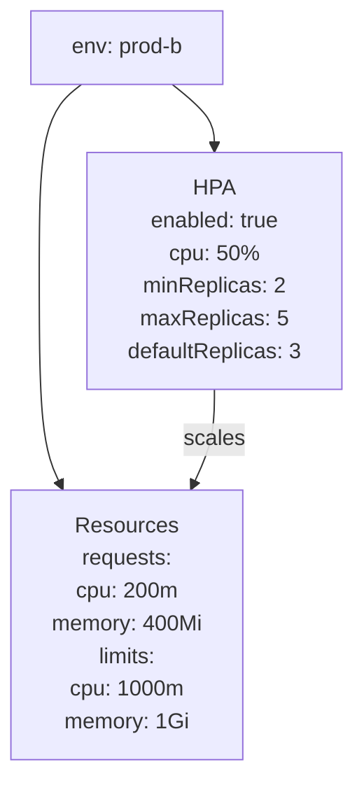
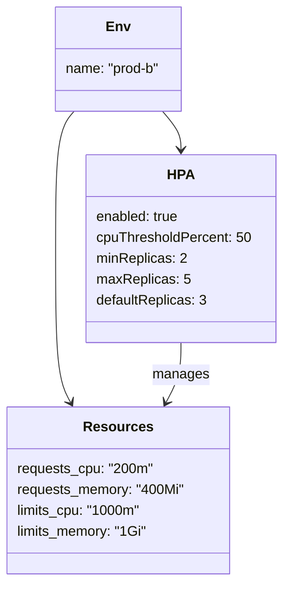

# Diagram: entity_core/entity_service/platform_applications/damage_submission_history_event/helm/profiles/values.prod-b.yaml

> Auto-generated by Obscura crawlers

## Diagram 1

### SVG

<svg id="container" width="358.5" xmlns="http://www.w3.org/2000/svg" class="flowchart" height="446" viewBox="0 0 358.5 446" role="graphics-document document" aria-roledescription="flowchart-v2"><g><marker id="container_flowchart-v2-pointEnd" class="marker flowchart-v2" viewBox="0 0 10 10" refX="5" refY="5" markerUnits="userSpaceOnUse" markerWidth="8" markerHeight="8" orient="auto"><path d="M 0 0 L 10 5 L 0 10 z" class="arrowMarkerPath" style="stroke-width: 1; stroke-dasharray: 1, 0;"></path></marker><marker id="container_flowchart-v2-pointStart" class="marker flowchart-v2" viewBox="0 0 10 10" refX="4.5" refY="5" markerUnits="userSpaceOnUse" markerWidth="8" markerHeight="8" orient="auto"><path d="M 0 5 L 10 10 L 10 0 z" class="arrowMarkerPath" style="stroke-width: 1; stroke-dasharray: 1, 0;"></path></marker><marker id="container_flowchart-v2-circleEnd" class="marker flowchart-v2" viewBox="0 0 10 10" refX="11" refY="5" markerUnits="userSpaceOnUse" markerWidth="11" markerHeight="11" orient="auto"><circle cx="5" cy="5" r="5" class="arrowMarkerPath" style="stroke-width: 1; stroke-dasharray: 1, 0;"></circle></marker><marker id="container_flowchart-v2-circleStart" class="marker flowchart-v2" viewBox="0 0 10 10" refX="-1" refY="5" markerUnits="userSpaceOnUse" markerWidth="11" markerHeight="11" orient="auto"><circle cx="5" cy="5" r="5" class="arrowMarkerPath" style="stroke-width: 1; stroke-dasharray: 1, 0;"></circle></marker><marker id="container_flowchart-v2-crossEnd" class="marker cross flowchart-v2" viewBox="0 0 11 11" refX="12" refY="5.2" markerUnits="userSpaceOnUse" markerWidth="11" markerHeight="11" orient="auto"><path d="M 1,1 l 9,9 M 10,1 l -9,9" class="arrowMarkerPath" style="stroke-width: 2; stroke-dasharray: 1, 0;"></path></marker><marker id="container_flowchart-v2-crossStart" class="marker cross flowchart-v2" viewBox="0 0 11 11" refX="-1" refY="5.2" markerUnits="userSpaceOnUse" markerWidth="11" markerHeight="11" orient="auto"><path d="M 1,1 l 9,9 M 10,1 l -9,9" class="arrowMarkerPath" style="stroke-width: 2; stroke-dasharray: 1, 0;"></path></marker><g class="root"><g class="clusters"></g><g class="edgePaths"><path d="M180.837,62L187.447,66.167C194.058,70.333,207.279,78.667,213.889,86.333C220.5,94,220.5,101,220.5,104.5L220.5,108" id="L_Env_HPA_0" class="edge-thickness-normal edge-pattern-solid edge-thickness-normal edge-pattern-solid flowchart-link" style=";" data-edge="true" data-et="edge" data-id="L_Env_HPA_0" data-points="W3sieCI6MTgwLjgzNjUzODQ2MTUzODQ1LCJ5Ijo2Mn0seyJ4IjoyMjAuNSwieSI6ODd9LHsieCI6MjIwLjUsInkiOjExMn1d" marker-end="url(#container_flowchart-v2-pointEnd)"></path><path d="M95.163,62L88.553,66.167C81.942,70.333,68.721,78.667,62.111,97.5C55.5,116.333,55.5,145.667,55.5,177C55.5,208.333,55.5,241.667,60.163,263.986C64.826,286.305,74.153,297.61,78.816,303.262L83.479,308.915" id="L_Env_Resources_0" class="edge-thickness-normal edge-pattern-solid edge-thickness-normal edge-pattern-solid flowchart-link" style=";" data-edge="true" data-et="edge" data-id="L_Env_Resources_0" data-points="W3sieCI6OTUuMTYzNDYxNTM4NDYxNTUsInkiOjYyfSx7IngiOjU1LjUsInkiOjg3fSx7IngiOjU1LjUsInkiOjE3NX0seyJ4Ijo1NS41LCJ5IjoyNzV9LHsieCI6ODYuMDI1LCJ5IjozMTJ9XQ==" marker-end="url(#container_flowchart-v2-pointEnd)"></path><path d="M220.5,238L220.5,244.167C220.5,250.333,220.5,262.667,215.837,274.486C211.174,286.305,201.847,297.61,197.184,303.262L192.521,308.915" id="L_HPA_Resources_0" class="edge-thickness-normal edge-pattern-solid edge-thickness-normal edge-pattern-solid flowchart-link" style=";" data-edge="true" data-et="edge" data-id="L_HPA_Resources_0" data-points="W3sieCI6MjIwLjUsInkiOjIzOH0seyJ4IjoyMjAuNSwieSI6Mjc1fSx7IngiOjE4OS45NzUsInkiOjMxMn1d" marker-end="url(#container_flowchart-v2-pointEnd)"></path></g><g class="edgeLabels"><g class="edgeLabel"><g class="label" data-id="L_Env_HPA_0" transform="translate(0, 0)"><foreignObject width="0" height="0">

</foreignObject></g></g><g class="edgeLabel"><g class="label" data-id="L_Env_Resources_0" transform="translate(0, 0)"><foreignObject width="0" height="0">

</foreignObject></g></g><g class="edgeLabel" transform="translate(220.5, 275)"><g class="label" data-id="L_HPA_Resources_0" transform="translate(-22.15625, -12)"><foreignObject width="44.3125" height="24">

scales

</foreignObject></g></g></g><g class="nodes"><g class="node default" id="flowchart-Env-0" transform="translate(138, 35)"><rect class="basic label-container" style="" x="-72.0390625" y="-27" width="144.078125" height="54"></rect><g class="label" style="" transform="translate(-42.0390625, -12)"><rect></rect><foreignObject width="84.078125" height="24">

env: prod-b

</foreignObject></g></g><g class="node default" id="flowchart-HPA-1" transform="translate(220.5, 175)"><rect class="basic label-container" style="" x="-130" y="-63" width="260" height="126"></rect><g class="label" style="" transform="translate(-100, -48)"><rect></rect><foreignObject width="200" height="96">

HPA\nenabled: true\ncpu: 50%\nminReplicas: 2\nmaxReplicas: 5\ndefaultReplicas: 3

</foreignObject></g></g><g class="node default" id="flowchart-Resources-2" transform="translate(138, 375)"><rect class="basic label-container" style="" x="-130" y="-63" width="260" height="126"></rect><g class="label" style="" transform="translate(-100, -48)"><rect></rect><foreignObject width="200" height="96">

Resources\nrequests:\n  cpu: 200m\n  memory: 400Mi\nlimits:\n  cpu: 1000m\n  memory: 1Gi

</foreignObject></g></g></g></g></g></svg>

## Diagram 2

### SVG

<svg id="container" width="323.66796875" xmlns="http://www.w3.org/2000/svg" class="classDiagram" height="668" viewBox="0 0 323.66796875 668" role="graphics-document document" aria-roledescription="class"><g><defs><marker id="container_class-aggregationStart" class="marker aggregation class" refX="18" refY="7" markerWidth="190" markerHeight="240" orient="auto"><path d="M 18,7 L9,13 L1,7 L9,1 Z"></path></marker></defs><defs><marker id="container_class-aggregationEnd" class="marker aggregation class" refX="1" refY="7" markerWidth="20" markerHeight="28" orient="auto"><path d="M 18,7 L9,13 L1,7 L9,1 Z"></path></marker></defs><defs><marker id="container_class-extensionStart" class="marker extension class" refX="18" refY="7" markerWidth="190" markerHeight="240" orient="auto"><path d="M 1,7 L18,13 V 1 Z"></path></marker></defs><defs><marker id="container_class-extensionEnd" class="marker extension class" refX="1" refY="7" markerWidth="20" markerHeight="28" orient="auto"><path d="M 1,1 V 13 L18,7 Z"></path></marker></defs><defs><marker id="container_class-compositionStart" class="marker composition class" refX="18" refY="7" markerWidth="190" markerHeight="240" orient="auto"><path d="M 18,7 L9,13 L1,7 L9,1 Z"></path></marker></defs><defs><marker id="container_class-compositionEnd" class="marker composition class" refX="1" refY="7" markerWidth="20" markerHeight="28" orient="auto"><path d="M 18,7 L9,13 L1,7 L9,1 Z"></path></marker></defs><defs><marker id="container_class-dependencyStart" class="marker dependency class" refX="6" refY="7" markerWidth="190" markerHeight="240" orient="auto"><path d="M 5,7 L9,13 L1,7 L9,1 Z"></path></marker></defs><defs><marker id="container_class-dependencyEnd" class="marker dependency class" refX="13" refY="7" markerWidth="20" markerHeight="28" orient="auto"><path d="M 18,7 L9,13 L14,7 L9,1 Z"></path></marker></defs><defs><marker id="container_class-lollipopStart" class="marker lollipop class" refX="13" refY="7" markerWidth="190" markerHeight="240" orient="auto"><circle stroke="black" fill="transparent" cx="7" cy="7" r="6"></circle></marker></defs><defs><marker id="container_class-lollipopEnd" class="marker lollipop class" refX="1" refY="7" markerWidth="190" markerHeight="240" orient="auto"><circle stroke="black" fill="transparent" cx="7" cy="7" r="6"></circle></marker></defs><g class="root"><g class="clusters"></g><g class="edgePaths"><path d="M186.182,128L189.696,132.167C193.211,136.333,200.24,144.667,203.755,152C207.27,159.333,207.27,165.667,207.27,168.833L207.27,172" id="id_Env_HPA_1" class="edge-thickness-normal edge-pattern-solid relation" style=";;;" data-edge="true" data-et="edge" data-id="id_Env_HPA_1" data-points="W3sieCI6MTg2LjE4MTUyNTczNTI5NDEyLCJ5IjoxMjh9LHsieCI6MjA3LjI2OTUzMTI1LCJ5IjoxNTN9LHsieCI6MjA3LjI2OTUzMTI1LCJ5IjoxNzh9XQ==" marker-end="url(#container_class-dependencyEnd)"></path><path d="M84.959,128L81.444,132.167C77.93,136.333,70.9,144.667,67.386,171C63.871,197.333,63.871,241.667,63.871,288C63.871,334.333,63.871,382.667,66.721,412.12C69.571,441.573,75.271,452.146,78.12,457.432L80.97,462.719" id="id_Env_Resources_2" class="edge-thickness-normal edge-pattern-solid relation" style=";;;" data-edge="true" data-et="edge" data-id="id_Env_Resources_2" data-points="W3sieCI6ODQuOTU5MDk5MjY0NzA1ODgsInkiOjEyOH0seyJ4Ijo2My44NzEwOTM3NSwieSI6MTUzfSx7IngiOjYzLjg3MTA5Mzc1LCJ5IjoyODZ9LHsieCI6NjMuODcxMDkzNzUsInkiOjQzMX0seyJ4Ijo4My44MTc0OTI5NTExMjc4MiwieSI6NDY4fV0=" marker-end="url(#container_class-dependencyEnd)"></path><path d="M207.27,394L207.27,400.167C207.27,406.333,207.27,418.667,204.42,430.12C201.57,441.573,195.87,452.146,193.02,457.432L190.17,462.719" id="id_HPA_Resources_3" class="edge-thickness-normal edge-pattern-solid relation" style=";;;" data-edge="true" data-et="edge" data-id="id_HPA_Resources_3" data-points="W3sieCI6MjA3LjI2OTUzMTI1LCJ5IjozOTR9LHsieCI6MjA3LjI2OTUzMTI1LCJ5Ijo0MzF9LHsieCI6MTg3LjMyMzEzMjA0ODg3MjIsInkiOjQ2OH1d" marker-end="url(#container_class-dependencyEnd)"></path></g><g class="edgeLabels"><g class="edgeLabel"><g class="label" data-id="id_Env_HPA_1" transform="translate(0, 0)"><foreignObject width="0" height="0">

</foreignObject></g></g><g class="edgeLabel"><g class="label" data-id="id_Env_Resources_2" transform="translate(0, 0)"><foreignObject width="0" height="0">

</foreignObject></g></g><g class="edgeLabel" transform="translate(207.26953125, 431)"><g class="label" data-id="id_HPA_Resources_3" transform="translate(-32.296875, -12)"><foreignObject width="64.59375" height="24">

manages

</foreignObject></g></g></g><g class="nodes"><g class="node default" id="classId-Env-0" transform="translate(135.5703125, 68)"><g class="basic label-container"><path d="M-74.03515625 -60 L74.03515625 -60 L74.03515625 60 L-74.03515625 60" stroke="none" stroke-width="0" fill="#ECECFF" style=""></path><path d="M-74.03515625 -60 C-22.323275645468875 -60, 29.38860495906225 -60, 74.03515625 -60 M-74.03515625 -60 C-24.11750042290972 -60, 25.800155404180558 -60, 74.03515625 -60 M74.03515625 -60 C74.03515625 -25.85669810792907, 74.03515625 8.28660378414186, 74.03515625 60 M74.03515625 -60 C74.03515625 -29.24505041385476, 74.03515625 1.5098991722904813, 74.03515625 60 M74.03515625 60 C23.002013259926436 60, -28.03112973014713 60, -74.03515625 60 M74.03515625 60 C43.29256118854609 60, 12.549966127092176 60, -74.03515625 60 M-74.03515625 60 C-74.03515625 25.433949745235793, -74.03515625 -9.132100509528414, -74.03515625 -60 M-74.03515625 60 C-74.03515625 31.842349028974812, -74.03515625 3.6846980579496247, -74.03515625 -60" stroke="#9370DB" stroke-width="1.3" fill="none" stroke-dasharray="0 0" style=""></path></g><g class="annotation-group text" transform="translate(0, -36)"></g><g class="label-group text" transform="translate(-12.8046875, -36)"><g class="label" style="font-weight: bolder" transform="translate(0,-12)"><foreignObject width="25.609375" height="24">

Env

</foreignObject></g></g><g class="members-group text" transform="translate(-62.03515625, 12)"><g class="label" style="" transform="translate(0,-12)"><foreignObject width="111.265625" height="24">

name: "prod-b"

</foreignObject></g></g><g class="methods-group text" transform="translate(-62.03515625, 60)"></g><g class="divider" style=""><path d="M-74.03515625 -12 C-33.43072671822285 -12, 7.1737028135543 -12, 74.03515625 -12 M-74.03515625 -12 C-31.942238716190033 -12, 10.150678817619934 -12, 74.03515625 -12" stroke="#9370DB" stroke-width="1.3" fill="none" stroke-dasharray="0 0" style=""></path></g><g class="divider" style=""><path d="M-74.03515625 36 C-23.48112440531378 36, 27.072907439372443 36, 74.03515625 36 M-74.03515625 36 C-25.27479750045388 36, 23.485561249092243 36, 74.03515625 36" stroke="#9370DB" stroke-width="1.3" fill="none" stroke-dasharray="0 0" style=""></path></g></g><g class="node default" id="classId-HPA-1" transform="translate(207.26953125, 286)"><g class="basic label-container"><path d="M-108.3984375 -108 L108.3984375 -108 L108.3984375 108 L-108.3984375 108" stroke="none" stroke-width="0" fill="#ECECFF" style=""></path><path d="M-108.3984375 -108 C-58.756158572752035 -108, -9.11387964550407 -108, 108.3984375 -108 M-108.3984375 -108 C-22.55966679532831 -108, 63.27910390934338 -108, 108.3984375 -108 M108.3984375 -108 C108.3984375 -28.07155355518441, 108.3984375 51.85689288963118, 108.3984375 108 M108.3984375 -108 C108.3984375 -23.074335624699785, 108.3984375 61.85132875060043, 108.3984375 108 M108.3984375 108 C43.26782363557568 108, -21.862790228848638 108, -108.3984375 108 M108.3984375 108 C31.801450182728374 108, -44.79553713454325 108, -108.3984375 108 M-108.3984375 108 C-108.3984375 60.89771129561996, -108.3984375 13.795422591239927, -108.3984375 -108 M-108.3984375 108 C-108.3984375 48.7005571226676, -108.3984375 -10.598885754664806, -108.3984375 -108" stroke="#9370DB" stroke-width="1.3" fill="none" stroke-dasharray="0 0" style=""></path></g><g class="annotation-group text" transform="translate(0, -84)"></g><g class="label-group text" transform="translate(-14.375, -84)"><g class="label" style="font-weight: bolder" transform="translate(0,-12)"><foreignObject width="28.75" height="24">

HPA

</foreignObject></g></g><g class="members-group text" transform="translate(-96.3984375, -36)"><g class="label" style="" transform="translate(0,-12)"><foreignObject width="97.265625" height="24">

enabled: true

</foreignObject></g><g class="label" style="" transform="translate(0,12)"><foreignObject width="178.421875" height="24">

cpuThresholdPercent: 50

</foreignObject></g><g class="label" style="" transform="translate(0,36)"><foreignObject width="103.96875" height="24">

minReplicas: 2

</foreignObject></g><g class="label" style="" transform="translate(0,60)"><foreignObject width="106.640625" height="24">

maxReplicas: 5

</foreignObject></g><g class="label" style="" transform="translate(0,84)"><foreignObject width="128.21875" height="24">

defaultReplicas: 3

</foreignObject></g></g><g class="methods-group text" transform="translate(-96.3984375, 108)"></g><g class="divider" style=""><path d="M-108.3984375 -60 C-41.331543730912955 -60, 25.73535003817409 -60, 108.3984375 -60 M-108.3984375 -60 C-34.09190522465212 -60, 40.21462705069575 -60, 108.3984375 -60" stroke="#9370DB" stroke-width="1.3" fill="none" stroke-dasharray="0 0" style=""></path></g><g class="divider" style=""><path d="M-108.3984375 84 C-46.14197258887366 84, 16.114492322252687 84, 108.3984375 84 M-108.3984375 84 C-48.02143492794523 84, 12.355567644109541 84, 108.3984375 84" stroke="#9370DB" stroke-width="1.3" fill="none" stroke-dasharray="0 0" style=""></path></g></g><g class="node default" id="classId-Resources-2" transform="translate(135.5703125, 564)"><g class="basic label-container"><path d="M-127.5703125 -96 L127.5703125 -96 L127.5703125 96 L-127.5703125 96" stroke="none" stroke-width="0" fill="#ECECFF" style=""></path><path d="M-127.5703125 -96 C-34.68006190246251 -96, 58.210188695074976 -96, 127.5703125 -96 M-127.5703125 -96 C-61.325624361871036 -96, 4.919063776257929 -96, 127.5703125 -96 M127.5703125 -96 C127.5703125 -46.79727797686296, 127.5703125 2.4054440462740843, 127.5703125 96 M127.5703125 -96 C127.5703125 -25.4424138103402, 127.5703125 45.1151723793196, 127.5703125 96 M127.5703125 96 C72.09904101883183 96, 16.62776953766364 96, -127.5703125 96 M127.5703125 96 C46.77442690030935 96, -34.0214586993813 96, -127.5703125 96 M-127.5703125 96 C-127.5703125 29.6392446023047, -127.5703125 -36.7215107953906, -127.5703125 -96 M-127.5703125 96 C-127.5703125 43.1708293545094, -127.5703125 -9.658341290981198, -127.5703125 -96" stroke="#9370DB" stroke-width="1.3" fill="none" stroke-dasharray="0 0" style=""></path></g><g class="annotation-group text" transform="translate(0, -72)"></g><g class="label-group text" transform="translate(-37.265625, -72)"><g class="label" style="font-weight: bolder" transform="translate(0,-12)"><foreignObject width="74.53125" height="24">

Resources

</foreignObject></g></g><g class="members-group text" transform="translate(-115.5703125, -24)"><g class="label" style="" transform="translate(0,-12)"><foreignObject width="157.0625" height="24">

requests_cpu: "200m"

</foreignObject></g><g class="label" style="" transform="translate(0,12)"><foreignObject width="193.875" height="24">

requests_memory: "400Mi"

</foreignObject></g><g class="label" style="" transform="translate(0,36)"><foreignObject width="142.9375" height="24">

limits_cpu: "1000m"

</foreignObject></g><g class="label" style="" transform="translate(0,60)"><foreignObject width="150.671875" height="24">

limits_memory: "1Gi"

</foreignObject></g></g><g class="methods-group text" transform="translate(-115.5703125, 96)"></g><g class="divider" style=""><path d="M-127.5703125 -48 C-54.97753108591522 -48, 17.615250328169566 -48, 127.5703125 -48 M-127.5703125 -48 C-56.145348468277604 -48, 15.279615563444793 -48, 127.5703125 -48" stroke="#9370DB" stroke-width="1.3" fill="none" stroke-dasharray="0 0" style=""></path></g><g class="divider" style=""><path d="M-127.5703125 72 C-73.6870933416059 72, -19.803874183211803 72, 127.5703125 72 M-127.5703125 72 C-50.28438359616726 72, 27.00154530766548 72, 127.5703125 72" stroke="#9370DB" stroke-width="1.3" fill="none" stroke-dasharray="0 0" style=""></path></g></g></g></g></g></svg>
