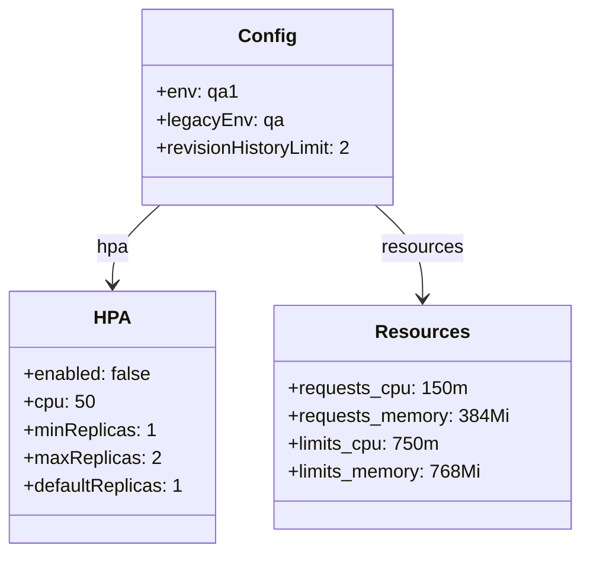

# Diagram: entity_core/entity_service/platform_applications/damage_submission_history_event/helm/profiles/values.qa1.yaml

> Auto-generated by Obscura crawlers

## Mermaid

### SVG

<svg id="container" width="489.46875" xmlns="http://www.w3.org/2000/svg" class="classDiagram" height="474" viewBox="0 0 489.46875 474" role="graphics-document document" aria-roledescription="class"><g><defs><marker id="container_class-aggregationStart" class="marker aggregation class" refX="18" refY="7" markerWidth="190" markerHeight="240" orient="auto"><path d="M 18,7 L9,13 L1,7 L9,1 Z"></path></marker></defs><defs><marker id="container_class-aggregationEnd" class="marker aggregation class" refX="1" refY="7" markerWidth="20" markerHeight="28" orient="auto"><path d="M 18,7 L9,13 L1,7 L9,1 Z"></path></marker></defs><defs><marker id="container_class-extensionStart" class="marker extension class" refX="18" refY="7" markerWidth="190" markerHeight="240" orient="auto"><path d="M 1,7 L18,13 V 1 Z"></path></marker></defs><defs><marker id="container_class-extensionEnd" class="marker extension class" refX="1" refY="7" markerWidth="20" markerHeight="28" orient="auto"><path d="M 1,1 V 13 L18,7 Z"></path></marker></defs><defs><marker id="container_class-compositionStart" class="marker composition class" refX="18" refY="7" markerWidth="190" markerHeight="240" orient="auto"><path d="M 18,7 L9,13 L1,7 L9,1 Z"></path></marker></defs><defs><marker id="container_class-compositionEnd" class="marker composition class" refX="1" refY="7" markerWidth="20" markerHeight="28" orient="auto"><path d="M 18,7 L9,13 L1,7 L9,1 Z"></path></marker></defs><defs><marker id="container_class-dependencyStart" class="marker dependency class" refX="6" refY="7" markerWidth="190" markerHeight="240" orient="auto"><path d="M 5,7 L9,13 L1,7 L9,1 Z"></path></marker></defs><defs><marker id="container_class-dependencyEnd" class="marker dependency class" refX="13" refY="7" markerWidth="20" markerHeight="28" orient="auto"><path d="M 18,7 L9,13 L14,7 L9,1 Z"></path></marker></defs><defs><marker id="container_class-lollipopStart" class="marker lollipop class" refX="13" refY="7" markerWidth="190" markerHeight="240" orient="auto"><circle stroke="black" fill="transparent" cx="7" cy="7" r="6"></circle></marker></defs><defs><marker id="container_class-lollipopEnd" class="marker lollipop class" refX="1" refY="7" markerWidth="190" markerHeight="240" orient="auto"><circle stroke="black" fill="transparent" cx="7" cy="7" r="6"></circle></marker></defs><g class="root"><g class="clusters"></g><g class="edgePaths"><path d="M134.775,176L128.106,182.167C121.436,188.333,108.097,200.667,101.427,212C94.758,223.333,94.758,233.667,94.758,238.833L94.758,244" id="id_Config_HPA_1" class="edge-thickness-normal edge-pattern-solid relation" style=";;;" data-edge="true" data-et="edge" data-id="id_Config_HPA_1" data-points="W3sieCI6MTM0Ljc3NTA1MTY1Mjg5MjU2LCJ5IjoxNzZ9LHsieCI6OTQuNzU3ODEyNSwieSI6MjEzfSx7IngiOjk0Ljc1NzgxMjUsInkiOjI1MH1d" marker-end="url(#container_class-dependencyEnd)"></path><path d="M316.475,176L323.144,182.167C329.814,188.333,343.153,200.667,349.823,214C356.492,227.333,356.492,241.667,356.492,248.833L356.492,256" id="id_Config_Resources_2" class="edge-thickness-normal edge-pattern-solid relation" style=";;;" data-edge="true" data-et="edge" data-id="id_Config_Resources_2" data-points="W3sieCI6MzE2LjQ3NDk0ODM0NzEwNzQ0LCJ5IjoxNzZ9LHsieCI6MzU2LjQ5MjE4NzUsInkiOjIxM30seyJ4IjozNTYuNDkyMTg3NSwieSI6MjYyfV0=" marker-end="url(#container_class-dependencyEnd)"></path></g><g class="edgeLabels"><g class="edgeLabel" transform="translate(94.7578125, 213)"><g class="label" data-id="id_Config_HPA_1" transform="translate(-13.71875, -12)"><foreignObject width="27.4375" height="24">

hpa

</foreignObject></g></g><g class="edgeLabel" transform="translate(356.4921875, 213)"><g class="label" data-id="id_Config_Resources_2" transform="translate(-34.8828125, -12)"><foreignObject width="69.765625" height="24">

resources

</foreignObject></g></g></g><g class="nodes"><g class="node default" id="classId-Config-0" transform="translate(225.625, 92)"><g class="basic label-container"><path d="M-108.34765625 -84 L108.34765625 -84 L108.34765625 84 L-108.34765625 84" stroke="none" stroke-width="0" fill="#ECECFF" style=""></path><path d="M-108.34765625 -84 C-42.05126026865494 -84, 24.245135712690114 -84, 108.34765625 -84 M-108.34765625 -84 C-39.020865869600314 -84, 30.30592451079937 -84, 108.34765625 -84 M108.34765625 -84 C108.34765625 -48.402624768915075, 108.34765625 -12.80524953783015, 108.34765625 84 M108.34765625 -84 C108.34765625 -36.34142182448294, 108.34765625 11.317156351034114, 108.34765625 84 M108.34765625 84 C47.316920464431625 84, -13.71381532113675 84, -108.34765625 84 M108.34765625 84 C32.1882181155712 84, -43.97122001885759 84, -108.34765625 84 M-108.34765625 84 C-108.34765625 22.227367878881466, -108.34765625 -39.54526424223707, -108.34765625 -84 M-108.34765625 84 C-108.34765625 23.01693489181185, -108.34765625 -37.9661302163763, -108.34765625 -84" stroke="#9370DB" stroke-width="1.3" fill="none" stroke-dasharray="0 0" style=""></path></g><g class="annotation-group text" transform="translate(0, -60)"></g><g class="label-group text" transform="translate(-22.9296875, -60)"><g class="label" style="font-weight: bolder" transform="translate(0,-12)"><foreignObject width="45.859375" height="24">

Config

</foreignObject></g></g><g class="members-group text" transform="translate(-96.34765625, -12)"><g class="label" style="" transform="translate(0,-12)"><foreignObject width="66.390625" height="24">

+env: qa1

</foreignObject></g><g class="label" style="" transform="translate(0,12)"><foreignObject width="105.515625" height="24">

+legacyEnv: qa

</foreignObject></g><g class="label" style="" transform="translate(0,36)"><foreignObject width="169.765625" height="24">

+revisionHistoryLimit: 2

</foreignObject></g></g><g class="methods-group text" transform="translate(-96.34765625, 84)"></g><g class="divider" style=""><path d="M-108.34765625 -36 C-38.17446384509158 -36, 31.99872855981684 -36, 108.34765625 -36 M-108.34765625 -36 C-44.1972475782386 -36, 19.953161093522795 -36, 108.34765625 -36" stroke="#9370DB" stroke-width="1.3" fill="none" stroke-dasharray="0 0" style=""></path></g><g class="divider" style=""><path d="M-108.34765625 60 C-63.994795119728494 60, -19.641933989456987 60, 108.34765625 60 M-108.34765625 60 C-31.710430243625467 60, 44.926795762749066 60, 108.34765625 60" stroke="#9370DB" stroke-width="1.3" fill="none" stroke-dasharray="0 0" style=""></path></g></g><g class="node default" id="classId-HPA-1" transform="translate(94.7578125, 358)"><g class="basic label-container"><path d="M-86.7578125 -108 L86.7578125 -108 L86.7578125 108 L-86.7578125 108" stroke="none" stroke-width="0" fill="#ECECFF" style=""></path><path d="M-86.7578125 -108 C-48.68549246603679 -108, -10.613172432073583 -108, 86.7578125 -108 M-86.7578125 -108 C-21.40247896285544 -108, 43.95285457428912 -108, 86.7578125 -108 M86.7578125 -108 C86.7578125 -35.387410762563334, 86.7578125 37.22517847487333, 86.7578125 108 M86.7578125 -108 C86.7578125 -34.31482656704111, 86.7578125 39.37034686591778, 86.7578125 108 M86.7578125 108 C25.87335223927031 108, -35.01110802145938 108, -86.7578125 108 M86.7578125 108 C32.506415575425216 108, -21.74498134914957 108, -86.7578125 108 M-86.7578125 108 C-86.7578125 48.67054531243731, -86.7578125 -10.658909375125376, -86.7578125 -108 M-86.7578125 108 C-86.7578125 45.69495045603521, -86.7578125 -16.610099087929584, -86.7578125 -108" stroke="#9370DB" stroke-width="1.3" fill="none" stroke-dasharray="0 0" style=""></path></g><g class="annotation-group text" transform="translate(0, -84)"></g><g class="label-group text" transform="translate(-14.375, -84)"><g class="label" style="font-weight: bolder" transform="translate(0,-12)"><foreignObject width="28.75" height="24">

HPA

</foreignObject></g></g><g class="members-group text" transform="translate(-74.7578125, -36)"><g class="label" style="" transform="translate(0,-12)"><foreignObject width="109.703125" height="24">

+enabled: false

</foreignObject></g><g class="label" style="" transform="translate(0,12)"><foreignObject width="59.484375" height="24">

+cpu: 50

</foreignObject></g><g class="label" style="" transform="translate(0,36)"><foreignObject width="110.96875" height="24">

+minReplicas: 1

</foreignObject></g><g class="label" style="" transform="translate(0,60)"><foreignObject width="114.53125" height="24">

+maxReplicas: 2

</foreignObject></g><g class="label" style="" transform="translate(0,84)"><foreignObject width="135.140625" height="24">

+defaultReplicas: 1

</foreignObject></g></g><g class="methods-group text" transform="translate(-74.7578125, 108)"></g><g class="divider" style=""><path d="M-86.7578125 -60 C-44.672254341232424 -60, -2.5866961824648484 -60, 86.7578125 -60 M-86.7578125 -60 C-23.517594428376455 -60, 39.72262364324709 -60, 86.7578125 -60" stroke="#9370DB" stroke-width="1.3" fill="none" stroke-dasharray="0 0" style=""></path></g><g class="divider" style=""><path d="M-86.7578125 84 C-27.575679210721177 84, 31.606454078557647 84, 86.7578125 84 M-86.7578125 84 C-45.00393012966782 84, -3.2500477593356436 84, 86.7578125 84" stroke="#9370DB" stroke-width="1.3" fill="none" stroke-dasharray="0 0" style=""></path></g></g><g class="node default" id="classId-Resources-2" transform="translate(356.4921875, 358)"><g class="basic label-container"><path d="M-124.9765625 -96 L124.9765625 -96 L124.9765625 96 L-124.9765625 96" stroke="none" stroke-width="0" fill="#ECECFF" style=""></path><path d="M-124.9765625 -96 C-74.98007160619385 -96, -24.983580712387692 -96, 124.9765625 -96 M-124.9765625 -96 C-35.9078162599823 -96, 53.160929980035405 -96, 124.9765625 -96 M124.9765625 -96 C124.9765625 -26.225946600062315, 124.9765625 43.54810679987537, 124.9765625 96 M124.9765625 -96 C124.9765625 -55.17002107537575, 124.9765625 -14.3400421507515, 124.9765625 96 M124.9765625 96 C55.824162462057615 96, -13.32823757588477 96, -124.9765625 96 M124.9765625 96 C66.97354381055783 96, 8.97052512111567 96, -124.9765625 96 M-124.9765625 96 C-124.9765625 25.229203496985434, -124.9765625 -45.54159300602913, -124.9765625 -96 M-124.9765625 96 C-124.9765625 42.616286492410865, -124.9765625 -10.76742701517827, -124.9765625 -96" stroke="#9370DB" stroke-width="1.3" fill="none" stroke-dasharray="0 0" style=""></path></g><g class="annotation-group text" transform="translate(0, -72)"></g><g class="label-group text" transform="translate(-37.265625, -72)"><g class="label" style="font-weight: bolder" transform="translate(0,-12)"><foreignObject width="74.53125" height="24">

Resources

</foreignObject></g></g><g class="members-group text" transform="translate(-112.9765625, -24)"><g class="label" style="" transform="translate(0,-12)"><foreignObject width="150.53125" height="24">

+requests_cpu: 150m

</foreignObject></g><g class="label" style="" transform="translate(0,12)"><foreignObject width="188.6875" height="24">

+requests_memory: 384Mi

</foreignObject></g><g class="label" style="" transform="translate(0,36)"><foreignObject width="128.40625" height="24">

+limits_cpu: 750m

</foreignObject></g><g class="label" style="" transform="translate(0,60)"><foreignObject width="165.390625" height="24">

+limits_memory: 768Mi

</foreignObject></g></g><g class="methods-group text" transform="translate(-112.9765625, 96)"></g><g class="divider" style=""><path d="M-124.9765625 -48 C-49.951955013320415 -48, 25.07265247335917 -48, 124.9765625 -48 M-124.9765625 -48 C-72.41539886861716 -48, -19.854235237234334 -48, 124.9765625 -48" stroke="#9370DB" stroke-width="1.3" fill="none" stroke-dasharray="0 0" style=""></path></g><g class="divider" style=""><path d="M-124.9765625 72 C-65.50517769240557 72, -6.033792884811135 72, 124.9765625 72 M-124.9765625 72 C-25.361146016934356 72, 74.25427046613129 72, 124.9765625 72" stroke="#9370DB" stroke-width="1.3" fill="none" stroke-dasharray="0 0" style=""></path></g></g></g></g></g></svg>
