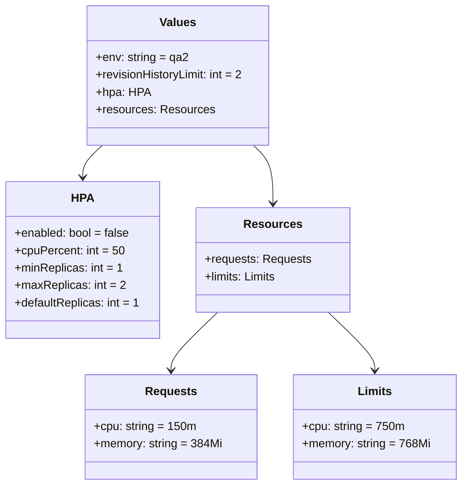
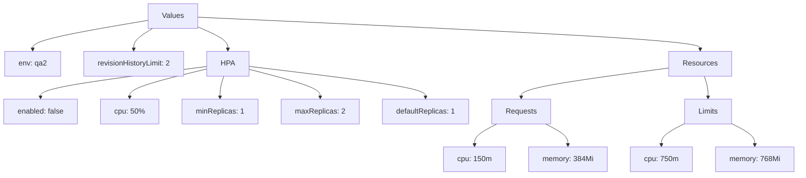

# Diagram: entity_core/entity_service/platform_applications/damage_submission_history_event/helm/profiles/values.qa2.yaml

> Auto-generated by Obscura crawlers

## Diagram 1

### SVG

<svg id="container" width="628.2734375" xmlns="http://www.w3.org/2000/svg" class="classDiagram" height="668" viewBox="0 0 628.2734375 668" role="graphics-document document" aria-roledescription="class"><g><defs><marker id="container_class-aggregationStart" class="marker aggregation class" refX="18" refY="7" markerWidth="190" markerHeight="240" orient="auto"><path d="M 18,7 L9,13 L1,7 L9,1 Z"></path></marker></defs><defs><marker id="container_class-aggregationEnd" class="marker aggregation class" refX="1" refY="7" markerWidth="20" markerHeight="28" orient="auto"><path d="M 18,7 L9,13 L1,7 L9,1 Z"></path></marker></defs><defs><marker id="container_class-extensionStart" class="marker extension class" refX="18" refY="7" markerWidth="190" markerHeight="240" orient="auto"><path d="M 1,7 L18,13 V 1 Z"></path></marker></defs><defs><marker id="container_class-extensionEnd" class="marker extension class" refX="1" refY="7" markerWidth="20" markerHeight="28" orient="auto"><path d="M 1,1 V 13 L18,7 Z"></path></marker></defs><defs><marker id="container_class-compositionStart" class="marker composition class" refX="18" refY="7" markerWidth="190" markerHeight="240" orient="auto"><path d="M 18,7 L9,13 L1,7 L9,1 Z"></path></marker></defs><defs><marker id="container_class-compositionEnd" class="marker composition class" refX="1" refY="7" markerWidth="20" markerHeight="28" orient="auto"><path d="M 18,7 L9,13 L1,7 L9,1 Z"></path></marker></defs><defs><marker id="container_class-dependencyStart" class="marker dependency class" refX="6" refY="7" markerWidth="190" markerHeight="240" orient="auto"><path d="M 5,7 L9,13 L1,7 L9,1 Z"></path></marker></defs><defs><marker id="container_class-dependencyEnd" class="marker dependency class" refX="13" refY="7" markerWidth="20" markerHeight="28" orient="auto"><path d="M 18,7 L9,13 L14,7 L9,1 Z"></path></marker></defs><defs><marker id="container_class-lollipopStart" class="marker lollipop class" refX="13" refY="7" markerWidth="190" markerHeight="240" orient="auto"><circle stroke="black" fill="transparent" cx="7" cy="7" r="6"></circle></marker></defs><defs><marker id="container_class-lollipopEnd" class="marker lollipop class" refX="1" refY="7" markerWidth="190" markerHeight="240" orient="auto"><circle stroke="black" fill="transparent" cx="7" cy="7" r="6"></circle></marker></defs><g class="root"><g class="clusters"></g><g class="edgePaths"><path d="M139.492,200L135.048,204.167C130.604,208.333,121.716,216.667,117.272,224C112.828,231.333,112.828,237.667,112.828,240.833L112.828,244" id="id_Values_HPA_1" class="edge-thickness-normal edge-pattern-solid relation" style=";;;" data-edge="true" data-et="edge" data-id="id_Values_HPA_1" data-points="W3sieCI6MTM5LjQ5MTUwOTU1NTc4NTExLCJ5IjoyMDB9LHsieCI6MTEyLjgyODEyNSwieSI6MjI1fSx7IngiOjExMi44MjgxMjUsInkiOjI1MH1d" marker-end="url(#container_class-dependencyEnd)"></path><path d="M344.266,200L348.71,204.167C353.154,208.333,362.042,216.667,366.486,230C370.93,243.333,370.93,261.667,370.93,270.833L370.93,280" id="id_Values_Resources_2" class="edge-thickness-normal edge-pattern-solid relation" style=";;;" data-edge="true" data-et="edge" data-id="id_Values_Resources_2" data-points="W3sieCI6MzQ0LjI2NjMwMjk0NDIxNDksInkiOjIwMH0seyJ4IjozNzAuOTI5Njg3NSwieSI6MjI1fSx7IngiOjM3MC45Mjk2ODc1LCJ5IjoyODZ9XQ==" marker-end="url(#container_class-dependencyEnd)"></path><path d="M295.808,430L285.201,440.167C274.594,450.333,253.379,470.667,242.771,484C232.164,497.333,232.164,503.667,232.164,506.833L232.164,510" id="id_Resources_Requests_3" class="edge-thickness-normal edge-pattern-solid relation" style=";;;" data-edge="true" data-et="edge" data-id="id_Resources_Requests_3" data-points="W3sieCI6Mjk1LjgwODQ0Njg5ODQ5NjI0LCJ5Ijo0MzB9LHsieCI6MjMyLjE2NDA2MjUsInkiOjQ5MX0seyJ4IjoyMzIuMTY0MDYyNSwieSI6NTE2fV0=" marker-end="url(#container_class-dependencyEnd)"></path><path d="M446.051,430L456.658,440.167C467.266,450.333,488.481,470.667,499.088,484C509.695,497.333,509.695,503.667,509.695,506.833L509.695,510" id="id_Resources_Limits_4" class="edge-thickness-normal edge-pattern-solid relation" style=";;;" data-edge="true" data-et="edge" data-id="id_Resources_Limits_4" data-points="W3sieCI6NDQ2LjA1MDkyODEwMTUwMzc2LCJ5Ijo0MzB9LHsieCI6NTA5LjY5NTMxMjUsInkiOjQ5MX0seyJ4Ijo1MDkuNjk1MzEyNSwieSI6NTE2fV0=" marker-end="url(#container_class-dependencyEnd)"></path></g><g class="edgeLabels"><g class="edgeLabel"><g class="label" data-id="id_Values_HPA_1" transform="translate(0, 0)"><foreignObject width="0" height="0">

</foreignObject></g></g><g class="edgeLabel"><g class="label" data-id="id_Values_Resources_2" transform="translate(0, 0)"><foreignObject width="0" height="0">

</foreignObject></g></g><g class="edgeLabel"><g class="label" data-id="id_Resources_Requests_3" transform="translate(0, 0)"><foreignObject width="0" height="0">

</foreignObject></g></g><g class="edgeLabel"><g class="label" data-id="id_Resources_Limits_4" transform="translate(0, 0)"><foreignObject width="0" height="0">

</foreignObject></g></g></g><g class="nodes"><g class="node default" id="classId-Values-0" transform="translate(241.87890625, 104)"><g class="basic label-container"><path d="M-126.84375 -96 L126.84375 -96 L126.84375 96 L-126.84375 96" stroke="none" stroke-width="0" fill="#ECECFF" style=""></path><path d="M-126.84375 -96 C-29.893729628050934 -96, 67.05629074389813 -96, 126.84375 -96 M-126.84375 -96 C-47.689603744030194 -96, 31.464542511939612 -96, 126.84375 -96 M126.84375 -96 C126.84375 -30.17134842106742, 126.84375 35.65730315786516, 126.84375 96 M126.84375 -96 C126.84375 -43.94226175170344, 126.84375 8.115476496593118, 126.84375 96 M126.84375 96 C31.599796857540937 96, -63.644156284918125 96, -126.84375 96 M126.84375 96 C63.87778733419309 96, 0.9118246683861742 96, -126.84375 96 M-126.84375 96 C-126.84375 27.562765075915223, -126.84375 -40.874469848169554, -126.84375 -96 M-126.84375 96 C-126.84375 41.85535375451311, -126.84375 -12.289292490973779, -126.84375 -96" stroke="#9370DB" stroke-width="1.3" fill="none" stroke-dasharray="0 0" style=""></path></g><g class="annotation-group text" transform="translate(0, -72)"></g><g class="label-group text" transform="translate(-23.78125, -72)"><g class="label" style="font-weight: bolder" transform="translate(0,-12)"><foreignObject width="47.5625" height="24">

Values

</foreignObject></g></g><g class="members-group text" transform="translate(-114.84375, -24)"><g class="label" style="" transform="translate(0,-12)"><foreignObject width="126.296875" height="24">

+env: string = qa2

</foreignObject></g><g class="label" style="" transform="translate(0,12)"><foreignObject width="205.90625" height="24">

+revisionHistoryLimit: int = 2

</foreignObject></g><g class="label" style="" transform="translate(0,36)"><foreignObject width="71.875" height="24">

+hpa: HPA

</foreignObject></g><g class="label" style="" transform="translate(0,60)"><foreignObject width="159.34375" height="24">

+resources: Resources

</foreignObject></g></g><g class="methods-group text" transform="translate(-114.84375, 96)"></g><g class="divider" style=""><path d="M-126.84375 -48 C-33.82661191328232 -48, 59.19052617343536 -48, 126.84375 -48 M-126.84375 -48 C-40.6757973585877 -48, 45.4921552828246 -48, 126.84375 -48" stroke="#9370DB" stroke-width="1.3" fill="none" stroke-dasharray="0 0" style=""></path></g><g class="divider" style=""><path d="M-126.84375 72 C-40.83924049642897 72, 45.16526900714206 72, 126.84375 72 M-126.84375 72 C-37.3405420986778 72, 52.1626658026444 72, 126.84375 72" stroke="#9370DB" stroke-width="1.3" fill="none" stroke-dasharray="0 0" style=""></path></g></g><g class="node default" id="classId-HPA-1" transform="translate(112.828125, 358)"><g class="basic label-container"><path d="M-104.828125 -108 L104.828125 -108 L104.828125 108 L-104.828125 108" stroke="none" stroke-width="0" fill="#ECECFF" style=""></path><path d="M-104.828125 -108 C-31.18883185961691 -108, 42.45046128076618 -108, 104.828125 -108 M-104.828125 -108 C-47.08403592870546 -108, 10.660053142589078 -108, 104.828125 -108 M104.828125 -108 C104.828125 -26.782475566163555, 104.828125 54.43504886767289, 104.828125 108 M104.828125 -108 C104.828125 -59.86628243187525, 104.828125 -11.732564863750497, 104.828125 108 M104.828125 108 C53.37700054884885 108, 1.9258760976976959 108, -104.828125 108 M104.828125 108 C26.8922601197997 108, -51.0436047604006 108, -104.828125 108 M-104.828125 108 C-104.828125 43.23635877624204, -104.828125 -21.527282447515915, -104.828125 -108 M-104.828125 108 C-104.828125 63.00652428256464, -104.828125 18.01304856512928, -104.828125 -108" stroke="#9370DB" stroke-width="1.3" fill="none" stroke-dasharray="0 0" style=""></path></g><g class="annotation-group text" transform="translate(0, -84)"></g><g class="label-group text" transform="translate(-14.375, -84)"><g class="label" style="font-weight: bolder" transform="translate(0,-12)"><foreignObject width="28.75" height="24">

HPA

</foreignObject></g></g><g class="members-group text" transform="translate(-92.828125, -36)"><g class="label" style="" transform="translate(0,-12)"><foreignObject width="159.0625" height="24">

+enabled: bool = false

</foreignObject></g><g class="label" style="" transform="translate(0,12)"><foreignObject width="150.125" height="24">

+cpuPercent: int = 50

</foreignObject></g><g class="label" style="" transform="translate(0,36)"><foreignObject width="147.109375" height="24">

+minReplicas: int = 1

</foreignObject></g><g class="label" style="" transform="translate(0,60)"><foreignObject width="150.6875" height="24">

+maxReplicas: int = 2

</foreignObject></g><g class="label" style="" transform="translate(0,84)"><foreignObject width="171.28125" height="24">

+defaultReplicas: int = 1

</foreignObject></g></g><g class="methods-group text" transform="translate(-92.828125, 108)"></g><g class="divider" style=""><path d="M-104.828125 -60 C-38.57784190636245 -60, 27.672441187275098 -60, 104.828125 -60 M-104.828125 -60 C-47.40903080978219 -60, 10.010063380435625 -60, 104.828125 -60" stroke="#9370DB" stroke-width="1.3" fill="none" stroke-dasharray="0 0" style=""></path></g><g class="divider" style=""><path d="M-104.828125 84 C-57.38022145354365 84, -9.932317907087295 84, 104.828125 84 M-104.828125 84 C-47.14829613735527 84, 10.531532725289466 84, 104.828125 84" stroke="#9370DB" stroke-width="1.3" fill="none" stroke-dasharray="0 0" style=""></path></g></g><g class="node default" id="classId-Resources-2" transform="translate(370.9296875, 358)"><g class="basic label-container"><path d="M-103.2734375 -72 L103.2734375 -72 L103.2734375 72 L-103.2734375 72" stroke="none" stroke-width="0" fill="#ECECFF" style=""></path><path d="M-103.2734375 -72 C-43.02252742208511 -72, 17.228382655829776 -72, 103.2734375 -72 M-103.2734375 -72 C-39.550783796780145 -72, 24.17186990643971 -72, 103.2734375 -72 M103.2734375 -72 C103.2734375 -22.600924051508393, 103.2734375 26.798151896983214, 103.2734375 72 M103.2734375 -72 C103.2734375 -19.733688135700845, 103.2734375 32.53262372859831, 103.2734375 72 M103.2734375 72 C46.449797374388 72, -10.373842751224004 72, -103.2734375 72 M103.2734375 72 C56.92844171320037 72, 10.583445926400742 72, -103.2734375 72 M-103.2734375 72 C-103.2734375 15.034627048645817, -103.2734375 -41.93074590270837, -103.2734375 -72 M-103.2734375 72 C-103.2734375 24.369668504597534, -103.2734375 -23.26066299080493, -103.2734375 -72" stroke="#9370DB" stroke-width="1.3" fill="none" stroke-dasharray="0 0" style=""></path></g><g class="annotation-group text" transform="translate(0, -48)"></g><g class="label-group text" transform="translate(-37.265625, -48)"><g class="label" style="font-weight: bolder" transform="translate(0,-12)"><foreignObject width="74.53125" height="24">

Resources

</foreignObject></g></g><g class="members-group text" transform="translate(-91.2734375, 0)"><g class="label" style="" transform="translate(0,-12)"><foreignObject width="145.28125" height="24">

+requests: Requests

</foreignObject></g><g class="label" style="" transform="translate(0,12)"><foreignObject width="100.703125" height="24">

+limits: Limits

</foreignObject></g></g><g class="methods-group text" transform="translate(-91.2734375, 72)"></g><g class="divider" style=""><path d="M-103.2734375 -24 C-40.27686100467899 -24, 22.719715490642017 -24, 103.2734375 -24 M-103.2734375 -24 C-38.448213833761685 -24, 26.37700983247663 -24, 103.2734375 -24" stroke="#9370DB" stroke-width="1.3" fill="none" stroke-dasharray="0 0" style=""></path></g><g class="divider" style=""><path d="M-103.2734375 48 C-51.735833785526545 48, -0.19823007105308932 48, 103.2734375 48 M-103.2734375 48 C-33.51365005042943 48, 36.24613739914113 48, 103.2734375 48" stroke="#9370DB" stroke-width="1.3" fill="none" stroke-dasharray="0 0" style=""></path></g></g><g class="node default" id="classId-Requests-3" transform="translate(232.1640625, 588)"><g class="basic label-container"><path d="M-116.953125 -72 L116.953125 -72 L116.953125 72 L-116.953125 72" stroke="none" stroke-width="0" fill="#ECECFF" style=""></path><path d="M-116.953125 -72 C-55.74843784609403 -72, 5.4562493078119445 -72, 116.953125 -72 M-116.953125 -72 C-63.96633435132124 -72, -10.979543702642474 -72, 116.953125 -72 M116.953125 -72 C116.953125 -26.538593540730574, 116.953125 18.922812918538853, 116.953125 72 M116.953125 -72 C116.953125 -23.631485848088772, 116.953125 24.737028303822456, 116.953125 72 M116.953125 72 C65.2057142395449 72, 13.458303479089821 72, -116.953125 72 M116.953125 72 C44.90721000503312 72, -27.138704989933757 72, -116.953125 72 M-116.953125 72 C-116.953125 19.484341875834133, -116.953125 -33.031316248331734, -116.953125 -72 M-116.953125 72 C-116.953125 38.64927112461606, -116.953125 5.2985422492321135, -116.953125 -72" stroke="#9370DB" stroke-width="1.3" fill="none" stroke-dasharray="0 0" style=""></path></g><g class="annotation-group text" transform="translate(0, -48)"></g><g class="label-group text" transform="translate(-33.84375, -48)"><g class="label" style="font-weight: bolder" transform="translate(0,-12)"><foreignObject width="67.6875" height="24">

Requests

</foreignObject></g></g><g class="members-group text" transform="translate(-104.953125, 0)"><g class="label" style="" transform="translate(0,-12)"><foreignObject width="138.234375" height="24">

+cpu: string = 150m

</foreignObject></g><g class="label" style="" transform="translate(0,12)"><foreignObject width="176.0625" height="24">

+memory: string = 384Mi

</foreignObject></g></g><g class="methods-group text" transform="translate(-104.953125, 72)"></g><g class="divider" style=""><path d="M-116.953125 -24 C-46.31669350916573 -24, 24.31973798166854 -24, 116.953125 -24 M-116.953125 -24 C-39.28372236982047 -24, 38.38568026035907 -24, 116.953125 -24" stroke="#9370DB" stroke-width="1.3" fill="none" stroke-dasharray="0 0" style=""></path></g><g class="divider" style=""><path d="M-116.953125 48 C-36.113674580177474 48, 44.72577583964505 48, 116.953125 48 M-116.953125 48 C-67.14453049509939 48, -17.335935990198777 48, 116.953125 48" stroke="#9370DB" stroke-width="1.3" fill="none" stroke-dasharray="0 0" style=""></path></g></g><g class="node default" id="classId-Limits-4" transform="translate(509.6953125, 588)"><g class="basic label-container"><path d="M-110.578125 -72 L110.578125 -72 L110.578125 72 L-110.578125 72" stroke="none" stroke-width="0" fill="#ECECFF" style=""></path><path d="M-110.578125 -72 C-31.268408878404657 -72, 48.04130724319069 -72, 110.578125 -72 M-110.578125 -72 C-59.846534665316234 -72, -9.114944330632468 -72, 110.578125 -72 M110.578125 -72 C110.578125 -23.877964964227786, 110.578125 24.244070071544428, 110.578125 72 M110.578125 -72 C110.578125 -37.659619105192455, 110.578125 -3.31923821038491, 110.578125 72 M110.578125 72 C51.94252696267904 72, -6.693071074641921 72, -110.578125 72 M110.578125 72 C31.76878866191798 72, -47.04054767616404 72, -110.578125 72 M-110.578125 72 C-110.578125 41.86065287739116, -110.578125 11.721305754782314, -110.578125 -72 M-110.578125 72 C-110.578125 25.568948171318937, -110.578125 -20.862103657362127, -110.578125 -72" stroke="#9370DB" stroke-width="1.3" fill="none" stroke-dasharray="0 0" style=""></path></g><g class="annotation-group text" transform="translate(0, -48)"></g><g class="label-group text" transform="translate(-22.328125, -48)"><g class="label" style="font-weight: bolder" transform="translate(0,-12)"><foreignObject width="44.65625" height="24">

Limits

</foreignObject></g></g><g class="members-group text" transform="translate(-98.578125, 0)"><g class="label" style="" transform="translate(0,-12)"><foreignObject width="138.171875" height="24">

+cpu: string = 750m

</foreignObject></g><g class="label" style="" transform="translate(0,12)"><foreignObject width="174.828125" height="24">

+memory: string = 768Mi

</foreignObject></g></g><g class="methods-group text" transform="translate(-98.578125, 72)"></g><g class="divider" style=""><path d="M-110.578125 -24 C-65.99407430675919 -24, -21.410023613518376 -24, 110.578125 -24 M-110.578125 -24 C-28.70872691557257 -24, 53.16067116885486 -24, 110.578125 -24" stroke="#9370DB" stroke-width="1.3" fill="none" stroke-dasharray="0 0" style=""></path></g><g class="divider" style=""><path d="M-110.578125 48 C-30.491016274922544 48, 49.59609245015491 48, 110.578125 48 M-110.578125 48 C-39.143764514211824 48, 32.29059597157635 48, 110.578125 48" stroke="#9370DB" stroke-width="1.3" fill="none" stroke-dasharray="0 0" style=""></path></g></g></g></g></g></svg>

## Diagram 2

### SVG

<svg id="container" width="1718.6796875" xmlns="http://www.w3.org/2000/svg" class="flowchart" height="382" viewBox="0 0 1718.6796875 382" role="graphics-document document" aria-roledescription="flowchart-v2"><g><marker id="container_flowchart-v2-pointEnd" class="marker flowchart-v2" viewBox="0 0 10 10" refX="5" refY="5" markerUnits="userSpaceOnUse" markerWidth="8" markerHeight="8" orient="auto"><path d="M 0 0 L 10 5 L 0 10 z" class="arrowMarkerPath" style="stroke-width: 1; stroke-dasharray: 1, 0;"></path></marker><marker id="container_flowchart-v2-pointStart" class="marker flowchart-v2" viewBox="0 0 10 10" refX="4.5" refY="5" markerUnits="userSpaceOnUse" markerWidth="8" markerHeight="8" orient="auto"><path d="M 0 5 L 10 10 L 10 0 z" class="arrowMarkerPath" style="stroke-width: 1; stroke-dasharray: 1, 0;"></path></marker><marker id="container_flowchart-v2-circleEnd" class="marker flowchart-v2" viewBox="0 0 10 10" refX="11" refY="5" markerUnits="userSpaceOnUse" markerWidth="11" markerHeight="11" orient="auto"><circle cx="5" cy="5" r="5" class="arrowMarkerPath" style="stroke-width: 1; stroke-dasharray: 1, 0;"></circle></marker><marker id="container_flowchart-v2-circleStart" class="marker flowchart-v2" viewBox="0 0 10 10" refX="-1" refY="5" markerUnits="userSpaceOnUse" markerWidth="11" markerHeight="11" orient="auto"><circle cx="5" cy="5" r="5" class="arrowMarkerPath" style="stroke-width: 1; stroke-dasharray: 1, 0;"></circle></marker><marker id="container_flowchart-v2-crossEnd" class="marker cross flowchart-v2" viewBox="0 0 11 11" refX="12" refY="5.2" markerUnits="userSpaceOnUse" markerWidth="11" markerHeight="11" orient="auto"><path d="M 1,1 l 9,9 M 10,1 l -9,9" class="arrowMarkerPath" style="stroke-width: 2; stroke-dasharray: 1, 0;"></path></marker><marker id="container_flowchart-v2-crossStart" class="marker cross flowchart-v2" viewBox="0 0 11 11" refX="-1" refY="5.2" markerUnits="userSpaceOnUse" markerWidth="11" markerHeight="11" orient="auto"><path d="M 1,1 l 9,9 M 10,1 l -9,9" class="arrowMarkerPath" style="stroke-width: 2; stroke-dasharray: 1, 0;"></path></marker><g class="root"><g class="clusters"></g><g class="edgePaths"><path d="M319.887,44.15L278.132,51.292C236.376,58.434,152.866,72.717,111.111,83.358C69.355,94,69.355,101,69.355,104.5L69.355,108" id="L_V_ENV_0" class="edge-thickness-normal edge-pattern-solid edge-thickness-normal edge-pattern-solid flowchart-link" style=";" data-edge="true" data-et="edge" data-id="L_V_ENV_0" data-points="W3sieCI6MzE5Ljg4NjcxODc1LCJ5Ijo0NC4xNTAzNzUxNjcwMjY0Mn0seyJ4Ijo2OS4zNTU0Njg3NSwieSI6ODd9LHsieCI6NjkuMzU1NDY4NzUsInkiOjExMn1d" marker-end="url(#container_flowchart-v2-pointEnd)"></path><path d="M330.27,62L323.617,66.167C316.963,70.333,303.655,78.667,297.001,86.333C290.348,94,290.348,101,290.348,104.5L290.348,108" id="L_V_REV_0" class="edge-thickness-normal edge-pattern-solid edge-thickness-normal edge-pattern-solid flowchart-link" style=";" data-edge="true" data-et="edge" data-id="L_V_REV_0" data-points="W3sieCI6MzMwLjI3MDI4MjQ1MTkyMzEsInkiOjYyfSx7IngiOjI5MC4zNDc2NTYyNSwieSI6ODd9LHsieCI6MjkwLjM0NzY1NjI1LCJ5IjoxMTJ9XQ==" marker-end="url(#container_flowchart-v2-pointEnd)"></path><path d="M426.887,57.795L438.311,62.662C449.736,67.53,472.585,77.265,484.009,85.632C495.434,94,495.434,101,495.434,104.5L495.434,108" id="L_V_H_0" class="edge-thickness-normal edge-pattern-solid edge-thickness-normal edge-pattern-solid flowchart-link" style=";" data-edge="true" data-et="edge" data-id="L_V_H_0" data-points="W3sieCI6NDI2Ljg4NjcxODc1LCJ5Ijo1Ny43OTQ1MjA1NDc5NDUyMDR9LHsieCI6NDk1LjQzMzU5Mzc1LCJ5Ijo4N30seyJ4Ijo0OTUuNDMzNTkzNzUsInkiOjExMn1d" marker-end="url(#container_flowchart-v2-pointEnd)"></path><path d="M451.238,144.652L390.842,152.377C330.445,160.102,209.652,175.551,149.256,186.775C88.859,198,88.859,205,88.859,208.5L88.859,212" id="L_H_HE_0" class="edge-thickness-normal edge-pattern-solid edge-thickness-normal edge-pattern-solid flowchart-link" style=";" data-edge="true" data-et="edge" data-id="L_H_HE_0" data-points="W3sieCI6NDUxLjIzODI4MTI1LCJ5IjoxNDQuNjUyNDg4ODc5MDY3Njh9LHsieCI6ODguODU5Mzc1LCJ5IjoxOTF9LHsieCI6ODguODU5Mzc1LCJ5IjoyMTZ9XQ==" marker-end="url(#container_flowchart-v2-pointEnd)"></path><path d="M451.238,149.771L423.045,156.643C394.852,163.514,338.465,177.257,310.271,187.629C282.078,198,282.078,205,282.078,208.5L282.078,212" id="L_H_HC_0" class="edge-thickness-normal edge-pattern-solid edge-thickness-normal edge-pattern-solid flowchart-link" style=";" data-edge="true" data-et="edge" data-id="L_H_HC_0" data-points="W3sieCI6NDUxLjIzODI4MTI1LCJ5IjoxNDkuNzcxNDg5Nzc0NjIwNTZ9LHsieCI6MjgyLjA3ODEyNSwieSI6MTkxfSx7IngiOjI4Mi4wNzgxMjUsInkiOjIxNn1d" marker-end="url(#container_flowchart-v2-pointEnd)"></path><path d="M485.307,166L483.744,170.167C482.181,174.333,479.055,182.667,477.493,190.333C475.93,198,475.93,205,475.93,208.5L475.93,212" id="L_H_HMIN_0" class="edge-thickness-normal edge-pattern-solid edge-thickness-normal edge-pattern-solid flowchart-link" style=";" data-edge="true" data-et="edge" data-id="L_H_HMIN_0" data-points="W3sieCI6NDg1LjMwNjU2NTUwNDgwNzcsInkiOjE2Nn0seyJ4Ijo0NzUuOTI5Njg3NSwieSI6MTkxfSx7IngiOjQ3NS45Mjk2ODc1LCJ5IjoyMTZ9XQ==" marker-end="url(#container_flowchart-v2-pointEnd)"></path><path d="M539.629,150.77L564.807,157.475C589.984,164.18,640.34,177.59,665.518,187.795C690.695,198,690.695,205,690.695,208.5L690.695,212" id="L_H_HMAX_0" class="edge-thickness-normal edge-pattern-solid edge-thickness-normal edge-pattern-solid flowchart-link" style=";" data-edge="true" data-et="edge" data-id="L_H_HMAX_0" data-points="W3sieCI6NTM5LjYyODkwNjI1LCJ5IjoxNTAuNzY5NjIwMTAxMjI2M30seyJ4Ijo2OTAuNjk1MzEyNSwieSI6MTkxfSx7IngiOjY5MC42OTUzMTI1LCJ5IjoyMTZ9XQ==" marker-end="url(#container_flowchart-v2-pointEnd)"></path><path d="M539.629,144.444L602.615,152.204C665.602,159.963,791.574,175.481,854.561,186.741C917.547,198,917.547,205,917.547,208.5L917.547,212" id="L_H_HDEF_0" class="edge-thickness-normal edge-pattern-solid edge-thickness-normal edge-pattern-solid flowchart-link" style=";" data-edge="true" data-et="edge" data-id="L_H_HDEF_0" data-points="W3sieCI6NTM5LjYyODkwNjI1LCJ5IjoxNDQuNDQ0NDA2NDAwMDg4ODR9LHsieCI6OTE3LjU0Njg3NSwieSI6MTkxfSx7IngiOjkxNy41NDY4NzUsInkiOjIxNn1d" marker-end="url(#container_flowchart-v2-pointEnd)"></path><path d="M426.887,37.456L606.786,45.713C786.686,53.97,1146.486,70.485,1326.385,82.243C1506.285,94,1506.285,101,1506.285,104.5L1506.285,108" id="L_V_R_0" class="edge-thickness-normal edge-pattern-solid edge-thickness-normal edge-pattern-solid flowchart-link" style=";" data-edge="true" data-et="edge" data-id="L_V_R_0" data-points="W3sieCI6NDI2Ljg4NjcxODc1LCJ5IjozNy40NTU2NDgxOTIyMDYxMDV9LHsieCI6MTUwNi4yODUxNTYyNSwieSI6ODd9LHsieCI6MTUwNi4yODUxNTYyNSwieSI6MTEyfV0=" marker-end="url(#container_flowchart-v2-pointEnd)"></path><path d="M1439.527,148.089L1387.001,155.241C1334.474,162.393,1229.421,176.696,1176.894,187.348C1124.367,198,1124.367,205,1124.367,208.5L1124.367,212" id="L_R_RQ_0" class="edge-thickness-normal edge-pattern-solid edge-thickness-normal edge-pattern-solid flowchart-link" style=";" data-edge="true" data-et="edge" data-id="L_R_RQ_0" data-points="W3sieCI6MTQzOS41MjczNDM3NSwieSI6MTQ4LjA4OTQwMjc4ODE0NzgyfSx7IngiOjExMjQuMzY3MTg3NSwieSI6MTkxfSx7IngiOjExMjQuMzY3MTg3NSwieSI6MjE2fV0=" marker-end="url(#container_flowchart-v2-pointEnd)"></path><path d="M1072.172,270L1064.118,274.167C1056.063,278.333,1039.953,286.667,1031.899,294.333C1023.844,302,1023.844,309,1023.844,312.5L1023.844,316" id="L_RQ_RQCPU_0" class="edge-thickness-normal edge-pattern-solid edge-thickness-normal edge-pattern-solid flowchart-link" style=";" data-edge="true" data-et="edge" data-id="L_RQ_RQCPU_0" data-points="W3sieCI6MTA3Mi4xNzIzMjU3MjExNTM4LCJ5IjoyNzB9LHsieCI6MTAyMy44NDM3NSwieSI6Mjk1fSx7IngiOjEwMjMuODQzNzUsInkiOjMyMH1d" marker-end="url(#container_flowchart-v2-pointEnd)"></path><path d="M1176.562,270L1184.617,274.167C1192.672,278.333,1208.781,286.667,1216.836,294.333C1224.891,302,1224.891,309,1224.891,312.5L1224.891,316" id="L_RQ_RQMEM_0" class="edge-thickness-normal edge-pattern-solid edge-thickness-normal edge-pattern-solid flowchart-link" style=";" data-edge="true" data-et="edge" data-id="L_RQ_RQMEM_0" data-points="W3sieCI6MTE3Ni41NjIwNDkyNzg4NDYyLCJ5IjoyNzB9LHsieCI6MTIyNC44OTA2MjUsInkiOjI5NX0seyJ4IjoxMjI0Ljg5MDYyNSwieSI6MzIwfV0=" marker-end="url(#container_flowchart-v2-pointEnd)"></path><path d="M1516.579,166L1518.167,170.167C1519.755,174.333,1522.932,182.667,1524.521,190.333C1526.109,198,1526.109,205,1526.109,208.5L1526.109,212" id="L_R_RL_0" class="edge-thickness-normal edge-pattern-solid edge-thickness-normal edge-pattern-solid flowchart-link" style=";" data-edge="true" data-et="edge" data-id="L_R_RL_0" data-points="W3sieCI6MTUxNi41Nzg1MDA2MDA5NjE0LCJ5IjoxNjZ9LHsieCI6MTUyNi4xMDkzNzUsInkiOjE5MX0seyJ4IjoxNTI2LjEwOTM3NSwieSI6MjE2fV0=" marker-end="url(#container_flowchart-v2-pointEnd)"></path><path d="M1474.133,269.973L1466.095,274.144C1458.057,278.315,1441.982,286.658,1433.944,294.329C1425.906,302,1425.906,309,1425.906,312.5L1425.906,316" id="L_RL_RLCPU_0" class="edge-thickness-normal edge-pattern-solid edge-thickness-normal edge-pattern-solid flowchart-link" style=";" data-edge="true" data-et="edge" data-id="L_RL_RLCPU_0" data-points="W3sieCI6MTQ3NC4xMzI4MTI1LCJ5IjoyNjkuOTczMDIzNTQ1OTIyMzN9LHsieCI6MTQyNS45MDYyNSwieSI6Mjk1fSx7IngiOjE0MjUuOTA2MjUsInkiOjMyMH1d" marker-end="url(#container_flowchart-v2-pointEnd)"></path><path d="M1578.086,269.973L1586.124,274.144C1594.161,278.315,1610.237,286.658,1618.275,294.329C1626.313,302,1626.313,309,1626.313,312.5L1626.313,316" id="L_RL_RLMEM_0" class="edge-thickness-normal edge-pattern-solid edge-thickness-normal edge-pattern-solid flowchart-link" style=";" data-edge="true" data-et="edge" data-id="L_RL_RLMEM_0" data-points="W3sieCI6MTU3OC4wODU5Mzc1LCJ5IjoyNjkuOTczMDIzNTQ1OTIyMzN9LHsieCI6MTYyNi4zMTI1LCJ5IjoyOTV9LHsieCI6MTYyNi4zMTI1LCJ5IjozMjB9XQ==" marker-end="url(#container_flowchart-v2-pointEnd)"></path></g><g class="edgeLabels"><g class="edgeLabel"><g class="label" data-id="L_V_ENV_0" transform="translate(0, 0)"><foreignObject width="0" height="0">

</foreignObject></g></g><g class="edgeLabel"><g class="label" data-id="L_V_REV_0" transform="translate(0, 0)"><foreignObject width="0" height="0">

</foreignObject></g></g><g class="edgeLabel"><g class="label" data-id="L_V_H_0" transform="translate(0, 0)"><foreignObject width="0" height="0">

</foreignObject></g></g><g class="edgeLabel"><g class="label" data-id="L_H_HE_0" transform="translate(0, 0)"><foreignObject width="0" height="0">

</foreignObject></g></g><g class="edgeLabel"><g class="label" data-id="L_H_HC_0" transform="translate(0, 0)"><foreignObject width="0" height="0">

</foreignObject></g></g><g class="edgeLabel"><g class="label" data-id="L_H_HMIN_0" transform="translate(0, 0)"><foreignObject width="0" height="0">

</foreignObject></g></g><g class="edgeLabel"><g class="label" data-id="L_H_HMAX_0" transform="translate(0, 0)"><foreignObject width="0" height="0">

</foreignObject></g></g><g class="edgeLabel"><g class="label" data-id="L_H_HDEF_0" transform="translate(0, 0)"><foreignObject width="0" height="0">

</foreignObject></g></g><g class="edgeLabel"><g class="label" data-id="L_V_R_0" transform="translate(0, 0)"><foreignObject width="0" height="0">

</foreignObject></g></g><g class="edgeLabel"><g class="label" data-id="L_R_RQ_0" transform="translate(0, 0)"><foreignObject width="0" height="0">

</foreignObject></g></g><g class="edgeLabel"><g class="label" data-id="L_RQ_RQCPU_0" transform="translate(0, 0)"><foreignObject width="0" height="0">

</foreignObject></g></g><g class="edgeLabel"><g class="label" data-id="L_RQ_RQMEM_0" transform="translate(0, 0)"><foreignObject width="0" height="0">

</foreignObject></g></g><g class="edgeLabel"><g class="label" data-id="L_R_RL_0" transform="translate(0, 0)"><foreignObject width="0" height="0">

</foreignObject></g></g><g class="edgeLabel"><g class="label" data-id="L_RL_RLCPU_0" transform="translate(0, 0)"><foreignObject width="0" height="0">

</foreignObject></g></g><g class="edgeLabel"><g class="label" data-id="L_RL_RLMEM_0" transform="translate(0, 0)"><foreignObject width="0" height="0">

</foreignObject></g></g></g><g class="nodes"><g class="node default" id="flowchart-V-0" transform="translate(373.38671875, 35)"><rect class="basic label-container" style="" x="-53.5" y="-27" width="107" height="54"></rect><g class="label" style="" transform="translate(-23.5, -12)"><rect></rect><foreignObject width="47" height="24">

Values

</foreignObject></g></g><g class="node default" id="flowchart-ENV-2" transform="translate(69.35546875, 139)"><rect class="basic label-container" style="" x="-60.1015625" y="-27" width="120.203125" height="54"></rect><g class="label" style="" transform="translate(-30.1015625, -12)"><rect></rect><foreignObject width="60.203125" height="24">

env: qa2

</foreignObject></g></g><g class="node default" id="flowchart-REV-4" transform="translate(290.34765625, 139)"><rect class="basic label-container" style="" x="-110.890625" y="-27" width="221.78125" height="54"></rect><g class="label" style="" transform="translate(-80.890625, -12)"><rect></rect><foreignObject width="161.78125" height="24">

revisionHistoryLimit: 2

</foreignObject></g></g><g class="node default" id="flowchart-H-6" transform="translate(495.43359375, 139)"><rect class="basic label-container" style="" x="-44.1953125" y="-27" width="88.390625" height="54"></rect><g class="label" style="" transform="translate(-14.1953125, -12)"><rect></rect><foreignObject width="28.390625" height="24">

HPA

</foreignObject></g></g><g class="node default" id="flowchart-HE-8" transform="translate(88.859375, 243)"><rect class="basic label-container" style="" x="-80.859375" y="-27" width="161.71875" height="54"></rect><g class="label" style="" transform="translate(-50.859375, -12)"><rect></rect><foreignObject width="101.71875" height="24">

enabled: false

</foreignObject></g></g><g class="node default" id="flowchart-HC-10" transform="translate(282.078125, 243)"><rect class="basic label-container" style="" x="-62.359375" y="-27" width="124.71875" height="54"></rect><g class="label" style="" transform="translate(-32.359375, -12)"><rect></rect><foreignObject width="64.71875" height="24">

cpu: 50%

</foreignObject></g></g><g class="node default" id="flowchart-HMIN-12" transform="translate(475.9296875, 243)"><rect class="basic label-container" style="" x="-81.4921875" y="-27" width="162.984375" height="54"></rect><g class="label" style="" transform="translate(-51.4921875, -12)"><rect></rect><foreignObject width="102.984375" height="24">

minReplicas: 1

</foreignObject></g></g><g class="node default" id="flowchart-HMAX-14" transform="translate(690.6953125, 243)"><rect class="basic label-container" style="" x="-83.2734375" y="-27" width="166.546875" height="54"></rect><g class="label" style="" transform="translate(-53.2734375, -12)"><rect></rect><foreignObject width="106.546875" height="24">

maxReplicas: 2

</foreignObject></g></g><g class="node default" id="flowchart-HDEF-16" transform="translate(917.546875, 243)"><rect class="basic label-container" style="" x="-93.578125" y="-27" width="187.15625" height="54"></rect><g class="label" style="" transform="translate(-63.578125, -12)"><rect></rect><foreignObject width="127.15625" height="24">

defaultReplicas: 1

</foreignObject></g></g><g class="node default" id="flowchart-R-18" transform="translate(1506.28515625, 139)"><rect class="basic label-container" style="" x="-66.7578125" y="-27" width="133.515625" height="54"></rect><g class="label" style="" transform="translate(-36.7578125, -12)"><rect></rect><foreignObject width="73.515625" height="24">

Resources

</foreignObject></g></g><g class="node default" id="flowchart-RQ-20" transform="translate(1124.3671875, 243)"><rect class="basic label-container" style="" x="-63.2421875" y="-27" width="126.484375" height="54"></rect><g class="label" style="" transform="translate(-33.2421875, -12)"><rect></rect><foreignObject width="66.484375" height="24">

Requests

</foreignObject></g></g><g class="node default" id="flowchart-RQCPU-22" transform="translate(1023.84375, 347)"><rect class="basic label-container" style="" x="-66.0703125" y="-27" width="132.140625" height="54"></rect><g class="label" style="" transform="translate(-36.0703125, -12)"><rect></rect><foreignObject width="72.140625" height="24">

cpu: 150m

</foreignObject></g></g><g class="node default" id="flowchart-RQMEM-24" transform="translate(1224.890625, 347)"><rect class="basic label-container" style="" x="-84.9765625" y="-27" width="169.953125" height="54"></rect><g class="label" style="" transform="translate(-54.9765625, -12)"><rect></rect><foreignObject width="109.953125" height="24">

memory: 384Mi

</foreignObject></g></g><g class="node default" id="flowchart-RL-26" transform="translate(1526.109375, 243)"><rect class="basic label-container" style="" x="-51.9765625" y="-27" width="103.953125" height="54"></rect><g class="label" style="" transform="translate(-21.9765625, -12)"><rect></rect><foreignObject width="43.953125" height="24">

Limits

</foreignObject></g></g><g class="node default" id="flowchart-RLCPU-28" transform="translate(1425.90625, 347)"><rect class="basic label-container" style="" x="-66.0390625" y="-27" width="132.078125" height="54"></rect><g class="label" style="" transform="translate(-36.0390625, -12)"><rect></rect><foreignObject width="72.078125" height="24">

cpu: 750m

</foreignObject></g></g><g class="node default" id="flowchart-RLMEM-30" transform="translate(1626.3125, 347)"><rect class="basic label-container" style="" x="-84.3671875" y="-27" width="168.734375" height="54"></rect><g class="label" style="" transform="translate(-54.3671875, -12)"><rect></rect><foreignObject width="108.734375" height="24">

memory: 768Mi

</foreignObject></g></g></g></g></g></svg>
