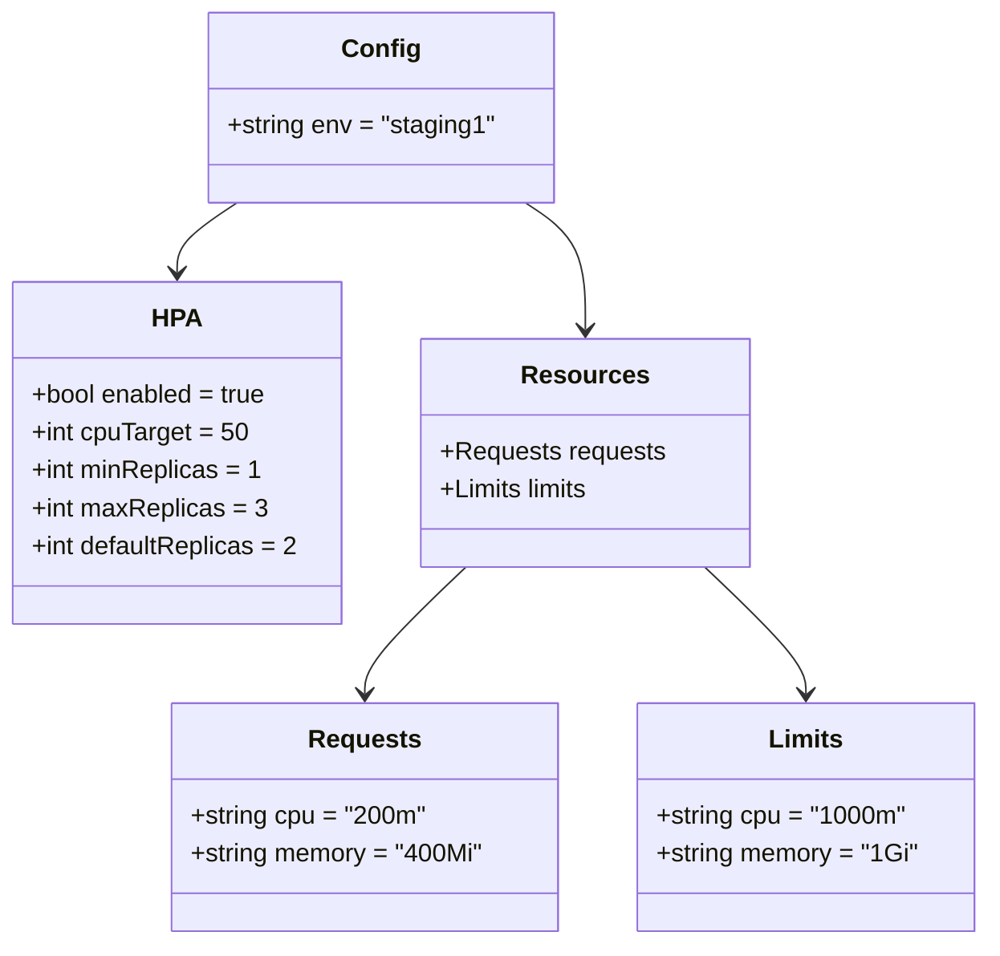
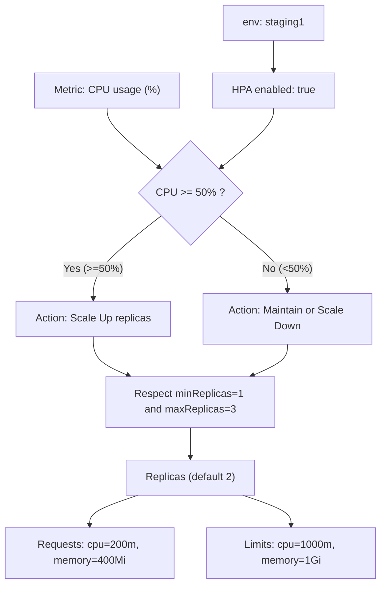

# Diagram: entity_core/entity_service/platform_applications/damage_submission_history_event/helm/profiles/values.staging1.yaml

> Auto-generated by Obscura crawlers

## Diagram 1

### SVG

<svg id="container" width="617.85546875" xmlns="http://www.w3.org/2000/svg" class="classDiagram" height="596" viewBox="0 0 617.85546875 596" role="graphics-document document" aria-roledescription="class"><g><defs><marker id="container_class-aggregationStart" class="marker aggregation class" refX="18" refY="7" markerWidth="190" markerHeight="240" orient="auto"><path d="M 18,7 L9,13 L1,7 L9,1 Z"></path></marker></defs><defs><marker id="container_class-aggregationEnd" class="marker aggregation class" refX="1" refY="7" markerWidth="20" markerHeight="28" orient="auto"><path d="M 18,7 L9,13 L1,7 L9,1 Z"></path></marker></defs><defs><marker id="container_class-extensionStart" class="marker extension class" refX="18" refY="7" markerWidth="190" markerHeight="240" orient="auto"><path d="M 1,7 L18,13 V 1 Z"></path></marker></defs><defs><marker id="container_class-extensionEnd" class="marker extension class" refX="1" refY="7" markerWidth="20" markerHeight="28" orient="auto"><path d="M 1,1 V 13 L18,7 Z"></path></marker></defs><defs><marker id="container_class-compositionStart" class="marker composition class" refX="18" refY="7" markerWidth="190" markerHeight="240" orient="auto"><path d="M 18,7 L9,13 L1,7 L9,1 Z"></path></marker></defs><defs><marker id="container_class-compositionEnd" class="marker composition class" refX="1" refY="7" markerWidth="20" markerHeight="28" orient="auto"><path d="M 18,7 L9,13 L1,7 L9,1 Z"></path></marker></defs><defs><marker id="container_class-dependencyStart" class="marker dependency class" refX="6" refY="7" markerWidth="190" markerHeight="240" orient="auto"><path d="M 5,7 L9,13 L1,7 L9,1 Z"></path></marker></defs><defs><marker id="container_class-dependencyEnd" class="marker dependency class" refX="13" refY="7" markerWidth="20" markerHeight="28" orient="auto"><path d="M 18,7 L9,13 L14,7 L9,1 Z"></path></marker></defs><defs><marker id="container_class-lollipopStart" class="marker lollipop class" refX="13" refY="7" markerWidth="190" markerHeight="240" orient="auto"><circle stroke="black" fill="transparent" cx="7" cy="7" r="6"></circle></marker></defs><defs><marker id="container_class-lollipopEnd" class="marker lollipop class" refX="1" refY="7" markerWidth="190" markerHeight="240" orient="auto"><circle stroke="black" fill="transparent" cx="7" cy="7" r="6"></circle></marker></defs><g class="root"><g class="clusters"></g><g class="edgePaths"><path d="M148.872,128L142.628,132.167C136.383,136.333,123.895,144.667,117.651,152C111.406,159.333,111.406,165.667,111.406,168.833L111.406,172" id="id_Config_HPA_1" class="edge-thickness-normal edge-pattern-solid relation" style=";;;" data-edge="true" data-et="edge" data-id="id_Config_HPA_1" data-points="W3sieCI6MTQ4Ljg3MTc4MzA4ODIzNTMsInkiOjEyOH0seyJ4IjoxMTEuNDA2MjUsInkiOjE1M30seyJ4IjoxMTEuNDA2MjUsInkiOjE3OH1d" marker-end="url(#container_class-dependencyEnd)"></path><path d="M328.706,128L334.951,132.167C341.195,136.333,353.683,144.667,359.928,158C366.172,171.333,366.172,189.667,366.172,198.833L366.172,208" id="id_Config_Resources_2" class="edge-thickness-normal edge-pattern-solid relation" style=";;;" data-edge="true" data-et="edge" data-id="id_Config_Resources_2" data-points="W3sieCI6MzI4LjcwNjM0MTkxMTc2NDcsInkiOjEyOH0seyJ4IjozNjYuMTcxODc1LCJ5IjoxNTN9LHsieCI6MzY2LjE3MTg3NSwieSI6MjE0fV0=" marker-end="url(#container_class-dependencyEnd)"></path><path d="M291.235,358L280.653,368.167C270.072,378.333,248.909,398.667,238.328,412C227.746,425.333,227.746,431.667,227.746,434.833L227.746,438" id="id_Resources_Requests_3" class="edge-thickness-normal edge-pattern-solid relation" style=";;;" data-edge="true" data-et="edge" data-id="id_Resources_Requests_3" data-points="W3sieCI6MjkxLjIzNDYwOTk2MjQwNiwieSI6MzU4fSx7IngiOjIyNy43NDYwOTM3NSwieSI6NDE5fSx7IngiOjIyNy43NDYwOTM3NSwieSI6NDQ0fV0=" marker-end="url(#container_class-dependencyEnd)"></path><path d="M441.109,358L451.691,368.167C462.272,378.333,483.435,398.667,494.016,412C504.598,425.333,504.598,431.667,504.598,434.833L504.598,438" id="id_Resources_Limits_4" class="edge-thickness-normal edge-pattern-solid relation" style=";;;" data-edge="true" data-et="edge" data-id="id_Resources_Limits_4" data-points="W3sieCI6NDQxLjEwOTE0MDAzNzU5NCwieSI6MzU4fSx7IngiOjUwNC41OTc2NTYyNSwieSI6NDE5fSx7IngiOjUwNC41OTc2NTYyNSwieSI6NDQ0fV0=" marker-end="url(#container_class-dependencyEnd)"></path></g><g class="edgeLabels"><g class="edgeLabel"><g class="label" data-id="id_Config_HPA_1" transform="translate(0, 0)"><foreignObject width="0" height="0">

</foreignObject></g></g><g class="edgeLabel"><g class="label" data-id="id_Config_Resources_2" transform="translate(0, 0)"><foreignObject width="0" height="0">

</foreignObject></g></g><g class="edgeLabel"><g class="label" data-id="id_Resources_Requests_3" transform="translate(0, 0)"><foreignObject width="0" height="0">

</foreignObject></g></g><g class="edgeLabel"><g class="label" data-id="id_Resources_Limits_4" transform="translate(0, 0)"><foreignObject width="0" height="0">

</foreignObject></g></g></g><g class="nodes"><g class="node default" id="classId-Config-0" transform="translate(238.7890625, 68)"><g class="basic label-container"><path d="M-107.43359375 -60 L107.43359375 -60 L107.43359375 60 L-107.43359375 60" stroke="none" stroke-width="0" fill="#ECECFF" style=""></path><path d="M-107.43359375 -60 C-62.517329412432126 -60, -17.601065074864252 -60, 107.43359375 -60 M-107.43359375 -60 C-36.480939634198265 -60, 34.47171448160347 -60, 107.43359375 -60 M107.43359375 -60 C107.43359375 -24.3414666746068, 107.43359375 11.317066650786401, 107.43359375 60 M107.43359375 -60 C107.43359375 -14.866329492989593, 107.43359375 30.267341014020815, 107.43359375 60 M107.43359375 60 C33.726582763323776 60, -39.98042822335245 60, -107.43359375 60 M107.43359375 60 C60.76153558070971 60, 14.089477411419423 60, -107.43359375 60 M-107.43359375 60 C-107.43359375 19.981764176059208, -107.43359375 -20.036471647881584, -107.43359375 -60 M-107.43359375 60 C-107.43359375 30.389891713252407, -107.43359375 0.7797834265048138, -107.43359375 -60" stroke="#9370DB" stroke-width="1.3" fill="none" stroke-dasharray="0 0" style=""></path></g><g class="annotation-group text" transform="translate(0, -36)"></g><g class="label-group text" transform="translate(-22.9296875, -36)"><g class="label" style="font-weight: bolder" transform="translate(0,-12)"><foreignObject width="45.859375" height="24">

Config

</foreignObject></g></g><g class="members-group text" transform="translate(-95.43359375, 12)"><g class="label" style="" transform="translate(0,-12)"><foreignObject width="167.9375" height="24">

+string env = "staging1"

</foreignObject></g></g><g class="methods-group text" transform="translate(-95.43359375, 60)"></g><g class="divider" style=""><path d="M-107.43359375 -12 C-23.07912196558877 -12, 61.27534981882246 -12, 107.43359375 -12 M-107.43359375 -12 C-41.00728862498953 -12, 25.419016500020945 -12, 107.43359375 -12" stroke="#9370DB" stroke-width="1.3" fill="none" stroke-dasharray="0 0" style=""></path></g><g class="divider" style=""><path d="M-107.43359375 36 C-25.123860460484806 36, 57.18587282903039 36, 107.43359375 36 M-107.43359375 36 C-42.434200757439015 36, 22.56519223512197 36, 107.43359375 36" stroke="#9370DB" stroke-width="1.3" fill="none" stroke-dasharray="0 0" style=""></path></g></g><g class="node default" id="classId-HPA-1" transform="translate(111.40625, 286)"><g class="basic label-container"><path d="M-103.40625 -108 L103.40625 -108 L103.40625 108 L-103.40625 108" stroke="none" stroke-width="0" fill="#ECECFF" style=""></path><path d="M-103.40625 -108 C-58.742730516094 -108, -14.079211032187999 -108, 103.40625 -108 M-103.40625 -108 C-24.309230704584763 -108, 54.78778859083047 -108, 103.40625 -108 M103.40625 -108 C103.40625 -32.90390655206886, 103.40625 42.19218689586228, 103.40625 108 M103.40625 -108 C103.40625 -27.836374409246645, 103.40625 52.32725118150671, 103.40625 108 M103.40625 108 C22.36394472970855 108, -58.6783605405829 108, -103.40625 108 M103.40625 108 C49.23880002336444 108, -4.928649953271119 108, -103.40625 108 M-103.40625 108 C-103.40625 25.33520409356636, -103.40625 -57.32959181286728, -103.40625 -108 M-103.40625 108 C-103.40625 46.59682461813263, -103.40625 -14.806350763734741, -103.40625 -108" stroke="#9370DB" stroke-width="1.3" fill="none" stroke-dasharray="0 0" style=""></path></g><g class="annotation-group text" transform="translate(0, -84)"></g><g class="label-group text" transform="translate(-14.375, -84)"><g class="label" style="font-weight: bolder" transform="translate(0,-12)"><foreignObject width="28.75" height="24">

HPA

</foreignObject></g></g><g class="members-group text" transform="translate(-91.40625, -36)"><g class="label" style="" transform="translate(0,-12)"><foreignObject width="150.78125" height="24">

+bool enabled = true

</foreignObject></g><g class="label" style="" transform="translate(0,12)"><foreignObject width="136.453125" height="24">

+int cpuTarget = 50

</foreignObject></g><g class="label" style="" transform="translate(0,36)"><foreignObject width="143.265625" height="24">

+int minReplicas = 1

</foreignObject></g><g class="label" style="" transform="translate(0,60)"><foreignObject width="146.90625" height="24">

+int maxReplicas = 3

</foreignObject></g><g class="label" style="" transform="translate(0,84)"><foreignObject width="168.4375" height="24">

+int defaultReplicas = 2

</foreignObject></g></g><g class="methods-group text" transform="translate(-91.40625, 108)"></g><g class="divider" style=""><path d="M-103.40625 -60 C-42.56730425999265 -60, 18.271641480014694 -60, 103.40625 -60 M-103.40625 -60 C-22.126763341357588 -60, 59.152723317284824 -60, 103.40625 -60" stroke="#9370DB" stroke-width="1.3" fill="none" stroke-dasharray="0 0" style=""></path></g><g class="divider" style=""><path d="M-103.40625 84 C-42.59227833833135 84, 18.221693323337306 84, 103.40625 84 M-103.40625 84 C-46.982808109786305 84, 9.44063378042739 84, 103.40625 84" stroke="#9370DB" stroke-width="1.3" fill="none" stroke-dasharray="0 0" style=""></path></g></g><g class="node default" id="classId-Resources-2" transform="translate(366.171875, 286)"><g class="basic label-container"><path d="M-101.359375 -72 L101.359375 -72 L101.359375 72 L-101.359375 72" stroke="none" stroke-width="0" fill="#ECECFF" style=""></path><path d="M-101.359375 -72 C-40.472580712791434 -72, 20.414213574417133 -72, 101.359375 -72 M-101.359375 -72 C-31.19991236007465 -72, 38.9595502798507 -72, 101.359375 -72 M101.359375 -72 C101.359375 -18.506789317863564, 101.359375 34.98642136427287, 101.359375 72 M101.359375 -72 C101.359375 -17.532877383795167, 101.359375 36.934245232409666, 101.359375 72 M101.359375 72 C21.36205891150155 72, -58.6352571769969 72, -101.359375 72 M101.359375 72 C59.906040681243496 72, 18.452706362486992 72, -101.359375 72 M-101.359375 72 C-101.359375 41.74116082988326, -101.359375 11.482321659766527, -101.359375 -72 M-101.359375 72 C-101.359375 33.0668970513933, -101.359375 -5.866205897213405, -101.359375 -72" stroke="#9370DB" stroke-width="1.3" fill="none" stroke-dasharray="0 0" style=""></path></g><g class="annotation-group text" transform="translate(0, -48)"></g><g class="label-group text" transform="translate(-37.265625, -48)"><g class="label" style="font-weight: bolder" transform="translate(0,-12)"><foreignObject width="74.53125" height="24">

Resources

</foreignObject></g></g><g class="members-group text" transform="translate(-89.359375, 0)"><g class="label" style="" transform="translate(0,-12)"><foreignObject width="141.453125" height="24">

+Requests requests

</foreignObject></g><g class="label" style="" transform="translate(0,12)"><foreignObject width="96.859375" height="24">

+Limits limits

</foreignObject></g></g><g class="methods-group text" transform="translate(-89.359375, 72)"></g><g class="divider" style=""><path d="M-101.359375 -24 C-42.54433894004036 -24, 16.270697119919276 -24, 101.359375 -24 M-101.359375 -24 C-20.67701580970369 -24, 60.00534338059262 -24, 101.359375 -24" stroke="#9370DB" stroke-width="1.3" fill="none" stroke-dasharray="0 0" style=""></path></g><g class="divider" style=""><path d="M-101.359375 48 C-29.20295261117262 48, 42.95346977765476 48, 101.359375 48 M-101.359375 48 C-41.98433962466506 48, 17.390695750669877 48, 101.359375 48" stroke="#9370DB" stroke-width="1.3" fill="none" stroke-dasharray="0 0" style=""></path></g></g><g class="node default" id="classId-Requests-3" transform="translate(227.74609375, 516)"><g class="basic label-container"><path d="M-121.59375 -72 L121.59375 -72 L121.59375 72 L-121.59375 72" stroke="none" stroke-width="0" fill="#ECECFF" style=""></path><path d="M-121.59375 -72 C-66.16921965568804 -72, -10.744689311376092 -72, 121.59375 -72 M-121.59375 -72 C-48.73435154037361 -72, 24.12504691925278 -72, 121.59375 -72 M121.59375 -72 C121.59375 -21.116840667298995, 121.59375 29.76631866540201, 121.59375 72 M121.59375 -72 C121.59375 -29.5720435362636, 121.59375 12.8559129274728, 121.59375 72 M121.59375 72 C59.035172349089976 72, -3.5234053018200484 72, -121.59375 72 M121.59375 72 C64.85580541154758 72, 8.117860823095143 72, -121.59375 72 M-121.59375 72 C-121.59375 20.497995570778926, -121.59375 -31.00400885844215, -121.59375 -72 M-121.59375 72 C-121.59375 36.668241682501375, -121.59375 1.3364833650027492, -121.59375 -72" stroke="#9370DB" stroke-width="1.3" fill="none" stroke-dasharray="0 0" style=""></path></g><g class="annotation-group text" transform="translate(0, -48)"></g><g class="label-group text" transform="translate(-33.84375, -48)"><g class="label" style="font-weight: bolder" transform="translate(0,-12)"><foreignObject width="67.6875" height="24">

Requests

</foreignObject></g></g><g class="members-group text" transform="translate(-109.59375, 0)"><g class="label" style="" transform="translate(0,-12)"><foreignObject width="148.90625" height="24">

+string cpu = "200m"

</foreignObject></g><g class="label" style="" transform="translate(0,12)"><foreignObject width="185.34375" height="24">

+string memory = "400Mi"

</foreignObject></g></g><g class="methods-group text" transform="translate(-109.59375, 72)"></g><g class="divider" style=""><path d="M-121.59375 -24 C-71.18188523300567 -24, -20.770020466011346 -24, 121.59375 -24 M-121.59375 -24 C-64.66022121535447 -24, -7.726692430708937 -24, 121.59375 -24" stroke="#9370DB" stroke-width="1.3" fill="none" stroke-dasharray="0 0" style=""></path></g><g class="divider" style=""><path d="M-121.59375 48 C-41.93265766879223 48, 37.72843466241554 48, 121.59375 48 M-121.59375 48 C-49.73238540906898 48, 22.128979181862036 48, 121.59375 48" stroke="#9370DB" stroke-width="1.3" fill="none" stroke-dasharray="0 0" style=""></path></g></g><g class="node default" id="classId-Limits-4" transform="translate(504.59765625, 516)"><g class="basic label-container"><path d="M-105.2578125 -72 L105.2578125 -72 L105.2578125 72 L-105.2578125 72" stroke="none" stroke-width="0" fill="#ECECFF" style=""></path><path d="M-105.2578125 -72 C-51.20447771047418 -72, 2.8488570790516405 -72, 105.2578125 -72 M-105.2578125 -72 C-24.419261018482487 -72, 56.419290463035026 -72, 105.2578125 -72 M105.2578125 -72 C105.2578125 -20.28762556569403, 105.2578125 31.424748868611942, 105.2578125 72 M105.2578125 -72 C105.2578125 -14.985027018626603, 105.2578125 42.029945962746794, 105.2578125 72 M105.2578125 72 C62.692159500118386 72, 20.126506500236772 72, -105.2578125 72 M105.2578125 72 C53.221210877485646 72, 1.184609254971292 72, -105.2578125 72 M-105.2578125 72 C-105.2578125 22.251654254263478, -105.2578125 -27.496691491473044, -105.2578125 -72 M-105.2578125 72 C-105.2578125 15.991624698569012, -105.2578125 -40.016750602861975, -105.2578125 -72" stroke="#9370DB" stroke-width="1.3" fill="none" stroke-dasharray="0 0" style=""></path></g><g class="annotation-group text" transform="translate(0, -48)"></g><g class="label-group text" transform="translate(-22.328125, -48)"><g class="label" style="font-weight: bolder" transform="translate(0,-12)"><foreignObject width="44.65625" height="24">

Limits

</foreignObject></g></g><g class="members-group text" transform="translate(-93.2578125, 0)"><g class="label" style="" transform="translate(0,-12)"><foreignObject width="156.84375" height="24">

+string cpu = "1000m"

</foreignObject></g><g class="label" style="" transform="translate(0,12)"><foreignObject width="164.1875" height="24">

+string memory = "1Gi"

</foreignObject></g></g><g class="methods-group text" transform="translate(-93.2578125, 72)"></g><g class="divider" style=""><path d="M-105.2578125 -24 C-43.49063980869956 -24, 18.276532882600875 -24, 105.2578125 -24 M-105.2578125 -24 C-33.70836901578964 -24, 37.841074468420715 -24, 105.2578125 -24" stroke="#9370DB" stroke-width="1.3" fill="none" stroke-dasharray="0 0" style=""></path></g><g class="divider" style=""><path d="M-105.2578125 48 C-46.482058073122104 48, 12.293696353755792 48, 105.2578125 48 M-105.2578125 48 C-60.40229099919958 48, -15.546769498399158 48, 105.2578125 48" stroke="#9370DB" stroke-width="1.3" fill="none" stroke-dasharray="0 0" style=""></path></g></g></g></g></g></svg>

## Diagram 2

### SVG

<svg id="container" width="586" xmlns="http://www.w3.org/2000/svg" class="flowchart" height="885.078125" viewBox="0 0 586 885.078125" role="graphics-document document" aria-roledescription="flowchart-v2"><g><marker id="container_flowchart-v2-pointEnd" class="marker flowchart-v2" viewBox="0 0 10 10" refX="5" refY="5" markerUnits="userSpaceOnUse" markerWidth="8" markerHeight="8" orient="auto"><path d="M 0 0 L 10 5 L 0 10 z" class="arrowMarkerPath" style="stroke-width: 1; stroke-dasharray: 1, 0;"></path></marker><marker id="container_flowchart-v2-pointStart" class="marker flowchart-v2" viewBox="0 0 10 10" refX="4.5" refY="5" markerUnits="userSpaceOnUse" markerWidth="8" markerHeight="8" orient="auto"><path d="M 0 5 L 10 10 L 10 0 z" class="arrowMarkerPath" style="stroke-width: 1; stroke-dasharray: 1, 0;"></path></marker><marker id="container_flowchart-v2-circleEnd" class="marker flowchart-v2" viewBox="0 0 10 10" refX="11" refY="5" markerUnits="userSpaceOnUse" markerWidth="11" markerHeight="11" orient="auto"><circle cx="5" cy="5" r="5" class="arrowMarkerPath" style="stroke-width: 1; stroke-dasharray: 1, 0;"></circle></marker><marker id="container_flowchart-v2-circleStart" class="marker flowchart-v2" viewBox="0 0 10 10" refX="-1" refY="5" markerUnits="userSpaceOnUse" markerWidth="11" markerHeight="11" orient="auto"><circle cx="5" cy="5" r="5" class="arrowMarkerPath" style="stroke-width: 1; stroke-dasharray: 1, 0;"></circle></marker><marker id="container_flowchart-v2-crossEnd" class="marker cross flowchart-v2" viewBox="0 0 11 11" refX="12" refY="5.2" markerUnits="userSpaceOnUse" markerWidth="11" markerHeight="11" orient="auto"><path d="M 1,1 l 9,9 M 10,1 l -9,9" class="arrowMarkerPath" style="stroke-width: 2; stroke-dasharray: 1, 0;"></path></marker><marker id="container_flowchart-v2-crossStart" class="marker cross flowchart-v2" viewBox="0 0 11 11" refX="-1" refY="5.2" markerUnits="userSpaceOnUse" markerWidth="11" markerHeight="11" orient="auto"><path d="M 1,1 l 9,9 M 10,1 l -9,9" class="arrowMarkerPath" style="stroke-width: 2; stroke-dasharray: 1, 0;"></path></marker><g class="root"><g class="clusters"></g><g class="edgePaths"><path d="M419.547,62L419.547,66.167C419.547,70.333,419.547,78.667,419.547,86.333C419.547,94,419.547,101,419.547,104.5L419.547,108" id="L_Env_HPAEnabled_0" class="edge-thickness-normal edge-pattern-solid edge-thickness-normal edge-pattern-solid flowchart-link" style=";" data-edge="true" data-et="edge" data-id="L_Env_HPAEnabled_0" data-points="W3sieCI6NDE5LjU0Njg3NSwieSI6NjJ9LHsieCI6NDE5LjU0Njg3NSwieSI6ODd9LHsieCI6NDE5LjU0Njg3NSwieSI6MTEyfV0=" marker-end="url(#container_flowchart-v2-pointEnd)"></path><path d="M166.453,166L166.453,170.167C166.453,174.333,166.453,182.667,180.067,197.541C193.68,212.416,220.907,233.832,234.521,244.541L248.134,255.249" id="L_Metrics_HPADecision_0" class="edge-thickness-normal edge-pattern-solid edge-thickness-normal edge-pattern-solid flowchart-link" style=";" data-edge="true" data-et="edge" data-id="L_Metrics_HPADecision_0" data-points="W3sieCI6MTY2LjQ1MzEyNSwieSI6MTY2fSx7IngiOjE2Ni40NTMxMjUsInkiOjE5MX0seyJ4IjoyNTEuMjc4MzE4NzI2NDU5MSwieSI6MjU3LjcyMTY4MTI3MzU0MDl9XQ==" marker-end="url(#container_flowchart-v2-pointEnd)"></path><path d="M419.547,166L419.547,170.167C419.547,174.333,419.547,182.667,405.933,197.541C392.32,212.416,365.093,233.832,351.479,244.541L337.866,255.249" id="L_HPAEnabled_HPADecision_0" class="edge-thickness-normal edge-pattern-solid edge-thickness-normal edge-pattern-solid flowchart-link" style=";" data-edge="true" data-et="edge" data-id="L_HPAEnabled_HPADecision_0" data-points="W3sieCI6NDE5LjU0Njg3NSwieSI6MTY2fSx7IngiOjQxOS41NDY4NzUsInkiOjE5MX0seyJ4IjozMzQuNzIxNjgxMjczNTQwOSwieSI6MjU3LjcyMTY4MTI3MzU0MDl9XQ==" marker-end="url(#container_flowchart-v2-pointEnd)"></path><path d="M250.335,322.414L232.563,335.691C214.791,348.968,179.247,375.523,161.475,396.301C143.703,417.078,143.703,432.078,143.703,439.578L143.703,447.078" id="L_HPADecision_ScaleUp_0" class="edge-thickness-normal edge-pattern-solid edge-thickness-normal edge-pattern-solid flowchart-link" style=";" data-edge="true" data-et="edge" data-id="L_HPADecision_ScaleUp_0" data-points="W3sieCI6MjUwLjMzNTQ0NTQwMTY1MzM1LCJ5IjozMjIuNDEzNTcwNDAxNjUzM30seyJ4IjoxNDMuNzAzMTI1LCJ5Ijo0MDIuMDc4MTI1fSx7IngiOjE0My43MDMxMjUsInkiOjQ1MS4wNzgxMjV9XQ==" marker-end="url(#container_flowchart-v2-pointEnd)"></path><path d="M335.665,322.414L353.437,335.691C371.209,348.968,406.753,375.523,424.525,394.301C442.297,413.078,442.297,424.078,442.297,429.578L442.297,435.078" id="L_HPADecision_ScaleDown_0" class="edge-thickness-normal edge-pattern-solid edge-thickness-normal edge-pattern-solid flowchart-link" style=";" data-edge="true" data-et="edge" data-id="L_HPADecision_ScaleDown_0" data-points="W3sieCI6MzM1LjY2NDU1NDU5ODM0NjcsInkiOjMyMi40MTM1NzA0MDE2NTMzfSx7IngiOjQ0Mi4yOTY4NzUsInkiOjQwMi4wNzgxMjV9LHsieCI6NDQyLjI5Njg3NSwieSI6NDM5LjA3ODEyNX1d" marker-end="url(#container_flowchart-v2-pointEnd)"></path><path d="M143.703,505.078L143.703,511.245C143.703,517.411,143.703,529.745,152.81,539.815C161.917,549.886,180.132,557.694,189.239,561.598L198.346,565.502" id="L_ScaleUp_RespectBounds_0" class="edge-thickness-normal edge-pattern-solid edge-thickness-normal edge-pattern-solid flowchart-link" style=";" data-edge="true" data-et="edge" data-id="L_ScaleUp_RespectBounds_0" data-points="W3sieCI6MTQzLjcwMzEyNSwieSI6NTA1LjA3ODEyNX0seyJ4IjoxNDMuNzAzMTI1LCJ5Ijo1NDIuMDc4MTI1fSx7IngiOjIwMi4wMjIyMTY3OTY4NzUsInkiOjU2Ny4wNzgxMjV9XQ==" marker-end="url(#container_flowchart-v2-pointEnd)"></path><path d="M442.297,517.078L442.297,521.245C442.297,525.411,442.297,533.745,433.19,541.815C424.083,549.886,405.868,557.694,396.761,561.598L387.654,565.502" id="L_ScaleDown_RespectBounds_0" class="edge-thickness-normal edge-pattern-solid edge-thickness-normal edge-pattern-solid flowchart-link" style=";" data-edge="true" data-et="edge" data-id="L_ScaleDown_RespectBounds_0" data-points="W3sieCI6NDQyLjI5Njg3NSwieSI6NTE3LjA3ODEyNX0seyJ4Ijo0NDIuMjk2ODc1LCJ5Ijo1NDIuMDc4MTI1fSx7IngiOjM4My45Nzc3ODMyMDMxMjUsInkiOjU2Ny4wNzgxMjV9XQ==" marker-end="url(#container_flowchart-v2-pointEnd)"></path><path d="M293,645.078L293,649.245C293,653.411,293,661.745,293,669.411C293,677.078,293,684.078,293,687.578L293,691.078" id="L_RespectBounds_Replicas_0" class="edge-thickness-normal edge-pattern-solid edge-thickness-normal edge-pattern-solid flowchart-link" style=";" data-edge="true" data-et="edge" data-id="L_RespectBounds_Replicas_0" data-points="W3sieCI6MjkzLCJ5Ijo2NDUuMDc4MTI1fSx7IngiOjI5MywieSI6NjcwLjA3ODEyNX0seyJ4IjoyOTMsInkiOjY5NS4wNzgxMjV9XQ==" marker-end="url(#container_flowchart-v2-pointEnd)"></path><path d="M212.519,749.078L200.099,753.245C187.679,757.411,162.84,765.745,150.42,773.411C138,781.078,138,788.078,138,791.578L138,795.078" id="L_Replicas_RequestsNode_0" class="edge-thickness-normal edge-pattern-solid edge-thickness-normal edge-pattern-solid flowchart-link" style=";" data-edge="true" data-et="edge" data-id="L_Replicas_RequestsNode_0" data-points="W3sieCI6MjEyLjUxOTIzMDc2OTIzMDc3LCJ5Ijo3NDkuMDc4MTI1fSx7IngiOjEzOCwieSI6Nzc0LjA3ODEyNX0seyJ4IjoxMzgsInkiOjc5OS4wNzgxMjV9XQ==" marker-end="url(#container_flowchart-v2-pointEnd)"></path><path d="M373.481,749.078L385.901,753.245C398.321,757.411,423.16,765.745,435.58,773.411C448,781.078,448,788.078,448,791.578L448,795.078" id="L_Replicas_LimitsNode_0" class="edge-thickness-normal edge-pattern-solid edge-thickness-normal edge-pattern-solid flowchart-link" style=";" data-edge="true" data-et="edge" data-id="L_Replicas_LimitsNode_0" data-points="W3sieCI6MzczLjQ4MDc2OTIzMDc2OTIsInkiOjc0OS4wNzgxMjV9LHsieCI6NDQ4LCJ5Ijo3NzQuMDc4MTI1fSx7IngiOjQ0OCwieSI6Nzk5LjA3ODEyNX1d" marker-end="url(#container_flowchart-v2-pointEnd)"></path></g><g class="edgeLabels"><g class="edgeLabel"><g class="label" data-id="L_Env_HPAEnabled_0" transform="translate(0, 0)"><foreignObject width="0" height="0">

</foreignObject></g></g><g class="edgeLabel"><g class="label" data-id="L_Metrics_HPADecision_0" transform="translate(0, 0)"><foreignObject width="0" height="0">

</foreignObject></g></g><g class="edgeLabel"><g class="label" data-id="L_HPAEnabled_HPADecision_0" transform="translate(0, 0)"><foreignObject width="0" height="0">

</foreignObject></g></g><g class="edgeLabel" transform="translate(143.703125, 402.078125)"><g class="label" data-id="L_HPADecision_ScaleUp_0" transform="translate(-42.4140625, -12)"><foreignObject width="84.828125" height="24">

Yes (&gt;=50%)

</foreignObject></g></g><g class="edgeLabel" transform="translate(442.296875, 402.078125)"><g class="label" data-id="L_HPADecision_ScaleDown_0" transform="translate(-36.5234375, -12)"><foreignObject width="73.046875" height="24">

No (&lt;50%)

</foreignObject></g></g><g class="edgeLabel"><g class="label" data-id="L_ScaleUp_RespectBounds_0" transform="translate(0, 0)"><foreignObject width="0" height="0">

</foreignObject></g></g><g class="edgeLabel"><g class="label" data-id="L_ScaleDown_RespectBounds_0" transform="translate(0, 0)"><foreignObject width="0" height="0">

</foreignObject></g></g><g class="edgeLabel"><g class="label" data-id="L_RespectBounds_Replicas_0" transform="translate(0, 0)"><foreignObject width="0" height="0">

</foreignObject></g></g><g class="edgeLabel"><g class="label" data-id="L_Replicas_RequestsNode_0" transform="translate(0, 0)"><foreignObject width="0" height="0">

</foreignObject></g></g><g class="edgeLabel"><g class="label" data-id="L_Replicas_LimitsNode_0" transform="translate(0, 0)"><foreignObject width="0" height="0">

</foreignObject></g></g></g><g class="nodes"><g class="node default" id="flowchart-Env-0" transform="translate(419.546875, 35)"><rect class="basic label-container" style="" x="-76.5703125" y="-27" width="153.140625" height="54"></rect><g class="label" style="" transform="translate(-46.5703125, -12)"><rect></rect><foreignObject width="93.140625" height="24">

env: staging1

</foreignObject></g></g><g class="node default" id="flowchart-HPAEnabled-1" transform="translate(419.546875, 139)"><rect class="basic label-container" style="" x="-94.9453125" y="-27" width="189.890625" height="54"></rect><g class="label" style="" transform="translate(-64.9453125, -12)"><rect></rect><foreignObject width="129.890625" height="24">

HPA enabled: true

</foreignObject></g></g><g class="node default" id="flowchart-Metrics-2" transform="translate(166.453125, 139)"><rect class="basic label-container" style="" x="-108.1484375" y="-27" width="216.296875" height="54"></rect><g class="label" style="" transform="translate(-78.1484375, -12)"><rect></rect><foreignObject width="156.296875" height="24">

Metric: CPU usage (%)

</foreignObject></g></g><g class="node default" id="flowchart-HPADecision-3" transform="translate(293, 290.5390625)"><polygon points="74.5390625,0 149.078125,-74.5390625 74.5390625,-149.078125 0,-74.5390625" class="label-container" transform="translate(-74.0390625, 74.5390625)"></polygon><g class="label" style="" transform="translate(-47.5390625, -12)"><rect></rect><foreignObject width="95.078125" height="24">

CPU &gt;= 50% ?

</foreignObject></g></g><g class="node default" id="flowchart-ScaleUp-7" transform="translate(143.703125, 478.078125)"><rect class="basic label-container" style="" x="-118.59375" y="-27" width="237.1875" height="54"></rect><g class="label" style="" transform="translate(-88.59375, -12)"><rect></rect><foreignObject width="177.1875" height="24">

Action: Scale Up replicas

</foreignObject></g></g><g class="node default" id="flowchart-ScaleDown-9" transform="translate(442.296875, 478.078125)"><rect class="basic label-container" style="" x="-130" y="-39" width="260" height="78"></rect><g class="label" style="" transform="translate(-100, -24)"><rect></rect><foreignObject width="200" height="48">

Action: Maintain or Scale Down

</foreignObject></g></g><g class="node default" id="flowchart-RespectBounds-11" transform="translate(293, 606.078125)"><rect class="basic label-container" style="" x="-130" y="-39" width="260" height="78"></rect><g class="label" style="" transform="translate(-100, -24)"><rect></rect><foreignObject width="200" height="48">

Respect minReplicas=1 and maxReplicas=3

</foreignObject></g></g><g class="node default" id="flowchart-Replicas-15" transform="translate(293, 722.078125)"><rect class="basic label-container" style="" x="-99.4609375" y="-27" width="198.921875" height="54"></rect><g class="label" style="" transform="translate(-69.4609375, -12)"><rect></rect><foreignObject width="138.921875" height="24">

Replicas (default 2)

</foreignObject></g></g><g class="node default" id="flowchart-RequestsNode-17" transform="translate(138, 838.078125)"><rect class="basic label-container" style="" x="-130" y="-39" width="260" height="78"></rect><g class="label" style="" transform="translate(-100, -24)"><rect></rect><foreignObject width="200" height="48">

Requests: cpu=200m, memory=400Mi

</foreignObject></g></g><g class="node default" id="flowchart-LimitsNode-19" transform="translate(448, 838.078125)"><rect class="basic label-container" style="" x="-130" y="-39" width="260" height="78"></rect><g class="label" style="" transform="translate(-100, -24)"><rect></rect><foreignObject width="200" height="48">

Limits: cpu=1000m, memory=1Gi

</foreignObject></g></g></g></g></g></svg>
