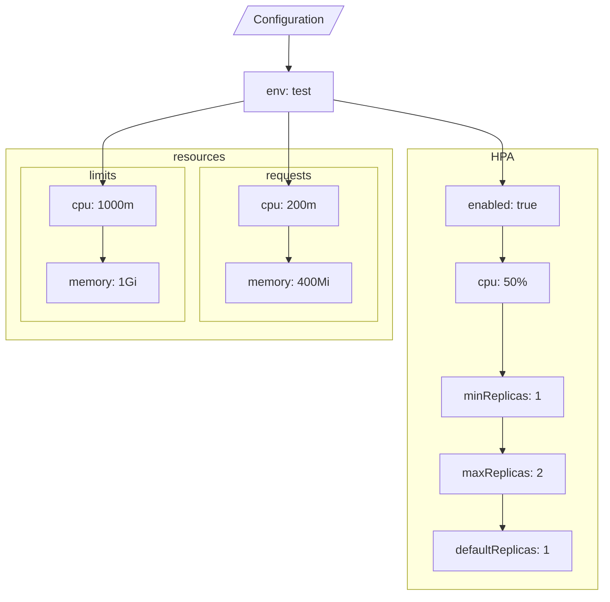

# Diagram: entity_core/entity_service/platform_applications/damage_submission_history_event/helm/profiles/values.test.yaml

> Auto-generated by Obscura crawlers

## Mermaid

### SVG

<svg id="container" width="813.390625" xmlns="http://www.w3.org/2000/svg" class="flowchart" height="804" viewBox="0 0 813.390625 804" role="graphics-document document" aria-roledescription="flowchart-v2"><g><marker id="container_flowchart-v2-pointEnd" class="marker flowchart-v2" viewBox="0 0 10 10" refX="5" refY="5" markerUnits="userSpaceOnUse" markerWidth="8" markerHeight="8" orient="auto"><path d="M 0 0 L 10 5 L 0 10 z" class="arrowMarkerPath" style="stroke-width: 1; stroke-dasharray: 1, 0;"></path></marker><marker id="container_flowchart-v2-pointStart" class="marker flowchart-v2" viewBox="0 0 10 10" refX="4.5" refY="5" markerUnits="userSpaceOnUse" markerWidth="8" markerHeight="8" orient="auto"><path d="M 0 5 L 10 10 L 10 0 z" class="arrowMarkerPath" style="stroke-width: 1; stroke-dasharray: 1, 0;"></path></marker><marker id="container_flowchart-v2-circleEnd" class="marker flowchart-v2" viewBox="0 0 10 10" refX="11" refY="5" markerUnits="userSpaceOnUse" markerWidth="11" markerHeight="11" orient="auto"><circle cx="5" cy="5" r="5" class="arrowMarkerPath" style="stroke-width: 1; stroke-dasharray: 1, 0;"></circle></marker><marker id="container_flowchart-v2-circleStart" class="marker flowchart-v2" viewBox="0 0 10 10" refX="-1" refY="5" markerUnits="userSpaceOnUse" markerWidth="11" markerHeight="11" orient="auto"><circle cx="5" cy="5" r="5" class="arrowMarkerPath" style="stroke-width: 1; stroke-dasharray: 1, 0;"></circle></marker><marker id="container_flowchart-v2-crossEnd" class="marker cross flowchart-v2" viewBox="0 0 11 11" refX="12" refY="5.2" markerUnits="userSpaceOnUse" markerWidth="11" markerHeight="11" orient="auto"><path d="M 1,1 l 9,9 M 10,1 l -9,9" class="arrowMarkerPath" style="stroke-width: 2; stroke-dasharray: 1, 0;"></path></marker><marker id="container_flowchart-v2-crossStart" class="marker cross flowchart-v2" viewBox="0 0 11 11" refX="-1" refY="5.2" markerUnits="userSpaceOnUse" markerWidth="11" markerHeight="11" orient="auto"><path d="M 1,1 l 9,9 M 10,1 l -9,9" class="arrowMarkerPath" style="stroke-width: 2; stroke-dasharray: 1, 0;"></path></marker><g class="root"><g class="clusters"><g class="cluster" id="Resources" data-look="classic"><rect style="" x="8" y="201" width="520.234375" height="258"></rect><g class="cluster-label" transform="translate(233.234375, 201)"><foreignObject width="69.765625" height="24">

resources

</foreignObject></g></g><g class="cluster" id="HPA" data-look="classic"><rect style="" x="548.234375" y="201" width="257.15625" height="595"></rect><g class="cluster-label" transform="translate(662.6171875, 201)"><foreignObject width="28.390625" height="24">

HPA

</foreignObject></g></g><g class="cluster" id="Limits" data-look="classic"><rect style="" x="28" y="226" width="219.21875" height="208"></rect><g class="cluster-label" transform="translate(117.265625, 226)"><foreignObject width="40.6875" height="24">

limits

</foreignObject></g></g><g class="cluster" id="Requests" data-look="classic"><rect style="" x="267.21875" y="226" width="241.015625" height="208"></rect><g class="cluster-label" transform="translate(356.3515625, 226)"><foreignObject width="62.75" height="24">

requests

</foreignObject></g></g></g><g class="edgePaths"><path d="M388.227,47.5L388.143,51.583C388.06,55.667,387.893,63.833,387.81,71.417C387.727,79,387.727,86,387.727,89.5L387.727,93" id="L_Config_Env_0" class="edge-thickness-normal edge-pattern-solid edge-thickness-normal edge-pattern-solid flowchart-link" style=";" data-edge="true" data-et="edge" data-id="L_Config_Env_0" data-points="W3sieCI6Mzg4LjIyNjU2MjUsInkiOjQ3LjV9LHsieCI6Mzg3LjcyNjU2MjUsInkiOjcyfSx7IngiOjM4Ny43MjY1NjI1LCJ5Ijo5N31d" marker-end="url(#container_flowchart-v2-pointEnd)"></path><path d="M448.484,134.929L486.539,141.774C524.594,148.619,600.703,162.31,638.758,173.321C676.813,184.333,676.813,192.667,676.813,201C676.813,209.333,676.813,217.667,676.813,225.333C676.813,233,676.813,240,676.813,243.5L676.813,247" id="L_Env_HPA_enabled_0" class="edge-thickness-normal edge-pattern-solid edge-thickness-normal edge-pattern-solid flowchart-link" style=";" data-edge="true" data-et="edge" data-id="L_Env_HPA_enabled_0" data-points="W3sieCI6NDQ4LjQ4NDM3NSwieSI6MTM0LjkyODk1MTcwNjYxODR9LHsieCI6Njc2LjgxMjUsInkiOjE3Nn0seyJ4Ijo2NzYuODEyNSwieSI6MjAxfSx7IngiOjY3Ni44MTI1LCJ5IjoyMjZ9LHsieCI6Njc2LjgxMjUsInkiOjI1MX1d" marker-end="url(#container_flowchart-v2-pointEnd)"></path><path d="M676.813,305L676.813,309.167C676.813,313.333,676.813,321.667,676.813,329.333C676.813,337,676.813,344,676.813,347.5L676.813,351" id="L_HPA_enabled_HPA_cpu_0" class="edge-thickness-normal edge-pattern-solid edge-thickness-normal edge-pattern-solid flowchart-link" style=";" data-edge="true" data-et="edge" data-id="L_HPA_enabled_HPA_cpu_0" data-points="W3sieCI6Njc2LjgxMjUsInkiOjMwNX0seyJ4Ijo2NzYuODEyNSwieSI6MzMwfSx7IngiOjY3Ni44MTI1LCJ5IjozNTV9XQ==" marker-end="url(#container_flowchart-v2-pointEnd)"></path><path d="M676.813,409L676.813,413.167C676.813,417.333,676.813,425.667,676.813,434C676.813,442.333,676.813,450.667,676.813,459C676.813,467.333,676.813,475.667,676.813,483.333C676.813,491,676.813,498,676.813,501.5L676.813,505" id="L_HPA_cpu_HPA_min_0" class="edge-thickness-normal edge-pattern-solid edge-thickness-normal edge-pattern-solid flowchart-link" style=";" data-edge="true" data-et="edge" data-id="L_HPA_cpu_HPA_min_0" data-points="W3sieCI6Njc2LjgxMjUsInkiOjQwOX0seyJ4Ijo2NzYuODEyNSwieSI6NDM0fSx7IngiOjY3Ni44MTI1LCJ5Ijo0NTl9LHsieCI6Njc2LjgxMjUsInkiOjQ4NH0seyJ4Ijo2NzYuODEyNSwieSI6NTA5fV0=" marker-end="url(#container_flowchart-v2-pointEnd)"></path><path d="M676.813,563L676.813,567.167C676.813,571.333,676.813,579.667,676.813,587.333C676.813,595,676.813,602,676.813,605.5L676.813,609" id="L_HPA_min_HPA_max_0" class="edge-thickness-normal edge-pattern-solid edge-thickness-normal edge-pattern-solid flowchart-link" style=";" data-edge="true" data-et="edge" data-id="L_HPA_min_HPA_max_0" data-points="W3sieCI6Njc2LjgxMjUsInkiOjU2M30seyJ4Ijo2NzYuODEyNSwieSI6NTg4fSx7IngiOjY3Ni44MTI1LCJ5Ijo2MTN9XQ==" marker-end="url(#container_flowchart-v2-pointEnd)"></path><path d="M676.813,667L676.813,671.167C676.813,675.333,676.813,683.667,676.813,691.333C676.813,699,676.813,706,676.813,709.5L676.813,713" id="L_HPA_max_HPA_def_0" class="edge-thickness-normal edge-pattern-solid edge-thickness-normal edge-pattern-solid flowchart-link" style=";" data-edge="true" data-et="edge" data-id="L_HPA_max_HPA_def_0" data-points="W3sieCI6Njc2LjgxMjUsInkiOjY2N30seyJ4Ijo2NzYuODEyNSwieSI6NjkyfSx7IngiOjY3Ni44MTI1LCJ5Ijo3MTd9XQ==" marker-end="url(#container_flowchart-v2-pointEnd)"></path><path d="M387.727,151L387.727,155.167C387.727,159.333,387.727,167.667,387.727,176C387.727,184.333,387.727,192.667,387.727,201C387.727,209.333,387.727,217.667,387.727,225.333C387.727,233,387.727,240,387.727,243.5L387.727,247" id="L_Env_Req_cpu_0" class="edge-thickness-normal edge-pattern-solid edge-thickness-normal edge-pattern-solid flowchart-link" style=";" data-edge="true" data-et="edge" data-id="L_Env_Req_cpu_0" data-points="W3sieCI6Mzg3LjcyNjU2MjUsInkiOjE1MX0seyJ4IjozODcuNzI2NTYyNSwieSI6MTc2fSx7IngiOjM4Ny43MjY1NjI1LCJ5IjoyMDF9LHsieCI6Mzg3LjcyNjU2MjUsInkiOjIyNn0seyJ4IjozODcuNzI2NTYyNSwieSI6MjUxfV0=" marker-end="url(#container_flowchart-v2-pointEnd)"></path><path d="M387.727,305L387.727,309.167C387.727,313.333,387.727,321.667,387.727,329.333C387.727,337,387.727,344,387.727,347.5L387.727,351" id="L_Req_cpu_Req_mem_0" class="edge-thickness-normal edge-pattern-solid edge-thickness-normal edge-pattern-solid flowchart-link" style=";" data-edge="true" data-et="edge" data-id="L_Req_cpu_Req_mem_0" data-points="W3sieCI6Mzg3LjcyNjU2MjUsInkiOjMwNX0seyJ4IjozODcuNzI2NTYyNSwieSI6MzMwfSx7IngiOjM4Ny43MjY1NjI1LCJ5IjozNTV9XQ==" marker-end="url(#container_flowchart-v2-pointEnd)"></path><path d="M326.969,136.632L295.409,143.193C263.849,149.754,200.729,162.877,169.169,173.605C137.609,184.333,137.609,192.667,137.609,201C137.609,209.333,137.609,217.667,137.609,225.333C137.609,233,137.609,240,137.609,243.5L137.609,247" id="L_Env_Lim_cpu_0" class="edge-thickness-normal edge-pattern-solid edge-thickness-normal edge-pattern-solid flowchart-link" style=";" data-edge="true" data-et="edge" data-id="L_Env_Lim_cpu_0" data-points="W3sieCI6MzI2Ljk2ODc1LCJ5IjoxMzYuNjMxNzAzODg4ODAyMTJ9LHsieCI6MTM3LjYwOTM3NSwieSI6MTc2fSx7IngiOjEzNy42MDkzNzUsInkiOjIwMX0seyJ4IjoxMzcuNjA5Mzc1LCJ5IjoyMjZ9LHsieCI6MTM3LjYwOTM3NSwieSI6MjUxfV0=" marker-end="url(#container_flowchart-v2-pointEnd)"></path><path d="M137.609,305L137.609,309.167C137.609,313.333,137.609,321.667,137.609,329.333C137.609,337,137.609,344,137.609,347.5L137.609,351" id="L_Lim_cpu_Lim_mem_0" class="edge-thickness-normal edge-pattern-solid edge-thickness-normal edge-pattern-solid flowchart-link" style=";" data-edge="true" data-et="edge" data-id="L_Lim_cpu_Lim_mem_0" data-points="W3sieCI6MTM3LjYwOTM3NSwieSI6MzA1fSx7IngiOjEzNy42MDkzNzUsInkiOjMzMH0seyJ4IjoxMzcuNjA5Mzc1LCJ5IjozNTV9XQ==" marker-end="url(#container_flowchart-v2-pointEnd)"></path></g><g class="edgeLabels"><g class="edgeLabel"><g class="label" data-id="L_Config_Env_0" transform="translate(0, 0)"><foreignObject width="0" height="0">

</foreignObject></g></g><g class="edgeLabel"><g class="label" data-id="L_Env_HPA_enabled_0" transform="translate(0, 0)"><foreignObject width="0" height="0">

</foreignObject></g></g><g class="edgeLabel"><g class="label" data-id="L_HPA_enabled_HPA_cpu_0" transform="translate(0, 0)"><foreignObject width="0" height="0">

</foreignObject></g></g><g class="edgeLabel"><g class="label" data-id="L_HPA_cpu_HPA_min_0" transform="translate(0, 0)"><foreignObject width="0" height="0">

</foreignObject></g></g><g class="edgeLabel"><g class="label" data-id="L_HPA_min_HPA_max_0" transform="translate(0, 0)"><foreignObject width="0" height="0">

</foreignObject></g></g><g class="edgeLabel"><g class="label" data-id="L_HPA_max_HPA_def_0" transform="translate(0, 0)"><foreignObject width="0" height="0">

</foreignObject></g></g><g class="edgeLabel"><g class="label" data-id="L_Env_Req_cpu_0" transform="translate(0, 0)"><foreignObject width="0" height="0">

</foreignObject></g></g><g class="edgeLabel"><g class="label" data-id="L_Req_cpu_Req_mem_0" transform="translate(0, 0)"><foreignObject width="0" height="0">

</foreignObject></g></g><g class="edgeLabel"><g class="label" data-id="L_Env_Lim_cpu_0" transform="translate(0, 0)"><foreignObject width="0" height="0">

</foreignObject></g></g><g class="edgeLabel"><g class="label" data-id="L_Lim_cpu_Lim_mem_0" transform="translate(0, 0)"><foreignObject width="0" height="0">

</foreignObject></g></g></g><g class="nodes"><g class="node default" id="flowchart-Config-0" transform="translate(387.7265625, 27.5)"><polygon points="-19.5,0 112.375,0 131.875,-39 0,-39" class="label-container" transform="translate(-56.1875,19.5)"></polygon><g class="label" style="" transform="translate(-48.6875, -12)"><rect></rect><foreignObject width="97.375" height="24">

Configuration

</foreignObject></g></g><g class="node default" id="flowchart-Env-1" transform="translate(387.7265625, 124)"><rect class="basic label-container" style="" x="-60.7578125" y="-27" width="121.515625" height="54"></rect><g class="label" style="" transform="translate(-30.7578125, -12)"><rect></rect><foreignObject width="61.515625" height="24">

env: test

</foreignObject></g></g><g class="node default" id="flowchart-HPA_enabled-2" transform="translate(676.8125, 278)"><rect class="basic label-container" style="" x="-78.6328125" y="-27" width="157.265625" height="54"></rect><g class="label" style="" transform="translate(-48.6328125, -12)"><rect></rect><foreignObject width="97.265625" height="24">

enabled: true

</foreignObject></g></g><g class="node default" id="flowchart-HPA_cpu-3" transform="translate(676.8125, 382)"><rect class="basic label-container" style="" x="-62.359375" y="-27" width="124.71875" height="54"></rect><g class="label" style="" transform="translate(-32.359375, -12)"><rect></rect><foreignObject width="64.71875" height="24">

cpu: 50%

</foreignObject></g></g><g class="node default" id="flowchart-HPA_min-4" transform="translate(676.8125, 536)"><rect class="basic label-container" style="" x="-81.4921875" y="-27" width="162.984375" height="54"></rect><g class="label" style="" transform="translate(-51.4921875, -12)"><rect></rect><foreignObject width="102.984375" height="24">

minReplicas: 1

</foreignObject></g></g><g class="node default" id="flowchart-HPA_max-5" transform="translate(676.8125, 640)"><rect class="basic label-container" style="" x="-83.2734375" y="-27" width="166.546875" height="54"></rect><g class="label" style="" transform="translate(-53.2734375, -12)"><rect></rect><foreignObject width="106.546875" height="24">

maxReplicas: 2

</foreignObject></g></g><g class="node default" id="flowchart-HPA_def-6" transform="translate(676.8125, 744)"><rect class="basic label-container" style="" x="-93.578125" y="-27" width="187.15625" height="54"></rect><g class="label" style="" transform="translate(-63.578125, -12)"><rect></rect><foreignObject width="127.15625" height="24">

defaultReplicas: 1

</foreignObject></g></g><g class="node default" id="flowchart-Req_cpu-7" transform="translate(387.7265625, 278)"><rect class="basic label-container" style="" x="-67.0234375" y="-27" width="134.046875" height="54"></rect><g class="label" style="" transform="translate(-37.0234375, -12)"><rect></rect><foreignObject width="74.046875" height="24">

cpu: 200m

</foreignObject></g></g><g class="node default" id="flowchart-Req_mem-8" transform="translate(387.7265625, 382)"><rect class="basic label-container" style="" x="-85.5078125" y="-27" width="171.015625" height="54"></rect><g class="label" style="" transform="translate(-55.5078125, -12)"><rect></rect><foreignObject width="111.015625" height="24">

memory: 400Mi

</foreignObject></g></g><g class="node default" id="flowchart-Lim_cpu-9" transform="translate(137.609375, 278)"><rect class="basic label-container" style="" x="-70.984375" y="-27" width="141.96875" height="54"></rect><g class="label" style="" transform="translate(-40.984375, -12)"><rect></rect><foreignObject width="81.96875" height="24">

cpu: 1000m

</foreignObject></g></g><g class="node default" id="flowchart-Lim_mem-10" transform="translate(137.609375, 382)"><rect class="basic label-container" style="" x="-74.609375" y="-27" width="149.21875" height="54"></rect><g class="label" style="" transform="translate(-44.609375, -12)"><rect></rect><foreignObject width="89.21875" height="24">

memory: 1Gi

</foreignObject></g></g></g></g></g></svg>
