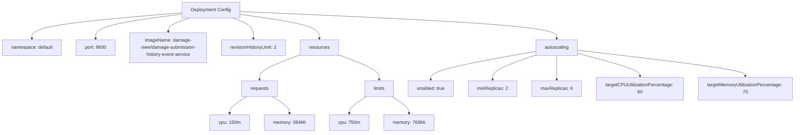

# Diagram: entity_core/entity_service/platform_applications/damage_submission_history_event/helm/values.yaml

> Auto-generated by Obscura crawlers

## Mermaid

### SVG

<svg id="container" width="2705.9453125" xmlns="http://www.w3.org/2000/svg" class="flowchart" height="454" viewBox="0 0 2705.9453125 454" role="graphics-document document" aria-roledescription="flowchart-v2"><g><marker id="container_flowchart-v2-pointEnd" class="marker flowchart-v2" viewBox="0 0 10 10" refX="5" refY="5" markerUnits="userSpaceOnUse" markerWidth="8" markerHeight="8" orient="auto"><path d="M 0 0 L 10 5 L 0 10 z" class="arrowMarkerPath" style="stroke-width: 1; stroke-dasharray: 1, 0;"></path></marker><marker id="container_flowchart-v2-pointStart" class="marker flowchart-v2" viewBox="0 0 10 10" refX="4.5" refY="5" markerUnits="userSpaceOnUse" markerWidth="8" markerHeight="8" orient="auto"><path d="M 0 5 L 10 10 L 10 0 z" class="arrowMarkerPath" style="stroke-width: 1; stroke-dasharray: 1, 0;"></path></marker><marker id="container_flowchart-v2-circleEnd" class="marker flowchart-v2" viewBox="0 0 10 10" refX="11" refY="5" markerUnits="userSpaceOnUse" markerWidth="11" markerHeight="11" orient="auto"><circle cx="5" cy="5" r="5" class="arrowMarkerPath" style="stroke-width: 1; stroke-dasharray: 1, 0;"></circle></marker><marker id="container_flowchart-v2-circleStart" class="marker flowchart-v2" viewBox="0 0 10 10" refX="-1" refY="5" markerUnits="userSpaceOnUse" markerWidth="11" markerHeight="11" orient="auto"><circle cx="5" cy="5" r="5" class="arrowMarkerPath" style="stroke-width: 1; stroke-dasharray: 1, 0;"></circle></marker><marker id="container_flowchart-v2-crossEnd" class="marker cross flowchart-v2" viewBox="0 0 11 11" refX="12" refY="5.2" markerUnits="userSpaceOnUse" markerWidth="11" markerHeight="11" orient="auto"><path d="M 1,1 l 9,9 M 10,1 l -9,9" class="arrowMarkerPath" style="stroke-width: 2; stroke-dasharray: 1, 0;"></path></marker><marker id="container_flowchart-v2-crossStart" class="marker cross flowchart-v2" viewBox="0 0 11 11" refX="-1" refY="5.2" markerUnits="userSpaceOnUse" markerWidth="11" markerHeight="11" orient="auto"><path d="M 1,1 l 9,9 M 10,1 l -9,9" class="arrowMarkerPath" style="stroke-width: 2; stroke-dasharray: 1, 0;"></path></marker><g class="root"><g class="clusters"></g><g class="edgePaths"><path d="M621.039,43.389L535.694,50.657C450.349,57.926,279.659,72.463,194.314,87.231C108.969,102,108.969,117,108.969,124.5L108.969,132" id="L_CFG_NAMESPACE_0" class="edge-thickness-normal edge-pattern-solid edge-thickness-normal edge-pattern-solid flowchart-link" style=";" data-edge="true" data-et="edge" data-id="L_CFG_NAMESPACE_0" data-points="W3sieCI6NjIxLjAzOTA2MjUsInkiOjQzLjM4ODg3ODIyNjA0Mzc4Nn0seyJ4IjoxMDguOTY4NzUsInkiOjg3fSx7IngiOjEwOC45Njg3NSwieSI6MTM2fV0=" marker-end="url(#container_flowchart-v2-pointEnd)"></path><path d="M621.039,48.049L572.035,54.541C523.031,61.033,425.023,74.016,376.02,88.008C327.016,102,327.016,117,327.016,124.5L327.016,132" id="L_CFG_PORT_0" class="edge-thickness-normal edge-pattern-solid edge-thickness-normal edge-pattern-solid flowchart-link" style=";" data-edge="true" data-et="edge" data-id="L_CFG_PORT_0" data-points="W3sieCI6NjIxLjAzOTA2MjUsInkiOjQ4LjA0ODkwMjMzNDY1MzU4fSx7IngiOjMyNy4wMTU2MjUsInkiOjg3fSx7IngiOjMyNy4wMTU2MjUsInkiOjEzNn1d" marker-end="url(#container_flowchart-v2-pointEnd)"></path><path d="M644.019,62L632.365,66.167C620.711,70.333,597.402,78.667,585.748,86.333C574.094,94,574.094,101,574.094,104.5L574.094,108" id="L_CFG_IMAGE_0" class="edge-thickness-normal edge-pattern-solid edge-thickness-normal edge-pattern-solid flowchart-link" style=";" data-edge="true" data-et="edge" data-id="L_CFG_IMAGE_0" data-points="W3sieCI6NjQ0LjAxOTM4MTAwOTYxNTQsInkiOjYyfSx7IngiOjU3NC4wOTM3NSwieSI6ODd9LHsieCI6NTc0LjA5Mzc1LCJ5IjoxMTJ9XQ==" marker-end="url(#container_flowchart-v2-pointEnd)"></path><path d="M795.059,62L806.713,66.167C818.367,70.333,841.676,78.667,853.33,90.333C864.984,102,864.984,117,864.984,124.5L864.984,132" id="L_CFG_REV_0" class="edge-thickness-normal edge-pattern-solid edge-thickness-normal edge-pattern-solid flowchart-link" style=";" data-edge="true" data-et="edge" data-id="L_CFG_REV_0" data-points="W3sieCI6Nzk1LjA1ODc0Mzk5MDM4NDYsInkiOjYyfSx7IngiOjg2NC45ODQzNzUsInkiOjg3fSx7IngiOjg2NC45ODQzNzUsInkiOjEzNn1d" marker-end="url(#container_flowchart-v2-pointEnd)"></path><path d="M818.039,48.798L863.492,55.165C908.945,61.532,999.852,74.266,1045.305,88.133C1090.758,102,1090.758,117,1090.758,124.5L1090.758,132" id="L_CFG_RES_0" class="edge-thickness-normal edge-pattern-solid edge-thickness-normal edge-pattern-solid flowchart-link" style=";" data-edge="true" data-et="edge" data-id="L_CFG_RES_0" data-points="W3sieCI6ODE4LjAzOTA2MjUsInkiOjQ4Ljc5Nzc5NDQyNzE0MDMzfSx7IngiOjEwOTAuNzU3ODEyNSwieSI6ODd9LHsieCI6MTA5MC43NTc4MTI1LCJ5IjoxMzZ9XQ==" marker-end="url(#container_flowchart-v2-pointEnd)"></path><path d="M1025.875,187.568L1003.237,196.14C980.599,204.712,935.323,221.856,912.685,235.928C890.047,250,890.047,261,890.047,266.5L890.047,272" id="L_RES_REQ_0" class="edge-thickness-normal edge-pattern-solid edge-thickness-normal edge-pattern-solid flowchart-link" style=";" data-edge="true" data-et="edge" data-id="L_RES_REQ_0" data-points="W3sieCI6MTAyNS44NzUsInkiOjE4Ny41NjgxMzY3MDE1Njg2NX0seyJ4Ijo4OTAuMDQ2ODc1LCJ5IjoyMzl9LHsieCI6ODkwLjA0Njg3NSwieSI6Mjc2fV0=" marker-end="url(#container_flowchart-v2-pointEnd)"></path><path d="M847.639,330L837.953,336.167C828.267,342.333,808.895,354.667,799.209,364.333C789.523,374,789.523,381,789.523,384.5L789.523,388" id="L_REQ_REQCPU_0" class="edge-thickness-normal edge-pattern-solid edge-thickness-normal edge-pattern-solid flowchart-link" style=";" data-edge="true" data-et="edge" data-id="L_REQ_REQCPU_0" data-points="W3sieCI6ODQ3LjYzODU0OTgwNDY4NzUsInkiOjMzMH0seyJ4Ijo3ODkuNTIzNDM3NSwieSI6MzY3fSx7IngiOjc4OS41MjM0Mzc1LCJ5IjozOTJ9XQ==" marker-end="url(#container_flowchart-v2-pointEnd)"></path><path d="M932.455,330L942.141,336.167C951.827,342.333,971.199,354.667,980.884,364.333C990.57,374,990.57,381,990.57,384.5L990.57,388" id="L_REQ_REQMEM_0" class="edge-thickness-normal edge-pattern-solid edge-thickness-normal edge-pattern-solid flowchart-link" style=";" data-edge="true" data-et="edge" data-id="L_REQ_REQMEM_0" data-points="W3sieCI6OTMyLjQ1NTIwMDE5NTMxMjUsInkiOjMzMH0seyJ4Ijo5OTAuNTcwMzEyNSwieSI6MzY3fSx7IngiOjk5MC41NzAzMTI1LCJ5IjozOTJ9XQ==" marker-end="url(#container_flowchart-v2-pointEnd)"></path><path d="M1155.641,187.529L1178.332,196.107C1201.023,204.686,1246.406,221.843,1269.098,235.921C1291.789,250,1291.789,261,1291.789,266.5L1291.789,272" id="L_RES_LIM_0" class="edge-thickness-normal edge-pattern-solid edge-thickness-normal edge-pattern-solid flowchart-link" style=";" data-edge="true" data-et="edge" data-id="L_RES_LIM_0" data-points="W3sieCI6MTE1NS42NDA2MjUsInkiOjE4Ny41Mjg5OTExMzk0MzcyN30seyJ4IjoxMjkxLjc4OTA2MjUsInkiOjIzOX0seyJ4IjoxMjkxLjc4OTA2MjUsInkiOjI3Nn1d" marker-end="url(#container_flowchart-v2-pointEnd)"></path><path d="M1249.516,330L1239.861,336.167C1230.206,342.333,1210.896,354.667,1201.241,364.333C1191.586,374,1191.586,381,1191.586,384.5L1191.586,388" id="L_LIM_LIMCPU_0" class="edge-thickness-normal edge-pattern-solid edge-thickness-normal edge-pattern-solid flowchart-link" style=";" data-edge="true" data-et="edge" data-id="L_LIM_LIMCPU_0" data-points="W3sieCI6MTI0OS41MTU4NjkxNDA2MjUsInkiOjMzMH0seyJ4IjoxMTkxLjU4NTkzNzUsInkiOjM2N30seyJ4IjoxMTkxLjU4NTkzNzUsInkiOjM5Mn1d" marker-end="url(#container_flowchart-v2-pointEnd)"></path><path d="M1334.062,330L1343.717,336.167C1353.372,342.333,1372.682,354.667,1382.337,364.333C1391.992,374,1391.992,381,1391.992,384.5L1391.992,388" id="L_LIM_LIMMEM_0" class="edge-thickness-normal edge-pattern-solid edge-thickness-normal edge-pattern-solid flowchart-link" style=";" data-edge="true" data-et="edge" data-id="L_LIM_LIMMEM_0" data-points="W3sieCI6MTMzNC4wNjIyNTU4NTkzNzUsInkiOjMzMH0seyJ4IjoxMzkxLjk5MjE4NzUsInkiOjM2N30seyJ4IjoxMzkxLjk5MjE4NzUsInkiOjM5Mn1d" marker-end="url(#container_flowchart-v2-pointEnd)"></path><path d="M818.039,39.35L997.857,47.292C1177.674,55.233,1537.31,71.117,1717.128,86.558C1896.945,102,1896.945,117,1896.945,124.5L1896.945,132" id="L_CFG_AUTO_0" class="edge-thickness-normal edge-pattern-solid edge-thickness-normal edge-pattern-solid flowchart-link" style=";" data-edge="true" data-et="edge" data-id="L_CFG_AUTO_0" data-points="W3sieCI6ODE4LjAzOTA2MjUsInkiOjM5LjM1MDI0MDE5OTU5MTI2fSx7IngiOjE4OTYuOTQ1MzEyNSwieSI6ODd9LHsieCI6MTg5Ni45NDUzMTI1LCJ5IjoxMzZ9XQ==" marker-end="url(#container_flowchart-v2-pointEnd)"></path><path d="M1825.297,175.777L1766.208,186.314C1707.12,196.851,1588.943,217.926,1529.854,233.963C1470.766,250,1470.766,261,1470.766,266.5L1470.766,272" id="L_AUTO_AEN_0" class="edge-thickness-normal edge-pattern-solid edge-thickness-normal edge-pattern-solid flowchart-link" style=";" data-edge="true" data-et="edge" data-id="L_AUTO_AEN_0" data-points="W3sieCI6MTgyNS4yOTY4NzUsInkiOjE3NS43NzY5NjEwMDg5NjQxfSx7IngiOjE0NzAuNzY1NjI1LCJ5IjoyMzl9LHsieCI6MTQ3MC43NjU2MjUsInkiOjI3Nn1d" marker-end="url(#container_flowchart-v2-pointEnd)"></path><path d="M1825.297,188.261L1801.311,196.717C1777.326,205.174,1729.354,222.087,1705.368,236.043C1681.383,250,1681.383,261,1681.383,266.5L1681.383,272" id="L_AUTO_AMIN_0" class="edge-thickness-normal edge-pattern-solid edge-thickness-normal edge-pattern-solid flowchart-link" style=";" data-edge="true" data-et="edge" data-id="L_AUTO_AMIN_0" data-points="W3sieCI6MTgyNS4yOTY4NzUsInkiOjE4OC4yNjA4MDAyMzE5NTEzfSx7IngiOjE2ODEuMzgyODEyNSwieSI6MjM5fSx7IngiOjE2ODEuMzgyODEyNSwieSI6Mjc2fV0=" marker-end="url(#container_flowchart-v2-pointEnd)"></path><path d="M1896.945,190L1896.945,198.167C1896.945,206.333,1896.945,222.667,1896.945,236.333C1896.945,250,1896.945,261,1896.945,266.5L1896.945,272" id="L_AUTO_AMAX_0" class="edge-thickness-normal edge-pattern-solid edge-thickness-normal edge-pattern-solid flowchart-link" style=";" data-edge="true" data-et="edge" data-id="L_AUTO_AMAX_0" data-points="W3sieCI6MTg5Ni45NDUzMTI1LCJ5IjoxOTB9LHsieCI6MTg5Ni45NDUzMTI1LCJ5IjoyMzl9LHsieCI6MTg5Ni45NDUzMTI1LCJ5IjoyNzZ9XQ==" marker-end="url(#container_flowchart-v2-pointEnd)"></path><path d="M1968.594,182.407L2003.415,191.839C2038.237,201.272,2107.88,220.136,2142.702,233.068C2177.523,246,2177.523,253,2177.523,256.5L2177.523,260" id="L_AUTO_ATCPU_0" class="edge-thickness-normal edge-pattern-solid edge-thickness-normal edge-pattern-solid flowchart-link" style=";" data-edge="true" data-et="edge" data-id="L_AUTO_ATCPU_0" data-points="W3sieCI6MTk2OC41OTM3NSwieSI6MTgyLjQwNzM2MjAzMTUxOTc0fSx7IngiOjIxNzcuNTIzNDM3NSwieSI6MjM5fSx7IngiOjIxNzcuNTIzNDM3NSwieSI6MjY0fV0=" marker-end="url(#container_flowchart-v2-pointEnd)"></path><path d="M1968.594,171.518L2063.201,182.765C2157.807,194.012,2347.021,216.506,2441.628,231.253C2536.234,246,2536.234,253,2536.234,256.5L2536.234,260" id="L_AUTO_ATMEM_0" class="edge-thickness-normal edge-pattern-solid edge-thickness-normal edge-pattern-solid flowchart-link" style=";" data-edge="true" data-et="edge" data-id="L_AUTO_ATMEM_0" data-points="W3sieCI6MTk2OC41OTM3NSwieSI6MTcxLjUxNzcxMzc2ODk1NzJ9LHsieCI6MjUzNi4yMzQzNzUsInkiOjIzOX0seyJ4IjoyNTM2LjIzNDM3NSwieSI6MjY0fV0=" marker-end="url(#container_flowchart-v2-pointEnd)"></path></g><g class="edgeLabels"><g class="edgeLabel"><g class="label" data-id="L_CFG_NAMESPACE_0" transform="translate(0, 0)"><foreignObject width="0" height="0">

</foreignObject></g></g><g class="edgeLabel"><g class="label" data-id="L_CFG_PORT_0" transform="translate(0, 0)"><foreignObject width="0" height="0">

</foreignObject></g></g><g class="edgeLabel"><g class="label" data-id="L_CFG_IMAGE_0" transform="translate(0, 0)"><foreignObject width="0" height="0">

</foreignObject></g></g><g class="edgeLabel"><g class="label" data-id="L_CFG_REV_0" transform="translate(0, 0)"><foreignObject width="0" height="0">

</foreignObject></g></g><g class="edgeLabel"><g class="label" data-id="L_CFG_RES_0" transform="translate(0, 0)"><foreignObject width="0" height="0">

</foreignObject></g></g><g class="edgeLabel"><g class="label" data-id="L_RES_REQ_0" transform="translate(0, 0)"><foreignObject width="0" height="0">

</foreignObject></g></g><g class="edgeLabel"><g class="label" data-id="L_REQ_REQCPU_0" transform="translate(0, 0)"><foreignObject width="0" height="0">

</foreignObject></g></g><g class="edgeLabel"><g class="label" data-id="L_REQ_REQMEM_0" transform="translate(0, 0)"><foreignObject width="0" height="0">

</foreignObject></g></g><g class="edgeLabel"><g class="label" data-id="L_RES_LIM_0" transform="translate(0, 0)"><foreignObject width="0" height="0">

</foreignObject></g></g><g class="edgeLabel"><g class="label" data-id="L_LIM_LIMCPU_0" transform="translate(0, 0)"><foreignObject width="0" height="0">

</foreignObject></g></g><g class="edgeLabel"><g class="label" data-id="L_LIM_LIMMEM_0" transform="translate(0, 0)"><foreignObject width="0" height="0">

</foreignObject></g></g><g class="edgeLabel"><g class="label" data-id="L_CFG_AUTO_0" transform="translate(0, 0)"><foreignObject width="0" height="0">

</foreignObject></g></g><g class="edgeLabel"><g class="label" data-id="L_AUTO_AEN_0" transform="translate(0, 0)"><foreignObject width="0" height="0">

</foreignObject></g></g><g class="edgeLabel"><g class="label" data-id="L_AUTO_AMIN_0" transform="translate(0, 0)"><foreignObject width="0" height="0">

</foreignObject></g></g><g class="edgeLabel"><g class="label" data-id="L_AUTO_AMAX_0" transform="translate(0, 0)"><foreignObject width="0" height="0">

</foreignObject></g></g><g class="edgeLabel"><g class="label" data-id="L_AUTO_ATCPU_0" transform="translate(0, 0)"><foreignObject width="0" height="0">

</foreignObject></g></g><g class="edgeLabel"><g class="label" data-id="L_AUTO_ATMEM_0" transform="translate(0, 0)"><foreignObject width="0" height="0">

</foreignObject></g></g></g><g class="nodes"><g class="node default" id="flowchart-CFG-0" transform="translate(719.5390625, 35)"><rect class="basic label-container" style="" x="-98.5" y="-27" width="197" height="54"></rect><g class="label" style="" transform="translate(-68.5, -12)"><rect></rect><foreignObject width="137" height="24">

Deployment Config

</foreignObject></g></g><g class="node default" id="flowchart-NAMESPACE-2" transform="translate(108.96875, 163)"><rect class="basic label-container" style="" x="-100.96875" y="-27" width="201.9375" height="54"></rect><g class="label" style="" transform="translate(-70.96875, -12)"><rect></rect><foreignObject width="141.9375" height="24">

namespace: default

</foreignObject></g></g><g class="node default" id="flowchart-PORT-4" transform="translate(327.015625, 163)"><rect class="basic label-container" style="" x="-67.078125" y="-27" width="134.15625" height="54"></rect><g class="label" style="" transform="translate(-37.078125, -12)"><rect></rect><foreignObject width="74.15625" height="24">

port: 8600

</foreignObject></g></g><g class="node default" id="flowchart-IMAGE-6" transform="translate(574.09375, 163)"><rect class="basic label-container" style="" x="-130" y="-51" width="260" height="102"></rect><g class="label" style="" transform="translate(-100, -36)"><rect></rect><foreignObject width="200" height="72">

imageName: damage-view/damage-submission-history-event-service

</foreignObject></g></g><g class="node default" id="flowchart-REV-8" transform="translate(864.984375, 163)"><rect class="basic label-container" style="" x="-110.890625" y="-27" width="221.78125" height="54"></rect><g class="label" style="" transform="translate(-80.890625, -12)"><rect></rect><foreignObject width="161.78125" height="24">

revisionHistoryLimit: 2

</foreignObject></g></g><g class="node default" id="flowchart-RES-10" transform="translate(1090.7578125, 163)"><rect class="basic label-container" style="" x="-64.8828125" y="-27" width="129.765625" height="54"></rect><g class="label" style="" transform="translate(-34.8828125, -12)"><rect></rect><foreignObject width="69.765625" height="24">

resources

</foreignObject></g></g><g class="node default" id="flowchart-REQ-12" transform="translate(890.046875, 303)"><rect class="basic label-container" style="" x="-61.375" y="-27" width="122.75" height="54"></rect><g class="label" style="" transform="translate(-31.375, -12)"><rect></rect><foreignObject width="62.75" height="24">

requests

</foreignObject></g></g><g class="node default" id="flowchart-REQCPU-14" transform="translate(789.5234375, 419)"><rect class="basic label-container" style="" x="-66.0703125" y="-27" width="132.140625" height="54"></rect><g class="label" style="" transform="translate(-36.0703125, -12)"><rect></rect><foreignObject width="72.140625" height="24">

cpu: 150m

</foreignObject></g></g><g class="node default" id="flowchart-REQMEM-16" transform="translate(990.5703125, 419)"><rect class="basic label-container" style="" x="-84.9765625" y="-27" width="169.953125" height="54"></rect><g class="label" style="" transform="translate(-54.9765625, -12)"><rect></rect><foreignObject width="109.953125" height="24">

memory: 384Mi

</foreignObject></g></g><g class="node default" id="flowchart-LIM-18" transform="translate(1291.7890625, 303)"><rect class="basic label-container" style="" x="-50.34375" y="-27" width="100.6875" height="54"></rect><g class="label" style="" transform="translate(-20.34375, -12)"><rect></rect><foreignObject width="40.6875" height="24">

limits

</foreignObject></g></g><g class="node default" id="flowchart-LIMCPU-20" transform="translate(1191.5859375, 419)"><rect class="basic label-container" style="" x="-66.0390625" y="-27" width="132.078125" height="54"></rect><g class="label" style="" transform="translate(-36.0390625, -12)"><rect></rect><foreignObject width="72.078125" height="24">

cpu: 750m

</foreignObject></g></g><g class="node default" id="flowchart-LIMMEM-22" transform="translate(1391.9921875, 419)"><rect class="basic label-container" style="" x="-84.3671875" y="-27" width="168.734375" height="54"></rect><g class="label" style="" transform="translate(-54.3671875, -12)"><rect></rect><foreignObject width="108.734375" height="24">

memory: 768Mi

</foreignObject></g></g><g class="node default" id="flowchart-AUTO-24" transform="translate(1896.9453125, 163)"><rect class="basic label-container" style="" x="-71.6484375" y="-27" width="143.296875" height="54"></rect><g class="label" style="" transform="translate(-41.6484375, -12)"><rect></rect><foreignObject width="83.296875" height="24">

autoscaling

</foreignObject></g></g><g class="node default" id="flowchart-AEN-26" transform="translate(1470.765625, 303)"><rect class="basic label-container" style="" x="-78.6328125" y="-27" width="157.265625" height="54"></rect><g class="label" style="" transform="translate(-48.6328125, -12)"><rect></rect><foreignObject width="97.265625" height="24">

enabled: true

</foreignObject></g></g><g class="node default" id="flowchart-AMIN-28" transform="translate(1681.3828125, 303)"><rect class="basic label-container" style="" x="-81.984375" y="-27" width="163.96875" height="54"></rect><g class="label" style="" transform="translate(-51.984375, -12)"><rect></rect><foreignObject width="103.96875" height="24">

minReplicas: 2

</foreignObject></g></g><g class="node default" id="flowchart-AMAX-30" transform="translate(1896.9453125, 303)"><rect class="basic label-container" style="" x="-83.578125" y="-27" width="167.15625" height="54"></rect><g class="label" style="" transform="translate(-53.578125, -12)"><rect></rect><foreignObject width="107.15625" height="24">

maxReplicas: 6

</foreignObject></g></g><g class="node default" id="flowchart-ATCPU-32" transform="translate(2177.5234375, 303)"><rect class="basic label-container" style="" x="-147" y="-39" width="294" height="78"></rect><g class="label" style="" transform="translate(-117, -24)"><rect></rect><foreignObject width="234" height="48">

targetCPUUtilizationPercentage: 60

</foreignObject></g></g><g class="node default" id="flowchart-ATMEM-34" transform="translate(2536.234375, 303)"><rect class="basic label-container" style="" x="-161.7109375" y="-39" width="323.421875" height="78"></rect><g class="label" style="" transform="translate(-131.7109375, -24)"><rect></rect><foreignObject width="263.421875" height="48">

targetMemoryUtilizationPercentage: 70

</foreignObject></g></g></g></g></g></svg>
