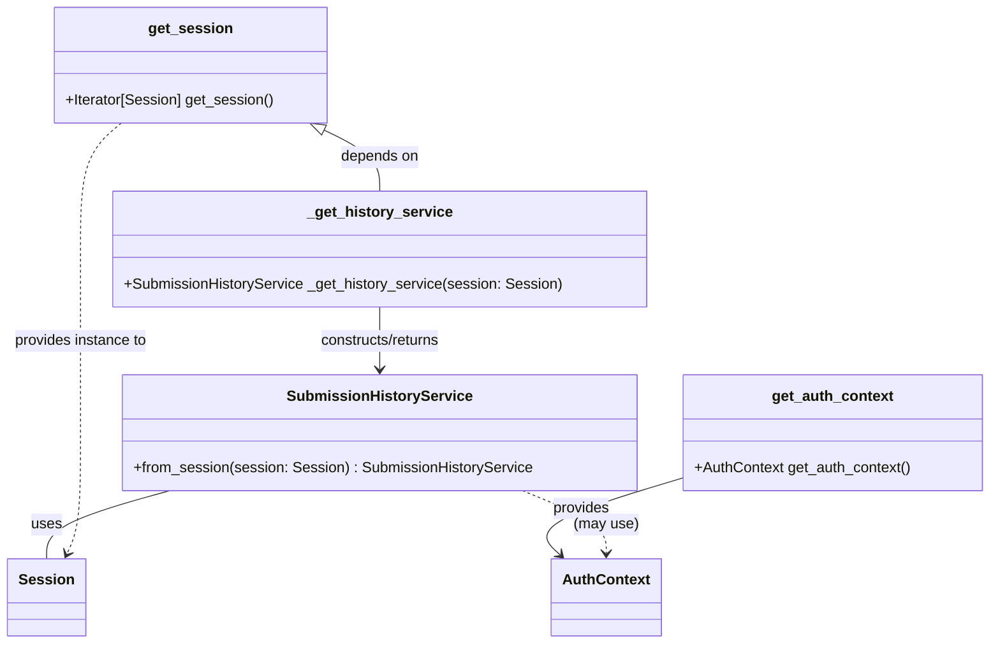

# Diagram: entity_core/entity_service/platform_applications/damage_submission_history_event/src/api/dependencies.py


> Auto-generated by Obscura crawlers

## Diagram 1

```mermaid
flowchart TD
    Req[Incoming Request] --> AuthCall[get_auth_context()]
    Req --> SessionCall[get_session()]
    AuthCall --> AuthCtx[AuthContext]
    SessionCall --> SessionObj[Session instance]
    SessionCall --> YieldSession[yield session]
    YieldSession --> FinallyClose[finally: session.close()]
    SessionObj --> _GetHistory[_get_history_service(session)]
    _GetHistory --> HistorySvc[SubmissionHistoryService.from_session(session)]
    HistorySvc --> ServiceDep[ServiceDep (Depends(_get_history_service))]
    AuthCtx --> AuthDep[AuthDep (Depends(get_auth_context))]
    SessionObj --> SessionDep[SessionDep (Annotated Session, Depends(get_session))]
```

> SVG rendering failed for this diagram.

## Diagram 2



### SVG

<svg id="container" width="1065.51171875" xmlns="http://www.w3.org/2000/svg" class="classDiagram" height="700" viewBox="0 0 1065.51171875 700" role="graphics-document document" aria-roledescription="class"><style>#container{font-family:"trebuchet ms",verdana,arial,sans-serif;font-size:16px;fill:#333;}@keyframes edge-animation-frame{from{stroke-dashoffset:0;}}@keyframes dash{to{stroke-dashoffset:0;}}#container .edge-animation-slow{stroke-dasharray:9,5!important;stroke-dashoffset:900;animation:dash 50s linear infinite;stroke-linecap:round;}#container .edge-animation-fast{stroke-dasharray:9,5!important;stroke-dashoffset:900;animation:dash 20s linear infinite;stroke-linecap:round;}#container .error-icon{fill:#552222;}#container .error-text{fill:#552222;stroke:#552222;}#container .edge-thickness-normal{stroke-width:1px;}#container .edge-thickness-thick{stroke-width:3.5px;}#container .edge-pattern-solid{stroke-dasharray:0;}#container .edge-thickness-invisible{stroke-width:0;fill:none;}#container .edge-pattern-dashed{stroke-dasharray:3;}#container .edge-pattern-dotted{stroke-dasharray:2;}#container .marker{fill:#333333;stroke:#333333;}#container .marker.cross{stroke:#333333;}#container svg{font-family:"trebuchet ms",verdana,arial,sans-serif;font-size:16px;}#container p{margin:0;}#container g.classGroup text{fill:#9370DB;stroke:none;font-family:"trebuchet ms",verdana,arial,sans-serif;font-size:10px;}#container g.classGroup text .title{font-weight:bolder;}#container .nodeLabel,#container .edgeLabel{color:#131300;}#container .edgeLabel .label rect{fill:#ECECFF;}#container .label text{fill:#131300;}#container .labelBkg{background:#ECECFF;}#container .edgeLabel .label span{background:#ECECFF;}#container .classTitle{font-weight:bolder;}#container .node rect,#container .node circle,#container .node ellipse,#container .node polygon,#container .node path{fill:#ECECFF;stroke:#9370DB;stroke-width:1px;}#container .divider{stroke:#9370DB;stroke-width:1;}#container g.clickable{cursor:pointer;}#container g.classGroup rect{fill:#ECECFF;stroke:#9370DB;}#container g.classGroup line{stroke:#9370DB;stroke-width:1;}#container .classLabel .box{stroke:none;stroke-width:0;fill:#ECECFF;opacity:0.5;}#container .classLabel .label{fill:#9370DB;font-size:10px;}#container .relation{stroke:#333333;stroke-width:1;fill:none;}#container .dashed-line{stroke-dasharray:3;}#container .dotted-line{stroke-dasharray:1 2;}#container #compositionStart,#container .composition{fill:#333333!important;stroke:#333333!important;stroke-width:1;}#container #compositionEnd,#container .composition{fill:#333333!important;stroke:#333333!important;stroke-width:1;}#container #dependencyStart,#container .dependency{fill:#333333!important;stroke:#333333!important;stroke-width:1;}#container #dependencyStart,#container .dependency{fill:#333333!important;stroke:#333333!important;stroke-width:1;}#container #extensionStart,#container .extension{fill:transparent!important;stroke:#333333!important;stroke-width:1;}#container #extensionEnd,#container .extension{fill:transparent!important;stroke:#333333!important;stroke-width:1;}#container #aggregationStart,#container .aggregation{fill:transparent!important;stroke:#333333!important;stroke-width:1;}#container #aggregationEnd,#container .aggregation{fill:transparent!important;stroke:#333333!important;stroke-width:1;}#container #lollipopStart,#container .lollipop{fill:#ECECFF!important;stroke:#333333!important;stroke-width:1;}#container #lollipopEnd,#container .lollipop{fill:#ECECFF!important;stroke:#333333!important;stroke-width:1;}#container .edgeTerminals{font-size:11px;line-height:initial;}#container .classTitleText{text-anchor:middle;font-size:18px;fill:#333;}#container .label-icon{display:inline-block;height:1em;overflow:visible;vertical-align:-0.125em;}#container .node .label-icon path{fill:currentColor;stroke:revert;stroke-width:revert;}#container :root{--mermaid-font-family:"trebuchet ms",verdana,arial,sans-serif;}</style><g><defs><marker id="container_class-aggregationStart" class="marker aggregation class" refX="18" refY="7" markerWidth="190" markerHeight="240" orient="auto"><path d="M 18,7 L9,13 L1,7 L9,1 Z"></path></marker></defs><defs><marker id="container_class-aggregationEnd" class="marker aggregation class" refX="1" refY="7" markerWidth="20" markerHeight="28" orient="auto"><path d="M 18,7 L9,13 L1,7 L9,1 Z"></path></marker></defs><defs><marker id="container_class-extensionStart" class="marker extension class" refX="18" refY="7" markerWidth="190" markerHeight="240" orient="auto"><path d="M 1,7 L18,13 V 1 Z"></path></marker></defs><defs><marker id="container_class-extensionEnd" class="marker extension class" refX="1" refY="7" markerWidth="20" markerHeight="28" orient="auto"><path d="M 1,1 V 13 L18,7 Z"></path></marker></defs><defs><marker id="container_class-compositionStart" class="marker composition class" refX="18" refY="7" markerWidth="190" markerHeight="240" orient="auto"><path d="M 18,7 L9,13 L1,7 L9,1 Z"></path></marker></defs><defs><marker id="container_class-compositionEnd" class="marker composition class" refX="1" refY="7" markerWidth="20" markerHeight="28" orient="auto"><path d="M 18,7 L9,13 L1,7 L9,1 Z"></path></marker></defs><defs><marker id="container_class-dependencyStart" class="marker dependency class" refX="6" refY="7" markerWidth="190" markerHeight="240" orient="auto"><path d="M 5,7 L9,13 L1,7 L9,1 Z"></path></marker></defs><defs><marker id="container_class-dependencyEnd" class="marker dependency class" refX="13" refY="7" markerWidth="20" markerHeight="28" orient="auto"><path d="M 18,7 L9,13 L14,7 L9,1 Z"></path></marker></defs><defs><marker id="container_class-lollipopStart" class="marker lollipop class" refX="13" refY="7" markerWidth="190" markerHeight="240" orient="auto"><circle stroke="black" fill="transparent" cx="7" cy="7" r="6"></circle></marker></defs><defs><marker id="container_class-lollipopEnd" class="marker lollipop class" refX="1" refY="7" markerWidth="190" markerHeight="240" orient="auto"><circle stroke="black" fill="transparent" cx="7" cy="7" r="6"></circle></marker></defs><g class="root"><g class="clusters"></g><g class="edgePaths"><path d="M347.194,141.577L357.224,146.481C367.254,151.384,387.315,161.192,397.345,172.263C407.375,183.333,407.375,195.667,407.375,201.833L407.375,208" id="id_get_session__get_history_service_1" class="edge-thickness-normal edge-pattern-solid relation" style=";;;" data-edge="true" data-et="edge" data-id="id_get_session__get_history_service_1" data-points="W3sieCI6MzMxLjY5Njk5MjE4NzUsInkiOjEzNH0seyJ4Ijo0MDcuMzc1LCJ5IjoxNzF9LHsieCI6NDA3LjM3NSwieSI6MjA4fV0=" marker-start="url(#container_class-extensionStart)"></path><path d="M407.375,334L407.375,340.167C407.375,346.333,407.375,358.667,407.375,370C407.375,381.333,407.375,391.667,407.375,396.833L407.375,402" id="id__get_history_service_SubmissionHistoryService_2" class="edge-thickness-normal edge-pattern-solid relation" style=";;;" data-edge="true" data-et="edge" data-id="id__get_history_service_SubmissionHistoryService_2" data-points="W3sieCI6NDA3LjM3NSwieSI6MzM0fSx7IngiOjQwNy4zNzUsInkiOjM3MX0seyJ4Ijo0MDcuMzc1LCJ5Ijo0MDh9XQ==" marker-end="url(#container_class-dependencyEnd)"></path><path d="M181.102,534L158.953,540.167C136.805,546.333,92.508,558.667,70.359,571C48.211,583.333,48.211,595.667,48.211,601.833L48.211,608" id="id_SubmissionHistoryService_Session_3" class="edge-thickness-normal edge-pattern-solid relation" style=";;;" data-edge="true" data-et="edge" data-id="id_SubmissionHistoryService_Session_3" data-points="W3sieCI6MTgxLjEwMTY0MDYyNSwieSI6NTM0fSx7IngiOjQ4LjIxMDkzNzUsInkiOjU3MX0seyJ4Ijo0OC4yMTA5Mzc1LCJ5Ijo2MDh9XQ=="></path><path d="M733.207,520.079L705.167,528.566C677.128,537.053,621.048,554.026,599.015,568.005C576.981,581.984,588.993,592.967,595,598.459L601.006,603.951" id="id_get_auth_context_AuthContext_4" class="edge-thickness-normal edge-pattern-solid relation" style=";;;" data-edge="true" data-et="edge" data-id="id_get_auth_context_AuthContext_4" data-points="W3sieCI6NzMzLjIwNzAzMTI1LCJ5Ijo1MjAuMDc4OTc4NDgxOTEwN30seyJ4Ijo1NjQuOTY4NzUsInkiOjU3MX0seyJ4Ijo2MDUuNDMzODQwOTgxMDEyNiwieSI6NjA4fV0=" marker-end="url(#container_class-dependencyEnd)"></path><path d="M128.414,134L121.129,140.167C113.844,146.333,99.273,158.667,91.988,181.5C84.703,204.333,84.703,237.667,84.703,271C84.703,304.333,84.703,337.667,84.703,371C84.703,404.333,84.703,437.667,84.703,471C84.703,504.333,84.703,537.667,82.274,559.592C79.845,581.518,74.986,592.035,72.557,597.294L70.128,602.553" id="id_get_session_Session_5" class="edge-thickness-normal edge-pattern-dashed relation" style=";;;" data-edge="true" data-et="edge" data-id="id_get_session_Session_5" data-points="W3sieCI6MTI4LjQxMzcxMDkzNzUsInkiOjEzNH0seyJ4Ijo4NC43MDMxMjUsInkiOjE3MX0seyJ4Ijo4NC43MDMxMjUsInkiOjI3MX0seyJ4Ijo4NC43MDMxMjUsInkiOjM3MX0seyJ4Ijo4NC43MDMxMjUsInkiOjQ3MX0seyJ4Ijo4NC43MDMxMjUsInkiOjU3MX0seyJ4Ijo2Ny42MTE4NDczMTAxMjY1OCwieSI6NjA4fV0=" marker-end="url(#container_class-dependencyEnd)"></path><path d="M561.09,534L576.136,540.167C591.182,546.333,621.275,558.667,636.321,570C651.367,581.333,651.367,591.667,651.367,596.833L651.367,602" id="id_SubmissionHistoryService_AuthContext_6" class="edge-thickness-normal edge-pattern-dashed relation" style=";;;" data-edge="true" data-et="edge" data-id="id_SubmissionHistoryService_AuthContext_6" data-points="W3sieCI6NTYxLjA5MDA3ODEyNSwieSI6NTM0fSx7IngiOjY1MS4zNjcxODc1LCJ5Ijo1NzF9LHsieCI6NjUxLjM2NzE4NzUsInkiOjYwOH1d" marker-end="url(#container_class-dependencyEnd)"></path></g><g class="edgeLabels"><g class="edgeLabel" transform="translate(407.375, 171)"><g class="label" data-id="id_get_session__get_history_service_1" transform="translate(-42.9453125, -12)"><foreignObject width="85.890625" height="24"><div xmlns="http://www.w3.org/1999/xhtml" class="labelBkg" style="display: table-cell; white-space: nowrap; line-height: 1.5; max-width: 200px; text-align: center;"><span class="edgeLabel"><p>depends on</p></span></div></foreignObject></g></g><g class="edgeLabel" transform="translate(407.375, 371)"><g class="label" data-id="id__get_history_service_SubmissionHistoryService_2" transform="translate(-68.03125, -12)"><foreignObject width="136.0625" height="24"><div xmlns="http://www.w3.org/1999/xhtml" class="labelBkg" style="display: table-cell; white-space: nowrap; line-height: 1.5; max-width: 200px; text-align: center;"><span class="edgeLabel"><p>constructs/returns</p></span></div></foreignObject></g></g><g class="edgeLabel" transform="translate(48.2109375, 571)"><g class="label" data-id="id_SubmissionHistoryService_Session_3" transform="translate(-16.4921875, -12)"><foreignObject width="32.984375" height="24"><div xmlns="http://www.w3.org/1999/xhtml" class="labelBkg" style="display: table-cell; white-space: nowrap; line-height: 1.5; max-width: 200px; text-align: center;"><span class="edgeLabel"><p>uses</p></span></div></foreignObject></g></g><g class="edgeLabel" transform="translate(622.84805, 553.48156)"><g class="label" data-id="id_get_auth_context_AuthContext_4" transform="translate(-31.3125, -12)"><foreignObject width="62.625" height="24"><div xmlns="http://www.w3.org/1999/xhtml" class="labelBkg" style="display: table-cell; white-space: nowrap; line-height: 1.5; max-width: 200px; text-align: center;"><span class="edgeLabel"><p>provides</p></span></div></foreignObject></g></g><g class="edgeLabel" transform="translate(84.703125, 371)"><g class="label" data-id="id_get_session_Session_5" transform="translate(-73.5703125, -12)"><foreignObject width="147.140625" height="24"><div xmlns="http://www.w3.org/1999/xhtml" class="labelBkg" style="display: table-cell; white-space: nowrap; line-height: 1.5; max-width: 200px; text-align: center;"><span class="edgeLabel"><p>provides instance to</p></span></div></foreignObject></g></g><g class="edgeLabel" transform="translate(651.3671875, 571)"><g class="label" data-id="id_SubmissionHistoryService_AuthContext_6" transform="translate(-35.0859375, -12)"><foreignObject width="70.171875" height="24"><div xmlns="http://www.w3.org/1999/xhtml" class="labelBkg" style="display: table-cell; white-space: nowrap; line-height: 1.5; max-width: 200px; text-align: center;"><span class="edgeLabel"><p>(may use)</p></span></div></foreignObject></g></g></g><g class="nodes"><g class="node default" id="classId-get_session-0" transform="translate(202.83984375, 71)"><g class="basic label-container"><path d="M-147.59765625 -63 L147.59765625 -63 L147.59765625 63 L-147.59765625 63" stroke="none" stroke-width="0" fill="#ECECFF" style=""></path><path d="M-147.59765625 -63 C-39.33523951927242 -63, 68.92717721145516 -63, 147.59765625 -63 M-147.59765625 -63 C-40.19241297282012 -63, 67.21283030435976 -63, 147.59765625 -63 M147.59765625 -63 C147.59765625 -36.02788106363681, 147.59765625 -9.055762127273617, 147.59765625 63 M147.59765625 -63 C147.59765625 -18.26441059429859, 147.59765625 26.471178811402822, 147.59765625 63 M147.59765625 63 C64.36669213916326 63, -18.864271971673475 63, -147.59765625 63 M147.59765625 63 C70.73166074718475 63, -6.134334755630505 63, -147.59765625 63 M-147.59765625 63 C-147.59765625 35.394600274335616, -147.59765625 7.789200548671239, -147.59765625 -63 M-147.59765625 63 C-147.59765625 26.20083552661147, -147.59765625 -10.598328946777059, -147.59765625 -63" stroke="#9370DB" stroke-width="1.3" fill="none" stroke-dasharray="0 0" style=""></path></g><g class="annotation-group text" transform="translate(0, -39)"></g><g class="label-group text" transform="translate(-43.3984375, -39)"><g class="label" style="font-weight: bolder" transform="translate(0,-12)"><foreignObject width="86.796875" height="24"><div xmlns="http://www.w3.org/1999/xhtml" style="display: table-cell; white-space: nowrap; line-height: 1.5; max-width: 135px; text-align: center;"><span class="nodeLabel markdown-node-label" style=""><p>get_session</p></span></div></foreignObject></g></g><g class="members-group text" transform="translate(-135.59765625, 9)"></g><g class="methods-group text" transform="translate(-135.59765625, 39)"><g class="label" style="" transform="translate(0,-12)"><foreignObject width="227.796875" height="24"><div xmlns="http://www.w3.org/1999/xhtml" style="display: table-cell; white-space: nowrap; line-height: 1.5; max-width: 285px; text-align: center;"><span class="nodeLabel markdown-node-label" style=""><p>+Iterator[Session] get_session()</p></span></div></foreignObject></g></g><g class="divider" style=""><path d="M-147.59765625 -15 C-30.279674569962467 -15, 87.03830711007507 -15, 147.59765625 -15 M-147.59765625 -15 C-64.81523357878312 -15, 17.967189092433756 -15, 147.59765625 -15" stroke="#9370DB" stroke-width="1.3" fill="none" stroke-dasharray="0 0" style=""></path></g><g class="divider" style=""><path d="M-147.59765625 9 C-49.663681603690364 9, 48.27029304261927 9, 147.59765625 9 M-147.59765625 9 C-47.963000400103354 9, 51.67165544979329 9, 147.59765625 9" stroke="#9370DB" stroke-width="1.3" fill="none" stroke-dasharray="0 0" style=""></path></g></g><g class="node default" id="classId-_get_history_service-1" transform="translate(407.375, 271)"><g class="basic label-container"><path d="M-287.671875 -63 L287.671875 -63 L287.671875 63 L-287.671875 63" stroke="none" stroke-width="0" fill="#ECECFF" style=""></path><path d="M-287.671875 -63 C-75.17471570491142 -63, 137.32244359017716 -63, 287.671875 -63 M-287.671875 -63 C-95.94919869724299 -63, 95.77347760551402 -63, 287.671875 -63 M287.671875 -63 C287.671875 -13.88154275610966, 287.671875 35.23691448778068, 287.671875 63 M287.671875 -63 C287.671875 -16.868351683280032, 287.671875 29.263296633439936, 287.671875 63 M287.671875 63 C100.54151841207684 63, -86.58883817584632 63, -287.671875 63 M287.671875 63 C152.28509938831917 63, 16.898323776638335 63, -287.671875 63 M-287.671875 63 C-287.671875 26.290401325416447, -287.671875 -10.419197349167106, -287.671875 -63 M-287.671875 63 C-287.671875 25.69524102489744, -287.671875 -11.609517950205117, -287.671875 -63" stroke="#9370DB" stroke-width="1.3" fill="none" stroke-dasharray="0 0" style=""></path></g><g class="annotation-group text" transform="translate(0, -39)"></g><g class="label-group text" transform="translate(-75.75, -39)"><g class="label" style="font-weight: bolder" transform="translate(0,-12)"><foreignObject width="151.5" height="24"><div xmlns="http://www.w3.org/1999/xhtml" style="display: table-cell; white-space: nowrap; line-height: 1.5; max-width: 198px; text-align: center;"><span class="nodeLabel markdown-node-label" style=""><p>_get_history_service</p></span></div></foreignObject></g></g><g class="members-group text" transform="translate(-275.671875, 9)"></g><g class="methods-group text" transform="translate(-275.671875, 39)"><g class="label" style="" transform="translate(0,-12)"><foreignObject width="475.59375" height="24"><div xmlns="http://www.w3.org/1999/xhtml" style="display: table-cell; white-space: nowrap; line-height: 1.5; max-width: 533px; text-align: center;"><span class="nodeLabel markdown-node-label" style=""><p>+SubmissionHistoryService _get_history_service(session: Session)</p></span></div></foreignObject></g></g><g class="divider" style=""><path d="M-287.671875 -15 C-144.06051215490234 -15, -0.4491493098046817 -15, 287.671875 -15 M-287.671875 -15 C-99.98335521435385 -15, 87.7051645712923 -15, 287.671875 -15" stroke="#9370DB" stroke-width="1.3" fill="none" stroke-dasharray="0 0" style=""></path></g><g class="divider" style=""><path d="M-287.671875 9 C-77.52436907231765 9, 132.6231368553647 9, 287.671875 9 M-287.671875 9 C-144.1874547731822 9, -0.7030345463643926 9, 287.671875 9" stroke="#9370DB" stroke-width="1.3" fill="none" stroke-dasharray="0 0" style=""></path></g></g><g class="node default" id="classId-SubmissionHistoryService-2" transform="translate(407.375, 471)"><g class="basic label-container"><path d="M-275.83203125 -63 L275.83203125 -63 L275.83203125 63 L-275.83203125 63" stroke="none" stroke-width="0" fill="#ECECFF" style=""></path><path d="M-275.83203125 -63 C-118.97752318479291 -63, 37.87698488041417 -63, 275.83203125 -63 M-275.83203125 -63 C-81.51993223971502 -63, 112.79216677056996 -63, 275.83203125 -63 M275.83203125 -63 C275.83203125 -22.96718606424433, 275.83203125 17.06562787151134, 275.83203125 63 M275.83203125 -63 C275.83203125 -15.050457860655001, 275.83203125 32.89908427869, 275.83203125 63 M275.83203125 63 C126.60204109710816 63, -22.627949055783688 63, -275.83203125 63 M275.83203125 63 C65.70350942750997 63, -144.42501239498006 63, -275.83203125 63 M-275.83203125 63 C-275.83203125 33.031820440132336, -275.83203125 3.0636408802646784, -275.83203125 -63 M-275.83203125 63 C-275.83203125 14.084647308134201, -275.83203125 -34.8307053837316, -275.83203125 -63" stroke="#9370DB" stroke-width="1.3" fill="none" stroke-dasharray="0 0" style=""></path></g><g class="annotation-group text" transform="translate(0, -39)"></g><g class="label-group text" transform="translate(-95.2265625, -39)"><g class="label" style="font-weight: bolder" transform="translate(0,-12)"><foreignObject width="190.453125" height="24"><div xmlns="http://www.w3.org/1999/xhtml" style="display: table-cell; white-space: nowrap; line-height: 1.5; max-width: 238px; text-align: center;"><span class="nodeLabel markdown-node-label" style=""><p>SubmissionHistoryService</p></span></div></foreignObject></g></g><g class="members-group text" transform="translate(-263.83203125, 9)"></g><g class="methods-group text" transform="translate(-263.83203125, 39)"><g class="label" style="" transform="translate(0,-12)"><foreignObject width="432.4375" height="24"><div xmlns="http://www.w3.org/1999/xhtml" style="display: table-cell; white-space: nowrap; line-height: 1.5; max-width: 490px; text-align: center;"><span class="nodeLabel markdown-node-label" style=""><p>+from_session(session: Session) : SubmissionHistoryService</p></span></div></foreignObject></g></g><g class="divider" style=""><path d="M-275.83203125 -15 C-73.36278586955137 -15, 129.10645951089725 -15, 275.83203125 -15 M-275.83203125 -15 C-101.77166230302322 -15, 72.28870664395356 -15, 275.83203125 -15" stroke="#9370DB" stroke-width="1.3" fill="none" stroke-dasharray="0 0" style=""></path></g><g class="divider" style=""><path d="M-275.83203125 9 C-106.9520050736084 9, 61.92802110278319 9, 275.83203125 9 M-275.83203125 9 C-63.36605240540115 9, 149.0999264391977 9, 275.83203125 9" stroke="#9370DB" stroke-width="1.3" fill="none" stroke-dasharray="0 0" style=""></path></g></g><g class="node default" id="classId-AuthContext-3" transform="translate(651.3671875, 650)"><g class="basic label-container"><path d="M-57.171875 -42 L57.171875 -42 L57.171875 42 L-57.171875 42" stroke="none" stroke-width="0" fill="#ECECFF" style=""></path><path d="M-57.171875 -42 C-18.665300966214538 -42, 19.841273067570924 -42, 57.171875 -42 M-57.171875 -42 C-17.041622345849838 -42, 23.088630308300324 -42, 57.171875 -42 M57.171875 -42 C57.171875 -21.31702977487816, 57.171875 -0.6340595497563228, 57.171875 42 M57.171875 -42 C57.171875 -19.50153054502396, 57.171875 2.9969389099520782, 57.171875 42 M57.171875 42 C19.02500981611503 42, -19.12185536776994 42, -57.171875 42 M57.171875 42 C27.489846992299313 42, -2.192181015401374 42, -57.171875 42 M-57.171875 42 C-57.171875 18.326950722428506, -57.171875 -5.346098555142987, -57.171875 -42 M-57.171875 42 C-57.171875 12.99586784213188, -57.171875 -16.00826431573624, -57.171875 -42" stroke="#9370DB" stroke-width="1.3" fill="none" stroke-dasharray="0 0" style=""></path></g><g class="annotation-group text" transform="translate(0, -18)"></g><g class="label-group text" transform="translate(-45.171875, -18)"><g class="label" style="font-weight: bolder" transform="translate(0,-12)"><foreignObject width="90.34375" height="24"><div xmlns="http://www.w3.org/1999/xhtml" style="display: table-cell; white-space: nowrap; line-height: 1.5; max-width: 139px; text-align: center;"><span class="nodeLabel markdown-node-label" style=""><p>AuthContext</p></span></div></foreignObject></g></g><g class="members-group text" transform="translate(-45.171875, 30)"></g><g class="methods-group text" transform="translate(-45.171875, 60)"></g><g class="divider" style=""><path d="M-57.171875 6 C-16.995426345126923 6, 23.181022309746155 6, 57.171875 6 M-57.171875 6 C-11.704501632141216 6, 33.76287173571757 6, 57.171875 6" stroke="#9370DB" stroke-width="1.3" fill="none" stroke-dasharray="0 0" style=""></path></g><g class="divider" style=""><path d="M-57.171875 24 C-12.88375957384627 24, 31.40435585230746 24, 57.171875 24 M-57.171875 24 C-14.156903836716019 24, 28.858067326567962 24, 57.171875 24" stroke="#9370DB" stroke-width="1.3" fill="none" stroke-dasharray="0 0" style=""></path></g></g><g class="node default" id="classId-get_auth_context-4" transform="translate(895.359375, 471)"><g class="basic label-container"><path d="M-162.15234375 -63 L162.15234375 -63 L162.15234375 63 L-162.15234375 63" stroke="none" stroke-width="0" fill="#ECECFF" style=""></path><path d="M-162.15234375 -63 C-63.08700721780262 -63, 35.978329314394756 -63, 162.15234375 -63 M-162.15234375 -63 C-54.00349462133363 -63, 54.14535450733274 -63, 162.15234375 -63 M162.15234375 -63 C162.15234375 -23.369930930793174, 162.15234375 16.26013813841365, 162.15234375 63 M162.15234375 -63 C162.15234375 -20.83593803025886, 162.15234375 21.328123939482282, 162.15234375 63 M162.15234375 63 C33.10750856146592 63, -95.93732662706816 63, -162.15234375 63 M162.15234375 63 C59.38662179643933 63, -43.37910015712134 63, -162.15234375 63 M-162.15234375 63 C-162.15234375 18.906924609646836, -162.15234375 -25.186150780706328, -162.15234375 -63 M-162.15234375 63 C-162.15234375 23.166949919879237, -162.15234375 -16.666100160241527, -162.15234375 -63" stroke="#9370DB" stroke-width="1.3" fill="none" stroke-dasharray="0 0" style=""></path></g><g class="annotation-group text" transform="translate(0, -39)"></g><g class="label-group text" transform="translate(-63.8046875, -39)"><g class="label" style="font-weight: bolder" transform="translate(0,-12)"><foreignObject width="127.609375" height="24"><div xmlns="http://www.w3.org/1999/xhtml" style="display: table-cell; white-space: nowrap; line-height: 1.5; max-width: 176px; text-align: center;"><span class="nodeLabel markdown-node-label" style=""><p>get_auth_context</p></span></div></foreignObject></g></g><g class="members-group text" transform="translate(-150.15234375, 9)"></g><g class="methods-group text" transform="translate(-150.15234375, 39)"><g class="label" style="" transform="translate(0,-12)"><foreignObject width="236.5" height="24"><div xmlns="http://www.w3.org/1999/xhtml" style="display: table-cell; white-space: nowrap; line-height: 1.5; max-width: 294px; text-align: center;"><span class="nodeLabel markdown-node-label" style=""><p>+AuthContext get_auth_context()</p></span></div></foreignObject></g></g><g class="divider" style=""><path d="M-162.15234375 -15 C-74.05366423716978 -15, 14.045015275660433 -15, 162.15234375 -15 M-162.15234375 -15 C-69.82844014490098 -15, 22.49546346019804 -15, 162.15234375 -15" stroke="#9370DB" stroke-width="1.3" fill="none" stroke-dasharray="0 0" style=""></path></g><g class="divider" style=""><path d="M-162.15234375 9 C-61.083684688416184 9, 39.98497437316763 9, 162.15234375 9 M-162.15234375 9 C-52.47951406704509 9, 57.193315615909825 9, 162.15234375 9" stroke="#9370DB" stroke-width="1.3" fill="none" stroke-dasharray="0 0" style=""></path></g></g><g class="node default" id="classId-Session-5" transform="translate(48.2109375, 650)"><g class="basic label-container"><path d="M-40.2109375 -42 L40.2109375 -42 L40.2109375 42 L-40.2109375 42" stroke="none" stroke-width="0" fill="#ECECFF" style=""></path><path d="M-40.2109375 -42 C-20.828145872781622 -42, -1.4453542455632444 -42, 40.2109375 -42 M-40.2109375 -42 C-8.096908507868065 -42, 24.01712048426387 -42, 40.2109375 -42 M40.2109375 -42 C40.2109375 -9.234451363635579, 40.2109375 23.531097272728843, 40.2109375 42 M40.2109375 -42 C40.2109375 -14.422637291256141, 40.2109375 13.154725417487718, 40.2109375 42 M40.2109375 42 C16.482684914133657 42, -7.245567671732687 42, -40.2109375 42 M40.2109375 42 C16.825455364182275 42, -6.5600267716354494 42, -40.2109375 42 M-40.2109375 42 C-40.2109375 12.945884608301242, -40.2109375 -16.108230783397516, -40.2109375 -42 M-40.2109375 42 C-40.2109375 14.50176555602873, -40.2109375 -12.996468887942541, -40.2109375 -42" stroke="#9370DB" stroke-width="1.3" fill="none" stroke-dasharray="0 0" style=""></path></g><g class="annotation-group text" transform="translate(0, -18)"></g><g class="label-group text" transform="translate(-28.2109375, -18)"><g class="label" style="font-weight: bolder" transform="translate(0,-12)"><foreignObject width="56.421875" height="24"><div xmlns="http://www.w3.org/1999/xhtml" style="display: table-cell; white-space: nowrap; line-height: 1.5; max-width: 105px; text-align: center;"><span class="nodeLabel markdown-node-label" style=""><p>Session</p></span></div></foreignObject></g></g><g class="members-group text" transform="translate(-28.2109375, 30)"></g><g class="methods-group text" transform="translate(-28.2109375, 60)"></g><g class="divider" style=""><path d="M-40.2109375 6 C-8.55246818358373 6, 23.10600113283254 6, 40.2109375 6 M-40.2109375 6 C-10.953836124349333 6, 18.303265251301333 6, 40.2109375 6" stroke="#9370DB" stroke-width="1.3" fill="none" stroke-dasharray="0 0" style=""></path></g><g class="divider" style=""><path d="M-40.2109375 24 C-21.037906505913703 24, -1.8648755118274067 24, 40.2109375 24 M-40.2109375 24 C-19.133985666476995 24, 1.9429661670460092 24, 40.2109375 24" stroke="#9370DB" stroke-width="1.3" fill="none" stroke-dasharray="0 0" style=""></path></g></g></g></g></g></svg>
