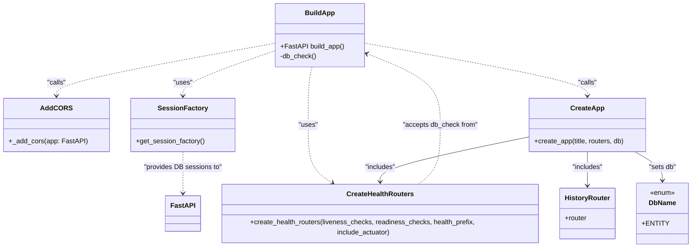

# Diagram: entity_core/entity_service/platform_applications/damage_submission_history_event/src/main.py


> Auto-generated by Obscura crawlers

## Diagram 1

```mermaid
flowchart TD
    BuildApp[build_app()] --> DBCheck["db_check()"]
    DBCheck --> SessionFactory[get_session_factory() factory]
    SessionFactory --> Execute["session.execute(\"SELECT 1\")"]
    Execute --> Close["session.close()"]
    BuildApp --> HealthRouters["create_health_routers(liveness=[], readiness=[db_check], include_actuator=True)"]
    HealthRouters --> HealthList[health_routers]
    HistoryRouter[routers.submission_history.router] --> CreateApp
    BuildApp --> CreateApp[create_app(title, routers=[history_router, *health_routers], db=DbName.ENTITY)]
    CreateApp --> MainApp[main_app : FastAPI]
    MainApp --> AddCORS[_add_cors(main_app)]
    AddCORS --> AppInstance[app : FastAPI]
```

> SVG rendering failed for this diagram.

## Diagram 2



### SVG

<svg id="container" width="1613.7109375" xmlns="http://www.w3.org/2000/svg" class="classDiagram" height="584" viewBox="0 0 1613.7109375 584" role="graphics-document document" aria-roledescription="class"><style>#container{font-family:"trebuchet ms",verdana,arial,sans-serif;font-size:16px;fill:#333;}@keyframes edge-animation-frame{from{stroke-dashoffset:0;}}@keyframes dash{to{stroke-dashoffset:0;}}#container .edge-animation-slow{stroke-dasharray:9,5!important;stroke-dashoffset:900;animation:dash 50s linear infinite;stroke-linecap:round;}#container .edge-animation-fast{stroke-dasharray:9,5!important;stroke-dashoffset:900;animation:dash 20s linear infinite;stroke-linecap:round;}#container .error-icon{fill:#552222;}#container .error-text{fill:#552222;stroke:#552222;}#container .edge-thickness-normal{stroke-width:1px;}#container .edge-thickness-thick{stroke-width:3.5px;}#container .edge-pattern-solid{stroke-dasharray:0;}#container .edge-thickness-invisible{stroke-width:0;fill:none;}#container .edge-pattern-dashed{stroke-dasharray:3;}#container .edge-pattern-dotted{stroke-dasharray:2;}#container .marker{fill:#333333;stroke:#333333;}#container .marker.cross{stroke:#333333;}#container svg{font-family:"trebuchet ms",verdana,arial,sans-serif;font-size:16px;}#container p{margin:0;}#container g.classGroup text{fill:#9370DB;stroke:none;font-family:"trebuchet ms",verdana,arial,sans-serif;font-size:10px;}#container g.classGroup text .title{font-weight:bolder;}#container .nodeLabel,#container .edgeLabel{color:#131300;}#container .edgeLabel .label rect{fill:#ECECFF;}#container .label text{fill:#131300;}#container .labelBkg{background:#ECECFF;}#container .edgeLabel .label span{background:#ECECFF;}#container .classTitle{font-weight:bolder;}#container .node rect,#container .node circle,#container .node ellipse,#container .node polygon,#container .node path{fill:#ECECFF;stroke:#9370DB;stroke-width:1px;}#container .divider{stroke:#9370DB;stroke-width:1;}#container g.clickable{cursor:pointer;}#container g.classGroup rect{fill:#ECECFF;stroke:#9370DB;}#container g.classGroup line{stroke:#9370DB;stroke-width:1;}#container .classLabel .box{stroke:none;stroke-width:0;fill:#ECECFF;opacity:0.5;}#container .classLabel .label{fill:#9370DB;font-size:10px;}#container .relation{stroke:#333333;stroke-width:1;fill:none;}#container .dashed-line{stroke-dasharray:3;}#container .dotted-line{stroke-dasharray:1 2;}#container #compositionStart,#container .composition{fill:#333333!important;stroke:#333333!important;stroke-width:1;}#container #compositionEnd,#container .composition{fill:#333333!important;stroke:#333333!important;stroke-width:1;}#container #dependencyStart,#container .dependency{fill:#333333!important;stroke:#333333!important;stroke-width:1;}#container #dependencyStart,#container .dependency{fill:#333333!important;stroke:#333333!important;stroke-width:1;}#container #extensionStart,#container .extension{fill:transparent!important;stroke:#333333!important;stroke-width:1;}#container #extensionEnd,#container .extension{fill:transparent!important;stroke:#333333!important;stroke-width:1;}#container #aggregationStart,#container .aggregation{fill:transparent!important;stroke:#333333!important;stroke-width:1;}#container #aggregationEnd,#container .aggregation{fill:transparent!important;stroke:#333333!important;stroke-width:1;}#container #lollipopStart,#container .lollipop{fill:#ECECFF!important;stroke:#333333!important;stroke-width:1;}#container #lollipopEnd,#container .lollipop{fill:#ECECFF!important;stroke:#333333!important;stroke-width:1;}#container .edgeTerminals{font-size:11px;line-height:initial;}#container .classTitleText{text-anchor:middle;font-size:18px;fill:#333;}#container .label-icon{display:inline-block;height:1em;overflow:visible;vertical-align:-0.125em;}#container .node .label-icon path{fill:currentColor;stroke:revert;stroke-width:revert;}#container :root{--mermaid-font-family:"trebuchet ms",verdana,arial,sans-serif;}</style><g><defs><marker id="container_class-aggregationStart" class="marker aggregation class" refX="18" refY="7" markerWidth="190" markerHeight="240" orient="auto"><path d="M 18,7 L9,13 L1,7 L9,1 Z"></path></marker></defs><defs><marker id="container_class-aggregationEnd" class="marker aggregation class" refX="1" refY="7" markerWidth="20" markerHeight="28" orient="auto"><path d="M 18,7 L9,13 L1,7 L9,1 Z"></path></marker></defs><defs><marker id="container_class-extensionStart" class="marker extension class" refX="18" refY="7" markerWidth="190" markerHeight="240" orient="auto"><path d="M 1,7 L18,13 V 1 Z"></path></marker></defs><defs><marker id="container_class-extensionEnd" class="marker extension class" refX="1" refY="7" markerWidth="20" markerHeight="28" orient="auto"><path d="M 1,1 V 13 L18,7 Z"></path></marker></defs><defs><marker id="container_class-compositionStart" class="marker composition class" refX="18" refY="7" markerWidth="190" markerHeight="240" orient="auto"><path d="M 18,7 L9,13 L1,7 L9,1 Z"></path></marker></defs><defs><marker id="container_class-compositionEnd" class="marker composition class" refX="1" refY="7" markerWidth="20" markerHeight="28" orient="auto"><path d="M 18,7 L9,13 L1,7 L9,1 Z"></path></marker></defs><defs><marker id="container_class-dependencyStart" class="marker dependency class" refX="6" refY="7" markerWidth="190" markerHeight="240" orient="auto"><path d="M 5,7 L9,13 L1,7 L9,1 Z"></path></marker></defs><defs><marker id="container_class-dependencyEnd" class="marker dependency class" refX="13" refY="7" markerWidth="20" markerHeight="28" orient="auto"><path d="M 18,7 L9,13 L14,7 L9,1 Z"></path></marker></defs><defs><marker id="container_class-lollipopStart" class="marker lollipop class" refX="13" refY="7" markerWidth="190" markerHeight="240" orient="auto"><circle stroke="black" fill="transparent" cx="7" cy="7" r="6"></circle></marker></defs><defs><marker id="container_class-lollipopEnd" class="marker lollipop class" refX="1" refY="7" markerWidth="190" markerHeight="240" orient="auto"><circle stroke="black" fill="transparent" cx="7" cy="7" r="6"></circle></marker></defs><g class="root"><g class="clusters"></g><g class="edgePaths"><path d="M636.096,118.426L599.193,131.188C562.29,143.95,488.485,169.475,451.582,187.404C414.68,205.333,414.68,215.667,414.68,220.833L414.68,226" id="id_BuildApp_SessionFactory_1" class="edge-thickness-normal edge-pattern-dashed relation" style=";;;" data-edge="true" data-et="edge" data-id="id_BuildApp_SessionFactory_1" data-points="W3sieCI6NjM2LjA5NTcwMzEyNSwieSI6MTE4LjQyNTU4Njk2MzQ3MDQ3fSx7IngiOjQxNC42Nzk2ODc1LCJ5IjoxOTV9LHsieCI6NDE0LjY3OTY4NzUsInkiOjIzMn1d" marker-end="url(#container_class-dependencyEnd)"></path><path d="M719.473,158L717.906,164.167C716.34,170.333,713.206,182.667,711.639,205.5C710.072,228.333,710.072,261.667,710.072,295C710.072,328.333,710.072,361.667,721.482,385.47C732.892,409.273,755.713,423.546,767.123,430.682L778.533,437.818" id="id_BuildApp_CreateHealthRouters_2" class="edge-thickness-normal edge-pattern-dashed relation" style=";;;" data-edge="true" data-et="edge" data-id="id_BuildApp_CreateHealthRouters_2" data-points="W3sieCI6NzE5LjQ3MzI0OTE2Mjk0NjQsInkiOjE1OH0seyJ4Ijo3MTAuMDcyMjY1NjI1LCJ5IjoxOTV9LHsieCI6NzEwLjA3MjI2NTYyNSwieSI6Mjk1fSx7IngiOjcxMC4wNzIyNjU2MjUsInkiOjM5NX0seyJ4Ijo3ODMuNjE5Njc4MTgyMzM5NSwieSI6NDQxfV0=" marker-end="url(#container_class-dependencyEnd)"></path><path d="M840.963,100.902L930.701,116.585C1020.44,132.268,1199.917,163.634,1289.656,184.484C1379.395,205.333,1379.395,215.667,1379.395,220.833L1379.395,226" id="id_BuildApp_CreateApp_3" class="edge-thickness-normal edge-pattern-dashed relation" style=";;;" data-edge="true" data-et="edge" data-id="id_BuildApp_CreateApp_3" data-points="W3sieCI6ODQwLjk2Mjg5MDYyNSwieSI6MTAwLjkwMTY3NzExNDk4NDMyfSx7IngiOjEzNzkuMzk0NTMxMjUsInkiOjE5NX0seyJ4IjoxMzc5LjM5NDUzMTI1LCJ5IjoyMzJ9XQ==" marker-end="url(#container_class-dependencyEnd)"></path><path d="M636.096,101.736L551.114,117.28C466.132,132.824,296.167,163.912,211.185,184.623C126.203,205.333,126.203,215.667,126.203,220.833L126.203,226" id="id_BuildApp_AddCORS_4" class="edge-thickness-normal edge-pattern-dashed relation" style=";;;" data-edge="true" data-et="edge" data-id="id_BuildApp_AddCORS_4" data-points="W3sieCI6NjM2LjA5NTcwMzEyNSwieSI6MTAxLjczNjAzMTU5MDU5ODA5fSx7IngiOjEyNi4yMDMxMjUsInkiOjE5NX0seyJ4IjoxMjYuMjAzMTI1LCJ5IjoyMzJ9XQ==" marker-end="url(#container_class-dependencyEnd)"></path><path d="M1379.395,358L1379.395,364.167C1379.395,370.333,1379.395,382.667,1379.395,396C1379.395,409.333,1379.395,423.667,1379.395,430.833L1379.395,438" id="id_CreateApp_HistoryRouter_5" class="edge-thickness-normal edge-pattern-solid relation" style=";;;" data-edge="true" data-et="edge" data-id="id_CreateApp_HistoryRouter_5" data-points="W3sieCI6MTM3OS4zOTQ1MzEyNSwieSI6MzU4fSx7IngiOjEzNzkuMzk0NTMxMjUsInkiOjM5NX0seyJ4IjoxMzc5LjM5NDUzMTI1LCJ5Ijo0NDR9XQ==" marker-end="url(#container_class-dependencyEnd)"></path><path d="M1241.012,322.953L1181.568,334.961C1122.124,346.969,1003.236,370.984,943.792,389.659C884.348,408.333,884.348,421.667,884.348,428.333L884.348,435" id="id_CreateApp_CreateHealthRouters_6" class="edge-thickness-normal edge-pattern-solid relation" style=";;;" data-edge="true" data-et="edge" data-id="id_CreateApp_CreateHealthRouters_6" data-points="W3sieCI6MTI0MS4wMTE3MTg3NSwieSI6MzIyLjk1MzQ3NjYyNzg0NDU3fSx7IngiOjg4NC4zNDc2NTYyNSwieSI6Mzk1fSx7IngiOjg4NC4zNDc2NTYyNSwieSI6NDQxfV0=" marker-end="url(#container_class-dependencyEnd)"></path><path d="M1486.568,358L1497.059,364.167C1507.549,370.333,1528.531,382.667,1539.021,394C1549.512,405.333,1549.512,415.667,1549.512,420.833L1549.512,426" id="id_CreateApp_DbName_7" class="edge-thickness-normal edge-pattern-solid relation" style=";;;" data-edge="true" data-et="edge" data-id="id_CreateApp_DbName_7" data-points="W3sieCI6MTQ4Ni41NjgzNTkzNzUsInkiOjM1OH0seyJ4IjoxNTQ5LjUxMTcxODc1LCJ5IjozOTV9LHsieCI6MTU0OS41MTE3MTg3NSwieSI6NDMyfV0=" marker-end="url(#container_class-dependencyEnd)"></path><path d="M968.013,441L978.194,433.333C988.376,425.667,1008.739,410.333,1018.92,386C1029.102,361.667,1029.102,328.333,1029.102,295C1029.102,261.667,1029.102,228.333,998.678,199.94C968.255,171.547,907.408,148.094,876.985,136.367L846.561,124.641" id="id_CreateHealthRouters_BuildApp_8" class="edge-thickness-normal edge-pattern-dashed relation" style=";;;" data-edge="true" data-et="edge" data-id="id_CreateHealthRouters_BuildApp_8" data-points="W3sieCI6OTY4LjAxMjc1ODAyNzUyMywieSI6NDQxfSx7IngiOjEwMjkuMTAxNTYyNSwieSI6Mzk1fSx7IngiOjEwMjkuMTAxNTYyNSwieSI6Mjk1fSx7IngiOjEwMjkuMTAxNTYyNSwieSI6MTk1fSx7IngiOjg0MC45NjI4OTA2MjUsInkiOjEyMi40ODI2NDgwNjExNDAxM31d" marker-end="url(#container_class-dependencyEnd)"></path><path d="M414.68,358L414.68,364.167C414.68,370.333,414.68,382.667,414.68,399C414.68,415.333,414.68,435.667,414.68,445.833L414.68,456" id="id_SessionFactory_FastAPI_9" class="edge-thickness-normal edge-pattern-dashed relation" style=";;;" data-edge="true" data-et="edge" data-id="id_SessionFactory_FastAPI_9" data-points="W3sieCI6NDE0LjY3OTY4NzUsInkiOjM1OH0seyJ4Ijo0MTQuNjc5Njg3NSwieSI6Mzk1fSx7IngiOjQxNC42Nzk2ODc1LCJ5Ijo0NjJ9XQ==" marker-end="url(#container_class-dependencyEnd)"></path></g><g class="edgeLabels"><g class="edgeLabel" transform="translate(414.6796875, 195)"><g class="label" data-id="id_BuildApp_SessionFactory_1" transform="translate(-22.7578125, -12)"><foreignObject width="45.515625" height="24"><div xmlns="http://www.w3.org/1999/xhtml" class="labelBkg" style="display: table-cell; white-space: nowrap; line-height: 1.5; max-width: 200px; text-align: center;"><span class="edgeLabel"><p>"uses"</p></span></div></foreignObject></g></g><g class="edgeLabel" transform="translate(710.072265625, 295)"><g class="label" data-id="id_BuildApp_CreateHealthRouters_2" transform="translate(-22.7578125, -12)"><foreignObject width="45.515625" height="24"><div xmlns="http://www.w3.org/1999/xhtml" class="labelBkg" style="display: table-cell; white-space: nowrap; line-height: 1.5; max-width: 200px; text-align: center;"><span class="edgeLabel"><p>"uses"</p></span></div></foreignObject></g></g><g class="edgeLabel" transform="translate(1379.39453125, 195)"><g class="label" data-id="id_BuildApp_CreateApp_3" transform="translate(-22.625, -12)"><foreignObject width="45.25" height="24"><div xmlns="http://www.w3.org/1999/xhtml" class="labelBkg" style="display: table-cell; white-space: nowrap; line-height: 1.5; max-width: 200px; text-align: center;"><span class="edgeLabel"><p>"calls"</p></span></div></foreignObject></g></g><g class="edgeLabel" transform="translate(126.203125, 195)"><g class="label" data-id="id_BuildApp_AddCORS_4" transform="translate(-22.625, -12)"><foreignObject width="45.25" height="24"><div xmlns="http://www.w3.org/1999/xhtml" class="labelBkg" style="display: table-cell; white-space: nowrap; line-height: 1.5; max-width: 200px; text-align: center;"><span class="edgeLabel"><p>"calls"</p></span></div></foreignObject></g></g><g class="edgeLabel" transform="translate(1379.39453125, 395)"><g class="label" data-id="id_CreateApp_HistoryRouter_5" transform="translate(-36.9140625, -12)"><foreignObject width="73.828125" height="24"><div xmlns="http://www.w3.org/1999/xhtml" class="labelBkg" style="display: table-cell; white-space: nowrap; line-height: 1.5; max-width: 200px; text-align: center;"><span class="edgeLabel"><p>"includes"</p></span></div></foreignObject></g></g><g class="edgeLabel" transform="translate(884.34765625, 395)"><g class="label" data-id="id_CreateApp_CreateHealthRouters_6" transform="translate(-36.9140625, -12)"><foreignObject width="73.828125" height="24"><div xmlns="http://www.w3.org/1999/xhtml" class="labelBkg" style="display: table-cell; white-space: nowrap; line-height: 1.5; max-width: 200px; text-align: center;"><span class="edgeLabel"><p>"includes"</p></span></div></foreignObject></g></g><g class="edgeLabel" transform="translate(1549.51171875, 395)"><g class="label" data-id="id_CreateApp_DbName_7" transform="translate(-32.6015625, -12)"><foreignObject width="65.203125" height="24"><div xmlns="http://www.w3.org/1999/xhtml" class="labelBkg" style="display: table-cell; white-space: nowrap; line-height: 1.5; max-width: 200px; text-align: center;"><span class="edgeLabel"><p>"sets db"</p></span></div></foreignObject></g></g><g class="edgeLabel" transform="translate(1029.1015625, 295)"><g class="label" data-id="id_CreateHealthRouters_BuildApp_8" transform="translate(-89.0703125, -12)"><foreignObject width="178.140625" height="24"><div xmlns="http://www.w3.org/1999/xhtml" class="labelBkg" style="display: table-cell; white-space: nowrap; line-height: 1.5; max-width: 200px; text-align: center;"><span class="edgeLabel"><p>"accepts db_check from"</p></span></div></foreignObject></g></g><g class="edgeLabel" transform="translate(414.6796875, 395)"><g class="label" data-id="id_SessionFactory_FastAPI_9" transform="translate(-92.2734375, -12)"><foreignObject width="184.546875" height="24"><div xmlns="http://www.w3.org/1999/xhtml" class="labelBkg" style="display: table-cell; white-space: nowrap; line-height: 1.5; max-width: 200px; text-align: center;"><span class="edgeLabel"><p>"provides DB sessions to"</p></span></div></foreignObject></g></g></g><g class="nodes"><g class="node default" id="classId-BuildApp-0" transform="translate(738.529296875, 83)"><g class="basic label-container"><path d="M-102.43359375 -75 L102.43359375 -75 L102.43359375 75 L-102.43359375 75" stroke="none" stroke-width="0" fill="#ECECFF" style=""></path><path d="M-102.43359375 -75 C-56.47671375472023 -75, -10.51983375944046 -75, 102.43359375 -75 M-102.43359375 -75 C-58.6510097134755 -75, -14.868425676951006 -75, 102.43359375 -75 M102.43359375 -75 C102.43359375 -41.054069960168775, 102.43359375 -7.10813992033755, 102.43359375 75 M102.43359375 -75 C102.43359375 -32.841040263232, 102.43359375 9.317919473535994, 102.43359375 75 M102.43359375 75 C51.519043868336205 75, 0.6044939866724093 75, -102.43359375 75 M102.43359375 75 C39.59408502265233 75, -23.24542370469534 75, -102.43359375 75 M-102.43359375 75 C-102.43359375 40.430272151813945, -102.43359375 5.86054430362789, -102.43359375 -75 M-102.43359375 75 C-102.43359375 33.78067870750301, -102.43359375 -7.4386425849939855, -102.43359375 -75" stroke="#9370DB" stroke-width="1.3" fill="none" stroke-dasharray="0 0" style=""></path></g><g class="annotation-group text" transform="translate(0, -51)"></g><g class="label-group text" transform="translate(-33.1796875, -51)"><g class="label" style="font-weight: bolder" transform="translate(0,-12)"><foreignObject width="66.359375" height="24"><div xmlns="http://www.w3.org/1999/xhtml" style="display: table-cell; white-space: nowrap; line-height: 1.5; max-width: 116px; text-align: center;"><span class="nodeLabel markdown-node-label" style=""><p>BuildApp</p></span></div></foreignObject></g></g><g class="members-group text" transform="translate(-90.43359375, -3)"></g><g class="methods-group text" transform="translate(-90.43359375, 27)"><g class="label" style="" transform="translate(0,-12)"><foreignObject width="147.6875" height="24"><div xmlns="http://www.w3.org/1999/xhtml" style="display: table-cell; white-space: nowrap; line-height: 1.5; max-width: 205px; text-align: center;"><span class="nodeLabel markdown-node-label" style=""><p>+FastAPI build_app()</p></span></div></foreignObject></g><g class="label" style="" transform="translate(0,12)"><foreignObject width="85.15625" height="24"><div xmlns="http://www.w3.org/1999/xhtml" style="display: table-cell; white-space: nowrap; line-height: 1.5; max-width: 143px; text-align: center;"><span class="nodeLabel markdown-node-label" style=""><p>-db_check()</p></span></div></foreignObject></g></g><g class="divider" style=""><path d="M-102.43359375 -27 C-56.54543841576867 -27, -10.657283081537344 -27, 102.43359375 -27 M-102.43359375 -27 C-54.99971068084029 -27, -7.565827611680575 -27, 102.43359375 -27" stroke="#9370DB" stroke-width="1.3" fill="none" stroke-dasharray="0 0" style=""></path></g><g class="divider" style=""><path d="M-102.43359375 -3 C-29.015482083520567 -3, 44.402629582958866 -3, 102.43359375 -3 M-102.43359375 -3 C-34.092832279302996 -3, 34.24792919139401 -3, 102.43359375 -3" stroke="#9370DB" stroke-width="1.3" fill="none" stroke-dasharray="0 0" style=""></path></g></g><g class="node default" id="classId-AddCORS-1" transform="translate(126.203125, 295)"><g class="basic label-container"><path d="M-118.203125 -63 L118.203125 -63 L118.203125 63 L-118.203125 63" stroke="none" stroke-width="0" fill="#ECECFF" style=""></path><path d="M-118.203125 -63 C-31.909384279730418 -63, 54.384356440539165 -63, 118.203125 -63 M-118.203125 -63 C-56.78476110479554 -63, 4.633602790408915 -63, 118.203125 -63 M118.203125 -63 C118.203125 -35.51002311253423, 118.203125 -8.020046225068455, 118.203125 63 M118.203125 -63 C118.203125 -19.067572978373512, 118.203125 24.864854043252976, 118.203125 63 M118.203125 63 C30.714439545771683 63, -56.774245908456635 63, -118.203125 63 M118.203125 63 C53.56225727652756 63, -11.078610446944879 63, -118.203125 63 M-118.203125 63 C-118.203125 35.62848218998421, -118.203125 8.256964379968423, -118.203125 -63 M-118.203125 63 C-118.203125 13.662462581746212, -118.203125 -35.67507483650758, -118.203125 -63" stroke="#9370DB" stroke-width="1.3" fill="none" stroke-dasharray="0 0" style=""></path></g><g class="annotation-group text" transform="translate(0, -39)"></g><g class="label-group text" transform="translate(-33.734375, -39)"><g class="label" style="font-weight: bolder" transform="translate(0,-12)"><foreignObject width="67.46875" height="24"><div xmlns="http://www.w3.org/1999/xhtml" style="display: table-cell; white-space: nowrap; line-height: 1.5; max-width: 117px; text-align: center;"><span class="nodeLabel markdown-node-label" style=""><p>AddCORS</p></span></div></foreignObject></g></g><g class="members-group text" transform="translate(-106.203125, 9)"></g><g class="methods-group text" transform="translate(-106.203125, 39)"><g class="label" style="" transform="translate(0,-12)"><foreignObject width="178.671875" height="24"><div xmlns="http://www.w3.org/1999/xhtml" style="display: table-cell; white-space: nowrap; line-height: 1.5; max-width: 236px; text-align: center;"><span class="nodeLabel markdown-node-label" style=""><p>+_add_cors(app: FastAPI)</p></span></div></foreignObject></g></g><g class="divider" style=""><path d="M-118.203125 -15 C-29.182581758751724 -15, 59.83796148249655 -15, 118.203125 -15 M-118.203125 -15 C-38.20206235397872 -15, 41.799000292042564 -15, 118.203125 -15" stroke="#9370DB" stroke-width="1.3" fill="none" stroke-dasharray="0 0" style=""></path></g><g class="divider" style=""><path d="M-118.203125 9 C-24.939071507994456 9, 68.32498198401109 9, 118.203125 9 M-118.203125 9 C-29.06930598793693 9, 60.06451302412614 9, 118.203125 9" stroke="#9370DB" stroke-width="1.3" fill="none" stroke-dasharray="0 0" style=""></path></g></g><g class="node default" id="classId-SessionFactory-2" transform="translate(414.6796875, 295)"><g class="basic label-container"><path d="M-120.2734375 -63 L120.2734375 -63 L120.2734375 63 L-120.2734375 63" stroke="none" stroke-width="0" fill="#ECECFF" style=""></path><path d="M-120.2734375 -63 C-55.97087217902427 -63, 8.331693141951462 -63, 120.2734375 -63 M-120.2734375 -63 C-52.62106638793709 -63, 15.031304724125818 -63, 120.2734375 -63 M120.2734375 -63 C120.2734375 -28.325435301962578, 120.2734375 6.349129396074844, 120.2734375 63 M120.2734375 -63 C120.2734375 -35.48332616339425, 120.2734375 -7.966652326788505, 120.2734375 63 M120.2734375 63 C34.13149617145464 63, -52.010445157090714 63, -120.2734375 63 M120.2734375 63 C42.81008453684248 63, -34.65326842631504 63, -120.2734375 63 M-120.2734375 63 C-120.2734375 15.410448413156246, -120.2734375 -32.17910317368751, -120.2734375 -63 M-120.2734375 63 C-120.2734375 27.34666985396977, -120.2734375 -8.306660292060457, -120.2734375 -63" stroke="#9370DB" stroke-width="1.3" fill="none" stroke-dasharray="0 0" style=""></path></g><g class="annotation-group text" transform="translate(0, -39)"></g><g class="label-group text" transform="translate(-54.8125, -39)"><g class="label" style="font-weight: bolder" transform="translate(0,-12)"><foreignObject width="109.625" height="24"><div xmlns="http://www.w3.org/1999/xhtml" style="display: table-cell; white-space: nowrap; line-height: 1.5; max-width: 158px; text-align: center;"><span class="nodeLabel markdown-node-label" style=""><p>SessionFactory</p></span></div></foreignObject></g></g><g class="members-group text" transform="translate(-108.2734375, 9)"></g><g class="methods-group text" transform="translate(-108.2734375, 39)"><g class="label" style="" transform="translate(0,-12)"><foreignObject width="161.734375" height="24"><div xmlns="http://www.w3.org/1999/xhtml" style="display: table-cell; white-space: nowrap; line-height: 1.5; max-width: 219px; text-align: center;"><span class="nodeLabel markdown-node-label" style=""><p>+get_session_factory()</p></span></div></foreignObject></g></g><g class="divider" style=""><path d="M-120.2734375 -15 C-26.591758133035043 -15, 67.08992123392991 -15, 120.2734375 -15 M-120.2734375 -15 C-67.72741957512565 -15, -15.181401650251289 -15, 120.2734375 -15" stroke="#9370DB" stroke-width="1.3" fill="none" stroke-dasharray="0 0" style=""></path></g><g class="divider" style=""><path d="M-120.2734375 9 C-45.5575697434374 9, 29.158298013125204 9, 120.2734375 9 M-120.2734375 9 C-72.0101318496248 9, -23.746826199249583 9, 120.2734375 9" stroke="#9370DB" stroke-width="1.3" fill="none" stroke-dasharray="0 0" style=""></path></g></g><g class="node default" id="classId-DbName-3" transform="translate(1549.51171875, 504)"><g class="basic label-container"><path d="M-56.19921875 -72 L56.19921875 -72 L56.19921875 72 L-56.19921875 72" stroke="none" stroke-width="0" fill="#ECECFF" style=""></path><path d="M-56.19921875 -72 C-24.696095701635432 -72, 6.807027346729136 -72, 56.19921875 -72 M-56.19921875 -72 C-14.680069734859075 -72, 26.83907928028185 -72, 56.19921875 -72 M56.19921875 -72 C56.19921875 -20.984538208799748, 56.19921875 30.030923582400504, 56.19921875 72 M56.19921875 -72 C56.19921875 -25.500311703637905, 56.19921875 20.99937659272419, 56.19921875 72 M56.19921875 72 C20.465548775351095 72, -15.26812119929781 72, -56.19921875 72 M56.19921875 72 C32.665008859949445 72, 9.13079896989889 72, -56.19921875 72 M-56.19921875 72 C-56.19921875 31.924654024869504, -56.19921875 -8.150691950260992, -56.19921875 -72 M-56.19921875 72 C-56.19921875 22.320945884201578, -56.19921875 -27.358108231596844, -56.19921875 -72" stroke="#9370DB" stroke-width="1.3" fill="none" stroke-dasharray="0 0" style=""></path></g><g class="annotation-group text" transform="translate(-29.53125, -48)"><g class="label" style="" transform="translate(0,-12)"><foreignObject width="59.0625" height="24"><div xmlns="http://www.w3.org/1999/xhtml" style="display: table-cell; white-space: nowrap; line-height: 1.5; max-width: 109px; text-align: center;"><span class="nodeLabel markdown-node-label" style=""><p>«enum»</p></span></div></foreignObject></g></g><g class="label-group text" transform="translate(-30.8515625, -24)"><g class="label" style="font-weight: bolder" transform="translate(0,-12)"><foreignObject width="61.703125" height="24"><div xmlns="http://www.w3.org/1999/xhtml" style="display: table-cell; white-space: nowrap; line-height: 1.5; max-width: 112px; text-align: center;"><span class="nodeLabel markdown-node-label" style=""><p>DbName</p></span></div></foreignObject></g></g><g class="members-group text" transform="translate(-44.19921875, 24)"><g class="label" style="" transform="translate(0,-12)"><foreignObject width="57.546875" height="24"><div xmlns="http://www.w3.org/1999/xhtml" style="display: table-cell; white-space: nowrap; line-height: 1.5; max-width: 115px; text-align: center;"><span class="nodeLabel markdown-node-label" style=""><p>+ENTITY</p></span></div></foreignObject></g></g><g class="methods-group text" transform="translate(-44.19921875, 72)"></g><g class="divider" style=""><path d="M-56.19921875 0 C-14.996514787388094 0, 26.206189175223813 0, 56.19921875 0 M-56.19921875 0 C-31.640112496176968 0, -7.081006242353936 0, 56.19921875 0" stroke="#9370DB" stroke-width="1.3" fill="none" stroke-dasharray="0 0" style=""></path></g><g class="divider" style=""><path d="M-56.19921875 48 C-32.51975363916174 48, -8.840288528323484 48, 56.19921875 48 M-56.19921875 48 C-15.583814035902869 48, 25.031590678194263 48, 56.19921875 48" stroke="#9370DB" stroke-width="1.3" fill="none" stroke-dasharray="0 0" style=""></path></g></g><g class="node default" id="classId-CreateApp-4" transform="translate(1379.39453125, 295)"><g class="basic label-container"><path d="M-138.3828125 -63 L138.3828125 -63 L138.3828125 63 L-138.3828125 63" stroke="none" stroke-width="0" fill="#ECECFF" style=""></path><path d="M-138.3828125 -63 C-65.41610617401247 -63, 7.550600151975061 -63, 138.3828125 -63 M-138.3828125 -63 C-37.39149861300014 -63, 63.599815273999724 -63, 138.3828125 -63 M138.3828125 -63 C138.3828125 -23.20481222462734, 138.3828125 16.59037555074532, 138.3828125 63 M138.3828125 -63 C138.3828125 -32.080212130518866, 138.3828125 -1.1604242610377327, 138.3828125 63 M138.3828125 63 C62.93579883326467 63, -12.51121483347066 63, -138.3828125 63 M138.3828125 63 C57.869105233697454 63, -22.644602032605093 63, -138.3828125 63 M-138.3828125 63 C-138.3828125 27.713053876120078, -138.3828125 -7.573892247759844, -138.3828125 -63 M-138.3828125 63 C-138.3828125 20.517580419345776, -138.3828125 -21.964839161308447, -138.3828125 -63" stroke="#9370DB" stroke-width="1.3" fill="none" stroke-dasharray="0 0" style=""></path></g><g class="annotation-group text" transform="translate(0, -39)"></g><g class="label-group text" transform="translate(-37.828125, -39)"><g class="label" style="font-weight: bolder" transform="translate(0,-12)"><foreignObject width="75.65625" height="24"><div xmlns="http://www.w3.org/1999/xhtml" style="display: table-cell; white-space: nowrap; line-height: 1.5; max-width: 124px; text-align: center;"><span class="nodeLabel markdown-node-label" style=""><p>CreateApp</p></span></div></foreignObject></g></g><g class="members-group text" transform="translate(-126.3828125, 9)"></g><g class="methods-group text" transform="translate(-126.3828125, 39)"><g class="label" style="" transform="translate(0,-12)"><foreignObject width="214.9375" height="24"><div xmlns="http://www.w3.org/1999/xhtml" style="display: table-cell; white-space: nowrap; line-height: 1.5; max-width: 272px; text-align: center;"><span class="nodeLabel markdown-node-label" style=""><p>+create_app(title, routers, db)</p></span></div></foreignObject></g></g><g class="divider" style=""><path d="M-138.3828125 -15 C-57.9010099817622 -15, 22.5807925364756 -15, 138.3828125 -15 M-138.3828125 -15 C-69.0254964233651 -15, 0.3318196532698039 -15, 138.3828125 -15" stroke="#9370DB" stroke-width="1.3" fill="none" stroke-dasharray="0 0" style=""></path></g><g class="divider" style=""><path d="M-138.3828125 9 C-80.45789895293314 9, -22.532985405866256 9, 138.3828125 9 M-138.3828125 9 C-29.862009052898415 9, 78.65879439420317 9, 138.3828125 9" stroke="#9370DB" stroke-width="1.3" fill="none" stroke-dasharray="0 0" style=""></path></g></g><g class="node default" id="classId-CreateHealthRouters-5" transform="translate(884.34765625, 504)"><g class="basic label-container"><path d="M-381.12890625 -63 L381.12890625 -63 L381.12890625 63 L-381.12890625 63" stroke="none" stroke-width="0" fill="#ECECFF" style=""></path><path d="M-381.12890625 -63 C-202.21646657440766 -63, -23.304026898815323 -63, 381.12890625 -63 M-381.12890625 -63 C-193.6445827719911 -63, -6.160259293982222 -63, 381.12890625 -63 M381.12890625 -63 C381.12890625 -23.031676474361888, 381.12890625 16.936647051276225, 381.12890625 63 M381.12890625 -63 C381.12890625 -23.237442483518393, 381.12890625 16.525115032963214, 381.12890625 63 M381.12890625 63 C197.8077012173387 63, 14.486496184677378 63, -381.12890625 63 M381.12890625 63 C104.80381791020693 63, -171.52127042958614 63, -381.12890625 63 M-381.12890625 63 C-381.12890625 31.126981879973314, -381.12890625 -0.7460362400533711, -381.12890625 -63 M-381.12890625 63 C-381.12890625 24.948606718067012, -381.12890625 -13.102786563865976, -381.12890625 -63" stroke="#9370DB" stroke-width="1.3" fill="none" stroke-dasharray="0 0" style=""></path></g><g class="annotation-group text" transform="translate(0, -39)"></g><g class="label-group text" transform="translate(-76.0078125, -39)"><g class="label" style="font-weight: bolder" transform="translate(0,-12)"><foreignObject width="152.015625" height="24"><div xmlns="http://www.w3.org/1999/xhtml" style="display: table-cell; white-space: nowrap; line-height: 1.5; max-width: 200px; text-align: center;"><span class="nodeLabel markdown-node-label" style=""><p>CreateHealthRouters</p></span></div></foreignObject></g></g><g class="members-group text" transform="translate(-369.12890625, 9)"></g><g class="methods-group text" transform="translate(-369.12890625, 39)"><g class="label" style="" transform="translate(0,-12)"><foreignObject width="662.25" height="24"><div xmlns="http://www.w3.org/1999/xhtml" style="display: table-cell; white-space: nowrap; line-height: 1.5; max-width: 720px; text-align: center;"><span class="nodeLabel markdown-node-label" style=""><p>+create_health_routers(liveness_checks, readiness_checks, health_prefix, include_actuator)</p></span></div></foreignObject></g></g><g class="divider" style=""><path d="M-381.12890625 -15 C-103.92702528852709 -15, 173.27485567294582 -15, 381.12890625 -15 M-381.12890625 -15 C-143.51363227359403 -15, 94.10164170281195 -15, 381.12890625 -15" stroke="#9370DB" stroke-width="1.3" fill="none" stroke-dasharray="0 0" style=""></path></g><g class="divider" style=""><path d="M-381.12890625 9 C-98.65500482725304 9, 183.81889659549392 9, 381.12890625 9 M-381.12890625 9 C-150.14627772216622 9, 80.83635080566756 9, 381.12890625 9" stroke="#9370DB" stroke-width="1.3" fill="none" stroke-dasharray="0 0" style=""></path></g></g><g class="node default" id="classId-HistoryRouter-6" transform="translate(1379.39453125, 504)"><g class="basic label-container"><path d="M-63.91796875 -60 L63.91796875 -60 L63.91796875 60 L-63.91796875 60" stroke="none" stroke-width="0" fill="#ECECFF" style=""></path><path d="M-63.91796875 -60 C-20.294305182878112 -60, 23.329358384243776 -60, 63.91796875 -60 M-63.91796875 -60 C-31.723585437793254 -60, 0.47079787441349197 -60, 63.91796875 -60 M63.91796875 -60 C63.91796875 -35.91130192549918, 63.91796875 -11.822603850998362, 63.91796875 60 M63.91796875 -60 C63.91796875 -24.05311597035041, 63.91796875 11.893768059299177, 63.91796875 60 M63.91796875 60 C15.981812821835845 60, -31.95434310632831 60, -63.91796875 60 M63.91796875 60 C24.900706723103013 60, -14.116555303793973 60, -63.91796875 60 M-63.91796875 60 C-63.91796875 21.87735720182134, -63.91796875 -16.24528559635732, -63.91796875 -60 M-63.91796875 60 C-63.91796875 12.630068199638188, -63.91796875 -34.73986360072362, -63.91796875 -60" stroke="#9370DB" stroke-width="1.3" fill="none" stroke-dasharray="0 0" style=""></path></g><g class="annotation-group text" transform="translate(0, -36)"></g><g class="label-group text" transform="translate(-51.0546875, -36)"><g class="label" style="font-weight: bolder" transform="translate(0,-12)"><foreignObject width="102.109375" height="24"><div xmlns="http://www.w3.org/1999/xhtml" style="display: table-cell; white-space: nowrap; line-height: 1.5; max-width: 151px; text-align: center;"><span class="nodeLabel markdown-node-label" style=""><p>HistoryRouter</p></span></div></foreignObject></g></g><g class="members-group text" transform="translate(-51.91796875, 12)"><g class="label" style="" transform="translate(0,-12)"><foreignObject width="52.78125" height="24"><div xmlns="http://www.w3.org/1999/xhtml" style="display: table-cell; white-space: nowrap; line-height: 1.5; max-width: 111px; text-align: center;"><span class="nodeLabel markdown-node-label" style=""><p>+router</p></span></div></foreignObject></g></g><g class="methods-group text" transform="translate(-51.91796875, 60)"></g><g class="divider" style=""><path d="M-63.91796875 -12 C-20.311850957191865 -12, 23.29426683561627 -12, 63.91796875 -12 M-63.91796875 -12 C-30.183050473721167 -12, 3.551867802557666 -12, 63.91796875 -12" stroke="#9370DB" stroke-width="1.3" fill="none" stroke-dasharray="0 0" style=""></path></g><g class="divider" style=""><path d="M-63.91796875 36 C-34.894148951751355 36, -5.870329153502709 36, 63.91796875 36 M-63.91796875 36 C-30.41112947339797 36, 3.095709803204059 36, 63.91796875 36" stroke="#9370DB" stroke-width="1.3" fill="none" stroke-dasharray="0 0" style=""></path></g></g><g class="node default" id="classId-FastAPI-7" transform="translate(414.6796875, 504)"><g class="basic label-container"><path d="M-38.5390625 -42 L38.5390625 -42 L38.5390625 42 L-38.5390625 42" stroke="none" stroke-width="0" fill="#ECECFF" style=""></path><path d="M-38.5390625 -42 C-10.195540945689405 -42, 18.14798060862119 -42, 38.5390625 -42 M-38.5390625 -42 C-8.959033197328111 -42, 20.620996105343778 -42, 38.5390625 -42 M38.5390625 -42 C38.5390625 -24.875634051791437, 38.5390625 -7.751268103582873, 38.5390625 42 M38.5390625 -42 C38.5390625 -14.573862222070463, 38.5390625 12.852275555859073, 38.5390625 42 M38.5390625 42 C15.03717559949705 42, -8.464711301005899 42, -38.5390625 42 M38.5390625 42 C19.81264347829304 42, 1.0862244565860806 42, -38.5390625 42 M-38.5390625 42 C-38.5390625 12.513770753469416, -38.5390625 -16.97245849306117, -38.5390625 -42 M-38.5390625 42 C-38.5390625 25.006853756908217, -38.5390625 8.013707513816435, -38.5390625 -42" stroke="#9370DB" stroke-width="1.3" fill="none" stroke-dasharray="0 0" style=""></path></g><g class="annotation-group text" transform="translate(0, -18)"></g><g class="label-group text" transform="translate(-26.5390625, -18)"><g class="label" style="font-weight: bolder" transform="translate(0,-12)"><foreignObject width="53.078125" height="24"><div xmlns="http://www.w3.org/1999/xhtml" style="display: table-cell; white-space: nowrap; line-height: 1.5; max-width: 102px; text-align: center;"><span class="nodeLabel markdown-node-label" style=""><p>FastAPI</p></span></div></foreignObject></g></g><g class="members-group text" transform="translate(-26.5390625, 30)"></g><g class="methods-group text" transform="translate(-26.5390625, 60)"></g><g class="divider" style=""><path d="M-38.5390625 6 C-16.616309955929683 6, 5.306442588140634 6, 38.5390625 6 M-38.5390625 6 C-17.859157340631814 6, 2.820747818736372 6, 38.5390625 6" stroke="#9370DB" stroke-width="1.3" fill="none" stroke-dasharray="0 0" style=""></path></g><g class="divider" style=""><path d="M-38.5390625 24 C-14.289837721878037 24, 9.959387056243926 24, 38.5390625 24 M-38.5390625 24 C-9.777095608674578 24, 18.984871282650843 24, 38.5390625 24" stroke="#9370DB" stroke-width="1.3" fill="none" stroke-dasharray="0 0" style=""></path></g></g></g></g></g></svg>
