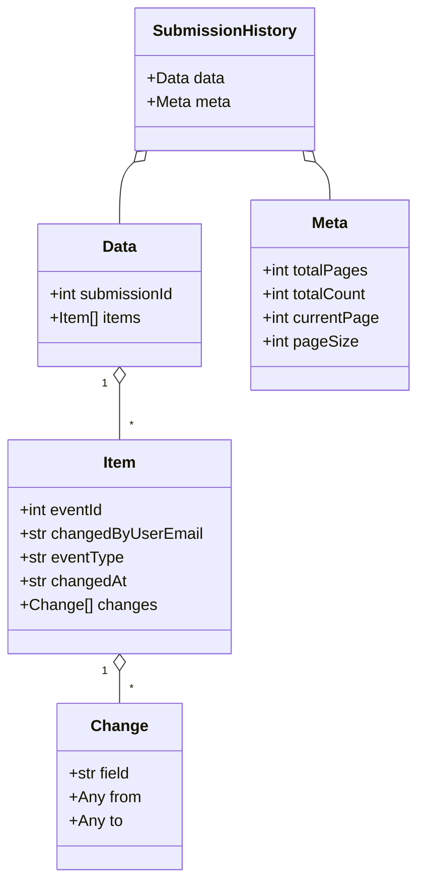

# Diagram: entity_core/entity_service/platform_applications/damage_submission_history_event/src/models/api/submission_history.py

> Auto-generated by Obscura crawlers

## Mermaid

### SVG

<svg id="container" width="423.1171875" xmlns="http://www.w3.org/2000/svg" class="classDiagram" height="886" viewBox="0 0 423.1171875 886" role="graphics-document document" aria-roledescription="class"><g><defs><marker id="container_class-aggregationStart" class="marker aggregation class" refX="18" refY="7" markerWidth="190" markerHeight="240" orient="auto"><path d="M 18,7 L9,13 L1,7 L9,1 Z"></path></marker></defs><defs><marker id="container_class-aggregationEnd" class="marker aggregation class" refX="1" refY="7" markerWidth="20" markerHeight="28" orient="auto"><path d="M 18,7 L9,13 L1,7 L9,1 Z"></path></marker></defs><defs><marker id="container_class-extensionStart" class="marker extension class" refX="18" refY="7" markerWidth="190" markerHeight="240" orient="auto"><path d="M 1,7 L18,13 V 1 Z"></path></marker></defs><defs><marker id="container_class-extensionEnd" class="marker extension class" refX="1" refY="7" markerWidth="20" markerHeight="28" orient="auto"><path d="M 1,1 V 13 L18,7 Z"></path></marker></defs><defs><marker id="container_class-compositionStart" class="marker composition class" refX="18" refY="7" markerWidth="190" markerHeight="240" orient="auto"><path d="M 18,7 L9,13 L1,7 L9,1 Z"></path></marker></defs><defs><marker id="container_class-compositionEnd" class="marker composition class" refX="1" refY="7" markerWidth="20" markerHeight="28" orient="auto"><path d="M 18,7 L9,13 L1,7 L9,1 Z"></path></marker></defs><defs><marker id="container_class-dependencyStart" class="marker dependency class" refX="6" refY="7" markerWidth="190" markerHeight="240" orient="auto"><path d="M 5,7 L9,13 L1,7 L9,1 Z"></path></marker></defs><defs><marker id="container_class-dependencyEnd" class="marker dependency class" refX="13" refY="7" markerWidth="20" markerHeight="28" orient="auto"><path d="M 18,7 L9,13 L14,7 L9,1 Z"></path></marker></defs><defs><marker id="container_class-lollipopStart" class="marker lollipop class" refX="13" refY="7" markerWidth="190" markerHeight="240" orient="auto"><circle stroke="black" fill="transparent" cx="7" cy="7" r="6"></circle></marker></defs><defs><marker id="container_class-lollipopEnd" class="marker lollipop class" refX="1" refY="7" markerWidth="190" markerHeight="240" orient="auto"><circle stroke="black" fill="transparent" cx="7" cy="7" r="6"></circle></marker></defs><g class="root"><g class="clusters"></g><g class="edgePaths"><path d="M134.932,163.558L132.45,165.798C129.968,168.039,125.003,172.519,122.521,182.926C120.039,193.333,120.039,209.667,120.039,217.833L120.039,226" id="id_SubmissionHistory_Data_1" class="edge-thickness-normal edge-pattern-solid relation" style=";;;" data-edge="true" data-et="edge" data-id="id_SubmissionHistory_Data_1" data-points="W3sieCI6MTQ3LjczNzY5NzMyNjAzMDksInkiOjE1Mn0seyJ4IjoxMjAuMDM5MDYyNSwieSI6MTc3fSx7IngiOjEyMC4wMzkwNjI1LCJ5IjoyMjZ9XQ==" marker-start="url(#container_class-aggregationStart)"></path><path d="M320.087,163.558L322.569,165.798C325.052,168.039,330.016,172.519,332.498,178.926C334.98,185.333,334.98,193.667,334.98,197.833L334.98,202" id="id_SubmissionHistory_Meta_2" class="edge-thickness-normal edge-pattern-solid relation" style=";;;" data-edge="true" data-et="edge" data-id="id_SubmissionHistory_Meta_2" data-points="W3sieCI6MzA3LjI4MTgzMzkyMzk2OTEsInkiOjE1Mn0seyJ4IjozMzQuOTgwNDY4NzUsInkiOjE3N30seyJ4IjozMzQuOTgwNDY4NzUsInkiOjIwMn1d" marker-start="url(#container_class-aggregationStart)"></path><path d="M120.039,387.25L120.039,392.542C120.039,397.833,120.039,408.417,120.039,417.875C120.039,427.333,120.039,435.667,120.039,439.833L120.039,444" id="id_Data_Item_3" class="edge-thickness-normal edge-pattern-solid relation" style=";;;" data-edge="true" data-et="edge" data-id="id_Data_Item_3" data-points="W3sieCI6MTIwLjAzOTA2MjUsInkiOjM3MH0seyJ4IjoxMjAuMDM5MDYyNSwieSI6NDE5fSx7IngiOjEyMC4wMzkwNjI1LCJ5Ijo0NDR9XQ==" marker-start="url(#container_class-aggregationStart)"></path><path d="M120.039,677.25L120.039,678.542C120.039,679.833,120.039,682.417,120.039,687.875C120.039,693.333,120.039,701.667,120.039,705.833L120.039,710" id="id_Item_Change_4" class="edge-thickness-normal edge-pattern-solid relation" style=";;;" data-edge="true" data-et="edge" data-id="id_Item_Change_4" data-points="W3sieCI6MTIwLjAzOTA2MjUsInkiOjY2MH0seyJ4IjoxMjAuMDM5MDYyNSwieSI6Njg1fSx7IngiOjEyMC4wMzkwNjI1LCJ5Ijo3MTB9XQ==" marker-start="url(#container_class-aggregationStart)"></path></g><g class="edgeLabels"><g class="edgeLabel"><g class="label" data-id="id_SubmissionHistory_Data_1" transform="translate(0, 0)"><foreignObject width="0" height="0">

</foreignObject></g></g><g class="edgeLabel"><g class="label" data-id="id_SubmissionHistory_Meta_2" transform="translate(0, 0)"><foreignObject width="0" height="0">

</foreignObject></g></g><g class="edgeLabel"><g class="label" data-id="id_Data_Item_3" transform="translate(0, 0)"><foreignObject width="0" height="0">

</foreignObject></g></g><g class="edgeLabel"><g class="label" data-id="id_Item_Change_4" transform="translate(0, 0)"><foreignObject width="0" height="0">

</foreignObject></g></g><g class="edgeTerminals" transform="translate(105.03906125000005, 387.4999989285714)"><g class="inner" transform="translate(0, 0)"><foreignObject style="width: 9px; height: 12px;">
1
</foreignObject></g></g><g class="edgeTerminals" transform="translate(105.03906125000005, 677.4999989285715)"><g class="inner" transform="translate(0, 0)"><foreignObject style="width: 9px; height: 12px;">
1
</foreignObject></g></g><g class="edgeTerminals" transform="translate(130.03906124999997, 421.4999989285714)"><g class="inner" transform="translate(0, 0)"></g><foreignObject style="width: 9px; height: 12px;">
*
</foreignObject></g><g class="edgeTerminals" transform="translate(130.03906124999997, 687.4999989285715)"><g class="inner" transform="translate(0, 0)"></g><foreignObject style="width: 9px; height: 12px;">
*
</foreignObject></g></g><g class="nodes"><g class="node default" id="classId-SubmissionHistory-0" transform="translate(227.509765625, 80)"><g class="basic label-container"><path d="M-88.5703125 -72 L88.5703125 -72 L88.5703125 72 L-88.5703125 72" stroke="none" stroke-width="0" fill="#ECECFF" style=""></path><path d="M-88.5703125 -72 C-20.14138044931302 -72, 48.28755160137396 -72, 88.5703125 -72 M-88.5703125 -72 C-33.32405952127753 -72, 21.922193457444934 -72, 88.5703125 -72 M88.5703125 -72 C88.5703125 -19.07272379112392, 88.5703125 33.85455241775216, 88.5703125 72 M88.5703125 -72 C88.5703125 -29.172738434478035, 88.5703125 13.65452313104393, 88.5703125 72 M88.5703125 72 C42.573733228506704 72, -3.422846042986592 72, -88.5703125 72 M88.5703125 72 C42.91351248747861 72, -2.743287525042774 72, -88.5703125 72 M-88.5703125 72 C-88.5703125 15.528171078364075, -88.5703125 -40.94365784327185, -88.5703125 -72 M-88.5703125 72 C-88.5703125 18.373284068587225, -88.5703125 -35.25343186282555, -88.5703125 -72" stroke="#9370DB" stroke-width="1.3" fill="none" stroke-dasharray="0 0" style=""></path></g><g class="annotation-group text" transform="translate(0, -48)"></g><g class="label-group text" transform="translate(-68.578125, -48)"><g class="label" style="font-weight: bolder" transform="translate(0,-12)"><foreignObject width="137.15625" height="24">

SubmissionHistory

</foreignObject></g></g><g class="members-group text" transform="translate(-76.5703125, 0)"><g class="label" style="" transform="translate(0,-12)"><foreignObject width="78.09375" height="24">

+Data data

</foreignObject></g><g class="label" style="" transform="translate(0,12)"><foreignObject width="84.5625" height="24">

+Meta meta

</foreignObject></g></g><g class="methods-group text" transform="translate(-76.5703125, 72)"></g><g class="divider" style=""><path d="M-88.5703125 -24 C-34.49049971409557 -24, 19.58931307180886 -24, 88.5703125 -24 M-88.5703125 -24 C-27.175483612693625 -24, 34.21934527461275 -24, 88.5703125 -24" stroke="#9370DB" stroke-width="1.3" fill="none" stroke-dasharray="0 0" style=""></path></g><g class="divider" style=""><path d="M-88.5703125 48 C-37.414405439583774 48, 13.741501620832452 48, 88.5703125 48 M-88.5703125 48 C-53.02024150154187 48, -17.470170503083736 48, 88.5703125 48" stroke="#9370DB" stroke-width="1.3" fill="none" stroke-dasharray="0 0" style=""></path></g></g><g class="node default" id="classId-Change-1" transform="translate(120.0390625, 794)"><g class="basic label-container"><path d="M-61.63671875 -84 L61.63671875 -84 L61.63671875 84 L-61.63671875 84" stroke="none" stroke-width="0" fill="#ECECFF" style=""></path><path d="M-61.63671875 -84 C-20.74302441560181 -84, 20.150669918796382 -84, 61.63671875 -84 M-61.63671875 -84 C-17.339290058371283 -84, 26.958138633257434 -84, 61.63671875 -84 M61.63671875 -84 C61.63671875 -31.710688205585292, 61.63671875 20.578623588829416, 61.63671875 84 M61.63671875 -84 C61.63671875 -17.806675856323693, 61.63671875 48.386648287352614, 61.63671875 84 M61.63671875 84 C25.742345147326745 84, -10.15202845534651 84, -61.63671875 84 M61.63671875 84 C32.017770319526505 84, 2.3988218890530106 84, -61.63671875 84 M-61.63671875 84 C-61.63671875 32.719141817101935, -61.63671875 -18.56171636579613, -61.63671875 -84 M-61.63671875 84 C-61.63671875 21.548458805132753, -61.63671875 -40.90308238973449, -61.63671875 -84" stroke="#9370DB" stroke-width="1.3" fill="none" stroke-dasharray="0 0" style=""></path></g><g class="annotation-group text" transform="translate(0, -60)"></g><g class="label-group text" transform="translate(-26.7890625, -60)"><g class="label" style="font-weight: bolder" transform="translate(0,-12)"><foreignObject width="53.578125" height="24">

Change

</foreignObject></g></g><g class="members-group text" transform="translate(-49.63671875, -12)"><g class="label" style="" transform="translate(0,-12)"><foreignObject width="63.75" height="24">

+str field

</foreignObject></g><g class="label" style="" transform="translate(0,12)"><foreignObject width="72.484375" height="24">

+Any from

</foreignObject></g><g class="label" style="" transform="translate(0,36)"><foreignObject width="53.25" height="24">

+Any to

</foreignObject></g></g><g class="methods-group text" transform="translate(-49.63671875, 84)"></g><g class="divider" style=""><path d="M-61.63671875 -36 C-24.090921111977146 -36, 13.454876526045709 -36, 61.63671875 -36 M-61.63671875 -36 C-29.862039752076726 -36, 1.9126392458465489 -36, 61.63671875 -36" stroke="#9370DB" stroke-width="1.3" fill="none" stroke-dasharray="0 0" style=""></path></g><g class="divider" style=""><path d="M-61.63671875 60 C-23.690453786714656 60, 14.255811176570688 60, 61.63671875 60 M-61.63671875 60 C-23.16200464155876 60, 15.312709466882481 60, 61.63671875 60" stroke="#9370DB" stroke-width="1.3" fill="none" stroke-dasharray="0 0" style=""></path></g></g><g class="node default" id="classId-Item-2" transform="translate(120.0390625, 552)"><g class="basic label-container"><path d="M-112.0390625 -108 L112.0390625 -108 L112.0390625 108 L-112.0390625 108" stroke="none" stroke-width="0" fill="#ECECFF" style=""></path><path d="M-112.0390625 -108 C-61.93656832838875 -108, -11.834074156777504 -108, 112.0390625 -108 M-112.0390625 -108 C-60.2363287931676 -108, -8.433595086335202 -108, 112.0390625 -108 M112.0390625 -108 C112.0390625 -36.07025266512109, 112.0390625 35.85949466975782, 112.0390625 108 M112.0390625 -108 C112.0390625 -40.95498649529618, 112.0390625 26.090027009407635, 112.0390625 108 M112.0390625 108 C63.515167407200465 108, 14.99127231440093 108, -112.0390625 108 M112.0390625 108 C42.59604941391201 108, -26.846963672175974 108, -112.0390625 108 M-112.0390625 108 C-112.0390625 54.7572674245569, -112.0390625 1.5145348491138009, -112.0390625 -108 M-112.0390625 108 C-112.0390625 49.22809470995197, -112.0390625 -9.543810580096064, -112.0390625 -108" stroke="#9370DB" stroke-width="1.3" fill="none" stroke-dasharray="0 0" style=""></path></g><g class="annotation-group text" transform="translate(0, -84)"></g><g class="label-group text" transform="translate(-16.46875, -84)"><g class="label" style="font-weight: bolder" transform="translate(0,-12)"><foreignObject width="32.9375" height="24">

Item

</foreignObject></g></g><g class="members-group text" transform="translate(-100.0390625, -36)"><g class="label" style="" transform="translate(0,-12)"><foreignObject width="86.515625" height="24">

+int eventId

</foreignObject></g><g class="label" style="" transform="translate(0,12)"><foreignObject width="183.609375" height="24">

+str changedByUserEmail

</foreignObject></g><g class="label" style="" transform="translate(0,36)"><foreignObject width="105.71875" height="24">

+str eventType

</foreignObject></g><g class="label" style="" transform="translate(0,60)"><foreignObject width="108.0625" height="24">

+str changedAt

</foreignObject></g><g class="label" style="" transform="translate(0,84)"><foreignObject width="134.9375" height="24">

+Change[] changes

</foreignObject></g></g><g class="methods-group text" transform="translate(-100.0390625, 108)"></g><g class="divider" style=""><path d="M-112.0390625 -60 C-29.648083175557375 -60, 52.74289614888525 -60, 112.0390625 -60 M-112.0390625 -60 C-41.665550086096715 -60, 28.70796232780657 -60, 112.0390625 -60" stroke="#9370DB" stroke-width="1.3" fill="none" stroke-dasharray="0 0" style=""></path></g><g class="divider" style=""><path d="M-112.0390625 84 C-48.6959368241065 84, 14.647188851787007 84, 112.0390625 84 M-112.0390625 84 C-32.88970636427189 84, 46.259649771456225 84, 112.0390625 84" stroke="#9370DB" stroke-width="1.3" fill="none" stroke-dasharray="0 0" style=""></path></g></g><g class="node default" id="classId-Data-3" transform="translate(120.0390625, 298)"><g class="basic label-container"><path d="M-84.8046875 -72 L84.8046875 -72 L84.8046875 72 L-84.8046875 72" stroke="none" stroke-width="0" fill="#ECECFF" style=""></path><path d="M-84.8046875 -72 C-28.270142699243678 -72, 28.264402101512644 -72, 84.8046875 -72 M-84.8046875 -72 C-47.427872126921166 -72, -10.051056753842332 -72, 84.8046875 -72 M84.8046875 -72 C84.8046875 -36.570879033233375, 84.8046875 -1.1417580664667497, 84.8046875 72 M84.8046875 -72 C84.8046875 -27.322529871507598, 84.8046875 17.354940256984804, 84.8046875 72 M84.8046875 72 C42.73930000625631 72, 0.6739125125126151 72, -84.8046875 72 M84.8046875 72 C39.99107493641031 72, -4.822537627179386 72, -84.8046875 72 M-84.8046875 72 C-84.8046875 29.418430324823348, -84.8046875 -13.163139350353305, -84.8046875 -72 M-84.8046875 72 C-84.8046875 37.68069526532026, -84.8046875 3.36139053064052, -84.8046875 -72" stroke="#9370DB" stroke-width="1.3" fill="none" stroke-dasharray="0 0" style=""></path></g><g class="annotation-group text" transform="translate(0, -48)"></g><g class="label-group text" transform="translate(-16.890625, -48)"><g class="label" style="font-weight: bolder" transform="translate(0,-12)"><foreignObject width="33.78125" height="24">

Data

</foreignObject></g></g><g class="members-group text" transform="translate(-72.8046875, 0)"><g class="label" style="" transform="translate(0,-12)"><foreignObject width="128.71875" height="24">

+int submissionId

</foreignObject></g><g class="label" style="" transform="translate(0,12)"><foreignObject width="95.171875" height="24">

+Item[] items

</foreignObject></g></g><g class="methods-group text" transform="translate(-72.8046875, 72)"></g><g class="divider" style=""><path d="M-84.8046875 -24 C-29.195634905975055 -24, 26.41341768804989 -24, 84.8046875 -24 M-84.8046875 -24 C-37.77641176654145 -24, 9.2518639669171 -24, 84.8046875 -24" stroke="#9370DB" stroke-width="1.3" fill="none" stroke-dasharray="0 0" style=""></path></g><g class="divider" style=""><path d="M-84.8046875 48 C-49.01798976847295 48, -13.231292036945902 48, 84.8046875 48 M-84.8046875 48 C-23.682645868279266 48, 37.43939576344147 48, 84.8046875 48" stroke="#9370DB" stroke-width="1.3" fill="none" stroke-dasharray="0 0" style=""></path></g></g><g class="node default" id="classId-Meta-4" transform="translate(334.98046875, 298)"><g class="basic label-container"><path d="M-80.13671875 -96 L80.13671875 -96 L80.13671875 96 L-80.13671875 96" stroke="none" stroke-width="0" fill="#ECECFF" style=""></path><path d="M-80.13671875 -96 C-32.71133632817106 -96, 14.714046093657885 -96, 80.13671875 -96 M-80.13671875 -96 C-30.702312226166512 -96, 18.732094297666976 -96, 80.13671875 -96 M80.13671875 -96 C80.13671875 -19.483803210325107, 80.13671875 57.03239357934979, 80.13671875 96 M80.13671875 -96 C80.13671875 -46.64550632566585, 80.13671875 2.708987348668302, 80.13671875 96 M80.13671875 96 C25.917316284476463 96, -28.302086181047073 96, -80.13671875 96 M80.13671875 96 C21.92040036415343 96, -36.29591802169314 96, -80.13671875 96 M-80.13671875 96 C-80.13671875 49.47086798165943, -80.13671875 2.9417359633188624, -80.13671875 -96 M-80.13671875 96 C-80.13671875 28.112970339692055, -80.13671875 -39.77405932061589, -80.13671875 -96" stroke="#9370DB" stroke-width="1.3" fill="none" stroke-dasharray="0 0" style=""></path></g><g class="annotation-group text" transform="translate(0, -72)"></g><g class="label-group text" transform="translate(-18.0859375, -72)"><g class="label" style="font-weight: bolder" transform="translate(0,-12)"><foreignObject width="36.171875" height="24">

Meta

</foreignObject></g></g><g class="members-group text" transform="translate(-68.13671875, -24)"><g class="label" style="" transform="translate(0,-12)"><foreignObject width="106.890625" height="24">

+int totalPages

</foreignObject></g><g class="label" style="" transform="translate(0,12)"><foreignObject width="108.125" height="24">

+int totalCount

</foreignObject></g><g class="label" style="" transform="translate(0,36)"><foreignObject width="118.1875" height="24">

+int currentPage

</foreignObject></g><g class="label" style="" transform="translate(0,60)"><foreignObject width="95.40625" height="24">

+int pageSize

</foreignObject></g></g><g class="methods-group text" transform="translate(-68.13671875, 96)"></g><g class="divider" style=""><path d="M-80.13671875 -48 C-22.98627054238777 -48, 34.16417766522446 -48, 80.13671875 -48 M-80.13671875 -48 C-27.838585092769776 -48, 24.459548564460448 -48, 80.13671875 -48" stroke="#9370DB" stroke-width="1.3" fill="none" stroke-dasharray="0 0" style=""></path></g><g class="divider" style=""><path d="M-80.13671875 72 C-34.997515883824136 72, 10.141686982351729 72, 80.13671875 72 M-80.13671875 72 C-25.777535159964593 72, 28.581648430070814 72, 80.13671875 72" stroke="#9370DB" stroke-width="1.3" fill="none" stroke-dasharray="0 0" style=""></path></g></g></g></g></g></svg>
