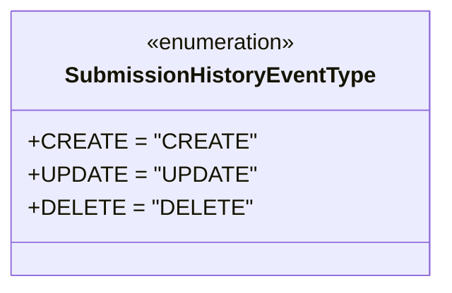

# Diagram: entity_core/entity_service/platform_applications/damage_submission_history_event/src/models/event_type.py

> Auto-generated by Obscura crawlers

## Mermaid

> SVG rendering failed for this diagram.
