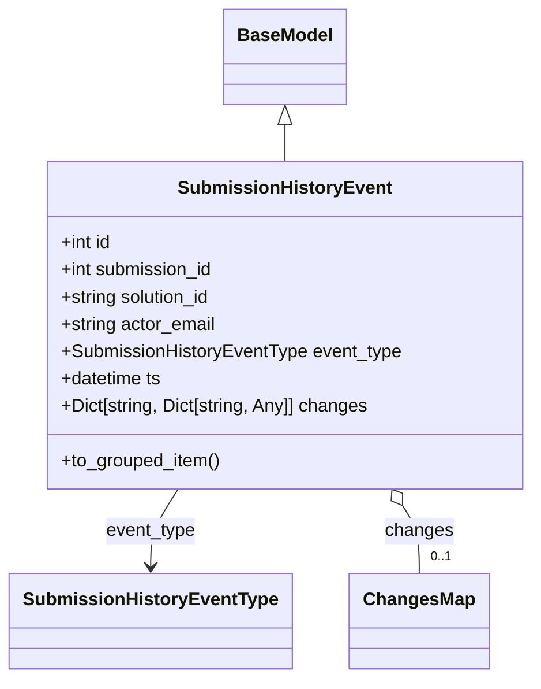
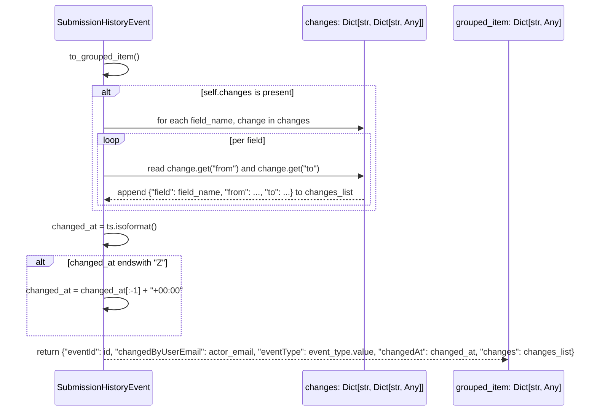

# Diagram: entity_core/entity_service/platform_applications/damage_submission_history_event/src/models/submission_history_event.py

> Auto-generated by Obscura crawlers

## Diagram 1

### SVG

<svg id="container" width="454.1015625" xmlns="http://www.w3.org/2000/svg" class="classDiagram" height="596" viewBox="0 0 454.1015625 596" role="graphics-document document" aria-roledescription="class"><g><defs><marker id="container_class-aggregationStart" class="marker aggregation class" refX="18" refY="7" markerWidth="190" markerHeight="240" orient="auto"><path d="M 18,7 L9,13 L1,7 L9,1 Z"></path></marker></defs><defs><marker id="container_class-aggregationEnd" class="marker aggregation class" refX="1" refY="7" markerWidth="20" markerHeight="28" orient="auto"><path d="M 18,7 L9,13 L1,7 L9,1 Z"></path></marker></defs><defs><marker id="container_class-extensionStart" class="marker extension class" refX="18" refY="7" markerWidth="190" markerHeight="240" orient="auto"><path d="M 1,7 L18,13 V 1 Z"></path></marker></defs><defs><marker id="container_class-extensionEnd" class="marker extension class" refX="1" refY="7" markerWidth="20" markerHeight="28" orient="auto"><path d="M 1,1 V 13 L18,7 Z"></path></marker></defs><defs><marker id="container_class-compositionStart" class="marker composition class" refX="18" refY="7" markerWidth="190" markerHeight="240" orient="auto"><path d="M 18,7 L9,13 L1,7 L9,1 Z"></path></marker></defs><defs><marker id="container_class-compositionEnd" class="marker composition class" refX="1" refY="7" markerWidth="20" markerHeight="28" orient="auto"><path d="M 18,7 L9,13 L1,7 L9,1 Z"></path></marker></defs><defs><marker id="container_class-dependencyStart" class="marker dependency class" refX="6" refY="7" markerWidth="190" markerHeight="240" orient="auto"><path d="M 5,7 L9,13 L1,7 L9,1 Z"></path></marker></defs><defs><marker id="container_class-dependencyEnd" class="marker dependency class" refX="13" refY="7" markerWidth="20" markerHeight="28" orient="auto"><path d="M 18,7 L9,13 L14,7 L9,1 Z"></path></marker></defs><defs><marker id="container_class-lollipopStart" class="marker lollipop class" refX="13" refY="7" markerWidth="190" markerHeight="240" orient="auto"><circle stroke="black" fill="transparent" cx="7" cy="7" r="6"></circle></marker></defs><defs><marker id="container_class-lollipopEnd" class="marker lollipop class" refX="1" refY="7" markerWidth="190" markerHeight="240" orient="auto"><circle stroke="black" fill="transparent" cx="7" cy="7" r="6"></circle></marker></defs><g class="root"><g class="clusters"></g><g class="edgePaths"><path d="M239.238,109.25L239.238,110.542C239.238,111.833,239.238,114.417,239.238,119.875C239.238,125.333,239.238,133.667,239.238,137.833L239.238,142" id="id_BaseModel_SubmissionHistoryEvent_1" class="edge-thickness-normal edge-pattern-solid relation" style=";;;" data-edge="true" data-et="edge" data-id="id_BaseModel_SubmissionHistoryEvent_1" data-points="W3sieCI6MjM5LjIzODI4MTI1LCJ5Ijo5Mn0seyJ4IjoyMzkuMjM4MjgxMjUsInkiOjExN30seyJ4IjoyMzkuMjM4MjgxMjUsInkiOjE0Mn1d" marker-start="url(#container_class-extensionStart)"></path><path d="M149.248,430L145.394,436.167C141.54,442.333,133.833,454.667,129.979,466C126.125,477.333,126.125,487.667,126.125,492.833L126.125,498" id="id_SubmissionHistoryEvent_SubmissionHistoryEventType_2" class="edge-thickness-normal edge-pattern-solid relation" style=";;;" data-edge="true" data-et="edge" data-id="id_SubmissionHistoryEvent_SubmissionHistoryEventType_2" data-points="W3sieCI6MTQ5LjI0NzYwNDQ1NDQxOTksInkiOjQzMH0seyJ4IjoxMjYuMTI1LCJ5Ijo0Njd9LHsieCI6MTI2LjEyNSwieSI6NTA0fV0=" marker-end="url(#container_class-dependencyEnd)"></path><path d="M338.371,444.628L340.701,448.357C343.031,452.086,347.691,459.543,350.021,469.438C352.352,479.333,352.352,491.667,352.352,497.833L352.352,504" id="id_SubmissionHistoryEvent_ChangesMap_3" class="edge-thickness-normal edge-pattern-solid relation" style=";;;" data-edge="true" data-et="edge" data-id="id_SubmissionHistoryEvent_ChangesMap_3" data-points="W3sieCI6MzI5LjIyODk1ODA0NTU4MDEsInkiOjQzMH0seyJ4IjozNTIuMzUxNTYyNSwieSI6NDY3fSx7IngiOjM1Mi4zNTE1NjI1LCJ5Ijo1MDR9XQ==" marker-start="url(#container_class-aggregationStart)"></path></g><g class="edgeLabels"><g class="edgeLabel"><g class="label" data-id="id_BaseModel_SubmissionHistoryEvent_1" transform="translate(0, 0)"><foreignObject width="0" height="0">

</foreignObject></g></g><g class="edgeLabel" transform="translate(126.125, 467)"><g class="label" data-id="id_SubmissionHistoryEvent_SubmissionHistoryEventType_2" transform="translate(-40.0703125, -12)"><foreignObject width="80.140625" height="24">

event_type

</foreignObject></g></g><g class="edgeLabel" transform="translate(352.3515625, 467)"><g class="label" data-id="id_SubmissionHistoryEvent_ChangesMap_3" transform="translate(-29.6875, -12)"><foreignObject width="59.375" height="24">

changes

</foreignObject></g></g><g class="edgeTerminals" transform="translate(362.35156125, 481.4999989285714)"><g class="inner" transform="translate(0, 0)"></g><foreignObject style="width: 36px; height: 12px;">
0..1
</foreignObject></g></g><g class="nodes"><g class="node default" id="classId-BaseModel-0" transform="translate(239.23828125, 50)"><g class="basic label-container"><path d="M-52.078125 -42 L52.078125 -42 L52.078125 42 L-52.078125 42" stroke="none" stroke-width="0" fill="#ECECFF" style=""></path><path d="M-52.078125 -42 C-16.025478859783085 -42, 20.02716728043383 -42, 52.078125 -42 M-52.078125 -42 C-14.678694163560486 -42, 22.720736672879028 -42, 52.078125 -42 M52.078125 -42 C52.078125 -21.137450382353062, 52.078125 -0.2749007647061248, 52.078125 42 M52.078125 -42 C52.078125 -20.059835845003715, 52.078125 1.8803283099925707, 52.078125 42 M52.078125 42 C20.222745729983345 42, -11.63263354003331 42, -52.078125 42 M52.078125 42 C20.852951969937248 42, -10.372221060125504 42, -52.078125 42 M-52.078125 42 C-52.078125 12.995783769501763, -52.078125 -16.008432460996474, -52.078125 -42 M-52.078125 42 C-52.078125 17.312950043681724, -52.078125 -7.374099912636552, -52.078125 -42" stroke="#9370DB" stroke-width="1.3" fill="none" stroke-dasharray="0 0" style=""></path></g><g class="annotation-group text" transform="translate(0, -18)"></g><g class="label-group text" transform="translate(-40.078125, -18)"><g class="label" style="font-weight: bolder" transform="translate(0,-12)"><foreignObject width="80.15625" height="24">

BaseModel

</foreignObject></g></g><g class="members-group text" transform="translate(-40.078125, 30)"></g><g class="methods-group text" transform="translate(-40.078125, 60)"></g><g class="divider" style=""><path d="M-52.078125 6 C-11.342381692428255 6, 29.39336161514349 6, 52.078125 6 M-52.078125 6 C-11.877430416360617 6, 28.323264167278765 6, 52.078125 6" stroke="#9370DB" stroke-width="1.3" fill="none" stroke-dasharray="0 0" style=""></path></g><g class="divider" style=""><path d="M-52.078125 24 C-30.18538789300964 24, -8.29265078601928 24, 52.078125 24 M-52.078125 24 C-21.604399179098102 24, 8.869326641803795 24, 52.078125 24" stroke="#9370DB" stroke-width="1.3" fill="none" stroke-dasharray="0 0" style=""></path></g></g><g class="node default" id="classId-SubmissionHistoryEvent-1" transform="translate(239.23828125, 286)"><g class="basic label-container"><path d="M-206.86328125 -144 L206.86328125 -144 L206.86328125 144 L-206.86328125 144" stroke="none" stroke-width="0" fill="#ECECFF" style=""></path><path d="M-206.86328125 -144 C-91.03443850494331 -144, 24.79440424011338 -144, 206.86328125 -144 M-206.86328125 -144 C-74.14336583307716 -144, 58.57654958384569 -144, 206.86328125 -144 M206.86328125 -144 C206.86328125 -60.793848895076536, 206.86328125 22.412302209846928, 206.86328125 144 M206.86328125 -144 C206.86328125 -37.55493990620643, 206.86328125 68.89012018758714, 206.86328125 144 M206.86328125 144 C96.39334551660356 144, -14.07659021679288 144, -206.86328125 144 M206.86328125 144 C120.53292106869903 144, 34.20256088739805 144, -206.86328125 144 M-206.86328125 144 C-206.86328125 77.54571780147141, -206.86328125 11.091435602942823, -206.86328125 -144 M-206.86328125 144 C-206.86328125 60.22476593793748, -206.86328125 -23.550468124125047, -206.86328125 -144" stroke="#9370DB" stroke-width="1.3" fill="none" stroke-dasharray="0 0" style=""></path></g><g class="annotation-group text" transform="translate(0, -120)"></g><g class="label-group text" transform="translate(-88.7890625, -120)"><g class="label" style="font-weight: bolder" transform="translate(0,-12)"><foreignObject width="177.578125" height="24">

SubmissionHistoryEvent

</foreignObject></g></g><g class="members-group text" transform="translate(-194.86328125, -72)"><g class="label" style="" transform="translate(0,-12)"><foreignObject width="45.96875" height="24">

+int id

</foreignObject></g><g class="label" style="" transform="translate(0,12)"><foreignObject width="136.828125" height="24">

+int submission_id

</foreignObject></g><g class="label" style="" transform="translate(0,36)"><foreignObject width="136.09375" height="24">

+string solution_id

</foreignObject></g><g class="label" style="" transform="translate(0,60)"><foreignObject width="138.328125" height="24">

+string actor_email

</foreignObject></g><g class="label" style="" transform="translate(0,84)"><foreignObject width="300.9375" height="24">

+SubmissionHistoryEventType event_type

</foreignObject></g><g class="label" style="" transform="translate(0,108)"><foreignObject width="90.734375" height="24">

+datetime ts

</foreignObject></g><g class="label" style="" transform="translate(0,132)"><foreignObject width="274.40625" height="24">

+Dict[string, Dict[string, Any]] changes

</foreignObject></g></g><g class="methods-group text" transform="translate(-194.86328125, 120)"><g class="label" style="" transform="translate(0,-12)"><foreignObject width="142.5625" height="24">

+to_grouped_item()

</foreignObject></g></g><g class="divider" style=""><path d="M-206.86328125 -96 C-49.526298717475385 -96, 107.81068381504923 -96, 206.86328125 -96 M-206.86328125 -96 C-57.167591203955624 -96, 92.52809884208875 -96, 206.86328125 -96" stroke="#9370DB" stroke-width="1.3" fill="none" stroke-dasharray="0 0" style=""></path></g><g class="divider" style=""><path d="M-206.86328125 96 C-60.44546825853283 96, 85.97234473293435 96, 206.86328125 96 M-206.86328125 96 C-73.76922757355192 96, 59.32482610289617 96, 206.86328125 96" stroke="#9370DB" stroke-width="1.3" fill="none" stroke-dasharray="0 0" style=""></path></g></g><g class="node default" id="classId-SubmissionHistoryEventType-2" transform="translate(126.125, 546)"><g class="basic label-container"><path d="M-118.125 -42 L118.125 -42 L118.125 42 L-118.125 42" stroke="none" stroke-width="0" fill="#ECECFF" style=""></path><path d="M-118.125 -42 C-54.89729250084718 -42, 8.330414998305642 -42, 118.125 -42 M-118.125 -42 C-68.95909477424522 -42, -19.793189548490446 -42, 118.125 -42 M118.125 -42 C118.125 -10.51099302346929, 118.125 20.97801395306142, 118.125 42 M118.125 -42 C118.125 -24.4624950650489, 118.125 -6.924990130097797, 118.125 42 M118.125 42 C51.7547280816555 42, -14.615543836689 42, -118.125 42 M118.125 42 C43.96360706012061 42, -30.197785879758783 42, -118.125 42 M-118.125 42 C-118.125 10.496443356023232, -118.125 -21.007113287953537, -118.125 -42 M-118.125 42 C-118.125 24.752263263152425, -118.125 7.504526526304851, -118.125 -42" stroke="#9370DB" stroke-width="1.3" fill="none" stroke-dasharray="0 0" style=""></path></g><g class="annotation-group text" transform="translate(0, -18)"></g><g class="label-group text" transform="translate(-106.125, -18)"><g class="label" style="font-weight: bolder" transform="translate(0,-12)"><foreignObject width="212.25" height="24">

SubmissionHistoryEventType

</foreignObject></g></g><g class="members-group text" transform="translate(-106.125, 30)"></g><g class="methods-group text" transform="translate(-106.125, 60)"></g><g class="divider" style=""><path d="M-118.125 6 C-26.65824313857715 6, 64.8085137228457 6, 118.125 6 M-118.125 6 C-68.10138164646774 6, -18.077763292935487 6, 118.125 6" stroke="#9370DB" stroke-width="1.3" fill="none" stroke-dasharray="0 0" style=""></path></g><g class="divider" style=""><path d="M-118.125 24 C-29.897944453415292 24, 58.329111093169416 24, 118.125 24 M-118.125 24 C-56.13999548813538 24, 5.845009023729233 24, 118.125 24" stroke="#9370DB" stroke-width="1.3" fill="none" stroke-dasharray="0 0" style=""></path></g></g><g class="node default" id="classId-ChangesMap-3" transform="translate(352.3515625, 546)"><g class="basic label-container"><path d="M-58.1015625 -42 L58.1015625 -42 L58.1015625 42 L-58.1015625 42" stroke="none" stroke-width="0" fill="#ECECFF" style=""></path><path d="M-58.1015625 -42 C-26.838578806956143 -42, 4.424404886087714 -42, 58.1015625 -42 M-58.1015625 -42 C-30.045128128105947 -42, -1.9886937562118945 -42, 58.1015625 -42 M58.1015625 -42 C58.1015625 -10.138125502600264, 58.1015625 21.72374899479947, 58.1015625 42 M58.1015625 -42 C58.1015625 -12.567678153550016, 58.1015625 16.864643692899968, 58.1015625 42 M58.1015625 42 C20.420918234138384 42, -17.259726031723233 42, -58.1015625 42 M58.1015625 42 C31.440192479937632 42, 4.778822459875265 42, -58.1015625 42 M-58.1015625 42 C-58.1015625 23.74897047627613, -58.1015625 5.497940952552263, -58.1015625 -42 M-58.1015625 42 C-58.1015625 11.368127879161285, -58.1015625 -19.26374424167743, -58.1015625 -42" stroke="#9370DB" stroke-width="1.3" fill="none" stroke-dasharray="0 0" style=""></path></g><g class="annotation-group text" transform="translate(0, -18)"></g><g class="label-group text" transform="translate(-46.1015625, -18)"><g class="label" style="font-weight: bolder" transform="translate(0,-12)"><foreignObject width="92.203125" height="24">

ChangesMap

</foreignObject></g></g><g class="members-group text" transform="translate(-46.1015625, 30)"></g><g class="methods-group text" transform="translate(-46.1015625, 60)"></g><g class="divider" style=""><path d="M-58.1015625 6 C-17.124371081041133 6, 23.852820337917734 6, 58.1015625 6 M-58.1015625 6 C-19.156216279302434 6, 19.78912994139513 6, 58.1015625 6" stroke="#9370DB" stroke-width="1.3" fill="none" stroke-dasharray="0 0" style=""></path></g><g class="divider" style=""><path d="M-58.1015625 24 C-28.843956699249823 24, 0.4136491015003543 24, 58.1015625 24 M-58.1015625 24 C-34.05165480516439 24, -10.001747110328779 24, 58.1015625 24" stroke="#9370DB" stroke-width="1.3" fill="none" stroke-dasharray="0 0" style=""></path></g></g></g></g></g></svg>

## Diagram 2

### SVG

<svg id="container" width="1161" xmlns="http://www.w3.org/2000/svg" height="792" viewBox="-104.5 -10 1161 792" role="graphics-document document" aria-roledescription="sequence"><g><rect x="786.5" y="706" fill="#eaeaea" stroke="#666" width="220" height="65" name="Result" rx="3" ry="3" class="actor actor-bottom"></rect><text x="896.5" y="738.5" dominant-baseline="central" alignment-baseline="central" class="actor actor-box" style="text-anchor: middle; font-size: 16px; font-weight: 400;"><tspan x="896.5" dy="0">grouped_item: Dict[str, Any]</tspan></text></g><g><rect x="493.5" y="706" fill="#eaeaea" stroke="#666" width="243" height="65" name="Changes" rx="3" ry="3" class="actor actor-bottom"></rect><text x="615" y="738.5" dominant-baseline="central" alignment-baseline="central" class="actor actor-box" style="text-anchor: middle; font-size: 16px; font-weight: 400;"><tspan x="615" dy="0">changes: Dict[str, Dict[str, Any]]</tspan></text></g><g><rect x="0" y="706" fill="#eaeaea" stroke="#666" width="196" height="65" name="Event" rx="3" ry="3" class="actor actor-bottom"></rect><text x="98" y="738.5" dominant-baseline="central" alignment-baseline="central" class="actor actor-box" style="text-anchor: middle; font-size: 16px; font-weight: 400;"><tspan x="98" dy="0">SubmissionHistoryEvent</tspan></text></g><g><line id="actor2" x1="896.5" y1="65" x2="896.5" y2="706" class="actor-line 200" stroke-width="0.5px" stroke="#999" name="Result"></line><g id="root-2"><rect x="786.5" y="0" fill="#eaeaea" stroke="#666" width="220" height="65" name="Result" rx="3" ry="3" class="actor actor-top"></rect><text x="896.5" y="32.5" dominant-baseline="central" alignment-baseline="central" class="actor actor-box" style="text-anchor: middle; font-size: 16px; font-weight: 400;"><tspan x="896.5" dy="0">grouped_item: Dict[str, Any]</tspan></text></g></g><g><line id="actor1" x1="615" y1="65" x2="615" y2="706" class="actor-line 200" stroke-width="0.5px" stroke="#999" name="Changes"></line><g id="root-1"><rect x="493.5" y="0" fill="#eaeaea" stroke="#666" width="243" height="65" name="Changes" rx="3" ry="3" class="actor actor-top"></rect><text x="615" y="32.5" dominant-baseline="central" alignment-baseline="central" class="actor actor-box" style="text-anchor: middle; font-size: 16px; font-weight: 400;"><tspan x="615" dy="0">changes: Dict[str, Dict[str, Any]]</tspan></text></g></g><g><line id="actor0" x1="98" y1="65" x2="98" y2="706" class="actor-line 200" stroke-width="0.5px" stroke="#999" name="Event"></line><g id="root-0"><rect x="0" y="0" fill="#eaeaea" stroke="#666" width="196" height="65" name="Event" rx="3" ry="3" class="actor actor-top"></rect><text x="98" y="32.5" dominant-baseline="central" alignment-baseline="central" class="actor actor-box" style="text-anchor: middle; font-size: 16px; font-weight: 400;"><tspan x="98" dy="0">SubmissionHistoryEvent</tspan></text></g></g><g></g><defs><symbol id="computer" width="24" height="24"><path transform="scale(.5)" d="M2 2v13h20v-13h-20zm18 11h-16v-9h16v9zm-10.228 6l.466-1h3.524l.467 1h-4.457zm14.228 3h-24l2-6h2.104l-1.33 4h18.45l-1.297-4h2.073l2 6zm-5-10h-14v-7h14v7z"></path></symbol></defs><defs><symbol id="database" fill-rule="evenodd" clip-rule="evenodd"><path transform="scale(.5)" d="M12.258.001l.256.004.255.005.253.008.251.01.249.012.247.015.246.016.242.019.241.02.239.023.236.024.233.027.231.028.229.031.225.032.223.034.22.036.217.038.214.04.211.041.208.043.205.045.201.046.198.048.194.05.191.051.187.053.183.054.18.056.175.057.172.059.168.06.163.061.16.063.155.064.15.066.074.033.073.033.071.034.07.034.069.035.068.035.067.035.066.035.064.036.064.036.062.036.06.036.06.037.058.037.058.037.055.038.055.038.053.038.052.038.051.039.05.039.048.039.047.039.045.04.044.04.043.04.041.04.04.041.039.041.037.041.036.041.034.041.033.042.032.042.03.042.029.042.027.042.026.043.024.043.023.043.021.043.02.043.018.044.017.043.015.044.013.044.012.044.011.045.009.044.007.045.006.045.004.045.002.045.001.045v17l-.001.045-.002.045-.004.045-.006.045-.007.045-.009.044-.011.045-.012.044-.013.044-.015.044-.017.043-.018.044-.02.043-.021.043-.023.043-.024.043-.026.043-.027.042-.029.042-.03.042-.032.042-.033.042-.034.041-.036.041-.037.041-.039.041-.04.041-.041.04-.043.04-.044.04-.045.04-.047.039-.048.039-.05.039-.051.039-.052.038-.053.038-.055.038-.055.038-.058.037-.058.037-.06.037-.06.036-.062.036-.064.036-.064.036-.066.035-.067.035-.068.035-.069.035-.07.034-.071.034-.073.033-.074.033-.15.066-.155.064-.16.063-.163.061-.168.06-.172.059-.175.057-.18.056-.183.054-.187.053-.191.051-.194.05-.198.048-.201.046-.205.045-.208.043-.211.041-.214.04-.217.038-.22.036-.223.034-.225.032-.229.031-.231.028-.233.027-.236.024-.239.023-.241.02-.242.019-.246.016-.247.015-.249.012-.251.01-.253.008-.255.005-.256.004-.258.001-.258-.001-.256-.004-.255-.005-.253-.008-.251-.01-.249-.012-.247-.015-.245-.016-.243-.019-.241-.02-.238-.023-.236-.024-.234-.027-.231-.028-.228-.031-.226-.032-.223-.034-.22-.036-.217-.038-.214-.04-.211-.041-.208-.043-.204-.045-.201-.046-.198-.048-.195-.05-.19-.051-.187-.053-.184-.054-.179-.056-.176-.057-.172-.059-.167-.06-.164-.061-.159-.063-.155-.064-.151-.066-.074-.033-.072-.033-.072-.034-.07-.034-.069-.035-.068-.035-.067-.035-.066-.035-.064-.036-.063-.036-.062-.036-.061-.036-.06-.037-.058-.037-.057-.037-.056-.038-.055-.038-.053-.038-.052-.038-.051-.039-.049-.039-.049-.039-.046-.039-.046-.04-.044-.04-.043-.04-.041-.04-.04-.041-.039-.041-.037-.041-.036-.041-.034-.041-.033-.042-.032-.042-.03-.042-.029-.042-.027-.042-.026-.043-.024-.043-.023-.043-.021-.043-.02-.043-.018-.044-.017-.043-.015-.044-.013-.044-.012-.044-.011-.045-.009-.044-.007-.045-.006-.045-.004-.045-.002-.045-.001-.045v-17l.001-.045.002-.045.004-.045.006-.045.007-.045.009-.044.011-.045.012-.044.013-.044.015-.044.017-.043.018-.044.02-.043.021-.043.023-.043.024-.043.026-.043.027-.042.029-.042.03-.042.032-.042.033-.042.034-.041.036-.041.037-.041.039-.041.04-.041.041-.04.043-.04.044-.04.046-.04.046-.039.049-.039.049-.039.051-.039.052-.038.053-.038.055-.038.056-.038.057-.037.058-.037.06-.037.061-.036.062-.036.063-.036.064-.036.066-.035.067-.035.068-.035.069-.035.07-.034.072-.034.072-.033.074-.033.151-.066.155-.064.159-.063.164-.061.167-.06.172-.059.176-.057.179-.056.184-.054.187-.053.19-.051.195-.05.198-.048.201-.046.204-.045.208-.043.211-.041.214-.04.217-.038.22-.036.223-.034.226-.032.228-.031.231-.028.234-.027.236-.024.238-.023.241-.02.243-.019.245-.016.247-.015.249-.012.251-.01.253-.008.255-.005.256-.004.258-.001.258.001zm-9.258 20.499v.01l.001.021.003.021.004.022.005.021.006.022.007.022.009.023.01.022.011.023.012.023.013.023.015.023.016.024.017.023.018.024.019.024.021.024.022.025.023.024.024.025.052.049.056.05.061.051.066.051.07.051.075.051.079.052.084.052.088.052.092.052.097.052.102.051.105.052.11.052.114.051.119.051.123.051.127.05.131.05.135.05.139.048.144.049.147.047.152.047.155.047.16.045.163.045.167.043.171.043.176.041.178.041.183.039.187.039.19.037.194.035.197.035.202.033.204.031.209.03.212.029.216.027.219.025.222.024.226.021.23.02.233.018.236.016.24.015.243.012.246.01.249.008.253.005.256.004.259.001.26-.001.257-.004.254-.005.25-.008.247-.011.244-.012.241-.014.237-.016.233-.018.231-.021.226-.021.224-.024.22-.026.216-.027.212-.028.21-.031.205-.031.202-.034.198-.034.194-.036.191-.037.187-.039.183-.04.179-.04.175-.042.172-.043.168-.044.163-.045.16-.046.155-.046.152-.047.148-.048.143-.049.139-.049.136-.05.131-.05.126-.05.123-.051.118-.052.114-.051.11-.052.106-.052.101-.052.096-.052.092-.052.088-.053.083-.051.079-.052.074-.052.07-.051.065-.051.06-.051.056-.05.051-.05.023-.024.023-.025.021-.024.02-.024.019-.024.018-.024.017-.024.015-.023.014-.024.013-.023.012-.023.01-.023.01-.022.008-.022.006-.022.006-.022.004-.022.004-.021.001-.021.001-.021v-4.127l-.077.055-.08.053-.083.054-.085.053-.087.052-.09.052-.093.051-.095.05-.097.05-.1.049-.102.049-.105.048-.106.047-.109.047-.111.046-.114.045-.115.045-.118.044-.12.043-.122.042-.124.042-.126.041-.128.04-.13.04-.132.038-.134.038-.135.037-.138.037-.139.035-.142.035-.143.034-.144.033-.147.032-.148.031-.15.03-.151.03-.153.029-.154.027-.156.027-.158.026-.159.025-.161.024-.162.023-.163.022-.165.021-.166.02-.167.019-.169.018-.169.017-.171.016-.173.015-.173.014-.175.013-.175.012-.177.011-.178.01-.179.008-.179.008-.181.006-.182.005-.182.004-.184.003-.184.002h-.37l-.184-.002-.184-.003-.182-.004-.182-.005-.181-.006-.179-.008-.179-.008-.178-.01-.176-.011-.176-.012-.175-.013-.173-.014-.172-.015-.171-.016-.17-.017-.169-.018-.167-.019-.166-.02-.165-.021-.163-.022-.162-.023-.161-.024-.159-.025-.157-.026-.156-.027-.155-.027-.153-.029-.151-.03-.15-.03-.148-.031-.146-.032-.145-.033-.143-.034-.141-.035-.14-.035-.137-.037-.136-.037-.134-.038-.132-.038-.13-.04-.128-.04-.126-.041-.124-.042-.122-.042-.12-.044-.117-.043-.116-.045-.113-.045-.112-.046-.109-.047-.106-.047-.105-.048-.102-.049-.1-.049-.097-.05-.095-.05-.093-.052-.09-.051-.087-.052-.085-.053-.083-.054-.08-.054-.077-.054v4.127zm0-5.654v.011l.001.021.003.021.004.021.005.022.006.022.007.022.009.022.01.022.011.023.012.023.013.023.015.024.016.023.017.024.018.024.019.024.021.024.022.024.023.025.024.024.052.05.056.05.061.05.066.051.07.051.075.052.079.051.084.052.088.052.092.052.097.052.102.052.105.052.11.051.114.051.119.052.123.05.127.051.131.05.135.049.139.049.144.048.147.048.152.047.155.046.16.045.163.045.167.044.171.042.176.042.178.04.183.04.187.038.19.037.194.036.197.034.202.033.204.032.209.03.212.028.216.027.219.025.222.024.226.022.23.02.233.018.236.016.24.014.243.012.246.01.249.008.253.006.256.003.259.001.26-.001.257-.003.254-.006.25-.008.247-.01.244-.012.241-.015.237-.016.233-.018.231-.02.226-.022.224-.024.22-.025.216-.027.212-.029.21-.03.205-.032.202-.033.198-.035.194-.036.191-.037.187-.039.183-.039.179-.041.175-.042.172-.043.168-.044.163-.045.16-.045.155-.047.152-.047.148-.048.143-.048.139-.05.136-.049.131-.05.126-.051.123-.051.118-.051.114-.052.11-.052.106-.052.101-.052.096-.052.092-.052.088-.052.083-.052.079-.052.074-.051.07-.052.065-.051.06-.05.056-.051.051-.049.023-.025.023-.024.021-.025.02-.024.019-.024.018-.024.017-.024.015-.023.014-.023.013-.024.012-.022.01-.023.01-.023.008-.022.006-.022.006-.022.004-.021.004-.022.001-.021.001-.021v-4.139l-.077.054-.08.054-.083.054-.085.052-.087.053-.09.051-.093.051-.095.051-.097.05-.1.049-.102.049-.105.048-.106.047-.109.047-.111.046-.114.045-.115.044-.118.044-.12.044-.122.042-.124.042-.126.041-.128.04-.13.039-.132.039-.134.038-.135.037-.138.036-.139.036-.142.035-.143.033-.144.033-.147.033-.148.031-.15.03-.151.03-.153.028-.154.028-.156.027-.158.026-.159.025-.161.024-.162.023-.163.022-.165.021-.166.02-.167.019-.169.018-.169.017-.171.016-.173.015-.173.014-.175.013-.175.012-.177.011-.178.009-.179.009-.179.007-.181.007-.182.005-.182.004-.184.003-.184.002h-.37l-.184-.002-.184-.003-.182-.004-.182-.005-.181-.007-.179-.007-.179-.009-.178-.009-.176-.011-.176-.012-.175-.013-.173-.014-.172-.015-.171-.016-.17-.017-.169-.018-.167-.019-.166-.02-.165-.021-.163-.022-.162-.023-.161-.024-.159-.025-.157-.026-.156-.027-.155-.028-.153-.028-.151-.03-.15-.03-.148-.031-.146-.033-.145-.033-.143-.033-.141-.035-.14-.036-.137-.036-.136-.037-.134-.038-.132-.039-.13-.039-.128-.04-.126-.041-.124-.042-.122-.043-.12-.043-.117-.044-.116-.044-.113-.046-.112-.046-.109-.046-.106-.047-.105-.048-.102-.049-.1-.049-.097-.05-.095-.051-.093-.051-.09-.051-.087-.053-.085-.052-.083-.054-.08-.054-.077-.054v4.139zm0-5.666v.011l.001.02.003.022.004.021.005.022.006.021.007.022.009.023.01.022.011.023.012.023.013.023.015.023.016.024.017.024.018.023.019.024.021.025.022.024.023.024.024.025.052.05.056.05.061.05.066.051.07.051.075.052.079.051.084.052.088.052.092.052.097.052.102.052.105.051.11.052.114.051.119.051.123.051.127.05.131.05.135.05.139.049.144.048.147.048.152.047.155.046.16.045.163.045.167.043.171.043.176.042.178.04.183.04.187.038.19.037.194.036.197.034.202.033.204.032.209.03.212.028.216.027.219.025.222.024.226.021.23.02.233.018.236.017.24.014.243.012.246.01.249.008.253.006.256.003.259.001.26-.001.257-.003.254-.006.25-.008.247-.01.244-.013.241-.014.237-.016.233-.018.231-.02.226-.022.224-.024.22-.025.216-.027.212-.029.21-.03.205-.032.202-.033.198-.035.194-.036.191-.037.187-.039.183-.039.179-.041.175-.042.172-.043.168-.044.163-.045.16-.045.155-.047.152-.047.148-.048.143-.049.139-.049.136-.049.131-.051.126-.05.123-.051.118-.052.114-.051.11-.052.106-.052.101-.052.096-.052.092-.052.088-.052.083-.052.079-.052.074-.052.07-.051.065-.051.06-.051.056-.05.051-.049.023-.025.023-.025.021-.024.02-.024.019-.024.018-.024.017-.024.015-.023.014-.024.013-.023.012-.023.01-.022.01-.023.008-.022.006-.022.006-.022.004-.022.004-.021.001-.021.001-.021v-4.153l-.077.054-.08.054-.083.053-.085.053-.087.053-.09.051-.093.051-.095.051-.097.05-.1.049-.102.048-.105.048-.106.048-.109.046-.111.046-.114.046-.115.044-.118.044-.12.043-.122.043-.124.042-.126.041-.128.04-.13.039-.132.039-.134.038-.135.037-.138.036-.139.036-.142.034-.143.034-.144.033-.147.032-.148.032-.15.03-.151.03-.153.028-.154.028-.156.027-.158.026-.159.024-.161.024-.162.023-.163.023-.165.021-.166.02-.167.019-.169.018-.169.017-.171.016-.173.015-.173.014-.175.013-.175.012-.177.01-.178.01-.179.009-.179.007-.181.006-.182.006-.182.004-.184.003-.184.001-.185.001-.185-.001-.184-.001-.184-.003-.182-.004-.182-.006-.181-.006-.179-.007-.179-.009-.178-.01-.176-.01-.176-.012-.175-.013-.173-.014-.172-.015-.171-.016-.17-.017-.169-.018-.167-.019-.166-.02-.165-.021-.163-.023-.162-.023-.161-.024-.159-.024-.157-.026-.156-.027-.155-.028-.153-.028-.151-.03-.15-.03-.148-.032-.146-.032-.145-.033-.143-.034-.141-.034-.14-.036-.137-.036-.136-.037-.134-.038-.132-.039-.13-.039-.128-.041-.126-.041-.124-.041-.122-.043-.12-.043-.117-.044-.116-.044-.113-.046-.112-.046-.109-.046-.106-.048-.105-.048-.102-.048-.1-.05-.097-.049-.095-.051-.093-.051-.09-.052-.087-.052-.085-.053-.083-.053-.08-.054-.077-.054v4.153zm8.74-8.179l-.257.004-.254.005-.25.008-.247.011-.244.012-.241.014-.237.016-.233.018-.231.021-.226.022-.224.023-.22.026-.216.027-.212.028-.21.031-.205.032-.202.033-.198.034-.194.036-.191.038-.187.038-.183.04-.179.041-.175.042-.172.043-.168.043-.163.045-.16.046-.155.046-.152.048-.148.048-.143.048-.139.049-.136.05-.131.05-.126.051-.123.051-.118.051-.114.052-.11.052-.106.052-.101.052-.096.052-.092.052-.088.052-.083.052-.079.052-.074.051-.07.052-.065.051-.06.05-.056.05-.051.05-.023.025-.023.024-.021.024-.02.025-.019.024-.018.024-.017.023-.015.024-.014.023-.013.023-.012.023-.01.023-.01.022-.008.022-.006.023-.006.021-.004.022-.004.021-.001.021-.001.021.001.021.001.021.004.021.004.022.006.021.006.023.008.022.01.022.01.023.012.023.013.023.014.023.015.024.017.023.018.024.019.024.02.025.021.024.023.024.023.025.051.05.056.05.06.05.065.051.07.052.074.051.079.052.083.052.088.052.092.052.096.052.101.052.106.052.11.052.114.052.118.051.123.051.126.051.131.05.136.05.139.049.143.048.148.048.152.048.155.046.16.046.163.045.168.043.172.043.175.042.179.041.183.04.187.038.191.038.194.036.198.034.202.033.205.032.21.031.212.028.216.027.22.026.224.023.226.022.231.021.233.018.237.016.241.014.244.012.247.011.25.008.254.005.257.004.26.001.26-.001.257-.004.254-.005.25-.008.247-.011.244-.012.241-.014.237-.016.233-.018.231-.021.226-.022.224-.023.22-.026.216-.027.212-.028.21-.031.205-.032.202-.033.198-.034.194-.036.191-.038.187-.038.183-.04.179-.041.175-.042.172-.043.168-.043.163-.045.16-.046.155-.046.152-.048.148-.048.143-.048.139-.049.136-.05.131-.05.126-.051.123-.051.118-.051.114-.052.11-.052.106-.052.101-.052.096-.052.092-.052.088-.052.083-.052.079-.052.074-.051.07-.052.065-.051.06-.05.056-.05.051-.05.023-.025.023-.024.021-.024.02-.025.019-.024.018-.024.017-.023.015-.024.014-.023.013-.023.012-.023.01-.023.01-.022.008-.022.006-.023.006-.021.004-.022.004-.021.001-.021.001-.021-.001-.021-.001-.021-.004-.021-.004-.022-.006-.021-.006-.023-.008-.022-.01-.022-.01-.023-.012-.023-.013-.023-.014-.023-.015-.024-.017-.023-.018-.024-.019-.024-.02-.025-.021-.024-.023-.024-.023-.025-.051-.05-.056-.05-.06-.05-.065-.051-.07-.052-.074-.051-.079-.052-.083-.052-.088-.052-.092-.052-.096-.052-.101-.052-.106-.052-.11-.052-.114-.052-.118-.051-.123-.051-.126-.051-.131-.05-.136-.05-.139-.049-.143-.048-.148-.048-.152-.048-.155-.046-.16-.046-.163-.045-.168-.043-.172-.043-.175-.042-.179-.041-.183-.04-.187-.038-.191-.038-.194-.036-.198-.034-.202-.033-.205-.032-.21-.031-.212-.028-.216-.027-.22-.026-.224-.023-.226-.022-.231-.021-.233-.018-.237-.016-.241-.014-.244-.012-.247-.011-.25-.008-.254-.005-.257-.004-.26-.001-.26.001z"></path></symbol></defs><defs><symbol id="clock" width="24" height="24"><path transform="scale(.5)" d="M12 2c5.514 0 10 4.486 10 10s-4.486 10-10 10-10-4.486-10-10 4.486-10 10-10zm0-2c-6.627 0-12 5.373-12 12s5.373 12 12 12 12-5.373 12-12-5.373-12-12-12zm5.848 12.459c.202.038.202.333.001.372-1.907.361-6.045 1.111-6.547 1.111-.719 0-1.301-.582-1.301-1.301 0-.512.77-5.447 1.125-7.445.034-.192.312-.181.343.014l.985 6.238 5.394 1.011z"></path></symbol></defs><defs><marker id="arrowhead" refX="7.9" refY="5" markerUnits="userSpaceOnUse" markerWidth="12" markerHeight="12" orient="auto-start-reverse"><path d="M -1 0 L 10 5 L 0 10 z"></path></marker></defs><defs><marker id="crosshead" markerWidth="15" markerHeight="8" orient="auto" refX="4" refY="4.5"><path fill="none" stroke="#000000" stroke-width="1pt" d="M 1,2 L 6,7 M 6,2 L 1,7" style="stroke-dasharray: 0, 0;"></path></marker></defs><defs><marker id="filled-head" refX="15.5" refY="7" markerWidth="20" markerHeight="28" orient="auto"><path d="M 18,7 L9,13 L14,7 L9,1 Z"></path></marker></defs><defs><marker id="sequencenumber" refX="15" refY="15" markerWidth="60" markerHeight="40" orient="auto"><circle cx="15" cy="15" r="6"></circle></marker></defs><g><line x1="87" y1="246" x2="626" y2="246" class="loopLine"></line><line x1="626" y1="246" x2="626" y2="387" class="loopLine"></line><line x1="87" y1="387" x2="626" y2="387" class="loopLine"></line><line x1="87" y1="246" x2="87" y2="387" class="loopLine"></line><polygon points="87,246 137,246 137,259 128.6,266 87,266" class="labelBox"></polygon><text x="112" y="259" text-anchor="middle" dominant-baseline="middle" alignment-baseline="middle" class="labelText" style="font-size: 16px; font-weight: 400;">loop</text><text x="381.5" y="264" text-anchor="middle" class="loopText" style="font-size: 16px; font-weight: 400;"><tspan x="381.5">[per field]</tspan></text></g><g><line x1="77" y1="153" x2="636" y2="153" class="loopLine"></line><line x1="636" y1="153" x2="636" y2="397" class="loopLine"></line><line x1="77" y1="397" x2="636" y2="397" class="loopLine"></line><line x1="77" y1="153" x2="77" y2="397" class="loopLine"></line><polygon points="77,153 127,153 127,166 118.6,173 77,173" class="labelBox"></polygon><text x="102" y="166" text-anchor="middle" dominant-baseline="middle" alignment-baseline="middle" class="labelText" style="font-size: 16px; font-weight: 400;">alt</text><text x="381.5" y="171" text-anchor="middle" class="loopText" style="font-size: 16px; font-weight: 400;"><tspan x="381.5">[self.changes is present]</tspan></text></g><g><line x1="-54.5" y1="485" x2="252.5" y2="485" class="loopLine"></line><line x1="252.5" y1="485" x2="252.5" y2="638" class="loopLine"></line><line x1="-54.5" y1="638" x2="252.5" y2="638" class="loopLine"></line><line x1="-54.5" y1="485" x2="-54.5" y2="638" class="loopLine"></line><polygon points="-54.5,485 -4.5,485 -4.5,498 -12.9,505 -54.5,505" class="labelBox"></polygon><text x="-29" y="498" text-anchor="middle" dominant-baseline="middle" alignment-baseline="middle" class="labelText" style="font-size: 16px; font-weight: 400;">alt</text><text x="124" y="503" text-anchor="middle" class="loopText" style="font-size: 16px; font-weight: 400;"><tspan x="124">[changed_at endswith "Z"]</tspan></text></g><text x="99" y="80" text-anchor="middle" dominant-baseline="middle" alignment-baseline="middle" class="messageText" dy="1em" style="font-size: 16px; font-weight: 400;">to_grouped_item()</text><path d="M 99,113 C 159,103 159,143 99,133" class="messageLine0" stroke-width="2" stroke="none" marker-end="url(#arrowhead)" style="fill: none;"></path><text x="355" y="203" text-anchor="middle" dominant-baseline="middle" alignment-baseline="middle" class="messageText" dy="1em" style="font-size: 16px; font-weight: 400;">for each field_name, change in changes</text><line x1="99" y1="236" x2="611" y2="236" class="messageLine0" stroke-width="2" stroke="none" marker-end="url(#arrowhead)" style="fill: none;"></line><text x="355" y="296" text-anchor="middle" dominant-baseline="middle" alignment-baseline="middle" class="messageText" dy="1em" style="font-size: 16px; font-weight: 400;">read change.get("from") and change.get("to")</text><line x1="99" y1="329" x2="611" y2="329" class="messageLine0" stroke-width="2" stroke="none" marker-end="url(#arrowhead)" style="fill: none;"></line><text x="358" y="344" text-anchor="middle" dominant-baseline="middle" alignment-baseline="middle" class="messageText" dy="1em" style="font-size: 16px; font-weight: 400;">append {"field": field_name, "from": ..., "to": ...} to changes_list</text><line x1="614" y1="377" x2="102" y2="377" class="messageLine1" stroke-width="2" stroke="none" marker-end="url(#arrowhead)" style="stroke-dasharray: 3, 3; fill: none;"></line><text x="99" y="412" text-anchor="middle" dominant-baseline="middle" alignment-baseline="middle" class="messageText" dy="1em" style="font-size: 16px; font-weight: 400;">changed_at = ts.isoformat()</text><path d="M 99,445 C 159,435 159,475 99,465" class="messageLine0" stroke-width="2" stroke="none" marker-end="url(#arrowhead)" style="fill: none;"></path><text x="99" y="535" text-anchor="middle" dominant-baseline="middle" alignment-baseline="middle" class="messageText" dy="1em" style="font-size: 16px; font-weight: 400;">changed_at = changed_at[:-1] + "+00:00"</text><path d="M 99,568 C 159,558 159,598 99,588" class="messageLine0" stroke-width="2" stroke="none" marker-end="url(#arrowhead)" style="fill: none;"></path><text x="496" y="653" text-anchor="middle" dominant-baseline="middle" alignment-baseline="middle" class="messageText" dy="1em" style="font-size: 16px; font-weight: 400;">return {"eventId": id, "changedByUserEmail": actor_email, "eventType": event_type.value, "changedAt": changed_at, "changes": changes_list}</text><line x1="99" y1="686" x2="892.5" y2="686" class="messageLine1" stroke-width="2" stroke="none" marker-end="url(#arrowhead)" style="stroke-dasharray: 3, 3; fill: none;"></line></svg>
