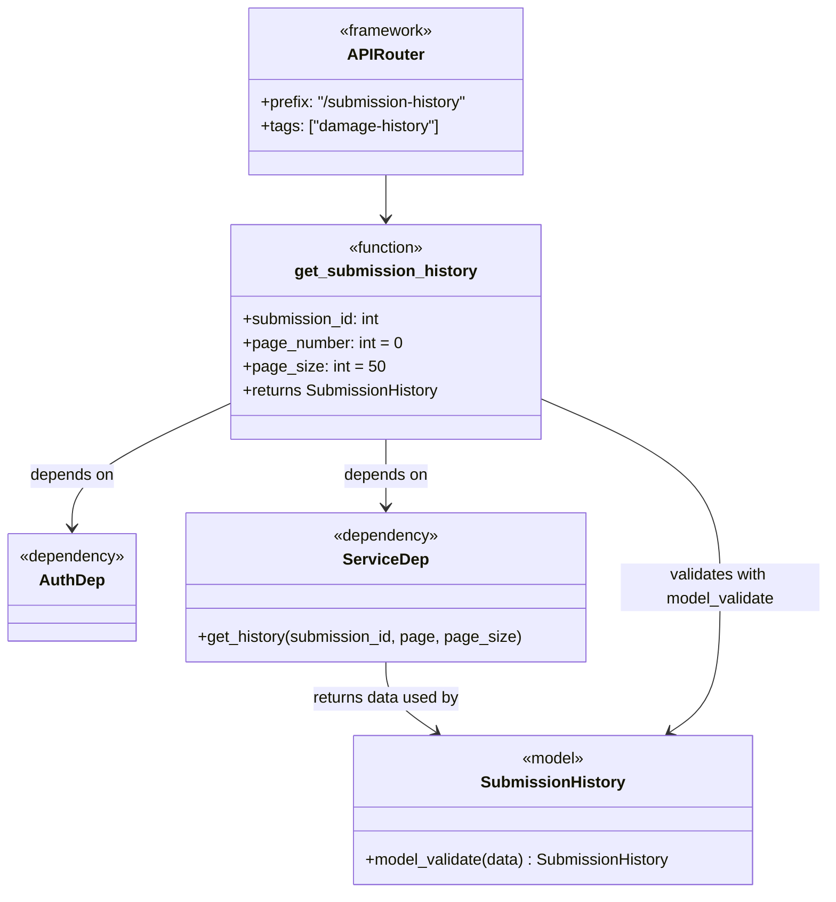

# Diagram: entity_core/entity_service/platform_applications/damage_submission_history_event/src/routers/submission_history.py


> Auto-generated by Obscura crawlers

## Diagram 1

```mermaid
flowchart LR
  Client -->|GET /submission-history/submissions/{submission_id}| Router[APIRouter<br/>prefix="/submission-history"]
  Router --> Handler[get_submission_history(submission_id, pageNumber, pageSize)]
  Handler --> AuthDep[AuthDep (injected)]
  Handler --> ServiceDep[ServiceDep (injected)]
  Handler -->|compute page = pageNumber + 1| PageCalc[Page Calculation]
  Handler -->|calls| GetHistory[service.get_history(submission_id, page, page_size)]
  GetHistory --> Result[result dict {"data": {"items": [...]}}]
  Result --> Transform[Normalize changedAt timestamps (Z -> +00:00)]
  Transform --> Validate[SubmissionHistory.model_validate(result)]
  Validate --> Response[200 SubmissionHistory]
  Response --> Client
```

> SVG rendering failed for this diagram.

## Diagram 2



> SVG rendering failed for this diagram.
