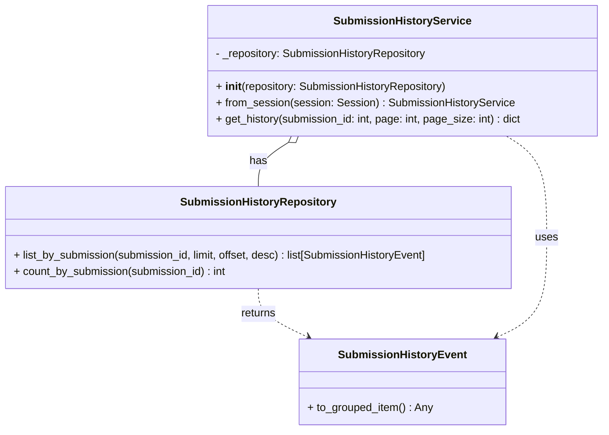

# Diagram: entity_core/entity_service/platform_applications/damage_submission_history_event/src/service/submission_history_service.py


> Auto-generated by Obscura crawlers

## Diagram 1



### SVG

<svg id="container" width="891.826171875" xmlns="http://www.w3.org/2000/svg" class="classDiagram" height="632" viewBox="0 0 891.826171875 632" role="graphics-document document" aria-roledescription="class"><style>#container{font-family:"trebuchet ms",verdana,arial,sans-serif;font-size:16px;fill:#333;}@keyframes edge-animation-frame{from{stroke-dashoffset:0;}}@keyframes dash{to{stroke-dashoffset:0;}}#container .edge-animation-slow{stroke-dasharray:9,5!important;stroke-dashoffset:900;animation:dash 50s linear infinite;stroke-linecap:round;}#container .edge-animation-fast{stroke-dasharray:9,5!important;stroke-dashoffset:900;animation:dash 20s linear infinite;stroke-linecap:round;}#container .error-icon{fill:#552222;}#container .error-text{fill:#552222;stroke:#552222;}#container .edge-thickness-normal{stroke-width:1px;}#container .edge-thickness-thick{stroke-width:3.5px;}#container .edge-pattern-solid{stroke-dasharray:0;}#container .edge-thickness-invisible{stroke-width:0;fill:none;}#container .edge-pattern-dashed{stroke-dasharray:3;}#container .edge-pattern-dotted{stroke-dasharray:2;}#container .marker{fill:#333333;stroke:#333333;}#container .marker.cross{stroke:#333333;}#container svg{font-family:"trebuchet ms",verdana,arial,sans-serif;font-size:16px;}#container p{margin:0;}#container g.classGroup text{fill:#9370DB;stroke:none;font-family:"trebuchet ms",verdana,arial,sans-serif;font-size:10px;}#container g.classGroup text .title{font-weight:bolder;}#container .nodeLabel,#container .edgeLabel{color:#131300;}#container .edgeLabel .label rect{fill:#ECECFF;}#container .label text{fill:#131300;}#container .labelBkg{background:#ECECFF;}#container .edgeLabel .label span{background:#ECECFF;}#container .classTitle{font-weight:bolder;}#container .node rect,#container .node circle,#container .node ellipse,#container .node polygon,#container .node path{fill:#ECECFF;stroke:#9370DB;stroke-width:1px;}#container .divider{stroke:#9370DB;stroke-width:1;}#container g.clickable{cursor:pointer;}#container g.classGroup rect{fill:#ECECFF;stroke:#9370DB;}#container g.classGroup line{stroke:#9370DB;stroke-width:1;}#container .classLabel .box{stroke:none;stroke-width:0;fill:#ECECFF;opacity:0.5;}#container .classLabel .label{fill:#9370DB;font-size:10px;}#container .relation{stroke:#333333;stroke-width:1;fill:none;}#container .dashed-line{stroke-dasharray:3;}#container .dotted-line{stroke-dasharray:1 2;}#container #compositionStart,#container .composition{fill:#333333!important;stroke:#333333!important;stroke-width:1;}#container #compositionEnd,#container .composition{fill:#333333!important;stroke:#333333!important;stroke-width:1;}#container #dependencyStart,#container .dependency{fill:#333333!important;stroke:#333333!important;stroke-width:1;}#container #dependencyStart,#container .dependency{fill:#333333!important;stroke:#333333!important;stroke-width:1;}#container #extensionStart,#container .extension{fill:transparent!important;stroke:#333333!important;stroke-width:1;}#container #extensionEnd,#container .extension{fill:transparent!important;stroke:#333333!important;stroke-width:1;}#container #aggregationStart,#container .aggregation{fill:transparent!important;stroke:#333333!important;stroke-width:1;}#container #aggregationEnd,#container .aggregation{fill:transparent!important;stroke:#333333!important;stroke-width:1;}#container #lollipopStart,#container .lollipop{fill:#ECECFF!important;stroke:#333333!important;stroke-width:1;}#container #lollipopEnd,#container .lollipop{fill:#ECECFF!important;stroke:#333333!important;stroke-width:1;}#container .edgeTerminals{font-size:11px;line-height:initial;}#container .classTitleText{text-anchor:middle;font-size:18px;fill:#333;}#container .label-icon{display:inline-block;height:1em;overflow:visible;vertical-align:-0.125em;}#container .node .label-icon path{fill:currentColor;stroke:revert;stroke-width:revert;}#container :root{--mermaid-font-family:"trebuchet ms",verdana,arial,sans-serif;}</style><g><defs><marker id="container_class-aggregationStart" class="marker aggregation class" refX="18" refY="7" markerWidth="190" markerHeight="240" orient="auto"><path d="M 18,7 L9,13 L1,7 L9,1 Z"></path></marker></defs><defs><marker id="container_class-aggregationEnd" class="marker aggregation class" refX="1" refY="7" markerWidth="20" markerHeight="28" orient="auto"><path d="M 18,7 L9,13 L1,7 L9,1 Z"></path></marker></defs><defs><marker id="container_class-extensionStart" class="marker extension class" refX="18" refY="7" markerWidth="190" markerHeight="240" orient="auto"><path d="M 1,7 L18,13 V 1 Z"></path></marker></defs><defs><marker id="container_class-extensionEnd" class="marker extension class" refX="1" refY="7" markerWidth="20" markerHeight="28" orient="auto"><path d="M 1,1 V 13 L18,7 Z"></path></marker></defs><defs><marker id="container_class-compositionStart" class="marker composition class" refX="18" refY="7" markerWidth="190" markerHeight="240" orient="auto"><path d="M 18,7 L9,13 L1,7 L9,1 Z"></path></marker></defs><defs><marker id="container_class-compositionEnd" class="marker composition class" refX="1" refY="7" markerWidth="20" markerHeight="28" orient="auto"><path d="M 18,7 L9,13 L1,7 L9,1 Z"></path></marker></defs><defs><marker id="container_class-dependencyStart" class="marker dependency class" refX="6" refY="7" markerWidth="190" markerHeight="240" orient="auto"><path d="M 5,7 L9,13 L1,7 L9,1 Z"></path></marker></defs><defs><marker id="container_class-dependencyEnd" class="marker dependency class" refX="13" refY="7" markerWidth="20" markerHeight="28" orient="auto"><path d="M 18,7 L9,13 L14,7 L9,1 Z"></path></marker></defs><defs><marker id="container_class-lollipopStart" class="marker lollipop class" refX="13" refY="7" markerWidth="190" markerHeight="240" orient="auto"><circle stroke="black" fill="transparent" cx="7" cy="7" r="6"></circle></marker></defs><defs><marker id="container_class-lollipopEnd" class="marker lollipop class" refX="1" refY="7" markerWidth="190" markerHeight="240" orient="auto"><circle stroke="black" fill="transparent" cx="7" cy="7" r="6"></circle></marker></defs><g class="root"><g class="clusters"></g><g class="edgePaths"><path d="M428.804,209.114L421.335,213.761C413.865,218.409,398.927,227.705,391.458,238.519C383.988,249.333,383.988,261.667,383.988,267.833L383.988,274" id="id_SubmissionHistoryService_SubmissionHistoryRepository_1" class="edge-thickness-normal edge-pattern-solid relation" style=";;;" data-edge="true" data-et="edge" data-id="id_SubmissionHistoryService_SubmissionHistoryRepository_1" data-points="W3sieCI6NDQzLjQ0OTg1MDIxMTQ2NjEsInkiOjIwMH0seyJ4IjozODMuOTg4MjgxMjUsInkiOjIzN30seyJ4IjozODMuOTg4MjgxMjUsInkiOjI3NH1d" marker-start="url(#container_class-aggregationStart)"></path><path d="M383.988,424L383.988,430.167C383.988,436.333,383.988,448.667,396.263,460.576C408.538,472.486,433.088,483.972,445.363,489.714L457.638,495.457" id="id_SubmissionHistoryRepository_SubmissionHistoryEvent_2" class="edge-thickness-normal edge-pattern-dashed relation" style=";;;" data-edge="true" data-et="edge" data-id="id_SubmissionHistoryRepository_SubmissionHistoryEvent_2" data-points="W3sieCI6MzgzLjk4ODI4MTI1LCJ5Ijo0MjR9LHsieCI6MzgzLjk4ODI4MTI1LCJ5Ijo0NjF9LHsieCI6NDYzLjA3MjE2Nzk2ODc1LCJ5Ijo0OTh9XQ==" marker-end="url(#container_class-dependencyEnd)"></path><path d="M752.007,200L761.917,206.167C771.828,212.333,791.648,224.667,801.558,249.5C811.469,274.333,811.469,311.667,811.469,349C811.469,386.333,811.469,423.667,799.194,448.076C786.919,472.486,762.369,483.972,750.094,489.714L737.819,495.457" id="id_SubmissionHistoryService_SubmissionHistoryEvent_3" class="edge-thickness-normal edge-pattern-dashed relation" style=";;;" data-edge="true" data-et="edge" data-id="id_SubmissionHistoryService_SubmissionHistoryEvent_3" data-points="W3sieCI6NzUyLjAwNzE4MTAzODUzMzksInkiOjIwMH0seyJ4Ijo4MTEuNDY4NzUsInkiOjIzN30seyJ4Ijo4MTEuNDY4NzUsInkiOjM0OX0seyJ4Ijo4MTEuNDY4NzUsInkiOjQ2MX0seyJ4Ijo3MzIuMzg0ODYzMjgxMjUsInkiOjQ5OH1d" marker-end="url(#container_class-dependencyEnd)"></path></g><g class="edgeLabels"><g class="edgeLabel" transform="translate(383.98828125, 237)"><g class="label" data-id="id_SubmissionHistoryService_SubmissionHistoryRepository_1" transform="translate(-12.703125, -12)"><foreignObject width="25.40625" height="24"><div xmlns="http://www.w3.org/1999/xhtml" class="labelBkg" style="display: table-cell; white-space: nowrap; line-height: 1.5; max-width: 200px; text-align: center;"><span class="edgeLabel"><p>has</p></span></div></foreignObject></g></g><g class="edgeLabel" transform="translate(383.98828125, 461)"><g class="label" data-id="id_SubmissionHistoryRepository_SubmissionHistoryEvent_2" transform="translate(-26.265625, -12)"><foreignObject width="52.53125" height="24"><div xmlns="http://www.w3.org/1999/xhtml" class="labelBkg" style="display: table-cell; white-space: nowrap; line-height: 1.5; max-width: 200px; text-align: center;"><span class="edgeLabel"><p>returns</p></span></div></foreignObject></g></g><g class="edgeLabel" transform="translate(811.46875, 349)"><g class="label" data-id="id_SubmissionHistoryService_SubmissionHistoryEvent_3" transform="translate(-16.4921875, -12)"><foreignObject width="32.984375" height="24"><div xmlns="http://www.w3.org/1999/xhtml" class="labelBkg" style="display: table-cell; white-space: nowrap; line-height: 1.5; max-width: 200px; text-align: center;"><span class="edgeLabel"><p>uses</p></span></div></foreignObject></g></g></g><g class="nodes"><g class="node default" id="classId-SubmissionHistoryService-0" transform="translate(597.728515625, 104)"><g class="basic label-container"><path d="M-286.09765625 -96 L286.09765625 -96 L286.09765625 96 L-286.09765625 96" stroke="none" stroke-width="0" fill="#ECECFF" style=""></path><path d="M-286.09765625 -96 C-67.01213268484801 -96, 152.07339088030398 -96, 286.09765625 -96 M-286.09765625 -96 C-145.5987852948069 -96, -5.099914339613804 -96, 286.09765625 -96 M286.09765625 -96 C286.09765625 -29.24619000783474, 286.09765625 37.50761998433052, 286.09765625 96 M286.09765625 -96 C286.09765625 -31.649053304934768, 286.09765625 32.701893390130465, 286.09765625 96 M286.09765625 96 C148.87494234533816 96, 11.65222844067631 96, -286.09765625 96 M286.09765625 96 C92.24591912257947 96, -101.60581800484107 96, -286.09765625 96 M-286.09765625 96 C-286.09765625 39.98692376700802, -286.09765625 -16.026152465983955, -286.09765625 -96 M-286.09765625 96 C-286.09765625 40.112247378714244, -286.09765625 -15.775505242571512, -286.09765625 -96" stroke="#9370DB" stroke-width="1.3" fill="none" stroke-dasharray="0 0" style=""></path></g><g class="annotation-group text" transform="translate(0, -72)"></g><g class="label-group text" transform="translate(-95.2265625, -72)"><g class="label" style="font-weight: bolder" transform="translate(0,-12)"><foreignObject width="190.453125" height="24"><div xmlns="http://www.w3.org/1999/xhtml" style="display: table-cell; white-space: nowrap; line-height: 1.5; max-width: 238px; text-align: center;"><span class="nodeLabel markdown-node-label" style=""><p>SubmissionHistoryService</p></span></div></foreignObject></g></g><g class="members-group text" transform="translate(-274.09765625, -24)"><g class="label" style="" transform="translate(0,-12)"><foreignObject width="314.828125" height="24"><div xmlns="http://www.w3.org/1999/xhtml" style="display: table-cell; white-space: nowrap; line-height: 1.5; max-width: 372px; text-align: center;"><span class="nodeLabel markdown-node-label" style=""><p>- _repository: SubmissionHistoryRepository</p></span></div></foreignObject></g></g><g class="methods-group text" transform="translate(-274.09765625, 24)"><g class="label" style="" transform="translate(0,-12)"><foreignObject width="342.859375" height="24"><div xmlns="http://www.w3.org/1999/xhtml" style="display: table-cell; white-space: nowrap; line-height: 1.5; max-width: 433px; text-align: center;"><span class="nodeLabel markdown-node-label" style=""><p>+ <strong>init</strong>(repository: SubmissionHistoryRepository)</p></span></div></foreignObject></g><g class="label" style="" transform="translate(0,12)"><foreignObject width="436.921875" height="24"><div xmlns="http://www.w3.org/1999/xhtml" style="display: table-cell; white-space: nowrap; line-height: 1.5; max-width: 494px; text-align: center;"><span class="nodeLabel markdown-node-label" style=""><p>+ from_session(session: Session) : SubmissionHistoryService</p></span></div></foreignObject></g><g class="label" style="" transform="translate(0,36)"><foreignObject width="452.96875" height="24"><div xmlns="http://www.w3.org/1999/xhtml" style="display: table-cell; white-space: nowrap; line-height: 1.5; max-width: 511px; text-align: center;"><span class="nodeLabel markdown-node-label" style=""><p>+ get_history(submission_id: int, page: int, page_size: int) : dict</p></span></div></foreignObject></g></g><g class="divider" style=""><path d="M-286.09765625 -48 C-62.44933700014701 -48, 161.19898224970598 -48, 286.09765625 -48 M-286.09765625 -48 C-87.54446099182928 -48, 111.00873426634143 -48, 286.09765625 -48" stroke="#9370DB" stroke-width="1.3" fill="none" stroke-dasharray="0 0" style=""></path></g><g class="divider" style=""><path d="M-286.09765625 0 C-136.4610581758846 0, 13.175539898230795 0, 286.09765625 0 M-286.09765625 0 C-101.63026219087322 0, 82.83713186825355 0, 286.09765625 0" stroke="#9370DB" stroke-width="1.3" fill="none" stroke-dasharray="0 0" style=""></path></g></g><g class="node default" id="classId-SubmissionHistoryRepository-1" transform="translate(383.98828125, 349)"><g class="basic label-container"><path d="M-375.98828125 -75 L375.98828125 -75 L375.98828125 75 L-375.98828125 75" stroke="none" stroke-width="0" fill="#ECECFF" style=""></path><path d="M-375.98828125 -75 C-112.26916969128229 -75, 151.44994186743543 -75, 375.98828125 -75 M-375.98828125 -75 C-131.8762541765917 -75, 112.23577289681663 -75, 375.98828125 -75 M375.98828125 -75 C375.98828125 -37.25015445653006, 375.98828125 0.4996910869398761, 375.98828125 75 M375.98828125 -75 C375.98828125 -31.34754604214784, 375.98828125 12.30490791570432, 375.98828125 75 M375.98828125 75 C206.1715546497454 75, 36.35482804949078 75, -375.98828125 75 M375.98828125 75 C184.04059009717307 75, -7.907101055653868 75, -375.98828125 75 M-375.98828125 75 C-375.98828125 42.14284700911526, -375.98828125 9.285694018230515, -375.98828125 -75 M-375.98828125 75 C-375.98828125 30.028494520321054, -375.98828125 -14.943010959357892, -375.98828125 -75" stroke="#9370DB" stroke-width="1.3" fill="none" stroke-dasharray="0 0" style=""></path></g><g class="annotation-group text" transform="translate(0, -51)"></g><g class="label-group text" transform="translate(-108.3515625, -51)"><g class="label" style="font-weight: bolder" transform="translate(0,-12)"><foreignObject width="216.703125" height="24"><div xmlns="http://www.w3.org/1999/xhtml" style="display: table-cell; white-space: nowrap; line-height: 1.5; max-width: 264px; text-align: center;"><span class="nodeLabel markdown-node-label" style=""><p>SubmissionHistoryRepository</p></span></div></foreignObject></g></g><g class="members-group text" transform="translate(-363.98828125, -3)"></g><g class="methods-group text" transform="translate(-363.98828125, 27)"><g class="label" style="" transform="translate(0,-12)"><foreignObject width="619.625" height="24"><div xmlns="http://www.w3.org/1999/xhtml" style="display: table-cell; white-space: nowrap; line-height: 1.5; max-width: 677px; text-align: center;"><span class="nodeLabel markdown-node-label" style=""><p>+ list_by_submission(submission_id, limit, offset, desc) : list[SubmissionHistoryEvent]</p></span></div></foreignObject></g><g class="label" style="" transform="translate(0,12)"><foreignObject width="316.640625" height="24"><div xmlns="http://www.w3.org/1999/xhtml" style="display: table-cell; white-space: nowrap; line-height: 1.5; max-width: 374px; text-align: center;"><span class="nodeLabel markdown-node-label" style=""><p>+ count_by_submission(submission_id) : int</p></span></div></foreignObject></g></g><g class="divider" style=""><path d="M-375.98828125 -27 C-180.2103412017971 -27, 15.567598846405815 -27, 375.98828125 -27 M-375.98828125 -27 C-99.47234122673427 -27, 177.04359879653146 -27, 375.98828125 -27" stroke="#9370DB" stroke-width="1.3" fill="none" stroke-dasharray="0 0" style=""></path></g><g class="divider" style=""><path d="M-375.98828125 -3 C-170.34685072625027 -3, 35.294579797499466 -3, 375.98828125 -3 M-375.98828125 -3 C-151.39525235208393 -3, 73.19777654583214 -3, 375.98828125 -3" stroke="#9370DB" stroke-width="1.3" fill="none" stroke-dasharray="0 0" style=""></path></g></g><g class="node default" id="classId-SubmissionHistoryEvent-2" transform="translate(597.728515625, 561)"><g class="basic label-container"><path d="M-149.15234375 -63 L149.15234375 -63 L149.15234375 63 L-149.15234375 63" stroke="none" stroke-width="0" fill="#ECECFF" style=""></path><path d="M-149.15234375 -63 C-60.27947891825977 -63, 28.59338591348046 -63, 149.15234375 -63 M-149.15234375 -63 C-55.11875315414585 -63, 38.9148374417083 -63, 149.15234375 -63 M149.15234375 -63 C149.15234375 -32.59306055038425, 149.15234375 -2.18612110076851, 149.15234375 63 M149.15234375 -63 C149.15234375 -13.80783694532849, 149.15234375 35.38432610934302, 149.15234375 63 M149.15234375 63 C30.525577715275162 63, -88.10118831944968 63, -149.15234375 63 M149.15234375 63 C33.58610646620993 63, -81.98013081758015 63, -149.15234375 63 M-149.15234375 63 C-149.15234375 16.35533046457676, -149.15234375 -30.28933907084648, -149.15234375 -63 M-149.15234375 63 C-149.15234375 18.846174403207556, -149.15234375 -25.30765119358489, -149.15234375 -63" stroke="#9370DB" stroke-width="1.3" fill="none" stroke-dasharray="0 0" style=""></path></g><g class="annotation-group text" transform="translate(0, -39)"></g><g class="label-group text" transform="translate(-88.7890625, -39)"><g class="label" style="font-weight: bolder" transform="translate(0,-12)"><foreignObject width="177.578125" height="24"><div xmlns="http://www.w3.org/1999/xhtml" style="display: table-cell; white-space: nowrap; line-height: 1.5; max-width: 226px; text-align: center;"><span class="nodeLabel markdown-node-label" style=""><p>SubmissionHistoryEvent</p></span></div></foreignObject></g></g><g class="members-group text" transform="translate(-137.15234375, 9)"></g><g class="methods-group text" transform="translate(-137.15234375, 39)"><g class="label" style="" transform="translate(0,-12)"><foreignObject width="185.515625" height="24"><div xmlns="http://www.w3.org/1999/xhtml" style="display: table-cell; white-space: nowrap; line-height: 1.5; max-width: 243px; text-align: center;"><span class="nodeLabel markdown-node-label" style=""><p>+ to_grouped_item() : Any</p></span></div></foreignObject></g></g><g class="divider" style=""><path d="M-149.15234375 -15 C-76.8420505140224 -15, -4.531757278044807 -15, 149.15234375 -15 M-149.15234375 -15 C-75.76741657487607 -15, -2.3824893997521315 -15, 149.15234375 -15" stroke="#9370DB" stroke-width="1.3" fill="none" stroke-dasharray="0 0" style=""></path></g><g class="divider" style=""><path d="M-149.15234375 9 C-32.93518241488454 9, 83.28197892023093 9, 149.15234375 9 M-149.15234375 9 C-74.45800381405934 9, 0.23633612188132247 9, 149.15234375 9" stroke="#9370DB" stroke-width="1.3" fill="none" stroke-dasharray="0 0" style=""></path></g></g></g></g></g></svg>

## Diagram 2

```mermaid
flowchart TD
    A[Call get_history(submission_id, page, page_size)] --> B[Normalize page -> page_number\nNormalize page_size -> per_page]
    B --> C[Calculate offset = (page_number - 1) * per_page]
    C --> D[Call repository.list_by_submission(submission_id, limit=per_page, offset=offset, desc=True)]
    D --> E[events returned]
    E --> F[items = [event.to_grouped_item() for event in events]]
    F --> G[Call repository.count_by_submission(submission_id) -> total_events]
    G --> H[total_pages = max(1, ceil(total_events / per_page))]
    H --> I[Build response payload with data:{submissionId, items} and meta:{totalPages, totalCount, currentPage, pageSize}]
    I --> J[Return payload]
```

> SVG rendering failed for this diagram.
