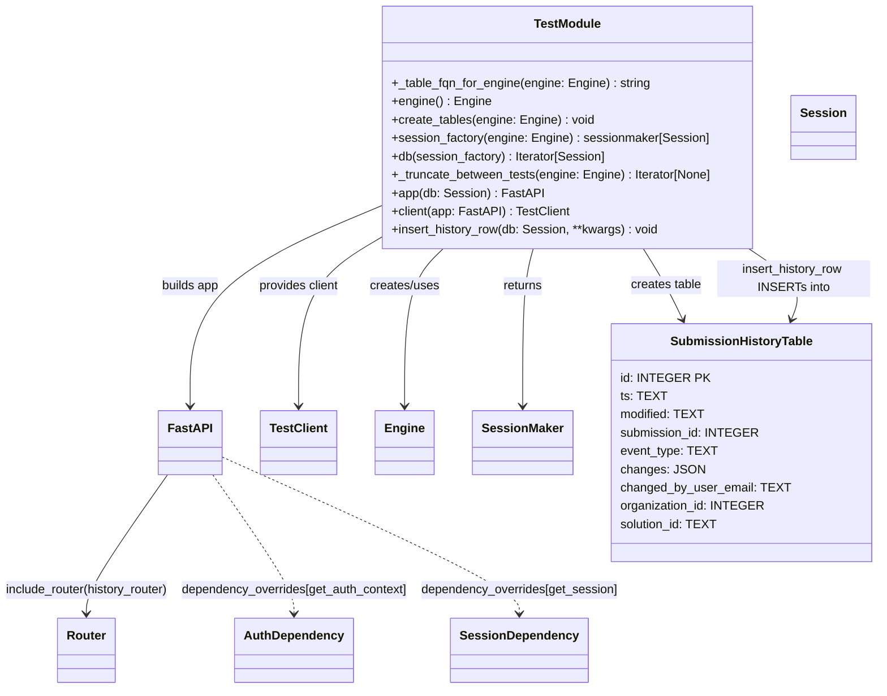

# Diagram: entity_core/entity_service/platform_applications/damage_submission_history_event/src/tests/conftest.py


> Auto-generated by Obscura crawlers

## Diagram 1



### SVG

<svg id="container" width="1133.50048828125" xmlns="http://www.w3.org/2000/svg" class="classDiagram" height="902" viewBox="0 0 1133.50048828125 902" role="graphics-document document" aria-roledescription="class"><style>#container{font-family:"trebuchet ms",verdana,arial,sans-serif;font-size:16px;fill:#333;}@keyframes edge-animation-frame{from{stroke-dashoffset:0;}}@keyframes dash{to{stroke-dashoffset:0;}}#container .edge-animation-slow{stroke-dasharray:9,5!important;stroke-dashoffset:900;animation:dash 50s linear infinite;stroke-linecap:round;}#container .edge-animation-fast{stroke-dasharray:9,5!important;stroke-dashoffset:900;animation:dash 20s linear infinite;stroke-linecap:round;}#container .error-icon{fill:#552222;}#container .error-text{fill:#552222;stroke:#552222;}#container .edge-thickness-normal{stroke-width:1px;}#container .edge-thickness-thick{stroke-width:3.5px;}#container .edge-pattern-solid{stroke-dasharray:0;}#container .edge-thickness-invisible{stroke-width:0;fill:none;}#container .edge-pattern-dashed{stroke-dasharray:3;}#container .edge-pattern-dotted{stroke-dasharray:2;}#container .marker{fill:#333333;stroke:#333333;}#container .marker.cross{stroke:#333333;}#container svg{font-family:"trebuchet ms",verdana,arial,sans-serif;font-size:16px;}#container p{margin:0;}#container g.classGroup text{fill:#9370DB;stroke:none;font-family:"trebuchet ms",verdana,arial,sans-serif;font-size:10px;}#container g.classGroup text .title{font-weight:bolder;}#container .nodeLabel,#container .edgeLabel{color:#131300;}#container .edgeLabel .label rect{fill:#ECECFF;}#container .label text{fill:#131300;}#container .labelBkg{background:#ECECFF;}#container .edgeLabel .label span{background:#ECECFF;}#container .classTitle{font-weight:bolder;}#container .node rect,#container .node circle,#container .node ellipse,#container .node polygon,#container .node path{fill:#ECECFF;stroke:#9370DB;stroke-width:1px;}#container .divider{stroke:#9370DB;stroke-width:1;}#container g.clickable{cursor:pointer;}#container g.classGroup rect{fill:#ECECFF;stroke:#9370DB;}#container g.classGroup line{stroke:#9370DB;stroke-width:1;}#container .classLabel .box{stroke:none;stroke-width:0;fill:#ECECFF;opacity:0.5;}#container .classLabel .label{fill:#9370DB;font-size:10px;}#container .relation{stroke:#333333;stroke-width:1;fill:none;}#container .dashed-line{stroke-dasharray:3;}#container .dotted-line{stroke-dasharray:1 2;}#container #compositionStart,#container .composition{fill:#333333!important;stroke:#333333!important;stroke-width:1;}#container #compositionEnd,#container .composition{fill:#333333!important;stroke:#333333!important;stroke-width:1;}#container #dependencyStart,#container .dependency{fill:#333333!important;stroke:#333333!important;stroke-width:1;}#container #dependencyStart,#container .dependency{fill:#333333!important;stroke:#333333!important;stroke-width:1;}#container #extensionStart,#container .extension{fill:transparent!important;stroke:#333333!important;stroke-width:1;}#container #extensionEnd,#container .extension{fill:transparent!important;stroke:#333333!important;stroke-width:1;}#container #aggregationStart,#container .aggregation{fill:transparent!important;stroke:#333333!important;stroke-width:1;}#container #aggregationEnd,#container .aggregation{fill:transparent!important;stroke:#333333!important;stroke-width:1;}#container #lollipopStart,#container .lollipop{fill:#ECECFF!important;stroke:#333333!important;stroke-width:1;}#container #lollipopEnd,#container .lollipop{fill:#ECECFF!important;stroke:#333333!important;stroke-width:1;}#container .edgeTerminals{font-size:11px;line-height:initial;}#container .classTitleText{text-anchor:middle;font-size:18px;fill:#333;}#container .label-icon{display:inline-block;height:1em;overflow:visible;vertical-align:-0.125em;}#container .node .label-icon path{fill:currentColor;stroke:revert;stroke-width:revert;}#container :root{--mermaid-font-family:"trebuchet ms",verdana,arial,sans-serif;}</style><g><defs><marker id="container_class-aggregationStart" class="marker aggregation class" refX="18" refY="7" markerWidth="190" markerHeight="240" orient="auto"><path d="M 18,7 L9,13 L1,7 L9,1 Z"></path></marker></defs><defs><marker id="container_class-aggregationEnd" class="marker aggregation class" refX="1" refY="7" markerWidth="20" markerHeight="28" orient="auto"><path d="M 18,7 L9,13 L1,7 L9,1 Z"></path></marker></defs><defs><marker id="container_class-extensionStart" class="marker extension class" refX="18" refY="7" markerWidth="190" markerHeight="240" orient="auto"><path d="M 1,7 L18,13 V 1 Z"></path></marker></defs><defs><marker id="container_class-extensionEnd" class="marker extension class" refX="1" refY="7" markerWidth="20" markerHeight="28" orient="auto"><path d="M 1,1 V 13 L18,7 Z"></path></marker></defs><defs><marker id="container_class-compositionStart" class="marker composition class" refX="18" refY="7" markerWidth="190" markerHeight="240" orient="auto"><path d="M 18,7 L9,13 L1,7 L9,1 Z"></path></marker></defs><defs><marker id="container_class-compositionEnd" class="marker composition class" refX="1" refY="7" markerWidth="20" markerHeight="28" orient="auto"><path d="M 18,7 L9,13 L1,7 L9,1 Z"></path></marker></defs><defs><marker id="container_class-dependencyStart" class="marker dependency class" refX="6" refY="7" markerWidth="190" markerHeight="240" orient="auto"><path d="M 5,7 L9,13 L1,7 L9,1 Z"></path></marker></defs><defs><marker id="container_class-dependencyEnd" class="marker dependency class" refX="13" refY="7" markerWidth="20" markerHeight="28" orient="auto"><path d="M 18,7 L9,13 L14,7 L9,1 Z"></path></marker></defs><defs><marker id="container_class-lollipopStart" class="marker lollipop class" refX="13" refY="7" markerWidth="190" markerHeight="240" orient="auto"><circle stroke="black" fill="transparent" cx="7" cy="7" r="6"></circle></marker></defs><defs><marker id="container_class-lollipopEnd" class="marker lollipop class" refX="1" refY="7" markerWidth="190" markerHeight="240" orient="auto"><circle stroke="black" fill="transparent" cx="7" cy="7" r="6"></circle></marker></defs><g class="root"><g class="clusters"></g><g class="edgePaths"><path d="M578.29,326L570.272,334.167C562.253,342.333,546.217,358.667,538.198,393C530.18,427.333,530.18,479.667,530.18,505.833L530.18,532" id="id_TestModule_Engine_1" class="edge-thickness-normal edge-pattern-solid relation" style=";;;" data-edge="true" data-et="edge" data-id="id_TestModule_Engine_1" data-points="W3sieCI6NTc4LjI5MDI5MjU5MzE0OSwieSI6MzI2fSx7IngiOjUzMC4xNzk2ODc1LCJ5IjozNzV9LHsieCI6NTMwLjE3OTY4NzUsInkiOjUzOH1d" marker-end="url(#container_class-dependencyEnd)"></path><path d="M692.392,326L690.235,334.167C688.077,342.333,683.761,358.667,681.603,393C679.445,427.333,679.445,479.667,679.445,505.833L679.445,532" id="id_TestModule_SessionMaker_2" class="edge-thickness-normal edge-pattern-solid relation" style=";;;" data-edge="true" data-et="edge" data-id="id_TestModule_SessionMaker_2" data-points="W3sieCI6NjkyLjM5MjM4MDkzNDQ5NTIsInkiOjMyNn0seyJ4Ijo2NzkuNDQ1MzEyNSwieSI6Mzc1fSx7IngiOjY3OS40NDUzMTI1LCJ5Ijo1Mzh9XQ==" marker-end="url(#container_class-dependencyEnd)"></path><path d="M490.943,273.329L452.144,290.274C413.345,307.219,335.747,341.11,296.948,384.222C258.148,427.333,258.148,479.667,258.148,505.833L258.148,532" id="id_TestModule_FastAPI_3" class="edge-thickness-normal edge-pattern-solid relation" style=";;;" data-edge="true" data-et="edge" data-id="id_TestModule_FastAPI_3" data-points="W3sieCI6NDkwLjk0MzM1OTM3NSwieSI6MjczLjMyOTEzODAxMDkzMzI2fSx7IngiOjI1OC4xNDg0Mzc1LCJ5IjozNzV9LHsieCI6MjU4LjE0ODQzNzUsInkiOjUzOH1d" marker-end="url(#container_class-dependencyEnd)"></path><path d="M227.638,622L209.356,647.167C191.074,672.333,154.51,722.667,136.227,753C117.945,783.333,117.945,793.667,117.945,798.833L117.945,804" id="id_FastAPI_Router_4" class="edge-thickness-normal edge-pattern-solid relation" style=";;;" data-edge="true" data-et="edge" data-id="id_FastAPI_Router_4" data-points="W3sieCI6MjI3LjYzNzkxMjg4ODYwMTAyLCJ5Ijo2MjJ9LHsieCI6MTE3Ljk0NTMxMjUsInkiOjc3M30seyJ4IjoxMTcuOTQ1MzEyNSwieSI6ODEwfV0=" marker-end="url(#container_class-dependencyEnd)"></path><path d="M288.659,622L306.941,647.167C325.223,672.333,361.787,722.667,380.069,753C398.352,783.333,398.352,793.667,398.352,798.833L398.352,804" id="id_FastAPI_AuthDependency_5" class="edge-thickness-normal edge-pattern-dashed relation" style=";;;" data-edge="true" data-et="edge" data-id="id_FastAPI_AuthDependency_5" data-points="W3sieCI6Mjg4LjY1ODk2MjExMTM5OSwieSI6NjIyfSx7IngiOjM5OC4zNTE1NjI1LCJ5Ijo3NzN9LHsieCI6Mzk4LjM1MTU2MjUsInkiOjgxMH1d" marker-end="url(#container_class-dependencyEnd)"></path><path d="M296.688,596.871L363.743,626.226C430.799,655.581,564.911,714.29,631.967,748.812C699.023,783.333,699.023,793.667,699.023,798.833L699.023,804" id="id_FastAPI_SessionDependency_6" class="edge-thickness-normal edge-pattern-dashed relation" style=";;;" data-edge="true" data-et="edge" data-id="id_FastAPI_SessionDependency_6" data-points="W3sieCI6Mjk2LjY4NzUsInkiOjU5Ni44NzEwODM3ODIyNTEyfSx7IngiOjY5OS4wMjM0Mzc1LCJ5Ijo3NzN9LHsieCI6Njk5LjAyMzQzNzUsInkiOjgxMH1d" marker-end="url(#container_class-dependencyEnd)"></path><path d="M833.755,326L838.858,334.167C843.961,342.333,854.167,358.667,862.517,374.087C870.868,389.508,877.362,404.016,880.61,411.27L883.857,418.524" id="id_TestModule_SubmissionHistoryTable_7" class="edge-thickness-normal edge-pattern-solid relation" style=";;;" data-edge="true" data-et="edge" data-id="id_TestModule_SubmissionHistoryTable_7" data-points="W3sieCI6ODMzLjc1NTQwODY1Mzg0NjIsInkiOjMyNn0seyJ4Ijo4NjQuMzczMDQ2ODc1LCJ5IjozNzV9LHsieCI6ODg2LjMwODY2OTk2OTUxMjIsInkiOjQyNH1d" marker-end="url(#container_class-dependencyEnd)"></path><path d="M490.943,316.295L474.988,326.079C459.033,335.863,427.122,355.432,411.166,391.383C395.211,427.333,395.211,479.667,395.211,505.833L395.211,532" id="id_TestModule_TestClient_8" class="edge-thickness-normal edge-pattern-solid relation" style=";;;" data-edge="true" data-et="edge" data-id="id_TestModule_TestClient_8" data-points="W3sieCI6NDkwLjk0MzM1OTM3NSwieSI6MzE2LjI5NTAwNzExMTMxMDd9LHsieCI6Mzk1LjIxMDkzNzUsInkiOjM3NX0seyJ4IjozOTUuMjEwOTM3NSwieSI6NTM4fV0=" marker-end="url(#container_class-dependencyEnd)"></path><path d="M967.695,326L979.678,334.167C991.66,342.333,1015.625,358.667,1024.66,374.074C1033.695,389.481,1027.801,403.962,1024.854,411.202L1021.906,418.443" id="id_TestModule_SubmissionHistoryTable_9" class="edge-thickness-normal edge-pattern-solid relation" style=";;;" data-edge="true" data-et="edge" data-id="id_TestModule_SubmissionHistoryTable_9" data-points="W3sieCI6OTY3LjY5NTE3MTY0OTYzOTQsInkiOjMyNn0seyJ4IjoxMDM5LjU4OTg0Mzc1LCJ5IjozNzV9LHsieCI6MTAxOS42NDQzNzg4MTA5NzU2LCJ5Ijo0MjR9XQ==" marker-end="url(#container_class-dependencyEnd)"></path></g><g class="edgeLabels"><g class="edgeLabel" transform="translate(530.1796875, 375)"><g class="label" data-id="id_TestModule_Engine_1" transform="translate(-46.578125, -12)"><foreignObject width="93.15625" height="24"><div xmlns="http://www.w3.org/1999/xhtml" class="labelBkg" style="display: table-cell; white-space: nowrap; line-height: 1.5; max-width: 200px; text-align: center;"><span class="edgeLabel"><p>creates/uses</p></span></div></foreignObject></g></g><g class="edgeLabel" transform="translate(679.4453125, 375)"><g class="label" data-id="id_TestModule_SessionMaker_2" transform="translate(-26.265625, -12)"><foreignObject width="52.53125" height="24"><div xmlns="http://www.w3.org/1999/xhtml" class="labelBkg" style="display: table-cell; white-space: nowrap; line-height: 1.5; max-width: 200px; text-align: center;"><span class="edgeLabel"><p>returns</p></span></div></foreignObject></g></g><g class="edgeLabel" transform="translate(258.1484375, 375)"><g class="label" data-id="id_TestModule_FastAPI_3" transform="translate(-38.46875, -12)"><foreignObject width="76.9375" height="24"><div xmlns="http://www.w3.org/1999/xhtml" class="labelBkg" style="display: table-cell; white-space: nowrap; line-height: 1.5; max-width: 200px; text-align: center;"><span class="edgeLabel"><p>builds app</p></span></div></foreignObject></g></g><g class="edgeLabel" transform="translate(117.9453125, 773)"><g class="label" data-id="id_FastAPI_Router_4" transform="translate(-109.9453125, -12)"><foreignObject width="219.890625" height="24"><div xmlns="http://www.w3.org/1999/xhtml" class="labelBkg" style="display: table; white-space: break-spaces; line-height: 1.5; max-width: 200px; text-align: center; width: 200px;"><span class="edgeLabel"><p>include_router(history_router)</p></span></div></foreignObject></g></g><g class="edgeLabel" transform="translate(398.3515625, 773)"><g class="label" data-id="id_FastAPI_AuthDependency_5" transform="translate(-150.4609375, -12)"><foreignObject width="300.921875" height="24"><div xmlns="http://www.w3.org/1999/xhtml" class="labelBkg" style="display: table; white-space: break-spaces; line-height: 1.5; max-width: 200px; text-align: center; width: 200px;"><span class="edgeLabel"><p>dependency_overrides[get_auth_context]</p></span></div></foreignObject></g></g><g class="edgeLabel" transform="translate(699.0234375, 773)"><g class="label" data-id="id_FastAPI_SessionDependency_6" transform="translate(-130.2109375, -12)"><foreignObject width="260.421875" height="24"><div xmlns="http://www.w3.org/1999/xhtml" class="labelBkg" style="display: table; white-space: break-spaces; line-height: 1.5; max-width: 200px; text-align: center; width: 200px;"><span class="edgeLabel"><p>dependency_overrides[get_session]</p></span></div></foreignObject></g></g><g class="edgeLabel" transform="translate(863.28849, 373.2643)"><g class="label" data-id="id_TestModule_SubmissionHistoryTable_7" transform="translate(-46.890625, -12)"><foreignObject width="93.78125" height="24"><div xmlns="http://www.w3.org/1999/xhtml" class="labelBkg" style="display: table-cell; white-space: nowrap; line-height: 1.5; max-width: 200px; text-align: center;"><span class="edgeLabel"><p>creates table</p></span></div></foreignObject></g></g><g class="edgeLabel" transform="translate(395.2109375, 375)"><g class="label" data-id="id_TestModule_TestClient_8" transform="translate(-53.796875, -12)"><foreignObject width="107.59375" height="24"><div xmlns="http://www.w3.org/1999/xhtml" class="labelBkg" style="display: table-cell; white-space: nowrap; line-height: 1.5; max-width: 200px; text-align: center;"><span class="edgeLabel"><p>provides client</p></span></div></foreignObject></g></g><g class="edgeLabel" transform="translate(1025.50053, 365.39739)"><g class="label" data-id="id_TestModule_SubmissionHistoryTable_9" transform="translate(-100, -24)"><foreignObject width="200" height="48"><div xmlns="http://www.w3.org/1999/xhtml" class="labelBkg" style="display: table; white-space: break-spaces; line-height: 1.5; max-width: 200px; text-align: center; width: 200px;"><span class="edgeLabel"><p>insert_history_row INSERTs into</p></span></div></foreignObject></g></g></g><g class="nodes"><g class="node default" id="classId-TestModule-0" transform="translate(734.404296875, 167)"><g class="basic label-container"><path d="M-243.4609375 -159 L243.4609375 -159 L243.4609375 159 L-243.4609375 159" stroke="none" stroke-width="0" fill="#ECECFF" style=""></path><path d="M-243.4609375 -159 C-99.82029282430756 -159, 43.820351851384885 -159, 243.4609375 -159 M-243.4609375 -159 C-82.7825725766867 -159, 77.89579234662659 -159, 243.4609375 -159 M243.4609375 -159 C243.4609375 -83.8489738971421, 243.4609375 -8.697947794284204, 243.4609375 159 M243.4609375 -159 C243.4609375 -33.10375855611623, 243.4609375 92.79248288776753, 243.4609375 159 M243.4609375 159 C116.87937642282749 159, -9.702184654345018 159, -243.4609375 159 M243.4609375 159 C87.47776554061576 159, -68.50540641876847 159, -243.4609375 159 M-243.4609375 159 C-243.4609375 80.97287950781852, -243.4609375 2.9457590156370372, -243.4609375 -159 M-243.4609375 159 C-243.4609375 44.6128562154024, -243.4609375 -69.7742875691952, -243.4609375 -159" stroke="#9370DB" stroke-width="1.3" fill="none" stroke-dasharray="0 0" style=""></path></g><g class="annotation-group text" transform="translate(0, -135)"></g><g class="label-group text" transform="translate(-42.34375, -135)"><g class="label" style="font-weight: bolder" transform="translate(0,-12)"><foreignObject width="84.6875" height="24"><div xmlns="http://www.w3.org/1999/xhtml" style="display: table-cell; white-space: nowrap; line-height: 1.5; max-width: 133px; text-align: center;"><span class="nodeLabel markdown-node-label" style=""><p>TestModule</p></span></div></foreignObject></g></g><g class="members-group text" transform="translate(-231.4609375, -87)"></g><g class="methods-group text" transform="translate(-231.4609375, -57)"><g class="label" style="" transform="translate(0,-12)"><foreignObject width="338.328125" height="24"><div xmlns="http://www.w3.org/1999/xhtml" style="display: table-cell; white-space: nowrap; line-height: 1.5; max-width: 396px; text-align: center;"><span class="nodeLabel markdown-node-label" style=""><p>+_table_fqn_for_engine(engine: Engine) : string</p></span></div></foreignObject></g><g class="label" style="" transform="translate(0,12)"><foreignObject width="128.40625" height="24"><div xmlns="http://www.w3.org/1999/xhtml" style="display: table-cell; white-space: nowrap; line-height: 1.5; max-width: 186px; text-align: center;"><span class="nodeLabel markdown-node-label" style=""><p>+engine() : Engine</p></span></div></foreignObject></g><g class="label" style="" transform="translate(0,36)"><foreignObject width="264.9375" height="24"><div xmlns="http://www.w3.org/1999/xhtml" style="display: table-cell; white-space: nowrap; line-height: 1.5; max-width: 322px; text-align: center;"><span class="nodeLabel markdown-node-label" style=""><p>+create_tables(engine: Engine) : void</p></span></div></foreignObject></g><g class="label" style="" transform="translate(0,60)"><foreignObject width="414.3125" height="24"><div xmlns="http://www.w3.org/1999/xhtml" style="display: table-cell; white-space: nowrap; line-height: 1.5; max-width: 472px; text-align: center;"><span class="nodeLabel markdown-node-label" style=""><p>+session_factory(engine: Engine) : sessionmaker[Session]</p></span></div></foreignObject></g><g class="label" style="" transform="translate(0,84)"><foreignObject width="282.359375" height="24"><div xmlns="http://www.w3.org/1999/xhtml" style="display: table-cell; white-space: nowrap; line-height: 1.5; max-width: 340px; text-align: center;"><span class="nodeLabel markdown-node-label" style=""><p>+db(session_factory) : Iterator[Session]</p></span></div></foreignObject></g><g class="label" style="" transform="translate(0,108)"><foreignObject width="420.578125" height="24"><div xmlns="http://www.w3.org/1999/xhtml" style="display: table-cell; white-space: nowrap; line-height: 1.5; max-width: 478px; text-align: center;"><span class="nodeLabel markdown-node-label" style=""><p>+_truncate_between_tests(engine: Engine) : Iterator[None]</p></span></div></foreignObject></g><g class="label" style="" transform="translate(0,132)"><foreignObject width="192.625" height="24"><div xmlns="http://www.w3.org/1999/xhtml" style="display: table-cell; white-space: nowrap; line-height: 1.5; max-width: 250px; text-align: center;"><span class="nodeLabel markdown-node-label" style=""><p>+app(db: Session) : FastAPI</p></span></div></foreignObject></g><g class="label" style="" transform="translate(0,156)"><foreignObject width="230.296875" height="24"><div xmlns="http://www.w3.org/1999/xhtml" style="display: table-cell; white-space: nowrap; line-height: 1.5; max-width: 288px; text-align: center;"><span class="nodeLabel markdown-node-label" style=""><p>+client(app: FastAPI) : TestClient</p></span></div></foreignObject></g><g class="label" style="" transform="translate(0,180)"><foreignObject width="351.5" height="24"><div xmlns="http://www.w3.org/1999/xhtml" style="display: table-cell; white-space: nowrap; line-height: 1.5; max-width: 409px; text-align: center;"><span class="nodeLabel markdown-node-label" style=""><p>+insert_history_row(db: Session, **kwargs) : void</p></span></div></foreignObject></g></g><g class="divider" style=""><path d="M-243.4609375 -111 C-113.32626130685219 -111, 16.808414886295623 -111, 243.4609375 -111 M-243.4609375 -111 C-48.72391481317197 -111, 146.01310787365605 -111, 243.4609375 -111" stroke="#9370DB" stroke-width="1.3" fill="none" stroke-dasharray="0 0" style=""></path></g><g class="divider" style=""><path d="M-243.4609375 -87 C-62.03504777452625 -87, 119.3908419509475 -87, 243.4609375 -87 M-243.4609375 -87 C-75.09851549096669 -87, 93.26390651806662 -87, 243.4609375 -87" stroke="#9370DB" stroke-width="1.3" fill="none" stroke-dasharray="0 0" style=""></path></g></g><g class="node default" id="classId-FastAPI-1" transform="translate(258.1484375, 580)"><g class="basic label-container"><path d="M-38.5390625 -42 L38.5390625 -42 L38.5390625 42 L-38.5390625 42" stroke="none" stroke-width="0" fill="#ECECFF" style=""></path><path d="M-38.5390625 -42 C-9.639256840660437 -42, 19.260548818679126 -42, 38.5390625 -42 M-38.5390625 -42 C-10.92773228453169 -42, 16.68359793093662 -42, 38.5390625 -42 M38.5390625 -42 C38.5390625 -17.50213531362337, 38.5390625 6.99572937275326, 38.5390625 42 M38.5390625 -42 C38.5390625 -16.63292708255993, 38.5390625 8.734145834880138, 38.5390625 42 M38.5390625 42 C17.930276710735665 42, -2.67850907852867 42, -38.5390625 42 M38.5390625 42 C15.800201621927243 42, -6.938659256145513 42, -38.5390625 42 M-38.5390625 42 C-38.5390625 9.471127945242188, -38.5390625 -23.057744109515625, -38.5390625 -42 M-38.5390625 42 C-38.5390625 10.955782201838161, -38.5390625 -20.088435596323677, -38.5390625 -42" stroke="#9370DB" stroke-width="1.3" fill="none" stroke-dasharray="0 0" style=""></path></g><g class="annotation-group text" transform="translate(0, -18)"></g><g class="label-group text" transform="translate(-26.5390625, -18)"><g class="label" style="font-weight: bolder" transform="translate(0,-12)"><foreignObject width="53.078125" height="24"><div xmlns="http://www.w3.org/1999/xhtml" style="display: table-cell; white-space: nowrap; line-height: 1.5; max-width: 102px; text-align: center;"><span class="nodeLabel markdown-node-label" style=""><p>FastAPI</p></span></div></foreignObject></g></g><g class="members-group text" transform="translate(-26.5390625, 30)"></g><g class="methods-group text" transform="translate(-26.5390625, 60)"></g><g class="divider" style=""><path d="M-38.5390625 6 C-7.833843281444771 6, 22.871375937110457 6, 38.5390625 6 M-38.5390625 6 C-19.71670384614852 6, -0.8943451922970382 6, 38.5390625 6" stroke="#9370DB" stroke-width="1.3" fill="none" stroke-dasharray="0 0" style=""></path></g><g class="divider" style=""><path d="M-38.5390625 24 C-14.816918090118659 24, 8.905226319762683 24, 38.5390625 24 M-38.5390625 24 C-18.880162316276945 24, 0.778737867446111 24, 38.5390625 24" stroke="#9370DB" stroke-width="1.3" fill="none" stroke-dasharray="0 0" style=""></path></g></g><g class="node default" id="classId-TestClient-2" transform="translate(395.2109375, 580)"><g class="basic label-container"><path d="M-48.5234375 -42 L48.5234375 -42 L48.5234375 42 L-48.5234375 42" stroke="none" stroke-width="0" fill="#ECECFF" style=""></path><path d="M-48.5234375 -42 C-24.455222350409063 -42, -0.38700720081812534 -42, 48.5234375 -42 M-48.5234375 -42 C-20.099717578407258 -42, 8.324002343185484 -42, 48.5234375 -42 M48.5234375 -42 C48.5234375 -8.570383768331226, 48.5234375 24.85923246333755, 48.5234375 42 M48.5234375 -42 C48.5234375 -15.720909505694458, 48.5234375 10.558180988611085, 48.5234375 42 M48.5234375 42 C26.18270604725091 42, 3.8419745945018207 42, -48.5234375 42 M48.5234375 42 C20.64418384304379 42, -7.235069813912418 42, -48.5234375 42 M-48.5234375 42 C-48.5234375 15.070240654675164, -48.5234375 -11.859518690649672, -48.5234375 -42 M-48.5234375 42 C-48.5234375 10.282740301815902, -48.5234375 -21.434519396368195, -48.5234375 -42" stroke="#9370DB" stroke-width="1.3" fill="none" stroke-dasharray="0 0" style=""></path></g><g class="annotation-group text" transform="translate(0, -18)"></g><g class="label-group text" transform="translate(-36.5234375, -18)"><g class="label" style="font-weight: bolder" transform="translate(0,-12)"><foreignObject width="73.046875" height="24"><div xmlns="http://www.w3.org/1999/xhtml" style="display: table-cell; white-space: nowrap; line-height: 1.5; max-width: 121px; text-align: center;"><span class="nodeLabel markdown-node-label" style=""><p>TestClient</p></span></div></foreignObject></g></g><g class="members-group text" transform="translate(-36.5234375, 30)"></g><g class="methods-group text" transform="translate(-36.5234375, 60)"></g><g class="divider" style=""><path d="M-48.5234375 6 C-14.897029778789324 6, 18.72937794242135 6, 48.5234375 6 M-48.5234375 6 C-17.05936867320706 6, 14.404700153585878 6, 48.5234375 6" stroke="#9370DB" stroke-width="1.3" fill="none" stroke-dasharray="0 0" style=""></path></g><g class="divider" style=""><path d="M-48.5234375 24 C-15.463420681772718 24, 17.596596136454565 24, 48.5234375 24 M-48.5234375 24 C-13.343267538269238 24, 21.836902423461524 24, 48.5234375 24" stroke="#9370DB" stroke-width="1.3" fill="none" stroke-dasharray="0 0" style=""></path></g></g><g class="node default" id="classId-Engine-3" transform="translate(530.1796875, 580)"><g class="basic label-container"><path d="M-36.4453125 -42 L36.4453125 -42 L36.4453125 42 L-36.4453125 42" stroke="none" stroke-width="0" fill="#ECECFF" style=""></path><path d="M-36.4453125 -42 C-19.18428214412115 -42, -1.9232517882422968 -42, 36.4453125 -42 M-36.4453125 -42 C-20.93533900512108 -42, -5.425365510242155 -42, 36.4453125 -42 M36.4453125 -42 C36.4453125 -13.08478707493708, 36.4453125 15.830425850125842, 36.4453125 42 M36.4453125 -42 C36.4453125 -9.720244173254109, 36.4453125 22.559511653491782, 36.4453125 42 M36.4453125 42 C8.298596225456485 42, -19.84812004908703 42, -36.4453125 42 M36.4453125 42 C19.755180061928975 42, 3.06504762385795 42, -36.4453125 42 M-36.4453125 42 C-36.4453125 13.534910379454423, -36.4453125 -14.930179241091153, -36.4453125 -42 M-36.4453125 42 C-36.4453125 22.156308319845607, -36.4453125 2.312616639691214, -36.4453125 -42" stroke="#9370DB" stroke-width="1.3" fill="none" stroke-dasharray="0 0" style=""></path></g><g class="annotation-group text" transform="translate(0, -18)"></g><g class="label-group text" transform="translate(-24.4453125, -18)"><g class="label" style="font-weight: bolder" transform="translate(0,-12)"><foreignObject width="48.890625" height="24"><div xmlns="http://www.w3.org/1999/xhtml" style="display: table-cell; white-space: nowrap; line-height: 1.5; max-width: 99px; text-align: center;"><span class="nodeLabel markdown-node-label" style=""><p>Engine</p></span></div></foreignObject></g></g><g class="members-group text" transform="translate(-24.4453125, 30)"></g><g class="methods-group text" transform="translate(-24.4453125, 60)"></g><g class="divider" style=""><path d="M-36.4453125 6 C-9.618554829180134 6, 17.208202841639732 6, 36.4453125 6 M-36.4453125 6 C-15.996208801007679 6, 4.452894897984642 6, 36.4453125 6" stroke="#9370DB" stroke-width="1.3" fill="none" stroke-dasharray="0 0" style=""></path></g><g class="divider" style=""><path d="M-36.4453125 24 C-12.544291558354978 24, 11.356729383290045 24, 36.4453125 24 M-36.4453125 24 C-10.56621887184825 24, 15.3128747563035 24, 36.4453125 24" stroke="#9370DB" stroke-width="1.3" fill="none" stroke-dasharray="0 0" style=""></path></g></g><g class="node default" id="classId-Session-4" transform="translate(1068.076171875, 167)"><g class="basic label-container"><path d="M-40.2109375 -42 L40.2109375 -42 L40.2109375 42 L-40.2109375 42" stroke="none" stroke-width="0" fill="#ECECFF" style=""></path><path d="M-40.2109375 -42 C-23.985472205305776 -42, -7.760006910611551 -42, 40.2109375 -42 M-40.2109375 -42 C-9.674529308210989 -42, 20.861878883578022 -42, 40.2109375 -42 M40.2109375 -42 C40.2109375 -20.752029334375713, 40.2109375 0.49594133124857365, 40.2109375 42 M40.2109375 -42 C40.2109375 -10.429814046021566, 40.2109375 21.14037190795687, 40.2109375 42 M40.2109375 42 C10.665108766197104 42, -18.880719967605792 42, -40.2109375 42 M40.2109375 42 C19.85332359986857 42, -0.5042903002628591 42, -40.2109375 42 M-40.2109375 42 C-40.2109375 15.91526195986713, -40.2109375 -10.169476080265738, -40.2109375 -42 M-40.2109375 42 C-40.2109375 19.278354084646555, -40.2109375 -3.4432918307068903, -40.2109375 -42" stroke="#9370DB" stroke-width="1.3" fill="none" stroke-dasharray="0 0" style=""></path></g><g class="annotation-group text" transform="translate(0, -18)"></g><g class="label-group text" transform="translate(-28.2109375, -18)"><g class="label" style="font-weight: bolder" transform="translate(0,-12)"><foreignObject width="56.421875" height="24"><div xmlns="http://www.w3.org/1999/xhtml" style="display: table-cell; white-space: nowrap; line-height: 1.5; max-width: 105px; text-align: center;"><span class="nodeLabel markdown-node-label" style=""><p>Session</p></span></div></foreignObject></g></g><g class="members-group text" transform="translate(-28.2109375, 30)"></g><g class="methods-group text" transform="translate(-28.2109375, 60)"></g><g class="divider" style=""><path d="M-40.2109375 6 C-14.441895340314325 6, 11.32714681937135 6, 40.2109375 6 M-40.2109375 6 C-14.537618083496415 6, 11.13570133300717 6, 40.2109375 6" stroke="#9370DB" stroke-width="1.3" fill="none" stroke-dasharray="0 0" style=""></path></g><g class="divider" style=""><path d="M-40.2109375 24 C-22.31196760827831 24, -4.412997716556617 24, 40.2109375 24 M-40.2109375 24 C-12.110407224114915 24, 15.99012305177017 24, 40.2109375 24" stroke="#9370DB" stroke-width="1.3" fill="none" stroke-dasharray="0 0" style=""></path></g></g><g class="node default" id="classId-SessionMaker-5" transform="translate(679.4453125, 580)"><g class="basic label-container"><path d="M-62.8203125 -42 L62.8203125 -42 L62.8203125 42 L-62.8203125 42" stroke="none" stroke-width="0" fill="#ECECFF" style=""></path><path d="M-62.8203125 -42 C-34.41549146891131 -42, -6.010670437822618 -42, 62.8203125 -42 M-62.8203125 -42 C-27.488996381139287 -42, 7.842319737721425 -42, 62.8203125 -42 M62.8203125 -42 C62.8203125 -22.357210804072913, 62.8203125 -2.714421608145827, 62.8203125 42 M62.8203125 -42 C62.8203125 -15.002906613489863, 62.8203125 11.994186773020274, 62.8203125 42 M62.8203125 42 C24.21199649389002 42, -14.39631951221996 42, -62.8203125 42 M62.8203125 42 C22.926920528393985 42, -16.96647144321203 42, -62.8203125 42 M-62.8203125 42 C-62.8203125 20.732270571588682, -62.8203125 -0.5354588568226362, -62.8203125 -42 M-62.8203125 42 C-62.8203125 16.809094417297064, -62.8203125 -8.381811165405871, -62.8203125 -42" stroke="#9370DB" stroke-width="1.3" fill="none" stroke-dasharray="0 0" style=""></path></g><g class="annotation-group text" transform="translate(0, -18)"></g><g class="label-group text" transform="translate(-50.8203125, -18)"><g class="label" style="font-weight: bolder" transform="translate(0,-12)"><foreignObject width="101.640625" height="24"><div xmlns="http://www.w3.org/1999/xhtml" style="display: table-cell; white-space: nowrap; line-height: 1.5; max-width: 150px; text-align: center;"><span class="nodeLabel markdown-node-label" style=""><p>SessionMaker</p></span></div></foreignObject></g></g><g class="members-group text" transform="translate(-50.8203125, 30)"></g><g class="methods-group text" transform="translate(-50.8203125, 60)"></g><g class="divider" style=""><path d="M-62.8203125 6 C-35.917566476656475 6, -9.014820453312943 6, 62.8203125 6 M-62.8203125 6 C-23.37863287524113 6, 16.06304674951774 6, 62.8203125 6" stroke="#9370DB" stroke-width="1.3" fill="none" stroke-dasharray="0 0" style=""></path></g><g class="divider" style=""><path d="M-62.8203125 24 C-34.918441443756244 24, -7.016570387512488 24, 62.8203125 24 M-62.8203125 24 C-29.92979321274708 24, 2.9607260745058426 24, 62.8203125 24" stroke="#9370DB" stroke-width="1.3" fill="none" stroke-dasharray="0 0" style=""></path></g></g><g class="node default" id="classId-Router-6" transform="translate(117.9453125, 852)"><g class="basic label-container"><path d="M-36.6328125 -42 L36.6328125 -42 L36.6328125 42 L-36.6328125 42" stroke="none" stroke-width="0" fill="#ECECFF" style=""></path><path d="M-36.6328125 -42 C-9.332517749720076 -42, 17.96777700055985 -42, 36.6328125 -42 M-36.6328125 -42 C-21.92302541889265 -42, -7.213238337785295 -42, 36.6328125 -42 M36.6328125 -42 C36.6328125 -10.318556331160721, 36.6328125 21.362887337678558, 36.6328125 42 M36.6328125 -42 C36.6328125 -22.595210843872913, 36.6328125 -3.1904216877458254, 36.6328125 42 M36.6328125 42 C18.4688323656997 42, 0.3048522313994013 42, -36.6328125 42 M36.6328125 42 C10.97691885199503 42, -14.678974796009939 42, -36.6328125 42 M-36.6328125 42 C-36.6328125 24.262493312430664, -36.6328125 6.524986624861327, -36.6328125 -42 M-36.6328125 42 C-36.6328125 19.520054430807182, -36.6328125 -2.959891138385636, -36.6328125 -42" stroke="#9370DB" stroke-width="1.3" fill="none" stroke-dasharray="0 0" style=""></path></g><g class="annotation-group text" transform="translate(0, -18)"></g><g class="label-group text" transform="translate(-24.6328125, -18)"><g class="label" style="font-weight: bolder" transform="translate(0,-12)"><foreignObject width="49.265625" height="24"><div xmlns="http://www.w3.org/1999/xhtml" style="display: table-cell; white-space: nowrap; line-height: 1.5; max-width: 99px; text-align: center;"><span class="nodeLabel markdown-node-label" style=""><p>Router</p></span></div></foreignObject></g></g><g class="members-group text" transform="translate(-24.6328125, 30)"></g><g class="methods-group text" transform="translate(-24.6328125, 60)"></g><g class="divider" style=""><path d="M-36.6328125 6 C-15.587378217533082 6, 5.458056064933835 6, 36.6328125 6 M-36.6328125 6 C-14.702266679590295 6, 7.22827914081941 6, 36.6328125 6" stroke="#9370DB" stroke-width="1.3" fill="none" stroke-dasharray="0 0" style=""></path></g><g class="divider" style=""><path d="M-36.6328125 24 C-20.624915185624758 24, -4.617017871249516 24, 36.6328125 24 M-36.6328125 24 C-9.657383274320026 24, 17.31804595135995 24, 36.6328125 24" stroke="#9370DB" stroke-width="1.3" fill="none" stroke-dasharray="0 0" style=""></path></g></g><g class="node default" id="classId-AuthDependency-7" transform="translate(398.3515625, 852)"><g class="basic label-container"><path d="M-74.2421875 -42 L74.2421875 -42 L74.2421875 42 L-74.2421875 42" stroke="none" stroke-width="0" fill="#ECECFF" style=""></path><path d="M-74.2421875 -42 C-34.31190254099056 -42, 5.618382418018882 -42, 74.2421875 -42 M-74.2421875 -42 C-19.431329274688466 -42, 35.37952895062307 -42, 74.2421875 -42 M74.2421875 -42 C74.2421875 -11.278797796954798, 74.2421875 19.442404406090404, 74.2421875 42 M74.2421875 -42 C74.2421875 -11.387798649650058, 74.2421875 19.224402700699883, 74.2421875 42 M74.2421875 42 C33.27820083820248 42, -7.68578582359504 42, -74.2421875 42 M74.2421875 42 C17.19236499027516 42, -39.85745751944968 42, -74.2421875 42 M-74.2421875 42 C-74.2421875 24.16012167509574, -74.2421875 6.3202433501914825, -74.2421875 -42 M-74.2421875 42 C-74.2421875 9.953317843134727, -74.2421875 -22.093364313730547, -74.2421875 -42" stroke="#9370DB" stroke-width="1.3" fill="none" stroke-dasharray="0 0" style=""></path></g><g class="annotation-group text" transform="translate(0, -18)"></g><g class="label-group text" transform="translate(-62.2421875, -18)"><g class="label" style="font-weight: bolder" transform="translate(0,-12)"><foreignObject width="124.484375" height="24"><div xmlns="http://www.w3.org/1999/xhtml" style="display: table-cell; white-space: nowrap; line-height: 1.5; max-width: 174px; text-align: center;"><span class="nodeLabel markdown-node-label" style=""><p>AuthDependency</p></span></div></foreignObject></g></g><g class="members-group text" transform="translate(-62.2421875, 30)"></g><g class="methods-group text" transform="translate(-62.2421875, 60)"></g><g class="divider" style=""><path d="M-74.2421875 6 C-38.672097175442545 6, -3.1020068508850898 6, 74.2421875 6 M-74.2421875 6 C-33.082991152004375 6, 8.07620519599125 6, 74.2421875 6" stroke="#9370DB" stroke-width="1.3" fill="none" stroke-dasharray="0 0" style=""></path></g><g class="divider" style=""><path d="M-74.2421875 24 C-41.69086773634532 24, -9.139547972690636 24, 74.2421875 24 M-74.2421875 24 C-31.851186014110773 24, 10.539815471778454 24, 74.2421875 24" stroke="#9370DB" stroke-width="1.3" fill="none" stroke-dasharray="0 0" style=""></path></g></g><g class="node default" id="classId-SessionDependency-8" transform="translate(699.0234375, 852)"><g class="basic label-container"><path d="M-85.453125 -42 L85.453125 -42 L85.453125 42 L-85.453125 42" stroke="none" stroke-width="0" fill="#ECECFF" style=""></path><path d="M-85.453125 -42 C-40.42401391653353 -42, 4.605097166932936 -42, 85.453125 -42 M-85.453125 -42 C-42.24057086305841 -42, 0.9719832738831826 -42, 85.453125 -42 M85.453125 -42 C85.453125 -9.236677463595377, 85.453125 23.526645072809245, 85.453125 42 M85.453125 -42 C85.453125 -11.323474079119617, 85.453125 19.353051841760767, 85.453125 42 M85.453125 42 C45.36678749101027 42, 5.280449982020542 42, -85.453125 42 M85.453125 42 C45.30138481167308 42, 5.149644623346163 42, -85.453125 42 M-85.453125 42 C-85.453125 20.11117881822926, -85.453125 -1.7776423635414815, -85.453125 -42 M-85.453125 42 C-85.453125 15.93152899507584, -85.453125 -10.136942009848319, -85.453125 -42" stroke="#9370DB" stroke-width="1.3" fill="none" stroke-dasharray="0 0" style=""></path></g><g class="annotation-group text" transform="translate(0, -18)"></g><g class="label-group text" transform="translate(-73.453125, -18)"><g class="label" style="font-weight: bolder" transform="translate(0,-12)"><foreignObject width="146.90625" height="24"><div xmlns="http://www.w3.org/1999/xhtml" style="display: table-cell; white-space: nowrap; line-height: 1.5; max-width: 195px; text-align: center;"><span class="nodeLabel markdown-node-label" style=""><p>SessionDependency</p></span></div></foreignObject></g></g><g class="members-group text" transform="translate(-73.453125, 30)"></g><g class="methods-group text" transform="translate(-73.453125, 60)"></g><g class="divider" style=""><path d="M-85.453125 6 C-46.81345451217361 6, -8.173784024347214 6, 85.453125 6 M-85.453125 6 C-38.565482011477755 6, 8.32216097704449 6, 85.453125 6" stroke="#9370DB" stroke-width="1.3" fill="none" stroke-dasharray="0 0" style=""></path></g><g class="divider" style=""><path d="M-85.453125 24 C-26.60483850554394 24, 32.24344798891212 24, 85.453125 24 M-85.453125 24 C-39.74606182170503 24, 5.9610013565899465 24, 85.453125 24" stroke="#9370DB" stroke-width="1.3" fill="none" stroke-dasharray="0 0" style=""></path></g></g><g class="node default" id="classId-SubmissionHistoryTable-9" transform="translate(956.14453125, 580)"><g class="basic label-container"><path d="M-163.87890625 -156 L163.87890625 -156 L163.87890625 156 L-163.87890625 156" stroke="none" stroke-width="0" fill="#ECECFF" style=""></path><path d="M-163.87890625 -156 C-46.54955571042147 -156, 70.77979482915705 -156, 163.87890625 -156 M-163.87890625 -156 C-52.2457641423601 -156, 59.387377965279796 -156, 163.87890625 -156 M163.87890625 -156 C163.87890625 -70.99001651710314, 163.87890625 14.019966965793714, 163.87890625 156 M163.87890625 -156 C163.87890625 -42.881721129700836, 163.87890625 70.23655774059833, 163.87890625 156 M163.87890625 156 C64.2096148342273 156, -35.45967658154541 156, -163.87890625 156 M163.87890625 156 C89.81129362194967 156, 15.743680993899346 156, -163.87890625 156 M-163.87890625 156 C-163.87890625 55.633845931965055, -163.87890625 -44.73230813606989, -163.87890625 -156 M-163.87890625 156 C-163.87890625 79.59727525237838, -163.87890625 3.194550504756762, -163.87890625 -156" stroke="#9370DB" stroke-width="1.3" fill="none" stroke-dasharray="0 0" style=""></path></g><g class="annotation-group text" transform="translate(0, -132)"></g><g class="label-group text" transform="translate(-88.4140625, -132)"><g class="label" style="font-weight: bolder" transform="translate(0,-12)"><foreignObject width="176.828125" height="24"><div xmlns="http://www.w3.org/1999/xhtml" style="display: table-cell; white-space: nowrap; line-height: 1.5; max-width: 225px; text-align: center;"><span class="nodeLabel markdown-node-label" style=""><p>SubmissionHistoryTable</p></span></div></foreignObject></g></g><g class="members-group text" transform="translate(-151.87890625, -84)"><g class="label" style="" transform="translate(0,-12)"><foreignObject width="105.75" height="24"><div xmlns="http://www.w3.org/1999/xhtml" style="display: table-cell; white-space: nowrap; line-height: 1.5; max-width: 156px; text-align: center;"><span class="nodeLabel markdown-node-label" style=""><p>id: INTEGER PK</p></span></div></foreignObject></g><g class="label" style="" transform="translate(0,12)"><foreignObject width="55.078125" height="24"><div xmlns="http://www.w3.org/1999/xhtml" style="display: table-cell; white-space: nowrap; line-height: 1.5; max-width: 106px; text-align: center;"><span class="nodeLabel markdown-node-label" style=""><p>ts: TEXT</p></span></div></foreignObject></g><g class="label" style="" transform="translate(0,36)"><foreignObject width="106.453125" height="24"><div xmlns="http://www.w3.org/1999/xhtml" style="display: table-cell; white-space: nowrap; line-height: 1.5; max-width: 157px; text-align: center;"><span class="nodeLabel markdown-node-label" style=""><p>modified: TEXT</p></span></div></foreignObject></g><g class="label" style="" transform="translate(0,60)"><foreignObject width="173.640625" height="24"><div xmlns="http://www.w3.org/1999/xhtml" style="display: table-cell; white-space: nowrap; line-height: 1.5; max-width: 224px; text-align: center;"><span class="nodeLabel markdown-node-label" style=""><p>submission_id: INTEGER</p></span></div></foreignObject></g><g class="label" style="" transform="translate(0,84)"><foreignObject width="121.953125" height="24"><div xmlns="http://www.w3.org/1999/xhtml" style="display: table-cell; white-space: nowrap; line-height: 1.5; max-width: 173px; text-align: center;"><span class="nodeLabel markdown-node-label" style=""><p>event_type: TEXT</p></span></div></foreignObject></g><g class="label" style="" transform="translate(0,108)"><foreignObject width="103.046875" height="24"><div xmlns="http://www.w3.org/1999/xhtml" style="display: table-cell; white-space: nowrap; line-height: 1.5; max-width: 153px; text-align: center;"><span class="nodeLabel markdown-node-label" style=""><p>changes: JSON</p></span></div></foreignObject></g><g class="label" style="" transform="translate(0,132)"><foreignObject width="215.34375" height="24"><div xmlns="http://www.w3.org/1999/xhtml" style="display: table-cell; white-space: nowrap; line-height: 1.5; max-width: 266px; text-align: center;"><span class="nodeLabel markdown-node-label" style=""><p>changed_by_user_email: TEXT</p></span></div></foreignObject></g><g class="label" style="" transform="translate(0,156)"><foreignObject width="181.46875" height="24"><div xmlns="http://www.w3.org/1999/xhtml" style="display: table-cell; white-space: nowrap; line-height: 1.5; max-width: 232px; text-align: center;"><span class="nodeLabel markdown-node-label" style=""><p>organization_id: INTEGER</p></span></div></foreignObject></g><g class="label" style="" transform="translate(0,180)"><foreignObject width="124.0625" height="24"><div xmlns="http://www.w3.org/1999/xhtml" style="display: table-cell; white-space: nowrap; line-height: 1.5; max-width: 175px; text-align: center;"><span class="nodeLabel markdown-node-label" style=""><p>solution_id: TEXT</p></span></div></foreignObject></g></g><g class="methods-group text" transform="translate(-151.87890625, 156)"></g><g class="divider" style=""><path d="M-163.87890625 -108 C-96.39136331734545 -108, -28.903820384690903 -108, 163.87890625 -108 M-163.87890625 -108 C-97.56742265034848 -108, -31.255939050696952 -108, 163.87890625 -108" stroke="#9370DB" stroke-width="1.3" fill="none" stroke-dasharray="0 0" style=""></path></g><g class="divider" style=""><path d="M-163.87890625 132 C-95.79644691301739 132, -27.713987576034782 132, 163.87890625 132 M-163.87890625 132 C-53.06348216821554 132, 57.75194191356891 132, 163.87890625 132" stroke="#9370DB" stroke-width="1.3" fill="none" stroke-dasharray="0 0" style=""></path></g></g></g></g></g></svg>

## Diagram 2

```mermaid
flowchart TD
engine[create_engine (engine fixture)] --> create_tables[create_tables fixture: CREATE TABLE]
create_tables --> session_factory[session_factory fixture (sessionmaker)]
session_factory --> db_fixture[db fixture -> Session instance]
db_fixture --> truncate[_truncate_between_tests fixture: DELETE FROM table]
truncate --> app_fixture[app fixture (FastAPI) with dependency_overrides]
app_fixture --> client_fixture[client fixture (TestClient)]
client_fixture --> tests[pytest tests]
subgraph InsertFlow
  insert_fn[insert_history_row(db, **kwargs)]
  insert_fn -->|exec SQL INSERT| db_fixture
  insert_fn -->|db.commit()| db_fixture
end
```

> SVG rendering failed for this diagram.
