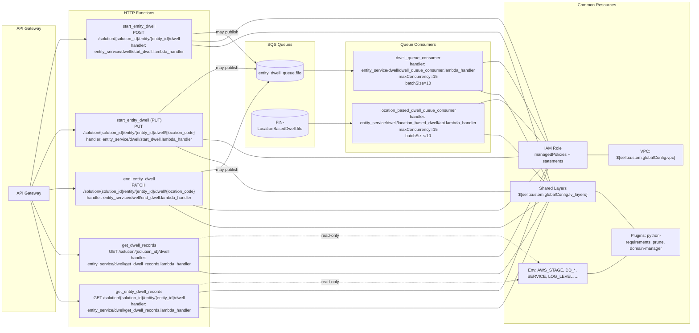
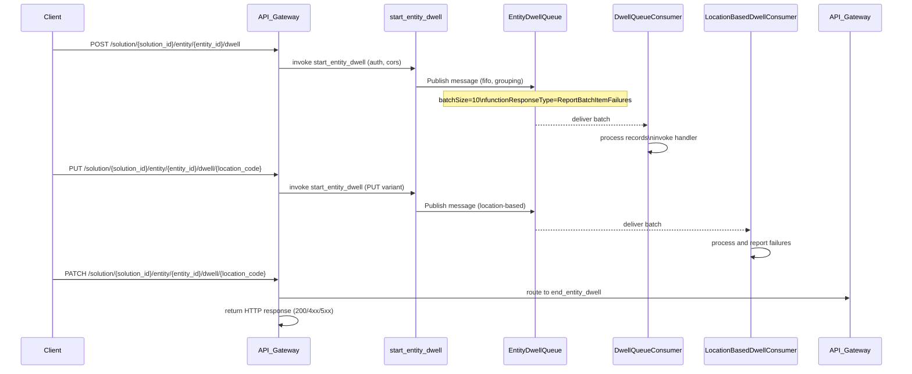

# Diagram: entity_core/entity_service/serverless.dwell.yml

> Auto-generated by Obscura crawlers

## Diagram 1

### SVG

<svg id="container" width="3114.828125" xmlns="http://www.w3.org/2000/svg" class="flowchart" height="1088.27880859375" viewBox="0 0 3114.828125 1088.27880859375" role="graphics-document document" aria-roledescription="flowchart-v2"><g><marker id="container_flowchart-v2-pointEnd" class="marker flowchart-v2" viewBox="0 0 10 10" refX="5" refY="5" markerUnits="userSpaceOnUse" markerWidth="8" markerHeight="8" orient="auto"><path d="M 0 0 L 10 5 L 0 10 z" class="arrowMarkerPath" style="stroke-width: 1; stroke-dasharray: 1, 0;"></path></marker><marker id="container_flowchart-v2-pointStart" class="marker flowchart-v2" viewBox="0 0 10 10" refX="4.5" refY="5" markerUnits="userSpaceOnUse" markerWidth="8" markerHeight="8" orient="auto"><path d="M 0 5 L 10 10 L 10 0 z" class="arrowMarkerPath" style="stroke-width: 1; stroke-dasharray: 1, 0;"></path></marker><marker id="container_flowchart-v2-circleEnd" class="marker flowchart-v2" viewBox="0 0 10 10" refX="11" refY="5" markerUnits="userSpaceOnUse" markerWidth="11" markerHeight="11" orient="auto"><circle cx="5" cy="5" r="5" class="arrowMarkerPath" style="stroke-width: 1; stroke-dasharray: 1, 0;"></circle></marker><marker id="container_flowchart-v2-circleStart" class="marker flowchart-v2" viewBox="0 0 10 10" refX="-1" refY="5" markerUnits="userSpaceOnUse" markerWidth="11" markerHeight="11" orient="auto"><circle cx="5" cy="5" r="5" class="arrowMarkerPath" style="stroke-width: 1; stroke-dasharray: 1, 0;"></circle></marker><marker id="container_flowchart-v2-crossEnd" class="marker cross flowchart-v2" viewBox="0 0 11 11" refX="12" refY="5.2" markerUnits="userSpaceOnUse" markerWidth="11" markerHeight="11" orient="auto"><path d="M 1,1 l 9,9 M 10,1 l -9,9" class="arrowMarkerPath" style="stroke-width: 2; stroke-dasharray: 1, 0;"></path></marker><marker id="container_flowchart-v2-crossStart" class="marker cross flowchart-v2" viewBox="0 0 11 11" refX="-1" refY="5.2" markerUnits="userSpaceOnUse" markerWidth="11" markerHeight="11" orient="auto"><path d="M 1,1 l 9,9 M 10,1 l -9,9" class="arrowMarkerPath" style="stroke-width: 2; stroke-dasharray: 1, 0;"></path></marker><g class="root"><g class="clusters"><g class="cluster" id="subGraph4" data-look="classic"><rect style="" x="2337.296875" y="8" width="769.53125" height="1065.2787818908691"></rect><g class="cluster-label" transform="translate(2651.125, 8)"><foreignObject width="141.875" height="24">

Common Resources

</foreignObject></g></g><g class="cluster" id="subGraph3" data-look="classic"><rect style="" x="1440.21875" y="155" width="847.078125" height="295.06554412841797"></rect><g class="cluster-label" transform="translate(1798.078125, 155)"><foreignObject width="131.359375" height="24">

Queue Consumers

</foreignObject></g></g><g class="cluster" id="subGraph2" data-look="classic"><rect style="" x="1055.109375" y="128.5738468170166" width="265" height="337.70493507385254"></rect><g class="cluster-label" transform="translate(1143.9375, 128.5738468170166)"><foreignObject width="87.34375" height="24">

SQS Queues

</foreignObject></g></g><g class="cluster" id="subGraph1" data-look="classic"><rect style="" x="256.109375" y="48" width="660.34375" height="1032.2787818908691"></rect><g class="cluster-label" transform="translate(530.7578125, 48)"><foreignObject width="111.046875" height="24">

HTTP Functions

</foreignObject></g></g><g class="cluster" id="subGraph0" data-look="classic"><rect style="" x="8" y="86" width="198.109375" height="949.2787818908691"></rect><g class="cluster-label" transform="translate(63, 86)"><foreignObject width="88.109375" height="24">

API Gateway

</foreignObject></g></g></g><g class="edgePaths"><path d="M112.63,589.705L128.21,514.254C143.79,438.803,174.95,287.902,194.696,212.451C214.443,137,222.776,137,231.109,137C239.443,137,247.776,137,265.531,137C283.286,137,310.464,137,324.052,137L337.641,137" id="L_APIGW_start_post_0" class="edge-thickness-normal edge-pattern-solid edge-thickness-normal edge-pattern-solid flowchart-link" style=";" data-edge="true" data-et="edge" data-id="L_APIGW_start_post_0" data-points="W3sieCI6MTEyLjYyOTk0MDg4MzgwODIyLCJ5Ijo1ODkuNzA0OTM1MDczODUyNX0seyJ4IjoyMDYuMTA5Mzc1LCJ5IjoxMzd9LHsieCI6MjMxLjEwOTM3NSwieSI6MTM3fSx7IngiOjI1Ni4xMDkzNzUsInkiOjEzN30seyJ4IjozNDEuNjQwNjI1LCJ5IjoxMzd9XQ==" marker-end="url(#container_flowchart-v2-pointEnd)"></path><path d="M121.2,589.705L135.352,562.694C149.503,535.683,177.806,481.661,196.125,454.65C214.443,427.639,222.776,427.639,231.109,427.639C239.443,427.639,247.776,427.639,255.443,427.639C263.109,427.639,270.109,427.639,273.609,427.639L277.109,427.639" id="L_APIGW_start_put_0" class="edge-thickness-normal edge-pattern-solid edge-thickness-normal edge-pattern-solid flowchart-link" style=";" data-edge="true" data-et="edge" data-id="L_APIGW_start_put_0" data-points="W3sieCI6MTIxLjIwMDQ1MTQ3MjExNDUxLCJ5Ijo1ODkuNzA0OTM1MDczODUyNX0seyJ4IjoyMDYuMTA5Mzc1LCJ5Ijo0MjcuNjM5MzkwOTQ1NDM0NTd9LHsieCI6MjMxLjEwOTM3NSwieSI6NDI3LjYzOTM5MDk0NTQzNDU3fSx7IngiOjI1Ni4xMDkzNzUsInkiOjQyNy42MzkzOTA5NDU0MzQ1N30seyJ4IjoyODEuMTA5Mzc1LCJ5Ijo0MjcuNjM5MzkwOTQ1NDM0NTd9XQ==" marker-end="url(#container_flowchart-v2-pointEnd)"></path><path d="M181.109,613.396L185.276,613.21C189.443,613.024,197.776,612.651,206.109,612.465C214.443,612.279,222.776,612.279,231.109,612.279C239.443,612.279,247.776,612.279,255.444,612.279C263.112,612.279,270.115,612.279,273.616,612.279L277.117,612.279" id="L_APIGW_end_patch_0" class="edge-thickness-normal edge-pattern-solid edge-thickness-normal edge-pattern-solid flowchart-link" style=";" data-edge="true" data-et="edge" data-id="L_APIGW_end_patch_0" data-points="W3sieCI6MTgxLjEwOTM3NSwieSI6NjEzLjM5NTg4MDI1NzEwODR9LHsieCI6MjA2LjEwOTM3NSwieSI6NjEyLjI3ODc4MTg5MDg2OTF9LHsieCI6MjMxLjEwOTM3NSwieSI6NjEyLjI3ODc4MTg5MDg2OTF9LHsieCI6MjU2LjEwOTM3NSwieSI6NjEyLjI3ODc4MTg5MDg2OTF9LHsieCI6MjgxLjExNzE4NzUsInkiOjYxMi4yNzg3ODE4OTA4NjkxfV0=" marker-end="url(#container_flowchart-v2-pointEnd)"></path><path d="M118.911,643.705L133.444,676.801C147.977,709.896,177.043,776.087,195.743,809.183C214.443,842.279,222.776,842.279,231.109,842.279C239.443,842.279,247.776,842.279,267.104,842.279C286.432,842.279,316.755,842.279,331.917,842.279L347.078,842.279" id="L_APIGW_get_all_0" class="edge-thickness-normal edge-pattern-solid edge-thickness-normal edge-pattern-solid flowchart-link" style=";" data-edge="true" data-et="edge" data-id="L_APIGW_get_all_0" data-points="W3sieCI6MTE4LjkxMTAxMTI3MjYyOTE1LCJ5Ijo2NDMuNzA0OTM1MDczODUyNX0seyJ4IjoyMDYuMTA5Mzc1LCJ5Ijo4NDIuMjc4NzgxODkwODY5MX0seyJ4IjoyMzEuMTA5Mzc1LCJ5Ijo4NDIuMjc4NzgxODkwODY5MX0seyJ4IjoyNTYuMTA5Mzc1LCJ5Ijo4NDIuMjc4NzgxODkwODY5MX0seyJ4IjozNTEuMDc4MTI1LCJ5Ijo4NDIuMjc4NzgxODkwODY5MX1d" marker-end="url(#container_flowchart-v2-pointEnd)"></path><path d="M114.138,643.705L129.467,702.134C144.795,760.563,175.452,877.421,194.947,935.85C214.443,994.279,222.776,994.279,231.109,994.279C239.443,994.279,247.776,994.279,265.531,994.279C283.286,994.279,310.464,994.279,324.052,994.279L337.641,994.279" id="L_APIGW_get_entity_0" class="edge-thickness-normal edge-pattern-solid edge-thickness-normal edge-pattern-solid flowchart-link" style=";" data-edge="true" data-et="edge" data-id="L_APIGW_get_entity_0" data-points="W3sieCI6MTE0LjEzODAwNzk4MTY2NDk2LCJ5Ijo2NDMuNzA0OTM1MDczODUyNX0seyJ4IjoyMDYuMTA5Mzc1LCJ5Ijo5OTQuMjc4NzgxODkwODY5MX0seyJ4IjoyMzEuMTA5Mzc1LCJ5Ijo5OTQuMjc4NzgxODkwODY5MX0seyJ4IjoyNTYuMTA5Mzc1LCJ5Ijo5OTQuMjc4NzgxODkwODY5MX0seyJ4IjozNDEuNjQwNjI1LCJ5Ijo5OTQuMjc4NzgxODkwODY5MX1d" marker-end="url(#container_flowchart-v2-pointEnd)"></path><path d="M830.922,117.735L845.177,116.613C859.432,115.49,887.943,113.245,913.753,112.123C939.563,111,962.672,111,985.781,122C1008.891,133,1032,155,1049.737,170.714C1067.474,186.427,1079.838,195.854,1086.02,200.568L1092.202,205.282" id="L_start_post_SQS1_0" class="edge-thickness-normal edge-pattern-solid edge-thickness-normal edge-pattern-solid flowchart-link" style=";" data-edge="true" data-et="edge" data-id="L_start_post_SQS1_0" data-points="W3sieCI6ODMwLjkyMTg3NSwieSI6MTE3LjczNTMxNzc3OTU2NTU2fSx7IngiOjkxNi40NTMxMjUsInkiOjExMX0seyJ4Ijo5ODUuNzgxMjUsInkiOjExMX0seyJ4IjoxMDU1LjEwOTM3NSwieSI6MTc3fSx7IngiOjEwOTUuMzgyODEyNSwieSI6MjA3LjcwNjk2NDU0MzQ0OTZ9XQ==" marker-end="url(#container_flowchart-v2-pointEnd)"></path><path d="M671.052,376.639L711.952,352.033C752.852,327.426,834.653,278.213,887.108,253.607C939.563,229,962.672,229,985.781,229C1008.891,229,1032,229,1049.6,229C1067.201,229,1079.292,229,1085.337,229L1091.383,229" id="L_start_put_SQS1_0" class="edge-thickness-normal edge-pattern-solid edge-thickness-normal edge-pattern-solid flowchart-link" style=";" data-edge="true" data-et="edge" data-id="L_start_put_SQS1_0" data-points="W3sieCI6NjcxLjA1MTc3NTg1MDE2LCJ5IjozNzYuNjM5MzkwOTQ1NDM0NTd9LHsieCI6OTE2LjQ1MzEyNSwieSI6MjI5fSx7IngiOjk4NS43ODEyNSwieSI6MjI5fSx7IngiOjEwNTUuMTA5Mzc1LCJ5IjoyMjl9LHsieCI6MTA5NS4zODI4MTI1LCJ5IjoyMjl9XQ==" marker-end="url(#container_flowchart-v2-pointEnd)"></path><path d="M866.927,561.279L875.182,559.779C883.436,558.279,899.945,555.279,919.754,553.779C939.563,552.279,962.672,552.279,985.781,518.172C1008.891,484.066,1032,415.853,1057.357,369.057C1082.714,322.261,1110.318,296.882,1124.121,284.193L1137.923,271.504" id="L_end_patch_SQS1_0" class="edge-thickness-normal edge-pattern-solid edge-thickness-normal edge-pattern-solid flowchart-link" style=";" data-edge="true" data-et="edge" data-id="L_end_patch_SQS1_0" data-points="W3sieCI6ODY2LjkyNzM0Mzc1LCJ5Ijo1NjEuMjc4NzgxODkwODY5MX0seyJ4Ijo5MTYuNDUzMTI1LCJ5Ijo1NTIuMjc4NzgxODkwODY5MX0seyJ4Ijo5ODUuNzgxMjUsInkiOjU1Mi4yNzg3ODE4OTA4NjkxfSx7IngiOjEwNTUuMTA5Mzc1LCJ5IjozNDcuNjM5MzkwOTQ1NDM0NTd9LHsieCI6MTE0MC44Njc0NzQ2MTM0NjU3LCJ5IjoyNjguNzk2NzAyMDgzNjc1Mzd9XQ==" marker-end="url(#container_flowchart-v2-pointEnd)"></path><path d="M821.484,799.537L837.313,796.66C853.141,793.784,884.797,788.031,912.18,785.155C939.563,782.279,962.672,782.279,985.781,782.279C1008.891,782.279,1032,782.279,1065.638,782.279C1099.276,782.279,1143.443,782.279,1187.609,782.279C1231.776,782.279,1275.943,782.279,1308.035,782.279C1340.128,782.279,1360.146,782.279,1380.164,782.279C1400.182,782.279,1420.201,782.279,1500.799,782.279C1581.398,782.279,1722.578,782.279,1863.758,782.279C2004.938,782.279,2146.117,782.279,2220.874,782.279C2295.63,782.279,2303.964,782.279,2312.297,782.279C2320.63,782.279,2328.964,782.279,2357.116,795.527C2385.269,808.776,2433.24,835.274,2457.226,848.522L2481.212,861.771" id="L_get_all_Env_0" class="edge-thickness-normal edge-pattern-dotted edge-thickness-normal edge-pattern-solid flowchart-link" style=";" data-edge="true" data-et="edge" data-id="L_get_all_Env_0" data-points="W3sieCI6ODIxLjQ4NDM3NSwieSI6Nzk5LjUzNjgzODc3NDEyMTJ9LHsieCI6OTE2LjQ1MzEyNSwieSI6NzgyLjI3ODc4MTg5MDg2OTF9LHsieCI6OTg1Ljc4MTI1LCJ5Ijo3ODIuMjc4NzgxODkwODY5MX0seyJ4IjoxMDU1LjEwOTM3NSwieSI6NzgyLjI3ODc4MTg5MDg2OTF9LHsieCI6MTE4Ny42MDkzNzUsInkiOjc4Mi4yNzg3ODE4OTA4NjkxfSx7IngiOjEzMjAuMTA5Mzc1LCJ5Ijo3ODIuMjc4NzgxODkwODY5MX0seyJ4IjoxMzgwLjE2NDA2MjUsInkiOjc4Mi4yNzg3ODE4OTA4NjkxfSx7IngiOjE0NDAuMjE4NzUsInkiOjc4Mi4yNzg3ODE4OTA4NjkxfSx7IngiOjE4NjMuNzU3ODEyNSwieSI6NzgyLjI3ODc4MTg5MDg2OTF9LHsieCI6MjI4Ny4yOTY4NzUsInkiOjc4Mi4yNzg3ODE4OTA4NjkxfSx7IngiOjIzMTIuMjk2ODc1LCJ5Ijo3ODIuMjc4NzgxODkwODY5MX0seyJ4IjoyMzM3LjI5Njg3NSwieSI6NzgyLjI3ODc4MTg5MDg2OTF9LHsieCI6MjQ4NC43MTM0Mzk4NDE4NjUsInkiOjg2My43MDQ5MzUwNzM4NTI1fV0=" marker-end="url(#container_flowchart-v2-pointEnd)"></path><path d="M830.922,949.822L845.177,947.231C859.432,944.641,887.943,939.46,913.753,936.869C939.563,934.279,962.672,934.279,985.781,934.279C1008.891,934.279,1032,934.279,1065.638,934.279C1099.276,934.279,1143.443,934.279,1187.609,934.279C1231.776,934.279,1275.943,934.279,1308.035,934.279C1340.128,934.279,1360.146,934.279,1380.164,934.279C1400.182,934.279,1420.201,934.279,1500.799,934.279C1581.398,934.279,1722.578,934.279,1863.758,934.279C2004.938,934.279,2146.117,934.279,2220.874,934.279C2295.63,934.279,2303.964,934.279,2312.297,934.279C2320.63,934.279,2328.964,934.279,2347.141,932.25C2365.318,930.221,2393.34,926.163,2407.351,924.134L2421.362,922.105" id="L_get_entity_Env_0" class="edge-thickness-normal edge-pattern-dotted edge-thickness-normal edge-pattern-solid flowchart-link" style=";" data-edge="true" data-et="edge" data-id="L_get_entity_Env_0" data-points="W3sieCI6ODMwLjkyMTg3NSwieSI6OTQ5LjgyMTgyMjkyMDYzNTh9LHsieCI6OTE2LjQ1MzEyNSwieSI6OTM0LjI3ODc4MTg5MDg2OTF9LHsieCI6OTg1Ljc4MTI1LCJ5Ijo5MzQuMjc4NzgxODkwODY5MX0seyJ4IjoxMDU1LjEwOTM3NSwieSI6OTM0LjI3ODc4MTg5MDg2OTF9LHsieCI6MTE4Ny42MDkzNzUsInkiOjkzNC4yNzg3ODE4OTA4NjkxfSx7IngiOjEzMjAuMTA5Mzc1LCJ5Ijo5MzQuMjc4NzgxODkwODY5MX0seyJ4IjoxMzgwLjE2NDA2MjUsInkiOjkzNC4yNzg3ODE4OTA4NjkxfSx7IngiOjE0NDAuMjE4NzUsInkiOjkzNC4yNzg3ODE4OTA4NjkxfSx7IngiOjE4NjMuNzU3ODEyNSwieSI6OTM0LjI3ODc4MTg5MDg2OTF9LHsieCI6MjI4Ny4yOTY4NzUsInkiOjkzNC4yNzg3ODE4OTA4NjkxfSx7IngiOjIzMTIuMjk2ODc1LCJ5Ijo5MzQuMjc4NzgxODkwODY5MX0seyJ4IjoyMzM3LjI5Njg3NSwieSI6OTM0LjI3ODc4MTg5MDg2OTF9LHsieCI6MjQyNS4zMjAzMTI1LCJ5Ijo5MjEuNTMxMzUxNzgwNTk4NH1d" marker-end="url(#container_flowchart-v2-pointEnd)"></path><path d="M1279.836,229L1286.548,229C1293.26,229,1306.685,229,1323.406,229C1340.128,229,1360.146,229,1380.164,229C1400.182,229,1420.201,229,1435.266,229C1450.331,229,1460.443,229,1465.499,229L1470.555,229" id="L_SQS1_dwell_consumer_0" class="edge-thickness-normal edge-pattern-solid edge-thickness-normal edge-pattern-solid flowchart-link" style=";" data-edge="true" data-et="edge" data-id="L_SQS1_dwell_consumer_0" data-points="W3sieCI6MTI3OS44MzU5Mzc1LCJ5IjoyMjl9LHsieCI6MTMyMC4xMDkzNzUsInkiOjIyOX0seyJ4IjoxMzgwLjE2NDA2MjUsInkiOjIyOX0seyJ4IjoxNDQwLjIxODc1LCJ5IjoyMjl9LHsieCI6MTQ3NC41NTQ2ODc1LCJ5IjoyMjl9XQ==" marker-end="url(#container_flowchart-v2-pointEnd)"></path><path d="M1295.109,376.066L1299.276,376.066C1303.443,376.066,1311.776,376.066,1325.952,376.066C1340.128,376.066,1360.146,376.066,1380.164,376.066C1400.182,376.066,1420.201,376.066,1433.71,376.066C1447.219,376.066,1454.219,376.066,1457.719,376.066L1461.219,376.066" id="L_SQS2_location_consumer_0" class="edge-thickness-normal edge-pattern-solid edge-thickness-normal edge-pattern-solid flowchart-link" style=";" data-edge="true" data-et="edge" data-id="L_SQS2_location_consumer_0" data-points="W3sieCI6MTI5NS4xMDkzNzUsInkiOjM3Ni4wNjU1NDQxMjg0MTc5N30seyJ4IjoxMzIwLjEwOTM3NSwieSI6Mzc2LjA2NTU0NDEyODQxNzk3fSx7IngiOjEzODAuMTY0MDYyNSwieSI6Mzc2LjA2NTU0NDEyODQxNzk3fSx7IngiOjE0NDAuMjE4NzUsInkiOjM3Ni4wNjU1NDQxMjg0MTc5N30seyJ4IjoxNDY1LjIxODc1LCJ5IjozNzYuMDY1NTQ0MTI4NDE3OTd9XQ==" marker-end="url(#container_flowchart-v2-pointEnd)"></path><path d="M830.922,142.612L845.177,142.939C859.432,143.266,887.943,143.92,913.753,144.247C939.563,144.574,962.672,144.574,985.781,132.312C1008.891,120.049,1032,95.525,1065.638,83.262C1099.276,71,1143.443,71,1187.609,71C1231.776,71,1275.943,71,1308.035,71C1340.128,71,1360.146,71,1380.164,71C1400.182,71,1420.201,71,1500.799,71C1581.398,71,1722.578,71,1863.758,71C2004.938,71,2146.117,71,2220.874,71C2295.63,71,2303.964,71,2312.297,71C2320.63,71,2328.964,71,2365.005,131.713C2401.046,192.426,2464.796,313.853,2496.67,374.566L2528.545,435.279" id="L_start_post_IAM_0" class="edge-thickness-normal edge-pattern-solid edge-thickness-normal edge-pattern-solid flowchart-link" style=";" data-edge="true" data-et="edge" data-id="L_start_post_IAM_0" data-points="W3sieCI6ODMwLjkyMTg3NSwieSI6MTQyLjYxMTgzNjYxOTg0OX0seyJ4Ijo5MTYuNDUzMTI1LCJ5IjoxNDQuNTczODQ2ODE3MDE2Nn0seyJ4Ijo5ODUuNzgxMjUsInkiOjE0NC41NzM4NDY4MTcwMTY2fSx7IngiOjEwNTUuMTA5Mzc1LCJ5Ijo3MX0seyJ4IjoxMTg3LjYwOTM3NSwieSI6NzF9LHsieCI6MTMyMC4xMDkzNzUsInkiOjcxfSx7IngiOjEzODAuMTY0MDYyNSwieSI6NzF9LHsieCI6MTQ0MC4yMTg3NSwieSI6NzF9LHsieCI6MTg2My43NTc4MTI1LCJ5Ijo3MX0seyJ4IjoyMjg3LjI5Njg3NSwieSI6NzF9LHsieCI6MjMxMi4yOTY4NzUsInkiOjcxfSx7IngiOjIzMzcuMjk2ODc1LCJ5Ijo3MX0seyJ4IjoyNTI4LjU0NTA1NzQyNDY3MDYsInkiOjQzNS4yNzg3ODE4OTA4NjkxNH1d"></path><path d="M891.453,439.322L895.62,439.481C899.786,439.641,908.12,439.96,923.841,440.119C939.563,440.279,962.672,440.279,985.781,447.945C1008.891,455.612,1032,470.945,1065.638,478.612C1099.276,486.279,1143.443,486.279,1187.609,486.279C1231.776,486.279,1275.943,486.279,1308.035,486.279C1340.128,486.279,1360.146,486.279,1380.164,486.279C1400.182,486.279,1420.201,486.279,1500.799,486.279C1581.398,486.279,1722.578,486.279,1863.758,486.279C2004.938,486.279,2146.117,486.279,2220.874,486.279C2295.63,486.279,2303.964,486.279,2312.297,486.279C2320.63,486.279,2328.964,486.279,2347.801,486.279C2366.638,486.279,2395.979,486.279,2410.65,486.279L2425.32,486.279" id="L_start_put_IAM_0" class="edge-thickness-normal edge-pattern-solid edge-thickness-normal edge-pattern-solid flowchart-link" style=";" data-edge="true" data-et="edge" data-id="L_start_put_IAM_0" data-points="W3sieCI6ODkxLjQ1MzEyNSwieSI6NDM5LjMyMTc1MDcyNzUyMTd9LHsieCI6OTE2LjQ1MzEyNSwieSI6NDQwLjI3ODc4MTg5MDg2OTE0fSx7IngiOjk4NS43ODEyNSwieSI6NDQwLjI3ODc4MTg5MDg2OTE0fSx7IngiOjEwNTUuMTA5Mzc1LCJ5Ijo0ODYuMjc4NzgxODkwODY5MTR9LHsieCI6MTE4Ny42MDkzNzUsInkiOjQ4Ni4yNzg3ODE4OTA4NjkxNH0seyJ4IjoxMzIwLjEwOTM3NSwieSI6NDg2LjI3ODc4MTg5MDg2OTE0fSx7IngiOjEzODAuMTY0MDYyNSwieSI6NDg2LjI3ODc4MTg5MDg2OTE0fSx7IngiOjE0NDAuMjE4NzUsInkiOjQ4Ni4yNzg3ODE4OTA4NjkxNH0seyJ4IjoxODYzLjc1NzgxMjUsInkiOjQ4Ni4yNzg3ODE4OTA4NjkxNH0seyJ4IjoyMjg3LjI5Njg3NSwieSI6NDg2LjI3ODc4MTg5MDg2OTE0fSx7IngiOjIzMTIuMjk2ODc1LCJ5Ijo0ODYuMjc4NzgxODkwODY5MTR9LHsieCI6MjMzNy4yOTY4NzUsInkiOjQ4Ni4yNzg3ODE4OTA4NjkxNH0seyJ4IjoyNDI1LjMyMDMxMjUsInkiOjQ4Ni4yNzg3ODE4OTA4NjkxNH1d"></path><path d="M786.743,663.279L808.361,668.779C829.98,674.279,873.216,685.279,906.389,690.779C939.563,696.279,962.672,696.279,985.781,696.279C1008.891,696.279,1032,696.279,1065.638,696.279C1099.276,696.279,1143.443,696.279,1187.609,696.279C1231.776,696.279,1275.943,696.279,1308.035,696.279C1340.128,696.279,1360.146,696.279,1380.164,696.279C1400.182,696.279,1420.201,696.279,1500.799,696.279C1581.398,696.279,1722.578,696.279,1863.758,696.279C2004.938,696.279,2146.117,696.279,2220.874,696.279C2295.63,696.279,2303.964,696.279,2312.297,696.279C2320.63,696.279,2328.964,696.279,2360.643,669.779C2392.322,643.279,2447.347,590.279,2474.859,563.779L2502.372,537.279" id="L_end_patch_IAM_0" class="edge-thickness-normal edge-pattern-solid edge-thickness-normal edge-pattern-solid flowchart-link" style=";" data-edge="true" data-et="edge" data-id="L_end_patch_IAM_0" data-points="W3sieCI6Nzg2Ljc0Mjc0NTUzNTcxNDIsInkiOjY2My4yNzg3ODE4OTA4NjkxfSx7IngiOjkxNi40NTMxMjUsInkiOjY5Ni4yNzg3ODE4OTA4NjkxfSx7IngiOjk4NS43ODEyNSwieSI6Njk2LjI3ODc4MTg5MDg2OTF9LHsieCI6MTA1NS4xMDkzNzUsInkiOjY5Ni4yNzg3ODE4OTA4NjkxfSx7IngiOjExODcuNjA5Mzc1LCJ5Ijo2OTYuMjc4NzgxODkwODY5MX0seyJ4IjoxMzIwLjEwOTM3NSwieSI6Njk2LjI3ODc4MTg5MDg2OTF9LHsieCI6MTM4MC4xNjQwNjI1LCJ5Ijo2OTYuMjc4NzgxODkwODY5MX0seyJ4IjoxNDQwLjIxODc1LCJ5Ijo2OTYuMjc4NzgxODkwODY5MX0seyJ4IjoxODYzLjc1NzgxMjUsInkiOjY5Ni4yNzg3ODE4OTA4NjkxfSx7IngiOjIyODcuMjk2ODc1LCJ5Ijo2OTYuMjc4NzgxODkwODY5MX0seyJ4IjoyMzEyLjI5Njg3NSwieSI6Njk2LjI3ODc4MTg5MDg2OTF9LHsieCI6MjMzNy4yOTY4NzUsInkiOjY5Ni4yNzg3ODE4OTA4NjkxfSx7IngiOjI1MDIuMzcxNzYzMzkyODU3MiwieSI6NTM3LjI3ODc4MTg5MDg2OTF9XQ=="></path><path d="M821.484,846.553L837.313,846.841C853.141,847.128,884.797,847.704,912.18,847.991C939.563,848.279,962.672,848.279,985.781,848.279C1008.891,848.279,1032,848.279,1065.638,848.279C1099.276,848.279,1143.443,848.279,1187.609,848.279C1231.776,848.279,1275.943,848.279,1308.035,848.279C1340.128,848.279,1360.146,848.279,1380.164,848.279C1400.182,848.279,1420.201,848.279,1500.799,848.279C1581.398,848.279,1722.578,848.279,1863.758,848.279C2004.938,848.279,2146.117,848.279,2220.874,848.279C2295.63,848.279,2303.964,848.279,2312.297,848.279C2320.63,848.279,2328.964,848.279,2364.348,796.445C2399.733,744.612,2462.168,640.945,2493.386,589.112L2524.604,537.279" id="L_get_all_IAM_0" class="edge-thickness-normal edge-pattern-solid edge-thickness-normal edge-pattern-solid flowchart-link" style=";" data-edge="true" data-et="edge" data-id="L_get_all_IAM_0" data-points="W3sieCI6ODIxLjQ4NDM3NSwieSI6ODQ2LjU1Mjk3NjIwMjU0NH0seyJ4Ijo5MTYuNDUzMTI1LCJ5Ijo4NDguMjc4NzgxODkwODY5MX0seyJ4Ijo5ODUuNzgxMjUsInkiOjg0OC4yNzg3ODE4OTA4NjkxfSx7IngiOjEwNTUuMTA5Mzc1LCJ5Ijo4NDguMjc4NzgxODkwODY5MX0seyJ4IjoxMTg3LjYwOTM3NSwieSI6ODQ4LjI3ODc4MTg5MDg2OTF9LHsieCI6MTMyMC4xMDkzNzUsInkiOjg0OC4yNzg3ODE4OTA4NjkxfSx7IngiOjEzODAuMTY0MDYyNSwieSI6ODQ4LjI3ODc4MTg5MDg2OTF9LHsieCI6MTQ0MC4yMTg3NSwieSI6ODQ4LjI3ODc4MTg5MDg2OTF9LHsieCI6MTg2My43NTc4MTI1LCJ5Ijo4NDguMjc4NzgxODkwODY5MX0seyJ4IjoyMjg3LjI5Njg3NSwieSI6ODQ4LjI3ODc4MTg5MDg2OTF9LHsieCI6MjMxMi4yOTY4NzUsInkiOjg0OC4yNzg3ODE4OTA4NjkxfSx7IngiOjIzMzcuMjk2ODc1LCJ5Ijo4NDguMjc4NzgxODkwODY5MX0seyJ4IjoyNTI0LjYwNDMwMzM0OTQ0NzUsInkiOjUzNy4yNzg3ODE4OTA4NjkxfV0="></path><path d="M830.922,973.532L845.177,972.323C859.432,971.114,887.943,968.697,913.753,967.488C939.563,966.279,962.672,966.279,985.781,966.279C1008.891,966.279,1032,966.279,1065.638,966.279C1099.276,966.279,1143.443,966.279,1187.609,966.279C1231.776,966.279,1275.943,966.279,1308.035,966.279C1340.128,966.279,1360.146,966.279,1380.164,966.279C1400.182,966.279,1420.201,966.279,1500.799,966.279C1581.398,966.279,1722.578,966.279,1863.758,966.279C2004.938,966.279,2146.117,966.279,2220.874,966.279C2295.63,966.279,2303.964,966.279,2312.297,966.279C2320.63,966.279,2328.964,966.279,2365.607,894.779C2402.25,823.279,2467.203,680.279,2499.679,608.779L2532.155,537.279" id="L_get_entity_IAM_0" class="edge-thickness-normal edge-pattern-solid edge-thickness-normal edge-pattern-solid flowchart-link" style=";" data-edge="true" data-et="edge" data-id="L_get_entity_IAM_0" data-points="W3sieCI6ODMwLjkyMTg3NSwieSI6OTczLjUzMjIwMTAzODA5MzZ9LHsieCI6OTE2LjQ1MzEyNSwieSI6OTY2LjI3ODc4MTg5MDg2OTF9LHsieCI6OTg1Ljc4MTI1LCJ5Ijo5NjYuMjc4NzgxODkwODY5MX0seyJ4IjoxMDU1LjEwOTM3NSwieSI6OTY2LjI3ODc4MTg5MDg2OTF9LHsieCI6MTE4Ny42MDkzNzUsInkiOjk2Ni4yNzg3ODE4OTA4NjkxfSx7IngiOjEzMjAuMTA5Mzc1LCJ5Ijo5NjYuMjc4NzgxODkwODY5MX0seyJ4IjoxMzgwLjE2NDA2MjUsInkiOjk2Ni4yNzg3ODE4OTA4NjkxfSx7IngiOjE0NDAuMjE4NzUsInkiOjk2Ni4yNzg3ODE4OTA4NjkxfSx7IngiOjE4NjMuNzU3ODEyNSwieSI6OTY2LjI3ODc4MTg5MDg2OTF9LHsieCI6MjI4Ny4yOTY4NzUsInkiOjk2Ni4yNzg3ODE4OTA4NjkxfSx7IngiOjIzMTIuMjk2ODc1LCJ5Ijo5NjYuMjc4NzgxODkwODY5MX0seyJ4IjoyMzM3LjI5Njg3NSwieSI6OTY2LjI3ODc4MTg5MDg2OTF9LHsieCI6MjUzMi4xNTUzMjIyNjU2MjUsInkiOjUzNy4yNzg3ODE4OTA4NjkxfV0="></path><path d="M2252.961,213.378L2258.684,213.148C2264.406,212.919,2275.852,212.459,2285.741,212.23C2295.63,212,2303.964,212,2312.297,212C2320.63,212,2328.964,212,2362.711,249.213C2396.458,286.426,2455.619,360.853,2485.2,398.066L2514.781,435.279" id="L_dwell_consumer_IAM_0" class="edge-thickness-normal edge-pattern-solid edge-thickness-normal edge-pattern-solid flowchart-link" style=";" data-edge="true" data-et="edge" data-id="L_dwell_consumer_IAM_0" data-points="W3sieCI6MjI1Mi45NjA5Mzc1LCJ5IjoyMTMuMzc4MTc0OTc2NDgxNjZ9LHsieCI6MjI4Ny4yOTY4NzUsInkiOjIxMn0seyJ4IjoyMzEyLjI5Njg3NSwieSI6MjEyfSx7IngiOjIzMzcuMjk2ODc1LCJ5IjoyMTJ9LHsieCI6MjUxNC43ODA1NTQ5NzM1NzE3LCJ5Ijo0MzUuMjc4NzgxODkwODY5MTR9XQ=="></path><path d="M2123.75,337.066L2151.008,332.977C2178.266,328.888,2232.781,320.71,2264.206,316.622C2295.63,312.533,2303.964,312.533,2312.297,312.533C2320.63,312.533,2328.964,312.533,2358.801,332.99C2388.639,353.448,2439.981,394.363,2465.652,414.821L2491.323,435.279" id="L_location_consumer_IAM_0" class="edge-thickness-normal edge-pattern-solid edge-thickness-normal edge-pattern-solid flowchart-link" style=";" data-edge="true" data-et="edge" data-id="L_location_consumer_IAM_0" data-points="W3sieCI6MjEyMy43NDk5ODUwNTYzMzMsInkiOjMzNy4wNjU1NDQxMjg0MTc5N30seyJ4IjoyMjg3LjI5Njg3NSwieSI6MzEyLjUzMjc3MjA2NDIwOX0seyJ4IjoyMzEyLjI5Njg3NSwieSI6MzEyLjUzMjc3MjA2NDIwOX0seyJ4IjoyMzM3LjI5Njg3NSwieSI6MzEyLjUzMjc3MjA2NDIwOX0seyJ4IjoyNDkxLjMyMzQ3NDEwNTg3OTUsInkiOjQzNS4yNzg3ODE4OTA4NjkxNH1d"></path><path d="M830.922,157.431L845.177,158.621C859.432,159.812,887.943,162.193,913.753,163.383C939.563,164.574,962.672,164.574,985.781,155.241C1008.891,145.907,1032,127.241,1065.638,117.907C1099.276,108.574,1143.443,108.574,1187.609,108.574C1231.776,108.574,1275.943,108.574,1308.035,108.574C1340.128,108.574,1360.146,108.574,1380.164,108.574C1400.182,108.574,1420.201,108.574,1500.799,108.574C1581.398,108.574,1722.578,108.574,1863.758,108.574C2004.938,108.574,2146.117,108.574,2220.874,108.574C2295.63,108.574,2303.964,108.574,2312.297,108.574C2320.63,108.574,2328.964,108.574,2366.73,188.358C2404.497,268.142,2471.696,427.71,2505.296,507.495L2538.896,587.279" id="L_start_post_Layers_0" class="edge-thickness-normal edge-pattern-solid edge-thickness-normal edge-pattern-solid flowchart-link" style=";" data-edge="true" data-et="edge" data-id="L_start_post_Layers_0" data-points="W3sieCI6ODMwLjkyMTg3NSwieSI6MTU3LjQzMDgyMjk0MzI2MDF9LHsieCI6OTE2LjQ1MzEyNSwieSI6MTY0LjU3Mzg0NjgxNzAxNjZ9LHsieCI6OTg1Ljc4MTI1LCJ5IjoxNjQuNTczODQ2ODE3MDE2Nn0seyJ4IjoxMDU1LjEwOTM3NSwieSI6MTA4LjU3Mzg0NjgxNzAxNjZ9LHsieCI6MTE4Ny42MDkzNzUsInkiOjEwOC41NzM4NDY4MTcwMTY2fSx7IngiOjEzMjAuMTA5Mzc1LCJ5IjoxMDguNTczODQ2ODE3MDE2Nn0seyJ4IjoxMzgwLjE2NDA2MjUsInkiOjEwOC41NzM4NDY4MTcwMTY2fSx7IngiOjE0NDAuMjE4NzUsInkiOjEwOC41NzM4NDY4MTcwMTY2fSx7IngiOjE4NjMuNzU3ODEyNSwieSI6MTA4LjU3Mzg0NjgxNzAxNjZ9LHsieCI6MjI4Ny4yOTY4NzUsInkiOjEwOC41NzM4NDY4MTcwMTY2fSx7IngiOjIzMTIuMjk2ODc1LCJ5IjoxMDguNTczODQ2ODE3MDE2Nn0seyJ4IjoyMzM3LjI5Njg3NSwieSI6MTA4LjU3Mzg0NjgxNzAxNjZ9LHsieCI6MjUzOC44OTYwNjQ4NTE1MDY3LCJ5Ijo1ODcuMjc4NzgxODkwODY5MX1d"></path><path d="M768.048,478.639L792.782,485.579C817.516,492.519,866.985,506.399,903.274,513.339C939.563,520.279,962.672,520.279,985.781,537.945C1008.891,555.612,1032,590.945,1065.638,608.612C1099.276,626.279,1143.443,626.279,1187.609,626.279C1231.776,626.279,1275.943,626.279,1308.035,626.279C1340.128,626.279,1360.146,626.279,1380.164,626.279C1400.182,626.279,1420.201,626.279,1500.799,626.279C1581.398,626.279,1722.578,626.279,1863.758,626.279C2004.938,626.279,2146.117,626.279,2220.874,626.279C2295.63,626.279,2303.964,626.279,2312.297,626.279C2320.63,626.279,2328.964,626.279,2337.297,626.279C2345.63,626.279,2353.964,626.279,2358.13,626.279L2362.297,626.279" id="L_start_put_Layers_0" class="edge-thickness-normal edge-pattern-solid edge-thickness-normal edge-pattern-solid flowchart-link" style=";" data-edge="true" data-et="edge" data-id="L_start_put_Layers_0" data-points="W3sieCI6NzY4LjA0ODA0OTc3MjIyODUsInkiOjQ3OC42MzkzOTA5NDU0MzQ1N30seyJ4Ijo5MTYuNDUzMTI1LCJ5Ijo1MjAuMjc4NzgxODkwODY5MX0seyJ4Ijo5ODUuNzgxMjUsInkiOjUyMC4yNzg3ODE4OTA4NjkxfSx7IngiOjEwNTUuMTA5Mzc1LCJ5Ijo2MjYuMjc4NzgxODkwODY5MX0seyJ4IjoxMTg3LjYwOTM3NSwieSI6NjI2LjI3ODc4MTg5MDg2OTF9LHsieCI6MTMyMC4xMDkzNzUsInkiOjYyNi4yNzg3ODE4OTA4NjkxfSx7IngiOjEzODAuMTY0MDYyNSwieSI6NjI2LjI3ODc4MTg5MDg2OTF9LHsieCI6MTQ0MC4yMTg3NSwieSI6NjI2LjI3ODc4MTg5MDg2OTF9LHsieCI6MTg2My43NTc4MTI1LCJ5Ijo2MjYuMjc4NzgxODkwODY5MX0seyJ4IjoyMjg3LjI5Njg3NSwieSI6NjI2LjI3ODc4MTg5MDg2OTF9LHsieCI6MjMxMi4yOTY4NzUsInkiOjYyNi4yNzg3ODE4OTA4NjkxfSx7IngiOjIzMzcuMjk2ODc1LCJ5Ijo2MjYuMjc4NzgxODkwODY5MX0seyJ4IjoyMzYyLjI5Njg3NSwieSI6NjI2LjI3ODc4MTg5MDg2OTF9XQ=="></path><path d="M708.301,663.279L742.993,677.779C777.685,692.279,847.069,721.279,893.316,735.779C939.563,750.279,962.672,750.279,985.781,750.279C1008.891,750.279,1032,750.279,1065.638,750.279C1099.276,750.279,1143.443,750.279,1187.609,750.279C1231.776,750.279,1275.943,750.279,1308.035,750.279C1340.128,750.279,1360.146,750.279,1380.164,750.279C1400.182,750.279,1420.201,750.279,1500.799,750.279C1581.398,750.279,1722.578,750.279,1863.758,750.279C2004.938,750.279,2146.117,750.279,2220.874,750.279C2295.63,750.279,2303.964,750.279,2312.297,750.279C2320.63,750.279,2328.964,750.279,2358.039,736.112C2387.114,721.945,2436.931,693.612,2461.84,679.445L2486.748,665.279" id="L_end_patch_Layers_0" class="edge-thickness-normal edge-pattern-solid edge-thickness-normal edge-pattern-solid flowchart-link" style=";" data-edge="true" data-et="edge" data-id="L_end_patch_Layers_0" data-points="W3sieCI6NzA4LjMwMTI5MDc2MDg2OTUsInkiOjY2My4yNzg3ODE4OTA4NjkxfSx7IngiOjkxNi40NTMxMjUsInkiOjc1MC4yNzg3ODE4OTA4NjkxfSx7IngiOjk4NS43ODEyNSwieSI6NzUwLjI3ODc4MTg5MDg2OTF9LHsieCI6MTA1NS4xMDkzNzUsInkiOjc1MC4yNzg3ODE4OTA4NjkxfSx7IngiOjExODcuNjA5Mzc1LCJ5Ijo3NTAuMjc4NzgxODkwODY5MX0seyJ4IjoxMzIwLjEwOTM3NSwieSI6NzUwLjI3ODc4MTg5MDg2OTF9LHsieCI6MTM4MC4xNjQwNjI1LCJ5Ijo3NTAuMjc4NzgxODkwODY5MX0seyJ4IjoxNDQwLjIxODc1LCJ5Ijo3NTAuMjc4NzgxODkwODY5MX0seyJ4IjoxODYzLjc1NzgxMjUsInkiOjc1MC4yNzg3ODE4OTA4NjkxfSx7IngiOjIyODcuMjk2ODc1LCJ5Ijo3NTAuMjc4NzgxODkwODY5MX0seyJ4IjoyMzEyLjI5Njg3NSwieSI6NzUwLjI3ODc4MTg5MDg2OTF9LHsieCI6MjMzNy4yOTY4NzUsInkiOjc1MC4yNzg3ODE4OTA4NjkxfSx7IngiOjI0ODYuNzQ4NDI0ODk5MTkzNywieSI6NjY1LjI3ODc4MTg5MDg2OTF9XQ=="></path><path d="M821.484,885.021L837.313,887.897C853.141,890.773,884.797,896.526,912.18,899.402C939.563,902.279,962.672,902.279,985.781,902.279C1008.891,902.279,1032,902.279,1065.638,902.279C1099.276,902.279,1143.443,902.279,1187.609,902.279C1231.776,902.279,1275.943,902.279,1308.035,902.279C1340.128,902.279,1360.146,902.279,1380.164,902.279C1400.182,902.279,1420.201,902.279,1500.799,902.279C1581.398,902.279,1722.578,902.279,1863.758,902.279C2004.938,902.279,2146.117,902.279,2220.874,902.279C2295.63,902.279,2303.964,902.279,2312.297,902.279C2320.63,902.279,2328.964,902.279,2364.333,862.779C2399.702,823.279,2462.107,744.279,2493.31,704.779L2524.513,665.279" id="L_get_all_Layers_0" class="edge-thickness-normal edge-pattern-solid edge-thickness-normal edge-pattern-solid flowchart-link" style=";" data-edge="true" data-et="edge" data-id="L_get_all_Layers_0" data-points="W3sieCI6ODIxLjQ4NDM3NSwieSI6ODg1LjAyMDcyNTAwNzYxNzF9LHsieCI6OTE2LjQ1MzEyNSwieSI6OTAyLjI3ODc4MTg5MDg2OTF9LHsieCI6OTg1Ljc4MTI1LCJ5Ijo5MDIuMjc4NzgxODkwODY5MX0seyJ4IjoxMDU1LjEwOTM3NSwieSI6OTAyLjI3ODc4MTg5MDg2OTF9LHsieCI6MTE4Ny42MDkzNzUsInkiOjkwMi4yNzg3ODE4OTA4NjkxfSx7IngiOjEzMjAuMTA5Mzc1LCJ5Ijo5MDIuMjc4NzgxODkwODY5MX0seyJ4IjoxMzgwLjE2NDA2MjUsInkiOjkwMi4yNzg3ODE4OTA4NjkxfSx7IngiOjE0NDAuMjE4NzUsInkiOjkwMi4yNzg3ODE4OTA4NjkxfSx7IngiOjE4NjMuNzU3ODEyNSwieSI6OTAyLjI3ODc4MTg5MDg2OTF9LHsieCI6MjI4Ny4yOTY4NzUsInkiOjkwMi4yNzg3ODE4OTA4NjkxfSx7IngiOjIzMTIuMjk2ODc1LCJ5Ijo5MDIuMjc4NzgxODkwODY5MX0seyJ4IjoyMzM3LjI5Njg3NSwieSI6OTAyLjI3ODc4MTg5MDg2OTF9LHsieCI6MjUyNC41MTI2NTI4NTMyNjEsInkiOjY2NS4yNzg3ODE4OTA4NjkxfV0="></path><path d="M830.922,1013.543L845.177,1014.666C859.432,1015.789,887.943,1018.034,913.753,1019.156C939.563,1020.279,962.672,1020.279,985.781,1020.279C1008.891,1020.279,1032,1020.279,1065.638,1020.279C1099.276,1020.279,1143.443,1020.279,1187.609,1020.279C1231.776,1020.279,1275.943,1020.279,1308.035,1020.279C1340.128,1020.279,1360.146,1020.279,1380.164,1020.279C1400.182,1020.279,1420.201,1020.279,1500.799,1020.279C1581.398,1020.279,1722.578,1020.279,1863.758,1020.279C2004.938,1020.279,2146.117,1020.279,2220.874,1020.279C2295.63,1020.279,2303.964,1020.279,2312.297,1020.279C2320.63,1020.279,2328.964,1020.279,2365.871,961.112C2402.778,901.945,2468.258,783.612,2500.999,724.445L2533.739,665.279" id="L_get_entity_Layers_0" class="edge-thickness-normal edge-pattern-solid edge-thickness-normal edge-pattern-solid flowchart-link" style=";" data-edge="true" data-et="edge" data-id="L_get_entity_Layers_0" data-points="W3sieCI6ODMwLjkyMTg3NSwieSI6MTAxMy41NDM0NjQxMTEzMDM2fSx7IngiOjkxNi40NTMxMjUsInkiOjEwMjAuMjc4NzgxODkwODY5MX0seyJ4Ijo5ODUuNzgxMjUsInkiOjEwMjAuMjc4NzgxODkwODY5MX0seyJ4IjoxMDU1LjEwOTM3NSwieSI6MTAyMC4yNzg3ODE4OTA4NjkxfSx7IngiOjExODcuNjA5Mzc1LCJ5IjoxMDIwLjI3ODc4MTg5MDg2OTF9LHsieCI6MTMyMC4xMDkzNzUsInkiOjEwMjAuMjc4NzgxODkwODY5MX0seyJ4IjoxMzgwLjE2NDA2MjUsInkiOjEwMjAuMjc4NzgxODkwODY5MX0seyJ4IjoxNDQwLjIxODc1LCJ5IjoxMDIwLjI3ODc4MTg5MDg2OTF9LHsieCI6MTg2My43NTc4MTI1LCJ5IjoxMDIwLjI3ODc4MTg5MDg2OTF9LHsieCI6MjI4Ny4yOTY4NzUsInkiOjEwMjAuMjc4NzgxODkwODY5MX0seyJ4IjoyMzEyLjI5Njg3NSwieSI6MTAyMC4yNzg3ODE4OTA4NjkxfSx7IngiOjIzMzcuMjk2ODc1LCJ5IjoxMDIwLjI3ODc4MTg5MDg2OTF9LHsieCI6MjUzMy43MzkzMTIzNDEzNzA0LCJ5Ijo2NjUuMjc4NzgxODkwODY5MX1d"></path><path d="M2123.75,268L2151.008,272.089C2178.266,276.178,2232.781,284.355,2264.206,288.444C2295.63,292.533,2303.964,292.533,2312.297,292.533C2320.63,292.533,2328.964,292.533,2365.221,341.657C2401.479,390.781,2465.661,489.03,2497.752,538.154L2529.843,587.279" id="L_dwell_consumer_Layers_0" class="edge-thickness-normal edge-pattern-solid edge-thickness-normal edge-pattern-solid flowchart-link" style=";" data-edge="true" data-et="edge" data-id="L_dwell_consumer_Layers_0" data-points="W3sieCI6MjEyMy43NDk5ODUwNTYzMzMsInkiOjI2OH0seyJ4IjoyMjg3LjI5Njg3NSwieSI6MjkyLjUzMjc3MjA2NDIwOX0seyJ4IjoyMzEyLjI5Njg3NSwieSI6MjkyLjUzMjc3MjA2NDIwOX0seyJ4IjoyMzM3LjI5Njg3NSwieSI6MjkyLjUzMjc3MjA2NDIwOX0seyJ4IjoyNTI5Ljg0MzExMTgzNzk4NjcsInkiOjU4Ny4yNzg3ODE4OTA4NjkxfV0="></path><path d="M2262.297,401.472L2266.464,401.737C2270.63,402.003,2278.964,402.534,2287.297,402.8C2295.63,403.066,2303.964,403.066,2312.297,403.066C2320.63,403.066,2328.964,403.066,2363.119,433.768C2397.274,464.47,2457.25,525.874,2487.239,556.577L2517.227,587.279" id="L_location_consumer_Layers_0" class="edge-thickness-normal edge-pattern-solid edge-thickness-normal edge-pattern-solid flowchart-link" style=";" data-edge="true" data-et="edge" data-id="L_location_consumer_Layers_0" data-points="W3sieCI6MjI2Mi4yOTY4NzUsInkiOjQwMS40NzE4MzA0NDM1MDg0NX0seyJ4IjoyMjg3LjI5Njg3NSwieSI6NDAzLjA2NTU0NDEyODQxNzk3fSx7IngiOjIzMTIuMjk2ODc1LCJ5Ijo0MDMuMDY1NTQ0MTI4NDE3OTd9LHsieCI6MjMzNy4yOTY4NzUsInkiOjQwMy4wNjU1NDQxMjg0MTc5N30seyJ4IjoyNTE3LjIyNzA3ODY1ODk2MzQsInkiOjU4Ny4yNzg3ODE4OTA4NjkxfV0="></path><path d="M2685.32,486.279L2699.991,486.279C2714.661,486.279,2744.003,486.279,2762.84,486.279C2781.677,486.279,2790.01,486.279,2794.177,486.279L2798.344,486.279" id="L_IAM_VPC_0" class="edge-thickness-normal edge-pattern-solid edge-thickness-normal edge-pattern-solid flowchart-link" style=";" data-edge="true" data-et="edge" data-id="L_IAM_VPC_0" data-points="W3sieCI6MjY4NS4zMjAzMTI1LCJ5Ijo0ODYuMjc4NzgxODkwODY5MTR9LHsieCI6Mjc3My4zNDM3NSwieSI6NDg2LjI3ODc4MTg5MDg2OTE0fSx7IngiOjI3OTguMzQzNzUsInkiOjQ4Ni4yNzg3ODE4OTA4NjkxNH1d"></path><path d="M2748.344,626.279L2752.51,626.279C2756.677,626.279,2765.01,626.279,2788.531,645.779C2812.052,665.279,2850.76,704.279,2870.114,723.779L2889.468,743.279" id="L_Layers_Plugins_0" class="edge-thickness-normal edge-pattern-solid edge-thickness-normal edge-pattern-solid flowchart-link" style=";" data-edge="true" data-et="edge" data-id="L_Layers_Plugins_0" data-points="W3sieCI6Mjc0OC4zNDM3NSwieSI6NjI2LjI3ODc4MTg5MDg2OTF9LHsieCI6Mjc3My4zNDM3NSwieSI6NjI2LjI3ODc4MTg5MDg2OTF9LHsieCI6Mjg4OS40Njc3NzM0Mzc1LCJ5Ijo3NDMuMjc4NzgxODkwODY5MX1d"></path><path d="M2685.32,902.705L2699.991,902.705C2714.661,902.705,2744.003,902.705,2773.392,893.134C2802.781,883.563,2832.219,864.421,2846.937,854.85L2861.656,845.279" id="L_Env_Plugins_0" class="edge-thickness-normal edge-pattern-solid edge-thickness-normal edge-pattern-solid flowchart-link" style=";" data-edge="true" data-et="edge" data-id="L_Env_Plugins_0" data-points="W3sieCI6MjY4NS4zMjAzMTI1LCJ5Ijo5MDIuNzA0OTM1MDczODUyNX0seyJ4IjoyNzczLjM0Mzc1LCJ5Ijo5MDIuNzA0OTM1MDczODUyNX0seyJ4IjoyODYxLjY1NjA0NDc3NzA4MjYsInkiOjg0NS4yNzg3ODE4OTA4NjkxfV0="></path></g><g class="edgeLabels"><g class="edgeLabel"><g class="label" data-id="L_APIGW_start_post_0" transform="translate(0, 0)"><foreignObject width="0" height="0">

</foreignObject></g></g><g class="edgeLabel"><g class="label" data-id="L_APIGW_start_put_0" transform="translate(0, 0)"><foreignObject width="0" height="0">

</foreignObject></g></g><g class="edgeLabel"><g class="label" data-id="L_APIGW_end_patch_0" transform="translate(0, 0)"><foreignObject width="0" height="0">

</foreignObject></g></g><g class="edgeLabel"><g class="label" data-id="L_APIGW_get_all_0" transform="translate(0, 0)"><foreignObject width="0" height="0">

</foreignObject></g></g><g class="edgeLabel"><g class="label" data-id="L_APIGW_get_entity_0" transform="translate(0, 0)"><foreignObject width="0" height="0">

</foreignObject></g></g><g class="edgeLabel" transform="translate(985.78125, 111)"><g class="label" data-id="L_start_post_SQS1_0" transform="translate(-44.328125, -12)"><foreignObject width="88.65625" height="24">

may publish

</foreignObject></g></g><g class="edgeLabel" transform="translate(985.78125, 229)"><g class="label" data-id="L_start_put_SQS1_0" transform="translate(-44.328125, -12)"><foreignObject width="88.65625" height="24">

may publish

</foreignObject></g></g><g class="edgeLabel" transform="translate(985.78125, 552.2787818908691)"><g class="label" data-id="L_end_patch_SQS1_0" transform="translate(-44.328125, -12)"><foreignObject width="88.65625" height="24">

may publish

</foreignObject></g></g><g class="edgeLabel" transform="translate(1380.1640625, 782.2787818908691)"><g class="label" data-id="L_get_all_Env_0" transform="translate(-35.0546875, -12)"><foreignObject width="70.109375" height="24">

read-only

</foreignObject></g></g><g class="edgeLabel" transform="translate(1380.1640625, 934.2787818908691)"><g class="label" data-id="L_get_entity_Env_0" transform="translate(-35.0546875, -12)"><foreignObject width="70.109375" height="24">

read-only

</foreignObject></g></g><g class="edgeLabel"><g class="label" data-id="L_SQS1_dwell_consumer_0" transform="translate(0, 0)"><foreignObject width="0" height="0">

</foreignObject></g></g><g class="edgeLabel"><g class="label" data-id="L_SQS2_location_consumer_0" transform="translate(0, 0)"><foreignObject width="0" height="0">

</foreignObject></g></g><g class="edgeLabel"><g class="label" data-id="L_start_post_IAM_0" transform="translate(0, 0)"><foreignObject width="0" height="0">

</foreignObject></g></g><g class="edgeLabel"><g class="label" data-id="L_start_put_IAM_0" transform="translate(0, 0)"><foreignObject width="0" height="0">

</foreignObject></g></g><g class="edgeLabel"><g class="label" data-id="L_end_patch_IAM_0" transform="translate(0, 0)"><foreignObject width="0" height="0">

</foreignObject></g></g><g class="edgeLabel"><g class="label" data-id="L_get_all_IAM_0" transform="translate(0, 0)"><foreignObject width="0" height="0">

</foreignObject></g></g><g class="edgeLabel"><g class="label" data-id="L_get_entity_IAM_0" transform="translate(0, 0)"><foreignObject width="0" height="0">

</foreignObject></g></g><g class="edgeLabel"><g class="label" data-id="L_dwell_consumer_IAM_0" transform="translate(0, 0)"><foreignObject width="0" height="0">

</foreignObject></g></g><g class="edgeLabel"><g class="label" data-id="L_location_consumer_IAM_0" transform="translate(0, 0)"><foreignObject width="0" height="0">

</foreignObject></g></g><g class="edgeLabel"><g class="label" data-id="L_start_post_Layers_0" transform="translate(0, 0)"><foreignObject width="0" height="0">

</foreignObject></g></g><g class="edgeLabel"><g class="label" data-id="L_start_put_Layers_0" transform="translate(0, 0)"><foreignObject width="0" height="0">

</foreignObject></g></g><g class="edgeLabel"><g class="label" data-id="L_end_patch_Layers_0" transform="translate(0, 0)"><foreignObject width="0" height="0">

</foreignObject></g></g><g class="edgeLabel"><g class="label" data-id="L_get_all_Layers_0" transform="translate(0, 0)"><foreignObject width="0" height="0">

</foreignObject></g></g><g class="edgeLabel"><g class="label" data-id="L_get_entity_Layers_0" transform="translate(0, 0)"><foreignObject width="0" height="0">

</foreignObject></g></g><g class="edgeLabel"><g class="label" data-id="L_dwell_consumer_Layers_0" transform="translate(0, 0)"><foreignObject width="0" height="0">

</foreignObject></g></g><g class="edgeLabel"><g class="label" data-id="L_location_consumer_Layers_0" transform="translate(0, 0)"><foreignObject width="0" height="0">

</foreignObject></g></g><g class="edgeLabel"><g class="label" data-id="L_IAM_VPC_0" transform="translate(0, 0)"><foreignObject width="0" height="0">

</foreignObject></g></g><g class="edgeLabel"><g class="label" data-id="L_Layers_Plugins_0" transform="translate(0, 0)"><foreignObject width="0" height="0">

</foreignObject></g></g><g class="edgeLabel"><g class="label" data-id="L_Env_Plugins_0" transform="translate(0, 0)"><foreignObject width="0" height="0">

</foreignObject></g></g></g><g class="nodes"><g class="node default" id="flowchart-APIGW-0" transform="translate(107.0546875, 616.7049350738525)"><rect class="basic label-container" style="" x="-74.0546875" y="-27" width="148.109375" height="54"></rect><g class="label" style="" transform="translate(-44.0546875, -12)"><rect></rect><foreignObject width="88.109375" height="24">

API Gateway

</foreignObject></g></g><g class="node default" id="flowchart-start_post-1" transform="translate(586.28125, 137)"><rect class="basic label-container" style="" x="-244.640625" y="-51" width="489.28125" height="102"></rect><g class="label" style="" transform="translate(-214.640625, -36)"><rect></rect><foreignObject width="429.28125" height="72">

start_entity_dwell\nPOST /solution/{solution_id}/entity/{entity_id}/dwell\nhandler: entity_service/dwell/start_dwell.lambda_handler

</foreignObject></g></g><g class="node default" id="flowchart-start_put-2" transform="translate(586.28125, 427.63939094543457)"><rect class="basic label-container" style="" x="-305.171875" y="-51" width="610.34375" height="102"></rect><g class="label" style="" transform="translate(-275.171875, -36)"><rect></rect><foreignObject width="550.34375" height="72">

start_entity_dwell (PUT)\nPUT /solution/{solution_id}/entity/{entity_id}/dwell/{location_code}\nhandler: entity_service/dwell/start_dwell.lambda_handler

</foreignObject></g></g><g class="node default" id="flowchart-end_patch-3" transform="translate(586.28125, 612.2787818908691)"><rect class="basic label-container" style="" x="-305.1640625" y="-51" width="610.328125" height="102"></rect><g class="label" style="" transform="translate(-275.1640625, -36)"><rect></rect><foreignObject width="550.328125" height="72">

end_entity_dwell\nPATCH /solution/{solution_id}/entity/{entity_id}/dwell/{location_code}\nhandler: entity_service/dwell/end_dwell.lambda_handler

</foreignObject></g></g><g class="node default" id="flowchart-get_all-4" transform="translate(586.28125, 842.2787818908691)"><rect class="basic label-container" style="" x="-235.203125" y="-51" width="470.40625" height="102"></rect><g class="label" style="" transform="translate(-205.203125, -36)"><rect></rect><foreignObject width="410.40625" height="72">

get_dwell_records\nGET /solution/{solution_id}/dwell\nhandler: entity_service/dwell/get_dwell_records.lambda_handler

</foreignObject></g></g><g class="node default" id="flowchart-get_entity-5" transform="translate(586.28125, 994.2787818908691)"><rect class="basic label-container" style="" x="-244.640625" y="-51" width="489.28125" height="102"></rect><g class="label" style="" transform="translate(-214.640625, -36)"><rect></rect><foreignObject width="429.28125" height="72">

get_entity_dwell_records\nGET /solution/{solution_id}/entity/{entity_id}/dwell\nhandler: entity_service/dwell/get_dwell_records.lambda_handler

</foreignObject></g></g><g class="node default" id="flowchart-SQS1-6" transform="translate(1187.609375, 229)"><path d="M0,14.90154001514769 a92.2265625,14.90154001514769 0,0,0 184.453125,0 a92.2265625,14.90154001514769 0,0,0 -184.453125,0 l0,53.90154001514769 a92.2265625,14.90154001514769 0,0,0 184.453125,0 l0,-53.90154001514769" class="basic label-container" style="" transform="translate(-92.2265625, -41.85231002272153)"></path><g class="label" style="" transform="translate(-84.7265625, -2)"><rect></rect><foreignObject width="169.453125" height="24">

entity_dwell_queue.fifo

</foreignObject></g></g><g class="node default" id="flowchart-SQS2-7" transform="translate(1187.609375, 376.06554412841797)"><path d="M0,15.808823529411764 a107.5,15.808823529411764 0,0,0 215,0 a107.5,15.808823529411764 0,0,0 -215,0 l0,78.80882352941177 a107.5,15.808823529411764 0,0,0 215,0 l0,-78.80882352941177" class="basic label-container" style="" transform="translate(-107.5, -55.21323529411765)"></path><g class="label" style="" transform="translate(-100, -14)"><rect></rect><foreignObject width="200" height="48">

FIN-LocationBasedDwell.fifo

</foreignObject></g></g><g class="node default" id="flowchart-dwell_consumer-8" transform="translate(1863.7578125, 229)"><rect class="basic label-container" style="" x="-389.203125" y="-39" width="778.40625" height="78"></rect><g class="label" style="" transform="translate(-359.203125, -24)"><rect></rect><foreignObject width="718.40625" height="48">

dwell_queue_consumer\nhandler: entity_service/dwell/dwell_queue_consumer.lambda_handler\nmaxConcurrency=15\nbatchSize=10

</foreignObject></g></g><g class="node default" id="flowchart-location_consumer-9" transform="translate(1863.7578125, 376.06554412841797)"><rect class="basic label-container" style="" x="-398.5390625" y="-39" width="797.078125" height="78"></rect><g class="label" style="" transform="translate(-368.5390625, -24)"><rect></rect><foreignObject width="737.078125" height="48">

location_based_dwell_queue_consumer\nhandler: entity_service/dwell/location_based_dwell/api.lambda_handler\nmaxConcurrency=15\nbatchSize=10

</foreignObject></g></g><g class="node default" id="flowchart-IAM-10" transform="translate(2555.3203125, 486.27878189086914)"><rect class="basic label-container" style="" x="-130" y="-51" width="260" height="102"></rect><g class="label" style="" transform="translate(-100, -36)"><rect></rect><foreignObject width="200" height="72">

IAM Role\nmanagedPolicies + statements

</foreignObject></g></g><g class="node default" id="flowchart-Layers-11" transform="translate(2555.3203125, 626.2787818908691)"><rect class="basic label-container" style="" x="-193.0234375" y="-39" width="386.046875" height="78"></rect><g class="label" style="" transform="translate(-163.0234375, -24)"><rect></rect><foreignObject width="326.046875" height="48">

Shared Layers\n${self:custom.globalConfig.fv_layers}

</foreignObject></g></g><g class="node default" id="flowchart-VPC-12" transform="translate(2940.0859375, 486.27878189086914)"><rect class="basic label-container" style="" x="-141.7421875" y="-39" width="283.484375" height="78"></rect><g class="label" style="" transform="translate(-111.7421875, -24)"><rect></rect><foreignObject width="223.484375" height="48">

VPC: ${self:custom.globalConfig.vpc}

</foreignObject></g></g><g class="node default" id="flowchart-Env-13" transform="translate(2555.3203125, 902.7049350738525)"><rect class="basic label-container" style="" x="-130" y="-39" width="260" height="78"></rect><g class="label" style="" transform="translate(-100, -24)"><rect></rect><foreignObject width="200" height="48">

Env: AWS_STAGE, DD_*, SERVICE, LOG_LEVEL, ...

</foreignObject></g></g><g class="node default" id="flowchart-Plugins-14" transform="translate(2940.0859375, 794.2787818908691)"><rect class="basic label-container" style="" x="-130" y="-51" width="260" height="102"></rect><g class="label" style="" transform="translate(-100, -36)"><rect></rect><foreignObject width="200" height="72">

Plugins: python-requirements, prune, domain-manager

</foreignObject></g></g></g></g></g></svg>

## Diagram 2

### SVG

<svg id="container" width="2296.5" xmlns="http://www.w3.org/2000/svg" height="934" viewBox="-50 -10 2296.5 934" role="graphics-document document" aria-roledescription="sequence"><g><rect x="2046.5" y="848" fill="#eaeaea" stroke="#666" width="150" height="65" name="API_Gateway" rx="3" ry="3" class="actor actor-bottom"></rect><text x="2121.5" y="880.5" dominant-baseline="central" alignment-baseline="central" class="actor actor-box" style="text-anchor: middle; font-size: 16px; font-weight: 400;"><tspan x="2121.5" dy="0">API_Gateway</tspan></text></g><g><rect x="1756.5" y="848" fill="#eaeaea" stroke="#666" width="240" height="65" name="LocationConsumer" rx="3" ry="3" class="actor actor-bottom"></rect><text x="1876.5" y="880.5" dominant-baseline="central" alignment-baseline="central" class="actor actor-box" style="text-anchor: middle; font-size: 16px; font-weight: 400;"><tspan x="1876.5" dy="0">LocationBasedDwellConsumer</tspan></text></g><g><rect x="1525.5" y="848" fill="#eaeaea" stroke="#666" width="181" height="65" name="DConsumer" rx="3" ry="3" class="actor actor-bottom"></rect><text x="1616" y="880.5" dominant-baseline="central" alignment-baseline="central" class="actor actor-box" style="text-anchor: middle; font-size: 16px; font-weight: 400;"><tspan x="1616" dy="0">DwellQueueConsumer</tspan></text></g><g><rect x="1250" y="848" fill="#eaeaea" stroke="#666" width="150" height="65" name="SQS" rx="3" ry="3" class="actor actor-bottom"></rect><text x="1325" y="880.5" dominant-baseline="central" alignment-baseline="central" class="actor actor-box" style="text-anchor: middle; font-size: 16px; font-weight: 400;"><tspan x="1325" dy="0">EntityDwellQueue</tspan></text></g><g><rect x="935.5" y="848" fill="#eaeaea" stroke="#666" width="151" height="65" name="StartLambda" rx="3" ry="3" class="actor actor-bottom"></rect><text x="1011" y="880.5" dominant-baseline="central" alignment-baseline="central" class="actor actor-box" style="text-anchor: middle; font-size: 16px; font-weight: 400;"><tspan x="1011" dy="0">start_entity_dwell</tspan></text></g><g><rect x="586" y="848" fill="#eaeaea" stroke="#666" width="150" height="65" name="APIGW" rx="3" ry="3" class="actor actor-bottom"></rect><text x="661" y="880.5" dominant-baseline="central" alignment-baseline="central" class="actor actor-box" style="text-anchor: middle; font-size: 16px; font-weight: 400;"><tspan x="661" dy="0">API_Gateway</tspan></text></g><g><rect x="0" y="848" fill="#eaeaea" stroke="#666" width="150" height="65" name="Client" rx="3" ry="3" class="actor actor-bottom"></rect><text x="75" y="880.5" dominant-baseline="central" alignment-baseline="central" class="actor actor-box" style="text-anchor: middle; font-size: 16px; font-weight: 400;"><tspan x="75" dy="0">Client</tspan></text></g><g><line id="actor6" x1="2121.5" y1="65" x2="2121.5" y2="848" class="actor-line 200" stroke-width="0.5px" stroke="#999" name="API_Gateway"></line><g id="root-6"><rect x="2046.5" y="0" fill="#eaeaea" stroke="#666" width="150" height="65" name="API_Gateway" rx="3" ry="3" class="actor actor-top"></rect><text x="2121.5" y="32.5" dominant-baseline="central" alignment-baseline="central" class="actor actor-box" style="text-anchor: middle; font-size: 16px; font-weight: 400;"><tspan x="2121.5" dy="0">API_Gateway</tspan></text></g></g><g><line id="actor5" x1="1876.5" y1="65" x2="1876.5" y2="848" class="actor-line 200" stroke-width="0.5px" stroke="#999" name="LocationConsumer"></line><g id="root-5"><rect x="1756.5" y="0" fill="#eaeaea" stroke="#666" width="240" height="65" name="LocationConsumer" rx="3" ry="3" class="actor actor-top"></rect><text x="1876.5" y="32.5" dominant-baseline="central" alignment-baseline="central" class="actor actor-box" style="text-anchor: middle; font-size: 16px; font-weight: 400;"><tspan x="1876.5" dy="0">LocationBasedDwellConsumer</tspan></text></g></g><g><line id="actor4" x1="1616" y1="65" x2="1616" y2="848" class="actor-line 200" stroke-width="0.5px" stroke="#999" name="DConsumer"></line><g id="root-4"><rect x="1525.5" y="0" fill="#eaeaea" stroke="#666" width="181" height="65" name="DConsumer" rx="3" ry="3" class="actor actor-top"></rect><text x="1616" y="32.5" dominant-baseline="central" alignment-baseline="central" class="actor actor-box" style="text-anchor: middle; font-size: 16px; font-weight: 400;"><tspan x="1616" dy="0">DwellQueueConsumer</tspan></text></g></g><g><line id="actor3" x1="1325" y1="65" x2="1325" y2="848" class="actor-line 200" stroke-width="0.5px" stroke="#999" name="SQS"></line><g id="root-3"><rect x="1250" y="0" fill="#eaeaea" stroke="#666" width="150" height="65" name="SQS" rx="3" ry="3" class="actor actor-top"></rect><text x="1325" y="32.5" dominant-baseline="central" alignment-baseline="central" class="actor actor-box" style="text-anchor: middle; font-size: 16px; font-weight: 400;"><tspan x="1325" dy="0">EntityDwellQueue</tspan></text></g></g><g><line id="actor2" x1="1011" y1="65" x2="1011" y2="848" class="actor-line 200" stroke-width="0.5px" stroke="#999" name="StartLambda"></line><g id="root-2"><rect x="935.5" y="0" fill="#eaeaea" stroke="#666" width="151" height="65" name="StartLambda" rx="3" ry="3" class="actor actor-top"></rect><text x="1011" y="32.5" dominant-baseline="central" alignment-baseline="central" class="actor actor-box" style="text-anchor: middle; font-size: 16px; font-weight: 400;"><tspan x="1011" dy="0">start_entity_dwell</tspan></text></g></g><g><line id="actor1" x1="661" y1="65" x2="661" y2="848" class="actor-line 200" stroke-width="0.5px" stroke="#999" name="APIGW"></line><g id="root-1"><rect x="586" y="0" fill="#eaeaea" stroke="#666" width="150" height="65" name="APIGW" rx="3" ry="3" class="actor actor-top"></rect><text x="661" y="32.5" dominant-baseline="central" alignment-baseline="central" class="actor actor-box" style="text-anchor: middle; font-size: 16px; font-weight: 400;"><tspan x="661" dy="0">API_Gateway</tspan></text></g></g><g><line id="actor0" x1="75" y1="65" x2="75" y2="848" class="actor-line 200" stroke-width="0.5px" stroke="#999" name="Client"></line><g id="root-0"><rect x="0" y="0" fill="#eaeaea" stroke="#666" width="150" height="65" name="Client" rx="3" ry="3" class="actor actor-top"></rect><text x="75" y="32.5" dominant-baseline="central" alignment-baseline="central" class="actor actor-box" style="text-anchor: middle; font-size: 16px; font-weight: 400;"><tspan x="75" dy="0">Client</tspan></text></g></g><g></g><defs><symbol id="computer" width="24" height="24"><path transform="scale(.5)" d="M2 2v13h20v-13h-20zm18 11h-16v-9h16v9zm-10.228 6l.466-1h3.524l.467 1h-4.457zm14.228 3h-24l2-6h2.104l-1.33 4h18.45l-1.297-4h2.073l2 6zm-5-10h-14v-7h14v7z"></path></symbol></defs><defs><symbol id="database" fill-rule="evenodd" clip-rule="evenodd"><path transform="scale(.5)" d="M12.258.001l.256.004.255.005.253.008.251.01.249.012.247.015.246.016.242.019.241.02.239.023.236.024.233.027.231.028.229.031.225.032.223.034.22.036.217.038.214.04.211.041.208.043.205.045.201.046.198.048.194.05.191.051.187.053.183.054.18.056.175.057.172.059.168.06.163.061.16.063.155.064.15.066.074.033.073.033.071.034.07.034.069.035.068.035.067.035.066.035.064.036.064.036.062.036.06.036.06.037.058.037.058.037.055.038.055.038.053.038.052.038.051.039.05.039.048.039.047.039.045.04.044.04.043.04.041.04.04.041.039.041.037.041.036.041.034.041.033.042.032.042.03.042.029.042.027.042.026.043.024.043.023.043.021.043.02.043.018.044.017.043.015.044.013.044.012.044.011.045.009.044.007.045.006.045.004.045.002.045.001.045v17l-.001.045-.002.045-.004.045-.006.045-.007.045-.009.044-.011.045-.012.044-.013.044-.015.044-.017.043-.018.044-.02.043-.021.043-.023.043-.024.043-.026.043-.027.042-.029.042-.03.042-.032.042-.033.042-.034.041-.036.041-.037.041-.039.041-.04.041-.041.04-.043.04-.044.04-.045.04-.047.039-.048.039-.05.039-.051.039-.052.038-.053.038-.055.038-.055.038-.058.037-.058.037-.06.037-.06.036-.062.036-.064.036-.064.036-.066.035-.067.035-.068.035-.069.035-.07.034-.071.034-.073.033-.074.033-.15.066-.155.064-.16.063-.163.061-.168.06-.172.059-.175.057-.18.056-.183.054-.187.053-.191.051-.194.05-.198.048-.201.046-.205.045-.208.043-.211.041-.214.04-.217.038-.22.036-.223.034-.225.032-.229.031-.231.028-.233.027-.236.024-.239.023-.241.02-.242.019-.246.016-.247.015-.249.012-.251.01-.253.008-.255.005-.256.004-.258.001-.258-.001-.256-.004-.255-.005-.253-.008-.251-.01-.249-.012-.247-.015-.245-.016-.243-.019-.241-.02-.238-.023-.236-.024-.234-.027-.231-.028-.228-.031-.226-.032-.223-.034-.22-.036-.217-.038-.214-.04-.211-.041-.208-.043-.204-.045-.201-.046-.198-.048-.195-.05-.19-.051-.187-.053-.184-.054-.179-.056-.176-.057-.172-.059-.167-.06-.164-.061-.159-.063-.155-.064-.151-.066-.074-.033-.072-.033-.072-.034-.07-.034-.069-.035-.068-.035-.067-.035-.066-.035-.064-.036-.063-.036-.062-.036-.061-.036-.06-.037-.058-.037-.057-.037-.056-.038-.055-.038-.053-.038-.052-.038-.051-.039-.049-.039-.049-.039-.046-.039-.046-.04-.044-.04-.043-.04-.041-.04-.04-.041-.039-.041-.037-.041-.036-.041-.034-.041-.033-.042-.032-.042-.03-.042-.029-.042-.027-.042-.026-.043-.024-.043-.023-.043-.021-.043-.02-.043-.018-.044-.017-.043-.015-.044-.013-.044-.012-.044-.011-.045-.009-.044-.007-.045-.006-.045-.004-.045-.002-.045-.001-.045v-17l.001-.045.002-.045.004-.045.006-.045.007-.045.009-.044.011-.045.012-.044.013-.044.015-.044.017-.043.018-.044.02-.043.021-.043.023-.043.024-.043.026-.043.027-.042.029-.042.03-.042.032-.042.033-.042.034-.041.036-.041.037-.041.039-.041.04-.041.041-.04.043-.04.044-.04.046-.04.046-.039.049-.039.049-.039.051-.039.052-.038.053-.038.055-.038.056-.038.057-.037.058-.037.06-.037.061-.036.062-.036.063-.036.064-.036.066-.035.067-.035.068-.035.069-.035.07-.034.072-.034.072-.033.074-.033.151-.066.155-.064.159-.063.164-.061.167-.06.172-.059.176-.057.179-.056.184-.054.187-.053.19-.051.195-.05.198-.048.201-.046.204-.045.208-.043.211-.041.214-.04.217-.038.22-.036.223-.034.226-.032.228-.031.231-.028.234-.027.236-.024.238-.023.241-.02.243-.019.245-.016.247-.015.249-.012.251-.01.253-.008.255-.005.256-.004.258-.001.258.001zm-9.258 20.499v.01l.001.021.003.021.004.022.005.021.006.022.007.022.009.023.01.022.011.023.012.023.013.023.015.023.016.024.017.023.018.024.019.024.021.024.022.025.023.024.024.025.052.049.056.05.061.051.066.051.07.051.075.051.079.052.084.052.088.052.092.052.097.052.102.051.105.052.11.052.114.051.119.051.123.051.127.05.131.05.135.05.139.048.144.049.147.047.152.047.155.047.16.045.163.045.167.043.171.043.176.041.178.041.183.039.187.039.19.037.194.035.197.035.202.033.204.031.209.03.212.029.216.027.219.025.222.024.226.021.23.02.233.018.236.016.24.015.243.012.246.01.249.008.253.005.256.004.259.001.26-.001.257-.004.254-.005.25-.008.247-.011.244-.012.241-.014.237-.016.233-.018.231-.021.226-.021.224-.024.22-.026.216-.027.212-.028.21-.031.205-.031.202-.034.198-.034.194-.036.191-.037.187-.039.183-.04.179-.04.175-.042.172-.043.168-.044.163-.045.16-.046.155-.046.152-.047.148-.048.143-.049.139-.049.136-.05.131-.05.126-.05.123-.051.118-.052.114-.051.11-.052.106-.052.101-.052.096-.052.092-.052.088-.053.083-.051.079-.052.074-.052.07-.051.065-.051.06-.051.056-.05.051-.05.023-.024.023-.025.021-.024.02-.024.019-.024.018-.024.017-.024.015-.023.014-.024.013-.023.012-.023.01-.023.01-.022.008-.022.006-.022.006-.022.004-.022.004-.021.001-.021.001-.021v-4.127l-.077.055-.08.053-.083.054-.085.053-.087.052-.09.052-.093.051-.095.05-.097.05-.1.049-.102.049-.105.048-.106.047-.109.047-.111.046-.114.045-.115.045-.118.044-.12.043-.122.042-.124.042-.126.041-.128.04-.13.04-.132.038-.134.038-.135.037-.138.037-.139.035-.142.035-.143.034-.144.033-.147.032-.148.031-.15.03-.151.03-.153.029-.154.027-.156.027-.158.026-.159.025-.161.024-.162.023-.163.022-.165.021-.166.02-.167.019-.169.018-.169.017-.171.016-.173.015-.173.014-.175.013-.175.012-.177.011-.178.01-.179.008-.179.008-.181.006-.182.005-.182.004-.184.003-.184.002h-.37l-.184-.002-.184-.003-.182-.004-.182-.005-.181-.006-.179-.008-.179-.008-.178-.01-.176-.011-.176-.012-.175-.013-.173-.014-.172-.015-.171-.016-.17-.017-.169-.018-.167-.019-.166-.02-.165-.021-.163-.022-.162-.023-.161-.024-.159-.025-.157-.026-.156-.027-.155-.027-.153-.029-.151-.03-.15-.03-.148-.031-.146-.032-.145-.033-.143-.034-.141-.035-.14-.035-.137-.037-.136-.037-.134-.038-.132-.038-.13-.04-.128-.04-.126-.041-.124-.042-.122-.042-.12-.044-.117-.043-.116-.045-.113-.045-.112-.046-.109-.047-.106-.047-.105-.048-.102-.049-.1-.049-.097-.05-.095-.05-.093-.052-.09-.051-.087-.052-.085-.053-.083-.054-.08-.054-.077-.054v4.127zm0-5.654v.011l.001.021.003.021.004.021.005.022.006.022.007.022.009.022.01.022.011.023.012.023.013.023.015.024.016.023.017.024.018.024.019.024.021.024.022.024.023.025.024.024.052.05.056.05.061.05.066.051.07.051.075.052.079.051.084.052.088.052.092.052.097.052.102.052.105.052.11.051.114.051.119.052.123.05.127.051.131.05.135.049.139.049.144.048.147.048.152.047.155.046.16.045.163.045.167.044.171.042.176.042.178.04.183.04.187.038.19.037.194.036.197.034.202.033.204.032.209.03.212.028.216.027.219.025.222.024.226.022.23.02.233.018.236.016.24.014.243.012.246.01.249.008.253.006.256.003.259.001.26-.001.257-.003.254-.006.25-.008.247-.01.244-.012.241-.015.237-.016.233-.018.231-.02.226-.022.224-.024.22-.025.216-.027.212-.029.21-.03.205-.032.202-.033.198-.035.194-.036.191-.037.187-.039.183-.039.179-.041.175-.042.172-.043.168-.044.163-.045.16-.045.155-.047.152-.047.148-.048.143-.048.139-.05.136-.049.131-.05.126-.051.123-.051.118-.051.114-.052.11-.052.106-.052.101-.052.096-.052.092-.052.088-.052.083-.052.079-.052.074-.051.07-.052.065-.051.06-.05.056-.051.051-.049.023-.025.023-.024.021-.025.02-.024.019-.024.018-.024.017-.024.015-.023.014-.023.013-.024.012-.022.01-.023.01-.023.008-.022.006-.022.006-.022.004-.021.004-.022.001-.021.001-.021v-4.139l-.077.054-.08.054-.083.054-.085.052-.087.053-.09.051-.093.051-.095.051-.097.05-.1.049-.102.049-.105.048-.106.047-.109.047-.111.046-.114.045-.115.044-.118.044-.12.044-.122.042-.124.042-.126.041-.128.04-.13.039-.132.039-.134.038-.135.037-.138.036-.139.036-.142.035-.143.033-.144.033-.147.033-.148.031-.15.03-.151.03-.153.028-.154.028-.156.027-.158.026-.159.025-.161.024-.162.023-.163.022-.165.021-.166.02-.167.019-.169.018-.169.017-.171.016-.173.015-.173.014-.175.013-.175.012-.177.011-.178.009-.179.009-.179.007-.181.007-.182.005-.182.004-.184.003-.184.002h-.37l-.184-.002-.184-.003-.182-.004-.182-.005-.181-.007-.179-.007-.179-.009-.178-.009-.176-.011-.176-.012-.175-.013-.173-.014-.172-.015-.171-.016-.17-.017-.169-.018-.167-.019-.166-.02-.165-.021-.163-.022-.162-.023-.161-.024-.159-.025-.157-.026-.156-.027-.155-.028-.153-.028-.151-.03-.15-.03-.148-.031-.146-.033-.145-.033-.143-.033-.141-.035-.14-.036-.137-.036-.136-.037-.134-.038-.132-.039-.13-.039-.128-.04-.126-.041-.124-.042-.122-.043-.12-.043-.117-.044-.116-.044-.113-.046-.112-.046-.109-.046-.106-.047-.105-.048-.102-.049-.1-.049-.097-.05-.095-.051-.093-.051-.09-.051-.087-.053-.085-.052-.083-.054-.08-.054-.077-.054v4.139zm0-5.666v.011l.001.02.003.022.004.021.005.022.006.021.007.022.009.023.01.022.011.023.012.023.013.023.015.023.016.024.017.024.018.023.019.024.021.025.022.024.023.024.024.025.052.05.056.05.061.05.066.051.07.051.075.052.079.051.084.052.088.052.092.052.097.052.102.052.105.051.11.052.114.051.119.051.123.051.127.05.131.05.135.05.139.049.144.048.147.048.152.047.155.046.16.045.163.045.167.043.171.043.176.042.178.04.183.04.187.038.19.037.194.036.197.034.202.033.204.032.209.03.212.028.216.027.219.025.222.024.226.021.23.02.233.018.236.017.24.014.243.012.246.01.249.008.253.006.256.003.259.001.26-.001.257-.003.254-.006.25-.008.247-.01.244-.013.241-.014.237-.016.233-.018.231-.02.226-.022.224-.024.22-.025.216-.027.212-.029.21-.03.205-.032.202-.033.198-.035.194-.036.191-.037.187-.039.183-.039.179-.041.175-.042.172-.043.168-.044.163-.045.16-.045.155-.047.152-.047.148-.048.143-.049.139-.049.136-.049.131-.051.126-.05.123-.051.118-.052.114-.051.11-.052.106-.052.101-.052.096-.052.092-.052.088-.052.083-.052.079-.052.074-.052.07-.051.065-.051.06-.051.056-.05.051-.049.023-.025.023-.025.021-.024.02-.024.019-.024.018-.024.017-.024.015-.023.014-.024.013-.023.012-.023.01-.022.01-.023.008-.022.006-.022.006-.022.004-.022.004-.021.001-.021.001-.021v-4.153l-.077.054-.08.054-.083.053-.085.053-.087.053-.09.051-.093.051-.095.051-.097.05-.1.049-.102.048-.105.048-.106.048-.109.046-.111.046-.114.046-.115.044-.118.044-.12.043-.122.043-.124.042-.126.041-.128.04-.13.039-.132.039-.134.038-.135.037-.138.036-.139.036-.142.034-.143.034-.144.033-.147.032-.148.032-.15.03-.151.03-.153.028-.154.028-.156.027-.158.026-.159.024-.161.024-.162.023-.163.023-.165.021-.166.02-.167.019-.169.018-.169.017-.171.016-.173.015-.173.014-.175.013-.175.012-.177.01-.178.01-.179.009-.179.007-.181.006-.182.006-.182.004-.184.003-.184.001-.185.001-.185-.001-.184-.001-.184-.003-.182-.004-.182-.006-.181-.006-.179-.007-.179-.009-.178-.01-.176-.01-.176-.012-.175-.013-.173-.014-.172-.015-.171-.016-.17-.017-.169-.018-.167-.019-.166-.02-.165-.021-.163-.023-.162-.023-.161-.024-.159-.024-.157-.026-.156-.027-.155-.028-.153-.028-.151-.03-.15-.03-.148-.032-.146-.032-.145-.033-.143-.034-.141-.034-.14-.036-.137-.036-.136-.037-.134-.038-.132-.039-.13-.039-.128-.041-.126-.041-.124-.041-.122-.043-.12-.043-.117-.044-.116-.044-.113-.046-.112-.046-.109-.046-.106-.048-.105-.048-.102-.048-.1-.05-.097-.049-.095-.051-.093-.051-.09-.052-.087-.052-.085-.053-.083-.053-.08-.054-.077-.054v4.153zm8.74-8.179l-.257.004-.254.005-.25.008-.247.011-.244.012-.241.014-.237.016-.233.018-.231.021-.226.022-.224.023-.22.026-.216.027-.212.028-.21.031-.205.032-.202.033-.198.034-.194.036-.191.038-.187.038-.183.04-.179.041-.175.042-.172.043-.168.043-.163.045-.16.046-.155.046-.152.048-.148.048-.143.048-.139.049-.136.05-.131.05-.126.051-.123.051-.118.051-.114.052-.11.052-.106.052-.101.052-.096.052-.092.052-.088.052-.083.052-.079.052-.074.051-.07.052-.065.051-.06.05-.056.05-.051.05-.023.025-.023.024-.021.024-.02.025-.019.024-.018.024-.017.023-.015.024-.014.023-.013.023-.012.023-.01.023-.01.022-.008.022-.006.023-.006.021-.004.022-.004.021-.001.021-.001.021.001.021.001.021.004.021.004.022.006.021.006.023.008.022.01.022.01.023.012.023.013.023.014.023.015.024.017.023.018.024.019.024.02.025.021.024.023.024.023.025.051.05.056.05.06.05.065.051.07.052.074.051.079.052.083.052.088.052.092.052.096.052.101.052.106.052.11.052.114.052.118.051.123.051.126.051.131.05.136.05.139.049.143.048.148.048.152.048.155.046.16.046.163.045.168.043.172.043.175.042.179.041.183.04.187.038.191.038.194.036.198.034.202.033.205.032.21.031.212.028.216.027.22.026.224.023.226.022.231.021.233.018.237.016.241.014.244.012.247.011.25.008.254.005.257.004.26.001.26-.001.257-.004.254-.005.25-.008.247-.011.244-.012.241-.014.237-.016.233-.018.231-.021.226-.022.224-.023.22-.026.216-.027.212-.028.21-.031.205-.032.202-.033.198-.034.194-.036.191-.038.187-.038.183-.04.179-.041.175-.042.172-.043.168-.043.163-.045.16-.046.155-.046.152-.048.148-.048.143-.048.139-.049.136-.05.131-.05.126-.051.123-.051.118-.051.114-.052.11-.052.106-.052.101-.052.096-.052.092-.052.088-.052.083-.052.079-.052.074-.051.07-.052.065-.051.06-.05.056-.05.051-.05.023-.025.023-.024.021-.024.02-.025.019-.024.018-.024.017-.023.015-.024.014-.023.013-.023.012-.023.01-.023.01-.022.008-.022.006-.023.006-.021.004-.022.004-.021.001-.021.001-.021-.001-.021-.001-.021-.004-.021-.004-.022-.006-.021-.006-.023-.008-.022-.01-.022-.01-.023-.012-.023-.013-.023-.014-.023-.015-.024-.017-.023-.018-.024-.019-.024-.02-.025-.021-.024-.023-.024-.023-.025-.051-.05-.056-.05-.06-.05-.065-.051-.07-.052-.074-.051-.079-.052-.083-.052-.088-.052-.092-.052-.096-.052-.101-.052-.106-.052-.11-.052-.114-.052-.118-.051-.123-.051-.126-.051-.131-.05-.136-.05-.139-.049-.143-.048-.148-.048-.152-.048-.155-.046-.16-.046-.163-.045-.168-.043-.172-.043-.175-.042-.179-.041-.183-.04-.187-.038-.191-.038-.194-.036-.198-.034-.202-.033-.205-.032-.21-.031-.212-.028-.216-.027-.22-.026-.224-.023-.226-.022-.231-.021-.233-.018-.237-.016-.241-.014-.244-.012-.247-.011-.25-.008-.254-.005-.257-.004-.26-.001-.26.001z"></path></symbol></defs><defs><symbol id="clock" width="24" height="24"><path transform="scale(.5)" d="M12 2c5.514 0 10 4.486 10 10s-4.486 10-10 10-10-4.486-10-10 4.486-10 10-10zm0-2c-6.627 0-12 5.373-12 12s5.373 12 12 12 12-5.373 12-12-5.373-12-12-12zm5.848 12.459c.202.038.202.333.001.372-1.907.361-6.045 1.111-6.547 1.111-.719 0-1.301-.582-1.301-1.301 0-.512.77-5.447 1.125-7.445.034-.192.312-.181.343.014l.985 6.238 5.394 1.011z"></path></symbol></defs><defs><marker id="arrowhead" refX="7.9" refY="5" markerUnits="userSpaceOnUse" markerWidth="12" markerHeight="12" orient="auto-start-reverse"><path d="M -1 0 L 10 5 L 0 10 z"></path></marker></defs><defs><marker id="crosshead" markerWidth="15" markerHeight="8" orient="auto" refX="4" refY="4.5"><path fill="none" stroke="#000000" stroke-width="1pt" d="M 1,2 L 6,7 M 6,2 L 1,7" style="stroke-dasharray: 0, 0;"></path></marker></defs><defs><marker id="filled-head" refX="15.5" refY="7" markerWidth="20" markerHeight="28" orient="auto"><path d="M 18,7 L9,13 L14,7 L9,1 Z"></path></marker></defs><defs><marker id="sequencenumber" refX="15" refY="15" markerWidth="60" markerHeight="40" orient="auto"><circle cx="15" cy="15" r="6"></circle></marker></defs><g><rect x="1084" y="219" fill="#EDF2AE" stroke="#666" width="482" height="39" class="note"></rect><text x="1325" y="224" text-anchor="middle" dominant-baseline="middle" alignment-baseline="middle" class="noteText" dy="1em" style="font-size: 16px; font-weight: 400;"><tspan x="1325">batchSize=10\nfunctionResponseType=ReportBatchItemFailures</tspan></text></g><text x="367" y="80" text-anchor="middle" dominant-baseline="middle" alignment-baseline="middle" class="messageText" dy="1em" style="font-size: 16px; font-weight: 400;">POST /solution/{solution_id}/entity/{entity_id}/dwell</text><line x1="76" y1="113" x2="657" y2="113" class="messageLine0" stroke-width="2" stroke="none" marker-end="url(#arrowhead)" style="fill: none;"></line><text x="835" y="128" text-anchor="middle" dominant-baseline="middle" alignment-baseline="middle" class="messageText" dy="1em" style="font-size: 16px; font-weight: 400;">invoke start_entity_dwell (auth, cors)</text><line x1="662" y1="161" x2="1007" y2="161" class="messageLine0" stroke-width="2" stroke="none" marker-end="url(#arrowhead)" style="fill: none;"></line><text x="1167" y="176" text-anchor="middle" dominant-baseline="middle" alignment-baseline="middle" class="messageText" dy="1em" style="font-size: 16px; font-weight: 400;">Publish message (fifo, grouping)</text><line x1="1012" y1="209" x2="1321" y2="209" class="messageLine0" stroke-width="2" stroke="none" marker-end="url(#arrowhead)" style="fill: none;"></line><text x="1469" y="273" text-anchor="middle" dominant-baseline="middle" alignment-baseline="middle" class="messageText" dy="1em" style="font-size: 16px; font-weight: 400;">deliver batch</text><line x1="1326" y1="306" x2="1612" y2="306" class="messageLine1" stroke-width="2" stroke="none" marker-end="url(#arrowhead)" style="stroke-dasharray: 3, 3; fill: none;"></line><text x="1617" y="321" text-anchor="middle" dominant-baseline="middle" alignment-baseline="middle" class="messageText" dy="1em" style="font-size: 16px; font-weight: 400;">process records\ninvoke handler</text><path d="M 1617,354 C 1677,344 1677,384 1617,374" class="messageLine0" stroke-width="2" stroke="none" marker-end="url(#arrowhead)" style="fill: none;"></path><text x="367" y="399" text-anchor="middle" dominant-baseline="middle" alignment-baseline="middle" class="messageText" dy="1em" style="font-size: 16px; font-weight: 400;">PUT /solution/{solution_id}/entity/{entity_id}/dwell/{location_code}</text><line x1="76" y1="432" x2="657" y2="432" class="messageLine0" stroke-width="2" stroke="none" marker-end="url(#arrowhead)" style="fill: none;"></line><text x="835" y="447" text-anchor="middle" dominant-baseline="middle" alignment-baseline="middle" class="messageText" dy="1em" style="font-size: 16px; font-weight: 400;">invoke start_entity_dwell (PUT variant)</text><line x1="662" y1="480" x2="1007" y2="480" class="messageLine0" stroke-width="2" stroke="none" marker-end="url(#arrowhead)" style="fill: none;"></line><text x="1167" y="495" text-anchor="middle" dominant-baseline="middle" alignment-baseline="middle" class="messageText" dy="1em" style="font-size: 16px; font-weight: 400;">Publish message (location-based)</text><line x1="1012" y1="528" x2="1321" y2="528" class="messageLine0" stroke-width="2" stroke="none" marker-end="url(#arrowhead)" style="fill: none;"></line><text x="1599" y="543" text-anchor="middle" dominant-baseline="middle" alignment-baseline="middle" class="messageText" dy="1em" style="font-size: 16px; font-weight: 400;">deliver batch</text><line x1="1326" y1="576" x2="1872.5" y2="576" class="messageLine1" stroke-width="2" stroke="none" marker-end="url(#arrowhead)" style="stroke-dasharray: 3, 3; fill: none;"></line><text x="1878" y="591" text-anchor="middle" dominant-baseline="middle" alignment-baseline="middle" class="messageText" dy="1em" style="font-size: 16px; font-weight: 400;">process and report failures</text><path d="M 1877.5,624 C 1937.5,614 1937.5,654 1877.5,644" class="messageLine0" stroke-width="2" stroke="none" marker-end="url(#arrowhead)" style="fill: none;"></path><text x="367" y="669" text-anchor="middle" dominant-baseline="middle" alignment-baseline="middle" class="messageText" dy="1em" style="font-size: 16px; font-weight: 400;">PATCH /solution/{solution_id}/entity/{entity_id}/dwell/{location_code}</text><line x1="76" y1="702" x2="657" y2="702" class="messageLine0" stroke-width="2" stroke="none" marker-end="url(#arrowhead)" style="fill: none;"></line><text x="1390" y="717" text-anchor="middle" dominant-baseline="middle" alignment-baseline="middle" class="messageText" dy="1em" style="font-size: 16px; font-weight: 400;">route to end_entity_dwell</text><line x1="662" y1="750" x2="2117.5" y2="750" class="messageLine0" stroke-width="2" stroke="none" marker-end="url(#arrowhead)" style="fill: none;"></line><text x="662" y="765" text-anchor="middle" dominant-baseline="middle" alignment-baseline="middle" class="messageText" dy="1em" style="font-size: 16px; font-weight: 400;">return HTTP response (200/4xx/5xx)</text><path d="M 662,798 C 722,788 722,828 662,818" class="messageLine0" stroke-width="2" stroke="none" marker-end="url(#arrowhead)" style="fill: none;"></path></svg>
