# Diagram: entity_core/entity_service/serverless.entity.yml

> Auto-generated by Obscura crawlers

## Mermaid

```mermaid
flowchart LR
  svc[Service: entity]
  prov[Provider: AWS\nruntime: python3.13\narchitecture: arm64\ntimeout: 300]
  svc --> prov

  subgraph Functions
    direction TB
    f_entity_watch[entity_watch\nhandler: entity_service/entity/entity/entity_watch\nevent: HTTP GET /solution/:solution_id/entity-watch]
    f_get_entity[get_entity\nhandler: entity_service/entity/entity/get_search_entity\nevents: HTTP GET /solution/:solution_id/entity/:entity_id\nHTTP GET /solution/:solution_id/entity\nPOST /solution/:solution_id/batch-search\ninternal GET endpoints]
    f_search_entity[search_entity\nhandler: entity_service/entity/entity/get_search_entity\nevent: HTTP GET /solution/:solution_id/entity]
    f_add_entity[add_entity\nhandler: entity_service/entity/entity/add_entity\nevents: POST /solution/:solution_id/entity\nPUT /solution/:solution_id/entity/:entity_id]
    f_remove_entity[remove_entity\nhandler: entity_service/entity/entity/remove_entity\nevent: DELETE /solution/:solution_id/entity/:entity_id]
    f_update_entity[update_entity\nhandler: entity_service/entity/entity/update_entity\nevents: PATCH /solution/:solution_id/entity/:entity_id\nPATCH internal/:internal_entity_id]
    f_clear_trip[clear_entity_trip_plan\nhandler: entity_service/entity/entity/clear_entity_trip_plan\nevent: POST /solution/:solution_id/entity/:entity_id/clear-trip-plan]
    f_get_exception_collection[get_exception_collection\nhandler: entity_service/entity/exception/get_exception\nevent: GET /solution/:solution_id/entity/:entity_id/exception]
    f_get_exception[get_exception\nhandler: entity_service/entity/exception/get_exception\nevents: GET /solution/:solution_id/entity/exception/count\nGET /solution/:solution_id/entity/:entity_id/exception\ninternal GET]
    f_set_exception[set_exception\nhandler: entity_service/entity/exception/set_exception\nevent: POST /solution/:solution_id/entity/:entity_id/exception]
    f_update_exception[update_exception\nhandler: entity_service/entity/exception/update_exception\nevent: PATCH /solution/:solution_id/entity/:entity_id/exception/:exception_id]
    f_get_hold[get_hold\nhandler: entity_service/entity/hold/get_hold\nevents: GET /solution/:solution_id/entity/hold/count\nGET /solution/:solution_id/entity/:entity_id/hold/:hold_id\ninternal GET]
    f_get_hold_collection[get_hold_collection\nhandler: entity_service/entity/hold/get_hold\nevent: GET /solution/:solution_id/entity/:entity_id/hold]
    f_set_hold[set_hold\nhandler: entity_service/entity/hold/set_hold\nevent: POST /solution/:solution_id/entity/:entity_id/hold]
    f_clear_hold[clear_hold\nhandler: entity_service/entity/hold/clear_hold\nevent: PATCH /solution/:solution_id/entity/:entity_id/hold/:hold_id]
    f_search_entity_event[search_entity_event\nhandler: entity_service/entity/event/get_event\nevents: GET /solution/:solution_id/entity/:entity_id/event\ninternal GET]
    f_add_entity_event[add_entity_event\nhandler: entity_service/entity/event/add_event\nevent: POST /solution/:solution_id/entity/:entity_id/event]
    f_add_status_update[add_entity_status_update\nhandler: entity_service/entity/status_update/add_status_update\nevent: POST /solution/:solution_id/entity/:entity_id/status-update]
    f_process_prebuilt[process_prebuilt_entity\nhandler: entity_service/entity/entity/process_prebuilt_entity\nbackground: env MOVE_ENTITY_EVENT_BATCH_SIZE=1000]
    f_update_milestone[update_milestone_filter_cache\nhandler: entity_service/entity/status_update/update_milestone_filter_cache\ndescription: Update milestone_filter_cache]
    f_get_entity_status_update[get_entity_status_update\nhandler: entity_service/entity/status_update/get_status_update\nevents: GET /solution/:solution_id/entity/:entity_id/status-update\nGET /solution/:solution_id/entity/:entity_id/status-update/:id]
    f_entity_upload_status_update[entity_upload_status_update\nhandler: entity_service/entity/status_update/status_upload\nevents: POST /solution/:solution_id/bulk-upload/status-update\nPOST /solution/:solution_id/upload/status-update\nPOST /solution/:solution_id/entity/:entity_id/upload/status-update]
    f_get_all_position_updates[get_all_entity_position_updates\nhandler: entity_service/entity/position_update/get_position_update\nevents: GET /solution/:solution_id/entity/:entity_id/position-update\ninternal GET]
    f_add_position_update[add_entity_position_update\nhandler: entity_service/entity/position_update/add_position_update\nevent: POST /solution/:solution_id/entity/:entity_id/position-update]
    f_add_progress_update[add_entity_progress_update\nhandler: entity_service/entity/progress_update/add_progress_update\nevents: POST /solution/:solution_id/entity/:entity_id/progress-update\nPOST /solution/:solution_id/entity/:entity_id/actual-trip-leg/:leg_id/progress-update]
    f_get_entity_location[get_entity_location\nhandler: entity_service/entity/entity_location/get_entity_location\nevents: GET /solution/:solution_id/entity-location/:location_id\nGET /solution/:solution_id/entity-location\nGET /entity-location and variants]
    f_get_forecasted_capacity[get_forecasted_capacity\nhandler: entity_service/entity/forecasted_capacity/get_forecasted_capacity\nevent: GET /solution/:solution_id/forecasted-capacity/:location_id]
    f_add_finished_vehicle_refs[add_finished_vehicle_references\nhandler: entity_service/entity/references/add_finished_vehicle_references\ndescription: Add finished vehicle references]
    f_get_user_subscriptions[get_user_entity_subscriptions\nhandler: entity_service/entity/subscription/get_user_subscriptions\nevents: GET /solution/:solution_id/subscription\nGET /solution/:solution_id/entity/:entity_id/subscription\ninternal GET]
    f_subscribe[subscribe_to_entity_event\nhandler: entity_service/entity/subscription/subscribe\nevents: POST /solution/:solution_id/entity/:entity_id/subscribe\ninternal POST]
    f_unsubscribe[unsubscribe_from_entity_event\nhandler: entity_service/entity/subscription/unsubscribe\nevents: POST /solution/:solution_id/entity/:entity_id/unsubscribe\ninternal POST]
    f_update_subscription[update_entity_subscription\nhandler: entity_service/entity/subscription/update_subscription\nevents: PATCH /solution/:solution_id/entity/:entity_id/subscription/:subscription_id\ninternal PATCH]
    f_add_comment_post[add_entity_comment_post\nhandler: entity_service/entity/comment/comment_post\nevents: POST /solution/:solution_id/entity/:entity_id/comment\ninternal POST]
    f_add_comment_batch[add_entity_comment_batch_post\nhandler: entity_service/entity/comment/comment_batch_post\nevent: POST /solution/:solution_id/comment/batch]
    f_get_comment_list[get_entity_comment_list\nhandler: entity_service/entity/comment/comment_list\nevents: GET /solution/:solution_id/entity/:entity_id/comment\ninternal GET]
    f_patch_comment[patch_entity_comment_patch\nhandler: entity_service/entity/comment/comment_patch\nevents: PATCH /solution/:solution_id/entity/:entity_id/comment/:comment_id\ninternal PATCH]
    f_add_comment_read[add_entity_comment_read_post\nhandler: entity_service/entity/comment/comment_read_post\nevents: POST /solution/:solution_id/entity/:entity_id/comment/read\ninternal POST]
    f_share_entity[share_entity\nhandler: entity_service/entity/share/share_entity\nevents: POST /solution/:solution_id/entity/:entity_id/share\ninternal POST]
    f_add_status_upload_event[add_status_upload_event\nhandler: entity_service/entity/status_update/add_status_upload_event\ndescription: Add unprocessed status update event]
    f_process_status_upload[process_status_upload_event\nhandler: entity_service/entity/status_update/process_status_upload_event\ndescription: Process user uploaded status update event]
    f_get_reference_history[get_reference_history\nhandler: entity_service/entity/references/get_reference_history\nevents: GET /solution/:solution_id/entity/:entity_id/reference-history\ninternal GET]
    f_get_system_configuration[get_system_configuration\nhandler: entity_service/entity/system_configuration/system_configuration\nevent: GET /solution/:solution_id/system-configuration]
    f_get_status_upload_config[get_status_upload_config\nhandler: entity_service/entity/status_update/get_status_upload_config\nevents: multiple GET endpoints under /status-upload-config/*]
    f_produce_entity[produce_entity\nhandler: entity_service/entity/entity/produce_entity\nevent: SQS arn:aws:sqs:...:stage-entity-entitychanged-producetostream.fifo\nbatchSize:10\nenabled:false]
    f_manual_eta[manual_eta_range\nhandler: entity_service/entity/admin_tool/manual_eta_range/manual_eta_range\nevent: POST /solution/:solution_id/manual_eta_range]
    f_current_location_override[current_location_override\nhandler: entity_service/entity/admin_tool/current_location_override/api_publisher\nevent: POST /solution/:solution_id/current-location-override]
  end

  prov --> f_entity_watch
  prov --> f_get_entity
  prov --> f_search_entity
  prov --> f_add_entity
  prov --> f_remove_entity
  prov --> f_update_entity
  prov --> f_clear_trip
  prov --> f_get_exception_collection
  prov --> f_get_exception
  prov --> f_set_exception
  prov --> f_update_exception
  prov --> f_get_hold
  prov --> f_get_hold_collection
  prov --> f_set_hold
  prov --> f_clear_hold
  prov --> f_search_entity_event
  prov --> f_add_entity_event
  prov --> f_add_status_update
  prov --> f_process_prebuilt
  prov --> f_update_milestone
  prov --> f_get_entity_status_update
  prov --> f_entity_upload_status_update
  prov --> f_get_all_position_updates
  prov --> f_add_position_update
  prov --> f_add_progress_update
  prov --> f_get_entity_location
  prov --> f_get_forecasted_capacity
  prov --> f_add_finished_vehicle_refs
  prov --> f_get_user_subscriptions
  prov --> f_subscribe
  prov --> f_unsubscribe
  prov --> f_update_subscription
  prov --> f_add_comment_post
  prov --> f_add_comment_batch
  prov --> f_get_comment_list
  prov --> f_patch_comment
  prov --> f_add_comment_read
  prov --> f_share_entity
  prov --> f_add_status_upload_event
  prov --> f_process_status_upload
  prov --> f_get_reference_history
  prov --> f_get_system_configuration
  prov --> f_get_status_upload_config
  prov --> f_produce_entity
  prov --> f_manual_eta
  prov --> f_current_location_override
```

### SVG

<svg id="container" width="1258" xmlns="http://www.w3.org/2000/svg" class="flowchart" height="8012" viewBox="0 0 1258 8012" role="graphics-document document" aria-roledescription="flowchart-v2"><g><marker id="container_flowchart-v2-pointEnd" class="marker flowchart-v2" viewBox="0 0 10 10" refX="5" refY="5" markerUnits="userSpaceOnUse" markerWidth="8" markerHeight="8" orient="auto"><path d="M 0 0 L 10 5 L 0 10 z" class="arrowMarkerPath" style="stroke-width: 1; stroke-dasharray: 1, 0;"></path></marker><marker id="container_flowchart-v2-pointStart" class="marker flowchart-v2" viewBox="0 0 10 10" refX="4.5" refY="5" markerUnits="userSpaceOnUse" markerWidth="8" markerHeight="8" orient="auto"><path d="M 0 5 L 10 10 L 10 0 z" class="arrowMarkerPath" style="stroke-width: 1; stroke-dasharray: 1, 0;"></path></marker><marker id="container_flowchart-v2-circleEnd" class="marker flowchart-v2" viewBox="0 0 10 10" refX="11" refY="5" markerUnits="userSpaceOnUse" markerWidth="11" markerHeight="11" orient="auto"><circle cx="5" cy="5" r="5" class="arrowMarkerPath" style="stroke-width: 1; stroke-dasharray: 1, 0;"></circle></marker><marker id="container_flowchart-v2-circleStart" class="marker flowchart-v2" viewBox="0 0 10 10" refX="-1" refY="5" markerUnits="userSpaceOnUse" markerWidth="11" markerHeight="11" orient="auto"><circle cx="5" cy="5" r="5" class="arrowMarkerPath" style="stroke-width: 1; stroke-dasharray: 1, 0;"></circle></marker><marker id="container_flowchart-v2-crossEnd" class="marker cross flowchart-v2" viewBox="0 0 11 11" refX="12" refY="5.2" markerUnits="userSpaceOnUse" markerWidth="11" markerHeight="11" orient="auto"><path d="M 1,1 l 9,9 M 10,1 l -9,9" class="arrowMarkerPath" style="stroke-width: 2; stroke-dasharray: 1, 0;"></path></marker><marker id="container_flowchart-v2-crossStart" class="marker cross flowchart-v2" viewBox="0 0 11 11" refX="-1" refY="5.2" markerUnits="userSpaceOnUse" markerWidth="11" markerHeight="11" orient="auto"><path d="M 1,1 l 9,9 M 10,1 l -9,9" class="arrowMarkerPath" style="stroke-width: 2; stroke-dasharray: 1, 0;"></path></marker><g class="root"><g class="clusters"><g class="cluster" id="Functions" data-look="classic"><rect style="" x="530.09375" y="8" width="719.90625" height="7996"></rect><g class="cluster-label" transform="translate(855, 8)"><foreignObject width="70.09375" height="24">

Functions

</foreignObject></g></g></g><g class="edgePaths"><path d="M170.094,4084L174.26,4084C178.427,4084,186.76,4084,194.427,4084C202.094,4084,209.094,4084,212.594,4084L216.094,4084" id="L_svc_prov_0" class="edge-thickness-normal edge-pattern-solid edge-thickness-normal edge-pattern-solid flowchart-link" style=";" data-edge="true" data-et="edge" data-id="L_svc_prov_0" data-points="W3sieCI6MTcwLjA5Mzc1LCJ5Ijo0MDg0fSx7IngiOjE5NS4wOTM3NSwieSI6NDA4NH0seyJ4IjoyMjAuMDkzNzUsInkiOjQwODR9XQ==" marker-end="url(#container_flowchart-v2-pointEnd)"></path><path d="M352.075,4033L377.578,3376.5C403.081,2720,454.087,1407,483.757,750.5C513.427,94,521.76,94,549.862,94C577.964,94,625.833,94,649.768,94L673.703,94" id="L_prov_f_entity_watch_0" class="edge-thickness-normal edge-pattern-solid edge-thickness-normal edge-pattern-solid flowchart-link" style=";" data-edge="true" data-et="edge" data-id="L_prov_f_entity_watch_0" data-points="W3sieCI6MzUyLjA3NDk1MzAwNzUxODgsInkiOjQwMzN9LHsieCI6NTA1LjA5Mzc1LCJ5Ijo5NH0seyJ4Ijo1MzAuMDkzNzUsInkiOjk0fSx7IngiOjY3Ny43MDMxMjUsInkiOjk0fV0=" marker-end="url(#container_flowchart-v2-pointEnd)"></path><path d="M352.18,4033L377.665,3409.833C403.151,2786.667,454.122,1540.333,483.775,917.167C513.427,294,521.76,294,546.176,294C570.591,294,611.089,294,631.337,294L651.586,294" id="L_prov_f_get_entity_0" class="edge-thickness-normal edge-pattern-solid edge-thickness-normal edge-pattern-solid flowchart-link" style=";" data-edge="true" data-et="edge" data-id="L_prov_f_get_entity_0" data-points="W3sieCI6MzUyLjE3OTUwMTk3ODg5MTg0LCJ5Ijo0MDMzfSx7IngiOjUwNS4wOTM3NSwieSI6Mjk0fSx7IngiOjUzMC4wOTM3NSwieSI6Mjk0fSx7IngiOjY1NS41ODU5Mzc1LCJ5IjoyOTR9XQ==" marker-end="url(#container_flowchart-v2-pointEnd)"></path><path d="M352.296,4033L377.762,3443.167C403.228,2853.333,454.161,1673.667,483.794,1083.833C513.427,494,521.76,494,546.793,494C571.826,494,613.557,494,634.423,494L655.289,494" id="L_prov_f_search_entity_0" class="edge-thickness-normal edge-pattern-solid edge-thickness-normal edge-pattern-solid flowchart-link" style=";" data-edge="true" data-et="edge" data-id="L_prov_f_search_entity_0" data-points="W3sieCI6MzUyLjI5NTY5OTg2MDcyNDI2LCJ5Ijo0MDMzfSx7IngiOjUwNS4wOTM3NSwieSI6NDk0fSx7IngiOjUzMC4wOTM3NSwieSI6NDk0fSx7IngiOjY1OS4yODkwNjI1LCJ5Ijo0OTR9XQ==" marker-end="url(#container_flowchart-v2-pointEnd)"></path><path d="M352.401,4033L377.85,3470.5C403.299,2908,454.196,1783,483.812,1220.5C513.427,658,521.76,658,550.409,658C579.057,658,628.021,658,652.503,658L676.984,658" id="L_prov_f_add_entity_0" class="edge-thickness-normal edge-pattern-solid edge-thickness-normal edge-pattern-solid flowchart-link" style=";" data-edge="true" data-et="edge" data-id="L_prov_f_add_entity_0" data-points="W3sieCI6MzUyLjQwMTEwNTUxNjYzNzUsInkiOjQwMzN9LHsieCI6NTA1LjA5Mzc1LCJ5Ijo2NTh9LHsieCI6NTMwLjA5Mzc1LCJ5Ijo2NTh9LHsieCI6NjgwLjk4NDM3NSwieSI6NjU4fV0=" marker-end="url(#container_flowchart-v2-pointEnd)"></path><path d="M352.517,4033L377.947,3497.833C403.376,2962.667,454.235,1892.333,483.831,1357.167C513.427,822,521.76,822,548.853,822C575.945,822,621.797,822,644.723,822L667.648,822" id="L_prov_f_remove_entity_0" class="edge-thickness-normal edge-pattern-solid edge-thickness-normal edge-pattern-solid flowchart-link" style=";" data-edge="true" data-et="edge" data-id="L_prov_f_remove_entity_0" data-points="W3sieCI6MzUyLjUxNzEwOTkwMTkwMDY1LCJ5Ijo0MDMzfSx7IngiOjUwNS4wOTM3NSwieSI6ODIyfSx7IngiOjUzMC4wOTM3NSwieSI6ODIyfSx7IngiOjY3MS42NDg0Mzc1LCJ5Ijo4MjJ9XQ==" marker-end="url(#container_flowchart-v2-pointEnd)"></path><path d="M352.655,4033L378.062,3527.167C403.468,3021.333,454.281,2009.667,483.854,1503.833C513.427,998,521.76,998,548.451,998C575.141,998,620.188,998,642.711,998L665.234,998" id="L_prov_f_update_entity_0" class="edge-thickness-normal edge-pattern-solid edge-thickness-normal edge-pattern-solid flowchart-link" style=";" data-edge="true" data-et="edge" data-id="L_prov_f_update_entity_0" data-points="W3sieCI6MzUyLjY1NTMxODM3MzI5ODc3LCJ5Ijo0MDMzfSx7IngiOjUwNS4wOTM3NSwieSI6OTk4fSx7IngiOjUzMC4wOTM3NSwieSI6OTk4fSx7IngiOjY2OS4yMzQzNzUsInkiOjk5OH1d" marker-end="url(#container_flowchart-v2-pointEnd)"></path><path d="M352.821,4033L378.2,3558.5C403.579,3084,454.336,2135,483.882,1660.5C513.427,1186,521.76,1186,544.358,1186C566.956,1186,603.818,1186,622.249,1186L640.68,1186" id="L_prov_f_clear_trip_0" class="edge-thickness-normal edge-pattern-solid edge-thickness-normal edge-pattern-solid flowchart-link" style=";" data-edge="true" data-et="edge" data-id="L_prov_f_clear_trip_0" data-points="W3sieCI6MzUyLjgyMTQ5MzI3MTIyMTUsInkiOjQwMzN9LHsieCI6NTA1LjA5Mzc1LCJ5IjoxMTg2fSx7IngiOjUzMC4wOTM3NSwieSI6MTE4Nn0seyJ4Ijo2NDQuNjc5Njg3NSwieSI6MTE4Nn1d" marker-end="url(#container_flowchart-v2-pointEnd)"></path><path d="M352.985,4033L378.337,3585.833C403.688,3138.667,454.391,2244.333,483.909,1797.167C513.427,1350,521.76,1350,546.66,1350C571.56,1350,613.026,1350,633.759,1350L654.492,1350" id="L_prov_f_get_exception_collection_0" class="edge-thickness-normal edge-pattern-solid edge-thickness-normal edge-pattern-solid flowchart-link" style=";" data-edge="true" data-et="edge" data-id="L_prov_f_get_exception_collection_0" data-points="W3sieCI6MzUyLjk4NTExNzk1OTAzNDM3LCJ5Ijo0MDMzfSx7IngiOjUwNS4wOTM3NSwieSI6MTM1MH0seyJ4Ijo1MzAuMDkzNzUsInkiOjEzNTB9LHsieCI6NjU4LjQ5MjE4NzUsInkiOjEzNTB9XQ==" marker-end="url(#container_flowchart-v2-pointEnd)"></path><path d="M353.184,4033L378.502,3615.167C403.821,3197.333,454.457,2361.667,483.942,1943.833C513.427,1526,521.76,1526,543.362,1526C564.964,1526,599.833,1526,617.268,1526L634.703,1526" id="L_prov_f_get_exception_0" class="edge-thickness-normal edge-pattern-solid edge-thickness-normal edge-pattern-solid flowchart-link" style=";" data-edge="true" data-et="edge" data-id="L_prov_f_get_exception_0" data-points="W3sieCI6MzUzLjE4NDA1NDkyNTcyMzIsInkiOjQwMzN9LHsieCI6NTA1LjA5Mzc1LCJ5IjoxNTI2fSx7IngiOjUzMC4wOTM3NSwieSI6MTUyNn0seyJ4Ijo2MzguNzAzMTI1LCJ5IjoxNTI2fV0=" marker-end="url(#container_flowchart-v2-pointEnd)"></path><path d="M353.429,4033L378.707,3646.5C403.984,3260,454.539,2487,483.983,2100.5C513.427,1714,521.76,1714,546.71,1714C571.659,1714,613.224,1714,634.007,1714L654.789,1714" id="L_prov_f_set_exception_0" class="edge-thickness-normal edge-pattern-solid edge-thickness-normal edge-pattern-solid flowchart-link" style=";" data-edge="true" data-et="edge" data-id="L_prov_f_set_exception_0" data-points="W3sieCI6MzUzLjQyOTE5MzAzNzk3NDcsInkiOjQwMzN9LHsieCI6NTA1LjA5Mzc1LCJ5IjoxNzE0fSx7IngiOjUzMC4wOTM3NSwieSI6MTcxNH0seyJ4Ijo2NTguNzg5MDYyNSwieSI6MTcxNH1d" marker-end="url(#container_flowchart-v2-pointEnd)"></path><path d="M353.697,4033L378.93,3675.833C404.162,3318.667,454.628,2604.333,484.028,2247.167C513.427,1890,521.76,1890,541.177,1890C560.594,1890,591.094,1890,606.344,1890L621.594,1890" id="L_prov_f_update_exception_0" class="edge-thickness-normal edge-pattern-solid edge-thickness-normal edge-pattern-solid flowchart-link" style=";" data-edge="true" data-et="edge" data-id="L_prov_f_update_exception_0" data-points="W3sieCI6MzUzLjY5Njc1ODIwNDE5MzI2LCJ5Ijo0MDMzfSx7IngiOjUwNS4wOTM3NSwieSI6MTg5MH0seyJ4Ijo1MzAuMDkzNzUsInkiOjE4OTB9LHsieCI6NjI1LjU5Mzc1LCJ5IjoxODkwfV0=" marker-end="url(#container_flowchart-v2-pointEnd)"></path><path d="M354.034,4033L379.211,3707.167C404.388,3381.333,454.741,2729.667,484.084,2403.833C513.427,2078,521.76,2078,540.849,2078C559.938,2078,589.781,2078,604.703,2078L619.625,2078" id="L_prov_f_get_hold_0" class="edge-thickness-normal edge-pattern-solid edge-thickness-normal edge-pattern-solid flowchart-link" style=";" data-edge="true" data-et="edge" data-id="L_prov_f_get_hold_0" data-points="W3sieCI6MzU0LjAzNDQyNzk2NjEwMTcsInkiOjQwMzN9LHsieCI6NTA1LjA5Mzc1LCJ5IjoyMDc4fSx7IngiOjUzMC4wOTM3NSwieSI6MjA3OH0seyJ4Ijo2MjMuNjI1LCJ5IjoyMDc4fV0=" marker-end="url(#container_flowchart-v2-pointEnd)"></path><path d="M354.442,4033L379.551,3738.5C404.659,3444,454.876,2855,484.152,2560.5C513.427,2266,521.76,2266,552.829,2266C583.898,2266,637.703,2266,664.605,2266L691.508,2266" id="L_prov_f_get_hold_collection_0" class="edge-thickness-normal edge-pattern-solid edge-thickness-normal edge-pattern-solid flowchart-link" style=";" data-edge="true" data-et="edge" data-id="L_prov_f_get_hold_collection_0" data-points="W3sieCI6MzU0LjQ0MTkzNDgxODQ4MTg1LCJ5Ijo0MDMzfSx7IngiOjUwNS4wOTM3NSwieSI6MjI2Nn0seyJ4Ijo1MzAuMDkzNzUsInkiOjIyNjZ9LHsieCI6Njk1LjUwNzgxMjUsInkiOjIyNjZ9XQ==" marker-end="url(#container_flowchart-v2-pointEnd)"></path><path d="M354.908,4033L379.939,3767.833C404.97,3502.667,455.032,2972.333,484.229,2707.167C513.427,2442,521.76,2442,552.879,2442C583.997,2442,637.901,2442,664.853,2442L691.805,2442" id="L_prov_f_set_hold_0" class="edge-thickness-normal edge-pattern-solid edge-thickness-normal edge-pattern-solid flowchart-link" style=";" data-edge="true" data-et="edge" data-id="L_prov_f_set_hold_0" data-points="W3sieCI6MzU0LjkwODAwMDkxMzUyMDEsInkiOjQwMzN9LHsieCI6NTA1LjA5Mzc1LCJ5IjoyNDQyfSx7IngiOjUzMC4wOTM3NSwieSI6MjQ0Mn0seyJ4Ijo2OTUuODA0Njg3NSwieSI6MjQ0Mn1d" marker-end="url(#container_flowchart-v2-pointEnd)"></path><path d="M355.442,4033L380.384,3795.167C405.326,3557.333,455.21,3081.667,484.318,2843.833C513.427,2606,521.76,2606,547.421,2606C573.081,2606,616.068,2606,637.561,2606L659.055,2606" id="L_prov_f_clear_hold_0" class="edge-thickness-normal edge-pattern-solid edge-thickness-normal edge-pattern-solid flowchart-link" style=";" data-edge="true" data-et="edge" data-id="L_prov_f_clear_hold_0" data-points="W3sieCI6MzU1LjQ0MjE5Mzg0MzAzMTEzLCJ5Ijo0MDMzfSx7IngiOjUwNS4wOTM3NSwieSI6MjYwNn0seyJ4Ijo1MzAuMDkzNzUsInkiOjI2MDZ9LHsieCI6NjYzLjA1NDY4NzUsInkiOjI2MDZ9XQ==" marker-end="url(#container_flowchart-v2-pointEnd)"></path><path d="M356.11,4033L380.94,3822.5C405.771,3612,455.432,3191,484.43,2980.5C513.427,2770,521.76,2770,545.902,2770C570.044,2770,609.995,2770,629.97,2770L649.945,2770" id="L_prov_f_search_entity_event_0" class="edge-thickness-normal edge-pattern-solid edge-thickness-normal edge-pattern-solid flowchart-link" style=";" data-edge="true" data-et="edge" data-id="L_prov_f_search_entity_event_0" data-points="W3sieCI6MzU2LjEwOTczMTczNTE1OTgsInkiOjQwMzN9LHsieCI6NTA1LjA5Mzc1LCJ5IjoyNzcwfSx7IngiOjUzMC4wOTM3NSwieSI6Mjc3MH0seyJ4Ijo2NTMuOTQ1MzEyNSwieSI6Mjc3MH1d" marker-end="url(#container_flowchart-v2-pointEnd)"></path><path d="M357.04,4033L381.716,3851.833C406.391,3670.667,455.743,3308.333,484.585,3127.167C513.427,2946,521.76,2946,551.323,2946C580.885,2946,631.677,2946,657.073,2946L682.469,2946" id="L_prov_f_add_entity_event_0" class="edge-thickness-normal edge-pattern-solid edge-thickness-normal edge-pattern-solid flowchart-link" style=";" data-edge="true" data-et="edge" data-id="L_prov_f_add_entity_event_0" data-points="W3sieCI6MzU3LjA0MDE0NzE4ODA0OTIsInkiOjQwMzN9LHsieCI6NTA1LjA5Mzc1LCJ5IjoyOTQ2fSx7IngiOjUzMC4wOTM3NSwieSI6Mjk0Nn0seyJ4Ijo2ODYuNDY4NzUsInkiOjI5NDZ9XQ==" marker-end="url(#container_flowchart-v2-pointEnd)"></path><path d="M358.21,4033L382.69,3879.167C407.171,3725.333,456.132,3417.667,484.78,3263.833C513.427,3110,521.76,3110,540.77,3110C559.779,3110,589.464,3110,604.306,3110L619.148,3110" id="L_prov_f_add_status_update_0" class="edge-thickness-normal edge-pattern-solid edge-thickness-normal edge-pattern-solid flowchart-link" style=";" data-edge="true" data-et="edge" data-id="L_prov_f_add_status_update_0" data-points="W3sieCI6MzU4LjIwOTc2NjQyNzEwNDc0LCJ5Ijo0MDMzfSx7IngiOjUwNS4wOTM3NSwieSI6MzExMH0seyJ4Ijo1MzAuMDkzNzUsInkiOjMxMTB9LHsieCI6NjIzLjE0ODQzNzUsInkiOjMxMTB9XQ==" marker-end="url(#container_flowchart-v2-pointEnd)"></path><path d="M359.711,4033L383.941,3904.5C408.172,3776,456.633,3519,485.03,3390.5C513.427,3262,521.76,3262,539.48,3262C557.201,3262,584.307,3262,597.861,3262L611.414,3262" id="L_prov_f_process_prebuilt_0" class="edge-thickness-normal edge-pattern-solid edge-thickness-normal edge-pattern-solid flowchart-link" style=";" data-edge="true" data-et="edge" data-id="L_prov_f_process_prebuilt_0" data-points="W3sieCI6MzU5LjcxMDUzODMyMTE2Nzg2LCJ5Ijo0MDMzfSx7IngiOjUwNS4wOTM3NSwieSI6MzI2Mn0seyJ4Ijo1MzAuMDkzNzUsInkiOjMyNjJ9LHsieCI6NjE1LjQxNDA2MjUsInkiOjMyNjJ9XQ==" marker-end="url(#container_flowchart-v2-pointEnd)"></path><path d="M361.892,4033L385.759,3929.833C409.626,3826.667,457.36,3620.333,485.394,3517.167C513.427,3414,521.76,3414,530.357,3414C538.953,3414,547.813,3414,552.242,3414L556.672,3414" id="L_prov_f_update_milestone_0" class="edge-thickness-normal edge-pattern-solid edge-thickness-normal edge-pattern-solid flowchart-link" style=";" data-edge="true" data-et="edge" data-id="L_prov_f_update_milestone_0" data-points="W3sieCI6MzYxLjg5MjI1NzQ2MjY4NjYsInkiOjQwMzN9LHsieCI6NTA1LjA5Mzc1LCJ5IjozNDE0fSx7IngiOjUzMC4wOTM3NSwieSI6MzQxNH0seyJ4Ijo1NjAuNjcxODc1LCJ5IjozNDE0fV0=" marker-end="url(#container_flowchart-v2-pointEnd)"></path><path d="M365.716,4033L388.946,3957.167C412.175,3881.333,458.635,3729.667,486.031,3653.833C513.427,3578,521.76,3578,540.565,3578C559.37,3578,588.646,3578,603.284,3578L617.922,3578" id="L_prov_f_get_entity_status_update_0" class="edge-thickness-normal edge-pattern-solid edge-thickness-normal edge-pattern-solid flowchart-link" style=";" data-edge="true" data-et="edge" data-id="L_prov_f_get_entity_status_update_0" data-points="W3sieCI6MzY1LjcxNjI3OTY0NDI2ODc1LCJ5Ijo0MDMzfSx7IngiOjUwNS4wOTM3NSwieSI6MzU3OH0seyJ4Ijo1MzAuMDkzNzUsInkiOjM1Nzh9LHsieCI6NjIxLjkyMTg3NSwieSI6MzU3OH1d" marker-end="url(#container_flowchart-v2-pointEnd)"></path><path d="M376.982,4033L398.334,3992.5C419.686,3952,462.39,3871,487.908,3830.5C513.427,3790,521.76,3790,543.109,3790C564.458,3790,598.823,3790,616.005,3790L633.188,3790" id="L_prov_f_entity_upload_status_update_0" class="edge-thickness-normal edge-pattern-solid edge-thickness-normal edge-pattern-solid flowchart-link" style=";" data-edge="true" data-et="edge" data-id="L_prov_f_entity_upload_status_update_0" data-points="W3sieCI6Mzc2Ljk4MTUwNTEwMjA0MDg0LCJ5Ijo0MDMzfSx7IngiOjUwNS4wOTM3NSwieSI6Mzc5MH0seyJ4Ijo1MzAuMDkzNzUsInkiOjM3OTB9LHsieCI6NjM3LjE4NzUsInkiOjM3OTB9XQ==" marker-end="url(#container_flowchart-v2-pointEnd)"></path><path d="M446.496,4033L456.262,4027.833C466.029,4022.667,485.561,4012.333,499.494,4007.167C513.427,4002,521.76,4002,537.939,4002C554.117,4002,578.141,4002,590.152,4002L602.164,4002" id="L_prov_f_get_all_position_updates_0" class="edge-thickness-normal edge-pattern-solid edge-thickness-normal edge-pattern-solid flowchart-link" style=";" data-edge="true" data-et="edge" data-id="L_prov_f_get_all_position_updates_0" data-points="W3sieCI6NDQ2LjQ5NjE4OTAyNDM5MDIsInkiOjQwMzN9LHsieCI6NTA1LjA5Mzc1LCJ5Ijo0MDAyfSx7IngiOjUzMC4wOTM3NSwieSI6NDAwMn0seyJ4Ijo2MDYuMTY0MDYyNSwieSI6NDAwMn1d" marker-end="url(#container_flowchart-v2-pointEnd)"></path><path d="M446.496,4135L456.262,4140.167C466.029,4145.333,485.561,4155.667,499.494,4160.833C513.427,4166,521.76,4166,538.142,4166C554.523,4166,578.953,4166,591.168,4166L603.383,4166" id="L_prov_f_add_position_update_0" class="edge-thickness-normal edge-pattern-solid edge-thickness-normal edge-pattern-solid flowchart-link" style=";" data-edge="true" data-et="edge" data-id="L_prov_f_add_position_update_0" data-points="W3sieCI6NDQ2LjQ5NjE4OTAyNDM5MDIsInkiOjQxMzV9LHsieCI6NTA1LjA5Mzc1LCJ5Ijo0MTY2fSx7IngiOjUzMC4wOTM3NSwieSI6NDE2Nn0seyJ4Ijo2MDcuMzgyODEyNSwieSI6NDE2Nn1d" marker-end="url(#container_flowchart-v2-pointEnd)"></path><path d="M380.733,4135L401.46,4169.5C422.187,4204,463.64,4273,488.534,4307.5C513.427,4342,521.76,4342,537.207,4342C552.654,4342,575.214,4342,586.493,4342L597.773,4342" id="L_prov_f_add_progress_update_0" class="edge-thickness-normal edge-pattern-solid edge-thickness-normal edge-pattern-solid flowchart-link" style=";" data-edge="true" data-et="edge" data-id="L_prov_f_add_progress_update_0" data-points="W3sieCI6MzgwLjczMzI4NDg4MzcyMDk2LCJ5Ijo0MTM1fSx7IngiOjUwNS4wOTM3NSwieSI6NDM0Mn0seyJ4Ijo1MzAuMDkzNzUsInkiOjQzNDJ9LHsieCI6NjAxLjc3MzQzNzUsInkiOjQzNDJ9XQ==" marker-end="url(#container_flowchart-v2-pointEnd)"></path><path d="M367.354,4135L390.31,4202.833C413.267,4270.667,459.18,4406.333,486.304,4474.167C513.427,4542,521.76,4542,539.704,4542C557.648,4542,585.203,4542,598.98,4542L612.758,4542" id="L_prov_f_get_entity_location_0" class="edge-thickness-normal edge-pattern-solid edge-thickness-normal edge-pattern-solid flowchart-link" style=";" data-edge="true" data-et="edge" data-id="L_prov_f_get_entity_location_0" data-points="W3sieCI6MzY3LjM1MzU3NTMyNzUxMDksInkiOjQxMzV9LHsieCI6NTA1LjA5Mzc1LCJ5Ijo0NTQyfSx7IngiOjUzMC4wOTM3NSwieSI6NDU0Mn0seyJ4Ijo2MTYuNzU3ODEyNSwieSI6NDU0Mn1d" marker-end="url(#container_flowchart-v2-pointEnd)"></path><path d="M362.562,4135L386.317,4232.167C410.073,4329.333,457.583,4523.667,485.505,4620.833C513.427,4718,521.76,4718,534.363,4718C546.966,4718,563.839,4718,572.275,4718L580.711,4718" id="L_prov_f_get_forecasted_capacity_0" class="edge-thickness-normal edge-pattern-solid edge-thickness-normal edge-pattern-solid flowchart-link" style=";" data-edge="true" data-et="edge" data-id="L_prov_f_get_forecasted_capacity_0" data-points="W3sieCI6MzYyLjU2MjIwNDI1ODY3NTEsInkiOjQxMzV9LHsieCI6NTA1LjA5Mzc1LCJ5Ijo0NzE4fSx7IngiOjUzMC4wOTM3NSwieSI6NDcxOH0seyJ4Ijo1ODQuNzEwOTM3NSwieSI6NDcxOH1d" marker-end="url(#container_flowchart-v2-pointEnd)"></path><path d="M360.151,4135L384.308,4257.5C408.465,4380,456.78,4625,485.103,4747.5C513.427,4870,521.76,4870,531.44,4870C541.12,4870,552.146,4870,557.659,4870L563.172,4870" id="L_prov_f_add_finished_vehicle_refs_0" class="edge-thickness-normal edge-pattern-solid edge-thickness-normal edge-pattern-solid flowchart-link" style=";" data-edge="true" data-et="edge" data-id="L_prov_f_add_finished_vehicle_refs_0" data-points="W3sieCI6MzYwLjE1MTAwMTkwODM5Njk1LCJ5Ijo0MTM1fSx7IngiOjUwNS4wOTM3NSwieSI6NDg3MH0seyJ4Ijo1MzAuMDkzNzUsInkiOjQ4NzB9LHsieCI6NTY3LjE3MTg3NSwieSI6NDg3MH1d" marker-end="url(#container_flowchart-v2-pointEnd)"></path><path d="M358.415,4135L382.861,4284.833C407.308,4434.667,456.201,4734.333,484.814,4884.167C513.427,5034,521.76,5034,538.865,5034C555.969,5034,581.844,5034,594.781,5034L607.719,5034" id="L_prov_f_get_user_subscriptions_0" class="edge-thickness-normal edge-pattern-solid edge-thickness-normal edge-pattern-solid flowchart-link" style=";" data-edge="true" data-et="edge" data-id="L_prov_f_get_user_subscriptions_0" data-points="W3sieCI6MzU4LjQxNDgwMjYzMTU3ODk0LCJ5Ijo0MTM1fSx7IngiOjUwNS4wOTM3NSwieSI6NTAzNH0seyJ4Ijo1MzAuMDkzNzUsInkiOjUwMzR9LHsieCI6NjExLjcxODc1LCJ5Ijo1MDM0fV0=" marker-end="url(#container_flowchart-v2-pointEnd)"></path><path d="M357.114,4135L381.777,4314.167C406.441,4493.333,455.767,4851.667,484.597,5030.833C513.427,5210,521.76,5210,543.391,5210C565.021,5210,599.948,5210,617.411,5210L634.875,5210" id="L_prov_f_subscribe_0" class="edge-thickness-normal edge-pattern-solid edge-thickness-normal edge-pattern-solid flowchart-link" style=";" data-edge="true" data-et="edge" data-id="L_prov_f_subscribe_0" data-points="W3sieCI6MzU3LjExNDE3NjI4Nzc0NDIsInkiOjQxMzV9LHsieCI6NTA1LjA5Mzc1LCJ5Ijo1MjEwfSx7IngiOjUzMC4wOTM3NSwieSI6NTIxMH0seyJ4Ijo2MzguODc1LCJ5Ijo1MjEwfV0=" marker-end="url(#container_flowchart-v2-pointEnd)"></path><path d="M356.165,4135L380.987,4343.5C405.808,4552,455.451,4969,484.439,5177.5C513.427,5386,521.76,5386,541.833,5386C561.906,5386,593.719,5386,609.625,5386L625.531,5386" id="L_prov_f_unsubscribe_0" class="edge-thickness-normal edge-pattern-solid edge-thickness-normal edge-pattern-solid flowchart-link" style=";" data-edge="true" data-et="edge" data-id="L_prov_f_unsubscribe_0" data-points="W3sieCI6MzU2LjE2NTE3ODU3MTQyODU2LCJ5Ijo0MTM1fSx7IngiOjUwNS4wOTM3NSwieSI6NTM4Nn0seyJ4Ijo1MzAuMDkzNzUsInkiOjUzODZ9LHsieCI6NjI5LjUzMTI1LCJ5Ijo1Mzg2fV0=" marker-end="url(#container_flowchart-v2-pointEnd)"></path><path d="M355.442,4135L380.384,4372.833C405.326,4610.667,455.21,5086.333,484.318,5324.167C513.427,5562,521.76,5562,531.257,5562C540.753,5562,551.411,5562,556.741,5562L562.07,5562" id="L_prov_f_update_subscription_0" class="edge-thickness-normal edge-pattern-solid edge-thickness-normal edge-pattern-solid flowchart-link" style=";" data-edge="true" data-et="edge" data-id="L_prov_f_update_subscription_0" data-points="W3sieCI6MzU1LjQ0MjE5Mzg0MzAzMTEzLCJ5Ijo0MTM1fSx7IngiOjUwNS4wOTM3NSwieSI6NTU2Mn0seyJ4Ijo1MzAuMDkzNzUsInkiOjU1NjJ9LHsieCI6NTY2LjA3MDMxMjUsInkiOjU1NjJ9XQ==" marker-end="url(#container_flowchart-v2-pointEnd)"></path><path d="M354.839,4135L379.881,4404.167C404.924,4673.333,455.009,5211.667,484.218,5480.833C513.427,5750,521.76,5750,543.6,5750C565.44,5750,600.786,5750,618.46,5750L636.133,5750" id="L_prov_f_add_comment_post_0" class="edge-thickness-normal edge-pattern-solid edge-thickness-normal edge-pattern-solid flowchart-link" style=";" data-edge="true" data-et="edge" data-id="L_prov_f_add_comment_post_0" data-points="W3sieCI6MzU0LjgzODY0Nzk1OTE4MzcsInkiOjQxMzV9LHsieCI6NTA1LjA5Mzc1LCJ5Ijo1NzUwfSx7IngiOjUzMC4wOTM3NSwieSI6NTc1MH0seyJ4Ijo2NDAuMTMyODEyNSwieSI6NTc1MH1d" marker-end="url(#container_flowchart-v2-pointEnd)"></path><path d="M354.385,4135L379.503,4433.5C404.621,4732,454.858,5329,484.142,5627.5C513.427,5926,521.76,5926,542.259,5926C562.758,5926,595.422,5926,611.754,5926L628.086,5926" id="L_prov_f_add_comment_batch_0" class="edge-thickness-normal edge-pattern-solid edge-thickness-normal edge-pattern-solid flowchart-link" style=";" data-edge="true" data-et="edge" data-id="L_prov_f_add_comment_batch_0" data-points="W3sieCI6MzU0LjM4NTI4MDk0NDYyNTQsInkiOjQxMzV9LHsieCI6NTA1LjA5Mzc1LCJ5Ijo1OTI2fSx7IngiOjUzMC4wOTM3NSwieSI6NTkyNn0seyJ4Ijo2MzIuMDg1OTM3NSwieSI6NTkyNn1d" marker-end="url(#container_flowchart-v2-pointEnd)"></path><path d="M354.034,4135L379.211,4460.833C404.388,4786.667,454.741,5438.333,484.084,5764.167C513.427,6090,521.76,6090,543.6,6090C565.44,6090,600.786,6090,618.46,6090L636.133,6090" id="L_prov_f_get_comment_list_0" class="edge-thickness-normal edge-pattern-solid edge-thickness-normal edge-pattern-solid flowchart-link" style=";" data-edge="true" data-et="edge" data-id="L_prov_f_get_comment_list_0" data-points="W3sieCI6MzU0LjAzNDQyNzk2NjEwMTcsInkiOjQxMzV9LHsieCI6NTA1LjA5Mzc1LCJ5Ijo2MDkwfSx7IngiOjUzMC4wOTM3NSwieSI6NjA5MH0seyJ4Ijo2NDAuMTMyODEyNSwieSI6NjA5MH1d" marker-end="url(#container_flowchart-v2-pointEnd)"></path><path d="M353.717,4135L378.946,4490.167C404.176,4845.333,454.635,5555.667,484.031,5910.833C513.427,6266,521.76,6266,535.069,6266C548.378,6266,566.661,6266,575.803,6266L584.945,6266" id="L_prov_f_patch_comment_0" class="edge-thickness-normal edge-pattern-solid edge-thickness-normal edge-pattern-solid flowchart-link" style=";" data-edge="true" data-et="edge" data-id="L_prov_f_patch_comment_0" data-points="W3sieCI6MzUzLjcxNjU3MzA5ODA3NTIsInkiOjQxMzV9LHsieCI6NTA1LjA5Mzc1LCJ5Ijo2MjY2fSx7IngiOjUzMC4wOTM3NSwieSI6NjI2Nn0seyJ4Ijo1ODguOTQ1MzEyNSwieSI6NjI2Nn1d" marker-end="url(#container_flowchart-v2-pointEnd)"></path><path d="M353.429,4135L378.707,4521.5C403.984,4908,454.539,5681,483.983,6067.5C513.427,6454,521.76,6454,540.184,6454C558.607,6454,587.12,6454,601.376,6454L615.633,6454" id="L_prov_f_add_comment_read_0" class="edge-thickness-normal edge-pattern-solid edge-thickness-normal edge-pattern-solid flowchart-link" style=";" data-edge="true" data-et="edge" data-id="L_prov_f_add_comment_read_0" data-points="W3sieCI6MzUzLjQyOTE5MzAzNzk3NDcsInkiOjQxMzV9LHsieCI6NTA1LjA5Mzc1LCJ5Ijo2NDU0fSx7IngiOjUzMC4wOTM3NSwieSI6NjQ1NH0seyJ4Ijo2MTkuNjMyODEyNSwieSI6NjQ1NH1d" marker-end="url(#container_flowchart-v2-pointEnd)"></path><path d="M353.184,4135L378.502,4552.833C403.821,4970.667,454.457,5806.333,483.942,6224.167C513.427,6642,521.76,6642,545.921,6642C570.081,6642,610.068,6642,630.061,6642L650.055,6642" id="L_prov_f_share_entity_0" class="edge-thickness-normal edge-pattern-solid edge-thickness-normal edge-pattern-solid flowchart-link" style=";" data-edge="true" data-et="edge" data-id="L_prov_f_share_entity_0" data-points="W3sieCI6MzUzLjE4NDA1NDkyNTcyMzIsInkiOjQxMzV9LHsieCI6NTA1LjA5Mzc1LCJ5Ijo2NjQyfSx7IngiOjUzMC4wOTM3NSwieSI6NjY0Mn0seyJ4Ijo2NTQuMDU0Njg3NSwieSI6NjY0Mn1d" marker-end="url(#container_flowchart-v2-pointEnd)"></path><path d="M352.998,4135L378.347,4580.167C403.696,5025.333,454.395,5915.667,483.911,6360.833C513.427,6806,521.76,6806,533.247,6806C544.734,6806,559.375,6806,566.695,6806L574.016,6806" id="L_prov_f_add_status_upload_event_0" class="edge-thickness-normal edge-pattern-solid edge-thickness-normal edge-pattern-solid flowchart-link" style=";" data-edge="true" data-et="edge" data-id="L_prov_f_add_status_upload_event_0" data-points="W3sieCI6MzUyLjk5Nzg2NDYyMTYwMTc2LCJ5Ijo0MTM1fSx7IngiOjUwNS4wOTM3NSwieSI6NjgwNn0seyJ4Ijo1MzAuMDkzNzUsInkiOjY4MDZ9LHsieCI6NTc4LjAxNTYyNSwieSI6NjgwNn1d" marker-end="url(#container_flowchart-v2-pointEnd)"></path><path d="M352.844,4135L378.219,4605.5C403.594,5076,454.344,6017,483.886,6487.5C513.427,6958,521.76,6958,530.953,6958C540.146,6958,550.198,6958,555.224,6958L560.25,6958" id="L_prov_f_process_status_upload_0" class="edge-thickness-normal edge-pattern-solid edge-thickness-normal edge-pattern-solid flowchart-link" style=";" data-edge="true" data-et="edge" data-id="L_prov_f_process_status_upload_0" data-points="W3sieCI6MzUyLjg0NDI3MTkyMDY2ODA2LCJ5Ijo0MTM1fSx7IngiOjUwNS4wOTM3NSwieSI6Njk1OH0seyJ4Ijo1MzAuMDkzNzUsInkiOjY5NTh9LHsieCI6NTY0LjI1LCJ5Ijo2OTU4fV0=" marker-end="url(#container_flowchart-v2-pointEnd)"></path><path d="M352.696,4135L378.095,4632.833C403.495,5130.667,454.294,6126.333,483.861,6624.167C513.427,7122,521.76,7122,540.919,7122C560.078,7122,590.063,7122,605.055,7122L620.047,7122" id="L_prov_f_get_reference_history_0" class="edge-thickness-normal edge-pattern-solid edge-thickness-normal edge-pattern-solid flowchart-link" style=";" data-edge="true" data-et="edge" data-id="L_prov_f_get_reference_history_0" data-points="W3sieCI6MzUyLjY5NTc5MDgxNjMyNjUsInkiOjQxMzV9LHsieCI6NTA1LjA5Mzc1LCJ5Ijo3MTIyfSx7IngiOjUzMC4wOTM3NSwieSI6NzEyMn0seyJ4Ijo2MjQuMDQ2ODc1LCJ5Ijo3MTIyfV0=" marker-end="url(#container_flowchart-v2-pointEnd)"></path><path d="M352.563,4135L377.984,4660.167C403.406,5185.333,454.25,6235.667,483.839,6760.833C513.427,7286,521.76,7286,535.23,7286C548.701,7286,567.307,7286,576.611,7286L585.914,7286" id="L_prov_f_get_system_configuration_0" class="edge-thickness-normal edge-pattern-solid edge-thickness-normal edge-pattern-solid flowchart-link" style=";" data-edge="true" data-et="edge" data-id="L_prov_f_get_system_configuration_0" data-points="W3sieCI6MzUyLjU2MjUxOTUxOTA1MDU3LCJ5Ijo0MTM1fSx7IngiOjUwNS4wOTM3NSwieSI6NzI4Nn0seyJ4Ijo1MzAuMDkzNzUsInkiOjcyODZ9LHsieCI6NTg5LjkxNDA2MjUsInkiOjcyODZ9XQ==" marker-end="url(#container_flowchart-v2-pointEnd)"></path><path d="M352.451,4135L377.891,4685.5C403.332,5236,454.213,6337,483.82,6887.5C513.427,7438,521.76,7438,536.266,7438C550.771,7438,571.448,7438,581.786,7438L592.125,7438" id="L_prov_f_get_status_upload_config_0" class="edge-thickness-normal edge-pattern-solid edge-thickness-normal edge-pattern-solid flowchart-link" style=";" data-edge="true" data-et="edge" data-id="L_prov_f_get_status_upload_config_0" data-points="W3sieCI6MzUyLjQ1MDYzNzI5ODc0NzgsInkiOjQxMzV9LHsieCI6NTA1LjA5Mzc1LCJ5Ijo3NDM4fSx7IngiOjUzMC4wOTM3NSwieSI6NzQzOH0seyJ4Ijo1OTYuMTI1LCJ5Ijo3NDM4fV0=" marker-end="url(#container_flowchart-v2-pointEnd)"></path><path d="M352.341,4135L377.8,4712.833C403.258,5290.667,454.176,6446.333,483.802,7024.167C513.427,7602,521.76,7602,548.391,7602C575.021,7602,619.948,7602,642.411,7602L664.875,7602" id="L_prov_f_produce_entity_0" class="edge-thickness-normal edge-pattern-solid edge-thickness-normal edge-pattern-solid flowchart-link" style=";" data-edge="true" data-et="edge" data-id="L_prov_f_produce_entity_0" data-points="W3sieCI6MzUyLjM0MDc2NTM0OTYzMDUsInkiOjQxMzV9LHsieCI6NTA1LjA5Mzc1LCJ5Ijo3NjAyfSx7IngiOjUzMC4wOTM3NSwieSI6NzYwMn0seyJ4Ijo2NjguODc1LCJ5Ijo3NjAyfV0=" marker-end="url(#container_flowchart-v2-pointEnd)"></path><path d="M352.241,4135L377.716,4740.167C403.192,5345.333,454.143,6555.667,483.785,7160.833C513.427,7766,521.76,7766,531.096,7766C540.432,7766,550.771,7766,555.94,7766L561.109,7766" id="L_prov_f_manual_eta_0" class="edge-thickness-normal edge-pattern-solid edge-thickness-normal edge-pattern-solid flowchart-link" style=";" data-edge="true" data-et="edge" data-id="L_prov_f_manual_eta_0" data-points="W3sieCI6MzUyLjI0MDY4MTAxNTc1MjMzLCJ5Ijo0MTM1fSx7IngiOjUwNS4wOTM3NSwieSI6Nzc2Nn0seyJ4Ijo1MzAuMDkzNzUsInkiOjc3NjZ9LHsieCI6NTY1LjEwOTM3NSwieSI6Nzc2Nn1d" marker-end="url(#container_flowchart-v2-pointEnd)"></path><path d="M352.156,4135L377.645,4765.5C403.135,5396,454.114,6657,483.771,7287.5C513.427,7918,521.76,7918,529.427,7918C537.094,7918,544.094,7918,547.594,7918L551.094,7918" id="L_prov_f_current_location_override_0" class="edge-thickness-normal edge-pattern-solid edge-thickness-normal edge-pattern-solid flowchart-link" style=";" data-edge="true" data-et="edge" data-id="L_prov_f_current_location_override_0" data-points="W3sieCI6MzUyLjE1NTU2NTMzNjQ2MzIsInkiOjQxMzV9LHsieCI6NTA1LjA5Mzc1LCJ5Ijo3OTE4fSx7IngiOjUzMC4wOTM3NSwieSI6NzkxOH0seyJ4Ijo1NTUuMDkzNzUsInkiOjc5MTh9XQ==" marker-end="url(#container_flowchart-v2-pointEnd)"></path></g><g class="edgeLabels"><g class="edgeLabel"><g class="label" data-id="L_svc_prov_0" transform="translate(0, 0)"><foreignObject width="0" height="0">

</foreignObject></g></g><g class="edgeLabel"><g class="label" data-id="L_prov_f_entity_watch_0" transform="translate(0, 0)"><foreignObject width="0" height="0">

</foreignObject></g></g><g class="edgeLabel"><g class="label" data-id="L_prov_f_get_entity_0" transform="translate(0, 0)"><foreignObject width="0" height="0">

</foreignObject></g></g><g class="edgeLabel"><g class="label" data-id="L_prov_f_search_entity_0" transform="translate(0, 0)"><foreignObject width="0" height="0">

</foreignObject></g></g><g class="edgeLabel"><g class="label" data-id="L_prov_f_add_entity_0" transform="translate(0, 0)"><foreignObject width="0" height="0">

</foreignObject></g></g><g class="edgeLabel"><g class="label" data-id="L_prov_f_remove_entity_0" transform="translate(0, 0)"><foreignObject width="0" height="0">

</foreignObject></g></g><g class="edgeLabel"><g class="label" data-id="L_prov_f_update_entity_0" transform="translate(0, 0)"><foreignObject width="0" height="0">

</foreignObject></g></g><g class="edgeLabel"><g class="label" data-id="L_prov_f_clear_trip_0" transform="translate(0, 0)"><foreignObject width="0" height="0">

</foreignObject></g></g><g class="edgeLabel"><g class="label" data-id="L_prov_f_get_exception_collection_0" transform="translate(0, 0)"><foreignObject width="0" height="0">

</foreignObject></g></g><g class="edgeLabel"><g class="label" data-id="L_prov_f_get_exception_0" transform="translate(0, 0)"><foreignObject width="0" height="0">

</foreignObject></g></g><g class="edgeLabel"><g class="label" data-id="L_prov_f_set_exception_0" transform="translate(0, 0)"><foreignObject width="0" height="0">

</foreignObject></g></g><g class="edgeLabel"><g class="label" data-id="L_prov_f_update_exception_0" transform="translate(0, 0)"><foreignObject width="0" height="0">

</foreignObject></g></g><g class="edgeLabel"><g class="label" data-id="L_prov_f_get_hold_0" transform="translate(0, 0)"><foreignObject width="0" height="0">

</foreignObject></g></g><g class="edgeLabel"><g class="label" data-id="L_prov_f_get_hold_collection_0" transform="translate(0, 0)"><foreignObject width="0" height="0">

</foreignObject></g></g><g class="edgeLabel"><g class="label" data-id="L_prov_f_set_hold_0" transform="translate(0, 0)"><foreignObject width="0" height="0">

</foreignObject></g></g><g class="edgeLabel"><g class="label" data-id="L_prov_f_clear_hold_0" transform="translate(0, 0)"><foreignObject width="0" height="0">

</foreignObject></g></g><g class="edgeLabel"><g class="label" data-id="L_prov_f_search_entity_event_0" transform="translate(0, 0)"><foreignObject width="0" height="0">

</foreignObject></g></g><g class="edgeLabel"><g class="label" data-id="L_prov_f_add_entity_event_0" transform="translate(0, 0)"><foreignObject width="0" height="0">

</foreignObject></g></g><g class="edgeLabel"><g class="label" data-id="L_prov_f_add_status_update_0" transform="translate(0, 0)"><foreignObject width="0" height="0">

</foreignObject></g></g><g class="edgeLabel"><g class="label" data-id="L_prov_f_process_prebuilt_0" transform="translate(0, 0)"><foreignObject width="0" height="0">

</foreignObject></g></g><g class="edgeLabel"><g class="label" data-id="L_prov_f_update_milestone_0" transform="translate(0, 0)"><foreignObject width="0" height="0">

</foreignObject></g></g><g class="edgeLabel"><g class="label" data-id="L_prov_f_get_entity_status_update_0" transform="translate(0, 0)"><foreignObject width="0" height="0">

</foreignObject></g></g><g class="edgeLabel"><g class="label" data-id="L_prov_f_entity_upload_status_update_0" transform="translate(0, 0)"><foreignObject width="0" height="0">

</foreignObject></g></g><g class="edgeLabel"><g class="label" data-id="L_prov_f_get_all_position_updates_0" transform="translate(0, 0)"><foreignObject width="0" height="0">

</foreignObject></g></g><g class="edgeLabel"><g class="label" data-id="L_prov_f_add_position_update_0" transform="translate(0, 0)"><foreignObject width="0" height="0">

</foreignObject></g></g><g class="edgeLabel"><g class="label" data-id="L_prov_f_add_progress_update_0" transform="translate(0, 0)"><foreignObject width="0" height="0">

</foreignObject></g></g><g class="edgeLabel"><g class="label" data-id="L_prov_f_get_entity_location_0" transform="translate(0, 0)"><foreignObject width="0" height="0">

</foreignObject></g></g><g class="edgeLabel"><g class="label" data-id="L_prov_f_get_forecasted_capacity_0" transform="translate(0, 0)"><foreignObject width="0" height="0">

</foreignObject></g></g><g class="edgeLabel"><g class="label" data-id="L_prov_f_add_finished_vehicle_refs_0" transform="translate(0, 0)"><foreignObject width="0" height="0">

</foreignObject></g></g><g class="edgeLabel"><g class="label" data-id="L_prov_f_get_user_subscriptions_0" transform="translate(0, 0)"><foreignObject width="0" height="0">

</foreignObject></g></g><g class="edgeLabel"><g class="label" data-id="L_prov_f_subscribe_0" transform="translate(0, 0)"><foreignObject width="0" height="0">

</foreignObject></g></g><g class="edgeLabel"><g class="label" data-id="L_prov_f_unsubscribe_0" transform="translate(0, 0)"><foreignObject width="0" height="0">

</foreignObject></g></g><g class="edgeLabel"><g class="label" data-id="L_prov_f_update_subscription_0" transform="translate(0, 0)"><foreignObject width="0" height="0">

</foreignObject></g></g><g class="edgeLabel"><g class="label" data-id="L_prov_f_add_comment_post_0" transform="translate(0, 0)"><foreignObject width="0" height="0">

</foreignObject></g></g><g class="edgeLabel"><g class="label" data-id="L_prov_f_add_comment_batch_0" transform="translate(0, 0)"><foreignObject width="0" height="0">

</foreignObject></g></g><g class="edgeLabel"><g class="label" data-id="L_prov_f_get_comment_list_0" transform="translate(0, 0)"><foreignObject width="0" height="0">

</foreignObject></g></g><g class="edgeLabel"><g class="label" data-id="L_prov_f_patch_comment_0" transform="translate(0, 0)"><foreignObject width="0" height="0">

</foreignObject></g></g><g class="edgeLabel"><g class="label" data-id="L_prov_f_add_comment_read_0" transform="translate(0, 0)"><foreignObject width="0" height="0">

</foreignObject></g></g><g class="edgeLabel"><g class="label" data-id="L_prov_f_share_entity_0" transform="translate(0, 0)"><foreignObject width="0" height="0">

</foreignObject></g></g><g class="edgeLabel"><g class="label" data-id="L_prov_f_add_status_upload_event_0" transform="translate(0, 0)"><foreignObject width="0" height="0">

</foreignObject></g></g><g class="edgeLabel"><g class="label" data-id="L_prov_f_process_status_upload_0" transform="translate(0, 0)"><foreignObject width="0" height="0">

</foreignObject></g></g><g class="edgeLabel"><g class="label" data-id="L_prov_f_get_reference_history_0" transform="translate(0, 0)"><foreignObject width="0" height="0">

</foreignObject></g></g><g class="edgeLabel"><g class="label" data-id="L_prov_f_get_system_configuration_0" transform="translate(0, 0)"><foreignObject width="0" height="0">

</foreignObject></g></g><g class="edgeLabel"><g class="label" data-id="L_prov_f_get_status_upload_config_0" transform="translate(0, 0)"><foreignObject width="0" height="0">

</foreignObject></g></g><g class="edgeLabel"><g class="label" data-id="L_prov_f_produce_entity_0" transform="translate(0, 0)"><foreignObject width="0" height="0">

</foreignObject></g></g><g class="edgeLabel"><g class="label" data-id="L_prov_f_manual_eta_0" transform="translate(0, 0)"><foreignObject width="0" height="0">

</foreignObject></g></g><g class="edgeLabel"><g class="label" data-id="L_prov_f_current_location_override_0" transform="translate(0, 0)"><foreignObject width="0" height="0">

</foreignObject></g></g></g><g class="nodes"><g class="node default" id="flowchart-svc-0" transform="translate(89.046875, 4084)"><rect class="basic label-container" style="" x="-81.046875" y="-27" width="162.09375" height="54"></rect><g class="label" style="" transform="translate(-51.046875, -12)"><rect></rect><foreignObject width="102.09375" height="24">

Service: entity

</foreignObject></g></g><g class="node default" id="flowchart-prov-1" transform="translate(350.09375, 4084)"><rect class="basic label-container" style="" x="-130" y="-51" width="260" height="102"></rect><g class="label" style="" transform="translate(-100, -36)"><rect></rect><foreignObject width="200" height="72">

Provider: AWS\nruntime: python3.13\narchitecture: arm64\ntimeout: 300

</foreignObject></g></g><g class="node default" id="flowchart-f_entity_watch-4" transform="translate(890.046875, 94)"><rect class="basic label-container" style="" x="-212.34375" y="-51" width="424.6875" height="102"></rect><g class="label" style="" transform="translate(-182.34375, -36)"><rect></rect><foreignObject width="364.6875" height="72">

entity_watch\nhandler: entity_service/entity/entity/entity_watch\nevent: HTTP GET /solution/:solution_id/entity-watch

</foreignObject></g></g><g class="node default" id="flowchart-f_get_entity-5" transform="translate(890.046875, 294)"><rect class="basic label-container" style="" x="-234.4609375" y="-99" width="468.921875" height="198"></rect><g class="label" style="" transform="translate(-204.4609375, -84)"><rect></rect><foreignObject width="408.921875" height="168">

get_entity\nhandler: entity_service/entity/entity/get_search_entity\nevents: HTTP GET /solution/:solution_id/entity/:entity_id\nHTTP GET /solution/:solution_id/entity\nPOST /solution/:solution_id/batch-search\ninternal GET endpoints

</foreignObject></g></g><g class="node default" id="flowchart-f_search_entity-6" transform="translate(890.046875, 494)"><rect class="basic label-container" style="" x="-230.7578125" y="-51" width="461.515625" height="102"></rect><g class="label" style="" transform="translate(-200.7578125, -36)"><rect></rect><foreignObject width="401.515625" height="72">

search_entity\nhandler: entity_service/entity/entity/get_search_entity\nevent: HTTP GET /solution/:solution_id/entity

</foreignObject></g></g><g class="node default" id="flowchart-f_add_entity-7" transform="translate(890.046875, 658)"><rect class="basic label-container" style="" x="-209.0625" y="-63" width="418.125" height="126"></rect><g class="label" style="" transform="translate(-179.0625, -48)"><rect></rect><foreignObject width="358.125" height="96">

add_entity\nhandler: entity_service/entity/entity/add_entity\nevents: POST /solution/:solution_id/entity\nPUT /solution/:solution_id/entity/:entity_id

</foreignObject></g></g><g class="node default" id="flowchart-f_remove_entity-8" transform="translate(890.046875, 822)"><rect class="basic label-container" style="" x="-218.3984375" y="-51" width="436.796875" height="102"></rect><g class="label" style="" transform="translate(-188.3984375, -36)"><rect></rect><foreignObject width="376.796875" height="72">

remove_entity\nhandler: entity_service/entity/entity/remove_entity\nevent: DELETE /solution/:solution_id/entity/:entity_id

</foreignObject></g></g><g class="node default" id="flowchart-f_update_entity-9" transform="translate(890.046875, 998)"><rect class="basic label-container" style="" x="-220.8125" y="-75" width="441.625" height="150"></rect><g class="label" style="" transform="translate(-190.8125, -60)"><rect></rect><foreignObject width="381.625" height="120">

update_entity\nhandler: entity_service/entity/entity/update_entity\nevents: PATCH /solution/:solution_id/entity/:entity_id\nPATCH internal/:internal_entity_id

</foreignObject></g></g><g class="node default" id="flowchart-f_clear_trip-10" transform="translate(890.046875, 1186)"><rect class="basic label-container" style="" x="-245.3671875" y="-63" width="490.734375" height="126"></rect><g class="label" style="" transform="translate(-215.3671875, -48)"><rect></rect><foreignObject width="430.734375" height="96">

clear_entity_trip_plan\nhandler: entity_service/entity/entity/clear_entity_trip_plan\nevent: POST /solution/:solution_id/entity/:entity_id/clear-trip-plan

</foreignObject></g></g><g class="node default" id="flowchart-f_get_exception_collection-11" transform="translate(890.046875, 1350)"><rect class="basic label-container" style="" x="-231.5546875" y="-51" width="463.109375" height="102"></rect><g class="label" style="" transform="translate(-201.5546875, -36)"><rect></rect><foreignObject width="403.109375" height="72">

get_exception_collection\nhandler: entity_service/entity/exception/get_exception\nevent: GET /solution/:solution_id/entity/:entity_id/exception

</foreignObject></g></g><g class="node default" id="flowchart-f_get_exception-12" transform="translate(890.046875, 1526)"><rect class="basic label-container" style="" x="-251.34375" y="-75" width="502.6875" height="150"></rect><g class="label" style="" transform="translate(-221.34375, -60)"><rect></rect><foreignObject width="442.6875" height="120">

get_exception\nhandler: entity_service/entity/exception/get_exception\nevents: GET /solution/:solution_id/entity/exception/count\nGET /solution/:solution_id/entity/:entity_id/exception\ninternal GET

</foreignObject></g></g><g class="node default" id="flowchart-f_set_exception-13" transform="translate(890.046875, 1714)"><rect class="basic label-container" style="" x="-231.2578125" y="-63" width="462.515625" height="126"></rect><g class="label" style="" transform="translate(-201.2578125, -48)"><rect></rect><foreignObject width="402.515625" height="96">

set_exception\nhandler: entity_service/entity/exception/set_exception\nevent: POST /solution/:solution_id/entity/:entity_id/exception

</foreignObject></g></g><g class="node default" id="flowchart-f_update_exception-14" transform="translate(890.046875, 1890)"><rect class="basic label-container" style="" x="-264.453125" y="-63" width="528.90625" height="126"></rect><g class="label" style="" transform="translate(-234.453125, -48)"><rect></rect><foreignObject width="468.90625" height="96">

update_exception\nhandler: entity_service/entity/exception/update_exception\nevent: PATCH /solution/:solution_id/entity/:entity_id/exception/:exception_id

</foreignObject></g></g><g class="node default" id="flowchart-f_get_hold-15" transform="translate(890.046875, 2078)"><rect class="basic label-container" style="" x="-266.421875" y="-75" width="532.84375" height="150"></rect><g class="label" style="" transform="translate(-236.421875, -60)"><rect></rect><foreignObject width="472.84375" height="120">

get_hold\nhandler: entity_service/entity/hold/get_hold\nevents: GET /solution/:solution_id/entity/hold/count\nGET /solution/:solution_id/entity/:entity_id/hold/:hold_id\ninternal GET

</foreignObject></g></g><g class="node default" id="flowchart-f_get_hold_collection-16" transform="translate(890.046875, 2266)"><rect class="basic label-container" style="" x="-194.5390625" y="-63" width="389.078125" height="126"></rect><g class="label" style="" transform="translate(-164.5390625, -48)"><rect></rect><foreignObject width="329.078125" height="96">

get_hold_collection\nhandler: entity_service/entity/hold/get_hold\nevent: GET /solution/:solution_id/entity/:entity_id/hold

</foreignObject></g></g><g class="node default" id="flowchart-f_set_hold-17" transform="translate(890.046875, 2442)"><rect class="basic label-container" style="" x="-194.2421875" y="-63" width="388.484375" height="126"></rect><g class="label" style="" transform="translate(-164.2421875, -48)"><rect></rect><foreignObject width="328.484375" height="96">

set_hold\nhandler: entity_service/entity/hold/set_hold\nevent: POST /solution/:solution_id/entity/:entity_id/hold

</foreignObject></g></g><g class="node default" id="flowchart-f_clear_hold-18" transform="translate(890.046875, 2606)"><rect class="basic label-container" style="" x="-226.9921875" y="-51" width="453.984375" height="102"></rect><g class="label" style="" transform="translate(-196.9921875, -36)"><rect></rect><foreignObject width="393.984375" height="72">

clear_hold\nhandler: entity_service/entity/hold/clear_hold\nevent: PATCH /solution/:solution_id/entity/:entity_id/hold/:hold_id

</foreignObject></g></g><g class="node default" id="flowchart-f_search_entity_event-19" transform="translate(890.046875, 2770)"><rect class="basic label-container" style="" x="-236.1015625" y="-63" width="472.203125" height="126"></rect><g class="label" style="" transform="translate(-206.1015625, -48)"><rect></rect><foreignObject width="412.203125" height="96">

search_entity_event\nhandler: entity_service/entity/event/get_event\nevents: GET /solution/:solution_id/entity/:entity_id/event\ninternal GET

</foreignObject></g></g><g class="node default" id="flowchart-f_add_entity_event-20" transform="translate(890.046875, 2946)"><rect class="basic label-container" style="" x="-203.578125" y="-63" width="407.15625" height="126"></rect><g class="label" style="" transform="translate(-173.578125, -48)"><rect></rect><foreignObject width="347.15625" height="96">

add_entity_event\nhandler: entity_service/entity/event/add_event\nevent: POST /solution/:solution_id/entity/:entity_id/event

</foreignObject></g></g><g class="node default" id="flowchart-f_add_status_update-21" transform="translate(890.046875, 3110)"><rect class="basic label-container" style="" x="-266.8984375" y="-51" width="533.796875" height="102"></rect><g class="label" style="" transform="translate(-236.8984375, -36)"><rect></rect><foreignObject width="473.796875" height="72">

add_entity_status_update\nhandler: entity_service/entity/status_update/add_status_update\nevent: POST /solution/:solution_id/entity/:entity_id/status-update

</foreignObject></g></g><g class="node default" id="flowchart-f_process_prebuilt-22" transform="translate(890.046875, 3262)"><rect class="basic label-container" style="" x="-274.6328125" y="-51" width="549.265625" height="102"></rect><g class="label" style="" transform="translate(-244.6328125, -36)"><rect></rect><foreignObject width="489.265625" height="72">

process_prebuilt_entity\nhandler: entity_service/entity/entity/process_prebuilt_entity\nbackground: env MOVE_ENTITY_EVENT_BATCH_SIZE=1000

</foreignObject></g></g><g class="node default" id="flowchart-f_update_milestone-23" transform="translate(890.046875, 3414)"><rect class="basic label-container" style="" x="-329.375" y="-51" width="658.75" height="102"></rect><g class="label" style="" transform="translate(-299.375, -36)"><rect></rect><foreignObject width="598.75" height="72">

update_milestone_filter_cache\nhandler: entity_service/entity/status_update/update_milestone_filter_cache\ndescription: Update milestone_filter_cache

</foreignObject></g></g><g class="node default" id="flowchart-f_get_entity_status_update-24" transform="translate(890.046875, 3578)"><rect class="basic label-container" style="" x="-268.125" y="-63" width="536.25" height="126"></rect><g class="label" style="" transform="translate(-238.125, -48)"><rect></rect><foreignObject width="476.25" height="96">

get_entity_status_update\nhandler: entity_service/entity/status_update/get_status_update\nevents: GET /solution/:solution_id/entity/:entity_id/status-update\nGET /solution/:solution_id/entity/:entity_id/status-update/:id

</foreignObject></g></g><g class="node default" id="flowchart-f_entity_upload_status_update-25" transform="translate(890.046875, 3790)"><rect class="basic label-container" style="" x="-252.859375" y="-99" width="505.71875" height="198"></rect><g class="label" style="" transform="translate(-222.859375, -84)"><rect></rect><foreignObject width="445.71875" height="168">

entity_upload_status_update\nhandler: entity_service/entity/status_update/status_upload\nevents: POST /solution/:solution_id/bulk-upload/status-update\nPOST /solution/:solution_id/upload/status-update\nPOST /solution/:solution_id/entity/:entity_id/upload/status-update

</foreignObject></g></g><g class="node default" id="flowchart-f_get_all_position_updates-26" transform="translate(890.046875, 4002)"><rect class="basic label-container" style="" x="-283.8828125" y="-63" width="567.765625" height="126"></rect><g class="label" style="" transform="translate(-253.8828125, -48)"><rect></rect><foreignObject width="507.765625" height="96">

get_all_entity_position_updates\nhandler: entity_service/entity/position_update/get_position_update\nevents: GET /solution/:solution_id/entity/:entity_id/position-update\ninternal GET

</foreignObject></g></g><g class="node default" id="flowchart-f_add_position_update-27" transform="translate(890.046875, 4166)"><rect class="basic label-container" style="" x="-282.6640625" y="-51" width="565.328125" height="102"></rect><g class="label" style="" transform="translate(-252.6640625, -36)"><rect></rect><foreignObject width="505.328125" height="72">

add_entity_position_update\nhandler: entity_service/entity/position_update/add_position_update\nevent: POST /solution/:solution_id/entity/:entity_id/position-update

</foreignObject></g></g><g class="node default" id="flowchart-f_add_progress_update-28" transform="translate(890.046875, 4342)"><rect class="basic label-container" style="" x="-288.2734375" y="-75" width="576.546875" height="150"></rect><g class="label" style="" transform="translate(-258.2734375, -60)"><rect></rect><foreignObject width="516.546875" height="120">

add_entity_progress_update\nhandler: entity_service/entity/progress_update/add_progress_update\nevents: POST /solution/:solution_id/entity/:entity_id/progress-update\nPOST /solution/:solution_id/entity/:entity_id/actual-trip-leg/:leg_id/progress-update

</foreignObject></g></g><g class="node default" id="flowchart-f_get_entity_location-29" transform="translate(890.046875, 4542)"><rect class="basic label-container" style="" x="-273.2890625" y="-75" width="546.578125" height="150"></rect><g class="label" style="" transform="translate(-243.2890625, -60)"><rect></rect><foreignObject width="486.578125" height="120">

get_entity_location\nhandler: entity_service/entity/entity_location/get_entity_location\nevents: GET /solution/:solution_id/entity-location/:location_id\nGET /solution/:solution_id/entity-location\nGET /entity-location and variants

</foreignObject></g></g><g class="node default" id="flowchart-f_get_forecasted_capacity-30" transform="translate(890.046875, 4718)"><rect class="basic label-container" style="" x="-305.3359375" y="-51" width="610.671875" height="102"></rect><g class="label" style="" transform="translate(-275.3359375, -36)"><rect></rect><foreignObject width="550.671875" height="72">

get_forecasted_capacity\nhandler: entity_service/entity/forecasted_capacity/get_forecasted_capacity\nevent: GET /solution/:solution_id/forecasted-capacity/:location_id

</foreignObject></g></g><g class="node default" id="flowchart-f_add_finished_vehicle_refs-31" transform="translate(890.046875, 4870)"><rect class="basic label-container" style="" x="-322.875" y="-51" width="645.75" height="102"></rect><g class="label" style="" transform="translate(-292.875, -36)"><rect></rect><foreignObject width="585.75" height="72">

add_finished_vehicle_references\nhandler: entity_service/entity/references/add_finished_vehicle_references\ndescription: Add finished vehicle references

</foreignObject></g></g><g class="node default" id="flowchart-f_get_user_subscriptions-32" transform="translate(890.046875, 5034)"><rect class="basic label-container" style="" x="-278.328125" y="-63" width="556.65625" height="126"></rect><g class="label" style="" transform="translate(-248.328125, -48)"><rect></rect><foreignObject width="496.65625" height="96">

get_user_entity_subscriptions\nhandler: entity_service/entity/subscription/get_user_subscriptions\nevents: GET /solution/:solution_id/subscription\nGET /solution/:solution_id/entity/:entity_id/subscription\ninternal GET

</foreignObject></g></g><g class="node default" id="flowchart-f_subscribe-33" transform="translate(890.046875, 5210)"><rect class="basic label-container" style="" x="-251.171875" y="-63" width="502.34375" height="126"></rect><g class="label" style="" transform="translate(-221.171875, -48)"><rect></rect><foreignObject width="442.34375" height="96">

subscribe_to_entity_event\nhandler: entity_service/entity/subscription/subscribe\nevents: POST /solution/:solution_id/entity/:entity_id/subscribe\ninternal POST

</foreignObject></g></g><g class="node default" id="flowchart-f_unsubscribe-34" transform="translate(890.046875, 5386)"><rect class="basic label-container" style="" x="-260.515625" y="-63" width="521.03125" height="126"></rect><g class="label" style="" transform="translate(-230.515625, -48)"><rect></rect><foreignObject width="461.03125" height="96">

unsubscribe_from_entity_event\nhandler: entity_service/entity/subscription/unsubscribe\nevents: POST /solution/:solution_id/entity/:entity_id/unsubscribe\ninternal POST

</foreignObject></g></g><g class="node default" id="flowchart-f_update_subscription-35" transform="translate(890.046875, 5562)"><rect class="basic label-container" style="" x="-323.9765625" y="-63" width="647.953125" height="126"></rect><g class="label" style="" transform="translate(-293.9765625, -48)"><rect></rect><foreignObject width="587.953125" height="96">

update_entity_subscription\nhandler: entity_service/entity/subscription/update_subscription\nevents: PATCH /solution/:solution_id/entity/:entity_id/subscription/:subscription_id\ninternal PATCH

</foreignObject></g></g><g class="node default" id="flowchart-f_add_comment_post-36" transform="translate(890.046875, 5750)"><rect class="basic label-container" style="" x="-249.9140625" y="-75" width="499.828125" height="150"></rect><g class="label" style="" transform="translate(-219.9140625, -60)"><rect></rect><foreignObject width="439.828125" height="120">

add_entity_comment_post\nhandler: entity_service/entity/comment/comment_post\nevents: POST /solution/:solution_id/entity/:entity_id/comment\ninternal POST

</foreignObject></g></g><g class="node default" id="flowchart-f_add_comment_batch-37" transform="translate(890.046875, 5926)"><rect class="basic label-container" style="" x="-257.9609375" y="-51" width="515.921875" height="102"></rect><g class="label" style="" transform="translate(-227.9609375, -36)"><rect></rect><foreignObject width="455.921875" height="72">

add_entity_comment_batch_post\nhandler: entity_service/entity/comment/comment_batch_post\nevent: POST /solution/:solution_id/comment/batch

</foreignObject></g></g><g class="node default" id="flowchart-f_get_comment_list-38" transform="translate(890.046875, 6090)"><rect class="basic label-container" style="" x="-249.9140625" y="-63" width="499.828125" height="126"></rect><g class="label" style="" transform="translate(-219.9140625, -48)"><rect></rect><foreignObject width="439.828125" height="96">

get_entity_comment_list\nhandler: entity_service/entity/comment/comment_list\nevents: GET /solution/:solution_id/entity/:entity_id/comment\ninternal GET

</foreignObject></g></g><g class="node default" id="flowchart-f_patch_comment-39" transform="translate(890.046875, 6266)"><rect class="basic label-container" style="" x="-301.1015625" y="-63" width="602.203125" height="126"></rect><g class="label" style="" transform="translate(-271.1015625, -48)"><rect></rect><foreignObject width="542.203125" height="96">

patch_entity_comment_patch\nhandler: entity_service/entity/comment/comment_patch\nevents: PATCH /solution/:solution_id/entity/:entity_id/comment/:comment_id\ninternal PATCH

</foreignObject></g></g><g class="node default" id="flowchart-f_add_comment_read-40" transform="translate(890.046875, 6454)"><rect class="basic label-container" style="" x="-270.4140625" y="-75" width="540.828125" height="150"></rect><g class="label" style="" transform="translate(-240.4140625, -60)"><rect></rect><foreignObject width="480.828125" height="120">

add_entity_comment_read_post\nhandler: entity_service/entity/comment/comment_read_post\nevents: POST /solution/:solution_id/entity/:entity_id/comment/read\ninternal POST

</foreignObject></g></g><g class="node default" id="flowchart-f_share_entity-41" transform="translate(890.046875, 6642)"><rect class="basic label-container" style="" x="-235.9921875" y="-63" width="471.984375" height="126"></rect><g class="label" style="" transform="translate(-205.9921875, -48)"><rect></rect><foreignObject width="411.984375" height="96">

share_entity\nhandler: entity_service/entity/share/share_entity\nevents: POST /solution/:solution_id/entity/:entity_id/share\ninternal POST

</foreignObject></g></g><g class="node default" id="flowchart-f_add_status_upload_event-42" transform="translate(890.046875, 6806)"><rect class="basic label-container" style="" x="-312.03125" y="-51" width="624.0625" height="102"></rect><g class="label" style="" transform="translate(-282.03125, -36)"><rect></rect><foreignObject width="564.0625" height="72">

add_status_upload_event\nhandler: entity_service/entity/status_update/add_status_upload_event\ndescription: Add unprocessed status update event

</foreignObject></g></g><g class="node default" id="flowchart-f_process_status_upload-43" transform="translate(890.046875, 6958)"><rect class="basic label-container" style="" x="-325.796875" y="-51" width="651.59375" height="102"></rect><g class="label" style="" transform="translate(-295.796875, -36)"><rect></rect><foreignObject width="591.59375" height="72">

process_status_upload_event\nhandler: entity_service/entity/status_update/process_status_upload_event\ndescription: Process user uploaded status update event

</foreignObject></g></g><g class="node default" id="flowchart-f_get_reference_history-44" transform="translate(890.046875, 7122)"><rect class="basic label-container" style="" x="-266" y="-63" width="532" height="126"></rect><g class="label" style="" transform="translate(-236, -48)"><rect></rect><foreignObject width="472" height="96">

get_reference_history\nhandler: entity_service/entity/references/get_reference_history\nevents: GET /solution/:solution_id/entity/:entity_id/reference-history\ninternal GET

</foreignObject></g></g><g class="node default" id="flowchart-f_get_system_configuration-45" transform="translate(890.046875, 7286)"><rect class="basic label-container" style="" x="-300.1328125" y="-51" width="600.265625" height="102"></rect><g class="label" style="" transform="translate(-270.1328125, -36)"><rect></rect><foreignObject width="540.265625" height="72">

get_system_configuration\nhandler: entity_service/entity/system_configuration/system_configuration\nevent: GET /solution/:solution_id/system-configuration

</foreignObject></g></g><g class="node default" id="flowchart-f_get_status_upload_config-46" transform="translate(890.046875, 7438)"><rect class="basic label-container" style="" x="-293.921875" y="-51" width="587.84375" height="102"></rect><g class="label" style="" transform="translate(-263.921875, -36)"><rect></rect><foreignObject width="527.84375" height="72">

get_status_upload_config\nhandler: entity_service/entity/status_update/get_status_upload_config\nevents: multiple GET endpoints under /status-upload-config/*

</foreignObject></g></g><g class="node default" id="flowchart-f_produce_entity-47" transform="translate(890.046875, 7602)"><rect class="basic label-container" style="" x="-221.171875" y="-63" width="442.34375" height="126"></rect><g class="label" style="" transform="translate(-191.171875, -48)"><rect></rect><foreignObject width="382.34375" height="96">

produce_entity\nhandler: entity_service/entity/entity/produce_entity\nevent: SQS arn:aws:sqs:...:stage-entity-entitychanged-producetostream.fifo\nbatchSize:10\nenabled:false

</foreignObject></g></g><g class="node default" id="flowchart-f_manual_eta-48" transform="translate(890.046875, 7766)"><rect class="basic label-container" style="" x="-324.9375" y="-51" width="649.875" height="102"></rect><g class="label" style="" transform="translate(-294.9375, -36)"><rect></rect><foreignObject width="589.875" height="72">

manual_eta_range\nhandler: entity_service/entity/admin_tool/manual_eta_range/manual_eta_range\nevent: POST /solution/:solution_id/manual_eta_range

</foreignObject></g></g><g class="node default" id="flowchart-f_current_location_override-49" transform="translate(890.046875, 7918)"><rect class="basic label-container" style="" x="-334.953125" y="-51" width="669.90625" height="102"></rect><g class="label" style="" transform="translate(-304.953125, -36)"><rect></rect><foreignObject width="609.90625" height="72">

current_location_override\nhandler: entity_service/entity/admin_tool/current_location_override/api_publisher\nevent: POST /solution/:solution_id/current-location-override

</foreignObject></g></g></g></g></g></svg>
