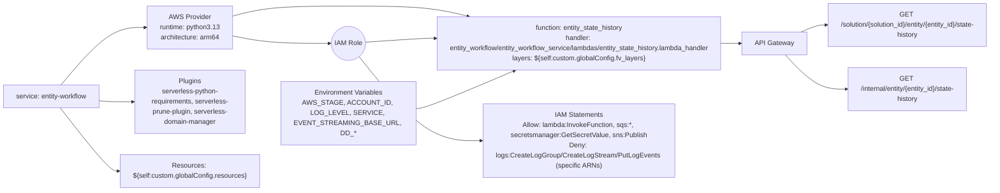

# Diagram: entity_core/entity_service/serverless.entity_workflow.yml


> Auto-generated by Obscura crawlers

## Diagram 1



### SVG

<svg id="container" width="2370.59375" xmlns="http://www.w3.org/2000/svg" class="flowchart" height="452" viewBox="0 0 2370.59375 452" role="graphics-document document" aria-roledescription="flowchart-v2"><style>#container{font-family:"trebuchet ms",verdana,arial,sans-serif;font-size:16px;fill:#333;}@keyframes edge-animation-frame{from{stroke-dashoffset:0;}}@keyframes dash{to{stroke-dashoffset:0;}}#container .edge-animation-slow{stroke-dasharray:9,5!important;stroke-dashoffset:900;animation:dash 50s linear infinite;stroke-linecap:round;}#container .edge-animation-fast{stroke-dasharray:9,5!important;stroke-dashoffset:900;animation:dash 20s linear infinite;stroke-linecap:round;}#container .error-icon{fill:#552222;}#container .error-text{fill:#552222;stroke:#552222;}#container .edge-thickness-normal{stroke-width:1px;}#container .edge-thickness-thick{stroke-width:3.5px;}#container .edge-pattern-solid{stroke-dasharray:0;}#container .edge-thickness-invisible{stroke-width:0;fill:none;}#container .edge-pattern-dashed{stroke-dasharray:3;}#container .edge-pattern-dotted{stroke-dasharray:2;}#container .marker{fill:#333333;stroke:#333333;}#container .marker.cross{stroke:#333333;}#container svg{font-family:"trebuchet ms",verdana,arial,sans-serif;font-size:16px;}#container p{margin:0;}#container .label{font-family:"trebuchet ms",verdana,arial,sans-serif;color:#333;}#container .cluster-label text{fill:#333;}#container .cluster-label span{color:#333;}#container .cluster-label span p{background-color:transparent;}#container .label text,#container span{fill:#333;color:#333;}#container .node rect,#container .node circle,#container .node ellipse,#container .node polygon,#container .node path{fill:#ECECFF;stroke:#9370DB;stroke-width:1px;}#container .rough-node .label text,#container .node .label text,#container .image-shape .label,#container .icon-shape .label{text-anchor:middle;}#container .node .katex path{fill:#000;stroke:#000;stroke-width:1px;}#container .rough-node .label,#container .node .label,#container .image-shape .label,#container .icon-shape .label{text-align:center;}#container .node.clickable{cursor:pointer;}#container .root .anchor path{fill:#333333!important;stroke-width:0;stroke:#333333;}#container .arrowheadPath{fill:#333333;}#container .edgePath .path{stroke:#333333;stroke-width:2.0px;}#container .flowchart-link{stroke:#333333;fill:none;}#container .edgeLabel{background-color:rgba(232,232,232, 0.8);text-align:center;}#container .edgeLabel p{background-color:rgba(232,232,232, 0.8);}#container .edgeLabel rect{opacity:0.5;background-color:rgba(232,232,232, 0.8);fill:rgba(232,232,232, 0.8);}#container .labelBkg{background-color:rgba(232, 232, 232, 0.5);}#container .cluster rect{fill:#ffffde;stroke:#aaaa33;stroke-width:1px;}#container .cluster text{fill:#333;}#container .cluster span{color:#333;}#container div.mermaidTooltip{position:absolute;text-align:center;max-width:200px;padding:2px;font-family:"trebuchet ms",verdana,arial,sans-serif;font-size:12px;background:hsl(80, 100%, 96.2745098039%);border:1px solid #aaaa33;border-radius:2px;pointer-events:none;z-index:100;}#container .flowchartTitleText{text-anchor:middle;font-size:18px;fill:#333;}#container rect.text{fill:none;stroke-width:0;}#container .icon-shape,#container .image-shape{background-color:rgba(232,232,232, 0.8);text-align:center;}#container .icon-shape p,#container .image-shape p{background-color:rgba(232,232,232, 0.8);padding:2px;}#container .icon-shape rect,#container .image-shape rect{opacity:0.5;background-color:rgba(232,232,232, 0.8);fill:rgba(232,232,232, 0.8);}#container .label-icon{display:inline-block;height:1em;overflow:visible;vertical-align:-0.125em;}#container .node .label-icon path{fill:currentColor;stroke:revert;stroke-width:revert;}#container :root{--mermaid-font-family:"trebuchet ms",verdana,arial,sans-serif;}</style><g><marker id="container_flowchart-v2-pointEnd" class="marker flowchart-v2" viewBox="0 0 10 10" refX="5" refY="5" markerUnits="userSpaceOnUse" markerWidth="8" markerHeight="8" orient="auto"><path d="M 0 0 L 10 5 L 0 10 z" class="arrowMarkerPath" style="stroke-width: 1; stroke-dasharray: 1, 0;"></path></marker><marker id="container_flowchart-v2-pointStart" class="marker flowchart-v2" viewBox="0 0 10 10" refX="4.5" refY="5" markerUnits="userSpaceOnUse" markerWidth="8" markerHeight="8" orient="auto"><path d="M 0 5 L 10 10 L 10 0 z" class="arrowMarkerPath" style="stroke-width: 1; stroke-dasharray: 1, 0;"></path></marker><marker id="container_flowchart-v2-circleEnd" class="marker flowchart-v2" viewBox="0 0 10 10" refX="11" refY="5" markerUnits="userSpaceOnUse" markerWidth="11" markerHeight="11" orient="auto"><circle cx="5" cy="5" r="5" class="arrowMarkerPath" style="stroke-width: 1; stroke-dasharray: 1, 0;"></circle></marker><marker id="container_flowchart-v2-circleStart" class="marker flowchart-v2" viewBox="0 0 10 10" refX="-1" refY="5" markerUnits="userSpaceOnUse" markerWidth="11" markerHeight="11" orient="auto"><circle cx="5" cy="5" r="5" class="arrowMarkerPath" style="stroke-width: 1; stroke-dasharray: 1, 0;"></circle></marker><marker id="container_flowchart-v2-crossEnd" class="marker cross flowchart-v2" viewBox="0 0 11 11" refX="12" refY="5.2" markerUnits="userSpaceOnUse" markerWidth="11" markerHeight="11" orient="auto"><path d="M 1,1 l 9,9 M 10,1 l -9,9" class="arrowMarkerPath" style="stroke-width: 2; stroke-dasharray: 1, 0;"></path></marker><marker id="container_flowchart-v2-crossStart" class="marker cross flowchart-v2" viewBox="0 0 11 11" refX="-1" refY="5.2" markerUnits="userSpaceOnUse" markerWidth="11" markerHeight="11" orient="auto"><path d="M 1,1 l 9,9 M 10,1 l -9,9" class="arrowMarkerPath" style="stroke-width: 2; stroke-dasharray: 1, 0;"></path></marker><g class="root"><g class="clusters"></g><g class="edgePaths"><path d="M147.503,202.074L167.172,179.229C186.841,156.383,226.178,110.691,259.918,87.846C293.659,65,321.802,65,335.874,65L349.945,65" id="L_svc_prov_0" class="edge-thickness-normal edge-pattern-solid edge-thickness-normal edge-pattern-solid flowchart-link" style=";" data-edge="true" data-et="edge" data-id="L_svc_prov_0" data-points="W3sieCI6MTQ3LjUwMzE1MjExODU5ODY4LCJ5IjoyMDIuMDc0MjE4NzV9LHsieCI6MjY1LjUxNTYyNSwieSI6NjV9LHsieCI6MzUzLjk0NTMxMjUsInkiOjY1fV0=" marker-end="url(#container_flowchart-v2-pointEnd)"></path><path d="M555.93,84.687L570.668,87.56C585.406,90.433,614.883,96.18,650.249,99.053C685.615,101.926,726.87,101.926,747.497,101.926L768.125,101.926" id="L_prov_iam_0" class="edge-thickness-normal edge-pattern-solid edge-thickness-normal edge-pattern-solid flowchart-link" style=";" data-edge="true" data-et="edge" data-id="L_prov_iam_0" data-points="W3sieCI6NTU1LjkyOTY4NzUsInkiOjg0LjY4NzM1MzU1MTg3NDU0fSx7IngiOjY0NC4zNTkzNzUsInkiOjEwMS45MjU3ODEyNX0seyJ4Ijo3NzIuMTI1LCJ5IjoxMDEuOTI1NzgxMjV9XQ==" marker-end="url(#container_flowchart-v2-pointEnd)"></path><path d="M555.93,38.954L570.668,35.153C585.406,31.352,614.883,23.75,657.391,19.949C699.898,16.148,755.438,16.148,810.977,16.148C866.516,16.148,922.055,16.148,965.793,19.796C1009.531,23.444,1041.469,30.739,1057.438,34.387L1073.407,38.035" id="L_prov_func_0" class="edge-thickness-normal edge-pattern-solid edge-thickness-normal edge-pattern-solid flowchart-link" style=";" data-edge="true" data-et="edge" data-id="L_prov_func_0" data-points="W3sieCI6NTU1LjkyOTY4NzUsInkiOjM4Ljk1NDI5NTYxODM0OTQyfSx7IngiOjY0NC4zNTkzNzUsInkiOjE2LjE0ODQzNzV9LHsieCI6ODEwLjk3NjU2MjUsInkiOjE2LjE0ODQzNzV9LHsieCI6OTc3LjU5Mzc1LCJ5IjoxNi4xNDg0Mzc1fSx7IngiOjEwNzcuMzA2MjE2NjI4MTQ4LCJ5IjozOC45MjU3ODEyNX1d" marker-end="url(#container_flowchart-v2-pointEnd)"></path><path d="M849.729,99.152L871.04,97.627C892.351,96.101,934.972,93.051,959.783,91.637C984.594,90.222,991.595,90.445,995.095,90.556L998.596,90.667" id="L_iam_func_0" class="edge-thickness-normal edge-pattern-solid edge-thickness-normal edge-pattern-solid flowchart-link" style=";" data-edge="true" data-et="edge" data-id="L_iam_func_0" data-points="W3sieCI6ODQ5LjcyODk4NTI2MDQ3ODUsInkiOjk5LjE1MjA0MDI5NTE2MDF9LHsieCI6OTc3LjU5Mzc1LCJ5Ijo5MH0seyJ4IjoxMDAyLjU5Mzc1LCJ5Ijo5MC43OTM5NzY5MDYyNzI3Nn1d" marker-end="url(#container_flowchart-v2-pointEnd)"></path><path d="M1703.609,101.926L1707.776,101.926C1711.943,101.926,1720.276,101.926,1727.943,101.926C1735.609,101.926,1742.609,101.926,1746.109,101.926L1749.609,101.926" id="L_func_api_0" class="edge-thickness-normal edge-pattern-solid edge-thickness-normal edge-pattern-solid flowchart-link" style=";" data-edge="true" data-et="edge" data-id="L_func_api_0" data-points="W3sieCI6MTcwMy42MDkzNzUsInkiOjEwMS45MjU3ODEyNX0seyJ4IjoxNzI4LjYwOTM3NSwieSI6MTAxLjkyNTc4MTI1fSx7IngiOjE3NTMuNjA5Mzc1LCJ5IjoxMDEuOTI1NzgxMjV9XQ==" marker-end="url(#container_flowchart-v2-pointEnd)"></path><path d="M1889.969,74.926L1896.094,72.271C1902.219,69.617,1914.469,64.309,1924.094,61.654C1933.719,59,1940.719,59,1944.219,59L1947.719,59" id="L_api_http1_0" class="edge-thickness-normal edge-pattern-solid edge-thickness-normal edge-pattern-solid flowchart-link" style=";" data-edge="true" data-et="edge" data-id="L_api_http1_0" data-points="W3sieCI6MTg4OS45Njg3MzA4MDQ2NjgyLCJ5Ijo3NC45MjU3ODEyNX0seyJ4IjoxOTI2LjcxODc1LCJ5Ijo1OX0seyJ4IjoxOTUxLjcxODc1LCJ5Ijo1OX1d" marker-end="url(#container_flowchart-v2-pointEnd)"></path><path d="M1852.184,128.926L1864.606,142.605C1877.029,156.284,1901.874,183.642,1926.402,197.321C1950.93,211,1975.141,211,1987.246,211L1999.352,211" id="L_api_http2_0" class="edge-thickness-normal edge-pattern-solid edge-thickness-normal edge-pattern-solid flowchart-link" style=";" data-edge="true" data-et="edge" data-id="L_api_http2_0" data-points="W3sieCI6MTg1Mi4xODM4NDkwNTU4ODU3LCJ5IjoxMjguOTI1NzgxMjV9LHsieCI6MTkyNi43MTg3NSwieSI6MjExfSx7IngiOjIwMDMuMzUxNTYyNSwieSI6MjExfV0=" marker-end="url(#container_flowchart-v2-pointEnd)"></path><path d="M952.594,255.641L956.76,255.343C960.927,255.044,969.26,254.448,1009.441,239.579C1049.622,224.71,1121.651,195.568,1157.665,180.997L1193.679,166.426" id="L_env_func_0" class="edge-thickness-normal edge-pattern-solid edge-thickness-normal edge-pattern-solid flowchart-link" style=";" data-edge="true" data-et="edge" data-id="L_env_func_0" data-points="W3sieCI6OTUyLjU5Mzc1LCJ5IjoyNTUuNjQwOTYwOTE1MTU0NX0seyJ4Ijo5NzcuNTkzNzUsInkiOjI1My44NTE1NjI1fSx7IngiOjExOTcuMzg3NDIzNzA4OTU3OCwieSI6MTY0LjkyNTc4MTI1fV0=" marker-end="url(#container_flowchart-v2-pointEnd)"></path><path d="M833.844,133.335L857.802,166.242C881.761,199.149,929.677,264.963,978.215,297.87C1026.753,330.777,1075.911,330.777,1100.491,330.777L1125.07,330.777" id="L_iam_perms_0" class="edge-thickness-normal edge-pattern-solid edge-thickness-normal edge-pattern-solid flowchart-link" style=";" data-edge="true" data-et="edge" data-id="L_iam_perms_0" data-points="W3sieCI6ODMzLjg0NDA3ODgyNTk3ODMsInkiOjEzMy4zMzQ3MDY4MjQ5NDY0fSx7IngiOjk3Ny41OTM3NSwieSI6MzMwLjc3NzM0Mzc1fSx7IngiOjExMjkuMDcwMzEyNSwieSI6MzMwLjc3NzM0Mzc1fV0=" marker-end="url(#container_flowchart-v2-pointEnd)"></path><path d="M240.516,238.889L244.682,239.241C248.849,239.593,257.182,240.296,270.586,240.648C283.99,241,302.464,241,311.701,241L320.938,241" id="L_svc_plugins_0" class="edge-thickness-normal edge-pattern-solid edge-thickness-normal edge-pattern-solid flowchart-link" style=";" data-edge="true" data-et="edge" data-id="L_svc_plugins_0" data-points="W3sieCI6MjQwLjUxNTYyNSwieSI6MjM4Ljg4OTM1ODk5NTYzMDc3fSx7IngiOjI2NS41MTU2MjUsInkiOjI0MX0seyJ4IjozMjQuOTM3NSwieSI6MjQxfV0=" marker-end="url(#container_flowchart-v2-pointEnd)"></path><path d="M145.937,256.074L165.867,280.895C185.797,305.716,225.656,355.358,249.086,380.179C272.516,405,279.516,405,283.016,405L286.516,405" id="L_svc_resources_0" class="edge-thickness-normal edge-pattern-solid edge-thickness-normal edge-pattern-solid flowchart-link" style=";" data-edge="true" data-et="edge" data-id="L_svc_resources_0" data-points="W3sieCI6MTQ1LjkzNzE4NzIzNjMyNzksInkiOjI1Ni4wNzQyMTg3NX0seyJ4IjoyNjUuNTE1NjI1LCJ5Ijo0MDV9LHsieCI6MjkwLjUxNTYyNSwieSI6NDA1fV0=" marker-end="url(#container_flowchart-v2-pointEnd)"></path></g><g class="edgeLabels"><g class="edgeLabel"><g class="label" data-id="L_svc_prov_0" transform="translate(0, 0)"><foreignObject width="0" height="0"><div xmlns="http://www.w3.org/1999/xhtml" class="labelBkg" style="display: table-cell; white-space: nowrap; line-height: 1.5; max-width: 200px; text-align: center;"><span class="edgeLabel"></span></div></foreignObject></g></g><g class="edgeLabel"><g class="label" data-id="L_prov_iam_0" transform="translate(0, 0)"><foreignObject width="0" height="0"><div xmlns="http://www.w3.org/1999/xhtml" class="labelBkg" style="display: table-cell; white-space: nowrap; line-height: 1.5; max-width: 200px; text-align: center;"><span class="edgeLabel"></span></div></foreignObject></g></g><g class="edgeLabel"><g class="label" data-id="L_prov_func_0" transform="translate(0, 0)"><foreignObject width="0" height="0"><div xmlns="http://www.w3.org/1999/xhtml" class="labelBkg" style="display: table-cell; white-space: nowrap; line-height: 1.5; max-width: 200px; text-align: center;"><span class="edgeLabel"></span></div></foreignObject></g></g><g class="edgeLabel"><g class="label" data-id="L_iam_func_0" transform="translate(0, 0)"><foreignObject width="0" height="0"><div xmlns="http://www.w3.org/1999/xhtml" class="labelBkg" style="display: table-cell; white-space: nowrap; line-height: 1.5; max-width: 200px; text-align: center;"><span class="edgeLabel"></span></div></foreignObject></g></g><g class="edgeLabel"><g class="label" data-id="L_func_api_0" transform="translate(0, 0)"><foreignObject width="0" height="0"><div xmlns="http://www.w3.org/1999/xhtml" class="labelBkg" style="display: table-cell; white-space: nowrap; line-height: 1.5; max-width: 200px; text-align: center;"><span class="edgeLabel"></span></div></foreignObject></g></g><g class="edgeLabel"><g class="label" data-id="L_api_http1_0" transform="translate(0, 0)"><foreignObject width="0" height="0"><div xmlns="http://www.w3.org/1999/xhtml" class="labelBkg" style="display: table-cell; white-space: nowrap; line-height: 1.5; max-width: 200px; text-align: center;"><span class="edgeLabel"></span></div></foreignObject></g></g><g class="edgeLabel"><g class="label" data-id="L_api_http2_0" transform="translate(0, 0)"><foreignObject width="0" height="0"><div xmlns="http://www.w3.org/1999/xhtml" class="labelBkg" style="display: table-cell; white-space: nowrap; line-height: 1.5; max-width: 200px; text-align: center;"><span class="edgeLabel"></span></div></foreignObject></g></g><g class="edgeLabel"><g class="label" data-id="L_env_func_0" transform="translate(0, 0)"><foreignObject width="0" height="0"><div xmlns="http://www.w3.org/1999/xhtml" class="labelBkg" style="display: table-cell; white-space: nowrap; line-height: 1.5; max-width: 200px; text-align: center;"><span class="edgeLabel"></span></div></foreignObject></g></g><g class="edgeLabel"><g class="label" data-id="L_iam_perms_0" transform="translate(0, 0)"><foreignObject width="0" height="0"><div xmlns="http://www.w3.org/1999/xhtml" class="labelBkg" style="display: table-cell; white-space: nowrap; line-height: 1.5; max-width: 200px; text-align: center;"><span class="edgeLabel"></span></div></foreignObject></g></g><g class="edgeLabel"><g class="label" data-id="L_svc_plugins_0" transform="translate(0, 0)"><foreignObject width="0" height="0"><div xmlns="http://www.w3.org/1999/xhtml" class="labelBkg" style="display: table-cell; white-space: nowrap; line-height: 1.5; max-width: 200px; text-align: center;"><span class="edgeLabel"></span></div></foreignObject></g></g><g class="edgeLabel"><g class="label" data-id="L_svc_resources_0" transform="translate(0, 0)"><foreignObject width="0" height="0"><div xmlns="http://www.w3.org/1999/xhtml" class="labelBkg" style="display: table-cell; white-space: nowrap; line-height: 1.5; max-width: 200px; text-align: center;"><span class="edgeLabel"></span></div></foreignObject></g></g></g><g class="nodes"><g class="node default" id="flowchart-svc-0" transform="translate(124.2578125, 229.07421875)"><rect class="basic label-container" style="" x="-116.2578125" y="-27" width="232.515625" height="54"></rect><g class="label" style="" transform="translate(-86.2578125, -12)"><rect></rect><foreignObject width="172.515625" height="24"><div xmlns="http://www.w3.org/1999/xhtml" style="display: table-cell; white-space: nowrap; line-height: 1.5; max-width: 200px; text-align: center;"><span class="nodeLabel"><p>service: entity-workflow</p></span></div></foreignObject></g></g><g class="node default" id="flowchart-prov-1" transform="translate(454.9375, 65)"><rect class="basic label-container" style="" x="-100.9921875" y="-51" width="201.984375" height="102"></rect><g class="label" style="" transform="translate(-70.9921875, -36)"><rect></rect><foreignObject width="141.984375" height="72"><div xmlns="http://www.w3.org/1999/xhtml" style="display: table-cell; white-space: nowrap; line-height: 1.5; max-width: 200px; text-align: center;"><span class="nodeLabel"><p>AWS Provider<br/>runtime: python3.13<br/>architecture: arm64</p></span></div></foreignObject></g></g><g class="node default" id="flowchart-iam-2" transform="translate(810.9765625, 101.92578125)"><circle class="basic label-container" style="" r="38.8515625" cx="0" cy="0"></circle><g class="label" style="" transform="translate(-31.3515625, -12)"><rect></rect><foreignObject width="62.703125" height="24"><div xmlns="http://www.w3.org/1999/xhtml" style="display: table-cell; white-space: nowrap; line-height: 1.5; max-width: 200px; text-align: center;"><span class="nodeLabel"><p>IAM Role</p></span></div></foreignObject></g></g><g class="node default" id="flowchart-func-3" transform="translate(1353.1015625, 101.92578125)"><rect class="basic label-container" style="" x="-350.5078125" y="-63" width="701.015625" height="126"></rect><g class="label" style="" transform="translate(-320.5078125, -48)"><rect></rect><foreignObject width="641.015625" height="96"><div xmlns="http://www.w3.org/1999/xhtml" style="display: table; white-space: break-spaces; line-height: 1.5; max-width: 200px; text-align: center; width: 200px;"><span class="nodeLabel"><p>function: entity_state_history<br/>handler: entity_workflow/entity_workflow_service/lambdas/entity_state_history.lambda_handler<br/>layers: ${self:custom.globalConfig.fv_layers}</p></span></div></foreignObject></g></g><g class="node default" id="flowchart-api-4" transform="translate(1827.6640625, 101.92578125)"><rect class="basic label-container" style="" x="-74.0546875" y="-27" width="148.109375" height="54"></rect><g class="label" style="" transform="translate(-44.0546875, -12)"><rect></rect><foreignObject width="88.109375" height="24"><div xmlns="http://www.w3.org/1999/xhtml" style="display: table-cell; white-space: nowrap; line-height: 1.5; max-width: 200px; text-align: center;"><span class="nodeLabel"><p>API Gateway</p></span></div></foreignObject></g></g><g class="node default" id="flowchart-http1-5" transform="translate(2157.15625, 59)"><rect class="basic label-container" style="" x="-205.4375" y="-51" width="410.875" height="102"></rect><g class="label" style="" transform="translate(-175.4375, -36)"><rect></rect><foreignObject width="350.875" height="72"><div xmlns="http://www.w3.org/1999/xhtml" style="display: table; white-space: break-spaces; line-height: 1.5; max-width: 200px; text-align: center; width: 200px;"><span class="nodeLabel"><p>GET /solution/{solution_id}/entity/{entity_id}/state-history</p></span></div></foreignObject></g></g><g class="node default" id="flowchart-http2-6" transform="translate(2157.15625, 211)"><rect class="basic label-container" style="" x="-153.8046875" y="-51" width="307.609375" height="102"></rect><g class="label" style="" transform="translate(-123.8046875, -36)"><rect></rect><foreignObject width="247.609375" height="72"><div xmlns="http://www.w3.org/1999/xhtml" style="display: table; white-space: break-spaces; line-height: 1.5; max-width: 200px; text-align: center; width: 200px;"><span class="nodeLabel"><p>GET /internal/entity/{entity_id}/state-history</p></span></div></foreignObject></g></g><g class="node default" id="flowchart-env-7" transform="translate(810.9765625, 265.77734375)"><rect class="basic label-container" style="" x="-141.6171875" y="-75" width="283.234375" height="150"></rect><g class="label" style="" transform="translate(-111.6171875, -60)"><rect></rect><foreignObject width="223.234375" height="120"><div xmlns="http://www.w3.org/1999/xhtml" style="display: table; white-space: break-spaces; line-height: 1.5; max-width: 200px; text-align: center; width: 200px;"><span class="nodeLabel"><p>Environment Variables<br/>AWS_STAGE, ACCOUNT_ID, LOG_LEVEL, SERVICE, EVENT_STREAMING_BASE_URL, DD_*</p></span></div></foreignObject></g></g><g class="node default" id="flowchart-perms-8" transform="translate(1353.1015625, 330.77734375)"><rect class="basic label-container" style="" x="-224.03125" y="-87" width="448.0625" height="174"></rect><g class="label" style="" transform="translate(-194.03125, -72)"><rect></rect><foreignObject width="388.0625" height="144"><div xmlns="http://www.w3.org/1999/xhtml" style="display: table; white-space: break-spaces; line-height: 1.5; max-width: 200px; text-align: center; width: 200px;"><span class="nodeLabel"><p>IAM Statements<br/>Allow: lambda:InvokeFunction, sqs:*, secretsmanager:GetSecretValue, sns:Publish<br/>Deny: logs:CreateLogGroup/CreateLogStream/PutLogEvents (specific ARNs)</p></span></div></foreignObject></g></g><g class="node default" id="flowchart-plugins-9" transform="translate(454.9375, 241)"><rect class="basic label-container" style="" x="-130" y="-75" width="260" height="150"></rect><g class="label" style="" transform="translate(-100, -60)"><rect></rect><foreignObject width="200" height="120"><div xmlns="http://www.w3.org/1999/xhtml" style="display: table; white-space: break-spaces; line-height: 1.5; max-width: 200px; text-align: center; width: 200px;"><span class="nodeLabel"><p>Plugins<br/>serverless-python-requirements, serverless-prune-plugin, serverless-domain-manager</p></span></div></foreignObject></g></g><g class="node default" id="flowchart-resources-10" transform="translate(454.9375, 405)"><rect class="basic label-container" style="" x="-164.421875" y="-39" width="328.84375" height="78"></rect><g class="label" style="" transform="translate(-134.421875, -24)"><rect></rect><foreignObject width="268.84375" height="48"><div xmlns="http://www.w3.org/1999/xhtml" style="display: table; white-space: break-spaces; line-height: 1.5; max-width: 200px; text-align: center; width: 200px;"><span class="nodeLabel"><p>Resources: ${self:custom.globalConfig.resources}</p></span></div></foreignObject></g></g></g></g></g></svg>

## Diagram 2

```mermaid
classDiagram
  class EntityStateHistory {
    +name: ${opt:stage}-entity_state_history
    +handler: entity_workflow/entity_workflow_service/lambdas/entity_state_history.lambda_handler
    +layers: ${self:custom.globalConfig.fv_layers}
    +timeout: 300
    +memorySize: ${self:custom.globalConfig.memorySize}
    +events: HTTP GET paths (public)
  }
  class Provider {
    +name: aws
    +runtime: python3.13
    +architecture: arm64
    +endpointType: ${self:custom.globalConfig.endpointType.${opt:stage}, "REGIONAL"}
  }
  class IAMRole {
    +managedPolicies: ${self:custom.globalConfig.defaultManagedPolicies}
    +actions: lambda:InvokeFunction, sqs:DeleteMessage/ReceiveMessage/SendMessage/GetQueueUrl/GetQueueAttributes, secretsmanager:GetSecretValue, sns:Publish
    +denies: logs:CreateLogGroup/CreateLogStream/PutLogEvents (scoped ARNs)
  }
  class Package {
    +patterns: exclude .serverless, node_modules, __pycache__, venv, etc.
  }
  Provider <|-- EntityStateHistory
  EntityStateHistory ..> IAMRole : uses
  EntityStateHistory --> Package
  Provider --> IAMRole
```

> SVG rendering failed for this diagram.
