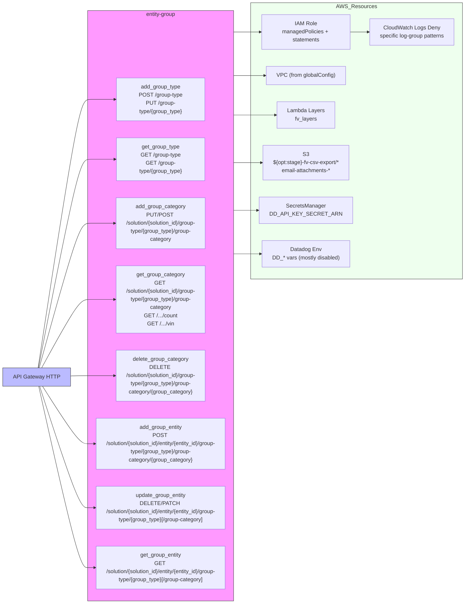

# Diagram: entity_core/entity_service/serverless.group.yml

> Auto-generated by Obscura crawlers

## Mermaid

### SVG

<svg id="container" width="1506.6875" xmlns="http://www.w3.org/2000/svg" class="flowchart" height="1552" viewBox="0 0 1506.6875 1552" role="graphics-document document" aria-roledescription="flowchart-v2"><g><marker id="container_flowchart-v2-pointEnd" class="marker flowchart-v2" viewBox="0 0 10 10" refX="5" refY="5" markerUnits="userSpaceOnUse" markerWidth="8" markerHeight="8" orient="auto"><path d="M 0 0 L 10 5 L 0 10 z" class="arrowMarkerPath" style="stroke-width: 1; stroke-dasharray: 1, 0;"></path></marker><marker id="container_flowchart-v2-pointStart" class="marker flowchart-v2" viewBox="0 0 10 10" refX="4.5" refY="5" markerUnits="userSpaceOnUse" markerWidth="8" markerHeight="8" orient="auto"><path d="M 0 5 L 10 10 L 10 0 z" class="arrowMarkerPath" style="stroke-width: 1; stroke-dasharray: 1, 0;"></path></marker><marker id="container_flowchart-v2-circleEnd" class="marker flowchart-v2" viewBox="0 0 10 10" refX="11" refY="5" markerUnits="userSpaceOnUse" markerWidth="11" markerHeight="11" orient="auto"><circle cx="5" cy="5" r="5" class="arrowMarkerPath" style="stroke-width: 1; stroke-dasharray: 1, 0;"></circle></marker><marker id="container_flowchart-v2-circleStart" class="marker flowchart-v2" viewBox="0 0 10 10" refX="-1" refY="5" markerUnits="userSpaceOnUse" markerWidth="11" markerHeight="11" orient="auto"><circle cx="5" cy="5" r="5" class="arrowMarkerPath" style="stroke-width: 1; stroke-dasharray: 1, 0;"></circle></marker><marker id="container_flowchart-v2-crossEnd" class="marker cross flowchart-v2" viewBox="0 0 11 11" refX="12" refY="5.2" markerUnits="userSpaceOnUse" markerWidth="11" markerHeight="11" orient="auto"><path d="M 1,1 l 9,9 M 10,1 l -9,9" class="arrowMarkerPath" style="stroke-width: 2; stroke-dasharray: 1, 0;"></path></marker><marker id="container_flowchart-v2-crossStart" class="marker cross flowchart-v2" viewBox="0 0 11 11" refX="-1" refY="5.2" markerUnits="userSpaceOnUse" markerWidth="11" markerHeight="11" orient="auto"><path d="M 1,1 l 9,9 M 10,1 l -9,9" class="arrowMarkerPath" style="stroke-width: 2; stroke-dasharray: 1, 0;"></path></marker><g class="root"><g class="clusters"><g class="cluster" id="AWS_Resources" data-look="classic"><rect style="fill:#efe !important;stroke:#333 !important;stroke-width:1px !important" x="763.921875" y="8" width="734.765625" height="764"></rect><g class="cluster-label" transform="translate(1075.15625, 8)"><foreignObject width="112.296875" height="24">

AWS_Resources

</foreignObject></g></g><g class="cluster" id="Service" data-look="classic"><rect style="fill:#f9f !important;stroke:#333 !important;stroke-width:1px !important" x="247.0625" y="31" width="466.859375" height="1513"></rect><g class="cluster-label" transform="translate(435.28125, 31)"><foreignObject width="90.421875" height="24">

entity-group

</foreignObject></g></g></g><g class="edgePaths"><path d="M107.051,961L126.22,846.5C145.388,732,183.725,503,207.061,388.5C230.396,274,238.729,274,259.467,274C280.206,274,313.349,274,329.921,274L346.492,274" id="L_APIGW_add_group_type_0" class="edge-thickness-normal edge-pattern-solid edge-thickness-normal edge-pattern-solid flowchart-link" style=";" data-edge="true" data-et="edge" data-id="L_APIGW_add_group_type_0" data-points="W3sieCI6MTA3LjA1MTMzOTI4NTcxNDI5LCJ5Ijo5NjF9LHsieCI6MjIyLjA2MjUsInkiOjI3NH0seyJ4IjoyNDcuMDYyNSwieSI6Mjc0fSx7IngiOjM1MC40OTIxODc1LCJ5IjoyNzR9XQ==" marker-end="url(#container_flowchart-v2-pointEnd)"></path><path d="M108.274,961L127.239,871.833C146.203,782.667,184.133,604.333,207.264,515.167C230.396,426,238.729,426,259.467,426C280.206,426,313.349,426,329.921,426L346.492,426" id="L_APIGW_get_group_type_0" class="edge-thickness-normal edge-pattern-solid edge-thickness-normal edge-pattern-solid flowchart-link" style=";" data-edge="true" data-et="edge" data-id="L_APIGW_get_group_type_0" data-points="W3sieCI6MTA4LjI3Mzg1NDUzNzM2NjU1LCJ5Ijo5NjF9LHsieCI6MjIyLjA2MjUsInkiOjQyNn0seyJ4IjoyNDcuMDYyNSwieSI6NDI2fSx7IngiOjM1MC40OTIxODc1LCJ5Ijo0MjZ9XQ==" marker-end="url(#container_flowchart-v2-pointEnd)"></path><path d="M110.64,961L129.211,899.167C147.781,837.333,184.922,713.667,207.659,651.833C230.396,590,238.729,590,255.936,590C273.143,590,299.224,590,312.264,590L325.305,590" id="L_APIGW_add_group_category_0" class="edge-thickness-normal edge-pattern-solid edge-thickness-normal edge-pattern-solid flowchart-link" style=";" data-edge="true" data-et="edge" data-id="L_APIGW_add_group_category_0" data-points="W3sieCI6MTEwLjY0MDE1Mzg5NDQ3MjM2LCJ5Ijo5NjF9LHsieCI6MjIyLjA2MjUsInkiOjU5MH0seyJ4IjoyNDcuMDYyNSwieSI6NTkwfSx7IngiOjMyOS4zMDQ2ODc1LCJ5Ijo1OTB9XQ==" marker-end="url(#container_flowchart-v2-pointEnd)"></path><path d="M117.9,961L135.26,930.5C152.621,900,187.342,839,208.869,808.5C230.396,778,238.729,778,257.393,778C276.057,778,305.052,778,319.549,778L334.047,778" id="L_APIGW_get_group_category_0" class="edge-thickness-normal edge-pattern-solid edge-thickness-normal edge-pattern-solid flowchart-link" style=";" data-edge="true" data-et="edge" data-id="L_APIGW_get_group_category_0" data-points="W3sieCI6MTE3Ljg5OTU1MzU3MTQyODU3LCJ5Ijo5NjF9LHsieCI6MjIyLjA2MjUsInkiOjc3OH0seyJ4IjoyNDcuMDYyNSwieSI6Nzc4fSx7IngiOjMzOC4wNDY4NzUsInkiOjc3OH1d" marker-end="url(#container_flowchart-v2-pointEnd)"></path><path d="M197.063,970.601L201.229,969.834C205.396,969.068,213.729,967.534,222.063,966.767C230.396,966,238.729,966,256.165,966C273.602,966,300.141,966,313.41,966L326.68,966" id="L_APIGW_delete_group_category_0" class="edge-thickness-normal edge-pattern-solid edge-thickness-normal edge-pattern-solid flowchart-link" style=";" data-edge="true" data-et="edge" data-id="L_APIGW_delete_group_category_0" data-points="W3sieCI6MTk3LjA2MjUsInkiOjk3MC42MDEzMDcxODk1NDI1fSx7IngiOjIyMi4wNjI1LCJ5Ijo5NjZ9LHsieCI6MjQ3LjA2MjUsInkiOjk2Nn0seyJ4IjozMzAuNjc5Njg3NSwieSI6OTY2fV0=" marker-end="url(#container_flowchart-v2-pointEnd)"></path><path d="M123.488,1015L139.917,1036.167C156.346,1057.333,189.204,1099.667,209.8,1120.833C230.396,1142,238.729,1142,246.396,1142C254.063,1142,261.063,1142,264.563,1142L268.063,1142" id="L_APIGW_add_group_entity_0" class="edge-thickness-normal edge-pattern-solid edge-thickness-normal edge-pattern-solid flowchart-link" style=";" data-edge="true" data-et="edge" data-id="L_APIGW_add_group_entity_0" data-points="W3sieCI6MTIzLjQ4ODAyNzU5NzQwMjYsInkiOjEwMTV9LHsieCI6MjIyLjA2MjUsInkiOjExNDJ9LHsieCI6MjQ3LjA2MjUsInkiOjExNDJ9LHsieCI6MjcyLjA2MjUsInkiOjExNDJ9XQ==" marker-end="url(#container_flowchart-v2-pointEnd)"></path><path d="M112.68,1015L130.911,1063.5C149.141,1112,185.602,1209,207.999,1257.5C230.396,1306,238.729,1306,246.396,1306C254.063,1306,261.063,1306,264.563,1306L268.063,1306" id="L_APIGW_update_group_entity_0" class="edge-thickness-normal edge-pattern-solid edge-thickness-normal edge-pattern-solid flowchart-link" style=";" data-edge="true" data-et="edge" data-id="L_APIGW_update_group_entity_0" data-points="W3sieCI6MTEyLjY4MDEyOTcxNjk4MTEzLCJ5IjoxMDE1fSx7IngiOjIyMi4wNjI1LCJ5IjoxMzA2fSx7IngiOjI0Ny4wNjI1LCJ5IjoxMzA2fSx7IngiOjI3Mi4wNjI1LCJ5IjoxMzA2fV0=" marker-end="url(#container_flowchart-v2-pointEnd)"></path><path d="M109.398,1015L128.175,1088.833C146.953,1162.667,184.508,1310.333,207.452,1384.167C230.396,1458,238.729,1458,246.396,1458C254.063,1458,261.063,1458,264.563,1458L268.063,1458" id="L_APIGW_get_group_entity_0" class="edge-thickness-normal edge-pattern-solid edge-thickness-normal edge-pattern-solid flowchart-link" style=";" data-edge="true" data-et="edge" data-id="L_APIGW_get_group_entity_0" data-points="W3sieCI6MTA5LjM5NzkzODgyOTc4NzI0LCJ5IjoxMDE1fSx7IngiOjIyMi4wNjI1LCJ5IjoxNDU4fSx7IngiOjI0Ny4wNjI1LCJ5IjoxNDU4fSx7IngiOjI3Mi4wNjI1LCJ5IjoxNDU4fV0=" marker-end="url(#container_flowchart-v2-pointEnd)"></path><path d="M1106.305,94L1120.035,94C1133.766,94,1161.227,94,1178.457,94C1195.688,94,1202.688,94,1206.188,94L1209.688,94" id="L_iam_logsdeny_0" class="edge-thickness-normal edge-pattern-solid edge-thickness-normal edge-pattern-solid flowchart-link" style=";" data-edge="true" data-et="edge" data-id="L_iam_logsdeny_0" data-points="W3sieCI6MTEwNi4zMDQ2ODc1LCJ5Ijo5NH0seyJ4IjoxMTg4LjY4NzUsInkiOjk0fSx7IngiOjEyMTMuNjg3NSwieSI6OTR9XQ==" marker-end="url(#container_flowchart-v2-pointEnd)"></path><path d="M713.922,94L718.089,94C722.255,94,730.589,94,738.922,94C747.255,94,755.589,94,772.819,94C790.049,94,816.177,94,829.241,94L842.305,94" id="L_Service_iam_0" class="edge-thickness-normal edge-pattern-solid edge-thickness-normal edge-pattern-solid flowchart-link" style=";" data-edge="true" data-et="edge" data-id="L_Service_iam_0" data-points="W3sieCI6NTQ2LjYzMDU5ODk1ODMzMzQsInkiOjIyM30seyJ4Ijo3MTMuOTIxODc1LCJ5Ijo5NH0seyJ4Ijo3MzguOTIxODc1LCJ5Ijo5NH0seyJ4Ijo3NjMuOTIxODc1LCJ5Ijo5NH0seyJ4Ijo4NDYuMzA0Njg3NSwieSI6OTR9XQ==" marker-end="url(#container_flowchart-v2-pointEnd)"></path><path d="M713.922,222L718.089,222C722.255,222,730.589,222,738.922,222C747.255,222,755.589,222,775.332,222C795.076,222,826.229,222,841.806,222L857.383,222" id="L_Service_vpc_0" class="edge-thickness-normal edge-pattern-solid edge-thickness-normal edge-pattern-solid flowchart-link" style=";" data-edge="true" data-et="edge" data-id="L_Service_vpc_0" data-points="W3sieCI6NjEwLjQ5MjE4NzUsInkiOjI0NS4wNDA1MzAxMzgyMjQxN30seyJ4Ijo3MTMuOTIxODc1LCJ5IjoyMjJ9LHsieCI6NzM4LjkyMTg3NSwieSI6MjIyfSx7IngiOjc2My45MjE4NzUsInkiOjIyMn0seyJ4Ijo4NjEuMzgyODEyNSwieSI6MjIyfV0=" marker-end="url(#container_flowchart-v2-pointEnd)"></path><path d="M713.922,326L718.089,326C722.255,326,730.589,326,738.922,326C747.255,326,755.589,326,773.699,326C791.81,326,819.698,326,833.642,326L847.586,326" id="L_Service_layers_0" class="edge-thickness-normal edge-pattern-solid edge-thickness-normal edge-pattern-solid flowchart-link" style=";" data-edge="true" data-et="edge" data-id="L_Service_layers_0" data-points="W3sieCI6NjEwLjQ5MjE4NzUsInkiOjMwMi45NTk0Njk4NjE3NzU4fSx7IngiOjcxMy45MjE4NzUsInkiOjMyNn0seyJ4Ijo3MzguOTIxODc1LCJ5IjozMjZ9LHsieCI6NzYzLjkyMTg3NSwieSI6MzI2fSx7IngiOjg1MS41ODU5Mzc1LCJ5IjozMjZ9XQ==" marker-end="url(#container_flowchart-v2-pointEnd)"></path><path d="M713.922,454L718.089,454C722.255,454,730.589,454,738.922,454C747.255,454,755.589,454,772.819,454C790.049,454,816.177,454,829.241,454L842.305,454" id="L_Service_s3_0" class="edge-thickness-normal edge-pattern-solid edge-thickness-normal edge-pattern-solid flowchart-link" style=";" data-edge="true" data-et="edge" data-id="L_Service_s3_0" data-points="W3sieCI6NTQ2LjYzMDU5ODk1ODMzMzQsInkiOjMyNX0seyJ4Ijo3MTMuOTIxODc1LCJ5Ijo0NTR9LHsieCI6NzM4LjkyMTg3NSwieSI6NDU0fSx7IngiOjc2My45MjE4NzUsInkiOjQ1NH0seyJ4Ijo4NDYuMzA0Njg3NSwieSI6NDU0fV0=" marker-end="url(#container_flowchart-v2-pointEnd)"></path><path d="M713.922,582L718.089,582C722.255,582,730.589,582,738.922,582C747.255,582,755.589,582,763.255,582C770.922,582,777.922,582,781.422,582L784.922,582" id="L_Service_secrets_0" class="edge-thickness-normal edge-pattern-solid edge-thickness-normal edge-pattern-solid flowchart-link" style=";" data-edge="true" data-et="edge" data-id="L_Service_secrets_0" data-points="W3sieCI6NTE5LjE0NDUwNTg4NDc0MDMsInkiOjMyNX0seyJ4Ijo3MTMuOTIxODc1LCJ5Ijo1ODJ9LHsieCI6NzM4LjkyMTg3NSwieSI6NTgyfSx7IngiOjc2My45MjE4NzUsInkiOjU4Mn0seyJ4Ijo3ODguOTIxODc1LCJ5Ijo1ODJ9XQ==" marker-end="url(#container_flowchart-v2-pointEnd)"></path><path d="M713.922,698L718.089,698C722.255,698,730.589,698,738.922,698C747.255,698,755.589,698,772.819,698C790.049,698,816.177,698,829.241,698L842.305,698" id="L_Service_datadog_0" class="edge-thickness-normal edge-pattern-solid edge-thickness-normal edge-pattern-solid flowchart-link" style=";" data-edge="true" data-et="edge" data-id="L_Service_datadog_0" data-points="W3sieCI6NTA4LjU2OTgxNTAwNTg5NjIsInkiOjMyNX0seyJ4Ijo3MTMuOTIxODc1LCJ5Ijo2OTh9LHsieCI6NzM4LjkyMTg3NSwieSI6Njk4fSx7IngiOjc2My45MjE4NzUsInkiOjY5OH0seyJ4Ijo4NDYuMzA0Njg3NSwieSI6Njk4fV0=" marker-end="url(#container_flowchart-v2-pointEnd)"></path></g><g class="edgeLabels"><g class="edgeLabel"><g class="label" data-id="L_APIGW_add_group_type_0" transform="translate(0, 0)"><foreignObject width="0" height="0">

</foreignObject></g></g><g class="edgeLabel"><g class="label" data-id="L_APIGW_get_group_type_0" transform="translate(0, 0)"><foreignObject width="0" height="0">

</foreignObject></g></g><g class="edgeLabel"><g class="label" data-id="L_APIGW_add_group_category_0" transform="translate(0, 0)"><foreignObject width="0" height="0">

</foreignObject></g></g><g class="edgeLabel"><g class="label" data-id="L_APIGW_get_group_category_0" transform="translate(0, 0)"><foreignObject width="0" height="0">

</foreignObject></g></g><g class="edgeLabel"><g class="label" data-id="L_APIGW_delete_group_category_0" transform="translate(0, 0)"><foreignObject width="0" height="0">

</foreignObject></g></g><g class="edgeLabel"><g class="label" data-id="L_APIGW_add_group_entity_0" transform="translate(0, 0)"><foreignObject width="0" height="0">

</foreignObject></g></g><g class="edgeLabel"><g class="label" data-id="L_APIGW_update_group_entity_0" transform="translate(0, 0)"><foreignObject width="0" height="0">

</foreignObject></g></g><g class="edgeLabel"><g class="label" data-id="L_APIGW_get_group_entity_0" transform="translate(0, 0)"><foreignObject width="0" height="0">

</foreignObject></g></g><g class="edgeLabel"><g class="label" data-id="L_iam_logsdeny_0" transform="translate(0, 0)"><foreignObject width="0" height="0">

</foreignObject></g></g><g class="edgeLabel"><g class="label" data-id="L_Service_iam_0" transform="translate(0, 0)"><foreignObject width="0" height="0">

</foreignObject></g></g><g class="edgeLabel"><g class="label" data-id="L_Service_vpc_0" transform="translate(0, 0)"><foreignObject width="0" height="0">

</foreignObject></g></g><g class="edgeLabel"><g class="label" data-id="L_Service_layers_0" transform="translate(0, 0)"><foreignObject width="0" height="0">

</foreignObject></g></g><g class="edgeLabel"><g class="label" data-id="L_Service_s3_0" transform="translate(0, 0)"><foreignObject width="0" height="0">

</foreignObject></g></g><g class="edgeLabel"><g class="label" data-id="L_Service_secrets_0" transform="translate(0, 0)"><foreignObject width="0" height="0">

</foreignObject></g></g><g class="edgeLabel"><g class="label" data-id="L_Service_datadog_0" transform="translate(0, 0)"><foreignObject width="0" height="0">

</foreignObject></g></g></g><g class="nodes"><g class="node default" id="flowchart-add_group_type-0" transform="translate(480.4921875, 274)"><rect class="basic label-container" style="" x="-130" y="-51" width="260" height="102"></rect><g class="label" style="" transform="translate(-100, -36)"><rect></rect><foreignObject width="200" height="72">

add_group_type\nPOST /group-type\nPUT /group-type/{group_type}

</foreignObject></g></g><g class="node default" id="flowchart-get_group_type-1" transform="translate(480.4921875, 426)"><rect class="basic label-container" style="" x="-130" y="-51" width="260" height="102"></rect><g class="label" style="" transform="translate(-100, -36)"><rect></rect><foreignObject width="200" height="72">

get_group_type\nGET /group-type\nGET /group-type/{group_type}

</foreignObject></g></g><g class="node default" id="flowchart-add_group_category-2" transform="translate(480.4921875, 590)"><rect class="basic label-container" style="" x="-151.1875" y="-63" width="302.375" height="126"></rect><g class="label" style="" transform="translate(-121.1875, -48)"><rect></rect><foreignObject width="242.375" height="96">

add_group_category\nPUT/POST /solution/{solution_id}/group-type/{group_type}/group-category

</foreignObject></g></g><g class="node default" id="flowchart-get_group_category-3" transform="translate(480.4921875, 778)"><rect class="basic label-container" style="" x="-142.4453125" y="-75" width="284.890625" height="150"></rect><g class="label" style="" transform="translate(-112.4453125, -60)"><rect></rect><foreignObject width="224.890625" height="120">

get_group_category\nGET /solution/{solution_id}/group-type/{group_type}/group-category\nGET /.../count\nGET /.../vin

</foreignObject></g></g><g class="node default" id="flowchart-delete_group_category-4" transform="translate(480.4921875, 966)"><rect class="basic label-container" style="" x="-149.8125" y="-63" width="299.625" height="126"></rect><g class="label" style="" transform="translate(-119.8125, -48)"><rect></rect><foreignObject width="239.625" height="96">

delete_group_category\nDELETE /solution/{solution_id}/group-type/{group_type}/group-category/{group_category}

</foreignObject></g></g><g class="node default" id="flowchart-add_group_entity-5" transform="translate(480.4921875, 1142)"><rect class="basic label-container" style="" x="-208.4296875" y="-63" width="416.859375" height="126"></rect><g class="label" style="" transform="translate(-178.4296875, -48)"><rect></rect><foreignObject width="356.859375" height="96">

add_group_entity\nPOST /solution/{solution_id}/entity/{entity_id}/group-type/{group_type}/group-category/{group_category}

</foreignObject></g></g><g class="node default" id="flowchart-update_group_entity-6" transform="translate(480.4921875, 1306)"><rect class="basic label-container" style="" x="-208.4296875" y="-51" width="416.859375" height="102"></rect><g class="label" style="" transform="translate(-178.4296875, -36)"><rect></rect><foreignObject width="356.859375" height="72">

update_group_entity\nDELETE/PATCH /solution/{solution_id}/entity/{entity_id}/group-type/{group_type}[/group-category]

</foreignObject></g></g><g class="node default" id="flowchart-get_group_entity-7" transform="translate(480.4921875, 1458)"><rect class="basic label-container" style="" x="-208.4296875" y="-51" width="416.859375" height="102"></rect><g class="label" style="" transform="translate(-178.4296875, -36)"><rect></rect><foreignObject width="356.859375" height="72">

get_group_entity\nGET /solution/{solution_id}/entity/{entity_id}/group-type/{group_type}[/group-category]

</foreignObject></g></g><g class="node default" id="flowchart-APIGW-8" transform="translate(102.53125, 988)"><rect class="basic label-container" style="fill:#bbf !important;stroke:#333 !important;stroke-width:1px !important" x="-94.53125" y="-27" width="189.0625" height="54"></rect><g class="label" style="" transform="translate(-64.53125, -12)"><rect></rect><foreignObject width="129.0625" height="24">

API Gateway HTTP

</foreignObject></g></g><g class="node default" id="flowchart-iam-25" transform="translate(976.3046875, 94)"><rect class="basic label-container" style="" x="-130" y="-51" width="260" height="102"></rect><g class="label" style="" transform="translate(-100, -36)"><rect></rect><foreignObject width="200" height="72">

IAM Role\nmanagedPolicies + statements

</foreignObject></g></g><g class="node default" id="flowchart-vpc-26" transform="translate(976.3046875, 222)"><rect class="basic label-container" style="" x="-114.921875" y="-27" width="229.84375" height="54"></rect><g class="label" style="" transform="translate(-84.921875, -12)"><rect></rect><foreignObject width="169.84375" height="24">

VPC (from globalConfig)

</foreignObject></g></g><g class="node default" id="flowchart-layers-27" transform="translate(976.3046875, 326)"><rect class="basic label-container" style="" x="-124.71875" y="-27" width="249.4375" height="54"></rect><g class="label" style="" transform="translate(-94.71875, -12)"><rect></rect><foreignObject width="189.4375" height="24">

Lambda Layers\nfv_layers

</foreignObject></g></g><g class="node default" id="flowchart-s3-28" transform="translate(976.3046875, 454)"><rect class="basic label-container" style="" x="-130" y="-51" width="260" height="102"></rect><g class="label" style="" transform="translate(-100, -36)"><rect></rect><foreignObject width="200" height="72">

S3\n${opt:stage}-fv-csv-export/<em>\nemail-attachments-</em>

</foreignObject></g></g><g class="node default" id="flowchart-secrets-29" transform="translate(976.3046875, 582)"><rect class="basic label-container" style="" x="-187.3828125" y="-27" width="374.765625" height="54"></rect><g class="label" style="" transform="translate(-157.3828125, -12)"><rect></rect><foreignObject width="314.765625" height="24">

SecretsManager\nDD_API_KEY_SECRET_ARN

</foreignObject></g></g><g class="node default" id="flowchart-datadog-30" transform="translate(976.3046875, 698)"><rect class="basic label-container" style="" x="-130" y="-39" width="260" height="78"></rect><g class="label" style="" transform="translate(-100, -24)"><rect></rect><foreignObject width="200" height="48">

Datadog Env\nDD_* vars (mostly disabled)

</foreignObject></g></g><g class="node default" id="flowchart-logsdeny-31" transform="translate(1343.6875, 94)"><rect class="basic label-container" style="" x="-130" y="-51" width="260" height="102"></rect><g class="label" style="" transform="translate(-100, -36)"><rect></rect><foreignObject width="200" height="72">

CloudWatch Logs Deny\nspecific log-group patterns

</foreignObject></g></g></g></g></g></svg>
