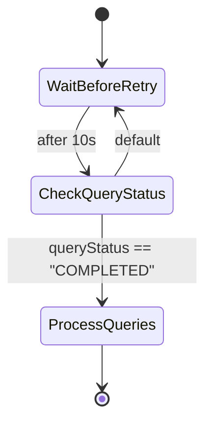

# Diagram: entity_core/entity_service/serverless.listener.yml

> Auto-generated by Obscura crawlers

## Diagram 1

```mermaid
flowchart TD
  API_GW[API Gateway]
  create_entity["Lambda: entity_created_hook\nPOST /solution/{solution_id}"]
  status_update["Lambda: status_update_created\nDELETE /solution/{solution_id}/entity/{entity_id}/status-update"]
  clear_pending["Lambda: clear_pending_dispatch\nDELETE /solution/{solution_id}/entity/{entity_id}/pending-dispatch"]
  API_GW --> create_entity
  API_GW --> status_update
  API_GW --> clear_pending

  subgraph SQS_Queues["SQS Queues"]
    q_lastpos["SQS: FIN-LastEntityColumnUpdated-EntityPositionUpdated.fifo"]
    q_entity_state["SQS: FIN-entity-state-machine"]
    q_archive["SQS: FIN-ArchiveEntity"]
    q_visibility["SQS: FIN-ProcessEntityVisibilityGrant"]
    q_state_change["SQS: FIN-ProcessEntityStateChange"]
    q_autocomplete["SQS: FIN-AutoCompleteEntity"]
    q_intermediate_eta["SQS: FIN-IntermediateEtaProcessor"]
    q_distance["SQS: FIN-DistanceToLocation"]
    q_initial_eta["SQS: FIN-UpdateEntityInitialEta.fifo"]
    q_current_loc["SQS: FIN-current-location-override.fifo"]
  end

  subgraph Lambdas["Lambda Consumers & Services"]
    lastpos_lambda["Lambda: entity_last_position_column_consumer"]
    state_machine_lambda["Lambda: entity_state_machine"]
    archival_lambda["Lambda: archival_processor_consumer"]
    visibility_lambda["Lambda: visibility_grant_processor"]
    state_change_lambda["Lambda: process_entity_state_change"]
    autocomplete_lambda["Lambda: entity_auto_completion_consumer"]
    intermediate_eta_lambda["Lambda: entity_intermediate_eta_processor_consumer"]
    distance_lambda["Lambda: entity_distance_to_location_consumer"]
    initial_eta_lambda["Lambda: entity_update_initial_eta_consumer"]
    current_loc_lambda["Lambda: current_location_override_entity"]
    read_forecast_lambda["Lambda: read_forecasted_capacity\n(cron)"]
    check_query_lambda["Lambda: check_query_status"]
    process_forecast_lambda["Lambda: process_forecasted_capacity"]
  end

  q_lastpos --> lastpos_lambda
  q_entity_state --> state_machine_lambda
  q_archive --> archival_lambda
  q_visibility --> visibility_lambda
  q_state_change --> state_change_lambda
  q_autocomplete --> autocomplete_lambda
  q_intermediate_eta --> intermediate_eta_lambda
  q_distance --> distance_lambda
  q_initial_eta --> initial_eta_lambda
  q_current_loc --> current_loc_lambda

  schedule["Schedule: cron(0 12 * * ? *)"] --> read_forecast_lambda
  read_forecast_lambda --> ForecastSM["Step Function: forecastedCapacityStateMachine"]
  ForecastSM --> check_query_lambda
  ForecastSM --> process_forecast_lambda

  subgraph Infra["Shared Infra"]
    layers["Lambda Layers: fv_layers"]
    iam["IAM Role & Policies"]
    vpc["VPC"]
  end

  layers --> Lambdas
  iam --> Lambdas
  vpc --> Lambdas
```

### SVG

<svg id="container" width="9652.15625" xmlns="http://www.w3.org/2000/svg" class="flowchart" height="602" viewBox="0 0 9652.15625 602" role="graphics-document document" aria-roledescription="flowchart-v2"><g><marker id="container_flowchart-v2-pointEnd" class="marker flowchart-v2" viewBox="0 0 10 10" refX="5" refY="5" markerUnits="userSpaceOnUse" markerWidth="8" markerHeight="8" orient="auto"><path d="M 0 0 L 10 5 L 0 10 z" class="arrowMarkerPath" style="stroke-width: 1; stroke-dasharray: 1, 0;"></path></marker><marker id="container_flowchart-v2-pointStart" class="marker flowchart-v2" viewBox="0 0 10 10" refX="4.5" refY="5" markerUnits="userSpaceOnUse" markerWidth="8" markerHeight="8" orient="auto"><path d="M 0 5 L 10 10 L 10 0 z" class="arrowMarkerPath" style="stroke-width: 1; stroke-dasharray: 1, 0;"></path></marker><marker id="container_flowchart-v2-circleEnd" class="marker flowchart-v2" viewBox="0 0 10 10" refX="11" refY="5" markerUnits="userSpaceOnUse" markerWidth="11" markerHeight="11" orient="auto"><circle cx="5" cy="5" r="5" class="arrowMarkerPath" style="stroke-width: 1; stroke-dasharray: 1, 0;"></circle></marker><marker id="container_flowchart-v2-circleStart" class="marker flowchart-v2" viewBox="0 0 10 10" refX="-1" refY="5" markerUnits="userSpaceOnUse" markerWidth="11" markerHeight="11" orient="auto"><circle cx="5" cy="5" r="5" class="arrowMarkerPath" style="stroke-width: 1; stroke-dasharray: 1, 0;"></circle></marker><marker id="container_flowchart-v2-crossEnd" class="marker cross flowchart-v2" viewBox="0 0 11 11" refX="12" refY="5.2" markerUnits="userSpaceOnUse" markerWidth="11" markerHeight="11" orient="auto"><path d="M 1,1 l 9,9 M 10,1 l -9,9" class="arrowMarkerPath" style="stroke-width: 2; stroke-dasharray: 1, 0;"></path></marker><marker id="container_flowchart-v2-crossStart" class="marker cross flowchart-v2" viewBox="0 0 11 11" refX="-1" refY="5.2" markerUnits="userSpaceOnUse" markerWidth="11" markerHeight="11" orient="auto"><path d="M 1,1 l 9,9 M 10,1 l -9,9" class="arrowMarkerPath" style="stroke-width: 2; stroke-dasharray: 1, 0;"></path></marker><g class="root"><g class="clusters"><g class="cluster" id="Infra" data-look="classic"><rect style="" x="8" y="289" width="696.15625" height="152"></rect><g class="cluster-label" transform="translate(311.671875, 289)"><foreignObject width="88.8125" height="24">

Shared Infra

</foreignObject></g></g><g class="cluster" id="Lambdas" data-look="classic"><rect style="" x="4170.78125" y="112" width="4218.28125" height="482"></rect><g class="cluster-label" transform="translate(6179.921875, 112)"><foreignObject width="200" height="48">

Lambda Consumers &amp; Services

</foreignObject></g></g><g class="cluster" id="SQS_Queues" data-look="classic"><rect style="" x="724.15625" y="289" width="3080.9375" height="152"></rect><g class="cluster-label" transform="translate(2220.953125, 289)"><foreignObject width="87.34375" height="24">

SQS Queues

</foreignObject></g></g></g><g class="edgePaths"><path d="M8876.609,44.797L8823.443,51.831C8770.276,58.865,8663.943,72.932,8610.776,84.133C8557.609,95.333,8557.609,103.667,8557.609,111.333C8557.609,119,8557.609,126,8557.609,129.5L8557.609,133" id="L_API_GW_create_entity_0" class="edge-thickness-normal edge-pattern-solid edge-thickness-normal edge-pattern-solid flowchart-link" style=";" data-edge="true" data-et="edge" data-id="L_API_GW_create_entity_0" data-points="W3sieCI6ODg3Ni42MDkzNzUsInkiOjQ0Ljc5NzIyMTI4MzYxNTkxfSx7IngiOjg1NTcuNjA5Mzc1LCJ5Ijo4N30seyJ4Ijo4NTU3LjYwOTM3NSwieSI6MTEyfSx7IngiOjg1NTcuNjA5Mzc1LCJ5IjoxMzd9XQ==" marker-end="url(#container_flowchart-v2-pointEnd)"></path><path d="M8950.664,62L8950.664,66.167C8950.664,70.333,8950.664,78.667,8950.664,87C8950.664,95.333,8950.664,103.667,8950.664,111.333C8950.664,119,8950.664,126,8950.664,129.5L8950.664,133" id="L_API_GW_status_update_0" class="edge-thickness-normal edge-pattern-solid edge-thickness-normal edge-pattern-solid flowchart-link" style=";" data-edge="true" data-et="edge" data-id="L_API_GW_status_update_0" data-points="W3sieCI6ODk1MC42NjQwNjI1LCJ5Ijo2Mn0seyJ4Ijo4OTUwLjY2NDA2MjUsInkiOjg3fSx7IngiOjg5NTAuNjY0MDYyNSwieSI6MTEyfSx7IngiOjg5NTAuNjY0MDYyNSwieSI6MTM3fV0=" marker-end="url(#container_flowchart-v2-pointEnd)"></path><path d="M9024.719,43.082L9091.793,50.401C9158.867,57.721,9293.016,72.361,9360.09,83.847C9427.164,95.333,9427.164,103.667,9427.164,111.333C9427.164,119,9427.164,126,9427.164,129.5L9427.164,133" id="L_API_GW_clear_pending_0" class="edge-thickness-normal edge-pattern-solid edge-thickness-normal edge-pattern-solid flowchart-link" style=";" data-edge="true" data-et="edge" data-id="L_API_GW_clear_pending_0" data-points="W3sieCI6OTAyNC43MTg3NSwieSI6NDMuMDgxNTE4ODg3NzIyOTh9LHsieCI6OTQyNy4xNjQwNjI1LCJ5Ijo4N30seyJ4Ijo5NDI3LjE2NDA2MjUsInkiOjExMn0seyJ4Ijo5NDI3LjE2NDA2MjUsInkiOjEzN31d" marker-end="url(#container_flowchart-v2-pointEnd)"></path><path d="M889.156,416L889.156,420.167C889.156,424.333,889.156,432.667,1500.101,441C2111.046,449.333,3332.935,457.667,3933.025,465.773C4533.116,473.878,4511.407,481.757,4500.553,485.696L4489.698,489.635" id="L_q_lastpos_lastpos_lambda_0" class="edge-thickness-normal edge-pattern-solid edge-thickness-normal edge-pattern-solid flowchart-link" style=";" data-edge="true" data-et="edge" data-id="L_q_lastpos_lastpos_lambda_0" data-points="W3sieCI6ODg5LjE1NjI1LCJ5Ijo0MTZ9LHsieCI6ODg5LjE1NjI1LCJ5Ijo0NDF9LHsieCI6NDU1NC44MjQyMTg3NSwieSI6NDY2fSx7IngiOjQ0ODUuOTM4NDE1NTI3MzQ0LCJ5Ijo0OTF9XQ==" marker-end="url(#container_flowchart-v2-pointEnd)"></path><path d="M1199.156,404L1199.156,410.167C1199.156,416.333,1199.156,428.667,1787.826,439C2376.495,449.333,3553.833,457.667,4142.503,465.333C4731.172,473,4731.172,480,4731.172,483.5L4731.172,487" id="L_q_entity_state_state_machine_lambda_0" class="edge-thickness-normal edge-pattern-solid edge-thickness-normal edge-pattern-solid flowchart-link" style=";" data-edge="true" data-et="edge" data-id="L_q_entity_state_state_machine_lambda_0" data-points="W3sieCI6MTE5OS4xNTYyNSwieSI6NDA0fSx7IngiOjExOTkuMTU2MjUsInkiOjQ0MX0seyJ4Ijo0NzMxLjE3MTg3NSwieSI6NDY2fSx7IngiOjQ3MzEuMTcxODc1LCJ5Ijo0OTF9XQ==" marker-end="url(#container_flowchart-v2-pointEnd)"></path><path d="M1489.625,392L1489.625,400.167C1489.625,408.333,1489.625,424.667,2082.729,437C2675.833,449.333,3862.042,457.667,4455.146,465.333C5048.25,473,5048.25,480,5048.25,483.5L5048.25,487" id="L_q_archive_archival_lambda_0" class="edge-thickness-normal edge-pattern-solid edge-thickness-normal edge-pattern-solid flowchart-link" style=";" data-edge="true" data-et="edge" data-id="L_q_archive_archival_lambda_0" data-points="W3sieCI6MTQ4OS42MjUsInkiOjM5Mn0seyJ4IjoxNDg5LjYyNSwieSI6NDQxfSx7IngiOjUwNDguMjUsInkiOjQ2Nn0seyJ4Ijo1MDQ4LjI1LCJ5Ijo0OTF9XQ==" marker-end="url(#container_flowchart-v2-pointEnd)"></path><path d="M1780.094,404L1780.094,410.167C1780.094,416.333,1780.094,428.667,2377.633,439C2975.172,449.333,4170.25,457.667,4767.789,465.333C5365.328,473,5365.328,480,5365.328,483.5L5365.328,487" id="L_q_visibility_visibility_lambda_0" class="edge-thickness-normal edge-pattern-solid edge-thickness-normal edge-pattern-solid flowchart-link" style=";" data-edge="true" data-et="edge" data-id="L_q_visibility_visibility_lambda_0" data-points="W3sieCI6MTc4MC4wOTM3NSwieSI6NDA0fSx7IngiOjE3ODAuMDkzNzUsInkiOjQ0MX0seyJ4Ijo1MzY1LjMyODEyNSwieSI6NDY2fSx7IngiOjUzNjUuMzI4MTI1LCJ5Ijo0OTF9XQ==" marker-end="url(#container_flowchart-v2-pointEnd)"></path><path d="M2090.094,404L2090.094,410.167C2090.094,416.333,2090.094,428.667,2688.341,439C3286.589,449.333,4483.083,457.667,5081.331,465.333C5679.578,473,5679.578,480,5679.578,483.5L5679.578,487" id="L_q_state_change_state_change_lambda_0" class="edge-thickness-normal edge-pattern-solid edge-thickness-normal edge-pattern-solid flowchart-link" style=";" data-edge="true" data-et="edge" data-id="L_q_state_change_state_change_lambda_0" data-points="W3sieCI6MjA5MC4wOTM3NSwieSI6NDA0fSx7IngiOjIwOTAuMDkzNzUsInkiOjQ0MX0seyJ4Ijo1Njc5LjU3ODEyNSwieSI6NDY2fSx7IngiOjU2NzkuNTc4MTI1LCJ5Ijo0OTF9XQ==" marker-end="url(#container_flowchart-v2-pointEnd)"></path><path d="M2400.094,404L2400.094,410.167C2400.094,416.333,2400.094,428.667,3003.358,439C3606.622,449.333,4813.151,457.667,5416.415,465.333C6019.68,473,6019.68,480,6019.68,483.5L6019.68,487" id="L_q_autocomplete_autocomplete_lambda_0" class="edge-thickness-normal edge-pattern-solid edge-thickness-normal edge-pattern-solid flowchart-link" style=";" data-edge="true" data-et="edge" data-id="L_q_autocomplete_autocomplete_lambda_0" data-points="W3sieCI6MjQwMC4wOTM3NSwieSI6NDA0fSx7IngiOjI0MDAuMDkzNzUsInkiOjQ0MX0seyJ4Ijo2MDE5LjY3OTY4NzUsInkiOjQ2Nn0seyJ4Ijo2MDE5LjY3OTY4NzUsInkiOjQ5MX1d" marker-end="url(#container_flowchart-v2-pointEnd)"></path><path d="M2710.094,404L2710.094,410.167C2710.094,416.333,2710.094,428.667,3328.643,439C3947.193,449.333,5184.292,457.667,5802.841,465.333C6421.391,473,6421.391,480,6421.391,483.5L6421.391,487" id="L_q_intermediate_eta_intermediate_eta_lambda_0" class="edge-thickness-normal edge-pattern-solid edge-thickness-normal edge-pattern-solid flowchart-link" style=";" data-edge="true" data-et="edge" data-id="L_q_intermediate_eta_intermediate_eta_lambda_0" data-points="W3sieCI6MjcxMC4wOTM3NSwieSI6NDA0fSx7IngiOjI3MTAuMDkzNzUsInkiOjQ0MX0seyJ4Ijo2NDIxLjM5MDYyNSwieSI6NDY2fSx7IngiOjY0MjEuMzkwNjI1LCJ5Ijo0OTF9XQ==" marker-end="url(#container_flowchart-v2-pointEnd)"></path><path d="M3020.094,404L3020.094,410.167C3020.094,416.333,3020.094,428.667,3656.27,439C4292.445,449.333,5564.797,457.667,6200.973,465.333C6837.148,473,6837.148,480,6837.148,483.5L6837.148,487" id="L_q_distance_distance_lambda_0" class="edge-thickness-normal edge-pattern-solid edge-thickness-normal edge-pattern-solid flowchart-link" style=";" data-edge="true" data-et="edge" data-id="L_q_distance_distance_lambda_0" data-points="W3sieCI6MzAyMC4wOTM3NSwieSI6NDA0fSx7IngiOjMwMjAuMDkzNzUsInkiOjQ0MX0seyJ4Ijo2ODM3LjE0ODQzNzUsInkiOjQ2Nn0seyJ4Ijo2ODM3LjE0ODQzNzUsInkiOjQ5MX1d" marker-end="url(#container_flowchart-v2-pointEnd)"></path><path d="M3330.094,404L3330.094,410.167C3330.094,416.333,3330.094,428.667,3978.025,439C4625.956,449.333,5921.818,457.667,6569.749,465.333C7217.68,473,7217.68,480,7217.68,483.5L7217.68,487" id="L_q_initial_eta_initial_eta_lambda_0" class="edge-thickness-normal edge-pattern-solid edge-thickness-normal edge-pattern-solid flowchart-link" style=";" data-edge="true" data-et="edge" data-id="L_q_initial_eta_initial_eta_lambda_0" data-points="W3sieCI6MzMzMC4wOTM3NSwieSI6NDA0fSx7IngiOjMzMzAuMDkzNzUsInkiOjQ0MX0seyJ4Ijo3MjE3LjY3OTY4NzUsInkiOjQ2Nn0seyJ4Ijo3MjE3LjY3OTY4NzUsInkiOjQ5MX1d" marker-end="url(#container_flowchart-v2-pointEnd)"></path><path d="M3640.094,404L3640.094,410.167C3640.094,416.333,3640.094,428.667,4296.333,439C4952.573,449.333,6265.052,457.667,6921.292,465.333C7577.531,473,7577.531,480,7577.531,483.5L7577.531,487" id="L_q_current_loc_current_loc_lambda_0" class="edge-thickness-normal edge-pattern-solid edge-thickness-normal edge-pattern-solid flowchart-link" style=";" data-edge="true" data-et="edge" data-id="L_q_current_loc_current_loc_lambda_0" data-points="W3sieCI6MzY0MC4wOTM3NSwieSI6NDA0fSx7IngiOjM2NDAuMDkzNzUsInkiOjQ0MX0seyJ4Ijo3NTc3LjUzMTI1LCJ5Ijo0NjZ9LHsieCI6NzU3Ny41MzEyNSwieSI6NDkxfV0=" marker-end="url(#container_flowchart-v2-pointEnd)"></path><path d="M6279.922,62L6279.922,66.167C6279.922,70.333,6279.922,78.667,6279.922,87C6279.922,95.333,6279.922,103.667,6279.922,113.333C6279.922,123,6279.922,134,6279.922,139.5L6279.922,145" id="L_schedule_read_forecast_lambda_0" class="edge-thickness-normal edge-pattern-solid edge-thickness-normal edge-pattern-solid flowchart-link" style=";" data-edge="true" data-et="edge" data-id="L_schedule_read_forecast_lambda_0" data-points="W3sieCI6NjI3OS45MjE4NzUsInkiOjYyfSx7IngiOjYyNzkuOTIxODc1LCJ5Ijo4N30seyJ4Ijo2Mjc5LjkyMTg3NSwieSI6MTEyfSx7IngiOjYyNzkuOTIxODc1LCJ5IjoxNDl9XQ==" marker-end="url(#container_flowchart-v2-pointEnd)"></path><path d="M6279.922,227L6279.922,233.167C6279.922,239.333,6279.922,251.667,6279.922,262C6279.922,272.333,6279.922,280.667,5923.231,296.661C5566.541,312.655,4853.16,336.31,4496.47,348.138L4139.779,359.965" id="L_read_forecast_lambda_ForecastSM_0" class="edge-thickness-normal edge-pattern-solid edge-thickness-normal edge-pattern-solid flowchart-link" style=";" data-edge="true" data-et="edge" data-id="L_read_forecast_lambda_ForecastSM_0" data-points="W3sieCI6NjI3OS45MjE4NzUsInkiOjIyN30seyJ4Ijo2Mjc5LjkyMTg3NSwieSI6MjY0fSx7IngiOjYyNzkuOTIxODc1LCJ5IjoyODl9LHsieCI6NDEzNS43ODEyNSwieSI6MzYwLjA5NzY0MzI4MTI3MjR9XQ==" marker-end="url(#container_flowchart-v2-pointEnd)"></path><path d="M4135.781,367.867L4764.276,380.056C5392.771,392.245,6649.76,416.622,7278.255,432.978C7906.75,449.333,7906.75,457.667,7906.75,465.333C7906.75,473,7906.75,480,7906.75,483.5L7906.75,487" id="L_ForecastSM_check_query_lambda_0" class="edge-thickness-normal edge-pattern-solid edge-thickness-normal edge-pattern-solid flowchart-link" style=";" data-edge="true" data-et="edge" data-id="L_ForecastSM_check_query_lambda_0" data-points="W3sieCI6NDEzNS43ODEyNSwieSI6MzY3Ljg2NzIyNjk5Nzk3NDV9LHsieCI6NzkwNi43NSwieSI6NDQxfSx7IngiOjc5MDYuNzUsInkiOjQ2Nn0seyJ4Ijo3OTA2Ljc1LCJ5Ijo0OTF9XQ==" marker-end="url(#container_flowchart-v2-pointEnd)"></path><path d="M4135.781,367.655L4816.552,379.879C5497.323,392.103,6858.865,416.552,7539.635,432.942C8220.406,449.333,8220.406,457.667,8220.406,465.333C8220.406,473,8220.406,480,8220.406,483.5L8220.406,487" id="L_ForecastSM_process_forecast_lambda_0" class="edge-thickness-normal edge-pattern-solid edge-thickness-normal edge-pattern-solid flowchart-link" style=";" data-edge="true" data-et="edge" data-id="L_ForecastSM_process_forecast_lambda_0" data-points="W3sieCI6NDEzNS43ODEyNSwieSI6MzY3LjY1NDc0NDk0MDUyNjd9LHsieCI6ODIyMC40MDYyNSwieSI6NDQxfSx7IngiOjgyMjAuNDA2MjUsInkiOjQ2Nn0seyJ4Ijo4MjIwLjQwNjI1LCJ5Ijo0OTF9XQ==" marker-end="url(#container_flowchart-v2-pointEnd)"></path><path d="M548.93,392L548.93,400.167C548.93,408.333,548.93,424.667,1151.905,433.213C1754.88,441.76,2960.831,442.521,3563.806,442.901L4166.781,443.281" id="L_layers_Lambdas_0" class="edge-thickness-normal edge-pattern-solid edge-thickness-normal edge-pattern-solid flowchart-link" style=";" data-edge="true" data-et="edge" data-id="L_layers_Lambdas_0" data-points="W3sieCI6NTQ4LjkyOTY4NzUsInkiOjM5Mn0seyJ4Ijo1NDguOTI5Njg3NSwieSI6NDQxfSx7IngiOjQ1MzQuODI0MjE4NzUsInkiOjQ2Nn0seyJ4Ijo0NDczLjc1MDkxNTUyNzM0NCwieSI6NDkxfV0=" marker-end="url(#container_flowchart-v2-pointEnd)"></path><path d="M279.43,392L279.43,400.167C279.43,408.333,279.43,424.667,927.322,432.962C1575.214,441.257,2870.997,441.514,3518.889,441.642L4166.781,441.77" id="L_iam_Lambdas_0" class="edge-thickness-normal edge-pattern-solid edge-thickness-normal edge-pattern-solid flowchart-link" style=";" data-edge="true" data-et="edge" data-id="L_iam_Lambdas_0" data-points="W3sieCI6Mjc5LjQyOTY4NzUsInkiOjM5Mn0seyJ4IjoyNzkuNDI5Njg3NSwieSI6NDQxfSx7IngiOjQyOTQuNjI4OTA2MjUsInkiOjQ2Nn0seyJ4Ijo0MzI3LjM4MTg5Njk3MjY1NiwieSI6NDkxfV0=" marker-end="url(#container_flowchart-v2-pointEnd)"></path><path d="M86.578,392L86.578,400.167C86.578,408.333,86.578,424.667,766.612,432.937C1446.646,441.206,2806.714,441.413,3486.747,441.516L4166.781,441.619" id="L_vpc_Lambdas_0" class="edge-thickness-normal edge-pattern-solid edge-thickness-normal edge-pattern-solid flowchart-link" style=";" data-edge="true" data-et="edge" data-id="L_vpc_Lambdas_0" data-points="W3sieCI6ODYuNTc4MTI1LCJ5IjozOTJ9LHsieCI6ODYuNTc4MTI1LCJ5Ijo0NDF9LHsieCI6NDI3NC42Mjg5MDYyNSwieSI6NDY2fSx7IngiOjQzMTUuMTk0Mzk2OTcyNjU2LCJ5Ijo0OTF9XQ==" marker-end="url(#container_flowchart-v2-pointEnd)"></path></g><g class="edgeLabels"><g class="edgeLabel"><g class="label" data-id="L_API_GW_create_entity_0" transform="translate(0, 0)"><foreignObject width="0" height="0">

</foreignObject></g></g><g class="edgeLabel"><g class="label" data-id="L_API_GW_status_update_0" transform="translate(0, 0)"><foreignObject width="0" height="0">

</foreignObject></g></g><g class="edgeLabel"><g class="label" data-id="L_API_GW_clear_pending_0" transform="translate(0, 0)"><foreignObject width="0" height="0">

</foreignObject></g></g><g class="edgeLabel"><g class="label" data-id="L_q_lastpos_lastpos_lambda_0" transform="translate(0, 0)"><foreignObject width="0" height="0">

</foreignObject></g></g><g class="edgeLabel"><g class="label" data-id="L_q_entity_state_state_machine_lambda_0" transform="translate(0, 0)"><foreignObject width="0" height="0">

</foreignObject></g></g><g class="edgeLabel"><g class="label" data-id="L_q_archive_archival_lambda_0" transform="translate(0, 0)"><foreignObject width="0" height="0">

</foreignObject></g></g><g class="edgeLabel"><g class="label" data-id="L_q_visibility_visibility_lambda_0" transform="translate(0, 0)"><foreignObject width="0" height="0">

</foreignObject></g></g><g class="edgeLabel"><g class="label" data-id="L_q_state_change_state_change_lambda_0" transform="translate(0, 0)"><foreignObject width="0" height="0">

</foreignObject></g></g><g class="edgeLabel"><g class="label" data-id="L_q_autocomplete_autocomplete_lambda_0" transform="translate(0, 0)"><foreignObject width="0" height="0">

</foreignObject></g></g><g class="edgeLabel"><g class="label" data-id="L_q_intermediate_eta_intermediate_eta_lambda_0" transform="translate(0, 0)"><foreignObject width="0" height="0">

</foreignObject></g></g><g class="edgeLabel"><g class="label" data-id="L_q_distance_distance_lambda_0" transform="translate(0, 0)"><foreignObject width="0" height="0">

</foreignObject></g></g><g class="edgeLabel"><g class="label" data-id="L_q_initial_eta_initial_eta_lambda_0" transform="translate(0, 0)"><foreignObject width="0" height="0">

</foreignObject></g></g><g class="edgeLabel"><g class="label" data-id="L_q_current_loc_current_loc_lambda_0" transform="translate(0, 0)"><foreignObject width="0" height="0">

</foreignObject></g></g><g class="edgeLabel"><g class="label" data-id="L_schedule_read_forecast_lambda_0" transform="translate(0, 0)"><foreignObject width="0" height="0">

</foreignObject></g></g><g class="edgeLabel"><g class="label" data-id="L_read_forecast_lambda_ForecastSM_0" transform="translate(0, 0)"><foreignObject width="0" height="0">

</foreignObject></g></g><g class="edgeLabel"><g class="label" data-id="L_ForecastSM_check_query_lambda_0" transform="translate(0, 0)"><foreignObject width="0" height="0">

</foreignObject></g></g><g class="edgeLabel"><g class="label" data-id="L_ForecastSM_process_forecast_lambda_0" transform="translate(0, 0)"><foreignObject width="0" height="0">

</foreignObject></g></g><g class="edgeLabel"><g class="label" data-id="L_layers_Lambdas_0" transform="translate(0, 0)"><foreignObject width="0" height="0">

</foreignObject></g></g><g class="edgeLabel"><g class="label" data-id="L_iam_Lambdas_0" transform="translate(0, 0)"><foreignObject width="0" height="0">

</foreignObject></g></g><g class="edgeLabel"><g class="label" data-id="L_vpc_Lambdas_0" transform="translate(0, 0)"><foreignObject width="0" height="0">

</foreignObject></g></g></g><g class="nodes"><g class="node default" id="flowchart-API_GW-0" transform="translate(8950.6640625, 35)"><rect class="basic label-container" style="" x="-74.0546875" y="-27" width="148.109375" height="54"></rect><g class="label" style="" transform="translate(-44.0546875, -12)"><rect></rect><foreignObject width="88.109375" height="24">

API Gateway

</foreignObject></g></g><g class="node default" id="flowchart-create_entity-1" transform="translate(8557.609375, 188)"><rect class="basic label-container" style="" x="-133.546875" y="-51" width="267.09375" height="102"></rect><g class="label" style="" transform="translate(-103.546875, -36)"><rect></rect><foreignObject width="207.09375" height="72">

Lambda: entity_created_hook\nPOST /solution/{solution_id}

</foreignObject></g></g><g class="node default" id="flowchart-status_update-2" transform="translate(8950.6640625, 188)"><rect class="basic label-container" style="" x="-209.5078125" y="-51" width="419.015625" height="102"></rect><g class="label" style="" transform="translate(-179.5078125, -36)"><rect></rect><foreignObject width="359.015625" height="72">

Lambda: status_update_created\nDELETE /solution/{solution_id}/entity/{entity_id}/status-update

</foreignObject></g></g><g class="node default" id="flowchart-clear_pending-3" transform="translate(9427.1640625, 188)"><rect class="basic label-container" style="" x="-216.9921875" y="-51" width="433.984375" height="102"></rect><g class="label" style="" transform="translate(-186.9921875, -36)"><rect></rect><foreignObject width="373.984375" height="72">

Lambda: clear_pending_dispatch\nDELETE /solution/{solution_id}/entity/{entity_id}/pending-dispatch

</foreignObject></g></g><g class="node default" id="flowchart-q_lastpos-10" transform="translate(889.15625, 365)"><rect class="basic label-container" style="" x="-130" y="-51" width="260" height="102"></rect><g class="label" style="" transform="translate(-100, -36)"><rect></rect><foreignObject width="200" height="72">

SQS: FIN-LastEntityColumnUpdated-EntityPositionUpdated.fifo

</foreignObject></g></g><g class="node default" id="flowchart-q_entity_state-11" transform="translate(1199.15625, 365)"><rect class="basic label-container" style="" x="-130" y="-39" width="260" height="78"></rect><g class="label" style="" transform="translate(-100, -24)"><rect></rect><foreignObject width="200" height="48">

SQS: FIN-entity-state-machine

</foreignObject></g></g><g class="node default" id="flowchart-q_archive-12" transform="translate(1489.625, 365)"><rect class="basic label-container" style="" x="-110.46875" y="-27" width="220.9375" height="54"></rect><g class="label" style="" transform="translate(-80.46875, -12)"><rect></rect><foreignObject width="160.9375" height="24">

SQS: FIN-ArchiveEntity

</foreignObject></g></g><g class="node default" id="flowchart-q_visibility-13" transform="translate(1780.09375, 365)"><rect class="basic label-container" style="" x="-130" y="-39" width="260" height="78"></rect><g class="label" style="" transform="translate(-100, -24)"><rect></rect><foreignObject width="200" height="48">

SQS: FIN-ProcessEntityVisibilityGrant

</foreignObject></g></g><g class="node default" id="flowchart-q_state_change-14" transform="translate(2090.09375, 365)"><rect class="basic label-container" style="" x="-130" y="-39" width="260" height="78"></rect><g class="label" style="" transform="translate(-100, -24)"><rect></rect><foreignObject width="200" height="48">

SQS: FIN-ProcessEntityStateChange

</foreignObject></g></g><g class="node default" id="flowchart-q_autocomplete-15" transform="translate(2400.09375, 365)"><rect class="basic label-container" style="" x="-130" y="-39" width="260" height="78"></rect><g class="label" style="" transform="translate(-100, -24)"><rect></rect><foreignObject width="200" height="48">

SQS: FIN-AutoCompleteEntity

</foreignObject></g></g><g class="node default" id="flowchart-q_intermediate_eta-16" transform="translate(2710.09375, 365)"><rect class="basic label-container" style="" x="-130" y="-39" width="260" height="78"></rect><g class="label" style="" transform="translate(-100, -24)"><rect></rect><foreignObject width="200" height="48">

SQS: FIN-IntermediateEtaProcessor

</foreignObject></g></g><g class="node default" id="flowchart-q_distance-17" transform="translate(3020.09375, 365)"><rect class="basic label-container" style="" x="-130" y="-39" width="260" height="78"></rect><g class="label" style="" transform="translate(-100, -24)"><rect></rect><foreignObject width="200" height="48">

SQS: FIN-DistanceToLocation

</foreignObject></g></g><g class="node default" id="flowchart-q_initial_eta-18" transform="translate(3330.09375, 365)"><rect class="basic label-container" style="" x="-130" y="-39" width="260" height="78"></rect><g class="label" style="" transform="translate(-100, -24)"><rect></rect><foreignObject width="200" height="48">

SQS: FIN-UpdateEntityInitialEta.fifo

</foreignObject></g></g><g class="node default" id="flowchart-q_current_loc-19" transform="translate(3640.09375, 365)"><rect class="basic label-container" style="" x="-130" y="-39" width="260" height="78"></rect><g class="label" style="" transform="translate(-100, -24)"><rect></rect><foreignObject width="200" height="48">

SQS: FIN-current-location-override.fifo

</foreignObject></g></g><g class="node default" id="flowchart-lastpos_lambda-20" transform="translate(4378.4765625, 530)"><rect class="basic label-container" style="" x="-172.6953125" y="-39" width="345.390625" height="78"></rect><g class="label" style="" transform="translate(-142.6953125, -24)"><rect></rect><foreignObject width="285.390625" height="48">

Lambda: entity_last_position_column_consumer

</foreignObject></g></g><g class="node default" id="flowchart-state_machine_lambda-21" transform="translate(4731.171875, 530)"><rect class="basic label-container" style="" x="-130" y="-39" width="260" height="78"></rect><g class="label" style="" transform="translate(-100, -24)"><rect></rect><foreignObject width="200" height="48">

Lambda: entity_state_machine

</foreignObject></g></g><g class="node default" id="flowchart-archival_lambda-22" transform="translate(5048.25, 530)"><rect class="basic label-container" style="" x="-137.078125" y="-39" width="274.15625" height="78"></rect><g class="label" style="" transform="translate(-107.078125, -24)"><rect></rect><foreignObject width="214.15625" height="48">

Lambda: archival_processor_consumer

</foreignObject></g></g><g class="node default" id="flowchart-visibility_lambda-23" transform="translate(5365.328125, 530)"><rect class="basic label-container" style="" x="-130" y="-39" width="260" height="78"></rect><g class="label" style="" transform="translate(-100, -24)"><rect></rect><foreignObject width="200" height="48">

Lambda: visibility_grant_processor

</foreignObject></g></g><g class="node default" id="flowchart-state_change_lambda-24" transform="translate(5679.578125, 530)"><rect class="basic label-container" style="" x="-134.25" y="-39" width="268.5" height="78"></rect><g class="label" style="" transform="translate(-104.25, -24)"><rect></rect><foreignObject width="208.5" height="48">

Lambda: process_entity_state_change

</foreignObject></g></g><g class="node default" id="flowchart-autocomplete_lambda-25" transform="translate(6019.6796875, 530)"><rect class="basic label-container" style="" x="-155.8515625" y="-39" width="311.703125" height="78"></rect><g class="label" style="" transform="translate(-125.8515625, -24)"><rect></rect><foreignObject width="251.703125" height="48">

Lambda: entity_auto_completion_consumer

</foreignObject></g></g><g class="node default" id="flowchart-intermediate_eta_lambda-26" transform="translate(6421.390625, 530)"><rect class="basic label-container" style="" x="-195.859375" y="-39" width="391.71875" height="78"></rect><g class="label" style="" transform="translate(-165.859375, -24)"><rect></rect><foreignObject width="331.71875" height="48">

Lambda: entity_intermediate_eta_processor_consumer

</foreignObject></g></g><g class="node default" id="flowchart-distance_lambda-27" transform="translate(6837.1484375, 530)"><rect class="basic label-container" style="" x="-169.8984375" y="-39" width="339.796875" height="78"></rect><g class="label" style="" transform="translate(-139.8984375, -24)"><rect></rect><foreignObject width="279.796875" height="48">

Lambda: entity_distance_to_location_consumer

</foreignObject></g></g><g class="node default" id="flowchart-initial_eta_lambda-28" transform="translate(7217.6796875, 530)"><rect class="basic label-container" style="" x="-160.6328125" y="-39" width="321.265625" height="78"></rect><g class="label" style="" transform="translate(-130.6328125, -24)"><rect></rect><foreignObject width="261.265625" height="48">

Lambda: entity_update_initial_eta_consumer

</foreignObject></g></g><g class="node default" id="flowchart-current_loc_lambda-29" transform="translate(7577.53125, 530)"><rect class="basic label-container" style="" x="-149.21875" y="-39" width="298.4375" height="78"></rect><g class="label" style="" transform="translate(-119.21875, -24)"><rect></rect><foreignObject width="238.4375" height="48">

Lambda: current_location_override_entity

</foreignObject></g></g><g class="node default" id="flowchart-read_forecast_lambda-30" transform="translate(6279.921875, 188)"><rect class="basic label-container" style="" x="-152.296875" y="-39" width="304.59375" height="78"></rect><g class="label" style="" transform="translate(-122.296875, -24)"><rect></rect><foreignObject width="244.59375" height="48">

Lambda: read_forecasted_capacity\n(cron)

</foreignObject></g></g><g class="node default" id="flowchart-check_query_lambda-31" transform="translate(7906.75, 530)"><rect class="basic label-container" style="" x="-130" y="-39" width="260" height="78"></rect><g class="label" style="" transform="translate(-100, -24)"><rect></rect><foreignObject width="200" height="48">

Lambda: check_query_status

</foreignObject></g></g><g class="node default" id="flowchart-process_forecast_lambda-32" transform="translate(8220.40625, 530)"><rect class="basic label-container" style="" x="-133.65625" y="-39" width="267.3125" height="78"></rect><g class="label" style="" transform="translate(-103.65625, -24)"><rect></rect><foreignObject width="207.3125" height="48">

Lambda: process_forecasted_capacity

</foreignObject></g></g><g class="node default" id="flowchart-schedule-53" transform="translate(6279.921875, 35)"><rect class="basic label-container" style="" x="-125.2890625" y="-27" width="250.578125" height="54"></rect><g class="label" style="" transform="translate(-95.2890625, -12)"><rect></rect><foreignObject width="190.578125" height="24">

Schedule: cron(0 12 * * ? *)

</foreignObject></g></g><g class="node default" id="flowchart-ForecastSM-56" transform="translate(3987.9375, 365)"><rect class="basic label-container" style="" x="-147.84375" y="-39" width="295.6875" height="78"></rect><g class="label" style="" transform="translate(-117.84375, -24)"><rect></rect><foreignObject width="235.6875" height="48">

Step Function: forecastedCapacityStateMachine

</foreignObject></g></g><g class="node default" id="flowchart-layers-61" transform="translate(548.9296875, 365)"><rect class="basic label-container" style="" x="-120.2265625" y="-27" width="240.453125" height="54"></rect><g class="label" style="" transform="translate(-90.2265625, -12)"><rect></rect><foreignObject width="180.453125" height="24">

Lambda Layers: fv_layers

</foreignObject></g></g><g class="node default" id="flowchart-iam-62" transform="translate(279.4296875, 365)"><rect class="basic label-container" style="" x="-99.2734375" y="-27" width="198.546875" height="54"></rect><g class="label" style="" transform="translate(-69.2734375, -12)"><rect></rect><foreignObject width="138.546875" height="24">

IAM Role &amp; Policies

</foreignObject></g></g><g class="node default" id="flowchart-vpc-63" transform="translate(86.578125, 365)"><rect class="basic label-container" style="" x="-43.578125" y="-27" width="87.15625" height="54"></rect><g class="label" style="" transform="translate(-13.578125, -12)"><rect></rect><foreignObject width="27.15625" height="24">

VPC

</foreignObject></g></g></g></g></g></svg>

## Diagram 2

### SVG

<svg id="container" width="216" xmlns="http://www.w3.org/2000/svg" class="statediagram" height="436" viewBox="0 0 216 436" role="graphics-document document" aria-roledescription="stateDiagram"><g><defs><marker id="container_stateDiagram-barbEnd" refX="19" refY="7" markerWidth="20" markerHeight="14" markerUnits="userSpaceOnUse" orient="auto"><path d="M 19,7 L9,13 L14,7 L9,1 Z"></path></marker></defs><g class="root"><g class="clusters"></g><g class="edgePaths"><path d="M108,22L108,26.167C108,30.333,108,38.667,108.083,47.083C108.167,55.5,108.333,64,108.417,68.25L108.5,72.5" id="edge0" class="edge-thickness-normal edge-pattern-solid transition" style="fill:none;;;fill:none" data-edge="true" data-et="edge" data-id="edge0" data-points="W3sieCI6MTA4LCJ5IjoyMn0seyJ4IjoxMDgsInkiOjQ3fSx7IngiOjEwOC41LCJ5Ijo3Mi41fV0=" marker-end="url(#container_stateDiagram-barbEnd)"></path><path d="M95.004,112.5L90.759,118.583C86.514,124.667,78.025,136.833,78.025,149.167C78.025,161.5,86.514,174,90.759,180.25L95.004,186.5" id="edge1" class="edge-thickness-normal edge-pattern-solid transition" style="fill:none;;;fill:none" data-edge="true" data-et="edge" data-id="edge1" data-points="W3sieCI6OTUuMDAzNTYzNTk2NDkxMjMsInkiOjExMi41fSx7IngiOjY5LjUzNTE1NjI1LCJ5IjoxNDl9LHsieCI6OTUuMDAzNTYzNTk2NDkxMjMsInkiOjE4Ni41fV0=" marker-end="url(#container_stateDiagram-barbEnd)"></path><path d="M108.5,226.5L108.417,234.583C108.333,242.667,108.167,258.833,108.167,275.167C108.167,291.5,108.333,308,108.417,316.25L108.5,324.5" id="edge2" class="edge-thickness-normal edge-pattern-solid transition" style="fill:none;;;fill:none" data-edge="true" data-et="edge" data-id="edge2" data-points="W3sieCI6MTA4LjUsInkiOjIyNi41fSx7IngiOjEwOCwieSI6Mjc1fSx7IngiOjEwOC41LCJ5IjozMjQuNX1d" marker-end="url(#container_stateDiagram-barbEnd)"></path><path d="M121.996,186.5L126.075,180.25C130.153,174,138.309,161.5,138.309,149.167C138.309,136.833,130.153,124.667,126.075,118.583L121.996,112.5" id="edge3" class="edge-thickness-normal edge-pattern-solid transition" style="fill:none;;;fill:none" data-edge="true" data-et="edge" data-id="edge3" data-points="W3sieCI6MTIxLjk5NjQzNjQwMzUwODc3LCJ5IjoxODYuNX0seyJ4IjoxNDYuNDY0ODQzNzUsInkiOjE0OX0seyJ4IjoxMjEuOTk2NDM2NDAzNTA4NzcsInkiOjExMi41fV0=" marker-end="url(#container_stateDiagram-barbEnd)"></path><path d="M108.5,364.5L108.417,368.583C108.333,372.667,108.167,380.833,108.083,389.083C108,397.333,108,405.667,108,409.833L108,414" id="edge4" class="edge-thickness-normal edge-pattern-solid transition" style="fill:none;;;fill:none" data-edge="true" data-et="edge" data-id="edge4" data-points="W3sieCI6MTA4LjUsInkiOjM2NC41fSx7IngiOjEwOCwieSI6Mzg5fSx7IngiOjEwOCwieSI6NDE0fV0=" marker-end="url(#container_stateDiagram-barbEnd)"></path></g><g class="edgeLabels"><g class="edgeLabel"><g class="label" data-id="edge0" transform="translate(0, 0)"><foreignObject width="0" height="0">

</foreignObject></g></g><g class="edgeLabel" transform="translate(69.53515625, 149)"><g class="label" data-id="edge1" transform="translate(-31.0390625, -12)"><foreignObject width="62.078125" height="24">

after 10s

</foreignObject></g></g><g class="edgeLabel" transform="translate(108, 275)"><g class="label" data-id="edge2" transform="translate(-100, -24)"><foreignObject width="200" height="48">

queryStatus == "COMPLETED"

</foreignObject></g></g><g class="edgeLabel" transform="translate(146.46484375, 149)"><g class="label" data-id="edge3" transform="translate(-25.890625, -12)"><foreignObject width="51.78125" height="24">

default

</foreignObject></g></g><g class="edgeLabel"><g class="label" data-id="edge4" transform="translate(0, 0)"><foreignObject width="0" height="0">

</foreignObject></g></g></g><g class="nodes"><g class="node default" id="state-root_start-0" transform="translate(108, 15)"><circle class="state-start" r="7" width="14" height="14"></circle></g><g class="node  statediagram-state" id="state-WaitBeforeRetry-3" transform="translate(108, 92)"><g class="basic label-container outer-path"><path d="M-61.5625 -20 C-16.450949439936096 -20, 28.660601120127808 -20, 61.5625 -20 C61.5625 -20, 61.5625 -20, 61.5625 -20 C61.66956737046364 -19.995571660801083, 61.77663474092728 -19.991143321602166, 61.97539672736166 -19.982922465033347 C62.05860576589238 -19.9725504691971, 62.1418148044231 -19.96217847336085, 62.38547295140367 -19.931806517013612 C62.503121188535076 -19.907138275778262, 62.62076942566648 -19.882470034542916, 62.789927435703994 -19.847001329696653 C62.9125139971576 -19.81050572911231, 63.03510055861121 -19.774010128527966, 63.18599734602342 -19.729086208503173 C63.310282852968506 -19.68058985320354, 63.4345683599136 -19.632093497903906, 63.570977123264846 -19.578866633275286 C63.71790998116511 -19.50703553603577, 63.86484283906537 -19.43520443879625, 63.942236965185366 -19.397368756032446 C64.08416957730486 -19.31279527638937, 64.22610218942437 -19.228221796746297, 64.29724079061214 -19.185832391312644 C64.41350125687568 -19.10282401388329, 64.5297617231392 -19.019815636453934, 64.63356356344833 -18.94570254698197 C64.69811414218259 -18.891030995605128, 64.76266472091686 -18.836359444228286, 64.9489078581287 -18.678619553365657 C65.02846777622995 -18.599059635264425, 65.10802769433117 -18.519499717163193, 65.24111955336566 -18.386407858128706 C65.32159078935115 -18.291395649338067, 65.40206202533663 -18.19638344054743, 65.50820254698196 -18.07106356344834 C65.59370064513425 -17.951316026348376, 65.67919874328652 -17.831568489248408, 65.74833239131264 -17.734740790612136 C65.81564646666445 -17.62177319619116, 65.88296054201625 -17.50880560177018, 65.95986875603245 -17.37973696518537 C66.0116467914152 -17.27382330094215, 66.06342482679794 -17.16790963669893, 66.14136663327528 -17.008477123264846 C66.19832431539983 -16.862507094104338, 66.25528199752436 -16.716537064943832, 66.29158620850318 -16.623497346023417 C66.31564451179091 -16.542686929775165, 66.33970281507864 -16.46187651352691, 66.40950132969665 -16.227427435703994 C66.43320561318326 -16.11437652388359, 66.45690989666986 -16.001325612063184, 66.49430651701361 -15.82297295140367 C66.51033234161315 -15.694406234096567, 66.52635816621269 -15.565839516789461, 66.54542246503335 -15.412896727361662 C66.55118141174472 -15.273658233350677, 66.5569403584561 -15.134419739339691, 66.5625 -15 C66.5625 -15, 66.5625 -15, 66.5625 -15 C66.5625 -7.870551505765948, 66.5625 -0.7411030115318962, 66.5625 15 C66.5625 15, 66.5625 15, 66.5625 15 C66.55735036936386 15.124506589559697, 66.55220073872772 15.249013179119393, 66.54542246503335 15.412896727361662 C66.53183321271884 15.521916113533207, 66.51824396040433 15.630935499704751, 66.49430651701361 15.822972951403669 C66.46276147489542 15.973418155828028, 66.43121643277722 16.123863360252386, 66.40950132969665 16.227427435703994 C66.3776925809025 16.334271139503443, 66.34588383210836 16.441114843302895, 66.29158620850318 16.623497346023417 C66.25906689555683 16.706837202597633, 66.22654758261046 16.79017705917185, 66.14136663327528 17.008477123264846 C66.08507425018554 17.123625033337998, 66.0287818670958 17.23877294341115, 65.95986875603245 17.379736965185366 C65.88882026124917 17.498971724051955, 65.81777176646587 17.61820648291855, 65.74833239131264 17.734740790612133 C65.66229701832708 17.855240827936335, 65.57626164534152 17.975740865260533, 65.50820254698196 18.07106356344834 C65.41683319496809 18.17894315351917, 65.32546384295422 18.28682274359, 65.24111955336566 18.386407858128706 C65.15641672843016 18.47111068306421, 65.07171390349465 18.555813507999712, 64.9489078581287 18.678619553365657 C64.8765797868862 18.73987830488207, 64.80425171564369 18.801137056398485, 64.63356356344833 18.94570254698197 C64.50085414434656 19.04045525100313, 64.36814472524478 19.13520795502429, 64.29724079061214 19.185832391312644 C64.19448958709931 19.24705881904355, 64.0917383835865 19.308285246774453, 63.942236965185366 19.397368756032446 C63.83282830426711 19.450855391177047, 63.72341964334885 19.504342026321652, 63.570977123264846 19.578866633275286 C63.42642501286281 19.6352710417834, 63.28187290246077 19.69167545029152, 63.18599734602342 19.729086208503173 C63.07621408798136 19.76177010051255, 62.966430829939306 19.79445399252193, 62.789927435703994 19.847001329696653 C62.683690541778276 19.86927686387679, 62.57745364785256 19.89155239805693, 62.38547295140367 19.931806517013612 C62.27674466059893 19.945359484328492, 62.16801636979418 19.958912451643368, 61.97539672736166 19.982922465033347 C61.878671264199575 19.986923059782235, 61.78194580103749 19.990923654531123, 61.5625 20 C61.5625 20, 61.5625 20, 61.5625 20 C21.364001518632946 20, -18.834496962734107 20, -61.5625 20 C-61.5625 20, -61.5625 20, -61.5625 20 C-61.64778320966118 19.99647266035659, -61.73306641932235 19.99294532071318, -61.97539672736166 19.982922465033347 C-62.08419507864472 19.969360764688954, -62.192993429927775 19.955799064344564, -62.38547295140367 19.931806517013612 C-62.53248349914231 19.900981646669766, -62.67949404688095 19.870156776325924, -62.789927435703994 19.847001329696653 C-62.911403082598206 19.810836462706288, -63.03287872949242 19.774671595715926, -63.18599734602342 19.729086208503173 C-63.33011559775194 19.672851092174795, -63.47423384948046 19.61661597584642, -63.570977123264846 19.578866633275286 C-63.668613839197796 19.531134951359128, -63.76625055513075 19.48340326944297, -63.942236965185366 19.397368756032446 C-64.08339334192935 19.313257812276994, -64.22454971867334 19.22914686852154, -64.29724079061214 19.185832391312644 C-64.4264663959606 19.093567082501764, -64.55569200130905 19.001301773690887, -64.63356356344833 18.94570254698197 C-64.73262091357698 18.861805251047457, -64.83167826370564 18.777907955112944, -64.9489078581287 18.67861955336566 C-65.01358211073584 18.613945300758534, -65.07825636334296 18.549271048151404, -65.24111955336566 18.386407858128706 C-65.30754243303971 18.307982512292035, -65.37396531271376 18.229557166455365, -65.50820254698196 18.07106356344834 C-65.56748225886084 17.98803716109671, -65.62676197073971 17.90501075874508, -65.74833239131264 17.734740790612133 C-65.79880873019778 17.65003056397334, -65.84928506908292 17.565320337334544, -65.95986875603245 17.37973696518537 C-66.03200417587162 17.23218160545779, -66.10413959571078 17.08462624573021, -66.14136663327528 17.00847712326485 C-66.19045215761616 16.882681705471516, -66.23953768195703 16.75688628767818, -66.29158620850318 16.623497346023417 C-66.33379373405093 16.48172476682154, -66.37600125959867 16.339952187619666, -66.40950132969665 16.227427435703994 C-66.43511123718366 16.105288186286128, -66.46072114467066 15.983148936868258, -66.49430651701361 15.82297295140367 C-66.50779323031037 15.714776181555376, -66.52127994360711 15.60657941170708, -66.54542246503335 15.412896727361664 C-66.54951109399049 15.314042793284356, -66.55359972294762 15.215188859207046, -66.5625 15 C-66.5625 15, -66.5625 15, -66.5625 15 C-66.5625 3.862348855134707, -66.5625 -7.275302289730586, -66.5625 -15 C-66.5625 -15, -66.5625 -15, -66.5625 -15 C-66.55799065758438 -15.109025847676234, -66.55348131516878 -15.218051695352466, -66.54542246503335 -15.41289672736166 C-66.53010525429812 -15.535778610306194, -66.51478804356289 -15.658660493250727, -66.49430651701361 -15.822972951403669 C-66.47370720851643 -15.921215558474783, -66.45310790001925 -16.0194581655459, -66.40950132969665 -16.227427435703994 C-66.38574655605242 -16.307218313851756, -66.3619917824082 -16.387009191999518, -66.29158620850318 -16.623497346023417 C-66.23617642483791 -16.765500451411576, -66.18076664117264 -16.90750355679974, -66.14136663327528 -17.008477123264846 C-66.07029090138384 -17.153864856649164, -65.9992151694924 -17.29925259003348, -65.95986875603245 -17.379736965185366 C-65.91052077032091 -17.46255357086876, -65.8611727846094 -17.545370176552154, -65.74833239131264 -17.734740790612133 C-65.65908260688619 -17.85974289127565, -65.56983282245973 -17.984744991939174, -65.50820254698196 -18.07106356344834 C-65.40619493331538 -18.191503725317762, -65.30418731964879 -18.311943887187187, -65.24111955336566 -18.386407858128706 C-65.1308353485308 -18.496692062963568, -65.02055114369594 -18.60697626779843, -64.9489078581287 -18.678619553365657 C-64.84757327020965 -18.764445571323993, -64.7462386822906 -18.85027158928233, -64.63356356344833 -18.945702546981966 C-64.53365002614919 -19.01703944146534, -64.43373648885004 -19.08837633594871, -64.29724079061214 -19.185832391312644 C-64.20809604378712 -19.238951130679915, -64.11895129696212 -19.292069870047186, -63.942236965185366 -19.397368756032446 C-63.83051056647913 -19.451988464138424, -63.71878416777288 -19.506608172244402, -63.570977123264846 -19.578866633275286 C-63.47586750665117 -19.615978520840315, -63.38075789003749 -19.653090408405344, -63.18599734602342 -19.729086208503173 C-63.09708578805757 -19.755556326176563, -63.00817423009172 -19.782026443849954, -62.789927435703994 -19.847001329696653 C-62.697071614717224 -19.86647114792818, -62.60421579373046 -19.885940966159705, -62.38547295140367 -19.931806517013612 C-62.296382712218985 -19.94291160374686, -62.2072924730343 -19.954016690480113, -61.97539672736166 -19.982922465033347 C-61.83125737040862 -19.98888411293539, -61.68711801345558 -19.994845760837435, -61.5625 -20 C-61.5625 -20, -61.5625 -20, -61.5625 -20" stroke="none" stroke-width="0" fill="#ECECFF" style=""></path><path d="M-61.5625 -20 C-19.36760579212821 -20, 22.82728841574358 -20, 61.5625 -20 M-61.5625 -20 C-29.730175908335173 -20, 2.1021481833296534 -20, 61.5625 -20 M61.5625 -20 C61.5625 -20, 61.5625 -20, 61.5625 -20 M61.5625 -20 C61.5625 -20, 61.5625 -20, 61.5625 -20 M61.5625 -20 C61.698869831947796 -19.994359702029207, 61.83523966389559 -19.988719404058415, 61.97539672736166 -19.982922465033347 M61.5625 -20 C61.69073514498776 -19.994696155170626, 61.81897028997553 -19.989392310341252, 61.97539672736166 -19.982922465033347 M61.97539672736166 -19.982922465033347 C62.12847696924273 -19.963841032782256, 62.281557211123804 -19.944759600531164, 62.38547295140367 -19.931806517013612 M61.97539672736166 -19.982922465033347 C62.073187531085914 -19.970732854061254, 62.170978334810165 -19.95854324308916, 62.38547295140367 -19.931806517013612 M62.38547295140367 -19.931806517013612 C62.5448120644487 -19.89839661836438, 62.70415117749373 -19.864986719715144, 62.789927435703994 -19.847001329696653 M62.38547295140367 -19.931806517013612 C62.487398669188536 -19.9104349414107, 62.5893243869734 -19.88906336580779, 62.789927435703994 -19.847001329696653 M62.789927435703994 -19.847001329696653 C62.87657205575552 -19.82120610868151, 62.96321667580704 -19.79541088766636, 63.18599734602342 -19.729086208503173 M62.789927435703994 -19.847001329696653 C62.89948233026215 -19.814385424442083, 63.009037224820304 -19.781769519187517, 63.18599734602342 -19.729086208503173 M63.18599734602342 -19.729086208503173 C63.281216992896184 -19.69193138699782, 63.37643663976895 -19.654776565492465, 63.570977123264846 -19.578866633275286 M63.18599734602342 -19.729086208503173 C63.27875544860863 -19.692891884559355, 63.371513551193836 -19.656697560615537, 63.570977123264846 -19.578866633275286 M63.570977123264846 -19.578866633275286 C63.6838665903545 -19.523678335683343, 63.796756057444156 -19.468490038091396, 63.942236965185366 -19.397368756032446 M63.570977123264846 -19.578866633275286 C63.671196034086684 -19.529872593199045, 63.77141494490852 -19.480878553122803, 63.942236965185366 -19.397368756032446 M63.942236965185366 -19.397368756032446 C64.0650273132453 -19.32420158996022, 64.18781766130522 -19.251034423887997, 64.29724079061214 -19.185832391312644 M63.942236965185366 -19.397368756032446 C64.07134404739034 -19.320437633399077, 64.20045112959532 -19.24350651076571, 64.29724079061214 -19.185832391312644 M64.29724079061214 -19.185832391312644 C64.3835508911419 -19.12420816399792, 64.46986099167165 -19.062583936683193, 64.63356356344833 -18.94570254698197 M64.29724079061214 -19.185832391312644 C64.39408447193941 -19.11668733186449, 64.49092815326668 -19.047542272416337, 64.63356356344833 -18.94570254698197 M64.63356356344833 -18.94570254698197 C64.70168616553099 -18.888005646152962, 64.76980876761363 -18.830308745323954, 64.9489078581287 -18.678619553365657 M64.63356356344833 -18.94570254698197 C64.70645463923533 -18.88396695494015, 64.77934571502232 -18.822231362898325, 64.9489078581287 -18.678619553365657 M64.9489078581287 -18.678619553365657 C65.05242971346468 -18.57509769802969, 65.15595156880065 -18.471575842693728, 65.24111955336566 -18.386407858128706 M64.9489078581287 -18.678619553365657 C65.05037952158061 -18.577147889913753, 65.15185118503253 -18.475676226461847, 65.24111955336566 -18.386407858128706 M65.24111955336566 -18.386407858128706 C65.31455182388355 -18.299706540161207, 65.38798409440142 -18.213005222193708, 65.50820254698196 -18.07106356344834 M65.24111955336566 -18.386407858128706 C65.32655353034248 -18.285536152121853, 65.4119875073193 -18.184664446115, 65.50820254698196 -18.07106356344834 M65.50820254698196 -18.07106356344834 C65.58012333781727 -17.97033222842531, 65.65204412865258 -17.86960089340228, 65.74833239131264 -17.734740790612136 M65.50820254698196 -18.07106356344834 C65.59720486495712 -17.946408061115047, 65.68620718293229 -17.821752558781757, 65.74833239131264 -17.734740790612136 M65.74833239131264 -17.734740790612136 C65.81625202388257 -17.62075694005367, 65.8841716564525 -17.506773089495205, 65.95986875603245 -17.37973696518537 M65.74833239131264 -17.734740790612136 C65.80416678114649 -17.641038594265705, 65.86000117098034 -17.547336397919278, 65.95986875603245 -17.37973696518537 M65.95986875603245 -17.37973696518537 C66.00003116269534 -17.29758344925822, 66.04019356935824 -17.21542993333107, 66.14136663327528 -17.008477123264846 M65.95986875603245 -17.37973696518537 C66.01225082794004 -17.272587724481788, 66.06463289984762 -17.16543848377821, 66.14136663327528 -17.008477123264846 M66.14136663327528 -17.008477123264846 C66.18406670401414 -16.89904622055924, 66.22676677475302 -16.789615317853634, 66.29158620850318 -16.623497346023417 M66.14136663327528 -17.008477123264846 C66.19109277359992 -16.881039947409334, 66.24081891392457 -16.753602771553826, 66.29158620850318 -16.623497346023417 M66.29158620850318 -16.623497346023417 C66.32770998652339 -16.502159714547084, 66.36383376454359 -16.380822083070747, 66.40950132969665 -16.227427435703994 M66.29158620850318 -16.623497346023417 C66.33251817141323 -16.486009306195324, 66.37345013432328 -16.348521266367232, 66.40950132969665 -16.227427435703994 M66.40950132969665 -16.227427435703994 C66.43494916829711 -16.106061128248797, 66.46039700689757 -15.984694820793596, 66.49430651701361 -15.82297295140367 M66.40950132969665 -16.227427435703994 C66.4265410728231 -16.146161174324753, 66.44358081594955 -16.06489491294551, 66.49430651701361 -15.82297295140367 M66.49430651701361 -15.82297295140367 C66.5088409005645 -15.706371277049048, 66.52337528411539 -15.589769602694425, 66.54542246503335 -15.412896727361662 M66.49430651701361 -15.82297295140367 C66.50728358278994 -15.718864814141986, 66.52026064856626 -15.6147566768803, 66.54542246503335 -15.412896727361662 M66.54542246503335 -15.412896727361662 C66.55047944701575 -15.290630175723228, 66.55553642899814 -15.168363624084796, 66.5625 -15 M66.54542246503335 -15.412896727361662 C66.54992289176903 -15.30408644095218, 66.55442331850469 -15.195276154542697, 66.5625 -15 M66.5625 -15 C66.5625 -15, 66.5625 -15, 66.5625 -15 M66.5625 -15 C66.5625 -15, 66.5625 -15, 66.5625 -15 M66.5625 -15 C66.5625 -3.9422977997040576, 66.5625 7.115404400591885, 66.5625 15 M66.5625 -15 C66.5625 -3.415662796868677, 66.5625 8.168674406262646, 66.5625 15 M66.5625 15 C66.5625 15, 66.5625 15, 66.5625 15 M66.5625 15 C66.5625 15, 66.5625 15, 66.5625 15 M66.5625 15 C66.55711472511182 15.130203942291411, 66.55172945022362 15.26040788458282, 66.54542246503335 15.412896727361662 M66.5625 15 C66.55740019045133 15.123302026722424, 66.55230038090268 15.246604053444846, 66.54542246503335 15.412896727361662 M66.54542246503335 15.412896727361662 C66.53208587576513 15.519889131505265, 66.51874928649691 15.626881535648867, 66.49430651701361 15.822972951403669 M66.54542246503335 15.412896727361662 C66.53475140131691 15.498505029366724, 66.52408033760048 15.584113331371787, 66.49430651701361 15.822972951403669 M66.49430651701361 15.822972951403669 C66.46594267447229 15.958246319351671, 66.43757883193096 16.093519687299676, 66.40950132969665 16.227427435703994 M66.49430651701361 15.822972951403669 C66.47649417353999 15.907923912798056, 66.45868183006635 15.992874874192445, 66.40950132969665 16.227427435703994 M66.40950132969665 16.227427435703994 C66.37641228823486 16.33857156676776, 66.34332324677307 16.44971569783153, 66.29158620850318 16.623497346023417 M66.40950132969665 16.227427435703994 C66.38544706564964 16.308224284381833, 66.36139280160263 16.38902113305967, 66.29158620850318 16.623497346023417 M66.29158620850318 16.623497346023417 C66.23150308220895 16.777477202121595, 66.17141995591471 16.931457058219774, 66.14136663327528 17.008477123264846 M66.29158620850318 16.623497346023417 C66.2508555788629 16.72788100375931, 66.2101249492226 16.83226466149521, 66.14136663327528 17.008477123264846 M66.14136663327528 17.008477123264846 C66.06950720293953 17.155467937439784, 65.9976477726038 17.30245875161472, 65.95986875603245 17.379736965185366 M66.14136663327528 17.008477123264846 C66.0868989878373 17.119892472812065, 66.03243134239932 17.231307822359284, 65.95986875603245 17.379736965185366 M65.95986875603245 17.379736965185366 C65.90937828187614 17.46447091386999, 65.85888780771984 17.549204862554618, 65.74833239131264 17.734740790612133 M65.95986875603245 17.379736965185366 C65.88820752807548 17.50000002299673, 65.81654630011852 17.620263080808094, 65.74833239131264 17.734740790612133 M65.74833239131264 17.734740790612133 C65.66539776832133 17.850897957357947, 65.58246314533001 17.967055124103762, 65.50820254698196 18.07106356344834 M65.74833239131264 17.734740790612133 C65.68774592304057 17.81959741916829, 65.6271594547685 17.904454047724446, 65.50820254698196 18.07106356344834 M65.50820254698196 18.07106356344834 C65.4066134332407 18.191009603389645, 65.30502431949942 18.310955643330953, 65.24111955336566 18.386407858128706 M65.50820254698196 18.07106356344834 C65.45260162337706 18.136711449898776, 65.39700069977216 18.20235933634921, 65.24111955336566 18.386407858128706 M65.24111955336566 18.386407858128706 C65.17656913876027 18.450958272734102, 65.11201872415486 18.5155086873395, 64.9489078581287 18.678619553365657 M65.24111955336566 18.386407858128706 C65.17102467880473 18.45650273268964, 65.10092980424379 18.52659760725057, 64.9489078581287 18.678619553365657 M64.9489078581287 18.678619553365657 C64.86270509807956 18.751629566866136, 64.77650233803043 18.824639580366618, 64.63356356344833 18.94570254698197 M64.9489078581287 18.678619553365657 C64.84492856139205 18.76668552543182, 64.74094926465538 18.854751497497986, 64.63356356344833 18.94570254698197 M64.63356356344833 18.94570254698197 C64.55321422476146 19.003070872142477, 64.47286488607459 19.060439197302983, 64.29724079061214 19.185832391312644 M64.63356356344833 18.94570254698197 C64.54583149652304 19.008342038788967, 64.45809942959774 19.070981530595965, 64.29724079061214 19.185832391312644 M64.29724079061214 19.185832391312644 C64.17122270374989 19.260922872244045, 64.04520461688764 19.336013353175446, 63.942236965185366 19.397368756032446 M64.29724079061214 19.185832391312644 C64.21649298775758 19.233947638111545, 64.13574518490303 19.28206288491045, 63.942236965185366 19.397368756032446 M63.942236965185366 19.397368756032446 C63.80254648390255 19.465659271087098, 63.66285600261974 19.53394978614175, 63.570977123264846 19.578866633275286 M63.942236965185366 19.397368756032446 C63.79504226267179 19.469327861303316, 63.64784756015822 19.541286966574184, 63.570977123264846 19.578866633275286 M63.570977123264846 19.578866633275286 C63.46885602346639 19.61871441006879, 63.36673492366792 19.658562186862294, 63.18599734602342 19.729086208503173 M63.570977123264846 19.578866633275286 C63.46526400767035 19.620116018981754, 63.35955089207585 19.661365404688222, 63.18599734602342 19.729086208503173 M63.18599734602342 19.729086208503173 C63.06034069407948 19.766495814627472, 62.934684042135544 19.80390542075177, 62.789927435703994 19.847001329696653 M63.18599734602342 19.729086208503173 C63.07338427267859 19.762612573029873, 62.96077119933375 19.796138937556574, 62.789927435703994 19.847001329696653 M62.789927435703994 19.847001329696653 C62.698304785090095 19.866212579291844, 62.606682134476195 19.88542382888704, 62.38547295140367 19.931806517013612 M62.789927435703994 19.847001329696653 C62.67528118994376 19.871040119534037, 62.56063494418353 19.89507890937142, 62.38547295140367 19.931806517013612 M62.38547295140367 19.931806517013612 C62.295508460757496 19.94302057907789, 62.20554397011132 19.95423464114217, 61.97539672736166 19.982922465033347 M62.38547295140367 19.931806517013612 C62.29443810336634 19.943153998987558, 62.203403255329 19.954501480961504, 61.97539672736166 19.982922465033347 M61.97539672736166 19.982922465033347 C61.83074573161004 19.988905274472632, 61.68609473585841 19.994888083911917, 61.5625 20 M61.97539672736166 19.982922465033347 C61.82566764687942 19.989115305610696, 61.67593856639717 19.995308146188048, 61.5625 20 M61.5625 20 C61.5625 20, 61.5625 20, 61.5625 20 M61.5625 20 C61.5625 20, 61.5625 20, 61.5625 20 M61.5625 20 C15.726838121841539 20, -30.108823756316923 20, -61.5625 20 M61.5625 20 C35.51137888711271 20, 9.460257774225418 20, -61.5625 20 M-61.5625 20 C-61.5625 20, -61.5625 20, -61.5625 20 M-61.5625 20 C-61.5625 20, -61.5625 20, -61.5625 20 M-61.5625 20 C-61.69393139782397 19.994563957175448, -61.82536279564793 19.9891279143509, -61.97539672736166 19.982922465033347 M-61.5625 20 C-61.68771769160909 19.994820957965537, -61.812935383218175 19.989641915931077, -61.97539672736166 19.982922465033347 M-61.97539672736166 19.982922465033347 C-62.08176043584643 19.969664242597275, -62.18812414433119 19.956406020161204, -62.38547295140367 19.931806517013612 M-61.97539672736166 19.982922465033347 C-62.07161682994687 19.970928641754057, -62.167836932532076 19.958934818474766, -62.38547295140367 19.931806517013612 M-62.38547295140367 19.931806517013612 C-62.49788128998215 19.908236966967387, -62.610289628560636 19.884667416921165, -62.789927435703994 19.847001329696653 M-62.38547295140367 19.931806517013612 C-62.533729790785 19.90072032679247, -62.68198663016634 19.869634136571324, -62.789927435703994 19.847001329696653 M-62.789927435703994 19.847001329696653 C-62.918385712663266 19.808757643667228, -63.04684398962253 19.770513957637807, -63.18599734602342 19.729086208503173 M-62.789927435703994 19.847001329696653 C-62.9216983453093 19.807771430198976, -63.0534692549146 19.7685415307013, -63.18599734602342 19.729086208503173 M-63.18599734602342 19.729086208503173 C-63.33610521810636 19.67051393506004, -63.4862130901893 19.611941661616907, -63.570977123264846 19.578866633275286 M-63.18599734602342 19.729086208503173 C-63.30949161369162 19.680898595727445, -63.43298588135982 19.632710982951718, -63.570977123264846 19.578866633275286 M-63.570977123264846 19.578866633275286 C-63.678711063821474 19.52619871902718, -63.7864450043781 19.473530804779077, -63.942236965185366 19.397368756032446 M-63.570977123264846 19.578866633275286 C-63.646810338229265 19.54179403347741, -63.722643553193684 19.504721433679535, -63.942236965185366 19.397368756032446 M-63.942236965185366 19.397368756032446 C-64.0569199010977 19.329032559009427, -64.17160283701004 19.260696361986405, -64.29724079061214 19.185832391312644 M-63.942236965185366 19.397368756032446 C-64.08059537641854 19.314925037840148, -64.21895378765171 19.23248131964785, -64.29724079061214 19.185832391312644 M-64.29724079061214 19.185832391312644 C-64.39907406321454 19.11312483216794, -64.50090733581695 19.04041727302324, -64.63356356344833 18.94570254698197 M-64.29724079061214 19.185832391312644 C-64.36660688058573 19.13630595500647, -64.43597297055933 19.086779518700297, -64.63356356344833 18.94570254698197 M-64.63356356344833 18.94570254698197 C-64.6982455562437 18.890919693572915, -64.76292754903908 18.83613684016386, -64.9489078581287 18.67861955336566 M-64.63356356344833 18.94570254698197 C-64.72061333150869 18.871975154289704, -64.80766309956904 18.798247761597437, -64.9489078581287 18.67861955336566 M-64.9489078581287 18.67861955336566 C-65.04601449361341 18.58151291788096, -65.1431211290981 18.484406282396257, -65.24111955336566 18.386407858128706 M-64.9489078581287 18.67861955336566 C-65.04172122012015 18.58580619137422, -65.13453458211158 18.492992829382782, -65.24111955336566 18.386407858128706 M-65.24111955336566 18.386407858128706 C-65.30492257394909 18.31107577407524, -65.36872559453249 18.235743690021774, -65.50820254698196 18.07106356344834 M-65.24111955336566 18.386407858128706 C-65.29840796261101 18.318767561147506, -65.35569637185635 18.251127264166307, -65.50820254698196 18.07106356344834 M-65.50820254698196 18.07106356344834 C-65.57303137792525 17.980265136275133, -65.63786020886852 17.889466709101928, -65.74833239131264 17.734740790612133 M-65.50820254698196 18.07106356344834 C-65.56270292672956 17.99473103223621, -65.61720330647715 17.918398501024075, -65.74833239131264 17.734740790612133 M-65.74833239131264 17.734740790612133 C-65.8172930715843 17.61900983658491, -65.88625375185597 17.503278882557694, -65.95986875603245 17.37973696518537 M-65.74833239131264 17.734740790612133 C-65.80897448477009 17.632970226540106, -65.86961657822754 17.53119966246808, -65.95986875603245 17.37973696518537 M-65.95986875603245 17.37973696518537 C-66.02136883435278 17.25393654425394, -66.08286891267313 17.128136123322513, -66.14136663327528 17.00847712326485 M-65.95986875603245 17.37973696518537 C-66.02646010788824 17.24352217777948, -66.09305145974402 17.10730739037359, -66.14136663327528 17.00847712326485 M-66.14136663327528 17.00847712326485 C-66.1986271919911 16.861730887924402, -66.25588775070692 16.714984652583954, -66.29158620850318 16.623497346023417 M-66.14136663327528 17.00847712326485 C-66.18858999344191 16.887454023246367, -66.23581335360853 16.766430923227887, -66.29158620850318 16.623497346023417 M-66.29158620850318 16.623497346023417 C-66.32368239100326 16.51568816942471, -66.35577857350336 16.407878992826003, -66.40950132969665 16.227427435703994 M-66.29158620850318 16.623497346023417 C-66.3316129115813 16.489050020370236, -66.37163961465941 16.354602694717055, -66.40950132969665 16.227427435703994 M-66.40950132969665 16.227427435703994 C-66.42918048461183 16.13357324229319, -66.44885963952702 16.03971904888238, -66.49430651701361 15.82297295140367 M-66.40950132969665 16.227427435703994 C-66.43631075042799 16.099567445303176, -66.46312017115935 15.97170745490236, -66.49430651701361 15.82297295140367 M-66.49430651701361 15.82297295140367 C-66.51181213416478 15.682534640876643, -66.52931775131597 15.542096330349615, -66.54542246503335 15.412896727361664 M-66.49430651701361 15.82297295140367 C-66.50662024655091 15.72418641005689, -66.51893397608822 15.62539986871011, -66.54542246503335 15.412896727361664 M-66.54542246503335 15.412896727361664 C-66.55077856225289 15.283398236057367, -66.55613465947242 15.153899744753073, -66.5625 15 M-66.54542246503335 15.412896727361664 C-66.54969760259182 15.309533431057037, -66.55397274015029 15.20617013475241, -66.5625 15 M-66.5625 15 C-66.5625 15, -66.5625 15, -66.5625 15 M-66.5625 15 C-66.5625 15, -66.5625 15, -66.5625 15 M-66.5625 15 C-66.5625 4.486006916644815, -66.5625 -6.02798616671037, -66.5625 -15 M-66.5625 15 C-66.5625 3.527954190879367, -66.5625 -7.944091618241266, -66.5625 -15 M-66.5625 -15 C-66.5625 -15, -66.5625 -15, -66.5625 -15 M-66.5625 -15 C-66.5625 -15, -66.5625 -15, -66.5625 -15 M-66.5625 -15 C-66.55610056989349 -15.154723954781565, -66.54970113978698 -15.309447909563131, -66.54542246503335 -15.41289672736166 M-66.5625 -15 C-66.55614095979269 -15.153747417053353, -66.54978191958537 -15.307494834106704, -66.54542246503335 -15.41289672736166 M-66.54542246503335 -15.41289672736166 C-66.53492896593983 -15.497080522282207, -66.5244354668463 -15.581264317202756, -66.49430651701361 -15.822972951403669 M-66.54542246503335 -15.41289672736166 C-66.52526515111879 -15.574608198969734, -66.50510783720422 -15.736319670577808, -66.49430651701361 -15.822972951403669 M-66.49430651701361 -15.822972951403669 C-66.46249433831068 -15.974692188620539, -66.43068215960776 -16.12641142583741, -66.40950132969665 -16.227427435703994 M-66.49430651701361 -15.822972951403669 C-66.46672229392236 -15.954528143699893, -66.43913807083109 -16.086083335996115, -66.40950132969665 -16.227427435703994 M-66.40950132969665 -16.227427435703994 C-66.3679815605499 -16.366889881877096, -66.32646179140313 -16.506352328050195, -66.29158620850318 -16.623497346023417 M-66.40950132969665 -16.227427435703994 C-66.37539021357178 -16.342004655043876, -66.34127909744691 -16.456581874383755, -66.29158620850318 -16.623497346023417 M-66.29158620850318 -16.623497346023417 C-66.24178762597502 -16.751120175335394, -66.19198904344687 -16.87874300464737, -66.14136663327528 -17.008477123264846 M-66.29158620850318 -16.623497346023417 C-66.2490659454507 -16.7324674411216, -66.20654568239821 -16.841437536219786, -66.14136663327528 -17.008477123264846 M-66.14136663327528 -17.008477123264846 C-66.07047236907033 -17.153493658563427, -65.99957810486538 -17.298510193862008, -65.95986875603245 -17.379736965185366 M-66.14136663327528 -17.008477123264846 C-66.09905438665025 -17.095028207122944, -66.05674214002522 -17.181579290981045, -65.95986875603245 -17.379736965185366 M-65.95986875603245 -17.379736965185366 C-65.9132370668251 -17.457995037156333, -65.86660537761776 -17.5362531091273, -65.74833239131264 -17.734740790612133 M-65.95986875603245 -17.379736965185366 C-65.91051578831771 -17.462561931748937, -65.86116282060297 -17.54538689831251, -65.74833239131264 -17.734740790612133 M-65.74833239131264 -17.734740790612133 C-65.67757521304573 -17.8338423848314, -65.60681803477881 -17.932943979050663, -65.50820254698196 -18.07106356344834 M-65.74833239131264 -17.734740790612133 C-65.66553058298773 -17.85071193884366, -65.58272877466283 -17.966683087075182, -65.50820254698196 -18.07106356344834 M-65.50820254698196 -18.07106356344834 C-65.44665078415683 -18.14373759248933, -65.3850990213317 -18.216411621530323, -65.24111955336566 -18.386407858128706 M-65.50820254698196 -18.07106356344834 C-65.42684644536529 -18.167120531115515, -65.34549034374862 -18.263177498782692, -65.24111955336566 -18.386407858128706 M-65.24111955336566 -18.386407858128706 C-65.14565912345297 -18.481868288041397, -65.05019869354028 -18.577328717954085, -64.9489078581287 -18.678619553365657 M-65.24111955336566 -18.386407858128706 C-65.17566568064528 -18.45186173084909, -65.1102118079249 -18.51731560356947, -64.9489078581287 -18.678619553365657 M-64.9489078581287 -18.678619553365657 C-64.86039984807607 -18.753582014024225, -64.77189183802344 -18.82854447468279, -64.63356356344833 -18.945702546981966 M-64.9489078581287 -18.678619553365657 C-64.84539350411201 -18.76629173903516, -64.74187915009533 -18.853963924704665, -64.63356356344833 -18.945702546981966 M-64.63356356344833 -18.945702546981966 C-64.56253023144438 -18.996419371217666, -64.49149689944043 -19.04713619545337, -64.29724079061214 -19.185832391312644 M-64.63356356344833 -18.945702546981966 C-64.56425868154668 -18.99518528156475, -64.49495379964503 -19.044668016147536, -64.29724079061214 -19.185832391312644 M-64.29724079061214 -19.185832391312644 C-64.16688527466097 -19.263507418989697, -64.0365297587098 -19.341182446666753, -63.942236965185366 -19.397368756032446 M-64.29724079061214 -19.185832391312644 C-64.21098368974376 -19.23723046717008, -64.12472658887539 -19.288628543027517, -63.942236965185366 -19.397368756032446 M-63.942236965185366 -19.397368756032446 C-63.85946437430684 -19.437833809997425, -63.776691783428305 -19.4782988639624, -63.570977123264846 -19.578866633275286 M-63.942236965185366 -19.397368756032446 C-63.817995963684695 -19.458106480646688, -63.69375496218403 -19.51884420526093, -63.570977123264846 -19.578866633275286 M-63.570977123264846 -19.578866633275286 C-63.41927941685595 -19.638059261997437, -63.26758171044706 -19.697251890719592, -63.18599734602342 -19.729086208503173 M-63.570977123264846 -19.578866633275286 C-63.453898507951834 -19.6245508507337, -63.336819892638815 -19.67023506819212, -63.18599734602342 -19.729086208503173 M-63.18599734602342 -19.729086208503173 C-63.05429969843559 -19.76829429695324, -62.92260205084777 -19.80750238540331, -62.789927435703994 -19.847001329696653 M-63.18599734602342 -19.729086208503173 C-63.095285599790614 -19.7560922654442, -63.00457385355781 -19.783098322385225, -62.789927435703994 -19.847001329696653 M-62.789927435703994 -19.847001329696653 C-62.6617607966634 -19.87387504788629, -62.53359415762281 -19.90074876607593, -62.38547295140367 -19.931806517013612 M-62.789927435703994 -19.847001329696653 C-62.639680546660216 -19.878504789452304, -62.489433657616445 -19.910008249207955, -62.38547295140367 -19.931806517013612 M-62.38547295140367 -19.931806517013612 C-62.29953093947544 -19.942519177628593, -62.21358892754721 -19.953231838243575, -61.97539672736166 -19.982922465033347 M-62.38547295140367 -19.931806517013612 C-62.300314462338754 -19.942421511605534, -62.21515597327384 -19.953036506197456, -61.97539672736166 -19.982922465033347 M-61.97539672736166 -19.982922465033347 C-61.88189666732102 -19.98678965612234, -61.78839660728039 -19.990656847211337, -61.5625 -20 M-61.97539672736166 -19.982922465033347 C-61.871596424546205 -19.987215677314797, -61.767796121730754 -19.99150888959625, -61.5625 -20 M-61.5625 -20 C-61.5625 -20, -61.5625 -20, -61.5625 -20 M-61.5625 -20 C-61.5625 -20, -61.5625 -20, -61.5625 -20" stroke="#9370DB" stroke-width="1.3" fill="none" stroke-dasharray="0 0" style=""></path></g><g class="label" style="" transform="translate(-58.5625, -12)"><rect></rect><foreignObject width="117.125" height="24">

WaitBeforeRetry

</foreignObject></g></g><g class="node  statediagram-state" id="state-CheckQueryStatus-3" transform="translate(108, 206)"><g class="basic label-container outer-path"><path d="M-68.765625 -20 C-40.5298260189921 -20, -12.294027037984193 -20, 68.765625 -20 C68.765625 -20, 68.765625 -20, 68.765625 -20 C68.86055042119084 -19.99607385553775, 68.95547584238167 -19.992147711075507, 69.17852172736166 -19.982922465033347 C69.30688497408669 -19.966922003015416, 69.4352482208117 -19.950921540997484, 69.58859795140367 -19.931806517013612 C69.70801803445002 -19.906766758758312, 69.82743811749638 -19.88172700050301, 69.993052435704 -19.847001329696653 C70.12778288879895 -19.806890335927065, 70.2625133418939 -19.766779342157477, 70.38912234602341 -19.729086208503173 C70.52814278366527 -19.67484026540404, 70.66716322130713 -19.62059432230491, 70.77410212326485 -19.578866633275286 C70.8987906080462 -19.51791014741522, 71.02347909282753 -19.456953661555147, 71.14536196518537 -19.397368756032446 C71.22991961231763 -19.34698333479898, 71.31447725944989 -19.29659791356552, 71.50036579061214 -19.185832391312644 C71.57603370670935 -19.13180653763636, 71.65170162280656 -19.07778068396008, 71.83668856344833 -18.94570254698197 C71.92517682690774 -18.87075681083474, 72.01366509036716 -18.795811074687514, 72.1520328581287 -18.678619553365657 C72.25119297372234 -18.57945943777202, 72.35035308931599 -18.480299322178386, 72.44424455336566 -18.386407858128706 C72.54734769906871 -18.264674204028054, 72.65045084477175 -18.1429405499274, 72.71132754698196 -18.07106356344834 C72.7655731635841 -17.995087850222475, 72.81981878018624 -17.91911213699661, 72.95145739131264 -17.734740790612136 C73.0085656429087 -17.638900778390635, 73.06567389450478 -17.543060766169134, 73.16299375603245 -17.37973696518537 C73.2031627761128 -17.297569921296574, 73.24333179619316 -17.21540287740778, 73.34449163327528 -17.008477123264846 C73.40123149877654 -16.863065310268805, 73.4579713642778 -16.717653497272767, 73.49471120850318 -16.623497346023417 C73.52189180350757 -16.53219933677019, 73.54907239851195 -16.440901327516965, 73.61262632969665 -16.227427435703994 C73.63193114551794 -16.135358547295915, 73.65123596133922 -16.04328965888784, 73.69743151701361 -15.82297295140367 C73.71330602838584 -15.695620140114329, 73.72918053975806 -15.568267328824987, 73.74854746503335 -15.412896727361662 C73.75459742536748 -15.26662217266114, 73.7606473857016 -15.12034761796062, 73.765625 -15 C73.765625 -15, 73.765625 -15, 73.765625 -15 C73.765625 -8.073321950832016, 73.765625 -1.1466439016640315, 73.765625 15 C73.765625 15, 73.765625 15, 73.765625 15 C73.76220111717682 15.082781854367346, 73.75877723435363 15.16556370873469, 73.74854746503335 15.412896727361662 C73.73712287796094 15.504550148835609, 73.72569829088853 15.596203570309555, 73.69743151701361 15.822972951403669 C73.66680000222843 15.969061344198272, 73.63616848744324 16.115149736992876, 73.61262632969665 16.227427435703994 C73.58833238233215 16.309029366453604, 73.56403843496766 16.390631297203218, 73.49471120850318 16.623497346023417 C73.46177861275194 16.707896355653524, 73.42884601700072 16.792295365283636, 73.34449163327528 17.008477123264846 C73.29600218142745 17.10766388236811, 73.24751272957961 17.206850641471377, 73.16299375603245 17.379736965185366 C73.113903719927 17.462120675574162, 73.06481368382154 17.54450438596296, 72.95145739131264 17.734740790612133 C72.87966805258864 17.835288015498044, 72.80787871386462 17.935835240383952, 72.71132754698196 18.07106356344834 C72.61141199274297 18.189033635419143, 72.51149643850398 18.307003707389942, 72.44424455336566 18.386407858128706 C72.34544979682559 18.485202614668783, 72.2466550402855 18.58399737120886, 72.1520328581287 18.678619553365657 C72.06481602957149 18.752488439081162, 71.97759920101427 18.82635732479667, 71.83668856344833 18.94570254698197 C71.74725824923927 19.009554564043942, 71.6578279350302 19.07340658110591, 71.50036579061214 19.185832391312644 C71.36126079826482 19.268720975288193, 71.2221558059175 19.351609559263743, 71.14536196518537 19.397368756032446 C71.00208831537259 19.46741097544227, 70.85881466555982 19.53745319485209, 70.77410212326485 19.578866633275286 C70.6888431144874 19.612134801735127, 70.60358410570993 19.64540297019497, 70.38912234602341 19.729086208503173 C70.24181904747623 19.77294030054057, 70.09451574892906 19.816794392577965, 69.993052435704 19.847001329696653 C69.8689685339807 19.87301898789339, 69.7448846322574 19.899036646090128, 69.58859795140367 19.931806517013612 C69.46208815774 19.94757594634838, 69.33557836407634 19.96334537568315, 69.17852172736166 19.982922465033347 C69.04486446409355 19.988450570333658, 68.91120720082543 19.993978675633965, 68.765625 20 C68.765625 20, 68.765625 20, 68.765625 20 C14.587930372040148 20, -39.589764255919704 20, -68.765625 20 C-68.765625 20, -68.765625 20, -68.765625 20 C-68.91644167239319 19.99376217628847, -69.0672583447864 19.987524352576944, -69.17852172736166 19.982922465033347 C-69.2963857944754 19.96823072438914, -69.41424986158914 19.953538983744934, -69.58859795140367 19.931806517013612 C-69.67659587614794 19.913355292509692, -69.76459380089223 19.894904068005776, -69.993052435704 19.847001329696653 C-70.10631810440337 19.813280679115103, -70.21958377310274 19.779560028533552, -70.38912234602341 19.729086208503173 C-70.46989789632939 19.69756749096765, -70.55067344663536 19.666048773432127, -70.77410212326485 19.578866633275286 C-70.8617660142102 19.53601036841474, -70.94942990515557 19.493154103554197, -71.14536196518537 19.397368756032446 C-71.27538131863237 19.319894037729526, -71.40540067207937 19.24241931942661, -71.50036579061214 19.185832391312644 C-71.57110887900116 19.13532279703488, -71.6418519673902 19.08481320275712, -71.83668856344833 18.94570254698197 C-71.94229672781456 18.85625699440635, -72.04790489218078 18.766811441830733, -72.1520328581287 18.67861955336566 C-72.24006202200682 18.59059038948754, -72.32809118588494 18.502561225609423, -72.44424455336566 18.386407858128706 C-72.54307605476208 18.269717724930523, -72.6419075561585 18.15302759173234, -72.71132754698196 18.07106356344834 C-72.77653912091203 17.979729071368418, -72.8417506948421 17.888394579288494, -72.95145739131264 17.734740790612133 C-73.01140496603423 17.63413577936779, -73.07135254075584 17.53353076812345, -73.16299375603245 17.37973696518537 C-73.22938693764459 17.24392754149196, -73.29578011925675 17.108118117798554, -73.34449163327528 17.00847712326485 C-73.39582392464077 16.876923735064977, -73.44715621600625 16.745370346865105, -73.49471120850318 16.623497346023417 C-73.5299512160159 16.505128247353518, -73.56519122352864 16.386759148683623, -73.61262632969665 16.227427435703994 C-73.63962238901877 16.09867732504793, -73.66661844834088 15.969927214391868, -73.69743151701361 15.82297295140367 C-73.71437553302579 15.687040069875241, -73.73131954903796 15.55110718834681, -73.74854746503335 15.412896727361664 C-73.75220465971934 15.324473912235357, -73.75586185440532 15.23605109710905, -73.765625 15 C-73.765625 15, -73.765625 15, -73.765625 15 C-73.765625 7.218434561450052, -73.765625 -0.563130877099896, -73.765625 -15 C-73.765625 -15, -73.765625 -15, -73.765625 -15 C-73.7605232563806 -15.123348788241797, -73.75542151276117 -15.246697576483596, -73.74854746503335 -15.41289672736166 C-73.72979387324582 -15.563346878545106, -73.7110402814583 -15.713797029728552, -73.69743151701361 -15.822972951403669 C-73.67162845543427 -15.946033394928582, -73.64582539385495 -16.069093838453497, -73.61262632969665 -16.227427435703994 C-73.57100315558779 -16.367237213022175, -73.52937998147893 -16.50704699034036, -73.49471120850318 -16.623497346023417 C-73.43488815450533 -16.77681069394797, -73.37506510050748 -16.93012404187252, -73.34449163327528 -17.008477123264846 C-73.29417130939012 -17.1114089909803, -73.24385098550495 -17.21434085869576, -73.16299375603245 -17.379736965185366 C-73.08009564909754 -17.518857939120547, -72.99719754216265 -17.657978913055732, -72.95145739131264 -17.734740790612133 C-72.86772293400236 -17.85201819502235, -72.78398847669206 -17.969295599432566, -72.71132754698196 -18.07106356344834 C-72.6232662879188 -18.17503729555288, -72.53520502885563 -18.27901102765742, -72.44424455336566 -18.386407858128706 C-72.37205698763478 -18.45859542385959, -72.29986942190389 -18.530782989590477, -72.1520328581287 -18.678619553365657 C-72.07963756623292 -18.73993523787123, -72.00724227433713 -18.801250922376806, -71.83668856344833 -18.945702546981966 C-71.72866783510709 -19.022827864611592, -71.62064710676584 -19.099953182241222, -71.50036579061214 -19.185832391312644 C-71.39754550979649 -19.24709998018176, -71.29472522898085 -19.308367569050876, -71.14536196518537 -19.397368756032446 C-71.03867392842646 -19.44952535907031, -70.93198589166755 -19.501681962108172, -70.77410212326485 -19.578866633275286 C-70.6280096050327 -19.635872110783897, -70.48191708680054 -19.692877588292507, -70.38912234602341 -19.729086208503173 C-70.27163414686788 -19.76406396086779, -70.15414594771234 -19.79904171323241, -69.993052435704 -19.847001329696653 C-69.88708554316341 -19.86922025053974, -69.78111865062282 -19.891439171382828, -69.58859795140367 -19.931806517013612 C-69.44725310147538 -19.94942513418331, -69.30590825154711 -19.96704375135301, -69.17852172736167 -19.982922465033347 C-69.01482421961067 -19.98969304403608, -68.85112671185966 -19.99646362303881, -68.765625 -20 C-68.765625 -20, -68.765625 -20, -68.765625 -20" stroke="none" stroke-width="0" fill="#ECECFF" style=""></path><path d="M-68.765625 -20 C-40.8474013126574 -20, -12.9291776253148 -20, 68.765625 -20 M-68.765625 -20 C-17.459991574691266 -20, 33.84564185061747 -20, 68.765625 -20 M68.765625 -20 C68.765625 -20, 68.765625 -20, 68.765625 -20 M68.765625 -20 C68.765625 -20, 68.765625 -20, 68.765625 -20 M68.765625 -20 C68.9269314153145 -19.99332831731198, 69.088237830629 -19.98665663462396, 69.17852172736166 -19.982922465033347 M68.765625 -20 C68.8910321364948 -19.994813122467107, 69.0164392729896 -19.98962624493421, 69.17852172736166 -19.982922465033347 M69.17852172736166 -19.982922465033347 C69.27515352882419 -19.970877323542513, 69.37178533028673 -19.958832182051683, 69.58859795140367 -19.931806517013612 M69.17852172736166 -19.982922465033347 C69.26461776280287 -19.972190605407494, 69.35071379824409 -19.96145874578164, 69.58859795140367 -19.931806517013612 M69.58859795140367 -19.931806517013612 C69.72553375184178 -19.90309409903501, 69.8624695522799 -19.874381681056402, 69.993052435704 -19.847001329696653 M69.58859795140367 -19.931806517013612 C69.71720989773856 -19.904839427703187, 69.84582184407344 -19.877872338392763, 69.993052435704 -19.847001329696653 M69.993052435704 -19.847001329696653 C70.10312308322143 -19.814231878133427, 70.21319373073888 -19.7814624265702, 70.38912234602341 -19.729086208503173 M69.993052435704 -19.847001329696653 C70.10539166044164 -19.813556493432678, 70.21773088517928 -19.7801116571687, 70.38912234602341 -19.729086208503173 M70.38912234602341 -19.729086208503173 C70.52485090461334 -19.676124760596036, 70.66057946320329 -19.6231633126889, 70.77410212326485 -19.578866633275286 M70.38912234602341 -19.729086208503173 C70.53333393111025 -19.67281467338537, 70.6775455161971 -19.616543138267566, 70.77410212326485 -19.578866633275286 M70.77410212326485 -19.578866633275286 C70.87421753196251 -19.529923192304327, 70.97433294066018 -19.480979751333365, 71.14536196518537 -19.397368756032446 M70.77410212326485 -19.578866633275286 C70.91546836277087 -19.50975688994453, 71.05683460227688 -19.44064714661377, 71.14536196518537 -19.397368756032446 M71.14536196518537 -19.397368756032446 C71.22423426938751 -19.350371063858464, 71.30310657358963 -19.303373371684483, 71.50036579061214 -19.185832391312644 M71.14536196518537 -19.397368756032446 C71.26761907417223 -19.324519331480065, 71.38987618315909 -19.251669906927685, 71.50036579061214 -19.185832391312644 M71.50036579061214 -19.185832391312644 C71.57499768312711 -19.13254624425637, 71.64962957564207 -19.0792600972001, 71.83668856344833 -18.94570254698197 M71.50036579061214 -19.185832391312644 C71.57050985886775 -19.13575048918958, 71.64065392712335 -19.085668587066515, 71.83668856344833 -18.94570254698197 M71.83668856344833 -18.94570254698197 C71.95590668243636 -18.84472995083939, 72.07512480142438 -18.74375735469681, 72.1520328581287 -18.678619553365657 M71.83668856344833 -18.94570254698197 C71.9076368874437 -18.88561238177397, 71.97858521143907 -18.82552221656597, 72.1520328581287 -18.678619553365657 M72.1520328581287 -18.678619553365657 C72.25800113879059 -18.572651272703776, 72.36396941945247 -18.4666829920419, 72.44424455336566 -18.386407858128706 M72.1520328581287 -18.678619553365657 C72.26205081027187 -18.568601601222493, 72.37206876241504 -18.458583649079326, 72.44424455336566 -18.386407858128706 M72.44424455336566 -18.386407858128706 C72.521829062285 -18.294804001544573, 72.59941357120432 -18.203200144960444, 72.71132754698196 -18.07106356344834 M72.44424455336566 -18.386407858128706 C72.50557410671063 -18.313996191325188, 72.56690366005559 -18.24158452452167, 72.71132754698196 -18.07106356344834 M72.71132754698196 -18.07106356344834 C72.76265400508304 -17.99917638609007, 72.81398046318411 -17.927289208731796, 72.95145739131264 -17.734740790612136 M72.71132754698196 -18.07106356344834 C72.79331589508165 -17.95623173715034, 72.87530424318133 -17.84139991085234, 72.95145739131264 -17.734740790612136 M72.95145739131264 -17.734740790612136 C73.02297923164649 -17.61471165541494, 73.09450107198033 -17.49468252021774, 73.16299375603245 -17.37973696518537 M72.95145739131264 -17.734740790612136 C73.03377472276571 -17.59659448369478, 73.11609205421878 -17.458448176777427, 73.16299375603245 -17.37973696518537 M73.16299375603245 -17.37973696518537 C73.22636617198225 -17.250106616417348, 73.28973858793205 -17.12047626764933, 73.34449163327528 -17.008477123264846 M73.16299375603245 -17.37973696518537 C73.23425075924209 -17.233978435393066, 73.30550776245173 -17.08821990560076, 73.34449163327528 -17.008477123264846 M73.34449163327528 -17.008477123264846 C73.37773545343332 -16.923280513837078, 73.41097927359137 -16.83808390440931, 73.49471120850318 -16.623497346023417 M73.34449163327528 -17.008477123264846 C73.4013649722313 -16.862723247120204, 73.45823831118733 -16.71696937097556, 73.49471120850318 -16.623497346023417 M73.49471120850318 -16.623497346023417 C73.52654760382545 -16.516560779172966, 73.55838399914772 -16.409624212322516, 73.61262632969665 -16.227427435703994 M73.49471120850318 -16.623497346023417 C73.54086788103723 -16.46845981592403, 73.58702455357128 -16.313422285824647, 73.61262632969665 -16.227427435703994 M73.61262632969665 -16.227427435703994 C73.64143647076806 -16.090025572465354, 73.67024661183945 -15.952623709226716, 73.69743151701361 -15.82297295140367 M73.61262632969665 -16.227427435703994 C73.63249427636475 -16.1326728531368, 73.65236222303284 -16.037918270569605, 73.69743151701361 -15.82297295140367 M73.69743151701361 -15.82297295140367 C73.71630912540752 -15.671527880559434, 73.73518673380144 -15.520082809715197, 73.74854746503335 -15.412896727361662 M73.69743151701361 -15.82297295140367 C73.71365887784813 -15.692789415443093, 73.72988623868265 -15.562605879482513, 73.74854746503335 -15.412896727361662 M73.74854746503335 -15.412896727361662 C73.75347555268348 -15.293746553354477, 73.75840364033361 -15.174596379347292, 73.765625 -15 M73.74854746503335 -15.412896727361662 C73.75325935912065 -15.298973631779303, 73.75797125320793 -15.185050536196943, 73.765625 -15 M73.765625 -15 C73.765625 -15, 73.765625 -15, 73.765625 -15 M73.765625 -15 C73.765625 -15, 73.765625 -15, 73.765625 -15 M73.765625 -15 C73.765625 -8.197688704143504, 73.765625 -1.3953774082870076, 73.765625 15 M73.765625 -15 C73.765625 -8.031250639597294, 73.765625 -1.0625012791945885, 73.765625 15 M73.765625 15 C73.765625 15, 73.765625 15, 73.765625 15 M73.765625 15 C73.765625 15, 73.765625 15, 73.765625 15 M73.765625 15 C73.76208459961994 15.085598989159399, 73.75854419923986 15.171197978318798, 73.74854746503335 15.412896727361662 M73.765625 15 C73.76130826356697 15.104369064362047, 73.75699152713395 15.208738128724091, 73.74854746503335 15.412896727361662 M73.74854746503335 15.412896727361662 C73.728451753541 15.574113995307902, 73.70835604204864 15.735331263254144, 73.69743151701361 15.822972951403669 M73.74854746503335 15.412896727361662 C73.73207377226477 15.54505645418427, 73.7156000794962 15.677216181006877, 73.69743151701361 15.822972951403669 M73.69743151701361 15.822972951403669 C73.6790201895567 15.910780598405744, 73.66060886209978 15.998588245407817, 73.61262632969665 16.227427435703994 M73.69743151701361 15.822972951403669 C73.66772954499714 15.964628151453216, 73.63802757298068 16.10628335150276, 73.61262632969665 16.227427435703994 M73.61262632969665 16.227427435703994 C73.57107213628191 16.367005510955, 73.52951794286716 16.50658358620601, 73.49471120850318 16.623497346023417 M73.61262632969665 16.227427435703994 C73.57359599170101 16.358528030040013, 73.53456565370539 16.489628624376035, 73.49471120850318 16.623497346023417 M73.49471120850318 16.623497346023417 C73.45821124790642 16.717038728220405, 73.42171128730966 16.810580110417394, 73.34449163327528 17.008477123264846 M73.49471120850318 16.623497346023417 C73.44234692891726 16.757695493367482, 73.38998264933133 16.89189364071155, 73.34449163327528 17.008477123264846 M73.34449163327528 17.008477123264846 C73.28054993486822 17.139271957911713, 73.21660823646117 17.270066792558584, 73.16299375603245 17.379736965185366 M73.34449163327528 17.008477123264846 C73.2963726204676 17.10690613720009, 73.24825360765992 17.205335151135333, 73.16299375603245 17.379736965185366 M73.16299375603245 17.379736965185366 C73.09181782245865 17.499185593937632, 73.02064188888485 17.618634222689902, 72.95145739131264 17.734740790612133 M73.16299375603245 17.379736965185366 C73.08076209405677 17.51773950016906, 72.99853043208108 17.655742035152755, 72.95145739131264 17.734740790612133 M72.95145739131264 17.734740790612133 C72.88774356044797 17.823977563009795, 72.8240297295833 17.91321433540746, 72.71132754698196 18.07106356344834 M72.95145739131264 17.734740790612133 C72.8845885182459 17.82839647455647, 72.81771964517917 17.922052158500804, 72.71132754698196 18.07106356344834 M72.71132754698196 18.07106356344834 C72.62332218004617 18.174971303842778, 72.5353168131104 18.278879044237215, 72.44424455336566 18.386407858128706 M72.71132754698196 18.07106356344834 C72.63047216509246 18.166529332450803, 72.54961678320294 18.261995101453266, 72.44424455336566 18.386407858128706 M72.44424455336566 18.386407858128706 C72.37560107774485 18.455051333749523, 72.30695760212403 18.52369480937034, 72.1520328581287 18.678619553365657 M72.44424455336566 18.386407858128706 C72.3748667948061 18.455785616688274, 72.30548903624653 18.525163375247843, 72.1520328581287 18.678619553365657 M72.1520328581287 18.678619553365657 C72.05931004174664 18.757151772890857, 71.96658722536456 18.83568399241606, 71.83668856344833 18.94570254698197 M72.1520328581287 18.678619553365657 C72.05431734856506 18.761380368313816, 71.95660183900144 18.84414118326197, 71.83668856344833 18.94570254698197 M71.83668856344833 18.94570254698197 C71.75932145716395 19.000941599133313, 71.68195435087958 19.056180651284656, 71.50036579061214 19.185832391312644 M71.83668856344833 18.94570254698197 C71.76924233354379 18.993858229545744, 71.70179610363925 19.042013912109518, 71.50036579061214 19.185832391312644 M71.50036579061214 19.185832391312644 C71.42699828317046 19.22954993659292, 71.35363077572877 19.273267481873198, 71.14536196518537 19.397368756032446 M71.50036579061214 19.185832391312644 C71.40787135371122 19.240947112725312, 71.31537691681028 19.296061834137976, 71.14536196518537 19.397368756032446 M71.14536196518537 19.397368756032446 C71.06558017431163 19.436371696968127, 70.9857983834379 19.47537463790381, 70.77410212326485 19.578866633275286 M71.14536196518537 19.397368756032446 C71.06390037065438 19.437192902936427, 70.9824387761234 19.477017049840406, 70.77410212326485 19.578866633275286 M70.77410212326485 19.578866633275286 C70.66692185630242 19.620688503222002, 70.55974158933999 19.662510373168722, 70.38912234602341 19.729086208503173 M70.77410212326485 19.578866633275286 C70.62678431840862 19.636350219108234, 70.4794665135524 19.693833804941182, 70.38912234602341 19.729086208503173 M70.38912234602341 19.729086208503173 C70.29410244389311 19.75737485902563, 70.1990825417628 19.78566350954809, 69.993052435704 19.847001329696653 M70.38912234602341 19.729086208503173 C70.25350886756908 19.76946009031236, 70.11789538911475 19.80983397212155, 69.993052435704 19.847001329696653 M69.993052435704 19.847001329696653 C69.86464162683617 19.873926244915225, 69.73623081796835 19.9008511601338, 69.58859795140367 19.931806517013612 M69.993052435704 19.847001329696653 C69.8950887828302 19.867542147649477, 69.79712512995638 19.8880829656023, 69.58859795140367 19.931806517013612 M69.58859795140367 19.931806517013612 C69.47220939910157 19.946314334928353, 69.35582084679947 19.960822152843093, 69.17852172736166 19.982922465033347 M69.58859795140367 19.931806517013612 C69.45786849871641 19.948101926297145, 69.32713904602915 19.964397335580678, 69.17852172736166 19.982922465033347 M69.17852172736166 19.982922465033347 C69.03421655933582 19.98889097093209, 68.88991139130997 19.994859476830836, 68.765625 20 M69.17852172736166 19.982922465033347 C69.01717940038728 19.989595633038608, 68.85583707341291 19.996268801043865, 68.765625 20 M68.765625 20 C68.765625 20, 68.765625 20, 68.765625 20 M68.765625 20 C68.765625 20, 68.765625 20, 68.765625 20 M68.765625 20 C30.589270274782756 20, -7.587084450434489 20, -68.765625 20 M68.765625 20 C37.274081061063725 20, 5.782537122127451 20, -68.765625 20 M-68.765625 20 C-68.765625 20, -68.765625 20, -68.765625 20 M-68.765625 20 C-68.765625 20, -68.765625 20, -68.765625 20 M-68.765625 20 C-68.88935862717598 19.99488233932453, -69.01309225435195 19.989764678649063, -69.17852172736166 19.982922465033347 M-68.765625 20 C-68.8780686639046 19.995349295659523, -68.9905123278092 19.990698591319045, -69.17852172736166 19.982922465033347 M-69.17852172736166 19.982922465033347 C-69.27707379269755 19.970637962900323, -69.37562585803343 19.9583534607673, -69.58859795140367 19.931806517013612 M-69.17852172736166 19.982922465033347 C-69.28977747331402 19.969054450762872, -69.40103321926638 19.955186436492394, -69.58859795140367 19.931806517013612 M-69.58859795140367 19.931806517013612 C-69.69666751736138 19.909146711917966, -69.80473708331908 19.886486906822316, -69.993052435704 19.847001329696653 M-69.58859795140367 19.931806517013612 C-69.71011183259928 19.906327735453726, -69.8316257137949 19.88084895389384, -69.993052435704 19.847001329696653 M-69.993052435704 19.847001329696653 C-70.09492910590744 19.816671330873618, -70.19680577611088 19.786341332050586, -70.38912234602341 19.729086208503173 M-69.993052435704 19.847001329696653 C-70.09117134447568 19.81779006492308, -70.18929025324736 19.78857880014951, -70.38912234602341 19.729086208503173 M-70.38912234602341 19.729086208503173 C-70.53927543110508 19.67049629289319, -70.68942851618677 19.61190637728321, -70.77410212326485 19.578866633275286 M-70.38912234602341 19.729086208503173 C-70.48817880925122 19.690434256610317, -70.58723527247903 19.651782304717464, -70.77410212326485 19.578866633275286 M-70.77410212326485 19.578866633275286 C-70.85061740405827 19.5414605918117, -70.92713268485167 19.504054550348112, -71.14536196518537 19.397368756032446 M-70.77410212326485 19.578866633275286 C-70.87492860912862 19.529575567860118, -70.9757550949924 19.48028450244495, -71.14536196518537 19.397368756032446 M-71.14536196518537 19.397368756032446 C-71.23218347347559 19.345634366350517, -71.31900498176581 19.29389997666859, -71.50036579061214 19.185832391312644 M-71.14536196518537 19.397368756032446 C-71.22470339141634 19.35009152780425, -71.30404481764731 19.302814299576053, -71.50036579061214 19.185832391312644 M-71.50036579061214 19.185832391312644 C-71.59336436895808 19.119432682625476, -71.686362947304 19.05303297393831, -71.83668856344833 18.94570254698197 M-71.50036579061214 19.185832391312644 C-71.62572791965793 19.09632555156204, -71.75109004870373 19.00681871181143, -71.83668856344833 18.94570254698197 M-71.83668856344833 18.94570254698197 C-71.90031448657065 18.89181413896008, -71.96394040969298 18.83792573093819, -72.1520328581287 18.67861955336566 M-71.83668856344833 18.94570254698197 C-71.92173622007466 18.873670856176098, -72.006783876701 18.80163916537023, -72.1520328581287 18.67861955336566 M-72.1520328581287 18.67861955336566 C-72.2442796278748 18.586372783619566, -72.33652639762089 18.494126013873476, -72.44424455336566 18.386407858128706 M-72.1520328581287 18.67861955336566 C-72.2439394930731 18.586712918421266, -72.3358461280175 18.494806283476873, -72.44424455336566 18.386407858128706 M-72.44424455336566 18.386407858128706 C-72.54782446710205 18.264111285074787, -72.65140438083844 18.14181471202087, -72.71132754698196 18.07106356344834 M-72.44424455336566 18.386407858128706 C-72.54467332949325 18.267831826219084, -72.64510210562082 18.149255794309457, -72.71132754698196 18.07106356344834 M-72.71132754698196 18.07106356344834 C-72.78123604990044 17.973150613011438, -72.85114455281892 17.87523766257453, -72.95145739131264 17.734740790612133 M-72.71132754698196 18.07106356344834 C-72.78746108341683 17.964431911098043, -72.8635946198517 17.857800258747748, -72.95145739131264 17.734740790612133 M-72.95145739131264 17.734740790612133 C-73.01662605341684 17.62537366418175, -73.08179471552104 17.516006537751373, -73.16299375603245 17.37973696518537 M-72.95145739131264 17.734740790612133 C-73.01729349709788 17.624253549158787, -73.08312960288312 17.51376630770544, -73.16299375603245 17.37973696518537 M-73.16299375603245 17.37973696518537 C-73.20616116665562 17.291436615409754, -73.24932857727877 17.20313626563414, -73.34449163327528 17.00847712326485 M-73.16299375603245 17.37973696518537 C-73.22172384193455 17.259602654309553, -73.28045392783665 17.13946834343374, -73.34449163327528 17.00847712326485 M-73.34449163327528 17.00847712326485 C-73.38425639768708 16.906568765967968, -73.42402116209887 16.804660408671086, -73.49471120850318 16.623497346023417 M-73.34449163327528 17.00847712326485 C-73.38353647229447 16.90841377662558, -73.42258131131365 16.808350429986312, -73.49471120850318 16.623497346023417 M-73.49471120850318 16.623497346023417 C-73.52800083735187 16.51167945380387, -73.56129046620056 16.399861561584316, -73.61262632969665 16.227427435703994 M-73.49471120850318 16.623497346023417 C-73.53084989127211 16.502109650378625, -73.56698857404103 16.380721954733836, -73.61262632969665 16.227427435703994 M-73.61262632969665 16.227427435703994 C-73.63672601794663 16.112490752096267, -73.6608257061966 15.997554068488544, -73.69743151701361 15.82297295140367 M-73.61262632969665 16.227427435703994 C-73.63430387498975 16.124042481554287, -73.65598142028287 16.020657527404584, -73.69743151701361 15.82297295140367 M-73.69743151701361 15.82297295140367 C-73.71223898553706 15.70418046070447, -73.72704645406051 15.585387970005266, -73.74854746503335 15.412896727361664 M-73.69743151701361 15.82297295140367 C-73.71748086199071 15.662127657493704, -73.7375302069678 15.501282363583737, -73.74854746503335 15.412896727361664 M-73.74854746503335 15.412896727361664 C-73.75464463707827 15.265480698735336, -73.7607418091232 15.118064670109009, -73.765625 15 M-73.74854746503335 15.412896727361664 C-73.75493804111223 15.258386843231795, -73.76132861719108 15.103876959101926, -73.765625 15 M-73.765625 15 C-73.765625 15, -73.765625 15, -73.765625 15 M-73.765625 15 C-73.765625 15, -73.765625 15, -73.765625 15 M-73.765625 15 C-73.765625 7.930980502144679, -73.765625 0.8619610042893573, -73.765625 -15 M-73.765625 15 C-73.765625 8.521176251805707, -73.765625 2.042352503611415, -73.765625 -15 M-73.765625 -15 C-73.765625 -15, -73.765625 -15, -73.765625 -15 M-73.765625 -15 C-73.765625 -15, -73.765625 -15, -73.765625 -15 M-73.765625 -15 C-73.75981327759047 -15.140514492748242, -73.75400155518095 -15.281028985496484, -73.74854746503335 -15.41289672736166 M-73.765625 -15 C-73.7605962501407 -15.121583961835524, -73.75556750028139 -15.243167923671047, -73.74854746503335 -15.41289672736166 M-73.74854746503335 -15.41289672736166 C-73.7285396259647 -15.57340904131396, -73.70853178689605 -15.73392135526626, -73.69743151701361 -15.822972951403669 M-73.74854746503335 -15.41289672736166 C-73.73017528754836 -15.56028699326385, -73.71180311006339 -15.707677259166038, -73.69743151701361 -15.822972951403669 M-73.69743151701361 -15.822972951403669 C-73.67335385153271 -15.937804603609552, -73.6492761860518 -16.052636255815433, -73.61262632969665 -16.227427435703994 M-73.69743151701361 -15.822972951403669 C-73.67829147391184 -15.914256002678364, -73.65915143081007 -16.005539053953058, -73.61262632969665 -16.227427435703994 M-73.61262632969665 -16.227427435703994 C-73.57179018894821 -16.36459361456486, -73.53095404819977 -16.50175979342573, -73.49471120850318 -16.623497346023417 M-73.61262632969665 -16.227427435703994 C-73.5838684344918 -16.32402350293842, -73.55511053928696 -16.420619570172846, -73.49471120850318 -16.623497346023417 M-73.49471120850318 -16.623497346023417 C-73.45257042929053 -16.73149490738952, -73.41042965007789 -16.839492468755623, -73.34449163327528 -17.008477123264846 M-73.49471120850318 -16.623497346023417 C-73.44367244572456 -16.754298484925453, -73.39263368294596 -16.885099623827486, -73.34449163327528 -17.008477123264846 M-73.34449163327528 -17.008477123264846 C-73.27831581651606 -17.143841920044938, -73.21213999975681 -17.279206716825026, -73.16299375603245 -17.379736965185366 M-73.34449163327528 -17.008477123264846 C-73.3049415109887 -17.089378191481806, -73.26539138870211 -17.170279259698766, -73.16299375603245 -17.379736965185366 M-73.16299375603245 -17.379736965185366 C-73.08960594296435 -17.502897606682566, -73.01621812989627 -17.626058248179763, -72.95145739131264 -17.734740790612133 M-73.16299375603245 -17.379736965185366 C-73.10261266246539 -17.481069514925217, -73.04223156889833 -17.58240206466507, -72.95145739131264 -17.734740790612133 M-72.95145739131264 -17.734740790612133 C-72.86777228718628 -17.851949071587427, -72.78408718305992 -17.969157352562718, -72.71132754698196 -18.07106356344834 M-72.95145739131264 -17.734740790612133 C-72.86788065841712 -17.85179728823474, -72.78430392552161 -17.96885378585735, -72.71132754698196 -18.07106356344834 M-72.71132754698196 -18.07106356344834 C-72.65421732957664 -18.138493469721592, -72.5971071121713 -18.20592337599484, -72.44424455336566 -18.386407858128706 M-72.71132754698196 -18.07106356344834 C-72.63644270452482 -18.159479929863725, -72.56155786206769 -18.247896296279112, -72.44424455336566 -18.386407858128706 M-72.44424455336566 -18.386407858128706 C-72.36972895065301 -18.46092346084136, -72.29521334794035 -18.535439063554012, -72.1520328581287 -18.678619553365657 M-72.44424455336566 -18.386407858128706 C-72.33186055056912 -18.49879186092525, -72.21947654777257 -18.611175863721794, -72.1520328581287 -18.678619553365657 M-72.1520328581287 -18.678619553365657 C-72.06452775529819 -18.75273259493619, -71.97702265246768 -18.82684563650672, -71.83668856344833 -18.945702546981966 M-72.1520328581287 -18.678619553365657 C-72.06221529182265 -18.75469115159345, -71.9723977255166 -18.83076274982124, -71.83668856344833 -18.945702546981966 M-71.83668856344833 -18.945702546981966 C-71.71789234351708 -19.03052141773104, -71.59909612358584 -19.115340288480116, -71.50036579061214 -19.185832391312644 M-71.83668856344833 -18.945702546981966 C-71.75005928980286 -19.00755465952118, -71.6634300161574 -19.069406772060393, -71.50036579061214 -19.185832391312644 M-71.50036579061214 -19.185832391312644 C-71.38484539998036 -19.25466760303432, -71.26932500934859 -19.323502814755997, -71.14536196518537 -19.397368756032446 M-71.50036579061214 -19.185832391312644 C-71.39466494543818 -19.24881642397491, -71.28896410026422 -19.311800456637183, -71.14536196518537 -19.397368756032446 M-71.14536196518537 -19.397368756032446 C-71.01573626242343 -19.460738900688277, -70.88611055966149 -19.524109045344105, -70.77410212326485 -19.578866633275286 M-71.14536196518537 -19.397368756032446 C-71.04955315711193 -19.4442068282477, -70.95374434903847 -19.491044900462956, -70.77410212326485 -19.578866633275286 M-70.77410212326485 -19.578866633275286 C-70.6713518535475 -19.618959912932965, -70.56860158383014 -19.659053192590644, -70.38912234602341 -19.729086208503173 M-70.77410212326485 -19.578866633275286 C-70.65925862539284 -19.623678705201858, -70.54441512752082 -19.668490777128433, -70.38912234602341 -19.729086208503173 M-70.38912234602341 -19.729086208503173 C-70.29533833951672 -19.75700691695671, -70.20155433301002 -19.784927625410248, -69.993052435704 -19.847001329696653 M-70.38912234602341 -19.729086208503173 C-70.24517210182584 -19.77194205300976, -70.10122185762829 -19.814797897516346, -69.993052435704 -19.847001329696653 M-69.993052435704 -19.847001329696653 C-69.84287976157367 -19.87848922822136, -69.69270708744335 -19.909977126746064, -69.58859795140367 -19.931806517013612 M-69.993052435704 -19.847001329696653 C-69.8933402885195 -19.867908768352912, -69.793628141335 -19.88881620700917, -69.58859795140367 -19.931806517013612 M-69.58859795140367 -19.931806517013612 C-69.46090457939502 -19.94772347923523, -69.33321120738636 -19.963640441456842, -69.17852172736167 -19.982922465033347 M-69.58859795140367 -19.931806517013612 C-69.49003789635125 -19.944092015063763, -69.39147784129882 -19.956377513113917, -69.17852172736167 -19.982922465033347 M-69.17852172736167 -19.982922465033347 C-69.07831465415488 -19.98706706023886, -68.9781075809481 -19.99121165544437, -68.765625 -20 M-69.17852172736167 -19.982922465033347 C-69.03760100669537 -19.98875098915385, -68.89668028602907 -19.994579513274356, -68.765625 -20 M-68.765625 -20 C-68.765625 -20, -68.765625 -20, -68.765625 -20 M-68.765625 -20 C-68.765625 -20, -68.765625 -20, -68.765625 -20" stroke="#9370DB" stroke-width="1.3" fill="none" stroke-dasharray="0 0" style=""></path></g><g class="label" style="" transform="translate(-65.765625, -12)"><rect></rect><foreignObject width="131.53125" height="24">

CheckQueryStatus

</foreignObject></g></g><g class="node  statediagram-state" id="state-ProcessQueries-4" transform="translate(108, 344)"><g class="basic label-container outer-path"><path d="M-58.4140625 -20 C-16.078102066907476 -20, 26.257858366185047 -20, 58.4140625 -20 C58.4140625 -20, 58.4140625 -20, 58.4140625 -20 C58.562459347964634 -19.993862260967166, 58.71085619592927 -19.987724521934332, 58.82695922736166 -19.982922465033347 C58.9526346543905 -19.967257039391146, 59.078310081419346 -19.951591613748946, 59.23703545140367 -19.931806517013612 C59.38119564570938 -19.90157930293563, 59.5253558400151 -19.87135208885765, 59.641489935703994 -19.847001329696653 C59.768791998366815 -19.809101863577247, 59.896094061029636 -19.771202397457845, 60.03755984602342 -19.729086208503173 C60.17787367968101 -19.67433558071261, 60.31818751333859 -19.61958495292205, 60.422539623264846 -19.578866633275286 C60.55291027493554 -19.515132305289274, 60.68328092660624 -19.451397977303266, 60.793799465185366 -19.397368756032446 C60.90344692957056 -19.332033048765336, 61.013094393955754 -19.266697341498222, 61.148803290612136 -19.185832391312644 C61.26185944230526 -19.10511185051264, 61.37491559399839 -19.024391309712637, 61.48512606344834 -18.94570254698197 C61.59896858621709 -18.84928284859253, 61.712811108985846 -18.752863150203087, 61.800470358128706 -18.678619553365657 C61.901493327874825 -18.57759658361954, 62.00251629762094 -18.47657361387342, 62.09268205336566 -18.386407858128706 C62.16290388801811 -18.303497094624795, 62.233125722670565 -18.220586331120884, 62.35976504698197 -18.07106356344834 C62.4159156106515 -17.99241980585007, 62.47206617432103 -17.913776048251798, 62.599894891312644 -17.734740790612136 C62.654422704165995 -17.643231313361095, 62.708950517019346 -17.55172183611005, 62.81143125603245 -17.37973696518537 C62.85089852172726 -17.299005382835873, 62.89036578742206 -17.218273800486376, 62.99292913327529 -17.008477123264846 C63.03238048230285 -16.907371980759528, 63.07183183133041 -16.80626683825421, 63.143148708503176 -16.623497346023417 C63.18939354077544 -16.468163692583328, 63.23563837304771 -16.31283003914324, 63.26106382969665 -16.227427435703994 C63.29281565603785 -16.07599603209862, 63.32456748237905 -15.924564628493242, 63.34586901701361 -15.82297295140367 C63.36144533846051 -15.698012360220975, 63.37702165990741 -15.57305176903828, 63.39698496503335 -15.412896727361662 C63.400794216339264 -15.320797522120227, 63.40460346764518 -15.22869831687879, 63.4140625 -15 C63.4140625 -15, 63.4140625 -15, 63.4140625 -15 C63.4140625 -3.0996072701015223, 63.4140625 8.800785459796955, 63.4140625 15 C63.4140625 15, 63.4140625 15, 63.4140625 15 C63.40962861512698 15.107201452501485, 63.40519473025395 15.21440290500297, 63.39698496503335 15.412896727361662 C63.381649165525275 15.535927738202133, 63.366313366017195 15.658958749042602, 63.34586901701361 15.822972951403669 C63.31199664628458 15.984517694934974, 63.278124275555534 16.146062438466277, 63.26106382969665 16.227427435703994 C63.21871482005391 16.369675251603663, 63.17636581041117 16.511923067503336, 63.143148708503176 16.623497346023417 C63.09300842700031 16.75199587475719, 63.042868145497444 16.880494403490964, 62.99292913327529 17.008477123264846 C62.93388605442695 17.129251671445417, 62.8748429755786 17.250026219625987, 62.81143125603245 17.379736965185366 C62.7318221156235 17.513338341107403, 62.65221297521456 17.64693971702944, 62.599894891312644 17.734740790612133 C62.53295930521252 17.82848991197336, 62.46602371911241 17.922239033334584, 62.35976504698197 18.07106356344834 C62.27878397876176 18.16667773002104, 62.19780291054155 18.262291896593737, 62.09268205336566 18.386407858128706 C61.976640289735734 18.50244962175863, 61.86059852610581 18.61849138538855, 61.800470358128706 18.678619553365657 C61.71486802213089 18.751121033635087, 61.629265686133074 18.82362251390452, 61.48512606344834 18.94570254698197 C61.40898379471594 19.00006708193007, 61.33284152598354 19.054431616878173, 61.148803290612136 19.185832391312644 C61.057177963452894 19.240429235727568, 60.96555263629365 19.29502608014249, 60.793799465185366 19.397368756032446 C60.71447571477835 19.436147774628527, 60.635151964371346 19.474926793224604, 60.422539623264846 19.578866633275286 C60.27491732948082 19.63646903105655, 60.1272950356968 19.69407142883781, 60.03755984602342 19.729086208503173 C59.88189795638536 19.775428760925482, 59.726236066747305 19.821771313347792, 59.641489935703994 19.847001329696653 C59.54242073560204 19.867773956526396, 59.44335153550009 19.888546583356142, 59.23703545140367 19.931806517013612 C59.11851476843977 19.946580104738185, 58.999994085475876 19.961353692462758, 58.82695922736166 19.982922465033347 C58.70097044779766 19.988133399501535, 58.57498166823365 19.99334433396972, 58.4140625 20 C58.4140625 20, 58.4140625 20, 58.4140625 20 C33.85214130216437 20, 9.290220104328732 20, -58.4140625 20 C-58.4140625 20, -58.4140625 20, -58.4140625 20 C-58.57463134808786 19.99335882331813, -58.73520019617573 19.986717646636254, -58.82695922736166 19.982922465033347 C-58.97669504097075 19.964257915331604, -59.126430854579844 19.94559336562986, -59.23703545140367 19.931806517013612 C-59.31984380174405 19.914443431834393, -59.402652152084435 19.89708034665517, -59.641489935703994 19.847001329696653 C-59.744625180848935 19.816296636879223, -59.84776042599387 19.785591944061796, -60.03755984602342 19.729086208503173 C-60.173551790490386 19.6760219871079, -60.309543734957344 19.622957765712627, -60.422539623264846 19.578866633275286 C-60.55739542862575 19.512939647258527, -60.69225123398666 19.447012661241768, -60.793799465185366 19.397368756032446 C-60.87824414858723 19.347050646571876, -60.9626888319891 19.296732537111307, -61.148803290612136 19.185832391312644 C-61.236641051538605 19.123117435439283, -61.324478812465074 19.060402479565926, -61.48512606344834 18.94570254698197 C-61.61064615213913 18.839392454768312, -61.73616624082992 18.733082362554654, -61.800470358128706 18.67861955336566 C-61.88845607624495 18.590633835249417, -61.97644179436119 18.502648117133173, -62.09268205336566 18.386407858128706 C-62.1781493548688 18.285496805927977, -62.263616656371944 18.184585753727248, -62.35976504698197 18.07106356344834 C-62.42650767541904 17.9775846961093, -62.49325030385611 17.884105828770256, -62.599894891312644 17.734740790612133 C-62.65395516695375 17.64401594204229, -62.70801544259486 17.55329109347245, -62.81143125603244 17.37973696518537 C-62.85406054167622 17.292537367648926, -62.89668982732 17.205337770112482, -62.99292913327528 17.00847712326485 C-63.04086790186042 16.885620588601256, -63.088806670445564 16.76276405393766, -63.143148708503176 16.623497346023417 C-63.178580121271345 16.50448532843363, -63.21401153403952 16.385473310843842, -63.26106382969665 16.227427435703994 C-63.2841425234958 16.117360097912822, -63.30722121729495 16.007292760121647, -63.34586901701361 15.82297295140367 C-63.36408830976897 15.6768091988514, -63.38230760252432 15.530645446299129, -63.39698496503335 15.412896727361664 C-63.40345922234483 15.256363617564114, -63.4099334796563 15.099830507766564, -63.4140625 15 C-63.4140625 15, -63.4140625 15, -63.4140625 15 C-63.4140625 3.1811636890337454, -63.4140625 -8.63767262193251, -63.4140625 -15 C-63.4140625 -15, -63.4140625 -15, -63.4140625 -15 C-63.40949104032502 -15.110527704539876, -63.404919580650045 -15.221055409079753, -63.39698496503335 -15.41289672736166 C-63.38524847791424 -15.507052357996995, -63.37351199079513 -15.601207988632332, -63.34586901701361 -15.822972951403669 C-63.326000667561686 -15.917729454935042, -63.30613231810975 -16.012485958466417, -63.26106382969665 -16.227427435703994 C-63.22631895980119 -16.344133396434632, -63.191574089905735 -16.460839357165273, -63.143148708503176 -16.623497346023417 C-63.10090655218305 -16.731754714649643, -63.05866439586292 -16.84001208327587, -62.99292913327529 -17.008477123264846 C-62.9504463078527 -17.09537713163037, -62.90796348243011 -17.182277139995893, -62.81143125603245 -17.379736965185366 C-62.73100066431642 -17.514716914275212, -62.65057007260038 -17.649696863365055, -62.599894891312644 -17.734740790612133 C-62.51895649657538 -17.848102065729037, -62.43801810183811 -17.961463340845945, -62.35976504698197 -18.07106356344834 C-62.297066293684736 -18.145091841580715, -62.234367540387495 -18.21912011971309, -62.09268205336566 -18.386407858128706 C-62.02995146958342 -18.44913844191094, -61.96722088580119 -18.511869025693173, -61.800470358128706 -18.678619553365657 C-61.71733137141768 -18.749034683214493, -61.63419238470665 -18.819449813063333, -61.48512606344834 -18.945702546981966 C-61.38025865917619 -19.020576434500423, -61.27539125490404 -19.095450322018884, -61.148803290612136 -19.185832391312644 C-61.030837950975034 -19.256124476418407, -60.912872611337924 -19.32641656152417, -60.793799465185366 -19.397368756032446 C-60.70933245511033 -19.438662161067484, -60.6248654450353 -19.479955566102525, -60.422539623264846 -19.578866633275286 C-60.311121717101884 -19.622342035169147, -60.19970381093892 -19.665817437063012, -60.03755984602342 -19.729086208503173 C-59.91644645036474 -19.765143228628055, -59.795333054706056 -19.801200248752934, -59.641489935703994 -19.847001329696653 C-59.50410736242478 -19.875807426088894, -59.36672478914557 -19.904613522481135, -59.23703545140367 -19.931806517013612 C-59.15016670366856 -19.94263469512645, -59.06329795593344 -19.953462873239292, -58.82695922736166 -19.982922465033347 C-58.70820230297556 -19.987834287758837, -58.58944537858946 -19.99274611048433, -58.4140625 -20 C-58.4140625 -20, -58.4140625 -20, -58.4140625 -20" stroke="none" stroke-width="0" fill="#ECECFF" style=""></path><path d="M-58.4140625 -20 C-19.25554298688524 -20, 19.902976526229523 -20, 58.4140625 -20 M-58.4140625 -20 C-18.48444854774592 -20, 21.44516540450816 -20, 58.4140625 -20 M58.4140625 -20 C58.4140625 -20, 58.4140625 -20, 58.4140625 -20 M58.4140625 -20 C58.4140625 -20, 58.4140625 -20, 58.4140625 -20 M58.4140625 -20 C58.569516190690145 -19.993570387793046, 58.72496988138029 -19.98714077558609, 58.82695922736166 -19.982922465033347 M58.4140625 -20 C58.54847785834366 -19.994440539655432, 58.682893216687326 -19.988881079310865, 58.82695922736166 -19.982922465033347 M58.82695922736166 -19.982922465033347 C58.98103736808504 -19.963716644821282, 59.13511550880842 -19.944510824609218, 59.23703545140367 -19.931806517013612 M58.82695922736166 -19.982922465033347 C58.947537370092014 -19.96789241521634, 59.06811551282237 -19.952862365399337, 59.23703545140367 -19.931806517013612 M59.23703545140367 -19.931806517013612 C59.376327654867325 -19.902600013278185, 59.515619858330986 -19.87339350954276, 59.641489935703994 -19.847001329696653 M59.23703545140367 -19.931806517013612 C59.33264411507554 -19.911759488369974, 59.42825277874741 -19.891712459726335, 59.641489935703994 -19.847001329696653 M59.641489935703994 -19.847001329696653 C59.75880917807978 -19.812073877944737, 59.876128420455565 -19.777146426192818, 60.03755984602342 -19.729086208503173 M59.641489935703994 -19.847001329696653 C59.72535045221713 -19.822034972216937, 59.809210968730255 -19.79706861473722, 60.03755984602342 -19.729086208503173 M60.03755984602342 -19.729086208503173 C60.12520382904212 -19.694887420206577, 60.21284781206083 -19.66068863190998, 60.422539623264846 -19.578866633275286 M60.03755984602342 -19.729086208503173 C60.14762912414389 -19.686137042904463, 60.25769840226435 -19.643187877305753, 60.422539623264846 -19.578866633275286 M60.422539623264846 -19.578866633275286 C60.512158713609836 -19.53505452967176, 60.601777803954825 -19.491242426068236, 60.793799465185366 -19.397368756032446 M60.422539623264846 -19.578866633275286 C60.56413276152724 -19.50964596590163, 60.70572589978963 -19.440425298527977, 60.793799465185366 -19.397368756032446 M60.793799465185366 -19.397368756032446 C60.88134611552769 -19.345202275475376, 60.96889276587002 -19.293035794918303, 61.148803290612136 -19.185832391312644 M60.793799465185366 -19.397368756032446 C60.87324066219456 -19.35003207732451, 60.952681859203764 -19.30269539861657, 61.148803290612136 -19.185832391312644 M61.148803290612136 -19.185832391312644 C61.27458689107861 -19.096024626751674, 61.40037049154509 -19.006216862190705, 61.48512606344834 -18.94570254698197 M61.148803290612136 -19.185832391312644 C61.282873604219155 -19.09010802729077, 61.416943917826174 -18.994383663268902, 61.48512606344834 -18.94570254698197 M61.48512606344834 -18.94570254698197 C61.590625270408644 -18.856349276621824, 61.69612447736895 -18.766996006261675, 61.800470358128706 -18.678619553365657 M61.48512606344834 -18.94570254698197 C61.55450385326592 -18.886942556369984, 61.62388164308349 -18.828182565757995, 61.800470358128706 -18.678619553365657 M61.800470358128706 -18.678619553365657 C61.864718971258775 -18.614370940235588, 61.92896758438884 -18.550122327105516, 62.09268205336566 -18.386407858128706 M61.800470358128706 -18.678619553365657 C61.902728312627964 -18.5763615988664, 62.00498626712722 -18.474103644367144, 62.09268205336566 -18.386407858128706 M62.09268205336566 -18.386407858128706 C62.174051917868944 -18.290334640652013, 62.25542178237224 -18.194261423175316, 62.35976504698197 -18.07106356344834 M62.09268205336566 -18.386407858128706 C62.19293091570534 -18.26804425002706, 62.293179778045015 -18.149680641925414, 62.35976504698197 -18.07106356344834 M62.35976504698197 -18.07106356344834 C62.45022269708116 -17.944369741652032, 62.54068034718034 -17.817675919855727, 62.599894891312644 -17.734740790612136 M62.35976504698197 -18.07106356344834 C62.425543666033924 -17.978934875260695, 62.49132228508587 -17.88680618707305, 62.599894891312644 -17.734740790612136 M62.599894891312644 -17.734740790612136 C62.65598494624267 -17.640609532873402, 62.712075001172686 -17.546478275134668, 62.81143125603245 -17.37973696518537 M62.599894891312644 -17.734740790612136 C62.67160155101547 -17.614401488493574, 62.7433082107183 -17.494062186375015, 62.81143125603245 -17.37973696518537 M62.81143125603245 -17.37973696518537 C62.86599736264054 -17.268120210095535, 62.920563469248634 -17.156503455005698, 62.99292913327529 -17.008477123264846 M62.81143125603245 -17.37973696518537 C62.861940108423596 -17.276419456247037, 62.91244896081475 -17.17310194730871, 62.99292913327529 -17.008477123264846 M62.99292913327529 -17.008477123264846 C63.025502865501466 -16.924997802029033, 63.05807659772765 -16.84151848079322, 63.143148708503176 -16.623497346023417 M62.99292913327529 -17.008477123264846 C63.03210006654869 -16.90809062474722, 63.07127099982209 -16.80770412622959, 63.143148708503176 -16.623497346023417 M63.143148708503176 -16.623497346023417 C63.176942203900026 -16.509986995902604, 63.21073569929687 -16.396476645781796, 63.26106382969665 -16.227427435703994 M63.143148708503176 -16.623497346023417 C63.1859380896959 -16.4797703481618, 63.22872747088863 -16.336043350300184, 63.26106382969665 -16.227427435703994 M63.26106382969665 -16.227427435703994 C63.29296342349829 -16.075291296764618, 63.32486301729993 -15.923155157825242, 63.34586901701361 -15.82297295140367 M63.26106382969665 -16.227427435703994 C63.29429934155609 -16.06892001139602, 63.32753485341553 -15.910412587088043, 63.34586901701361 -15.82297295140367 M63.34586901701361 -15.82297295140367 C63.36034398085063 -15.706847969995989, 63.37481894468764 -15.59072298858831, 63.39698496503335 -15.412896727361662 M63.34586901701361 -15.82297295140367 C63.35862351652961 -15.720650345569423, 63.37137801604561 -15.618327739735173, 63.39698496503335 -15.412896727361662 M63.39698496503335 -15.412896727361662 C63.40167968696171 -15.299388816303235, 63.406374408890066 -15.185880905244806, 63.4140625 -15 M63.39698496503335 -15.412896727361662 C63.401453425981586 -15.304859302436235, 63.405921886929825 -15.196821877510809, 63.4140625 -15 M63.4140625 -15 C63.4140625 -15, 63.4140625 -15, 63.4140625 -15 M63.4140625 -15 C63.4140625 -15, 63.4140625 -15, 63.4140625 -15 M63.4140625 -15 C63.4140625 -7.329714325369009, 63.4140625 0.34057134926198174, 63.4140625 15 M63.4140625 -15 C63.4140625 -4.966532682435597, 63.4140625 5.066934635128806, 63.4140625 15 M63.4140625 15 C63.4140625 15, 63.4140625 15, 63.4140625 15 M63.4140625 15 C63.4140625 15, 63.4140625 15, 63.4140625 15 M63.4140625 15 C63.40728754020854 15.163803425456965, 63.400512580417086 15.327606850913932, 63.39698496503335 15.412896727361662 M63.4140625 15 C63.409393271813215 15.112891529216249, 63.40472404362642 15.2257830584325, 63.39698496503335 15.412896727361662 M63.39698496503335 15.412896727361662 C63.38119104102417 15.539603028846896, 63.36539711701498 15.66630933033213, 63.34586901701361 15.822972951403669 M63.39698496503335 15.412896727361662 C63.38285961429842 15.526216947704858, 63.368734263563496 15.639537168048053, 63.34586901701361 15.822972951403669 M63.34586901701361 15.822972951403669 C63.32441919907163 15.92527182401433, 63.30296938112964 16.027570696624988, 63.26106382969665 16.227427435703994 M63.34586901701361 15.822972951403669 C63.31363236105993 15.976716613457997, 63.281395705106256 16.130460275512323, 63.26106382969665 16.227427435703994 M63.26106382969665 16.227427435703994 C63.21814725853918 16.37158165712624, 63.17523068738172 16.515735878548483, 63.143148708503176 16.623497346023417 M63.26106382969665 16.227427435703994 C63.230466683480664 16.33020143818255, 63.199869537264675 16.432975440661103, 63.143148708503176 16.623497346023417 M63.143148708503176 16.623497346023417 C63.08342222886954 16.776563195064007, 63.0236957492359 16.929629044104598, 62.99292913327529 17.008477123264846 M63.143148708503176 16.623497346023417 C63.09437884210573 16.7484838018385, 63.0456089757083 16.873470257653587, 62.99292913327529 17.008477123264846 M62.99292913327529 17.008477123264846 C62.92524461602616 17.146928016223537, 62.857560098777036 17.285378909182224, 62.81143125603245 17.379736965185366 M62.99292913327529 17.008477123264846 C62.92644187962876 17.144478974380238, 62.859954625982226 17.28048082549563, 62.81143125603245 17.379736965185366 M62.81143125603245 17.379736965185366 C62.75373121637606 17.476570125916037, 62.69603117671967 17.57340328664671, 62.599894891312644 17.734740790612133 M62.81143125603245 17.379736965185366 C62.75089878741519 17.481323555037736, 62.690366318797935 17.58291014489011, 62.599894891312644 17.734740790612133 M62.599894891312644 17.734740790612133 C62.509668364072 17.861110904704105, 62.41944183683136 17.987481018796075, 62.35976504698197 18.07106356344834 M62.599894891312644 17.734740790612133 C62.52888835256343 17.83419163591711, 62.45788181381421 17.93364248122209, 62.35976504698197 18.07106356344834 M62.35976504698197 18.07106356344834 C62.2685329944631 18.178781044311737, 62.17730094194424 18.286498525175134, 62.09268205336566 18.386407858128706 M62.35976504698197 18.07106356344834 C62.2998071762249 18.141855687680653, 62.239849305467835 18.212647811912966, 62.09268205336566 18.386407858128706 M62.09268205336566 18.386407858128706 C61.99432785039101 18.484762061103357, 61.895973647416355 18.583116264078004, 61.800470358128706 18.678619553365657 M62.09268205336566 18.386407858128706 C62.003121812698744 18.47596809879562, 61.91356157203183 18.56552833946253, 61.800470358128706 18.678619553365657 M61.800470358128706 18.678619553365657 C61.705276208621704 18.759244885277433, 61.610082059114696 18.83987021718921, 61.48512606344834 18.94570254698197 M61.800470358128706 18.678619553365657 C61.731903755939136 18.73669250310287, 61.663337153749566 18.79476545284008, 61.48512606344834 18.94570254698197 M61.48512606344834 18.94570254698197 C61.40465329227601 19.003159001243187, 61.324180521103685 19.060615455504404, 61.148803290612136 19.185832391312644 M61.48512606344834 18.94570254698197 C61.41417803370603 18.996358466573497, 61.34323000396371 19.047014386165024, 61.148803290612136 19.185832391312644 M61.148803290612136 19.185832391312644 C61.02461697622477 19.259831372765515, 60.9004306618374 19.33383035421839, 60.793799465185366 19.397368756032446 M61.148803290612136 19.185832391312644 C61.069522950603385 19.23307322005312, 60.990242610594635 19.280314048793603, 60.793799465185366 19.397368756032446 M60.793799465185366 19.397368756032446 C60.69605916221873 19.44515107856361, 60.5983188592521 19.492933401094778, 60.422539623264846 19.578866633275286 M60.793799465185366 19.397368756032446 C60.69193825379896 19.447165667932158, 60.59007704241255 19.49696257983187, 60.422539623264846 19.578866633275286 M60.422539623264846 19.578866633275286 C60.27168370273607 19.63773079612775, 60.120827782207286 19.696594958980217, 60.03755984602342 19.729086208503173 M60.422539623264846 19.578866633275286 C60.291224514072304 19.630105947883585, 60.15990940487976 19.681345262491888, 60.03755984602342 19.729086208503173 M60.03755984602342 19.729086208503173 C59.88659449022735 19.774030542220302, 59.735629134431285 19.818974875937432, 59.641489935703994 19.847001329696653 M60.03755984602342 19.729086208503173 C59.88904223631473 19.773301816636703, 59.74052462660604 19.817517424770234, 59.641489935703994 19.847001329696653 M59.641489935703994 19.847001329696653 C59.537598252352424 19.86878512493024, 59.43370656900085 19.890568920163826, 59.23703545140367 19.931806517013612 M59.641489935703994 19.847001329696653 C59.558095919508446 19.86448721609203, 59.4747019033129 19.88197310248741, 59.23703545140367 19.931806517013612 M59.23703545140367 19.931806517013612 C59.08157875852927 19.951184173572102, 58.926122065654866 19.97056183013059, 58.82695922736166 19.982922465033347 M59.23703545140367 19.931806517013612 C59.10007137286098 19.948879071599567, 58.9631072943183 19.965951626185518, 58.82695922736166 19.982922465033347 M58.82695922736166 19.982922465033347 C58.70787837511411 19.987847685514293, 58.588797522866564 19.992772905995235, 58.4140625 20 M58.82695922736166 19.982922465033347 C58.66810110048553 19.98949288576252, 58.50924297360939 19.996063306491692, 58.4140625 20 M58.4140625 20 C58.4140625 20, 58.4140625 20, 58.4140625 20 M58.4140625 20 C58.4140625 20, 58.4140625 20, 58.4140625 20 M58.4140625 20 C20.1437659618626 20, -18.126530576274803 20, -58.4140625 20 M58.4140625 20 C30.787576995236183 20, 3.1610914904723657 20, -58.4140625 20 M-58.4140625 20 C-58.4140625 20, -58.4140625 20, -58.4140625 20 M-58.4140625 20 C-58.4140625 20, -58.4140625 20, -58.4140625 20 M-58.4140625 20 C-58.57729205297941 19.993248775749787, -58.74052160595882 19.98649755149958, -58.82695922736166 19.982922465033347 M-58.4140625 20 C-58.562599651537056 19.993856457968487, -58.71113680307411 19.98771291593697, -58.82695922736166 19.982922465033347 M-58.82695922736166 19.982922465033347 C-58.949575074498185 19.967638415627, -59.07219092163471 19.952354366220654, -59.23703545140367 19.931806517013612 M-58.82695922736166 19.982922465033347 C-58.91272209033093 19.97223213531281, -58.9984849533002 19.96154180559228, -59.23703545140367 19.931806517013612 M-59.23703545140367 19.931806517013612 C-59.383583112529585 19.901078703786013, -59.5301307736555 19.870350890558413, -59.641489935703994 19.847001329696653 M-59.23703545140367 19.931806517013612 C-59.33851705685174 19.910528061975246, -59.439998662299814 19.889249606936882, -59.641489935703994 19.847001329696653 M-59.641489935703994 19.847001329696653 C-59.7808656053882 19.805507395029963, -59.9202412750724 19.764013460363277, -60.03755984602342 19.729086208503173 M-59.641489935703994 19.847001329696653 C-59.733428013795894 19.819630177942766, -59.825366091887794 19.792259026188876, -60.03755984602342 19.729086208503173 M-60.03755984602342 19.729086208503173 C-60.18070487818942 19.673230843626506, -60.32384991035541 19.617375478749835, -60.422539623264846 19.578866633275286 M-60.03755984602342 19.729086208503173 C-60.16688977649931 19.67862151303384, -60.2962197069752 19.628156817564506, -60.422539623264846 19.578866633275286 M-60.422539623264846 19.578866633275286 C-60.55176386746998 19.515692749748816, -60.68098811167511 19.45251886622235, -60.793799465185366 19.397368756032446 M-60.422539623264846 19.578866633275286 C-60.541187416873306 19.520863261383283, -60.65983521048176 19.462859889491284, -60.793799465185366 19.397368756032446 M-60.793799465185366 19.397368756032446 C-60.896427232246424 19.336215880461857, -60.999054999307475 19.27506300489127, -61.148803290612136 19.185832391312644 M-60.793799465185366 19.397368756032446 C-60.90183075649779 19.33299607888525, -61.009862047810216 19.268623401738058, -61.148803290612136 19.185832391312644 M-61.148803290612136 19.185832391312644 C-61.2351218932685 19.124202093596203, -61.32144049592487 19.062571795879762, -61.48512606344834 18.94570254698197 M-61.148803290612136 19.185832391312644 C-61.2169393945693 19.137184148142676, -61.285075498526474 19.08853590497271, -61.48512606344834 18.94570254698197 M-61.48512606344834 18.94570254698197 C-61.54996118718412 18.890789998282184, -61.6147963109199 18.835877449582394, -61.800470358128706 18.67861955336566 M-61.48512606344834 18.94570254698197 C-61.61096420740829 18.83912307569644, -61.73680235136823 18.732543604410903, -61.800470358128706 18.67861955336566 M-61.800470358128706 18.67861955336566 C-61.88879140663927 18.590298504855095, -61.97711245514983 18.501977456344534, -62.09268205336566 18.386407858128706 M-61.800470358128706 18.67861955336566 C-61.886814985316335 18.592274926178032, -61.97315961250396 18.505930298990403, -62.09268205336566 18.386407858128706 M-62.09268205336566 18.386407858128706 C-62.1748685669734 18.289370424876388, -62.25705508058115 18.192332991624067, -62.35976504698197 18.07106356344834 M-62.09268205336566 18.386407858128706 C-62.14903341199085 18.3198739347241, -62.205384770616035 18.25334001131949, -62.35976504698197 18.07106356344834 M-62.35976504698197 18.07106356344834 C-62.41659262823401 17.99147158372782, -62.47342020948604 17.911879604007297, -62.599894891312644 17.734740790612133 M-62.35976504698197 18.07106356344834 C-62.43744162416004 17.962270748070594, -62.51511820133811 17.853477932692844, -62.599894891312644 17.734740790612133 M-62.599894891312644 17.734740790612133 C-62.66409972922353 17.62699116988162, -62.728304567134415 17.519241549151104, -62.81143125603244 17.37973696518537 M-62.599894891312644 17.734740790612133 C-62.67310710326656 17.611874845808632, -62.74631931522048 17.489008901005132, -62.81143125603244 17.37973696518537 M-62.81143125603244 17.37973696518537 C-62.87173572096318 17.256382210532607, -62.932040185893925 17.133027455879844, -62.99292913327528 17.00847712326485 M-62.81143125603244 17.37973696518537 C-62.8796335419633 17.2402269594599, -62.94783582789416 17.10071695373443, -62.99292913327528 17.00847712326485 M-62.99292913327528 17.00847712326485 C-63.03681550876872 16.896005982031994, -63.08070188426215 16.783534840799142, -63.143148708503176 16.623497346023417 M-62.99292913327528 17.00847712326485 C-63.036857824760716 16.89589753543874, -63.08078651624615 16.783317947612627, -63.143148708503176 16.623497346023417 M-63.143148708503176 16.623497346023417 C-63.18053009940204 16.497935467351073, -63.217911490300914 16.37237358867873, -63.26106382969665 16.227427435703994 M-63.143148708503176 16.623497346023417 C-63.16973270580294 16.5342032731354, -63.1963167031027 16.444909200247384, -63.26106382969665 16.227427435703994 M-63.26106382969665 16.227427435703994 C-63.28851911423999 16.09648717954028, -63.315974398783325 15.965546923376566, -63.34586901701361 15.82297295140367 M-63.26106382969665 16.227427435703994 C-63.28625071663491 16.107305663793166, -63.31143760357316 15.98718389188234, -63.34586901701361 15.82297295140367 M-63.34586901701361 15.82297295140367 C-63.358051649085056 15.72523813570934, -63.3702342811565 15.627503320015009, -63.39698496503335 15.412896727361664 M-63.34586901701361 15.82297295140367 C-63.3645136232617 15.673397133578394, -63.38315822950979 15.52382131575312, -63.39698496503335 15.412896727361664 M-63.39698496503335 15.412896727361664 C-63.40271732961568 15.274300929975738, -63.40844969419801 15.135705132589809, -63.4140625 15 M-63.39698496503335 15.412896727361664 C-63.40309491511487 15.26517175429447, -63.409204865196386 15.117446781227274, -63.4140625 15 M-63.4140625 15 C-63.4140625 15, -63.4140625 15, -63.4140625 15 M-63.4140625 15 C-63.4140625 15, -63.4140625 15, -63.4140625 15 M-63.4140625 15 C-63.4140625 8.161961751874317, -63.4140625 1.3239235037486345, -63.4140625 -15 M-63.4140625 15 C-63.4140625 3.0512613629022454, -63.4140625 -8.89747727419551, -63.4140625 -15 M-63.4140625 -15 C-63.4140625 -15, -63.4140625 -15, -63.4140625 -15 M-63.4140625 -15 C-63.4140625 -15, -63.4140625 -15, -63.4140625 -15 M-63.4140625 -15 C-63.40893866861292 -15.123882821227395, -63.40381483722584 -15.247765642454793, -63.39698496503335 -15.41289672736166 M-63.4140625 -15 C-63.40806617757061 -15.144977709730021, -63.40206985514122 -15.289955419460043, -63.39698496503335 -15.41289672736166 M-63.39698496503335 -15.41289672736166 C-63.377648319880656 -15.568024407411597, -63.35831167472797 -15.723152087461534, -63.34586901701361 -15.822972951403669 M-63.39698496503335 -15.41289672736166 C-63.38062138477964 -15.54417307969811, -63.36425780452593 -15.67544943203456, -63.34586901701361 -15.822972951403669 M-63.34586901701361 -15.822972951403669 C-63.3189370965397 -15.951417169866193, -63.29200517606578 -16.07986138832872, -63.26106382969665 -16.227427435703994 M-63.34586901701361 -15.822972951403669 C-63.31908677830472 -15.950703304794976, -63.29230453959584 -16.078433658186285, -63.26106382969665 -16.227427435703994 M-63.26106382969665 -16.227427435703994 C-63.22512140358471 -16.34815591685835, -63.189178977472764 -16.468884398012705, -63.143148708503176 -16.623497346023417 M-63.26106382969665 -16.227427435703994 C-63.21461101588515 -16.383459686819776, -63.16815820207364 -16.53949193793556, -63.143148708503176 -16.623497346023417 M-63.143148708503176 -16.623497346023417 C-63.08640174449253 -16.768927350939915, -63.029654780481884 -16.914357355856417, -62.99292913327529 -17.008477123264846 M-63.143148708503176 -16.623497346023417 C-63.10173450781335 -16.729632846220483, -63.06032030712352 -16.835768346417552, -62.99292913327529 -17.008477123264846 M-62.99292913327529 -17.008477123264846 C-62.92480598827318 -17.147825243633072, -62.85668284327107 -17.287173364001298, -62.81143125603245 -17.379736965185366 M-62.99292913327529 -17.008477123264846 C-62.935969892652885 -17.12498911222378, -62.87901065203047 -17.24150110118271, -62.81143125603245 -17.379736965185366 M-62.81143125603245 -17.379736965185366 C-62.74365831512707 -17.493474635366564, -62.6758853742217 -17.60721230554776, -62.599894891312644 -17.734740790612133 M-62.81143125603245 -17.379736965185366 C-62.74194721636603 -17.4963462296036, -62.672463176699615 -17.612955494021833, -62.599894891312644 -17.734740790612133 M-62.599894891312644 -17.734740790612133 C-62.52180346791482 -17.844114634271964, -62.443712044517 -17.953488477931792, -62.35976504698197 -18.07106356344834 M-62.599894891312644 -17.734740790612133 C-62.50744945629216 -17.86421867841405, -62.41500402127167 -17.99369656621597, -62.35976504698197 -18.07106356344834 M-62.35976504698197 -18.07106356344834 C-62.28797868548524 -18.15582156030671, -62.216192323988516 -18.240579557165077, -62.09268205336566 -18.386407858128706 M-62.35976504698197 -18.07106356344834 C-62.30358955533302 -18.137389841106476, -62.24741406368407 -18.20371611876461, -62.09268205336566 -18.386407858128706 M-62.09268205336566 -18.386407858128706 C-62.023785932513135 -18.455303978981227, -61.954889811660614 -18.52420009983375, -61.800470358128706 -18.678619553365657 M-62.09268205336566 -18.386407858128706 C-61.97725913716522 -18.501830774329143, -61.86183622096478 -18.617253690529576, -61.800470358128706 -18.678619553365657 M-61.800470358128706 -18.678619553365657 C-61.71612738782994 -18.750054405296996, -61.63178441753118 -18.821489257228336, -61.48512606344834 -18.945702546981966 M-61.800470358128706 -18.678619553365657 C-61.70134418078 -18.76257514298198, -61.6022180034313 -18.846530732598303, -61.48512606344834 -18.945702546981966 M-61.48512606344834 -18.945702546981966 C-61.369856730080144 -19.028003269125712, -61.25458739671194 -19.110303991269458, -61.148803290612136 -19.185832391312644 M-61.48512606344834 -18.945702546981966 C-61.412127287188056 -18.997822671444215, -61.33912851092777 -19.049942795906468, -61.148803290612136 -19.185832391312644 M-61.148803290612136 -19.185832391312644 C-61.014223786528184 -19.266024369597638, -60.87964428244423 -19.34621634788263, -60.793799465185366 -19.397368756032446 M-61.148803290612136 -19.185832391312644 C-61.01046229430629 -19.268265732460655, -60.872121298000444 -19.350699073608666, -60.793799465185366 -19.397368756032446 M-60.793799465185366 -19.397368756032446 C-60.70565513119333 -19.440459895186578, -60.6175107972013 -19.48355103434071, -60.422539623264846 -19.578866633275286 M-60.793799465185366 -19.397368756032446 C-60.683604889676474 -19.451239601408773, -60.57341031416759 -19.505110446785096, -60.422539623264846 -19.578866633275286 M-60.422539623264846 -19.578866633275286 C-60.344969223150756 -19.60913469732502, -60.26739882303667 -19.639402761374754, -60.03755984602342 -19.729086208503173 M-60.422539623264846 -19.578866633275286 C-60.315555227147264 -19.620612074181178, -60.20857083102969 -19.662357515087066, -60.03755984602342 -19.729086208503173 M-60.03755984602342 -19.729086208503173 C-59.89168262601536 -19.772515738564532, -59.7458054060073 -19.815945268625896, -59.641489935703994 -19.847001329696653 M-60.03755984602342 -19.729086208503173 C-59.953917696258834 -19.75398755538514, -59.87027554649424 -19.778888902267113, -59.641489935703994 -19.847001329696653 M-59.641489935703994 -19.847001329696653 C-59.52035444556855 -19.872400770994577, -59.399218955433106 -19.8978002122925, -59.23703545140367 -19.931806517013612 M-59.641489935703994 -19.847001329696653 C-59.53181367050295 -19.869998024196626, -59.42213740530191 -19.8929947186966, -59.23703545140367 -19.931806517013612 M-59.23703545140367 -19.931806517013612 C-59.11230916773023 -19.947353632059944, -58.98758288405679 -19.962900747106275, -58.82695922736166 -19.982922465033347 M-59.23703545140367 -19.931806517013612 C-59.0824092130462 -19.951080657524518, -58.927782974688725 -19.970354798035427, -58.82695922736166 -19.982922465033347 M-58.82695922736166 -19.982922465033347 C-58.71824532406877 -19.98741890533383, -58.609531420775866 -19.99191534563431, -58.4140625 -20 M-58.82695922736166 -19.982922465033347 C-58.69335797043807 -19.988448253894113, -58.559756713514474 -19.99397404275488, -58.4140625 -20 M-58.4140625 -20 C-58.4140625 -20, -58.4140625 -20, -58.4140625 -20 M-58.4140625 -20 C-58.4140625 -20, -58.4140625 -20, -58.4140625 -20" stroke="#9370DB" stroke-width="1.3" fill="none" stroke-dasharray="0 0" style=""></path></g><g class="label" style="" transform="translate(-55.4140625, -12)"><rect></rect><foreignObject width="110.828125" height="24">

ProcessQueries

</foreignObject></g></g><g class="node default" id="state-root_end-4" transform="translate(108, 421)"><g><path d="M7 0 C7 0.40517908122283747, 6.964012880168563 0.816513743121899, 6.893654271085456 1.2155372436685123 C6.823295662002349 1.6145607442151257, 6.716427752933756 2.013397210557766, 6.5778483455013586 2.394141003279681 C6.439268938068961 2.7748847960015954, 6.26476736710249 3.149104622578984, 6.062177826491071 3.4999999999999996 C5.859588285879653 3.8508953774210153, 5.622755194947063 4.189128084166967, 5.362311101832846 4.499513267805774 C5.10186700871863 4.809898451444582, 4.809898451444583 5.10186700871863, 4.499513267805775 5.362311101832846 C4.189128084166968 5.622755194947063, 3.8508953774210166 5.859588285879652, 3.500000000000001 6.06217782649107 C3.149104622578985 6.264767367102489, 2.7748847960015963 6.439268938068961, 2.3941410032796817 6.5778483455013586 C2.013397210557767 6.716427752933756, 1.6145607442151264 6.823295662002349, 1.2155372436685128 6.893654271085456 C0.8165137431218992 6.964012880168563, 0.4051790812228379 7, 4.286263797015736e-16 7 C-0.405179081222837 7, -0.8165137431218985 6.964012880168563, -1.2155372436685121 6.893654271085456 C-1.6145607442151257 6.823295662002349, -2.0133972105577667 6.716427752933756, -2.394141003279681 6.5778483455013586 C-2.774884796001595 6.439268938068961, -3.149104622578983 6.26476736710249, -3.4999999999999982 6.062177826491071 C-3.8508953774210135 5.859588285879653, -4.189128084166966 5.6227551949470636, -4.499513267805773 5.362311101832848 C-4.809898451444581 5.101867008718632, -5.101867008718628 4.809898451444586, -5.3623111018328435 4.499513267805779 C-5.622755194947059 4.189128084166971, -5.859588285879649 3.8508953774210206, -6.062177826491068 3.5000000000000053 C-6.264767367102486 3.14910462257899, -6.439268938068958 2.774884796001602, -6.577848345501356 2.394141003279688 C-6.716427752933754 2.0133972105577738, -6.823295662002347 1.614560744215134, -6.893654271085454 1.215537243668521 C-6.9640128801685615 0.816513743121908, -6.999999999999999 0.4051790812228472, -7 1.0183126166254463e-14 C-7.000000000000001 -0.40517908122282686, -6.964012880168565 -0.8165137431218878, -6.893654271085459 -1.215537243668501 C-6.823295662002352 -1.6145607442151142, -6.716427752933759 -2.0133972105577542, -6.577848345501363 -2.394141003279669 C-6.439268938068967 -2.7748847960015834, -6.264767367102496 -3.149104622578972, -6.062177826491078 -3.4999999999999876 C-5.859588285879661 -3.8508953774210033, -5.6227551949470715 -4.1891280841669545, -5.362311101832856 -4.499513267805763 C-5.10186700871864 -4.809898451444571, -4.809898451444594 -5.10186700871862, -4.499513267805787 -5.362311101832836 C-4.189128084166979 -5.622755194947053, -3.850895377421028 -5.859588285879643, -3.5000000000000133 -6.062177826491062 C-3.1491046225789985 -6.264767367102482, -2.774884796001611 -6.439268938068954, -2.3941410032796973 -6.577848345501353 C-2.0133972105577835 -6.716427752933752, -1.6145607442151435 -6.823295662002345, -1.2155372436685306 -6.893654271085453 C-0.8165137431219176 -6.9640128801685615, -0.40517908122285695 -6.999999999999999, -1.9937625952807352e-14 -7 C0.4051790812228171 -7.000000000000001, 0.8165137431218781 -6.964012880168565, 1.2155372436684913 -6.89365427108546 C1.6145607442151044 -6.823295662002354, 2.013397210557745 -6.716427752933763, 2.3941410032796595 -6.5778483455013665 C2.774884796001574 -6.43926893806897, 3.149104622578963 -6.2647673671025, 3.499999999999979 -6.062177826491083 C3.8508953774209953 -5.859588285879665, 4.189128084166947 -5.622755194947077, 4.499513267805756 -5.362311101832862 C4.809898451444564 -5.1018670087186475, 5.101867008718613 -4.809898451444602, 5.362311101832829 -4.499513267805796 C5.622755194947046 -4.189128084166989, 5.859588285879637 -3.8508953774210393, 6.062177826491056 -3.500000000000025 C6.2647673671024755 -3.1491046225790105, 6.439268938068949 -2.774884796001623, 6.577848345501348 -2.3941410032797092 C6.716427752933747 -2.0133972105577955, 6.823295662002342 -1.6145607442151562, 6.893654271085451 -1.2155372436685434 C6.96401288016856 -0.8165137431219307, 6.982275711847575 -0.2025895406114567, 7 -3.2800750208310675e-14 C7.017724288152425 0.2025895406113911, 7.017724288152424 -0.2025895406114242, 7 0" stroke="none" stroke-width="0" fill="#ECECFF" style=""></path><path d="M7 0 C7 0.40517908122283747, 6.964012880168563 0.816513743121899, 6.893654271085456 1.2155372436685123 C6.823295662002349 1.6145607442151257, 6.716427752933756 2.013397210557766, 6.5778483455013586 2.394141003279681 C6.439268938068961 2.7748847960015954, 6.26476736710249 3.149104622578984, 6.062177826491071 3.4999999999999996 C5.859588285879653 3.8508953774210153, 5.622755194947063 4.189128084166967, 5.362311101832846 4.499513267805774 C5.10186700871863 4.809898451444582, 4.809898451444583 5.10186700871863, 4.499513267805775 5.362311101832846 C4.189128084166968 5.622755194947063, 3.8508953774210166 5.859588285879652, 3.500000000000001 6.06217782649107 C3.149104622578985 6.264767367102489, 2.7748847960015963 6.439268938068961, 2.3941410032796817 6.5778483455013586 C2.013397210557767 6.716427752933756, 1.6145607442151264 6.823295662002349, 1.2155372436685128 6.893654271085456 C0.8165137431218992 6.964012880168563, 0.4051790812228379 7, 4.286263797015736e-16 7 C-0.405179081222837 7, -0.8165137431218985 6.964012880168563, -1.2155372436685121 6.893654271085456 C-1.6145607442151257 6.823295662002349, -2.0133972105577667 6.716427752933756, -2.394141003279681 6.5778483455013586 C-2.774884796001595 6.439268938068961, -3.149104622578983 6.26476736710249, -3.4999999999999982 6.062177826491071 C-3.8508953774210135 5.859588285879653, -4.189128084166966 5.6227551949470636, -4.499513267805773 5.362311101832848 C-4.809898451444581 5.101867008718632, -5.101867008718628 4.809898451444586, -5.3623111018328435 4.499513267805779 C-5.622755194947059 4.189128084166971, -5.859588285879649 3.8508953774210206, -6.062177826491068 3.5000000000000053 C-6.264767367102486 3.14910462257899, -6.439268938068958 2.774884796001602, -6.577848345501356 2.394141003279688 C-6.716427752933754 2.0133972105577738, -6.823295662002347 1.614560744215134, -6.893654271085454 1.215537243668521 C-6.9640128801685615 0.816513743121908, -6.999999999999999 0.4051790812228472, -7 1.0183126166254463e-14 C-7.000000000000001 -0.40517908122282686, -6.964012880168565 -0.8165137431218878, -6.893654271085459 -1.215537243668501 C-6.823295662002352 -1.6145607442151142, -6.716427752933759 -2.0133972105577542, -6.577848345501363 -2.394141003279669 C-6.439268938068967 -2.7748847960015834, -6.264767367102496 -3.149104622578972, -6.062177826491078 -3.4999999999999876 C-5.859588285879661 -3.8508953774210033, -5.6227551949470715 -4.1891280841669545, -5.362311101832856 -4.499513267805763 C-5.10186700871864 -4.809898451444571, -4.809898451444594 -5.10186700871862, -4.499513267805787 -5.362311101832836 C-4.189128084166979 -5.622755194947053, -3.850895377421028 -5.859588285879643, -3.5000000000000133 -6.062177826491062 C-3.1491046225789985 -6.264767367102482, -2.774884796001611 -6.439268938068954, -2.3941410032796973 -6.577848345501353 C-2.0133972105577835 -6.716427752933752, -1.6145607442151435 -6.823295662002345, -1.2155372436685306 -6.893654271085453 C-0.8165137431219176 -6.9640128801685615, -0.40517908122285695 -6.999999999999999, -1.9937625952807352e-14 -7 C0.4051790812228171 -7.000000000000001, 0.8165137431218781 -6.964012880168565, 1.2155372436684913 -6.89365427108546 C1.6145607442151044 -6.823295662002354, 2.013397210557745 -6.716427752933763, 2.3941410032796595 -6.5778483455013665 C2.774884796001574 -6.43926893806897, 3.149104622578963 -6.2647673671025, 3.499999999999979 -6.062177826491083 C3.8508953774209953 -5.859588285879665, 4.189128084166947 -5.622755194947077, 4.499513267805756 -5.362311101832862 C4.809898451444564 -5.1018670087186475, 5.101867008718613 -4.809898451444602, 5.362311101832829 -4.499513267805796 C5.622755194947046 -4.189128084166989, 5.859588285879637 -3.8508953774210393, 6.062177826491056 -3.500000000000025 C6.2647673671024755 -3.1491046225790105, 6.439268938068949 -2.774884796001623, 6.577848345501348 -2.3941410032797092 C6.716427752933747 -2.0133972105577955, 6.823295662002342 -1.6145607442151562, 6.893654271085451 -1.2155372436685434 C6.96401288016856 -0.8165137431219307, 6.982275711847575 -0.2025895406114567, 7 -3.2800750208310675e-14 C7.017724288152425 0.2025895406113911, 7.017724288152424 -0.2025895406114242, 7 0" stroke="#333333" stroke-width="2" fill="none" stroke-dasharray="0 0" style=""></path><g><path d="M2.5 0 C2.5 0.14470681472244193, 2.487147457203058 0.29161205111496386, 2.46201938253052 0.4341204441673258 C2.436891307857982 0.5766288372196877, 2.3987241974763416 0.7190704323420595, 2.3492315519647713 0.8550503583141718 C2.299738906453201 0.991030284286284, 2.2374169168223177 1.124680222349637, 2.165063509461097 1.2499999999999998 C2.092710102099876 1.3753197776503625, 2.0081268553382365 1.496117172916774, 1.915111107797445 1.6069690242163481 C1.8220953602566536 1.7178208755159223, 1.7178208755159226 1.8220953602566536, 1.6069690242163484 1.915111107797445 C1.4961171729167742 2.0081268553382365, 1.375319777650363 2.0927101020998755, 1.2500000000000002 2.1650635094610964 C1.1246802223496375 2.2374169168223172, 0.9910302842862845 2.2997389064532, 0.8550503583141721 2.349231551964771 C0.7190704323420597 2.3987241974763416, 0.576628837219688 2.436891307857982, 0.43412044416732604 2.46201938253052 C0.291612051114964 2.487147457203058, 0.14470681472244212 2.5, 1.5308084989341916e-16 2.5 C-0.1447068147224418 2.5, -0.2916120511149638 2.487147457203058, -0.43412044416732576 2.46201938253052 C-0.5766288372196877 2.436891307857982, -0.7190704323420595 2.3987241974763416, -0.8550503583141718 2.3492315519647713 C-0.991030284286284 2.299738906453201, -1.124680222349637 2.2374169168223177, -1.2499999999999996 2.165063509461097 C-1.375319777650362 2.092710102099876, -1.4961171729167733 2.008126855338237, -1.6069690242163475 1.9151111077974459 C-1.7178208755159217 1.8220953602566548, -1.822095360256653 1.7178208755159234, -1.9151111077974443 1.6069690242163495 C-2.0081268553382357 1.4961171729167755, -2.0927101020998746 1.3753197776503645, -2.1650635094610955 1.250000000000002 C-2.2374169168223164 1.1246802223496395, -2.2997389064531992 0.9910302842862865, -2.34923155196477 0.8550503583141743 C-2.3987241974763407 0.7190704323420621, -2.436891307857981 0.5766288372196907, -2.4620193825305194 0.434120444167329 C-2.487147457203058 0.29161205111496724, -2.5 0.14470681472244545, -2.5 3.636830773662308e-15 C-2.5 -0.14470681472243818, -2.4871474572030587 -0.2916120511149599, -2.4620193825305208 -0.4341204441673218 C-2.436891307857983 -0.5766288372196837, -2.398724197476343 -0.7190704323420553, -2.3492315519647726 -0.8550503583141675 C-2.2997389064532023 -0.9910302842862798, -2.23741691682232 -1.1246802223496328, -2.165063509461099 -1.2499999999999956 C-2.092710102099878 -1.3753197776503583, -2.00812685533824 -1.4961171729167695, -1.9151111077974488 -1.606969024216344 C-1.8220953602566576 -1.7178208755159183, -1.7178208755159263 -1.82209536025665, -1.6069690242163523 -1.9151111077974416 C-1.4961171729167784 -2.0081268553382334, -1.3753197776503672 -2.0927101020998724, -1.2500000000000047 -2.1650635094610937 C-1.1246802223496422 -2.237416916822315, -0.9910302842862897 -2.299738906453198, -0.8550503583141776 -2.3492315519647686 C-0.7190704323420656 -2.3987241974763394, -0.5766288372196942 -2.4368913078579806, -0.43412044416733236 -2.462019382530519 C-0.29161205111497057 -2.4871474572030574, -0.1447068147224489 -2.4999999999999996, -7.120580697431198e-15 -2.5 C0.14470681472243463 -2.5000000000000004, 0.29161205111495647 -2.487147457203059, 0.4341204441673183 -2.4620193825305217 C0.5766288372196802 -2.436891307857984, 0.7190704323420518 -2.3987241974763442, 0.8550503583141642 -2.349231551964774 C0.9910302842862766 -2.2997389064532037, 1.1246802223496295 -2.2374169168223212, 1.2499999999999925 -2.165063509461101 C1.3753197776503554 -2.0927101020998804, 1.4961171729167668 -2.008126855338242, 1.6069690242163412 -1.915111107797451 C1.7178208755159157 -1.82209536025666, 1.8220953602566472 -1.7178208755159294, 1.915111107797439 -1.6069690242163557 C2.0081268553382308 -1.496117172916782, 2.09271010209987 -1.3753197776503712, 2.1650635094610915 -1.2500000000000089 C2.237416916822313 -1.1246802223496466, 2.299738906453196 -0.9910302842862939, 2.3492315519647673 -0.855050358314182 C2.3987241974763385 -0.71907043234207, 2.4368913078579792 -0.5766288372196986, 2.462019382530518 -0.4341204441673369 C2.487147457203057 -0.29161205111497523, 2.4936698970884197 -0.07235340736123454, 2.5 -1.1714553645825241e-14 C2.5063301029115803 0.07235340736121111, 2.50633010291158 -0.07235340736122292, 2.5 0" stroke="none" stroke-width="0" fill="#9370DB" style=""></path><path d="M2.5 0 C2.5 0.14470681472244193, 2.487147457203058 0.29161205111496386, 2.46201938253052 0.4341204441673258 C2.436891307857982 0.5766288372196877, 2.3987241974763416 0.7190704323420595, 2.3492315519647713 0.8550503583141718 C2.299738906453201 0.991030284286284, 2.2374169168223177 1.124680222349637, 2.165063509461097 1.2499999999999998 C2.092710102099876 1.3753197776503625, 2.0081268553382365 1.496117172916774, 1.915111107797445 1.6069690242163481 C1.8220953602566536 1.7178208755159223, 1.7178208755159226 1.8220953602566536, 1.6069690242163484 1.915111107797445 C1.4961171729167742 2.0081268553382365, 1.375319777650363 2.0927101020998755, 1.2500000000000002 2.1650635094610964 C1.1246802223496375 2.2374169168223172, 0.9910302842862845 2.2997389064532, 0.8550503583141721 2.349231551964771 C0.7190704323420597 2.3987241974763416, 0.576628837219688 2.436891307857982, 0.43412044416732604 2.46201938253052 C0.291612051114964 2.487147457203058, 0.14470681472244212 2.5, 1.5308084989341916e-16 2.5 C-0.1447068147224418 2.5, -0.2916120511149638 2.487147457203058, -0.43412044416732576 2.46201938253052 C-0.5766288372196877 2.436891307857982, -0.7190704323420595 2.3987241974763416, -0.8550503583141718 2.3492315519647713 C-0.991030284286284 2.299738906453201, -1.124680222349637 2.2374169168223177, -1.2499999999999996 2.165063509461097 C-1.375319777650362 2.092710102099876, -1.4961171729167733 2.008126855338237, -1.6069690242163475 1.9151111077974459 C-1.7178208755159217 1.8220953602566548, -1.822095360256653 1.7178208755159234, -1.9151111077974443 1.6069690242163495 C-2.0081268553382357 1.4961171729167755, -2.0927101020998746 1.3753197776503645, -2.1650635094610955 1.250000000000002 C-2.2374169168223164 1.1246802223496395, -2.2997389064531992 0.9910302842862865, -2.34923155196477 0.8550503583141743 C-2.3987241974763407 0.7190704323420621, -2.436891307857981 0.5766288372196907, -2.4620193825305194 0.434120444167329 C-2.487147457203058 0.29161205111496724, -2.5 0.14470681472244545, -2.5 3.636830773662308e-15 C-2.5 -0.14470681472243818, -2.4871474572030587 -0.2916120511149599, -2.4620193825305208 -0.4341204441673218 C-2.436891307857983 -0.5766288372196837, -2.398724197476343 -0.7190704323420553, -2.3492315519647726 -0.8550503583141675 C-2.2997389064532023 -0.9910302842862798, -2.23741691682232 -1.1246802223496328, -2.165063509461099 -1.2499999999999956 C-2.092710102099878 -1.3753197776503583, -2.00812685533824 -1.4961171729167695, -1.9151111077974488 -1.606969024216344 C-1.8220953602566576 -1.7178208755159183, -1.7178208755159263 -1.82209536025665, -1.6069690242163523 -1.9151111077974416 C-1.4961171729167784 -2.0081268553382334, -1.3753197776503672 -2.0927101020998724, -1.2500000000000047 -2.1650635094610937 C-1.1246802223496422 -2.237416916822315, -0.9910302842862897 -2.299738906453198, -0.8550503583141776 -2.3492315519647686 C-0.7190704323420656 -2.3987241974763394, -0.5766288372196942 -2.4368913078579806, -0.43412044416733236 -2.462019382530519 C-0.29161205111497057 -2.4871474572030574, -0.1447068147224489 -2.4999999999999996, -7.120580697431198e-15 -2.5 C0.14470681472243463 -2.5000000000000004, 0.29161205111495647 -2.487147457203059, 0.4341204441673183 -2.4620193825305217 C0.5766288372196802 -2.436891307857984, 0.7190704323420518 -2.3987241974763442, 0.8550503583141642 -2.349231551964774 C0.9910302842862766 -2.2997389064532037, 1.1246802223496295 -2.2374169168223212, 1.2499999999999925 -2.165063509461101 C1.3753197776503554 -2.0927101020998804, 1.4961171729167668 -2.008126855338242, 1.6069690242163412 -1.915111107797451 C1.7178208755159157 -1.82209536025666, 1.8220953602566472 -1.7178208755159294, 1.915111107797439 -1.6069690242163557 C2.0081268553382308 -1.496117172916782, 2.09271010209987 -1.3753197776503712, 2.1650635094610915 -1.2500000000000089 C2.237416916822313 -1.1246802223496466, 2.299738906453196 -0.9910302842862939, 2.3492315519647673 -0.855050358314182 C2.3987241974763385 -0.71907043234207, 2.4368913078579792 -0.5766288372196986, 2.462019382530518 -0.4341204441673369 C2.487147457203057 -0.29161205111497523, 2.4936698970884197 -0.07235340736123454, 2.5 -1.1714553645825241e-14 C2.5063301029115803 0.07235340736121111, 2.50633010291158 -0.07235340736122292, 2.5 0" stroke="#9370DB" stroke-width="2" fill="none" stroke-dasharray="0 0" style=""></path></g></g></g></g></g></g></svg>
