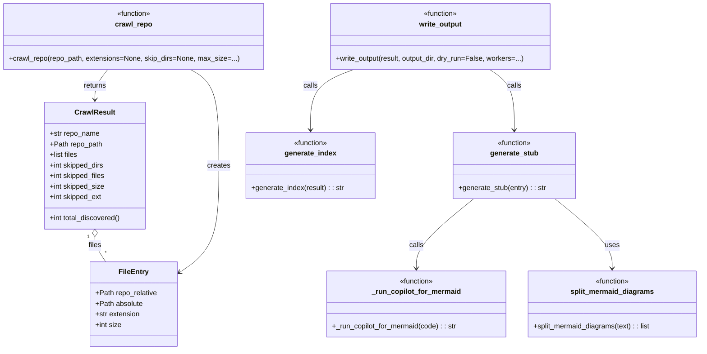

# Diagram: entity_core/watcher_service/config/config.alpha.yml


> Auto-generated by Obscura crawlers

## Diagram 1

```mermaid
flowchart TD
    CLI[CLI: crawlers.py main] --> CrawlRepo[crawl_repo(repo_path)]
    CrawlRepo --> Walk[os.walk files & dirs]
    Walk --> Filter[filter SKIP_DIRS/SKIP_FILES/EXTS]
    Filter --> FileEntryNode[FileEntry(repo_relative, absolute, extension, size)]
    FileEntryNode --> ResultAccumulate[CrawlResult.files append]
    CrawlRepo --> Result[CrawlResult]
    Result --> WriteOutput[write_output(result, output_dir)]
    WriteOutput --> ToProcess[filter entries to_process]
    ToProcess --> ThreadPool[ThreadPoolExecutor workers]
    ThreadPool --> ProcessEntry[_process_entry(entry)]
    ProcessEntry --> GenerateStub[generate_stub(entry)]
    GenerateStub --> RunCopilot[_run_copilot_for_mermaid(code)]
    RunCopilot --> RawMermaid[raw mermaid text]
    RawMermaid --> Split[split_mermaid_diagrams(raw_mermaid)]
    Split --> DiagramList[diagrams (1..n)]
    DiagramList --> RenderMMD[_render_svg_with_mmdc(diagram)]
    DiagramList --> RenderKroki[_render_svg_with_kroki(diagram)]
    RenderMMD --> SVGOut[SVG text]
    RenderKroki --> SVGOut
    GenerateStub --> WriteMarkdown[write .md files with Mermaid + SVG]
    WriteOutput --> Index[generate_index(result) -> INDEX.md]
```

> SVG rendering failed for this diagram.

## Diagram 2



> SVG rendering failed for this diagram.
