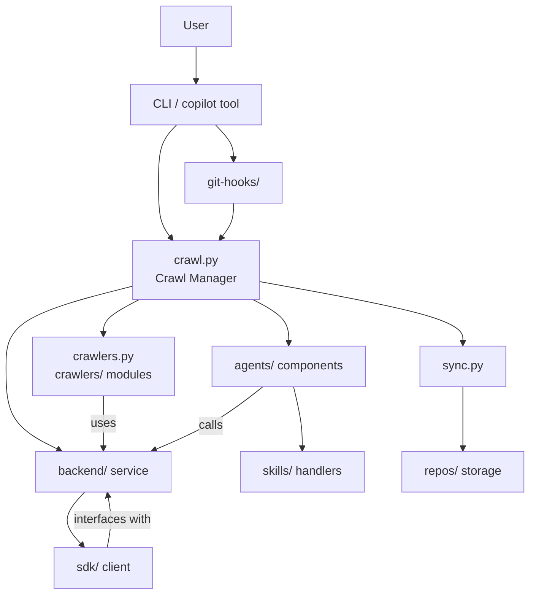

# Diagram: entity_core/watcher_service/config/config.qa.yml


> Auto-generated by Obscura crawlers

## Diagram 1



### SVG

<svg id="container" width="787.73046875" xmlns="http://www.w3.org/2000/svg" class="flowchart" height="766" viewBox="-35 0 787.73046875 766" role="graphics-document document" aria-roledescription="flowchart-v2"><style>#container{font-family:"trebuchet ms",verdana,arial,sans-serif;font-size:16px;fill:#333;}@keyframes edge-animation-frame{from{stroke-dashoffset:0;}}@keyframes dash{to{stroke-dashoffset:0;}}#container .edge-animation-slow{stroke-dasharray:9,5!important;stroke-dashoffset:900;animation:dash 50s linear infinite;stroke-linecap:round;}#container .edge-animation-fast{stroke-dasharray:9,5!important;stroke-dashoffset:900;animation:dash 20s linear infinite;stroke-linecap:round;}#container .error-icon{fill:#552222;}#container .error-text{fill:#552222;stroke:#552222;}#container .edge-thickness-normal{stroke-width:1px;}#container .edge-thickness-thick{stroke-width:3.5px;}#container .edge-pattern-solid{stroke-dasharray:0;}#container .edge-thickness-invisible{stroke-width:0;fill:none;}#container .edge-pattern-dashed{stroke-dasharray:3;}#container .edge-pattern-dotted{stroke-dasharray:2;}#container .marker{fill:#333333;stroke:#333333;}#container .marker.cross{stroke:#333333;}#container svg{font-family:"trebuchet ms",verdana,arial,sans-serif;font-size:16px;}#container p{margin:0;}#container .label{font-family:"trebuchet ms",verdana,arial,sans-serif;color:#333;}#container .cluster-label text{fill:#333;}#container .cluster-label span{color:#333;}#container .cluster-label span p{background-color:transparent;}#container .label text,#container span{fill:#333;color:#333;}#container .node rect,#container .node circle,#container .node ellipse,#container .node polygon,#container .node path{fill:#ECECFF;stroke:#9370DB;stroke-width:1px;}#container .rough-node .label text,#container .node .label text,#container .image-shape .label,#container .icon-shape .label{text-anchor:middle;}#container .node .katex path{fill:#000;stroke:#000;stroke-width:1px;}#container .rough-node .label,#container .node .label,#container .image-shape .label,#container .icon-shape .label{text-align:center;}#container .node.clickable{cursor:pointer;}#container .root .anchor path{fill:#333333!important;stroke-width:0;stroke:#333333;}#container .arrowheadPath{fill:#333333;}#container .edgePath .path{stroke:#333333;stroke-width:2.0px;}#container .flowchart-link{stroke:#333333;fill:none;}#container .edgeLabel{background-color:rgba(232,232,232, 0.8);text-align:center;}#container .edgeLabel p{background-color:rgba(232,232,232, 0.8);}#container .edgeLabel rect{opacity:0.5;background-color:rgba(232,232,232, 0.8);fill:rgba(232,232,232, 0.8);}#container .labelBkg{background-color:rgba(232, 232, 232, 0.5);}#container .cluster rect{fill:#ffffde;stroke:#aaaa33;stroke-width:1px;}#container .cluster text{fill:#333;}#container .cluster span{color:#333;}#container div.mermaidTooltip{position:absolute;text-align:center;max-width:200px;padding:2px;font-family:"trebuchet ms",verdana,arial,sans-serif;font-size:12px;background:hsl(80, 100%, 96.2745098039%);border:1px solid #aaaa33;border-radius:2px;pointer-events:none;z-index:100;}#container .flowchartTitleText{text-anchor:middle;font-size:18px;fill:#333;}#container rect.text{fill:none;stroke-width:0;}#container .icon-shape,#container .image-shape{background-color:rgba(232,232,232, 0.8);text-align:center;}#container .icon-shape p,#container .image-shape p{background-color:rgba(232,232,232, 0.8);padding:2px;}#container .icon-shape rect,#container .image-shape rect{opacity:0.5;background-color:rgba(232,232,232, 0.8);fill:rgba(232,232,232, 0.8);}#container .label-icon{display:inline-block;height:1em;overflow:visible;vertical-align:-0.125em;}#container .node .label-icon path{fill:currentColor;stroke:revert;stroke-width:revert;}#container :root{--mermaid-font-family:"trebuchet ms",verdana,arial,sans-serif;}</style><g><marker id="container_flowchart-v2-pointEnd" class="marker flowchart-v2" viewBox="0 0 10 10" refX="5" refY="5" markerUnits="userSpaceOnUse" markerWidth="8" markerHeight="8" orient="auto"><path d="M 0 0 L 10 5 L 0 10 z" class="arrowMarkerPath" style="stroke-width: 1; stroke-dasharray: 1, 0;"></path></marker><marker id="container_flowchart-v2-pointStart" class="marker flowchart-v2" viewBox="0 0 10 10" refX="4.5" refY="5" markerUnits="userSpaceOnUse" markerWidth="8" markerHeight="8" orient="auto"><path d="M 0 5 L 10 10 L 10 0 z" class="arrowMarkerPath" style="stroke-width: 1; stroke-dasharray: 1, 0;"></path></marker><marker id="container_flowchart-v2-circleEnd" class="marker flowchart-v2" viewBox="0 0 10 10" refX="11" refY="5" markerUnits="userSpaceOnUse" markerWidth="11" markerHeight="11" orient="auto"><circle cx="5" cy="5" r="5" class="arrowMarkerPath" style="stroke-width: 1; stroke-dasharray: 1, 0;"></circle></marker><marker id="container_flowchart-v2-circleStart" class="marker flowchart-v2" viewBox="0 0 10 10" refX="-1" refY="5" markerUnits="userSpaceOnUse" markerWidth="11" markerHeight="11" orient="auto"><circle cx="5" cy="5" r="5" class="arrowMarkerPath" style="stroke-width: 1; stroke-dasharray: 1, 0;"></circle></marker><marker id="container_flowchart-v2-crossEnd" class="marker cross flowchart-v2" viewBox="0 0 11 11" refX="12" refY="5.2" markerUnits="userSpaceOnUse" markerWidth="11" markerHeight="11" orient="auto"><path d="M 1,1 l 9,9 M 10,1 l -9,9" class="arrowMarkerPath" style="stroke-width: 2; stroke-dasharray: 1, 0;"></path></marker><marker id="container_flowchart-v2-crossStart" class="marker cross flowchart-v2" viewBox="0 0 11 11" refX="-1" refY="5.2" markerUnits="userSpaceOnUse" markerWidth="11" markerHeight="11" orient="auto"><path d="M 1,1 l 9,9 M 10,1 l -9,9" class="arrowMarkerPath" style="stroke-width: 2; stroke-dasharray: 1, 0;"></path></marker><g class="root"><g class="clusters"></g><g class="edgePaths"><path d="M280.617,62L280.617,66.167C280.617,70.333,280.617,78.667,280.617,86.333C280.617,94,280.617,101,280.617,104.5L280.617,108" id="L_U_CLI_0" class="edge-thickness-normal edge-pattern-solid edge-thickness-normal edge-pattern-solid flowchart-link" style=";" data-edge="true" data-et="edge" data-id="L_U_CLI_0" data-points="W3sieCI6MjgwLjYxNzE4NzUsInkiOjYyfSx7IngiOjI4MC42MTcxODc1LCJ5Ijo4N30seyJ4IjoyODAuNjE3MTg3NSwieSI6MTEyfV0=" marker-end="url(#container_flowchart-v2-pointEnd)"></path><path d="M253.826,166L249.692,170.167C245.557,174.333,237.288,182.667,233.154,195.5C229.02,208.333,229.02,225.667,229.02,243C229.02,260.333,229.02,277.667,232.684,290.027C236.349,302.387,243.679,309.774,247.344,313.467L251.009,317.161" id="L_CLI_CrawlApp_0" class="edge-thickness-normal edge-pattern-solid edge-thickness-normal edge-pattern-solid flowchart-link" style=";" data-edge="true" data-et="edge" data-id="L_CLI_CrawlApp_0" data-points="W3sieCI6MjUzLjgyNjA5Njc1NDgwNzY4LCJ5IjoxNjZ9LHsieCI6MjI5LjAxOTUzMTI1LCJ5IjoxOTF9LHsieCI6MjI5LjAxOTUzMTI1LCJ5IjoyNDN9LHsieCI6MjI5LjAxOTUzMTI1LCJ5IjoyOTV9LHsieCI6MjUzLjgyNjA5Njc1NDgwNzY4LCJ5IjozMjB9XQ==" marker-end="url(#container_flowchart-v2-pointEnd)"></path><path d="M206.566,374L195.138,378.167C183.711,382.333,160.855,390.667,149.428,398.333C138,406,138,413,138,416.5L138,420" id="L_CrawlApp_Crawlers_0" class="edge-thickness-normal edge-pattern-solid edge-thickness-normal edge-pattern-solid flowchart-link" style=";" data-edge="true" data-et="edge" data-id="L_CrawlApp_Crawlers_0" data-points="W3sieCI6MjA2LjU2NTk1NTUyODg0NjE2LCJ5IjozNzR9LHsieCI6MTM4LCJ5IjozOTl9LHsieCI6MTM4LCJ5Ijo0MjR9XQ==" marker-end="url(#container_flowchart-v2-pointEnd)"></path><path d="M159.594,367.458L128.495,372.715C97.396,377.972,35.198,388.486,4.099,404.41C-27,420.333,-27,441.667,-27,465C-27,488.333,-27,513.667,-11.723,532.259C3.554,550.851,34.108,562.702,49.384,568.628L64.661,574.553" id="L_CrawlApp_Backend_0" class="edge-thickness-normal edge-pattern-solid edge-thickness-normal edge-pattern-solid flowchart-link" style=";" data-edge="true" data-et="edge" data-id="L_CrawlApp_Backend_0" data-points="W3sieCI6MTU5LjU5Mzc1LCJ5IjozNjcuNDU3OTU1NTU1NTU1NTR9LHsieCI6LTI3LCJ5IjozOTl9LHsieCI6LTI3LCJ5Ijo0NjN9LHsieCI6LTI3LCJ5Ijo1Mzl9LHsieCI6NjguMzkwNjI1LCJ5Ijo1NzZ9XQ==" marker-end="url(#container_flowchart-v2-pointEnd)"></path><path d="M354.668,374L366.096,378.167C377.524,382.333,400.379,390.667,411.807,400.333C423.234,410,423.234,421,423.234,426.5L423.234,432" id="L_CrawlApp_Agents_0" class="edge-thickness-normal edge-pattern-solid edge-thickness-normal edge-pattern-solid flowchart-link" style=";" data-edge="true" data-et="edge" data-id="L_CrawlApp_Agents_0" data-points="W3sieCI6MzU0LjY2ODQxOTQ3MTE1MzgsInkiOjM3NH0seyJ4Ijo0MjMuMjM0Mzc1LCJ5IjozOTl9LHsieCI6NDIzLjIzNDM3NSwieSI6NDM2fV0=" marker-end="url(#container_flowchart-v2-pointEnd)"></path><path d="M429.708,490L431.666,498.167C433.624,506.333,437.541,522.667,439.499,536.333C441.457,550,441.457,561,441.457,566.5L441.457,572" id="L_Agents_Skills_0" class="edge-thickness-normal edge-pattern-solid edge-thickness-normal edge-pattern-solid flowchart-link" style=";" data-edge="true" data-et="edge" data-id="L_Agents_Skills_0" data-points="W3sieCI6NDI5LjcwODIxMzQwNDYwNTI2LCJ5Ijo0OTB9LHsieCI6NDQxLjQ1NzAzMTI1LCJ5Ijo1Mzl9LHsieCI6NDQxLjQ1NzAzMTI1LCJ5Ijo1NzZ9XQ==" marker-end="url(#container_flowchart-v2-pointEnd)"></path><path d="M401.641,363.526L444.939,369.438C488.238,375.35,574.836,387.175,618.135,398.588C661.434,410,661.434,421,661.434,426.5L661.434,432" id="L_CrawlApp_Sync_0" class="edge-thickness-normal edge-pattern-solid edge-thickness-normal edge-pattern-solid flowchart-link" style=";" data-edge="true" data-et="edge" data-id="L_CrawlApp_Sync_0" data-points="W3sieCI6NDAxLjY0MDYyNSwieSI6MzYzLjUyNTU5Nzc1OTc0NzI2fSx7IngiOjY2MS40MzM1OTM3NSwieSI6Mzk5fSx7IngiOjY2MS40MzM1OTM3NSwieSI6NDM2fV0=" marker-end="url(#container_flowchart-v2-pointEnd)"></path><path d="M661.434,490L661.434,498.167C661.434,506.333,661.434,522.667,661.434,536.333C661.434,550,661.434,561,661.434,566.5L661.434,572" id="L_Sync_Repos_0" class="edge-thickness-normal edge-pattern-solid edge-thickness-normal edge-pattern-solid flowchart-link" style=";" data-edge="true" data-et="edge" data-id="L_Sync_Repos_0" data-points="W3sieCI6NjYxLjQzMzU5Mzc1LCJ5Ijo0OTB9LHsieCI6NjYxLjQzMzU5Mzc1LCJ5Ijo1Mzl9LHsieCI6NjYxLjQzMzU5Mzc1LCJ5Ijo1NzZ9XQ==" marker-end="url(#container_flowchart-v2-pointEnd)"></path><path d="M118.852,630L114.479,636.167C110.106,642.333,101.36,654.667,100.974,666.456C100.588,678.246,108.563,689.491,112.551,695.114L116.539,700.737" id="L_Backend_SDK_0" class="edge-thickness-normal edge-pattern-solid edge-thickness-normal edge-pattern-solid flowchart-link" style=";" data-edge="true" data-et="edge" data-id="L_Backend_SDK_0" data-points="W3sieCI6MTE4Ljg1MjQ3ODAyNzM0Mzc1LCJ5Ijo2MzB9LHsieCI6OTIuNjEzMjgxMjUsInkiOjY2N30seyJ4IjoxMTguODUyNDc4MDI3MzQzNzUsInkiOjcwNH1d" marker-end="url(#container_flowchart-v2-pointEnd)"></path><path d="M307.408,166L311.543,170.167C315.677,174.333,323.946,182.667,328.08,190.333C332.215,198,332.215,205,332.215,208.5L332.215,212" id="L_CLI_GitHooks_0" class="edge-thickness-normal edge-pattern-solid edge-thickness-normal edge-pattern-solid flowchart-link" style=";" data-edge="true" data-et="edge" data-id="L_CLI_GitHooks_0" data-points="W3sieCI6MzA3LjQwODI3ODI0NTE5MjMsInkiOjE2Nn0seyJ4IjozMzIuMjE0ODQzNzUsInkiOjE5MX0seyJ4IjozMzIuMjE0ODQzNzUsInkiOjIxNn1d" marker-end="url(#container_flowchart-v2-pointEnd)"></path><path d="M332.215,270L332.215,274.167C332.215,278.333,332.215,286.667,328.55,294.527C324.885,302.387,317.555,309.774,313.891,313.467L310.226,317.161" id="L_GitHooks_CrawlApp_0" class="edge-thickness-normal edge-pattern-solid edge-thickness-normal edge-pattern-solid flowchart-link" style=";" data-edge="true" data-et="edge" data-id="L_GitHooks_CrawlApp_0" data-points="W3sieCI6MzMyLjIxNDg0Mzc1LCJ5IjoyNzB9LHsieCI6MzMyLjIxNDg0Mzc1LCJ5IjoyOTV9LHsieCI6MzA3LjQwODI3ODI0NTE5MjMsInkiOjMyMH1d" marker-end="url(#container_flowchart-v2-pointEnd)"></path><path d="M138,502L138,508.167C138,514.333,138,526.667,138,538.333C138,550,138,561,138,566.5L138,572" id="L_Crawlers_Backend_0" class="edge-thickness-normal edge-pattern-solid edge-thickness-normal edge-pattern-solid flowchart-link" style=";" data-edge="true" data-et="edge" data-id="L_Crawlers_Backend_0" data-points="W3sieCI6MTM4LCJ5Ijo1MDJ9LHsieCI6MTM4LCJ5Ijo1Mzl9LHsieCI6MTM4LCJ5Ijo1NzZ9XQ==" marker-end="url(#container_flowchart-v2-pointEnd)"></path><path d="M382.544,490L370.237,498.167C357.929,506.333,333.314,522.667,305.183,536.766C277.053,550.865,245.406,562.73,229.582,568.663L213.759,574.596" id="L_Agents_Backend_0" class="edge-thickness-normal edge-pattern-solid edge-thickness-normal edge-pattern-solid flowchart-link" style=";" data-edge="true" data-et="edge" data-id="L_Agents_Backend_0" data-points="W3sieCI6MzgyLjU0NDI1MzcwMDY1NzksInkiOjQ5MH0seyJ4IjozMDguNjk5MjE4NzUsInkiOjUzOX0seyJ4IjoyMTAuMDEzNzMyOTEwMTU2MjUsInkiOjU3Nn1d" marker-end="url(#container_flowchart-v2-pointEnd)"></path><path d="M149.847,704L152.553,697.833C155.259,691.667,160.67,679.333,160.938,667.61C161.206,655.888,156.33,644.775,153.892,639.219L151.454,633.663" id="L_SDK_Backend_0" class="edge-thickness-normal edge-pattern-solid edge-thickness-normal edge-pattern-solid flowchart-link" style=";" data-edge="true" data-et="edge" data-id="L_SDK_Backend_0" data-points="W3sieCI6MTQ5Ljg0NzEwNjkzMzU5Mzc1LCJ5Ijo3MDR9LHsieCI6MTY2LjA4MjAzMTI1LCJ5Ijo2Njd9LHsieCI6MTQ5Ljg0NzEwNjkzMzU5Mzc1LCJ5Ijo2MzB9XQ==" marker-end="url(#container_flowchart-v2-pointEnd)"></path></g><g class="edgeLabels"><g class="edgeLabel"><g class="label" data-id="L_U_CLI_0" transform="translate(0, 0)"><foreignObject width="0" height="0"><div xmlns="http://www.w3.org/1999/xhtml" class="labelBkg" style="display: table-cell; white-space: nowrap; line-height: 1.5; max-width: 200px; text-align: center;"><span class="edgeLabel"></span></div></foreignObject></g></g><g class="edgeLabel"><g class="label" data-id="L_CLI_CrawlApp_0" transform="translate(0, 0)"><foreignObject width="0" height="0"><div xmlns="http://www.w3.org/1999/xhtml" class="labelBkg" style="display: table-cell; white-space: nowrap; line-height: 1.5; max-width: 200px; text-align: center;"><span class="edgeLabel"></span></div></foreignObject></g></g><g class="edgeLabel"><g class="label" data-id="L_CrawlApp_Crawlers_0" transform="translate(0, 0)"><foreignObject width="0" height="0"><div xmlns="http://www.w3.org/1999/xhtml" class="labelBkg" style="display: table-cell; white-space: nowrap; line-height: 1.5; max-width: 200px; text-align: center;"><span class="edgeLabel"></span></div></foreignObject></g></g><g class="edgeLabel"><g class="label" data-id="L_CrawlApp_Backend_0" transform="translate(0, 0)"><foreignObject width="0" height="0"><div xmlns="http://www.w3.org/1999/xhtml" class="labelBkg" style="display: table-cell; white-space: nowrap; line-height: 1.5; max-width: 200px; text-align: center;"><span class="edgeLabel"></span></div></foreignObject></g></g><g class="edgeLabel"><g class="label" data-id="L_CrawlApp_Agents_0" transform="translate(0, 0)"><foreignObject width="0" height="0"><div xmlns="http://www.w3.org/1999/xhtml" class="labelBkg" style="display: table-cell; white-space: nowrap; line-height: 1.5; max-width: 200px; text-align: center;"><span class="edgeLabel"></span></div></foreignObject></g></g><g class="edgeLabel"><g class="label" data-id="L_Agents_Skills_0" transform="translate(0, 0)"><foreignObject width="0" height="0"><div xmlns="http://www.w3.org/1999/xhtml" class="labelBkg" style="display: table-cell; white-space: nowrap; line-height: 1.5; max-width: 200px; text-align: center;"><span class="edgeLabel"></span></div></foreignObject></g></g><g class="edgeLabel"><g class="label" data-id="L_CrawlApp_Sync_0" transform="translate(0, 0)"><foreignObject width="0" height="0"><div xmlns="http://www.w3.org/1999/xhtml" class="labelBkg" style="display: table-cell; white-space: nowrap; line-height: 1.5; max-width: 200px; text-align: center;"><span class="edgeLabel"></span></div></foreignObject></g></g><g class="edgeLabel"><g class="label" data-id="L_Sync_Repos_0" transform="translate(0, 0)"><foreignObject width="0" height="0"><div xmlns="http://www.w3.org/1999/xhtml" class="labelBkg" style="display: table-cell; white-space: nowrap; line-height: 1.5; max-width: 200px; text-align: center;"><span class="edgeLabel"></span></div></foreignObject></g></g><g class="edgeLabel"><g class="label" data-id="L_Backend_SDK_0" transform="translate(0, 0)"><foreignObject width="0" height="0"><div xmlns="http://www.w3.org/1999/xhtml" class="labelBkg" style="display: table-cell; white-space: nowrap; line-height: 1.5; max-width: 200px; text-align: center;"><span class="edgeLabel"></span></div></foreignObject></g></g><g class="edgeLabel"><g class="label" data-id="L_CLI_GitHooks_0" transform="translate(0, 0)"><foreignObject width="0" height="0"><div xmlns="http://www.w3.org/1999/xhtml" class="labelBkg" style="display: table-cell; white-space: nowrap; line-height: 1.5; max-width: 200px; text-align: center;"><span class="edgeLabel"></span></div></foreignObject></g></g><g class="edgeLabel"><g class="label" data-id="L_GitHooks_CrawlApp_0" transform="translate(0, 0)"><foreignObject width="0" height="0"><div xmlns="http://www.w3.org/1999/xhtml" class="labelBkg" style="display: table-cell; white-space: nowrap; line-height: 1.5; max-width: 200px; text-align: center;"><span class="edgeLabel"></span></div></foreignObject></g></g><g class="edgeLabel" transform="translate(138, 539)"><g class="label" data-id="L_Crawlers_Backend_0" transform="translate(-16.4921875, -12)"><foreignObject width="32.984375" height="24"><div xmlns="http://www.w3.org/1999/xhtml" class="labelBkg" style="display: table-cell; white-space: nowrap; line-height: 1.5; max-width: 200px; text-align: center;"><span class="edgeLabel"><p>uses</p></span></div></foreignObject></g></g><g class="edgeLabel" transform="translate(300.84774, 541.94374)"><g class="label" data-id="L_Agents_Backend_0" transform="translate(-16.4453125, -12)"><foreignObject width="32.890625" height="24"><div xmlns="http://www.w3.org/1999/xhtml" class="labelBkg" style="display: table-cell; white-space: nowrap; line-height: 1.5; max-width: 200px; text-align: center;"><span class="edgeLabel"><p>calls</p></span></div></foreignObject></g></g><g class="edgeLabel" transform="translate(166.08203125, 667)"><g class="label" data-id="L_SDK_Backend_0" transform="translate(-53.46875, -12)"><foreignObject width="106.9375" height="24"><div xmlns="http://www.w3.org/1999/xhtml" class="labelBkg" style="display: table-cell; white-space: nowrap; line-height: 1.5; max-width: 200px; text-align: center;"><span class="edgeLabel"><p>interfaces with</p></span></div></foreignObject></g></g></g><g class="nodes"><g class="node default" id="flowchart-U-0" transform="translate(280.6171875, 35)"><rect class="basic label-container" style="" x="-46.4453125" y="-27" width="92.890625" height="54"></rect><g class="label" style="" transform="translate(-16.4453125, -12)"><rect></rect><foreignObject width="32.890625" height="24"><div xmlns="http://www.w3.org/1999/xhtml" style="display: table-cell; white-space: nowrap; line-height: 1.5; max-width: 200px; text-align: center;"><span class="nodeLabel"><p>User</p></span></div></foreignObject></g></g><g class="node default" id="flowchart-CLI-1" transform="translate(280.6171875, 139)"><rect class="basic label-container" style="" x="-91.015625" y="-27" width="182.03125" height="54"></rect><g class="label" style="" transform="translate(-61.015625, -12)"><rect></rect><foreignObject width="122.03125" height="24"><div xmlns="http://www.w3.org/1999/xhtml" style="display: table-cell; white-space: nowrap; line-height: 1.5; max-width: 200px; text-align: center;"><span class="nodeLabel"><p>CLI / copilot tool</p></span></div></foreignObject></g></g><g class="node default" id="flowchart-CrawlApp-3" transform="translate(280.6171875, 347)"><rect class="basic label-container" style="" x="-121.0234375" y="-27" width="242.046875" height="54"></rect><g class="label" style="" transform="translate(-91.0234375, -12)"><rect></rect><foreignObject width="182.046875" height="24"><div xmlns="http://www.w3.org/1999/xhtml" style="display: table-cell; white-space: nowrap; line-height: 1.5; max-width: 200px; text-align: center;"><span class="nodeLabel"><p>crawl.py\nCrawl Manager</p></span></div></foreignObject></g></g><g class="node default" id="flowchart-Crawlers-5" transform="translate(138, 463)"><rect class="basic label-container" style="" x="-130" y="-39" width="260" height="78"></rect><g class="label" style="" transform="translate(-100, -24)"><rect></rect><foreignObject width="200" height="48"><div xmlns="http://www.w3.org/1999/xhtml" style="display: table; white-space: break-spaces; line-height: 1.5; max-width: 200px; text-align: center; width: 200px;"><span class="nodeLabel"><p>crawlers.py\ncrawlers/ modules</p></span></div></foreignObject></g></g><g class="node default" id="flowchart-Backend-7" transform="translate(138, 603)"><rect class="basic label-container" style="" x="-92.390625" y="-27" width="184.78125" height="54"></rect><g class="label" style="" transform="translate(-62.390625, -12)"><rect></rect><foreignObject width="124.78125" height="24"><div xmlns="http://www.w3.org/1999/xhtml" style="display: table-cell; white-space: nowrap; line-height: 1.5; max-width: 200px; text-align: center;"><span class="nodeLabel"><p>backend/ service</p></span></div></foreignObject></g></g><g class="node default" id="flowchart-Agents-9" transform="translate(423.234375, 463)"><rect class="basic label-container" style="" x="-105.234375" y="-27" width="210.46875" height="54"></rect><g class="label" style="" transform="translate(-75.234375, -12)"><rect></rect><foreignObject width="150.46875" height="24"><div xmlns="http://www.w3.org/1999/xhtml" style="display: table-cell; white-space: nowrap; line-height: 1.5; max-width: 200px; text-align: center;"><span class="nodeLabel"><p>agents/ components</p></span></div></foreignObject></g></g><g class="node default" id="flowchart-Skills-11" transform="translate(441.45703125, 603)"><rect class="basic label-container" style="" x="-86.6796875" y="-27" width="173.359375" height="54"></rect><g class="label" style="" transform="translate(-56.6796875, -12)"><rect></rect><foreignObject width="113.359375" height="24"><div xmlns="http://www.w3.org/1999/xhtml" style="display: table-cell; white-space: nowrap; line-height: 1.5; max-width: 200px; text-align: center;"><span class="nodeLabel"><p>skills/ handlers</p></span></div></foreignObject></g></g><g class="node default" id="flowchart-Sync-13" transform="translate(661.43359375, 463)"><rect class="basic label-container" style="" x="-56.7109375" y="-27" width="113.421875" height="54"></rect><g class="label" style="" transform="translate(-26.7109375, -12)"><rect></rect><foreignObject width="53.421875" height="24"><div xmlns="http://www.w3.org/1999/xhtml" style="display: table-cell; white-space: nowrap; line-height: 1.5; max-width: 200px; text-align: center;"><span class="nodeLabel"><p>sync.py</p></span></div></foreignObject></g></g><g class="node default" id="flowchart-Repos-15" transform="translate(661.43359375, 603)"><rect class="basic label-container" style="" x="-83.296875" y="-27" width="166.59375" height="54"></rect><g class="label" style="" transform="translate(-53.296875, -12)"><rect></rect><foreignObject width="106.59375" height="24"><div xmlns="http://www.w3.org/1999/xhtml" style="display: table-cell; white-space: nowrap; line-height: 1.5; max-width: 200px; text-align: center;"><span class="nodeLabel"><p>repos/ storage</p></span></div></foreignObject></g></g><g class="node default" id="flowchart-SDK-17" transform="translate(138, 731)"><rect class="basic label-container" style="" x="-69.2578125" y="-27" width="138.515625" height="54"></rect><g class="label" style="" transform="translate(-39.2578125, -12)"><rect></rect><foreignObject width="78.515625" height="24"><div xmlns="http://www.w3.org/1999/xhtml" style="display: table-cell; white-space: nowrap; line-height: 1.5; max-width: 200px; text-align: center;"><span class="nodeLabel"><p>sdk/ client</p></span></div></foreignObject></g></g><g class="node default" id="flowchart-GitHooks-19" transform="translate(332.21484375, 243)"><rect class="basic label-container" style="" x="-68.1953125" y="-27" width="136.390625" height="54"></rect><g class="label" style="" transform="translate(-38.1953125, -12)"><rect></rect><foreignObject width="76.390625" height="24"><div xmlns="http://www.w3.org/1999/xhtml" style="display: table-cell; white-space: nowrap; line-height: 1.5; max-width: 200px; text-align: center;"><span class="nodeLabel"><p>git-hooks/</p></span></div></foreignObject></g></g></g></g></g></svg>

## Diagram 2

```mermaid
classDiagram
    class CrawlerManager {
        +start()
        +stop()
        +schedule()
        -LOG_LEVEL: string
        -WATCH_LIMIT: int
    }
    class Crawler {
        +crawl(url)
        +parse(response)
        -last_run: Date
    }
    class BackendService {
        +save(item)
        +load(id)
        +query(q)
    }
    class SDKClient {
        +request(endpoint, data)
        +authenticate()
    }
    class Agent {
        +run(task)
        +stop()
        -id: string
    }
    class Skill {
        +handle(event)
        +register()
    }
    class SyncService {
        +sync()
        +pull()
        +push()
    }

    CrawlerManager "1" o-- "*" Crawler : manages
    Crawler --> BackendService : stores/results-> 
    BackendService --> SDKClient : uses
    Agent --> Skill : invokes
    CrawlerManager --> Agent : delegates
    SyncService --> Repos["repos/"] : syncs with
    Repos["repos/"] <.. BackendService : persists to
```

> SVG rendering failed for this diagram.
