# Diagram: entity_core/watcher_service/scripts/local_exception_watcher.sh

> Auto-generated by Obscura crawlers

## Mermaid

```mermaid
flowchart LR
  Start([Start]) --> Echo["echo exception_watcher"]
  Echo --> SetRepo[/"REPO_PATH=<path-to-FV-Platform-Main>"/]
  SetRepo --> SetPY["PYTHONPATH=$REPO_PATH/platform/entity_core/watcher_service"]
  SetPY --> ExportPY["export PYTHONPATH=$PYTHONPATH:$REPO_PATH/platform/common/fv/python/:"]
  ExportPY --> Invoke["Invoke: AWS_DEFAULT_REGION=us-east-1 AWS_STAGE=dev AWS_PROFILE=default python-lambda-local -f lambda_handler -t 120 $REPO_PATH/platform/entity_core/watcher_service/watcher_service/exception_watcher.py $REPO_PATH/platform/entity_core/watcher_service/test.json"]
  Invoke --> End([End])
```

### SVG

<svg id="container" width="2659.5693359375" xmlns="http://www.w3.org/2000/svg" class="flowchart" height="142" viewBox="0.0000019073486328125 0 2659.5693359375 142" role="graphics-document document" aria-roledescription="flowchart-v2"><g><marker id="container_flowchart-v2-pointEnd" class="marker flowchart-v2" viewBox="0 0 10 10" refX="5" refY="5" markerUnits="userSpaceOnUse" markerWidth="8" markerHeight="8" orient="auto"><path d="M 0 0 L 10 5 L 0 10 z" class="arrowMarkerPath" style="stroke-width: 1; stroke-dasharray: 1, 0;"></path></marker><marker id="container_flowchart-v2-pointStart" class="marker flowchart-v2" viewBox="0 0 10 10" refX="4.5" refY="5" markerUnits="userSpaceOnUse" markerWidth="8" markerHeight="8" orient="auto"><path d="M 0 5 L 10 10 L 10 0 z" class="arrowMarkerPath" style="stroke-width: 1; stroke-dasharray: 1, 0;"></path></marker><marker id="container_flowchart-v2-circleEnd" class="marker flowchart-v2" viewBox="0 0 10 10" refX="11" refY="5" markerUnits="userSpaceOnUse" markerWidth="11" markerHeight="11" orient="auto"><circle cx="5" cy="5" r="5" class="arrowMarkerPath" style="stroke-width: 1; stroke-dasharray: 1, 0;"></circle></marker><marker id="container_flowchart-v2-circleStart" class="marker flowchart-v2" viewBox="0 0 10 10" refX="-1" refY="5" markerUnits="userSpaceOnUse" markerWidth="11" markerHeight="11" orient="auto"><circle cx="5" cy="5" r="5" class="arrowMarkerPath" style="stroke-width: 1; stroke-dasharray: 1, 0;"></circle></marker><marker id="container_flowchart-v2-crossEnd" class="marker cross flowchart-v2" viewBox="0 0 11 11" refX="12" refY="5.2" markerUnits="userSpaceOnUse" markerWidth="11" markerHeight="11" orient="auto"><path d="M 1,1 l 9,9 M 10,1 l -9,9" class="arrowMarkerPath" style="stroke-width: 2; stroke-dasharray: 1, 0;"></path></marker><marker id="container_flowchart-v2-crossStart" class="marker cross flowchart-v2" viewBox="0 0 11 11" refX="-1" refY="5.2" markerUnits="userSpaceOnUse" markerWidth="11" markerHeight="11" orient="auto"><path d="M 1,1 l 9,9 M 10,1 l -9,9" class="arrowMarkerPath" style="stroke-width: 2; stroke-dasharray: 1, 0;"></path></marker><g class="root"><g class="clusters"></g><g class="edgePaths"><path d="M68.277,71.5L72.36,71.417C76.444,71.333,84.61,71.167,92.194,71.083C99.777,71,106.777,71,110.277,71L113.777,71" id="L_Start_Echo_0" class="edge-thickness-normal edge-pattern-solid edge-thickness-normal edge-pattern-solid flowchart-link" style=";" data-edge="true" data-et="edge" data-id="L_Start_Echo_0" data-points="W3sieCI6NjguMjc2ODM3NDMxODI2NTYsInkiOjcxLjUwMDAwMDAwMDAwMDAxfSx7IngiOjkyLjc3NjgzNjM5NTI2MzY3LCJ5Ijo3MX0seyJ4IjoxMTcuNzc2ODM2Mzk1MjYzNjcsInkiOjcxfV0=" marker-end="url(#container_flowchart-v2-pointEnd)"></path><path d="M353.308,71L357.475,71C361.641,71,369.975,71,379.35,71.074C388.725,71.148,399.142,71.296,404.35,71.369L409.558,71.443" id="L_Echo_SetRepo_0" class="edge-thickness-normal edge-pattern-solid edge-thickness-normal edge-pattern-solid flowchart-link" style=";" data-edge="true" data-et="edge" data-id="L_Echo_SetRepo_0" data-points="W3sieCI6MzUzLjMwODA4NjM5NTI2MzcsInkiOjcxfSx7IngiOjM3OC4zMDgwODYzOTUyNjM3LCJ5Ijo3MX0seyJ4Ijo0MTMuNTU4MDg2Mzk1MjYzNywieSI6NzEuNX1d" marker-end="url(#container_flowchart-v2-pointEnd)"></path><path d="M538.214,71.5L543.923,71.417C549.631,71.333,561.048,71.167,570.256,71.083C579.464,71,586.464,71,589.964,71L593.464,71" id="L_SetRepo_SetPY_0" class="edge-thickness-normal edge-pattern-solid edge-thickness-normal edge-pattern-solid flowchart-link" style=";" data-edge="true" data-et="edge" data-id="L_SetRepo_SetPY_0" data-points="W3sieCI6NTM4LjIxNDMzNjM5NTI2MzcsInkiOjcxLjV9LHsieCI6NTcyLjQ2NDMzNjM5NTI2MzcsInkiOjcxfSx7IngiOjU5Ny40NjQzMzYzOTUyNjM3LCJ5Ijo3MX1d" marker-end="url(#container_flowchart-v2-pointEnd)"></path><path d="M1132.855,71L1137.022,71C1141.188,71,1149.522,71,1157.188,71C1164.855,71,1171.855,71,1175.355,71L1178.855,71" id="L_SetPY_ExportPY_0" class="edge-thickness-normal edge-pattern-solid edge-thickness-normal edge-pattern-solid flowchart-link" style=";" data-edge="true" data-et="edge" data-id="L_SetPY_ExportPY_0" data-points="W3sieCI6MTEzMi44NTQ5NjEzOTUyNjM3LCJ5Ijo3MX0seyJ4IjoxMTU3Ljg1NDk2MTM5NTI2MzcsInkiOjcxfSx7IngiOjExODIuODU0OTYxMzk1MjYzNywieSI6NzF9XQ==" marker-end="url(#container_flowchart-v2-pointEnd)"></path><path d="M1775.511,71L1779.678,71C1783.845,71,1792.178,71,1799.845,71C1807.511,71,1814.511,71,1818.011,71L1821.511,71" id="L_ExportPY_Invoke_0" class="edge-thickness-normal edge-pattern-solid edge-thickness-normal edge-pattern-solid flowchart-link" style=";" data-edge="true" data-et="edge" data-id="L_ExportPY_Invoke_0" data-points="W3sieCI6MTc3NS41MTEyMTEzOTUyNjM3LCJ5Ijo3MX0seyJ4IjoxODAwLjUxMTIxMTM5NTI2MzcsInkiOjcxfSx7IngiOjE4MjUuNTExMjExMzk1MjYzNywieSI6NzF9XQ==" marker-end="url(#container_flowchart-v2-pointEnd)"></path><path d="M2549.48,71L2553.647,71C2557.813,71,2566.147,71,2573.897,71.07C2581.647,71.141,2588.814,71.281,2592.397,71.351L2595.981,71.422" id="L_Invoke_End_0" class="edge-thickness-normal edge-pattern-solid edge-thickness-normal edge-pattern-solid flowchart-link" style=";" data-edge="true" data-et="edge" data-id="L_Invoke_End_0" data-points="W3sieCI6MjU0OS40Nzk5NjEzOTUyNjM3LCJ5Ijo3MX0seyJ4IjoyNTc0LjQ3OTk2MTM5NTI2MzcsInkiOjcxfSx7IngiOjI1OTkuOTc5OTYxMzk1Mjc1NSwieSI6NzEuNX1d" marker-end="url(#container_flowchart-v2-pointEnd)"></path></g><g class="edgeLabels"><g class="edgeLabel"><g class="label" data-id="L_Start_Echo_0" transform="translate(0, 0)"><foreignObject width="0" height="0">

</foreignObject></g></g><g class="edgeLabel"><g class="label" data-id="L_Echo_SetRepo_0" transform="translate(0, 0)"><foreignObject width="0" height="0">

</foreignObject></g></g><g class="edgeLabel"><g class="label" data-id="L_SetRepo_SetPY_0" transform="translate(0, 0)"><foreignObject width="0" height="0">

</foreignObject></g></g><g class="edgeLabel"><g class="label" data-id="L_SetPY_ExportPY_0" transform="translate(0, 0)"><foreignObject width="0" height="0">

</foreignObject></g></g><g class="edgeLabel"><g class="label" data-id="L_ExportPY_Invoke_0" transform="translate(0, 0)"><foreignObject width="0" height="0">

</foreignObject></g></g><g class="edgeLabel"><g class="label" data-id="L_Invoke_End_0" transform="translate(0, 0)"><foreignObject width="0" height="0">

</foreignObject></g></g></g><g class="nodes"><g class="node default" id="flowchart-Start-0" transform="translate(37.888418197631836, 71)"><g class="basic label-container outer-path"><path d="M-10.3984375 -19.5 C-4.690988347866908 -19.5, 1.0164608042661847 -19.5, 10.3984375 -19.5 C10.3984375 -19.5, 10.398437499999998 -19.5, 10.398437499999998 -19.5 C10.829841870425666 -19.486165701518114, 11.261246240851332 -19.472331403036232, 11.6478067896239 -19.45993515863156 C11.918764394743942 -19.433796204339824, 12.189721999863984 -19.407657250048093, 12.892042152847864 -19.3399052695533 C13.340370647908255 -19.267422995311343, 13.788699142968646 -19.194940721069383, 14.126030759676757 -19.140403561325776 C14.602963890595342 -19.031546686473146, 15.079897021513927 -18.922689811620515, 15.34470188623539 -18.862249829261074 C15.766388260406503 -18.737095526884033, 16.188074634577617 -18.611941224506996, 16.543047751460602 -18.50658706670804 C16.77843489367595 -18.4199624224779, 17.013822035891298 -18.333337778247763, 17.716144095147794 -18.074876768247425 C18.05346038721581 -17.9255568518812, 18.390776679283828 -17.776236935514973, 18.85917041279238 -17.568892924097174 C19.230726888230695 -17.375052148854287, 19.60228336366901 -17.1812113736114, 19.967429764076783 -16.990714730406097 C20.19095512001302 -16.855212346056753, 20.414480475949258 -16.71970996170741, 21.036368073605697 -16.342718045390892 C21.409356050755388 -16.082537778920567, 21.78234402790508 -15.822357512450239, 22.061592844578712 -15.627565626425154 C22.443074506586218 -15.323344152627538, 22.82455616859372 -15.01912267882992, 23.03889120850187 -14.848196188198123 C23.251065902869875 -14.655504744607885, 23.46324059723788 -14.462813301017647, 23.964247236767985 -14.007812326905688 C24.28834019141816 -13.673159742702953, 24.612433146068334 -13.33850715850022, 24.833858442968648 -13.10986736009568 C25.10639172107937 -12.789734264043993, 25.37892499919009 -12.469601167992307, 25.644151408126582 -12.158051136245305 C25.89122047680571 -11.82700109267047, 26.13828954548484 -11.495951049095634, 26.391796464640635 -11.156274872382312 C26.64168188582628 -10.772383761810177, 26.89156730701193 -10.388492651238042, 27.073721378604247 -10.108655082055241 C27.297836568672356 -9.710715867965456, 27.521951758740464 -9.31277665387567, 27.6871239742735 -9.019496659696287 C27.831777317409532 -8.719120897588596, 27.976430660545567 -8.418745135480904, 28.22948364880834 -7.893275190886684 C28.36653820614041 -7.554747784506865, 28.503592763472483 -7.216220378127046, 28.698571729970325 -6.734618561215508 C28.83577118916943 -6.321395649873004, 28.97297064836854 -5.9081727385305, 29.09246063421488 -5.548287939305138 C29.177259808218153 -5.224911936636165, 29.262058982221426 -4.9015359339671924, 29.40953178754556 -4.339158212148133 C29.50102910351841 -3.8693388325921383, 29.592526419491257 -3.399519453036144, 29.648482276581777 -3.1121979531509023 C29.704267456291692 -2.6795391153505226, 29.76005263600161 -2.2468802775501424, 29.808330202509367 -1.872449005199798 C29.832864156572683 -1.4903128672123855, 29.857398110635994 -1.1081767292249731, 29.888418715913414 -0.6250057626472757 C29.888418715913414 -0.25505467106864926, 29.888418715913414 0.11489642050997717, 29.888418715913414 0.625005762647271 C29.85829342249879 1.0942315242792275, 29.828168129084165 1.5634572859111842, 29.808330202509367 1.8724490051997846 C29.75179903221922 2.3108935986279273, 29.695267861929075 2.7493381920560696, 29.648482276581777 3.1121979531508885 C29.58900443844823 3.4176040813211026, 29.52952660031469 3.7230102094913162, 29.40953178754556 4.339158212148129 C29.327522371231954 4.651895659657773, 29.24551295491835 4.964633107167417, 29.092460634214884 5.548287939305125 C28.964249301826985 5.934440044755799, 28.836037969439086 6.320592150206471, 28.69857172997033 6.734618561215495 C28.564891704078512 7.064810809695761, 28.431211678186695 7.3950030581760275, 28.229483648808344 7.893275190886679 C28.04054189294918 8.285616789634183, 27.851600137090013 8.677958388381686, 27.687123974273504 9.019496659696284 C27.548864814116627 9.264989798812922, 27.41060565395975 9.510482937929561, 27.07372137860425 10.108655082055236 C26.85738388695799 10.441007563974432, 26.64104639531173 10.773360045893627, 26.39179646464064 11.156274872382301 C26.159528404575138 11.467492912814505, 25.92726034450963 11.778710953246707, 25.644151408126582 12.158051136245302 C25.46209043045789 12.371910320178047, 25.280029452789204 12.585769504110791, 24.83385844296866 13.10986736009567 C24.511317175816632 13.44291769956065, 24.18877590866461 13.775968039025633, 23.96424723676799 14.007812326905684 C23.64351079904823 14.299096673421658, 23.32277436132847 14.590381019937633, 23.038891208501887 14.848196188198111 C22.831778251186194 15.013363260150115, 22.624665293870496 15.178530332102119, 22.061592844578715 15.627565626425152 C21.841575398705704 15.78104027226444, 21.621557952832696 15.934514918103726, 21.036368073605708 16.34271804539089 C20.767258194706216 16.50585403544495, 20.49814831580672 16.66899002549901, 19.967429764076787 16.990714730406093 C19.657670395033257 17.15231599482576, 19.347911025989724 17.313917259245425, 18.859170412792388 17.56889292409717 C18.559292472454096 17.70163999272189, 18.259414532115805 17.834387061346614, 17.716144095147804 18.07487676824742 C17.251908784641035 18.245719653858078, 16.787673474134266 18.41656253946874, 16.543047751460616 18.506587066708033 C16.165730793730923 18.61857275918508, 15.788413836001228 18.730558451662127, 15.344701886235413 18.86224982926107 C15.045904199252014 18.9304484514779, 14.747106512268614 18.998647073694734, 14.126030759676766 19.140403561325773 C13.658184411284386 19.216041330731233, 13.190338062892007 19.291679100136694, 12.892042152847878 19.3399052695533 C12.425418397769484 19.38491990200854, 11.95879464269109 19.429934534463783, 11.6478067896239 19.45993515863156 C11.300462140302361 19.471073825469954, 10.953117490980825 19.482212492308353, 10.398437500000004 19.5 C10.398437500000002 19.5, 10.3984375 19.5, 10.3984375 19.5 C3.9931939003105326 19.5, -2.412049699378935 19.5, -10.398437499999996 19.5 C-10.833750228214223 19.486040368090993, -11.26906295642845 19.472080736181987, -11.647806789623893 19.45993515863156 C-12.060022596311873 19.42016919552241, -12.472238402999851 19.38040323241326, -12.892042152847871 19.3399052695533 C-13.306172538755485 19.272951880388863, -13.720302924663098 19.205998491224427, -14.126030759676759 19.140403561325773 C-14.493261289327558 19.05658558933614, -14.860491818978357 18.972767617346506, -15.344701886235388 18.862249829261074 C-15.70609364232548 18.754990653037574, -16.067485398415574 18.647731476814073, -16.54304775146059 18.506587066708043 C-16.924613982327582 18.366167166589417, -17.306180213194573 18.225747266470794, -17.716144095147797 18.074876768247425 C-17.962187220833865 17.965960775116205, -18.20823034651993 17.85704478198499, -18.85917041279238 17.568892924097174 C-19.145824560834935 17.419345638674116, -19.43247870887749 17.269798353251062, -19.96742976407678 16.990714730406097 C-20.382125334883394 16.739323838361447, -20.79682090569001 16.4879329463168, -21.036368073605686 16.3427180453909 C-21.34618674551803 16.126601951698994, -21.656005417430375 15.910485858007092, -22.061592844578712 15.627565626425156 C-22.318631101755695 15.422584456401799, -22.57566935893268 15.217603286378441, -23.03889120850187 14.848196188198125 C-23.233090654291324 14.671829389767913, -23.427290100080775 14.4954625913377, -23.964247236767974 14.007812326905697 C-24.149075761957974 13.816961699942894, -24.333904287147973 13.626111072980091, -24.833858442968655 13.109867360095677 C-24.998409850864622 12.916575913140715, -25.16296125876059 12.723284466185753, -25.64415140812658 12.158051136245307 C-25.899107379562498 11.816433361487997, -26.154063350998417 11.474815586730687, -26.391796464640635 11.156274872382316 C-26.528408398367855 10.946402256736656, -26.66502033209507 10.736529641090995, -27.073721378604244 10.108655082055249 C-27.252252354840888 9.791655255525411, -27.430783331077528 9.474655428995575, -27.6871239742735 9.019496659696289 C-27.894281571497046 8.589329476599085, -28.10143916872059 8.159162293501879, -28.22948364880834 7.893275190886686 C-28.375427725934017 7.5327904987494865, -28.521371803059697 7.172305806612286, -28.698571729970325 6.73461856121551 C-28.83756610841996 6.3159896390719625, -28.976560486869595 5.897360716928415, -29.09246063421488 5.5482879393051325 C-29.195143309211165 5.156714396591448, -29.29782598420745 4.765140853877763, -29.409531787545557 4.339158212148136 C-29.462313238498833 4.06813661686667, -29.515094689452113 3.7971150215852036, -29.648482276581777 3.112197953150904 C-29.705663704108193 2.668710093006054, -29.762845131634613 2.2252222328612037, -29.808330202509364 1.872449005199809 C-29.832250502784923 1.4998710202891097, -29.856170803060483 1.1272930353784105, -29.888418715913414 0.6250057626472781 C-29.888418715913414 0.28935991930246346, -29.888418715913414 -0.04628592404235121, -29.888418715913414 -0.6250057626472687 C-29.868289551903736 -0.9385337400667609, -29.84816038789406 -1.2520617174862532, -29.808330202509367 -1.8724490051997822 C-29.756109986759125 -2.277458686510683, -29.703889771008885 -2.6824683678215844, -29.648482276581777 -3.112197953150895 C-29.592811775064753 -3.3980542124761604, -29.537141273547725 -3.683910471801426, -29.40953178754556 -4.339158212148126 C-29.341890132554706 -4.597105158706977, -29.274248477563848 -4.855052105265828, -29.092460634214884 -5.548287939305123 C-28.93531423382232 -6.021587859408833, -28.77816783342976 -6.494887779512544, -28.698571729970332 -6.734618561215485 C-28.553441851219144 -7.093092167626241, -28.408311972467956 -7.4515657740369985, -28.229483648808344 -7.893275190886676 C-28.042673291053156 -8.28119089586666, -27.855862933297967 -8.669106600846645, -27.687123974273504 -9.019496659696282 C-27.458030945618496 -9.426274530257926, -27.22893791696349 -9.83305240081957, -27.073721378604247 -10.108655082055243 C-26.82292565566957 -10.493944660564134, -26.572129932734896 -10.879234239073025, -26.39179646464064 -11.156274872382308 C-26.12323113183705 -11.516127951533976, -25.85466579903345 -11.875981030685645, -25.644151408126586 -12.158051136245302 C-25.32119012438742 -12.537419837142968, -24.998228840648252 -12.916788538040636, -24.833858442968662 -13.10986736009567 C-24.57272659115968 -13.379507436412197, -24.311594739350692 -13.649147512728723, -23.964247236767996 -14.007812326905677 C-23.62408216248933 -14.316741247090894, -23.283917088210668 -14.62567016727611, -23.038891208501887 -14.848196188198107 C-22.842968142613636 -15.004439619512242, -22.647045076725384 -15.160683050826378, -22.06159284457872 -15.627565626425149 C-21.701653638565258 -15.87864363502304, -21.3417144325518 -16.129721643620933, -21.03636807360571 -16.342718045390885 C-20.77536251399197 -16.500941149467657, -20.51435695437823 -16.65916425354443, -19.96742976407679 -16.99071473040609 C-19.719298321754557 -17.120164744929824, -19.471166879432324 -17.24961475945356, -18.859170412792388 -17.56889292409717 C-18.54448859221712 -17.708193231361296, -18.22980677164185 -17.84749353862542, -17.716144095147804 -18.07487676824742 C-17.470870216339936 -18.165139822935597, -17.225596337532068 -18.255402877623773, -16.54304775146062 -18.506587066708033 C-16.13920272666386 -18.626446150241918, -15.7353577018671 -18.746305233775804, -15.344701886235413 -18.862249829261067 C-15.06237619269043 -18.926688826465384, -14.780050499145444 -18.9911278236697, -14.126030759676768 -19.140403561325773 C-13.705963400348518 -19.20831679431094, -13.285896041020266 -19.27623002729611, -12.89204215284788 -19.3399052695533 C-12.425884309404625 -19.38487495607344, -11.95972646596137 -19.42984464259358, -11.647806789623903 -19.45993515863156 C-11.164250525164336 -19.475441866847607, -10.68069426070477 -19.490948575063655, -10.398437500000005 -19.5 C-10.398437500000004 -19.5, -10.398437500000002 -19.5, -10.3984375 -19.5" stroke="none" stroke-width="0" fill="#ECECFF" style=""></path><path d="M-10.3984375 -19.5 C-5.211891929306186 -19.5, -0.025346358612372555 -19.5, 10.3984375 -19.5 M-10.3984375 -19.5 C-5.443953924500268 -19.5, -0.4894703490005359 -19.5, 10.3984375 -19.5 M10.3984375 -19.5 C10.3984375 -19.5, 10.3984375 -19.5, 10.398437499999998 -19.5 M10.3984375 -19.5 C10.3984375 -19.5, 10.398437499999998 -19.5, 10.398437499999998 -19.5 M10.398437499999998 -19.5 C10.863486296233603 -19.485086790267356, 11.328535092467208 -19.470173580534716, 11.6478067896239 -19.45993515863156 M10.398437499999998 -19.5 C10.734928089645917 -19.489209401729255, 11.071418679291835 -19.47841880345851, 11.6478067896239 -19.45993515863156 M11.6478067896239 -19.45993515863156 C12.133900990555782 -19.41304223568147, 12.619995191487664 -19.366149312731377, 12.892042152847864 -19.3399052695533 M11.6478067896239 -19.45993515863156 C11.960117356496667 -19.429806933853754, 12.272427923369435 -19.399678709075946, 12.892042152847864 -19.3399052695533 M12.892042152847864 -19.3399052695533 C13.203354659693044 -19.28957467771112, 13.514667166538223 -19.23924408586894, 14.126030759676757 -19.140403561325776 M12.892042152847864 -19.3399052695533 C13.24658472228863 -19.282585576444806, 13.601127291729396 -19.225265883336316, 14.126030759676757 -19.140403561325776 M14.126030759676757 -19.140403561325776 C14.610237238975653 -19.029886592168374, 15.09444371827455 -18.919369623010972, 15.34470188623539 -18.862249829261074 M14.126030759676757 -19.140403561325776 C14.571884854491254 -19.038640273654238, 15.017738949305752 -18.936876985982703, 15.34470188623539 -18.862249829261074 M15.34470188623539 -18.862249829261074 C15.794528028331264 -18.72874379147262, 16.244354170427137 -18.59523775368417, 16.543047751460602 -18.50658706670804 M15.34470188623539 -18.862249829261074 C15.77771096704387 -18.733735006988166, 16.210720047852348 -18.605220184715254, 16.543047751460602 -18.50658706670804 M16.543047751460602 -18.50658706670804 C16.805092471068093 -18.410152187577648, 17.067137190675584 -18.313717308447256, 17.716144095147794 -18.074876768247425 M16.543047751460602 -18.50658706670804 C16.918031378382153 -18.36858962569026, 17.2930150053037 -18.23059218467248, 17.716144095147794 -18.074876768247425 M17.716144095147794 -18.074876768247425 C18.131846766138445 -17.890857527181463, 18.547549437129096 -17.706838286115502, 18.85917041279238 -17.568892924097174 M17.716144095147794 -18.074876768247425 C18.051665941499817 -17.92635119976933, 18.387187787851843 -17.777825631291233, 18.85917041279238 -17.568892924097174 M18.85917041279238 -17.568892924097174 C19.20566287225021 -17.38812802993704, 19.552155331708036 -17.2073631357769, 19.967429764076783 -16.990714730406097 M18.85917041279238 -17.568892924097174 C19.1319939339169 -17.426561067878318, 19.404817455041417 -17.284229211659465, 19.967429764076783 -16.990714730406097 M19.967429764076783 -16.990714730406097 C20.181648297287847 -16.860854196685715, 20.395866830498907 -16.730993662965332, 21.036368073605697 -16.342718045390892 M19.967429764076783 -16.990714730406097 C20.245421999215505 -16.822194203801295, 20.523414234354227 -16.653673677196494, 21.036368073605697 -16.342718045390892 M21.036368073605697 -16.342718045390892 C21.336315460333765 -16.133487732922493, 21.63626284706183 -15.924257420454092, 22.061592844578712 -15.627565626425154 M21.036368073605697 -16.342718045390892 C21.293971042704957 -16.163025365600053, 21.551574011804213 -15.983332685809213, 22.061592844578712 -15.627565626425154 M22.061592844578712 -15.627565626425154 C22.4104549122281 -15.349357411084274, 22.75931697987749 -15.071149195743391, 23.03889120850187 -14.848196188198123 M22.061592844578712 -15.627565626425154 C22.331601351231875 -15.412241027597378, 22.601609857885038 -15.196916428769605, 23.03889120850187 -14.848196188198123 M23.03889120850187 -14.848196188198123 C23.274790856130508 -14.633958369784441, 23.51069050375915 -14.41972055137076, 23.964247236767985 -14.007812326905688 M23.03889120850187 -14.848196188198123 C23.3232717625204 -14.589929293335636, 23.60765231653893 -14.331662398473147, 23.964247236767985 -14.007812326905688 M23.964247236767985 -14.007812326905688 C24.259451387511163 -13.70298980455184, 24.554655538254337 -13.398167282197992, 24.833858442968648 -13.10986736009568 M23.964247236767985 -14.007812326905688 C24.22252331847736 -13.741121067680092, 24.480799400186736 -13.474429808454497, 24.833858442968648 -13.10986736009568 M24.833858442968648 -13.10986736009568 C25.15071326295253 -12.737671658992603, 25.467568082936413 -12.365475957889524, 25.644151408126582 -12.158051136245305 M24.833858442968648 -13.10986736009568 C25.057539714936258 -12.84711861021759, 25.281220986903865 -12.5843698603395, 25.644151408126582 -12.158051136245305 M25.644151408126582 -12.158051136245305 C25.827678664108326 -11.912141332906742, 26.011205920090074 -11.66623152956818, 26.391796464640635 -11.156274872382312 M25.644151408126582 -12.158051136245305 C25.874114870267704 -11.849921047078587, 26.104078332408825 -11.541790957911868, 26.391796464640635 -11.156274872382312 M26.391796464640635 -11.156274872382312 C26.662755206153292 -10.740009482809048, 26.93371394766595 -10.323744093235787, 27.073721378604247 -10.108655082055241 M26.391796464640635 -11.156274872382312 C26.532009131226953 -10.94087056413292, 26.672221797813272 -10.725466255883529, 27.073721378604247 -10.108655082055241 M27.073721378604247 -10.108655082055241 C27.291401090537317 -9.722142711057042, 27.509080802470386 -9.335630340058843, 27.6871239742735 -9.019496659696287 M27.073721378604247 -10.108655082055241 C27.253319108506297 -9.78976112637195, 27.43291683840835 -9.47086717068866, 27.6871239742735 -9.019496659696287 M27.6871239742735 -9.019496659696287 C27.903440702950963 -8.570310344161006, 28.119757431628422 -8.121124028625726, 28.22948364880834 -7.893275190886684 M27.6871239742735 -9.019496659696287 C27.83773301389585 -8.706753766403265, 27.988342053518203 -8.394010873110243, 28.22948364880834 -7.893275190886684 M28.22948364880834 -7.893275190886684 C28.323402529021365 -7.661293740962495, 28.41732140923439 -7.429312291038304, 28.698571729970325 -6.734618561215508 M28.22948364880834 -7.893275190886684 C28.383044861055232 -7.5139760277328005, 28.53660607330212 -7.134676864578917, 28.698571729970325 -6.734618561215508 M28.698571729970325 -6.734618561215508 C28.79349052808206 -6.448738264559668, 28.88840932619379 -6.162857967903828, 29.09246063421488 -5.548287939305138 M28.698571729970325 -6.734618561215508 C28.820710674385342 -6.366755520835526, 28.942849618800356 -5.998892480455544, 29.09246063421488 -5.548287939305138 M29.09246063421488 -5.548287939305138 C29.21607134802172 -5.076906714337401, 29.339682061828565 -4.605525489369663, 29.40953178754556 -4.339158212148133 M29.09246063421488 -5.548287939305138 C29.163690301124674 -5.2766583482451725, 29.23491996803447 -5.005028757185208, 29.40953178754556 -4.339158212148133 M29.40953178754556 -4.339158212148133 C29.49078806395125 -3.9219244063250236, 29.57204434035694 -3.504690600501914, 29.648482276581777 -3.1121979531509023 M29.40953178754556 -4.339158212148133 C29.494383965948387 -3.903460209563877, 29.579236144351214 -3.4677622069796206, 29.648482276581777 -3.1121979531509023 M29.648482276581777 -3.1121979531509023 C29.709886029481623 -2.6359625712022132, 29.771289782381466 -2.159727189253524, 29.808330202509367 -1.872449005199798 M29.648482276581777 -3.1121979531509023 C29.705027300302152 -2.673645915253588, 29.761572324022524 -2.2350938773562734, 29.808330202509367 -1.872449005199798 M29.808330202509367 -1.872449005199798 C29.82889994593944 -1.5520586476783564, 29.849469689369514 -1.231668290156915, 29.888418715913414 -0.6250057626472757 M29.808330202509367 -1.872449005199798 C29.83243309606014 -1.4970269826410172, 29.85653598961091 -1.1216049600822364, 29.888418715913414 -0.6250057626472757 M29.888418715913414 -0.6250057626472757 C29.888418715913414 -0.34824961414700367, 29.888418715913414 -0.07149346564673165, 29.888418715913414 0.625005762647271 M29.888418715913414 -0.6250057626472757 C29.888418715913414 -0.3423010214567825, 29.888418715913414 -0.05959628026628927, 29.888418715913414 0.625005762647271 M29.888418715913414 0.625005762647271 C29.858608768677556 1.0893197530021044, 29.828798821441694 1.5536337433569376, 29.808330202509367 1.8724490051997846 M29.888418715913414 0.625005762647271 C29.87030401109478 0.9071569121240551, 29.852189306276145 1.1893080616008391, 29.808330202509367 1.8724490051997846 M29.808330202509367 1.8724490051997846 C29.761700248198196 2.2341017227112334, 29.715070293887027 2.595754440222682, 29.648482276581777 3.1121979531508885 M29.808330202509367 1.8724490051997846 C29.753589056756017 2.297010521800852, 29.69884791100267 2.7215720384019195, 29.648482276581777 3.1121979531508885 M29.648482276581777 3.1121979531508885 C29.582889687239447 3.4490020364250813, 29.51729709789712 3.785806119699274, 29.40953178754556 4.339158212148129 M29.648482276581777 3.1121979531508885 C29.585611845286554 3.435024330181496, 29.522741413991334 3.757850707212104, 29.40953178754556 4.339158212148129 M29.40953178754556 4.339158212148129 C29.336850482497876 4.616323528571818, 29.264169177450192 4.893488844995507, 29.092460634214884 5.548287939305125 M29.40953178754556 4.339158212148129 C29.28387483071549 4.818342648610772, 29.158217873885423 5.297527085073414, 29.092460634214884 5.548287939305125 M29.092460634214884 5.548287939305125 C28.945346628560483 5.99137188490252, 28.79823262290608 6.434455830499915, 28.69857172997033 6.734618561215495 M29.092460634214884 5.548287939305125 C29.0076361100005 5.803765891286279, 28.922811585786118 6.059243843267431, 28.69857172997033 6.734618561215495 M28.69857172997033 6.734618561215495 C28.5977065576685 6.983757486896463, 28.496841385366665 7.232896412577432, 28.229483648808344 7.893275190886679 M28.69857172997033 6.734618561215495 C28.560710667852163 7.075138050009678, 28.422849605733997 7.415657538803861, 28.229483648808344 7.893275190886679 M28.229483648808344 7.893275190886679 C28.096925017453593 8.168536025195165, 27.964366386098842 8.443796859503651, 27.687123974273504 9.019496659696284 M28.229483648808344 7.893275190886679 C28.027336181332466 8.313038732363253, 27.825188713856583 8.732802273839829, 27.687123974273504 9.019496659696284 M27.687123974273504 9.019496659696284 C27.540685796141467 9.279512473443198, 27.394247618009427 9.539528287190112, 27.07372137860425 10.108655082055236 M27.687123974273504 9.019496659696284 C27.44242041689518 9.453992604743613, 27.19771685951686 9.888488549790944, 27.07372137860425 10.108655082055236 M27.07372137860425 10.108655082055236 C26.83137239149212 10.480968206074541, 26.58902340437999 10.853281330093845, 26.39179646464064 11.156274872382301 M27.07372137860425 10.108655082055236 C26.895476082760517 10.382487722034957, 26.71723078691678 10.65632036201468, 26.39179646464064 11.156274872382301 M26.39179646464064 11.156274872382301 C26.17924354401749 11.441076422047907, 25.96669062339433 11.725877971713512, 25.644151408126582 12.158051136245302 M26.39179646464064 11.156274872382301 C26.118922445693826 11.521901198436504, 25.84604842674701 11.887527524490709, 25.644151408126582 12.158051136245302 M25.644151408126582 12.158051136245302 C25.41725458658976 12.424577053617346, 25.190357765052937 12.69110297098939, 24.83385844296866 13.10986736009567 M25.644151408126582 12.158051136245302 C25.357308995605493 12.494992555788222, 25.070466583084404 12.831933975331143, 24.83385844296866 13.10986736009567 M24.83385844296866 13.10986736009567 C24.56826992723167 13.384109307816775, 24.302681411494678 13.658351255537882, 23.96424723676799 14.007812326905684 M24.83385844296866 13.10986736009567 C24.634089623453814 13.316145067569853, 24.43432080393897 13.522422775044035, 23.96424723676799 14.007812326905684 M23.96424723676799 14.007812326905684 C23.599067801088555 14.339458628271345, 23.233888365409125 14.671104929637007, 23.038891208501887 14.848196188198111 M23.96424723676799 14.007812326905684 C23.753107187205426 14.199564133458821, 23.541967137642864 14.391315940011959, 23.038891208501887 14.848196188198111 M23.038891208501887 14.848196188198111 C22.7838937826592 15.05154984954117, 22.52889635681651 15.25490351088423, 22.061592844578715 15.627565626425152 M23.038891208501887 14.848196188198111 C22.823748042654028 15.019767137761693, 22.608604876806165 15.191338087325276, 22.061592844578715 15.627565626425152 M22.061592844578715 15.627565626425152 C21.65365576960122 15.912124870618097, 21.24571869462372 16.196684114811042, 21.036368073605708 16.34271804539089 M22.061592844578715 15.627565626425152 C21.731491760092464 15.857829853117126, 21.401390675606216 16.0880940798091, 21.036368073605708 16.34271804539089 M21.036368073605708 16.34271804539089 C20.776689051723032 16.500136994499485, 20.51701002984036 16.657555943608084, 19.967429764076787 16.990714730406093 M21.036368073605708 16.34271804539089 C20.801661153936255 16.48499875938547, 20.566954234266802 16.627279473380053, 19.967429764076787 16.990714730406093 M19.967429764076787 16.990714730406093 C19.534921687285095 17.216353917033675, 19.102413610493404 17.441993103661254, 18.859170412792388 17.56889292409717 M19.967429764076787 16.990714730406093 C19.682091805903585 17.139575360417368, 19.396753847730384 17.288435990428642, 18.859170412792388 17.56889292409717 M18.859170412792388 17.56889292409717 C18.476363785839588 17.73835006229405, 18.093557158886792 17.90780720049093, 17.716144095147804 18.07487676824742 M18.859170412792388 17.56889292409717 C18.54223450290223 17.709191049835816, 18.22529859301207 17.849489175574462, 17.716144095147804 18.07487676824742 M17.716144095147804 18.07487676824742 C17.41080371018147 18.18724485245061, 17.105463325215133 18.299612936653798, 16.543047751460616 18.506587066708033 M17.716144095147804 18.07487676824742 C17.30411088745249 18.226508797472516, 16.892077679757183 18.378140826697607, 16.543047751460616 18.506587066708033 M16.543047751460616 18.506587066708033 C16.08302963754474 18.64311802823391, 15.623011523628863 18.779648989759792, 15.344701886235413 18.86224982926107 M16.543047751460616 18.506587066708033 C16.265024619278563 18.589102872966468, 15.987001487096508 18.6716186792249, 15.344701886235413 18.86224982926107 M15.344701886235413 18.86224982926107 C14.998470057134673 18.94127498487948, 14.652238228033934 19.020300140497888, 14.126030759676766 19.140403561325773 M15.344701886235413 18.86224982926107 C14.906474202717245 18.962272438321204, 14.468246519199077 19.062295047381337, 14.126030759676766 19.140403561325773 M14.126030759676766 19.140403561325773 C13.692951451525083 19.21042046528754, 13.259872143373402 19.280437369249313, 12.892042152847878 19.3399052695533 M14.126030759676766 19.140403561325773 C13.664642231649312 19.214997280415776, 13.203253703621858 19.289590999505783, 12.892042152847878 19.3399052695533 M12.892042152847878 19.3399052695533 C12.549314076924702 19.37296783484679, 12.206586001001526 19.40603040014028, 11.6478067896239 19.45993515863156 M12.892042152847878 19.3399052695533 C12.400713910990874 19.38730311413658, 11.909385669133869 19.434700958719862, 11.6478067896239 19.45993515863156 M11.6478067896239 19.45993515863156 C11.163593128255306 19.475462948286935, 10.67937946688671 19.490990737942308, 10.398437500000004 19.5 M11.6478067896239 19.45993515863156 C11.231866599932465 19.473273550936497, 10.815926410241028 19.48661194324144, 10.398437500000004 19.5 M10.398437500000004 19.5 C10.398437500000002 19.5, 10.398437500000002 19.5, 10.3984375 19.5 M10.398437500000004 19.5 C10.398437500000002 19.5, 10.398437500000002 19.5, 10.3984375 19.5 M10.3984375 19.5 C4.086290013681625 19.5, -2.2258574726367506 19.5, -10.398437499999996 19.5 M10.3984375 19.5 C4.990947328159857 19.5, -0.41654284368028627 19.5, -10.398437499999996 19.5 M-10.398437499999996 19.5 C-10.736481777120508 19.489159577996016, -11.074526054241021 19.47831915599203, -11.647806789623893 19.45993515863156 M-10.398437499999996 19.5 C-10.830333706836955 19.48614992928171, -11.262229913673913 19.472299858563414, -11.647806789623893 19.45993515863156 M-11.647806789623893 19.45993515863156 C-12.137710798159182 19.412674708123934, -12.62761480669447 19.365414257616305, -12.892042152847871 19.3399052695533 M-11.647806789623893 19.45993515863156 C-11.9792113909672 19.427964955312316, -12.310615992310508 19.395994751993072, -12.892042152847871 19.3399052695533 M-12.892042152847871 19.3399052695533 C-13.21753989620021 19.28728131868079, -13.543037639552548 19.234657367808285, -14.126030759676759 19.140403561325773 M-12.892042152847871 19.3399052695533 C-13.155261670444034 19.297349979246196, -13.418481188040195 19.254794688939093, -14.126030759676759 19.140403561325773 M-14.126030759676759 19.140403561325773 C-14.50964218773218 19.052846756170638, -14.893253615787602 18.9652899510155, -15.344701886235388 18.862249829261074 M-14.126030759676759 19.140403561325773 C-14.433237070794195 19.07028572552175, -14.74044338191163 19.000167889717723, -15.344701886235388 18.862249829261074 M-15.344701886235388 18.862249829261074 C-15.660343671056491 18.76856900436371, -15.975985455877595 18.674888179466343, -16.54304775146059 18.506587066708043 M-15.344701886235388 18.862249829261074 C-15.648319199658456 18.77213780435691, -15.951936513081522 18.682025779452744, -16.54304775146059 18.506587066708043 M-16.54304775146059 18.506587066708043 C-16.81579244440548 18.406214498480022, -17.08853713735037 18.305841930251997, -17.716144095147797 18.074876768247425 M-16.54304775146059 18.506587066708043 C-17.00006777230827 18.338399474389337, -17.45708779315595 18.170211882070628, -17.716144095147797 18.074876768247425 M-17.716144095147797 18.074876768247425 C-18.026288785871877 17.937584913779244, -18.33643347659596 17.800293059311063, -18.85917041279238 17.568892924097174 M-17.716144095147797 18.074876768247425 C-18.053397015334205 17.925584904733327, -18.390649935520617 17.77629304121923, -18.85917041279238 17.568892924097174 M-18.85917041279238 17.568892924097174 C-19.21686676471881 17.382282966412603, -19.57456311664524 17.195673008728033, -19.96742976407678 16.990714730406097 M-18.85917041279238 17.568892924097174 C-19.166514753955575 17.408551578175782, -19.47385909511877 17.24821023225439, -19.96742976407678 16.990714730406097 M-19.96742976407678 16.990714730406097 C-20.305905005317484 16.785529050064678, -20.64438024655819 16.580343369723256, -21.036368073605686 16.3427180453909 M-19.96742976407678 16.990714730406097 C-20.391657365255597 16.73354546553339, -20.815884966434417 16.47637620066068, -21.036368073605686 16.3427180453909 M-21.036368073605686 16.3427180453909 C-21.256249325296732 16.1893384027172, -21.476130576987774 16.035958760043503, -22.061592844578712 15.627565626425156 M-21.036368073605686 16.3427180453909 C-21.260515483229216 16.186362515622502, -21.484662892852747 16.0300069858541, -22.061592844578712 15.627565626425156 M-22.061592844578712 15.627565626425156 C-22.396036541794246 15.360855677816323, -22.73048023900978 15.09414572920749, -23.03889120850187 14.848196188198125 M-22.061592844578712 15.627565626425156 C-22.265537265590773 15.464925377857007, -22.469481686602833 15.30228512928886, -23.03889120850187 14.848196188198125 M-23.03889120850187 14.848196188198125 C-23.38205267598768 14.536546022982396, -23.72521414347349 14.224895857766668, -23.964247236767974 14.007812326905697 M-23.03889120850187 14.848196188198125 C-23.268166786396794 14.639974174653323, -23.497442364291718 14.43175216110852, -23.964247236767974 14.007812326905697 M-23.964247236767974 14.007812326905697 C-24.26242781209886 13.699916401796038, -24.560608387429745 13.39202047668638, -24.833858442968655 13.109867360095677 M-23.964247236767974 14.007812326905697 C-24.139599932179507 13.826746272169252, -24.314952627591044 13.645680217432808, -24.833858442968655 13.109867360095677 M-24.833858442968655 13.109867360095677 C-25.080177653615195 12.820526799310109, -25.32649686426174 12.53118623852454, -25.64415140812658 12.158051136245307 M-24.833858442968655 13.109867360095677 C-25.14117894708765 12.748871208925436, -25.44849945120664 12.387875057755197, -25.64415140812658 12.158051136245307 M-25.64415140812658 12.158051136245307 C-25.926774076192107 11.779362508492238, -26.20939674425763 11.400673880739168, -26.391796464640635 11.156274872382316 M-25.64415140812658 12.158051136245307 C-25.879445814431396 11.842778067558244, -26.11474022073621 11.52750499887118, -26.391796464640635 11.156274872382316 M-26.391796464640635 11.156274872382316 C-26.528946941293537 10.945574910183783, -26.66609741794644 10.73487494798525, -27.073721378604244 10.108655082055249 M-26.391796464640635 11.156274872382316 C-26.57047703592221 10.881773532442253, -26.74915760720378 10.607272192502188, -27.073721378604244 10.108655082055249 M-27.073721378604244 10.108655082055249 C-27.204473979391878 9.876490599220263, -27.335226580179512 9.644326116385278, -27.6871239742735 9.019496659696289 M-27.073721378604244 10.108655082055249 C-27.24007001958548 9.813286225366596, -27.406418660566715 9.517917368677944, -27.6871239742735 9.019496659696289 M-27.6871239742735 9.019496659696289 C-27.89712181373184 8.583431652827088, -28.10711965319018 8.147366645957884, -28.22948364880834 7.893275190886686 M-27.6871239742735 9.019496659696289 C-27.797426934597897 8.790450202477409, -27.907729894922294 8.56140374525853, -28.22948364880834 7.893275190886686 M-28.22948364880834 7.893275190886686 C-28.38990776044612 7.497024533552173, -28.5503318720839 7.10077387621766, -28.698571729970325 6.73461856121551 M-28.22948364880834 7.893275190886686 C-28.413938000738774 7.437669375436224, -28.59839235266921 6.982063559985762, -28.698571729970325 6.73461856121551 M-28.698571729970325 6.73461856121551 C-28.82048025946909 6.367449493851638, -28.942388788967857 6.000280426487766, -29.09246063421488 5.5482879393051325 M-28.698571729970325 6.73461856121551 C-28.845512681696075 6.292055826478811, -28.992453633421825 5.849493091742112, -29.09246063421488 5.5482879393051325 M-29.09246063421488 5.5482879393051325 C-29.184444176138282 5.1975148280319505, -29.276427718061687 4.8467417167587685, -29.409531787545557 4.339158212148136 M-29.09246063421488 5.5482879393051325 C-29.199056649392766 5.141791134426632, -29.305652664570655 4.735294329548132, -29.409531787545557 4.339158212148136 M-29.409531787545557 4.339158212148136 C-29.501476379997246 3.8670421624052107, -29.593420972448936 3.394926112662285, -29.648482276581777 3.112197953150904 M-29.409531787545557 4.339158212148136 C-29.460045117736296 4.079782937614806, -29.510558447927036 3.8204076630814763, -29.648482276581777 3.112197953150904 M-29.648482276581777 3.112197953150904 C-29.71111941796433 2.6263966536904415, -29.77375655934688 2.140595354229979, -29.808330202509364 1.872449005199809 M-29.648482276581777 3.112197953150904 C-29.701924488349846 2.6977107120361303, -29.755366700117918 2.283223470921356, -29.808330202509364 1.872449005199809 M-29.808330202509364 1.872449005199809 C-29.825182999992258 1.6099530810704512, -29.842035797475152 1.3474571569410934, -29.888418715913414 0.6250057626472781 M-29.808330202509364 1.872449005199809 C-29.832588229792773 1.494610649533511, -29.85684625707618 1.1167722938672129, -29.888418715913414 0.6250057626472781 M-29.888418715913414 0.6250057626472781 C-29.888418715913414 0.14710682918961338, -29.888418715913414 -0.3307921042680514, -29.888418715913414 -0.6250057626472687 M-29.888418715913414 0.6250057626472781 C-29.888418715913414 0.3327555851919138, -29.888418715913414 0.040505407736549426, -29.888418715913414 -0.6250057626472687 M-29.888418715913414 -0.6250057626472687 C-29.8634075985374 -1.0145741043892953, -29.838396481161382 -1.4041424461313219, -29.808330202509367 -1.8724490051997822 M-29.888418715913414 -0.6250057626472687 C-29.858333511225354 -1.0936071100039737, -29.82824830653729 -1.5622084573606787, -29.808330202509367 -1.8724490051997822 M-29.808330202509367 -1.8724490051997822 C-29.757956713470367 -2.2631358388157303, -29.707583224431367 -2.6538226724316787, -29.648482276581777 -3.112197953150895 M-29.808330202509367 -1.8724490051997822 C-29.75169666273518 -2.3116875561309853, -29.695063122961 -2.7509261070621887, -29.648482276581777 -3.112197953150895 M-29.648482276581777 -3.112197953150895 C-29.564731361949814 -3.542241199023946, -29.48098044731785 -3.9722844448969967, -29.40953178754556 -4.339158212148126 M-29.648482276581777 -3.112197953150895 C-29.598775940526213 -3.367429483358363, -29.549069604470652 -3.622661013565831, -29.40953178754556 -4.339158212148126 M-29.40953178754556 -4.339158212148126 C-29.316338395734206 -4.694545005396329, -29.223145003922852 -5.049931798644534, -29.092460634214884 -5.548287939305123 M-29.40953178754556 -4.339158212148126 C-29.29145894013865 -4.789421152406452, -29.173386092731736 -5.2396840926647785, -29.092460634214884 -5.548287939305123 M-29.092460634214884 -5.548287939305123 C-28.990600006327536 -5.8550759212147465, -28.888739378440185 -6.16186390312437, -28.698571729970332 -6.734618561215485 M-29.092460634214884 -5.548287939305123 C-28.97441973008538 -5.903808335279194, -28.856378825955876 -6.259328731253265, -28.698571729970332 -6.734618561215485 M-28.698571729970332 -6.734618561215485 C-28.540628353237377 -7.124741755373337, -28.38268497650442 -7.514864949531189, -28.229483648808344 -7.893275190886676 M-28.698571729970332 -6.734618561215485 C-28.52370727134296 -7.166537154799412, -28.34884281271559 -7.59845574838334, -28.229483648808344 -7.893275190886676 M-28.229483648808344 -7.893275190886676 C-28.11198104668034 -8.1372718583584, -27.99447844455234 -8.381268525830123, -27.687123974273504 -9.019496659696282 M-28.229483648808344 -7.893275190886676 C-28.0966510213606 -8.169104983944843, -27.963818393912852 -8.44493477700301, -27.687123974273504 -9.019496659696282 M-27.687123974273504 -9.019496659696282 C-27.56156242062037 -9.242443912693439, -27.436000866967237 -9.465391165690598, -27.073721378604247 -10.108655082055243 M-27.687123974273504 -9.019496659696282 C-27.47105653636546 -9.403146274902603, -27.254989098457415 -9.786795890108925, -27.073721378604247 -10.108655082055243 M-27.073721378604247 -10.108655082055243 C-26.82848368527417 -10.485406034551549, -26.583245991944093 -10.862156987047854, -26.39179646464064 -11.156274872382308 M-27.073721378604247 -10.108655082055243 C-26.818142155838014 -10.501293400854964, -26.562562933071785 -10.893931719654685, -26.39179646464064 -11.156274872382308 M-26.39179646464064 -11.156274872382308 C-26.113042680477974 -11.529779548168122, -25.834288896315304 -11.903284223953937, -25.644151408126586 -12.158051136245302 M-26.39179646464064 -11.156274872382308 C-26.171332347883304 -11.451676704142923, -25.950868231125966 -11.747078535903537, -25.644151408126586 -12.158051136245302 M-25.644151408126586 -12.158051136245302 C-25.404031829823833 -12.44010925611078, -25.163912251521083 -12.72216737597626, -24.833858442968662 -13.10986736009567 M-25.644151408126586 -12.158051136245302 C-25.321623858806237 -12.536910348014437, -24.999096309485893 -12.915769559783573, -24.833858442968662 -13.10986736009567 M-24.833858442968662 -13.10986736009567 C-24.619966997415748 -13.33072783844332, -24.406075551862834 -13.551588316790967, -23.964247236767996 -14.007812326905677 M-24.833858442968662 -13.10986736009567 C-24.650849980682313 -13.298838622680512, -24.46784151839596 -13.487809885265353, -23.964247236767996 -14.007812326905677 M-23.964247236767996 -14.007812326905677 C-23.682037316861 -14.264107909299904, -23.399827396954002 -14.520403491694129, -23.038891208501887 -14.848196188198107 M-23.964247236767996 -14.007812326905677 C-23.72247632107551 -14.227382275629703, -23.480705405383024 -14.446952224353728, -23.038891208501887 -14.848196188198107 M-23.038891208501887 -14.848196188198107 C-22.810827980856462 -15.030070543227966, -22.582764753211034 -15.211944898257823, -22.06159284457872 -15.627565626425149 M-23.038891208501887 -14.848196188198107 C-22.69792289260425 -15.120109346578522, -22.356954576706617 -15.392022504958938, -22.06159284457872 -15.627565626425149 M-22.06159284457872 -15.627565626425149 C-21.778423520395428 -15.825092288772936, -21.495254196212137 -16.022618951120723, -21.03636807360571 -16.342718045390885 M-22.06159284457872 -15.627565626425149 C-21.764171819855807 -15.835033658123203, -21.466750795132892 -16.042501689821258, -21.03636807360571 -16.342718045390885 M-21.03636807360571 -16.342718045390885 C-20.726714798976055 -16.53043168019601, -20.4170615243464 -16.718145315001134, -19.96742976407679 -16.99071473040609 M-21.03636807360571 -16.342718045390885 C-20.80040644034807 -16.48575937413614, -20.564444807090428 -16.6288007028814, -19.96742976407679 -16.99071473040609 M-19.96742976407679 -16.99071473040609 C-19.63144713936834 -17.165996650509346, -19.29546451465989 -17.3412785706126, -18.859170412792388 -17.56889292409717 M-19.96742976407679 -16.99071473040609 C-19.617175187360417 -17.17344231873026, -19.266920610644046 -17.356169907054426, -18.859170412792388 -17.56889292409717 M-18.859170412792388 -17.56889292409717 C-18.50517474442289 -17.72559630557594, -18.151179076053396 -17.882299687054715, -17.716144095147804 -18.07487676824742 M-18.859170412792388 -17.56889292409717 C-18.503792232260274 -17.72620830269957, -18.14841405172816 -17.883523681301963, -17.716144095147804 -18.07487676824742 M-17.716144095147804 -18.07487676824742 C-17.397844272231183 -18.192014045412048, -17.07954444931456 -18.30915132257667, -16.54304775146062 -18.506587066708033 M-17.716144095147804 -18.07487676824742 C-17.27606102640599 -18.2368314056277, -16.83597795766418 -18.39878604300798, -16.54304775146062 -18.506587066708033 M-16.54304775146062 -18.506587066708033 C-16.127285274107038 -18.629983187604797, -15.71152279675346 -18.75337930850156, -15.344701886235413 -18.862249829261067 M-16.54304775146062 -18.506587066708033 C-16.12638523469742 -18.630250314577168, -15.709722717934223 -18.753913562446304, -15.344701886235413 -18.862249829261067 M-15.344701886235413 -18.862249829261067 C-15.073695630422952 -18.92410523866917, -14.802689374610491 -18.98596064807727, -14.126030759676768 -19.140403561325773 M-15.344701886235413 -18.862249829261067 C-15.012913521330528 -18.937978358429184, -14.681125156425646 -19.013706887597305, -14.126030759676768 -19.140403561325773 M-14.126030759676768 -19.140403561325773 C-13.77116601179323 -19.19777534174636, -13.416301263909691 -19.255147122166953, -12.89204215284788 -19.3399052695533 M-14.126030759676768 -19.140403561325773 C-13.811310174258045 -19.19128514488168, -13.496589588839324 -19.24216672843759, -12.89204215284788 -19.3399052695533 M-12.89204215284788 -19.3399052695533 C-12.425453265357104 -19.3849165383743, -11.958864377866329 -19.429927807195295, -11.647806789623903 -19.45993515863156 M-12.89204215284788 -19.3399052695533 C-12.441952726853815 -19.383324855167213, -11.991863300859752 -19.426744440781132, -11.647806789623903 -19.45993515863156 M-11.647806789623903 -19.45993515863156 C-11.2127572015044 -19.473886352149897, -10.777707613384898 -19.48783754566824, -10.398437500000005 -19.5 M-11.647806789623903 -19.45993515863156 C-11.26715308370397 -19.47214198208292, -10.88649937778404 -19.48434880553428, -10.398437500000005 -19.5 M-10.398437500000005 -19.5 C-10.398437500000004 -19.5, -10.398437500000002 -19.5, -10.3984375 -19.5 M-10.398437500000005 -19.5 C-10.398437500000004 -19.5, -10.398437500000002 -19.5, -10.3984375 -19.5" stroke="#9370DB" stroke-width="1.3" fill="none" stroke-dasharray="0 0" style=""></path></g><g class="label" style="" transform="translate(-17.5234375, -12)"><rect></rect><foreignObject width="35.046875" height="24">

Start

</foreignObject></g></g><g class="node default" id="flowchart-Echo-1" transform="translate(235.54246139526367, 71)"><rect class="basic label-container" style="" x="-117.765625" y="-27" width="235.53125" height="54"></rect><g class="label" style="" transform="translate(-87.765625, -12)"><rect></rect><foreignObject width="175.53125" height="24">

echo exception_watcher

</foreignObject></g></g><g class="node default" id="flowchart-SetRepo-3" transform="translate(475.3862113952637, 71)"><polygon points="-19.5,0 105.15625,0 124.65625,-39 0,-39" class="label-container" transform="translate(-52.578125,19.5)"></polygon><g class="label" style="" transform="translate(-45.078125, -12)"><rect></rect><foreignObject width="90.15625" height="24">

REPO_PATH=

</foreignObject></g></g><g class="node default" id="flowchart-SetPY-5" transform="translate(865.1596488952637, 71)"><rect class="basic label-container" style="" x="-267.6953125" y="-27" width="535.390625" height="54"></rect><g class="label" style="" transform="translate(-237.6953125, -12)"><rect></rect><foreignObject width="475.390625" height="24">

PYTHONPATH=$REPO_PATH/platform/entity_core/watcher_service

</foreignObject></g></g><g class="node default" id="flowchart-ExportPY-7" transform="translate(1479.1830863952637, 71)"><rect class="basic label-container" style="" x="-296.328125" y="-39" width="592.65625" height="78"></rect><g class="label" style="" transform="translate(-266.328125, -24)"><rect></rect><foreignObject width="532.65625" height="48">

export PYTHONPATH=$PYTHONPATH:$REPO_PATH/platform/common/fv/python/:

</foreignObject></g></g><g class="node default" id="flowchart-Invoke-9" transform="translate(2187.4955863952637, 71)"><rect class="basic label-container" style="" x="-361.984375" y="-63" width="723.96875" height="126"></rect><g class="label" style="" transform="translate(-331.984375, -48)"><rect></rect><foreignObject width="663.96875" height="96">

Invoke: AWS_DEFAULT_REGION=us-east-1 AWS_STAGE=dev AWS_PROFILE=default python-lambda-local -f lambda_handler -t 120 $REPO_PATH/platform/entity_core/watcher_service/watcher_service/exception_watcher.py $REPO_PATH/platform/entity_core/watcher_service/test.json

</foreignObject></g></g><g class="node default" id="flowchart-End-11" transform="translate(2625.5246295928955, 71)"><g class="basic label-container outer-path"><path d="M-6.5546875 -19.5 C-3.4998680394423065 -19.5, -0.445048578884613 -19.5, 6.5546875 -19.5 C6.5546875 -19.5, 6.554687499999999 -19.5, 6.554687499999999 -19.5 C7.041632779573738 -19.484384612665558, 7.528578059147477 -19.46876922533112, 7.8040567896239 -19.45993515863156 C8.204468606121468 -19.421307912259703, 8.604880422619038 -19.382680665887847, 9.048292152847864 -19.3399052695533 C9.455854738257129 -19.274013711439384, 9.863417323666395 -19.20812215332547, 10.282280759676757 -19.140403561325776 C10.682532045253325 -19.049048817276656, 11.08278333082989 -18.957694073227536, 11.50095188623539 -18.862249829261074 C11.86360414864322 -18.754616541379, 12.226256411051054 -18.646983253496927, 12.699297751460602 -18.50658706670804 C13.026741290777892 -18.38608481738438, 13.354184830095182 -18.265582568060722, 13.872394095147794 -18.074876768247425 C14.152182803183248 -17.951022606837267, 14.4319715112187 -17.82716844542711, 15.015420412792382 -17.568892924097174 C15.3117027655931 -17.414322610418942, 15.607985118393819 -17.259752296740714, 16.123679764076783 -16.990714730406097 C16.402651228258318 -16.821600589400955, 16.681622692439852 -16.65248644839581, 17.192618073605697 -16.342718045390892 C17.559689052520532 -16.086665220746475, 17.926760031435364 -15.83061239610206, 18.217842844578712 -15.627565626425154 C18.522835905715844 -15.384341776374507, 18.827828966852973 -15.141117926323862, 19.19514120850187 -14.848196188198123 C19.512352509724558 -14.560113277378791, 19.829563810947242 -14.272030366559457, 20.120497236767985 -14.007812326905688 C20.438645346769082 -13.67929828288395, 20.75679345677018 -13.35078423886221, 20.990108442968648 -13.10986736009568 C21.266366108047606 -12.78535938718748, 21.542623773126564 -12.46085141427928, 21.800401408126582 -12.158051136245305 C21.967011047022766 -11.934809398574771, 22.133620685918952 -11.711567660904237, 22.548046464640635 -11.156274872382312 C22.72795850688167 -10.879881662352261, 22.90787054912271 -10.603488452322209, 23.229971378604247 -10.108655082055241 C23.390385403082067 -9.823823737913491, 23.550799427559888 -9.538992393771741, 23.8433739742735 -9.019496659696287 C24.02601713532751 -8.64023422783003, 24.20866029638152 -8.260971795963773, 24.38573364880834 -7.893275190886684 C24.49165491863356 -7.631647606569956, 24.597576188458778 -7.370020022253227, 24.854821729970325 -6.734618561215508 C24.937411949497406 -6.485869978964398, 25.020002169024487 -6.237121396713287, 25.24871063421488 -5.548287939305138 C25.332696460416148 -5.228013584312375, 25.416682286617416 -4.907739229319613, 25.56578178754556 -4.339158212148133 C25.637529297958107 -3.9707499100213988, 25.709276808370657 -3.602341607894665, 25.804732276581777 -3.1121979531509023 C25.84692042777978 -2.784994983451969, 25.889108578977776 -2.4577920137530356, 25.964580202509367 -1.872449005199798 C25.98116492275305 -1.6141286004592033, 25.997749642996734 -1.3558081957186086, 26.044668715913414 -0.6250057626472757 C26.044668715913414 -0.34499359099135724, 26.044668715913414 -0.06498141933543877, 26.044668715913414 0.625005762647271 C26.012768303664462 1.1218804329740062, 25.98086789141551 1.6187551033007415, 25.964580202509367 1.8724490051997846 C25.901005621847613 2.3655208985914147, 25.83743104118586 2.8585927919830447, 25.804732276581777 3.1121979531508885 C25.71837124874376 3.5556435786894145, 25.63201022090574 3.99908920422794, 25.56578178754556 4.339158212148129 C25.449084009866393 4.78417741557558, 25.332386232187226 5.22919661900303, 25.248710634214884 5.548287939305125 C25.12790498368931 5.912135310921645, 25.007099333163733 6.275982682538165, 24.85482172997033 6.734618561215495 C24.750801115834967 6.991551489231596, 24.64678050169961 7.248484417247697, 24.385733648808344 7.893275190886679 C24.182101275662646 8.316122170758524, 23.978468902516948 8.738969150630368, 23.843373974273504 9.019496659696284 C23.7025800924748 9.269490453756383, 23.561786210676097 9.51948424781648, 23.22997137860425 10.108655082055236 C23.087144343715067 10.328075762074015, 22.944317308825884 10.547496442092793, 22.54804646464064 11.156274872382301 C22.375980609896356 11.386827442217802, 22.20391475515207 11.617380012053303, 21.800401408126582 12.158051136245302 C21.56379614144956 12.435981145705199, 21.327190874772544 12.713911155165096, 20.99010844296866 13.10986736009567 C20.6863416804895 13.423531482070416, 20.382574918010345 13.73719560404516, 20.12049723676799 14.007812326905684 C19.890814601860804 14.216404018858883, 19.66113196695362 14.424995710812082, 19.195141208501887 14.848196188198111 C18.977471740136014 15.021781796792075, 18.759802271770145 15.195367405386039, 18.217842844578715 15.627565626425152 C17.826075668194413 15.900845449343112, 17.43430849181011 16.174125272261072, 17.192618073605708 16.34271804539089 C16.849895529905986 16.550478465442886, 16.50717298620626 16.75823888549488, 16.123679764076787 16.990714730406093 C15.723566535902416 17.199453545259907, 15.323453307728045 17.408192360113723, 15.015420412792386 17.56889292409717 C14.585915915858816 17.75902182409144, 14.156411418925247 17.94915072408571, 13.872394095147804 18.07487676824742 C13.490328694245948 18.215480367553155, 13.10826329334409 18.356083966858886, 12.699297751460616 18.506587066708033 C12.40041663830193 18.595293412234554, 12.101535525143245 18.683999757761075, 11.500951886235413 18.86224982926107 C11.070124534861431 18.960583360800975, 10.63929718348745 19.058916892340875, 10.282280759676766 19.140403561325773 C10.000310108215135 19.18599038953903, 9.718339456753503 19.231577217752285, 9.048292152847878 19.3399052695533 C8.580218012310372 19.385059818949436, 8.112143871772865 19.430214368345574, 7.804056789623901 19.45993515863156 C7.352876436047123 19.474403634401483, 6.901696082470346 19.488872110171407, 6.5546875000000036 19.5 C6.554687500000003 19.5, 6.554687500000002 19.5, 6.5546875 19.5 C3.0374983006946645 19.5, -0.47969089861067093 19.5, -6.5546874999999964 19.5 C-6.954435149318938 19.487180870947938, -7.35418279863788 19.474361741895876, -7.8040567896238935 19.45993515863156 C-8.169058948240856 19.4247238393691, -8.53406110685782 19.389512520106642, -9.048292152847871 19.3399052695533 C-9.498386576763012 19.267137493629086, -9.948481000678154 19.194369717704873, -10.282280759676759 19.140403561325773 C-10.610835757754455 19.06541302703627, -10.939390755832152 18.99042249274677, -11.500951886235388 18.862249829261074 C-11.87826024616031 18.750266688567354, -12.255568606085236 18.638283547873634, -12.699297751460593 18.506587066708043 C-12.93691358161936 18.419142244712962, -13.174529411778128 18.33169742271788, -13.872394095147797 18.074876768247425 C-14.13333733969937 17.959364934490768, -14.394280584250945 17.843853100734112, -15.01542041279238 17.568892924097174 C-15.295880664844907 17.422576990244735, -15.576340916897433 17.276261056392297, -16.12367976407678 16.990714730406097 C-16.405559882075654 16.819837346363737, -16.687440000074528 16.648959962321374, -17.192618073605686 16.3427180453909 C-17.509335778911836 16.121789484657818, -17.826053484217987 15.900860923924737, -18.217842844578712 15.627565626425156 C-18.57138384175742 15.345626089296188, -18.924924838936125 15.06368655216722, -19.19514120850187 14.848196188198125 C-19.496031711501693 14.574935394500137, -19.796922214501517 14.30167460080215, -20.120497236767974 14.007812326905697 C-20.327051393329526 13.79452820184426, -20.533605549891075 13.581244076782824, -20.990108442968655 13.109867360095677 C-21.24026552771514 12.816018614011089, -21.490422612461632 12.5221698679265, -21.80040140812658 12.158051136245307 C-22.032633208316998 11.846881680742378, -22.264865008507417 11.53571222523945, -22.548046464640635 11.156274872382316 C-22.689671936425782 10.938700115956207, -22.831297408210926 10.721125359530099, -23.229971378604244 10.108655082055249 C-23.43439484161711 9.745680523355635, -23.63881830462997 9.382705964656019, -23.8433739742735 9.019496659696289 C-23.965388394169647 8.766131106091581, -24.087402814065793 8.512765552486874, -24.38573364880834 7.893275190886686 C-24.509281205762157 7.588110336581241, -24.632828762715977 7.282945482275794, -24.854821729970325 6.73461856121551 C-24.943700735126985 6.466929158630028, -25.032579740283644 6.199239756044545, -25.24871063421488 5.5482879393051325 C-25.3439335141598 5.185161828217925, -25.43915639410472 4.822035717130717, -25.565781787545557 4.339158212148136 C-25.63123066599941 4.003092053912971, -25.69667954445326 3.667025895677805, -25.804732276581777 3.112197953150904 C-25.866002685134657 2.6369967636254397, -25.92727309368754 2.161795574099975, -25.964580202509364 1.872449005199809 C-25.98997756170514 1.476864635346249, -26.015374920900914 1.081280265492689, -26.044668715913414 0.6250057626472781 C-26.044668715913414 0.29913146325598683, -26.044668715913414 -0.026742836135304482, -26.044668715913414 -0.6250057626472687 C-26.024508899897626 -0.9390111698037766, -26.004349083881838 -1.2530165769602846, -25.964580202509367 -1.8724490051997822 C-25.9129809696096 -2.272642466149345, -25.86138173670983 -2.672835927098908, -25.804732276581777 -3.112197953150895 C-25.740445077731028 -3.442299132145204, -25.67615787888028 -3.772400311139513, -25.56578178754556 -4.339158212148126 C-25.452807160272858 -4.769979429452127, -25.339832533000155 -5.200800646756129, -25.248710634214884 -5.548287939305123 C-25.09794064921757 -6.002383112182167, -24.947170664220256 -6.456478285059211, -24.854821729970332 -6.734618561215485 C-24.7223361990847 -7.061860383936486, -24.589850668199066 -7.389102206657488, -24.385733648808344 -7.893275190886676 C-24.27436807848136 -8.12452818051214, -24.163002508154378 -8.355781170137604, -23.843373974273504 -9.019496659696282 C-23.699437963339182 -9.275069622211749, -23.555501952404857 -9.530642584727216, -23.229971378604247 -10.108655082055243 C-23.035605741845764 -10.407252894597661, -22.84124010508728 -10.705850707140081, -22.54804646464064 -11.156274872382308 C-22.24995874136742 -11.55568526521818, -21.951871018094195 -11.95509565805405, -21.800401408126586 -12.158051136245302 C-21.562780371367694 -12.43717432704232, -21.325159334608806 -12.716297517839337, -20.990108442968662 -13.10986736009567 C-20.779864410014937 -13.326961585476514, -20.56962037706121 -13.544055810857358, -20.120497236767996 -14.007812326905677 C-19.7714851785332 -14.324775843841483, -19.42247312029841 -14.641739360777288, -19.195141208501887 -14.848196188198107 C-18.822814519221218 -15.145116814870129, -18.450487829940553 -15.442037441542151, -18.21784284457872 -15.627565626425149 C-17.895691496834093 -15.852284460904722, -17.57354014908947 -16.077003295384294, -17.19261807360571 -16.342718045390885 C-16.807748933428982 -16.576027979908137, -16.42287979325225 -16.809337914425388, -16.12367976407679 -16.99071473040609 C-15.777621879033836 -17.171252907372345, -15.431563993990881 -17.3517910843386, -15.01542041279239 -17.56889292409717 C-14.714244002885218 -17.702214786682305, -14.413067592978045 -17.835536649267436, -13.872394095147806 -18.07487676824742 C-13.454496834140699 -18.22866682329797, -13.036599573133593 -18.382456878348517, -12.699297751460618 -18.506587066708033 C-12.321461806670532 -18.618726791820386, -11.943625861880445 -18.730866516932736, -11.500951886235413 -18.862249829261067 C-11.235892369027571 -18.92274793438876, -10.97083285181973 -18.983246039516455, -10.282280759676768 -19.140403561325773 C-9.922851580715152 -19.198513283565376, -9.563422401753535 -19.256623005804975, -9.04829215284788 -19.3399052695533 C-8.761942432793587 -19.36752908266101, -8.475592712739294 -19.395152895768728, -7.804056789623903 -19.45993515863156 C-7.51792777481458 -19.469110759220154, -7.2317987600052565 -19.478286359808745, -6.554687500000006 -19.5 C-6.554687500000004 -19.5, -6.554687500000003 -19.5, -6.5546875 -19.5" stroke="none" stroke-width="0" fill="#ECECFF" style=""></path><path d="M-6.5546875 -19.5 C-2.0465561414889386 -19.5, 2.461575217022123 -19.5, 6.5546875 -19.5 M-6.5546875 -19.5 C-3.69472553832648 -19.5, -0.8347635766529597 -19.5, 6.5546875 -19.5 M6.5546875 -19.5 C6.5546875 -19.5, 6.554687499999999 -19.5, 6.554687499999999 -19.5 M6.5546875 -19.5 C6.5546875 -19.5, 6.554687499999999 -19.5, 6.554687499999999 -19.5 M6.554687499999999 -19.5 C6.946007359089735 -19.48745113377689, 7.33732721817947 -19.474902267553784, 7.8040567896239 -19.45993515863156 M6.554687499999999 -19.5 C6.955025847431875 -19.487161928409183, 7.35536419486375 -19.474323856818362, 7.8040567896239 -19.45993515863156 M7.8040567896239 -19.45993515863156 C8.214449343750267 -19.420345082504245, 8.624841897876637 -19.380755006376933, 9.048292152847864 -19.3399052695533 M7.8040567896239 -19.45993515863156 C8.121068519567359 -19.4293534183063, 8.43808024951082 -19.39877167798104, 9.048292152847864 -19.3399052695533 M9.048292152847864 -19.3399052695533 C9.527767330103103 -19.262387441280207, 10.007242507358342 -19.184869613007116, 10.282280759676757 -19.140403561325776 M9.048292152847864 -19.3399052695533 C9.510988360818766 -19.265100134911247, 9.973684568789668 -19.1902950002692, 10.282280759676757 -19.140403561325776 M10.282280759676757 -19.140403561325776 C10.58599451839645 -19.071082877815503, 10.889708277116144 -19.001762194305226, 11.50095188623539 -18.862249829261074 M10.282280759676757 -19.140403561325776 C10.685571002184885 -19.048355195188073, 11.088861244693014 -18.956306829050373, 11.50095188623539 -18.862249829261074 M11.50095188623539 -18.862249829261074 C11.971982488634492 -18.722450418959106, 12.443013091033595 -18.58265100865714, 12.699297751460602 -18.50658706670804 M11.50095188623539 -18.862249829261074 C11.771369597024176 -18.781991272150492, 12.041787307812964 -18.70173271503991, 12.699297751460602 -18.50658706670804 M12.699297751460602 -18.50658706670804 C13.084252576607497 -18.36492013257059, 13.46920740175439 -18.223253198433135, 13.872394095147794 -18.074876768247425 M12.699297751460602 -18.50658706670804 C13.109822399289481 -18.355510201458767, 13.52034704711836 -18.204433336209494, 13.872394095147794 -18.074876768247425 M13.872394095147794 -18.074876768247425 C14.266005817451273 -17.900636534860563, 14.659617539754754 -17.726396301473706, 15.015420412792382 -17.568892924097174 M13.872394095147794 -18.074876768247425 C14.295237262754489 -17.88769664114485, 14.718080430361185 -17.70051651404227, 15.015420412792382 -17.568892924097174 M15.015420412792382 -17.568892924097174 C15.335942378453943 -17.401676819915657, 15.656464344115502 -17.234460715734137, 16.123679764076783 -16.990714730406097 M15.015420412792382 -17.568892924097174 C15.357567291435144 -17.39039511666478, 15.699714170077906 -17.211897309232388, 16.123679764076783 -16.990714730406097 M16.123679764076783 -16.990714730406097 C16.381437958578555 -16.834460198143837, 16.639196153080327 -16.678205665881574, 17.192618073605697 -16.342718045390892 M16.123679764076783 -16.990714730406097 C16.486485647612643 -16.77077967172263, 16.8492915311485 -16.55084461303916, 17.192618073605697 -16.342718045390892 M17.192618073605697 -16.342718045390892 C17.59470329738188 -16.06224079927343, 17.996788521158063 -15.781763553155969, 18.217842844578712 -15.627565626425154 M17.192618073605697 -16.342718045390892 C17.41256662012967 -16.189291460754887, 17.632515166653647 -16.035864876118886, 18.217842844578712 -15.627565626425154 M18.217842844578712 -15.627565626425154 C18.466938106617846 -15.428918783652255, 18.71603336865698 -15.230271940879357, 19.19514120850187 -14.848196188198123 M18.217842844578712 -15.627565626425154 C18.420160166075984 -15.466222946421112, 18.62247748757326 -15.30488026641707, 19.19514120850187 -14.848196188198123 M19.19514120850187 -14.848196188198123 C19.44521703366454 -14.621083940429138, 19.695292858827216 -14.393971692660152, 20.120497236767985 -14.007812326905688 M19.19514120850187 -14.848196188198123 C19.505930742470998 -14.565945356487822, 19.816720276440126 -14.283694524777518, 20.120497236767985 -14.007812326905688 M20.120497236767985 -14.007812326905688 C20.32585266535442 -13.795765986895953, 20.531208093940855 -13.583719646886218, 20.990108442968648 -13.10986736009568 M20.120497236767985 -14.007812326905688 C20.40177690669865 -13.717367974211895, 20.683056576629316 -13.426923621518101, 20.990108442968648 -13.10986736009568 M20.990108442968648 -13.10986736009568 C21.246579646154455 -12.808601691208754, 21.503050849340262 -12.507336022321825, 21.800401408126582 -12.158051136245305 M20.990108442968648 -13.10986736009568 C21.238293957889866 -12.81833453211336, 21.48647947281108 -12.526801704131039, 21.800401408126582 -12.158051136245305 M21.800401408126582 -12.158051136245305 C21.98448018688199 -11.911402342634796, 22.16855896563739 -11.664753549024287, 22.548046464640635 -11.156274872382312 M21.800401408126582 -12.158051136245305 C22.080437136056368 -11.782828772599032, 22.360472863986153 -11.40760640895276, 22.548046464640635 -11.156274872382312 M22.548046464640635 -11.156274872382312 C22.703966975351104 -10.916739097411478, 22.859887486061577 -10.677203322440644, 23.229971378604247 -10.108655082055241 M22.548046464640635 -11.156274872382312 C22.742402725742636 -10.857691463365969, 22.936758986844637 -10.559108054349625, 23.229971378604247 -10.108655082055241 M23.229971378604247 -10.108655082055241 C23.435572106333748 -9.743590170640262, 23.641172834063248 -9.378525259225281, 23.8433739742735 -9.019496659696287 M23.229971378604247 -10.108655082055241 C23.450687129429937 -9.716751916570919, 23.671402880255627 -9.324848751086597, 23.8433739742735 -9.019496659696287 M23.8433739742735 -9.019496659696287 C23.95821260056535 -8.781031795048285, 24.073051226857203 -8.542566930400284, 24.38573364880834 -7.893275190886684 M23.8433739742735 -9.019496659696287 C24.016125404479414 -8.660774618585238, 24.188876834685324 -8.302052577474187, 24.38573364880834 -7.893275190886684 M24.38573364880834 -7.893275190886684 C24.56272259509467 -7.456109071710967, 24.739711541380995 -7.01894295253525, 24.854821729970325 -6.734618561215508 M24.38573364880834 -7.893275190886684 C24.516851820861937 -7.569410770916897, 24.647969992915534 -7.245546350947109, 24.854821729970325 -6.734618561215508 M24.854821729970325 -6.734618561215508 C24.969633042858188 -6.388825179495778, 25.08444435574605 -6.043031797776047, 25.24871063421488 -5.548287939305138 M24.854821729970325 -6.734618561215508 C24.967297616763833 -6.395859110792363, 25.079773503557337 -6.057099660369217, 25.24871063421488 -5.548287939305138 M25.24871063421488 -5.548287939305138 C25.36045751485838 -5.122148652007054, 25.472204395501873 -4.69600936470897, 25.56578178754556 -4.339158212148133 M25.24871063421488 -5.548287939305138 C25.337272072534194 -5.210564792223431, 25.425833510853508 -4.8728416451417225, 25.56578178754556 -4.339158212148133 M25.56578178754556 -4.339158212148133 C25.61785293469217 -4.071783876791143, 25.66992408183878 -3.8044095414341528, 25.804732276581777 -3.1121979531509023 M25.56578178754556 -4.339158212148133 C25.63017816814431 -4.0084964079534045, 25.694574548743063 -3.6778346037586758, 25.804732276581777 -3.1121979531509023 M25.804732276581777 -3.1121979531509023 C25.86082758556293 -2.677133813964777, 25.91692289454408 -2.242069674778651, 25.964580202509367 -1.872449005199798 M25.804732276581777 -3.1121979531509023 C25.847840270620253 -2.777860864024758, 25.89094826465873 -2.443523774898613, 25.964580202509367 -1.872449005199798 M25.964580202509367 -1.872449005199798 C25.98140764755294 -1.6103479657769946, 25.99823509259651 -1.3482469263541912, 26.044668715913414 -0.6250057626472757 M25.964580202509367 -1.872449005199798 C25.98436629664075 -1.5642646180557893, 26.00415239077213 -1.2560802309117804, 26.044668715913414 -0.6250057626472757 M26.044668715913414 -0.6250057626472757 C26.044668715913414 -0.20727389463443463, 26.044668715913414 0.21045797337840644, 26.044668715913414 0.625005762647271 M26.044668715913414 -0.6250057626472757 C26.044668715913414 -0.14707327052123775, 26.044668715913414 0.3308592216048002, 26.044668715913414 0.625005762647271 M26.044668715913414 0.625005762647271 C26.01701861417894 1.055678415922102, 25.989368512444468 1.486351069196933, 25.964580202509367 1.8724490051997846 M26.044668715913414 0.625005762647271 C26.014166884721515 1.1000964040961023, 25.983665053529617 1.5751870455449337, 25.964580202509367 1.8724490051997846 M25.964580202509367 1.8724490051997846 C25.91187789001977 2.281197733620349, 25.859175577530177 2.6899464620409135, 25.804732276581777 3.1121979531508885 M25.964580202509367 1.8724490051997846 C25.922163815714466 2.2014221251180692, 25.879747428919565 2.530395245036354, 25.804732276581777 3.1121979531508885 M25.804732276581777 3.1121979531508885 C25.74226325590446 3.4329631714967115, 25.679794235227146 3.7537283898425344, 25.56578178754556 4.339158212148129 M25.804732276581777 3.1121979531508885 C25.73715114686806 3.4592127709540006, 25.669570017154346 3.8062275887571126, 25.56578178754556 4.339158212148129 M25.56578178754556 4.339158212148129 C25.47359798141026 4.690695017656329, 25.381414175274966 5.04223182316453, 25.248710634214884 5.548287939305125 M25.56578178754556 4.339158212148129 C25.465428043961342 4.721850530022356, 25.36507430037712 5.1045428478965835, 25.248710634214884 5.548287939305125 M25.248710634214884 5.548287939305125 C25.132859050229325 5.89721445182643, 25.017007466243765 6.246140964347734, 24.85482172997033 6.734618561215495 M25.248710634214884 5.548287939305125 C25.152326155530893 5.8385826323201195, 25.055941676846903 6.128877325335113, 24.85482172997033 6.734618561215495 M24.85482172997033 6.734618561215495 C24.697894918754827 7.122230818891286, 24.54096810753932 7.509843076567078, 24.385733648808344 7.893275190886679 M24.85482172997033 6.734618561215495 C24.705675068788082 7.103013697890175, 24.556528407605835 7.471408834564855, 24.385733648808344 7.893275190886679 M24.385733648808344 7.893275190886679 C24.17840541265958 8.323796709363188, 23.971077176510818 8.754318227839699, 23.843373974273504 9.019496659696284 M24.385733648808344 7.893275190886679 C24.188223975711534 8.303408253102214, 23.990714302614723 8.713541315317748, 23.843373974273504 9.019496659696284 M23.843373974273504 9.019496659696284 C23.701303441155527 9.271757277448714, 23.55923290803755 9.524017895201146, 23.22997137860425 10.108655082055236 M23.843373974273504 9.019496659696284 C23.645605665868036 9.370654317482984, 23.44783735746257 9.721811975269684, 23.22997137860425 10.108655082055236 M23.22997137860425 10.108655082055236 C23.025668591632563 10.42251902582359, 22.821365804660875 10.736382969591945, 22.54804646464064 11.156274872382301 M23.22997137860425 10.108655082055236 C23.092438968776804 10.319941796173287, 22.954906558949357 10.531228510291339, 22.54804646464064 11.156274872382301 M22.54804646464064 11.156274872382301 C22.30243216769871 11.485375654361723, 22.056817870756777 11.814476436341145, 21.800401408126582 12.158051136245302 M22.54804646464064 11.156274872382301 C22.378016873754838 11.384099034154891, 22.207987282869034 11.61192319592748, 21.800401408126582 12.158051136245302 M21.800401408126582 12.158051136245302 C21.501202115865347 12.509507649857373, 21.202002823604115 12.860964163469443, 20.99010844296866 13.10986736009567 M21.800401408126582 12.158051136245302 C21.495263845904244 12.51648307965082, 21.190126283681902 12.874915023056337, 20.99010844296866 13.10986736009567 M20.99010844296866 13.10986736009567 C20.711074589570384 13.397992722834806, 20.43204073617211 13.68611808557394, 20.12049723676799 14.007812326905684 M20.99010844296866 13.10986736009567 C20.688113230682255 13.42170221104942, 20.386118018395855 13.733537062003169, 20.12049723676799 14.007812326905684 M20.12049723676799 14.007812326905684 C19.913185882007586 14.196087014141213, 19.705874527247182 14.384361701376744, 19.195141208501887 14.848196188198111 M20.12049723676799 14.007812326905684 C19.820275817111394 14.280465476814326, 19.5200543974548 14.553118626722968, 19.195141208501887 14.848196188198111 M19.195141208501887 14.848196188198111 C18.988725763880115 15.012807012338303, 18.782310319258343 15.177417836478497, 18.217842844578715 15.627565626425152 M19.195141208501887 14.848196188198111 C18.890982099490554 15.090754983620831, 18.586822990479224 15.33331377904355, 18.217842844578715 15.627565626425152 M18.217842844578715 15.627565626425152 C17.880082513575754 15.863172611923744, 17.542322182572793 16.098779597422336, 17.192618073605708 16.34271804539089 M18.217842844578715 15.627565626425152 C17.87534005165896 15.866480748059033, 17.532837258739207 16.105395869692913, 17.192618073605708 16.34271804539089 M17.192618073605708 16.34271804539089 C16.772256756105165 16.597543546377022, 16.351895438604622 16.85236904736315, 16.123679764076787 16.990714730406093 M17.192618073605708 16.34271804539089 C16.848918643788746 16.551070659547975, 16.505219213971785 16.75942327370506, 16.123679764076787 16.990714730406093 M16.123679764076787 16.990714730406093 C15.873869909715133 17.12104037141572, 15.624060055353478 17.251366012425347, 15.015420412792386 17.56889292409717 M16.123679764076787 16.990714730406093 C15.894681555687077 17.110182949042652, 15.665683347297367 17.22965116767921, 15.015420412792386 17.56889292409717 M15.015420412792386 17.56889292409717 C14.616127144632337 17.745648209297663, 14.21683387647229 17.92240349449816, 13.872394095147804 18.07487676824742 M15.015420412792386 17.56889292409717 C14.588461248954884 17.757895080634437, 14.161502085117382 17.9468972371717, 13.872394095147804 18.07487676824742 M13.872394095147804 18.07487676824742 C13.63598380343412 18.161877940950838, 13.399573511720435 18.248879113654255, 12.699297751460616 18.506587066708033 M13.872394095147804 18.07487676824742 C13.472762720525683 18.221944808260293, 13.073131345903562 18.369012848273165, 12.699297751460616 18.506587066708033 M12.699297751460616 18.506587066708033 C12.296055371344611 18.626267288464017, 11.892812991228606 18.745947510220002, 11.500951886235413 18.86224982926107 M12.699297751460616 18.506587066708033 C12.371358655244789 18.603917669077447, 12.043419559028962 18.701248271446865, 11.500951886235413 18.86224982926107 M11.500951886235413 18.86224982926107 C11.030843737883732 18.969548946379977, 10.560735589532051 19.076848063498886, 10.282280759676766 19.140403561325773 M11.500951886235413 18.86224982926107 C11.191900206259106 18.932788858464974, 10.882848526282798 19.00332788766888, 10.282280759676766 19.140403561325773 M10.282280759676766 19.140403561325773 C9.904791986954844 19.2014330186303, 9.527303214232921 19.262462475934825, 9.048292152847878 19.3399052695533 M10.282280759676766 19.140403561325773 C9.78993589873702 19.22000206025109, 9.297591037797273 19.299600559176408, 9.048292152847878 19.3399052695533 M9.048292152847878 19.3399052695533 C8.721891586576195 19.371392739627414, 8.395491020304513 19.40288020970153, 7.804056789623901 19.45993515863156 M9.048292152847878 19.3399052695533 C8.745382370710649 19.369126611933766, 8.44247258857342 19.398347954314232, 7.804056789623901 19.45993515863156 M7.804056789623901 19.45993515863156 C7.459685521685909 19.470978474916322, 7.1153142537479175 19.48202179120108, 6.5546875000000036 19.5 M7.804056789623901 19.45993515863156 C7.46584699281239 19.47078088852987, 7.127637196000879 19.48162661842818, 6.5546875000000036 19.5 M6.5546875000000036 19.5 C6.554687500000003 19.5, 6.554687500000002 19.5, 6.5546875 19.5 M6.5546875000000036 19.5 C6.554687500000003 19.5, 6.554687500000002 19.5, 6.5546875 19.5 M6.5546875 19.5 C3.849668026785905 19.5, 1.1446485535718098 19.5, -6.5546874999999964 19.5 M6.5546875 19.5 C1.8407292110729552 19.5, -2.8732290778540897 19.5, -6.5546874999999964 19.5 M-6.5546874999999964 19.5 C-7.03156171932191 19.484707571965703, -7.5084359386438235 19.46941514393141, -7.8040567896238935 19.45993515863156 M-6.5546874999999964 19.5 C-6.915152461278379 19.488440590294285, -7.2756174225567625 19.47688118058857, -7.8040567896238935 19.45993515863156 M-7.8040567896238935 19.45993515863156 C-8.111280810252554 19.430297626852454, -8.418504830881213 19.400660095073352, -9.048292152847871 19.3399052695533 M-7.8040567896238935 19.45993515863156 C-8.178841272012571 19.42378015035981, -8.55362575440125 19.38762514208806, -9.048292152847871 19.3399052695533 M-9.048292152847871 19.3399052695533 C-9.387657805118746 19.285039262714083, -9.72702345738962 19.230173255874867, -10.282280759676759 19.140403561325773 M-9.048292152847871 19.3399052695533 C-9.326314499015481 19.294956772720415, -9.604336845183091 19.25000827588753, -10.282280759676759 19.140403561325773 M-10.282280759676759 19.140403561325773 C-10.533567006450255 19.08304911529573, -10.784853253223751 19.025694669265686, -11.500951886235388 18.862249829261074 M-10.282280759676759 19.140403561325773 C-10.733138753746248 19.03749816630278, -11.183996747815737 18.934592771279785, -11.500951886235388 18.862249829261074 M-11.500951886235388 18.862249829261074 C-11.751097979446827 18.788007781839557, -12.001244072658265 18.71376573441804, -12.699297751460593 18.506587066708043 M-11.500951886235388 18.862249829261074 C-11.873113694341884 18.751794158132263, -12.24527550244838 18.64133848700345, -12.699297751460593 18.506587066708043 M-12.699297751460593 18.506587066708043 C-12.981153127363154 18.402861682933366, -13.263008503265715 18.29913629915869, -13.872394095147797 18.074876768247425 M-12.699297751460593 18.506587066708043 C-13.039266216567974 18.381475528914486, -13.379234681675356 18.256363991120928, -13.872394095147797 18.074876768247425 M-13.872394095147797 18.074876768247425 C-14.253794905694544 17.906041943271443, -14.635195716241292 17.73720711829546, -15.01542041279238 17.568892924097174 M-13.872394095147797 18.074876768247425 C-14.274498400135736 17.896877120429668, -14.676602705123672 17.718877472611915, -15.01542041279238 17.568892924097174 M-15.01542041279238 17.568892924097174 C-15.413356126607392 17.361290117089872, -15.8112918404224 17.15368731008257, -16.12367976407678 16.990714730406097 M-15.01542041279238 17.568892924097174 C-15.380049381509265 17.378666224673577, -15.744678350226149 17.18843952524998, -16.12367976407678 16.990714730406097 M-16.12367976407678 16.990714730406097 C-16.365761236421093 16.843963519242333, -16.60784270876541 16.69721230807857, -17.192618073605686 16.3427180453909 M-16.12367976407678 16.990714730406097 C-16.538998126200458 16.738946298605114, -16.954316488324135 16.487177866804135, -17.192618073605686 16.3427180453909 M-17.192618073605686 16.3427180453909 C-17.399229892367078 16.198594584704434, -17.605841711128473 16.054471124017965, -18.217842844578712 15.627565626425156 M-17.192618073605686 16.3427180453909 C-17.59511611207508 16.061952837613916, -17.997614150544475 15.781187629836928, -18.217842844578712 15.627565626425156 M-18.217842844578712 15.627565626425156 C-18.549975554185714 15.362698628936164, -18.882108263792716 15.097831631447173, -19.19514120850187 14.848196188198125 M-18.217842844578712 15.627565626425156 C-18.49944131589453 15.402998339200826, -18.78103978721035 15.178431051976494, -19.19514120850187 14.848196188198125 M-19.19514120850187 14.848196188198125 C-19.503674504029217 14.56799441254385, -19.812207799556564 14.287792636889575, -20.120497236767974 14.007812326905697 M-19.19514120850187 14.848196188198125 C-19.403761004557833 14.658733209197427, -19.6123808006138 14.469270230196729, -20.120497236767974 14.007812326905697 M-20.120497236767974 14.007812326905697 C-20.44891978525856 13.668689081596476, -20.777342333749147 13.329565836287255, -20.990108442968655 13.109867360095677 M-20.120497236767974 14.007812326905697 C-20.361106213468812 13.759363804097717, -20.601715190169646 13.510915281289737, -20.990108442968655 13.109867360095677 M-20.990108442968655 13.109867360095677 C-21.30270343724923 12.742675492654648, -21.61529843152981 12.375483625213619, -21.80040140812658 12.158051136245307 M-20.990108442968655 13.109867360095677 C-21.27123488169396 12.779640248621405, -21.55236132041927 12.449413137147134, -21.80040140812658 12.158051136245307 M-21.80040140812658 12.158051136245307 C-21.98052193305077 11.91670604216428, -22.160642457974966 11.675360948083256, -22.548046464640635 11.156274872382316 M-21.80040140812658 12.158051136245307 C-21.95721697901167 11.947932557451688, -22.11403254989676 11.73781397865807, -22.548046464640635 11.156274872382316 M-22.548046464640635 11.156274872382316 C-22.715008079824702 10.899776995988352, -22.88196969500877 10.643279119594387, -23.229971378604244 10.108655082055249 M-22.548046464640635 11.156274872382316 C-22.748573225554477 10.84821191864378, -22.94909998646832 10.540148964905246, -23.229971378604244 10.108655082055249 M-23.229971378604244 10.108655082055249 C-23.42431498038638 9.76357833766742, -23.618658582168518 9.418501593279592, -23.8433739742735 9.019496659696289 M-23.229971378604244 10.108655082055249 C-23.42454826410301 9.76316411880601, -23.619125149601775 9.417673155556772, -23.8433739742735 9.019496659696289 M-23.8433739742735 9.019496659696289 C-24.057025991744418 8.575843673997081, -24.270678009215338 8.132190688297873, -24.38573364880834 7.893275190886686 M-23.8433739742735 9.019496659696289 C-23.96555965113368 8.765775487341449, -24.087745327993865 8.512054314986608, -24.38573364880834 7.893275190886686 M-24.38573364880834 7.893275190886686 C-24.523280875834207 7.553530880838072, -24.660828102860073 7.213786570789457, -24.854821729970325 6.73461856121551 M-24.38573364880834 7.893275190886686 C-24.568861528785632 7.440945786806076, -24.751989408762924 6.988616382725468, -24.854821729970325 6.73461856121551 M-24.854821729970325 6.73461856121551 C-24.955601233459554 6.431086753739241, -25.056380736948785 6.127554946262974, -25.24871063421488 5.5482879393051325 M-24.854821729970325 6.73461856121551 C-24.959656590254607 6.418872665205901, -25.06449145053889 6.103126769196294, -25.24871063421488 5.5482879393051325 M-25.24871063421488 5.5482879393051325 C-25.338908366136348 5.20432489554428, -25.429106098057815 4.860361851783427, -25.565781787545557 4.339158212148136 M-25.24871063421488 5.5482879393051325 C-25.370157809901432 5.0851572228734065, -25.491604985587987 4.622026506441681, -25.565781787545557 4.339158212148136 M-25.565781787545557 4.339158212148136 C-25.66056623805627 3.8524600914763467, -25.75535068856698 3.365761970804558, -25.804732276581777 3.112197953150904 M-25.565781787545557 4.339158212148136 C-25.65411301126129 3.8855960471785913, -25.742444234977025 3.432033882209047, -25.804732276581777 3.112197953150904 M-25.804732276581777 3.112197953150904 C-25.851019662190193 2.7532021308501635, -25.897307047798613 2.3942063085494234, -25.964580202509364 1.872449005199809 M-25.804732276581777 3.112197953150904 C-25.847682036283775 2.7790880982915755, -25.890631795985772 2.445978243432247, -25.964580202509364 1.872449005199809 M-25.964580202509364 1.872449005199809 C-25.984125550854042 1.568014428010205, -26.003670899198724 1.263579850820601, -26.044668715913414 0.6250057626472781 M-25.964580202509364 1.872449005199809 C-25.99515325386029 1.3962490522862472, -26.02572630521122 0.9200490993726854, -26.044668715913414 0.6250057626472781 M-26.044668715913414 0.6250057626472781 C-26.044668715913414 0.22014536283212938, -26.044668715913414 -0.1847150369830194, -26.044668715913414 -0.6250057626472687 M-26.044668715913414 0.6250057626472781 C-26.044668715913414 0.27571132784376584, -26.044668715913414 -0.07358310695974646, -26.044668715913414 -0.6250057626472687 M-26.044668715913414 -0.6250057626472687 C-26.019413613683312 -1.0183743654326989, -25.99415851145321 -1.4117429682181293, -25.964580202509367 -1.8724490051997822 M-26.044668715913414 -0.6250057626472687 C-26.02280510281509 -0.9655491846445043, -26.00094148971677 -1.30609260664174, -25.964580202509367 -1.8724490051997822 M-25.964580202509367 -1.8724490051997822 C-25.917451505854427 -2.237969869841706, -25.870322809199486 -2.6034907344836298, -25.804732276581777 -3.112197953150895 M-25.964580202509367 -1.8724490051997822 C-25.90341056633167 -2.346868624083085, -25.84224093015397 -2.8212882429663875, -25.804732276581777 -3.112197953150895 M-25.804732276581777 -3.112197953150895 C-25.75203000049075 -3.3828130022483403, -25.699327724399716 -3.6534280513457853, -25.56578178754556 -4.339158212148126 M-25.804732276581777 -3.112197953150895 C-25.714846273807215 -3.573743579984859, -25.624960271032652 -4.035289206818823, -25.56578178754556 -4.339158212148126 M-25.56578178754556 -4.339158212148126 C-25.451689192740798 -4.774242724182067, -25.337596597936034 -5.209327236216009, -25.248710634214884 -5.548287939305123 M-25.56578178754556 -4.339158212148126 C-25.47634169161479 -4.680232061514943, -25.386901595684016 -5.021305910881759, -25.248710634214884 -5.548287939305123 M-25.248710634214884 -5.548287939305123 C-25.152202418761895 -5.838955307753562, -25.055694203308907 -6.1296226762020005, -24.854821729970332 -6.734618561215485 M-25.248710634214884 -5.548287939305123 C-25.15720684465608 -5.82388277430726, -25.065703055097277 -6.099477609309399, -24.854821729970332 -6.734618561215485 M-24.854821729970332 -6.734618561215485 C-24.686101705399537 -7.151360283885119, -24.517381680828738 -7.568102006554755, -24.385733648808344 -7.893275190886676 M-24.854821729970332 -6.734618561215485 C-24.741437933688438 -7.014678730158335, -24.628054137406547 -7.2947388991011834, -24.385733648808344 -7.893275190886676 M-24.385733648808344 -7.893275190886676 C-24.186140402552756 -8.30773483734774, -23.986547156297163 -8.722194483808805, -23.843373974273504 -9.019496659696282 M-24.385733648808344 -7.893275190886676 C-24.17570272610988 -8.329408895811873, -23.96567180341141 -8.765542600737069, -23.843373974273504 -9.019496659696282 M-23.843373974273504 -9.019496659696282 C-23.63499260007119 -9.389498890494732, -23.426611225868875 -9.75950112129318, -23.229971378604247 -10.108655082055243 M-23.843373974273504 -9.019496659696282 C-23.627774978942078 -9.40231450767286, -23.412175983610652 -9.78513235564944, -23.229971378604247 -10.108655082055243 M-23.229971378604247 -10.108655082055243 C-23.034503875710033 -10.408945656874629, -22.83903637281582 -10.709236231694016, -22.54804646464064 -11.156274872382308 M-23.229971378604247 -10.108655082055243 C-23.013944655052693 -10.440530140728054, -22.79791793150114 -10.772405199400865, -22.54804646464064 -11.156274872382308 M-22.54804646464064 -11.156274872382308 C-22.357165173330912 -11.41203841309397, -22.16628388202118 -11.667801953805633, -21.800401408126586 -12.158051136245302 M-22.54804646464064 -11.156274872382308 C-22.28854741516745 -11.50397995782664, -22.02904836569426 -11.851685043270974, -21.800401408126586 -12.158051136245302 M-21.800401408126586 -12.158051136245302 C-21.53666587622871 -12.467849898989439, -21.272930344330838 -12.777648661733576, -20.990108442968662 -13.10986736009567 M-21.800401408126586 -12.158051136245302 C-21.593874686202586 -12.400649175520622, -21.387347964278586 -12.643247214795942, -20.990108442968662 -13.10986736009567 M-20.990108442968662 -13.10986736009567 C-20.65572578813774 -13.45514490453512, -20.32134313330682 -13.800422448974567, -20.120497236767996 -14.007812326905677 M-20.990108442968662 -13.10986736009567 C-20.71768253133145 -13.391169480444395, -20.445256619694245 -13.67247160079312, -20.120497236767996 -14.007812326905677 M-20.120497236767996 -14.007812326905677 C-19.935073510308612 -14.17620924923313, -19.749649783849225 -14.344606171560585, -19.195141208501887 -14.848196188198107 M-20.120497236767996 -14.007812326905677 C-19.77782722836643 -14.319016161984388, -19.435157219964864 -14.6302199970631, -19.195141208501887 -14.848196188198107 M-19.195141208501887 -14.848196188198107 C-18.809143100001265 -15.156019407886298, -18.423144991500642 -15.46384262757449, -18.21784284457872 -15.627565626425149 M-19.195141208501887 -14.848196188198107 C-18.867045428351037 -15.109843841873023, -18.538949648200187 -15.371491495547938, -18.21784284457872 -15.627565626425149 M-18.21784284457872 -15.627565626425149 C-17.992249112542552 -15.784930048098316, -17.766655380506386 -15.942294469771483, -17.19261807360571 -16.342718045390885 M-18.21784284457872 -15.627565626425149 C-17.912679182689892 -15.840434586636784, -17.60751552080107 -16.05330354684842, -17.19261807360571 -16.342718045390885 M-17.19261807360571 -16.342718045390885 C-16.86644977764687 -16.540443183178798, -16.540281481688034 -16.738168320966714, -16.12367976407679 -16.99071473040609 M-17.19261807360571 -16.342718045390885 C-16.890610482892825 -16.52579682167464, -16.588602892179935 -16.708875597958393, -16.12367976407679 -16.99071473040609 M-16.12367976407679 -16.99071473040609 C-15.881546487377836 -17.117035505766168, -15.639413210678882 -17.24335628112625, -15.01542041279239 -17.56889292409717 M-16.12367976407679 -16.99071473040609 C-15.743788477932268 -17.188903771055706, -15.363897191787746 -17.387092811705323, -15.01542041279239 -17.56889292409717 M-15.01542041279239 -17.56889292409717 C-14.561954645601443 -17.769628767648555, -14.108488878410494 -17.97036461119994, -13.872394095147806 -18.07487676824742 M-15.01542041279239 -17.56889292409717 C-14.70211354493735 -17.707584580578576, -14.38880667708231 -17.84627623705998, -13.872394095147806 -18.07487676824742 M-13.872394095147806 -18.07487676824742 C-13.577096082825035 -18.183549166487104, -13.281798070502266 -18.292221564726784, -12.699297751460618 -18.506587066708033 M-13.872394095147806 -18.07487676824742 C-13.404467682680782 -18.247078013499625, -12.936541270213759 -18.41927925875183, -12.699297751460618 -18.506587066708033 M-12.699297751460618 -18.506587066708033 C-12.249145688797588 -18.640189836010023, -11.798993626134559 -18.773792605312018, -11.500951886235413 -18.862249829261067 M-12.699297751460618 -18.506587066708033 C-12.34055241230192 -18.613060800277623, -11.98180707314322 -18.719534533847213, -11.500951886235413 -18.862249829261067 M-11.500951886235413 -18.862249829261067 C-11.136744670828707 -18.945377749503457, -10.772537455422 -19.028505669745844, -10.282280759676768 -19.140403561325773 M-11.500951886235413 -18.862249829261067 C-11.050452358826064 -18.9650734066081, -10.599952831416715 -19.06789698395513, -10.282280759676768 -19.140403561325773 M-10.282280759676768 -19.140403561325773 C-9.818838211331098 -19.215329358491662, -9.355395662985428 -19.29025515565755, -9.04829215284788 -19.3399052695533 M-10.282280759676768 -19.140403561325773 C-9.905153083369505 -19.20137463936232, -9.528025407062243 -19.26234571739887, -9.04829215284788 -19.3399052695533 M-9.04829215284788 -19.3399052695533 C-8.751863843856484 -19.368501352014498, -8.455435534865085 -19.397097434475697, -7.804056789623903 -19.45993515863156 M-9.04829215284788 -19.3399052695533 C-8.604089937309467 -19.382756923054963, -8.159887721771057 -19.42560857655663, -7.804056789623903 -19.45993515863156 M-7.804056789623903 -19.45993515863156 C-7.4061926006196686 -19.47269388877726, -7.008328411615434 -19.485452618922963, -6.554687500000006 -19.5 M-7.804056789623903 -19.45993515863156 C-7.330955412100903 -19.475106598972754, -6.857854034577902 -19.49027803931395, -6.554687500000006 -19.5 M-6.554687500000006 -19.5 C-6.554687500000004 -19.5, -6.554687500000002 -19.5, -6.5546875 -19.5 M-6.554687500000006 -19.5 C-6.554687500000004 -19.5, -6.554687500000003 -19.5, -6.5546875 -19.5" stroke="#9370DB" stroke-width="1.3" fill="none" stroke-dasharray="0 0" style=""></path></g><g class="label" style="" transform="translate(-13.6796875, -12)"><rect></rect><foreignObject width="27.359375" height="24">

End

</foreignObject></g></g></g></g></g></svg>
