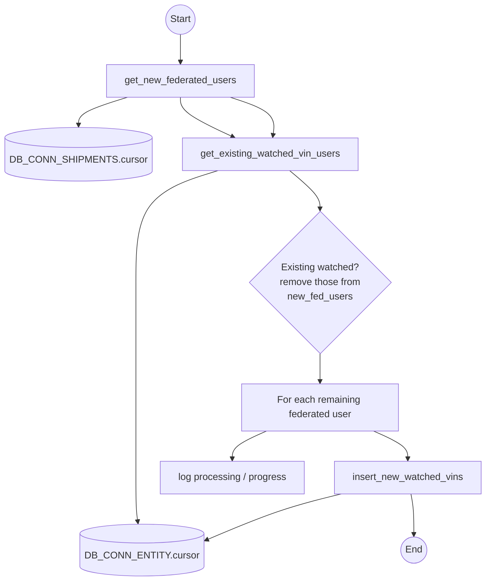
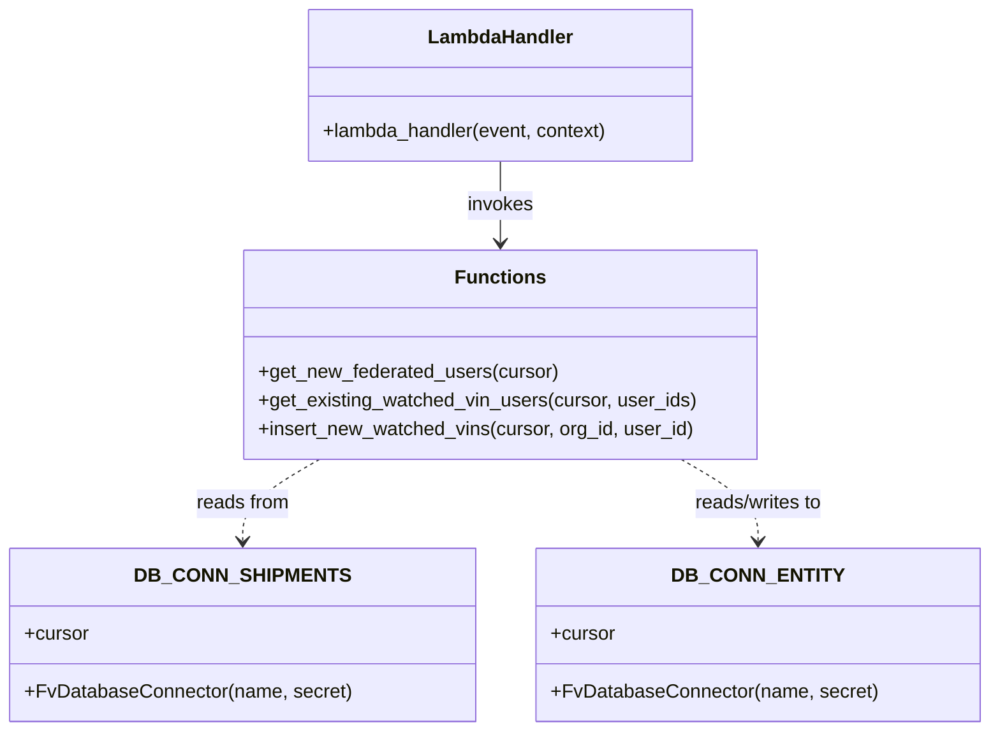

# Diagram: entity_core/watcher_service/watcher_service/backfill_visibility_for_dealer_users_after_wipe_FIN_6264.py

> Auto-generated by Obscura crawlers

## Diagram 1

### SVG

<svg id="container" width="798.14453125" xmlns="http://www.w3.org/2000/svg" class="flowchart" height="1025.3388061523438" viewBox="0 0 798.14453125 1025.3388061523438" role="graphics-document document" aria-roledescription="flowchart-v2"><g><marker id="container_flowchart-v2-pointEnd" class="marker flowchart-v2" viewBox="0 0 10 10" refX="5" refY="5" markerUnits="userSpaceOnUse" markerWidth="8" markerHeight="8" orient="auto"><path d="M 0 0 L 10 5 L 0 10 z" class="arrowMarkerPath" style="stroke-width: 1; stroke-dasharray: 1, 0;"></path></marker><marker id="container_flowchart-v2-pointStart" class="marker flowchart-v2" viewBox="0 0 10 10" refX="4.5" refY="5" markerUnits="userSpaceOnUse" markerWidth="8" markerHeight="8" orient="auto"><path d="M 0 5 L 10 10 L 10 0 z" class="arrowMarkerPath" style="stroke-width: 1; stroke-dasharray: 1, 0;"></path></marker><marker id="container_flowchart-v2-circleEnd" class="marker flowchart-v2" viewBox="0 0 10 10" refX="11" refY="5" markerUnits="userSpaceOnUse" markerWidth="11" markerHeight="11" orient="auto"><circle cx="5" cy="5" r="5" class="arrowMarkerPath" style="stroke-width: 1; stroke-dasharray: 1, 0;"></circle></marker><marker id="container_flowchart-v2-circleStart" class="marker flowchart-v2" viewBox="0 0 10 10" refX="-1" refY="5" markerUnits="userSpaceOnUse" markerWidth="11" markerHeight="11" orient="auto"><circle cx="5" cy="5" r="5" class="arrowMarkerPath" style="stroke-width: 1; stroke-dasharray: 1, 0;"></circle></marker><marker id="container_flowchart-v2-crossEnd" class="marker cross flowchart-v2" viewBox="0 0 11 11" refX="12" refY="5.2" markerUnits="userSpaceOnUse" markerWidth="11" markerHeight="11" orient="auto"><path d="M 1,1 l 9,9 M 10,1 l -9,9" class="arrowMarkerPath" style="stroke-width: 2; stroke-dasharray: 1, 0;"></path></marker><marker id="container_flowchart-v2-crossStart" class="marker cross flowchart-v2" viewBox="0 0 11 11" refX="-1" refY="5.2" markerUnits="userSpaceOnUse" markerWidth="11" markerHeight="11" orient="auto"><path d="M 1,1 l 9,9 M 10,1 l -9,9" class="arrowMarkerPath" style="stroke-width: 2; stroke-dasharray: 1, 0;"></path></marker><g class="root"><g class="clusters"></g><g class="edgePaths"><path d="M283.414,58.047L283.414,62.214C283.414,66.38,283.414,74.714,283.414,82.38C283.414,90.047,283.414,97.047,283.414,100.547L283.414,104.047" id="L_Start_GetNew_0" class="edge-thickness-normal edge-pattern-solid edge-thickness-normal edge-pattern-solid flowchart-link" style=";" data-edge="true" data-et="edge" data-id="L_Start_GetNew_0" data-points="W3sieCI6MjgzLjQxNDA2MjUsInkiOjU4LjA0Njg3NX0seyJ4IjoyODMuNDE0MDYyNSwieSI6ODMuMDQ2ODc1fSx7IngiOjI4My40MTQwNjI1LCJ5IjoxMDguMDQ2ODc1fV0=" marker-end="url(#container_flowchart-v2-pointEnd)"></path><path d="M198.337,162.047L185.208,166.214C172.079,170.38,145.821,178.714,132.692,186.38C119.563,194.047,119.563,201.047,119.563,204.547L119.563,208.047" id="L_GetNew_DB_SHIPMENTS_0" class="edge-thickness-normal edge-pattern-solid edge-thickness-normal edge-pattern-solid flowchart-link" style=";" data-edge="true" data-et="edge" data-id="L_GetNew_DB_SHIPMENTS_0" data-points="W3sieCI6MTk4LjMzNzI4OTY2MzQ2MTU1LCJ5IjoxNjIuMDQ2ODc1fSx7IngiOjExOS41NjI1LCJ5IjoxODcuMDQ2ODc1fSx7IngiOjExOS41NjI1LCJ5IjoyMTIuMDQ2ODc1fV0=" marker-end="url(#container_flowchart-v2-pointEnd)"></path><path d="M283.414,162.047L283.414,166.214C283.414,170.38,283.414,178.714,297.342,189.516C311.27,200.318,339.127,213.59,353.055,220.226L366.983,226.861" id="L_GetNew_GetExisting_0" class="edge-thickness-normal edge-pattern-solid edge-thickness-normal edge-pattern-solid flowchart-link" style=";" data-edge="true" data-et="edge" data-id="L_GetNew_GetExisting_0" data-points="W3sieCI6MjgzLjQxNDA2MjUsInkiOjE2Mi4wNDY4NzV9LHsieCI6MjgzLjQxNDA2MjUsInkiOjE4Ny4wNDY4NzV9LHsieCI6MzcwLjU5Mzk3NDc4MzQ0MTQ3LCJ5IjoyMjguNTgxODg2MjkxNTAzOX1d" marker-end="url(#container_flowchart-v2-pointEnd)"></path><path d="M338.482,282.582L315.718,289.504C292.955,296.427,247.429,310.272,224.666,346.528C201.902,382.784,201.902,441.45,201.902,500.117C201.902,558.784,201.902,617.45,201.902,657.45C201.902,697.45,201.902,718.784,201.902,740.117C201.902,761.45,201.902,782.784,201.902,802.117C201.902,821.45,201.902,838.784,201.902,856.117C201.902,873.45,201.902,890.784,202.425,902.963C202.948,915.142,203.993,922.168,204.516,925.681L205.039,929.193" id="L_GetExisting_DB_ENTITY_0" class="edge-thickness-normal edge-pattern-solid edge-thickness-normal edge-pattern-solid flowchart-link" style=";" data-edge="true" data-et="edge" data-id="L_GetExisting_DB_ENTITY_0" data-points="W3sieCI6MzM4LjQ4MTY4MTE1NzQ5OTgsInkiOjI4Mi41ODE4ODYyOTE1MDM5fSx7IngiOjIwMS45MDIzNDM3NSwieSI6MzI0LjExNjg5NzU4MzAwNzh9LHsieCI6MjAxLjkwMjM0Mzc1LCJ5Ijo1MDAuMTE2ODk3NTgzMDA3OH0seyJ4IjoyMDEuOTAyMzQzNzUsInkiOjY3Ni4xMTY4OTc1ODMwMDc4fSx7IngiOjIwMS45MDIzNDM3NSwieSI6NzQwLjExNjg5NzU4MzAwNzh9LHsieCI6MjAxLjkwMjM0Mzc1LCJ5Ijo4MDQuMTE2ODk3NTgzMDA3OH0seyJ4IjoyMDEuOTAyMzQzNzUsInkiOjg1Ni4xMTY4OTc1ODMwMDc4fSx7IngiOjIwMS45MDIzNDM3NSwieSI6OTA4LjExNjg5NzU4MzAwNzh9LHsieCI6MjA1LjYyNzUxOTcxMTkyODgsInkiOjkzMy4xNDk4NzQ4MjU2MDEzfV0=" marker-end="url(#container_flowchart-v2-pointEnd)"></path><path d="M363.299,162.047L375.626,166.214C387.954,170.38,412.61,178.714,424.024,189.143C435.438,199.573,433.61,212.098,432.697,218.361L431.783,224.624" id="L_GetNew_GetExisting_2" class="edge-thickness-normal edge-pattern-solid edge-thickness-normal edge-pattern-solid flowchart-link" style=";" data-edge="true" data-et="edge" data-id="L_GetNew_GetExisting_2" data-points="W3sieCI6MzYzLjI5ODUyNzY0NDIzMDgsInkiOjE2Mi4wNDY4NzV9LHsieCI6NDM3LjI2NTYyNSwieSI6MTg3LjA0Njg3NX0seyJ4Ijo0MzEuMjA1MjE3MjU5NjY0MSwieSI6MjI4LjU4MTg4NjI5MTUwMzl9XQ==" marker-end="url(#container_flowchart-v2-pointEnd)"></path><path d="M463.904,282.582L473.297,289.504C482.691,296.427,501.478,310.272,510.872,320.694C520.266,331.117,520.266,338.117,520.266,341.617L520.266,345.117" id="L_GetExisting_Filter_0" class="edge-thickness-normal edge-pattern-solid edge-thickness-normal edge-pattern-solid flowchart-link" style=";" data-edge="true" data-et="edge" data-id="L_GetExisting_Filter_0" data-points="W3sieCI6NDYzLjkwMzgzMzAxNDg3NjA2LCJ5IjoyODIuNTgxODg2MjkxNTAzOX0seyJ4Ijo1MjAuMjY1NjI1LCJ5IjozMjQuMTE2ODk3NTgzMDA3OH0seyJ4Ijo1MjAuMjY1NjI1LCJ5IjozNDkuMTE2ODk3NTgzMDA3OH1d" marker-end="url(#container_flowchart-v2-pointEnd)"></path><path d="M520.266,651.117L520.266,655.284C520.266,659.45,520.266,667.784,520.266,675.45C520.266,683.117,520.266,690.117,520.266,693.617L520.266,697.117" id="L_Filter_ForEach_0" class="edge-thickness-normal edge-pattern-solid edge-thickness-normal edge-pattern-solid flowchart-link" style=";" data-edge="true" data-et="edge" data-id="L_Filter_ForEach_0" data-points="W3sieCI6NTIwLjI2NTYyNSwieSI6NjUxLjExNjg5NzU4MzAwNzh9LHsieCI6NTIwLjI2NTYyNSwieSI6Njc2LjExNjg5NzU4MzAwNzh9LHsieCI6NTIwLjI2NTYyNSwieSI6NzAxLjExNjg5NzU4MzAwNzh9XQ==" marker-end="url(#container_flowchart-v2-pointEnd)"></path><path d="M430.614,779.117L421.036,783.284C411.457,787.45,392.301,795.784,382.723,803.45C373.145,811.117,373.145,818.117,373.145,821.617L373.145,825.117" id="L_ForEach_Log_0" class="edge-thickness-normal edge-pattern-solid edge-thickness-normal edge-pattern-solid flowchart-link" style=";" data-edge="true" data-et="edge" data-id="L_ForEach_Log_0" data-points="W3sieCI6NDMwLjYxMzcwODQ5NjA5Mzc1LCJ5Ijo3NzkuMTE2ODk3NTgzMDA3OH0seyJ4IjozNzMuMTQ0NTMxMjUsInkiOjgwNC4xMTY4OTc1ODMwMDc4fSx7IngiOjM3My4xNDQ1MzEyNSwieSI6ODI5LjExNjg5NzU4MzAwNzh9XQ==" marker-end="url(#container_flowchart-v2-pointEnd)"></path><path d="M609.918,779.117L619.496,783.284C629.074,787.45,648.23,795.784,657.809,803.45C667.387,811.117,667.387,818.117,667.387,821.617L667.387,825.117" id="L_ForEach_Insert_0" class="edge-thickness-normal edge-pattern-solid edge-thickness-normal edge-pattern-solid flowchart-link" style=";" data-edge="true" data-et="edge" data-id="L_ForEach_Insert_0" data-points="W3sieCI6NjA5LjkxNzU0MTUwMzkwNjIsInkiOjc3OS4xMTY4OTc1ODMwMDc4fSx7IngiOjY2Ny4zODY3MTg3NSwieSI6ODA0LjExNjg5NzU4MzAwNzh9LHsieCI6NjY3LjM4NjcxODc1LCJ5Ijo4MjkuMTE2ODk3NTgzMDA3OH1d" marker-end="url(#container_flowchart-v2-pointEnd)"></path><path d="M555.563,883.117L538.307,887.284C521.05,891.45,486.537,899.784,445.721,910.535C404.905,921.286,357.787,934.455,334.228,941.039L310.669,947.624" id="L_Insert_DB_ENTITY_0" class="edge-thickness-normal edge-pattern-solid edge-thickness-normal edge-pattern-solid flowchart-link" style=";" data-edge="true" data-et="edge" data-id="L_Insert_DB_ENTITY_0" data-points="W3sieCI6NTU1LjU2MzQ3NjU2MjUsInkiOjg4My4xMTY4OTc1ODMwMDc4fSx7IngiOjQ1Mi4wMjM0Mzc1LCJ5Ijo5MDguMTE2ODk3NTgzMDA3OH0seyJ4IjozMDYuODE2NDA2MjUsInkiOjk0OC43MDA0OTU4NTIwMTMyfV0=" marker-end="url(#container_flowchart-v2-pointEnd)"></path><path d="M672.579,883.117L673.38,887.284C674.182,891.45,675.784,899.784,676.585,910.939C677.387,922.094,677.387,936.071,677.387,943.06L677.387,950.048" id="L_Insert_End_0" class="edge-thickness-normal edge-pattern-solid edge-thickness-normal edge-pattern-solid flowchart-link" style=";" data-edge="true" data-et="edge" data-id="L_Insert_End_0" data-points="W3sieCI6NjcyLjU3OTAyNjQ0MjMwNzcsInkiOjg4My4xMTY4OTc1ODMwMDc4fSx7IngiOjY3Ny4zODY3MTg3NSwieSI6OTA4LjExNjg5NzU4MzAwNzh9LHsieCI6Njc3LjM4NjcxODc1LCJ5Ijo5NTQuMDQ4MTMzODUwMDk3N31d" marker-end="url(#container_flowchart-v2-pointEnd)"></path></g><g class="edgeLabels"><g class="edgeLabel"><g class="label" data-id="L_Start_GetNew_0" transform="translate(0, 0)"><foreignObject width="0" height="0">

</foreignObject></g></g><g class="edgeLabel"><g class="label" data-id="L_GetNew_DB_SHIPMENTS_0" transform="translate(0, 0)"><foreignObject width="0" height="0">

</foreignObject></g></g><g class="edgeLabel"><g class="label" data-id="L_GetNew_GetExisting_0" transform="translate(0, 0)"><foreignObject width="0" height="0">

</foreignObject></g></g><g class="edgeLabel"><g class="label" data-id="L_GetExisting_DB_ENTITY_0" transform="translate(0, 0)"><foreignObject width="0" height="0">

</foreignObject></g></g><g class="edgeLabel"><g class="label" data-id="L_GetNew_GetExisting_2" transform="translate(0, 0)"><foreignObject width="0" height="0">

</foreignObject></g></g><g class="edgeLabel"><g class="label" data-id="L_GetExisting_Filter_0" transform="translate(0, 0)"><foreignObject width="0" height="0">

</foreignObject></g></g><g class="edgeLabel"><g class="label" data-id="L_Filter_ForEach_0" transform="translate(0, 0)"><foreignObject width="0" height="0">

</foreignObject></g></g><g class="edgeLabel"><g class="label" data-id="L_ForEach_Log_0" transform="translate(0, 0)"><foreignObject width="0" height="0">

</foreignObject></g></g><g class="edgeLabel"><g class="label" data-id="L_ForEach_Insert_0" transform="translate(0, 0)"><foreignObject width="0" height="0">

</foreignObject></g></g><g class="edgeLabel"><g class="label" data-id="L_Insert_DB_ENTITY_0" transform="translate(0, 0)"><foreignObject width="0" height="0">

</foreignObject></g></g><g class="edgeLabel"><g class="label" data-id="L_Insert_End_0" transform="translate(0, 0)"><foreignObject width="0" height="0">

</foreignObject></g></g></g><g class="nodes"><g class="node default" id="flowchart-Start-0" transform="translate(283.4140625, 33.0234375)"><circle class="basic label-container" style="" r="25.0234375" cx="0" cy="0"></circle><g class="label" style="" transform="translate(-17.5234375, -12)"><rect></rect><foreignObject width="35.046875" height="24">

Start

</foreignObject></g></g><g class="node default" id="flowchart-GetNew-1" transform="translate(283.4140625, 135.046875)"><rect class="basic label-container" style="" x="-122.703125" y="-27" width="245.40625" height="54"></rect><g class="label" style="" transform="translate(-92.703125, -12)"><rect></rect><foreignObject width="185.40625" height="24">

get_new_federated_users

</foreignObject></g></g><g class="node default" id="flowchart-DB_SHIPMENTS-3" transform="translate(119.5625, 255.5818862915039)"><path d="M0,16.023339317773786 a111.5625,16.023339317773786 0,0,0 223.125,0 a111.5625,16.023339317773786 0,0,0 -223.125,0 l0,55.02333931777379 a111.5625,16.023339317773786 0,0,0 223.125,0 l0,-55.02333931777379" class="basic label-container" style="" transform="translate(-111.5625, -43.53500897666068)"></path><g class="label" style="" transform="translate(-104.0625, -2)"><rect></rect><foreignObject width="208.125" height="24">

DB_CONN_SHIPMENTS.cursor

</foreignObject></g></g><g class="node default" id="flowchart-GetExisting-5" transform="translate(427.265625, 255.5818862915039)"><rect class="basic label-container" style="" x="-146.140625" y="-27" width="292.28125" height="54"></rect><g class="label" style="" transform="translate(-116.140625, -12)"><rect></rect><foreignObject width="232.28125" height="24">

get_existing_watched_vin_users

</foreignObject></g></g><g class="node default" id="flowchart-DB_ENTITY-7" transform="translate(211.90234375, 975.2278213500977)"><path d="M0,15.073949079358776 a94.9140625,15.073949079358776 0,0,0 189.828125,0 a94.9140625,15.073949079358776 0,0,0 -189.828125,0 l0,54.073949079358776 a94.9140625,15.073949079358776 0,0,0 189.828125,0 l0,-54.073949079358776" class="basic label-container" style="" transform="translate(-94.9140625, -42.11092361903816)"></path><g class="label" style="" transform="translate(-87.4140625, -2)"><rect></rect><foreignObject width="174.828125" height="24">

DB_CONN_ENTITY.cursor

</foreignObject></g></g><g class="node default" id="flowchart-Filter-11" transform="translate(520.265625, 500.1168975830078)"><polygon points="151,0 302,-151 151,-302 0,-151" class="label-container" transform="translate(-150.5, 151)"></polygon><g class="label" style="" transform="translate(-100, -36)"><rect></rect><foreignObject width="200" height="72">

Existing watched?\nremove those from\nnew_fed_users

</foreignObject></g></g><g class="node default" id="flowchart-ForEach-13" transform="translate(520.265625, 740.1168975830078)"><rect class="basic label-container" style="" x="-130" y="-39" width="260" height="78"></rect><g class="label" style="" transform="translate(-100, -24)"><rect></rect><foreignObject width="200" height="48">

For each remaining federated user

</foreignObject></g></g><g class="node default" id="flowchart-Log-15" transform="translate(373.14453125, 856.1168975830078)"><rect class="basic label-container" style="" x="-121.484375" y="-27" width="242.96875" height="54"></rect><g class="label" style="" transform="translate(-91.484375, -12)"><rect></rect><foreignObject width="182.96875" height="24">

log processing / progress

</foreignObject></g></g><g class="node default" id="flowchart-Insert-17" transform="translate(667.38671875, 856.1168975830078)"><rect class="basic label-container" style="" x="-122.7578125" y="-27" width="245.515625" height="54"></rect><g class="label" style="" transform="translate(-92.7578125, -12)"><rect></rect><foreignObject width="185.515625" height="24">

insert_new_watched_vins

</foreignObject></g></g><g class="node default" id="flowchart-End-21" transform="translate(677.38671875, 975.2278213500977)"><circle class="basic label-container" style="" r="21.1796875" cx="0" cy="0"></circle><g class="label" style="" transform="translate(-13.6796875, -12)"><rect></rect><foreignObject width="27.359375" height="24">

End

</foreignObject></g></g></g></g></g></svg>

## Diagram 2

### SVG

<svg id="container" width="792.46875" xmlns="http://www.w3.org/2000/svg" class="classDiagram" height="608" viewBox="0 0 792.46875 608" role="graphics-document document" aria-roledescription="class"><g><defs><marker id="container_class-aggregationStart" class="marker aggregation class" refX="18" refY="7" markerWidth="190" markerHeight="240" orient="auto"><path d="M 18,7 L9,13 L1,7 L9,1 Z"></path></marker></defs><defs><marker id="container_class-aggregationEnd" class="marker aggregation class" refX="1" refY="7" markerWidth="20" markerHeight="28" orient="auto"><path d="M 18,7 L9,13 L1,7 L9,1 Z"></path></marker></defs><defs><marker id="container_class-extensionStart" class="marker extension class" refX="18" refY="7" markerWidth="190" markerHeight="240" orient="auto"><path d="M 1,7 L18,13 V 1 Z"></path></marker></defs><defs><marker id="container_class-extensionEnd" class="marker extension class" refX="1" refY="7" markerWidth="20" markerHeight="28" orient="auto"><path d="M 1,1 V 13 L18,7 Z"></path></marker></defs><defs><marker id="container_class-compositionStart" class="marker composition class" refX="18" refY="7" markerWidth="190" markerHeight="240" orient="auto"><path d="M 18,7 L9,13 L1,7 L9,1 Z"></path></marker></defs><defs><marker id="container_class-compositionEnd" class="marker composition class" refX="1" refY="7" markerWidth="20" markerHeight="28" orient="auto"><path d="M 18,7 L9,13 L1,7 L9,1 Z"></path></marker></defs><defs><marker id="container_class-dependencyStart" class="marker dependency class" refX="6" refY="7" markerWidth="190" markerHeight="240" orient="auto"><path d="M 5,7 L9,13 L1,7 L9,1 Z"></path></marker></defs><defs><marker id="container_class-dependencyEnd" class="marker dependency class" refX="13" refY="7" markerWidth="20" markerHeight="28" orient="auto"><path d="M 18,7 L9,13 L14,7 L9,1 Z"></path></marker></defs><defs><marker id="container_class-lollipopStart" class="marker lollipop class" refX="13" refY="7" markerWidth="190" markerHeight="240" orient="auto"><circle stroke="black" fill="transparent" cx="7" cy="7" r="6"></circle></marker></defs><defs><marker id="container_class-lollipopEnd" class="marker lollipop class" refX="1" refY="7" markerWidth="190" markerHeight="240" orient="auto"><circle stroke="black" fill="transparent" cx="7" cy="7" r="6"></circle></marker></defs><g class="root"><g class="clusters"></g><g class="edgePaths"><path d="M400.219,134L400.219,140.167C400.219,146.333,400.219,158.667,400.219,170C400.219,181.333,400.219,191.667,400.219,196.833L400.219,202" id="id_LambdaHandler_Functions_1" class="edge-thickness-normal edge-pattern-solid relation" style=";;;" data-edge="true" data-et="edge" data-id="id_LambdaHandler_Functions_1" data-points="W3sieCI6NDAwLjIxODc1LCJ5IjoxMzR9LHsieCI6NDAwLjIxODc1LCJ5IjoxNzF9LHsieCI6NDAwLjIxODc1LCJ5IjoyMDh9XQ==" marker-end="url(#container_class-dependencyEnd)"></path><path d="M255.253,382L244.978,388.167C234.703,394.333,214.152,406.667,203.877,418C193.602,429.333,193.602,439.667,193.602,444.833L193.602,450" id="id_Functions_DB_CONN_SHIPMENTS_2" class="edge-thickness-normal edge-pattern-dashed relation" style=";;;" data-edge="true" data-et="edge" data-id="id_Functions_DB_CONN_SHIPMENTS_2" data-points="W3sieCI6MjU1LjI1MzQ2NTIyMTc3NDIsInkiOjM4Mn0seyJ4IjoxOTMuNjAxNTYyNSwieSI6NDE5fSx7IngiOjE5My42MDE1NjI1LCJ5Ijo0NTZ9XQ==" marker-end="url(#container_class-dependencyEnd)"></path><path d="M545.184,382L555.459,388.167C565.735,394.333,586.285,406.667,596.561,418C606.836,429.333,606.836,439.667,606.836,444.833L606.836,450" id="id_Functions_DB_CONN_ENTITY_3" class="edge-thickness-normal edge-pattern-dashed relation" style=";;;" data-edge="true" data-et="edge" data-id="id_Functions_DB_CONN_ENTITY_3" data-points="W3sieCI6NTQ1LjE4NDAzNDc3ODIyNTksInkiOjM4Mn0seyJ4Ijo2MDYuODM1OTM3NSwieSI6NDE5fSx7IngiOjYwNi44MzU5Mzc1LCJ5Ijo0NTZ9XQ==" marker-end="url(#container_class-dependencyEnd)"></path></g><g class="edgeLabels"><g class="edgeLabel" transform="translate(400.21875, 171)"><g class="label" data-id="id_LambdaHandler_Functions_1" transform="translate(-27.5859375, -12)"><foreignObject width="55.171875" height="24">

invokes

</foreignObject></g></g><g class="edgeLabel" transform="translate(193.6015625, 419)"><g class="label" data-id="id_Functions_DB_CONN_SHIPMENTS_2" transform="translate(-39.1796875, -12)"><foreignObject width="78.359375" height="24">

reads from

</foreignObject></g></g><g class="edgeLabel" transform="translate(606.8359375, 419)"><g class="label" data-id="id_Functions_DB_CONN_ENTITY_3" transform="translate(-55.5078125, -12)"><foreignObject width="111.015625" height="24">

reads/writes to

</foreignObject></g></g></g><g class="nodes"><g class="node default" id="classId-LambdaHandler-0" transform="translate(400.21875, 71)"><g class="basic label-container"><path d="M-161.203125 -63 L161.203125 -63 L161.203125 63 L-161.203125 63" stroke="none" stroke-width="0" fill="#ECECFF" style=""></path><path d="M-161.203125 -63 C-78.61672248507251 -63, 3.9696800298549704 -63, 161.203125 -63 M-161.203125 -63 C-82.09297694038379 -63, -2.9828288807675847 -63, 161.203125 -63 M161.203125 -63 C161.203125 -21.52169823142379, 161.203125 19.956603537152418, 161.203125 63 M161.203125 -63 C161.203125 -30.239103432137156, 161.203125 2.5217931357256873, 161.203125 63 M161.203125 63 C90.66728915283524 63, 20.131453305670476 63, -161.203125 63 M161.203125 63 C77.04047066916533 63, -7.1221836616693395 63, -161.203125 63 M-161.203125 63 C-161.203125 16.71145578534376, -161.203125 -29.577088429312482, -161.203125 -63 M-161.203125 63 C-161.203125 15.016209481110565, -161.203125 -32.96758103777887, -161.203125 -63" stroke="#9370DB" stroke-width="1.3" fill="none" stroke-dasharray="0 0" style=""></path></g><g class="annotation-group text" transform="translate(0, -39)"></g><g class="label-group text" transform="translate(-58.21875, -39)"><g class="label" style="font-weight: bolder" transform="translate(0,-12)"><foreignObject width="116.4375" height="24">

LambdaHandler

</foreignObject></g></g><g class="members-group text" transform="translate(-149.203125, 9)"></g><g class="methods-group text" transform="translate(-149.203125, 39)"><g class="label" style="" transform="translate(0,-12)"><foreignObject width="240.1875" height="24">

+lambda_handler(event, context)

</foreignObject></g></g><g class="divider" style=""><path d="M-161.203125 -15 C-38.185516831572386 -15, 84.83209133685523 -15, 161.203125 -15 M-161.203125 -15 C-84.0277866475119 -15, -6.852448295023805 -15, 161.203125 -15" stroke="#9370DB" stroke-width="1.3" fill="none" stroke-dasharray="0 0" style=""></path></g><g class="divider" style=""><path d="M-161.203125 9 C-68.87021799999643 9, 23.462689000007146 9, 161.203125 9 M-161.203125 9 C-83.16883942198021 9, -5.134553843960418 9, 161.203125 9" stroke="#9370DB" stroke-width="1.3" fill="none" stroke-dasharray="0 0" style=""></path></g></g><g class="node default" id="classId-Functions-1" transform="translate(400.21875, 295)"><g class="basic label-container"><path d="M-211.28515625 -87 L211.28515625 -87 L211.28515625 87 L-211.28515625 87" stroke="none" stroke-width="0" fill="#ECECFF" style=""></path><path d="M-211.28515625 -87 C-59.01463201144344 -87, 93.25589222711312 -87, 211.28515625 -87 M-211.28515625 -87 C-66.90679274098494 -87, 77.47157076803012 -87, 211.28515625 -87 M211.28515625 -87 C211.28515625 -27.696910431841403, 211.28515625 31.606179136317195, 211.28515625 87 M211.28515625 -87 C211.28515625 -28.189178423150146, 211.28515625 30.621643153699708, 211.28515625 87 M211.28515625 87 C62.668560143087575 87, -85.94803596382485 87, -211.28515625 87 M211.28515625 87 C126.41706498756868 87, 41.54897372513736 87, -211.28515625 87 M-211.28515625 87 C-211.28515625 32.277780028853236, -211.28515625 -22.444439942293528, -211.28515625 -87 M-211.28515625 87 C-211.28515625 23.970840781122867, -211.28515625 -39.05831843775427, -211.28515625 -87" stroke="#9370DB" stroke-width="1.3" fill="none" stroke-dasharray="0 0" style=""></path></g><g class="annotation-group text" transform="translate(0, -63)"></g><g class="label-group text" transform="translate(-35.1328125, -63)"><g class="label" style="font-weight: bolder" transform="translate(0,-12)"><foreignObject width="70.265625" height="24">

Functions

</foreignObject></g></g><g class="members-group text" transform="translate(-199.28515625, -15)"></g><g class="methods-group text" transform="translate(-199.28515625, 15)"><g class="label" style="" transform="translate(0,-12)"><foreignObject width="249.484375" height="24">

+get_new_federated_users(cursor)

</foreignObject></g><g class="label" style="" transform="translate(0,12)"><foreignObject width="363.4375" height="24">

+get_existing_watched_vin_users(cursor, user_ids)

</foreignObject></g><g class="label" style="" transform="translate(0,36)"><foreignObject width="363.34375" height="24">

+insert_new_watched_vins(cursor, org_id, user_id)

</foreignObject></g></g><g class="divider" style=""><path d="M-211.28515625 -39 C-48.16096047570389 -39, 114.96323529859222 -39, 211.28515625 -39 M-211.28515625 -39 C-81.67816955800478 -39, 47.928817133990435 -39, 211.28515625 -39" stroke="#9370DB" stroke-width="1.3" fill="none" stroke-dasharray="0 0" style=""></path></g><g class="divider" style=""><path d="M-211.28515625 -15 C-52.37033995183694 -15, 106.54447634632612 -15, 211.28515625 -15 M-211.28515625 -15 C-110.71237488950464 -15, -10.13959352900929 -15, 211.28515625 -15" stroke="#9370DB" stroke-width="1.3" fill="none" stroke-dasharray="0 0" style=""></path></g></g><g class="node default" id="classId-DB_CONN_SHIPMENTS-2" transform="translate(193.6015625, 528)"><g class="basic label-container"><path d="M-185.6015625 -72 L185.6015625 -72 L185.6015625 72 L-185.6015625 72" stroke="none" stroke-width="0" fill="#ECECFF" style=""></path><path d="M-185.6015625 -72 C-89.1796443352282 -72, 7.242273829543592 -72, 185.6015625 -72 M-185.6015625 -72 C-98.5422710593162 -72, -11.482979618632413 -72, 185.6015625 -72 M185.6015625 -72 C185.6015625 -28.637888850001133, 185.6015625 14.724222299997734, 185.6015625 72 M185.6015625 -72 C185.6015625 -35.191428573761314, 185.6015625 1.6171428524773717, 185.6015625 72 M185.6015625 72 C58.91690555575343 72, -67.76775138849314 72, -185.6015625 72 M185.6015625 72 C81.35700499221456 72, -22.88755251557089 72, -185.6015625 72 M-185.6015625 72 C-185.6015625 32.748201007968596, -185.6015625 -6.503597984062807, -185.6015625 -72 M-185.6015625 72 C-185.6015625 19.051549475141698, -185.6015625 -33.896901049716604, -185.6015625 -72" stroke="#9370DB" stroke-width="1.3" fill="none" stroke-dasharray="0 0" style=""></path></g><g class="annotation-group text" transform="translate(0, -48)"></g><g class="label-group text" transform="translate(-79.75, -48)"><g class="label" style="font-weight: bolder" transform="translate(0,-12)"><foreignObject width="159.5" height="24">

DB_CONN_SHIPMENTS

</foreignObject></g></g><g class="members-group text" transform="translate(-173.6015625, 0)"><g class="label" style="" transform="translate(0,-12)"><foreignObject width="53.71875" height="24">

+cursor

</foreignObject></g></g><g class="methods-group text" transform="translate(-173.6015625, 48)"><g class="label" style="" transform="translate(0,-12)"><foreignObject width="267.453125" height="24">

+FvDatabaseConnector(name, secret)

</foreignObject></g></g><g class="divider" style=""><path d="M-185.6015625 -24 C-56.4745537580244 -24, 72.6524549839512 -24, 185.6015625 -24 M-185.6015625 -24 C-94.58690276428105 -24, -3.5722430285620987 -24, 185.6015625 -24" stroke="#9370DB" stroke-width="1.3" fill="none" stroke-dasharray="0 0" style=""></path></g><g class="divider" style=""><path d="M-185.6015625 24 C-56.03657375709136 24, 73.52841498581728 24, 185.6015625 24 M-185.6015625 24 C-77.59309896015503 24, 30.415364579689935 24, 185.6015625 24" stroke="#9370DB" stroke-width="1.3" fill="none" stroke-dasharray="0 0" style=""></path></g></g><g class="node default" id="classId-DB_CONN_ENTITY-3" transform="translate(606.8359375, 528)"><g class="basic label-container"><path d="M-177.6328125 -72 L177.6328125 -72 L177.6328125 72 L-177.6328125 72" stroke="none" stroke-width="0" fill="#ECECFF" style=""></path><path d="M-177.6328125 -72 C-57.070012382531644 -72, 63.49278773493671 -72, 177.6328125 -72 M-177.6328125 -72 C-55.86803861000679 -72, 65.89673527998642 -72, 177.6328125 -72 M177.6328125 -72 C177.6328125 -20.393526716186813, 177.6328125 31.212946567626375, 177.6328125 72 M177.6328125 -72 C177.6328125 -27.236713731529882, 177.6328125 17.526572536940236, 177.6328125 72 M177.6328125 72 C104.23100501249174 72, 30.82919752498347 72, -177.6328125 72 M177.6328125 72 C88.79364705465147 72, -0.045518390697054656 72, -177.6328125 72 M-177.6328125 72 C-177.6328125 17.490808670143664, -177.6328125 -37.01838265971267, -177.6328125 -72 M-177.6328125 72 C-177.6328125 17.789806538173472, -177.6328125 -36.420386923653055, -177.6328125 -72" stroke="#9370DB" stroke-width="1.3" fill="none" stroke-dasharray="0 0" style=""></path></g><g class="annotation-group text" transform="translate(0, -48)"></g><g class="label-group text" transform="translate(-63.8125, -48)"><g class="label" style="font-weight: bolder" transform="translate(0,-12)"><foreignObject width="127.625" height="24">

DB_CONN_ENTITY

</foreignObject></g></g><g class="members-group text" transform="translate(-165.6328125, 0)"><g class="label" style="" transform="translate(0,-12)"><foreignObject width="53.71875" height="24">

+cursor

</foreignObject></g></g><g class="methods-group text" transform="translate(-165.6328125, 48)"><g class="label" style="" transform="translate(0,-12)"><foreignObject width="267.453125" height="24">

+FvDatabaseConnector(name, secret)

</foreignObject></g></g><g class="divider" style=""><path d="M-177.6328125 -24 C-46.61254921485437 -24, 84.40771407029126 -24, 177.6328125 -24 M-177.6328125 -24 C-45.10860029783868 -24, 87.41561190432265 -24, 177.6328125 -24" stroke="#9370DB" stroke-width="1.3" fill="none" stroke-dasharray="0 0" style=""></path></g><g class="divider" style=""><path d="M-177.6328125 24 C-99.3004731681131 24, -20.9681338362262 24, 177.6328125 24 M-177.6328125 24 C-101.05597939568737 24, -24.479146291374747 24, 177.6328125 24" stroke="#9370DB" stroke-width="1.3" fill="none" stroke-dasharray="0 0" style=""></path></g></g></g></g></g></svg>
