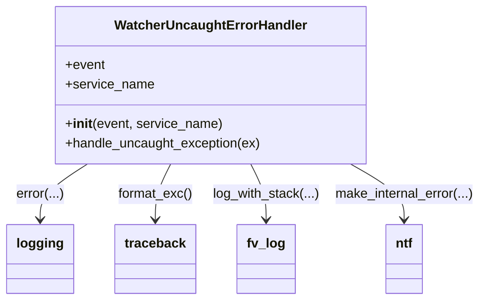
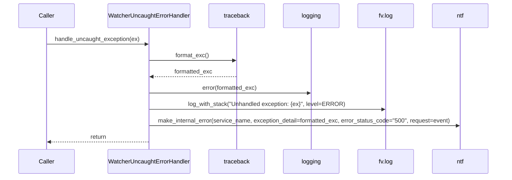

# Diagram: entity_core/watcher_service/watcher_service/common/error_handler.py

> Auto-generated by Obscura crawlers

## Diagram 1

### SVG

<svg id="container" width="578.8828125" xmlns="http://www.w3.org/2000/svg" class="classDiagram" height="366" viewBox="0 0 578.8828125 366" role="graphics-document document" aria-roledescription="class"><g><defs><marker id="container_class-aggregationStart" class="marker aggregation class" refX="18" refY="7" markerWidth="190" markerHeight="240" orient="auto"><path d="M 18,7 L9,13 L1,7 L9,1 Z"></path></marker></defs><defs><marker id="container_class-aggregationEnd" class="marker aggregation class" refX="1" refY="7" markerWidth="20" markerHeight="28" orient="auto"><path d="M 18,7 L9,13 L1,7 L9,1 Z"></path></marker></defs><defs><marker id="container_class-extensionStart" class="marker extension class" refX="18" refY="7" markerWidth="190" markerHeight="240" orient="auto"><path d="M 1,7 L18,13 V 1 Z"></path></marker></defs><defs><marker id="container_class-extensionEnd" class="marker extension class" refX="1" refY="7" markerWidth="20" markerHeight="28" orient="auto"><path d="M 1,1 V 13 L18,7 Z"></path></marker></defs><defs><marker id="container_class-compositionStart" class="marker composition class" refX="18" refY="7" markerWidth="190" markerHeight="240" orient="auto"><path d="M 18,7 L9,13 L1,7 L9,1 Z"></path></marker></defs><defs><marker id="container_class-compositionEnd" class="marker composition class" refX="1" refY="7" markerWidth="20" markerHeight="28" orient="auto"><path d="M 18,7 L9,13 L1,7 L9,1 Z"></path></marker></defs><defs><marker id="container_class-dependencyStart" class="marker dependency class" refX="6" refY="7" markerWidth="190" markerHeight="240" orient="auto"><path d="M 5,7 L9,13 L1,7 L9,1 Z"></path></marker></defs><defs><marker id="container_class-dependencyEnd" class="marker dependency class" refX="13" refY="7" markerWidth="20" markerHeight="28" orient="auto"><path d="M 18,7 L9,13 L14,7 L9,1 Z"></path></marker></defs><defs><marker id="container_class-lollipopStart" class="marker lollipop class" refX="13" refY="7" markerWidth="190" markerHeight="240" orient="auto"><circle stroke="black" fill="transparent" cx="7" cy="7" r="6"></circle></marker></defs><defs><marker id="container_class-lollipopEnd" class="marker lollipop class" refX="1" refY="7" markerWidth="190" markerHeight="240" orient="auto"><circle stroke="black" fill="transparent" cx="7" cy="7" r="6"></circle></marker></defs><g class="root"><g class="clusters"></g><g class="edgePaths"><path d="M103.568,200L94.158,206.167C84.748,212.333,65.929,224.667,56.519,236C47.109,247.333,47.109,257.667,47.109,262.833L47.109,268" id="id_WatcherUncaughtErrorHandler_logging_1" class="edge-thickness-normal edge-pattern-solid relation" style=";;;" data-edge="true" data-et="edge" data-id="id_WatcherUncaughtErrorHandler_logging_1" data-points="W3sieCI6MTAzLjU2Nzg0NTM5NDczNjg1LCJ5IjoyMDB9LHsieCI6NDcuMTA5Mzc1LCJ5IjoyMzd9LHsieCI6NDcuMTA5Mzc1LCJ5IjoyNzR9XQ==" marker-end="url(#container_class-dependencyEnd)"></path><path d="M202.404,200L199.343,206.167C196.283,212.333,190.161,224.667,187.1,236C184.039,247.333,184.039,257.667,184.039,262.833L184.039,268" id="id_WatcherUncaughtErrorHandler_traceback_2" class="edge-thickness-normal edge-pattern-solid relation" style=";;;" data-edge="true" data-et="edge" data-id="id_WatcherUncaughtErrorHandler_traceback_2" data-points="W3sieCI6MjAyLjQwNDMxMTU2MDE1MDM4LCJ5IjoyMDB9LHsieCI6MTg0LjAzOTA2MjUsInkiOjIzN30seyJ4IjoxODQuMDM5MDYyNSwieSI6Mjc0fV0=" marker-end="url(#container_class-dependencyEnd)"></path><path d="M297.705,200L300.766,206.167C303.827,212.333,309.949,224.667,313.009,236C316.07,247.333,316.07,257.667,316.07,262.833L316.07,268" id="id_WatcherUncaughtErrorHandler_fv_log_3" class="edge-thickness-normal edge-pattern-solid relation" style=";;;" data-edge="true" data-et="edge" data-id="id_WatcherUncaughtErrorHandler_fv_log_3" data-points="W3sieCI6Mjk3LjcwNTA2MzQzOTg0OTYsInkiOjIwMH0seyJ4IjozMTYuMDcwMzEyNSwieSI6MjM3fSx7IngiOjMxNi4wNzAzMTI1LCJ5IjoyNzR9XQ==" marker-end="url(#container_class-dependencyEnd)"></path><path d="M420.231,200L431.163,206.167C442.094,212.333,463.957,224.667,474.889,236C485.82,247.333,485.82,257.667,485.82,262.833L485.82,268" id="id_WatcherUncaughtErrorHandler_ntf_4" class="edge-thickness-normal edge-pattern-solid relation" style=";;;" data-edge="true" data-et="edge" data-id="id_WatcherUncaughtErrorHandler_ntf_4" data-points="W3sieCI6NDIwLjIzMTM3OTIyOTMyMzMsInkiOjIwMH0seyJ4Ijo0ODUuODIwMzEyNSwieSI6MjM3fSx7IngiOjQ4NS44MjAzMTI1LCJ5IjoyNzR9XQ==" marker-end="url(#container_class-dependencyEnd)"></path></g><g class="edgeLabels"><g class="edgeLabel" transform="translate(47.109375, 237)"><g class="label" data-id="id_WatcherUncaughtErrorHandler_logging_1" transform="translate(-29.0078125, -12)"><foreignObject width="58.015625" height="24">

error(...)

</foreignObject></g></g><g class="edgeLabel" transform="translate(184.0390625, 237)"><g class="label" data-id="id_WatcherUncaughtErrorHandler_traceback_2" transform="translate(-45.5625, -12)"><foreignObject width="91.125" height="24">

format_exc()

</foreignObject></g></g><g class="edgeLabel" transform="translate(316.0703125, 237)"><g class="label" data-id="id_WatcherUncaughtErrorHandler_fv_log_3" transform="translate(-64.6875, -12)"><foreignObject width="129.375" height="24">

log_with_stack(...)

</foreignObject></g></g><g class="edgeLabel" transform="translate(485.8203125, 237)"><g class="label" data-id="id_WatcherUncaughtErrorHandler_ntf_4" transform="translate(-85.0625, -12)"><foreignObject width="170.125" height="24">

make_internal_error(...)

</foreignObject></g></g></g><g class="nodes"><g class="node default" id="classId-WatcherUncaughtErrorHandler-0" transform="translate(250.0546875, 104)"><g class="basic label-container"><path d="M-187.5 -96 L187.5 -96 L187.5 96 L-187.5 96" stroke="none" stroke-width="0" fill="#ECECFF" style=""></path><path d="M-187.5 -96 C-73.88090247156237 -96, 39.73819505687527 -96, 187.5 -96 M-187.5 -96 C-63.07334483284582 -96, 61.35331033430836 -96, 187.5 -96 M187.5 -96 C187.5 -43.81941196015984, 187.5 8.36117607968032, 187.5 96 M187.5 -96 C187.5 -42.72496358941714, 187.5 10.550072821165713, 187.5 96 M187.5 96 C80.19779833382611 96, -27.104403332347772 96, -187.5 96 M187.5 96 C102.20312381341411 96, 16.90624762682822 96, -187.5 96 M-187.5 96 C-187.5 19.376468856576835, -187.5 -57.24706228684633, -187.5 -96 M-187.5 96 C-187.5 33.36653679795417, -187.5 -29.266926404091663, -187.5 -96" stroke="#9370DB" stroke-width="1.3" fill="none" stroke-dasharray="0 0" style=""></path></g><g class="annotation-group text" transform="translate(0, -72)"></g><g class="label-group text" transform="translate(-111.859375, -72)"><g class="label" style="font-weight: bolder" transform="translate(0,-12)"><foreignObject width="223.71875" height="24">

WatcherUncaughtErrorHandler

</foreignObject></g></g><g class="members-group text" transform="translate(-175.5, -24)"><g class="label" style="" transform="translate(0,-12)"><foreignObject width="48.328125" height="24">

+event

</foreignObject></g><g class="label" style="" transform="translate(0,12)"><foreignObject width="107.296875" height="24">

+service_name

</foreignObject></g></g><g class="methods-group text" transform="translate(-175.5, 48)"><g class="label" style="" transform="translate(0,-12)"><foreignObject width="190.59375" height="24">

+<strong>init</strong>(event, service_name)

</foreignObject></g><g class="label" style="" transform="translate(0,12)"><foreignObject width="239.140625" height="24">

+handle_uncaught_exception(ex)

</foreignObject></g></g><g class="divider" style=""><path d="M-187.5 -48 C-86.07658598884227 -48, 15.346828022315464 -48, 187.5 -48 M-187.5 -48 C-70.33360510195345 -48, 46.832789796093095 -48, 187.5 -48" stroke="#9370DB" stroke-width="1.3" fill="none" stroke-dasharray="0 0" style=""></path></g><g class="divider" style=""><path d="M-187.5 24 C-62.01488119828976 24, 63.470237603420486 24, 187.5 24 M-187.5 24 C-90.62873463484297 24, 6.2425307303140585 24, 187.5 24" stroke="#9370DB" stroke-width="1.3" fill="none" stroke-dasharray="0 0" style=""></path></g></g><g class="node default" id="classId-logging-1" transform="translate(47.109375, 316)"><g class="basic label-container"><path d="M-39.109375 -42 L39.109375 -42 L39.109375 42 L-39.109375 42" stroke="none" stroke-width="0" fill="#ECECFF" style=""></path><path d="M-39.109375 -42 C-13.675411539443182 -42, 11.758551921113636 -42, 39.109375 -42 M-39.109375 -42 C-19.69246527682581 -42, -0.2755555536516212 -42, 39.109375 -42 M39.109375 -42 C39.109375 -21.155716818223524, 39.109375 -0.3114336364470489, 39.109375 42 M39.109375 -42 C39.109375 -12.883779864630682, 39.109375 16.232440270738635, 39.109375 42 M39.109375 42 C19.26175632727979 42, -0.5858623454404182 42, -39.109375 42 M39.109375 42 C16.827638210105597 42, -5.4540985797888055 42, -39.109375 42 M-39.109375 42 C-39.109375 9.503880175848515, -39.109375 -22.99223964830297, -39.109375 -42 M-39.109375 42 C-39.109375 11.803005486804015, -39.109375 -18.39398902639197, -39.109375 -42" stroke="#9370DB" stroke-width="1.3" fill="none" stroke-dasharray="0 0" style=""></path></g><g class="annotation-group text" transform="translate(0, -18)"></g><g class="label-group text" transform="translate(-27.109375, -18)"><g class="label" style="font-weight: bolder" transform="translate(0,-12)"><foreignObject width="54.21875" height="24">

logging

</foreignObject></g></g><g class="members-group text" transform="translate(-27.109375, 30)"></g><g class="methods-group text" transform="translate(-27.109375, 60)"></g><g class="divider" style=""><path d="M-39.109375 6 C-10.980935005203278 6, 17.147504989593443 6, 39.109375 6 M-39.109375 6 C-10.463598752844696 6, 18.182177494310608 6, 39.109375 6" stroke="#9370DB" stroke-width="1.3" fill="none" stroke-dasharray="0 0" style=""></path></g><g class="divider" style=""><path d="M-39.109375 24 C-21.847056766083863 24, -4.5847385321677265 24, 39.109375 24 M-39.109375 24 C-15.752371553406856 24, 7.604631893186287 24, 39.109375 24" stroke="#9370DB" stroke-width="1.3" fill="none" stroke-dasharray="0 0" style=""></path></g></g><g class="node default" id="classId-traceback-2" transform="translate(184.0390625, 316)"><g class="basic label-container"><path d="M-47.8203125 -42 L47.8203125 -42 L47.8203125 42 L-47.8203125 42" stroke="none" stroke-width="0" fill="#ECECFF" style=""></path><path d="M-47.8203125 -42 C-9.799693034192373 -42, 28.220926431615254 -42, 47.8203125 -42 M-47.8203125 -42 C-25.50895175799375 -42, -3.1975910159874985 -42, 47.8203125 -42 M47.8203125 -42 C47.8203125 -14.910508441405042, 47.8203125 12.178983117189915, 47.8203125 42 M47.8203125 -42 C47.8203125 -22.893643671368103, 47.8203125 -3.7872873427362066, 47.8203125 42 M47.8203125 42 C26.072082361566977 42, 4.3238522231339545 42, -47.8203125 42 M47.8203125 42 C11.969983737247382 42, -23.880345025505235 42, -47.8203125 42 M-47.8203125 42 C-47.8203125 23.446053529903182, -47.8203125 4.892107059806364, -47.8203125 -42 M-47.8203125 42 C-47.8203125 21.069523483866682, -47.8203125 0.1390469677333641, -47.8203125 -42" stroke="#9370DB" stroke-width="1.3" fill="none" stroke-dasharray="0 0" style=""></path></g><g class="annotation-group text" transform="translate(0, -18)"></g><g class="label-group text" transform="translate(-35.8203125, -18)"><g class="label" style="font-weight: bolder" transform="translate(0,-12)"><foreignObject width="71.640625" height="24">

traceback

</foreignObject></g></g><g class="members-group text" transform="translate(-35.8203125, 30)"></g><g class="methods-group text" transform="translate(-35.8203125, 60)"></g><g class="divider" style=""><path d="M-47.8203125 6 C-9.637136845775188 6, 28.546038808449623 6, 47.8203125 6 M-47.8203125 6 C-24.38235862808773 6, -0.9444047561754587 6, 47.8203125 6" stroke="#9370DB" stroke-width="1.3" fill="none" stroke-dasharray="0 0" style=""></path></g><g class="divider" style=""><path d="M-47.8203125 24 C-20.8982842672491 24, 6.023743965501801 24, 47.8203125 24 M-47.8203125 24 C-11.664426383122716 24, 24.491459733754567 24, 47.8203125 24" stroke="#9370DB" stroke-width="1.3" fill="none" stroke-dasharray="0 0" style=""></path></g></g><g class="node default" id="classId-fv_log-3" transform="translate(316.0703125, 316)"><g class="basic label-container"><path d="M-34.2109375 -42 L34.2109375 -42 L34.2109375 42 L-34.2109375 42" stroke="none" stroke-width="0" fill="#ECECFF" style=""></path><path d="M-34.2109375 -42 C-10.433226359220928 -42, 13.344484781558144 -42, 34.2109375 -42 M-34.2109375 -42 C-18.986876086857077 -42, -3.7628146737141535 -42, 34.2109375 -42 M34.2109375 -42 C34.2109375 -13.466304338797741, 34.2109375 15.067391322404518, 34.2109375 42 M34.2109375 -42 C34.2109375 -19.725196775277247, 34.2109375 2.5496064494455055, 34.2109375 42 M34.2109375 42 C10.314008504090165 42, -13.58292049181967 42, -34.2109375 42 M34.2109375 42 C10.150555053316499 42, -13.909827393367003 42, -34.2109375 42 M-34.2109375 42 C-34.2109375 9.098877737754883, -34.2109375 -23.802244524490234, -34.2109375 -42 M-34.2109375 42 C-34.2109375 14.008385008106664, -34.2109375 -13.983229983786671, -34.2109375 -42" stroke="#9370DB" stroke-width="1.3" fill="none" stroke-dasharray="0 0" style=""></path></g><g class="annotation-group text" transform="translate(0, -18)"></g><g class="label-group text" transform="translate(-22.2109375, -18)"><g class="label" style="font-weight: bolder" transform="translate(0,-12)"><foreignObject width="44.421875" height="24">

fv_log

</foreignObject></g></g><g class="members-group text" transform="translate(-22.2109375, 30)"></g><g class="methods-group text" transform="translate(-22.2109375, 60)"></g><g class="divider" style=""><path d="M-34.2109375 6 C-15.374603336714724 6, 3.4617308265705518 6, 34.2109375 6 M-34.2109375 6 C-13.446430001283197 6, 7.318077497433606 6, 34.2109375 6" stroke="#9370DB" stroke-width="1.3" fill="none" stroke-dasharray="0 0" style=""></path></g><g class="divider" style=""><path d="M-34.2109375 24 C-18.93047241915845 24, -3.6500073383168967 24, 34.2109375 24 M-34.2109375 24 C-13.716091390468229 24, 6.778754719063542 24, 34.2109375 24" stroke="#9370DB" stroke-width="1.3" fill="none" stroke-dasharray="0 0" style=""></path></g></g><g class="node default" id="classId-ntf-4" transform="translate(485.8203125, 316)"><g class="basic label-container"><path d="M-22.5546875 -42 L22.5546875 -42 L22.5546875 42 L-22.5546875 42" stroke="none" stroke-width="0" fill="#ECECFF" style=""></path><path d="M-22.5546875 -42 C-9.618754398863706 -42, 3.3171787022725887 -42, 22.5546875 -42 M-22.5546875 -42 C-6.476462485772483 -42, 9.601762528455033 -42, 22.5546875 -42 M22.5546875 -42 C22.5546875 -10.77235100028085, 22.5546875 20.4552979994383, 22.5546875 42 M22.5546875 -42 C22.5546875 -12.517406854626778, 22.5546875 16.965186290746445, 22.5546875 42 M22.5546875 42 C11.935317438824129 42, 1.315947377648257 42, -22.5546875 42 M22.5546875 42 C9.554833964136925 42, -3.4450195717261494 42, -22.5546875 42 M-22.5546875 42 C-22.5546875 23.666778086459807, -22.5546875 5.333556172919614, -22.5546875 -42 M-22.5546875 42 C-22.5546875 18.990776014719064, -22.5546875 -4.018447970561873, -22.5546875 -42" stroke="#9370DB" stroke-width="1.3" fill="none" stroke-dasharray="0 0" style=""></path></g><g class="annotation-group text" transform="translate(0, -18)"></g><g class="label-group text" transform="translate(-10.5546875, -18)"><g class="label" style="font-weight: bolder" transform="translate(0,-12)"><foreignObject width="21.109375" height="24">

ntf

</foreignObject></g></g><g class="members-group text" transform="translate(-10.5546875, 30)"></g><g class="methods-group text" transform="translate(-10.5546875, 60)"></g><g class="divider" style=""><path d="M-22.5546875 6 C-12.24990383895357 6, -1.945120177907139 6, 22.5546875 6 M-22.5546875 6 C-10.943466841895768 6, 0.6677538162084637 6, 22.5546875 6" stroke="#9370DB" stroke-width="1.3" fill="none" stroke-dasharray="0 0" style=""></path></g><g class="divider" style=""><path d="M-22.5546875 24 C-8.14965210754664 24, 6.255383284906721 24, 22.5546875 24 M-22.5546875 24 C-9.353497306060055 24, 3.847692887879891 24, 22.5546875 24" stroke="#9370DB" stroke-width="1.3" fill="none" stroke-dasharray="0 0" style=""></path></g></g></g></g></g></svg>

## Diagram 2

### SVG

<svg id="container" width="1397" xmlns="http://www.w3.org/2000/svg" height="507" viewBox="-50 -10 1397 507" role="graphics-document document" aria-roledescription="sequence"><g><rect x="1147" y="421" fill="#eaeaea" stroke="#666" width="150" height="65" name="NTF" rx="3" ry="3" class="actor actor-bottom"></rect><text x="1222" y="453.5" dominant-baseline="central" alignment-baseline="central" class="actor actor-box" style="text-anchor: middle; font-size: 16px; font-weight: 400;"><tspan x="1222" dy="0">ntf</tspan></text></g><g><rect x="947" y="421" fill="#eaeaea" stroke="#666" width="150" height="65" name="FVLog" rx="3" ry="3" class="actor actor-bottom"></rect><text x="1022" y="453.5" dominant-baseline="central" alignment-baseline="central" class="actor actor-box" style="text-anchor: middle; font-size: 16px; font-weight: 400;"><tspan x="1022" dy="0">fv.log</tspan></text></g><g><rect x="747" y="421" fill="#eaeaea" stroke="#666" width="150" height="65" name="Logging" rx="3" ry="3" class="actor actor-bottom"></rect><text x="822" y="453.5" dominant-baseline="central" alignment-baseline="central" class="actor actor-box" style="text-anchor: middle; font-size: 16px; font-weight: 400;"><tspan x="822" dy="0">logging</tspan></text></g><g><rect x="547" y="421" fill="#eaeaea" stroke="#666" width="150" height="65" name="Traceback" rx="3" ry="3" class="actor actor-bottom"></rect><text x="622" y="453.5" dominant-baseline="central" alignment-baseline="central" class="actor actor-box" style="text-anchor: middle; font-size: 16px; font-weight: 400;"><tspan x="622" dy="0">traceback</tspan></text></g><g><rect x="255" y="421" fill="#eaeaea" stroke="#666" width="242" height="65" name="Handler" rx="3" ry="3" class="actor actor-bottom"></rect><text x="376" y="453.5" dominant-baseline="central" alignment-baseline="central" class="actor actor-box" style="text-anchor: middle; font-size: 16px; font-weight: 400;"><tspan x="376" dy="0">WatcherUncaughtErrorHandler</tspan></text></g><g><rect x="0" y="421" fill="#eaeaea" stroke="#666" width="150" height="65" name="Caller" rx="3" ry="3" class="actor actor-bottom"></rect><text x="75" y="453.5" dominant-baseline="central" alignment-baseline="central" class="actor actor-box" style="text-anchor: middle; font-size: 16px; font-weight: 400;"><tspan x="75" dy="0">Caller</tspan></text></g><g><line id="actor5" x1="1222" y1="65" x2="1222" y2="421" class="actor-line 200" stroke-width="0.5px" stroke="#999" name="NTF"></line><g id="root-5"><rect x="1147" y="0" fill="#eaeaea" stroke="#666" width="150" height="65" name="NTF" rx="3" ry="3" class="actor actor-top"></rect><text x="1222" y="32.5" dominant-baseline="central" alignment-baseline="central" class="actor actor-box" style="text-anchor: middle; font-size: 16px; font-weight: 400;"><tspan x="1222" dy="0">ntf</tspan></text></g></g><g><line id="actor4" x1="1022" y1="65" x2="1022" y2="421" class="actor-line 200" stroke-width="0.5px" stroke="#999" name="FVLog"></line><g id="root-4"><rect x="947" y="0" fill="#eaeaea" stroke="#666" width="150" height="65" name="FVLog" rx="3" ry="3" class="actor actor-top"></rect><text x="1022" y="32.5" dominant-baseline="central" alignment-baseline="central" class="actor actor-box" style="text-anchor: middle; font-size: 16px; font-weight: 400;"><tspan x="1022" dy="0">fv.log</tspan></text></g></g><g><line id="actor3" x1="822" y1="65" x2="822" y2="421" class="actor-line 200" stroke-width="0.5px" stroke="#999" name="Logging"></line><g id="root-3"><rect x="747" y="0" fill="#eaeaea" stroke="#666" width="150" height="65" name="Logging" rx="3" ry="3" class="actor actor-top"></rect><text x="822" y="32.5" dominant-baseline="central" alignment-baseline="central" class="actor actor-box" style="text-anchor: middle; font-size: 16px; font-weight: 400;"><tspan x="822" dy="0">logging</tspan></text></g></g><g><line id="actor2" x1="622" y1="65" x2="622" y2="421" class="actor-line 200" stroke-width="0.5px" stroke="#999" name="Traceback"></line><g id="root-2"><rect x="547" y="0" fill="#eaeaea" stroke="#666" width="150" height="65" name="Traceback" rx="3" ry="3" class="actor actor-top"></rect><text x="622" y="32.5" dominant-baseline="central" alignment-baseline="central" class="actor actor-box" style="text-anchor: middle; font-size: 16px; font-weight: 400;"><tspan x="622" dy="0">traceback</tspan></text></g></g><g><line id="actor1" x1="376" y1="65" x2="376" y2="421" class="actor-line 200" stroke-width="0.5px" stroke="#999" name="Handler"></line><g id="root-1"><rect x="255" y="0" fill="#eaeaea" stroke="#666" width="242" height="65" name="Handler" rx="3" ry="3" class="actor actor-top"></rect><text x="376" y="32.5" dominant-baseline="central" alignment-baseline="central" class="actor actor-box" style="text-anchor: middle; font-size: 16px; font-weight: 400;"><tspan x="376" dy="0">WatcherUncaughtErrorHandler</tspan></text></g></g><g><line id="actor0" x1="75" y1="65" x2="75" y2="421" class="actor-line 200" stroke-width="0.5px" stroke="#999" name="Caller"></line><g id="root-0"><rect x="0" y="0" fill="#eaeaea" stroke="#666" width="150" height="65" name="Caller" rx="3" ry="3" class="actor actor-top"></rect><text x="75" y="32.5" dominant-baseline="central" alignment-baseline="central" class="actor actor-box" style="text-anchor: middle; font-size: 16px; font-weight: 400;"><tspan x="75" dy="0">Caller</tspan></text></g></g><g></g><defs><symbol id="computer" width="24" height="24"><path transform="scale(.5)" d="M2 2v13h20v-13h-20zm18 11h-16v-9h16v9zm-10.228 6l.466-1h3.524l.467 1h-4.457zm14.228 3h-24l2-6h2.104l-1.33 4h18.45l-1.297-4h2.073l2 6zm-5-10h-14v-7h14v7z"></path></symbol></defs><defs><symbol id="database" fill-rule="evenodd" clip-rule="evenodd"><path transform="scale(.5)" d="M12.258.001l.256.004.255.005.253.008.251.01.249.012.247.015.246.016.242.019.241.02.239.023.236.024.233.027.231.028.229.031.225.032.223.034.22.036.217.038.214.04.211.041.208.043.205.045.201.046.198.048.194.05.191.051.187.053.183.054.18.056.175.057.172.059.168.06.163.061.16.063.155.064.15.066.074.033.073.033.071.034.07.034.069.035.068.035.067.035.066.035.064.036.064.036.062.036.06.036.06.037.058.037.058.037.055.038.055.038.053.038.052.038.051.039.05.039.048.039.047.039.045.04.044.04.043.04.041.04.04.041.039.041.037.041.036.041.034.041.033.042.032.042.03.042.029.042.027.042.026.043.024.043.023.043.021.043.02.043.018.044.017.043.015.044.013.044.012.044.011.045.009.044.007.045.006.045.004.045.002.045.001.045v17l-.001.045-.002.045-.004.045-.006.045-.007.045-.009.044-.011.045-.012.044-.013.044-.015.044-.017.043-.018.044-.02.043-.021.043-.023.043-.024.043-.026.043-.027.042-.029.042-.03.042-.032.042-.033.042-.034.041-.036.041-.037.041-.039.041-.04.041-.041.04-.043.04-.044.04-.045.04-.047.039-.048.039-.05.039-.051.039-.052.038-.053.038-.055.038-.055.038-.058.037-.058.037-.06.037-.06.036-.062.036-.064.036-.064.036-.066.035-.067.035-.068.035-.069.035-.07.034-.071.034-.073.033-.074.033-.15.066-.155.064-.16.063-.163.061-.168.06-.172.059-.175.057-.18.056-.183.054-.187.053-.191.051-.194.05-.198.048-.201.046-.205.045-.208.043-.211.041-.214.04-.217.038-.22.036-.223.034-.225.032-.229.031-.231.028-.233.027-.236.024-.239.023-.241.02-.242.019-.246.016-.247.015-.249.012-.251.01-.253.008-.255.005-.256.004-.258.001-.258-.001-.256-.004-.255-.005-.253-.008-.251-.01-.249-.012-.247-.015-.245-.016-.243-.019-.241-.02-.238-.023-.236-.024-.234-.027-.231-.028-.228-.031-.226-.032-.223-.034-.22-.036-.217-.038-.214-.04-.211-.041-.208-.043-.204-.045-.201-.046-.198-.048-.195-.05-.19-.051-.187-.053-.184-.054-.179-.056-.176-.057-.172-.059-.167-.06-.164-.061-.159-.063-.155-.064-.151-.066-.074-.033-.072-.033-.072-.034-.07-.034-.069-.035-.068-.035-.067-.035-.066-.035-.064-.036-.063-.036-.062-.036-.061-.036-.06-.037-.058-.037-.057-.037-.056-.038-.055-.038-.053-.038-.052-.038-.051-.039-.049-.039-.049-.039-.046-.039-.046-.04-.044-.04-.043-.04-.041-.04-.04-.041-.039-.041-.037-.041-.036-.041-.034-.041-.033-.042-.032-.042-.03-.042-.029-.042-.027-.042-.026-.043-.024-.043-.023-.043-.021-.043-.02-.043-.018-.044-.017-.043-.015-.044-.013-.044-.012-.044-.011-.045-.009-.044-.007-.045-.006-.045-.004-.045-.002-.045-.001-.045v-17l.001-.045.002-.045.004-.045.006-.045.007-.045.009-.044.011-.045.012-.044.013-.044.015-.044.017-.043.018-.044.02-.043.021-.043.023-.043.024-.043.026-.043.027-.042.029-.042.03-.042.032-.042.033-.042.034-.041.036-.041.037-.041.039-.041.04-.041.041-.04.043-.04.044-.04.046-.04.046-.039.049-.039.049-.039.051-.039.052-.038.053-.038.055-.038.056-.038.057-.037.058-.037.06-.037.061-.036.062-.036.063-.036.064-.036.066-.035.067-.035.068-.035.069-.035.07-.034.072-.034.072-.033.074-.033.151-.066.155-.064.159-.063.164-.061.167-.06.172-.059.176-.057.179-.056.184-.054.187-.053.19-.051.195-.05.198-.048.201-.046.204-.045.208-.043.211-.041.214-.04.217-.038.22-.036.223-.034.226-.032.228-.031.231-.028.234-.027.236-.024.238-.023.241-.02.243-.019.245-.016.247-.015.249-.012.251-.01.253-.008.255-.005.256-.004.258-.001.258.001zm-9.258 20.499v.01l.001.021.003.021.004.022.005.021.006.022.007.022.009.023.01.022.011.023.012.023.013.023.015.023.016.024.017.023.018.024.019.024.021.024.022.025.023.024.024.025.052.049.056.05.061.051.066.051.07.051.075.051.079.052.084.052.088.052.092.052.097.052.102.051.105.052.11.052.114.051.119.051.123.051.127.05.131.05.135.05.139.048.144.049.147.047.152.047.155.047.16.045.163.045.167.043.171.043.176.041.178.041.183.039.187.039.19.037.194.035.197.035.202.033.204.031.209.03.212.029.216.027.219.025.222.024.226.021.23.02.233.018.236.016.24.015.243.012.246.01.249.008.253.005.256.004.259.001.26-.001.257-.004.254-.005.25-.008.247-.011.244-.012.241-.014.237-.016.233-.018.231-.021.226-.021.224-.024.22-.026.216-.027.212-.028.21-.031.205-.031.202-.034.198-.034.194-.036.191-.037.187-.039.183-.04.179-.04.175-.042.172-.043.168-.044.163-.045.16-.046.155-.046.152-.047.148-.048.143-.049.139-.049.136-.05.131-.05.126-.05.123-.051.118-.052.114-.051.11-.052.106-.052.101-.052.096-.052.092-.052.088-.053.083-.051.079-.052.074-.052.07-.051.065-.051.06-.051.056-.05.051-.05.023-.024.023-.025.021-.024.02-.024.019-.024.018-.024.017-.024.015-.023.014-.024.013-.023.012-.023.01-.023.01-.022.008-.022.006-.022.006-.022.004-.022.004-.021.001-.021.001-.021v-4.127l-.077.055-.08.053-.083.054-.085.053-.087.052-.09.052-.093.051-.095.05-.097.05-.1.049-.102.049-.105.048-.106.047-.109.047-.111.046-.114.045-.115.045-.118.044-.12.043-.122.042-.124.042-.126.041-.128.04-.13.04-.132.038-.134.038-.135.037-.138.037-.139.035-.142.035-.143.034-.144.033-.147.032-.148.031-.15.03-.151.03-.153.029-.154.027-.156.027-.158.026-.159.025-.161.024-.162.023-.163.022-.165.021-.166.02-.167.019-.169.018-.169.017-.171.016-.173.015-.173.014-.175.013-.175.012-.177.011-.178.01-.179.008-.179.008-.181.006-.182.005-.182.004-.184.003-.184.002h-.37l-.184-.002-.184-.003-.182-.004-.182-.005-.181-.006-.179-.008-.179-.008-.178-.01-.176-.011-.176-.012-.175-.013-.173-.014-.172-.015-.171-.016-.17-.017-.169-.018-.167-.019-.166-.02-.165-.021-.163-.022-.162-.023-.161-.024-.159-.025-.157-.026-.156-.027-.155-.027-.153-.029-.151-.03-.15-.03-.148-.031-.146-.032-.145-.033-.143-.034-.141-.035-.14-.035-.137-.037-.136-.037-.134-.038-.132-.038-.13-.04-.128-.04-.126-.041-.124-.042-.122-.042-.12-.044-.117-.043-.116-.045-.113-.045-.112-.046-.109-.047-.106-.047-.105-.048-.102-.049-.1-.049-.097-.05-.095-.05-.093-.052-.09-.051-.087-.052-.085-.053-.083-.054-.08-.054-.077-.054v4.127zm0-5.654v.011l.001.021.003.021.004.021.005.022.006.022.007.022.009.022.01.022.011.023.012.023.013.023.015.024.016.023.017.024.018.024.019.024.021.024.022.024.023.025.024.024.052.05.056.05.061.05.066.051.07.051.075.052.079.051.084.052.088.052.092.052.097.052.102.052.105.052.11.051.114.051.119.052.123.05.127.051.131.05.135.049.139.049.144.048.147.048.152.047.155.046.16.045.163.045.167.044.171.042.176.042.178.04.183.04.187.038.19.037.194.036.197.034.202.033.204.032.209.03.212.028.216.027.219.025.222.024.226.022.23.02.233.018.236.016.24.014.243.012.246.01.249.008.253.006.256.003.259.001.26-.001.257-.003.254-.006.25-.008.247-.01.244-.012.241-.015.237-.016.233-.018.231-.02.226-.022.224-.024.22-.025.216-.027.212-.029.21-.03.205-.032.202-.033.198-.035.194-.036.191-.037.187-.039.183-.039.179-.041.175-.042.172-.043.168-.044.163-.045.16-.045.155-.047.152-.047.148-.048.143-.048.139-.05.136-.049.131-.05.126-.051.123-.051.118-.051.114-.052.11-.052.106-.052.101-.052.096-.052.092-.052.088-.052.083-.052.079-.052.074-.051.07-.052.065-.051.06-.05.056-.051.051-.049.023-.025.023-.024.021-.025.02-.024.019-.024.018-.024.017-.024.015-.023.014-.023.013-.024.012-.022.01-.023.01-.023.008-.022.006-.022.006-.022.004-.021.004-.022.001-.021.001-.021v-4.139l-.077.054-.08.054-.083.054-.085.052-.087.053-.09.051-.093.051-.095.051-.097.05-.1.049-.102.049-.105.048-.106.047-.109.047-.111.046-.114.045-.115.044-.118.044-.12.044-.122.042-.124.042-.126.041-.128.04-.13.039-.132.039-.134.038-.135.037-.138.036-.139.036-.142.035-.143.033-.144.033-.147.033-.148.031-.15.03-.151.03-.153.028-.154.028-.156.027-.158.026-.159.025-.161.024-.162.023-.163.022-.165.021-.166.02-.167.019-.169.018-.169.017-.171.016-.173.015-.173.014-.175.013-.175.012-.177.011-.178.009-.179.009-.179.007-.181.007-.182.005-.182.004-.184.003-.184.002h-.37l-.184-.002-.184-.003-.182-.004-.182-.005-.181-.007-.179-.007-.179-.009-.178-.009-.176-.011-.176-.012-.175-.013-.173-.014-.172-.015-.171-.016-.17-.017-.169-.018-.167-.019-.166-.02-.165-.021-.163-.022-.162-.023-.161-.024-.159-.025-.157-.026-.156-.027-.155-.028-.153-.028-.151-.03-.15-.03-.148-.031-.146-.033-.145-.033-.143-.033-.141-.035-.14-.036-.137-.036-.136-.037-.134-.038-.132-.039-.13-.039-.128-.04-.126-.041-.124-.042-.122-.043-.12-.043-.117-.044-.116-.044-.113-.046-.112-.046-.109-.046-.106-.047-.105-.048-.102-.049-.1-.049-.097-.05-.095-.051-.093-.051-.09-.051-.087-.053-.085-.052-.083-.054-.08-.054-.077-.054v4.139zm0-5.666v.011l.001.02.003.022.004.021.005.022.006.021.007.022.009.023.01.022.011.023.012.023.013.023.015.023.016.024.017.024.018.023.019.024.021.025.022.024.023.024.024.025.052.05.056.05.061.05.066.051.07.051.075.052.079.051.084.052.088.052.092.052.097.052.102.052.105.051.11.052.114.051.119.051.123.051.127.05.131.05.135.05.139.049.144.048.147.048.152.047.155.046.16.045.163.045.167.043.171.043.176.042.178.04.183.04.187.038.19.037.194.036.197.034.202.033.204.032.209.03.212.028.216.027.219.025.222.024.226.021.23.02.233.018.236.017.24.014.243.012.246.01.249.008.253.006.256.003.259.001.26-.001.257-.003.254-.006.25-.008.247-.01.244-.013.241-.014.237-.016.233-.018.231-.02.226-.022.224-.024.22-.025.216-.027.212-.029.21-.03.205-.032.202-.033.198-.035.194-.036.191-.037.187-.039.183-.039.179-.041.175-.042.172-.043.168-.044.163-.045.16-.045.155-.047.152-.047.148-.048.143-.049.139-.049.136-.049.131-.051.126-.05.123-.051.118-.052.114-.051.11-.052.106-.052.101-.052.096-.052.092-.052.088-.052.083-.052.079-.052.074-.052.07-.051.065-.051.06-.051.056-.05.051-.049.023-.025.023-.025.021-.024.02-.024.019-.024.018-.024.017-.024.015-.023.014-.024.013-.023.012-.023.01-.022.01-.023.008-.022.006-.022.006-.022.004-.022.004-.021.001-.021.001-.021v-4.153l-.077.054-.08.054-.083.053-.085.053-.087.053-.09.051-.093.051-.095.051-.097.05-.1.049-.102.048-.105.048-.106.048-.109.046-.111.046-.114.046-.115.044-.118.044-.12.043-.122.043-.124.042-.126.041-.128.04-.13.039-.132.039-.134.038-.135.037-.138.036-.139.036-.142.034-.143.034-.144.033-.147.032-.148.032-.15.03-.151.03-.153.028-.154.028-.156.027-.158.026-.159.024-.161.024-.162.023-.163.023-.165.021-.166.02-.167.019-.169.018-.169.017-.171.016-.173.015-.173.014-.175.013-.175.012-.177.01-.178.01-.179.009-.179.007-.181.006-.182.006-.182.004-.184.003-.184.001-.185.001-.185-.001-.184-.001-.184-.003-.182-.004-.182-.006-.181-.006-.179-.007-.179-.009-.178-.01-.176-.01-.176-.012-.175-.013-.173-.014-.172-.015-.171-.016-.17-.017-.169-.018-.167-.019-.166-.02-.165-.021-.163-.023-.162-.023-.161-.024-.159-.024-.157-.026-.156-.027-.155-.028-.153-.028-.151-.03-.15-.03-.148-.032-.146-.032-.145-.033-.143-.034-.141-.034-.14-.036-.137-.036-.136-.037-.134-.038-.132-.039-.13-.039-.128-.041-.126-.041-.124-.041-.122-.043-.12-.043-.117-.044-.116-.044-.113-.046-.112-.046-.109-.046-.106-.048-.105-.048-.102-.048-.1-.05-.097-.049-.095-.051-.093-.051-.09-.052-.087-.052-.085-.053-.083-.053-.08-.054-.077-.054v4.153zm8.74-8.179l-.257.004-.254.005-.25.008-.247.011-.244.012-.241.014-.237.016-.233.018-.231.021-.226.022-.224.023-.22.026-.216.027-.212.028-.21.031-.205.032-.202.033-.198.034-.194.036-.191.038-.187.038-.183.04-.179.041-.175.042-.172.043-.168.043-.163.045-.16.046-.155.046-.152.048-.148.048-.143.048-.139.049-.136.05-.131.05-.126.051-.123.051-.118.051-.114.052-.11.052-.106.052-.101.052-.096.052-.092.052-.088.052-.083.052-.079.052-.074.051-.07.052-.065.051-.06.05-.056.05-.051.05-.023.025-.023.024-.021.024-.02.025-.019.024-.018.024-.017.023-.015.024-.014.023-.013.023-.012.023-.01.023-.01.022-.008.022-.006.023-.006.021-.004.022-.004.021-.001.021-.001.021.001.021.001.021.004.021.004.022.006.021.006.023.008.022.01.022.01.023.012.023.013.023.014.023.015.024.017.023.018.024.019.024.02.025.021.024.023.024.023.025.051.05.056.05.06.05.065.051.07.052.074.051.079.052.083.052.088.052.092.052.096.052.101.052.106.052.11.052.114.052.118.051.123.051.126.051.131.05.136.05.139.049.143.048.148.048.152.048.155.046.16.046.163.045.168.043.172.043.175.042.179.041.183.04.187.038.191.038.194.036.198.034.202.033.205.032.21.031.212.028.216.027.22.026.224.023.226.022.231.021.233.018.237.016.241.014.244.012.247.011.25.008.254.005.257.004.26.001.26-.001.257-.004.254-.005.25-.008.247-.011.244-.012.241-.014.237-.016.233-.018.231-.021.226-.022.224-.023.22-.026.216-.027.212-.028.21-.031.205-.032.202-.033.198-.034.194-.036.191-.038.187-.038.183-.04.179-.041.175-.042.172-.043.168-.043.163-.045.16-.046.155-.046.152-.048.148-.048.143-.048.139-.049.136-.05.131-.05.126-.051.123-.051.118-.051.114-.052.11-.052.106-.052.101-.052.096-.052.092-.052.088-.052.083-.052.079-.052.074-.051.07-.052.065-.051.06-.05.056-.05.051-.05.023-.025.023-.024.021-.024.02-.025.019-.024.018-.024.017-.023.015-.024.014-.023.013-.023.012-.023.01-.023.01-.022.008-.022.006-.023.006-.021.004-.022.004-.021.001-.021.001-.021-.001-.021-.001-.021-.004-.021-.004-.022-.006-.021-.006-.023-.008-.022-.01-.022-.01-.023-.012-.023-.013-.023-.014-.023-.015-.024-.017-.023-.018-.024-.019-.024-.02-.025-.021-.024-.023-.024-.023-.025-.051-.05-.056-.05-.06-.05-.065-.051-.07-.052-.074-.051-.079-.052-.083-.052-.088-.052-.092-.052-.096-.052-.101-.052-.106-.052-.11-.052-.114-.052-.118-.051-.123-.051-.126-.051-.131-.05-.136-.05-.139-.049-.143-.048-.148-.048-.152-.048-.155-.046-.16-.046-.163-.045-.168-.043-.172-.043-.175-.042-.179-.041-.183-.04-.187-.038-.191-.038-.194-.036-.198-.034-.202-.033-.205-.032-.21-.031-.212-.028-.216-.027-.22-.026-.224-.023-.226-.022-.231-.021-.233-.018-.237-.016-.241-.014-.244-.012-.247-.011-.25-.008-.254-.005-.257-.004-.26-.001-.26.001z"></path></symbol></defs><defs><symbol id="clock" width="24" height="24"><path transform="scale(.5)" d="M12 2c5.514 0 10 4.486 10 10s-4.486 10-10 10-10-4.486-10-10 4.486-10 10-10zm0-2c-6.627 0-12 5.373-12 12s5.373 12 12 12 12-5.373 12-12-5.373-12-12-12zm5.848 12.459c.202.038.202.333.001.372-1.907.361-6.045 1.111-6.547 1.111-.719 0-1.301-.582-1.301-1.301 0-.512.77-5.447 1.125-7.445.034-.192.312-.181.343.014l.985 6.238 5.394 1.011z"></path></symbol></defs><defs><marker id="arrowhead" refX="7.9" refY="5" markerUnits="userSpaceOnUse" markerWidth="12" markerHeight="12" orient="auto-start-reverse"><path d="M -1 0 L 10 5 L 0 10 z"></path></marker></defs><defs><marker id="crosshead" markerWidth="15" markerHeight="8" orient="auto" refX="4" refY="4.5"><path fill="none" stroke="#000000" stroke-width="1pt" d="M 1,2 L 6,7 M 6,2 L 1,7" style="stroke-dasharray: 0, 0;"></path></marker></defs><defs><marker id="filled-head" refX="15.5" refY="7" markerWidth="20" markerHeight="28" orient="auto"><path d="M 18,7 L9,13 L14,7 L9,1 Z"></path></marker></defs><defs><marker id="sequencenumber" refX="15" refY="15" markerWidth="60" markerHeight="40" orient="auto"><circle cx="15" cy="15" r="6"></circle></marker></defs><text x="224" y="80" text-anchor="middle" dominant-baseline="middle" alignment-baseline="middle" class="messageText" dy="1em" style="font-size: 16px; font-weight: 400;">handle_uncaught_exception(ex)</text><line x1="76" y1="113" x2="372" y2="113" class="messageLine0" stroke-width="2" stroke="none" marker-end="url(#arrowhead)" style="fill: none;"></line><text x="498" y="128" text-anchor="middle" dominant-baseline="middle" alignment-baseline="middle" class="messageText" dy="1em" style="font-size: 16px; font-weight: 400;">format_exc()</text><line x1="377" y1="161" x2="618" y2="161" class="messageLine0" stroke-width="2" stroke="none" marker-end="url(#arrowhead)" style="fill: none;"></line><text x="501" y="176" text-anchor="middle" dominant-baseline="middle" alignment-baseline="middle" class="messageText" dy="1em" style="font-size: 16px; font-weight: 400;">formatted_exc</text><line x1="621" y1="209" x2="380" y2="209" class="messageLine1" stroke-width="2" stroke="none" marker-end="url(#arrowhead)" style="stroke-dasharray: 3, 3; fill: none;"></line><text x="598" y="224" text-anchor="middle" dominant-baseline="middle" alignment-baseline="middle" class="messageText" dy="1em" style="font-size: 16px; font-weight: 400;">error(formatted_exc)</text><line x1="377" y1="257" x2="818" y2="257" class="messageLine0" stroke-width="2" stroke="none" marker-end="url(#arrowhead)" style="fill: none;"></line><text x="698" y="272" text-anchor="middle" dominant-baseline="middle" alignment-baseline="middle" class="messageText" dy="1em" style="font-size: 16px; font-weight: 400;">log_with_stack("Unhandled exception: {ex}", level=ERROR)</text><line x1="377" y1="305" x2="1018" y2="305" class="messageLine0" stroke-width="2" stroke="none" marker-end="url(#arrowhead)" style="fill: none;"></line><text x="798" y="320" text-anchor="middle" dominant-baseline="middle" alignment-baseline="middle" class="messageText" dy="1em" style="font-size: 16px; font-weight: 400;">make_internal_error(service_name, exception_detail=formatted_exc, error_status_code="500", request=event)</text><line x1="377" y1="353" x2="1218" y2="353" class="messageLine0" stroke-width="2" stroke="none" marker-end="url(#arrowhead)" style="fill: none;"></line><text x="227" y="368" text-anchor="middle" dominant-baseline="middle" alignment-baseline="middle" class="messageText" dy="1em" style="font-size: 16px; font-weight: 400;">return</text><line x1="375" y1="401" x2="79" y2="401" class="messageLine1" stroke-width="2" stroke="none" marker-end="url(#arrowhead)" style="stroke-dasharray: 3, 3; fill: none;"></line></svg>
