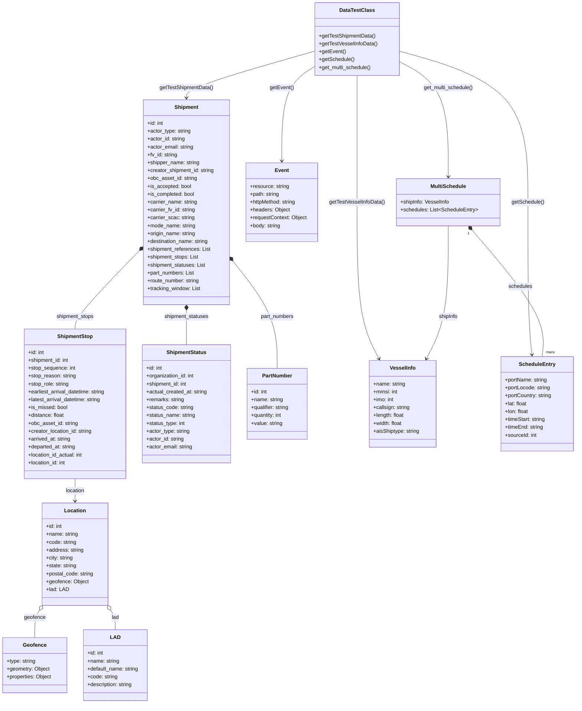

# Diagram: entity_core/watcher_service/watcher_service/common/ocean_vessel_test_data.py

> Auto-generated by Obscura crawlers

## Diagram 1

### SVG

<svg id="container" width="1757.5234375" xmlns="http://www.w3.org/2000/svg" class="classDiagram" height="2142" viewBox="0 0 1757.5234375 2142" role="graphics-document document" aria-roledescription="class"><g><defs><marker id="container_class-aggregationStart" class="marker aggregation class" refX="18" refY="7" markerWidth="190" markerHeight="240" orient="auto"><path d="M 18,7 L9,13 L1,7 L9,1 Z"></path></marker></defs><defs><marker id="container_class-aggregationEnd" class="marker aggregation class" refX="1" refY="7" markerWidth="20" markerHeight="28" orient="auto"><path d="M 18,7 L9,13 L1,7 L9,1 Z"></path></marker></defs><defs><marker id="container_class-extensionStart" class="marker extension class" refX="18" refY="7" markerWidth="190" markerHeight="240" orient="auto"><path d="M 1,7 L18,13 V 1 Z"></path></marker></defs><defs><marker id="container_class-extensionEnd" class="marker extension class" refX="1" refY="7" markerWidth="20" markerHeight="28" orient="auto"><path d="M 1,1 V 13 L18,7 Z"></path></marker></defs><defs><marker id="container_class-compositionStart" class="marker composition class" refX="18" refY="7" markerWidth="190" markerHeight="240" orient="auto"><path d="M 18,7 L9,13 L1,7 L9,1 Z"></path></marker></defs><defs><marker id="container_class-compositionEnd" class="marker composition class" refX="1" refY="7" markerWidth="20" markerHeight="28" orient="auto"><path d="M 18,7 L9,13 L1,7 L9,1 Z"></path></marker></defs><defs><marker id="container_class-dependencyStart" class="marker dependency class" refX="6" refY="7" markerWidth="190" markerHeight="240" orient="auto"><path d="M 5,7 L9,13 L1,7 L9,1 Z"></path></marker></defs><defs><marker id="container_class-dependencyEnd" class="marker dependency class" refX="13" refY="7" markerWidth="20" markerHeight="28" orient="auto"><path d="M 18,7 L9,13 L14,7 L9,1 Z"></path></marker></defs><defs><marker id="container_class-lollipopStart" class="marker lollipop class" refX="13" refY="7" markerWidth="190" markerHeight="240" orient="auto"><circle stroke="black" fill="transparent" cx="7" cy="7" r="6"></circle></marker></defs><defs><marker id="container_class-lollipopEnd" class="marker lollipop class" refX="1" refY="7" markerWidth="190" markerHeight="240" orient="auto"><circle stroke="black" fill="transparent" cx="7" cy="7" r="6"></circle></marker></defs><g class="root"><g class="clusters"></g><g class="edgePaths"><path d="M968.418,154.791L902.447,173.493C836.476,192.194,704.534,229.597,638.563,253.465C572.592,277.333,572.592,287.667,572.592,292.833L572.592,298" id="id_DataTestClass_Shipment_1" class="edge-thickness-normal edge-pattern-solid relation" style=";;;" data-edge="true" data-et="edge" data-id="id_DataTestClass_Shipment_1" data-points="W3sieCI6OTY4LjQxNzk2ODc1LCJ5IjoxNTQuNzkxNDc1NzE4OTI5OTJ9LHsieCI6NTcyLjU5MTc5Njg3NSwieSI6MjY3fSx7IngiOjU3Mi41OTE3OTY4NzUsInkiOjMwNH1d" marker-end="url(#container_class-dependencyEnd)"></path><path d="M1094.676,230L1094.676,236.167C1094.676,242.333,1094.676,254.667,1094.676,319C1094.676,383.333,1094.676,499.667,1094.676,616C1094.676,732.333,1094.676,848.667,1105.731,928.113C1116.786,1007.559,1138.896,1050.117,1149.95,1071.396L1161.005,1092.676" id="id_DataTestClass_VesselInfo_2" class="edge-thickness-normal edge-pattern-solid relation" style=";;;" data-edge="true" data-et="edge" data-id="id_DataTestClass_VesselInfo_2" data-points="W3sieCI6MTA5NC42NzU3ODEyNSwieSI6MjMwfSx7IngiOjEwOTQuNjc1NzgxMjUsInkiOjI2N30seyJ4IjoxMDk0LjY3NTc4MTI1LCJ5Ijo2MTZ9LHsieCI6MTA5NC42NzU3ODEyNSwieSI6OTY1fSx7IngiOjExNjMuNzcxNDc3MDA0NzE2OSwieSI6MTA5OH1d" marker-end="url(#container_class-dependencyEnd)"></path><path d="M968.418,200.709L951.346,211.758C934.273,222.806,900.129,244.903,883.057,293.118C865.984,341.333,865.984,415.667,865.984,452.833L865.984,490" id="id_DataTestClass_Event_3" class="edge-thickness-normal edge-pattern-solid relation" style=";;;" data-edge="true" data-et="edge" data-id="id_DataTestClass_Event_3" data-points="W3sieCI6OTY4LjQxNzk2ODc1LCJ5IjoyMDAuNzA5MDQ0MzI0ODc4Mjh9LHsieCI6ODY1Ljk4NDM3NSwieSI6MjY3fSx7IngiOjg2NS45ODQzNzUsInkiOjQ5Nn1d" marker-end="url(#container_class-dependencyEnd)"></path><path d="M1220.934,155.234L1285.842,173.861C1350.751,192.489,1480.569,229.745,1545.478,306.539C1610.387,383.333,1610.387,499.667,1610.387,616C1610.387,732.333,1610.387,848.667,1612.429,926.006C1614.471,1003.345,1618.555,1041.689,1620.597,1060.861L1622.64,1080.034" id="id_DataTestClass_ScheduleEntry_4" class="edge-thickness-normal edge-pattern-solid relation" style=";;;" data-edge="true" data-et="edge" data-id="id_DataTestClass_ScheduleEntry_4" data-points="W3sieCI6MTIyMC45MzM1OTM3NSwieSI6MTU1LjIzMzc3OTIxODYxNTA3fSx7IngiOjE2MTAuMzg2NzE4NzUsInkiOjI2N30seyJ4IjoxNjEwLjM4NjcxODc1LCJ5Ijo2MTZ9LHsieCI6MTYxMC4zODY3MTg3NSwieSI6OTY1fSx7IngiOjE2MjMuMjc1MDczNzAyODMwMiwieSI6MTA4Nn1d" marker-end="url(#container_class-dependencyEnd)"></path><path d="M1220.934,186.865L1245.781,200.221C1270.629,213.577,1320.324,240.288,1345.172,298.811C1370.02,357.333,1370.02,447.667,1370.02,492.833L1370.02,538" id="id_DataTestClass_MultiSchedule_5" class="edge-thickness-normal edge-pattern-solid relation" style=";;;" data-edge="true" data-et="edge" data-id="id_DataTestClass_MultiSchedule_5" data-points="W3sieCI6MTIyMC45MzM1OTM3NSwieSI6MTg2Ljg2NDgyODA1NTgzOTN9LHsieCI6MTM3MC4wMTk1MzEyNSwieSI6MjY3fSx7IngiOjEzNzAuMDE5NTMxMjUsInkiOjU0NH1d" marker-end="url(#container_class-dependencyEnd)"></path><path d="M427.3,763.329L394.153,796.941C361.006,830.553,294.712,897.776,261.565,937.555C228.418,977.333,228.418,989.667,228.418,995.833L228.418,1002" id="id_Shipment_ShipmentStop_6" class="edge-thickness-normal edge-pattern-solid relation" style=";;;" data-edge="true" data-et="edge" data-id="id_Shipment_ShipmentStop_6" data-points="W3sieCI6NDM5LjQxMjEwOTM3NSwieSI6NzUxLjA0NzE5NzQ4OTQ1OX0seyJ4IjoyMjguNDE3OTY4NzUsInkiOjk2NX0seyJ4IjoyMjguNDE3OTY4NzUsInkiOjEwMDJ9XQ==" marker-start="url(#container_class-compositionStart)"></path><path d="M571.363,945.25L571.35,948.542C571.338,951.833,571.314,958.417,571.301,975.875C571.289,993.333,571.289,1021.667,571.289,1035.833L571.289,1050" id="id_Shipment_ShipmentStatus_7" class="edge-thickness-normal edge-pattern-solid relation" style=";;;" data-edge="true" data-et="edge" data-id="id_Shipment_ShipmentStatus_7" data-points="W3sieCI6NTcxLjQyNzE3NDc0MDMyOTUsInkiOjkyOH0seyJ4Ijo1NzEuMjg5MDYyNSwieSI6OTY1fSx7IngiOjU3MS4yODkwNjI1LCJ5IjoxMDUwfV0=" marker-start="url(#container_class-compositionStart)"></path><path d="M716.493,797.378L738.657,825.315C760.822,853.252,805.151,909.126,827.316,963.23C849.48,1017.333,849.48,1069.667,849.48,1095.833L849.48,1122" id="id_Shipment_PartNumber_8" class="edge-thickness-normal edge-pattern-solid relation" style=";;;" data-edge="true" data-et="edge" data-id="id_Shipment_PartNumber_8" data-points="W3sieCI6NzA1Ljc3MTQ4NDM3NSwieSI6NzgzLjg2NDI1NjEzODU5MzZ9LHsieCI6ODQ5LjQ4MDQ2ODc1LCJ5Ijo5NjV9LHsieCI6ODQ5LjQ4MDQ2ODc1LCJ5IjoxMTIyfV0=" marker-start="url(#container_class-compositionStart)"></path><path d="M228.418,1458L228.418,1464.167C228.418,1470.333,228.418,1482.667,228.418,1494C228.418,1505.333,228.418,1515.667,228.418,1520.833L228.418,1526" id="id_ShipmentStop_Location_9" class="edge-thickness-normal edge-pattern-solid relation" style=";;;" data-edge="true" data-et="edge" data-id="id_ShipmentStop_Location_9" data-points="W3sieCI6MjI4LjQxNzk2ODc1LCJ5IjoxNDU4fSx7IngiOjIyOC40MTc5Njg3NSwieSI6MTQ5NX0seyJ4IjoyMjguNDE3OTY4NzUsInkiOjE1MzJ9XQ==" marker-end="url(#container_class-dependencyEnd)"></path><path d="M120.593,1858.581L118.231,1862.318C115.869,1866.054,111.146,1873.527,108.784,1887.43C106.422,1901.333,106.422,1921.667,106.422,1931.833L106.422,1942" id="id_Location_Geofence_10" class="edge-thickness-normal edge-pattern-solid relation" style=";;;" data-edge="true" data-et="edge" data-id="id_Location_Geofence_10" data-points="W3sieCI6MTI5LjgwOTcyNzE2OTY4OTEzLCJ5IjoxODQ0fSx7IngiOjEwNi40MjE4NzUsInkiOjE4ODF9LHsieCI6MTA2LjQyMTg3NSwieSI6MTk0Mn1d" marker-start="url(#container_class-aggregationStart)"></path><path d="M338.387,1858.336L340.826,1862.113C343.265,1865.891,348.142,1873.445,350.581,1883.389C353.02,1893.333,353.02,1905.667,353.02,1911.833L353.02,1918" id="id_Location_LAD_11" class="edge-thickness-normal edge-pattern-solid relation" style=";;;" data-edge="true" data-et="edge" data-id="id_Location_LAD_11" data-points="W3sieCI6MzI5LjAzMTI1LCJ5IjoxODQzLjg0MzY1NzkwOTU4N30seyJ4IjozNTMuMDE5NTMxMjUsInkiOjE4ODF9LHsieCI6MzUzLjAxOTUzMTI1LCJ5IjoxOTE4fV0=" marker-start="url(#container_class-aggregationStart)"></path><path d="M1442.43,701.14L1479.832,745.117C1517.233,789.094,1592.037,877.047,1627.29,941.19C1662.544,1005.333,1658.248,1045.667,1656.1,1065.833L1653.951,1086" id="id_MultiSchedule_ScheduleEntry_12" class="edge-thickness-normal edge-pattern-solid relation" style=";;;" data-edge="true" data-et="edge" data-id="id_MultiSchedule_ScheduleEntry_12" data-points="W3sieCI6MTQzMS4yNTQ2NjczNTMxNTIsInkiOjY4OH0seyJ4IjoxNjY2LjgzOTg0Mzc1LCJ5Ijo5NjV9LHsieCI6MTY1My45NTE0ODg3OTcxNjk4LCJ5IjoxMDg2fV0=" marker-start="url(#container_class-compositionStart)"></path><path d="M1370.02,688L1370.02,734.167C1370.02,780.333,1370.02,872.667,1358.965,940.113C1347.91,1007.559,1325.8,1050.117,1314.745,1071.396L1303.69,1092.676" id="id_MultiSchedule_VesselInfo_13" class="edge-thickness-normal edge-pattern-solid relation" style=";;;" data-edge="true" data-et="edge" data-id="id_MultiSchedule_VesselInfo_13" data-points="W3sieCI6MTM3MC4wMTk1MzEyNSwieSI6Njg4fSx7IngiOjEzNzAuMDE5NTMxMjUsInkiOjk2NX0seyJ4IjoxMzAwLjkyMzgzNTQ5NTI4MzEsInkiOjEwOTh9XQ==" marker-end="url(#container_class-dependencyEnd)"></path></g><g class="edgeLabels"><g class="edgeLabel" transform="translate(572.591796875, 267)"><g class="label" data-id="id_DataTestClass_Shipment_1" transform="translate(-82.6015625, -12)"><foreignObject width="165.203125" height="24">

getTestShipmentData()

</foreignObject></g></g><g class="edgeLabel" transform="translate(1094.67578125, 616)"><g class="label" data-id="id_DataTestClass_VesselInfo_2" transform="translate(-84.78125, -12)"><foreignObject width="169.5625" height="24">

getTestVesselInfoData()

</foreignObject></g></g><g class="edgeLabel" transform="translate(865.984375, 267)"><g class="label" data-id="id_DataTestClass_Event_3" transform="translate(-36.4296875, -12)"><foreignObject width="72.859375" height="24">

getEvent()

</foreignObject></g></g><g class="edgeLabel" transform="translate(1610.38671875, 616)"><g class="label" data-id="id_DataTestClass_ScheduleEntry_4" transform="translate(-49.8046875, -12)"><foreignObject width="99.609375" height="24">

getSchedule()

</foreignObject></g></g><g class="edgeLabel" transform="translate(1370.01953125, 267)"><g class="label" data-id="id_DataTestClass_MultiSchedule_5" transform="translate(-76.5, -12)"><foreignObject width="153" height="24">

get_multi_schedule()

</foreignObject></g></g><g class="edgeLabel" transform="translate(228.41796875, 965)"><g class="label" data-id="id_Shipment_ShipmentStop_6" transform="translate(-58.0546875, -12)"><foreignObject width="116.109375" height="24">

shipment_stops

</foreignObject></g></g><g class="edgeLabel" transform="translate(571.2890625, 965)"><g class="label" data-id="id_Shipment_ShipmentStatus_7" transform="translate(-68.6875, -12)"><foreignObject width="137.375" height="24">

shipment_statuses

</foreignObject></g></g><g class="edgeLabel" transform="translate(849.48046875, 965)"><g class="label" data-id="id_Shipment_PartNumber_8" transform="translate(-51.1796875, -12)"><foreignObject width="102.359375" height="24">

part_numbers

</foreignObject></g></g><g class="edgeLabel" transform="translate(228.41796875, 1495)"><g class="label" data-id="id_ShipmentStop_Location_9" transform="translate(-29.578125, -12)"><foreignObject width="59.15625" height="24">

location

</foreignObject></g></g><g class="edgeLabel" transform="translate(106.421875, 1881)"><g class="label" data-id="id_Location_Geofence_10" transform="translate(-32.7421875, -12)"><foreignObject width="65.484375" height="24">

geofence

</foreignObject></g></g><g class="edgeLabel" transform="translate(353.01953125, 1881)"><g class="label" data-id="id_Location_LAD_11" transform="translate(-11.4453125, -12)"><foreignObject width="22.890625" height="24">

lad

</foreignObject></g></g><g class="edgeLabel" transform="translate(1588.46476, 872.84693)"><g class="label" data-id="id_MultiSchedule_ScheduleEntry_12" transform="translate(-36.453125, -12)"><foreignObject width="72.90625" height="24">

schedules

</foreignObject></g></g><g class="edgeLabel" transform="translate(1370.01953125, 965)"><g class="label" data-id="id_MultiSchedule_VesselInfo_13" transform="translate(-29.7578125, -12)"><foreignObject width="59.515625" height="24">

shipInfo

</foreignObject></g></g><g class="edgeTerminals" transform="translate(1431.16595084117, 711.048687938351)"><g class="inner" transform="translate(0, 0)"><foreignObject style="width: 9px; height: 12px;">
1
</foreignObject></g></g><g class="edgeTerminals" transform="translate(1665.7206501125875, 1065.1871796490177)"><g class="inner" transform="translate(0, 0)"></g><foreignObject style="width: 36px; height: 12px;">
many
</foreignObject></g></g><g class="nodes"><g class="node default" id="classId-DataTestClass-0" transform="translate(1094.67578125, 119)"><g class="basic label-container"><path d="M-126.2578125 -111 L126.2578125 -111 L126.2578125 111 L-126.2578125 111" stroke="none" stroke-width="0" fill="#ECECFF" style=""></path><path d="M-126.2578125 -111 C-40.5347893483153 -111, 45.1882338033694 -111, 126.2578125 -111 M-126.2578125 -111 C-47.80205643689685 -111, 30.653699626206304 -111, 126.2578125 -111 M126.2578125 -111 C126.2578125 -43.08411943578581, 126.2578125 24.831761128428383, 126.2578125 111 M126.2578125 -111 C126.2578125 -23.141411911492938, 126.2578125 64.71717617701412, 126.2578125 111 M126.2578125 111 C52.28605846350996 111, -21.68569557298008 111, -126.2578125 111 M126.2578125 111 C44.53057822889309 111, -37.19665604221382 111, -126.2578125 111 M-126.2578125 111 C-126.2578125 46.86873138922738, -126.2578125 -17.262537221545244, -126.2578125 -111 M-126.2578125 111 C-126.2578125 35.032300750019644, -126.2578125 -40.93539849996071, -126.2578125 -111" stroke="#9370DB" stroke-width="1.3" fill="none" stroke-dasharray="0 0" style=""></path></g><g class="annotation-group text" transform="translate(0, -87)"></g><g class="label-group text" transform="translate(-50.96875, -87)"><g class="label" style="font-weight: bolder" transform="translate(0,-12)"><foreignObject width="101.9375" height="24">

DataTestClass

</foreignObject></g></g><g class="members-group text" transform="translate(-114.2578125, -39)"></g><g class="methods-group text" transform="translate(-114.2578125, -9)"><g class="label" style="" transform="translate(0,-12)"><foreignObject width="173.1875" height="24">

+getTestShipmentData()

</foreignObject></g><g class="label" style="" transform="translate(0,12)"><foreignObject width="177.546875" height="24">

+getTestVesselInfoData()

</foreignObject></g><g class="label" style="" transform="translate(0,36)"><foreignObject width="80.84375" height="24">

+getEvent()

</foreignObject></g><g class="label" style="" transform="translate(0,60)"><foreignObject width="107.59375" height="24">

+getSchedule()

</foreignObject></g><g class="label" style="" transform="translate(0,84)"><foreignObject width="160.984375" height="24">

+get_multi_schedule()

</foreignObject></g></g><g class="divider" style=""><path d="M-126.2578125 -63 C-68.07561420945021 -63, -9.893415918900416 -63, 126.2578125 -63 M-126.2578125 -63 C-46.864810626149406 -63, 32.52819124770119 -63, 126.2578125 -63" stroke="#9370DB" stroke-width="1.3" fill="none" stroke-dasharray="0 0" style=""></path></g><g class="divider" style=""><path d="M-126.2578125 -39 C-62.286290459255376 -39, 1.6852315814892478 -39, 126.2578125 -39 M-126.2578125 -39 C-56.5795207464636 -39, 13.098771007072799 -39, 126.2578125 -39" stroke="#9370DB" stroke-width="1.3" fill="none" stroke-dasharray="0 0" style=""></path></g></g><g class="node default" id="classId-Shipment-1" transform="translate(572.591796875, 616)"><g class="basic label-container"><path d="M-133.1796875 -312 L133.1796875 -312 L133.1796875 312 L-133.1796875 312" stroke="none" stroke-width="0" fill="#ECECFF" style=""></path><path d="M-133.1796875 -312 C-30.558649201032907 -312, 72.06238909793419 -312, 133.1796875 -312 M-133.1796875 -312 C-67.5388849773043 -312, -1.8980824546086126 -312, 133.1796875 -312 M133.1796875 -312 C133.1796875 -133.27621114767842, 133.1796875 45.44757770464315, 133.1796875 312 M133.1796875 -312 C133.1796875 -139.94648156784461, 133.1796875 32.10703686431077, 133.1796875 312 M133.1796875 312 C33.383775224699534 312, -66.41213705060093 312, -133.1796875 312 M133.1796875 312 C42.83976747294771 312, -47.500152554104574 312, -133.1796875 312 M-133.1796875 312 C-133.1796875 119.72292519408697, -133.1796875 -72.55414961182606, -133.1796875 -312 M-133.1796875 312 C-133.1796875 69.79382073977132, -133.1796875 -172.41235852045736, -133.1796875 -312" stroke="#9370DB" stroke-width="1.3" fill="none" stroke-dasharray="0 0" style=""></path></g><g class="annotation-group text" transform="translate(0, -288)"></g><g class="label-group text" transform="translate(-35.109375, -288)"><g class="label" style="font-weight: bolder" transform="translate(0,-12)"><foreignObject width="70.21875" height="24">

Shipment

</foreignObject></g></g><g class="members-group text" transform="translate(-121.1796875, -240)"><g class="label" style="" transform="translate(0,-12)"><foreignObject width="49.8125" height="24">

+id: int

</foreignObject></g><g class="label" style="" transform="translate(0,12)"><foreignObject width="133.390625" height="24">

+actor_type: string

</foreignObject></g><g class="label" style="" transform="translate(0,36)"><foreignObject width="115.984375" height="24">

+actor_id: string

</foreignObject></g><g class="label" style="" transform="translate(0,60)"><foreignObject width="142.09375" height="24">

+actor_email: string

</foreignObject></g><g class="label" style="" transform="translate(0,84)"><foreignObject width="92.609375" height="24">

+fv_id: string

</foreignObject></g><g class="label" style="" transform="translate(0,108)"><foreignObject width="160.515625" height="24">

+shipper_name: string

</foreignObject></g><g class="label" style="" transform="translate(0,132)"><foreignObject width="207.25" height="24">

+creator_shipment_id: string

</foreignObject></g><g class="label" style="" transform="translate(0,156)"><foreignObject width="152.421875" height="24">

+obc_asset_id: string

</foreignObject></g><g class="label" style="" transform="translate(0,180)"><foreignObject width="134.03125" height="24">

+is_accepted: bool

</foreignObject></g><g class="label" style="" transform="translate(0,204)"><foreignObject width="145.65625" height="24">

+is_completed: bool

</foreignObject></g><g class="label" style="" transform="translate(0,228)"><foreignObject width="153.203125" height="24">

+carrier_name: string

</foreignObject></g><g class="label" style="" transform="translate(0,252)"><foreignObject width="147.53125" height="24">

+carrier_fv_id: string

</foreignObject></g><g class="label" style="" transform="translate(0,276)"><foreignObject width="144.078125" height="24">

+carrier_scac: string

</foreignObject></g><g class="label" style="" transform="translate(0,300)"><foreignObject width="147.5625" height="24">

+mode_name: string

</foreignObject></g><g class="label" style="" transform="translate(0,324)"><foreignObject width="148.78125" height="24">

+origin_name: string

</foreignObject></g><g class="label" style="" transform="translate(0,348)"><foreignObject width="189.671875" height="24">

+destination_name: string

</foreignObject></g><g class="label" style="" transform="translate(0,372)"><foreignObject width="194.21875" height="24">

+shipment_references: List

</foreignObject></g><g class="label" style="" transform="translate(0,396)"><foreignObject width="157.890625" height="24">

+shipment_stops: List

</foreignObject></g><g class="label" style="" transform="translate(0,420)"><foreignObject width="179.15625" height="24">

+shipment_statuses: List

</foreignObject></g><g class="label" style="" transform="translate(0,444)"><foreignObject width="144.15625" height="24">

+part_numbers: List

</foreignObject></g><g class="label" style="" transform="translate(0,468)"><foreignObject width="161.265625" height="24">

+route_number: string

</foreignObject></g><g class="label" style="" transform="translate(0,492)"><foreignObject width="163.734375" height="24">

+tracking_window: List

</foreignObject></g></g><g class="methods-group text" transform="translate(-121.1796875, 312)"></g><g class="divider" style=""><path d="M-133.1796875 -264 C-41.00239192738589 -264, 51.17490364522823 -264, 133.1796875 -264 M-133.1796875 -264 C-78.60295169551598 -264, -24.026215891031967 -264, 133.1796875 -264" stroke="#9370DB" stroke-width="1.3" fill="none" stroke-dasharray="0 0" style=""></path></g><g class="divider" style=""><path d="M-133.1796875 288 C-32.69625140805634 288, 67.78718468388732 288, 133.1796875 288 M-133.1796875 288 C-29.800487278429088 288, 73.57871294314182 288, 133.1796875 288" stroke="#9370DB" stroke-width="1.3" fill="none" stroke-dasharray="0 0" style=""></path></g></g><g class="node default" id="classId-ShipmentStop-2" transform="translate(228.41796875, 1230)"><g class="basic label-container"><path d="M-158.0234375 -228 L158.0234375 -228 L158.0234375 228 L-158.0234375 228" stroke="none" stroke-width="0" fill="#ECECFF" style=""></path><path d="M-158.0234375 -228 C-58.39703570718203 -228, 41.229366085635945 -228, 158.0234375 -228 M-158.0234375 -228 C-73.34056587426464 -228, 11.342305751470718 -228, 158.0234375 -228 M158.0234375 -228 C158.0234375 -131.4805606367833, 158.0234375 -34.96112127356665, 158.0234375 228 M158.0234375 -228 C158.0234375 -62.18493053908139, 158.0234375 103.63013892183722, 158.0234375 228 M158.0234375 228 C53.808783167586995 228, -50.40587116482601 228, -158.0234375 228 M158.0234375 228 C66.9815551175867 228, -24.06032726482661 228, -158.0234375 228 M-158.0234375 228 C-158.0234375 98.63591251251435, -158.0234375 -30.728174974971296, -158.0234375 -228 M-158.0234375 228 C-158.0234375 95.50642401166621, -158.0234375 -36.987151976667576, -158.0234375 -228" stroke="#9370DB" stroke-width="1.3" fill="none" stroke-dasharray="0 0" style=""></path></g><g class="annotation-group text" transform="translate(0, -204)"></g><g class="label-group text" transform="translate(-52.078125, -204)"><g class="label" style="font-weight: bolder" transform="translate(0,-12)"><foreignObject width="104.15625" height="24">

ShipmentStop

</foreignObject></g></g><g class="members-group text" transform="translate(-146.0234375, -156)"><g class="label" style="" transform="translate(0,-12)"><foreignObject width="49.8125" height="24">

+id: int

</foreignObject></g><g class="label" style="" transform="translate(0,12)"><foreignObject width="126.578125" height="24">

+shipment_id: int

</foreignObject></g><g class="label" style="" transform="translate(0,36)"><foreignObject width="144.8125" height="24">

+stop_sequence: int

</foreignObject></g><g class="label" style="" transform="translate(0,60)"><foreignObject width="146.546875" height="24">

+stop_reason: string

</foreignObject></g><g class="label" style="" transform="translate(0,84)"><foreignObject width="125.921875" height="24">

+stop_role: string

</foreignObject></g><g class="label" style="" transform="translate(0,108)"><foreignObject width="239.96875" height="24">

+earliest_arrival_datetime: string

</foreignObject></g><g class="label" style="" transform="translate(0,132)"><foreignObject width="226.1875" height="24">

+latest_arrival_datetime: string

</foreignObject></g><g class="label" style="" transform="translate(0,156)"><foreignObject width="120.234375" height="24">

+is_missed: bool

</foreignObject></g><g class="label" style="" transform="translate(0,180)"><foreignObject width="110.46875" height="24">

+distance: float

</foreignObject></g><g class="label" style="" transform="translate(0,204)"><foreignObject width="152.421875" height="24">

+obc_asset_id: string

</foreignObject></g><g class="label" style="" transform="translate(0,228)"><foreignObject width="197.796875" height="24">

+creator_location_id: string

</foreignObject></g><g class="label" style="" transform="translate(0,252)"><foreignObject width="131.671875" height="24">

+arrived_at: string

</foreignObject></g><g class="label" style="" transform="translate(0,276)"><foreignObject width="146.578125" height="24">

+departed_at: string

</foreignObject></g><g class="label" style="" transform="translate(0,300)"><foreignObject width="170.125" height="24">

+location_id_actual: int

</foreignObject></g><g class="label" style="" transform="translate(0,324)"><foreignObject width="117.28125" height="24">

+location_id: int

</foreignObject></g></g><g class="methods-group text" transform="translate(-146.0234375, 228)"></g><g class="divider" style=""><path d="M-158.0234375 -180 C-84.48265533208966 -180, -10.941873164179327 -180, 158.0234375 -180 M-158.0234375 -180 C-73.28593812234858 -180, 11.451561255302835 -180, 158.0234375 -180" stroke="#9370DB" stroke-width="1.3" fill="none" stroke-dasharray="0 0" style=""></path></g><g class="divider" style=""><path d="M-158.0234375 204 C-63.40517393416492 204, 31.213089631670158 204, 158.0234375 204 M-158.0234375 204 C-66.4273423525546 204, 25.168752794890793 204, 158.0234375 204" stroke="#9370DB" stroke-width="1.3" fill="none" stroke-dasharray="0 0" style=""></path></g></g><g class="node default" id="classId-Location-3" transform="translate(228.41796875, 1688)"><g class="basic label-container"><path d="M-100.61328125 -156 L100.61328125 -156 L100.61328125 156 L-100.61328125 156" stroke="none" stroke-width="0" fill="#ECECFF" style=""></path><path d="M-100.61328125 -156 C-25.389643968108217 -156, 49.833993313783566 -156, 100.61328125 -156 M-100.61328125 -156 C-42.472792397046426 -156, 15.667696455907148 -156, 100.61328125 -156 M100.61328125 -156 C100.61328125 -40.46556653299865, 100.61328125 75.0688669340027, 100.61328125 156 M100.61328125 -156 C100.61328125 -77.13728743904171, 100.61328125 1.7254251219165724, 100.61328125 156 M100.61328125 156 C30.0679476854246 156, -40.4773858791508 156, -100.61328125 156 M100.61328125 156 C29.724332882891446 156, -41.16461548421711 156, -100.61328125 156 M-100.61328125 156 C-100.61328125 34.49790367859801, -100.61328125 -87.00419264280399, -100.61328125 -156 M-100.61328125 156 C-100.61328125 85.48981517460577, -100.61328125 14.979630349211533, -100.61328125 -156" stroke="#9370DB" stroke-width="1.3" fill="none" stroke-dasharray="0 0" style=""></path></g><g class="annotation-group text" transform="translate(0, -132)"></g><g class="label-group text" transform="translate(-31.3515625, -132)"><g class="label" style="font-weight: bolder" transform="translate(0,-12)"><foreignObject width="62.703125" height="24">

Location

</foreignObject></g></g><g class="members-group text" transform="translate(-88.61328125, -84)"><g class="label" style="" transform="translate(0,-12)"><foreignObject width="49.8125" height="24">

+id: int

</foreignObject></g><g class="label" style="" transform="translate(0,12)"><foreignObject width="98.21875" height="24">

+name: string

</foreignObject></g><g class="label" style="" transform="translate(0,36)"><foreignObject width="92.65625" height="24">

+code: string

</foreignObject></g><g class="label" style="" transform="translate(0,60)"><foreignObject width="114.5" height="24">

+address: string

</foreignObject></g><g class="label" style="" transform="translate(0,84)"><foreignObject width="83.5" height="24">

+city: string

</foreignObject></g><g class="label" style="" transform="translate(0,108)"><foreignObject width="93.796875" height="24">

+state: string

</foreignObject></g><g class="label" style="" transform="translate(0,132)"><foreignObject width="145.875" height="24">

+postal_code: string

</foreignObject></g><g class="label" style="" transform="translate(0,156)"><foreignObject width="128.75" height="24">

+geofence: Object

</foreignObject></g><g class="label" style="" transform="translate(0,180)"><foreignObject width="66.390625" height="24">

+lad: LAD

</foreignObject></g></g><g class="methods-group text" transform="translate(-88.61328125, 156)"></g><g class="divider" style=""><path d="M-100.61328125 -108 C-56.36962324796031 -108, -12.125965245920625 -108, 100.61328125 -108 M-100.61328125 -108 C-27.18107389114091 -108, 46.25113346771818 -108, 100.61328125 -108" stroke="#9370DB" stroke-width="1.3" fill="none" stroke-dasharray="0 0" style=""></path></g><g class="divider" style=""><path d="M-100.61328125 132 C-37.17773523155388 132, 26.257810786892236 132, 100.61328125 132 M-100.61328125 132 C-23.315790846156034 132, 53.98169955768793 132, 100.61328125 132" stroke="#9370DB" stroke-width="1.3" fill="none" stroke-dasharray="0 0" style=""></path></g></g><g class="node default" id="classId-Geofence-4" transform="translate(106.421875, 2026)"><g class="basic label-container"><path d="M-98.421875 -84 L98.421875 -84 L98.421875 84 L-98.421875 84" stroke="none" stroke-width="0" fill="#ECECFF" style=""></path><path d="M-98.421875 -84 C-37.51210805392328 -84, 23.397658892153444 -84, 98.421875 -84 M-98.421875 -84 C-33.918858330610405 -84, 30.58415833877919 -84, 98.421875 -84 M98.421875 -84 C98.421875 -45.37508622775002, 98.421875 -6.750172455500035, 98.421875 84 M98.421875 -84 C98.421875 -17.4749982016571, 98.421875 49.0500035966858, 98.421875 84 M98.421875 84 C31.663275015066404 84, -35.09532496986719 84, -98.421875 84 M98.421875 84 C23.61225643226541 84, -51.19736213546918 84, -98.421875 84 M-98.421875 84 C-98.421875 28.054176346264093, -98.421875 -27.891647307471814, -98.421875 -84 M-98.421875 84 C-98.421875 36.28402571925179, -98.421875 -11.431948561496426, -98.421875 -84" stroke="#9370DB" stroke-width="1.3" fill="none" stroke-dasharray="0 0" style=""></path></g><g class="annotation-group text" transform="translate(0, -60)"></g><g class="label-group text" transform="translate(-34.140625, -60)"><g class="label" style="font-weight: bolder" transform="translate(0,-12)"><foreignObject width="68.28125" height="24">

Geofence

</foreignObject></g></g><g class="members-group text" transform="translate(-86.421875, -12)"><g class="label" style="" transform="translate(0,-12)"><foreignObject width="89.421875" height="24">

+type: string

</foreignObject></g><g class="label" style="" transform="translate(0,12)"><foreignObject width="131.71875" height="24">

+geometry: Object

</foreignObject></g><g class="label" style="" transform="translate(0,36)"><foreignObject width="138.703125" height="24">

+properties: Object

</foreignObject></g></g><g class="methods-group text" transform="translate(-86.421875, 84)"></g><g class="divider" style=""><path d="M-98.421875 -36 C-53.57544798349798 -36, -8.72902096699596 -36, 98.421875 -36 M-98.421875 -36 C-32.14663356495848 -36, 34.128607870083044 -36, 98.421875 -36" stroke="#9370DB" stroke-width="1.3" fill="none" stroke-dasharray="0 0" style=""></path></g><g class="divider" style=""><path d="M-98.421875 60 C-42.63236244984029 60, 13.157150100319413 60, 98.421875 60 M-98.421875 60 C-33.264881216816036 60, 31.892112566367928 60, 98.421875 60" stroke="#9370DB" stroke-width="1.3" fill="none" stroke-dasharray="0 0" style=""></path></g></g><g class="node default" id="classId-LAD-5" transform="translate(353.01953125, 2026)"><g class="basic label-container"><path d="M-98.17578125 -108 L98.17578125 -108 L98.17578125 108 L-98.17578125 108" stroke="none" stroke-width="0" fill="#ECECFF" style=""></path><path d="M-98.17578125 -108 C-47.663967242940494 -108, 2.847846764119012 -108, 98.17578125 -108 M-98.17578125 -108 C-43.42875187503675 -108, 11.318277499926495 -108, 98.17578125 -108 M98.17578125 -108 C98.17578125 -45.27798940288031, 98.17578125 17.444021194239383, 98.17578125 108 M98.17578125 -108 C98.17578125 -29.383394830452886, 98.17578125 49.23321033909423, 98.17578125 108 M98.17578125 108 C27.746454499865052 108, -42.682872250269895 108, -98.17578125 108 M98.17578125 108 C20.763906649324255 108, -56.64796795135149 108, -98.17578125 108 M-98.17578125 108 C-98.17578125 50.27570778615225, -98.17578125 -7.448584427695494, -98.17578125 -108 M-98.17578125 108 C-98.17578125 45.55870583912824, -98.17578125 -16.882588321743526, -98.17578125 -108" stroke="#9370DB" stroke-width="1.3" fill="none" stroke-dasharray="0 0" style=""></path></g><g class="annotation-group text" transform="translate(0, -84)"></g><g class="label-group text" transform="translate(-14.0390625, -84)"><g class="label" style="font-weight: bolder" transform="translate(0,-12)"><foreignObject width="28.078125" height="24">

LAD

</foreignObject></g></g><g class="members-group text" transform="translate(-86.17578125, -36)"><g class="label" style="" transform="translate(0,-12)"><foreignObject width="49.8125" height="24">

+id: int

</foreignObject></g><g class="label" style="" transform="translate(0,12)"><foreignObject width="98.21875" height="24">

+name: string

</foreignObject></g><g class="label" style="" transform="translate(0,36)"><foreignObject width="158.3125" height="24">

+default_name: string

</foreignObject></g><g class="label" style="" transform="translate(0,60)"><foreignObject width="92.65625" height="24">

+code: string

</foreignObject></g><g class="label" style="" transform="translate(0,84)"><foreignObject width="140.3125" height="24">

+description: string

</foreignObject></g></g><g class="methods-group text" transform="translate(-86.17578125, 108)"></g><g class="divider" style=""><path d="M-98.17578125 -60 C-49.93409865656147 -60, -1.6924160631229341 -60, 98.17578125 -60 M-98.17578125 -60 C-45.11926998982305 -60, 7.937241270353894 -60, 98.17578125 -60" stroke="#9370DB" stroke-width="1.3" fill="none" stroke-dasharray="0 0" style=""></path></g><g class="divider" style=""><path d="M-98.17578125 84 C-35.37341300165632 84, 27.428955246687366 84, 98.17578125 84 M-98.17578125 84 C-36.18298662532961 84, 25.809807999340777 84, 98.17578125 84" stroke="#9370DB" stroke-width="1.3" fill="none" stroke-dasharray="0 0" style=""></path></g></g><g class="node default" id="classId-ShipmentStatus-6" transform="translate(571.2890625, 1230)"><g class="basic label-container"><path d="M-134.84765625 -180 L134.84765625 -180 L134.84765625 180 L-134.84765625 180" stroke="none" stroke-width="0" fill="#ECECFF" style=""></path><path d="M-134.84765625 -180 C-51.79317981590984 -180, 31.261296618180324 -180, 134.84765625 -180 M-134.84765625 -180 C-33.44673534492057 -180, 67.95418556015886 -180, 134.84765625 -180 M134.84765625 -180 C134.84765625 -54.36985920485441, 134.84765625 71.26028159029119, 134.84765625 180 M134.84765625 -180 C134.84765625 -58.489065599878984, 134.84765625 63.02186880024203, 134.84765625 180 M134.84765625 180 C50.15831917454449 180, -34.531017900911024 180, -134.84765625 180 M134.84765625 180 C55.219815889479435 180, -24.40802447104113 180, -134.84765625 180 M-134.84765625 180 C-134.84765625 96.68518801678022, -134.84765625 13.370376033560433, -134.84765625 -180 M-134.84765625 180 C-134.84765625 74.02583392654388, -134.84765625 -31.948332146912236, -134.84765625 -180" stroke="#9370DB" stroke-width="1.3" fill="none" stroke-dasharray="0 0" style=""></path></g><g class="annotation-group text" transform="translate(0, -156)"></g><g class="label-group text" transform="translate(-58.5859375, -156)"><g class="label" style="font-weight: bolder" transform="translate(0,-12)"><foreignObject width="117.171875" height="24">

ShipmentStatus

</foreignObject></g></g><g class="members-group text" transform="translate(-122.84765625, -108)"><g class="label" style="" transform="translate(0,-12)"><foreignObject width="49.8125" height="24">

+id: int

</foreignObject></g><g class="label" style="" transform="translate(0,12)"><foreignObject width="148.484375" height="24">

+organization_id: int

</foreignObject></g><g class="label" style="" transform="translate(0,36)"><foreignObject width="126.578125" height="24">

+shipment_id: int

</foreignObject></g><g class="label" style="" transform="translate(0,60)"><foreignObject width="187.109375" height="24">

+actual_created_at: string

</foreignObject></g><g class="label" style="" transform="translate(0,84)"><foreignObject width="116.296875" height="24">

+remarks: string

</foreignObject></g><g class="label" style="" transform="translate(0,108)"><foreignObject width="144.75" height="24">

+status_code: string

</foreignObject></g><g class="label" style="" transform="translate(0,132)"><foreignObject width="150.609375" height="24">

+status_name: string

</foreignObject></g><g class="label" style="" transform="translate(0,156)"><foreignObject width="119.609375" height="24">

+status_type: int

</foreignObject></g><g class="label" style="" transform="translate(0,180)"><foreignObject width="133.390625" height="24">

+actor_type: string

</foreignObject></g><g class="label" style="" transform="translate(0,204)"><foreignObject width="115.984375" height="24">

+actor_id: string

</foreignObject></g><g class="label" style="" transform="translate(0,228)"><foreignObject width="142.09375" height="24">

+actor_email: string

</foreignObject></g></g><g class="methods-group text" transform="translate(-122.84765625, 180)"></g><g class="divider" style=""><path d="M-134.84765625 -132 C-62.9360760245352 -132, 8.975504200929606 -132, 134.84765625 -132 M-134.84765625 -132 C-71.87469124205941 -132, -8.90172623411884 -132, 134.84765625 -132" stroke="#9370DB" stroke-width="1.3" fill="none" stroke-dasharray="0 0" style=""></path></g><g class="divider" style=""><path d="M-134.84765625 156 C-39.46186288010813 156, 55.92393048978374 156, 134.84765625 156 M-134.84765625 156 C-56.68180040760184 156, 21.484055434796318 156, 134.84765625 156" stroke="#9370DB" stroke-width="1.3" fill="none" stroke-dasharray="0 0" style=""></path></g></g><g class="node default" id="classId-PartNumber-7" transform="translate(849.48046875, 1230)"><g class="basic label-container"><path d="M-93.34375 -108 L93.34375 -108 L93.34375 108 L-93.34375 108" stroke="none" stroke-width="0" fill="#ECECFF" style=""></path><path d="M-93.34375 -108 C-55.02811229063932 -108, -16.71247458127864 -108, 93.34375 -108 M-93.34375 -108 C-46.43411996702715 -108, 0.47551006594569856 -108, 93.34375 -108 M93.34375 -108 C93.34375 -47.1866528638886, 93.34375 13.626694272222807, 93.34375 108 M93.34375 -108 C93.34375 -36.0237531936732, 93.34375 35.9524936126536, 93.34375 108 M93.34375 108 C22.59483378843268 108, -48.15408242313464 108, -93.34375 108 M93.34375 108 C48.42016487996388 108, 3.496579759927755 108, -93.34375 108 M-93.34375 108 C-93.34375 45.31007024181238, -93.34375 -17.379859516375234, -93.34375 -108 M-93.34375 108 C-93.34375 41.951541071108764, -93.34375 -24.096917857782472, -93.34375 -108" stroke="#9370DB" stroke-width="1.3" fill="none" stroke-dasharray="0 0" style=""></path></g><g class="annotation-group text" transform="translate(0, -84)"></g><g class="label-group text" transform="translate(-44.109375, -84)"><g class="label" style="font-weight: bolder" transform="translate(0,-12)"><foreignObject width="88.21875" height="24">

PartNumber

</foreignObject></g></g><g class="members-group text" transform="translate(-81.34375, -36)"><g class="label" style="" transform="translate(0,-12)"><foreignObject width="49.8125" height="24">

+id: int

</foreignObject></g><g class="label" style="" transform="translate(0,12)"><foreignObject width="98.21875" height="24">

+name: string

</foreignObject></g><g class="label" style="" transform="translate(0,36)"><foreignObject width="118.578125" height="24">

+qualifier: string

</foreignObject></g><g class="label" style="" transform="translate(0,60)"><foreignObject width="96.609375" height="24">

+quantity: int

</foreignObject></g><g class="label" style="" transform="translate(0,84)"><foreignObject width="96.421875" height="24">

+value: string

</foreignObject></g></g><g class="methods-group text" transform="translate(-81.34375, 108)"></g><g class="divider" style=""><path d="M-93.34375 -60 C-28.5320228017127 -60, 36.2797043965746 -60, 93.34375 -60 M-93.34375 -60 C-32.777598221013925 -60, 27.78855355797215 -60, 93.34375 -60" stroke="#9370DB" stroke-width="1.3" fill="none" stroke-dasharray="0 0" style=""></path></g><g class="divider" style=""><path d="M-93.34375 84 C-46.09623002515518 84, 1.151289949689641 84, 93.34375 84 M-93.34375 84 C-39.93470985178927 84, 13.474330296421456 84, 93.34375 84" stroke="#9370DB" stroke-width="1.3" fill="none" stroke-dasharray="0 0" style=""></path></g></g><g class="node default" id="classId-VesselInfo-8" transform="translate(1232.34765625, 1230)"><g class="basic label-container"><path d="M-101.8515625 -132 L101.8515625 -132 L101.8515625 132 L-101.8515625 132" stroke="none" stroke-width="0" fill="#ECECFF" style=""></path><path d="M-101.8515625 -132 C-30.637325126997368 -132, 40.576912246005264 -132, 101.8515625 -132 M-101.8515625 -132 C-41.82901939215775 -132, 18.193523715684506 -132, 101.8515625 -132 M101.8515625 -132 C101.8515625 -51.35262091641509, 101.8515625 29.294758167169817, 101.8515625 132 M101.8515625 -132 C101.8515625 -29.853581079296134, 101.8515625 72.29283784140773, 101.8515625 132 M101.8515625 132 C46.977403809872044 132, -7.896754880255912 132, -101.8515625 132 M101.8515625 132 C39.34152508734058 132, -23.168512325318844 132, -101.8515625 132 M-101.8515625 132 C-101.8515625 44.34721479447677, -101.8515625 -43.30557041104646, -101.8515625 -132 M-101.8515625 132 C-101.8515625 47.516633378760275, -101.8515625 -36.96673324247945, -101.8515625 -132" stroke="#9370DB" stroke-width="1.3" fill="none" stroke-dasharray="0 0" style=""></path></g><g class="annotation-group text" transform="translate(0, -108)"></g><g class="label-group text" transform="translate(-37.640625, -108)"><g class="label" style="font-weight: bolder" transform="translate(0,-12)"><foreignObject width="75.28125" height="24">

VesselInfo

</foreignObject></g></g><g class="members-group text" transform="translate(-89.8515625, -60)"><g class="label" style="" transform="translate(0,-12)"><foreignObject width="98.21875" height="24">

+name: string

</foreignObject></g><g class="label" style="" transform="translate(0,12)"><foreignObject width="75.140625" height="24">

+mmsi: int

</foreignObject></g><g class="label" style="" transform="translate(0,36)"><foreignObject width="63.296875" height="24">

+imo: int

</foreignObject></g><g class="label" style="" transform="translate(0,60)"><foreignObject width="112.796875" height="24">

+callsign: string

</foreignObject></g><g class="label" style="" transform="translate(0,84)"><foreignObject width="95.296875" height="24">

+length: float

</foreignObject></g><g class="label" style="" transform="translate(0,108)"><foreignObject width="89.828125" height="24">

+width: float

</foreignObject></g><g class="label" style="" transform="translate(0,132)"><foreignObject width="142.0625" height="24">

+aisShiptype: string

</foreignObject></g></g><g class="methods-group text" transform="translate(-89.8515625, 132)"></g><g class="divider" style=""><path d="M-101.8515625 -84 C-57.560208259658324 -84, -13.268854019316649 -84, 101.8515625 -84 M-101.8515625 -84 C-45.413640040369806 -84, 11.024282419260388 -84, 101.8515625 -84" stroke="#9370DB" stroke-width="1.3" fill="none" stroke-dasharray="0 0" style=""></path></g><g class="divider" style=""><path d="M-101.8515625 108 C-51.53043955327854 108, -1.2093166065570813 108, 101.8515625 108 M-101.8515625 108 C-33.17947138192399 108, 35.49261973615202 108, 101.8515625 108" stroke="#9370DB" stroke-width="1.3" fill="none" stroke-dasharray="0 0" style=""></path></g></g><g class="node default" id="classId-Event-9" transform="translate(865.984375, 616)"><g class="basic label-container"><path d="M-108.91015625 -120 L108.91015625 -120 L108.91015625 120 L-108.91015625 120" stroke="none" stroke-width="0" fill="#ECECFF" style=""></path><path d="M-108.91015625 -120 C-49.36104767137487 -120, 10.18806090725026 -120, 108.91015625 -120 M-108.91015625 -120 C-28.035062991290246 -120, 52.84003026741951 -120, 108.91015625 -120 M108.91015625 -120 C108.91015625 -39.54621776469294, 108.91015625 40.90756447061412, 108.91015625 120 M108.91015625 -120 C108.91015625 -28.02222022746014, 108.91015625 63.95555954507972, 108.91015625 120 M108.91015625 120 C42.04174818529093 120, -24.826659879418145 120, -108.91015625 120 M108.91015625 120 C38.0385773114366 120, -32.833001627126805 120, -108.91015625 120 M-108.91015625 120 C-108.91015625 27.98870218615238, -108.91015625 -64.02259562769524, -108.91015625 -120 M-108.91015625 120 C-108.91015625 28.533246131796076, -108.91015625 -62.93350773640785, -108.91015625 -120" stroke="#9370DB" stroke-width="1.3" fill="none" stroke-dasharray="0 0" style=""></path></g><g class="annotation-group text" transform="translate(0, -96)"></g><g class="label-group text" transform="translate(-20.2109375, -96)"><g class="label" style="font-weight: bolder" transform="translate(0,-12)"><foreignObject width="40.421875" height="24">

Event

</foreignObject></g></g><g class="members-group text" transform="translate(-96.91015625, -48)"><g class="label" style="" transform="translate(0,-12)"><foreignObject width="119.984375" height="24">

+resource: string

</foreignObject></g><g class="label" style="" transform="translate(0,12)"><foreignObject width="90.90625" height="24">

+path: string

</foreignObject></g><g class="label" style="" transform="translate(0,36)"><foreignObject width="143.375" height="24">

+httpMethod: string

</foreignObject></g><g class="label" style="" transform="translate(0,60)"><foreignObject width="121.609375" height="24">

+headers: Object

</foreignObject></g><g class="label" style="" transform="translate(0,84)"><foreignObject width="173.609375" height="24">

+requestContext: Object

</foreignObject></g><g class="label" style="" transform="translate(0,108)"><foreignObject width="94.0625" height="24">

+body: string

</foreignObject></g></g><g class="methods-group text" transform="translate(-96.91015625, 120)"></g><g class="divider" style=""><path d="M-108.91015625 -72 C-31.467663747296513 -72, 45.974828755406975 -72, 108.91015625 -72 M-108.91015625 -72 C-50.48988625006566 -72, 7.930383749868682 -72, 108.91015625 -72" stroke="#9370DB" stroke-width="1.3" fill="none" stroke-dasharray="0 0" style=""></path></g><g class="divider" style=""><path d="M-108.91015625 96 C-35.15830951666281 96, 38.59353721667438 96, 108.91015625 96 M-108.91015625 96 C-50.444415421818356 96, 8.021325406363289 96, 108.91015625 96" stroke="#9370DB" stroke-width="1.3" fill="none" stroke-dasharray="0 0" style=""></path></g></g><g class="node default" id="classId-ScheduleEntry-10" transform="translate(1638.61328125, 1230)"><g class="basic label-container"><path d="M-110.91015625 -144 L110.91015625 -144 L110.91015625 144 L-110.91015625 144" stroke="none" stroke-width="0" fill="#ECECFF" style=""></path><path d="M-110.91015625 -144 C-27.34855036064107 -144, 56.21305552871786 -144, 110.91015625 -144 M-110.91015625 -144 C-36.076311577722564 -144, 38.75753309455487 -144, 110.91015625 -144 M110.91015625 -144 C110.91015625 -54.881382825066524, 110.91015625 34.23723434986695, 110.91015625 144 M110.91015625 -144 C110.91015625 -85.8935772235473, 110.91015625 -27.787154447094593, 110.91015625 144 M110.91015625 144 C27.4505608438986 144, -56.0090345622028 144, -110.91015625 144 M110.91015625 144 C38.51855142953667 144, -33.87305339092666 144, -110.91015625 144 M-110.91015625 144 C-110.91015625 38.039287151237275, -110.91015625 -67.92142569752545, -110.91015625 -144 M-110.91015625 144 C-110.91015625 59.42718190241152, -110.91015625 -25.145636195176962, -110.91015625 -144" stroke="#9370DB" stroke-width="1.3" fill="none" stroke-dasharray="0 0" style=""></path></g><g class="annotation-group text" transform="translate(0, -120)"></g><g class="label-group text" transform="translate(-52.7578125, -120)"><g class="label" style="font-weight: bolder" transform="translate(0,-12)"><foreignObject width="105.515625" height="24">

ScheduleEntry

</foreignObject></g></g><g class="members-group text" transform="translate(-98.91015625, -72)"><g class="label" style="" transform="translate(0,-12)"><foreignObject width="130.5625" height="24">

+portName: string

</foreignObject></g><g class="label" style="" transform="translate(0,12)"><foreignObject width="140.375" height="24">

+portLocode: string

</foreignObject></g><g class="label" style="" transform="translate(0,36)"><foreignObject width="145.0625" height="24">

+portCountry: string

</foreignObject></g><g class="label" style="" transform="translate(0,60)"><foreignObject width="68.28125" height="24">

+lat: float

</foreignObject></g><g class="label" style="" transform="translate(0,84)"><foreignObject width="72.453125" height="24">

+lon: float

</foreignObject></g><g class="label" style="" transform="translate(0,108)"><foreignObject width="125.453125" height="24">

+timeStart: string

</foreignObject></g><g class="label" style="" transform="translate(0,132)"><foreignObject width="117.6875" height="24">

+timeEnd: string

</foreignObject></g><g class="label" style="" transform="translate(0,156)"><foreignObject width="97.890625" height="24">

+sourceId: int

</foreignObject></g></g><g class="methods-group text" transform="translate(-98.91015625, 144)"></g><g class="divider" style=""><path d="M-110.91015625 -96 C-43.13020476567381 -96, 24.64974671865238 -96, 110.91015625 -96 M-110.91015625 -96 C-57.885602879003784 -96, -4.861049508007568 -96, 110.91015625 -96" stroke="#9370DB" stroke-width="1.3" fill="none" stroke-dasharray="0 0" style=""></path></g><g class="divider" style=""><path d="M-110.91015625 120 C-62.06816669915251 120, -13.226177148305027 120, 110.91015625 120 M-110.91015625 120 C-65.9493560688576 120, -20.988555887715194 120, 110.91015625 120" stroke="#9370DB" stroke-width="1.3" fill="none" stroke-dasharray="0 0" style=""></path></g></g><g class="node default" id="classId-MultiSchedule-11" transform="translate(1370.01953125, 616)"><g class="basic label-container"><path d="M-155.5625 -72 L155.5625 -72 L155.5625 72 L-155.5625 72" stroke="none" stroke-width="0" fill="#ECECFF" style=""></path><path d="M-155.5625 -72 C-31.203368110892583 -72, 93.15576377821483 -72, 155.5625 -72 M-155.5625 -72 C-54.58686864965807 -72, 46.388762700683856 -72, 155.5625 -72 M155.5625 -72 C155.5625 -37.117315833069775, 155.5625 -2.234631666139549, 155.5625 72 M155.5625 -72 C155.5625 -20.570341673056554, 155.5625 30.859316653886893, 155.5625 72 M155.5625 72 C71.25808647967155 72, -13.046327040656905 72, -155.5625 72 M155.5625 72 C51.563004170228425 72, -52.43649165954315 72, -155.5625 72 M-155.5625 72 C-155.5625 25.130979302277808, -155.5625 -21.738041395444384, -155.5625 -72 M-155.5625 72 C-155.5625 37.88752990374768, -155.5625 3.775059807495353, -155.5625 -72" stroke="#9370DB" stroke-width="1.3" fill="none" stroke-dasharray="0 0" style=""></path></g><g class="annotation-group text" transform="translate(0, -48)"></g><g class="label-group text" transform="translate(-52.15625, -48)"><g class="label" style="font-weight: bolder" transform="translate(0,-12)"><foreignObject width="104.3125" height="24">

MultiSchedule

</foreignObject></g></g><g class="members-group text" transform="translate(-143.5625, 0)"><g class="label" style="" transform="translate(0,-12)"><foreignObject width="149.625" height="24">

+shipInfo: VesselInfo

</foreignObject></g><g class="label" style="" transform="translate(0,12)"><foreignObject width="234.96875" height="24">

+schedules: List&lt;ScheduleEntry&gt;

</foreignObject></g></g><g class="methods-group text" transform="translate(-143.5625, 72)"></g><g class="divider" style=""><path d="M-155.5625 -24 C-67.83728461403837 -24, 19.887930771923266 -24, 155.5625 -24 M-155.5625 -24 C-35.87487216083777 -24, 83.81275567832446 -24, 155.5625 -24" stroke="#9370DB" stroke-width="1.3" fill="none" stroke-dasharray="0 0" style=""></path></g><g class="divider" style=""><path d="M-155.5625 48 C-44.476388226927995 48, 66.60972354614401 48, 155.5625 48 M-155.5625 48 C-57.035655690853645 48, 41.49118861829271 48, 155.5625 48" stroke="#9370DB" stroke-width="1.3" fill="none" stroke-dasharray="0 0" style=""></path></g></g></g></g></g></svg>

## Diagram 2

### SVG

<svg id="container" width="1467.03125" xmlns="http://www.w3.org/2000/svg" class="flowchart" height="118" viewBox="0 0 1467.03125 118" role="graphics-document document" aria-roledescription="flowchart-v2"><g><marker id="container_flowchart-v2-pointEnd" class="marker flowchart-v2" viewBox="0 0 10 10" refX="5" refY="5" markerUnits="userSpaceOnUse" markerWidth="8" markerHeight="8" orient="auto"><path d="M 0 0 L 10 5 L 0 10 z" class="arrowMarkerPath" style="stroke-width: 1; stroke-dasharray: 1, 0;"></path></marker><marker id="container_flowchart-v2-pointStart" class="marker flowchart-v2" viewBox="0 0 10 10" refX="4.5" refY="5" markerUnits="userSpaceOnUse" markerWidth="8" markerHeight="8" orient="auto"><path d="M 0 5 L 10 10 L 10 0 z" class="arrowMarkerPath" style="stroke-width: 1; stroke-dasharray: 1, 0;"></path></marker><marker id="container_flowchart-v2-circleEnd" class="marker flowchart-v2" viewBox="0 0 10 10" refX="11" refY="5" markerUnits="userSpaceOnUse" markerWidth="11" markerHeight="11" orient="auto"><circle cx="5" cy="5" r="5" class="arrowMarkerPath" style="stroke-width: 1; stroke-dasharray: 1, 0;"></circle></marker><marker id="container_flowchart-v2-circleStart" class="marker flowchart-v2" viewBox="0 0 10 10" refX="-1" refY="5" markerUnits="userSpaceOnUse" markerWidth="11" markerHeight="11" orient="auto"><circle cx="5" cy="5" r="5" class="arrowMarkerPath" style="stroke-width: 1; stroke-dasharray: 1, 0;"></circle></marker><marker id="container_flowchart-v2-crossEnd" class="marker cross flowchart-v2" viewBox="0 0 11 11" refX="12" refY="5.2" markerUnits="userSpaceOnUse" markerWidth="11" markerHeight="11" orient="auto"><path d="M 1,1 l 9,9 M 10,1 l -9,9" class="arrowMarkerPath" style="stroke-width: 2; stroke-dasharray: 1, 0;"></path></marker><marker id="container_flowchart-v2-crossStart" class="marker cross flowchart-v2" viewBox="0 0 11 11" refX="-1" refY="5.2" markerUnits="userSpaceOnUse" markerWidth="11" markerHeight="11" orient="auto"><path d="M 1,1 l 9,9 M 10,1 l -9,9" class="arrowMarkerPath" style="stroke-width: 2; stroke-dasharray: 1, 0;"></path></marker><g class="root"><g class="clusters"></g><g class="edgePaths"><path d="M144.375,59L148.542,59C152.708,59,161.042,59,168.708,59C176.375,59,183.375,59,186.875,59L190.375,59" id="L_SG1_PK1_0" class="edge-thickness-normal edge-pattern-solid edge-thickness-normal edge-pattern-solid flowchart-link" style=";" data-edge="true" data-et="edge" data-id="L_SG1_PK1_0" data-points="W3sieCI6MTQ0LjM3NSwieSI6NTl9LHsieCI6MTY5LjM3NSwieSI6NTl9LHsieCI6MTk0LjM3NSwieSI6NTl9XQ==" marker-end="url(#container_flowchart-v2-pointEnd)"></path><path d="M330.813,59L334.979,59C339.146,59,347.479,59,355.146,59C362.813,59,369.813,59,373.313,59L376.813,59" id="L_PK1_CO1_0" class="edge-thickness-normal edge-pattern-solid edge-thickness-normal edge-pattern-solid flowchart-link" style=";" data-edge="true" data-et="edge" data-id="L_PK1_CO1_0" data-points="W3sieCI6MzMwLjgxMjUsInkiOjU5fSx7IngiOjM1NS44MTI1LCJ5Ijo1OX0seyJ4IjozODAuODEyNSwieSI6NTl9XQ==" marker-end="url(#container_flowchart-v2-pointEnd)"></path><path d="M517.797,59L521.964,59C526.13,59,534.464,59,542.13,59C549.797,59,556.797,59,560.297,59L563.797,59" id="L_CO1_PK2_0" class="edge-thickness-normal edge-pattern-solid edge-thickness-normal edge-pattern-solid flowchart-link" style=";" data-edge="true" data-et="edge" data-id="L_CO1_PK2_0" data-points="W3sieCI6NTE3Ljc5Njg3NSwieSI6NTl9LHsieCI6NTQyLjc5Njg3NSwieSI6NTl9LHsieCI6NTY3Ljc5Njg3NSwieSI6NTl9XQ==" marker-end="url(#container_flowchart-v2-pointEnd)"></path><path d="M705.297,59L709.464,59C713.63,59,721.964,59,729.63,59C737.297,59,744.297,59,747.797,59L751.297,59" id="L_PK2_SG2_0" class="edge-thickness-normal edge-pattern-solid edge-thickness-normal edge-pattern-solid flowchart-link" style=";" data-edge="true" data-et="edge" data-id="L_PK2_SG2_0" data-points="W3sieCI6NzA1LjI5Njg3NSwieSI6NTl9LHsieCI6NzMwLjI5Njg3NSwieSI6NTl9LHsieCI6NzU1LjI5Njg3NSwieSI6NTl9XQ==" marker-end="url(#container_flowchart-v2-pointEnd)"></path><path d="M892.969,59L897.135,59C901.302,59,909.635,59,917.302,59C924.969,59,931.969,59,935.469,59L938.969,59" id="L_SG2_SG3_0" class="edge-thickness-normal edge-pattern-solid edge-thickness-normal edge-pattern-solid flowchart-link" style=";" data-edge="true" data-et="edge" data-id="L_SG2_SG3_0" data-points="W3sieCI6ODkyLjk2ODc1LCJ5Ijo1OX0seyJ4Ijo5MTcuOTY4NzUsInkiOjU5fSx7IngiOjk0Mi45Njg3NSwieSI6NTl9XQ==" marker-end="url(#container_flowchart-v2-pointEnd)"></path><path d="M1081.094,59L1085.26,59C1089.427,59,1097.76,59,1105.427,59C1113.094,59,1120.094,59,1123.594,59L1127.094,59" id="L_SG3_PK3_0" class="edge-thickness-normal edge-pattern-solid edge-thickness-normal edge-pattern-solid flowchart-link" style=";" data-edge="true" data-et="edge" data-id="L_SG3_PK3_0" data-points="W3sieCI6MTA4MS4wOTM3NSwieSI6NTl9LHsieCI6MTEwNi4wOTM3NSwieSI6NTl9LHsieCI6MTEzMS4wOTM3NSwieSI6NTl9XQ==" marker-end="url(#container_flowchart-v2-pointEnd)"></path><path d="M1269.219,59L1273.385,59C1277.552,59,1285.885,59,1293.552,59C1301.219,59,1308.219,59,1311.719,59L1315.219,59" id="L_PK3_KH_0" class="edge-thickness-normal edge-pattern-solid edge-thickness-normal edge-pattern-solid flowchart-link" style=";" data-edge="true" data-et="edge" data-id="L_PK3_KH_0" data-points="W3sieCI6MTI2OS4yMTg3NSwieSI6NTl9LHsieCI6MTI5NC4yMTg3NSwieSI6NTl9LHsieCI6MTMxOS4yMTg3NSwieSI6NTl9XQ==" marker-end="url(#container_flowchart-v2-pointEnd)"></path></g><g class="edgeLabels"><g class="edgeLabel"><g class="label" data-id="L_SG1_PK1_0" transform="translate(0, 0)"><foreignObject width="0" height="0">

</foreignObject></g></g><g class="edgeLabel"><g class="label" data-id="L_PK1_CO1_0" transform="translate(0, 0)"><foreignObject width="0" height="0">

</foreignObject></g></g><g class="edgeLabel"><g class="label" data-id="L_CO1_PK2_0" transform="translate(0, 0)"><foreignObject width="0" height="0">

</foreignObject></g></g><g class="edgeLabel"><g class="label" data-id="L_PK2_SG2_0" transform="translate(0, 0)"><foreignObject width="0" height="0">

</foreignObject></g></g><g class="edgeLabel"><g class="label" data-id="L_SG2_SG3_0" transform="translate(0, 0)"><foreignObject width="0" height="0">

</foreignObject></g></g><g class="edgeLabel"><g class="label" data-id="L_SG3_PK3_0" transform="translate(0, 0)"><foreignObject width="0" height="0">

</foreignObject></g></g><g class="edgeLabel"><g class="label" data-id="L_PK3_KH_0" transform="translate(0, 0)"><foreignObject width="0" height="0">

</foreignObject></g></g></g><g class="nodes"><g class="node default" id="flowchart-SG1-0" transform="translate(76.1875, 59)"><rect class="basic label-container" style="" x="-68.1875" y="-51" width="136.375" height="102"></rect><g class="label" style="" transform="translate(-38.1875, -36)"><rect></rect><foreignObject width="76.375" height="72">

Singapore LNDN 2020-02-12

</foreignObject></g></g><g class="node default" id="flowchart-PK1-1" transform="translate(262.59375, 59)"><rect class="basic label-container" style="" x="-68.21875" y="-51" width="136.4375" height="102"></rect><g class="label" style="" transform="translate(-38.21875, -36)"><rect></rect><foreignObject width="76.4375" height="72">

Port Klang MYPKG 2020-02-13

</foreignObject></g></g><g class="node default" id="flowchart-CO1-3" transform="translate(449.3046875, 59)"><rect class="basic label-container" style="" x="-68.4921875" y="-51" width="136.984375" height="102"></rect><g class="label" style="" transform="translate(-38.4921875, -36)"><rect></rect><foreignObject width="76.984375" height="72">

Colombo LKCMB 2020-02-16

</foreignObject></g></g><g class="node default" id="flowchart-PK2-5" transform="translate(636.546875, 59)"><rect class="basic label-container" style="" x="-68.75" y="-51" width="137.5" height="102"></rect><g class="label" style="" transform="translate(-38.75, -36)"><rect></rect><foreignObject width="77.5" height="72">

Port Klang MYPKG 2020-02-23

</foreignObject></g></g><g class="node default" id="flowchart-SG2-7" transform="translate(824.1328125, 59)"><rect class="basic label-container" style="" x="-68.8359375" y="-51" width="137.671875" height="102"></rect><g class="label" style="" transform="translate(-38.8359375, -36)"><rect></rect><foreignObject width="77.671875" height="72">

Singapore SGSIN 2020-02-24

</foreignObject></g></g><g class="node default" id="flowchart-SG3-9" transform="translate(1012.03125, 59)"><rect class="basic label-container" style="" x="-69.0625" y="-51" width="138.125" height="102"></rect><g class="label" style="" transform="translate(-39.0625, -36)"><rect></rect><foreignObject width="78.125" height="72">

Singapore SGSIN 2020-02-26

</foreignObject></g></g><g class="node default" id="flowchart-PK3-11" transform="translate(1200.15625, 59)"><rect class="basic label-container" style="" x="-69.0625" y="-51" width="138.125" height="102"></rect><g class="label" style="" transform="translate(-39.0625, -36)"><rect></rect><foreignObject width="78.125" height="72">

Port Klang MYPKG 2020-02-26

</foreignObject></g></g><g class="node default" id="flowchart-KH-13" transform="translate(1389.125, 59)"><rect class="basic label-container" style="" x="-69.90625" y="-51" width="139.8125" height="102"></rect><g class="label" style="" transform="translate(-39.90625, -36)"><rect></rect><foreignObject width="79.8125" height="72">

Kaohsiung NEWK 2020-03-02

</foreignObject></g></g></g></g></g></svg>
