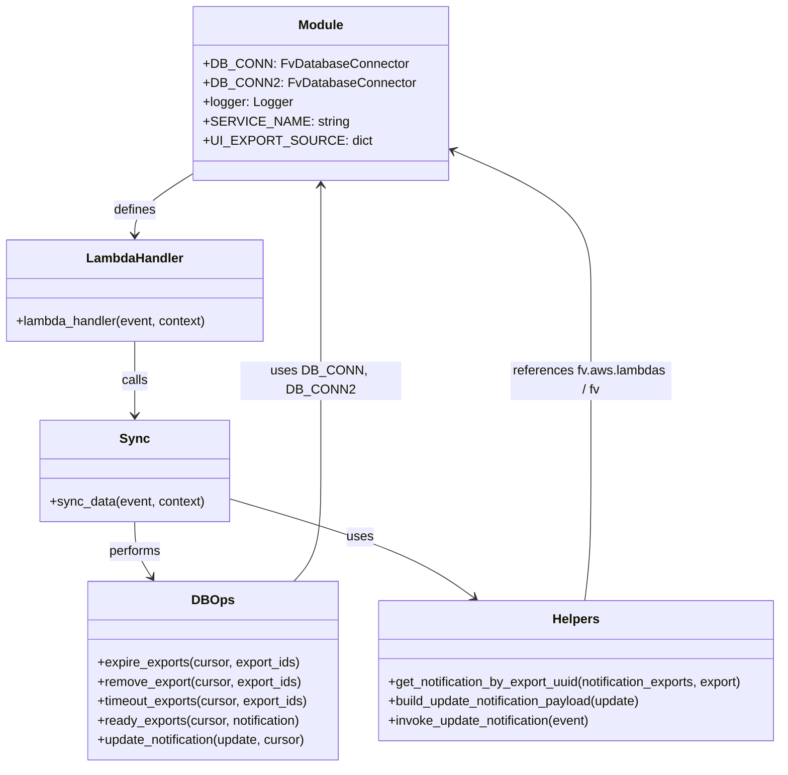

# Diagram: entity_core/watcher_service/watcher_service/csv_export_watcher.py


> Auto-generated by Obscura crawlers

## Diagram 1



### SVG

<svg id="container" width="990.4140625" xmlns="http://www.w3.org/2000/svg" class="classDiagram" height="952" viewBox="0 0 990.4140625 952" role="graphics-document document" aria-roledescription="class"><style>#container{font-family:"trebuchet ms",verdana,arial,sans-serif;font-size:16px;fill:#333;}@keyframes edge-animation-frame{from{stroke-dashoffset:0;}}@keyframes dash{to{stroke-dashoffset:0;}}#container .edge-animation-slow{stroke-dasharray:9,5!important;stroke-dashoffset:900;animation:dash 50s linear infinite;stroke-linecap:round;}#container .edge-animation-fast{stroke-dasharray:9,5!important;stroke-dashoffset:900;animation:dash 20s linear infinite;stroke-linecap:round;}#container .error-icon{fill:#552222;}#container .error-text{fill:#552222;stroke:#552222;}#container .edge-thickness-normal{stroke-width:1px;}#container .edge-thickness-thick{stroke-width:3.5px;}#container .edge-pattern-solid{stroke-dasharray:0;}#container .edge-thickness-invisible{stroke-width:0;fill:none;}#container .edge-pattern-dashed{stroke-dasharray:3;}#container .edge-pattern-dotted{stroke-dasharray:2;}#container .marker{fill:#333333;stroke:#333333;}#container .marker.cross{stroke:#333333;}#container svg{font-family:"trebuchet ms",verdana,arial,sans-serif;font-size:16px;}#container p{margin:0;}#container g.classGroup text{fill:#9370DB;stroke:none;font-family:"trebuchet ms",verdana,arial,sans-serif;font-size:10px;}#container g.classGroup text .title{font-weight:bolder;}#container .nodeLabel,#container .edgeLabel{color:#131300;}#container .edgeLabel .label rect{fill:#ECECFF;}#container .label text{fill:#131300;}#container .labelBkg{background:#ECECFF;}#container .edgeLabel .label span{background:#ECECFF;}#container .classTitle{font-weight:bolder;}#container .node rect,#container .node circle,#container .node ellipse,#container .node polygon,#container .node path{fill:#ECECFF;stroke:#9370DB;stroke-width:1px;}#container .divider{stroke:#9370DB;stroke-width:1;}#container g.clickable{cursor:pointer;}#container g.classGroup rect{fill:#ECECFF;stroke:#9370DB;}#container g.classGroup line{stroke:#9370DB;stroke-width:1;}#container .classLabel .box{stroke:none;stroke-width:0;fill:#ECECFF;opacity:0.5;}#container .classLabel .label{fill:#9370DB;font-size:10px;}#container .relation{stroke:#333333;stroke-width:1;fill:none;}#container .dashed-line{stroke-dasharray:3;}#container .dotted-line{stroke-dasharray:1 2;}#container #compositionStart,#container .composition{fill:#333333!important;stroke:#333333!important;stroke-width:1;}#container #compositionEnd,#container .composition{fill:#333333!important;stroke:#333333!important;stroke-width:1;}#container #dependencyStart,#container .dependency{fill:#333333!important;stroke:#333333!important;stroke-width:1;}#container #dependencyStart,#container .dependency{fill:#333333!important;stroke:#333333!important;stroke-width:1;}#container #extensionStart,#container .extension{fill:transparent!important;stroke:#333333!important;stroke-width:1;}#container #extensionEnd,#container .extension{fill:transparent!important;stroke:#333333!important;stroke-width:1;}#container #aggregationStart,#container .aggregation{fill:transparent!important;stroke:#333333!important;stroke-width:1;}#container #aggregationEnd,#container .aggregation{fill:transparent!important;stroke:#333333!important;stroke-width:1;}#container #lollipopStart,#container .lollipop{fill:#ECECFF!important;stroke:#333333!important;stroke-width:1;}#container #lollipopEnd,#container .lollipop{fill:#ECECFF!important;stroke:#333333!important;stroke-width:1;}#container .edgeTerminals{font-size:11px;line-height:initial;}#container .classTitleText{text-anchor:middle;font-size:18px;fill:#333;}#container .label-icon{display:inline-block;height:1em;overflow:visible;vertical-align:-0.125em;}#container .node .label-icon path{fill:currentColor;stroke:revert;stroke-width:revert;}#container :root{--mermaid-font-family:"trebuchet ms",verdana,arial,sans-serif;}</style><g><defs><marker id="container_class-aggregationStart" class="marker aggregation class" refX="18" refY="7" markerWidth="190" markerHeight="240" orient="auto"><path d="M 18,7 L9,13 L1,7 L9,1 Z"></path></marker></defs><defs><marker id="container_class-aggregationEnd" class="marker aggregation class" refX="1" refY="7" markerWidth="20" markerHeight="28" orient="auto"><path d="M 18,7 L9,13 L1,7 L9,1 Z"></path></marker></defs><defs><marker id="container_class-extensionStart" class="marker extension class" refX="18" refY="7" markerWidth="190" markerHeight="240" orient="auto"><path d="M 1,7 L18,13 V 1 Z"></path></marker></defs><defs><marker id="container_class-extensionEnd" class="marker extension class" refX="1" refY="7" markerWidth="20" markerHeight="28" orient="auto"><path d="M 1,1 V 13 L18,7 Z"></path></marker></defs><defs><marker id="container_class-compositionStart" class="marker composition class" refX="18" refY="7" markerWidth="190" markerHeight="240" orient="auto"><path d="M 18,7 L9,13 L1,7 L9,1 Z"></path></marker></defs><defs><marker id="container_class-compositionEnd" class="marker composition class" refX="1" refY="7" markerWidth="20" markerHeight="28" orient="auto"><path d="M 18,7 L9,13 L1,7 L9,1 Z"></path></marker></defs><defs><marker id="container_class-dependencyStart" class="marker dependency class" refX="6" refY="7" markerWidth="190" markerHeight="240" orient="auto"><path d="M 5,7 L9,13 L1,7 L9,1 Z"></path></marker></defs><defs><marker id="container_class-dependencyEnd" class="marker dependency class" refX="13" refY="7" markerWidth="20" markerHeight="28" orient="auto"><path d="M 18,7 L9,13 L14,7 L9,1 Z"></path></marker></defs><defs><marker id="container_class-lollipopStart" class="marker lollipop class" refX="13" refY="7" markerWidth="190" markerHeight="240" orient="auto"><circle stroke="black" fill="transparent" cx="7" cy="7" r="6"></circle></marker></defs><defs><marker id="container_class-lollipopEnd" class="marker lollipop class" refX="1" refY="7" markerWidth="190" markerHeight="240" orient="auto"><circle stroke="black" fill="transparent" cx="7" cy="7" r="6"></circle></marker></defs><g class="root"><g class="clusters"></g><g class="edgePaths"><path d="M258.193,207.084L243.362,216.07C228.53,225.056,198.867,243.028,184.035,257.181C169.203,271.333,169.203,281.667,169.203,286.833L169.203,292" id="id_Module_LambdaHandler_1" class="edge-thickness-normal edge-pattern-solid relation" style=";;;" data-edge="true" data-et="edge" data-id="id_Module_LambdaHandler_1" data-points="W3sieCI6MjU4LjE5MzM1OTM3NSwieSI6MjA3LjA4MzY5MDM3NDE3ODh9LHsieCI6MTY5LjIwMzEyNSwieSI6MjYxfSx7IngiOjE2OS4yMDMxMjUsInkiOjI5OH1d" marker-end="url(#container_class-dependencyEnd)"></path><path d="M169.203,424L169.203,432.167C169.203,440.333,169.203,456.667,169.203,472C169.203,487.333,169.203,501.667,169.203,508.833L169.203,516" id="id_LambdaHandler_Sync_2" class="edge-thickness-normal edge-pattern-solid relation" style=";;;" data-edge="true" data-et="edge" data-id="id_LambdaHandler_Sync_2" data-points="W3sieCI6MTY5LjIwMzEyNSwieSI6NDI0fSx7IngiOjE2OS4yMDMxMjUsInkiOjQ3M30seyJ4IjoxNjkuMjAzMTI1LCJ5Ijo1MjJ9XQ==" marker-end="url(#container_class-dependencyEnd)"></path><path d="M169.203,648L169.203,654.167C169.203,660.333,169.203,672.667,172.738,684.166C176.273,695.666,183.343,706.333,186.878,711.666L190.414,716.999" id="id_Sync_DBOps_3" class="edge-thickness-normal edge-pattern-solid relation" style=";;;" data-edge="true" data-et="edge" data-id="id_Sync_DBOps_3" data-points="W3sieCI6MTY5LjIwMzEyNSwieSI6NjQ4fSx7IngiOjE2OS4yMDMxMjUsInkiOjY4NX0seyJ4IjoxOTMuNzI4NTE1NjI1LCJ5Ijo3MjJ9XQ==" marker-end="url(#container_class-dependencyEnd)"></path><path d="M286.383,618.759L324.705,629.799C363.027,640.839,439.671,662.92,491.771,683.555C543.87,704.19,571.426,723.381,585.204,732.976L598.982,742.571" id="id_Sync_Helpers_4" class="edge-thickness-normal edge-pattern-solid relation" style=";;;" data-edge="true" data-et="edge" data-id="id_Sync_Helpers_4" data-points="W3sieCI6Mjg2LjM4MjgxMjUsInkiOjYxOC43NTg1MzE2MzEwMzk3fSx7IngiOjUxNi4zMTQ0NTMxMjUsInkiOjY4NX0seyJ4Ijo2MDMuOTA2MTU3NjIyNDY2MywieSI6NzQ2fV0=" marker-end="url(#container_class-dependencyEnd)"></path><path d="M373.223,722L379.108,715.833C384.992,709.667,396.761,697.333,402.645,674.5C408.529,651.667,408.529,618.333,408.529,583C408.529,547.667,408.529,510.333,408.529,473C408.529,435.667,408.529,398.333,408.529,363C408.529,327.667,408.529,294.333,408.529,272.5C408.529,250.667,408.529,240.333,408.529,235.167L408.529,230" id="id_DBOps_Module_5" class="edge-thickness-normal edge-pattern-solid relation" style=";;;" data-edge="true" data-et="edge" data-id="id_DBOps_Module_5" data-points="W3sieCI6MzczLjIyMzE0NDUzMTI1LCJ5Ijo3MjJ9LHsieCI6NDA4LjUyOTI5Njg3NSwieSI6Njg1fSx7IngiOjQwOC41MjkyOTY4NzUsInkiOjU4NX0seyJ4Ijo0MDguNTI5Mjk2ODc1LCJ5Ijo0NzN9LHsieCI6NDA4LjUyOTI5Njg3NSwieSI6MzYxfSx7IngiOjQwOC41MjkyOTY4NzUsInkiOjI2MX0seyJ4Ijo0MDguNTI5Mjk2ODc1LCJ5IjoyMjR9XQ==" marker-end="url(#container_class-dependencyEnd)"></path><path d="M739.558,746L740.811,735.833C742.065,725.667,744.571,705.333,745.825,678.5C747.078,651.667,747.078,618.333,747.078,583C747.078,547.667,747.078,510.333,747.078,473C747.078,435.667,747.078,398.333,747.078,363C747.078,327.667,747.078,294.333,716.629,264.625C686.179,234.917,625.28,208.834,594.83,195.792L564.381,182.751" id="id_Helpers_Module_6" class="edge-thickness-normal edge-pattern-solid relation" style=";;;" data-edge="true" data-et="edge" data-id="id_Helpers_Module_6" data-points="W3sieCI6NzM5LjU1Nzc3NTU0ODk4NjUsInkiOjc0Nn0seyJ4Ijo3NDcuMDc4MTI1LCJ5Ijo2ODV9LHsieCI6NzQ3LjA3ODEyNSwieSI6NTg1fSx7IngiOjc0Ny4wNzgxMjUsInkiOjQ3M30seyJ4Ijo3NDcuMDc4MTI1LCJ5IjozNjF9LHsieCI6NzQ3LjA3ODEyNSwieSI6MjYxfSx7IngiOjU1OC44NjUyMzQzNzUsInkiOjE4MC4zODg2NzYzOTMzODR9XQ==" marker-end="url(#container_class-dependencyEnd)"></path></g><g class="edgeLabels"><g class="edgeLabel" transform="translate(169.203125, 261)"><g class="label" data-id="id_Module_LambdaHandler_1" transform="translate(-26.53125, -12)"><foreignObject width="53.0625" height="24"><div xmlns="http://www.w3.org/1999/xhtml" class="labelBkg" style="display: table-cell; white-space: nowrap; line-height: 1.5; max-width: 200px; text-align: center;"><span class="edgeLabel"><p>defines</p></span></div></foreignObject></g></g><g class="edgeLabel" transform="translate(169.203125, 473)"><g class="label" data-id="id_LambdaHandler_Sync_2" transform="translate(-16.4453125, -12)"><foreignObject width="32.890625" height="24"><div xmlns="http://www.w3.org/1999/xhtml" class="labelBkg" style="display: table-cell; white-space: nowrap; line-height: 1.5; max-width: 200px; text-align: center;"><span class="edgeLabel"><p>calls</p></span></div></foreignObject></g></g><g class="edgeLabel" transform="translate(169.203125, 685)"><g class="label" data-id="id_Sync_DBOps_3" transform="translate(-33.15625, -12)"><foreignObject width="66.3125" height="24"><div xmlns="http://www.w3.org/1999/xhtml" class="labelBkg" style="display: table-cell; white-space: nowrap; line-height: 1.5; max-width: 200px; text-align: center;"><span class="edgeLabel"><p>performs</p></span></div></foreignObject></g></g><g class="edgeLabel" transform="translate(452.63256, 666.65376)"><g class="label" data-id="id_Sync_Helpers_4" transform="translate(-16.4921875, -12)"><foreignObject width="32.984375" height="24"><div xmlns="http://www.w3.org/1999/xhtml" class="labelBkg" style="display: table-cell; white-space: nowrap; line-height: 1.5; max-width: 200px; text-align: center;"><span class="edgeLabel"><p>uses</p></span></div></foreignObject></g></g><g class="edgeLabel" transform="translate(408.529296875, 473)"><g class="label" data-id="id_DBOps_Module_5" transform="translate(-95.5703125, -12)"><foreignObject width="191.140625" height="24"><div xmlns="http://www.w3.org/1999/xhtml" class="labelBkg" style="display: table-cell; white-space: nowrap; line-height: 1.5; max-width: 200px; text-align: center;"><span class="edgeLabel"><p>uses DB_CONN, DB_CONN2</p></span></div></foreignObject></g></g><g class="edgeLabel" transform="translate(747.078125, 473)"><g class="label" data-id="id_Helpers_Module_6" transform="translate(-100, -24)"><foreignObject width="200" height="48"><div xmlns="http://www.w3.org/1999/xhtml" class="labelBkg" style="display: table; white-space: break-spaces; line-height: 1.5; max-width: 200px; text-align: center; width: 200px;"><span class="edgeLabel"><p>references fv.aws.lambdas / fv</p></span></div></foreignObject></g></g></g><g class="nodes"><g class="node default" id="classId-Module-0" transform="translate(408.529296875, 116)"><g class="basic label-container"><path d="M-150.3359375 -108 L150.3359375 -108 L150.3359375 108 L-150.3359375 108" stroke="none" stroke-width="0" fill="#ECECFF" style=""></path><path d="M-150.3359375 -108 C-43.78313416368478 -108, 62.769669172630444 -108, 150.3359375 -108 M-150.3359375 -108 C-65.50139846576164 -108, 19.333140568476722 -108, 150.3359375 -108 M150.3359375 -108 C150.3359375 -36.23461064862977, 150.3359375 35.53077870274046, 150.3359375 108 M150.3359375 -108 C150.3359375 -60.542322317492456, 150.3359375 -13.084644634984912, 150.3359375 108 M150.3359375 108 C54.29737187474613 108, -41.74119375050773 108, -150.3359375 108 M150.3359375 108 C82.11732115144382 108, 13.898704802887636 108, -150.3359375 108 M-150.3359375 108 C-150.3359375 38.913623080417906, -150.3359375 -30.172753839164187, -150.3359375 -108 M-150.3359375 108 C-150.3359375 49.35960102812373, -150.3359375 -9.280797943752546, -150.3359375 -108" stroke="#9370DB" stroke-width="1.3" fill="none" stroke-dasharray="0 0" style=""></path></g><g class="annotation-group text" transform="translate(0, -84)"></g><g class="label-group text" transform="translate(-27.09375, -84)"><g class="label" style="font-weight: bolder" transform="translate(0,-12)"><foreignObject width="54.1875" height="24"><div xmlns="http://www.w3.org/1999/xhtml" style="display: table-cell; white-space: nowrap; line-height: 1.5; max-width: 104px; text-align: center;"><span class="nodeLabel markdown-node-label" style=""><p>Module</p></span></div></foreignObject></g></g><g class="members-group text" transform="translate(-138.3359375, -36)"><g class="label" style="" transform="translate(0,-12)"><foreignObject width="241.65625" height="24"><div xmlns="http://www.w3.org/1999/xhtml" style="display: table-cell; white-space: nowrap; line-height: 1.5; max-width: 300px; text-align: center;"><span class="nodeLabel markdown-node-label" style=""><p>+DB_CONN: FvDatabaseConnector</p></span></div></foreignObject></g><g class="label" style="" transform="translate(0,12)"><foreignObject width="249.578125" height="24"><div xmlns="http://www.w3.org/1999/xhtml" style="display: table-cell; white-space: nowrap; line-height: 1.5; max-width: 308px; text-align: center;"><span class="nodeLabel markdown-node-label" style=""><p>+DB_CONN2: FvDatabaseConnector</p></span></div></foreignObject></g><g class="label" style="" transform="translate(0,36)"><foreignObject width="109.65625" height="24"><div xmlns="http://www.w3.org/1999/xhtml" style="display: table-cell; white-space: nowrap; line-height: 1.5; max-width: 168px; text-align: center;"><span class="nodeLabel markdown-node-label" style=""><p>+logger: Logger</p></span></div></foreignObject></g><g class="label" style="" transform="translate(0,60)"><foreignObject width="164.46875" height="24"><div xmlns="http://www.w3.org/1999/xhtml" style="display: table-cell; white-space: nowrap; line-height: 1.5; max-width: 223px; text-align: center;"><span class="nodeLabel markdown-node-label" style=""><p>+SERVICE_NAME: string</p></span></div></foreignObject></g><g class="label" style="" transform="translate(0,84)"><foreignObject width="187.046875" height="24"><div xmlns="http://www.w3.org/1999/xhtml" style="display: table-cell; white-space: nowrap; line-height: 1.5; max-width: 245px; text-align: center;"><span class="nodeLabel markdown-node-label" style=""><p>+UI_EXPORT_SOURCE: dict</p></span></div></foreignObject></g></g><g class="methods-group text" transform="translate(-138.3359375, 108)"></g><g class="divider" style=""><path d="M-150.3359375 -60 C-85.51593271444482 -60, -20.69592792888963 -60, 150.3359375 -60 M-150.3359375 -60 C-65.46115891454572 -60, 19.41361967090856 -60, 150.3359375 -60" stroke="#9370DB" stroke-width="1.3" fill="none" stroke-dasharray="0 0" style=""></path></g><g class="divider" style=""><path d="M-150.3359375 84 C-54.178819472586966 84, 41.97829855482607 84, 150.3359375 84 M-150.3359375 84 C-72.41669984811382 84, 5.502537803772356 84, 150.3359375 84" stroke="#9370DB" stroke-width="1.3" fill="none" stroke-dasharray="0 0" style=""></path></g></g><g class="node default" id="classId-LambdaHandler-1" transform="translate(169.203125, 361)"><g class="basic label-container"><path d="M-161.203125 -63 L161.203125 -63 L161.203125 63 L-161.203125 63" stroke="none" stroke-width="0" fill="#ECECFF" style=""></path><path d="M-161.203125 -63 C-68.8698748813623 -63, 23.463375237275386 -63, 161.203125 -63 M-161.203125 -63 C-64.1337959978961 -63, 32.9355330042078 -63, 161.203125 -63 M161.203125 -63 C161.203125 -27.60026351892111, 161.203125 7.799472962157779, 161.203125 63 M161.203125 -63 C161.203125 -12.924197919692823, 161.203125 37.151604160614355, 161.203125 63 M161.203125 63 C68.23889756597738 63, -24.725329868045236 63, -161.203125 63 M161.203125 63 C92.48207176185979 63, 23.76101852371957 63, -161.203125 63 M-161.203125 63 C-161.203125 28.818123506448877, -161.203125 -5.363752987102245, -161.203125 -63 M-161.203125 63 C-161.203125 25.049799432455856, -161.203125 -12.900401135088288, -161.203125 -63" stroke="#9370DB" stroke-width="1.3" fill="none" stroke-dasharray="0 0" style=""></path></g><g class="annotation-group text" transform="translate(0, -39)"></g><g class="label-group text" transform="translate(-58.21875, -39)"><g class="label" style="font-weight: bolder" transform="translate(0,-12)"><foreignObject width="116.4375" height="24"><div xmlns="http://www.w3.org/1999/xhtml" style="display: table-cell; white-space: nowrap; line-height: 1.5; max-width: 167px; text-align: center;"><span class="nodeLabel markdown-node-label" style=""><p>LambdaHandler</p></span></div></foreignObject></g></g><g class="members-group text" transform="translate(-149.203125, 9)"></g><g class="methods-group text" transform="translate(-149.203125, 39)"><g class="label" style="" transform="translate(0,-12)"><foreignObject width="240.1875" height="24"><div xmlns="http://www.w3.org/1999/xhtml" style="display: table-cell; white-space: nowrap; line-height: 1.5; max-width: 298px; text-align: center;"><span class="nodeLabel markdown-node-label" style=""><p>+lambda_handler(event, context)</p></span></div></foreignObject></g></g><g class="divider" style=""><path d="M-161.203125 -15 C-79.20362119222446 -15, 2.795882615551079 -15, 161.203125 -15 M-161.203125 -15 C-34.508367004448786 -15, 92.18639099110243 -15, 161.203125 -15" stroke="#9370DB" stroke-width="1.3" fill="none" stroke-dasharray="0 0" style=""></path></g><g class="divider" style=""><path d="M-161.203125 9 C-96.66837550910472 9, -32.13362601820944 9, 161.203125 9 M-161.203125 9 C-66.52232567470611 9, 28.15847365058778 9, 161.203125 9" stroke="#9370DB" stroke-width="1.3" fill="none" stroke-dasharray="0 0" style=""></path></g></g><g class="node default" id="classId-Sync-2" transform="translate(169.203125, 585)"><g class="basic label-container"><path d="M-117.1796875 -63 L117.1796875 -63 L117.1796875 63 L-117.1796875 63" stroke="none" stroke-width="0" fill="#ECECFF" style=""></path><path d="M-117.1796875 -63 C-33.31257135993246 -63, 50.554544780135075 -63, 117.1796875 -63 M-117.1796875 -63 C-44.46190644836659 -63, 28.255874603266818 -63, 117.1796875 -63 M117.1796875 -63 C117.1796875 -29.995790068716367, 117.1796875 3.0084198625672656, 117.1796875 63 M117.1796875 -63 C117.1796875 -13.252070430209749, 117.1796875 36.4958591395805, 117.1796875 63 M117.1796875 63 C57.31665894065219 63, -2.5463696186956213 63, -117.1796875 63 M117.1796875 63 C42.33473824759689 63, -32.51021100480622 63, -117.1796875 63 M-117.1796875 63 C-117.1796875 18.849764194737872, -117.1796875 -25.300471610524255, -117.1796875 -63 M-117.1796875 63 C-117.1796875 27.642682459722458, -117.1796875 -7.714635080555084, -117.1796875 -63" stroke="#9370DB" stroke-width="1.3" fill="none" stroke-dasharray="0 0" style=""></path></g><g class="annotation-group text" transform="translate(0, -39)"></g><g class="label-group text" transform="translate(-17.09375, -39)"><g class="label" style="font-weight: bolder" transform="translate(0,-12)"><foreignObject width="34.1875" height="24"><div xmlns="http://www.w3.org/1999/xhtml" style="display: table-cell; white-space: nowrap; line-height: 1.5; max-width: 84px; text-align: center;"><span class="nodeLabel markdown-node-label" style=""><p>Sync</p></span></div></foreignObject></g></g><g class="members-group text" transform="translate(-105.1796875, 9)"></g><g class="methods-group text" transform="translate(-105.1796875, 39)"><g class="label" style="" transform="translate(0,-12)"><foreignObject width="193.265625" height="24"><div xmlns="http://www.w3.org/1999/xhtml" style="display: table-cell; white-space: nowrap; line-height: 1.5; max-width: 251px; text-align: center;"><span class="nodeLabel markdown-node-label" style=""><p>+sync_data(event, context)</p></span></div></foreignObject></g></g><g class="divider" style=""><path d="M-117.1796875 -15 C-25.817049615173246 -15, 65.5455882696535 -15, 117.1796875 -15 M-117.1796875 -15 C-40.6500242043122 -15, 35.879639091375594 -15, 117.1796875 -15" stroke="#9370DB" stroke-width="1.3" fill="none" stroke-dasharray="0 0" style=""></path></g><g class="divider" style=""><path d="M-117.1796875 9 C-40.534456854304224 9, 36.11077379139155 9, 117.1796875 9 M-117.1796875 9 C-60.71290526841173 9, -4.246123036823462 9, 117.1796875 9" stroke="#9370DB" stroke-width="1.3" fill="none" stroke-dasharray="0 0" style=""></path></g></g><g class="node default" id="classId-DBOps-3" transform="translate(267.3046875, 833)"><g class="basic label-container"><path d="M-157.9453125 -111 L157.9453125 -111 L157.9453125 111 L-157.9453125 111" stroke="none" stroke-width="0" fill="#ECECFF" style=""></path><path d="M-157.9453125 -111 C-68.76734448378134 -111, 20.410623532437313 -111, 157.9453125 -111 M-157.9453125 -111 C-51.36649526891918 -111, 55.21232196216164 -111, 157.9453125 -111 M157.9453125 -111 C157.9453125 -62.6626100425826, 157.9453125 -14.3252200851652, 157.9453125 111 M157.9453125 -111 C157.9453125 -39.276133836451606, 157.9453125 32.44773232709679, 157.9453125 111 M157.9453125 111 C44.52596853897053 111, -68.89337542205894 111, -157.9453125 111 M157.9453125 111 C50.03312989412767 111, -57.87905271174466 111, -157.9453125 111 M-157.9453125 111 C-157.9453125 36.0945360438333, -157.9453125 -38.8109279123334, -157.9453125 -111 M-157.9453125 111 C-157.9453125 53.4571119848732, -157.9453125 -4.085776030253598, -157.9453125 -111" stroke="#9370DB" stroke-width="1.3" fill="none" stroke-dasharray="0 0" style=""></path></g><g class="annotation-group text" transform="translate(0, -87)"></g><g class="label-group text" transform="translate(-24.3125, -87)"><g class="label" style="font-weight: bolder" transform="translate(0,-12)"><foreignObject width="48.625" height="24"><div xmlns="http://www.w3.org/1999/xhtml" style="display: table-cell; white-space: nowrap; line-height: 1.5; max-width: 98px; text-align: center;"><span class="nodeLabel markdown-node-label" style=""><p>DBOps</p></span></div></foreignObject></g></g><g class="members-group text" transform="translate(-145.9453125, -39)"></g><g class="methods-group text" transform="translate(-145.9453125, -9)"><g class="label" style="" transform="translate(0,-12)"><foreignObject width="254.953125" height="24"><div xmlns="http://www.w3.org/1999/xhtml" style="display: table-cell; white-space: nowrap; line-height: 1.5; max-width: 312px; text-align: center;"><span class="nodeLabel markdown-node-label" style=""><p>+expire_exports(cursor, export_ids)</p></span></div></foreignObject></g><g class="label" style="" transform="translate(0,12)"><foreignObject width="256.640625" height="24"><div xmlns="http://www.w3.org/1999/xhtml" style="display: table-cell; white-space: nowrap; line-height: 1.5; max-width: 314px; text-align: center;"><span class="nodeLabel markdown-node-label" style=""><p>+remove_export(cursor, export_ids)</p></span></div></foreignObject></g><g class="label" style="" transform="translate(0,36)"><foreignObject width="267.578125" height="24"><div xmlns="http://www.w3.org/1999/xhtml" style="display: table-cell; white-space: nowrap; line-height: 1.5; max-width: 325px; text-align: center;"><span class="nodeLabel markdown-node-label" style=""><p>+timeout_exports(cursor, export_ids)</p></span></div></foreignObject></g><g class="label" style="" transform="translate(0,60)"><foreignObject width="256.828125" height="24"><div xmlns="http://www.w3.org/1999/xhtml" style="display: table-cell; white-space: nowrap; line-height: 1.5; max-width: 314px; text-align: center;"><span class="nodeLabel markdown-node-label" style=""><p>+ready_exports(cursor, notification)</p></span></div></foreignObject></g><g class="label" style="" transform="translate(0,84)"><foreignObject width="266.109375" height="24"><div xmlns="http://www.w3.org/1999/xhtml" style="display: table-cell; white-space: nowrap; line-height: 1.5; max-width: 323px; text-align: center;"><span class="nodeLabel markdown-node-label" style=""><p>+update_notification(update, cursor)</p></span></div></foreignObject></g></g><g class="divider" style=""><path d="M-157.9453125 -63 C-88.75357654012802 -63, -19.561840580256046 -63, 157.9453125 -63 M-157.9453125 -63 C-45.0665926978632 -63, 67.8121271042736 -63, 157.9453125 -63" stroke="#9370DB" stroke-width="1.3" fill="none" stroke-dasharray="0 0" style=""></path></g><g class="divider" style=""><path d="M-157.9453125 -39 C-94.3791110810288 -39, -30.812909662057592 -39, 157.9453125 -39 M-157.9453125 -39 C-36.95253784872234 -39, 84.04023680255531 -39, 157.9453125 -39" stroke="#9370DB" stroke-width="1.3" fill="none" stroke-dasharray="0 0" style=""></path></g></g><g class="node default" id="classId-Helpers-4" transform="translate(728.83203125, 833)"><g class="basic label-container"><path d="M-253.58203125 -87 L253.58203125 -87 L253.58203125 87 L-253.58203125 87" stroke="none" stroke-width="0" fill="#ECECFF" style=""></path><path d="M-253.58203125 -87 C-146.7038122540946 -87, -39.82559325818923 -87, 253.58203125 -87 M-253.58203125 -87 C-82.50604370169233 -87, 88.56994384661533 -87, 253.58203125 -87 M253.58203125 -87 C253.58203125 -46.706792186188956, 253.58203125 -6.413584372377912, 253.58203125 87 M253.58203125 -87 C253.58203125 -49.10264797373009, 253.58203125 -11.205295947460186, 253.58203125 87 M253.58203125 87 C62.46165645879552 87, -128.65871833240897 87, -253.58203125 87 M253.58203125 87 C55.6019192465823 87, -142.3781927568354 87, -253.58203125 87 M-253.58203125 87 C-253.58203125 30.09371545742556, -253.58203125 -26.81256908514888, -253.58203125 -87 M-253.58203125 87 C-253.58203125 42.21229912824395, -253.58203125 -2.575401743512103, -253.58203125 -87" stroke="#9370DB" stroke-width="1.3" fill="none" stroke-dasharray="0 0" style=""></path></g><g class="annotation-group text" transform="translate(0, -63)"></g><g class="label-group text" transform="translate(-28.2890625, -63)"><g class="label" style="font-weight: bolder" transform="translate(0,-12)"><foreignObject width="56.578125" height="24"><div xmlns="http://www.w3.org/1999/xhtml" style="display: table-cell; white-space: nowrap; line-height: 1.5; max-width: 106px; text-align: center;"><span class="nodeLabel markdown-node-label" style=""><p>Helpers</p></span></div></foreignObject></g></g><g class="members-group text" transform="translate(-241.58203125, -15)"></g><g class="methods-group text" transform="translate(-241.58203125, 15)"><g class="label" style="" transform="translate(0,-12)"><foreignObject width="454.875" height="24"><div xmlns="http://www.w3.org/1999/xhtml" style="display: table-cell; white-space: nowrap; line-height: 1.5; max-width: 512px; text-align: center;"><span class="nodeLabel markdown-node-label" style=""><p>+get_notification_by_export_uuid(notification_exports, export)</p></span></div></foreignObject></g><g class="label" style="" transform="translate(0,12)"><foreignObject width="324.03125" height="24"><div xmlns="http://www.w3.org/1999/xhtml" style="display: table-cell; white-space: nowrap; line-height: 1.5; max-width: 381px; text-align: center;"><span class="nodeLabel markdown-node-label" style=""><p>+build_update_notification_payload(update)</p></span></div></foreignObject></g><g class="label" style="" transform="translate(0,36)"><foreignObject width="256.828125" height="24"><div xmlns="http://www.w3.org/1999/xhtml" style="display: table-cell; white-space: nowrap; line-height: 1.5; max-width: 314px; text-align: center;"><span class="nodeLabel markdown-node-label" style=""><p>+invoke_update_notification(event)</p></span></div></foreignObject></g></g><g class="divider" style=""><path d="M-253.58203125 -39 C-122.23903832755335 -39, 9.10395459489331 -39, 253.58203125 -39 M-253.58203125 -39 C-104.9909258513429 -39, 43.60017954731421 -39, 253.58203125 -39" stroke="#9370DB" stroke-width="1.3" fill="none" stroke-dasharray="0 0" style=""></path></g><g class="divider" style=""><path d="M-253.58203125 -15 C-53.08821740093765 -15, 147.4055964481247 -15, 253.58203125 -15 M-253.58203125 -15 C-71.12996396558708 -15, 111.32210331882584 -15, 253.58203125 -15" stroke="#9370DB" stroke-width="1.3" fill="none" stroke-dasharray="0 0" style=""></path></g></g></g></g></g></svg>

## Diagram 2

```mermaid
flowchart TD
    A[lambda_handler(event, context)] --> B[DB_CONN.establish_connection()]
    B --> C[func_timeout(900, sync_data)]
    C --> D[sync_data(event, context)]
    D --> E{notification_exports fetched?}
    E -- No --> F[End]
    E -- Yes --> G[expire_exports(cursor, notification_exports)]
    E --> H[timeout_exports(cursor, notification_exports)]
    E --> I[ready_exports(cursor, notification_exports)]
    E --> J[remove_export(cursor, notification_exports)]
    G --> K[expired_records]
    H --> L[timeout_records]
    I --> M[ready_records]
    J --> N[removed_records]
    K --> O[exports = ready + timeout + expired + removed]
    L --> O
    M --> O
    N --> O
    O --> P[for export in exports: build export_context dict]
    P --> Q[get_notification_by_export_uuid(notification_exports, export)]
    Q --> R[append {notification_id, export_context} to to_update]
    R --> S[for update in to_update: update_notification(update, cursor_entity)]
    S --> T[End]
```

> SVG rendering failed for this diagram.
