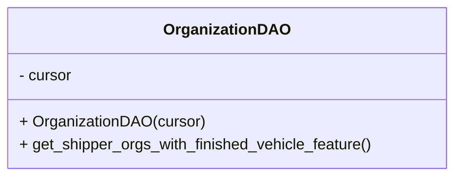
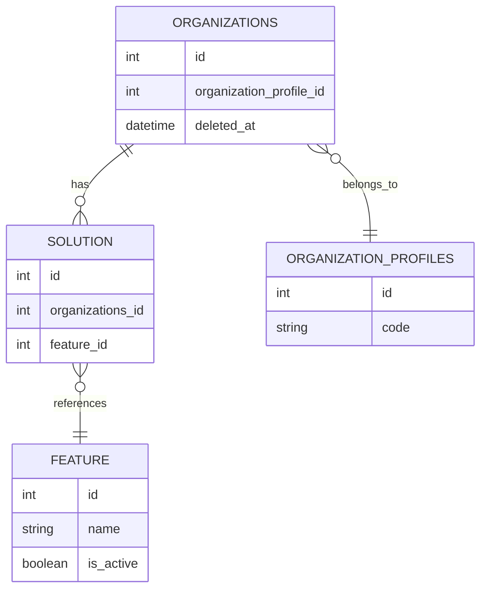

# Diagram: entity_core/watcher_service/watcher_service/db/organization.py

> Auto-generated by Obscura crawlers

## Diagram 1

### SVG

<svg id="container" width="472.328125" xmlns="http://www.w3.org/2000/svg" class="classDiagram" height="184" viewBox="0 0 472.328125 184" role="graphics-document document" aria-roledescription="class"><g><defs><marker id="container_class-aggregationStart" class="marker aggregation class" refX="18" refY="7" markerWidth="190" markerHeight="240" orient="auto"><path d="M 18,7 L9,13 L1,7 L9,1 Z"></path></marker></defs><defs><marker id="container_class-aggregationEnd" class="marker aggregation class" refX="1" refY="7" markerWidth="20" markerHeight="28" orient="auto"><path d="M 18,7 L9,13 L1,7 L9,1 Z"></path></marker></defs><defs><marker id="container_class-extensionStart" class="marker extension class" refX="18" refY="7" markerWidth="190" markerHeight="240" orient="auto"><path d="M 1,7 L18,13 V 1 Z"></path></marker></defs><defs><marker id="container_class-extensionEnd" class="marker extension class" refX="1" refY="7" markerWidth="20" markerHeight="28" orient="auto"><path d="M 1,1 V 13 L18,7 Z"></path></marker></defs><defs><marker id="container_class-compositionStart" class="marker composition class" refX="18" refY="7" markerWidth="190" markerHeight="240" orient="auto"><path d="M 18,7 L9,13 L1,7 L9,1 Z"></path></marker></defs><defs><marker id="container_class-compositionEnd" class="marker composition class" refX="1" refY="7" markerWidth="20" markerHeight="28" orient="auto"><path d="M 18,7 L9,13 L1,7 L9,1 Z"></path></marker></defs><defs><marker id="container_class-dependencyStart" class="marker dependency class" refX="6" refY="7" markerWidth="190" markerHeight="240" orient="auto"><path d="M 5,7 L9,13 L1,7 L9,1 Z"></path></marker></defs><defs><marker id="container_class-dependencyEnd" class="marker dependency class" refX="13" refY="7" markerWidth="20" markerHeight="28" orient="auto"><path d="M 18,7 L9,13 L14,7 L9,1 Z"></path></marker></defs><defs><marker id="container_class-lollipopStart" class="marker lollipop class" refX="13" refY="7" markerWidth="190" markerHeight="240" orient="auto"><circle stroke="black" fill="transparent" cx="7" cy="7" r="6"></circle></marker></defs><defs><marker id="container_class-lollipopEnd" class="marker lollipop class" refX="1" refY="7" markerWidth="190" markerHeight="240" orient="auto"><circle stroke="black" fill="transparent" cx="7" cy="7" r="6"></circle></marker></defs><g class="root"><g class="clusters"></g><g class="edgePaths"></g><g class="edgeLabels"></g><g class="nodes"><g class="node default" id="classId-OrganizationDAO-0" transform="translate(236.1640625, 92)"><g class="basic label-container"><path d="M-228.1640625 -84 L228.1640625 -84 L228.1640625 84 L-228.1640625 84" stroke="none" stroke-width="0" fill="#ECECFF" style=""></path><path d="M-228.1640625 -84 C-92.46513762365146 -84, 43.233787252697084 -84, 228.1640625 -84 M-228.1640625 -84 C-123.07541937922856 -84, -17.986776258457127 -84, 228.1640625 -84 M228.1640625 -84 C228.1640625 -18.776705103285295, 228.1640625 46.44658979342941, 228.1640625 84 M228.1640625 -84 C228.1640625 -40.332000305021694, 228.1640625 3.335999389956612, 228.1640625 84 M228.1640625 84 C103.36914183596377 84, -21.425778828072453 84, -228.1640625 84 M228.1640625 84 C69.95532613590947 84, -88.25341022818105 84, -228.1640625 84 M-228.1640625 84 C-228.1640625 37.88517330947856, -228.1640625 -8.22965338104288, -228.1640625 -84 M-228.1640625 84 C-228.1640625 38.62516025992337, -228.1640625 -6.749679480153262, -228.1640625 -84" stroke="#9370DB" stroke-width="1.3" fill="none" stroke-dasharray="0 0" style=""></path></g><g class="annotation-group text" transform="translate(0, -60)"></g><g class="label-group text" transform="translate(-61.984375, -60)"><g class="label" style="font-weight: bolder" transform="translate(0,-12)"><foreignObject width="123.96875" height="24">

OrganizationDAO

</foreignObject></g></g><g class="members-group text" transform="translate(-216.1640625, -12)"><g class="label" style="" transform="translate(0,-12)"><foreignObject width="56.421875" height="24">

- cursor

</foreignObject></g></g><g class="methods-group text" transform="translate(-216.1640625, 36)"><g class="label" style="" transform="translate(0,-12)"><foreignObject width="190.625" height="24">

+ OrganizationDAO(cursor)

</foreignObject></g><g class="label" style="" transform="translate(0,12)"><foreignObject width="370.34375" height="24">

+ get_shipper_orgs_with_finished_vehicle_feature()

</foreignObject></g></g><g class="divider" style=""><path d="M-228.1640625 -36 C-55.82717045331748 -36, 116.50972159336504 -36, 228.1640625 -36 M-228.1640625 -36 C-63.92627892026971 -36, 100.31150465946058 -36, 228.1640625 -36" stroke="#9370DB" stroke-width="1.3" fill="none" stroke-dasharray="0 0" style=""></path></g><g class="divider" style=""><path d="M-228.1640625 12 C-63.97210871124915 12, 100.2198450775017 12, 228.1640625 12 M-228.1640625 12 C-80.47837361878734 12, 67.20731526242531 12, 228.1640625 12" stroke="#9370DB" stroke-width="1.3" fill="none" stroke-dasharray="0 0" style=""></path></g></g></g></g></g></svg>

## Diagram 2

### SVG

<svg id="container" width="578.703125" xmlns="http://www.w3.org/2000/svg" class="erDiagram" height="731" viewBox="0 0 578.703125 731" role="graphics-document document" aria-roledescription="er"><g><defs><marker id="container_er-onlyOneStart" class="marker onlyOne er" refX="0" refY="9" markerWidth="18" markerHeight="18" orient="auto"><path d="M9,0 L9,18 M15,0 L15,18"></path></marker></defs><defs><marker id="container_er-onlyOneEnd" class="marker onlyOne er" refX="18" refY="9" markerWidth="18" markerHeight="18" orient="auto"><path d="M3,0 L3,18 M9,0 L9,18"></path></marker></defs><defs><marker id="container_er-zeroOrOneStart" class="marker zeroOrOne er" refX="0" refY="9" markerWidth="30" markerHeight="18" orient="auto"><circle fill="white" cx="21" cy="9" r="6"></circle><path d="M9,0 L9,18"></path></marker></defs><defs><marker id="container_er-zeroOrOneEnd" class="marker zeroOrOne er" refX="30" refY="9" markerWidth="30" markerHeight="18" orient="auto"><circle fill="white" cx="9" cy="9" r="6"></circle><path d="M21,0 L21,18"></path></marker></defs><defs><marker id="container_er-oneOrMoreStart" class="marker oneOrMore er" refX="18" refY="18" markerWidth="45" markerHeight="36" orient="auto"><path d="M0,18 Q 18,0 36,18 Q 18,36 0,18 M42,9 L42,27"></path></marker></defs><defs><marker id="container_er-oneOrMoreEnd" class="marker oneOrMore er" refX="27" refY="18" markerWidth="45" markerHeight="36" orient="auto"><path d="M3,9 L3,27 M9,18 Q27,0 45,18 Q27,36 9,18"></path></marker></defs><defs><marker id="container_er-zeroOrMoreStart" class="marker zeroOrMore er" refX="18" refY="18" markerWidth="57" markerHeight="36" orient="auto"><circle fill="white" cx="48" cy="18" r="6"></circle><path d="M0,18 Q18,0 36,18 Q18,36 0,18"></path></marker></defs><defs><marker id="container_er-zeroOrMoreEnd" class="marker zeroOrMore er" refX="39" refY="18" markerWidth="57" markerHeight="36" orient="auto"><circle fill="white" cx="9" cy="18" r="6"></circle><path d="M21,18 Q39,0 57,18 Q39,36 21,18"></path></marker></defs><g class="root"><g class="clusters"></g><g class="edgePaths"><path d="M168.022,179L157.15,187.417C146.277,195.833,124.533,212.667,113.661,229.5C102.789,246.333,102.789,263.167,102.789,271.583L102.789,280" id="id_entity-ORGANIZATIONS-0_entity-SOLUTION-1_0" class="edge-thickness-normal edge-pattern-solid relationshipLine" style="undefined;;;undefined" data-edge="true" data-et="edge" data-id="id_entity-ORGANIZATIONS-0_entity-SOLUTION-1_0" data-points="W3sieCI6MTY4LjAyMTYxMzYyNTkxOTEyLCJ5IjoxNzl9LHsieCI6MTAyLjc4OTA2MjUsInkiOjIyOS41fSx7IngiOjEwMi43ODkwNjI1LCJ5IjoyODB9XQ==" marker-start="url(#container_er-onlyOneStart)" marker-end="url(#container_er-zeroOrMoreEnd)"></path><path d="M102.789,451L102.789,459.417C102.789,467.833,102.789,484.667,102.789,501.5C102.789,518.333,102.789,535.167,102.789,543.583L102.789,552" id="id_entity-SOLUTION-1_entity-FEATURE-2_1" class="edge-thickness-normal edge-pattern-solid relationshipLine" style="undefined;;;undefined" data-edge="true" data-et="edge" data-id="id_entity-SOLUTION-1_entity-FEATURE-2_1" data-points="W3sieCI6MTAyLjc4OTA2MjUsInkiOjQ1MX0seyJ4IjoxMDIuNzg5MDYyNSwieSI6NTAxLjV9LHsieCI6MTAyLjc4OTA2MjUsInkiOjU1Mn1d" marker-start="url(#container_er-zeroOrMoreStart)" marker-end="url(#container_er-onlyOneEnd)"></path><path d="M388.908,179L399.78,187.417C410.652,195.833,432.396,212.667,443.269,233.063C454.141,253.458,454.141,277.417,454.141,289.396L454.141,301.375" id="id_entity-ORGANIZATIONS-0_entity-ORGANIZATION_PROFILES-3_2" class="edge-thickness-normal edge-pattern-solid relationshipLine" style="undefined;;;undefined" data-edge="true" data-et="edge" data-id="id_entity-ORGANIZATIONS-0_entity-ORGANIZATION_PROFILES-3_2" data-points="W3sieCI6Mzg4LjkwODA3Mzg3NDA4MDg2LCJ5IjoxNzl9LHsieCI6NDU0LjE0MDYyNSwieSI6MjI5LjV9LHsieCI6NDU0LjE0MDYyNSwieSI6MzAxLjM3NX1d" marker-start="url(#container_er-zeroOrMoreStart)" marker-end="url(#container_er-onlyOneEnd)"></path></g><g class="edgeLabels"><g class="edgeLabel" transform="translate(102.7890625, 229.5)"><g class="label" data-id="id_entity-ORGANIZATIONS-0_entity-SOLUTION-1_0" transform="translate(-11.109375, -10.5)"><foreignObject width="22.21875" height="21">

has

</foreignObject></g></g><g class="edgeLabel" transform="translate(102.7890625, 501.5)"><g class="label" data-id="id_entity-SOLUTION-1_entity-FEATURE-2_1" transform="translate(-33.1015625, -10.5)"><foreignObject width="66.203125" height="21">

references

</foreignObject></g></g><g class="edgeLabel" transform="translate(454.140625, 229.5)"><g class="label" data-id="id_entity-ORGANIZATIONS-0_entity-ORGANIZATION_PROFILES-3_2" transform="translate(-34.9140625, -10.5)"><foreignObject width="69.828125" height="21">

belongs_to

</foreignObject></g></g></g><g class="nodes"><g class="node default" id="entity-ORGANIZATIONS-0" transform="translate(278.46484375, 93.5)"><g style=""><path d="M-141.5390625 -85.5 L141.5390625 -85.5 L141.5390625 85.5 L-141.5390625 85.5" stroke="none" stroke-width="0" fill="#ECECFF"></path><path d="M-141.5390625 -85.5 C-54.976450068342004 -85.5, 31.586162363315992 -85.5, 141.5390625 -85.5 M-141.5390625 -85.5 C-28.43119496063261 -85.5, 84.67667257873478 -85.5, 141.5390625 -85.5 M141.5390625 -85.5 C141.5390625 -47.75883334395098, 141.5390625 -10.017666687901965, 141.5390625 85.5 M141.5390625 -85.5 C141.5390625 -32.60865602052508, 141.5390625 20.282687958949836, 141.5390625 85.5 M141.5390625 85.5 C53.23748663303513 85.5, -35.064089233929735 85.5, -141.5390625 85.5 M141.5390625 85.5 C77.62059471983521 85.5, 13.702126939670421 85.5, -141.5390625 85.5 M-141.5390625 85.5 C-141.5390625 40.669451847360406, -141.5390625 -4.161096305279187, -141.5390625 -85.5 M-141.5390625 85.5 C-141.5390625 34.565978546277584, -141.5390625 -16.36804290744483, -141.5390625 -85.5" stroke="#9370DB" stroke-width="1.3" fill="none" stroke-dasharray="0 0"></path></g><g style="" class="row-rect-odd"><path d="M-141.5390625 -42.75 L141.5390625 -42.75 L141.5390625 0 L-141.5390625 0" stroke="none" stroke-width="0" fill="hsl(240, 100%, 100%)"></path><path d="M-141.5390625 -42.75 C-58.22349012066907 -42.75, 25.09208225866186 -42.75, 141.5390625 -42.75 M-141.5390625 -42.75 C-62.058100719656 -42.75, 17.422861060688007 -42.75, 141.5390625 -42.75 M141.5390625 -42.75 C141.5390625 -31.21671347724409, 141.5390625 -19.683426954488187, 141.5390625 0 M141.5390625 -42.75 C141.5390625 -32.148452421310125, 141.5390625 -21.546904842620254, 141.5390625 0 M141.5390625 0 C43.672966564914645 0, -54.19312937017071 0, -141.5390625 0 M141.5390625 0 C61.555587168898796 0, -18.427888162202407 0, -141.5390625 0 M-141.5390625 0 C-141.5390625 -16.54638037286973, -141.5390625 -33.09276074573946, -141.5390625 -42.75 M-141.5390625 0 C-141.5390625 -13.824181859651393, -141.5390625 -27.648363719302786, -141.5390625 -42.75" stroke="#9370DB" stroke-width="1.3" fill="none" stroke-dasharray="0 0"></path></g><g style="" class="row-rect-even"><path d="M-141.5390625 0 L141.5390625 0 L141.5390625 42.75 L-141.5390625 42.75" stroke="none" stroke-width="0" fill="hsl(240, 100%, 97.2745098039%)"></path><path d="M-141.5390625 0 C-54.745674331106926 0, 32.04771383778615 0, 141.5390625 0 M-141.5390625 0 C-35.63342215188544 0, 70.27221819622912 0, 141.5390625 0 M141.5390625 0 C141.5390625 14.105967285705105, 141.5390625 28.21193457141021, 141.5390625 42.75 M141.5390625 0 C141.5390625 11.456870260993524, 141.5390625 22.913740521987048, 141.5390625 42.75 M141.5390625 42.75 C35.671163943784634 42.75, -70.19673461243073 42.75, -141.5390625 42.75 M141.5390625 42.75 C39.16629319392098 42.75, -63.20647611215804 42.75, -141.5390625 42.75 M-141.5390625 42.75 C-141.5390625 33.46928847451341, -141.5390625 24.188576949026825, -141.5390625 0 M-141.5390625 42.75 C-141.5390625 32.16407181245471, -141.5390625 21.57814362490941, -141.5390625 0" stroke="#9370DB" stroke-width="1.3" fill="none" stroke-dasharray="0 0"></path></g><g style="" class="row-rect-odd"><path d="M-141.5390625 42.75 L141.5390625 42.75 L141.5390625 85.5 L-141.5390625 85.5" stroke="none" stroke-width="0" fill="hsl(240, 100%, 100%)"></path><path d="M-141.5390625 42.75 C-37.67759106586736 42.75, 66.18388036826528 42.75, 141.5390625 42.75 M-141.5390625 42.75 C-53.92946190071653 42.75, 33.680138698566935 42.75, 141.5390625 42.75 M141.5390625 42.75 C141.5390625 58.53278323500347, 141.5390625 74.31556647000694, 141.5390625 85.5 M141.5390625 42.75 C141.5390625 55.31270371530707, 141.5390625 67.87540743061415, 141.5390625 85.5 M141.5390625 85.5 C55.53355568840688 85.5, -30.471951123186244 85.5, -141.5390625 85.5 M141.5390625 85.5 C42.474990143152326 85.5, -56.58908221369535 85.5, -141.5390625 85.5 M-141.5390625 85.5 C-141.5390625 68.84024048052581, -141.5390625 52.18048096105163, -141.5390625 42.75 M-141.5390625 85.5 C-141.5390625 74.02140047839288, -141.5390625 62.54280095678577, -141.5390625 42.75" stroke="#9370DB" stroke-width="1.3" fill="none" stroke-dasharray="0 0"></path></g><g class="label name" transform="translate(-57.9765625, -76.125)" style=""><foreignObject width="115.953125" height="24">

ORGANIZATIONS

</foreignObject></g><g class="label attribute-type" transform="translate(-129.0390625, -33.375)" style=""><foreignObject width="19.671875" height="24">

int

</foreignObject></g><g class="label attribute-name" transform="translate(-38.7890625, -33.375)" style=""><foreignObject width="14.09375" height="24">

id

</foreignObject></g><g class="label attribute-keys" transform="translate(154.0390625, -33.375)" style=""><foreignObject width="0" height="0">

</foreignObject></g><g class="label attribute-comment" transform="translate(154.0390625, -33.375)" style=""><foreignObject width="0" height="0">

</foreignObject></g><g class="label attribute-type" transform="translate(-129.0390625, 9.375)" style=""><foreignObject width="19.671875" height="24">

int

</foreignObject></g><g class="label attribute-name" transform="translate(-38.7890625, 9.375)" style=""><foreignObject width="167.828125" height="24">

organization_profile_id

</foreignObject></g><g class="label attribute-keys" transform="translate(154.0390625, 9.375)" style=""><foreignObject width="0" height="0">

</foreignObject></g><g class="label attribute-comment" transform="translate(154.0390625, 9.375)" style=""><foreignObject width="0" height="0">

</foreignObject></g><g class="label attribute-type" transform="translate(-129.0390625, 52.125)" style=""><foreignObject width="65.25" height="24">

datetime

</foreignObject></g><g class="label attribute-name" transform="translate(-38.7890625, 52.125)" style=""><foreignObject width="77.921875" height="24">

deleted_at

</foreignObject></g><g class="label attribute-keys" transform="translate(154.0390625, 52.125)" style=""><foreignObject width="0" height="0">

</foreignObject></g><g class="label attribute-comment" transform="translate(154.0390625, 52.125)" style=""><foreignObject width="0" height="0">

</foreignObject></g><g class="divider"><path d="M-141.5390625 -42.75 C-41.609977209429445 -42.75, 58.31910808114111 -42.75, 141.5390625 -42.75 M-141.5390625 -42.75 C-50.33265175074962 -42.75, 40.87375899850076 -42.75, 141.5390625 -42.75" stroke="#9370DB" stroke-width="1.3" fill="none" stroke-dasharray="0 0"></path></g><g class="divider"><path d="M-51.2890625 -42.75 C-51.2890625 -3.398035554474667, -51.2890625 35.953928891050666, -51.2890625 85.5 M-51.2890625 -42.75 C-51.2890625 -7.754577816323163, -51.2890625 27.240844367353674, -51.2890625 85.5" stroke="#9370DB" stroke-width="1.3" fill="none" stroke-dasharray="0 0"></path></g><g class="divider"><path d="M-141.5390625 -42.75 C-35.044996873487236 -42.75, 71.44906875302553 -42.75, 141.5390625 -42.75 M-141.5390625 -42.75 C-63.30572289840222 -42.75, 14.927616703195554 -42.75, 141.5390625 -42.75" stroke="#9370DB" stroke-width="1.3" fill="none" stroke-dasharray="0 0"></path></g></g><g class="node default" id="entity-SOLUTION-1" transform="translate(102.7890625, 365.5)"><g style=""><path d="M-94.7890625 -85.5 L94.7890625 -85.5 L94.7890625 85.5 L-94.7890625 85.5" stroke="none" stroke-width="0" fill="#ECECFF"></path><path d="M-94.7890625 -85.5 C-47.99584199374339 -85.5, -1.2026214874867804 -85.5, 94.7890625 -85.5 M-94.7890625 -85.5 C-25.744796053188523 -85.5, 43.299470393622954 -85.5, 94.7890625 -85.5 M94.7890625 -85.5 C94.7890625 -23.217197059079524, 94.7890625 39.06560588184095, 94.7890625 85.5 M94.7890625 -85.5 C94.7890625 -47.22311181782236, 94.7890625 -8.946223635644714, 94.7890625 85.5 M94.7890625 85.5 C38.99878332956425 85.5, -16.791495840871505 85.5, -94.7890625 85.5 M94.7890625 85.5 C31.178789312336967 85.5, -32.431483875326066 85.5, -94.7890625 85.5 M-94.7890625 85.5 C-94.7890625 30.82989320218328, -94.7890625 -23.840213595633443, -94.7890625 -85.5 M-94.7890625 85.5 C-94.7890625 33.30743350165572, -94.7890625 -18.885132996688554, -94.7890625 -85.5" stroke="#9370DB" stroke-width="1.3" fill="none" stroke-dasharray="0 0"></path></g><g style="" class="row-rect-odd"><path d="M-94.7890625 -42.75 L94.7890625 -42.75 L94.7890625 0 L-94.7890625 0" stroke="none" stroke-width="0" fill="hsl(240, 100%, 100%)"></path><path d="M-94.7890625 -42.75 C-27.007437815142737 -42.75, 40.774186869714526 -42.75, 94.7890625 -42.75 M-94.7890625 -42.75 C-51.759172633875934 -42.75, -8.729282767751869 -42.75, 94.7890625 -42.75 M94.7890625 -42.75 C94.7890625 -27.844613935381403, 94.7890625 -12.939227870762807, 94.7890625 0 M94.7890625 -42.75 C94.7890625 -26.09975831468622, 94.7890625 -9.44951662937244, 94.7890625 0 M94.7890625 0 C45.82834310586034 0, -3.1323762882793176 0, -94.7890625 0 M94.7890625 0 C39.95349951941058 0, -14.882063461178845 0, -94.7890625 0 M-94.7890625 0 C-94.7890625 -11.147728396292354, -94.7890625 -22.29545679258471, -94.7890625 -42.75 M-94.7890625 0 C-94.7890625 -11.396955557067534, -94.7890625 -22.793911114135067, -94.7890625 -42.75" stroke="#9370DB" stroke-width="1.3" fill="none" stroke-dasharray="0 0"></path></g><g style="" class="row-rect-even"><path d="M-94.7890625 0 L94.7890625 0 L94.7890625 42.75 L-94.7890625 42.75" stroke="none" stroke-width="0" fill="hsl(240, 100%, 97.2745098039%)"></path><path d="M-94.7890625 0 C-28.76601781525845 0, 37.2570268694831 0, 94.7890625 0 M-94.7890625 0 C-31.62741168749303 0, 31.53423912501394 0, 94.7890625 0 M94.7890625 0 C94.7890625 13.03311991809818, 94.7890625 26.06623983619636, 94.7890625 42.75 M94.7890625 0 C94.7890625 10.110244602046935, 94.7890625 20.22048920409387, 94.7890625 42.75 M94.7890625 42.75 C42.38412432457103 42.75, -10.020813850857934 42.75, -94.7890625 42.75 M94.7890625 42.75 C19.387899363372583 42.75, -56.013263773254835 42.75, -94.7890625 42.75 M-94.7890625 42.75 C-94.7890625 34.129586003355286, -94.7890625 25.509172006710575, -94.7890625 0 M-94.7890625 42.75 C-94.7890625 30.221555130181095, -94.7890625 17.693110260362186, -94.7890625 0" stroke="#9370DB" stroke-width="1.3" fill="none" stroke-dasharray="0 0"></path></g><g style="" class="row-rect-odd"><path d="M-94.7890625 42.75 L94.7890625 42.75 L94.7890625 85.5 L-94.7890625 85.5" stroke="none" stroke-width="0" fill="hsl(240, 100%, 100%)"></path><path d="M-94.7890625 42.75 C-52.041155500729325 42.75, -9.293248501458649 42.75, 94.7890625 42.75 M-94.7890625 42.75 C-48.252460039068026 42.75, -1.7158575781360526 42.75, 94.7890625 42.75 M94.7890625 42.75 C94.7890625 55.57815403884836, 94.7890625 68.40630807769672, 94.7890625 85.5 M94.7890625 42.75 C94.7890625 58.21070234754278, 94.7890625 73.67140469508556, 94.7890625 85.5 M94.7890625 85.5 C55.87460470504028 85.5, 16.960146910080553 85.5, -94.7890625 85.5 M94.7890625 85.5 C54.50504523345031 85.5, 14.221027966900621 85.5, -94.7890625 85.5 M-94.7890625 85.5 C-94.7890625 70.26466223640338, -94.7890625 55.02932447280678, -94.7890625 42.75 M-94.7890625 85.5 C-94.7890625 73.15476245185278, -94.7890625 60.809524903705544, -94.7890625 42.75" stroke="#9370DB" stroke-width="1.3" fill="none" stroke-dasharray="0 0"></path></g><g class="label name" transform="translate(-36.4765625, -76.125)" style=""><foreignObject width="72.953125" height="24">

SOLUTION

</foreignObject></g><g class="label attribute-type" transform="translate(-82.2890625, -33.375)" style=""><foreignObject width="19.671875" height="24">

int

</foreignObject></g><g class="label attribute-name" transform="translate(-37.6171875, -33.375)" style=""><foreignObject width="14.09375" height="24">

id

</foreignObject></g><g class="label attribute-keys" transform="translate(107.2890625, -33.375)" style=""><foreignObject width="0" height="0">

</foreignObject></g><g class="label attribute-comment" transform="translate(107.2890625, -33.375)" style=""><foreignObject width="0" height="0">

</foreignObject></g><g class="label attribute-type" transform="translate(-82.2890625, 9.375)" style=""><foreignObject width="19.671875" height="24">

int

</foreignObject></g><g class="label attribute-name" transform="translate(-37.6171875, 9.375)" style=""><foreignObject width="119.90625" height="24">

organizations_id

</foreignObject></g><g class="label attribute-keys" transform="translate(107.2890625, 9.375)" style=""><foreignObject width="0" height="0">

</foreignObject></g><g class="label attribute-comment" transform="translate(107.2890625, 9.375)" style=""><foreignObject width="0" height="0">

</foreignObject></g><g class="label attribute-type" transform="translate(-82.2890625, 52.125)" style=""><foreignObject width="19.671875" height="24">

int

</foreignObject></g><g class="label attribute-name" transform="translate(-37.6171875, 52.125)" style=""><foreignObject width="74.0625" height="24">

feature_id

</foreignObject></g><g class="label attribute-keys" transform="translate(107.2890625, 52.125)" style=""><foreignObject width="0" height="0">

</foreignObject></g><g class="label attribute-comment" transform="translate(107.2890625, 52.125)" style=""><foreignObject width="0" height="0">

</foreignObject></g><g class="divider"><path d="M-94.7890625 -42.75 C-21.319725291265385 -42.75, 52.14961191746923 -42.75, 94.7890625 -42.75 M-94.7890625 -42.75 C-40.00038301776697 -42.75, 14.788296464466058 -42.75, 94.7890625 -42.75" stroke="#9370DB" stroke-width="1.3" fill="none" stroke-dasharray="0 0"></path></g><g class="divider"><path d="M-50.1171875 -42.75 C-50.1171875 -3.1751668355138563, -50.1171875 36.39966632897229, -50.1171875 85.5 M-50.1171875 -42.75 C-50.1171875 -0.24427253769452761, -50.1171875 42.261454924610945, -50.1171875 85.5" stroke="#9370DB" stroke-width="1.3" fill="none" stroke-dasharray="0 0"></path></g><g class="divider"><path d="M-94.7890625 -42.75 C-36.03766355427146 -42.75, 22.713735391457078 -42.75, 94.7890625 -42.75 M-94.7890625 -42.75 C-26.77142769300849 -42.75, 41.24620711398302 -42.75, 94.7890625 -42.75" stroke="#9370DB" stroke-width="1.3" fill="none" stroke-dasharray="0 0"></path></g></g><g class="node default" id="entity-FEATURE-2" transform="translate(102.7890625, 637.5)"><g style=""><path d="M-86.1484375 -85.5 L86.1484375 -85.5 L86.1484375 85.5 L-86.1484375 85.5" stroke="none" stroke-width="0" fill="#ECECFF"></path><path d="M-86.1484375 -85.5 C-51.40247123407786 -85.5, -16.656504968155716 -85.5, 86.1484375 -85.5 M-86.1484375 -85.5 C-27.386935981452375 -85.5, 31.37456553709525 -85.5, 86.1484375 -85.5 M86.1484375 -85.5 C86.1484375 -28.336919655355736, 86.1484375 28.82616068928853, 86.1484375 85.5 M86.1484375 -85.5 C86.1484375 -30.164659618726162, 86.1484375 25.170680762547676, 86.1484375 85.5 M86.1484375 85.5 C31.05111946844761 85.5, -24.04619856310478 85.5, -86.1484375 85.5 M86.1484375 85.5 C19.702269342108565 85.5, -46.74389881578287 85.5, -86.1484375 85.5 M-86.1484375 85.5 C-86.1484375 43.26634045835878, -86.1484375 1.0326809167175668, -86.1484375 -85.5 M-86.1484375 85.5 C-86.1484375 44.33191359589033, -86.1484375 3.163827191780655, -86.1484375 -85.5" stroke="#9370DB" stroke-width="1.3" fill="none" stroke-dasharray="0 0"></path></g><g style="" class="row-rect-odd"><path d="M-86.1484375 -42.75 L86.1484375 -42.75 L86.1484375 0 L-86.1484375 0" stroke="none" stroke-width="0" fill="hsl(240, 100%, 100%)"></path><path d="M-86.1484375 -42.75 C-27.476724275789124 -42.75, 31.194988948421752 -42.75, 86.1484375 -42.75 M-86.1484375 -42.75 C-31.891073722583144 -42.75, 22.366290054833712 -42.75, 86.1484375 -42.75 M86.1484375 -42.75 C86.1484375 -32.77506260817124, 86.1484375 -22.800125216342476, 86.1484375 0 M86.1484375 -42.75 C86.1484375 -31.80264659667524, 86.1484375 -20.855293193350477, 86.1484375 0 M86.1484375 0 C17.86962130052035 0, -50.4091948989593 0, -86.1484375 0 M86.1484375 0 C21.205922146135606 0, -43.73659320772879 0, -86.1484375 0 M-86.1484375 0 C-86.1484375 -12.990564575401585, -86.1484375 -25.98112915080317, -86.1484375 -42.75 M-86.1484375 0 C-86.1484375 -8.657772781464104, -86.1484375 -17.315545562928207, -86.1484375 -42.75" stroke="#9370DB" stroke-width="1.3" fill="none" stroke-dasharray="0 0"></path></g><g style="" class="row-rect-even"><path d="M-86.1484375 0 L86.1484375 0 L86.1484375 42.75 L-86.1484375 42.75" stroke="none" stroke-width="0" fill="hsl(240, 100%, 97.2745098039%)"></path><path d="M-86.1484375 0 C-31.29293822110875 0, 23.562561057782503 0, 86.1484375 0 M-86.1484375 0 C-27.927512460500104 0, 30.293412578999792 0, 86.1484375 0 M86.1484375 0 C86.1484375 9.96859656329433, 86.1484375 19.93719312658866, 86.1484375 42.75 M86.1484375 0 C86.1484375 8.86960758141671, 86.1484375 17.73921516283342, 86.1484375 42.75 M86.1484375 42.75 C28.045521360853577 42.75, -30.057394778292846 42.75, -86.1484375 42.75 M86.1484375 42.75 C22.579009279190487 42.75, -40.990418941619026 42.75, -86.1484375 42.75 M-86.1484375 42.75 C-86.1484375 28.25084521715059, -86.1484375 13.751690434301178, -86.1484375 0 M-86.1484375 42.75 C-86.1484375 28.554183525855002, -86.1484375 14.358367051710001, -86.1484375 0" stroke="#9370DB" stroke-width="1.3" fill="none" stroke-dasharray="0 0"></path></g><g style="" class="row-rect-odd"><path d="M-86.1484375 42.75 L86.1484375 42.75 L86.1484375 85.5 L-86.1484375 85.5" stroke="none" stroke-width="0" fill="hsl(240, 100%, 100%)"></path><path d="M-86.1484375 42.75 C-30.27172307165729 42.75, 25.604991356685417 42.75, 86.1484375 42.75 M-86.1484375 42.75 C-34.02904592032554 42.75, 18.090345659348927 42.75, 86.1484375 42.75 M86.1484375 42.75 C86.1484375 52.76912623667207, 86.1484375 62.788252473344144, 86.1484375 85.5 M86.1484375 42.75 C86.1484375 53.492068746129725, 86.1484375 64.23413749225945, 86.1484375 85.5 M86.1484375 85.5 C24.54750836298801 85.5, -37.05342077402398 85.5, -86.1484375 85.5 M86.1484375 85.5 C47.883174202038774 85.5, 9.617910904077547 85.5, -86.1484375 85.5 M-86.1484375 85.5 C-86.1484375 73.17513830706585, -86.1484375 60.8502766141317, -86.1484375 42.75 M-86.1484375 85.5 C-86.1484375 71.79255992520949, -86.1484375 58.08511985041897, -86.1484375 42.75" stroke="#9370DB" stroke-width="1.3" fill="none" stroke-dasharray="0 0"></path></g><g class="label name" transform="translate(-30.9453125, -76.125)" style=""><foreignObject width="61.890625" height="24">

FEATURE

</foreignObject></g><g class="label attribute-type" transform="translate(-73.6484375, -33.375)" style=""><foreignObject width="19.671875" height="24">

int

</foreignObject></g><g class="label attribute-name" transform="translate(10.8046875, -33.375)" style=""><foreignObject width="14.09375" height="24">

id

</foreignObject></g><g class="label attribute-keys" transform="translate(98.6484375, -33.375)" style=""><foreignObject width="0" height="0">

</foreignObject></g><g class="label attribute-comment" transform="translate(98.6484375, -33.375)" style=""><foreignObject width="0" height="0">

</foreignObject></g><g class="label attribute-type" transform="translate(-73.6484375, 9.375)" style=""><foreignObject width="41.640625" height="24">

string

</foreignObject></g><g class="label attribute-name" transform="translate(10.8046875, 9.375)" style=""><foreignObject width="40.515625" height="24">

name

</foreignObject></g><g class="label attribute-keys" transform="translate(98.6484375, 9.375)" style=""><foreignObject width="0" height="0">

</foreignObject></g><g class="label attribute-comment" transform="translate(98.6484375, 9.375)" style=""><foreignObject width="0" height="0">

</foreignObject></g><g class="label attribute-type" transform="translate(-73.6484375, 52.125)" style=""><foreignObject width="59.453125" height="24">

boolean

</foreignObject></g><g class="label attribute-name" transform="translate(10.8046875, 52.125)" style=""><foreignObject width="62.84375" height="24">

is_active

</foreignObject></g><g class="label attribute-keys" transform="translate(98.6484375, 52.125)" style=""><foreignObject width="0" height="0">

</foreignObject></g><g class="label attribute-comment" transform="translate(98.6484375, 52.125)" style=""><foreignObject width="0" height="0">

</foreignObject></g><g class="divider"><path d="M-86.1484375 -42.75 C-43.95608639462464 -42.75, -1.7637352892492828 -42.75, 86.1484375 -42.75 M-86.1484375 -42.75 C-19.364418910482726 -42.75, 47.41959967903455 -42.75, 86.1484375 -42.75" stroke="#9370DB" stroke-width="1.3" fill="none" stroke-dasharray="0 0"></path></g><g class="divider"><path d="M-1.6953125 -42.75 C-1.6953125 2.9802460581869425, -1.6953125 48.710492116373885, -1.6953125 85.5 M-1.6953125 -42.75 C-1.6953125 -13.021953451728592, -1.6953125 16.706093096542816, -1.6953125 85.5" stroke="#9370DB" stroke-width="1.3" fill="none" stroke-dasharray="0 0"></path></g><g class="divider"><path d="M-86.1484375 -42.75 C-42.675191717481276 -42.75, 0.7980540650374479 -42.75, 86.1484375 -42.75 M-86.1484375 -42.75 C-25.23733307257477 -42.75, 35.67377135485046 -42.75, 86.1484375 -42.75" stroke="#9370DB" stroke-width="1.3" fill="none" stroke-dasharray="0 0"></path></g></g><g class="node default" id="entity-ORGANIZATION_PROFILES-3" transform="translate(454.140625, 365.5)"><g style=""><path d="M-116.5625 -64.125 L116.5625 -64.125 L116.5625 64.125 L-116.5625 64.125" stroke="none" stroke-width="0" fill="#ECECFF"></path><path d="M-116.5625 -64.125 C-54.57191020870071 -64.125, 7.418679582598585 -64.125, 116.5625 -64.125 M-116.5625 -64.125 C-39.39981739888101 -64.125, 37.762865202237975 -64.125, 116.5625 -64.125 M116.5625 -64.125 C116.5625 -21.660554146655194, 116.5625 20.803891706689612, 116.5625 64.125 M116.5625 -64.125 C116.5625 -34.22623002246661, 116.5625 -4.327460044933211, 116.5625 64.125 M116.5625 64.125 C51.79130629386627 64.125, -12.979887412267459 64.125, -116.5625 64.125 M116.5625 64.125 C29.8729053465226 64.125, -56.8166893069548 64.125, -116.5625 64.125 M-116.5625 64.125 C-116.5625 19.612963203542826, -116.5625 -24.89907359291435, -116.5625 -64.125 M-116.5625 64.125 C-116.5625 31.947250698218568, -116.5625 -0.23049860356286445, -116.5625 -64.125" stroke="#9370DB" stroke-width="1.3" fill="none" stroke-dasharray="0 0"></path></g><g style="" class="row-rect-odd"><path d="M-116.5625 -21.375 L116.5625 -21.375 L116.5625 21.375 L-116.5625 21.375" stroke="none" stroke-width="0" fill="hsl(240, 100%, 100%)"></path><path d="M-116.5625 -21.375 C-42.61242597509961 -21.375, 31.337648049800777 -21.375, 116.5625 -21.375 M-116.5625 -21.375 C-25.991957640346115 -21.375, 64.57858471930777 -21.375, 116.5625 -21.375 M116.5625 -21.375 C116.5625 -9.05540699361121, 116.5625 3.2641860127775786, 116.5625 21.375 M116.5625 -21.375 C116.5625 -11.128989952438287, 116.5625 -0.8829799048765743, 116.5625 21.375 M116.5625 21.375 C40.32928976911006 21.375, -35.903920461779876 21.375, -116.5625 21.375 M116.5625 21.375 C59.82571346283049 21.375, 3.088926925660985 21.375, -116.5625 21.375 M-116.5625 21.375 C-116.5625 12.26979787886681, -116.5625 3.1645957577336183, -116.5625 -21.375 M-116.5625 21.375 C-116.5625 6.215979659993675, -116.5625 -8.94304068001265, -116.5625 -21.375" stroke="#9370DB" stroke-width="1.3" fill="none" stroke-dasharray="0 0"></path></g><g style="" class="row-rect-even"><path d="M-116.5625 21.375 L116.5625 21.375 L116.5625 64.125 L-116.5625 64.125" stroke="none" stroke-width="0" fill="hsl(240, 100%, 97.2745098039%)"></path><path d="M-116.5625 21.375 C-68.19158189103473 21.375, -19.820663782069474 21.375, 116.5625 21.375 M-116.5625 21.375 C-32.646209431288455 21.375, 51.27008113742309 21.375, 116.5625 21.375 M116.5625 21.375 C116.5625 36.750978740728485, 116.5625 52.12695748145698, 116.5625 64.125 M116.5625 21.375 C116.5625 37.61602689264251, 116.5625 53.85705378528502, 116.5625 64.125 M116.5625 64.125 C60.57775277919789 64.125, 4.593005558395774 64.125, -116.5625 64.125 M116.5625 64.125 C66.14069767286998 64.125, 15.718895345739966 64.125, -116.5625 64.125 M-116.5625 64.125 C-116.5625 47.690725445168724, -116.5625 31.256450890337447, -116.5625 21.375 M-116.5625 64.125 C-116.5625 54.67389129270038, -116.5625 45.222782585400765, -116.5625 21.375" stroke="#9370DB" stroke-width="1.3" fill="none" stroke-dasharray="0 0"></path></g><g class="label name" transform="translate(-91.5625, -54.75)" style=""><foreignObject width="183.125" height="24">

ORGANIZATION_PROFILES

</foreignObject></g><g class="label attribute-type" transform="translate(-104.0625, -12)" style=""><foreignObject width="19.671875" height="24">

int

</foreignObject></g><g class="label attribute-name" transform="translate(15.8359375, -12)" style=""><foreignObject width="14.09375" height="24">

id

</foreignObject></g><g class="label attribute-keys" transform="translate(129.0625, -12)" style=""><foreignObject width="0" height="0">

</foreignObject></g><g class="label attribute-comment" transform="translate(129.0625, -12)" style=""><foreignObject width="0" height="0">

</foreignObject></g><g class="label attribute-type" transform="translate(-104.0625, 30.75)" style=""><foreignObject width="41.640625" height="24">

string

</foreignObject></g><g class="label attribute-name" transform="translate(15.8359375, 30.75)" style=""><foreignObject width="34.96875" height="24">

code

</foreignObject></g><g class="label attribute-keys" transform="translate(129.0625, 30.75)" style=""><foreignObject width="0" height="0">

</foreignObject></g><g class="label attribute-comment" transform="translate(129.0625, 30.75)" style=""><foreignObject width="0" height="0">

</foreignObject></g><g class="divider"><path d="M-116.5625 -21.375 C-44.775139509022765 -21.375, 27.01222098195447 -21.375, 116.5625 -21.375 M-116.5625 -21.375 C-59.87282862604024 -21.375, -3.183157252080477 -21.375, 116.5625 -21.375" stroke="#9370DB" stroke-width="1.3" fill="none" stroke-dasharray="0 0"></path></g><g class="divider"><path d="M3.3359375 -21.375 C3.3359375 4.090238802724453, 3.3359375 29.555477605448907, 3.3359375 64.125 M3.3359375 -21.375 C3.3359375 6.2070689735862175, 3.3359375 33.789137947172435, 3.3359375 64.125" stroke="#9370DB" stroke-width="1.3" fill="none" stroke-dasharray="0 0"></path></g><g class="divider"><path d="M-116.5625 -21.375 C-26.038049952250077 -21.375, 64.48640009549985 -21.375, 116.5625 -21.375 M-116.5625 -21.375 C-46.80627946160644 -21.375, 22.949941076787127 -21.375, 116.5625 -21.375" stroke="#9370DB" stroke-width="1.3" fill="none" stroke-dasharray="0 0"></path></g></g></g></g></g></svg>
