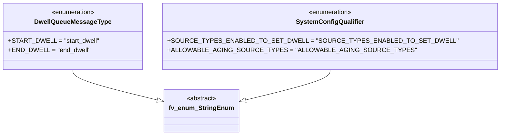

# Diagram: entity_core/watcher_service/watcher_service/dwell/constants.py

> Auto-generated by Obscura crawlers

## Mermaid

```mermaid
classDiagram
    class fv_enum_StringEnum <<abstract>>
    class DwellQueueMessageType <<enumeration>> {
        +START_DWELL = "start_dwell"
        +END_DWELL = "end_dwell"
    }
    class SystemConfigQualifier <<enumeration>> {
        +SOURCE_TYPES_ENABLED_TO_SET_DWELL = "SOURCE_TYPES_ENABLED_TO_SET_DWELL"
        +ALLOWABLE_AGING_SOURCE_TYPES = "ALLOWABLE_AGING_SOURCE_TYPES"
    }
    DwellQueueMessageType --|> fv_enum_StringEnum
    SystemConfigQualifier --|> fv_enum_StringEnum
```

> SVG rendering failed for this diagram.
