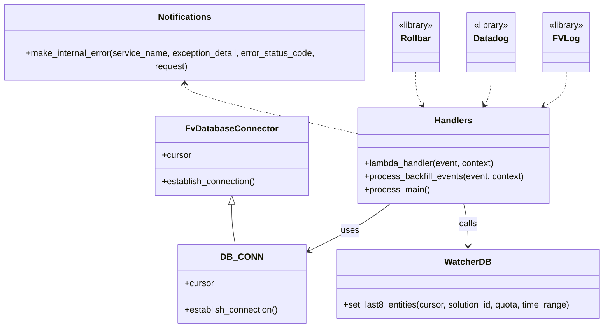

# Diagram: entity_core/watcher_service/watcher_service/entity_backfill_watcher.py


> Auto-generated by Obscura crawlers

## Diagram 1



> SVG rendering failed for this diagram.

## Diagram 2

```mermaid
flowchart TD
    ConfigureRollbar[configure_rollbar()] --> ModuleReady[Module initialized]
    CLI["Run as script (if __name__ == '__main__')"] --> ProcessMain[process_main()]
    ProcessMain --> CallProcessBackfill[process_backfill_events(None, None)]
    LambdaInvoke["AWS Lambda invoke\nlambda_handler(event, context)"] --> Decorators["Decorators:\nfv.datadog.wrap_lambda_handler\nrollbar.lambda_function"]
    Decorators --> TimeoutCall[func_timeout(3600, process_backfill_events, (event, context))]
    TimeoutCall --> Process[process_backfill_events(event, context)]
    Process --> ReadEnv["Read BACKFILL_SOLUTION_ID -> solutions"]
    Process --> DBConnect[DB_CONN.establish_connection()]
    DBConnect --> GetCursor[cursor = DB_CONN.cursor]
    GetCursor --> Loop["for solution_id in solutions"]
    Loop --> SetLast8[db.set_last8_entities(cursor, solution_id, QUOTA, TIME_RANGE)]
    SetLast8 --> LogRows[logging.info(\"Number of rows updated\")]
    Process -->|on exception| LogError[logging.error(traceback.format_exc())]
    LogError --> FVLogStack[fv.log.log_with_stack(...)]
    FVLogStack --> Notify[ntf.make_internal_error(SERVICE_NAME, exception_detail=traceback.format_exc(), error_status_code=\"500\", request=event)]
    Notify --> End[done]
```

> SVG rendering failed for this diagram.
