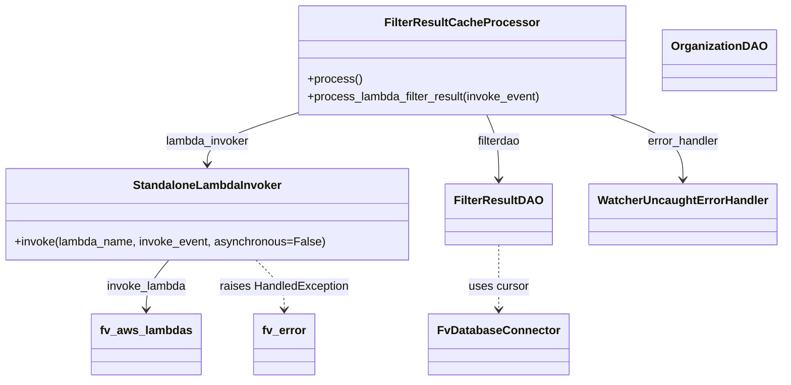

# Diagram: entity_core/watcher_service/watcher_service/filter_result_watcher.py


> Auto-generated by Obscura crawlers

## Diagram 1



### SVG

<svg id="container" width="1053.302734375" xmlns="http://www.w3.org/2000/svg" class="classDiagram" height="524" viewBox="0 0 1053.302734375 524" role="graphics-document document" aria-roledescription="class"><style>#container{font-family:"trebuchet ms",verdana,arial,sans-serif;font-size:16px;fill:#333;}@keyframes edge-animation-frame{from{stroke-dashoffset:0;}}@keyframes dash{to{stroke-dashoffset:0;}}#container .edge-animation-slow{stroke-dasharray:9,5!important;stroke-dashoffset:900;animation:dash 50s linear infinite;stroke-linecap:round;}#container .edge-animation-fast{stroke-dasharray:9,5!important;stroke-dashoffset:900;animation:dash 20s linear infinite;stroke-linecap:round;}#container .error-icon{fill:#552222;}#container .error-text{fill:#552222;stroke:#552222;}#container .edge-thickness-normal{stroke-width:1px;}#container .edge-thickness-thick{stroke-width:3.5px;}#container .edge-pattern-solid{stroke-dasharray:0;}#container .edge-thickness-invisible{stroke-width:0;fill:none;}#container .edge-pattern-dashed{stroke-dasharray:3;}#container .edge-pattern-dotted{stroke-dasharray:2;}#container .marker{fill:#333333;stroke:#333333;}#container .marker.cross{stroke:#333333;}#container svg{font-family:"trebuchet ms",verdana,arial,sans-serif;font-size:16px;}#container p{margin:0;}#container g.classGroup text{fill:#9370DB;stroke:none;font-family:"trebuchet ms",verdana,arial,sans-serif;font-size:10px;}#container g.classGroup text .title{font-weight:bolder;}#container .nodeLabel,#container .edgeLabel{color:#131300;}#container .edgeLabel .label rect{fill:#ECECFF;}#container .label text{fill:#131300;}#container .labelBkg{background:#ECECFF;}#container .edgeLabel .label span{background:#ECECFF;}#container .classTitle{font-weight:bolder;}#container .node rect,#container .node circle,#container .node ellipse,#container .node polygon,#container .node path{fill:#ECECFF;stroke:#9370DB;stroke-width:1px;}#container .divider{stroke:#9370DB;stroke-width:1;}#container g.clickable{cursor:pointer;}#container g.classGroup rect{fill:#ECECFF;stroke:#9370DB;}#container g.classGroup line{stroke:#9370DB;stroke-width:1;}#container .classLabel .box{stroke:none;stroke-width:0;fill:#ECECFF;opacity:0.5;}#container .classLabel .label{fill:#9370DB;font-size:10px;}#container .relation{stroke:#333333;stroke-width:1;fill:none;}#container .dashed-line{stroke-dasharray:3;}#container .dotted-line{stroke-dasharray:1 2;}#container #compositionStart,#container .composition{fill:#333333!important;stroke:#333333!important;stroke-width:1;}#container #compositionEnd,#container .composition{fill:#333333!important;stroke:#333333!important;stroke-width:1;}#container #dependencyStart,#container .dependency{fill:#333333!important;stroke:#333333!important;stroke-width:1;}#container #dependencyStart,#container .dependency{fill:#333333!important;stroke:#333333!important;stroke-width:1;}#container #extensionStart,#container .extension{fill:transparent!important;stroke:#333333!important;stroke-width:1;}#container #extensionEnd,#container .extension{fill:transparent!important;stroke:#333333!important;stroke-width:1;}#container #aggregationStart,#container .aggregation{fill:transparent!important;stroke:#333333!important;stroke-width:1;}#container #aggregationEnd,#container .aggregation{fill:transparent!important;stroke:#333333!important;stroke-width:1;}#container #lollipopStart,#container .lollipop{fill:#ECECFF!important;stroke:#333333!important;stroke-width:1;}#container #lollipopEnd,#container .lollipop{fill:#ECECFF!important;stroke:#333333!important;stroke-width:1;}#container .edgeTerminals{font-size:11px;line-height:initial;}#container .classTitleText{text-anchor:middle;font-size:18px;fill:#333;}#container .label-icon{display:inline-block;height:1em;overflow:visible;vertical-align:-0.125em;}#container .node .label-icon path{fill:currentColor;stroke:revert;stroke-width:revert;}#container :root{--mermaid-font-family:"trebuchet ms",verdana,arial,sans-serif;}</style><g><defs><marker id="container_class-aggregationStart" class="marker aggregation class" refX="18" refY="7" markerWidth="190" markerHeight="240" orient="auto"><path d="M 18,7 L9,13 L1,7 L9,1 Z"></path></marker></defs><defs><marker id="container_class-aggregationEnd" class="marker aggregation class" refX="1" refY="7" markerWidth="20" markerHeight="28" orient="auto"><path d="M 18,7 L9,13 L1,7 L9,1 Z"></path></marker></defs><defs><marker id="container_class-extensionStart" class="marker extension class" refX="18" refY="7" markerWidth="190" markerHeight="240" orient="auto"><path d="M 1,7 L18,13 V 1 Z"></path></marker></defs><defs><marker id="container_class-extensionEnd" class="marker extension class" refX="1" refY="7" markerWidth="20" markerHeight="28" orient="auto"><path d="M 1,1 V 13 L18,7 Z"></path></marker></defs><defs><marker id="container_class-compositionStart" class="marker composition class" refX="18" refY="7" markerWidth="190" markerHeight="240" orient="auto"><path d="M 18,7 L9,13 L1,7 L9,1 Z"></path></marker></defs><defs><marker id="container_class-compositionEnd" class="marker composition class" refX="1" refY="7" markerWidth="20" markerHeight="28" orient="auto"><path d="M 18,7 L9,13 L1,7 L9,1 Z"></path></marker></defs><defs><marker id="container_class-dependencyStart" class="marker dependency class" refX="6" refY="7" markerWidth="190" markerHeight="240" orient="auto"><path d="M 5,7 L9,13 L1,7 L9,1 Z"></path></marker></defs><defs><marker id="container_class-dependencyEnd" class="marker dependency class" refX="13" refY="7" markerWidth="20" markerHeight="28" orient="auto"><path d="M 18,7 L9,13 L14,7 L9,1 Z"></path></marker></defs><defs><marker id="container_class-lollipopStart" class="marker lollipop class" refX="13" refY="7" markerWidth="190" markerHeight="240" orient="auto"><circle stroke="black" fill="transparent" cx="7" cy="7" r="6"></circle></marker></defs><defs><marker id="container_class-lollipopEnd" class="marker lollipop class" refX="1" refY="7" markerWidth="190" markerHeight="240" orient="auto"><circle stroke="black" fill="transparent" cx="7" cy="7" r="6"></circle></marker></defs><g class="root"><g class="clusters"></g><g class="edgePaths"><path d="M400.529,156.256L380.837,162.713C361.145,169.171,321.76,182.085,302.067,193.709C282.375,205.333,282.375,215.667,282.375,220.833L282.375,226" id="id_FilterResultCacheProcessor_StandaloneLambdaInvoker_1" class="edge-thickness-normal edge-pattern-solid relation" style=";;;" data-edge="true" data-et="edge" data-id="id_FilterResultCacheProcessor_StandaloneLambdaInvoker_1" data-points="W3sieCI6NDAwLjUyOTI5Njg3NSwieSI6MTU2LjI1NTk2ODQ4MDcwMzZ9LHsieCI6MjgyLjM3NSwieSI6MTk1fSx7IngiOjI4Mi4zNzUsInkiOjIzMn1d" marker-end="url(#container_class-dependencyEnd)"></path><path d="M658.83,158L661.7,164.167C664.569,170.333,670.308,182.667,673.177,197.5C676.047,212.333,676.047,229.667,676.047,238.333L676.047,247" id="id_FilterResultCacheProcessor_FilterResultDAO_2" class="edge-thickness-normal edge-pattern-solid relation" style=";;;" data-edge="true" data-et="edge" data-id="id_FilterResultCacheProcessor_FilterResultDAO_2" data-points="W3sieCI6NjU4LjgzMDIzNTA3MjU0NDYsInkiOjE1OH0seyJ4Ijo2NzYuMDQ2ODc1LCJ5IjoxOTV9LHsieCI6Njc2LjA0Njg3NSwieSI6MjUzfV0=" marker-end="url(#container_class-dependencyEnd)"></path><path d="M821.658,158L837.916,164.167C854.173,170.333,886.688,182.667,902.946,197.5C919.203,212.333,919.203,229.667,919.203,238.333L919.203,247" id="id_FilterResultCacheProcessor_WatcherUncaughtErrorHandler_3" class="edge-thickness-normal edge-pattern-solid relation" style=";;;" data-edge="true" data-et="edge" data-id="id_FilterResultCacheProcessor_WatcherUncaughtErrorHandler_3" data-points="W3sieCI6ODIxLjY1ODA4MTA1NDY4NzUsInkiOjE1OH0seyJ4Ijo5MTkuMjAzMTI1LCJ5IjoxOTV9LHsieCI6OTE5LjIwMzEyNSwieSI6MjUzfV0=" marker-end="url(#container_class-dependencyEnd)"></path><path d="M676.047,337L676.047,346.667C676.047,356.333,676.047,375.667,676.047,390.5C676.047,405.333,676.047,415.667,676.047,420.833L676.047,426" id="id_FilterResultDAO_FvDatabaseConnector_4" class="edge-thickness-normal edge-pattern-dashed relation" style=";;;" data-edge="true" data-et="edge" data-id="id_FilterResultDAO_FvDatabaseConnector_4" data-points="W3sieCI6Njc2LjA0Njg3NSwieSI6MzM3fSx7IngiOjY3Ni4wNDY4NzUsInkiOjM5NX0seyJ4Ijo2NzYuMDQ2ODc1LCJ5Ijo0MzJ9XQ==" marker-end="url(#container_class-dependencyEnd)"></path><path d="M230.518,358L225.442,364.167C220.366,370.333,210.214,382.667,205.138,394C200.063,405.333,200.063,415.667,200.063,420.833L200.063,426" id="id_StandaloneLambdaInvoker_fv_aws_lambdas_5" class="edge-thickness-normal edge-pattern-solid relation" style=";;;" data-edge="true" data-et="edge" data-id="id_StandaloneLambdaInvoker_fv_aws_lambdas_5" data-points="W3sieCI6MjMwLjUxODEyNSwieSI6MzU4fSx7IngiOjIwMC4wNjI1LCJ5IjozOTV9LHsieCI6MjAwLjA2MjUsInkiOjQzMn1d" marker-end="url(#container_class-dependencyEnd)"></path><path d="M348.897,358L355.408,364.167C361.919,370.333,374.942,382.667,381.453,394C387.965,405.333,387.965,415.667,387.965,420.833L387.965,426" id="id_StandaloneLambdaInvoker_fv_error_6" class="edge-thickness-normal edge-pattern-dashed relation" style=";;;" data-edge="true" data-et="edge" data-id="id_StandaloneLambdaInvoker_fv_error_6" data-points="W3sieCI6MzQ4Ljg5NjYwMTU2MjUsInkiOjM1OH0seyJ4IjozODcuOTY0ODQzNzUsInkiOjM5NX0seyJ4IjozODcuOTY0ODQzNzUsInkiOjQzMn1d" marker-end="url(#container_class-dependencyEnd)"></path></g><g class="edgeLabels"><g class="edgeLabel" transform="translate(282.375, 195)"><g class="label" data-id="id_FilterResultCacheProcessor_StandaloneLambdaInvoker_1" transform="translate(-58.5, -12)"><foreignObject width="117" height="24"><div xmlns="http://www.w3.org/1999/xhtml" class="labelBkg" style="display: table-cell; white-space: nowrap; line-height: 1.5; max-width: 200px; text-align: center;"><span class="edgeLabel"><p>lambda_invoker</p></span></div></foreignObject></g></g><g class="edgeLabel" transform="translate(676.046875, 195)"><g class="label" data-id="id_FilterResultCacheProcessor_FilterResultDAO_2" transform="translate(-30.734375, -12)"><foreignObject width="61.46875" height="24"><div xmlns="http://www.w3.org/1999/xhtml" class="labelBkg" style="display: table-cell; white-space: nowrap; line-height: 1.5; max-width: 200px; text-align: center;"><span class="edgeLabel"><p>filterdao</p></span></div></foreignObject></g></g><g class="edgeLabel" transform="translate(919.203125, 195)"><g class="label" data-id="id_FilterResultCacheProcessor_WatcherUncaughtErrorHandler_3" transform="translate(-49.84375, -12)"><foreignObject width="99.6875" height="24"><div xmlns="http://www.w3.org/1999/xhtml" class="labelBkg" style="display: table-cell; white-space: nowrap; line-height: 1.5; max-width: 200px; text-align: center;"><span class="edgeLabel"><p>error_handler</p></span></div></foreignObject></g></g><g class="edgeLabel" transform="translate(676.046875, 395)"><g class="label" data-id="id_FilterResultDAO_FvDatabaseConnector_4" transform="translate(-41.4765625, -12)"><foreignObject width="82.953125" height="24"><div xmlns="http://www.w3.org/1999/xhtml" class="labelBkg" style="display: table-cell; white-space: nowrap; line-height: 1.5; max-width: 200px; text-align: center;"><span class="edgeLabel"><p>uses cursor</p></span></div></foreignObject></g></g><g class="edgeLabel" transform="translate(200.0625, 395)"><g class="label" data-id="id_StandaloneLambdaInvoker_fv_aws_lambdas_5" transform="translate(-55.171875, -12)"><foreignObject width="110.34375" height="24"><div xmlns="http://www.w3.org/1999/xhtml" class="labelBkg" style="display: table-cell; white-space: nowrap; line-height: 1.5; max-width: 200px; text-align: center;"><span class="edgeLabel"><p>invoke_lambda</p></span></div></foreignObject></g></g><g class="edgeLabel" transform="translate(387.96484375, 395)"><g class="label" data-id="id_StandaloneLambdaInvoker_fv_error_6" transform="translate(-89.453125, -12)"><foreignObject width="178.90625" height="24"><div xmlns="http://www.w3.org/1999/xhtml" class="labelBkg" style="display: table-cell; white-space: nowrap; line-height: 1.5; max-width: 200px; text-align: center;"><span class="edgeLabel"><p>raises HandledException</p></span></div></foreignObject></g></g></g><g class="nodes"><g class="node default" id="classId-StandaloneLambdaInvoker-0" transform="translate(282.375, 295)"><g class="basic label-container"><path d="M-274.375 -63 L274.375 -63 L274.375 63 L-274.375 63" stroke="none" stroke-width="0" fill="#ECECFF" style=""></path><path d="M-274.375 -63 C-157.75007962870978 -63, -41.12515925741954 -63, 274.375 -63 M-274.375 -63 C-156.8518780339466 -63, -39.32875606789324 -63, 274.375 -63 M274.375 -63 C274.375 -22.15175039701993, 274.375 18.696499205960137, 274.375 63 M274.375 -63 C274.375 -14.989755784257667, 274.375 33.020488431484665, 274.375 63 M274.375 63 C64.97010217615417 63, -144.43479564769166 63, -274.375 63 M274.375 63 C121.58405929125942 63, -31.206881417481156 63, -274.375 63 M-274.375 63 C-274.375 27.254004390524464, -274.375 -8.491991218951071, -274.375 -63 M-274.375 63 C-274.375 18.09504707722772, -274.375 -26.809905845544563, -274.375 -63" stroke="#9370DB" stroke-width="1.3" fill="none" stroke-dasharray="0 0" style=""></path></g><g class="annotation-group text" transform="translate(0, -39)"></g><g class="label-group text" transform="translate(-98.40625, -39)"><g class="label" style="font-weight: bolder" transform="translate(0,-12)"><foreignObject width="196.8125" height="24"><div xmlns="http://www.w3.org/1999/xhtml" style="display: table-cell; white-space: nowrap; line-height: 1.5; max-width: 246px; text-align: center;"><span class="nodeLabel markdown-node-label" style=""><p>StandaloneLambdaInvoker</p></span></div></foreignObject></g></g><g class="members-group text" transform="translate(-262.375, 9)"></g><g class="methods-group text" transform="translate(-262.375, 39)"><g class="label" style="" transform="translate(0,-12)"><foreignObject width="426.34375" height="24"><div xmlns="http://www.w3.org/1999/xhtml" style="display: table-cell; white-space: nowrap; line-height: 1.5; max-width: 484px; text-align: center;"><span class="nodeLabel markdown-node-label" style=""><p>+invoke(lambda_name, invoke_event, asynchronous=False)</p></span></div></foreignObject></g></g><g class="divider" style=""><path d="M-274.375 -15 C-75.01631388733739 -15, 124.34237222532522 -15, 274.375 -15 M-274.375 -15 C-142.99424255324766 -15, -11.613485106495318 -15, 274.375 -15" stroke="#9370DB" stroke-width="1.3" fill="none" stroke-dasharray="0 0" style=""></path></g><g class="divider" style=""><path d="M-274.375 9 C-143.26277449540183 9, -12.150548990803657 9, 274.375 9 M-274.375 9 C-148.74342976590344 9, -23.111859531806886 9, 274.375 9" stroke="#9370DB" stroke-width="1.3" fill="none" stroke-dasharray="0 0" style=""></path></g></g><g class="node default" id="classId-FilterResultCacheProcessor-1" transform="translate(623.931640625, 83)"><g class="basic label-container"><path d="M-223.40234375 -75 L223.40234375 -75 L223.40234375 75 L-223.40234375 75" stroke="none" stroke-width="0" fill="#ECECFF" style=""></path><path d="M-223.40234375 -75 C-52.615696405263066 -75, 118.17095093947387 -75, 223.40234375 -75 M-223.40234375 -75 C-102.03831192379255 -75, 19.325719902414903 -75, 223.40234375 -75 M223.40234375 -75 C223.40234375 -24.898435454542593, 223.40234375 25.203129090914814, 223.40234375 75 M223.40234375 -75 C223.40234375 -38.42192047127806, 223.40234375 -1.8438409425561133, 223.40234375 75 M223.40234375 75 C119.06370209923043 75, 14.725060448460852 75, -223.40234375 75 M223.40234375 75 C101.5278395247529 75, -20.346664700494188 75, -223.40234375 75 M-223.40234375 75 C-223.40234375 15.747248899698896, -223.40234375 -43.50550220060221, -223.40234375 -75 M-223.40234375 75 C-223.40234375 36.56433549208536, -223.40234375 -1.871329015829275, -223.40234375 -75" stroke="#9370DB" stroke-width="1.3" fill="none" stroke-dasharray="0 0" style=""></path></g><g class="annotation-group text" transform="translate(0, -51)"></g><g class="label-group text" transform="translate(-99.6953125, -51)"><g class="label" style="font-weight: bolder" transform="translate(0,-12)"><foreignObject width="199.390625" height="24"><div xmlns="http://www.w3.org/1999/xhtml" style="display: table-cell; white-space: nowrap; line-height: 1.5; max-width: 247px; text-align: center;"><span class="nodeLabel markdown-node-label" style=""><p>FilterResultCacheProcessor</p></span></div></foreignObject></g></g><g class="members-group text" transform="translate(-211.40234375, -3)"></g><g class="methods-group text" transform="translate(-211.40234375, 27)"><g class="label" style="" transform="translate(0,-12)"><foreignObject width="73.734375" height="24"><div xmlns="http://www.w3.org/1999/xhtml" style="display: table-cell; white-space: nowrap; line-height: 1.5; max-width: 131px; text-align: center;"><span class="nodeLabel markdown-node-label" style=""><p>+process()</p></span></div></foreignObject></g><g class="label" style="" transform="translate(0,12)"><foreignObject width="323.109375" height="24"><div xmlns="http://www.w3.org/1999/xhtml" style="display: table-cell; white-space: nowrap; line-height: 1.5; max-width: 380px; text-align: center;"><span class="nodeLabel markdown-node-label" style=""><p>+process_lambda_filter_result(invoke_event)</p></span></div></foreignObject></g></g><g class="divider" style=""><path d="M-223.40234375 -27 C-101.11429976257467 -27, 21.17374422485065 -27, 223.40234375 -27 M-223.40234375 -27 C-102.72930879579076 -27, 17.943726158418485 -27, 223.40234375 -27" stroke="#9370DB" stroke-width="1.3" fill="none" stroke-dasharray="0 0" style=""></path></g><g class="divider" style=""><path d="M-223.40234375 -3 C-118.5505070181007 -3, -13.698670286201406 -3, 223.40234375 -3 M-223.40234375 -3 C-80.11509615654316 -3, 63.17215143691368 -3, 223.40234375 -3" stroke="#9370DB" stroke-width="1.3" fill="none" stroke-dasharray="0 0" style=""></path></g></g><g class="node default" id="classId-FilterResultDAO-2" transform="translate(676.046875, 295)"><g class="basic label-container"><path d="M-69.296875 -42 L69.296875 -42 L69.296875 42 L-69.296875 42" stroke="none" stroke-width="0" fill="#ECECFF" style=""></path><path d="M-69.296875 -42 C-21.526407344618853 -42, 26.244060310762293 -42, 69.296875 -42 M-69.296875 -42 C-28.1713713502756 -42, 12.954132299448801 -42, 69.296875 -42 M69.296875 -42 C69.296875 -19.386781586820383, 69.296875 3.226436826359233, 69.296875 42 M69.296875 -42 C69.296875 -10.599932600334988, 69.296875 20.800134799330024, 69.296875 42 M69.296875 42 C36.358444459928705 42, 3.4200139198574107 42, -69.296875 42 M69.296875 42 C23.857181483985933 42, -21.582512032028134 42, -69.296875 42 M-69.296875 42 C-69.296875 9.47586134847316, -69.296875 -23.04827730305368, -69.296875 -42 M-69.296875 42 C-69.296875 13.503410112672455, -69.296875 -14.99317977465509, -69.296875 -42" stroke="#9370DB" stroke-width="1.3" fill="none" stroke-dasharray="0 0" style=""></path></g><g class="annotation-group text" transform="translate(0, -18)"></g><g class="label-group text" transform="translate(-57.296875, -18)"><g class="label" style="font-weight: bolder" transform="translate(0,-12)"><foreignObject width="114.59375" height="24"><div xmlns="http://www.w3.org/1999/xhtml" style="display: table-cell; white-space: nowrap; line-height: 1.5; max-width: 163px; text-align: center;"><span class="nodeLabel markdown-node-label" style=""><p>FilterResultDAO</p></span></div></foreignObject></g></g><g class="members-group text" transform="translate(-57.296875, 30)"></g><g class="methods-group text" transform="translate(-57.296875, 60)"></g><g class="divider" style=""><path d="M-69.296875 6 C-26.148351537485432 6, 17.000171925029136 6, 69.296875 6 M-69.296875 6 C-28.00472276138664 6, 13.287429477226723 6, 69.296875 6" stroke="#9370DB" stroke-width="1.3" fill="none" stroke-dasharray="0 0" style=""></path></g><g class="divider" style=""><path d="M-69.296875 24 C-33.61264456870728 24, 2.0715858625854366 24, 69.296875 24 M-69.296875 24 C-17.97416625263213 24, 33.34854249473574 24, 69.296875 24" stroke="#9370DB" stroke-width="1.3" fill="none" stroke-dasharray="0 0" style=""></path></g></g><g class="node default" id="classId-OrganizationDAO-3" transform="translate(971.318359375, 83)"><g class="basic label-container"><path d="M-73.984375 -42 L73.984375 -42 L73.984375 42 L-73.984375 42" stroke="none" stroke-width="0" fill="#ECECFF" style=""></path><path d="M-73.984375 -42 C-23.213317641933237 -42, 27.557739716133526 -42, 73.984375 -42 M-73.984375 -42 C-18.685121047135908 -42, 36.614132905728184 -42, 73.984375 -42 M73.984375 -42 C73.984375 -15.075986800792322, 73.984375 11.848026398415357, 73.984375 42 M73.984375 -42 C73.984375 -14.162929858105166, 73.984375 13.674140283789669, 73.984375 42 M73.984375 42 C17.39765740090337 42, -39.18906019819326 42, -73.984375 42 M73.984375 42 C19.43812048116029 42, -35.10813403767942 42, -73.984375 42 M-73.984375 42 C-73.984375 15.061827614817389, -73.984375 -11.876344770365222, -73.984375 -42 M-73.984375 42 C-73.984375 21.382919493770867, -73.984375 0.7658389875417342, -73.984375 -42" stroke="#9370DB" stroke-width="1.3" fill="none" stroke-dasharray="0 0" style=""></path></g><g class="annotation-group text" transform="translate(0, -18)"></g><g class="label-group text" transform="translate(-61.984375, -18)"><g class="label" style="font-weight: bolder" transform="translate(0,-12)"><foreignObject width="123.96875" height="24"><div xmlns="http://www.w3.org/1999/xhtml" style="display: table-cell; white-space: nowrap; line-height: 1.5; max-width: 172px; text-align: center;"><span class="nodeLabel markdown-node-label" style=""><p>OrganizationDAO</p></span></div></foreignObject></g></g><g class="members-group text" transform="translate(-61.984375, 30)"></g><g class="methods-group text" transform="translate(-61.984375, 60)"></g><g class="divider" style=""><path d="M-73.984375 6 C-21.943276388600744 6, 30.097822222798513 6, 73.984375 6 M-73.984375 6 C-42.98510116054439 6, -11.985827321088784 6, 73.984375 6" stroke="#9370DB" stroke-width="1.3" fill="none" stroke-dasharray="0 0" style=""></path></g><g class="divider" style=""><path d="M-73.984375 24 C-39.77261271330407 24, -5.560850426608141 24, 73.984375 24 M-73.984375 24 C-23.151497042158482 24, 27.681380915683036 24, 73.984375 24" stroke="#9370DB" stroke-width="1.3" fill="none" stroke-dasharray="0 0" style=""></path></g></g><g class="node default" id="classId-FvDatabaseConnector-4" transform="translate(676.046875, 474)"><g class="basic label-container"><path d="M-91.3046875 -42 L91.3046875 -42 L91.3046875 42 L-91.3046875 42" stroke="none" stroke-width="0" fill="#ECECFF" style=""></path><path d="M-91.3046875 -42 C-33.91400001797135 -42, 23.476687464057306 -42, 91.3046875 -42 M-91.3046875 -42 C-47.670627368764585 -42, -4.0365672375291695 -42, 91.3046875 -42 M91.3046875 -42 C91.3046875 -12.39249835523325, 91.3046875 17.2150032895335, 91.3046875 42 M91.3046875 -42 C91.3046875 -17.635989691945632, 91.3046875 6.728020616108736, 91.3046875 42 M91.3046875 42 C39.303549144767096 42, -12.697589210465807 42, -91.3046875 42 M91.3046875 42 C38.50836217509524 42, -14.287963149809514 42, -91.3046875 42 M-91.3046875 42 C-91.3046875 14.843742912672415, -91.3046875 -12.31251417465517, -91.3046875 -42 M-91.3046875 42 C-91.3046875 13.588469051066497, -91.3046875 -14.823061897867007, -91.3046875 -42" stroke="#9370DB" stroke-width="1.3" fill="none" stroke-dasharray="0 0" style=""></path></g><g class="annotation-group text" transform="translate(0, -18)"></g><g class="label-group text" transform="translate(-79.3046875, -18)"><g class="label" style="font-weight: bolder" transform="translate(0,-12)"><foreignObject width="158.609375" height="24"><div xmlns="http://www.w3.org/1999/xhtml" style="display: table-cell; white-space: nowrap; line-height: 1.5; max-width: 207px; text-align: center;"><span class="nodeLabel markdown-node-label" style=""><p>FvDatabaseConnector</p></span></div></foreignObject></g></g><g class="members-group text" transform="translate(-79.3046875, 30)"></g><g class="methods-group text" transform="translate(-79.3046875, 60)"></g><g class="divider" style=""><path d="M-91.3046875 6 C-47.56347577620482 6, -3.8222640524096363 6, 91.3046875 6 M-91.3046875 6 C-50.53897891945161 6, -9.773270338903217 6, 91.3046875 6" stroke="#9370DB" stroke-width="1.3" fill="none" stroke-dasharray="0 0" style=""></path></g><g class="divider" style=""><path d="M-91.3046875 24 C-18.531847477510084 24, 54.24099254497983 24, 91.3046875 24 M-91.3046875 24 C-34.553890436834585 24, 22.19690662633083 24, 91.3046875 24" stroke="#9370DB" stroke-width="1.3" fill="none" stroke-dasharray="0 0" style=""></path></g></g><g class="node default" id="classId-WatcherUncaughtErrorHandler-5" transform="translate(919.203125, 295)"><g class="basic label-container"><path d="M-123.859375 -42 L123.859375 -42 L123.859375 42 L-123.859375 42" stroke="none" stroke-width="0" fill="#ECECFF" style=""></path><path d="M-123.859375 -42 C-35.99709246085085 -42, 51.8651900782983 -42, 123.859375 -42 M-123.859375 -42 C-31.37432015010299 -42, 61.11073469979402 -42, 123.859375 -42 M123.859375 -42 C123.859375 -18.030511166410427, 123.859375 5.938977667179145, 123.859375 42 M123.859375 -42 C123.859375 -24.933383401192547, 123.859375 -7.866766802385094, 123.859375 42 M123.859375 42 C45.64383622497007 42, -32.571702550059854 42, -123.859375 42 M123.859375 42 C56.824804057298635 42, -10.209766885402729 42, -123.859375 42 M-123.859375 42 C-123.859375 25.144081889007687, -123.859375 8.288163778015374, -123.859375 -42 M-123.859375 42 C-123.859375 23.07320514057361, -123.859375 4.146410281147219, -123.859375 -42" stroke="#9370DB" stroke-width="1.3" fill="none" stroke-dasharray="0 0" style=""></path></g><g class="annotation-group text" transform="translate(0, -18)"></g><g class="label-group text" transform="translate(-111.859375, -18)"><g class="label" style="font-weight: bolder" transform="translate(0,-12)"><foreignObject width="223.71875" height="24"><div xmlns="http://www.w3.org/1999/xhtml" style="display: table-cell; white-space: nowrap; line-height: 1.5; max-width: 272px; text-align: center;"><span class="nodeLabel markdown-node-label" style=""><p>WatcherUncaughtErrorHandler</p></span></div></foreignObject></g></g><g class="members-group text" transform="translate(-111.859375, 30)"></g><g class="methods-group text" transform="translate(-111.859375, 60)"></g><g class="divider" style=""><path d="M-123.859375 6 C-30.07888608996643 6, 63.70160282006714 6, 123.859375 6 M-123.859375 6 C-29.215212799642103 6, 65.4289494007158 6, 123.859375 6" stroke="#9370DB" stroke-width="1.3" fill="none" stroke-dasharray="0 0" style=""></path></g><g class="divider" style=""><path d="M-123.859375 24 C-72.26562327666629 24, -20.67187155333258 24, 123.859375 24 M-123.859375 24 C-44.47456551297786 24, 34.91024397404428 24, 123.859375 24" stroke="#9370DB" stroke-width="1.3" fill="none" stroke-dasharray="0 0" style=""></path></g></g><g class="node default" id="classId-fv_aws_lambdas-6" transform="translate(200.0625, 474)"><g class="basic label-container"><path d="M-72.0625 -42 L72.0625 -42 L72.0625 42 L-72.0625 42" stroke="none" stroke-width="0" fill="#ECECFF" style=""></path><path d="M-72.0625 -42 C-16.509480017382174 -42, 39.04353996523565 -42, 72.0625 -42 M-72.0625 -42 C-41.394260609385874 -42, -10.726021218771749 -42, 72.0625 -42 M72.0625 -42 C72.0625 -23.035614318421306, 72.0625 -4.071228636842612, 72.0625 42 M72.0625 -42 C72.0625 -10.842380087702466, 72.0625 20.315239824595068, 72.0625 42 M72.0625 42 C27.869187730749964 42, -16.324124538500072 42, -72.0625 42 M72.0625 42 C26.00196515423316 42, -20.058569691533677 42, -72.0625 42 M-72.0625 42 C-72.0625 23.02637278204831, -72.0625 4.052745564096618, -72.0625 -42 M-72.0625 42 C-72.0625 12.859636192280199, -72.0625 -16.280727615439602, -72.0625 -42" stroke="#9370DB" stroke-width="1.3" fill="none" stroke-dasharray="0 0" style=""></path></g><g class="annotation-group text" transform="translate(0, -18)"></g><g class="label-group text" transform="translate(-60.0625, -18)"><g class="label" style="font-weight: bolder" transform="translate(0,-12)"><foreignObject width="120.125" height="24"><div xmlns="http://www.w3.org/1999/xhtml" style="display: table-cell; white-space: nowrap; line-height: 1.5; max-width: 168px; text-align: center;"><span class="nodeLabel markdown-node-label" style=""><p>fv_aws_lambdas</p></span></div></foreignObject></g></g><g class="members-group text" transform="translate(-60.0625, 30)"></g><g class="methods-group text" transform="translate(-60.0625, 60)"></g><g class="divider" style=""><path d="M-72.0625 6 C-14.667178119332661 6, 42.72814376133468 6, 72.0625 6 M-72.0625 6 C-20.215903079577778 6, 31.630693840844444 6, 72.0625 6" stroke="#9370DB" stroke-width="1.3" fill="none" stroke-dasharray="0 0" style=""></path></g><g class="divider" style=""><path d="M-72.0625 24 C-37.66908606965755 24, -3.2756721393151054 24, 72.0625 24 M-72.0625 24 C-39.09192841363492 24, -6.121356827269835 24, 72.0625 24" stroke="#9370DB" stroke-width="1.3" fill="none" stroke-dasharray="0 0" style=""></path></g></g><g class="node default" id="classId-fv_error-7" transform="translate(387.96484375, 474)"><g class="basic label-container"><path d="M-41.1875 -42 L41.1875 -42 L41.1875 42 L-41.1875 42" stroke="none" stroke-width="0" fill="#ECECFF" style=""></path><path d="M-41.1875 -42 C-9.842096352747056 -42, 21.503307294505888 -42, 41.1875 -42 M-41.1875 -42 C-15.009302387068097 -42, 11.168895225863807 -42, 41.1875 -42 M41.1875 -42 C41.1875 -20.21415928716424, 41.1875 1.571681425671521, 41.1875 42 M41.1875 -42 C41.1875 -11.624376183126266, 41.1875 18.751247633747468, 41.1875 42 M41.1875 42 C16.728578481627494 42, -7.730343036745012 42, -41.1875 42 M41.1875 42 C23.982515927739907 42, 6.777531855479815 42, -41.1875 42 M-41.1875 42 C-41.1875 8.843113176298843, -41.1875 -24.313773647402314, -41.1875 -42 M-41.1875 42 C-41.1875 20.666640217750555, -41.1875 -0.6667195644988908, -41.1875 -42" stroke="#9370DB" stroke-width="1.3" fill="none" stroke-dasharray="0 0" style=""></path></g><g class="annotation-group text" transform="translate(0, -18)"></g><g class="label-group text" transform="translate(-29.1875, -18)"><g class="label" style="font-weight: bolder" transform="translate(0,-12)"><foreignObject width="58.375" height="24"><div xmlns="http://www.w3.org/1999/xhtml" style="display: table-cell; white-space: nowrap; line-height: 1.5; max-width: 108px; text-align: center;"><span class="nodeLabel markdown-node-label" style=""><p>fv_error</p></span></div></foreignObject></g></g><g class="members-group text" transform="translate(-29.1875, 30)"></g><g class="methods-group text" transform="translate(-29.1875, 60)"></g><g class="divider" style=""><path d="M-41.1875 6 C-15.784091069105344 6, 9.619317861789312 6, 41.1875 6 M-41.1875 6 C-9.509986821978899 6, 22.167526356042202 6, 41.1875 6" stroke="#9370DB" stroke-width="1.3" fill="none" stroke-dasharray="0 0" style=""></path></g><g class="divider" style=""><path d="M-41.1875 24 C-13.935905610579042 24, 13.315688778841917 24, 41.1875 24 M-41.1875 24 C-22.312923637057835 24, -3.438347274115671 24, 41.1875 24" stroke="#9370DB" stroke-width="1.3" fill="none" stroke-dasharray="0 0" style=""></path></g></g></g></g></g></svg>

## Diagram 2

```mermaid
flowchart TD
subgraph Invocation Flow
  LH[lambda_handler(event)] --> EH[Create WatcherUncaughtErrorHandler]
  LH --> TF[func_timeout(299s) -> retrieve_and_send_filter_results]
  TF --> R[retrieve_and_send_filter_results(error_handler)]
  R --> INIT[initialize_filter_result_cache_processor(error_handler)]
  INIT --> DB[DB_CONN.establish_connection()]
  DB --> CURS[DB_CONN.cursor]
  INIT --> DAO[FilterResultDAO(cursor)]
  INIT --> INV[StandaloneLambdaInvoker()]
  INIT --> PROC[FilterResultCacheProcessor(lambda_invoker, filterdao, error_handler, datetime.utcnow)]
  PROC --> RUN[processor.process()]
  RUN --> INVOKE[invoker.invoke(lambda_name, invoke_event, asynchronous?)]
  INVOKE --> AWS[invoke_lambda(full_payload, invoke_type)]
  AWS --> RES[results]
  RES --> CHECK{status_code >= 400?}
  CHECK -- yes --> EX[raise HandledException]
  CHECK -- no --> OK[return results_body]
end

subgraph Consumer Flow
  PC[process_cached_event(event)] --> GET[invoke_event = event.get("body", "{}")]
  PC --> INIT2[initialize_filter_result_cache_processor(None)]
  INIT2 --> PROC2[processor.process_lambda_filter_result(invoke_event)]
  PROC2 --> RESP[fv.aws.lambdas.make_response({"message":"success"}, 200)]
end
```

> SVG rendering failed for this diagram.
