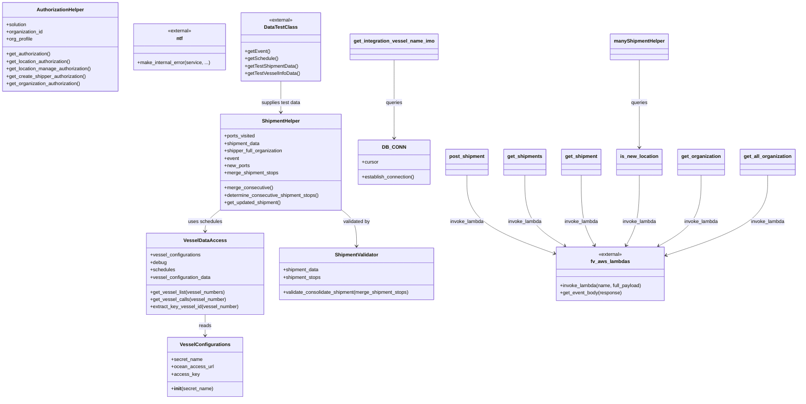

# Diagram: entity_core/watcher_service/watcher_service/ocean_vessel_watcher.py


> Auto-generated by Obscura crawlers

## Diagram 1



> SVG rendering failed for this diagram.

## Diagram 2

```mermaid
flowchart TD
    Start([process_vessel_events(event)]) --> A[get_all_organization(event)]
    A --> OrgLoop{organizations}
    OrgLoop -->|org_type == "Shipper"| GetOrg[get_organization(event, organization)]
    GetOrg --> PageLoop[page_number = 0]
    PageLoop --> GetShipments[get_shipments(event, shipper_full_organization, page_number)]
    GetShipments --> CheckMeta{meta.totalCount > 0 ?}
    CheckMeta -->|yes| Collect[append pending shipments to shipments_to_process]
    Collect --> MorePages{page_number == meta.totalPages ?}
    MorePages -->|no| Increment[page_number += 1] --> PageLoop
    MorePages -->|yes| AfterPaging
    CheckMeta -->|no| AfterPaging[processing = False]
    AfterPaging --> HasShipments{len(shipments_to_process) > 0}
    HasShipments -->|yes| BuildVDA[VesselConfigurations + VesselDataAccess]
    BuildVDA --> VDA_Call[VesselDataAccess.get_vessel_list(vessel_numbers)]
    VDA_Call --> ForEachPending{for pending_shipment in pending_shipments}
    ForEachPending --> DetermineVessel[get_vessel_numbers(pending_shipment)]
    DetermineVessel -->|valid| VDA_GetCalls[VesselDataAccess.get_vessel_calls(vessel_number)]
    VDA_GetCalls --> CheckSchedules{schedules present?}
    CheckSchedules -->|no| LogSkip[log error and continue]
    CheckSchedules -->|yes| GetShipment[get_shipment(event, pending_shipment)]
    GetShipment --> ValidateStops{shipment_stops exist and valid earliest_arrival}
    ValidateStops -->|invalid| LogSkip2[log error and continue]
    ValidateStops -->|valid| MergeHelper[ShipmentHelper(ports_visited=vda.schedules,...)]
    MergeHelper --> NewPortsFound{len(new_ports) > 0}
    NewPortsFound -->|yes| UpdatedShipment[update_shipment = get_updated_shipment()]
    UpdatedShipment --> Validator[ShipmentValidator.validate_consolidate_shipment]
    Validator -->|valid| Post[post_shipment(event, update_shipment, ...)]
    Post --> PostSuccess{response.statusCode == "200"}
    PostSuccess -->|yes| LogSuccess[log updated]
    PostSuccess -->|no| NotifyError[ntf.make_internal_error(...)]
    NewPortsFound -->|no| Continue[continue]
    OrgLoop -->|other org types| SkipOrg[skip organization] --> OrgLoop
    AfterPaging --> End([done])
```

> SVG rendering failed for this diagram.
