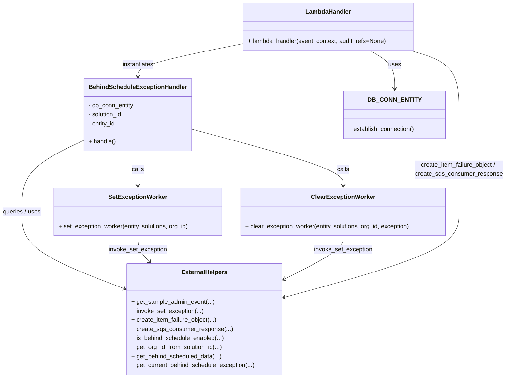
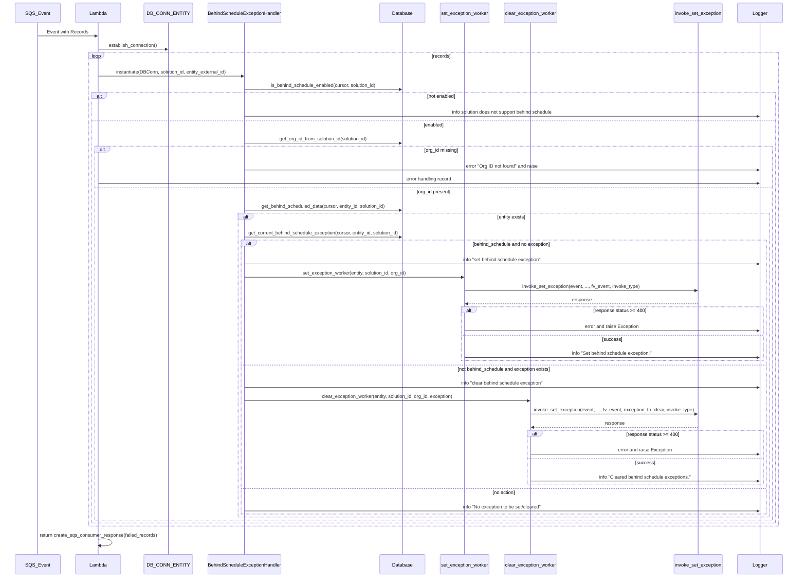

# Diagram: entity_core/watcher_service/watcher_service/queue_consumer/update_behind_schedule_exception.py

> Auto-generated by Obscura crawlers

## Diagram 1

### SVG

<svg id="container" width="1353.9375" xmlns="http://www.w3.org/2000/svg" class="classDiagram" height="1000" viewBox="0 0 1353.9375 1000" role="graphics-document document" aria-roledescription="class"><g><defs><marker id="container_class-aggregationStart" class="marker aggregation class" refX="18" refY="7" markerWidth="190" markerHeight="240" orient="auto"><path d="M 18,7 L9,13 L1,7 L9,1 Z"></path></marker></defs><defs><marker id="container_class-aggregationEnd" class="marker aggregation class" refX="1" refY="7" markerWidth="20" markerHeight="28" orient="auto"><path d="M 18,7 L9,13 L1,7 L9,1 Z"></path></marker></defs><defs><marker id="container_class-extensionStart" class="marker extension class" refX="18" refY="7" markerWidth="190" markerHeight="240" orient="auto"><path d="M 1,7 L18,13 V 1 Z"></path></marker></defs><defs><marker id="container_class-extensionEnd" class="marker extension class" refX="1" refY="7" markerWidth="20" markerHeight="28" orient="auto"><path d="M 1,1 V 13 L18,7 Z"></path></marker></defs><defs><marker id="container_class-compositionStart" class="marker composition class" refX="18" refY="7" markerWidth="190" markerHeight="240" orient="auto"><path d="M 18,7 L9,13 L1,7 L9,1 Z"></path></marker></defs><defs><marker id="container_class-compositionEnd" class="marker composition class" refX="1" refY="7" markerWidth="20" markerHeight="28" orient="auto"><path d="M 18,7 L9,13 L1,7 L9,1 Z"></path></marker></defs><defs><marker id="container_class-dependencyStart" class="marker dependency class" refX="6" refY="7" markerWidth="190" markerHeight="240" orient="auto"><path d="M 5,7 L9,13 L1,7 L9,1 Z"></path></marker></defs><defs><marker id="container_class-dependencyEnd" class="marker dependency class" refX="13" refY="7" markerWidth="20" markerHeight="28" orient="auto"><path d="M 18,7 L9,13 L14,7 L9,1 Z"></path></marker></defs><defs><marker id="container_class-lollipopStart" class="marker lollipop class" refX="13" refY="7" markerWidth="190" markerHeight="240" orient="auto"><circle stroke="black" fill="transparent" cx="7" cy="7" r="6"></circle></marker></defs><defs><marker id="container_class-lollipopEnd" class="marker lollipop class" refX="1" refY="7" markerWidth="190" markerHeight="240" orient="auto"><circle stroke="black" fill="transparent" cx="7" cy="7" r="6"></circle></marker></defs><g class="root"><g class="clusters"></g><g class="edgePaths"><path d="M994.489,134L1005.966,140.167C1017.443,146.333,1040.397,158.667,1051.874,175.5C1063.352,192.333,1063.352,213.667,1063.352,224.333L1063.352,235" id="id_LambdaHandler_DB_CONN_ENTITY_1" class="edge-thickness-normal edge-pattern-solid relation" style=";;;" data-edge="true" data-et="edge" data-id="id_LambdaHandler_DB_CONN_ENTITY_1" data-points="W3sieCI6OTk0LjQ4ODkyNTc4MTI1LCJ5IjoxMzR9LHsieCI6MTA2My4zNTE1NjI1LCJ5IjoxNzF9LHsieCI6MTA2My4zNTE1NjI1LCJ5IjoyNDF9XQ==" marker-end="url(#container_class-dependencyEnd)"></path><path d="M649.979,116.021L603.725,125.184C557.471,134.347,464.964,152.674,418.711,167.004C372.457,181.333,372.457,191.667,372.457,196.833L372.457,202" id="id_LambdaHandler_BehindScheduleExceptionHandler_2" class="edge-thickness-normal edge-pattern-solid relation" style=";;;" data-edge="true" data-et="edge" data-id="id_LambdaHandler_BehindScheduleExceptionHandler_2" data-points="W3sieCI6NjQ5Ljk3ODUxNTYyNSwieSI6MTE2LjAyMTIyMjkxOTk3OTcyfSx7IngiOjM3Mi40NTcwMzEyNSwieSI6MTcxfSx7IngiOjM3Mi40NTcwMzEyNSwieSI6MjA4fV0=" marker-end="url(#container_class-dependencyEnd)"></path><path d="M236.457,367.14L207.07,380.783C177.682,394.426,118.908,421.713,89.52,454.023C60.133,486.333,60.133,523.667,60.133,559C60.133,594.333,60.133,627.667,107.998,662.003C155.863,696.339,251.593,731.678,299.458,749.347L347.322,767.017" id="id_BehindScheduleExceptionHandler_ExternalHelpers_3" class="edge-thickness-normal edge-pattern-solid relation" style=";;;" data-edge="true" data-et="edge" data-id="id_BehindScheduleExceptionHandler_ExternalHelpers_3" data-points="W3sieCI6MjM2LjQ1NzAzMTI1LCJ5IjozNjcuMTM5NTE1OTc3NzM3NDZ9LHsieCI6NjAuMTMyODEyNSwieSI6NDQ5fSx7IngiOjYwLjEzMjgxMjUsInkiOjU2MX0seyJ4Ijo2MC4xMzI4MTI1LCJ5Ijo2NjF9LHsieCI6MzUyLjk1MTE3MTg3NSwieSI6NzY5LjA5NDUyOTQxMDE1MTJ9XQ==" marker-end="url(#container_class-dependencyEnd)"></path><path d="M372.457,400L372.457,408.167C372.457,416.333,372.457,432.667,372.457,448C372.457,463.333,372.457,477.667,372.457,484.833L372.457,492" id="id_BehindScheduleExceptionHandler_SetExceptionWorker_4" class="edge-thickness-normal edge-pattern-solid relation" style=";;;" data-edge="true" data-et="edge" data-id="id_BehindScheduleExceptionHandler_SetExceptionWorker_4" data-points="W3sieCI6MzcyLjQ1NzAzMTI1LCJ5Ijo0MDB9LHsieCI6MzcyLjQ1NzAzMTI1LCJ5Ijo0NDl9LHsieCI6MzcyLjQ1NzAzMTI1LCJ5Ijo0OTh9XQ==" marker-end="url(#container_class-dependencyEnd)"></path><path d="M508.457,339.895L577.353,358.079C646.249,376.264,784.04,412.632,852.936,437.983C921.832,463.333,921.832,477.667,921.832,484.833L921.832,492" id="id_BehindScheduleExceptionHandler_ClearExceptionWorker_5" class="edge-thickness-normal edge-pattern-solid relation" style=";;;" data-edge="true" data-et="edge" data-id="id_BehindScheduleExceptionHandler_ClearExceptionWorker_5" data-points="W3sieCI6NTA4LjQ1NzAzMTI1LCJ5IjozMzkuODk1MzM1NjA4NjQ2Mn0seyJ4Ijo5MjEuODMyMDMxMjUsInkiOjQ0OX0seyJ4Ijo5MjEuODMyMDMxMjUsInkiOjQ5OH1d" marker-end="url(#container_class-dependencyEnd)"></path><path d="M372.457,624L372.457,630.167C372.457,636.333,372.457,648.667,377.983,660.297C383.51,671.927,394.563,682.854,400.089,688.318L405.616,693.782" id="id_SetExceptionWorker_ExternalHelpers_6" class="edge-thickness-normal edge-pattern-solid relation" style=";;;" data-edge="true" data-et="edge" data-id="id_SetExceptionWorker_ExternalHelpers_6" data-points="W3sieCI6MzcyLjQ1NzAzMTI1LCJ5Ijo2MjR9LHsieCI6MzcyLjQ1NzAzMTI1LCJ5Ijo2NjF9LHsieCI6NDA5Ljg4MjM3NzI5Mjc5ODksInkiOjY5OH1d" marker-end="url(#container_class-dependencyEnd)"></path><path d="M921.832,624L921.832,630.167C921.832,636.333,921.832,648.667,896.451,667.689C871.07,686.712,820.308,712.424,794.927,725.281L769.546,738.137" id="id_ClearExceptionWorker_ExternalHelpers_7" class="edge-thickness-normal edge-pattern-solid relation" style=";;;" data-edge="true" data-et="edge" data-id="id_ClearExceptionWorker_ExternalHelpers_7" data-points="W3sieCI6OTIxLjgzMjAzMTI1LCJ5Ijo2MjR9LHsieCI6OTIxLjgzMjAzMTI1LCJ5Ijo2NjF9LHsieCI6NzY0LjE5MzM1OTM3NSwieSI6NzQwLjg0Nzg2MTk3MDMzMTZ9XQ==" marker-end="url(#container_class-dependencyEnd)"></path><path d="M1100.117,134L1121.934,140.167C1143.75,146.333,1187.383,158.667,1209.199,187C1231.016,215.333,1231.016,259.667,1231.016,306C1231.016,352.333,1231.016,400.667,1231.016,443.5C1231.016,486.333,1231.016,523.667,1231.016,559C1231.016,594.333,1231.016,627.667,1154.176,665.359C1077.337,703.051,923.659,745.102,846.82,766.127L769.981,787.153" id="id_LambdaHandler_ExternalHelpers_8" class="edge-thickness-normal edge-pattern-solid relation" style=";;;" data-edge="true" data-et="edge" data-id="id_LambdaHandler_ExternalHelpers_8" data-points="W3sieCI6MTEwMC4xMTcyODUxNTYyNSwieSI6MTM0fSx7IngiOjEyMzEuMDE1NjI1LCJ5IjoxNzF9LHsieCI6MTIzMS4wMTU2MjUsInkiOjMwNH0seyJ4IjoxMjMxLjAxNTYyNSwieSI6NDQ5fSx7IngiOjEyMzEuMDE1NjI1LCJ5Ijo1NjF9LHsieCI6MTIzMS4wMTU2MjUsInkiOjY2MX0seyJ4Ijo3NjQuMTkzMzU5Mzc1LCJ5Ijo3ODguNzM2MTA2OTU2MDM0M31d" marker-end="url(#container_class-dependencyEnd)"></path></g><g class="edgeLabels"><g class="edgeLabel" transform="translate(1063.3515625, 171)"><g class="label" data-id="id_LambdaHandler_DB_CONN_ENTITY_1" transform="translate(-16.4921875, -12)"><foreignObject width="32.984375" height="24">

uses

</foreignObject></g></g><g class="edgeLabel" transform="translate(372.45703125, 171)"><g class="label" data-id="id_LambdaHandler_BehindScheduleExceptionHandler_2" transform="translate(-42.9140625, -12)"><foreignObject width="85.828125" height="24">

instantiates

</foreignObject></g></g><g class="edgeLabel" transform="translate(60.1328125, 561)"><g class="label" data-id="id_BehindScheduleExceptionHandler_ExternalHelpers_3" transform="translate(-52.1328125, -12)"><foreignObject width="104.265625" height="24">

queries / uses

</foreignObject></g></g><g class="edgeLabel" transform="translate(372.45703125, 449)"><g class="label" data-id="id_BehindScheduleExceptionHandler_SetExceptionWorker_4" transform="translate(-16.4453125, -12)"><foreignObject width="32.890625" height="24">

calls

</foreignObject></g></g><g class="edgeLabel" transform="translate(921.83203125, 449)"><g class="label" data-id="id_BehindScheduleExceptionHandler_ClearExceptionWorker_5" transform="translate(-16.4453125, -12)"><foreignObject width="32.890625" height="24">

calls

</foreignObject></g></g><g class="edgeLabel" transform="translate(372.45703125, 661)"><g class="label" data-id="id_SetExceptionWorker_ExternalHelpers_6" transform="translate(-78.2109375, -12)"><foreignObject width="156.421875" height="24">

invoke_set_exception

</foreignObject></g></g><g class="edgeLabel" transform="translate(921.83203125, 661)"><g class="label" data-id="id_ClearExceptionWorker_ExternalHelpers_7" transform="translate(-78.2109375, -12)"><foreignObject width="156.421875" height="24">

invoke_set_exception

</foreignObject></g></g><g class="edgeLabel" transform="translate(1231.015625, 449)"><g class="label" data-id="id_LambdaHandler_ExternalHelpers_8" transform="translate(-114.921875, -24)"><foreignObject width="229.84375" height="48">

create_item_failure_object / create_sqs_consumer_response

</foreignObject></g></g></g><g class="nodes"><g class="node default" id="classId-BehindScheduleExceptionHandler-0" transform="translate(372.45703125, 304)"><g class="basic label-container"><path d="M-136 -96 L136 -96 L136 96 L-136 96" stroke="none" stroke-width="0" fill="#ECECFF" style=""></path><path d="M-136 -96 C-53.274519196786216 -96, 29.45096160642757 -96, 136 -96 M-136 -96 C-42.85511469048235 -96, 50.289770619035295 -96, 136 -96 M136 -96 C136 -34.71245909400853, 136 26.57508181198294, 136 96 M136 -96 C136 -25.10268054591822, 136 45.79463890816356, 136 96 M136 96 C66.66352344047245 96, -2.6729531190551086 96, -136 96 M136 96 C52.185689643016445 96, -31.62862071396711 96, -136 96 M-136 96 C-136 40.162164866825655, -136 -15.675670266348689, -136 -96 M-136 96 C-136 54.84852479898536, -136 13.697049597970718, -136 -96" stroke="#9370DB" stroke-width="1.3" fill="none" stroke-dasharray="0 0" style=""></path></g><g class="annotation-group text" transform="translate(0, -72)"></g><g class="label-group text" transform="translate(-124, -72)"><g class="label" style="font-weight: bolder" transform="translate(0,-12)"><foreignObject width="248" height="24">

BehindScheduleExceptionHandler

</foreignObject></g></g><g class="members-group text" transform="translate(-124, -24)"><g class="label" style="" transform="translate(0,-12)"><foreignObject width="122.828125" height="24">

- db_conn_entity

</foreignObject></g><g class="label" style="" transform="translate(0,12)"><foreignObject width="92.921875" height="24">

- solution_id

</foreignObject></g><g class="label" style="" transform="translate(0,36)"><foreignObject width="74.5625" height="24">

- entity_id

</foreignObject></g></g><g class="methods-group text" transform="translate(-124, 72)"><g class="label" style="" transform="translate(0,-12)"><foreignObject width="72.953125" height="24">

+ handle()

</foreignObject></g></g><g class="divider" style=""><path d="M-136 -48 C-65.56236782801638 -48, 4.875264343967245 -48, 136 -48 M-136 -48 C-58.55784975918934 -48, 18.884300481621324 -48, 136 -48" stroke="#9370DB" stroke-width="1.3" fill="none" stroke-dasharray="0 0" style=""></path></g><g class="divider" style=""><path d="M-136 48 C-74.90312998308659 48, -13.806259966173187 48, 136 48 M-136 48 C-46.58789966568811 48, 42.824200668623774 48, 136 48" stroke="#9370DB" stroke-width="1.3" fill="none" stroke-dasharray="0 0" style=""></path></g></g><g class="node default" id="classId-SetExceptionWorker-1" transform="translate(372.45703125, 561)"><g class="basic label-container"><path d="M-225.19140625 -63 L225.19140625 -63 L225.19140625 63 L-225.19140625 63" stroke="none" stroke-width="0" fill="#ECECFF" style=""></path><path d="M-225.19140625 -63 C-82.97964216954256 -63, 59.232121910914884 -63, 225.19140625 -63 M-225.19140625 -63 C-70.90328303782522 -63, 83.38484017434956 -63, 225.19140625 -63 M225.19140625 -63 C225.19140625 -22.179069751319133, 225.19140625 18.641860497361733, 225.19140625 63 M225.19140625 -63 C225.19140625 -35.341800258493414, 225.19140625 -7.683600516986829, 225.19140625 63 M225.19140625 63 C126.81194195624087 63, 28.432477662481745 63, -225.19140625 63 M225.19140625 63 C76.57382636808077 63, -72.04375351383845 63, -225.19140625 63 M-225.19140625 63 C-225.19140625 14.476465050089182, -225.19140625 -34.047069899821636, -225.19140625 -63 M-225.19140625 63 C-225.19140625 24.19606082922384, -225.19140625 -14.607878341552322, -225.19140625 -63" stroke="#9370DB" stroke-width="1.3" fill="none" stroke-dasharray="0 0" style=""></path></g><g class="annotation-group text" transform="translate(0, -39)"></g><g class="label-group text" transform="translate(-74.2890625, -39)"><g class="label" style="font-weight: bolder" transform="translate(0,-12)"><foreignObject width="148.578125" height="24">

SetExceptionWorker

</foreignObject></g></g><g class="members-group text" transform="translate(-213.19140625, 9)"></g><g class="methods-group text" transform="translate(-213.19140625, 39)"><g class="label" style="" transform="translate(0,-12)"><foreignObject width="352.09375" height="24">

+ set_exception_worker(entity, solutions, org_id)

</foreignObject></g></g><g class="divider" style=""><path d="M-225.19140625 -15 C-61.605444193930396 -15, 101.98051786213921 -15, 225.19140625 -15 M-225.19140625 -15 C-112.52397872545018 -15, 0.14344879909964448 -15, 225.19140625 -15" stroke="#9370DB" stroke-width="1.3" fill="none" stroke-dasharray="0 0" style=""></path></g><g class="divider" style=""><path d="M-225.19140625 9 C-77.40112655546932 9, 70.38915313906136 9, 225.19140625 9 M-225.19140625 9 C-105.03774765504076 9, 15.115910939918479 9, 225.19140625 9" stroke="#9370DB" stroke-width="1.3" fill="none" stroke-dasharray="0 0" style=""></path></g></g><g class="node default" id="classId-ClearExceptionWorker-2" transform="translate(921.83203125, 561)"><g class="basic label-container"><path d="M-274.18359375 -63 L274.18359375 -63 L274.18359375 63 L-274.18359375 63" stroke="none" stroke-width="0" fill="#ECECFF" style=""></path><path d="M-274.18359375 -63 C-83.44195844160166 -63, 107.29967686679669 -63, 274.18359375 -63 M-274.18359375 -63 C-142.73482237326343 -63, -11.286050996526853 -63, 274.18359375 -63 M274.18359375 -63 C274.18359375 -21.782877833451757, 274.18359375 19.434244333096487, 274.18359375 63 M274.18359375 -63 C274.18359375 -27.79650309928416, 274.18359375 7.406993801431682, 274.18359375 63 M274.18359375 63 C71.77421584782758 63, -130.63516205434485 63, -274.18359375 63 M274.18359375 63 C89.29045430302887 63, -95.60268514394227 63, -274.18359375 63 M-274.18359375 63 C-274.18359375 23.03898446226576, -274.18359375 -16.92203107546848, -274.18359375 -63 M-274.18359375 63 C-274.18359375 24.95023615339781, -274.18359375 -13.09952769320438, -274.18359375 -63" stroke="#9370DB" stroke-width="1.3" fill="none" stroke-dasharray="0 0" style=""></path></g><g class="annotation-group text" transform="translate(0, -39)"></g><g class="label-group text" transform="translate(-80.9921875, -39)"><g class="label" style="font-weight: bolder" transform="translate(0,-12)"><foreignObject width="161.984375" height="24">

ClearExceptionWorker

</foreignObject></g></g><g class="members-group text" transform="translate(-262.18359375, 9)"></g><g class="methods-group text" transform="translate(-262.18359375, 39)"><g class="label" style="" transform="translate(0,-12)"><foreignObject width="443.375" height="24">

+ clear_exception_worker(entity, solutions, org_id, exception)

</foreignObject></g></g><g class="divider" style=""><path d="M-274.18359375 -15 C-147.10226028796515 -15, -20.020926825930303 -15, 274.18359375 -15 M-274.18359375 -15 C-81.11020016594384 -15, 111.96319341811233 -15, 274.18359375 -15" stroke="#9370DB" stroke-width="1.3" fill="none" stroke-dasharray="0 0" style=""></path></g><g class="divider" style=""><path d="M-274.18359375 9 C-108.5571610789342 9, 57.0692715921316 9, 274.18359375 9 M-274.18359375 9 C-89.22457900501388 9, 95.73443573997224 9, 274.18359375 9" stroke="#9370DB" stroke-width="1.3" fill="none" stroke-dasharray="0 0" style=""></path></g></g><g class="node default" id="classId-LambdaHandler-3" transform="translate(877.236328125, 71)"><g class="basic label-container"><path d="M-227.2578125 -63 L227.2578125 -63 L227.2578125 63 L-227.2578125 63" stroke="none" stroke-width="0" fill="#ECECFF" style=""></path><path d="M-227.2578125 -63 C-130.28480418905525 -63, -33.31179587811047 -63, 227.2578125 -63 M-227.2578125 -63 C-77.87080978387937 -63, 71.51619293224127 -63, 227.2578125 -63 M227.2578125 -63 C227.2578125 -25.906118943288966, 227.2578125 11.187762113422068, 227.2578125 63 M227.2578125 -63 C227.2578125 -12.844573886271043, 227.2578125 37.310852227457914, 227.2578125 63 M227.2578125 63 C90.5757518909329 63, -46.10630871813419 63, -227.2578125 63 M227.2578125 63 C84.1428969764194 63, -58.97201854716121 63, -227.2578125 63 M-227.2578125 63 C-227.2578125 34.980150526028865, -227.2578125 6.96030105205773, -227.2578125 -63 M-227.2578125 63 C-227.2578125 13.363677317004985, -227.2578125 -36.27264536599003, -227.2578125 -63" stroke="#9370DB" stroke-width="1.3" fill="none" stroke-dasharray="0 0" style=""></path></g><g class="annotation-group text" transform="translate(0, -39)"></g><g class="label-group text" transform="translate(-58.21875, -39)"><g class="label" style="font-weight: bolder" transform="translate(0,-12)"><foreignObject width="116.4375" height="24">

LambdaHandler

</foreignObject></g></g><g class="members-group text" transform="translate(-215.2578125, 9)"></g><g class="methods-group text" transform="translate(-215.2578125, 39)"><g class="label" style="" transform="translate(0,-12)"><foreignObject width="372.296875" height="24">

+ lambda_handler(event, context, audit_refs=None)

</foreignObject></g></g><g class="divider" style=""><path d="M-227.2578125 -15 C-62.10179176310453 -15, 103.05422897379094 -15, 227.2578125 -15 M-227.2578125 -15 C-83.30014282225306 -15, 60.65752685549387 -15, 227.2578125 -15" stroke="#9370DB" stroke-width="1.3" fill="none" stroke-dasharray="0 0" style=""></path></g><g class="divider" style=""><path d="M-227.2578125 9 C-89.14624387817778 9, 48.96532474364443 9, 227.2578125 9 M-227.2578125 9 C-100.29144208783626 9, 26.67492832432748 9, 227.2578125 9" stroke="#9370DB" stroke-width="1.3" fill="none" stroke-dasharray="0 0" style=""></path></g></g><g class="node default" id="classId-DB_CONN_ENTITY-4" transform="translate(1063.3515625, 304)"><g class="basic label-container"><path d="M-132.6640625 -63 L132.6640625 -63 L132.6640625 63 L-132.6640625 63" stroke="none" stroke-width="0" fill="#ECECFF" style=""></path><path d="M-132.6640625 -63 C-43.59151207837881 -63, 45.481038343242375 -63, 132.6640625 -63 M-132.6640625 -63 C-63.19664766550264 -63, 6.270767168994723 -63, 132.6640625 -63 M132.6640625 -63 C132.6640625 -12.831027766366674, 132.6640625 37.33794446726665, 132.6640625 63 M132.6640625 -63 C132.6640625 -24.120127792289914, 132.6640625 14.759744415420172, 132.6640625 63 M132.6640625 63 C68.29786582510027 63, 3.9316691502005483 63, -132.6640625 63 M132.6640625 63 C39.81098512685949 63, -53.042092246281015 63, -132.6640625 63 M-132.6640625 63 C-132.6640625 35.193682468439185, -132.6640625 7.38736493687837, -132.6640625 -63 M-132.6640625 63 C-132.6640625 33.397968911359065, -132.6640625 3.7959378227181304, -132.6640625 -63" stroke="#9370DB" stroke-width="1.3" fill="none" stroke-dasharray="0 0" style=""></path></g><g class="annotation-group text" transform="translate(0, -39)"></g><g class="label-group text" transform="translate(-63.8125, -39)"><g class="label" style="font-weight: bolder" transform="translate(0,-12)"><foreignObject width="127.625" height="24">

DB_CONN_ENTITY

</foreignObject></g></g><g class="members-group text" transform="translate(-120.6640625, 9)"></g><g class="methods-group text" transform="translate(-120.6640625, 39)"><g class="label" style="" transform="translate(0,-12)"><foreignObject width="177.515625" height="24">

+ establish_connection()

</foreignObject></g></g><g class="divider" style=""><path d="M-132.6640625 -15 C-39.90541403739357 -15, 52.85323442521286 -15, 132.6640625 -15 M-132.6640625 -15 C-76.7726538415321 -15, -20.881245183064223 -15, 132.6640625 -15" stroke="#9370DB" stroke-width="1.3" fill="none" stroke-dasharray="0 0" style=""></path></g><g class="divider" style=""><path d="M-132.6640625 9 C-41.94657518932884 9, 48.77091212134232 9, 132.6640625 9 M-132.6640625 9 C-32.5087724295518 9, 67.6465176408964 9, 132.6640625 9" stroke="#9370DB" stroke-width="1.3" fill="none" stroke-dasharray="0 0" style=""></path></g></g><g class="node default" id="classId-ExternalHelpers-5" transform="translate(558.572265625, 845)"><g class="basic label-container"><path d="M-205.62109375 -147 L205.62109375 -147 L205.62109375 147 L-205.62109375 147" stroke="none" stroke-width="0" fill="#ECECFF" style=""></path><path d="M-205.62109375 -147 C-84.15523840509071 -147, 37.31061693981857 -147, 205.62109375 -147 M-205.62109375 -147 C-74.67094097569523 -147, 56.27921179860954 -147, 205.62109375 -147 M205.62109375 -147 C205.62109375 -70.7525484245486, 205.62109375 5.494903150902786, 205.62109375 147 M205.62109375 -147 C205.62109375 -46.6426309610121, 205.62109375 53.714738077975795, 205.62109375 147 M205.62109375 147 C91.16451795500384 147, -23.29205783999231 147, -205.62109375 147 M205.62109375 147 C68.0337948091886 147, -69.55350413162279 147, -205.62109375 147 M-205.62109375 147 C-205.62109375 38.24787977133555, -205.62109375 -70.5042404573289, -205.62109375 -147 M-205.62109375 147 C-205.62109375 45.51175572637847, -205.62109375 -55.976488547243065, -205.62109375 -147" stroke="#9370DB" stroke-width="1.3" fill="none" stroke-dasharray="0 0" style=""></path></g><g class="annotation-group text" transform="translate(0, -123)"></g><g class="label-group text" transform="translate(-58.4609375, -123)"><g class="label" style="font-weight: bolder" transform="translate(0,-12)"><foreignObject width="116.921875" height="24">

ExternalHelpers

</foreignObject></g></g><g class="members-group text" transform="translate(-193.62109375, -75)"></g><g class="methods-group text" transform="translate(-193.62109375, -45)"><g class="label" style="" transform="translate(0,-12)"><foreignObject width="219.453125" height="24">

+ get_sample_admin_event(...)

</foreignObject></g><g class="label" style="" transform="translate(0,12)"><foreignObject width="190.53125" height="24">

+ invoke_set_exception(...)

</foreignObject></g><g class="label" style="" transform="translate(0,36)"><foreignObject width="227.25" height="24">

+ create_item_failure_object(...)

</foreignObject></g><g class="label" style="" transform="translate(0,60)"><foreignObject width="263.953125" height="24">

+ create_sqs_consumer_response(...)

</foreignObject></g><g class="label" style="" transform="translate(0,84)"><foreignObject width="245.78125" height="24">

+ is_behind_schedule_enabled(...)

</foreignObject></g><g class="label" style="" transform="translate(0,108)"><foreignObject width="243.40625" height="24">

+ get_org_id_from_solution_id(...)

</foreignObject></g><g class="label" style="" transform="translate(0,132)"><foreignObject width="240.015625" height="24">

+ get_behind_scheduled_data(...)

</foreignObject></g><g class="label" style="" transform="translate(0,156)"><foreignObject width="328.78125" height="24">

+ get_current_behind_schedule_exception(...)

</foreignObject></g></g><g class="divider" style=""><path d="M-205.62109375 -99 C-84.6954247639627 -99, 36.23024422207459 -99, 205.62109375 -99 M-205.62109375 -99 C-76.80787686407643 -99, 52.00534002184713 -99, 205.62109375 -99" stroke="#9370DB" stroke-width="1.3" fill="none" stroke-dasharray="0 0" style=""></path></g><g class="divider" style=""><path d="M-205.62109375 -75 C-117.69758864676379 -75, -29.77408354352758 -75, 205.62109375 -75 M-205.62109375 -75 C-112.58765446626415 -75, -19.55421518252831 -75, 205.62109375 -75" stroke="#9370DB" stroke-width="1.3" fill="none" stroke-dasharray="0 0" style=""></path></g></g></g></g></g></svg>

## Diagram 2

### SVG

<svg id="container" width="2822.5" xmlns="http://www.w3.org/2000/svg" height="2008" viewBox="-50 -10 2822.5 2008" role="graphics-document document" aria-roledescription="sequence"><g><rect x="2572.5" y="1922" fill="#eaeaea" stroke="#666" width="150" height="65" name="Logger" rx="3" ry="3" class="actor actor-bottom"></rect><text x="2647.5" y="1954.5" dominant-baseline="central" alignment-baseline="central" class="actor actor-box" style="text-anchor: middle; font-size: 16px; font-weight: 400;"><tspan x="2647.5" dy="0">Logger</tspan></text></g><g><rect x="2346.5" y="1922" fill="#eaeaea" stroke="#666" width="176" height="65" name="Invoker" rx="3" ry="3" class="actor actor-bottom"></rect><text x="2434.5" y="1954.5" dominant-baseline="central" alignment-baseline="central" class="actor actor-box" style="text-anchor: middle; font-size: 16px; font-weight: 400;"><tspan x="2434.5" dy="0">invoke_set_exception</tspan></text></g><g><rect x="1733.5" y="1922" fill="#eaeaea" stroke="#666" width="192" height="65" name="WorkerClear" rx="3" ry="3" class="actor actor-bottom"></rect><text x="1829.5" y="1954.5" dominant-baseline="central" alignment-baseline="central" class="actor actor-box" style="text-anchor: middle; font-size: 16px; font-weight: 400;"><tspan x="1829.5" dy="0">clear_exception_worker</tspan></text></g><g><rect x="1504.5" y="1922" fill="#eaeaea" stroke="#666" width="179" height="65" name="WorkerSet" rx="3" ry="3" class="actor actor-bottom"></rect><text x="1594" y="1954.5" dominant-baseline="central" alignment-baseline="central" class="actor actor-box" style="text-anchor: middle; font-size: 16px; font-weight: 400;"><tspan x="1594" dy="0">set_exception_worker</tspan></text></g><g><rect x="1304.5" y="1922" fill="#eaeaea" stroke="#666" width="150" height="65" name="DB" rx="3" ry="3" class="actor actor-bottom"></rect><text x="1379.5" y="1954.5" dominant-baseline="central" alignment-baseline="central" class="actor actor-box" style="text-anchor: middle; font-size: 16px; font-weight: 400;"><tspan x="1379.5" dy="0">Database</tspan></text></g><g><rect x="663.5" y="1922" fill="#eaeaea" stroke="#666" width="268" height="65" name="Handler" rx="3" ry="3" class="actor actor-bottom"></rect><text x="797.5" y="1954.5" dominant-baseline="central" alignment-baseline="central" class="actor actor-box" style="text-anchor: middle; font-size: 16px; font-weight: 400;"><tspan x="797.5" dy="0">BehindScheduleExceptionHandler</tspan></text></g><g><rect x="463.5" y="1922" fill="#eaeaea" stroke="#666" width="150" height="65" name="DBConn" rx="3" ry="3" class="actor actor-bottom"></rect><text x="538.5" y="1954.5" dominant-baseline="central" alignment-baseline="central" class="actor actor-box" style="text-anchor: middle; font-size: 16px; font-weight: 400;"><tspan x="538.5" dy="0">DB_CONN_ENTITY</tspan></text></g><g><rect x="207" y="1922" fill="#eaeaea" stroke="#666" width="150" height="65" name="Lambda" rx="3" ry="3" class="actor actor-bottom"></rect><text x="282" y="1954.5" dominant-baseline="central" alignment-baseline="central" class="actor actor-box" style="text-anchor: middle; font-size: 16px; font-weight: 400;"><tspan x="282" dy="0">Lambda</tspan></text></g><g><rect x="0" y="1922" fill="#eaeaea" stroke="#666" width="150" height="65" name="SQS" rx="3" ry="3" class="actor actor-bottom"></rect><text x="75" y="1954.5" dominant-baseline="central" alignment-baseline="central" class="actor actor-box" style="text-anchor: middle; font-size: 16px; font-weight: 400;"><tspan x="75" dy="0">SQS_Event</tspan></text></g><g><line id="actor8" x1="2647.5" y1="65" x2="2647.5" y2="1922" class="actor-line 200" stroke-width="0.5px" stroke="#999" name="Logger"></line><g id="root-8"><rect x="2572.5" y="0" fill="#eaeaea" stroke="#666" width="150" height="65" name="Logger" rx="3" ry="3" class="actor actor-top"></rect><text x="2647.5" y="32.5" dominant-baseline="central" alignment-baseline="central" class="actor actor-box" style="text-anchor: middle; font-size: 16px; font-weight: 400;"><tspan x="2647.5" dy="0">Logger</tspan></text></g></g><g><line id="actor7" x1="2434.5" y1="65" x2="2434.5" y2="1922" class="actor-line 200" stroke-width="0.5px" stroke="#999" name="Invoker"></line><g id="root-7"><rect x="2346.5" y="0" fill="#eaeaea" stroke="#666" width="176" height="65" name="Invoker" rx="3" ry="3" class="actor actor-top"></rect><text x="2434.5" y="32.5" dominant-baseline="central" alignment-baseline="central" class="actor actor-box" style="text-anchor: middle; font-size: 16px; font-weight: 400;"><tspan x="2434.5" dy="0">invoke_set_exception</tspan></text></g></g><g><line id="actor6" x1="1829.5" y1="65" x2="1829.5" y2="1922" class="actor-line 200" stroke-width="0.5px" stroke="#999" name="WorkerClear"></line><g id="root-6"><rect x="1733.5" y="0" fill="#eaeaea" stroke="#666" width="192" height="65" name="WorkerClear" rx="3" ry="3" class="actor actor-top"></rect><text x="1829.5" y="32.5" dominant-baseline="central" alignment-baseline="central" class="actor actor-box" style="text-anchor: middle; font-size: 16px; font-weight: 400;"><tspan x="1829.5" dy="0">clear_exception_worker</tspan></text></g></g><g><line id="actor5" x1="1594" y1="65" x2="1594" y2="1922" class="actor-line 200" stroke-width="0.5px" stroke="#999" name="WorkerSet"></line><g id="root-5"><rect x="1504.5" y="0" fill="#eaeaea" stroke="#666" width="179" height="65" name="WorkerSet" rx="3" ry="3" class="actor actor-top"></rect><text x="1594" y="32.5" dominant-baseline="central" alignment-baseline="central" class="actor actor-box" style="text-anchor: middle; font-size: 16px; font-weight: 400;"><tspan x="1594" dy="0">set_exception_worker</tspan></text></g></g><g><line id="actor4" x1="1379.5" y1="65" x2="1379.5" y2="1922" class="actor-line 200" stroke-width="0.5px" stroke="#999" name="DB"></line><g id="root-4"><rect x="1304.5" y="0" fill="#eaeaea" stroke="#666" width="150" height="65" name="DB" rx="3" ry="3" class="actor actor-top"></rect><text x="1379.5" y="32.5" dominant-baseline="central" alignment-baseline="central" class="actor actor-box" style="text-anchor: middle; font-size: 16px; font-weight: 400;"><tspan x="1379.5" dy="0">Database</tspan></text></g></g><g><line id="actor3" x1="797.5" y1="65" x2="797.5" y2="1922" class="actor-line 200" stroke-width="0.5px" stroke="#999" name="Handler"></line><g id="root-3"><rect x="663.5" y="0" fill="#eaeaea" stroke="#666" width="268" height="65" name="Handler" rx="3" ry="3" class="actor actor-top"></rect><text x="797.5" y="32.5" dominant-baseline="central" alignment-baseline="central" class="actor actor-box" style="text-anchor: middle; font-size: 16px; font-weight: 400;"><tspan x="797.5" dy="0">BehindScheduleExceptionHandler</tspan></text></g></g><g><line id="actor2" x1="538.5" y1="65" x2="538.5" y2="1922" class="actor-line 200" stroke-width="0.5px" stroke="#999" name="DBConn"></line><g id="root-2"><rect x="463.5" y="0" fill="#eaeaea" stroke="#666" width="150" height="65" name="DBConn" rx="3" ry="3" class="actor actor-top"></rect><text x="538.5" y="32.5" dominant-baseline="central" alignment-baseline="central" class="actor actor-box" style="text-anchor: middle; font-size: 16px; font-weight: 400;"><tspan x="538.5" dy="0">DB_CONN_ENTITY</tspan></text></g></g><g><line id="actor1" x1="282" y1="65" x2="282" y2="1922" class="actor-line 200" stroke-width="0.5px" stroke="#999" name="Lambda"></line><g id="root-1"><rect x="207" y="0" fill="#eaeaea" stroke="#666" width="150" height="65" name="Lambda" rx="3" ry="3" class="actor actor-top"></rect><text x="282" y="32.5" dominant-baseline="central" alignment-baseline="central" class="actor actor-box" style="text-anchor: middle; font-size: 16px; font-weight: 400;"><tspan x="282" dy="0">Lambda</tspan></text></g></g><g><line id="actor0" x1="75" y1="65" x2="75" y2="1922" class="actor-line 200" stroke-width="0.5px" stroke="#999" name="SQS"></line><g id="root-0"><rect x="0" y="0" fill="#eaeaea" stroke="#666" width="150" height="65" name="SQS" rx="3" ry="3" class="actor actor-top"></rect><text x="75" y="32.5" dominant-baseline="central" alignment-baseline="central" class="actor actor-box" style="text-anchor: middle; font-size: 16px; font-weight: 400;"><tspan x="75" dy="0">SQS_Event</tspan></text></g></g><g></g><defs><symbol id="computer" width="24" height="24"><path transform="scale(.5)" d="M2 2v13h20v-13h-20zm18 11h-16v-9h16v9zm-10.228 6l.466-1h3.524l.467 1h-4.457zm14.228 3h-24l2-6h2.104l-1.33 4h18.45l-1.297-4h2.073l2 6zm-5-10h-14v-7h14v7z"></path></symbol></defs><defs><symbol id="database" fill-rule="evenodd" clip-rule="evenodd"><path transform="scale(.5)" d="M12.258.001l.256.004.255.005.253.008.251.01.249.012.247.015.246.016.242.019.241.02.239.023.236.024.233.027.231.028.229.031.225.032.223.034.22.036.217.038.214.04.211.041.208.043.205.045.201.046.198.048.194.05.191.051.187.053.183.054.18.056.175.057.172.059.168.06.163.061.16.063.155.064.15.066.074.033.073.033.071.034.07.034.069.035.068.035.067.035.066.035.064.036.064.036.062.036.06.036.06.037.058.037.058.037.055.038.055.038.053.038.052.038.051.039.05.039.048.039.047.039.045.04.044.04.043.04.041.04.04.041.039.041.037.041.036.041.034.041.033.042.032.042.03.042.029.042.027.042.026.043.024.043.023.043.021.043.02.043.018.044.017.043.015.044.013.044.012.044.011.045.009.044.007.045.006.045.004.045.002.045.001.045v17l-.001.045-.002.045-.004.045-.006.045-.007.045-.009.044-.011.045-.012.044-.013.044-.015.044-.017.043-.018.044-.02.043-.021.043-.023.043-.024.043-.026.043-.027.042-.029.042-.03.042-.032.042-.033.042-.034.041-.036.041-.037.041-.039.041-.04.041-.041.04-.043.04-.044.04-.045.04-.047.039-.048.039-.05.039-.051.039-.052.038-.053.038-.055.038-.055.038-.058.037-.058.037-.06.037-.06.036-.062.036-.064.036-.064.036-.066.035-.067.035-.068.035-.069.035-.07.034-.071.034-.073.033-.074.033-.15.066-.155.064-.16.063-.163.061-.168.06-.172.059-.175.057-.18.056-.183.054-.187.053-.191.051-.194.05-.198.048-.201.046-.205.045-.208.043-.211.041-.214.04-.217.038-.22.036-.223.034-.225.032-.229.031-.231.028-.233.027-.236.024-.239.023-.241.02-.242.019-.246.016-.247.015-.249.012-.251.01-.253.008-.255.005-.256.004-.258.001-.258-.001-.256-.004-.255-.005-.253-.008-.251-.01-.249-.012-.247-.015-.245-.016-.243-.019-.241-.02-.238-.023-.236-.024-.234-.027-.231-.028-.228-.031-.226-.032-.223-.034-.22-.036-.217-.038-.214-.04-.211-.041-.208-.043-.204-.045-.201-.046-.198-.048-.195-.05-.19-.051-.187-.053-.184-.054-.179-.056-.176-.057-.172-.059-.167-.06-.164-.061-.159-.063-.155-.064-.151-.066-.074-.033-.072-.033-.072-.034-.07-.034-.069-.035-.068-.035-.067-.035-.066-.035-.064-.036-.063-.036-.062-.036-.061-.036-.06-.037-.058-.037-.057-.037-.056-.038-.055-.038-.053-.038-.052-.038-.051-.039-.049-.039-.049-.039-.046-.039-.046-.04-.044-.04-.043-.04-.041-.04-.04-.041-.039-.041-.037-.041-.036-.041-.034-.041-.033-.042-.032-.042-.03-.042-.029-.042-.027-.042-.026-.043-.024-.043-.023-.043-.021-.043-.02-.043-.018-.044-.017-.043-.015-.044-.013-.044-.012-.044-.011-.045-.009-.044-.007-.045-.006-.045-.004-.045-.002-.045-.001-.045v-17l.001-.045.002-.045.004-.045.006-.045.007-.045.009-.044.011-.045.012-.044.013-.044.015-.044.017-.043.018-.044.02-.043.021-.043.023-.043.024-.043.026-.043.027-.042.029-.042.03-.042.032-.042.033-.042.034-.041.036-.041.037-.041.039-.041.04-.041.041-.04.043-.04.044-.04.046-.04.046-.039.049-.039.049-.039.051-.039.052-.038.053-.038.055-.038.056-.038.057-.037.058-.037.06-.037.061-.036.062-.036.063-.036.064-.036.066-.035.067-.035.068-.035.069-.035.07-.034.072-.034.072-.033.074-.033.151-.066.155-.064.159-.063.164-.061.167-.06.172-.059.176-.057.179-.056.184-.054.187-.053.19-.051.195-.05.198-.048.201-.046.204-.045.208-.043.211-.041.214-.04.217-.038.22-.036.223-.034.226-.032.228-.031.231-.028.234-.027.236-.024.238-.023.241-.02.243-.019.245-.016.247-.015.249-.012.251-.01.253-.008.255-.005.256-.004.258-.001.258.001zm-9.258 20.499v.01l.001.021.003.021.004.022.005.021.006.022.007.022.009.023.01.022.011.023.012.023.013.023.015.023.016.024.017.023.018.024.019.024.021.024.022.025.023.024.024.025.052.049.056.05.061.051.066.051.07.051.075.051.079.052.084.052.088.052.092.052.097.052.102.051.105.052.11.052.114.051.119.051.123.051.127.05.131.05.135.05.139.048.144.049.147.047.152.047.155.047.16.045.163.045.167.043.171.043.176.041.178.041.183.039.187.039.19.037.194.035.197.035.202.033.204.031.209.03.212.029.216.027.219.025.222.024.226.021.23.02.233.018.236.016.24.015.243.012.246.01.249.008.253.005.256.004.259.001.26-.001.257-.004.254-.005.25-.008.247-.011.244-.012.241-.014.237-.016.233-.018.231-.021.226-.021.224-.024.22-.026.216-.027.212-.028.21-.031.205-.031.202-.034.198-.034.194-.036.191-.037.187-.039.183-.04.179-.04.175-.042.172-.043.168-.044.163-.045.16-.046.155-.046.152-.047.148-.048.143-.049.139-.049.136-.05.131-.05.126-.05.123-.051.118-.052.114-.051.11-.052.106-.052.101-.052.096-.052.092-.052.088-.053.083-.051.079-.052.074-.052.07-.051.065-.051.06-.051.056-.05.051-.05.023-.024.023-.025.021-.024.02-.024.019-.024.018-.024.017-.024.015-.023.014-.024.013-.023.012-.023.01-.023.01-.022.008-.022.006-.022.006-.022.004-.022.004-.021.001-.021.001-.021v-4.127l-.077.055-.08.053-.083.054-.085.053-.087.052-.09.052-.093.051-.095.05-.097.05-.1.049-.102.049-.105.048-.106.047-.109.047-.111.046-.114.045-.115.045-.118.044-.12.043-.122.042-.124.042-.126.041-.128.04-.13.04-.132.038-.134.038-.135.037-.138.037-.139.035-.142.035-.143.034-.144.033-.147.032-.148.031-.15.03-.151.03-.153.029-.154.027-.156.027-.158.026-.159.025-.161.024-.162.023-.163.022-.165.021-.166.02-.167.019-.169.018-.169.017-.171.016-.173.015-.173.014-.175.013-.175.012-.177.011-.178.01-.179.008-.179.008-.181.006-.182.005-.182.004-.184.003-.184.002h-.37l-.184-.002-.184-.003-.182-.004-.182-.005-.181-.006-.179-.008-.179-.008-.178-.01-.176-.011-.176-.012-.175-.013-.173-.014-.172-.015-.171-.016-.17-.017-.169-.018-.167-.019-.166-.02-.165-.021-.163-.022-.162-.023-.161-.024-.159-.025-.157-.026-.156-.027-.155-.027-.153-.029-.151-.03-.15-.03-.148-.031-.146-.032-.145-.033-.143-.034-.141-.035-.14-.035-.137-.037-.136-.037-.134-.038-.132-.038-.13-.04-.128-.04-.126-.041-.124-.042-.122-.042-.12-.044-.117-.043-.116-.045-.113-.045-.112-.046-.109-.047-.106-.047-.105-.048-.102-.049-.1-.049-.097-.05-.095-.05-.093-.052-.09-.051-.087-.052-.085-.053-.083-.054-.08-.054-.077-.054v4.127zm0-5.654v.011l.001.021.003.021.004.021.005.022.006.022.007.022.009.022.01.022.011.023.012.023.013.023.015.024.016.023.017.024.018.024.019.024.021.024.022.024.023.025.024.024.052.05.056.05.061.05.066.051.07.051.075.052.079.051.084.052.088.052.092.052.097.052.102.052.105.052.11.051.114.051.119.052.123.05.127.051.131.05.135.049.139.049.144.048.147.048.152.047.155.046.16.045.163.045.167.044.171.042.176.042.178.04.183.04.187.038.19.037.194.036.197.034.202.033.204.032.209.03.212.028.216.027.219.025.222.024.226.022.23.02.233.018.236.016.24.014.243.012.246.01.249.008.253.006.256.003.259.001.26-.001.257-.003.254-.006.25-.008.247-.01.244-.012.241-.015.237-.016.233-.018.231-.02.226-.022.224-.024.22-.025.216-.027.212-.029.21-.03.205-.032.202-.033.198-.035.194-.036.191-.037.187-.039.183-.039.179-.041.175-.042.172-.043.168-.044.163-.045.16-.045.155-.047.152-.047.148-.048.143-.048.139-.05.136-.049.131-.05.126-.051.123-.051.118-.051.114-.052.11-.052.106-.052.101-.052.096-.052.092-.052.088-.052.083-.052.079-.052.074-.051.07-.052.065-.051.06-.05.056-.051.051-.049.023-.025.023-.024.021-.025.02-.024.019-.024.018-.024.017-.024.015-.023.014-.023.013-.024.012-.022.01-.023.01-.023.008-.022.006-.022.006-.022.004-.021.004-.022.001-.021.001-.021v-4.139l-.077.054-.08.054-.083.054-.085.052-.087.053-.09.051-.093.051-.095.051-.097.05-.1.049-.102.049-.105.048-.106.047-.109.047-.111.046-.114.045-.115.044-.118.044-.12.044-.122.042-.124.042-.126.041-.128.04-.13.039-.132.039-.134.038-.135.037-.138.036-.139.036-.142.035-.143.033-.144.033-.147.033-.148.031-.15.03-.151.03-.153.028-.154.028-.156.027-.158.026-.159.025-.161.024-.162.023-.163.022-.165.021-.166.02-.167.019-.169.018-.169.017-.171.016-.173.015-.173.014-.175.013-.175.012-.177.011-.178.009-.179.009-.179.007-.181.007-.182.005-.182.004-.184.003-.184.002h-.37l-.184-.002-.184-.003-.182-.004-.182-.005-.181-.007-.179-.007-.179-.009-.178-.009-.176-.011-.176-.012-.175-.013-.173-.014-.172-.015-.171-.016-.17-.017-.169-.018-.167-.019-.166-.02-.165-.021-.163-.022-.162-.023-.161-.024-.159-.025-.157-.026-.156-.027-.155-.028-.153-.028-.151-.03-.15-.03-.148-.031-.146-.033-.145-.033-.143-.033-.141-.035-.14-.036-.137-.036-.136-.037-.134-.038-.132-.039-.13-.039-.128-.04-.126-.041-.124-.042-.122-.043-.12-.043-.117-.044-.116-.044-.113-.046-.112-.046-.109-.046-.106-.047-.105-.048-.102-.049-.1-.049-.097-.05-.095-.051-.093-.051-.09-.051-.087-.053-.085-.052-.083-.054-.08-.054-.077-.054v4.139zm0-5.666v.011l.001.02.003.022.004.021.005.022.006.021.007.022.009.023.01.022.011.023.012.023.013.023.015.023.016.024.017.024.018.023.019.024.021.025.022.024.023.024.024.025.052.05.056.05.061.05.066.051.07.051.075.052.079.051.084.052.088.052.092.052.097.052.102.052.105.051.11.052.114.051.119.051.123.051.127.05.131.05.135.05.139.049.144.048.147.048.152.047.155.046.16.045.163.045.167.043.171.043.176.042.178.04.183.04.187.038.19.037.194.036.197.034.202.033.204.032.209.03.212.028.216.027.219.025.222.024.226.021.23.02.233.018.236.017.24.014.243.012.246.01.249.008.253.006.256.003.259.001.26-.001.257-.003.254-.006.25-.008.247-.01.244-.013.241-.014.237-.016.233-.018.231-.02.226-.022.224-.024.22-.025.216-.027.212-.029.21-.03.205-.032.202-.033.198-.035.194-.036.191-.037.187-.039.183-.039.179-.041.175-.042.172-.043.168-.044.163-.045.16-.045.155-.047.152-.047.148-.048.143-.049.139-.049.136-.049.131-.051.126-.05.123-.051.118-.052.114-.051.11-.052.106-.052.101-.052.096-.052.092-.052.088-.052.083-.052.079-.052.074-.052.07-.051.065-.051.06-.051.056-.05.051-.049.023-.025.023-.025.021-.024.02-.024.019-.024.018-.024.017-.024.015-.023.014-.024.013-.023.012-.023.01-.022.01-.023.008-.022.006-.022.006-.022.004-.022.004-.021.001-.021.001-.021v-4.153l-.077.054-.08.054-.083.053-.085.053-.087.053-.09.051-.093.051-.095.051-.097.05-.1.049-.102.048-.105.048-.106.048-.109.046-.111.046-.114.046-.115.044-.118.044-.12.043-.122.043-.124.042-.126.041-.128.04-.13.039-.132.039-.134.038-.135.037-.138.036-.139.036-.142.034-.143.034-.144.033-.147.032-.148.032-.15.03-.151.03-.153.028-.154.028-.156.027-.158.026-.159.024-.161.024-.162.023-.163.023-.165.021-.166.02-.167.019-.169.018-.169.017-.171.016-.173.015-.173.014-.175.013-.175.012-.177.01-.178.01-.179.009-.179.007-.181.006-.182.006-.182.004-.184.003-.184.001-.185.001-.185-.001-.184-.001-.184-.003-.182-.004-.182-.006-.181-.006-.179-.007-.179-.009-.178-.01-.176-.01-.176-.012-.175-.013-.173-.014-.172-.015-.171-.016-.17-.017-.169-.018-.167-.019-.166-.02-.165-.021-.163-.023-.162-.023-.161-.024-.159-.024-.157-.026-.156-.027-.155-.028-.153-.028-.151-.03-.15-.03-.148-.032-.146-.032-.145-.033-.143-.034-.141-.034-.14-.036-.137-.036-.136-.037-.134-.038-.132-.039-.13-.039-.128-.041-.126-.041-.124-.041-.122-.043-.12-.043-.117-.044-.116-.044-.113-.046-.112-.046-.109-.046-.106-.048-.105-.048-.102-.048-.1-.05-.097-.049-.095-.051-.093-.051-.09-.052-.087-.052-.085-.053-.083-.053-.08-.054-.077-.054v4.153zm8.74-8.179l-.257.004-.254.005-.25.008-.247.011-.244.012-.241.014-.237.016-.233.018-.231.021-.226.022-.224.023-.22.026-.216.027-.212.028-.21.031-.205.032-.202.033-.198.034-.194.036-.191.038-.187.038-.183.04-.179.041-.175.042-.172.043-.168.043-.163.045-.16.046-.155.046-.152.048-.148.048-.143.048-.139.049-.136.05-.131.05-.126.051-.123.051-.118.051-.114.052-.11.052-.106.052-.101.052-.096.052-.092.052-.088.052-.083.052-.079.052-.074.051-.07.052-.065.051-.06.05-.056.05-.051.05-.023.025-.023.024-.021.024-.02.025-.019.024-.018.024-.017.023-.015.024-.014.023-.013.023-.012.023-.01.023-.01.022-.008.022-.006.023-.006.021-.004.022-.004.021-.001.021-.001.021.001.021.001.021.004.021.004.022.006.021.006.023.008.022.01.022.01.023.012.023.013.023.014.023.015.024.017.023.018.024.019.024.02.025.021.024.023.024.023.025.051.05.056.05.06.05.065.051.07.052.074.051.079.052.083.052.088.052.092.052.096.052.101.052.106.052.11.052.114.052.118.051.123.051.126.051.131.05.136.05.139.049.143.048.148.048.152.048.155.046.16.046.163.045.168.043.172.043.175.042.179.041.183.04.187.038.191.038.194.036.198.034.202.033.205.032.21.031.212.028.216.027.22.026.224.023.226.022.231.021.233.018.237.016.241.014.244.012.247.011.25.008.254.005.257.004.26.001.26-.001.257-.004.254-.005.25-.008.247-.011.244-.012.241-.014.237-.016.233-.018.231-.021.226-.022.224-.023.22-.026.216-.027.212-.028.21-.031.205-.032.202-.033.198-.034.194-.036.191-.038.187-.038.183-.04.179-.041.175-.042.172-.043.168-.043.163-.045.16-.046.155-.046.152-.048.148-.048.143-.048.139-.049.136-.05.131-.05.126-.051.123-.051.118-.051.114-.052.11-.052.106-.052.101-.052.096-.052.092-.052.088-.052.083-.052.079-.052.074-.051.07-.052.065-.051.06-.05.056-.05.051-.05.023-.025.023-.024.021-.024.02-.025.019-.024.018-.024.017-.023.015-.024.014-.023.013-.023.012-.023.01-.023.01-.022.008-.022.006-.023.006-.021.004-.022.004-.021.001-.021.001-.021-.001-.021-.001-.021-.004-.021-.004-.022-.006-.021-.006-.023-.008-.022-.01-.022-.01-.023-.012-.023-.013-.023-.014-.023-.015-.024-.017-.023-.018-.024-.019-.024-.02-.025-.021-.024-.023-.024-.023-.025-.051-.05-.056-.05-.06-.05-.065-.051-.07-.052-.074-.051-.079-.052-.083-.052-.088-.052-.092-.052-.096-.052-.101-.052-.106-.052-.11-.052-.114-.052-.118-.051-.123-.051-.126-.051-.131-.05-.136-.05-.139-.049-.143-.048-.148-.048-.152-.048-.155-.046-.16-.046-.163-.045-.168-.043-.172-.043-.175-.042-.179-.041-.183-.04-.187-.038-.191-.038-.194-.036-.198-.034-.202-.033-.205-.032-.21-.031-.212-.028-.216-.027-.22-.026-.224-.023-.226-.022-.231-.021-.233-.018-.237-.016-.241-.014-.244-.012-.247-.011-.25-.008-.254-.005-.257-.004-.26-.001-.26.001z"></path></symbol></defs><defs><symbol id="clock" width="24" height="24"><path transform="scale(.5)" d="M12 2c5.514 0 10 4.486 10 10s-4.486 10-10 10-10-4.486-10-10 4.486-10 10-10zm0-2c-6.627 0-12 5.373-12 12s5.373 12 12 12 12-5.373 12-12-5.373-12-12-12zm5.848 12.459c.202.038.202.333.001.372-1.907.361-6.045 1.111-6.547 1.111-.719 0-1.301-.582-1.301-1.301 0-.512.77-5.447 1.125-7.445.034-.192.312-.181.343.014l.985 6.238 5.394 1.011z"></path></symbol></defs><defs><marker id="arrowhead" refX="7.9" refY="5" markerUnits="userSpaceOnUse" markerWidth="12" markerHeight="12" orient="auto-start-reverse"><path d="M -1 0 L 10 5 L 0 10 z"></path></marker></defs><defs><marker id="crosshead" markerWidth="15" markerHeight="8" orient="auto" refX="4" refY="4.5"><path fill="none" stroke="#000000" stroke-width="1pt" d="M 1,2 L 6,7 M 6,2 L 1,7" style="stroke-dasharray: 0, 0;"></path></marker></defs><defs><marker id="filled-head" refX="15.5" refY="7" markerWidth="20" markerHeight="28" orient="auto"><path d="M 18,7 L9,13 L14,7 L9,1 Z"></path></marker></defs><defs><marker id="sequencenumber" refX="15" refY="15" markerWidth="60" markerHeight="40" orient="auto"><circle cx="15" cy="15" r="6"></circle></marker></defs><g><line x1="1583" y1="1062" x2="2658.5" y2="1062" class="loopLine"></line><line x1="2658.5" y1="1062" x2="2658.5" y2="1248" class="loopLine"></line><line x1="1583" y1="1248" x2="2658.5" y2="1248" class="loopLine"></line><line x1="1583" y1="1062" x2="1583" y2="1248" class="loopLine"></line><line x1="1583" y1="1160" x2="2658.5" y2="1160" class="loopLine" style="stroke-dasharray: 3, 3;"></line><polygon points="1583,1062 1633,1062 1633,1075 1624.6,1082 1583,1082" class="labelBox"></polygon><text x="1608" y="1075" text-anchor="middle" dominant-baseline="middle" alignment-baseline="middle" class="labelText" style="font-size: 16px; font-weight: 400;">alt</text><text x="2145.75" y="1080" text-anchor="middle" class="loopText" style="font-size: 16px; font-weight: 400;"><tspan x="2145.75">[response status &gt;= 400]</tspan></text><text x="2120.75" y="1178" text-anchor="middle" class="loopText" style="font-size: 16px; font-weight: 400;">[success]</text></g><g><line x1="1818.5" y1="1495" x2="2658.5" y2="1495" class="loopLine"></line><line x1="2658.5" y1="1495" x2="2658.5" y2="1681" class="loopLine"></line><line x1="1818.5" y1="1681" x2="2658.5" y2="1681" class="loopLine"></line><line x1="1818.5" y1="1495" x2="1818.5" y2="1681" class="loopLine"></line><line x1="1818.5" y1="1593" x2="2658.5" y2="1593" class="loopLine" style="stroke-dasharray: 3, 3;"></line><polygon points="1818.5,1495 1868.5,1495 1868.5,1508 1860.1,1515 1818.5,1515" class="labelBox"></polygon><text x="1844" y="1508" text-anchor="middle" dominant-baseline="middle" alignment-baseline="middle" class="labelText" style="font-size: 16px; font-weight: 400;">alt</text><text x="2263.5" y="1513" text-anchor="middle" class="loopText" style="font-size: 16px; font-weight: 400;"><tspan x="2263.5">[response status &gt;= 400]</tspan></text><text x="2238.5" y="1611" text-anchor="middle" class="loopText" style="font-size: 16px; font-weight: 400;">[success]</text></g><g><line x1="786.5" y1="825" x2="2668.5" y2="825" class="loopLine"></line><line x1="2668.5" y1="825" x2="2668.5" y2="1784" class="loopLine"></line><line x1="786.5" y1="1784" x2="2668.5" y2="1784" class="loopLine"></line><line x1="786.5" y1="825" x2="786.5" y2="1784" class="loopLine"></line><line x1="786.5" y1="1263" x2="2668.5" y2="1263" class="loopLine" style="stroke-dasharray: 3, 3;"></line><line x1="786.5" y1="1696" x2="2668.5" y2="1696" class="loopLine" style="stroke-dasharray: 3, 3;"></line><polygon points="786.5,825 836.5,825 836.5,838 828.1,845 786.5,845" class="labelBox"></polygon><text x="812" y="838" text-anchor="middle" dominant-baseline="middle" alignment-baseline="middle" class="labelText" style="font-size: 16px; font-weight: 400;">alt</text><text x="1752.5" y="843" text-anchor="middle" class="loopText" style="font-size: 16px; font-weight: 400;"><tspan x="1752.5">[behind_schedule and no exception]</tspan></text><text x="1727.5" y="1281" text-anchor="middle" class="loopText" style="font-size: 16px; font-weight: 400;">[not behind_schedule and exception exists]</text><text x="1727.5" y="1714" text-anchor="middle" class="loopText" style="font-size: 16px; font-weight: 400;">[no action]</text></g><g><line x1="776.5" y1="732" x2="2678.5" y2="732" class="loopLine"></line><line x1="2678.5" y1="732" x2="2678.5" y2="1794" class="loopLine"></line><line x1="776.5" y1="1794" x2="2678.5" y2="1794" class="loopLine"></line><line x1="776.5" y1="732" x2="776.5" y2="1794" class="loopLine"></line><polygon points="776.5,732 826.5,732 826.5,745 818.1,752 776.5,752" class="labelBox"></polygon><text x="802" y="745" text-anchor="middle" dominant-baseline="middle" alignment-baseline="middle" class="labelText" style="font-size: 16px; font-weight: 400;">alt</text><text x="1752.5" y="750" text-anchor="middle" class="loopText" style="font-size: 16px; font-weight: 400;"><tspan x="1752.5">[entity exists]</tspan></text></g><g><line x1="271" y1="498" x2="2688.5" y2="498" class="loopLine"></line><line x1="2688.5" y1="498" x2="2688.5" y2="1804" class="loopLine"></line><line x1="271" y1="1804" x2="2688.5" y2="1804" class="loopLine"></line><line x1="271" y1="498" x2="271" y2="1804" class="loopLine"></line><line x1="271" y1="644" x2="2688.5" y2="644" class="loopLine" style="stroke-dasharray: 3, 3;"></line><polygon points="271,498 321,498 321,511 312.6,518 271,518" class="labelBox"></polygon><text x="296" y="511" text-anchor="middle" dominant-baseline="middle" alignment-baseline="middle" class="labelText" style="font-size: 16px; font-weight: 400;">alt</text><text x="1504.75" y="516" text-anchor="middle" class="loopText" style="font-size: 16px; font-weight: 400;"><tspan x="1504.75">[org_id missing]</tspan></text><text x="1479.75" y="662" text-anchor="middle" class="loopText" style="font-size: 16px; font-weight: 400;">[org_id present]</text></g><g><line x1="261" y1="312" x2="2698.5" y2="312" class="loopLine"></line><line x1="2698.5" y1="312" x2="2698.5" y2="1814" class="loopLine"></line><line x1="261" y1="1814" x2="2698.5" y2="1814" class="loopLine"></line><line x1="261" y1="312" x2="261" y2="1814" class="loopLine"></line><line x1="261" y1="410" x2="2698.5" y2="410" class="loopLine" style="stroke-dasharray: 3, 3;"></line><polygon points="261,312 311,312 311,325 302.6,332 261,332" class="labelBox"></polygon><text x="286" y="325" text-anchor="middle" dominant-baseline="middle" alignment-baseline="middle" class="labelText" style="font-size: 16px; font-weight: 400;">alt</text><text x="1504.75" y="330" text-anchor="middle" class="loopText" style="font-size: 16px; font-weight: 400;"><tspan x="1504.75">[not enabled]</tspan></text><text x="1479.75" y="428" text-anchor="middle" class="loopText" style="font-size: 16px; font-weight: 400;">[enabled]</text></g><g><line x1="251" y1="171" x2="2708.5" y2="171" class="loopLine"></line><line x1="2708.5" y1="171" x2="2708.5" y2="1824" class="loopLine"></line><line x1="251" y1="1824" x2="2708.5" y2="1824" class="loopLine"></line><line x1="251" y1="171" x2="251" y2="1824" class="loopLine"></line><polygon points="251,171 301,171 301,184 292.6,191 251,191" class="labelBox"></polygon><text x="276" y="184" text-anchor="middle" dominant-baseline="middle" alignment-baseline="middle" class="labelText" style="font-size: 16px; font-weight: 400;">loop</text><text x="1504.75" y="189" text-anchor="middle" class="loopText" style="font-size: 16px; font-weight: 400;"><tspan x="1504.75">[records]</tspan></text></g><text x="177" y="80" text-anchor="middle" dominant-baseline="middle" alignment-baseline="middle" class="messageText" dy="1em" style="font-size: 16px; font-weight: 400;">Event with Records</text><line x1="76" y1="113" x2="278" y2="113" class="messageLine0" stroke-width="2" stroke="none" marker-end="url(#arrowhead)" style="fill: none;"></line><text x="409" y="128" text-anchor="middle" dominant-baseline="middle" alignment-baseline="middle" class="messageText" dy="1em" style="font-size: 16px; font-weight: 400;">establish_connection()</text><line x1="283" y1="161" x2="534.5" y2="161" class="messageLine0" stroke-width="2" stroke="none" marker-end="url(#arrowhead)" style="fill: none;"></line><text x="538" y="221" text-anchor="middle" dominant-baseline="middle" alignment-baseline="middle" class="messageText" dy="1em" style="font-size: 16px; font-weight: 400;">instantiate(DBConn, solution_id, entity_external_id)</text><line x1="283" y1="254" x2="793.5" y2="254" class="messageLine0" stroke-width="2" stroke="none" marker-end="url(#arrowhead)" style="fill: none;"></line><text x="1087" y="269" text-anchor="middle" dominant-baseline="middle" alignment-baseline="middle" class="messageText" dy="1em" style="font-size: 16px; font-weight: 400;">is_behind_schedule_enabled(cursor, solution_id)</text><line x1="798.5" y1="302" x2="1375.5" y2="302" class="messageLine0" stroke-width="2" stroke="none" marker-end="url(#arrowhead)" style="fill: none;"></line><text x="1721" y="362" text-anchor="middle" dominant-baseline="middle" alignment-baseline="middle" class="messageText" dy="1em" style="font-size: 16px; font-weight: 400;">info solution does not support behind schedule</text><line x1="798.5" y1="395" x2="2643.5" y2="395" class="messageLine0" stroke-width="2" stroke="none" marker-end="url(#arrowhead)" style="fill: none;"></line><text x="1087" y="455" text-anchor="middle" dominant-baseline="middle" alignment-baseline="middle" class="messageText" dy="1em" style="font-size: 16px; font-weight: 400;">get_org_id_from_solution_id(solution_id)</text><line x1="798.5" y1="488" x2="1375.5" y2="488" class="messageLine0" stroke-width="2" stroke="none" marker-end="url(#arrowhead)" style="fill: none;"></line><text x="1721" y="548" text-anchor="middle" dominant-baseline="middle" alignment-baseline="middle" class="messageText" dy="1em" style="font-size: 16px; font-weight: 400;">error "Org ID not found" and raise</text><line x1="798.5" y1="581" x2="2643.5" y2="581" class="messageLine0" stroke-width="2" stroke="none" marker-end="url(#arrowhead)" style="fill: none;"></line><text x="1463" y="596" text-anchor="middle" dominant-baseline="middle" alignment-baseline="middle" class="messageText" dy="1em" style="font-size: 16px; font-weight: 400;">error handling record</text><line x1="283" y1="629" x2="2643.5" y2="629" class="messageLine0" stroke-width="2" stroke="none" marker-end="url(#arrowhead)" style="fill: none;"></line><text x="1087" y="689" text-anchor="middle" dominant-baseline="middle" alignment-baseline="middle" class="messageText" dy="1em" style="font-size: 16px; font-weight: 400;">get_behind_scheduled_data(cursor, entity_id, solution_id)</text><line x1="798.5" y1="722" x2="1375.5" y2="722" class="messageLine0" stroke-width="2" stroke="none" marker-end="url(#arrowhead)" style="fill: none;"></line><text x="1087" y="782" text-anchor="middle" dominant-baseline="middle" alignment-baseline="middle" class="messageText" dy="1em" style="font-size: 16px; font-weight: 400;">get_current_behind_schedule_exception(cursor, entity_id, solution_id)</text><line x1="798.5" y1="815" x2="1375.5" y2="815" class="messageLine0" stroke-width="2" stroke="none" marker-end="url(#arrowhead)" style="fill: none;"></line><text x="1721" y="875" text-anchor="middle" dominant-baseline="middle" alignment-baseline="middle" class="messageText" dy="1em" style="font-size: 16px; font-weight: 400;">info "set behind schedule exception"</text><line x1="798.5" y1="908" x2="2643.5" y2="908" class="messageLine0" stroke-width="2" stroke="none" marker-end="url(#arrowhead)" style="fill: none;"></line><text x="1194" y="923" text-anchor="middle" dominant-baseline="middle" alignment-baseline="middle" class="messageText" dy="1em" style="font-size: 16px; font-weight: 400;">set_exception_worker(entity, solution_id, org_id)</text><line x1="798.5" y1="956" x2="1590" y2="956" class="messageLine0" stroke-width="2" stroke="none" marker-end="url(#arrowhead)" style="fill: none;"></line><text x="2013" y="971" text-anchor="middle" dominant-baseline="middle" alignment-baseline="middle" class="messageText" dy="1em" style="font-size: 16px; font-weight: 400;">invoke_set_exception(event, ..., fv_event, invoke_type)</text><line x1="1595" y1="1004" x2="2430.5" y2="1004" class="messageLine0" stroke-width="2" stroke="none" marker-end="url(#arrowhead)" style="fill: none;"></line><text x="2016" y="1019" text-anchor="middle" dominant-baseline="middle" alignment-baseline="middle" class="messageText" dy="1em" style="font-size: 16px; font-weight: 400;">response</text><line x1="2433.5" y1="1052" x2="1598" y2="1052" class="messageLine1" stroke-width="2" stroke="none" marker-end="url(#arrowhead)" style="stroke-dasharray: 3, 3; fill: none;"></line><text x="2119" y="1112" text-anchor="middle" dominant-baseline="middle" alignment-baseline="middle" class="messageText" dy="1em" style="font-size: 16px; font-weight: 400;">error and raise Exception</text><line x1="1595" y1="1145" x2="2643.5" y2="1145" class="messageLine0" stroke-width="2" stroke="none" marker-end="url(#arrowhead)" style="fill: none;"></line><text x="2119" y="1205" text-anchor="middle" dominant-baseline="middle" alignment-baseline="middle" class="messageText" dy="1em" style="font-size: 16px; font-weight: 400;">info "Set behind schedule exception."</text><line x1="1595" y1="1238" x2="2643.5" y2="1238" class="messageLine0" stroke-width="2" stroke="none" marker-end="url(#arrowhead)" style="fill: none;"></line><text x="1721" y="1308" text-anchor="middle" dominant-baseline="middle" alignment-baseline="middle" class="messageText" dy="1em" style="font-size: 16px; font-weight: 400;">info "clear behind schedule exception"</text><line x1="798.5" y1="1341" x2="2643.5" y2="1341" class="messageLine0" stroke-width="2" stroke="none" marker-end="url(#arrowhead)" style="fill: none;"></line><text x="1312" y="1356" text-anchor="middle" dominant-baseline="middle" alignment-baseline="middle" class="messageText" dy="1em" style="font-size: 16px; font-weight: 400;">clear_exception_worker(entity, solution_id, org_id, exception)</text><line x1="798.5" y1="1389" x2="1825.5" y2="1389" class="messageLine0" stroke-width="2" stroke="none" marker-end="url(#arrowhead)" style="fill: none;"></line><text x="2131" y="1404" text-anchor="middle" dominant-baseline="middle" alignment-baseline="middle" class="messageText" dy="1em" style="font-size: 16px; font-weight: 400;">invoke_set_exception(event, ..., fv_event, exception_to_clear, invoke_type)</text><line x1="1830.5" y1="1437" x2="2430.5" y2="1437" class="messageLine0" stroke-width="2" stroke="none" marker-end="url(#arrowhead)" style="fill: none;"></line><text x="2134" y="1452" text-anchor="middle" dominant-baseline="middle" alignment-baseline="middle" class="messageText" dy="1em" style="font-size: 16px; font-weight: 400;">response</text><line x1="2433.5" y1="1485" x2="1833.5" y2="1485" class="messageLine1" stroke-width="2" stroke="none" marker-end="url(#arrowhead)" style="stroke-dasharray: 3, 3; fill: none;"></line><text x="2237" y="1545" text-anchor="middle" dominant-baseline="middle" alignment-baseline="middle" class="messageText" dy="1em" style="font-size: 16px; font-weight: 400;">error and raise Exception</text><line x1="1830.5" y1="1578" x2="2643.5" y2="1578" class="messageLine0" stroke-width="2" stroke="none" marker-end="url(#arrowhead)" style="fill: none;"></line><text x="2237" y="1638" text-anchor="middle" dominant-baseline="middle" alignment-baseline="middle" class="messageText" dy="1em" style="font-size: 16px; font-weight: 400;">info "Cleared behind schedule exceptions."</text><line x1="1830.5" y1="1671" x2="2643.5" y2="1671" class="messageLine0" stroke-width="2" stroke="none" marker-end="url(#arrowhead)" style="fill: none;"></line><text x="1721" y="1741" text-anchor="middle" dominant-baseline="middle" alignment-baseline="middle" class="messageText" dy="1em" style="font-size: 16px; font-weight: 400;">info "No exception to be set/cleared"</text><line x1="798.5" y1="1774" x2="2643.5" y2="1774" class="messageLine0" stroke-width="2" stroke="none" marker-end="url(#arrowhead)" style="fill: none;"></line><text x="283" y="1839" text-anchor="middle" dominant-baseline="middle" alignment-baseline="middle" class="messageText" dy="1em" style="font-size: 16px; font-weight: 400;">return create_sqs_consumer_response(failed_records)</text><path d="M 283,1872 C 343,1862 343,1902 283,1892" class="messageLine0" stroke-width="2" stroke="none" marker-end="url(#arrowhead)" style="fill: none;"></path></svg>
