# Diagram: entity_core/watcher_service/watcher_service/queue_consumer/update_last_entity_columns.py

> Auto-generated by Obscura crawlers

## Mermaid

```mermaid
classDiagram
    class EntityColumnUpdater {
        - db_conn_entity
        - records_to_update
        - updated_records
        - latest_location_merged_dict
        + extract_last_updates(message)
        + update(record_to_update)
        + run_update_query(record_details)
        + _construct_update_sql(record_details)
        + _prepare_update_data(record_details)
        + _execute_update_query(update_sql, update_data)
        + _get_existing_latest_position_update(record_details)
        + _merge_latest_position_update_dicts(old, new)
        + _handle_dwell(record_details)
    }

    class MessageHandler {
        - update_handler
        + handle_messages(records)
        + _parse_message(record)
    }

    class FvDatabaseConnector {
        + cursor
        + establish_connection()
    }

    class DwellQueuePublisher {
        + is_dwell_eligible()
        + set_dwell()
    }

    class DwellPublisherDAO {
        + __init__(cursor)
    }

    class DwellPublisherInvoker {
    }

    class QueuePublisher {
    }

    class BaseWhereHandler {
        <<abstract>>
        + build_where_clause()
    }

    class EntityLastJsonWhereHandler {
        + build_where_clause()
    }

    class EntityCurrentLocationWhereHandler {
        + build_where_clause()
    }

    class EntityPlannedTripLegWhereHandler {
        + build_where_clause()
    }

    class EntityEventTripLegWhereHandler {
        + build_where_clause()
    }

    class EntityInboundLocationEtaWhereHandler {
        + build_where_clause()
    }

    class EntityInboundLocationWhereHandler {
        + build_where_clause()
    }

    class EntityDeltaFromScheduleWhereHandler {
        + build_where_clause()
    }

    class create_where_handler {
        <<function>>
        + create_where_handler(params)
    }

    class build_returning_clause {
        <<function>>
        + build_returning_clause(record_details)
    }

    class process_and_update_messages {
        <<function>>
        + process_and_update_messages(records)
    }

    class lambda_handler {
        <<function>>
        + lambda_handler(event, context, audit_refs=None)
    }

    %% Relationships
    EntityColumnUpdater ..> FvDatabaseConnector : uses db_conn_entity
    EntityColumnUpdater --o DwellPublisherDAO : creates/uses
    EntityColumnUpdater --o DwellQueuePublisher : instantiates
    EntityColumnUpdater --o DwellPublisherInvoker : instantiates
    EntityColumnUpdater --o QueuePublisher : instantiates
    EntityColumnUpdater ..> build_returning_clause : calls
    EntityColumnUpdater ..> create_where_handler : calls
    MessageHandler --|> EntityColumnUpdater : delegates to
    process_and_update_messages ..> EntityColumnUpdater : creates instance
    process_and_update_messages ..> MessageHandler : creates instance
    lambda_handler ..> FvDatabaseConnector : establish_connection()
    lambda_handler ..> process_and_update_messages : calls
    create_where_handler ..> BaseWhereHandler : returns concrete handler
    EntityLastJsonWhereHandler --|> BaseWhereHandler
    EntityCurrentLocationWhereHandler --|> BaseWhereHandler
    EntityPlannedTripLegWhereHandler --|> BaseWhereHandler
    EntityEventTripLegWhereHandler --|> BaseWhereHandler
    EntityInboundLocationEtaWhereHandler --|> BaseWhereHandler
    EntityInboundLocationWhereHandler --|> BaseWhereHandler
    EntityDeltaFromScheduleWhereHandler --|> BaseWhereHandler
```

### SVG

<svg id="container" width="4747.87890625" xmlns="http://www.w3.org/2000/svg" class="classDiagram" height="1562" viewBox="0 0 4747.87890625 1562" role="graphics-document document" aria-roledescription="class"><g><defs><marker id="container_class-aggregationStart" class="marker aggregation class" refX="18" refY="7" markerWidth="190" markerHeight="240" orient="auto"><path d="M 18,7 L9,13 L1,7 L9,1 Z"></path></marker></defs><defs><marker id="container_class-aggregationEnd" class="marker aggregation class" refX="1" refY="7" markerWidth="20" markerHeight="28" orient="auto"><path d="M 18,7 L9,13 L1,7 L9,1 Z"></path></marker></defs><defs><marker id="container_class-extensionStart" class="marker extension class" refX="18" refY="7" markerWidth="190" markerHeight="240" orient="auto"><path d="M 1,7 L18,13 V 1 Z"></path></marker></defs><defs><marker id="container_class-extensionEnd" class="marker extension class" refX="1" refY="7" markerWidth="20" markerHeight="28" orient="auto"><path d="M 1,1 V 13 L18,7 Z"></path></marker></defs><defs><marker id="container_class-compositionStart" class="marker composition class" refX="18" refY="7" markerWidth="190" markerHeight="240" orient="auto"><path d="M 18,7 L9,13 L1,7 L9,1 Z"></path></marker></defs><defs><marker id="container_class-compositionEnd" class="marker composition class" refX="1" refY="7" markerWidth="20" markerHeight="28" orient="auto"><path d="M 18,7 L9,13 L1,7 L9,1 Z"></path></marker></defs><defs><marker id="container_class-dependencyStart" class="marker dependency class" refX="6" refY="7" markerWidth="190" markerHeight="240" orient="auto"><path d="M 5,7 L9,13 L1,7 L9,1 Z"></path></marker></defs><defs><marker id="container_class-dependencyEnd" class="marker dependency class" refX="13" refY="7" markerWidth="20" markerHeight="28" orient="auto"><path d="M 18,7 L9,13 L14,7 L9,1 Z"></path></marker></defs><defs><marker id="container_class-lollipopStart" class="marker lollipop class" refX="13" refY="7" markerWidth="190" markerHeight="240" orient="auto"><circle stroke="black" fill="transparent" cx="7" cy="7" r="6"></circle></marker></defs><defs><marker id="container_class-lollipopEnd" class="marker lollipop class" refX="1" refY="7" markerWidth="190" markerHeight="240" orient="auto"><circle stroke="black" fill="transparent" cx="7" cy="7" r="6"></circle></marker></defs><g class="root"><g class="clusters"></g><g class="edgePaths"><path d="M715.793,982.828L633.122,1009.523C550.452,1036.219,385.111,1089.609,298.73,1122.128C212.349,1154.647,204.929,1166.293,201.218,1172.117L197.508,1177.94" id="id_EntityColumnUpdater_FvDatabaseConnector_1" class="edge-thickness-normal edge-pattern-dashed relation" style=";;;" data-edge="true" data-et="edge" data-id="id_EntityColumnUpdater_FvDatabaseConnector_1" data-points="W3sieCI6NzE1Ljc5Mjk2ODc1LCJ5Ijo5ODIuODI3NzkzMjE3ODcyOH0seyJ4IjoyMTkuNzY5NTMxMjUsInkiOjExNDN9LHsieCI6MTk0LjI4NDA0MDE3ODU3MTQ0LCJ5IjoxMTgzfV0=" marker-end="url(#container_class-dependencyEnd)"></path><path d="M715.793,1026.029L676.449,1045.524C637.104,1065.019,558.415,1104.01,519.071,1128.796C479.727,1153.583,479.727,1164.167,479.727,1169.458L479.727,1174.75" id="id_EntityColumnUpdater_DwellPublisherDAO_2" class="edge-thickness-normal edge-pattern-solid relation" style=";;;" data-edge="true" data-et="edge" data-id="id_EntityColumnUpdater_DwellPublisherDAO_2" data-points="W3sieCI6NzE1Ljc5Mjk2ODc1LCJ5IjoxMDI2LjAyODUxOTMzOTUwMTR9LHsieCI6NDc5LjcyNjU2MjUsInkiOjExNDN9LHsieCI6NDc5LjcyNjU2MjUsInkiOjExOTJ9XQ==" marker-end="url(#container_class-aggregationEnd)"></path><path d="M779.844,1106L774.214,1112.167C768.584,1118.333,757.323,1130.667,751.693,1140.125C746.063,1149.583,746.063,1156.167,746.063,1159.458L746.063,1162.75" id="id_EntityColumnUpdater_DwellQueuePublisher_3" class="edge-thickness-normal edge-pattern-solid relation" style=";;;" data-edge="true" data-et="edge" data-id="id_EntityColumnUpdater_DwellQueuePublisher_3" data-points="W3sieCI6Nzc5Ljg0NDQzMDc1NzI2MTQsInkiOjExMDZ9LHsieCI6NzQ2LjA2MjUsInkiOjExNDN9LHsieCI6NzQ2LjA2MjUsInkiOjExODB9XQ==" marker-end="url(#container_class-aggregationEnd)"></path><path d="M1006.173,1106L1007.385,1112.167C1008.596,1118.333,1011.019,1130.667,1012.23,1145.625C1013.441,1160.583,1013.441,1178.167,1013.441,1186.958L1013.441,1195.75" id="id_EntityColumnUpdater_DwellPublisherInvoker_4" class="edge-thickness-normal edge-pattern-solid relation" style=";;;" data-edge="true" data-et="edge" data-id="id_EntityColumnUpdater_DwellPublisherInvoker_4" data-points="W3sieCI6MTAwNi4xNzM0NjM0MzM2MSwieSI6MTEwNn0seyJ4IjoxMDEzLjQ0MTQwNjI1LCJ5IjoxMTQzfSx7IngiOjEwMTMuNDQxNDA2MjUsInkiOjEyMTN9XQ==" marker-end="url(#container_class-aggregationEnd)"></path><path d="M1187.993,1106L1194.701,1112.167C1201.408,1118.333,1214.823,1130.667,1221.531,1145.625C1228.238,1160.583,1228.238,1178.167,1228.238,1186.958L1228.238,1195.75" id="id_EntityColumnUpdater_QueuePublisher_5" class="edge-thickness-normal edge-pattern-solid relation" style=";;;" data-edge="true" data-et="edge" data-id="id_EntityColumnUpdater_QueuePublisher_5" data-points="W3sieCI6MTE4Ny45OTMyMjQ4NDQzOTg0LCJ5IjoxMTA2fSx7IngiOjEyMjguMjM4MjgxMjUsInkiOjExNDN9LHsieCI6MTIyOC4yMzgyODEyNSwieSI6MTIxM31d" marker-end="url(#container_class-aggregationEnd)"></path><path d="M1216.41,920.971L1704.668,957.976C2192.926,994.981,3169.441,1068.99,3657.699,1111.162C4145.957,1153.333,4145.957,1163.667,4145.957,1168.833L4145.957,1174" id="id_EntityColumnUpdater_build_returning_clause_6" class="edge-thickness-normal edge-pattern-dashed relation" style=";;;" data-edge="true" data-et="edge" data-id="id_EntityColumnUpdater_build_returning_clause_6" data-points="W3sieCI6MTIxNi40MTAxNTYyNSwieSI6OTIwLjk3MDc5MDI0MDgxMDR9LHsieCI6NDE0NS45NTcwMzEyNSwieSI6MTE0M30seyJ4Ijo0MTQ1Ljk1NzAzMTI1LCJ5IjoxMTgwfV0=" marker-end="url(#container_class-dependencyEnd)"></path><path d="M1216.41,918.746L1775.096,956.121C2333.781,993.497,3451.152,1068.249,4009.838,1110.791C4568.523,1153.333,4568.523,1163.667,4568.523,1168.833L4568.523,1174" id="id_EntityColumnUpdater_create_where_handler_7" class="edge-thickness-normal edge-pattern-dashed relation" style=";;;" data-edge="true" data-et="edge" data-id="id_EntityColumnUpdater_create_where_handler_7" data-points="W3sieCI6MTIxNi40MTAxNTYyNSwieSI6OTE4Ljc0NTUwNDMyNjUxNjR9LHsieCI6NDU2OC41MjM0Mzc1LCJ5IjoxMTQzfSx7IngiOjQ1NjguNTIzNDM3NSwieSI6MTE4MH1d" marker-end="url(#container_class-dependencyEnd)"></path><path d="M1085.277,624L1085.277,630.167C1085.277,636.333,1085.277,648.667,1083.502,658.423C1081.727,668.179,1078.177,675.358,1076.402,678.948L1074.627,682.537" id="id_MessageHandler_EntityColumnUpdater_8" class="edge-thickness-normal edge-pattern-solid relation" style=";;;" data-edge="true" data-et="edge" data-id="id_MessageHandler_EntityColumnUpdater_8" data-points="W3sieCI6MTA4NS4yNzczNDM3NSwieSI6NjI0fSx7IngiOjEwODUuMjc3MzQzNzUsInkiOjY2MX0seyJ4IjoxMDY2Ljk4MDY0NzA0MzU2ODUsInkiOjY5OH1d" marker-end="url(#container_class-extensionEnd)"></path><path d="M744.289,345.719L674.321,357.932C604.352,370.146,464.415,394.573,394.447,426.953C324.479,459.333,324.479,499.667,324.479,540C324.479,580.333,324.479,620.667,388.761,664.979C453.044,709.291,581.61,757.581,645.893,781.727L710.176,805.872" id="id_process_and_update_messages_EntityColumnUpdater_9" class="edge-thickness-normal edge-pattern-dashed relation" style=";;;" data-edge="true" data-et="edge" data-id="id_process_and_update_messages_EntityColumnUpdater_9" data-points="W3sieCI6NzQ0LjI4OTA2MjUsInkiOjM0NS43MTg5OTU3MTA5NTAzfSx7IngiOjMyNC40Nzg1MTU2MjUsInkiOjQxOX0seyJ4IjozMjQuNDc4NTE1NjI1LCJ5Ijo1NDB9LHsieCI6MzI0LjQ3ODUxNTYyNSwieSI6NjYxfSx7IngiOjcxNS43OTI5Njg3NSwieSI6ODA3Ljk4MTYwMTgzMzcyODV9XQ==" marker-end="url(#container_class-dependencyEnd)"></path><path d="M1045.907,382L1052.469,388.167C1059.03,394.333,1072.154,406.667,1078.716,418C1085.277,429.333,1085.277,439.667,1085.277,444.833L1085.277,450" id="id_process_and_update_messages_MessageHandler_10" class="edge-thickness-normal edge-pattern-dashed relation" style=";;;" data-edge="true" data-et="edge" data-id="id_process_and_update_messages_MessageHandler_10" data-points="W3sieCI6MTA0NS45MDY3NzMxNTg0ODIsInkiOjM4Mn0seyJ4IjoxMDg1LjI3NzM0Mzc1LCJ5Ijo0MTl9LHsieCI6MTA4NS4yNzczNDM3NSwieSI6NDU2fV0=" marker-end="url(#container_class-dependencyEnd)"></path><path d="M329.119,139.011L291.111,148.342C253.103,157.674,177.087,176.337,139.078,204.335C101.07,232.333,101.07,269.667,101.07,307C101.07,344.333,101.07,381.667,101.07,420.5C101.07,459.333,101.07,499.667,101.07,540C101.07,580.333,101.07,620.667,101.07,681C101.07,741.333,101.07,821.667,101.07,902C101.07,982.333,101.07,1062.667,103.499,1108.579C105.927,1154.491,110.784,1165.982,113.213,1171.728L115.641,1177.473" id="id_lambda_handler_FvDatabaseConnector_11" class="edge-thickness-normal edge-pattern-dashed relation" style=";;;" data-edge="true" data-et="edge" data-id="id_lambda_handler_FvDatabaseConnector_11" data-points="W3sieCI6MzI5LjExOTE0MDYyNSwieSI6MTM5LjAxMDc4OTE5NTM5MTQ4fSx7IngiOjEwMS4wNzAzMTI1LCJ5IjoxOTV9LHsieCI6MTAxLjA3MDMxMjUsInkiOjMwN30seyJ4IjoxMDEuMDcwMzEyNSwieSI6NDE5fSx7IngiOjEwMS4wNzAzMTI1LCJ5Ijo1NDB9LHsieCI6MTAxLjA3MDMxMjUsInkiOjY2MX0seyJ4IjoxMDEuMDcwMzEyNSwieSI6OTAyfSx7IngiOjEwMS4wNzAzMTI1LCJ5IjoxMTQzfSx7IngiOjExNy45NzczOTk1NTM1NzE0MywieSI6MTE4M31d" marker-end="url(#container_class-dependencyEnd)"></path><path d="M785.393,145.496L815.511,153.747C845.629,161.997,905.865,178.499,935.983,191.916C966.102,205.333,966.102,215.667,966.102,220.833L966.102,226" id="id_lambda_handler_process_and_update_messages_12" class="edge-thickness-normal edge-pattern-dashed relation" style=";;;" data-edge="true" data-et="edge" data-id="id_lambda_handler_process_and_update_messages_12" data-points="W3sieCI6Nzg1LjM5MjU3ODEyNSwieSI6MTQ1LjQ5NjIyMzY0Nzk0MTc1fSx7IngiOjk2Ni4xMDE1NjI1LCJ5IjoxOTV9LHsieCI6OTY2LjEwMTU2MjUsInkiOjIzMn1d" marker-end="url(#container_class-dependencyEnd)"></path><path d="M4568.523,1330L4568.523,1336.167C4568.523,1342.333,4568.523,1354.667,4296.921,1378.062C4025.319,1401.458,3482.114,1435.915,3210.512,1453.144L2938.91,1470.373" id="id_create_where_handler_BaseWhereHandler_13" class="edge-thickness-normal edge-pattern-dashed relation" style=";;;" data-edge="true" data-et="edge" data-id="id_create_where_handler_BaseWhereHandler_13" data-points="W3sieCI6NDU2OC41MjM0Mzc1LCJ5IjoxMzMwfSx7IngiOjQ1NjguNTIzNDM3NSwieSI6MTM2N30seyJ4IjoyOTMyLjkyMTg3NSwieSI6MTQ3MC43NTIzNzExMzM1NjQ2fV0=" marker-end="url(#container_class-dependencyEnd)"></path><path d="M1495.809,1318L1495.809,1326.167C1495.809,1334.333,1495.809,1350.667,1689.123,1375.398C1882.438,1400.129,2269.067,1433.258,2462.381,1449.822L2655.696,1466.386" id="id_EntityLastJsonWhereHandler_BaseWhereHandler_14" class="edge-thickness-normal edge-pattern-solid relation" style=";;;" data-edge="true" data-et="edge" data-id="id_EntityLastJsonWhereHandler_BaseWhereHandler_14" data-points="W3sieCI6MTQ5NS44MDg1OTM3NSwieSI6MTMxOH0seyJ4IjoxNDk1LjgwODU5Mzc1LCJ5IjoxMzY3fSx7IngiOjI2NzIuODgyODEyNSwieSI6MTQ2Ny44NTkxMTAxNDQxNjUyfV0=" marker-end="url(#container_class-extensionEnd)"></path><path d="M1854.434,1318L1854.434,1326.167C1854.434,1334.333,1854.434,1350.667,1987.987,1374.604C2121.54,1398.541,2388.646,1430.082,2522.199,1445.853L2655.752,1461.624" id="id_EntityCurrentLocationWhereHandler_BaseWhereHandler_15" class="edge-thickness-normal edge-pattern-solid relation" style=";;;" data-edge="true" data-et="edge" data-id="id_EntityCurrentLocationWhereHandler_BaseWhereHandler_15" data-points="W3sieCI6MTg1NC40MzM1OTM3NSwieSI6MTMxOH0seyJ4IjoxODU0LjQzMzU5Mzc1LCJ5IjoxMzY3fSx7IngiOjI2NzIuODgyODEyNSwieSI6MTQ2My42NDY2MzQzNzc3OH1d" marker-end="url(#container_class-extensionEnd)"></path><path d="M2226.043,1318L2226.043,1326.167C2226.043,1334.333,2226.043,1350.667,2297.694,1372.745C2369.345,1394.823,2512.647,1422.646,2584.298,1436.557L2655.949,1450.468" id="id_EntityPlannedTripLegWhereHandler_BaseWhereHandler_16" class="edge-thickness-normal edge-pattern-solid relation" style=";;;" data-edge="true" data-et="edge" data-id="id_EntityPlannedTripLegWhereHandler_BaseWhereHandler_16" data-points="W3sieCI6MjIyNi4wNDI5Njg3NSwieSI6MTMxOH0seyJ4IjoyMjI2LjA0Mjk2ODc1LCJ5IjoxMzY3fSx7IngiOjI2NzIuODgyODEyNSwieSI6MTQ1My43NTYwODc2NTEzNDQ4fV0=" marker-end="url(#container_class-extensionEnd)"></path><path d="M2591.938,1318L2591.938,1326.167C2591.938,1334.333,2591.938,1350.667,2602.889,1364.647C2613.841,1378.628,2635.744,1390.256,2646.695,1396.071L2657.647,1401.885" id="id_EntityEventTripLegWhereHandler_BaseWhereHandler_17" class="edge-thickness-normal edge-pattern-solid relation" style=";;;" data-edge="true" data-et="edge" data-id="id_EntityEventTripLegWhereHandler_BaseWhereHandler_17" data-points="W3sieCI6MjU5MS45Mzc1LCJ5IjoxMzE4fSx7IngiOjI1OTEuOTM3NSwieSI6MTM2N30seyJ4IjoyNjcyLjg4MjgxMjUsInkiOjE0MDkuOTczMzkyMzM4MDMwMn1d" marker-end="url(#container_class-extensionEnd)"></path><path d="M2965.957,1318L2965.957,1326.167C2965.957,1334.333,2965.957,1350.667,2959.349,1363.372C2952.741,1376.078,2939.525,1385.156,2932.917,1389.694L2926.31,1394.233" id="id_EntityInboundLocationEtaWhereHandler_BaseWhereHandler_18" class="edge-thickness-normal edge-pattern-solid relation" style=";;;" data-edge="true" data-et="edge" data-id="id_EntityInboundLocationEtaWhereHandler_BaseWhereHandler_18" data-points="W3sieCI6Mjk2NS45NTcwMzEyNSwieSI6MTMxOH0seyJ4IjoyOTY1Ljk1NzAzMTI1LCJ5IjoxMzY3fSx7IngiOjI5MTIuMDkwNzUwNTU4MDM2LCJ5IjoxNDA0fV0=" marker-end="url(#container_class-extensionEnd)"></path><path d="M3347.219,1318L3347.219,1326.167C3347.219,1334.333,3347.219,1350.667,3280.985,1372.462C3214.752,1394.257,3082.285,1421.514,3016.051,1435.142L2949.818,1448.77" id="id_EntityInboundLocationWhereHandler_BaseWhereHandler_19" class="edge-thickness-normal edge-pattern-solid relation" style=";;;" data-edge="true" data-et="edge" data-id="id_EntityInboundLocationWhereHandler_BaseWhereHandler_19" data-points="W3sieCI6MzM0Ny4yMTg3NSwieSI6MTMxOH0seyJ4IjozMzQ3LjIxODc1LCJ5IjoxMzY3fSx7IngiOjI5MzIuOTIxODc1LCJ5IjoxNDUyLjI0NjgzMzM5OTExNzN9XQ==" marker-end="url(#container_class-extensionEnd)"></path><path d="M3727.367,1318L3727.367,1326.167C3727.367,1334.333,3727.367,1350.667,3597.814,1374.529C3468.26,1398.391,3209.154,1429.782,3079.6,1445.478L2950.047,1461.173" id="id_EntityDeltaFromScheduleWhereHandler_BaseWhereHandler_20" class="edge-thickness-normal edge-pattern-solid relation" style=";;;" data-edge="true" data-et="edge" data-id="id_EntityDeltaFromScheduleWhereHandler_BaseWhereHandler_20" data-points="W3sieCI6MzcyNy4zNjcxODc1LCJ5IjoxMzE4fSx7IngiOjM3MjcuMzY3MTg3NSwieSI6MTM2N30seyJ4IjoyOTMyLjkyMTg3NSwieSI6MTQ2My4yNDc5ODEzMDY3NTI1fV0=" marker-end="url(#container_class-extensionEnd)"></path></g><g class="edgeLabels"><g class="edgeLabel" transform="translate(445.21414, 1070.2011)"><g class="label" data-id="id_EntityColumnUpdater_FvDatabaseConnector_1" transform="translate(-74.6796875, -12)"><foreignObject width="149.359375" height="24">

uses db_conn_entity

</foreignObject></g></g><g class="edgeLabel" transform="translate(479.7265625, 1143)"><g class="label" data-id="id_EntityColumnUpdater_DwellPublisherDAO_2" transform="translate(-46.578125, -12)"><foreignObject width="93.15625" height="24">

creates/uses

</foreignObject></g></g><g class="edgeLabel" transform="translate(746.0625, 1143)"><g class="label" data-id="id_EntityColumnUpdater_DwellQueuePublisher_3" transform="translate(-42.9140625, -12)"><foreignObject width="85.828125" height="24">

instantiates

</foreignObject></g></g><g class="edgeLabel" transform="translate(1013.44140625, 1143)"><g class="label" data-id="id_EntityColumnUpdater_DwellPublisherInvoker_4" transform="translate(-42.9140625, -12)"><foreignObject width="85.828125" height="24">

instantiates

</foreignObject></g></g><g class="edgeLabel" transform="translate(1228.23828125, 1143)"><g class="label" data-id="id_EntityColumnUpdater_QueuePublisher_5" transform="translate(-42.9140625, -12)"><foreignObject width="85.828125" height="24">

instantiates

</foreignObject></g></g><g class="edgeLabel" transform="translate(4145.95703125, 1143)"><g class="label" data-id="id_EntityColumnUpdater_build_returning_clause_6" transform="translate(-16.4453125, -12)"><foreignObject width="32.890625" height="24">

calls

</foreignObject></g></g><g class="edgeLabel" transform="translate(4568.5234375, 1143)"><g class="label" data-id="id_EntityColumnUpdater_create_where_handler_7" transform="translate(-16.4453125, -12)"><foreignObject width="32.890625" height="24">

calls

</foreignObject></g></g><g class="edgeLabel" transform="translate(1085.27734375, 661)"><g class="label" data-id="id_MessageHandler_EntityColumnUpdater_8" transform="translate(-44.59375, -12)"><foreignObject width="89.1875" height="24">

delegates to

</foreignObject></g></g><g class="edgeLabel" transform="translate(324.478515625, 540)"><g class="label" data-id="id_process_and_update_messages_EntityColumnUpdater_9" transform="translate(-58.8671875, -12)"><foreignObject width="117.734375" height="24">

creates instance

</foreignObject></g></g><g class="edgeLabel" transform="translate(1085.27734375, 419)"><g class="label" data-id="id_process_and_update_messages_MessageHandler_10" transform="translate(-58.8671875, -12)"><foreignObject width="117.734375" height="24">

creates instance

</foreignObject></g></g><g class="edgeLabel" transform="translate(101.0703125, 540)"><g class="label" data-id="id_lambda_handler_FvDatabaseConnector_11" transform="translate(-82.640625, -12)"><foreignObject width="165.28125" height="24">

establish_connection()

</foreignObject></g></g><g class="edgeLabel" transform="translate(966.1015625, 195)"><g class="label" data-id="id_lambda_handler_process_and_update_messages_12" transform="translate(-16.4453125, -12)"><foreignObject width="32.890625" height="24">

calls

</foreignObject></g></g><g class="edgeLabel" transform="translate(4568.5234375, 1367)"><g class="label" data-id="id_create_where_handler_BaseWhereHandler_13" transform="translate(-89.953125, -12)"><foreignObject width="179.90625" height="24">

returns concrete handler

</foreignObject></g></g><g class="edgeLabel"><g class="label" data-id="id_EntityLastJsonWhereHandler_BaseWhereHandler_14" transform="translate(0, 0)"><foreignObject width="0" height="0">

</foreignObject></g></g><g class="edgeLabel"><g class="label" data-id="id_EntityCurrentLocationWhereHandler_BaseWhereHandler_15" transform="translate(0, 0)"><foreignObject width="0" height="0">

</foreignObject></g></g><g class="edgeLabel"><g class="label" data-id="id_EntityPlannedTripLegWhereHandler_BaseWhereHandler_16" transform="translate(0, 0)"><foreignObject width="0" height="0">

</foreignObject></g></g><g class="edgeLabel"><g class="label" data-id="id_EntityEventTripLegWhereHandler_BaseWhereHandler_17" transform="translate(0, 0)"><foreignObject width="0" height="0">

</foreignObject></g></g><g class="edgeLabel"><g class="label" data-id="id_EntityInboundLocationEtaWhereHandler_BaseWhereHandler_18" transform="translate(0, 0)"><foreignObject width="0" height="0">

</foreignObject></g></g><g class="edgeLabel"><g class="label" data-id="id_EntityInboundLocationWhereHandler_BaseWhereHandler_19" transform="translate(0, 0)"><foreignObject width="0" height="0">

</foreignObject></g></g><g class="edgeLabel"><g class="label" data-id="id_EntityDeltaFromScheduleWhereHandler_BaseWhereHandler_20" transform="translate(0, 0)"><foreignObject width="0" height="0">

</foreignObject></g></g></g><g class="nodes"><g class="node default" id="classId-EntityColumnUpdater-0" transform="translate(966.1015625, 902)"><g class="basic label-container"><path d="M-250.30859375 -204 L250.30859375 -204 L250.30859375 204 L-250.30859375 204" stroke="none" stroke-width="0" fill="#ECECFF" style=""></path><path d="M-250.30859375 -204 C-64.6744387049979 -204, 120.9597163400042 -204, 250.30859375 -204 M-250.30859375 -204 C-124.56898148581882 -204, 1.1706307783623515 -204, 250.30859375 -204 M250.30859375 -204 C250.30859375 -70.02412579630379, 250.30859375 63.951748407392415, 250.30859375 204 M250.30859375 -204 C250.30859375 -106.35877304652212, 250.30859375 -8.717546093044234, 250.30859375 204 M250.30859375 204 C105.40953852679803 204, -39.48951669640394 204, -250.30859375 204 M250.30859375 204 C101.72571632343016 204, -46.857161103139674 204, -250.30859375 204 M-250.30859375 204 C-250.30859375 63.673126114579816, -250.30859375 -76.65374777084037, -250.30859375 -204 M-250.30859375 204 C-250.30859375 103.17965192515727, -250.30859375 2.3593038503145465, -250.30859375 -204" stroke="#9370DB" stroke-width="1.3" fill="none" stroke-dasharray="0 0" style=""></path></g><g class="annotation-group text" transform="translate(0, -180)"></g><g class="label-group text" transform="translate(-78.4609375, -180)"><g class="label" style="font-weight: bolder" transform="translate(0,-12)"><foreignObject width="156.921875" height="24">

EntityColumnUpdater

</foreignObject></g></g><g class="members-group text" transform="translate(-238.30859375, -132)"><g class="label" style="" transform="translate(0,-12)"><foreignObject width="122.828125" height="24">

- db_conn_entity

</foreignObject></g><g class="label" style="" transform="translate(0,12)"><foreignObject width="146.109375" height="24">

- records_to_update

</foreignObject></g><g class="label" style="" transform="translate(0,36)"><foreignObject width="133.75" height="24">

- updated_records

</foreignObject></g><g class="label" style="" transform="translate(0,60)"><foreignObject width="217.375" height="24">

- latest_location_merged_dict

</foreignObject></g></g><g class="methods-group text" transform="translate(-238.30859375, -12)"><g class="label" style="" transform="translate(0,-12)"><foreignObject width="236.21875" height="24">

+ extract_last_updates(message)

</foreignObject></g><g class="label" style="" transform="translate(0,12)"><foreignObject width="202.203125" height="24">

+ update(record_to_update)

</foreignObject></g><g class="label" style="" transform="translate(0,36)"><foreignObject width="259.8125" height="24">

+ run_update_query(record_details)

</foreignObject></g><g class="label" style="" transform="translate(0,60)"><foreignObject width="291.5625" height="24">

+ _construct_update_sql(record_details)

</foreignObject></g><g class="label" style="" transform="translate(0,84)"><foreignObject width="290.328125" height="24">

+ _prepare_update_data(record_details)

</foreignObject></g><g class="label" style="" transform="translate(0,108)"><foreignObject width="375.796875" height="24">

+ _execute_update_query(update_sql, update_data)

</foreignObject></g><g class="label" style="" transform="translate(0,132)"><foreignObject width="398.15625" height="24">

+ _get_existing_latest_position_update(record_details)

</foreignObject></g><g class="label" style="" transform="translate(0,156)"><foreignObject width="356.0625" height="24">

+ _merge_latest_position_update_dicts(old, new)

</foreignObject></g><g class="label" style="" transform="translate(0,180)"><foreignObject width="231.765625" height="24">

+ _handle_dwell(record_details)

</foreignObject></g></g><g class="divider" style=""><path d="M-250.30859375 -156 C-100.20367001535038 -156, 49.901253719299234 -156, 250.30859375 -156 M-250.30859375 -156 C-107.48111602796624 -156, 35.346361694067525 -156, 250.30859375 -156" stroke="#9370DB" stroke-width="1.3" fill="none" stroke-dasharray="0 0" style=""></path></g><g class="divider" style=""><path d="M-250.30859375 -36 C-149.83331454700362 -36, -49.35803534400725 -36, 250.30859375 -36 M-250.30859375 -36 C-59.725568052748116 -36, 130.85745764450377 -36, 250.30859375 -36" stroke="#9370DB" stroke-width="1.3" fill="none" stroke-dasharray="0 0" style=""></path></g></g><g class="node default" id="classId-MessageHandler-1" transform="translate(1085.27734375, 540)"><g class="basic label-container"><path d="M-144.484375 -84 L144.484375 -84 L144.484375 84 L-144.484375 84" stroke="none" stroke-width="0" fill="#ECECFF" style=""></path><path d="M-144.484375 -84 C-71.9204330375852 -84, 0.6435089248296038 -84, 144.484375 -84 M-144.484375 -84 C-50.92605335144056 -84, 42.632268297118884 -84, 144.484375 -84 M144.484375 -84 C144.484375 -44.88275475419263, 144.484375 -5.765509508385264, 144.484375 84 M144.484375 -84 C144.484375 -41.16808152797603, 144.484375 1.6638369440479437, 144.484375 84 M144.484375 84 C50.32769317644296 84, -43.82898864711407 84, -144.484375 84 M144.484375 84 C83.18300565909081 84, 21.881636318181606 84, -144.484375 84 M-144.484375 84 C-144.484375 38.4666672285354, -144.484375 -7.066665542929201, -144.484375 -84 M-144.484375 84 C-144.484375 32.05714749540544, -144.484375 -19.885705009189124, -144.484375 -84" stroke="#9370DB" stroke-width="1.3" fill="none" stroke-dasharray="0 0" style=""></path></g><g class="annotation-group text" transform="translate(0, -60)"></g><g class="label-group text" transform="translate(-60.34375, -60)"><g class="label" style="font-weight: bolder" transform="translate(0,-12)"><foreignObject width="120.6875" height="24">

MessageHandler

</foreignObject></g></g><g class="members-group text" transform="translate(-132.484375, -12)"><g class="label" style="" transform="translate(0,-12)"><foreignObject width="126.5625" height="24">

- update_handler

</foreignObject></g></g><g class="methods-group text" transform="translate(-132.484375, 36)"><g class="label" style="" transform="translate(0,-12)"><foreignObject width="204.625" height="24">

+ handle_messages(records)

</foreignObject></g><g class="label" style="" transform="translate(0,12)"><foreignObject width="187.828125" height="24">

+ _parse_message(record)

</foreignObject></g></g><g class="divider" style=""><path d="M-144.484375 -36 C-81.6979589560735 -36, -18.911542912147027 -36, 144.484375 -36 M-144.484375 -36 C-75.49877208915979 -36, -6.513169178319572 -36, 144.484375 -36" stroke="#9370DB" stroke-width="1.3" fill="none" stroke-dasharray="0 0" style=""></path></g><g class="divider" style=""><path d="M-144.484375 12 C-28.976687189288413 12, 86.53100062142317 12, 144.484375 12 M-144.484375 12 C-76.20834880150183 12, -7.932322603003655 12, 144.484375 12" stroke="#9370DB" stroke-width="1.3" fill="none" stroke-dasharray="0 0" style=""></path></g></g><g class="node default" id="classId-FvDatabaseConnector-2" transform="translate(148.41015625, 1255)"><g class="basic label-container"><path d="M-140.41015625 -72 L140.41015625 -72 L140.41015625 72 L-140.41015625 72" stroke="none" stroke-width="0" fill="#ECECFF" style=""></path><path d="M-140.41015625 -72 C-74.0784331193188 -72, -7.746709988637605 -72, 140.41015625 -72 M-140.41015625 -72 C-30.456501091767265 -72, 79.49715406646547 -72, 140.41015625 -72 M140.41015625 -72 C140.41015625 -22.754362149095634, 140.41015625 26.491275701808732, 140.41015625 72 M140.41015625 -72 C140.41015625 -40.07417177065696, 140.41015625 -8.148343541313928, 140.41015625 72 M140.41015625 72 C31.159374130878675 72, -78.09140798824265 72, -140.41015625 72 M140.41015625 72 C30.935449236684704 72, -78.53925777663059 72, -140.41015625 72 M-140.41015625 72 C-140.41015625 35.82798435499473, -140.41015625 -0.344031290010534, -140.41015625 -72 M-140.41015625 72 C-140.41015625 17.235575229608486, -140.41015625 -37.52884954078303, -140.41015625 -72" stroke="#9370DB" stroke-width="1.3" fill="none" stroke-dasharray="0 0" style=""></path></g><g class="annotation-group text" transform="translate(0, -48)"></g><g class="label-group text" transform="translate(-79.3046875, -48)"><g class="label" style="font-weight: bolder" transform="translate(0,-12)"><foreignObject width="158.609375" height="24">

FvDatabaseConnector

</foreignObject></g></g><g class="members-group text" transform="translate(-128.41015625, 0)"><g class="label" style="" transform="translate(0,-12)"><foreignObject width="57.953125" height="24">

+ cursor

</foreignObject></g></g><g class="methods-group text" transform="translate(-128.41015625, 48)"><g class="label" style="" transform="translate(0,-12)"><foreignObject width="177.515625" height="24">

+ establish_connection()

</foreignObject></g></g><g class="divider" style=""><path d="M-140.41015625 -24 C-70.67033279273059 -24, -0.9305093354611813 -24, 140.41015625 -24 M-140.41015625 -24 C-36.72931349764812 -24, 66.95152925470376 -24, 140.41015625 -24" stroke="#9370DB" stroke-width="1.3" fill="none" stroke-dasharray="0 0" style=""></path></g><g class="divider" style=""><path d="M-140.41015625 24 C-82.17422295659478 24, -23.938289663189565 24, 140.41015625 24 M-140.41015625 24 C-61.80378475316569 24, 16.802586743668627 24, 140.41015625 24" stroke="#9370DB" stroke-width="1.3" fill="none" stroke-dasharray="0 0" style=""></path></g></g><g class="node default" id="classId-DwellQueuePublisher-3" transform="translate(746.0625, 1255)"><g class="basic label-container"><path d="M-122.76953125 -75 L122.76953125 -75 L122.76953125 75 L-122.76953125 75" stroke="none" stroke-width="0" fill="#ECECFF" style=""></path><path d="M-122.76953125 -75 C-37.44255348713804 -75, 47.884424275723916 -75, 122.76953125 -75 M-122.76953125 -75 C-57.80302982915113 -75, 7.163471591697743 -75, 122.76953125 -75 M122.76953125 -75 C122.76953125 -43.14366107611124, 122.76953125 -11.287322152222494, 122.76953125 75 M122.76953125 -75 C122.76953125 -33.921949168485, 122.76953125 7.15610166303, 122.76953125 75 M122.76953125 75 C37.23495338900142 75, -48.29962447199716 75, -122.76953125 75 M122.76953125 75 C72.13079716363038 75, 21.492063077260767 75, -122.76953125 75 M-122.76953125 75 C-122.76953125 43.91807313600209, -122.76953125 12.836146272004179, -122.76953125 -75 M-122.76953125 75 C-122.76953125 17.213696614908166, -122.76953125 -40.57260677018367, -122.76953125 -75" stroke="#9370DB" stroke-width="1.3" fill="none" stroke-dasharray="0 0" style=""></path></g><g class="annotation-group text" transform="translate(0, -51)"></g><g class="label-group text" transform="translate(-78.5546875, -51)"><g class="label" style="font-weight: bolder" transform="translate(0,-12)"><foreignObject width="157.109375" height="24">

DwellQueuePublisher

</foreignObject></g></g><g class="members-group text" transform="translate(-110.76953125, -3)"></g><g class="methods-group text" transform="translate(-110.76953125, 27)"><g class="label" style="" transform="translate(0,-12)"><foreignObject width="142.984375" height="24">

+ is_dwell_eligible()

</foreignObject></g><g class="label" style="" transform="translate(0,12)"><foreignObject width="91.703125" height="24">

+ set_dwell()

</foreignObject></g></g><g class="divider" style=""><path d="M-122.76953125 -27 C-59.0328581345659 -27, 4.703814980868202 -27, 122.76953125 -27 M-122.76953125 -27 C-32.500139209480366 -27, 57.76925283103927 -27, 122.76953125 -27" stroke="#9370DB" stroke-width="1.3" fill="none" stroke-dasharray="0 0" style=""></path></g><g class="divider" style=""><path d="M-122.76953125 -3 C-52.011851042625736 -3, 18.74582916474853 -3, 122.76953125 -3 M-122.76953125 -3 C-38.89655988146653 -3, 44.97641148706694 -3, 122.76953125 -3" stroke="#9370DB" stroke-width="1.3" fill="none" stroke-dasharray="0 0" style=""></path></g></g><g class="node default" id="classId-DwellPublisherDAO-4" transform="translate(479.7265625, 1255)"><g class="basic label-container"><path d="M-93.56640625 -63 L93.56640625 -63 L93.56640625 63 L-93.56640625 63" stroke="none" stroke-width="0" fill="#ECECFF" style=""></path><path d="M-93.56640625 -63 C-33.776599879958326 -63, 26.01320649008335 -63, 93.56640625 -63 M-93.56640625 -63 C-54.61551293212535 -63, -15.664619614250697 -63, 93.56640625 -63 M93.56640625 -63 C93.56640625 -18.11630395641626, 93.56640625 26.76739208716748, 93.56640625 63 M93.56640625 -63 C93.56640625 -36.16344416882661, 93.56640625 -9.326888337653216, 93.56640625 63 M93.56640625 63 C52.966899838470866 63, 12.367393426941732 63, -93.56640625 63 M93.56640625 63 C38.76744920464197 63, -16.03150784071606 63, -93.56640625 63 M-93.56640625 63 C-93.56640625 27.363723110541393, -93.56640625 -8.272553778917214, -93.56640625 -63 M-93.56640625 63 C-93.56640625 28.330461586745088, -93.56640625 -6.3390768265098245, -93.56640625 -63" stroke="#9370DB" stroke-width="1.3" fill="none" stroke-dasharray="0 0" style=""></path></g><g class="annotation-group text" transform="translate(0, -39)"></g><g class="label-group text" transform="translate(-70.3515625, -39)"><g class="label" style="font-weight: bolder" transform="translate(0,-12)"><foreignObject width="140.703125" height="24">

DwellPublisherDAO

</foreignObject></g></g><g class="members-group text" transform="translate(-81.56640625, 9)"></g><g class="methods-group text" transform="translate(-81.56640625, 39)"><g class="label" style="" transform="translate(0,-12)"><foreignObject width="92.78125" height="24">

+ <strong>init</strong>(cursor)

</foreignObject></g></g><g class="divider" style=""><path d="M-93.56640625 -15 C-20.43852410640298 -15, 52.68935803719404 -15, 93.56640625 -15 M-93.56640625 -15 C-40.88949100604372 -15, 11.78742423791256 -15, 93.56640625 -15" stroke="#9370DB" stroke-width="1.3" fill="none" stroke-dasharray="0 0" style=""></path></g><g class="divider" style=""><path d="M-93.56640625 9 C-27.55122300649559 9, 38.46396023700882 9, 93.56640625 9 M-93.56640625 9 C-54.408414360715085 9, -15.25042247143017 9, 93.56640625 9" stroke="#9370DB" stroke-width="1.3" fill="none" stroke-dasharray="0 0" style=""></path></g></g><g class="node default" id="classId-DwellPublisherInvoker-5" transform="translate(1013.44140625, 1255)"><g class="basic label-container"><path d="M-94.609375 -42 L94.609375 -42 L94.609375 42 L-94.609375 42" stroke="none" stroke-width="0" fill="#ECECFF" style=""></path><path d="M-94.609375 -42 C-52.096481574905845 -42, -9.583588149811689 -42, 94.609375 -42 M-94.609375 -42 C-31.092813513285783 -42, 32.42374797342843 -42, 94.609375 -42 M94.609375 -42 C94.609375 -9.823956687481434, 94.609375 22.35208662503713, 94.609375 42 M94.609375 -42 C94.609375 -11.806292287293473, 94.609375 18.387415425413053, 94.609375 42 M94.609375 42 C34.24838276977742 42, -26.112609460445157 42, -94.609375 42 M94.609375 42 C43.815516476091126 42, -6.978342047817748 42, -94.609375 42 M-94.609375 42 C-94.609375 9.620124535012039, -94.609375 -22.759750929975922, -94.609375 -42 M-94.609375 42 C-94.609375 13.09340156435453, -94.609375 -15.813196871290941, -94.609375 -42" stroke="#9370DB" stroke-width="1.3" fill="none" stroke-dasharray="0 0" style=""></path></g><g class="annotation-group text" transform="translate(0, -18)"></g><g class="label-group text" transform="translate(-82.609375, -18)"><g class="label" style="font-weight: bolder" transform="translate(0,-12)"><foreignObject width="165.21875" height="24">

DwellPublisherInvoker

</foreignObject></g></g><g class="members-group text" transform="translate(-82.609375, 30)"></g><g class="methods-group text" transform="translate(-82.609375, 60)"></g><g class="divider" style=""><path d="M-94.609375 6 C-52.0316632805962 6, -9.453951561192397 6, 94.609375 6 M-94.609375 6 C-21.662578143958385 6, 51.28421871208323 6, 94.609375 6" stroke="#9370DB" stroke-width="1.3" fill="none" stroke-dasharray="0 0" style=""></path></g><g class="divider" style=""><path d="M-94.609375 24 C-53.911342308604866 24, -13.213309617209731 24, 94.609375 24 M-94.609375 24 C-49.910134434174246 24, -5.210893868348492 24, 94.609375 24" stroke="#9370DB" stroke-width="1.3" fill="none" stroke-dasharray="0 0" style=""></path></g></g><g class="node default" id="classId-QueuePublisher-6" transform="translate(1228.23828125, 1255)"><g class="basic label-container"><path d="M-70.1875 -42 L70.1875 -42 L70.1875 42 L-70.1875 42" stroke="none" stroke-width="0" fill="#ECECFF" style=""></path><path d="M-70.1875 -42 C-18.950893054005427 -42, 32.28571389198915 -42, 70.1875 -42 M-70.1875 -42 C-24.71786411006004 -42, 20.751771779879917 -42, 70.1875 -42 M70.1875 -42 C70.1875 -17.536667548566836, 70.1875 6.926664902866328, 70.1875 42 M70.1875 -42 C70.1875 -23.88862120915098, 70.1875 -5.7772424183019595, 70.1875 42 M70.1875 42 C32.23110792215633 42, -5.7252841556873335 42, -70.1875 42 M70.1875 42 C34.26848406685083 42, -1.650531866298337 42, -70.1875 42 M-70.1875 42 C-70.1875 9.444280120964166, -70.1875 -23.11143975807167, -70.1875 -42 M-70.1875 42 C-70.1875 23.898284851847233, -70.1875 5.796569703694466, -70.1875 -42" stroke="#9370DB" stroke-width="1.3" fill="none" stroke-dasharray="0 0" style=""></path></g><g class="annotation-group text" transform="translate(0, -18)"></g><g class="label-group text" transform="translate(-58.1875, -18)"><g class="label" style="font-weight: bolder" transform="translate(0,-12)"><foreignObject width="116.375" height="24">

QueuePublisher

</foreignObject></g></g><g class="members-group text" transform="translate(-58.1875, 30)"></g><g class="methods-group text" transform="translate(-58.1875, 60)"></g><g class="divider" style=""><path d="M-70.1875 6 C-37.7821790347044 6, -5.376858069408797 6, 70.1875 6 M-70.1875 6 C-29.959115785270164 6, 10.269268429459672 6, 70.1875 6" stroke="#9370DB" stroke-width="1.3" fill="none" stroke-dasharray="0 0" style=""></path></g><g class="divider" style=""><path d="M-70.1875 24 C-42.052626778925685 24, -13.917753557851363 24, 70.1875 24 M-70.1875 24 C-22.82234012647426 24, 24.54281974705148 24, 70.1875 24" stroke="#9370DB" stroke-width="1.3" fill="none" stroke-dasharray="0 0" style=""></path></g></g><g class="node default" id="classId-BaseWhereHandler-7" transform="translate(2802.90234375, 1479)"><g class="basic label-container"><path d="M-130.01953125 -75 L130.01953125 -75 L130.01953125 75 L-130.01953125 75" stroke="none" stroke-width="0" fill="#ECECFF" style=""></path><path d="M-130.01953125 -75 C-61.427761274433465 -75, 7.164008701133071 -75, 130.01953125 -75 M-130.01953125 -75 C-34.838652650248065 -75, 60.34222594950387 -75, 130.01953125 -75 M130.01953125 -75 C130.01953125 -23.34698484361759, 130.01953125 28.30603031276482, 130.01953125 75 M130.01953125 -75 C130.01953125 -30.806619966431846, 130.01953125 13.386760067136308, 130.01953125 75 M130.01953125 75 C65.51680502495577 75, 1.0140787999115446 75, -130.01953125 75 M130.01953125 75 C67.30704232485249 75, 4.594553399704978 75, -130.01953125 75 M-130.01953125 75 C-130.01953125 21.177848957760105, -130.01953125 -32.64430208447979, -130.01953125 -75 M-130.01953125 75 C-130.01953125 24.396111791526593, -130.01953125 -26.207776416946814, -130.01953125 -75" stroke="#9370DB" stroke-width="1.3" fill="none" stroke-dasharray="0 0" style=""></path></g><g class="annotation-group text" transform="translate(-38.609375, -51)"><g class="label" style="" transform="translate(0,-12)"><foreignObject width="77.21875" height="24">

«abstract»

</foreignObject></g></g><g class="label-group text" transform="translate(-69.8046875, -27)"><g class="label" style="font-weight: bolder" transform="translate(0,-12)"><foreignObject width="139.609375" height="24">

BaseWhereHandler

</foreignObject></g></g><g class="members-group text" transform="translate(-118.01953125, 21)"></g><g class="methods-group text" transform="translate(-118.01953125, 51)"><g class="label" style="" transform="translate(0,-12)"><foreignObject width="166.234375" height="24">

+ build_where_clause()

</foreignObject></g></g><g class="divider" style=""><path d="M-130.01953125 -3 C-49.466518007025016 -3, 31.086495235949968 -3, 130.01953125 -3 M-130.01953125 -3 C-63.74294519844621 -3, 2.5336408531075847 -3, 130.01953125 -3" stroke="#9370DB" stroke-width="1.3" fill="none" stroke-dasharray="0 0" style=""></path></g><g class="divider" style=""><path d="M-130.01953125 21 C-55.54411784074699 21, 18.931295568506016 21, 130.01953125 21 M-130.01953125 21 C-47.05883523549848 21, 35.901860779003044 21, 130.01953125 21" stroke="#9370DB" stroke-width="1.3" fill="none" stroke-dasharray="0 0" style=""></path></g></g><g class="node default" id="classId-EntityLastJsonWhereHandler-8" transform="translate(1495.80859375, 1255)"><g class="basic label-container"><path d="M-147.3828125 -63 L147.3828125 -63 L147.3828125 63 L-147.3828125 63" stroke="none" stroke-width="0" fill="#ECECFF" style=""></path><path d="M-147.3828125 -63 C-77.78282898086246 -63, -8.182845461724924 -63, 147.3828125 -63 M-147.3828125 -63 C-65.1590175481091 -63, 17.06477740378179 -63, 147.3828125 -63 M147.3828125 -63 C147.3828125 -28.1684354475059, 147.3828125 6.663129104988201, 147.3828125 63 M147.3828125 -63 C147.3828125 -28.333288712738238, 147.3828125 6.333422574523524, 147.3828125 63 M147.3828125 63 C30.578825402402856 63, -86.22516169519429 63, -147.3828125 63 M147.3828125 63 C43.27456568207259 63, -60.83368113585482 63, -147.3828125 63 M-147.3828125 63 C-147.3828125 27.019990517311477, -147.3828125 -8.960018965377046, -147.3828125 -63 M-147.3828125 63 C-147.3828125 23.141481488763404, -147.3828125 -16.717037022473193, -147.3828125 -63" stroke="#9370DB" stroke-width="1.3" fill="none" stroke-dasharray="0 0" style=""></path></g><g class="annotation-group text" transform="translate(0, -39)"></g><g class="label-group text" transform="translate(-104.53125, -39)"><g class="label" style="font-weight: bolder" transform="translate(0,-12)"><foreignObject width="209.0625" height="24">

EntityLastJsonWhereHandler

</foreignObject></g></g><g class="members-group text" transform="translate(-135.3828125, 9)"></g><g class="methods-group text" transform="translate(-135.3828125, 39)"><g class="label" style="" transform="translate(0,-12)"><foreignObject width="166.234375" height="24">

+ build_where_clause()

</foreignObject></g></g><g class="divider" style=""><path d="M-147.3828125 -15 C-56.47508169069059 -15, 34.432649118618826 -15, 147.3828125 -15 M-147.3828125 -15 C-81.40316227984462 -15, -15.423512059689244 -15, 147.3828125 -15" stroke="#9370DB" stroke-width="1.3" fill="none" stroke-dasharray="0 0" style=""></path></g><g class="divider" style=""><path d="M-147.3828125 9 C-47.17322758801815 9, 53.0363573239637 9, 147.3828125 9 M-147.3828125 9 C-53.295921842670495 9, 40.79096881465901 9, 147.3828125 9" stroke="#9370DB" stroke-width="1.3" fill="none" stroke-dasharray="0 0" style=""></path></g></g><g class="node default" id="classId-EntityCurrentLocationWhereHandler-9" transform="translate(1854.43359375, 1255)"><g class="basic label-container"><path d="M-161.2421875 -63 L161.2421875 -63 L161.2421875 63 L-161.2421875 63" stroke="none" stroke-width="0" fill="#ECECFF" style=""></path><path d="M-161.2421875 -63 C-33.165858899202334 -63, 94.91046970159533 -63, 161.2421875 -63 M-161.2421875 -63 C-87.99806240530567 -63, -14.753937310611349 -63, 161.2421875 -63 M161.2421875 -63 C161.2421875 -30.979088925300722, 161.2421875 1.0418221493985556, 161.2421875 63 M161.2421875 -63 C161.2421875 -18.968025461266855, 161.2421875 25.06394907746629, 161.2421875 63 M161.2421875 63 C55.503266705455204 63, -50.23565408908959 63, -161.2421875 63 M161.2421875 63 C66.83050583966202 63, -27.581175820675952 63, -161.2421875 63 M-161.2421875 63 C-161.2421875 28.01902768415553, -161.2421875 -6.961944631688937, -161.2421875 -63 M-161.2421875 63 C-161.2421875 21.798394213717827, -161.2421875 -19.403211572564345, -161.2421875 -63" stroke="#9370DB" stroke-width="1.3" fill="none" stroke-dasharray="0 0" style=""></path></g><g class="annotation-group text" transform="translate(0, -39)"></g><g class="label-group text" transform="translate(-132.25, -39)"><g class="label" style="font-weight: bolder" transform="translate(0,-12)"><foreignObject width="264.5" height="24">

EntityCurrentLocationWhereHandler

</foreignObject></g></g><g class="members-group text" transform="translate(-149.2421875, 9)"></g><g class="methods-group text" transform="translate(-149.2421875, 39)"><g class="label" style="" transform="translate(0,-12)"><foreignObject width="166.234375" height="24">

+ build_where_clause()

</foreignObject></g></g><g class="divider" style=""><path d="M-161.2421875 -15 C-45.4781491653887 -15, 70.2858891692226 -15, 161.2421875 -15 M-161.2421875 -15 C-49.45921189906974 -15, 62.323763701860514 -15, 161.2421875 -15" stroke="#9370DB" stroke-width="1.3" fill="none" stroke-dasharray="0 0" style=""></path></g><g class="divider" style=""><path d="M-161.2421875 9 C-36.73360110930538 9, 87.77498528138923 9, 161.2421875 9 M-161.2421875 9 C-45.31119604864773 9, 70.61979540270454 9, 161.2421875 9" stroke="#9370DB" stroke-width="1.3" fill="none" stroke-dasharray="0 0" style=""></path></g></g><g class="node default" id="classId-EntityPlannedTripLegWhereHandler-10" transform="translate(2226.04296875, 1255)"><g class="basic label-container"><path d="M-160.3671875 -63 L160.3671875 -63 L160.3671875 63 L-160.3671875 63" stroke="none" stroke-width="0" fill="#ECECFF" style=""></path><path d="M-160.3671875 -63 C-51.95422702334166 -63, 56.45873345331668 -63, 160.3671875 -63 M-160.3671875 -63 C-38.759900330000335 -63, 82.84738683999933 -63, 160.3671875 -63 M160.3671875 -63 C160.3671875 -14.757489926702952, 160.3671875 33.485020146594096, 160.3671875 63 M160.3671875 -63 C160.3671875 -31.480273795945724, 160.3671875 0.039452408108552106, 160.3671875 63 M160.3671875 63 C50.654825157143875 63, -59.05753718571225 63, -160.3671875 63 M160.3671875 63 C79.63361429269831 63, -1.099958914603377 63, -160.3671875 63 M-160.3671875 63 C-160.3671875 21.8000197830061, -160.3671875 -19.3999604339878, -160.3671875 -63 M-160.3671875 63 C-160.3671875 27.093900116931444, -160.3671875 -8.812199766137113, -160.3671875 -63" stroke="#9370DB" stroke-width="1.3" fill="none" stroke-dasharray="0 0" style=""></path></g><g class="annotation-group text" transform="translate(0, -39)"></g><g class="label-group text" transform="translate(-130.5, -39)"><g class="label" style="font-weight: bolder" transform="translate(0,-12)"><foreignObject width="261" height="24">

EntityPlannedTripLegWhereHandler

</foreignObject></g></g><g class="members-group text" transform="translate(-148.3671875, 9)"></g><g class="methods-group text" transform="translate(-148.3671875, 39)"><g class="label" style="" transform="translate(0,-12)"><foreignObject width="166.234375" height="24">

+ build_where_clause()

</foreignObject></g></g><g class="divider" style=""><path d="M-160.3671875 -15 C-50.84241086170647 -15, 58.68236577658706 -15, 160.3671875 -15 M-160.3671875 -15 C-41.51547187272698 -15, 77.33624375454605 -15, 160.3671875 -15" stroke="#9370DB" stroke-width="1.3" fill="none" stroke-dasharray="0 0" style=""></path></g><g class="divider" style=""><path d="M-160.3671875 9 C-48.68632610193056 9, 62.99453529613888 9, 160.3671875 9 M-160.3671875 9 C-57.06072660019865 9, 46.2457342996027 9, 160.3671875 9" stroke="#9370DB" stroke-width="1.3" fill="none" stroke-dasharray="0 0" style=""></path></g></g><g class="node default" id="classId-EntityEventTripLegWhereHandler-11" transform="translate(2591.9375, 1255)"><g class="basic label-container"><path d="M-155.52734375 -63 L155.52734375 -63 L155.52734375 63 L-155.52734375 63" stroke="none" stroke-width="0" fill="#ECECFF" style=""></path><path d="M-155.52734375 -63 C-42.320978222392824 -63, 70.88538730521435 -63, 155.52734375 -63 M-155.52734375 -63 C-32.00964732281538 -63, 91.50804910436923 -63, 155.52734375 -63 M155.52734375 -63 C155.52734375 -26.206032744470804, 155.52734375 10.587934511058393, 155.52734375 63 M155.52734375 -63 C155.52734375 -18.456611239361003, 155.52734375 26.086777521277995, 155.52734375 63 M155.52734375 63 C67.27145184570345 63, -20.984440058593094 63, -155.52734375 63 M155.52734375 63 C33.50323878694877 63, -88.52086617610246 63, -155.52734375 63 M-155.52734375 63 C-155.52734375 27.3454263385078, -155.52734375 -8.309147322984401, -155.52734375 -63 M-155.52734375 63 C-155.52734375 31.516937252112722, -155.52734375 0.03387450422544447, -155.52734375 -63" stroke="#9370DB" stroke-width="1.3" fill="none" stroke-dasharray="0 0" style=""></path></g><g class="annotation-group text" transform="translate(0, -39)"></g><g class="label-group text" transform="translate(-120.8203125, -39)"><g class="label" style="font-weight: bolder" transform="translate(0,-12)"><foreignObject width="241.640625" height="24">

EntityEventTripLegWhereHandler

</foreignObject></g></g><g class="members-group text" transform="translate(-143.52734375, 9)"></g><g class="methods-group text" transform="translate(-143.52734375, 39)"><g class="label" style="" transform="translate(0,-12)"><foreignObject width="166.234375" height="24">

+ build_where_clause()

</foreignObject></g></g><g class="divider" style=""><path d="M-155.52734375 -15 C-70.25967104068081 -15, 15.008001668638371 -15, 155.52734375 -15 M-155.52734375 -15 C-52.19997945107866 -15, 51.12738484784268 -15, 155.52734375 -15" stroke="#9370DB" stroke-width="1.3" fill="none" stroke-dasharray="0 0" style=""></path></g><g class="divider" style=""><path d="M-155.52734375 9 C-34.59807682271399 9, 86.33119010457202 9, 155.52734375 9 M-155.52734375 9 C-71.62114045218792 9, 12.285062845624168 9, 155.52734375 9" stroke="#9370DB" stroke-width="1.3" fill="none" stroke-dasharray="0 0" style=""></path></g></g><g class="node default" id="classId-EntityInboundLocationEtaWhereHandler-12" transform="translate(2965.95703125, 1255)"><g class="basic label-container"><path d="M-168.4921875 -63 L168.4921875 -63 L168.4921875 63 L-168.4921875 63" stroke="none" stroke-width="0" fill="#ECECFF" style=""></path><path d="M-168.4921875 -63 C-80.47514786501088 -63, 7.5418917699782355 -63, 168.4921875 -63 M-168.4921875 -63 C-55.74167863017213 -63, 57.00883023965574 -63, 168.4921875 -63 M168.4921875 -63 C168.4921875 -18.9808198338631, 168.4921875 25.038360332273797, 168.4921875 63 M168.4921875 -63 C168.4921875 -28.708225571348976, 168.4921875 5.583548857302048, 168.4921875 63 M168.4921875 63 C79.50297249705142 63, -9.486242505897167 63, -168.4921875 63 M168.4921875 63 C56.36923405793979 63, -55.753719384120416 63, -168.4921875 63 M-168.4921875 63 C-168.4921875 31.45720416622999, -168.4921875 -0.08559166754002234, -168.4921875 -63 M-168.4921875 63 C-168.4921875 25.197046469180933, -168.4921875 -12.605907061638135, -168.4921875 -63" stroke="#9370DB" stroke-width="1.3" fill="none" stroke-dasharray="0 0" style=""></path></g><g class="annotation-group text" transform="translate(0, -39)"></g><g class="label-group text" transform="translate(-146.75, -39)"><g class="label" style="font-weight: bolder" transform="translate(0,-12)"><foreignObject width="293.5" height="24">

EntityInboundLocationEtaWhereHandler

</foreignObject></g></g><g class="members-group text" transform="translate(-156.4921875, 9)"></g><g class="methods-group text" transform="translate(-156.4921875, 39)"><g class="label" style="" transform="translate(0,-12)"><foreignObject width="166.234375" height="24">

+ build_where_clause()

</foreignObject></g></g><g class="divider" style=""><path d="M-168.4921875 -15 C-61.55301786331256 -15, 45.38615177337488 -15, 168.4921875 -15 M-168.4921875 -15 C-86.85978083379834 -15, -5.227374167596679 -15, 168.4921875 -15" stroke="#9370DB" stroke-width="1.3" fill="none" stroke-dasharray="0 0" style=""></path></g><g class="divider" style=""><path d="M-168.4921875 9 C-85.04424329644004 9, -1.5962990928800878 9, 168.4921875 9 M-168.4921875 9 C-98.87953938316637 9, -29.26689126633275 9, 168.4921875 9" stroke="#9370DB" stroke-width="1.3" fill="none" stroke-dasharray="0 0" style=""></path></g></g><g class="node default" id="classId-EntityInboundLocationWhereHandler-13" transform="translate(3347.21875, 1255)"><g class="basic label-container"><path d="M-162.76953125 -63 L162.76953125 -63 L162.76953125 63 L-162.76953125 63" stroke="none" stroke-width="0" fill="#ECECFF" style=""></path><path d="M-162.76953125 -63 C-90.30341828206927 -63, -17.837305314138547 -63, 162.76953125 -63 M-162.76953125 -63 C-91.85156351893866 -63, -20.933595787877323 -63, 162.76953125 -63 M162.76953125 -63 C162.76953125 -25.890497971710907, 162.76953125 11.219004056578186, 162.76953125 63 M162.76953125 -63 C162.76953125 -35.43718894631631, 162.76953125 -7.87437789263263, 162.76953125 63 M162.76953125 63 C51.094251964330866 63, -60.58102732133827 63, -162.76953125 63 M162.76953125 63 C41.332213487182685 63, -80.10510427563463 63, -162.76953125 63 M-162.76953125 63 C-162.76953125 22.037260695815526, -162.76953125 -18.925478608368948, -162.76953125 -63 M-162.76953125 63 C-162.76953125 18.447815699585888, -162.76953125 -26.104368600828224, -162.76953125 -63" stroke="#9370DB" stroke-width="1.3" fill="none" stroke-dasharray="0 0" style=""></path></g><g class="annotation-group text" transform="translate(0, -39)"></g><g class="label-group text" transform="translate(-135.3046875, -39)"><g class="label" style="font-weight: bolder" transform="translate(0,-12)"><foreignObject width="270.609375" height="24">

EntityInboundLocationWhereHandler

</foreignObject></g></g><g class="members-group text" transform="translate(-150.76953125, 9)"></g><g class="methods-group text" transform="translate(-150.76953125, 39)"><g class="label" style="" transform="translate(0,-12)"><foreignObject width="166.234375" height="24">

+ build_where_clause()

</foreignObject></g></g><g class="divider" style=""><path d="M-162.76953125 -15 C-74.30198437929029 -15, 14.165562491419422 -15, 162.76953125 -15 M-162.76953125 -15 C-53.07701765557593 -15, 56.61549593884814 -15, 162.76953125 -15" stroke="#9370DB" stroke-width="1.3" fill="none" stroke-dasharray="0 0" style=""></path></g><g class="divider" style=""><path d="M-162.76953125 9 C-88.51635523132343 9, -14.263179212646861 9, 162.76953125 9 M-162.76953125 9 C-64.12428251536475 9, 34.52096621927049 9, 162.76953125 9" stroke="#9370DB" stroke-width="1.3" fill="none" stroke-dasharray="0 0" style=""></path></g></g><g class="node default" id="classId-EntityDeltaFromScheduleWhereHandler-14" transform="translate(3727.3671875, 1255)"><g class="basic label-container"><path d="M-167.37890625 -63 L167.37890625 -63 L167.37890625 63 L-167.37890625 63" stroke="none" stroke-width="0" fill="#ECECFF" style=""></path><path d="M-167.37890625 -63 C-73.41334477644989 -63, 20.55221669710022 -63, 167.37890625 -63 M-167.37890625 -63 C-74.03229412676258 -63, 19.31431799647484 -63, 167.37890625 -63 M167.37890625 -63 C167.37890625 -33.82858710159716, 167.37890625 -4.657174203194316, 167.37890625 63 M167.37890625 -63 C167.37890625 -34.70136169376397, 167.37890625 -6.402723387527949, 167.37890625 63 M167.37890625 63 C80.95799402933825 63, -5.462918191323496 63, -167.37890625 63 M167.37890625 63 C78.62418081055895 63, -10.130544628882092 63, -167.37890625 63 M-167.37890625 63 C-167.37890625 21.31580430889342, -167.37890625 -20.36839138221316, -167.37890625 -63 M-167.37890625 63 C-167.37890625 30.2064513345599, -167.37890625 -2.587097330880198, -167.37890625 -63" stroke="#9370DB" stroke-width="1.3" fill="none" stroke-dasharray="0 0" style=""></path></g><g class="annotation-group text" transform="translate(0, -39)"></g><g class="label-group text" transform="translate(-144.5234375, -39)"><g class="label" style="font-weight: bolder" transform="translate(0,-12)"><foreignObject width="289.046875" height="24">

EntityDeltaFromScheduleWhereHandler

</foreignObject></g></g><g class="members-group text" transform="translate(-155.37890625, 9)"></g><g class="methods-group text" transform="translate(-155.37890625, 39)"><g class="label" style="" transform="translate(0,-12)"><foreignObject width="166.234375" height="24">

+ build_where_clause()

</foreignObject></g></g><g class="divider" style=""><path d="M-167.37890625 -15 C-60.65709750232759 -15, 46.064711245344824 -15, 167.37890625 -15 M-167.37890625 -15 C-100.08966443911328 -15, -32.800422628226556 -15, 167.37890625 -15" stroke="#9370DB" stroke-width="1.3" fill="none" stroke-dasharray="0 0" style=""></path></g><g class="divider" style=""><path d="M-167.37890625 9 C-80.40097800760304 9, 6.576950234793912 9, 167.37890625 9 M-167.37890625 9 C-67.3003735835999 9, 32.77815908280019 9, 167.37890625 9" stroke="#9370DB" stroke-width="1.3" fill="none" stroke-dasharray="0 0" style=""></path></g></g><g class="node default" id="classId-create_where_handler-15" transform="translate(4568.5234375, 1255)"><g class="basic label-container"><path d="M-171.35546875 -75 L171.35546875 -75 L171.35546875 75 L-171.35546875 75" stroke="none" stroke-width="0" fill="#ECECFF" style=""></path><path d="M-171.35546875 -75 C-47.03319451277936 -75, 77.28907972444128 -75, 171.35546875 -75 M-171.35546875 -75 C-87.72033879682104 -75, -4.085208843642079 -75, 171.35546875 -75 M171.35546875 -75 C171.35546875 -26.33304712840487, 171.35546875 22.333905743190257, 171.35546875 75 M171.35546875 -75 C171.35546875 -26.971910187416853, 171.35546875 21.056179625166294, 171.35546875 75 M171.35546875 75 C61.42459708249045 75, -48.5062745850191 75, -171.35546875 75 M171.35546875 75 C94.85327147576264 75, 18.35107420152528 75, -171.35546875 75 M-171.35546875 75 C-171.35546875 20.55797795740169, -171.35546875 -33.88404408519662, -171.35546875 -75 M-171.35546875 75 C-171.35546875 22.097318464699754, -171.35546875 -30.805363070600492, -171.35546875 -75" stroke="#9370DB" stroke-width="1.3" fill="none" stroke-dasharray="0 0" style=""></path></g><g class="annotation-group text" transform="translate(-39.484375, -51)"><g class="label" style="" transform="translate(0,-12)"><foreignObject width="78.96875" height="24">

«function»

</foreignObject></g></g><g class="label-group text" transform="translate(-81.5078125, -27)"><g class="label" style="font-weight: bolder" transform="translate(0,-12)"><foreignObject width="163.015625" height="24">

create_where_handler

</foreignObject></g></g><g class="members-group text" transform="translate(-159.35546875, 21)"></g><g class="methods-group text" transform="translate(-159.35546875, 51)"><g class="label" style="" transform="translate(0,-12)"><foreignObject width="237.203125" height="24">

+ create_where_handler(params)

</foreignObject></g></g><g class="divider" style=""><path d="M-171.35546875 -3 C-95.5923905911244 -3, -19.8293124322488 -3, 171.35546875 -3 M-171.35546875 -3 C-96.97285592794805 -3, -22.590243105896093 -3, 171.35546875 -3" stroke="#9370DB" stroke-width="1.3" fill="none" stroke-dasharray="0 0" style=""></path></g><g class="divider" style=""><path d="M-171.35546875 21 C-73.01860068569628 21, 25.31826737860743 21, 171.35546875 21 M-171.35546875 21 C-96.92626271012247 21, -22.497056670244945 21, 171.35546875 21" stroke="#9370DB" stroke-width="1.3" fill="none" stroke-dasharray="0 0" style=""></path></g></g><g class="node default" id="classId-build_returning_clause-16" transform="translate(4145.95703125, 1255)"><g class="basic label-container"><path d="M-201.2109375 -75 L201.2109375 -75 L201.2109375 75 L-201.2109375 75" stroke="none" stroke-width="0" fill="#ECECFF" style=""></path><path d="M-201.2109375 -75 C-66.87009556074241 -75, 67.47074637851517 -75, 201.2109375 -75 M-201.2109375 -75 C-48.795987955358356 -75, 103.61896158928329 -75, 201.2109375 -75 M201.2109375 -75 C201.2109375 -40.83756135702221, 201.2109375 -6.67512271404442, 201.2109375 75 M201.2109375 -75 C201.2109375 -33.324422379201174, 201.2109375 8.351155241597652, 201.2109375 75 M201.2109375 75 C88.32445260221066 75, -24.56203229557869 75, -201.2109375 75 M201.2109375 75 C108.79874253214022 75, 16.38654756428045 75, -201.2109375 75 M-201.2109375 75 C-201.2109375 16.88410237399721, -201.2109375 -41.23179525200558, -201.2109375 -75 M-201.2109375 75 C-201.2109375 18.640410483161666, -201.2109375 -37.71917903367667, -201.2109375 -75" stroke="#9370DB" stroke-width="1.3" fill="none" stroke-dasharray="0 0" style=""></path></g><g class="annotation-group text" transform="translate(-39.484375, -51)"><g class="label" style="" transform="translate(0,-12)"><foreignObject width="78.96875" height="24">

«function»

</foreignObject></g></g><g class="label-group text" transform="translate(-84.53125, -27)"><g class="label" style="font-weight: bolder" transform="translate(0,-12)"><foreignObject width="169.0625" height="24">

build_returning_clause

</foreignObject></g></g><g class="members-group text" transform="translate(-189.2109375, 21)"></g><g class="methods-group text" transform="translate(-189.2109375, 51)"><g class="label" style="" transform="translate(0,-12)"><foreignObject width="293.890625" height="24">

+ build_returning_clause(record_details)

</foreignObject></g></g><g class="divider" style=""><path d="M-201.2109375 -3 C-118.372982810693 -3, -35.535028121386006 -3, 201.2109375 -3 M-201.2109375 -3 C-61.89633403671061 -3, 77.41826942657877 -3, 201.2109375 -3" stroke="#9370DB" stroke-width="1.3" fill="none" stroke-dasharray="0 0" style=""></path></g><g class="divider" style=""><path d="M-201.2109375 21 C-112.08119598768559 21, -22.95145447537118 21, 201.2109375 21 M-201.2109375 21 C-41.12234670651375 21, 118.9662440869725 21, 201.2109375 21" stroke="#9370DB" stroke-width="1.3" fill="none" stroke-dasharray="0 0" style=""></path></g></g><g class="node default" id="classId-process_and_update_messages-17" transform="translate(966.1015625, 307)"><g class="basic label-container"><path d="M-221.8125 -75 L221.8125 -75 L221.8125 75 L-221.8125 75" stroke="none" stroke-width="0" fill="#ECECFF" style=""></path><path d="M-221.8125 -75 C-120.45028336522591 -75, -19.08806673045183 -75, 221.8125 -75 M-221.8125 -75 C-115.98288098202246 -75, -10.15326196404493 -75, 221.8125 -75 M221.8125 -75 C221.8125 -42.73624816195493, 221.8125 -10.472496323909866, 221.8125 75 M221.8125 -75 C221.8125 -37.9451990333454, 221.8125 -0.8903980666908069, 221.8125 75 M221.8125 75 C56.64773365263619 75, -108.51703269472762 75, -221.8125 75 M221.8125 75 C103.18705471251462 75, -15.438390574970754 75, -221.8125 75 M-221.8125 75 C-221.8125 18.970360323187677, -221.8125 -37.059279353624646, -221.8125 -75 M-221.8125 75 C-221.8125 29.362997119523328, -221.8125 -16.274005760953344, -221.8125 -75" stroke="#9370DB" stroke-width="1.3" fill="none" stroke-dasharray="0 0" style=""></path></g><g class="annotation-group text" transform="translate(-39.484375, -51)"><g class="label" style="" transform="translate(0,-12)"><foreignObject width="78.96875" height="24">

«function»

</foreignObject></g></g><g class="label-group text" transform="translate(-115.296875, -27)"><g class="label" style="font-weight: bolder" transform="translate(0,-12)"><foreignObject width="230.59375" height="24">

process_and_update_messages

</foreignObject></g></g><g class="members-group text" transform="translate(-209.8125, 21)"></g><g class="methods-group text" transform="translate(-209.8125, 51)"><g class="label" style="" transform="translate(0,-12)"><foreignObject width="304.328125" height="24">

+ process_and_update_messages(records)

</foreignObject></g></g><g class="divider" style=""><path d="M-221.8125 -3 C-119.7196072468502 -3, -17.626714493700405 -3, 221.8125 -3 M-221.8125 -3 C-112.72212249757649 -3, -3.631744995152985 -3, 221.8125 -3" stroke="#9370DB" stroke-width="1.3" fill="none" stroke-dasharray="0 0" style=""></path></g><g class="divider" style=""><path d="M-221.8125 21 C-74.17732395025266 21, 73.45785209949469 21, 221.8125 21 M-221.8125 21 C-52.18117660888069 21, 117.45014678223862 21, 221.8125 21" stroke="#9370DB" stroke-width="1.3" fill="none" stroke-dasharray="0 0" style=""></path></g></g><g class="node default" id="classId-lambda_handler-18" transform="translate(557.255859375, 83)"><g class="basic label-container"><path d="M-228.13671875 -75 L228.13671875 -75 L228.13671875 75 L-228.13671875 75" stroke="none" stroke-width="0" fill="#ECECFF" style=""></path><path d="M-228.13671875 -75 C-87.86262807165417 -75, 52.41146260669166 -75, 228.13671875 -75 M-228.13671875 -75 C-107.73069975983763 -75, 12.675319230324732 -75, 228.13671875 -75 M228.13671875 -75 C228.13671875 -25.76668581691802, 228.13671875 23.46662836616396, 228.13671875 75 M228.13671875 -75 C228.13671875 -32.65126705789478, 228.13671875 9.697465884210445, 228.13671875 75 M228.13671875 75 C103.91160494471197 75, -20.313508860576064 75, -228.13671875 75 M228.13671875 75 C92.17064107769332 75, -43.79543659461336 75, -228.13671875 75 M-228.13671875 75 C-228.13671875 32.89838708087981, -228.13671875 -9.203225838240385, -228.13671875 -75 M-228.13671875 75 C-228.13671875 24.767902338523477, -228.13671875 -25.464195322953046, -228.13671875 -75" stroke="#9370DB" stroke-width="1.3" fill="none" stroke-dasharray="0 0" style=""></path></g><g class="annotation-group text" transform="translate(-39.484375, -51)"><g class="label" style="" transform="translate(0,-12)"><foreignObject width="78.96875" height="24">

«function»

</foreignObject></g></g><g class="label-group text" transform="translate(-59.9765625, -27)"><g class="label" style="font-weight: bolder" transform="translate(0,-12)"><foreignObject width="119.953125" height="24">

lambda_handler

</foreignObject></g></g><g class="members-group text" transform="translate(-216.13671875, 21)"></g><g class="methods-group text" transform="translate(-216.13671875, 51)"><g class="label" style="" transform="translate(0,-12)"><foreignObject width="372.296875" height="24">

+ lambda_handler(event, context, audit_refs=None)

</foreignObject></g></g><g class="divider" style=""><path d="M-228.13671875 -3 C-58.03278374498905 -3, 112.0711512600219 -3, 228.13671875 -3 M-228.13671875 -3 C-131.17526228315114 -3, -34.21380581630231 -3, 228.13671875 -3" stroke="#9370DB" stroke-width="1.3" fill="none" stroke-dasharray="0 0" style=""></path></g><g class="divider" style=""><path d="M-228.13671875 21 C-46.89181704576242 21, 134.35308465847515 21, 228.13671875 21 M-228.13671875 21 C-97.78000710836429 21, 32.576704533271425 21, 228.13671875 21" stroke="#9370DB" stroke-width="1.3" fill="none" stroke-dasharray="0 0" style=""></path></g></g></g></g></g></svg>
