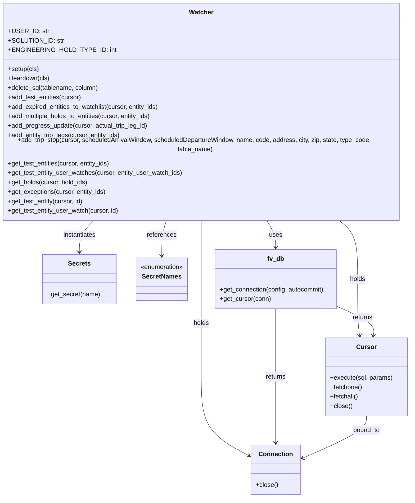

# Diagram: entity_core/watcher_service/watcher_service_tests/db.py


> Auto-generated by Obscura crawlers

## Diagram 1



### SVG

<svg id="container" width="1073.5625" xmlns="http://www.w3.org/2000/svg" class="classDiagram" height="1240" viewBox="0 0 1073.5625 1240" role="graphics-document document" aria-roledescription="class"><style>#container{font-family:"trebuchet ms",verdana,arial,sans-serif;font-size:16px;fill:#333;}@keyframes edge-animation-frame{from{stroke-dashoffset:0;}}@keyframes dash{to{stroke-dashoffset:0;}}#container .edge-animation-slow{stroke-dasharray:9,5!important;stroke-dashoffset:900;animation:dash 50s linear infinite;stroke-linecap:round;}#container .edge-animation-fast{stroke-dasharray:9,5!important;stroke-dashoffset:900;animation:dash 20s linear infinite;stroke-linecap:round;}#container .error-icon{fill:#552222;}#container .error-text{fill:#552222;stroke:#552222;}#container .edge-thickness-normal{stroke-width:1px;}#container .edge-thickness-thick{stroke-width:3.5px;}#container .edge-pattern-solid{stroke-dasharray:0;}#container .edge-thickness-invisible{stroke-width:0;fill:none;}#container .edge-pattern-dashed{stroke-dasharray:3;}#container .edge-pattern-dotted{stroke-dasharray:2;}#container .marker{fill:#333333;stroke:#333333;}#container .marker.cross{stroke:#333333;}#container svg{font-family:"trebuchet ms",verdana,arial,sans-serif;font-size:16px;}#container p{margin:0;}#container g.classGroup text{fill:#9370DB;stroke:none;font-family:"trebuchet ms",verdana,arial,sans-serif;font-size:10px;}#container g.classGroup text .title{font-weight:bolder;}#container .nodeLabel,#container .edgeLabel{color:#131300;}#container .edgeLabel .label rect{fill:#ECECFF;}#container .label text{fill:#131300;}#container .labelBkg{background:#ECECFF;}#container .edgeLabel .label span{background:#ECECFF;}#container .classTitle{font-weight:bolder;}#container .node rect,#container .node circle,#container .node ellipse,#container .node polygon,#container .node path{fill:#ECECFF;stroke:#9370DB;stroke-width:1px;}#container .divider{stroke:#9370DB;stroke-width:1;}#container g.clickable{cursor:pointer;}#container g.classGroup rect{fill:#ECECFF;stroke:#9370DB;}#container g.classGroup line{stroke:#9370DB;stroke-width:1;}#container .classLabel .box{stroke:none;stroke-width:0;fill:#ECECFF;opacity:0.5;}#container .classLabel .label{fill:#9370DB;font-size:10px;}#container .relation{stroke:#333333;stroke-width:1;fill:none;}#container .dashed-line{stroke-dasharray:3;}#container .dotted-line{stroke-dasharray:1 2;}#container #compositionStart,#container .composition{fill:#333333!important;stroke:#333333!important;stroke-width:1;}#container #compositionEnd,#container .composition{fill:#333333!important;stroke:#333333!important;stroke-width:1;}#container #dependencyStart,#container .dependency{fill:#333333!important;stroke:#333333!important;stroke-width:1;}#container #dependencyStart,#container .dependency{fill:#333333!important;stroke:#333333!important;stroke-width:1;}#container #extensionStart,#container .extension{fill:transparent!important;stroke:#333333!important;stroke-width:1;}#container #extensionEnd,#container .extension{fill:transparent!important;stroke:#333333!important;stroke-width:1;}#container #aggregationStart,#container .aggregation{fill:transparent!important;stroke:#333333!important;stroke-width:1;}#container #aggregationEnd,#container .aggregation{fill:transparent!important;stroke:#333333!important;stroke-width:1;}#container #lollipopStart,#container .lollipop{fill:#ECECFF!important;stroke:#333333!important;stroke-width:1;}#container #lollipopEnd,#container .lollipop{fill:#ECECFF!important;stroke:#333333!important;stroke-width:1;}#container .edgeTerminals{font-size:11px;line-height:initial;}#container .classTitleText{text-anchor:middle;font-size:18px;fill:#333;}#container .label-icon{display:inline-block;height:1em;overflow:visible;vertical-align:-0.125em;}#container .node .label-icon path{fill:currentColor;stroke:revert;stroke-width:revert;}#container :root{--mermaid-font-family:"trebuchet ms",verdana,arial,sans-serif;}</style><g><defs><marker id="container_class-aggregationStart" class="marker aggregation class" refX="18" refY="7" markerWidth="190" markerHeight="240" orient="auto"><path d="M 18,7 L9,13 L1,7 L9,1 Z"></path></marker></defs><defs><marker id="container_class-aggregationEnd" class="marker aggregation class" refX="1" refY="7" markerWidth="20" markerHeight="28" orient="auto"><path d="M 18,7 L9,13 L1,7 L9,1 Z"></path></marker></defs><defs><marker id="container_class-extensionStart" class="marker extension class" refX="18" refY="7" markerWidth="190" markerHeight="240" orient="auto"><path d="M 1,7 L18,13 V 1 Z"></path></marker></defs><defs><marker id="container_class-extensionEnd" class="marker extension class" refX="1" refY="7" markerWidth="20" markerHeight="28" orient="auto"><path d="M 1,1 V 13 L18,7 Z"></path></marker></defs><defs><marker id="container_class-compositionStart" class="marker composition class" refX="18" refY="7" markerWidth="190" markerHeight="240" orient="auto"><path d="M 18,7 L9,13 L1,7 L9,1 Z"></path></marker></defs><defs><marker id="container_class-compositionEnd" class="marker composition class" refX="1" refY="7" markerWidth="20" markerHeight="28" orient="auto"><path d="M 18,7 L9,13 L1,7 L9,1 Z"></path></marker></defs><defs><marker id="container_class-dependencyStart" class="marker dependency class" refX="6" refY="7" markerWidth="190" markerHeight="240" orient="auto"><path d="M 5,7 L9,13 L1,7 L9,1 Z"></path></marker></defs><defs><marker id="container_class-dependencyEnd" class="marker dependency class" refX="13" refY="7" markerWidth="20" markerHeight="28" orient="auto"><path d="M 18,7 L9,13 L14,7 L9,1 Z"></path></marker></defs><defs><marker id="container_class-lollipopStart" class="marker lollipop class" refX="13" refY="7" markerWidth="190" markerHeight="240" orient="auto"><circle stroke="black" fill="transparent" cx="7" cy="7" r="6"></circle></marker></defs><defs><marker id="container_class-lollipopEnd" class="marker lollipop class" refX="1" refY="7" markerWidth="190" markerHeight="240" orient="auto"><circle stroke="black" fill="transparent" cx="7" cy="7" r="6"></circle></marker></defs><g class="root"><g class="clusters"></g><g class="edgePaths"><path d="M262.326,536L255.922,542.167C249.518,548.333,236.71,560.667,230.306,574C223.902,587.333,223.902,601.667,223.902,608.833L223.902,616" id="id_Watcher_Secrets_1" class="edge-thickness-normal edge-pattern-solid relation" style=";;;" data-edge="true" data-et="edge" data-id="id_Watcher_Secrets_1" data-points="W3sieCI6MjYyLjMyNjA0ODU4ODAzOTg0LCJ5Ijo1MzZ9LHsieCI6MjIzLjkwMjM0Mzc1LCJ5Ijo1NzN9LHsieCI6MjIzLjkwMjM0Mzc1LCJ5Ijo2MjJ9XQ==" marker-end="url(#container_class-dependencyEnd)"></path><path d="M446.536,536L444.435,542.167C442.334,548.333,438.132,560.667,436.031,575.5C433.93,590.333,433.93,607.667,433.93,616.333L433.93,625" id="id_Watcher_SecretNames_2" class="edge-thickness-normal edge-pattern-solid relation" style=";;;" data-edge="true" data-et="edge" data-id="id_Watcher_SecretNames_2" data-points="W3sieCI6NDQ2LjUzNjA3NzY1NzgwNzMsInkiOjUzNn0seyJ4Ijo0MzMuOTI5Njg3NSwieSI6NTczfSx7IngiOjQzMy45Mjk2ODc1LCJ5Ijo2MzF9XQ==" marker-end="url(#container_class-dependencyEnd)"></path><path d="M704.414,536L708.336,542.167C712.259,548.333,720.104,560.667,724.027,572C727.949,583.333,727.949,593.667,727.949,598.833L727.949,604" id="id_Watcher_fv_db_3" class="edge-thickness-normal edge-pattern-solid relation" style=";;;" data-edge="true" data-et="edge" data-id="id_Watcher_fv_db_3" data-points="W3sieCI6NzA0LjQxMzY3MzE3Mjc1NzUsInkiOjUzNn0seyJ4Ijo3MjcuOTQ5MjE4NzUsInkiOjU3M30seyJ4Ijo3MjcuOTQ5MjE4NzUsInkiOjYxMH1d" marker-end="url(#container_class-dependencyEnd)"></path><path d="M536.484,536L536.484,542.167C536.484,548.333,536.484,560.667,536.484,585.5C536.484,610.333,536.484,647.667,536.484,685C536.484,722.333,536.484,759.667,536.484,801C536.484,842.333,536.484,887.667,536.484,933C536.484,978.333,536.484,1023.667,557.394,1057.254C578.303,1090.841,620.121,1112.683,641.03,1123.603L661.94,1134.524" id="id_Watcher_Connection_4" class="edge-thickness-normal edge-pattern-solid relation" style=";;;" data-edge="true" data-et="edge" data-id="id_Watcher_Connection_4" data-points="W3sieCI6NTM2LjQ4NDM3NSwieSI6NTM2fSx7IngiOjUzNi40ODQzNzUsInkiOjU3M30seyJ4Ijo1MzYuNDg0Mzc1LCJ5Ijo2ODV9LHsieCI6NTM2LjQ4NDM3NSwieSI6Nzk3fSx7IngiOjUzNi40ODQzNzUsInkiOjkzM30seyJ4Ijo1MzYuNDg0Mzc1LCJ5IjoxMDY5fSx7IngiOjY2Ny4yNTc4MTI1LCJ5IjoxMTM3LjMwMTU0MDM0NDc5MjN9XQ==" marker-end="url(#container_class-dependencyEnd)"></path><path d="M890.049,536L898.308,542.167C906.566,548.333,923.084,560.667,931.343,585.5C939.602,610.333,939.602,647.667,939.602,685C939.602,722.333,939.602,759.667,940.483,783.514C941.364,807.362,943.126,817.723,944.008,822.904L944.889,828.085" id="id_Watcher_Cursor_5" class="edge-thickness-normal edge-pattern-solid relation" style=";;;" data-edge="true" data-et="edge" data-id="id_Watcher_Cursor_5" data-points="W3sieCI6ODkwLjA0ODk1MTQxMTk2MDIsInkiOjUzNn0seyJ4Ijo5MzkuNjAxNTYyNSwieSI6NTczfSx7IngiOjkzOS42MDE1NjI1LCJ5Ijo2ODV9LHsieCI6OTM5LjYwMTU2MjUsInkiOjc5N30seyJ4Ijo5NDUuODk1MDQ4MjUzNjc2NSwieSI6ODM0fV0=" marker-end="url(#container_class-dependencyEnd)"></path><path d="M727.949,760L727.949,766.167C727.949,772.333,727.949,784.667,727.949,813.5C727.949,842.333,727.949,887.667,727.949,933C727.949,978.333,727.949,1023.667,727.949,1051.5C727.949,1079.333,727.949,1089.667,727.949,1094.833L727.949,1100" id="id_fv_db_Connection_6" class="edge-thickness-normal edge-pattern-solid relation" style=";;;" data-edge="true" data-et="edge" data-id="id_fv_db_Connection_6" data-points="W3sieCI6NzI3Ljk0OTIxODc1LCJ5Ijo3NjB9LHsieCI6NzI3Ljk0OTIxODc1LCJ5Ijo3OTd9LHsieCI6NzI3Ljk0OTIxODc1LCJ5Ijo5MzN9LHsieCI6NzI3Ljk0OTIxODc1LCJ5IjoxMDY5fSx7IngiOjcyNy45NDkyMTg3NSwieSI6MTEwNn1d" marker-end="url(#container_class-dependencyEnd)"></path><path d="M884.414,752.944L901.323,760.287C918.232,767.63,952.049,782.315,968.077,794.838C984.105,807.362,982.342,817.723,981.461,822.904L980.58,828.085" id="id_fv_db_Cursor_7" class="edge-thickness-normal edge-pattern-solid relation" style=";;;" data-edge="true" data-et="edge" data-id="id_fv_db_Cursor_7" data-points="W3sieCI6ODg0LjQxNDA2MjUsInkiOjc1Mi45NDQzMjU4MDYxMDk2fSx7IngiOjk4NS44NjcxODc1LCJ5Ijo3OTd9LHsieCI6OTc5LjU3MzcwMTc0NjMyMzUsInkiOjgzNH1d" marker-end="url(#container_class-dependencyEnd)"></path><path d="M962.734,1032L962.734,1038.167C962.734,1044.333,962.734,1056.667,934.639,1074.8C906.543,1092.933,850.352,1116.866,822.256,1128.833L794.161,1140.799" id="id_Cursor_Connection_8" class="edge-thickness-normal edge-pattern-solid relation" style=";;;" data-edge="true" data-et="edge" data-id="id_Cursor_Connection_8" data-points="W3sieCI6OTYyLjczNDM3NSwieSI6MTAzMn0seyJ4Ijo5NjIuNzM0Mzc1LCJ5IjoxMDY5fSx7IngiOjc4OC42NDA2MjUsInkiOjExNDMuMTUwMjM3MDg1MTAxfV0=" marker-end="url(#container_class-dependencyEnd)"></path></g><g class="edgeLabels"><g class="edgeLabel" transform="translate(223.90234375, 573)"><g class="label" data-id="id_Watcher_Secrets_1" transform="translate(-42.9140625, -12)"><foreignObject width="85.828125" height="24"><div xmlns="http://www.w3.org/1999/xhtml" class="labelBkg" style="display: table-cell; white-space: nowrap; line-height: 1.5; max-width: 200px; text-align: center;"><span class="edgeLabel"><p>instantiates</p></span></div></foreignObject></g></g><g class="edgeLabel" transform="translate(433.9296875, 573)"><g class="label" data-id="id_Watcher_SecretNames_2" transform="translate(-37.828125, -12)"><foreignObject width="75.65625" height="24"><div xmlns="http://www.w3.org/1999/xhtml" class="labelBkg" style="display: table-cell; white-space: nowrap; line-height: 1.5; max-width: 200px; text-align: center;"><span class="edgeLabel"><p>references</p></span></div></foreignObject></g></g><g class="edgeLabel" transform="translate(727.94921875, 573)"><g class="label" data-id="id_Watcher_fv_db_3" transform="translate(-16.4921875, -12)"><foreignObject width="32.984375" height="24"><div xmlns="http://www.w3.org/1999/xhtml" class="labelBkg" style="display: table-cell; white-space: nowrap; line-height: 1.5; max-width: 200px; text-align: center;"><span class="edgeLabel"><p>uses</p></span></div></foreignObject></g></g><g class="edgeLabel" transform="translate(536.484375, 797)"><g class="label" data-id="id_Watcher_Connection_4" transform="translate(-20.1875, -12)"><foreignObject width="40.375" height="24"><div xmlns="http://www.w3.org/1999/xhtml" class="labelBkg" style="display: table-cell; white-space: nowrap; line-height: 1.5; max-width: 200px; text-align: center;"><span class="edgeLabel"><p>holds</p></span></div></foreignObject></g></g><g class="edgeLabel" transform="translate(939.6015625, 685)"><g class="label" data-id="id_Watcher_Cursor_5" transform="translate(-20.1875, -12)"><foreignObject width="40.375" height="24"><div xmlns="http://www.w3.org/1999/xhtml" class="labelBkg" style="display: table-cell; white-space: nowrap; line-height: 1.5; max-width: 200px; text-align: center;"><span class="edgeLabel"><p>holds</p></span></div></foreignObject></g></g><g class="edgeLabel" transform="translate(727.94921875, 933)"><g class="label" data-id="id_fv_db_Connection_6" transform="translate(-26.265625, -12)"><foreignObject width="52.53125" height="24"><div xmlns="http://www.w3.org/1999/xhtml" class="labelBkg" style="display: table-cell; white-space: nowrap; line-height: 1.5; max-width: 200px; text-align: center;"><span class="edgeLabel"><p>returns</p></span></div></foreignObject></g></g><g class="edgeLabel" transform="translate(952.35347, 782.44678)"><g class="label" data-id="id_fv_db_Cursor_7" transform="translate(-26.265625, -12)"><foreignObject width="52.53125" height="24"><div xmlns="http://www.w3.org/1999/xhtml" class="labelBkg" style="display: table-cell; white-space: nowrap; line-height: 1.5; max-width: 200px; text-align: center;"><span class="edgeLabel"><p>returns</p></span></div></foreignObject></g></g><g class="edgeLabel" transform="translate(962.734375, 1069)"><g class="label" data-id="id_Cursor_Connection_8" transform="translate(-34.9921875, -12)"><foreignObject width="69.984375" height="24"><div xmlns="http://www.w3.org/1999/xhtml" class="labelBkg" style="display: table-cell; white-space: nowrap; line-height: 1.5; max-width: 200px; text-align: center;"><span class="edgeLabel"><p>bound_to</p></span></div></foreignObject></g></g></g><g class="nodes"><g class="node default" id="classId-Watcher-0" transform="translate(536.484375, 272)"><g class="basic label-container"><path d="M-528.484375 -264 L528.484375 -264 L528.484375 264 L-528.484375 264" stroke="none" stroke-width="0" fill="#ECECFF" style=""></path><path d="M-528.484375 -264 C-202.56484231812107 -264, 123.35469036375787 -264, 528.484375 -264 M-528.484375 -264 C-270.37728290333405 -264, -12.270190806668097 -264, 528.484375 -264 M528.484375 -264 C528.484375 -71.61257613542307, 528.484375 120.77484772915386, 528.484375 264 M528.484375 -264 C528.484375 -157.34924556886995, 528.484375 -50.69849113773989, 528.484375 264 M528.484375 264 C298.58334980937417 264, 68.68232461874834 264, -528.484375 264 M528.484375 264 C315.0912486773889 264, 101.69812235477775 264, -528.484375 264 M-528.484375 264 C-528.484375 151.66848812743234, -528.484375 39.33697625486471, -528.484375 -264 M-528.484375 264 C-528.484375 139.36363201939463, -528.484375 14.727264038789258, -528.484375 -264" stroke="#9370DB" stroke-width="1.3" fill="none" stroke-dasharray="0 0" style=""></path></g><g class="annotation-group text" transform="translate(0, -240)"></g><g class="label-group text" transform="translate(-29.9375, -240)"><g class="label" style="font-weight: bolder" transform="translate(0,-12)"><foreignObject width="59.875" height="24"><div xmlns="http://www.w3.org/1999/xhtml" style="display: table-cell; white-space: nowrap; line-height: 1.5; max-width: 110px; text-align: center;"><span class="nodeLabel markdown-node-label" style=""><p>Watcher</p></span></div></foreignObject></g></g><g class="members-group text" transform="translate(-516.484375, -192)"><g class="label" style="" transform="translate(0,-12)"><foreignObject width="96.28125" height="24"><div xmlns="http://www.w3.org/1999/xhtml" style="display: table-cell; white-space: nowrap; line-height: 1.5; max-width: 154px; text-align: center;"><span class="nodeLabel markdown-node-label" style=""><p>+USER_ID: str</p></span></div></foreignObject></g><g class="label" style="" transform="translate(0,12)"><foreignObject width="131.140625" height="24"><div xmlns="http://www.w3.org/1999/xhtml" style="display: table-cell; white-space: nowrap; line-height: 1.5; max-width: 189px; text-align: center;"><span class="nodeLabel markdown-node-label" style=""><p>+SOLUTION_ID: str</p></span></div></foreignObject></g><g class="label" style="" transform="translate(0,36)"><foreignObject width="247.203125" height="24"><div xmlns="http://www.w3.org/1999/xhtml" style="display: table-cell; white-space: nowrap; line-height: 1.5; max-width: 305px; text-align: center;"><span class="nodeLabel markdown-node-label" style=""><p>+ENGINEERING_HOLD_TYPE_ID: int</p></span></div></foreignObject></g></g><g class="methods-group text" transform="translate(-516.484375, -96)"><g class="label" style="" transform="translate(0,-12)"><foreignObject width="78.953125" height="24"><div xmlns="http://www.w3.org/1999/xhtml" style="display: table-cell; white-space: nowrap; line-height: 1.5; max-width: 136px; text-align: center;"><span class="nodeLabel markdown-node-label" style=""><p>+setup(cls)</p></span></div></foreignObject></g><g class="label" style="" transform="translate(0,12)"><foreignObject width="106.34375" height="24"><div xmlns="http://www.w3.org/1999/xhtml" style="display: table-cell; white-space: nowrap; line-height: 1.5; max-width: 164px; text-align: center;"><span class="nodeLabel markdown-node-label" style=""><p>+teardown(cls)</p></span></div></foreignObject></g><g class="label" style="" transform="translate(0,36)"><foreignObject width="233.359375" height="24"><div xmlns="http://www.w3.org/1999/xhtml" style="display: table-cell; white-space: nowrap; line-height: 1.5; max-width: 291px; text-align: center;"><span class="nodeLabel markdown-node-label" style=""><p>+delete_sql(tablename, column)</p></span></div></foreignObject></g><g class="label" style="" transform="translate(0,60)"><foreignObject width="190.0625" height="24"><div xmlns="http://www.w3.org/1999/xhtml" style="display: table-cell; white-space: nowrap; line-height: 1.5; max-width: 247px; text-align: center;"><span class="nodeLabel markdown-node-label" style=""><p>+add_test_entities(cursor)</p></span></div></foreignObject></g><g class="label" style="" transform="translate(0,84)"><foreignObject width="390.265625" height="24"><div xmlns="http://www.w3.org/1999/xhtml" style="display: table-cell; white-space: nowrap; line-height: 1.5; max-width: 448px; text-align: center;"><span class="nodeLabel markdown-node-label" style=""><p>+add_expired_entities_to_watchlist(cursor, entity_ids)</p></span></div></foreignObject></g><g class="label" style="" transform="translate(0,108)"><foreignObject width="372.453125" height="24"><div xmlns="http://www.w3.org/1999/xhtml" style="display: table-cell; white-space: nowrap; line-height: 1.5; max-width: 430px; text-align: center;"><span class="nodeLabel markdown-node-label" style=""><p>+add_multiple_holds_to_entities(cursor, entity_ids)</p></span></div></foreignObject></g><g class="label" style="" transform="translate(0,132)"><foreignObject width="358.484375" height="24"><div xmlns="http://www.w3.org/1999/xhtml" style="display: table-cell; white-space: nowrap; line-height: 1.5; max-width: 416px; text-align: center;"><span class="nodeLabel markdown-node-label" style=""><p>+add_progress_update(cursor, actual_trip_leg_id)</p></span></div></foreignObject></g><g class="label" style="" transform="translate(0,156)"><foreignObject width="290.125" height="24"><div xmlns="http://www.w3.org/1999/xhtml" style="display: table-cell; white-space: nowrap; line-height: 1.5; max-width: 347px; text-align: center;"><span class="nodeLabel markdown-node-label" style=""><p>+add_entity_trip_legs(cursor, entity_ids)</p></span></div></foreignObject></g><g class="label" style="" transform="translate(0,180)"><foreignObject width="1003.03125" height="24"><div xmlns="http://www.w3.org/1999/xhtml" style="display: table-cell; white-space: nowrap; line-height: 1.5; max-width: 1060px; text-align: center;"><span class="nodeLabel markdown-node-label" style=""><p>+add_trip_stop(cursor, scheduledArrivalWindow, scheduledDepartureWindow, name, code, address, city, zip, state, type_code, table_name)</p></span></div></foreignObject></g><g class="label" style="" transform="translate(0,204)"><foreignObject width="263.15625" height="24"><div xmlns="http://www.w3.org/1999/xhtml" style="display: table-cell; white-space: nowrap; line-height: 1.5; max-width: 321px; text-align: center;"><span class="nodeLabel markdown-node-label" style=""><p>+get_test_entities(cursor, entity_ids)</p></span></div></foreignObject></g><g class="label" style="" transform="translate(0,228)"><foreignObject width="443.84375" height="24"><div xmlns="http://www.w3.org/1999/xhtml" style="display: table-cell; white-space: nowrap; line-height: 1.5; max-width: 501px; text-align: center;"><span class="nodeLabel markdown-node-label" style=""><p>+get_test_entity_user_watches(cursor, entity_user_watch_ids)</p></span></div></foreignObject></g><g class="label" style="" transform="translate(0,252)"><foreignObject width="204.90625" height="24"><div xmlns="http://www.w3.org/1999/xhtml" style="display: table-cell; white-space: nowrap; line-height: 1.5; max-width: 262px; text-align: center;"><span class="nodeLabel markdown-node-label" style=""><p>+get_holds(cursor, hold_ids)</p></span></div></foreignObject></g><g class="label" style="" transform="translate(0,276)"><foreignObject width="251.015625" height="24"><div xmlns="http://www.w3.org/1999/xhtml" style="display: table-cell; white-space: nowrap; line-height: 1.5; max-width: 308px; text-align: center;"><span class="nodeLabel markdown-node-label" style=""><p>+get_exceptions(cursor, entity_ids)</p></span></div></foreignObject></g><g class="label" style="" transform="translate(0,300)"><foreignObject width="192.984375" height="24"><div xmlns="http://www.w3.org/1999/xhtml" style="display: table-cell; white-space: nowrap; line-height: 1.5; max-width: 250px; text-align: center;"><span class="nodeLabel markdown-node-label" style=""><p>+get_test_entity(cursor, id)</p></span></div></foreignObject></g><g class="label" style="" transform="translate(0,324)"><foreignObject width="281.453125" height="24"><div xmlns="http://www.w3.org/1999/xhtml" style="display: table-cell; white-space: nowrap; line-height: 1.5; max-width: 339px; text-align: center;"><span class="nodeLabel markdown-node-label" style=""><p>+get_test_entity_user_watch(cursor, id)</p></span></div></foreignObject></g></g><g class="divider" style=""><path d="M-528.484375 -216 C-313.05227535644735 -216, -97.6201757128947 -216, 528.484375 -216 M-528.484375 -216 C-188.9950303950311 -216, 150.49431420993778 -216, 528.484375 -216" stroke="#9370DB" stroke-width="1.3" fill="none" stroke-dasharray="0 0" style=""></path></g><g class="divider" style=""><path d="M-528.484375 -120 C-241.64143544981522 -120, 45.20150410036956 -120, 528.484375 -120 M-528.484375 -120 C-223.67083952741285 -120, 81.1426959451743 -120, 528.484375 -120" stroke="#9370DB" stroke-width="1.3" fill="none" stroke-dasharray="0 0" style=""></path></g></g><g class="node default" id="classId-Secrets-1" transform="translate(223.90234375, 685)"><g class="basic label-container"><path d="M-92.47265625 -63 L92.47265625 -63 L92.47265625 63 L-92.47265625 63" stroke="none" stroke-width="0" fill="#ECECFF" style=""></path><path d="M-92.47265625 -63 C-24.141735220280026 -63, 44.18918580943995 -63, 92.47265625 -63 M-92.47265625 -63 C-42.429822767797404 -63, 7.613010714405192 -63, 92.47265625 -63 M92.47265625 -63 C92.47265625 -18.327465031736374, 92.47265625 26.345069936527253, 92.47265625 63 M92.47265625 -63 C92.47265625 -28.288087679186773, 92.47265625 6.423824641626453, 92.47265625 63 M92.47265625 63 C28.404933364982952 63, -35.662789520034096 63, -92.47265625 63 M92.47265625 63 C46.54514312109625 63, 0.617629992192505 63, -92.47265625 63 M-92.47265625 63 C-92.47265625 22.035714116944632, -92.47265625 -18.928571766110736, -92.47265625 -63 M-92.47265625 63 C-92.47265625 37.57079832416848, -92.47265625 12.141596648336957, -92.47265625 -63" stroke="#9370DB" stroke-width="1.3" fill="none" stroke-dasharray="0 0" style=""></path></g><g class="annotation-group text" transform="translate(0, -39)"></g><g class="label-group text" transform="translate(-27.1640625, -39)"><g class="label" style="font-weight: bolder" transform="translate(0,-12)"><foreignObject width="54.328125" height="24"><div xmlns="http://www.w3.org/1999/xhtml" style="display: table-cell; white-space: nowrap; line-height: 1.5; max-width: 103px; text-align: center;"><span class="nodeLabel markdown-node-label" style=""><p>Secrets</p></span></div></foreignObject></g></g><g class="members-group text" transform="translate(-80.47265625, 9)"></g><g class="methods-group text" transform="translate(-80.47265625, 39)"><g class="label" style="" transform="translate(0,-12)"><foreignObject width="133.78125" height="24"><div xmlns="http://www.w3.org/1999/xhtml" style="display: table-cell; white-space: nowrap; line-height: 1.5; max-width: 191px; text-align: center;"><span class="nodeLabel markdown-node-label" style=""><p>+get_secret(name)</p></span></div></foreignObject></g></g><g class="divider" style=""><path d="M-92.47265625 -15 C-35.75645627755803 -15, 20.95974369488394 -15, 92.47265625 -15 M-92.47265625 -15 C-36.71786866641128 -15, 19.036918917177445 -15, 92.47265625 -15" stroke="#9370DB" stroke-width="1.3" fill="none" stroke-dasharray="0 0" style=""></path></g><g class="divider" style=""><path d="M-92.47265625 9 C-35.45964222992193 9, 21.553371790156135 9, 92.47265625 9 M-92.47265625 9 C-35.28971467676071 9, 21.89322689647858 9, 92.47265625 9" stroke="#9370DB" stroke-width="1.3" fill="none" stroke-dasharray="0 0" style=""></path></g></g><g class="node default" id="classId-SecretNames-2" transform="translate(433.9296875, 685)"><g class="basic label-container"><path d="M-67.5546875 -54 L67.5546875 -54 L67.5546875 54 L-67.5546875 54" stroke="none" stroke-width="0" fill="#ECECFF" style=""></path><path d="M-67.5546875 -54 C-20.248719664293397 -54, 27.057248171413207 -54, 67.5546875 -54 M-67.5546875 -54 C-37.08345593822864 -54, -6.612224376457277 -54, 67.5546875 -54 M67.5546875 -54 C67.5546875 -31.892813207622883, 67.5546875 -9.785626415245765, 67.5546875 54 M67.5546875 -54 C67.5546875 -24.096244333403842, 67.5546875 5.807511333192316, 67.5546875 54 M67.5546875 54 C23.11934458007211 54, -21.31599833985578 54, -67.5546875 54 M67.5546875 54 C21.29092946164831 54, -24.972828576703378 54, -67.5546875 54 M-67.5546875 54 C-67.5546875 19.367690731179785, -67.5546875 -15.26461853764043, -67.5546875 -54 M-67.5546875 54 C-67.5546875 25.630704365547903, -67.5546875 -2.7385912689041945, -67.5546875 -54" stroke="#9370DB" stroke-width="1.3" fill="none" stroke-dasharray="0 0" style=""></path></g><g class="annotation-group text" transform="translate(-55.5546875, -30)"><g class="label" style="" transform="translate(0,-12)"><foreignObject width="111.109375" height="24"><div xmlns="http://www.w3.org/1999/xhtml" style="display: table-cell; white-space: nowrap; line-height: 1.5; max-width: 161px; text-align: center;"><span class="nodeLabel markdown-node-label" style=""><p>«enumeration»</p></span></div></foreignObject></g></g><g class="label-group text" transform="translate(-48.03125, -6)"><g class="label" style="font-weight: bolder" transform="translate(0,-12)"><foreignObject width="96.0625" height="24"><div xmlns="http://www.w3.org/1999/xhtml" style="display: table-cell; white-space: nowrap; line-height: 1.5; max-width: 145px; text-align: center;"><span class="nodeLabel markdown-node-label" style=""><p>SecretNames</p></span></div></foreignObject></g></g><g class="members-group text" transform="translate(-55.5546875, 42)"></g><g class="methods-group text" transform="translate(-55.5546875, 72)"></g><g class="divider" style=""><path d="M-67.5546875 18 C-24.681230264599492 18, 18.192226970801016 18, 67.5546875 18 M-67.5546875 18 C-38.02338496555612 18, -8.492082431112244 18, 67.5546875 18" stroke="#9370DB" stroke-width="1.3" fill="none" stroke-dasharray="0 0" style=""></path></g><g class="divider" style=""><path d="M-67.5546875 36 C-29.82395312773626 36, 7.90678124452748 36, 67.5546875 36 M-67.5546875 36 C-20.39375315349818 36, 26.767181193003637 36, 67.5546875 36" stroke="#9370DB" stroke-width="1.3" fill="none" stroke-dasharray="0 0" style=""></path></g></g><g class="node default" id="classId-fv_db-3" transform="translate(727.94921875, 685)"><g class="basic label-container"><path d="M-156.46484375 -75 L156.46484375 -75 L156.46484375 75 L-156.46484375 75" stroke="none" stroke-width="0" fill="#ECECFF" style=""></path><path d="M-156.46484375 -75 C-85.71197757729622 -75, -14.959111404592448 -75, 156.46484375 -75 M-156.46484375 -75 C-63.75951892463607 -75, 28.945805900727862 -75, 156.46484375 -75 M156.46484375 -75 C156.46484375 -23.10372332674479, 156.46484375 28.792553346510417, 156.46484375 75 M156.46484375 -75 C156.46484375 -42.14611169551347, 156.46484375 -9.292223391026937, 156.46484375 75 M156.46484375 75 C46.02509672504718 75, -64.41465029990565 75, -156.46484375 75 M156.46484375 75 C72.1768810217817 75, -12.111081706436607 75, -156.46484375 75 M-156.46484375 75 C-156.46484375 24.844740303615716, -156.46484375 -25.31051939276857, -156.46484375 -75 M-156.46484375 75 C-156.46484375 38.799066712607654, -156.46484375 2.598133425215309, -156.46484375 -75" stroke="#9370DB" stroke-width="1.3" fill="none" stroke-dasharray="0 0" style=""></path></g><g class="annotation-group text" transform="translate(0, -51)"></g><g class="label-group text" transform="translate(-20.2890625, -51)"><g class="label" style="font-weight: bolder" transform="translate(0,-12)"><foreignObject width="40.578125" height="24"><div xmlns="http://www.w3.org/1999/xhtml" style="display: table-cell; white-space: nowrap; line-height: 1.5; max-width: 90px; text-align: center;"><span class="nodeLabel markdown-node-label" style=""><p>fv_db</p></span></div></foreignObject></g></g><g class="members-group text" transform="translate(-144.46484375, -3)"></g><g class="methods-group text" transform="translate(-144.46484375, 27)"><g class="label" style="" transform="translate(0,-12)"><foreignObject width="268.640625" height="24"><div xmlns="http://www.w3.org/1999/xhtml" style="display: table-cell; white-space: nowrap; line-height: 1.5; max-width: 326px; text-align: center;"><span class="nodeLabel markdown-node-label" style=""><p>+get_connection(config, autocommit)</p></span></div></foreignObject></g><g class="label" style="" transform="translate(0,12)"><foreignObject width="130.078125" height="24"><div xmlns="http://www.w3.org/1999/xhtml" style="display: table-cell; white-space: nowrap; line-height: 1.5; max-width: 187px; text-align: center;"><span class="nodeLabel markdown-node-label" style=""><p>+get_cursor(conn)</p></span></div></foreignObject></g></g><g class="divider" style=""><path d="M-156.46484375 -27 C-59.19645432301671 -27, 38.07193510396658 -27, 156.46484375 -27 M-156.46484375 -27 C-38.559361080383766 -27, 79.34612158923247 -27, 156.46484375 -27" stroke="#9370DB" stroke-width="1.3" fill="none" stroke-dasharray="0 0" style=""></path></g><g class="divider" style=""><path d="M-156.46484375 -3 C-84.21417532018194 -3, -11.963506890363874 -3, 156.46484375 -3 M-156.46484375 -3 C-69.07095043059411 -3, 18.32294288881178 -3, 156.46484375 -3" stroke="#9370DB" stroke-width="1.3" fill="none" stroke-dasharray="0 0" style=""></path></g></g><g class="node default" id="classId-Connection-4" transform="translate(727.94921875, 1169)"><g class="basic label-container"><path d="M-60.69140625 -63 L60.69140625 -63 L60.69140625 63 L-60.69140625 63" stroke="none" stroke-width="0" fill="#ECECFF" style=""></path><path d="M-60.69140625 -63 C-12.9308862003275 -63, 34.829633849345 -63, 60.69140625 -63 M-60.69140625 -63 C-25.598474206616004 -63, 9.494457836767992 -63, 60.69140625 -63 M60.69140625 -63 C60.69140625 -34.1973377343802, 60.69140625 -5.39467546876039, 60.69140625 63 M60.69140625 -63 C60.69140625 -27.640560900644694, 60.69140625 7.7188781987106125, 60.69140625 63 M60.69140625 63 C17.189111777591542 63, -26.313182694816916 63, -60.69140625 63 M60.69140625 63 C35.18284962090511 63, 9.67429299181022 63, -60.69140625 63 M-60.69140625 63 C-60.69140625 14.484840097346506, -60.69140625 -34.03031980530699, -60.69140625 -63 M-60.69140625 63 C-60.69140625 13.608985872170088, -60.69140625 -35.782028255659824, -60.69140625 -63" stroke="#9370DB" stroke-width="1.3" fill="none" stroke-dasharray="0 0" style=""></path></g><g class="annotation-group text" transform="translate(0, -39)"></g><g class="label-group text" transform="translate(-41.2265625, -39)"><g class="label" style="font-weight: bolder" transform="translate(0,-12)"><foreignObject width="82.453125" height="24"><div xmlns="http://www.w3.org/1999/xhtml" style="display: table-cell; white-space: nowrap; line-height: 1.5; max-width: 132px; text-align: center;"><span class="nodeLabel markdown-node-label" style=""><p>Connection</p></span></div></foreignObject></g></g><g class="members-group text" transform="translate(-48.69140625, 9)"></g><g class="methods-group text" transform="translate(-48.69140625, 39)"><g class="label" style="" transform="translate(0,-12)"><foreignObject width="56.15625" height="24"><div xmlns="http://www.w3.org/1999/xhtml" style="display: table-cell; white-space: nowrap; line-height: 1.5; max-width: 114px; text-align: center;"><span class="nodeLabel markdown-node-label" style=""><p>+close()</p></span></div></foreignObject></g></g><g class="divider" style=""><path d="M-60.69140625 -15 C-30.770633106399465 -15, -0.8498599627989307 -15, 60.69140625 -15 M-60.69140625 -15 C-24.99440762301971 -15, 10.702591003960578 -15, 60.69140625 -15" stroke="#9370DB" stroke-width="1.3" fill="none" stroke-dasharray="0 0" style=""></path></g><g class="divider" style=""><path d="M-60.69140625 9 C-27.55835167513638 9, 5.574702899727242 9, 60.69140625 9 M-60.69140625 9 C-28.9616810674584 9, 2.7680441150831996 9, 60.69140625 9" stroke="#9370DB" stroke-width="1.3" fill="none" stroke-dasharray="0 0" style=""></path></g></g><g class="node default" id="classId-Cursor-5" transform="translate(962.734375, 933)"><g class="basic label-container"><path d="M-102.828125 -99 L102.828125 -99 L102.828125 99 L-102.828125 99" stroke="none" stroke-width="0" fill="#ECECFF" style=""></path><path d="M-102.828125 -99 C-36.99512272839185 -99, 28.837879543216303 -99, 102.828125 -99 M-102.828125 -99 C-42.77349853133958 -99, 17.281127937320846 -99, 102.828125 -99 M102.828125 -99 C102.828125 -57.483570034839644, 102.828125 -15.967140069679289, 102.828125 99 M102.828125 -99 C102.828125 -43.78358238312408, 102.828125 11.432835233751845, 102.828125 99 M102.828125 99 C20.710454509753177 99, -61.407215980493646 99, -102.828125 99 M102.828125 99 C31.64356637338868 99, -39.54099225322264 99, -102.828125 99 M-102.828125 99 C-102.828125 58.108118931862585, -102.828125 17.21623786372517, -102.828125 -99 M-102.828125 99 C-102.828125 53.73460947925498, -102.828125 8.469218958509956, -102.828125 -99" stroke="#9370DB" stroke-width="1.3" fill="none" stroke-dasharray="0 0" style=""></path></g><g class="annotation-group text" transform="translate(0, -75)"></g><g class="label-group text" transform="translate(-23.90625, -75)"><g class="label" style="font-weight: bolder" transform="translate(0,-12)"><foreignObject width="47.8125" height="24"><div xmlns="http://www.w3.org/1999/xhtml" style="display: table-cell; white-space: nowrap; line-height: 1.5; max-width: 98px; text-align: center;"><span class="nodeLabel markdown-node-label" style=""><p>Cursor</p></span></div></foreignObject></g></g><g class="members-group text" transform="translate(-90.828125, -27)"></g><g class="methods-group text" transform="translate(-90.828125, 3)"><g class="label" style="" transform="translate(0,-12)"><foreignObject width="157.75" height="24"><div xmlns="http://www.w3.org/1999/xhtml" style="display: table-cell; white-space: nowrap; line-height: 1.5; max-width: 215px; text-align: center;"><span class="nodeLabel markdown-node-label" style=""><p>+execute(sql, params)</p></span></div></foreignObject></g><g class="label" style="" transform="translate(0,12)"><foreignObject width="82.046875" height="24"><div xmlns="http://www.w3.org/1999/xhtml" style="display: table-cell; white-space: nowrap; line-height: 1.5; max-width: 139px; text-align: center;"><span class="nodeLabel markdown-node-label" style=""><p>+fetchone()</p></span></div></foreignObject></g><g class="label" style="" transform="translate(0,36)"><foreignObject width="72.515625" height="24"><div xmlns="http://www.w3.org/1999/xhtml" style="display: table-cell; white-space: nowrap; line-height: 1.5; max-width: 130px; text-align: center;"><span class="nodeLabel markdown-node-label" style=""><p>+fetchall()</p></span></div></foreignObject></g><g class="label" style="" transform="translate(0,60)"><foreignObject width="56.15625" height="24"><div xmlns="http://www.w3.org/1999/xhtml" style="display: table-cell; white-space: nowrap; line-height: 1.5; max-width: 114px; text-align: center;"><span class="nodeLabel markdown-node-label" style=""><p>+close()</p></span></div></foreignObject></g></g><g class="divider" style=""><path d="M-102.828125 -51 C-49.22298990432919 -51, 4.382145191341621 -51, 102.828125 -51 M-102.828125 -51 C-34.11285885184003 -51, 34.60240729631994 -51, 102.828125 -51" stroke="#9370DB" stroke-width="1.3" fill="none" stroke-dasharray="0 0" style=""></path></g><g class="divider" style=""><path d="M-102.828125 -27 C-51.01577233104505 -27, 0.7965803379099015 -27, 102.828125 -27 M-102.828125 -27 C-34.73804378192246 -27, 33.352037436155086 -27, 102.828125 -27" stroke="#9370DB" stroke-width="1.3" fill="none" stroke-dasharray="0 0" style=""></path></g></g></g></g></g></svg>

## Diagram 2

```mermaid
flowchart LR
  A[Secrets.get_secret(ENTITY_DATABASE)] --> B[db_config]
  B --> C[fv.db.get_connection(db_config, autocommit=True)]
  C --> D[conn]
  D --> E[fv.db.get_cursor(conn)]
  E --> F[cursor]
  F --> G[add_test_entities(cursor)]
  G --> H[entity rows inserted]
  H --> I[add_entity_trip_legs(cursor, entity_ids)]
  I --> J[planned_trip_leg, actual_trip_leg, trip_stops inserted]
  J --> K[add_progress_update(cursor, actual_trip_leg_id)]
  K --> L[progress_update inserted]
  L --> M[teardown(cls)]
  M --> N[delete_sql -> DELETE FROM tables by code/solution_id]
  N --> O[cursor.execute(delete_sql...)]
  O --> P[conn.close() & cursor.close()]
```

> SVG rendering failed for this diagram.
