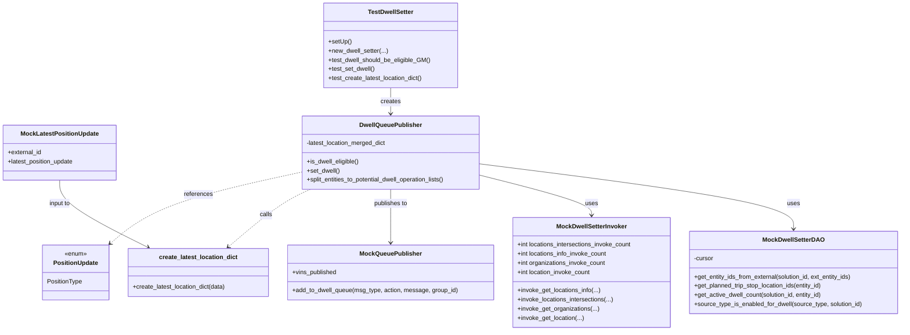
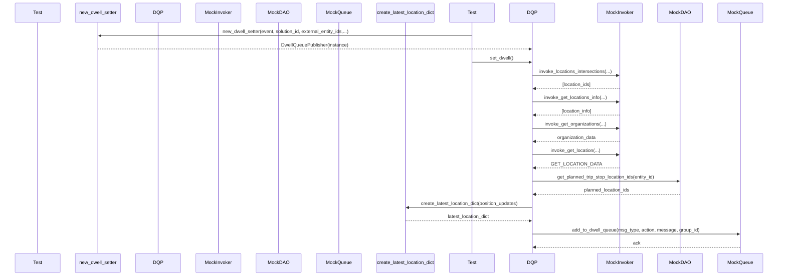

# Diagram: entity_core/watcher_service/watcher_service_tests/entity_watcher_tests/test_dwell_setter.py

> Auto-generated by Obscura crawlers

## Diagram 1

### SVG

<svg id="container" width="2367.75" xmlns="http://www.w3.org/2000/svg" class="classDiagram" height="866" viewBox="0 0 2367.75 866" role="graphics-document document" aria-roledescription="class"><g><defs><marker id="container_class-aggregationStart" class="marker aggregation class" refX="18" refY="7" markerWidth="190" markerHeight="240" orient="auto"><path d="M 18,7 L9,13 L1,7 L9,1 Z"></path></marker></defs><defs><marker id="container_class-aggregationEnd" class="marker aggregation class" refX="1" refY="7" markerWidth="20" markerHeight="28" orient="auto"><path d="M 18,7 L9,13 L1,7 L9,1 Z"></path></marker></defs><defs><marker id="container_class-extensionStart" class="marker extension class" refX="18" refY="7" markerWidth="190" markerHeight="240" orient="auto"><path d="M 1,7 L18,13 V 1 Z"></path></marker></defs><defs><marker id="container_class-extensionEnd" class="marker extension class" refX="1" refY="7" markerWidth="20" markerHeight="28" orient="auto"><path d="M 1,1 V 13 L18,7 Z"></path></marker></defs><defs><marker id="container_class-compositionStart" class="marker composition class" refX="18" refY="7" markerWidth="190" markerHeight="240" orient="auto"><path d="M 18,7 L9,13 L1,7 L9,1 Z"></path></marker></defs><defs><marker id="container_class-compositionEnd" class="marker composition class" refX="1" refY="7" markerWidth="20" markerHeight="28" orient="auto"><path d="M 18,7 L9,13 L1,7 L9,1 Z"></path></marker></defs><defs><marker id="container_class-dependencyStart" class="marker dependency class" refX="6" refY="7" markerWidth="190" markerHeight="240" orient="auto"><path d="M 5,7 L9,13 L1,7 L9,1 Z"></path></marker></defs><defs><marker id="container_class-dependencyEnd" class="marker dependency class" refX="13" refY="7" markerWidth="20" markerHeight="28" orient="auto"><path d="M 18,7 L9,13 L14,7 L9,1 Z"></path></marker></defs><defs><marker id="container_class-lollipopStart" class="marker lollipop class" refX="13" refY="7" markerWidth="190" markerHeight="240" orient="auto"><circle stroke="black" fill="transparent" cx="7" cy="7" r="6"></circle></marker></defs><defs><marker id="container_class-lollipopEnd" class="marker lollipop class" refX="1" refY="7" markerWidth="190" markerHeight="240" orient="auto"><circle stroke="black" fill="transparent" cx="7" cy="7" r="6"></circle></marker></defs><g class="root"><g class="clusters"></g><g class="edgePaths"><path d="M1026.395,230L1026.395,236.167C1026.395,242.333,1026.395,254.667,1026.395,266C1026.395,277.333,1026.395,287.667,1026.395,292.833L1026.395,298" id="id_TestDwellSetter_DwellQueuePublisher_1" class="edge-thickness-normal edge-pattern-solid relation" style=";;;" data-edge="true" data-et="edge" data-id="id_TestDwellSetter_DwellQueuePublisher_1" data-points="W3sieCI6MTAyNi4zOTQ1MzEyNSwieSI6MjMwfSx7IngiOjEwMjYuMzk0NTMxMjUsInkiOjI2N30seyJ4IjoxMDI2LjM5NDUzMTI1LCJ5IjozMDR9XQ==" marker-end="url(#container_class-dependencyEnd)"></path><path d="M1264.594,429.879L1401.607,447.066C1538.621,464.253,1812.648,498.626,1949.662,526.98C2086.676,555.333,2086.676,577.667,2086.676,588.833L2086.676,600" id="id_DwellQueuePublisher_MockDwellSetterDAO_2" class="edge-thickness-normal edge-pattern-solid relation" style=";;;" data-edge="true" data-et="edge" data-id="id_DwellQueuePublisher_MockDwellSetterDAO_2" data-points="W3sieCI6MTI2NC41OTM3NSwieSI6NDI5Ljg3OTMzMjU3Njg1MTY1fSx7IngiOjIwODYuNjc1NzgxMjUsInkiOjUzM30seyJ4IjoyMDg2LjY3NTc4MTI1LCJ5Ijo2MDZ9XQ==" marker-end="url(#container_class-dependencyEnd)"></path><path d="M1264.594,460.047L1312.826,472.206C1361.059,484.365,1457.523,508.682,1505.756,526.008C1553.988,543.333,1553.988,553.667,1553.988,558.833L1553.988,564" id="id_DwellQueuePublisher_MockDwellSetterInvoker_3" class="edge-thickness-normal edge-pattern-solid relation" style=";;;" data-edge="true" data-et="edge" data-id="id_DwellQueuePublisher_MockDwellSetterInvoker_3" data-points="W3sieCI6MTI2NC41OTM3NSwieSI6NDYwLjA0NzE0MDYxNDgxOTZ9LHsieCI6MTU1My45ODgyODEyNSwieSI6NTMzfSx7IngiOjE1NTMuOTg4MjgxMjUsInkiOjU3MH1d" marker-end="url(#container_class-dependencyEnd)"></path><path d="M1026.395,496L1026.395,502.167C1026.395,508.333,1026.395,520.667,1026.395,544C1026.395,567.333,1026.395,601.667,1026.395,618.833L1026.395,636" id="id_DwellQueuePublisher_MockQueuePublisher_4" class="edge-thickness-normal edge-pattern-solid relation" style=";;;" data-edge="true" data-et="edge" data-id="id_DwellQueuePublisher_MockQueuePublisher_4" data-points="W3sieCI6MTAyNi4zOTQ1MzEyNSwieSI6NDk2fSx7IngiOjEwMjYuMzk0NTMxMjUsInkiOjUzM30seyJ4IjoxMDI2LjM5NDUzMTI1LCJ5Ijo2NDJ9XQ==" marker-end="url(#container_class-dependencyEnd)"></path><path d="M157.379,472L157.379,482.167C157.379,492.333,157.379,512.667,196.199,542.056C235.02,571.446,312.661,609.892,351.481,629.115L390.302,648.337" id="id_MockLatestPositionUpdate_create_latest_location_dict_5" class="edge-thickness-normal edge-pattern-solid relation" style=";;;" data-edge="true" data-et="edge" data-id="id_MockLatestPositionUpdate_create_latest_location_dict_5" data-points="W3sieCI6MTU3LjM3ODkwNjI1LCJ5Ijo0NzJ9LHsieCI6MTU3LjM3ODkwNjI1LCJ5Ijo1MzN9LHsieCI6Mzk1LjY3ODUwMDUxNzk1NTgsInkiOjY1MX1d" marker-end="url(#container_class-dependencyEnd)"></path><path d="M815.347,496L801.79,502.167C788.233,508.333,761.12,520.667,725.385,545.849C689.65,571.032,645.294,609.063,623.116,628.079L600.938,647.095" id="id_DwellQueuePublisher_create_latest_location_dict_6" class="edge-thickness-normal edge-pattern-dashed relation" style=";;;" data-edge="true" data-et="edge" data-id="id_DwellQueuePublisher_create_latest_location_dict_6" data-points="W3sieCI6ODE1LjM0NzA2ODg0Mzk4NSwieSI6NDk2fSx7IngiOjczNC4wMDU4NTkzNzUsInkiOjUzM30seyJ4Ijo1OTYuMzgyOTA5NjE2NzEyNywieSI6NjUxfV0=" marker-end="url(#container_class-dependencyEnd)"></path><path d="M788.195,452.2L726.743,465.666C665.292,479.133,542.388,506.067,459.692,537.108C376.997,568.149,334.509,603.298,313.265,620.873L292.021,638.448" id="id_DwellQueuePublisher_PositionUpdate_7" class="edge-thickness-normal edge-pattern-dashed relation" style=";;;" data-edge="true" data-et="edge" data-id="id_DwellQueuePublisher_PositionUpdate_7" data-points="W3sieCI6Nzg4LjE5NTMxMjUsInkiOjQ1Mi4xOTk2NDcyOTEyODcyfSx7IngiOjQxOS40ODQzNzUsInkiOjUzM30seyJ4IjoyODcuMzk4NDM3NSwieSI6NjQyLjI3MjE2NTY4NDY5OTJ9XQ==" marker-end="url(#container_class-dependencyEnd)"></path></g><g class="edgeLabels"><g class="edgeLabel" transform="translate(1026.39453125, 267)"><g class="label" data-id="id_TestDwellSetter_DwellQueuePublisher_1" transform="translate(-26.171875, -12)"><foreignObject width="52.34375" height="24">

creates

</foreignObject></g></g><g class="edgeLabel" transform="translate(2086.67578125, 533)"><g class="label" data-id="id_DwellQueuePublisher_MockDwellSetterDAO_2" transform="translate(-16.4921875, -12)"><foreignObject width="32.984375" height="24">

uses

</foreignObject></g></g><g class="edgeLabel" transform="translate(1553.98828125, 533)"><g class="label" data-id="id_DwellQueuePublisher_MockDwellSetterInvoker_3" transform="translate(-16.4921875, -12)"><foreignObject width="32.984375" height="24">

uses

</foreignObject></g></g><g class="edgeLabel" transform="translate(1026.39453125, 533)"><g class="label" data-id="id_DwellQueuePublisher_MockQueuePublisher_4" transform="translate(-44.84375, -12)"><foreignObject width="89.6875" height="24">

publishes to

</foreignObject></g></g><g class="edgeLabel" transform="translate(157.37890625, 533)"><g class="label" data-id="id_MockLatestPositionUpdate_create_latest_location_dict_5" transform="translate(-28.8046875, -12)"><foreignObject width="57.609375" height="24">

input to

</foreignObject></g></g><g class="edgeLabel" transform="translate(699.11379, 562.91699)"><g class="label" data-id="id_DwellQueuePublisher_create_latest_location_dict_6" transform="translate(-16.4453125, -12)"><foreignObject width="32.890625" height="24">

calls

</foreignObject></g></g><g class="edgeLabel" transform="translate(520.11336, 510.94788)"><g class="label" data-id="id_DwellQueuePublisher_PositionUpdate_7" transform="translate(-37.828125, -12)"><foreignObject width="75.65625" height="24">

references

</foreignObject></g></g></g><g class="nodes"><g class="node default" id="classId-MockDwellSetterInvoker-0" transform="translate(1553.98828125, 714)"><g class="basic label-container"><path d="M-209.61328125 -144 L209.61328125 -144 L209.61328125 144 L-209.61328125 144" stroke="none" stroke-width="0" fill="#ECECFF" style=""></path><path d="M-209.61328125 -144 C-93.29676169304547 -144, 23.019757863909064 -144, 209.61328125 -144 M-209.61328125 -144 C-74.7359061692917 -144, 60.14146891141661 -144, 209.61328125 -144 M209.61328125 -144 C209.61328125 -79.07258780424444, 209.61328125 -14.14517560848887, 209.61328125 144 M209.61328125 -144 C209.61328125 -80.93943483649855, 209.61328125 -17.878869672997098, 209.61328125 144 M209.61328125 144 C88.44970208588423 144, -32.71387707823155 144, -209.61328125 144 M209.61328125 144 C56.392260123698605 144, -96.82876100260279 144, -209.61328125 144 M-209.61328125 144 C-209.61328125 69.17082783002701, -209.61328125 -5.658344339945984, -209.61328125 -144 M-209.61328125 144 C-209.61328125 41.97767282646426, -209.61328125 -60.044654347071486, -209.61328125 -144" stroke="#9370DB" stroke-width="1.3" fill="none" stroke-dasharray="0 0" style=""></path></g><g class="annotation-group text" transform="translate(0, -120)"></g><g class="label-group text" transform="translate(-89.7890625, -120)"><g class="label" style="font-weight: bolder" transform="translate(0,-12)"><foreignObject width="179.578125" height="24">

MockDwellSetterInvoker

</foreignObject></g></g><g class="members-group text" transform="translate(-197.61328125, -72)"><g class="label" style="" transform="translate(0,-12)"><foreignObject width="305.4375" height="24">

+int locations_intersections_invoke_count

</foreignObject></g><g class="label" style="" transform="translate(0,12)"><foreignObject width="239.46875" height="24">

+int locations_info_invoke_count

</foreignObject></g><g class="label" style="" transform="translate(0,36)"><foreignObject width="234.234375" height="24">

+int organizations_invoke_count

</foreignObject></g><g class="label" style="" transform="translate(0,60)"><foreignObject width="195.875" height="24">

+int location_invoke_count

</foreignObject></g></g><g class="methods-group text" transform="translate(-197.61328125, 48)"><g class="label" style="" transform="translate(0,-12)"><foreignObject width="219.5" height="24">

+invoke_get_locations_info(...)

</foreignObject></g><g class="label" style="" transform="translate(0,12)"><foreignObject width="254.4375" height="24">

+invoke_locations_intersections(...)

</foreignObject></g><g class="label" style="" transform="translate(0,36)"><foreignObject width="214.109375" height="24">

+invoke_get_organizations(...)

</foreignObject></g><g class="label" style="" transform="translate(0,60)"><foreignObject width="175.59375" height="24">

+invoke_get_location(...)

</foreignObject></g></g><g class="divider" style=""><path d="M-209.61328125 -96 C-55.81968061852717 -96, 97.97392001294565 -96, 209.61328125 -96 M-209.61328125 -96 C-86.13831811673404 -96, 37.33664501653192 -96, 209.61328125 -96" stroke="#9370DB" stroke-width="1.3" fill="none" stroke-dasharray="0 0" style=""></path></g><g class="divider" style=""><path d="M-209.61328125 24 C-95.59960916577344 24, 18.414062918453112 24, 209.61328125 24 M-209.61328125 24 C-125.26215818231978 24, -40.91103511463956 24, 209.61328125 24" stroke="#9370DB" stroke-width="1.3" fill="none" stroke-dasharray="0 0" style=""></path></g></g><g class="node default" id="classId-MockDwellSetterDAO-1" transform="translate(2086.67578125, 714)"><g class="basic label-container"><path d="M-273.07421875 -108 L273.07421875 -108 L273.07421875 108 L-273.07421875 108" stroke="none" stroke-width="0" fill="#ECECFF" style=""></path><path d="M-273.07421875 -108 C-154.3348990378379 -108, -35.59557932567583 -108, 273.07421875 -108 M-273.07421875 -108 C-123.0420674651065 -108, 26.990083819787003 -108, 273.07421875 -108 M273.07421875 -108 C273.07421875 -38.64448785633705, 273.07421875 30.7110242873259, 273.07421875 108 M273.07421875 -108 C273.07421875 -24.652878341044044, 273.07421875 58.69424331791191, 273.07421875 108 M273.07421875 108 C124.49304588313828 108, -24.08812698372344 108, -273.07421875 108 M273.07421875 108 C59.14096213480278 108, -154.79229448039445 108, -273.07421875 108 M-273.07421875 108 C-273.07421875 45.873908540074254, -273.07421875 -16.252182919851492, -273.07421875 -108 M-273.07421875 108 C-273.07421875 41.9668593141685, -273.07421875 -24.066281371662996, -273.07421875 -108" stroke="#9370DB" stroke-width="1.3" fill="none" stroke-dasharray="0 0" style=""></path></g><g class="annotation-group text" transform="translate(0, -84)"></g><g class="label-group text" transform="translate(-77.5234375, -84)"><g class="label" style="font-weight: bolder" transform="translate(0,-12)"><foreignObject width="155.046875" height="24">

MockDwellSetterDAO

</foreignObject></g></g><g class="members-group text" transform="translate(-261.07421875, -36)"><g class="label" style="" transform="translate(0,-12)"><foreignObject width="52.1875" height="24">

-cursor

</foreignObject></g></g><g class="methods-group text" transform="translate(-261.07421875, 12)"><g class="label" style="" transform="translate(0,-12)"><foreignObject width="421.1875" height="24">

+get_entity_ids_from_external(solution_id, ext_entity_ids)

</foreignObject></g><g class="label" style="" transform="translate(0,12)"><foreignObject width="343.65625" height="24">

+get_planned_trip_stop_location_ids(entity_id)

</foreignObject></g><g class="label" style="" transform="translate(0,36)"><foreignObject width="342.21875" height="24">

+get_active_dwell_count(solution_id, entity_id)

</foreignObject></g><g class="label" style="" transform="translate(0,60)"><foreignObject width="444.625" height="24">

+source_type_is_enabled_for_dwell(source_type, solution_id)

</foreignObject></g></g><g class="divider" style=""><path d="M-273.07421875 -60 C-148.17622049203277 -60, -23.278222234065538 -60, 273.07421875 -60 M-273.07421875 -60 C-64.60963192530141 -60, 143.85495489939717 -60, 273.07421875 -60" stroke="#9370DB" stroke-width="1.3" fill="none" stroke-dasharray="0 0" style=""></path></g><g class="divider" style=""><path d="M-273.07421875 -12 C-135.63104979171555 -12, 1.8121191665688912 -12, 273.07421875 -12 M-273.07421875 -12 C-154.19950829913807 -12, -35.32479784827615 -12, 273.07421875 -12" stroke="#9370DB" stroke-width="1.3" fill="none" stroke-dasharray="0 0" style=""></path></g></g><g class="node default" id="classId-MockQueuePublisher-2" transform="translate(1026.39453125, 714)"><g class="basic label-container"><path d="M-267.98046875 -72 L267.98046875 -72 L267.98046875 72 L-267.98046875 72" stroke="none" stroke-width="0" fill="#ECECFF" style=""></path><path d="M-267.98046875 -72 C-142.09417804471235 -72, -16.2078873394247 -72, 267.98046875 -72 M-267.98046875 -72 C-145.73902314524287 -72, -23.497577540485764 -72, 267.98046875 -72 M267.98046875 -72 C267.98046875 -35.3023494839162, 267.98046875 1.3953010321675947, 267.98046875 72 M267.98046875 -72 C267.98046875 -17.784644729625406, 267.98046875 36.43071054074919, 267.98046875 72 M267.98046875 72 C61.27920819258392 72, -145.42205236483215 72, -267.98046875 72 M267.98046875 72 C67.93656281960224 72, -132.1073431107955 72, -267.98046875 72 M-267.98046875 72 C-267.98046875 42.73445730850105, -267.98046875 13.468914617002106, -267.98046875 -72 M-267.98046875 72 C-267.98046875 20.088707295824086, -267.98046875 -31.822585408351827, -267.98046875 -72" stroke="#9370DB" stroke-width="1.3" fill="none" stroke-dasharray="0 0" style=""></path></g><g class="annotation-group text" transform="translate(0, -48)"></g><g class="label-group text" transform="translate(-77.3984375, -48)"><g class="label" style="font-weight: bolder" transform="translate(0,-12)"><foreignObject width="154.796875" height="24">

MockQueuePublisher

</foreignObject></g></g><g class="members-group text" transform="translate(-255.98046875, 0)"><g class="label" style="" transform="translate(0,-12)"><foreignObject width="117.71875" height="24">

+vins_published

</foreignObject></g></g><g class="methods-group text" transform="translate(-255.98046875, 48)"><g class="label" style="" transform="translate(0,-12)"><foreignObject width="434.5625" height="24">

+add_to_dwell_queue(msg_type, action, message, group_id)

</foreignObject></g></g><g class="divider" style=""><path d="M-267.98046875 -24 C-128.44497964004245 -24, 11.090509469915105 -24, 267.98046875 -24 M-267.98046875 -24 C-59.35520558317168 -24, 149.27005758365664 -24, 267.98046875 -24" stroke="#9370DB" stroke-width="1.3" fill="none" stroke-dasharray="0 0" style=""></path></g><g class="divider" style=""><path d="M-267.98046875 24 C-93.83868155758401 24, 80.30310563483198 24, 267.98046875 24 M-267.98046875 24 C-158.24408755101615 24, -48.50770635203227 24, 267.98046875 24" stroke="#9370DB" stroke-width="1.3" fill="none" stroke-dasharray="0 0" style=""></path></g></g><g class="node default" id="classId-MockLatestPositionUpdate-3" transform="translate(157.37890625, 400)"><g class="basic label-container"><path d="M-149.37890625 -72 L149.37890625 -72 L149.37890625 72 L-149.37890625 72" stroke="none" stroke-width="0" fill="#ECECFF" style=""></path><path d="M-149.37890625 -72 C-47.36737337050876 -72, 54.64415950898248 -72, 149.37890625 -72 M-149.37890625 -72 C-50.59383833391129 -72, 48.191229582177414 -72, 149.37890625 -72 M149.37890625 -72 C149.37890625 -39.5266747138281, 149.37890625 -7.053349427656201, 149.37890625 72 M149.37890625 -72 C149.37890625 -31.533123885520325, 149.37890625 8.93375222895935, 149.37890625 72 M149.37890625 72 C33.79318799399162 72, -81.79253026201675 72, -149.37890625 72 M149.37890625 72 C74.22843519091403 72, -0.922035868171946 72, -149.37890625 72 M-149.37890625 72 C-149.37890625 38.57111344431681, -149.37890625 5.1422268886336155, -149.37890625 -72 M-149.37890625 72 C-149.37890625 39.707134152582626, -149.37890625 7.414268305165251, -149.37890625 -72" stroke="#9370DB" stroke-width="1.3" fill="none" stroke-dasharray="0 0" style=""></path></g><g class="annotation-group text" transform="translate(0, -48)"></g><g class="label-group text" transform="translate(-98.4453125, -48)"><g class="label" style="font-weight: bolder" transform="translate(0,-12)"><foreignObject width="196.890625" height="24">

MockLatestPositionUpdate

</foreignObject></g></g><g class="members-group text" transform="translate(-137.37890625, 0)"><g class="label" style="" transform="translate(0,-12)"><foreignObject width="89.765625" height="24">

+external_id

</foreignObject></g><g class="label" style="" transform="translate(0,12)"><foreignObject width="176.3125" height="24">

+latest_position_update

</foreignObject></g></g><g class="methods-group text" transform="translate(-137.37890625, 72)"></g><g class="divider" style=""><path d="M-149.37890625 -24 C-66.1723899062559 -24, 17.034126437488197 -24, 149.37890625 -24 M-149.37890625 -24 C-45.40897329637011 -24, 58.56095965725979 -24, 149.37890625 -24" stroke="#9370DB" stroke-width="1.3" fill="none" stroke-dasharray="0 0" style=""></path></g><g class="divider" style=""><path d="M-149.37890625 48 C-35.43447434463549 48, 78.50995756072902 48, 149.37890625 48 M-149.37890625 48 C-30.025811099279863 48, 89.32728405144027 48, 149.37890625 48" stroke="#9370DB" stroke-width="1.3" fill="none" stroke-dasharray="0 0" style=""></path></g></g><g class="node default" id="classId-DwellQueuePublisher-4" transform="translate(1026.39453125, 400)"><g class="basic label-container"><path d="M-238.19921875 -96 L238.19921875 -96 L238.19921875 96 L-238.19921875 96" stroke="none" stroke-width="0" fill="#ECECFF" style=""></path><path d="M-238.19921875 -96 C-70.68310657171088 -96, 96.83300560657824 -96, 238.19921875 -96 M-238.19921875 -96 C-93.57610706547624 -96, 51.04700461904753 -96, 238.19921875 -96 M238.19921875 -96 C238.19921875 -20.035871206496182, 238.19921875 55.928257587007636, 238.19921875 96 M238.19921875 -96 C238.19921875 -46.197990042102, 238.19921875 3.604019915796002, 238.19921875 96 M238.19921875 96 C129.21047178262023 96, 20.221724815240492 96, -238.19921875 96 M238.19921875 96 C139.358791742377 96, 40.518364734754016 96, -238.19921875 96 M-238.19921875 96 C-238.19921875 29.033745096057658, -238.19921875 -37.932509807884685, -238.19921875 -96 M-238.19921875 96 C-238.19921875 48.31931169603305, -238.19921875 0.6386233920660942, -238.19921875 -96" stroke="#9370DB" stroke-width="1.3" fill="none" stroke-dasharray="0 0" style=""></path></g><g class="annotation-group text" transform="translate(0, -72)"></g><g class="label-group text" transform="translate(-78.5546875, -72)"><g class="label" style="font-weight: bolder" transform="translate(0,-12)"><foreignObject width="157.109375" height="24">

DwellQueuePublisher

</foreignObject></g></g><g class="members-group text" transform="translate(-226.19921875, -24)"><g class="label" style="" transform="translate(0,-12)"><foreignObject width="213.125" height="24">

-latest_location_merged_dict

</foreignObject></g></g><g class="methods-group text" transform="translate(-226.19921875, 24)"><g class="label" style="" transform="translate(0,-12)"><foreignObject width="138.75" height="24">

+is_dwell_eligible()

</foreignObject></g><g class="label" style="" transform="translate(0,12)"><foreignObject width="87.46875" height="24">

+set_dwell()

</foreignObject></g><g class="label" style="" transform="translate(0,36)"><foreignObject width="373.84375" height="24">

+split_entities_to_potential_dwell_operation_lists()

</foreignObject></g></g><g class="divider" style=""><path d="M-238.19921875 -48 C-92.36198634757409 -48, 53.47524605485182 -48, 238.19921875 -48 M-238.19921875 -48 C-94.25483998999218 -48, 49.689538770015645 -48, 238.19921875 -48" stroke="#9370DB" stroke-width="1.3" fill="none" stroke-dasharray="0 0" style=""></path></g><g class="divider" style=""><path d="M-238.19921875 0 C-92.07942655528473 0, 54.04036563943055 0, 238.19921875 0 M-238.19921875 0 C-49.71000759064805 0, 138.7792035687039 0, 238.19921875 0" stroke="#9370DB" stroke-width="1.3" fill="none" stroke-dasharray="0 0" style=""></path></g></g><g class="node default" id="classId-TestDwellSetter-5" transform="translate(1026.39453125, 119)"><g class="basic label-container"><path d="M-175.4453125 -111 L175.4453125 -111 L175.4453125 111 L-175.4453125 111" stroke="none" stroke-width="0" fill="#ECECFF" style=""></path><path d="M-175.4453125 -111 C-89.18672202430359 -111, -2.9281315486071833 -111, 175.4453125 -111 M-175.4453125 -111 C-41.22529489878477 -111, 92.99472270243047 -111, 175.4453125 -111 M175.4453125 -111 C175.4453125 -62.38549644693719, 175.4453125 -13.770992893874379, 175.4453125 111 M175.4453125 -111 C175.4453125 -46.640535101394434, 175.4453125 17.718929797211132, 175.4453125 111 M175.4453125 111 C46.80659535555276 111, -81.83212178889448 111, -175.4453125 111 M175.4453125 111 C44.795877237307394 111, -85.85355802538521 111, -175.4453125 111 M-175.4453125 111 C-175.4453125 41.743019523160854, -175.4453125 -27.513960953678293, -175.4453125 -111 M-175.4453125 111 C-175.4453125 43.00842698646876, -175.4453125 -24.983146027062475, -175.4453125 -111" stroke="#9370DB" stroke-width="1.3" fill="none" stroke-dasharray="0 0" style=""></path></g><g class="annotation-group text" transform="translate(0, -87)"></g><g class="label-group text" transform="translate(-58.265625, -87)"><g class="label" style="font-weight: bolder" transform="translate(0,-12)"><foreignObject width="116.53125" height="24">

TestDwellSetter

</foreignObject></g></g><g class="members-group text" transform="translate(-163.4453125, -39)"></g><g class="methods-group text" transform="translate(-163.4453125, -9)"><g class="label" style="" transform="translate(0,-12)"><foreignObject width="60.421875" height="24">

+setUp()

</foreignObject></g><g class="label" style="" transform="translate(0,12)"><foreignObject width="156.984375" height="24">

+new_dwell_setter(...)

</foreignObject></g><g class="label" style="" transform="translate(0,36)"><foreignObject width="268.625" height="24">

+test_dwell_should_be_eligible_GM()

</foreignObject></g><g class="label" style="" transform="translate(0,60)"><foreignObject width="123.203125" height="24">

+test_set_dwell()

</foreignObject></g><g class="label" style="" transform="translate(0,84)"><foreignObject width="250.125" height="24">

+test_create_latest_location_dict()

</foreignObject></g></g><g class="divider" style=""><path d="M-175.4453125 -63 C-64.53714534650253 -63, 46.371021806994946 -63, 175.4453125 -63 M-175.4453125 -63 C-53.52944849246778 -63, 68.38641551506444 -63, 175.4453125 -63" stroke="#9370DB" stroke-width="1.3" fill="none" stroke-dasharray="0 0" style=""></path></g><g class="divider" style=""><path d="M-175.4453125 -39 C-91.56457610685877 -39, -7.683839713717532 -39, 175.4453125 -39 M-175.4453125 -39 C-92.28568841500883 -39, -9.12606433001767 -39, 175.4453125 -39" stroke="#9370DB" stroke-width="1.3" fill="none" stroke-dasharray="0 0" style=""></path></g></g><g class="node default" id="classId-create_latest_location_dict-6" transform="translate(522.90625, 714)"><g class="basic label-container"><path d="M-185.5078125 -63 L185.5078125 -63 L185.5078125 63 L-185.5078125 63" stroke="none" stroke-width="0" fill="#ECECFF" style=""></path><path d="M-185.5078125 -63 C-46.5643959026564 -63, 92.3790206946872 -63, 185.5078125 -63 M-185.5078125 -63 C-71.29120380325209 -63, 42.92540489349582 -63, 185.5078125 -63 M185.5078125 -63 C185.5078125 -21.23007465005822, 185.5078125 20.53985069988356, 185.5078125 63 M185.5078125 -63 C185.5078125 -35.09722119448146, 185.5078125 -7.194442388962919, 185.5078125 63 M185.5078125 63 C98.47226448741746 63, 11.436716474834924 63, -185.5078125 63 M185.5078125 63 C52.79307383669507 63, -79.92166482660986 63, -185.5078125 63 M-185.5078125 63 C-185.5078125 23.862571005696452, -185.5078125 -15.274857988607096, -185.5078125 -63 M-185.5078125 63 C-185.5078125 33.76105377337868, -185.5078125 4.522107546757347, -185.5078125 -63" stroke="#9370DB" stroke-width="1.3" fill="none" stroke-dasharray="0 0" style=""></path></g><g class="annotation-group text" transform="translate(0, -39)"></g><g class="label-group text" transform="translate(-99.671875, -39)"><g class="label" style="font-weight: bolder" transform="translate(0,-12)"><foreignObject width="199.34375" height="24">

create_latest_location_dict

</foreignObject></g></g><g class="members-group text" transform="translate(-173.5078125, 9)"></g><g class="methods-group text" transform="translate(-173.5078125, 39)"><g class="label" style="" transform="translate(0,-12)"><foreignObject width="247.34375" height="24">

+create_latest_location_dict(data)

</foreignObject></g></g><g class="divider" style=""><path d="M-185.5078125 -15 C-38.75463242826643 -15, 107.99854764346713 -15, 185.5078125 -15 M-185.5078125 -15 C-71.03193061787758 -15, 43.443951264244845 -15, 185.5078125 -15" stroke="#9370DB" stroke-width="1.3" fill="none" stroke-dasharray="0 0" style=""></path></g><g class="divider" style=""><path d="M-185.5078125 9 C-102.77047068499134 9, -20.033128869982676 9, 185.5078125 9 M-185.5078125 9 C-58.83001777213225 9, 67.8477769557355 9, 185.5078125 9" stroke="#9370DB" stroke-width="1.3" fill="none" stroke-dasharray="0 0" style=""></path></g></g><g class="node default" id="classId-PositionUpdate-7" transform="translate(200.6953125, 714)"><g class="basic label-container"><path d="M-86.703125 -72 L86.703125 -72 L86.703125 72 L-86.703125 72" stroke="none" stroke-width="0" fill="#ECECFF" style=""></path><path d="M-86.703125 -72 C-39.93661321905387 -72, 6.829898561892264 -72, 86.703125 -72 M-86.703125 -72 C-40.521521305999364 -72, 5.660082388001271 -72, 86.703125 -72 M86.703125 -72 C86.703125 -18.130616046895838, 86.703125 35.738767906208324, 86.703125 72 M86.703125 -72 C86.703125 -39.24758216988409, 86.703125 -6.495164339768181, 86.703125 72 M86.703125 72 C40.103567713119325 72, -6.495989573761349 72, -86.703125 72 M86.703125 72 C50.72101361460465 72, 14.738902229209302 72, -86.703125 72 M-86.703125 72 C-86.703125 32.38448528852748, -86.703125 -7.231029422945042, -86.703125 -72 M-86.703125 72 C-86.703125 29.907092007061756, -86.703125 -12.185815985876488, -86.703125 -72" stroke="#9370DB" stroke-width="1.3" fill="none" stroke-dasharray="0 0" style=""></path></g><g class="annotation-group text" transform="translate(-29.53125, -48)"><g class="label" style="" transform="translate(0,-12)"><foreignObject width="59.0625" height="24">

«enum»

</foreignObject></g></g><g class="label-group text" transform="translate(-56.515625, -24)"><g class="label" style="font-weight: bolder" transform="translate(0,-12)"><foreignObject width="113.03125" height="24">

PositionUpdate

</foreignObject></g></g><g class="members-group text" transform="translate(-74.703125, 24)"><g class="label" style="" transform="translate(0,-12)"><foreignObject width="92.890625" height="24">

PositionType

</foreignObject></g></g><g class="methods-group text" transform="translate(-74.703125, 72)"></g><g class="divider" style=""><path d="M-86.703125 0 C-44.63807730059818 0, -2.573029601196353 0, 86.703125 0 M-86.703125 0 C-29.410941341680953 0, 27.881242316638094 0, 86.703125 0" stroke="#9370DB" stroke-width="1.3" fill="none" stroke-dasharray="0 0" style=""></path></g><g class="divider" style=""><path d="M-86.703125 48 C-46.094341139830576 48, -5.485557279661151 48, 86.703125 48 M-86.703125 48 C-18.403195729834508 48, 49.896733540330985 48, 86.703125 48" stroke="#9370DB" stroke-width="1.3" fill="none" stroke-dasharray="0 0" style=""></path></g></g></g></g></g></svg>

## Diagram 2

### SVG

<svg id="container" width="2633" xmlns="http://www.w3.org/2000/svg" height="987" viewBox="-50 -10 2633 987" role="graphics-document document" aria-roledescription="sequence"><g><rect x="2383" y="901" fill="#eaeaea" stroke="#666" width="150" height="65" name="MockQueue" rx="3" ry="3" class="actor actor-bottom"></rect><text x="2458" y="933.5" dominant-baseline="central" alignment-baseline="central" class="actor actor-box" style="text-anchor: middle; font-size: 16px; font-weight: 400;"><tspan x="2458" dy="0">MockQueue</tspan></text></g><g><rect x="2183" y="901" fill="#eaeaea" stroke="#666" width="150" height="65" name="MockDAO" rx="3" ry="3" class="actor actor-bottom"></rect><text x="2258" y="933.5" dominant-baseline="central" alignment-baseline="central" class="actor actor-box" style="text-anchor: middle; font-size: 16px; font-weight: 400;"><tspan x="2258" dy="0">MockDAO</tspan></text></g><g><rect x="1983" y="901" fill="#eaeaea" stroke="#666" width="150" height="65" name="MockInvoker" rx="3" ry="3" class="actor actor-bottom"></rect><text x="2058" y="933.5" dominant-baseline="central" alignment-baseline="central" class="actor actor-box" style="text-anchor: middle; font-size: 16px; font-weight: 400;"><tspan x="2058" dy="0">MockInvoker</tspan></text></g><g><rect x="1667" y="901" fill="#eaeaea" stroke="#666" width="150" height="65" name="DQP" rx="3" ry="3" class="actor actor-bottom"></rect><text x="1742" y="933.5" dominant-baseline="central" alignment-baseline="central" class="actor actor-box" style="text-anchor: middle; font-size: 16px; font-weight: 400;"><tspan x="1742" dy="0">DQP</tspan></text></g><g><rect x="1467" y="901" fill="#eaeaea" stroke="#666" width="150" height="65" name="Test" rx="3" ry="3" class="actor actor-bottom"></rect><text x="1542" y="933.5" dominant-baseline="central" alignment-baseline="central" class="actor actor-box" style="text-anchor: middle; font-size: 16px; font-weight: 400;"><tspan x="1542" dy="0">Test</tspan></text></g><g><rect x="1200" y="901" fill="#eaeaea" stroke="#666" width="217" height="65" name="Creator" rx="3" ry="3" class="actor actor-bottom"></rect><text x="1308.5" y="933.5" dominant-baseline="central" alignment-baseline="central" class="actor actor-box" style="text-anchor: middle; font-size: 16px; font-weight: 400;"><tspan x="1308.5" dy="0">create_latest_location_dict</tspan></text></g><g><rect x="1000" y="901" fill="#eaeaea" stroke="#666" width="150" height="65" name="Queue" rx="3" ry="3" class="actor actor-bottom"></rect><text x="1075" y="933.5" dominant-baseline="central" alignment-baseline="central" class="actor actor-box" style="text-anchor: middle; font-size: 16px; font-weight: 400;"><tspan x="1075" dy="0">MockQueue</tspan></text></g><g><rect x="800" y="901" fill="#eaeaea" stroke="#666" width="150" height="65" name="DAO" rx="3" ry="3" class="actor actor-bottom"></rect><text x="875" y="933.5" dominant-baseline="central" alignment-baseline="central" class="actor actor-box" style="text-anchor: middle; font-size: 16px; font-weight: 400;"><tspan x="875" dy="0">MockDAO</tspan></text></g><g><rect x="600" y="901" fill="#eaeaea" stroke="#666" width="150" height="65" name="Invoker" rx="3" ry="3" class="actor actor-bottom"></rect><text x="675" y="933.5" dominant-baseline="central" alignment-baseline="central" class="actor actor-box" style="text-anchor: middle; font-size: 16px; font-weight: 400;"><tspan x="675" dy="0">MockInvoker</tspan></text></g><g><rect x="400" y="901" fill="#eaeaea" stroke="#666" width="150" height="65" name="DwellQueuePublisher" rx="3" ry="3" class="actor actor-bottom"></rect><text x="475" y="933.5" dominant-baseline="central" alignment-baseline="central" class="actor actor-box" style="text-anchor: middle; font-size: 16px; font-weight: 400;"><tspan x="475" dy="0">DQP</tspan></text></g><g><rect x="200" y="901" fill="#eaeaea" stroke="#666" width="150" height="65" name="Factory" rx="3" ry="3" class="actor actor-bottom"></rect><text x="275" y="933.5" dominant-baseline="central" alignment-baseline="central" class="actor actor-box" style="text-anchor: middle; font-size: 16px; font-weight: 400;"><tspan x="275" dy="0">new_dwell_setter</tspan></text></g><g><rect x="0" y="901" fill="#eaeaea" stroke="#666" width="150" height="65" name="TestDwellSetter" rx="3" ry="3" class="actor actor-bottom"></rect><text x="75" y="933.5" dominant-baseline="central" alignment-baseline="central" class="actor actor-box" style="text-anchor: middle; font-size: 16px; font-weight: 400;"><tspan x="75" dy="0">Test</tspan></text></g><g><line id="actor11" x1="2458" y1="65" x2="2458" y2="901" class="actor-line 200" stroke-width="0.5px" stroke="#999" name="MockQueue"></line><g id="root-11"><rect x="2383" y="0" fill="#eaeaea" stroke="#666" width="150" height="65" name="MockQueue" rx="3" ry="3" class="actor actor-top"></rect><text x="2458" y="32.5" dominant-baseline="central" alignment-baseline="central" class="actor actor-box" style="text-anchor: middle; font-size: 16px; font-weight: 400;"><tspan x="2458" dy="0">MockQueue</tspan></text></g></g><g><line id="actor10" x1="2258" y1="65" x2="2258" y2="901" class="actor-line 200" stroke-width="0.5px" stroke="#999" name="MockDAO"></line><g id="root-10"><rect x="2183" y="0" fill="#eaeaea" stroke="#666" width="150" height="65" name="MockDAO" rx="3" ry="3" class="actor actor-top"></rect><text x="2258" y="32.5" dominant-baseline="central" alignment-baseline="central" class="actor actor-box" style="text-anchor: middle; font-size: 16px; font-weight: 400;"><tspan x="2258" dy="0">MockDAO</tspan></text></g></g><g><line id="actor9" x1="2058" y1="65" x2="2058" y2="901" class="actor-line 200" stroke-width="0.5px" stroke="#999" name="MockInvoker"></line><g id="root-9"><rect x="1983" y="0" fill="#eaeaea" stroke="#666" width="150" height="65" name="MockInvoker" rx="3" ry="3" class="actor actor-top"></rect><text x="2058" y="32.5" dominant-baseline="central" alignment-baseline="central" class="actor actor-box" style="text-anchor: middle; font-size: 16px; font-weight: 400;"><tspan x="2058" dy="0">MockInvoker</tspan></text></g></g><g><line id="actor8" x1="1742" y1="65" x2="1742" y2="901" class="actor-line 200" stroke-width="0.5px" stroke="#999" name="DQP"></line><g id="root-8"><rect x="1667" y="0" fill="#eaeaea" stroke="#666" width="150" height="65" name="DQP" rx="3" ry="3" class="actor actor-top"></rect><text x="1742" y="32.5" dominant-baseline="central" alignment-baseline="central" class="actor actor-box" style="text-anchor: middle; font-size: 16px; font-weight: 400;"><tspan x="1742" dy="0">DQP</tspan></text></g></g><g><line id="actor7" x1="1542" y1="65" x2="1542" y2="901" class="actor-line 200" stroke-width="0.5px" stroke="#999" name="Test"></line><g id="root-7"><rect x="1467" y="0" fill="#eaeaea" stroke="#666" width="150" height="65" name="Test" rx="3" ry="3" class="actor actor-top"></rect><text x="1542" y="32.5" dominant-baseline="central" alignment-baseline="central" class="actor actor-box" style="text-anchor: middle; font-size: 16px; font-weight: 400;"><tspan x="1542" dy="0">Test</tspan></text></g></g><g><line id="actor6" x1="1308.5" y1="65" x2="1308.5" y2="901" class="actor-line 200" stroke-width="0.5px" stroke="#999" name="Creator"></line><g id="root-6"><rect x="1200" y="0" fill="#eaeaea" stroke="#666" width="217" height="65" name="Creator" rx="3" ry="3" class="actor actor-top"></rect><text x="1308.5" y="32.5" dominant-baseline="central" alignment-baseline="central" class="actor actor-box" style="text-anchor: middle; font-size: 16px; font-weight: 400;"><tspan x="1308.5" dy="0">create_latest_location_dict</tspan></text></g></g><g><line id="actor5" x1="1075" y1="65" x2="1075" y2="901" class="actor-line 200" stroke-width="0.5px" stroke="#999" name="Queue"></line><g id="root-5"><rect x="1000" y="0" fill="#eaeaea" stroke="#666" width="150" height="65" name="Queue" rx="3" ry="3" class="actor actor-top"></rect><text x="1075" y="32.5" dominant-baseline="central" alignment-baseline="central" class="actor actor-box" style="text-anchor: middle; font-size: 16px; font-weight: 400;"><tspan x="1075" dy="0">MockQueue</tspan></text></g></g><g><line id="actor4" x1="875" y1="65" x2="875" y2="901" class="actor-line 200" stroke-width="0.5px" stroke="#999" name="DAO"></line><g id="root-4"><rect x="800" y="0" fill="#eaeaea" stroke="#666" width="150" height="65" name="DAO" rx="3" ry="3" class="actor actor-top"></rect><text x="875" y="32.5" dominant-baseline="central" alignment-baseline="central" class="actor actor-box" style="text-anchor: middle; font-size: 16px; font-weight: 400;"><tspan x="875" dy="0">MockDAO</tspan></text></g></g><g><line id="actor3" x1="675" y1="65" x2="675" y2="901" class="actor-line 200" stroke-width="0.5px" stroke="#999" name="Invoker"></line><g id="root-3"><rect x="600" y="0" fill="#eaeaea" stroke="#666" width="150" height="65" name="Invoker" rx="3" ry="3" class="actor actor-top"></rect><text x="675" y="32.5" dominant-baseline="central" alignment-baseline="central" class="actor actor-box" style="text-anchor: middle; font-size: 16px; font-weight: 400;"><tspan x="675" dy="0">MockInvoker</tspan></text></g></g><g><line id="actor2" x1="475" y1="65" x2="475" y2="901" class="actor-line 200" stroke-width="0.5px" stroke="#999" name="DwellQueuePublisher"></line><g id="root-2"><rect x="400" y="0" fill="#eaeaea" stroke="#666" width="150" height="65" name="DwellQueuePublisher" rx="3" ry="3" class="actor actor-top"></rect><text x="475" y="32.5" dominant-baseline="central" alignment-baseline="central" class="actor actor-box" style="text-anchor: middle; font-size: 16px; font-weight: 400;"><tspan x="475" dy="0">DQP</tspan></text></g></g><g><line id="actor1" x1="275" y1="65" x2="275" y2="901" class="actor-line 200" stroke-width="0.5px" stroke="#999" name="Factory"></line><g id="root-1"><rect x="200" y="0" fill="#eaeaea" stroke="#666" width="150" height="65" name="Factory" rx="3" ry="3" class="actor actor-top"></rect><text x="275" y="32.5" dominant-baseline="central" alignment-baseline="central" class="actor actor-box" style="text-anchor: middle; font-size: 16px; font-weight: 400;"><tspan x="275" dy="0">new_dwell_setter</tspan></text></g></g><g><line id="actor0" x1="75" y1="65" x2="75" y2="901" class="actor-line 200" stroke-width="0.5px" stroke="#999" name="TestDwellSetter"></line><g id="root-0"><rect x="0" y="0" fill="#eaeaea" stroke="#666" width="150" height="65" name="TestDwellSetter" rx="3" ry="3" class="actor actor-top"></rect><text x="75" y="32.5" dominant-baseline="central" alignment-baseline="central" class="actor actor-box" style="text-anchor: middle; font-size: 16px; font-weight: 400;"><tspan x="75" dy="0">Test</tspan></text></g></g><g></g><defs><symbol id="computer" width="24" height="24"><path transform="scale(.5)" d="M2 2v13h20v-13h-20zm18 11h-16v-9h16v9zm-10.228 6l.466-1h3.524l.467 1h-4.457zm14.228 3h-24l2-6h2.104l-1.33 4h18.45l-1.297-4h2.073l2 6zm-5-10h-14v-7h14v7z"></path></symbol></defs><defs><symbol id="database" fill-rule="evenodd" clip-rule="evenodd"><path transform="scale(.5)" d="M12.258.001l.256.004.255.005.253.008.251.01.249.012.247.015.246.016.242.019.241.02.239.023.236.024.233.027.231.028.229.031.225.032.223.034.22.036.217.038.214.04.211.041.208.043.205.045.201.046.198.048.194.05.191.051.187.053.183.054.18.056.175.057.172.059.168.06.163.061.16.063.155.064.15.066.074.033.073.033.071.034.07.034.069.035.068.035.067.035.066.035.064.036.064.036.062.036.06.036.06.037.058.037.058.037.055.038.055.038.053.038.052.038.051.039.05.039.048.039.047.039.045.04.044.04.043.04.041.04.04.041.039.041.037.041.036.041.034.041.033.042.032.042.03.042.029.042.027.042.026.043.024.043.023.043.021.043.02.043.018.044.017.043.015.044.013.044.012.044.011.045.009.044.007.045.006.045.004.045.002.045.001.045v17l-.001.045-.002.045-.004.045-.006.045-.007.045-.009.044-.011.045-.012.044-.013.044-.015.044-.017.043-.018.044-.02.043-.021.043-.023.043-.024.043-.026.043-.027.042-.029.042-.03.042-.032.042-.033.042-.034.041-.036.041-.037.041-.039.041-.04.041-.041.04-.043.04-.044.04-.045.04-.047.039-.048.039-.05.039-.051.039-.052.038-.053.038-.055.038-.055.038-.058.037-.058.037-.06.037-.06.036-.062.036-.064.036-.064.036-.066.035-.067.035-.068.035-.069.035-.07.034-.071.034-.073.033-.074.033-.15.066-.155.064-.16.063-.163.061-.168.06-.172.059-.175.057-.18.056-.183.054-.187.053-.191.051-.194.05-.198.048-.201.046-.205.045-.208.043-.211.041-.214.04-.217.038-.22.036-.223.034-.225.032-.229.031-.231.028-.233.027-.236.024-.239.023-.241.02-.242.019-.246.016-.247.015-.249.012-.251.01-.253.008-.255.005-.256.004-.258.001-.258-.001-.256-.004-.255-.005-.253-.008-.251-.01-.249-.012-.247-.015-.245-.016-.243-.019-.241-.02-.238-.023-.236-.024-.234-.027-.231-.028-.228-.031-.226-.032-.223-.034-.22-.036-.217-.038-.214-.04-.211-.041-.208-.043-.204-.045-.201-.046-.198-.048-.195-.05-.19-.051-.187-.053-.184-.054-.179-.056-.176-.057-.172-.059-.167-.06-.164-.061-.159-.063-.155-.064-.151-.066-.074-.033-.072-.033-.072-.034-.07-.034-.069-.035-.068-.035-.067-.035-.066-.035-.064-.036-.063-.036-.062-.036-.061-.036-.06-.037-.058-.037-.057-.037-.056-.038-.055-.038-.053-.038-.052-.038-.051-.039-.049-.039-.049-.039-.046-.039-.046-.04-.044-.04-.043-.04-.041-.04-.04-.041-.039-.041-.037-.041-.036-.041-.034-.041-.033-.042-.032-.042-.03-.042-.029-.042-.027-.042-.026-.043-.024-.043-.023-.043-.021-.043-.02-.043-.018-.044-.017-.043-.015-.044-.013-.044-.012-.044-.011-.045-.009-.044-.007-.045-.006-.045-.004-.045-.002-.045-.001-.045v-17l.001-.045.002-.045.004-.045.006-.045.007-.045.009-.044.011-.045.012-.044.013-.044.015-.044.017-.043.018-.044.02-.043.021-.043.023-.043.024-.043.026-.043.027-.042.029-.042.03-.042.032-.042.033-.042.034-.041.036-.041.037-.041.039-.041.04-.041.041-.04.043-.04.044-.04.046-.04.046-.039.049-.039.049-.039.051-.039.052-.038.053-.038.055-.038.056-.038.057-.037.058-.037.06-.037.061-.036.062-.036.063-.036.064-.036.066-.035.067-.035.068-.035.069-.035.07-.034.072-.034.072-.033.074-.033.151-.066.155-.064.159-.063.164-.061.167-.06.172-.059.176-.057.179-.056.184-.054.187-.053.19-.051.195-.05.198-.048.201-.046.204-.045.208-.043.211-.041.214-.04.217-.038.22-.036.223-.034.226-.032.228-.031.231-.028.234-.027.236-.024.238-.023.241-.02.243-.019.245-.016.247-.015.249-.012.251-.01.253-.008.255-.005.256-.004.258-.001.258.001zm-9.258 20.499v.01l.001.021.003.021.004.022.005.021.006.022.007.022.009.023.01.022.011.023.012.023.013.023.015.023.016.024.017.023.018.024.019.024.021.024.022.025.023.024.024.025.052.049.056.05.061.051.066.051.07.051.075.051.079.052.084.052.088.052.092.052.097.052.102.051.105.052.11.052.114.051.119.051.123.051.127.05.131.05.135.05.139.048.144.049.147.047.152.047.155.047.16.045.163.045.167.043.171.043.176.041.178.041.183.039.187.039.19.037.194.035.197.035.202.033.204.031.209.03.212.029.216.027.219.025.222.024.226.021.23.02.233.018.236.016.24.015.243.012.246.01.249.008.253.005.256.004.259.001.26-.001.257-.004.254-.005.25-.008.247-.011.244-.012.241-.014.237-.016.233-.018.231-.021.226-.021.224-.024.22-.026.216-.027.212-.028.21-.031.205-.031.202-.034.198-.034.194-.036.191-.037.187-.039.183-.04.179-.04.175-.042.172-.043.168-.044.163-.045.16-.046.155-.046.152-.047.148-.048.143-.049.139-.049.136-.05.131-.05.126-.05.123-.051.118-.052.114-.051.11-.052.106-.052.101-.052.096-.052.092-.052.088-.053.083-.051.079-.052.074-.052.07-.051.065-.051.06-.051.056-.05.051-.05.023-.024.023-.025.021-.024.02-.024.019-.024.018-.024.017-.024.015-.023.014-.024.013-.023.012-.023.01-.023.01-.022.008-.022.006-.022.006-.022.004-.022.004-.021.001-.021.001-.021v-4.127l-.077.055-.08.053-.083.054-.085.053-.087.052-.09.052-.093.051-.095.05-.097.05-.1.049-.102.049-.105.048-.106.047-.109.047-.111.046-.114.045-.115.045-.118.044-.12.043-.122.042-.124.042-.126.041-.128.04-.13.04-.132.038-.134.038-.135.037-.138.037-.139.035-.142.035-.143.034-.144.033-.147.032-.148.031-.15.03-.151.03-.153.029-.154.027-.156.027-.158.026-.159.025-.161.024-.162.023-.163.022-.165.021-.166.02-.167.019-.169.018-.169.017-.171.016-.173.015-.173.014-.175.013-.175.012-.177.011-.178.01-.179.008-.179.008-.181.006-.182.005-.182.004-.184.003-.184.002h-.37l-.184-.002-.184-.003-.182-.004-.182-.005-.181-.006-.179-.008-.179-.008-.178-.01-.176-.011-.176-.012-.175-.013-.173-.014-.172-.015-.171-.016-.17-.017-.169-.018-.167-.019-.166-.02-.165-.021-.163-.022-.162-.023-.161-.024-.159-.025-.157-.026-.156-.027-.155-.027-.153-.029-.151-.03-.15-.03-.148-.031-.146-.032-.145-.033-.143-.034-.141-.035-.14-.035-.137-.037-.136-.037-.134-.038-.132-.038-.13-.04-.128-.04-.126-.041-.124-.042-.122-.042-.12-.044-.117-.043-.116-.045-.113-.045-.112-.046-.109-.047-.106-.047-.105-.048-.102-.049-.1-.049-.097-.05-.095-.05-.093-.052-.09-.051-.087-.052-.085-.053-.083-.054-.08-.054-.077-.054v4.127zm0-5.654v.011l.001.021.003.021.004.021.005.022.006.022.007.022.009.022.01.022.011.023.012.023.013.023.015.024.016.023.017.024.018.024.019.024.021.024.022.024.023.025.024.024.052.05.056.05.061.05.066.051.07.051.075.052.079.051.084.052.088.052.092.052.097.052.102.052.105.052.11.051.114.051.119.052.123.05.127.051.131.05.135.049.139.049.144.048.147.048.152.047.155.046.16.045.163.045.167.044.171.042.176.042.178.04.183.04.187.038.19.037.194.036.197.034.202.033.204.032.209.03.212.028.216.027.219.025.222.024.226.022.23.02.233.018.236.016.24.014.243.012.246.01.249.008.253.006.256.003.259.001.26-.001.257-.003.254-.006.25-.008.247-.01.244-.012.241-.015.237-.016.233-.018.231-.02.226-.022.224-.024.22-.025.216-.027.212-.029.21-.03.205-.032.202-.033.198-.035.194-.036.191-.037.187-.039.183-.039.179-.041.175-.042.172-.043.168-.044.163-.045.16-.045.155-.047.152-.047.148-.048.143-.048.139-.05.136-.049.131-.05.126-.051.123-.051.118-.051.114-.052.11-.052.106-.052.101-.052.096-.052.092-.052.088-.052.083-.052.079-.052.074-.051.07-.052.065-.051.06-.05.056-.051.051-.049.023-.025.023-.024.021-.025.02-.024.019-.024.018-.024.017-.024.015-.023.014-.023.013-.024.012-.022.01-.023.01-.023.008-.022.006-.022.006-.022.004-.021.004-.022.001-.021.001-.021v-4.139l-.077.054-.08.054-.083.054-.085.052-.087.053-.09.051-.093.051-.095.051-.097.05-.1.049-.102.049-.105.048-.106.047-.109.047-.111.046-.114.045-.115.044-.118.044-.12.044-.122.042-.124.042-.126.041-.128.04-.13.039-.132.039-.134.038-.135.037-.138.036-.139.036-.142.035-.143.033-.144.033-.147.033-.148.031-.15.03-.151.03-.153.028-.154.028-.156.027-.158.026-.159.025-.161.024-.162.023-.163.022-.165.021-.166.02-.167.019-.169.018-.169.017-.171.016-.173.015-.173.014-.175.013-.175.012-.177.011-.178.009-.179.009-.179.007-.181.007-.182.005-.182.004-.184.003-.184.002h-.37l-.184-.002-.184-.003-.182-.004-.182-.005-.181-.007-.179-.007-.179-.009-.178-.009-.176-.011-.176-.012-.175-.013-.173-.014-.172-.015-.171-.016-.17-.017-.169-.018-.167-.019-.166-.02-.165-.021-.163-.022-.162-.023-.161-.024-.159-.025-.157-.026-.156-.027-.155-.028-.153-.028-.151-.03-.15-.03-.148-.031-.146-.033-.145-.033-.143-.033-.141-.035-.14-.036-.137-.036-.136-.037-.134-.038-.132-.039-.13-.039-.128-.04-.126-.041-.124-.042-.122-.043-.12-.043-.117-.044-.116-.044-.113-.046-.112-.046-.109-.046-.106-.047-.105-.048-.102-.049-.1-.049-.097-.05-.095-.051-.093-.051-.09-.051-.087-.053-.085-.052-.083-.054-.08-.054-.077-.054v4.139zm0-5.666v.011l.001.02.003.022.004.021.005.022.006.021.007.022.009.023.01.022.011.023.012.023.013.023.015.023.016.024.017.024.018.023.019.024.021.025.022.024.023.024.024.025.052.05.056.05.061.05.066.051.07.051.075.052.079.051.084.052.088.052.092.052.097.052.102.052.105.051.11.052.114.051.119.051.123.051.127.05.131.05.135.05.139.049.144.048.147.048.152.047.155.046.16.045.163.045.167.043.171.043.176.042.178.04.183.04.187.038.19.037.194.036.197.034.202.033.204.032.209.03.212.028.216.027.219.025.222.024.226.021.23.02.233.018.236.017.24.014.243.012.246.01.249.008.253.006.256.003.259.001.26-.001.257-.003.254-.006.25-.008.247-.01.244-.013.241-.014.237-.016.233-.018.231-.02.226-.022.224-.024.22-.025.216-.027.212-.029.21-.03.205-.032.202-.033.198-.035.194-.036.191-.037.187-.039.183-.039.179-.041.175-.042.172-.043.168-.044.163-.045.16-.045.155-.047.152-.047.148-.048.143-.049.139-.049.136-.049.131-.051.126-.05.123-.051.118-.052.114-.051.11-.052.106-.052.101-.052.096-.052.092-.052.088-.052.083-.052.079-.052.074-.052.07-.051.065-.051.06-.051.056-.05.051-.049.023-.025.023-.025.021-.024.02-.024.019-.024.018-.024.017-.024.015-.023.014-.024.013-.023.012-.023.01-.022.01-.023.008-.022.006-.022.006-.022.004-.022.004-.021.001-.021.001-.021v-4.153l-.077.054-.08.054-.083.053-.085.053-.087.053-.09.051-.093.051-.095.051-.097.05-.1.049-.102.048-.105.048-.106.048-.109.046-.111.046-.114.046-.115.044-.118.044-.12.043-.122.043-.124.042-.126.041-.128.04-.13.039-.132.039-.134.038-.135.037-.138.036-.139.036-.142.034-.143.034-.144.033-.147.032-.148.032-.15.03-.151.03-.153.028-.154.028-.156.027-.158.026-.159.024-.161.024-.162.023-.163.023-.165.021-.166.02-.167.019-.169.018-.169.017-.171.016-.173.015-.173.014-.175.013-.175.012-.177.01-.178.01-.179.009-.179.007-.181.006-.182.006-.182.004-.184.003-.184.001-.185.001-.185-.001-.184-.001-.184-.003-.182-.004-.182-.006-.181-.006-.179-.007-.179-.009-.178-.01-.176-.01-.176-.012-.175-.013-.173-.014-.172-.015-.171-.016-.17-.017-.169-.018-.167-.019-.166-.02-.165-.021-.163-.023-.162-.023-.161-.024-.159-.024-.157-.026-.156-.027-.155-.028-.153-.028-.151-.03-.15-.03-.148-.032-.146-.032-.145-.033-.143-.034-.141-.034-.14-.036-.137-.036-.136-.037-.134-.038-.132-.039-.13-.039-.128-.041-.126-.041-.124-.041-.122-.043-.12-.043-.117-.044-.116-.044-.113-.046-.112-.046-.109-.046-.106-.048-.105-.048-.102-.048-.1-.05-.097-.049-.095-.051-.093-.051-.09-.052-.087-.052-.085-.053-.083-.053-.08-.054-.077-.054v4.153zm8.74-8.179l-.257.004-.254.005-.25.008-.247.011-.244.012-.241.014-.237.016-.233.018-.231.021-.226.022-.224.023-.22.026-.216.027-.212.028-.21.031-.205.032-.202.033-.198.034-.194.036-.191.038-.187.038-.183.04-.179.041-.175.042-.172.043-.168.043-.163.045-.16.046-.155.046-.152.048-.148.048-.143.048-.139.049-.136.05-.131.05-.126.051-.123.051-.118.051-.114.052-.11.052-.106.052-.101.052-.096.052-.092.052-.088.052-.083.052-.079.052-.074.051-.07.052-.065.051-.06.05-.056.05-.051.05-.023.025-.023.024-.021.024-.02.025-.019.024-.018.024-.017.023-.015.024-.014.023-.013.023-.012.023-.01.023-.01.022-.008.022-.006.023-.006.021-.004.022-.004.021-.001.021-.001.021.001.021.001.021.004.021.004.022.006.021.006.023.008.022.01.022.01.023.012.023.013.023.014.023.015.024.017.023.018.024.019.024.02.025.021.024.023.024.023.025.051.05.056.05.06.05.065.051.07.052.074.051.079.052.083.052.088.052.092.052.096.052.101.052.106.052.11.052.114.052.118.051.123.051.126.051.131.05.136.05.139.049.143.048.148.048.152.048.155.046.16.046.163.045.168.043.172.043.175.042.179.041.183.04.187.038.191.038.194.036.198.034.202.033.205.032.21.031.212.028.216.027.22.026.224.023.226.022.231.021.233.018.237.016.241.014.244.012.247.011.25.008.254.005.257.004.26.001.26-.001.257-.004.254-.005.25-.008.247-.011.244-.012.241-.014.237-.016.233-.018.231-.021.226-.022.224-.023.22-.026.216-.027.212-.028.21-.031.205-.032.202-.033.198-.034.194-.036.191-.038.187-.038.183-.04.179-.041.175-.042.172-.043.168-.043.163-.045.16-.046.155-.046.152-.048.148-.048.143-.048.139-.049.136-.05.131-.05.126-.051.123-.051.118-.051.114-.052.11-.052.106-.052.101-.052.096-.052.092-.052.088-.052.083-.052.079-.052.074-.051.07-.052.065-.051.06-.05.056-.05.051-.05.023-.025.023-.024.021-.024.02-.025.019-.024.018-.024.017-.023.015-.024.014-.023.013-.023.012-.023.01-.023.01-.022.008-.022.006-.023.006-.021.004-.022.004-.021.001-.021.001-.021-.001-.021-.001-.021-.004-.021-.004-.022-.006-.021-.006-.023-.008-.022-.01-.022-.01-.023-.012-.023-.013-.023-.014-.023-.015-.024-.017-.023-.018-.024-.019-.024-.02-.025-.021-.024-.023-.024-.023-.025-.051-.05-.056-.05-.06-.05-.065-.051-.07-.052-.074-.051-.079-.052-.083-.052-.088-.052-.092-.052-.096-.052-.101-.052-.106-.052-.11-.052-.114-.052-.118-.051-.123-.051-.126-.051-.131-.05-.136-.05-.139-.049-.143-.048-.148-.048-.152-.048-.155-.046-.16-.046-.163-.045-.168-.043-.172-.043-.175-.042-.179-.041-.183-.04-.187-.038-.191-.038-.194-.036-.198-.034-.202-.033-.205-.032-.21-.031-.212-.028-.216-.027-.22-.026-.224-.023-.226-.022-.231-.021-.233-.018-.237-.016-.241-.014-.244-.012-.247-.011-.25-.008-.254-.005-.257-.004-.26-.001-.26.001z"></path></symbol></defs><defs><symbol id="clock" width="24" height="24"><path transform="scale(.5)" d="M12 2c5.514 0 10 4.486 10 10s-4.486 10-10 10-10-4.486-10-10 4.486-10 10-10zm0-2c-6.627 0-12 5.373-12 12s5.373 12 12 12 12-5.373 12-12-5.373-12-12-12zm5.848 12.459c.202.038.202.333.001.372-1.907.361-6.045 1.111-6.547 1.111-.719 0-1.301-.582-1.301-1.301 0-.512.77-5.447 1.125-7.445.034-.192.312-.181.343.014l.985 6.238 5.394 1.011z"></path></symbol></defs><defs><marker id="arrowhead" refX="7.9" refY="5" markerUnits="userSpaceOnUse" markerWidth="12" markerHeight="12" orient="auto-start-reverse"><path d="M -1 0 L 10 5 L 0 10 z"></path></marker></defs><defs><marker id="crosshead" markerWidth="15" markerHeight="8" orient="auto" refX="4" refY="4.5"><path fill="none" stroke="#000000" stroke-width="1pt" d="M 1,2 L 6,7 M 6,2 L 1,7" style="stroke-dasharray: 0, 0;"></path></marker></defs><defs><marker id="filled-head" refX="15.5" refY="7" markerWidth="20" markerHeight="28" orient="auto"><path d="M 18,7 L9,13 L14,7 L9,1 Z"></path></marker></defs><defs><marker id="sequencenumber" refX="15" refY="15" markerWidth="60" markerHeight="40" orient="auto"><circle cx="15" cy="15" r="6"></circle></marker></defs><text x="910" y="80" text-anchor="middle" dominant-baseline="middle" alignment-baseline="middle" class="messageText" dy="1em" style="font-size: 16px; font-weight: 400;">new_dwell_setter(event, solution_id, external_entity_ids,...)</text><line x1="1541" y1="113" x2="279" y2="113" class="messageLine0" stroke-width="2" stroke="none" marker-end="url(#arrowhead)" style="fill: none;"></line><text x="1007" y="128" text-anchor="middle" dominant-baseline="middle" alignment-baseline="middle" class="messageText" dy="1em" style="font-size: 16px; font-weight: 400;">DwellQueuePublisher(instance)</text><line x1="276" y1="161" x2="1738" y2="161" class="messageLine1" stroke-width="2" stroke="none" marker-end="url(#arrowhead)" style="stroke-dasharray: 3, 3; fill: none;"></line><text x="1641" y="176" text-anchor="middle" dominant-baseline="middle" alignment-baseline="middle" class="messageText" dy="1em" style="font-size: 16px; font-weight: 400;">set_dwell()</text><line x1="1543" y1="209" x2="1738" y2="209" class="messageLine0" stroke-width="2" stroke="none" marker-end="url(#arrowhead)" style="fill: none;"></line><text x="1899" y="224" text-anchor="middle" dominant-baseline="middle" alignment-baseline="middle" class="messageText" dy="1em" style="font-size: 16px; font-weight: 400;">invoke_locations_intersections(...)</text><line x1="1743" y1="257" x2="2054" y2="257" class="messageLine0" stroke-width="2" stroke="none" marker-end="url(#arrowhead)" style="fill: none;"></line><text x="1902" y="272" text-anchor="middle" dominant-baseline="middle" alignment-baseline="middle" class="messageText" dy="1em" style="font-size: 16px; font-weight: 400;">[location_ids]</text><line x1="2057" y1="305" x2="1746" y2="305" class="messageLine1" stroke-width="2" stroke="none" marker-end="url(#arrowhead)" style="stroke-dasharray: 3, 3; fill: none;"></line><text x="1899" y="320" text-anchor="middle" dominant-baseline="middle" alignment-baseline="middle" class="messageText" dy="1em" style="font-size: 16px; font-weight: 400;">invoke_get_locations_info(...)</text><line x1="1743" y1="353" x2="2054" y2="353" class="messageLine0" stroke-width="2" stroke="none" marker-end="url(#arrowhead)" style="fill: none;"></line><text x="1902" y="368" text-anchor="middle" dominant-baseline="middle" alignment-baseline="middle" class="messageText" dy="1em" style="font-size: 16px; font-weight: 400;">[location_info]</text><line x1="2057" y1="401" x2="1746" y2="401" class="messageLine1" stroke-width="2" stroke="none" marker-end="url(#arrowhead)" style="stroke-dasharray: 3, 3; fill: none;"></line><text x="1899" y="416" text-anchor="middle" dominant-baseline="middle" alignment-baseline="middle" class="messageText" dy="1em" style="font-size: 16px; font-weight: 400;">invoke_get_organizations(...)</text><line x1="1743" y1="449" x2="2054" y2="449" class="messageLine0" stroke-width="2" stroke="none" marker-end="url(#arrowhead)" style="fill: none;"></line><text x="1902" y="464" text-anchor="middle" dominant-baseline="middle" alignment-baseline="middle" class="messageText" dy="1em" style="font-size: 16px; font-weight: 400;">organization_data</text><line x1="2057" y1="497" x2="1746" y2="497" class="messageLine1" stroke-width="2" stroke="none" marker-end="url(#arrowhead)" style="stroke-dasharray: 3, 3; fill: none;"></line><text x="1899" y="512" text-anchor="middle" dominant-baseline="middle" alignment-baseline="middle" class="messageText" dy="1em" style="font-size: 16px; font-weight: 400;">invoke_get_location(...)</text><line x1="1743" y1="545" x2="2054" y2="545" class="messageLine0" stroke-width="2" stroke="none" marker-end="url(#arrowhead)" style="fill: none;"></line><text x="1902" y="560" text-anchor="middle" dominant-baseline="middle" alignment-baseline="middle" class="messageText" dy="1em" style="font-size: 16px; font-weight: 400;">GET_LOCATION_DATA</text><line x1="2057" y1="593" x2="1746" y2="593" class="messageLine1" stroke-width="2" stroke="none" marker-end="url(#arrowhead)" style="stroke-dasharray: 3, 3; fill: none;"></line><text x="1999" y="608" text-anchor="middle" dominant-baseline="middle" alignment-baseline="middle" class="messageText" dy="1em" style="font-size: 16px; font-weight: 400;">get_planned_trip_stop_location_ids(entity_id)</text><line x1="1743" y1="641" x2="2254" y2="641" class="messageLine0" stroke-width="2" stroke="none" marker-end="url(#arrowhead)" style="fill: none;"></line><text x="2002" y="656" text-anchor="middle" dominant-baseline="middle" alignment-baseline="middle" class="messageText" dy="1em" style="font-size: 16px; font-weight: 400;">planned_location_ids</text><line x1="2257" y1="689" x2="1746" y2="689" class="messageLine1" stroke-width="2" stroke="none" marker-end="url(#arrowhead)" style="stroke-dasharray: 3, 3; fill: none;"></line><text x="1527" y="704" text-anchor="middle" dominant-baseline="middle" alignment-baseline="middle" class="messageText" dy="1em" style="font-size: 16px; font-weight: 400;">create_latest_location_dict(position_updates)</text><line x1="1741" y1="737" x2="1312.5" y2="737" class="messageLine0" stroke-width="2" stroke="none" marker-end="url(#arrowhead)" style="fill: none;"></line><text x="1524" y="752" text-anchor="middle" dominant-baseline="middle" alignment-baseline="middle" class="messageText" dy="1em" style="font-size: 16px; font-weight: 400;">latest_location_dict</text><line x1="1309.5" y1="785" x2="1738" y2="785" class="messageLine1" stroke-width="2" stroke="none" marker-end="url(#arrowhead)" style="stroke-dasharray: 3, 3; fill: none;"></line><text x="2099" y="800" text-anchor="middle" dominant-baseline="middle" alignment-baseline="middle" class="messageText" dy="1em" style="font-size: 16px; font-weight: 400;">add_to_dwell_queue(msg_type, action, message, group_id)</text><line x1="1743" y1="833" x2="2454" y2="833" class="messageLine0" stroke-width="2" stroke="none" marker-end="url(#arrowhead)" style="fill: none;"></line><text x="2102" y="848" text-anchor="middle" dominant-baseline="middle" alignment-baseline="middle" class="messageText" dy="1em" style="font-size: 16px; font-weight: 400;">ack</text><line x1="2457" y1="881" x2="1746" y2="881" class="messageLine1" stroke-width="2" stroke="none" marker-end="url(#arrowhead)" style="stroke-dasharray: 3, 3; fill: none;"></line></svg>
