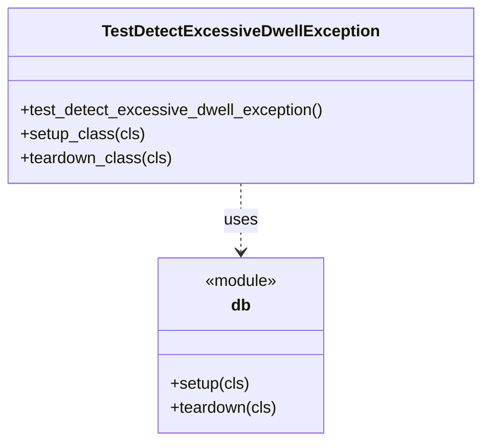

# Diagram: entity_core/watcher_service/watcher_service_tests/exception_watcher_tests/detect_excessive_dwell_exception_test.py

> Auto-generated by Obscura crawlers

## Mermaid

> SVG rendering failed for this diagram.
