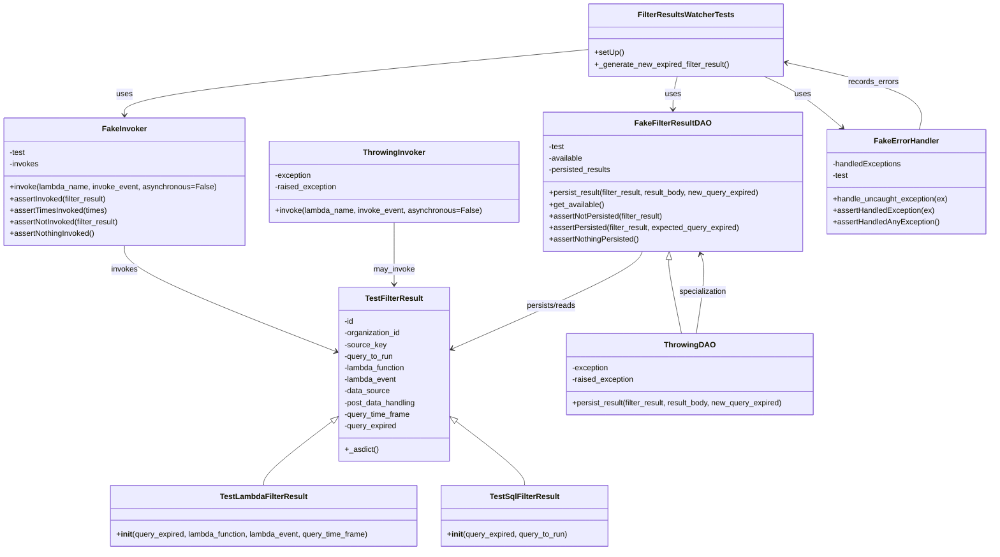

# Diagram: entity_core/watcher_service/watcher_service_tests/filter_result_watcher_tests.py

> Auto-generated by Obscura crawlers

## Mermaid

### SVG

<svg id="container" width="2040.34375" xmlns="http://www.w3.org/2000/svg" class="classDiagram" height="1138" viewBox="0 0 2040.34375 1138" role="graphics-document document" aria-roledescription="class"><g><defs><marker id="container_class-aggregationStart" class="marker aggregation class" refX="18" refY="7" markerWidth="190" markerHeight="240" orient="auto"><path d="M 18,7 L9,13 L1,7 L9,1 Z"></path></marker></defs><defs><marker id="container_class-aggregationEnd" class="marker aggregation class" refX="1" refY="7" markerWidth="20" markerHeight="28" orient="auto"><path d="M 18,7 L9,13 L1,7 L9,1 Z"></path></marker></defs><defs><marker id="container_class-extensionStart" class="marker extension class" refX="18" refY="7" markerWidth="190" markerHeight="240" orient="auto"><path d="M 1,7 L18,13 V 1 Z"></path></marker></defs><defs><marker id="container_class-extensionEnd" class="marker extension class" refX="1" refY="7" markerWidth="20" markerHeight="28" orient="auto"><path d="M 1,1 V 13 L18,7 Z"></path></marker></defs><defs><marker id="container_class-compositionStart" class="marker composition class" refX="18" refY="7" markerWidth="190" markerHeight="240" orient="auto"><path d="M 18,7 L9,13 L1,7 L9,1 Z"></path></marker></defs><defs><marker id="container_class-compositionEnd" class="marker composition class" refX="1" refY="7" markerWidth="20" markerHeight="28" orient="auto"><path d="M 18,7 L9,13 L1,7 L9,1 Z"></path></marker></defs><defs><marker id="container_class-dependencyStart" class="marker dependency class" refX="6" refY="7" markerWidth="190" markerHeight="240" orient="auto"><path d="M 5,7 L9,13 L1,7 L9,1 Z"></path></marker></defs><defs><marker id="container_class-dependencyEnd" class="marker dependency class" refX="13" refY="7" markerWidth="20" markerHeight="28" orient="auto"><path d="M 18,7 L9,13 L14,7 L9,1 Z"></path></marker></defs><defs><marker id="container_class-lollipopStart" class="marker lollipop class" refX="13" refY="7" markerWidth="190" markerHeight="240" orient="auto"><circle stroke="black" fill="transparent" cx="7" cy="7" r="6"></circle></marker></defs><defs><marker id="container_class-lollipopEnd" class="marker lollipop class" refX="1" refY="7" markerWidth="190" markerHeight="240" orient="auto"><circle stroke="black" fill="transparent" cx="7" cy="7" r="6"></circle></marker></defs><g class="root"><g class="clusters"></g><g class="edgePaths"><path d="M678.217,872.45L654.75,890.208C631.283,907.967,584.348,943.483,560.881,965.408C537.414,987.333,537.414,995.667,537.414,999.833L537.414,1004" id="id_TestFilterResult_TestLambdaFilterResult_1" class="edge-thickness-normal edge-pattern-solid relation" style=";;;" data-edge="true" data-et="edge" data-id="id_TestFilterResult_TestLambdaFilterResult_1" data-points="W3sieCI6NjkxLjk3MjY1NjI1LCJ5Ijo4NjIuMDQwODM1NzQ4NTgzM30seyJ4Ijo1MzcuNDE0MDYyNSwieSI6OTc5fSx7IngiOjUzNy40MTQwNjI1LCJ5IjoxMDA0fV0=" marker-start="url(#container_class-extensionStart)"></path><path d="M938.416,872.45L961.883,890.208C985.35,907.967,1032.284,943.483,1055.752,965.408C1079.219,987.333,1079.219,995.667,1079.219,999.833L1079.219,1004" id="id_TestFilterResult_TestSqlFilterResult_2" class="edge-thickness-normal edge-pattern-solid relation" style=";;;" data-edge="true" data-et="edge" data-id="id_TestFilterResult_TestSqlFilterResult_2" data-points="W3sieCI6OTI0LjY2MDE1NjI1LCJ5Ijo4NjIuMDQwODM1NzQ4NTgzM30seyJ4IjoxMDc5LjIxODc1LCJ5Ijo5Nzl9LHsieCI6MTA3OS4yMTg3NSwieSI6MTAwNH1d" marker-start="url(#container_class-extensionStart)"></path><path d="M1377.42,537.232L1377.269,540.527C1377.119,543.821,1376.817,550.411,1381.208,575.872C1385.599,601.333,1394.682,645.667,1399.224,667.833L1403.766,690" id="id_FakeFilterResultDAO_ThrowingDAO_3" class="edge-thickness-normal edge-pattern-solid relation" style=";;;" data-edge="true" data-et="edge" data-id="id_FakeFilterResultDAO_ThrowingDAO_3" data-points="W3sieCI6MTM3OC4yMDg0NzcyMDk5NDQ3LCJ5Ijo1MjB9LHsieCI6MTM3Ni41MTU2MjUsInkiOjU1N30seyJ4IjoxNDAzLjc2NTg3NzAxNjEyOSwieSI6NjkwfV0=" marker-start="url(#container_class-extensionStart)"></path><path d="M1393.549,158L1392.09,164.167C1390.631,170.333,1387.714,182.667,1386.256,194C1384.797,205.333,1384.797,215.667,1384.797,220.833L1384.797,226" id="id_FilterResultsWatcherTests_FakeFilterResultDAO_4" class="edge-thickness-normal edge-pattern-solid relation" style=";;;" data-edge="true" data-et="edge" data-id="id_FilterResultsWatcherTests_FakeFilterResultDAO_4" data-points="W3sieCI6MTM5My41NDg3NTgzNzA1MzU4LCJ5IjoxNTh9LHsieCI6MTM4NC43OTY4NzUsInkiOjE5NX0seyJ4IjoxMzg0Ljc5Njg3NSwieSI6MjMyfV0=" marker-end="url(#container_class-dependencyEnd)"></path><path d="M1212.027,102.304L1052.559,117.754C893.091,133.203,574.155,164.101,414.687,186.717C255.219,209.333,255.219,223.667,255.219,230.833L255.219,238" id="id_FilterResultsWatcherTests_FakeInvoker_5" class="edge-thickness-normal edge-pattern-solid relation" style=";;;" data-edge="true" data-et="edge" data-id="id_FilterResultsWatcherTests_FakeInvoker_5" data-points="W3sieCI6MTIxMi4wMjczNDM3NSwieSI6MTAyLjMwNDQ1OTQ3NjgxMDU5fSx7IngiOjI1NS4yMTg3NSwieSI6MTk1fSx7IngiOjI1NS4yMTg3NSwieSI6MjQ0fV0=" marker-end="url(#container_class-dependencyEnd)"></path><path d="M1573.367,158L1586.694,164.167C1600.02,170.333,1626.673,182.667,1653.723,200.357C1680.772,218.047,1708.218,241.094,1721.941,252.618L1735.664,264.142" id="id_FilterResultsWatcherTests_FakeErrorHandler_6" class="edge-thickness-normal edge-pattern-solid relation" style=";;;" data-edge="true" data-et="edge" data-id="id_FilterResultsWatcherTests_FakeErrorHandler_6" data-points="W3sieCI6MTU3My4zNjc0ODM5NTY0NzMzLCJ5IjoxNTh9LHsieCI6MTY1My4zMjYxNzE4NzUsInkiOjE5NX0seyJ4IjoxNzQwLjI1ODY1NDE3ODE3NjgsInkiOjI2OH1d" marker-end="url(#container_class-dependencyEnd)"></path><path d="M255.219,508L255.219,516.167C255.219,524.333,255.219,540.667,327.08,577.027C398.942,613.388,542.664,669.775,614.526,697.969L686.387,726.163" id="id_FakeInvoker_TestFilterResult_7" class="edge-thickness-normal edge-pattern-solid relation" style=";;;" data-edge="true" data-et="edge" data-id="id_FakeInvoker_TestFilterResult_7" data-points="W3sieCI6MjU1LjIxODc1LCJ5Ijo1MDh9LHsieCI6MjU1LjIxODc1LCJ5Ijo1NTd9LHsieCI6NjkxLjk3MjY1NjI1LCJ5Ijo3MjguMzU0MTg0MTc1NzcxNH1d" marker-end="url(#container_class-dependencyEnd)"></path><path d="M808.316,460L808.316,476.167C808.316,492.333,808.316,524.667,808.316,546C808.316,567.333,808.316,577.667,808.316,582.833L808.316,588" id="id_ThrowingInvoker_TestFilterResult_8" class="edge-thickness-normal edge-pattern-solid relation" style=";;;" data-edge="true" data-et="edge" data-id="id_ThrowingInvoker_TestFilterResult_8" data-points="W3sieCI6ODA4LjMxNjQwNjI1LCJ5Ijo0NjB9LHsieCI6ODA4LjMxNjQwNjI1LCJ5Ijo1NTd9LHsieCI6ODA4LjMxNjQwNjI1LCJ5Ijo1OTR9XQ==" marker-end="url(#container_class-dependencyEnd)"></path><path d="M1320.641,520L1317.893,526.167C1315.146,532.333,1309.651,544.667,1244.57,578.113C1179.49,611.559,1054.823,666.118,992.49,693.398L930.157,720.678" id="id_FakeFilterResultDAO_TestFilterResult_9" class="edge-thickness-normal edge-pattern-solid relation" style=";;;" data-edge="true" data-et="edge" data-id="id_FakeFilterResultDAO_TestFilterResult_9" data-points="W3sieCI6MTMyMC42NDA3OTc2NTE5MzM4LCJ5Ijo1MjB9LHsieCI6MTMwNC4xNTYyNSwieSI6NTU3fSx7IngiOjkyNC42NjAxNTYyNSwieSI6NzIzLjA4MzE2ODU1MDgzMzF9XQ==" marker-end="url(#container_class-dependencyEnd)"></path><path d="M1434.533,690L1438.11,667.833C1441.687,645.667,1448.842,601.333,1450.359,573.931C1451.877,546.528,1447.757,536.056,1445.698,530.82L1443.638,525.584" id="id_ThrowingDAO_FakeFilterResultDAO_10" class="edge-thickness-normal edge-pattern-solid relation" style=";;;" data-edge="true" data-et="edge" data-id="id_ThrowingDAO_FakeFilterResultDAO_10" data-points="W3sieCI6MTQzNC41MzI1MTAwODA2NDUxLCJ5Ijo2OTB9LHsieCI6MTQ1NS45OTYwOTM3NSwieSI6NTU3fSx7IngiOjE0NDEuNDQxNTU3MzIwNDQyLCJ5Ijo1MjB9XQ==" marker-end="url(#container_class-dependencyEnd)"></path><path d="M1895.4,268L1898.389,255.833C1901.378,243.667,1907.355,219.333,1860.856,196.127C1814.357,172.92,1715.382,150.84,1665.894,139.8L1616.407,128.759" id="id_FakeErrorHandler_FilterResultsWatcherTests_11" class="edge-thickness-normal edge-pattern-solid relation" style=";;;" data-edge="true" data-et="edge" data-id="id_FakeErrorHandler_FilterResultsWatcherTests_11" data-points="W3sieCI6MTg5NS40MDAyNzE5MjY3OTU1LCJ5IjoyNjh9LHsieCI6MTkxMy4zMzIwMzEyNSwieSI6MTk1fSx7IngiOjE2MTAuNTUwNzgxMjUsInkiOjEyNy40NTI5OTI4NDk1Mjg4N31d" marker-end="url(#container_class-dependencyEnd)"></path></g><g class="edgeLabels"><g class="edgeLabel"><g class="label" data-id="id_TestFilterResult_TestLambdaFilterResult_1" transform="translate(0, 0)"><foreignObject width="0" height="0">

</foreignObject></g></g><g class="edgeLabel"><g class="label" data-id="id_TestFilterResult_TestSqlFilterResult_2" transform="translate(0, 0)"><foreignObject width="0" height="0">

</foreignObject></g></g><g class="edgeLabel"><g class="label" data-id="id_FakeFilterResultDAO_ThrowingDAO_3" transform="translate(0, 0)"><foreignObject width="0" height="0">

</foreignObject></g></g><g class="edgeLabel" transform="translate(1384.796875, 195)"><g class="label" data-id="id_FilterResultsWatcherTests_FakeFilterResultDAO_4" transform="translate(-16.4921875, -12)"><foreignObject width="32.984375" height="24">

uses

</foreignObject></g></g><g class="edgeLabel" transform="translate(255.21875, 195)"><g class="label" data-id="id_FilterResultsWatcherTests_FakeInvoker_5" transform="translate(-16.4921875, -12)"><foreignObject width="32.984375" height="24">

uses

</foreignObject></g></g><g class="edgeLabel" transform="translate(1663.05697, 203.17126)"><g class="label" data-id="id_FilterResultsWatcherTests_FakeErrorHandler_6" transform="translate(-16.4921875, -12)"><foreignObject width="32.984375" height="24">

uses

</foreignObject></g></g><g class="edgeLabel" transform="translate(255.21875, 557)"><g class="label" data-id="id_FakeInvoker_TestFilterResult_7" transform="translate(-27.5859375, -12)"><foreignObject width="55.171875" height="24">

invokes

</foreignObject></g></g><g class="edgeLabel" transform="translate(808.31640625, 557)"><g class="label" data-id="id_ThrowingInvoker_TestFilterResult_8" transform="translate(-42.796875, -12)"><foreignObject width="85.59375" height="24">

may_invoke

</foreignObject></g></g><g class="edgeLabel" transform="translate(1132.9622, 631.92159)"><g class="label" data-id="id_FakeFilterResultDAO_TestFilterResult_9" transform="translate(-52.359375, -12)"><foreignObject width="104.71875" height="24">

persists/reads

</foreignObject></g></g><g class="edgeLabel" transform="translate(1448.43154, 603.87407)"><g class="label" data-id="id_ThrowingDAO_FakeFilterResultDAO_10" transform="translate(-50.0390625, -12)"><foreignObject width="100.078125" height="24">

specialization

</foreignObject></g></g><g class="edgeLabel" transform="translate(1798.62472, 169.41012)"><g class="label" data-id="id_FakeErrorHandler_FilterResultsWatcherTests_11" transform="translate(-52.4296875, -12)"><foreignObject width="104.859375" height="24">

records_errors

</foreignObject></g></g></g><g class="nodes"><g class="node default" id="classId-FilterResultsWatcherTests-0" transform="translate(1411.2890625, 83)"><g class="basic label-container"><path d="M-199.26171875 -75 L199.26171875 -75 L199.26171875 75 L-199.26171875 75" stroke="none" stroke-width="0" fill="#ECECFF" style=""></path><path d="M-199.26171875 -75 C-88.81989156861574 -75, 21.62193561276851 -75, 199.26171875 -75 M-199.26171875 -75 C-114.74937161230027 -75, -30.23702447460053 -75, 199.26171875 -75 M199.26171875 -75 C199.26171875 -33.19983911532969, 199.26171875 8.600321769340624, 199.26171875 75 M199.26171875 -75 C199.26171875 -33.084036667586986, 199.26171875 8.831926664826028, 199.26171875 75 M199.26171875 75 C109.00553341614588 75, 18.74934808229176 75, -199.26171875 75 M199.26171875 75 C117.75340940923465 75, 36.2451000684693 75, -199.26171875 75 M-199.26171875 75 C-199.26171875 35.15304820949444, -199.26171875 -4.693903581011114, -199.26171875 -75 M-199.26171875 75 C-199.26171875 33.56500098866944, -199.26171875 -7.869998022661122, -199.26171875 -75" stroke="#9370DB" stroke-width="1.3" fill="none" stroke-dasharray="0 0" style=""></path></g><g class="annotation-group text" transform="translate(0, -51)"></g><g class="label-group text" transform="translate(-94.9140625, -51)"><g class="label" style="font-weight: bolder" transform="translate(0,-12)"><foreignObject width="189.828125" height="24">

FilterResultsWatcherTests

</foreignObject></g></g><g class="members-group text" transform="translate(-187.26171875, -3)"></g><g class="methods-group text" transform="translate(-187.26171875, 27)"><g class="label" style="" transform="translate(0,-12)"><foreignObject width="60.421875" height="24">

+setUp()

</foreignObject></g><g class="label" style="" transform="translate(0,12)"><foreignObject width="279.609375" height="24">

+_generate_new_expired_filter_result()

</foreignObject></g></g><g class="divider" style=""><path d="M-199.26171875 -27 C-48.98216675920855 -27, 101.2973852315829 -27, 199.26171875 -27 M-199.26171875 -27 C-87.00281826248612 -27, 25.256082225027768 -27, 199.26171875 -27" stroke="#9370DB" stroke-width="1.3" fill="none" stroke-dasharray="0 0" style=""></path></g><g class="divider" style=""><path d="M-199.26171875 -3 C-90.07096658402521 -3, 19.11978558194957 -3, 199.26171875 -3 M-199.26171875 -3 C-68.13565383516345 -3, 62.990411079673095 -3, 199.26171875 -3" stroke="#9370DB" stroke-width="1.3" fill="none" stroke-dasharray="0 0" style=""></path></g></g><g class="node default" id="classId-TestFilterResult-1" transform="translate(808.31640625, 774)"><g class="basic label-container"><path d="M-116.34375 -180 L116.34375 -180 L116.34375 180 L-116.34375 180" stroke="none" stroke-width="0" fill="#ECECFF" style=""></path><path d="M-116.34375 -180 C-34.5964172508516 -180, 47.1509154982968 -180, 116.34375 -180 M-116.34375 -180 C-68.29909042527122 -180, -20.254430850542434 -180, 116.34375 -180 M116.34375 -180 C116.34375 -41.0214509153835, 116.34375 97.957098169233, 116.34375 180 M116.34375 -180 C116.34375 -76.82208806432031, 116.34375 26.355823871359377, 116.34375 180 M116.34375 180 C67.14660884210856 180, 17.949467684217126 180, -116.34375 180 M116.34375 180 C67.91259182755812 180, 19.48143365511625 180, -116.34375 180 M-116.34375 180 C-116.34375 105.4175830422367, -116.34375 30.8351660844734, -116.34375 -180 M-116.34375 180 C-116.34375 93.86753224121674, -116.34375 7.735064482433472, -116.34375 -180" stroke="#9370DB" stroke-width="1.3" fill="none" stroke-dasharray="0 0" style=""></path></g><g class="annotation-group text" transform="translate(0, -156)"></g><g class="label-group text" transform="translate(-57.25, -156)"><g class="label" style="font-weight: bolder" transform="translate(0,-12)"><foreignObject width="114.5" height="24">

TestFilterResult

</foreignObject></g></g><g class="members-group text" transform="translate(-104.34375, -108)"><g class="label" style="" transform="translate(0,-12)"><foreignObject width="20.53125" height="24">

-id

</foreignObject></g><g class="label" style="" transform="translate(0,12)"><foreignObject width="119.203125" height="24">

-organization_id

</foreignObject></g><g class="label" style="" transform="translate(0,36)"><foreignObject width="86.90625" height="24">

-source_key

</foreignObject></g><g class="label" style="" transform="translate(0,60)"><foreignObject width="103.375" height="24">

-query_to_run

</foreignObject></g><g class="label" style="" transform="translate(0,84)"><foreignObject width="129.953125" height="24">

-lambda_function

</foreignObject></g><g class="label" style="" transform="translate(0,108)"><foreignObject width="109.59375" height="24">

-lambda_event

</foreignObject></g><g class="label" style="" transform="translate(0,132)"><foreignObject width="95.28125" height="24">

-data_source

</foreignObject></g><g class="label" style="" transform="translate(0,156)"><foreignObject width="151.4375" height="24">

-post_data_handling

</foreignObject></g><g class="label" style="" transform="translate(0,180)"><foreignObject width="138.140625" height="24">

-query_time_frame

</foreignObject></g><g class="label" style="" transform="translate(0,204)"><foreignObject width="109.953125" height="24">

-query_expired

</foreignObject></g></g><g class="methods-group text" transform="translate(-104.34375, 156)"><g class="label" style="" transform="translate(0,-12)"><foreignObject width="68.59375" height="24">

+_asdict()

</foreignObject></g></g><g class="divider" style=""><path d="M-116.34375 -132 C-44.59451296535029 -132, 27.15472406929942 -132, 116.34375 -132 M-116.34375 -132 C-29.03306860654382 -132, 58.27761278691236 -132, 116.34375 -132" stroke="#9370DB" stroke-width="1.3" fill="none" stroke-dasharray="0 0" style=""></path></g><g class="divider" style=""><path d="M-116.34375 132 C-24.177096058621288 132, 67.98955788275742 132, 116.34375 132 M-116.34375 132 C-47.72566546173779 132, 20.89241907652442 132, 116.34375 132" stroke="#9370DB" stroke-width="1.3" fill="none" stroke-dasharray="0 0" style=""></path></g></g><g class="node default" id="classId-TestLambdaFilterResult-2" transform="translate(537.4140625, 1067)"><g class="basic label-container"><path d="M-319.65234375 -63 L319.65234375 -63 L319.65234375 63 L-319.65234375 63" stroke="none" stroke-width="0" fill="#ECECFF" style=""></path><path d="M-319.65234375 -63 C-86.00360857869316 -63, 147.64512659261368 -63, 319.65234375 -63 M-319.65234375 -63 C-154.37701345866276 -63, 10.898316832674482 -63, 319.65234375 -63 M319.65234375 -63 C319.65234375 -34.513102717996944, 319.65234375 -6.026205435993894, 319.65234375 63 M319.65234375 -63 C319.65234375 -26.421691259972214, 319.65234375 10.156617480055573, 319.65234375 63 M319.65234375 63 C154.1213270935087 63, -11.409689562982578 63, -319.65234375 63 M319.65234375 63 C162.22169343236777 63, 4.791043114735544 63, -319.65234375 63 M-319.65234375 63 C-319.65234375 22.171026457019238, -319.65234375 -18.657947085961524, -319.65234375 -63 M-319.65234375 63 C-319.65234375 24.05173943281561, -319.65234375 -14.896521134368783, -319.65234375 -63" stroke="#9370DB" stroke-width="1.3" fill="none" stroke-dasharray="0 0" style=""></path></g><g class="annotation-group text" transform="translate(0, -39)"></g><g class="label-group text" transform="translate(-86.3828125, -39)"><g class="label" style="font-weight: bolder" transform="translate(0,-12)"><foreignObject width="172.765625" height="24">

TestLambdaFilterResult

</foreignObject></g></g><g class="members-group text" transform="translate(-307.65234375, 9)"></g><g class="methods-group text" transform="translate(-307.65234375, 39)"><g class="label" style="" transform="translate(0,-12)"><foreignObject width="528.921875" height="24">

+<strong>init</strong>(query_expired, lambda_function, lambda_event, query_time_frame)

</foreignObject></g></g><g class="divider" style=""><path d="M-319.65234375 -15 C-116.62491186033981 -15, 86.40252002932039 -15, 319.65234375 -15 M-319.65234375 -15 C-167.64355032448955 -15, -15.634756898979106 -15, 319.65234375 -15" stroke="#9370DB" stroke-width="1.3" fill="none" stroke-dasharray="0 0" style=""></path></g><g class="divider" style=""><path d="M-319.65234375 9 C-113.5989416581024 9, 92.45446043379519 9, 319.65234375 9 M-319.65234375 9 C-154.36917675982266 9, 10.91399023035467 9, 319.65234375 9" stroke="#9370DB" stroke-width="1.3" fill="none" stroke-dasharray="0 0" style=""></path></g></g><g class="node default" id="classId-TestSqlFilterResult-3" transform="translate(1079.21875, 1067)"><g class="basic label-container"><path d="M-172.15234375 -63 L172.15234375 -63 L172.15234375 63 L-172.15234375 63" stroke="none" stroke-width="0" fill="#ECECFF" style=""></path><path d="M-172.15234375 -63 C-89.48106111671254 -63, -6.809778483425077 -63, 172.15234375 -63 M-172.15234375 -63 C-57.621007142747715 -63, 56.91032946450457 -63, 172.15234375 -63 M172.15234375 -63 C172.15234375 -34.876084351902776, 172.15234375 -6.752168703805559, 172.15234375 63 M172.15234375 -63 C172.15234375 -34.402542298455145, 172.15234375 -5.805084596910298, 172.15234375 63 M172.15234375 63 C100.76271649118543 63, 29.37308923237086 63, -172.15234375 63 M172.15234375 63 C35.854070868906376 63, -100.44420201218725 63, -172.15234375 63 M-172.15234375 63 C-172.15234375 33.343876202093064, -172.15234375 3.687752404186128, -172.15234375 -63 M-172.15234375 63 C-172.15234375 36.42213564760732, -172.15234375 9.844271295214646, -172.15234375 -63" stroke="#9370DB" stroke-width="1.3" fill="none" stroke-dasharray="0 0" style=""></path></g><g class="annotation-group text" transform="translate(0, -39)"></g><g class="label-group text" transform="translate(-69.0078125, -39)"><g class="label" style="font-weight: bolder" transform="translate(0,-12)"><foreignObject width="138.015625" height="24">

TestSqlFilterResult

</foreignObject></g></g><g class="members-group text" transform="translate(-160.15234375, 9)"></g><g class="methods-group text" transform="translate(-160.15234375, 39)"><g class="label" style="" transform="translate(0,-12)"><foreignObject width="251.296875" height="24">

+<strong>init</strong>(query_expired, query_to_run)

</foreignObject></g></g><g class="divider" style=""><path d="M-172.15234375 -15 C-88.17714752714723 -15, -4.201951304294454 -15, 172.15234375 -15 M-172.15234375 -15 C-57.587550339251194 -15, 56.97724307149761 -15, 172.15234375 -15" stroke="#9370DB" stroke-width="1.3" fill="none" stroke-dasharray="0 0" style=""></path></g><g class="divider" style=""><path d="M-172.15234375 9 C-86.00556322627152 9, 0.14121729745696143 9, 172.15234375 9 M-172.15234375 9 C-60.403496127587914 9, 51.34535149482417 9, 172.15234375 9" stroke="#9370DB" stroke-width="1.3" fill="none" stroke-dasharray="0 0" style=""></path></g></g><g class="node default" id="classId-ThrowingInvoker-4" transform="translate(808.31640625, 376)"><g class="basic label-container"><path d="M-255.87890625 -84 L255.87890625 -84 L255.87890625 84 L-255.87890625 84" stroke="none" stroke-width="0" fill="#ECECFF" style=""></path><path d="M-255.87890625 -84 C-127.72773773529673 -84, 0.4234307794065444 -84, 255.87890625 -84 M-255.87890625 -84 C-89.89361908686683 -84, 76.09166807626633 -84, 255.87890625 -84 M255.87890625 -84 C255.87890625 -20.299217593019726, 255.87890625 43.40156481396055, 255.87890625 84 M255.87890625 -84 C255.87890625 -41.51918998890275, 255.87890625 0.961620022194495, 255.87890625 84 M255.87890625 84 C78.69588166470868 84, -98.48714292058264 84, -255.87890625 84 M255.87890625 84 C152.59922299761553 84, 49.319539745231026 84, -255.87890625 84 M-255.87890625 84 C-255.87890625 30.576186202310474, -255.87890625 -22.847627595379052, -255.87890625 -84 M-255.87890625 84 C-255.87890625 46.30147902703311, -255.87890625 8.602958054066221, -255.87890625 -84" stroke="#9370DB" stroke-width="1.3" fill="none" stroke-dasharray="0 0" style=""></path></g><g class="annotation-group text" transform="translate(0, -60)"></g><g class="label-group text" transform="translate(-61.4140625, -60)"><g class="label" style="font-weight: bolder" transform="translate(0,-12)"><foreignObject width="122.828125" height="24">

ThrowingInvoker

</foreignObject></g></g><g class="members-group text" transform="translate(-243.87890625, -12)"><g class="label" style="" transform="translate(0,-12)"><foreignObject width="77.203125" height="24">

-exception

</foreignObject></g><g class="label" style="" transform="translate(0,12)"><foreignObject width="129.796875" height="24">

-raised_exception

</foreignObject></g></g><g class="methods-group text" transform="translate(-243.87890625, 60)"><g class="label" style="" transform="translate(0,-12)"><foreignObject width="426.34375" height="24">

+invoke(lambda_name, invoke_event, asynchronous=False)

</foreignObject></g></g><g class="divider" style=""><path d="M-255.87890625 -36 C-152.91062227028954 -36, -49.94233829057907 -36, 255.87890625 -36 M-255.87890625 -36 C-101.11290915281072 -36, 53.65308794437857 -36, 255.87890625 -36" stroke="#9370DB" stroke-width="1.3" fill="none" stroke-dasharray="0 0" style=""></path></g><g class="divider" style=""><path d="M-255.87890625 36 C-98.11360831277199 36, 59.651689624456026 36, 255.87890625 36 M-255.87890625 36 C-131.04911405663267 36, -6.219321863265378 36, 255.87890625 36" stroke="#9370DB" stroke-width="1.3" fill="none" stroke-dasharray="0 0" style=""></path></g></g><g class="node default" id="classId-FakeInvoker-5" transform="translate(255.21875, 376)"><g class="basic label-container"><path d="M-247.21875 -132 L247.21875 -132 L247.21875 132 L-247.21875 132" stroke="none" stroke-width="0" fill="#ECECFF" style=""></path><path d="M-247.21875 -132 C-87.97425929936597 -132, 71.27023140126806 -132, 247.21875 -132 M-247.21875 -132 C-121.95786551888115 -132, 3.303018962237701 -132, 247.21875 -132 M247.21875 -132 C247.21875 -73.79825797110301, 247.21875 -15.596515942206025, 247.21875 132 M247.21875 -132 C247.21875 -68.92988878594281, 247.21875 -5.8597775718856155, 247.21875 132 M247.21875 132 C94.63288770867871 132, -57.95297458264258 132, -247.21875 132 M247.21875 132 C82.71727495458933 132, -81.78420009082134 132, -247.21875 132 M-247.21875 132 C-247.21875 50.39154534485937, -247.21875 -31.216909310281267, -247.21875 -132 M-247.21875 132 C-247.21875 63.65886735848812, -247.21875 -4.682265283023753, -247.21875 -132" stroke="#9370DB" stroke-width="1.3" fill="none" stroke-dasharray="0 0" style=""></path></g><g class="annotation-group text" transform="translate(0, -108)"></g><g class="label-group text" transform="translate(-44.09375, -108)"><g class="label" style="font-weight: bolder" transform="translate(0,-12)"><foreignObject width="88.1875" height="24">

FakeInvoker

</foreignObject></g></g><g class="members-group text" transform="translate(-235.21875, -60)"><g class="label" style="" transform="translate(0,-12)"><foreignObject width="33.875" height="24">

-test

</foreignObject></g><g class="label" style="" transform="translate(0,12)"><foreignObject width="61.625" height="24">

-invokes

</foreignObject></g></g><g class="methods-group text" transform="translate(-235.21875, 12)"><g class="label" style="" transform="translate(0,-12)"><foreignObject width="426.34375" height="24">

+invoke(lambda_name, invoke_event, asynchronous=False)

</foreignObject></g><g class="label" style="" transform="translate(0,12)"><foreignObject width="202.609375" height="24">

+assertInvoked(filter_result)

</foreignObject></g><g class="label" style="" transform="translate(0,36)"><foreignObject width="202.46875" height="24">

+assertTimesInvoked(times)

</foreignObject></g><g class="label" style="" transform="translate(0,60)"><foreignObject width="228.671875" height="24">

+assertNotInvoked(filter_result)

</foreignObject></g><g class="label" style="" transform="translate(0,84)"><foreignObject width="177.21875" height="24">

+assertNothingInvoked()

</foreignObject></g></g><g class="divider" style=""><path d="M-247.21875 -84 C-66.94676278890518 -84, 113.32522442218965 -84, 247.21875 -84 M-247.21875 -84 C-85.8243428625654 -84, 75.5700642748692 -84, 247.21875 -84" stroke="#9370DB" stroke-width="1.3" fill="none" stroke-dasharray="0 0" style=""></path></g><g class="divider" style=""><path d="M-247.21875 -12 C-114.94515269067125 -12, 17.3284446186575 -12, 247.21875 -12 M-247.21875 -12 C-130.38422645190485 -12, -13.549702903809674 -12, 247.21875 -12" stroke="#9370DB" stroke-width="1.3" fill="none" stroke-dasharray="0 0" style=""></path></g></g><g class="node default" id="classId-FakeFilterResultDAO-6" transform="translate(1384.796875, 376)"><g class="basic label-container"><path d="M-270.6015625 -144 L270.6015625 -144 L270.6015625 144 L-270.6015625 144" stroke="none" stroke-width="0" fill="#ECECFF" style=""></path><path d="M-270.6015625 -144 C-64.42247120844104 -144, 141.75662008311792 -144, 270.6015625 -144 M-270.6015625 -144 C-139.07564220508456 -144, -7.549721910169126 -144, 270.6015625 -144 M270.6015625 -144 C270.6015625 -53.87399845906792, 270.6015625 36.25200308186416, 270.6015625 144 M270.6015625 -144 C270.6015625 -81.33891675149962, 270.6015625 -18.677833502999235, 270.6015625 144 M270.6015625 144 C87.87332050795635 144, -94.8549214840873 144, -270.6015625 144 M270.6015625 144 C71.47162734450902 144, -127.65830781098197 144, -270.6015625 144 M-270.6015625 144 C-270.6015625 78.22225381063339, -270.6015625 12.44450762126678, -270.6015625 -144 M-270.6015625 144 C-270.6015625 78.54382631603396, -270.6015625 13.087652632067915, -270.6015625 -144" stroke="#9370DB" stroke-width="1.3" fill="none" stroke-dasharray="0 0" style=""></path></g><g class="annotation-group text" transform="translate(0, -120)"></g><g class="label-group text" transform="translate(-73.828125, -120)"><g class="label" style="font-weight: bolder" transform="translate(0,-12)"><foreignObject width="147.65625" height="24">

FakeFilterResultDAO

</foreignObject></g></g><g class="members-group text" transform="translate(-258.6015625, -72)"><g class="label" style="" transform="translate(0,-12)"><foreignObject width="33.875" height="24">

-test

</foreignObject></g><g class="label" style="" transform="translate(0,12)"><foreignObject width="71.65625" height="24">

-available

</foreignObject></g><g class="label" style="" transform="translate(0,36)"><foreignObject width="131.359375" height="24">

-persisted_results

</foreignObject></g></g><g class="methods-group text" transform="translate(-258.6015625, 24)"><g class="label" style="" transform="translate(0,-12)"><foreignObject width="443.375" height="24">

+persist_result(filter_result, result_body, new_query_expired)

</foreignObject></g><g class="label" style="" transform="translate(0,12)"><foreignObject width="114.359375" height="24">

+get_available()

</foreignObject></g><g class="label" style="" transform="translate(0,36)"><foreignObject width="237.9375" height="24">

+assertNotPersisted(filter_result)

</foreignObject></g><g class="label" style="" transform="translate(0,60)"><foreignObject width="397.578125" height="24">

+assertPersisted(filter_result, expected_query_expired)

</foreignObject></g><g class="label" style="" transform="translate(0,84)"><foreignObject width="186.5" height="24">

+assertNothingPersisted()

</foreignObject></g></g><g class="divider" style=""><path d="M-270.6015625 -96 C-132.55051030474576 -96, 5.500541890508487 -96, 270.6015625 -96 M-270.6015625 -96 C-67.1256531859776 -96, 136.3502561280448 -96, 270.6015625 -96" stroke="#9370DB" stroke-width="1.3" fill="none" stroke-dasharray="0 0" style=""></path></g><g class="divider" style=""><path d="M-270.6015625 0 C-148.72471320149538 0, -26.847863902990724 0, 270.6015625 0 M-270.6015625 0 C-89.52519576360092 0, 91.55117097279816 0, 270.6015625 0" stroke="#9370DB" stroke-width="1.3" fill="none" stroke-dasharray="0 0" style=""></path></g></g><g class="node default" id="classId-ThrowingDAO-7" transform="translate(1420.9765625, 774)"><g class="basic label-container"><path d="M-258.26171875 -84 L258.26171875 -84 L258.26171875 84 L-258.26171875 84" stroke="none" stroke-width="0" fill="#ECECFF" style=""></path><path d="M-258.26171875 -84 C-148.235913879699 -84, -38.210109009397996 -84, 258.26171875 -84 M-258.26171875 -84 C-100.45261806621374 -84, 57.35648261757251 -84, 258.26171875 -84 M258.26171875 -84 C258.26171875 -23.736612157261717, 258.26171875 36.526775685476565, 258.26171875 84 M258.26171875 -84 C258.26171875 -33.16543042893591, 258.26171875 17.669139142128174, 258.26171875 84 M258.26171875 84 C110.90373710128637 84, -36.454244547427265 84, -258.26171875 84 M258.26171875 84 C89.47685957085633 84, -79.30799960828733 84, -258.26171875 84 M-258.26171875 84 C-258.26171875 33.33154240870589, -258.26171875 -17.336915182588214, -258.26171875 -84 M-258.26171875 84 C-258.26171875 42.051236529120054, -258.26171875 0.10247305824010766, -258.26171875 -84" stroke="#9370DB" stroke-width="1.3" fill="none" stroke-dasharray="0 0" style=""></path></g><g class="annotation-group text" transform="translate(0, -60)"></g><g class="label-group text" transform="translate(-49.1484375, -60)"><g class="label" style="font-weight: bolder" transform="translate(0,-12)"><foreignObject width="98.296875" height="24">

ThrowingDAO

</foreignObject></g></g><g class="members-group text" transform="translate(-246.26171875, -12)"><g class="label" style="" transform="translate(0,-12)"><foreignObject width="77.203125" height="24">

-exception

</foreignObject></g><g class="label" style="" transform="translate(0,12)"><foreignObject width="129.796875" height="24">

-raised_exception

</foreignObject></g></g><g class="methods-group text" transform="translate(-246.26171875, 60)"><g class="label" style="" transform="translate(0,-12)"><foreignObject width="443.375" height="24">

+persist_result(filter_result, result_body, new_query_expired)

</foreignObject></g></g><g class="divider" style=""><path d="M-258.26171875 -36 C-78.87257843969567 -36, 100.51656187060865 -36, 258.26171875 -36 M-258.26171875 -36 C-90.63656331044317 -36, 76.98859212911367 -36, 258.26171875 -36" stroke="#9370DB" stroke-width="1.3" fill="none" stroke-dasharray="0 0" style=""></path></g><g class="divider" style=""><path d="M-258.26171875 36 C-110.82217566864725 36, 36.617367412705505 36, 258.26171875 36 M-258.26171875 36 C-64.94718671684225 36, 128.3673453163155 36, 258.26171875 36" stroke="#9370DB" stroke-width="1.3" fill="none" stroke-dasharray="0 0" style=""></path></g></g><g class="node default" id="classId-FakeErrorHandler-8" transform="translate(1868.87109375, 376)"><g class="basic label-container"><path d="M-163.47265625 -108 L163.47265625 -108 L163.47265625 108 L-163.47265625 108" stroke="none" stroke-width="0" fill="#ECECFF" style=""></path><path d="M-163.47265625 -108 C-49.10976175518458 -108, 65.25313273963084 -108, 163.47265625 -108 M-163.47265625 -108 C-37.515432660941386 -108, 88.44179092811723 -108, 163.47265625 -108 M163.47265625 -108 C163.47265625 -59.316788855527314, 163.47265625 -10.633577711054627, 163.47265625 108 M163.47265625 -108 C163.47265625 -45.79915335265016, 163.47265625 16.401693294699683, 163.47265625 108 M163.47265625 108 C37.89238900001618 108, -87.68787824996764 108, -163.47265625 108 M163.47265625 108 C52.70369881607182 108, -58.06525861785636 108, -163.47265625 108 M-163.47265625 108 C-163.47265625 43.72284650654902, -163.47265625 -20.554306986901963, -163.47265625 -108 M-163.47265625 108 C-163.47265625 58.89564372480271, -163.47265625 9.79128744960542, -163.47265625 -108" stroke="#9370DB" stroke-width="1.3" fill="none" stroke-dasharray="0 0" style=""></path></g><g class="annotation-group text" transform="translate(0, -84)"></g><g class="label-group text" transform="translate(-63.8046875, -84)"><g class="label" style="font-weight: bolder" transform="translate(0,-12)"><foreignObject width="127.609375" height="24">

FakeErrorHandler

</foreignObject></g></g><g class="members-group text" transform="translate(-151.47265625, -36)"><g class="label" style="" transform="translate(0,-12)"><foreignObject width="144.578125" height="24">

-handledExceptions

</foreignObject></g><g class="label" style="" transform="translate(0,12)"><foreignObject width="33.875" height="24">

-test

</foreignObject></g></g><g class="methods-group text" transform="translate(-151.47265625, 36)"><g class="label" style="" transform="translate(0,-12)"><foreignObject width="239.140625" height="24">

+handle_uncaught_exception(ex)

</foreignObject></g><g class="label" style="" transform="translate(0,12)"><foreignObject width="210.609375" height="24">

+assertHandledException(ex)

</foreignObject></g><g class="label" style="" transform="translate(0,36)"><foreignObject width="220.578125" height="24">

+assertHandledAnyException()

</foreignObject></g></g><g class="divider" style=""><path d="M-163.47265625 -60 C-96.9496314195257 -60, -30.426606589051403 -60, 163.47265625 -60 M-163.47265625 -60 C-95.39499060175513 -60, -27.31732495351025 -60, 163.47265625 -60" stroke="#9370DB" stroke-width="1.3" fill="none" stroke-dasharray="0 0" style=""></path></g><g class="divider" style=""><path d="M-163.47265625 12 C-62.23335142045933 12, 39.00595340908134 12, 163.47265625 12 M-163.47265625 12 C-39.94242057618865 12, 83.5878150976227 12, 163.47265625 12" stroke="#9370DB" stroke-width="1.3" fill="none" stroke-dasharray="0 0" style=""></path></g></g></g></g></g></svg>
