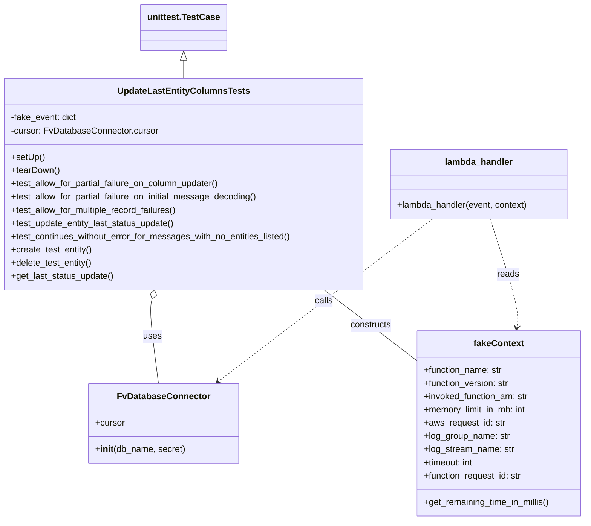
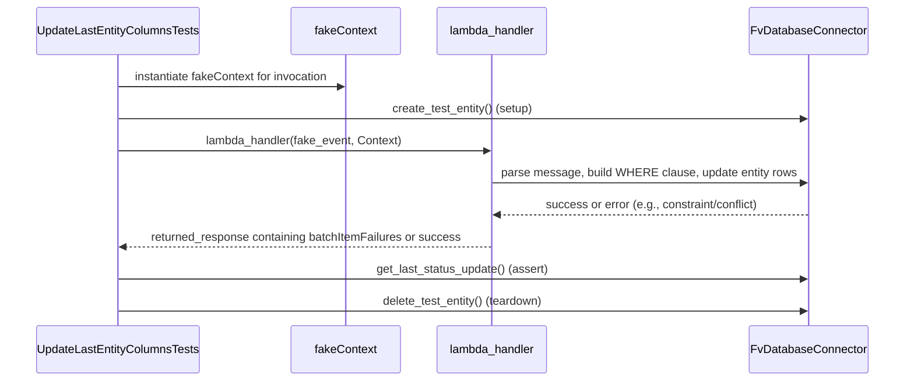

# Diagram: entity_core/watcher_service/watcher_service_tests/update_last_entity_columns_integration_test.py

> Auto-generated by Obscura crawlers

## Diagram 1

### SVG

<svg id="container" width="1066.515625" xmlns="http://www.w3.org/2000/svg" class="classDiagram" height="944" viewBox="0 0 1066.515625 944" role="graphics-document document" aria-roledescription="class"><g><defs><marker id="container_class-aggregationStart" class="marker aggregation class" refX="18" refY="7" markerWidth="190" markerHeight="240" orient="auto"><path d="M 18,7 L9,13 L1,7 L9,1 Z"></path></marker></defs><defs><marker id="container_class-aggregationEnd" class="marker aggregation class" refX="1" refY="7" markerWidth="20" markerHeight="28" orient="auto"><path d="M 18,7 L9,13 L1,7 L9,1 Z"></path></marker></defs><defs><marker id="container_class-extensionStart" class="marker extension class" refX="18" refY="7" markerWidth="190" markerHeight="240" orient="auto"><path d="M 1,7 L18,13 V 1 Z"></path></marker></defs><defs><marker id="container_class-extensionEnd" class="marker extension class" refX="1" refY="7" markerWidth="20" markerHeight="28" orient="auto"><path d="M 1,1 V 13 L18,7 Z"></path></marker></defs><defs><marker id="container_class-compositionStart" class="marker composition class" refX="18" refY="7" markerWidth="190" markerHeight="240" orient="auto"><path d="M 18,7 L9,13 L1,7 L9,1 Z"></path></marker></defs><defs><marker id="container_class-compositionEnd" class="marker composition class" refX="1" refY="7" markerWidth="20" markerHeight="28" orient="auto"><path d="M 18,7 L9,13 L1,7 L9,1 Z"></path></marker></defs><defs><marker id="container_class-dependencyStart" class="marker dependency class" refX="6" refY="7" markerWidth="190" markerHeight="240" orient="auto"><path d="M 5,7 L9,13 L1,7 L9,1 Z"></path></marker></defs><defs><marker id="container_class-dependencyEnd" class="marker dependency class" refX="13" refY="7" markerWidth="20" markerHeight="28" orient="auto"><path d="M 18,7 L9,13 L14,7 L9,1 Z"></path></marker></defs><defs><marker id="container_class-lollipopStart" class="marker lollipop class" refX="13" refY="7" markerWidth="190" markerHeight="240" orient="auto"><circle stroke="black" fill="transparent" cx="7" cy="7" r="6"></circle></marker></defs><defs><marker id="container_class-lollipopEnd" class="marker lollipop class" refX="1" refY="7" markerWidth="190" markerHeight="240" orient="auto"><circle stroke="black" fill="transparent" cx="7" cy="7" r="6"></circle></marker></defs><g class="root"><g class="clusters"></g><g class="edgePaths"><path d="M333.473,109.25L333.473,110.542C333.473,111.833,333.473,114.417,333.473,119.875C333.473,125.333,333.473,133.667,333.473,137.833L333.473,142" id="id_unittest.TestCase_UpdateLastEntityColumnsTests_1" class="edge-thickness-normal edge-pattern-solid relation" style=";;;" data-edge="true" data-et="edge" data-id="id_unittest.TestCase_UpdateLastEntityColumnsTests_1" data-points="W3sieCI6MzMzLjQ3MjY1NjI1LCJ5Ijo5Mn0seyJ4IjozMzMuNDcyNjU2MjUsInkiOjExN30seyJ4IjozMzMuNDcyNjU2MjUsInkiOjE0Mn1d" marker-start="url(#container_class-extensionStart)"></path><path d="M275.521,542.621L274.577,546.017C273.633,549.414,271.746,556.207,273.665,581.77C275.584,607.333,281.308,651.667,284.17,673.833L287.032,696" id="id_UpdateLastEntityColumnsTests_FvDatabaseConnector_2" class="edge-thickness-normal edge-pattern-solid relation" style=";;;" data-edge="true" data-et="edge" data-id="id_UpdateLastEntityColumnsTests_FvDatabaseConnector_2" data-points="W3sieCI6MjgwLjEzNzUwMzQxMTU3MjEsInkiOjUyNn0seyJ4IjoyNjkuODU5Mzc1LCJ5Ijo1NjN9LHsieCI6Mjg3LjAzMTc4MzUzNjU4NTM1LCJ5Ijo2OTZ9XQ==" marker-start="url(#container_class-aggregationStart)"></path><path d="M589.966,526L598.204,532.167C606.442,538.333,622.918,550.667,650.895,571.888C678.872,593.11,718.35,623.221,738.089,638.276L757.828,653.331" id="id_UpdateLastEntityColumnsTests_fakeContext_3" class="edge-thickness-normal edge-pattern-solid relation" style=";;;" data-edge="true" data-et="edge" data-id="id_UpdateLastEntityColumnsTests_fakeContext_3" data-points="W3sieCI6NTg5Ljk2NjEwNjAzMTY1OTQsInkiOjUyNn0seyJ4Ijo2MzkuMzk0NTMxMjUsInkiOjU2M30seyJ4Ijo3NTcuODI4MTI1LCJ5Ijo2NTMuMzMwODUyOTY1NTQxM31d"></path><path d="M786.865,397L749.905,424.667C712.945,452.333,639.025,507.667,573.798,556.894C508.57,606.12,452.034,649.241,423.766,670.801L395.499,692.361" id="id_lambda_handler_FvDatabaseConnector_4" class="edge-thickness-normal edge-pattern-dashed relation" style=";;;" data-edge="true" data-et="edge" data-id="id_lambda_handler_FvDatabaseConnector_4" data-points="W3sieCI6Nzg2Ljg2NTQzMDU0MDM5MywieSI6Mzk3fSx7IngiOjU2NS4xMDU0Njg3NSwieSI6NTYzfSx7IngiOjM5MC43Mjc5NzI1NjA5NzU2LCJ5Ijo2OTZ9XQ==" marker-end="url(#container_class-dependencyEnd)"></path><path d="M891.955,397L901.145,424.667C910.336,452.333,928.717,507.667,936.923,540.518C945.129,573.368,943.16,583.737,942.176,588.921L941.191,594.105" id="id_lambda_handler_fakeContext_5" class="edge-thickness-normal edge-pattern-dashed relation" style=";;;" data-edge="true" data-et="edge" data-id="id_lambda_handler_fakeContext_5" data-points="W3sieCI6ODkxLjk1NDk4NDMwNjc2ODYsInkiOjM5N30seyJ4Ijo5NDcuMDk3NjU2MjUsInkiOjU2M30seyJ4Ijo5NDAuMDcyMDI3NDM5MDI0NCwieSI6NjAwfV0=" marker-end="url(#container_class-dependencyEnd)"></path></g><g class="edgeLabels"><g class="edgeLabel"><g class="label" data-id="id_unittest.TestCase_UpdateLastEntityColumnsTests_1" transform="translate(0, 0)"><foreignObject width="0" height="0">

</foreignObject></g></g><g class="edgeLabel" transform="translate(275.9869, 610.45755)"><g class="label" data-id="id_UpdateLastEntityColumnsTests_FvDatabaseConnector_2" transform="translate(-16.4921875, -12)"><foreignObject width="32.984375" height="24">

uses

</foreignObject></g></g><g class="edgeLabel" transform="translate(674.06482, 589.44348)"><g class="label" data-id="id_UpdateLastEntityColumnsTests_fakeContext_3" transform="translate(-37.84375, -12)"><foreignObject width="75.6875" height="24">

constructs

</foreignObject></g></g><g class="edgeLabel" transform="translate(588.20102, 545.71166)"><g class="label" data-id="id_lambda_handler_FvDatabaseConnector_4" transform="translate(-16.4453125, -12)"><foreignObject width="32.890625" height="24">

calls

</foreignObject></g></g><g class="edgeLabel" transform="translate(925.46259, 497.87038)"><g class="label" data-id="id_lambda_handler_fakeContext_5" transform="translate(-20.0078125, -12)"><foreignObject width="40.015625" height="24">

reads

</foreignObject></g></g></g><g class="nodes"><g class="node default" id="classId-fakeContext-0" transform="translate(908.171875, 768)"><g class="basic label-container"><path d="M-150.34375 -168 L150.34375 -168 L150.34375 168 L-150.34375 168" stroke="none" stroke-width="0" fill="#ECECFF" style=""></path><path d="M-150.34375 -168 C-86.10116415008613 -168, -21.85857830017227 -168, 150.34375 -168 M-150.34375 -168 C-83.81332741685142 -168, -17.282904833702844 -168, 150.34375 -168 M150.34375 -168 C150.34375 -48.25157961804834, 150.34375 71.49684076390332, 150.34375 168 M150.34375 -168 C150.34375 -89.47970329896323, 150.34375 -10.95940659792646, 150.34375 168 M150.34375 168 C51.94823656272712 168, -46.447276874545764 168, -150.34375 168 M150.34375 168 C80.72265363799963 168, 11.101557275999255 168, -150.34375 168 M-150.34375 168 C-150.34375 92.64909011508968, -150.34375 17.298180230179355, -150.34375 -168 M-150.34375 168 C-150.34375 85.38903060034073, -150.34375 2.7780612006814636, -150.34375 -168" stroke="#9370DB" stroke-width="1.3" fill="none" stroke-dasharray="0 0" style=""></path></g><g class="annotation-group text" transform="translate(0, -144)"></g><g class="label-group text" transform="translate(-43.9375, -144)"><g class="label" style="font-weight: bolder" transform="translate(0,-12)"><foreignObject width="87.875" height="24">

fakeContext

</foreignObject></g></g><g class="members-group text" transform="translate(-138.34375, -96)"><g class="label" style="" transform="translate(0,-12)"><foreignObject width="144.796875" height="24">

+function_name: str

</foreignObject></g><g class="label" style="" transform="translate(0,12)"><foreignObject width="156.96875" height="24">

+function_version: str

</foreignObject></g><g class="label" style="" transform="translate(0,36)"><foreignObject width="193.71875" height="24">

+invoked_function_arn: str

</foreignObject></g><g class="label" style="" transform="translate(0,60)"><foreignObject width="189.890625" height="24">

+memory_limit_in_mb: int

</foreignObject></g><g class="label" style="" transform="translate(0,84)"><foreignObject width="148.484375" height="24">

+aws_request_id: str

</foreignObject></g><g class="label" style="" transform="translate(0,108)"><foreignObject width="156.984375" height="24">

+log_group_name: str

</foreignObject></g><g class="label" style="" transform="translate(0,132)"><foreignObject width="164.90625" height="24">

+log_stream_name: str

</foreignObject></g><g class="label" style="" transform="translate(0,156)"><foreignObject width="92.875" height="24">

+timeout: int

</foreignObject></g><g class="label" style="" transform="translate(0,180)"><foreignObject width="181.9375" height="24">

+function_request_id: str

</foreignObject></g></g><g class="methods-group text" transform="translate(-138.34375, 144)"><g class="label" style="" transform="translate(0,-12)"><foreignObject width="232.75" height="24">

+get_remaining_time_in_millis()

</foreignObject></g></g><g class="divider" style=""><path d="M-150.34375 -120 C-87.27656235304542 -120, -24.20937470609084 -120, 150.34375 -120 M-150.34375 -120 C-64.7732759316201 -120, 20.79719813675979 -120, 150.34375 -120" stroke="#9370DB" stroke-width="1.3" fill="none" stroke-dasharray="0 0" style=""></path></g><g class="divider" style=""><path d="M-150.34375 120 C-71.12324891591567 120, 8.097252168168666 120, 150.34375 120 M-150.34375 120 C-86.06505530639086 120, -21.78636061278172 120, 150.34375 120" stroke="#9370DB" stroke-width="1.3" fill="none" stroke-dasharray="0 0" style=""></path></g></g><g class="node default" id="classId-UpdateLastEntityColumnsTests-1" transform="translate(333.47265625, 334)"><g class="basic label-container"><path d="M-325.47265625 -192 L325.47265625 -192 L325.47265625 192 L-325.47265625 192" stroke="none" stroke-width="0" fill="#ECECFF" style=""></path><path d="M-325.47265625 -192 C-183.70776874296567 -192, -41.94288123593134 -192, 325.47265625 -192 M-325.47265625 -192 C-160.46242724227017 -192, 4.547801765459667 -192, 325.47265625 -192 M325.47265625 -192 C325.47265625 -85.16864384168429, 325.47265625 21.662712316631428, 325.47265625 192 M325.47265625 -192 C325.47265625 -64.35400227466218, 325.47265625 63.29199545067564, 325.47265625 192 M325.47265625 192 C154.39225333433967 192, -16.68814958132066 192, -325.47265625 192 M325.47265625 192 C187.0714758735195 192, 48.67029549703898 192, -325.47265625 192 M-325.47265625 192 C-325.47265625 66.47690482512257, -325.47265625 -59.04619034975485, -325.47265625 -192 M-325.47265625 192 C-325.47265625 83.52456554306798, -325.47265625 -24.950868913864042, -325.47265625 -192" stroke="#9370DB" stroke-width="1.3" fill="none" stroke-dasharray="0 0" style=""></path></g><g class="annotation-group text" transform="translate(0, -168)"></g><g class="label-group text" transform="translate(-113.5078125, -168)"><g class="label" style="font-weight: bolder" transform="translate(0,-12)"><foreignObject width="227.015625" height="24">

UpdateLastEntityColumnsTests

</foreignObject></g></g><g class="members-group text" transform="translate(-313.47265625, -120)"><g class="label" style="" transform="translate(0,-12)"><foreignObject width="120.359375" height="24">

-fake_event: dict

</foreignObject></g><g class="label" style="" transform="translate(0,12)"><foreignObject width="265.171875" height="24">

-cursor: FvDatabaseConnector.cursor

</foreignObject></g></g><g class="methods-group text" transform="translate(-313.47265625, -48)"><g class="label" style="" transform="translate(0,-12)"><foreignObject width="60.421875" height="24">

+setUp()

</foreignObject></g><g class="label" style="" transform="translate(0,12)"><foreignObject width="87.75" height="24">

+tearDown()

</foreignObject></g><g class="label" style="" transform="translate(0,36)"><foreignObject width="383.9375" height="24">

+test_allow_for_partial_failure_on_column_updater()

</foreignObject></g><g class="label" style="" transform="translate(0,60)"><foreignObject width="452.03125" height="24">

+test_allow_for_partial_failure_on_initial_message_decoding()

</foreignObject></g><g class="label" style="" transform="translate(0,84)"><foreignObject width="305.171875" height="24">

+test_allow_for_multiple_record_failures()

</foreignObject></g><g class="label" style="" transform="translate(0,108)"><foreignObject width="300.578125" height="24">

+test_update_entity_last_status_update()

</foreignObject></g><g class="label" style="" transform="translate(0,132)"><foreignObject width="513.4375" height="24">

+test_continues_without_error_for_messages_with_no_entities_listed()

</foreignObject></g><g class="label" style="" transform="translate(0,156)"><foreignObject width="148.359375" height="24">

+create_test_entity()

</foreignObject></g><g class="label" style="" transform="translate(0,180)"><foreignObject width="149.375" height="24">

+delete_test_entity()

</foreignObject></g><g class="label" style="" transform="translate(0,204)"><foreignObject width="187.21875" height="24">

+get_last_status_update()

</foreignObject></g></g><g class="divider" style=""><path d="M-325.47265625 -144 C-85.50540911211635 -144, 154.4618380257673 -144, 325.47265625 -144 M-325.47265625 -144 C-114.91535744399286 -144, 95.64194136201428 -144, 325.47265625 -144" stroke="#9370DB" stroke-width="1.3" fill="none" stroke-dasharray="0 0" style=""></path></g><g class="divider" style=""><path d="M-325.47265625 -72 C-94.75875893397239 -72, 135.95513838205522 -72, 325.47265625 -72 M-325.47265625 -72 C-96.83016762006804 -72, 131.81232100986392 -72, 325.47265625 -72" stroke="#9370DB" stroke-width="1.3" fill="none" stroke-dasharray="0 0" style=""></path></g></g><g class="node default" id="classId-FvDatabaseConnector-2" transform="translate(296.328125, 768)"><g class="basic label-container"><path d="M-132.81640625 -72 L132.81640625 -72 L132.81640625 72 L-132.81640625 72" stroke="none" stroke-width="0" fill="#ECECFF" style=""></path><path d="M-132.81640625 -72 C-58.23204986601809 -72, 16.352306517963825 -72, 132.81640625 -72 M-132.81640625 -72 C-53.786632271424764 -72, 25.24314170715047 -72, 132.81640625 -72 M132.81640625 -72 C132.81640625 -33.590231538157504, 132.81640625 4.819536923684993, 132.81640625 72 M132.81640625 -72 C132.81640625 -22.29463028101918, 132.81640625 27.410739437961638, 132.81640625 72 M132.81640625 72 C44.25609755813312 72, -44.30421113373376 72, -132.81640625 72 M132.81640625 72 C45.10545395208885 72, -42.6054983458223 72, -132.81640625 72 M-132.81640625 72 C-132.81640625 36.575025636392944, -132.81640625 1.1500512727858876, -132.81640625 -72 M-132.81640625 72 C-132.81640625 37.762526634916995, -132.81640625 3.5250532698339896, -132.81640625 -72" stroke="#9370DB" stroke-width="1.3" fill="none" stroke-dasharray="0 0" style=""></path></g><g class="annotation-group text" transform="translate(0, -48)"></g><g class="label-group text" transform="translate(-79.3046875, -48)"><g class="label" style="font-weight: bolder" transform="translate(0,-12)"><foreignObject width="158.609375" height="24">

FvDatabaseConnector

</foreignObject></g></g><g class="members-group text" transform="translate(-120.81640625, 0)"><g class="label" style="" transform="translate(0,-12)"><foreignObject width="53.71875" height="24">

+cursor

</foreignObject></g></g><g class="methods-group text" transform="translate(-120.81640625, 48)"><g class="label" style="" transform="translate(0,-12)"><foreignObject width="162.328125" height="24">

+<strong>init</strong>(db_name, secret)

</foreignObject></g></g><g class="divider" style=""><path d="M-132.81640625 -24 C-69.09584838510466 -24, -5.375290520209333 -24, 132.81640625 -24 M-132.81640625 -24 C-36.60769221644476 -24, 59.60102181711048 -24, 132.81640625 -24" stroke="#9370DB" stroke-width="1.3" fill="none" stroke-dasharray="0 0" style=""></path></g><g class="divider" style=""><path d="M-132.81640625 24 C-47.63878268151609 24, 37.53884088696782 24, 132.81640625 24 M-132.81640625 24 C-53.72975004332311 24, 25.356906163353784 24, 132.81640625 24" stroke="#9370DB" stroke-width="1.3" fill="none" stroke-dasharray="0 0" style=""></path></g></g><g class="node default" id="classId-lambda_handler-3" transform="translate(871.02734375, 334)"><g class="basic label-container"><path d="M-162.08203125 -63 L162.08203125 -63 L162.08203125 63 L-162.08203125 63" stroke="none" stroke-width="0" fill="#ECECFF" style=""></path><path d="M-162.08203125 -63 C-56.876353742592926 -63, 48.32932376481415 -63, 162.08203125 -63 M-162.08203125 -63 C-58.37671397360343 -63, 45.32860330279314 -63, 162.08203125 -63 M162.08203125 -63 C162.08203125 -24.06850407675674, 162.08203125 14.862991846486523, 162.08203125 63 M162.08203125 -63 C162.08203125 -13.91141778301482, 162.08203125 35.17716443397036, 162.08203125 63 M162.08203125 63 C81.16221407744194 63, 0.24239690488388987 63, -162.08203125 63 M162.08203125 63 C39.442240481127925 63, -83.19755028774415 63, -162.08203125 63 M-162.08203125 63 C-162.08203125 23.437922639828642, -162.08203125 -16.124154720342716, -162.08203125 -63 M-162.08203125 63 C-162.08203125 15.844920398022566, -162.08203125 -31.310159203954868, -162.08203125 -63" stroke="#9370DB" stroke-width="1.3" fill="none" stroke-dasharray="0 0" style=""></path></g><g class="annotation-group text" transform="translate(0, -39)"></g><g class="label-group text" transform="translate(-59.9765625, -39)"><g class="label" style="font-weight: bolder" transform="translate(0,-12)"><foreignObject width="119.953125" height="24">

lambda_handler

</foreignObject></g></g><g class="members-group text" transform="translate(-150.08203125, 9)"></g><g class="methods-group text" transform="translate(-150.08203125, 39)"><g class="label" style="" transform="translate(0,-12)"><foreignObject width="240.1875" height="24">

+lambda_handler(event, context)

</foreignObject></g></g><g class="divider" style=""><path d="M-162.08203125 -15 C-95.47793009265622 -15, -28.873828935312446 -15, 162.08203125 -15 M-162.08203125 -15 C-51.80894862944682 -15, 58.464133991106365 -15, 162.08203125 -15" stroke="#9370DB" stroke-width="1.3" fill="none" stroke-dasharray="0 0" style=""></path></g><g class="divider" style=""><path d="M-162.08203125 9 C-48.442340324619224 9, 65.19735060076155 9, 162.08203125 9 M-162.08203125 9 C-65.01242620185542 9, 32.05717884628916 9, 162.08203125 9" stroke="#9370DB" stroke-width="1.3" fill="none" stroke-dasharray="0 0" style=""></path></g></g><g class="node default" id="classId-unittest.TestCase-4" transform="translate(333.47265625, 50)"><g class="basic label-container"><path d="M-74.7109375 -42 L74.7109375 -42 L74.7109375 42 L-74.7109375 42" stroke="none" stroke-width="0" fill="#ECECFF" style=""></path><path d="M-74.7109375 -42 C-39.98053681873567 -42, -5.250136137471344 -42, 74.7109375 -42 M-74.7109375 -42 C-33.29484032161356 -42, 8.121256856772874 -42, 74.7109375 -42 M74.7109375 -42 C74.7109375 -21.407004492898285, 74.7109375 -0.8140089857965691, 74.7109375 42 M74.7109375 -42 C74.7109375 -19.102747388581506, 74.7109375 3.794505222836989, 74.7109375 42 M74.7109375 42 C32.09089882822675 42, -10.529139843546503 42, -74.7109375 42 M74.7109375 42 C33.329149855697075 42, -8.05263778860585 42, -74.7109375 42 M-74.7109375 42 C-74.7109375 12.819202777227098, -74.7109375 -16.361594445545805, -74.7109375 -42 M-74.7109375 42 C-74.7109375 15.68995858290322, -74.7109375 -10.62008283419356, -74.7109375 -42" stroke="#9370DB" stroke-width="1.3" fill="none" stroke-dasharray="0 0" style=""></path></g><g class="annotation-group text" transform="translate(0, -18)"></g><g class="label-group text" transform="translate(-62.7109375, -18)"><g class="label" style="font-weight: bolder" transform="translate(0,-12)"><foreignObject width="125.421875" height="24">

unittest.TestCase

</foreignObject></g></g><g class="members-group text" transform="translate(-62.7109375, 30)"></g><g class="methods-group text" transform="translate(-62.7109375, 60)"></g><g class="divider" style=""><path d="M-74.7109375 6 C-36.05462857768471 6, 2.60168034463058 6, 74.7109375 6 M-74.7109375 6 C-26.567993616346683 6, 21.574950267306633 6, 74.7109375 6" stroke="#9370DB" stroke-width="1.3" fill="none" stroke-dasharray="0 0" style=""></path></g><g class="divider" style=""><path d="M-74.7109375 24 C-18.738742912495645 24, 37.23345167500871 24, 74.7109375 24 M-74.7109375 24 C-40.70804701878893 24, -6.705156537577864 24, 74.7109375 24" stroke="#9370DB" stroke-width="1.3" fill="none" stroke-dasharray="0 0" style=""></path></g></g></g></g></g></svg>

## Diagram 2

### SVG

<svg id="container" width="1325" xmlns="http://www.w3.org/2000/svg" height="555" viewBox="-50 -10 1325 555" role="graphics-document document" aria-roledescription="sequence"><g><rect x="1048" y="469" fill="#eaeaea" stroke="#666" width="177" height="65" name="DB" rx="3" ry="3" class="actor actor-bottom"></rect><text x="1136.5" y="501.5" dominant-baseline="central" alignment-baseline="central" class="actor actor-box" style="text-anchor: middle; font-size: 16px; font-weight: 400;"><tspan x="1136.5" dy="0">FvDatabaseConnector</tspan></text></g><g><rect x="589.5" y="469" fill="#eaeaea" stroke="#666" width="150" height="65" name="Lambda" rx="3" ry="3" class="actor actor-bottom"></rect><text x="664.5" y="501.5" dominant-baseline="central" alignment-baseline="central" class="actor actor-box" style="text-anchor: middle; font-size: 16px; font-weight: 400;"><tspan x="664.5" dy="0">lambda_handler</tspan></text></g><g><rect x="389.5" y="469" fill="#eaeaea" stroke="#666" width="150" height="65" name="Context" rx="3" ry="3" class="actor actor-bottom"></rect><text x="464.5" y="501.5" dominant-baseline="central" alignment-baseline="central" class="actor actor-box" style="text-anchor: middle; font-size: 16px; font-weight: 400;"><tspan x="464.5" dy="0">fakeContext</tspan></text></g><g><rect x="0" y="469" fill="#eaeaea" stroke="#666" width="243" height="65" name="Test" rx="3" ry="3" class="actor actor-bottom"></rect><text x="121.5" y="501.5" dominant-baseline="central" alignment-baseline="central" class="actor actor-box" style="text-anchor: middle; font-size: 16px; font-weight: 400;"><tspan x="121.5" dy="0">UpdateLastEntityColumnsTests</tspan></text></g><g><line id="actor3" x1="1136.5" y1="65" x2="1136.5" y2="469" class="actor-line 200" stroke-width="0.5px" stroke="#999" name="DB"></line><g id="root-3"><rect x="1048" y="0" fill="#eaeaea" stroke="#666" width="177" height="65" name="DB" rx="3" ry="3" class="actor actor-top"></rect><text x="1136.5" y="32.5" dominant-baseline="central" alignment-baseline="central" class="actor actor-box" style="text-anchor: middle; font-size: 16px; font-weight: 400;"><tspan x="1136.5" dy="0">FvDatabaseConnector</tspan></text></g></g><g><line id="actor2" x1="664.5" y1="65" x2="664.5" y2="469" class="actor-line 200" stroke-width="0.5px" stroke="#999" name="Lambda"></line><g id="root-2"><rect x="589.5" y="0" fill="#eaeaea" stroke="#666" width="150" height="65" name="Lambda" rx="3" ry="3" class="actor actor-top"></rect><text x="664.5" y="32.5" dominant-baseline="central" alignment-baseline="central" class="actor actor-box" style="text-anchor: middle; font-size: 16px; font-weight: 400;"><tspan x="664.5" dy="0">lambda_handler</tspan></text></g></g><g><line id="actor1" x1="464.5" y1="65" x2="464.5" y2="469" class="actor-line 200" stroke-width="0.5px" stroke="#999" name="Context"></line><g id="root-1"><rect x="389.5" y="0" fill="#eaeaea" stroke="#666" width="150" height="65" name="Context" rx="3" ry="3" class="actor actor-top"></rect><text x="464.5" y="32.5" dominant-baseline="central" alignment-baseline="central" class="actor actor-box" style="text-anchor: middle; font-size: 16px; font-weight: 400;"><tspan x="464.5" dy="0">fakeContext</tspan></text></g></g><g><line id="actor0" x1="121.5" y1="65" x2="121.5" y2="469" class="actor-line 200" stroke-width="0.5px" stroke="#999" name="Test"></line><g id="root-0"><rect x="0" y="0" fill="#eaeaea" stroke="#666" width="243" height="65" name="Test" rx="3" ry="3" class="actor actor-top"></rect><text x="121.5" y="32.5" dominant-baseline="central" alignment-baseline="central" class="actor actor-box" style="text-anchor: middle; font-size: 16px; font-weight: 400;"><tspan x="121.5" dy="0">UpdateLastEntityColumnsTests</tspan></text></g></g><g></g><defs><symbol id="computer" width="24" height="24"><path transform="scale(.5)" d="M2 2v13h20v-13h-20zm18 11h-16v-9h16v9zm-10.228 6l.466-1h3.524l.467 1h-4.457zm14.228 3h-24l2-6h2.104l-1.33 4h18.45l-1.297-4h2.073l2 6zm-5-10h-14v-7h14v7z"></path></symbol></defs><defs><symbol id="database" fill-rule="evenodd" clip-rule="evenodd"><path transform="scale(.5)" d="M12.258.001l.256.004.255.005.253.008.251.01.249.012.247.015.246.016.242.019.241.02.239.023.236.024.233.027.231.028.229.031.225.032.223.034.22.036.217.038.214.04.211.041.208.043.205.045.201.046.198.048.194.05.191.051.187.053.183.054.18.056.175.057.172.059.168.06.163.061.16.063.155.064.15.066.074.033.073.033.071.034.07.034.069.035.068.035.067.035.066.035.064.036.064.036.062.036.06.036.06.037.058.037.058.037.055.038.055.038.053.038.052.038.051.039.05.039.048.039.047.039.045.04.044.04.043.04.041.04.04.041.039.041.037.041.036.041.034.041.033.042.032.042.03.042.029.042.027.042.026.043.024.043.023.043.021.043.02.043.018.044.017.043.015.044.013.044.012.044.011.045.009.044.007.045.006.045.004.045.002.045.001.045v17l-.001.045-.002.045-.004.045-.006.045-.007.045-.009.044-.011.045-.012.044-.013.044-.015.044-.017.043-.018.044-.02.043-.021.043-.023.043-.024.043-.026.043-.027.042-.029.042-.03.042-.032.042-.033.042-.034.041-.036.041-.037.041-.039.041-.04.041-.041.04-.043.04-.044.04-.045.04-.047.039-.048.039-.05.039-.051.039-.052.038-.053.038-.055.038-.055.038-.058.037-.058.037-.06.037-.06.036-.062.036-.064.036-.064.036-.066.035-.067.035-.068.035-.069.035-.07.034-.071.034-.073.033-.074.033-.15.066-.155.064-.16.063-.163.061-.168.06-.172.059-.175.057-.18.056-.183.054-.187.053-.191.051-.194.05-.198.048-.201.046-.205.045-.208.043-.211.041-.214.04-.217.038-.22.036-.223.034-.225.032-.229.031-.231.028-.233.027-.236.024-.239.023-.241.02-.242.019-.246.016-.247.015-.249.012-.251.01-.253.008-.255.005-.256.004-.258.001-.258-.001-.256-.004-.255-.005-.253-.008-.251-.01-.249-.012-.247-.015-.245-.016-.243-.019-.241-.02-.238-.023-.236-.024-.234-.027-.231-.028-.228-.031-.226-.032-.223-.034-.22-.036-.217-.038-.214-.04-.211-.041-.208-.043-.204-.045-.201-.046-.198-.048-.195-.05-.19-.051-.187-.053-.184-.054-.179-.056-.176-.057-.172-.059-.167-.06-.164-.061-.159-.063-.155-.064-.151-.066-.074-.033-.072-.033-.072-.034-.07-.034-.069-.035-.068-.035-.067-.035-.066-.035-.064-.036-.063-.036-.062-.036-.061-.036-.06-.037-.058-.037-.057-.037-.056-.038-.055-.038-.053-.038-.052-.038-.051-.039-.049-.039-.049-.039-.046-.039-.046-.04-.044-.04-.043-.04-.041-.04-.04-.041-.039-.041-.037-.041-.036-.041-.034-.041-.033-.042-.032-.042-.03-.042-.029-.042-.027-.042-.026-.043-.024-.043-.023-.043-.021-.043-.02-.043-.018-.044-.017-.043-.015-.044-.013-.044-.012-.044-.011-.045-.009-.044-.007-.045-.006-.045-.004-.045-.002-.045-.001-.045v-17l.001-.045.002-.045.004-.045.006-.045.007-.045.009-.044.011-.045.012-.044.013-.044.015-.044.017-.043.018-.044.02-.043.021-.043.023-.043.024-.043.026-.043.027-.042.029-.042.03-.042.032-.042.033-.042.034-.041.036-.041.037-.041.039-.041.04-.041.041-.04.043-.04.044-.04.046-.04.046-.039.049-.039.049-.039.051-.039.052-.038.053-.038.055-.038.056-.038.057-.037.058-.037.06-.037.061-.036.062-.036.063-.036.064-.036.066-.035.067-.035.068-.035.069-.035.07-.034.072-.034.072-.033.074-.033.151-.066.155-.064.159-.063.164-.061.167-.06.172-.059.176-.057.179-.056.184-.054.187-.053.19-.051.195-.05.198-.048.201-.046.204-.045.208-.043.211-.041.214-.04.217-.038.22-.036.223-.034.226-.032.228-.031.231-.028.234-.027.236-.024.238-.023.241-.02.243-.019.245-.016.247-.015.249-.012.251-.01.253-.008.255-.005.256-.004.258-.001.258.001zm-9.258 20.499v.01l.001.021.003.021.004.022.005.021.006.022.007.022.009.023.01.022.011.023.012.023.013.023.015.023.016.024.017.023.018.024.019.024.021.024.022.025.023.024.024.025.052.049.056.05.061.051.066.051.07.051.075.051.079.052.084.052.088.052.092.052.097.052.102.051.105.052.11.052.114.051.119.051.123.051.127.05.131.05.135.05.139.048.144.049.147.047.152.047.155.047.16.045.163.045.167.043.171.043.176.041.178.041.183.039.187.039.19.037.194.035.197.035.202.033.204.031.209.03.212.029.216.027.219.025.222.024.226.021.23.02.233.018.236.016.24.015.243.012.246.01.249.008.253.005.256.004.259.001.26-.001.257-.004.254-.005.25-.008.247-.011.244-.012.241-.014.237-.016.233-.018.231-.021.226-.021.224-.024.22-.026.216-.027.212-.028.21-.031.205-.031.202-.034.198-.034.194-.036.191-.037.187-.039.183-.04.179-.04.175-.042.172-.043.168-.044.163-.045.16-.046.155-.046.152-.047.148-.048.143-.049.139-.049.136-.05.131-.05.126-.05.123-.051.118-.052.114-.051.11-.052.106-.052.101-.052.096-.052.092-.052.088-.053.083-.051.079-.052.074-.052.07-.051.065-.051.06-.051.056-.05.051-.05.023-.024.023-.025.021-.024.02-.024.019-.024.018-.024.017-.024.015-.023.014-.024.013-.023.012-.023.01-.023.01-.022.008-.022.006-.022.006-.022.004-.022.004-.021.001-.021.001-.021v-4.127l-.077.055-.08.053-.083.054-.085.053-.087.052-.09.052-.093.051-.095.05-.097.05-.1.049-.102.049-.105.048-.106.047-.109.047-.111.046-.114.045-.115.045-.118.044-.12.043-.122.042-.124.042-.126.041-.128.04-.13.04-.132.038-.134.038-.135.037-.138.037-.139.035-.142.035-.143.034-.144.033-.147.032-.148.031-.15.03-.151.03-.153.029-.154.027-.156.027-.158.026-.159.025-.161.024-.162.023-.163.022-.165.021-.166.02-.167.019-.169.018-.169.017-.171.016-.173.015-.173.014-.175.013-.175.012-.177.011-.178.01-.179.008-.179.008-.181.006-.182.005-.182.004-.184.003-.184.002h-.37l-.184-.002-.184-.003-.182-.004-.182-.005-.181-.006-.179-.008-.179-.008-.178-.01-.176-.011-.176-.012-.175-.013-.173-.014-.172-.015-.171-.016-.17-.017-.169-.018-.167-.019-.166-.02-.165-.021-.163-.022-.162-.023-.161-.024-.159-.025-.157-.026-.156-.027-.155-.027-.153-.029-.151-.03-.15-.03-.148-.031-.146-.032-.145-.033-.143-.034-.141-.035-.14-.035-.137-.037-.136-.037-.134-.038-.132-.038-.13-.04-.128-.04-.126-.041-.124-.042-.122-.042-.12-.044-.117-.043-.116-.045-.113-.045-.112-.046-.109-.047-.106-.047-.105-.048-.102-.049-.1-.049-.097-.05-.095-.05-.093-.052-.09-.051-.087-.052-.085-.053-.083-.054-.08-.054-.077-.054v4.127zm0-5.654v.011l.001.021.003.021.004.021.005.022.006.022.007.022.009.022.01.022.011.023.012.023.013.023.015.024.016.023.017.024.018.024.019.024.021.024.022.024.023.025.024.024.052.05.056.05.061.05.066.051.07.051.075.052.079.051.084.052.088.052.092.052.097.052.102.052.105.052.11.051.114.051.119.052.123.05.127.051.131.05.135.049.139.049.144.048.147.048.152.047.155.046.16.045.163.045.167.044.171.042.176.042.178.04.183.04.187.038.19.037.194.036.197.034.202.033.204.032.209.03.212.028.216.027.219.025.222.024.226.022.23.02.233.018.236.016.24.014.243.012.246.01.249.008.253.006.256.003.259.001.26-.001.257-.003.254-.006.25-.008.247-.01.244-.012.241-.015.237-.016.233-.018.231-.02.226-.022.224-.024.22-.025.216-.027.212-.029.21-.03.205-.032.202-.033.198-.035.194-.036.191-.037.187-.039.183-.039.179-.041.175-.042.172-.043.168-.044.163-.045.16-.045.155-.047.152-.047.148-.048.143-.048.139-.05.136-.049.131-.05.126-.051.123-.051.118-.051.114-.052.11-.052.106-.052.101-.052.096-.052.092-.052.088-.052.083-.052.079-.052.074-.051.07-.052.065-.051.06-.05.056-.051.051-.049.023-.025.023-.024.021-.025.02-.024.019-.024.018-.024.017-.024.015-.023.014-.023.013-.024.012-.022.01-.023.01-.023.008-.022.006-.022.006-.022.004-.021.004-.022.001-.021.001-.021v-4.139l-.077.054-.08.054-.083.054-.085.052-.087.053-.09.051-.093.051-.095.051-.097.05-.1.049-.102.049-.105.048-.106.047-.109.047-.111.046-.114.045-.115.044-.118.044-.12.044-.122.042-.124.042-.126.041-.128.04-.13.039-.132.039-.134.038-.135.037-.138.036-.139.036-.142.035-.143.033-.144.033-.147.033-.148.031-.15.03-.151.03-.153.028-.154.028-.156.027-.158.026-.159.025-.161.024-.162.023-.163.022-.165.021-.166.02-.167.019-.169.018-.169.017-.171.016-.173.015-.173.014-.175.013-.175.012-.177.011-.178.009-.179.009-.179.007-.181.007-.182.005-.182.004-.184.003-.184.002h-.37l-.184-.002-.184-.003-.182-.004-.182-.005-.181-.007-.179-.007-.179-.009-.178-.009-.176-.011-.176-.012-.175-.013-.173-.014-.172-.015-.171-.016-.17-.017-.169-.018-.167-.019-.166-.02-.165-.021-.163-.022-.162-.023-.161-.024-.159-.025-.157-.026-.156-.027-.155-.028-.153-.028-.151-.03-.15-.03-.148-.031-.146-.033-.145-.033-.143-.033-.141-.035-.14-.036-.137-.036-.136-.037-.134-.038-.132-.039-.13-.039-.128-.04-.126-.041-.124-.042-.122-.043-.12-.043-.117-.044-.116-.044-.113-.046-.112-.046-.109-.046-.106-.047-.105-.048-.102-.049-.1-.049-.097-.05-.095-.051-.093-.051-.09-.051-.087-.053-.085-.052-.083-.054-.08-.054-.077-.054v4.139zm0-5.666v.011l.001.02.003.022.004.021.005.022.006.021.007.022.009.023.01.022.011.023.012.023.013.023.015.023.016.024.017.024.018.023.019.024.021.025.022.024.023.024.024.025.052.05.056.05.061.05.066.051.07.051.075.052.079.051.084.052.088.052.092.052.097.052.102.052.105.051.11.052.114.051.119.051.123.051.127.05.131.05.135.05.139.049.144.048.147.048.152.047.155.046.16.045.163.045.167.043.171.043.176.042.178.04.183.04.187.038.19.037.194.036.197.034.202.033.204.032.209.03.212.028.216.027.219.025.222.024.226.021.23.02.233.018.236.017.24.014.243.012.246.01.249.008.253.006.256.003.259.001.26-.001.257-.003.254-.006.25-.008.247-.01.244-.013.241-.014.237-.016.233-.018.231-.02.226-.022.224-.024.22-.025.216-.027.212-.029.21-.03.205-.032.202-.033.198-.035.194-.036.191-.037.187-.039.183-.039.179-.041.175-.042.172-.043.168-.044.163-.045.16-.045.155-.047.152-.047.148-.048.143-.049.139-.049.136-.049.131-.051.126-.05.123-.051.118-.052.114-.051.11-.052.106-.052.101-.052.096-.052.092-.052.088-.052.083-.052.079-.052.074-.052.07-.051.065-.051.06-.051.056-.05.051-.049.023-.025.023-.025.021-.024.02-.024.019-.024.018-.024.017-.024.015-.023.014-.024.013-.023.012-.023.01-.022.01-.023.008-.022.006-.022.006-.022.004-.022.004-.021.001-.021.001-.021v-4.153l-.077.054-.08.054-.083.053-.085.053-.087.053-.09.051-.093.051-.095.051-.097.05-.1.049-.102.048-.105.048-.106.048-.109.046-.111.046-.114.046-.115.044-.118.044-.12.043-.122.043-.124.042-.126.041-.128.04-.13.039-.132.039-.134.038-.135.037-.138.036-.139.036-.142.034-.143.034-.144.033-.147.032-.148.032-.15.03-.151.03-.153.028-.154.028-.156.027-.158.026-.159.024-.161.024-.162.023-.163.023-.165.021-.166.02-.167.019-.169.018-.169.017-.171.016-.173.015-.173.014-.175.013-.175.012-.177.01-.178.01-.179.009-.179.007-.181.006-.182.006-.182.004-.184.003-.184.001-.185.001-.185-.001-.184-.001-.184-.003-.182-.004-.182-.006-.181-.006-.179-.007-.179-.009-.178-.01-.176-.01-.176-.012-.175-.013-.173-.014-.172-.015-.171-.016-.17-.017-.169-.018-.167-.019-.166-.02-.165-.021-.163-.023-.162-.023-.161-.024-.159-.024-.157-.026-.156-.027-.155-.028-.153-.028-.151-.03-.15-.03-.148-.032-.146-.032-.145-.033-.143-.034-.141-.034-.14-.036-.137-.036-.136-.037-.134-.038-.132-.039-.13-.039-.128-.041-.126-.041-.124-.041-.122-.043-.12-.043-.117-.044-.116-.044-.113-.046-.112-.046-.109-.046-.106-.048-.105-.048-.102-.048-.1-.05-.097-.049-.095-.051-.093-.051-.09-.052-.087-.052-.085-.053-.083-.053-.08-.054-.077-.054v4.153zm8.74-8.179l-.257.004-.254.005-.25.008-.247.011-.244.012-.241.014-.237.016-.233.018-.231.021-.226.022-.224.023-.22.026-.216.027-.212.028-.21.031-.205.032-.202.033-.198.034-.194.036-.191.038-.187.038-.183.04-.179.041-.175.042-.172.043-.168.043-.163.045-.16.046-.155.046-.152.048-.148.048-.143.048-.139.049-.136.05-.131.05-.126.051-.123.051-.118.051-.114.052-.11.052-.106.052-.101.052-.096.052-.092.052-.088.052-.083.052-.079.052-.074.051-.07.052-.065.051-.06.05-.056.05-.051.05-.023.025-.023.024-.021.024-.02.025-.019.024-.018.024-.017.023-.015.024-.014.023-.013.023-.012.023-.01.023-.01.022-.008.022-.006.023-.006.021-.004.022-.004.021-.001.021-.001.021.001.021.001.021.004.021.004.022.006.021.006.023.008.022.01.022.01.023.012.023.013.023.014.023.015.024.017.023.018.024.019.024.02.025.021.024.023.024.023.025.051.05.056.05.06.05.065.051.07.052.074.051.079.052.083.052.088.052.092.052.096.052.101.052.106.052.11.052.114.052.118.051.123.051.126.051.131.05.136.05.139.049.143.048.148.048.152.048.155.046.16.046.163.045.168.043.172.043.175.042.179.041.183.04.187.038.191.038.194.036.198.034.202.033.205.032.21.031.212.028.216.027.22.026.224.023.226.022.231.021.233.018.237.016.241.014.244.012.247.011.25.008.254.005.257.004.26.001.26-.001.257-.004.254-.005.25-.008.247-.011.244-.012.241-.014.237-.016.233-.018.231-.021.226-.022.224-.023.22-.026.216-.027.212-.028.21-.031.205-.032.202-.033.198-.034.194-.036.191-.038.187-.038.183-.04.179-.041.175-.042.172-.043.168-.043.163-.045.16-.046.155-.046.152-.048.148-.048.143-.048.139-.049.136-.05.131-.05.126-.051.123-.051.118-.051.114-.052.11-.052.106-.052.101-.052.096-.052.092-.052.088-.052.083-.052.079-.052.074-.051.07-.052.065-.051.06-.05.056-.05.051-.05.023-.025.023-.024.021-.024.02-.025.019-.024.018-.024.017-.023.015-.024.014-.023.013-.023.012-.023.01-.023.01-.022.008-.022.006-.023.006-.021.004-.022.004-.021.001-.021.001-.021-.001-.021-.001-.021-.004-.021-.004-.022-.006-.021-.006-.023-.008-.022-.01-.022-.01-.023-.012-.023-.013-.023-.014-.023-.015-.024-.017-.023-.018-.024-.019-.024-.02-.025-.021-.024-.023-.024-.023-.025-.051-.05-.056-.05-.06-.05-.065-.051-.07-.052-.074-.051-.079-.052-.083-.052-.088-.052-.092-.052-.096-.052-.101-.052-.106-.052-.11-.052-.114-.052-.118-.051-.123-.051-.126-.051-.131-.05-.136-.05-.139-.049-.143-.048-.148-.048-.152-.048-.155-.046-.16-.046-.163-.045-.168-.043-.172-.043-.175-.042-.179-.041-.183-.04-.187-.038-.191-.038-.194-.036-.198-.034-.202-.033-.205-.032-.21-.031-.212-.028-.216-.027-.22-.026-.224-.023-.226-.022-.231-.021-.233-.018-.237-.016-.241-.014-.244-.012-.247-.011-.25-.008-.254-.005-.257-.004-.26-.001-.26.001z"></path></symbol></defs><defs><symbol id="clock" width="24" height="24"><path transform="scale(.5)" d="M12 2c5.514 0 10 4.486 10 10s-4.486 10-10 10-10-4.486-10-10 4.486-10 10-10zm0-2c-6.627 0-12 5.373-12 12s5.373 12 12 12 12-5.373 12-12-5.373-12-12-12zm5.848 12.459c.202.038.202.333.001.372-1.907.361-6.045 1.111-6.547 1.111-.719 0-1.301-.582-1.301-1.301 0-.512.77-5.447 1.125-7.445.034-.192.312-.181.343.014l.985 6.238 5.394 1.011z"></path></symbol></defs><defs><marker id="arrowhead" refX="7.9" refY="5" markerUnits="userSpaceOnUse" markerWidth="12" markerHeight="12" orient="auto-start-reverse"><path d="M -1 0 L 10 5 L 0 10 z"></path></marker></defs><defs><marker id="crosshead" markerWidth="15" markerHeight="8" orient="auto" refX="4" refY="4.5"><path fill="none" stroke="#000000" stroke-width="1pt" d="M 1,2 L 6,7 M 6,2 L 1,7" style="stroke-dasharray: 0, 0;"></path></marker></defs><defs><marker id="filled-head" refX="15.5" refY="7" markerWidth="20" markerHeight="28" orient="auto"><path d="M 18,7 L9,13 L14,7 L9,1 Z"></path></marker></defs><defs><marker id="sequencenumber" refX="15" refY="15" markerWidth="60" markerHeight="40" orient="auto"><circle cx="15" cy="15" r="6"></circle></marker></defs><text x="292" y="80" text-anchor="middle" dominant-baseline="middle" alignment-baseline="middle" class="messageText" dy="1em" style="font-size: 16px; font-weight: 400;">instantiate fakeContext for invocation</text><line x1="122.5" y1="113" x2="460.5" y2="113" class="messageLine0" stroke-width="2" stroke="none" marker-end="url(#arrowhead)" style="fill: none;"></line><text x="628" y="128" text-anchor="middle" dominant-baseline="middle" alignment-baseline="middle" class="messageText" dy="1em" style="font-size: 16px; font-weight: 400;">create_test_entity() (setup)</text><line x1="122.5" y1="161" x2="1132.5" y2="161" class="messageLine0" stroke-width="2" stroke="none" marker-end="url(#arrowhead)" style="fill: none;"></line><text x="392" y="176" text-anchor="middle" dominant-baseline="middle" alignment-baseline="middle" class="messageText" dy="1em" style="font-size: 16px; font-weight: 400;">lambda_handler(fake_event, Context)</text><line x1="122.5" y1="209" x2="660.5" y2="209" class="messageLine0" stroke-width="2" stroke="none" marker-end="url(#arrowhead)" style="fill: none;"></line><text x="899" y="224" text-anchor="middle" dominant-baseline="middle" alignment-baseline="middle" class="messageText" dy="1em" style="font-size: 16px; font-weight: 400;">parse message, build WHERE clause, update entity rows</text><line x1="665.5" y1="257" x2="1132.5" y2="257" class="messageLine0" stroke-width="2" stroke="none" marker-end="url(#arrowhead)" style="fill: none;"></line><text x="902" y="272" text-anchor="middle" dominant-baseline="middle" alignment-baseline="middle" class="messageText" dy="1em" style="font-size: 16px; font-weight: 400;">success or error (e.g., constraint/conflict)</text><line x1="1135.5" y1="305" x2="668.5" y2="305" class="messageLine1" stroke-width="2" stroke="none" marker-end="url(#arrowhead)" style="stroke-dasharray: 3, 3; fill: none;"></line><text x="395" y="320" text-anchor="middle" dominant-baseline="middle" alignment-baseline="middle" class="messageText" dy="1em" style="font-size: 16px; font-weight: 400;">returned_response containing batchItemFailures or success</text><line x1="663.5" y1="353" x2="125.5" y2="353" class="messageLine1" stroke-width="2" stroke="none" marker-end="url(#arrowhead)" style="stroke-dasharray: 3, 3; fill: none;"></line><text x="628" y="368" text-anchor="middle" dominant-baseline="middle" alignment-baseline="middle" class="messageText" dy="1em" style="font-size: 16px; font-weight: 400;">get_last_status_update() (assert)</text><line x1="122.5" y1="401" x2="1132.5" y2="401" class="messageLine0" stroke-width="2" stroke="none" marker-end="url(#arrowhead)" style="fill: none;"></line><text x="628" y="416" text-anchor="middle" dominant-baseline="middle" alignment-baseline="middle" class="messageText" dy="1em" style="font-size: 16px; font-weight: 400;">delete_test_entity() (teardown)</text><line x1="122.5" y1="449" x2="1132.5" y2="449" class="messageLine0" stroke-width="2" stroke="none" marker-end="url(#arrowhead)" style="fill: none;"></line></svg>
