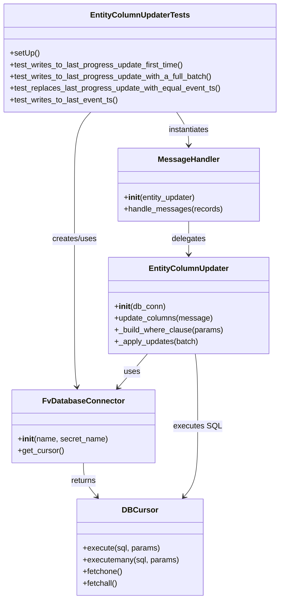
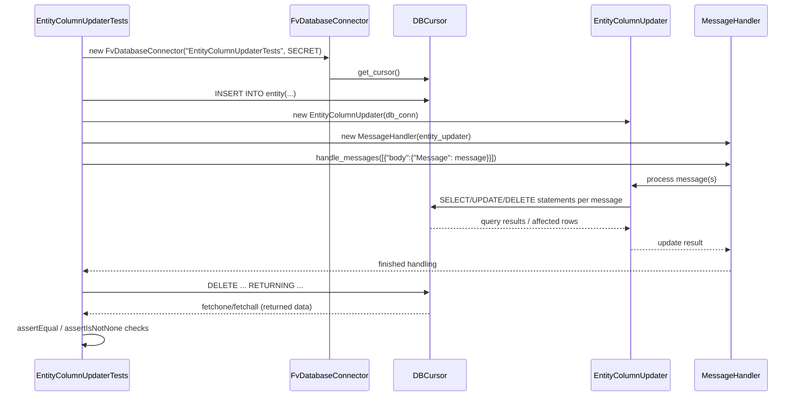

# Diagram: entity_core/watcher_service/watcher_service_tests/update_last_entity_columns_tests/test_entity_column_updater.py

> Auto-generated by Obscura crawlers

## Diagram 1

### SVG

<svg id="container" width="573.3046875" xmlns="http://www.w3.org/2000/svg" class="classDiagram" height="1230" viewBox="0 0 573.3046875 1230" role="graphics-document document" aria-roledescription="class"><g><defs><marker id="container_class-aggregationStart" class="marker aggregation class" refX="18" refY="7" markerWidth="190" markerHeight="240" orient="auto"><path d="M 18,7 L9,13 L1,7 L9,1 Z"></path></marker></defs><defs><marker id="container_class-aggregationEnd" class="marker aggregation class" refX="1" refY="7" markerWidth="20" markerHeight="28" orient="auto"><path d="M 18,7 L9,13 L1,7 L9,1 Z"></path></marker></defs><defs><marker id="container_class-extensionStart" class="marker extension class" refX="18" refY="7" markerWidth="190" markerHeight="240" orient="auto"><path d="M 1,7 L18,13 V 1 Z"></path></marker></defs><defs><marker id="container_class-extensionEnd" class="marker extension class" refX="1" refY="7" markerWidth="20" markerHeight="28" orient="auto"><path d="M 1,1 V 13 L18,7 Z"></path></marker></defs><defs><marker id="container_class-compositionStart" class="marker composition class" refX="18" refY="7" markerWidth="190" markerHeight="240" orient="auto"><path d="M 18,7 L9,13 L1,7 L9,1 Z"></path></marker></defs><defs><marker id="container_class-compositionEnd" class="marker composition class" refX="1" refY="7" markerWidth="20" markerHeight="28" orient="auto"><path d="M 18,7 L9,13 L1,7 L9,1 Z"></path></marker></defs><defs><marker id="container_class-dependencyStart" class="marker dependency class" refX="6" refY="7" markerWidth="190" markerHeight="240" orient="auto"><path d="M 5,7 L9,13 L1,7 L9,1 Z"></path></marker></defs><defs><marker id="container_class-dependencyEnd" class="marker dependency class" refX="13" refY="7" markerWidth="20" markerHeight="28" orient="auto"><path d="M 18,7 L9,13 L14,7 L9,1 Z"></path></marker></defs><defs><marker id="container_class-lollipopStart" class="marker lollipop class" refX="13" refY="7" markerWidth="190" markerHeight="240" orient="auto"><circle stroke="black" fill="transparent" cx="7" cy="7" r="6"></circle></marker></defs><defs><marker id="container_class-lollipopEnd" class="marker lollipop class" refX="1" refY="7" markerWidth="190" markerHeight="240" orient="auto"><circle stroke="black" fill="transparent" cx="7" cy="7" r="6"></circle></marker></defs><g class="root"><g class="clusters"></g><g class="edgePaths"><path d="M173.443,950L173.443,956.167C173.443,962.333,173.443,974.667,177.937,986.231C182.43,997.796,191.417,1008.592,195.911,1013.99L200.404,1019.389" id="id_FvDatabaseConnector_DBCursor_1" class="edge-thickness-normal edge-pattern-solid relation" style=";;;" data-edge="true" data-et="edge" data-id="id_FvDatabaseConnector_DBCursor_1" data-points="W3sieCI6MTczLjQ0MzM1OTM3NSwieSI6OTUwfSx7IngiOjE3My40NDMzNTkzNzUsInkiOjk4N30seyJ4IjoyMDQuMjQyODYyNDc3MDIyMDcsInkiOjEwMjR9XQ==" marker-end="url(#container_class-dependencyEnd)"></path><path d="M188.061,230L182.584,236.167C177.106,242.333,166.152,254.667,160.675,279.5C155.197,304.333,155.197,341.667,155.197,379C155.197,416.333,155.197,453.667,155.197,495C155.197,536.333,155.197,581.667,155.197,627C155.197,672.333,155.197,717.667,156.041,745.513C156.885,773.359,158.573,783.719,159.416,788.898L160.26,794.078" id="id_EntityColumnUpdaterTests_FvDatabaseConnector_2" class="edge-thickness-normal edge-pattern-solid relation" style=";;;" data-edge="true" data-et="edge" data-id="id_EntityColumnUpdaterTests_FvDatabaseConnector_2" data-points="W3sieCI6MTg4LjA2MTAzNTE1NjI1LCJ5IjoyMzB9LHsieCI6MTU1LjE5NzI2NTYyNSwieSI6MjY3fSx7IngiOjE1NS4xOTcyNjU2MjUsInkiOjM3OX0seyJ4IjoxNTUuMTk3MjY1NjI1LCJ5Ijo0OTF9LHsieCI6MTU1LjE5NzI2NTYyNSwieSI6NjI3fSx7IngiOjE1NS4xOTcyNjU2MjUsInkiOjc2M30seyJ4IjoxNjEuMjI0OTkzMDI0NTUzNTgsInkiOjgwMH1d" marker-end="url(#container_class-dependencyEnd)"></path><path d="M360.722,230L364.837,236.167C368.952,242.333,377.182,254.667,381.297,266C385.412,277.333,385.412,287.667,385.412,292.833L385.412,298" id="id_EntityColumnUpdaterTests_MessageHandler_3" class="edge-thickness-normal edge-pattern-solid relation" style=";;;" data-edge="true" data-et="edge" data-id="id_EntityColumnUpdaterTests_MessageHandler_3" data-points="W3sieCI6MzYwLjcyMjE2Nzk2ODc1LCJ5IjoyMzB9LHsieCI6Mzg1LjQxMjEwOTM3NSwieSI6MjY3fSx7IngiOjM4NS40MTIxMDkzNzUsInkiOjMwNH1d" marker-end="url(#container_class-dependencyEnd)"></path><path d="M385.412,454L385.412,460.167C385.412,466.333,385.412,478.667,385.412,490C385.412,501.333,385.412,511.667,385.412,516.833L385.412,522" id="id_MessageHandler_EntityColumnUpdater_4" class="edge-thickness-normal edge-pattern-solid relation" style=";;;" data-edge="true" data-et="edge" data-id="id_MessageHandler_EntityColumnUpdater_4" data-points="W3sieCI6Mzg1LjQxMjEwOTM3NSwieSI6NDU0fSx7IngiOjM4NS40MTIxMDkzNzUsInkiOjQ5MX0seyJ4IjozODUuNDEyMTA5Mzc1LCJ5Ijo1Mjh9XQ==" marker-end="url(#container_class-dependencyEnd)"></path><path d="M303.003,726L297.869,732.167C292.736,738.333,282.47,750.667,272.56,762.25C262.651,773.833,253.098,784.666,248.322,790.083L243.545,795.5" id="id_EntityColumnUpdater_FvDatabaseConnector_5" class="edge-thickness-normal edge-pattern-solid relation" style=";;;" data-edge="true" data-et="edge" data-id="id_EntityColumnUpdater_FvDatabaseConnector_5" data-points="W3sieCI6MzAzLjAwMjYyODEwMjAyMjEsInkiOjcyNn0seyJ4IjoyNzIuMjAzMTI1LCJ5Ijo3NjN9LHsieCI6MjM5LjU3NzEzMDk5ODg4Mzk0LCJ5Ijo4MDB9XQ==" marker-end="url(#container_class-dependencyEnd)"></path><path d="M398.694,726L399.522,732.167C400.349,738.333,402.004,750.667,402.831,775.5C403.658,800.333,403.658,837.667,403.658,875C403.658,912.333,403.658,949.667,399.005,973.742C394.352,997.817,385.045,1008.634,380.392,1014.043L375.739,1019.452" id="id_EntityColumnUpdater_DBCursor_6" class="edge-thickness-normal edge-pattern-solid relation" style=";;;" data-edge="true" data-et="edge" data-id="id_EntityColumnUpdater_DBCursor_6" data-points="W3sieCI6Mzk4LjY5NDE5MjMyNTM2NzYsInkiOjcyNn0seyJ4Ijo0MDMuNjU4MjAzMTI1LCJ5Ijo3NjN9LHsieCI6NDAzLjY1ODIwMzEyNSwieSI6ODc1fSx7IngiOjQwMy42NTgyMDMxMjUsInkiOjk4N30seyJ4IjozNzEuODI1NzI2Njc3Mzg5NywieSI6MTAyNH1d" marker-end="url(#container_class-dependencyEnd)"></path></g><g class="edgeLabels"><g class="edgeLabel" transform="translate(173.443359375, 987)"><g class="label" data-id="id_FvDatabaseConnector_DBCursor_1" transform="translate(-26.265625, -12)"><foreignObject width="52.53125" height="24">

returns

</foreignObject></g></g><g class="edgeLabel" transform="translate(155.197265625, 491)"><g class="label" data-id="id_EntityColumnUpdaterTests_FvDatabaseConnector_2" transform="translate(-46.578125, -12)"><foreignObject width="93.15625" height="24">

creates/uses

</foreignObject></g></g><g class="edgeLabel" transform="translate(385.412109375, 267)"><g class="label" data-id="id_EntityColumnUpdaterTests_MessageHandler_3" transform="translate(-42.9140625, -12)"><foreignObject width="85.828125" height="24">

instantiates

</foreignObject></g></g><g class="edgeLabel" transform="translate(385.412109375, 491)"><g class="label" data-id="id_MessageHandler_EntityColumnUpdater_4" transform="translate(-35.0390625, -12)"><foreignObject width="70.078125" height="24">

delegates

</foreignObject></g></g><g class="edgeLabel" transform="translate(271.8101, 763.44572)"><g class="label" data-id="id_EntityColumnUpdater_FvDatabaseConnector_5" transform="translate(-16.4921875, -12)"><foreignObject width="32.984375" height="24">

uses

</foreignObject></g></g><g class="edgeLabel" transform="translate(403.658203125, 875)"><g class="label" data-id="id_EntityColumnUpdater_DBCursor_6" transform="translate(-47.71875, -12)"><foreignObject width="95.4375" height="24">

executes SQL

</foreignObject></g></g></g><g class="nodes"><g class="node default" id="classId-EntityColumnUpdater-0" transform="translate(385.412109375, 627)"><g class="basic label-container"><path d="M-162.51953125 -99 L162.51953125 -99 L162.51953125 99 L-162.51953125 99" stroke="none" stroke-width="0" fill="#ECECFF" style=""></path><path d="M-162.51953125 -99 C-95.3643004988602 -99, -28.209069747720406 -99, 162.51953125 -99 M-162.51953125 -99 C-58.79297733267319 -99, 44.93357658465362 -99, 162.51953125 -99 M162.51953125 -99 C162.51953125 -32.14694544096251, 162.51953125 34.70610911807498, 162.51953125 99 M162.51953125 -99 C162.51953125 -25.71523879076348, 162.51953125 47.56952241847304, 162.51953125 99 M162.51953125 99 C41.3826968920587 99, -79.7541374658826 99, -162.51953125 99 M162.51953125 99 C85.57108261036578 99, 8.622633970731556 99, -162.51953125 99 M-162.51953125 99 C-162.51953125 48.919375895249345, -162.51953125 -1.1612482095013092, -162.51953125 -99 M-162.51953125 99 C-162.51953125 54.8417554509117, -162.51953125 10.683510901823396, -162.51953125 -99" stroke="#9370DB" stroke-width="1.3" fill="none" stroke-dasharray="0 0" style=""></path></g><g class="annotation-group text" transform="translate(0, -75)"></g><g class="label-group text" transform="translate(-78.4609375, -75)"><g class="label" style="font-weight: bolder" transform="translate(0,-12)"><foreignObject width="156.921875" height="24">

EntityColumnUpdater

</foreignObject></g></g><g class="members-group text" transform="translate(-150.51953125, -27)"></g><g class="methods-group text" transform="translate(-150.51953125, 3)"><g class="label" style="" transform="translate(0,-12)"><foreignObject width="104.96875" height="24">

+<strong>init</strong>(db_conn)

</foreignObject></g><g class="label" style="" transform="translate(0,12)"><foreignObject width="201" height="24">

+update_columns(message)

</foreignObject></g><g class="label" style="" transform="translate(0,36)"><foreignObject width="222.578125" height="24">

+_build_where_clause(params)

</foreignObject></g><g class="label" style="" transform="translate(0,60)"><foreignObject width="172.140625" height="24">

+_apply_updates(batch)

</foreignObject></g></g><g class="divider" style=""><path d="M-162.51953125 -51 C-83.35539286795645 -51, -4.191254485912907 -51, 162.51953125 -51 M-162.51953125 -51 C-95.66543346677447 -51, -28.811335683548947 -51, 162.51953125 -51" stroke="#9370DB" stroke-width="1.3" fill="none" stroke-dasharray="0 0" style=""></path></g><g class="divider" style=""><path d="M-162.51953125 -27 C-64.36443441717329 -27, 33.79066241565343 -27, 162.51953125 -27 M-162.51953125 -27 C-72.61365381722437 -27, 17.29222361555125 -27, 162.51953125 -27" stroke="#9370DB" stroke-width="1.3" fill="none" stroke-dasharray="0 0" style=""></path></g></g><g class="node default" id="classId-MessageHandler-1" transform="translate(385.412109375, 379)"><g class="basic label-container"><path d="M-142.3671875 -75 L142.3671875 -75 L142.3671875 75 L-142.3671875 75" stroke="none" stroke-width="0" fill="#ECECFF" style=""></path><path d="M-142.3671875 -75 C-48.56731090267766 -75, 45.23256569464468 -75, 142.3671875 -75 M-142.3671875 -75 C-43.69901587156207 -75, 54.969155756875864 -75, 142.3671875 -75 M142.3671875 -75 C142.3671875 -28.45499435284888, 142.3671875 18.090011294302244, 142.3671875 75 M142.3671875 -75 C142.3671875 -36.37822066512635, 142.3671875 2.2435586697473013, 142.3671875 75 M142.3671875 75 C60.01437210688141 75, -22.33844328623718 75, -142.3671875 75 M142.3671875 75 C43.056226152415476 75, -56.25473519516905 75, -142.3671875 75 M-142.3671875 75 C-142.3671875 26.64014478710402, -142.3671875 -21.71971042579196, -142.3671875 -75 M-142.3671875 75 C-142.3671875 26.031958742046392, -142.3671875 -22.936082515907216, -142.3671875 -75" stroke="#9370DB" stroke-width="1.3" fill="none" stroke-dasharray="0 0" style=""></path></g><g class="annotation-group text" transform="translate(0, -51)"></g><g class="label-group text" transform="translate(-60.34375, -51)"><g class="label" style="font-weight: bolder" transform="translate(0,-12)"><foreignObject width="120.6875" height="24">

MessageHandler

</foreignObject></g></g><g class="members-group text" transform="translate(-130.3671875, -3)"></g><g class="methods-group text" transform="translate(-130.3671875, 27)"><g class="label" style="" transform="translate(0,-12)"><foreignObject width="149.796875" height="24">

+<strong>init</strong>(entity_updater)

</foreignObject></g><g class="label" style="" transform="translate(0,12)"><foreignObject width="200.390625" height="24">

+handle_messages(records)

</foreignObject></g></g><g class="divider" style=""><path d="M-142.3671875 -27 C-77.66761745741853 -27, -12.96804741483706 -27, 142.3671875 -27 M-142.3671875 -27 C-71.79085400159441 -27, -1.2145205031888224 -27, 142.3671875 -27" stroke="#9370DB" stroke-width="1.3" fill="none" stroke-dasharray="0 0" style=""></path></g><g class="divider" style=""><path d="M-142.3671875 -3 C-76.21812342516205 -3, -10.069059350324096 -3, 142.3671875 -3 M-142.3671875 -3 C-81.06383474535409 -3, -19.760481990708186 -3, 142.3671875 -3" stroke="#9370DB" stroke-width="1.3" fill="none" stroke-dasharray="0 0" style=""></path></g></g><g class="node default" id="classId-FvDatabaseConnector-2" transform="translate(173.443359375, 875)"><g class="basic label-container"><path d="M-143.69921875 -75 L143.69921875 -75 L143.69921875 75 L-143.69921875 75" stroke="none" stroke-width="0" fill="#ECECFF" style=""></path><path d="M-143.69921875 -75 C-34.97917680934661 -75, 73.74086513130678 -75, 143.69921875 -75 M-143.69921875 -75 C-31.890099191041685 -75, 79.91902036791663 -75, 143.69921875 -75 M143.69921875 -75 C143.69921875 -36.90248523592712, 143.69921875 1.195029528145767, 143.69921875 75 M143.69921875 -75 C143.69921875 -16.248777775762726, 143.69921875 42.50244444847455, 143.69921875 75 M143.69921875 75 C31.65334348841735 75, -80.3925317731653 75, -143.69921875 75 M143.69921875 75 C74.87165437376225 75, 6.044089997524509 75, -143.69921875 75 M-143.69921875 75 C-143.69921875 18.355845574179476, -143.69921875 -38.28830885164105, -143.69921875 -75 M-143.69921875 75 C-143.69921875 31.639378065124788, -143.69921875 -11.721243869750424, -143.69921875 -75" stroke="#9370DB" stroke-width="1.3" fill="none" stroke-dasharray="0 0" style=""></path></g><g class="annotation-group text" transform="translate(0, -51)"></g><g class="label-group text" transform="translate(-79.3046875, -51)"><g class="label" style="font-weight: bolder" transform="translate(0,-12)"><foreignObject width="158.609375" height="24">

FvDatabaseConnector

</foreignObject></g></g><g class="members-group text" transform="translate(-131.69921875, -3)"></g><g class="methods-group text" transform="translate(-131.69921875, 27)"><g class="label" style="" transform="translate(0,-12)"><foreignObject width="184.09375" height="24">

+<strong>init</strong>(name, secret_name)

</foreignObject></g><g class="label" style="" transform="translate(0,12)"><foreignObject width="94.640625" height="24">

+get_cursor()

</foreignObject></g></g><g class="divider" style=""><path d="M-143.69921875 -27 C-65.95037637603245 -27, 11.798465997935097 -27, 143.69921875 -27 M-143.69921875 -27 C-81.73116799656252 -27, -19.763117243125038 -27, 143.69921875 -27" stroke="#9370DB" stroke-width="1.3" fill="none" stroke-dasharray="0 0" style=""></path></g><g class="divider" style=""><path d="M-143.69921875 -3 C-54.94433778737485 -3, 33.8105431752503 -3, 143.69921875 -3 M-143.69921875 -3 C-37.38354488285057 -3, 68.93212898429886 -3, 143.69921875 -3" stroke="#9370DB" stroke-width="1.3" fill="none" stroke-dasharray="0 0" style=""></path></g></g><g class="node default" id="classId-DBCursor-3" transform="translate(286.65234375, 1123)"><g class="basic label-container"><path d="M-127.67578125 -99 L127.67578125 -99 L127.67578125 99 L-127.67578125 99" stroke="none" stroke-width="0" fill="#ECECFF" style=""></path><path d="M-127.67578125 -99 C-31.699364697755456 -99, 64.27705185448909 -99, 127.67578125 -99 M-127.67578125 -99 C-74.44868362551458 -99, -21.221586001029166 -99, 127.67578125 -99 M127.67578125 -99 C127.67578125 -24.08374912971226, 127.67578125 50.83250174057548, 127.67578125 99 M127.67578125 -99 C127.67578125 -23.860073757563583, 127.67578125 51.27985248487283, 127.67578125 99 M127.67578125 99 C48.576557085582905 99, -30.52266707883419 99, -127.67578125 99 M127.67578125 99 C56.87995263255881 99, -13.915875984882376 99, -127.67578125 99 M-127.67578125 99 C-127.67578125 46.728959239247565, -127.67578125 -5.542081521504869, -127.67578125 -99 M-127.67578125 99 C-127.67578125 37.95996478863718, -127.67578125 -23.08007042272564, -127.67578125 -99" stroke="#9370DB" stroke-width="1.3" fill="none" stroke-dasharray="0 0" style=""></path></g><g class="annotation-group text" transform="translate(0, -75)"></g><g class="label-group text" transform="translate(-34.0546875, -75)"><g class="label" style="font-weight: bolder" transform="translate(0,-12)"><foreignObject width="68.109375" height="24">

DBCursor

</foreignObject></g></g><g class="members-group text" transform="translate(-115.67578125, -27)"></g><g class="methods-group text" transform="translate(-115.67578125, 3)"><g class="label" style="" transform="translate(0,-12)"><foreignObject width="157.75" height="24">

+execute(sql, params)

</foreignObject></g><g class="label" style="" transform="translate(0,12)"><foreignObject width="197.296875" height="24">

+executemany(sql, params)

</foreignObject></g><g class="label" style="" transform="translate(0,36)"><foreignObject width="82.046875" height="24">

+fetchone()

</foreignObject></g><g class="label" style="" transform="translate(0,60)"><foreignObject width="72.515625" height="24">

+fetchall()

</foreignObject></g></g><g class="divider" style=""><path d="M-127.67578125 -51 C-37.60899269840361 -51, 52.45779585319278 -51, 127.67578125 -51 M-127.67578125 -51 C-72.86428585369788 -51, -18.05279045739576 -51, 127.67578125 -51" stroke="#9370DB" stroke-width="1.3" fill="none" stroke-dasharray="0 0" style=""></path></g><g class="divider" style=""><path d="M-127.67578125 -27 C-33.78874493070505 -27, 60.0982913885899 -27, 127.67578125 -27 M-127.67578125 -27 C-26.056907536330527 -27, 75.56196617733895 -27, 127.67578125 -27" stroke="#9370DB" stroke-width="1.3" fill="none" stroke-dasharray="0 0" style=""></path></g></g><g class="node default" id="classId-EntityColumnUpdaterTests-4" transform="translate(286.65234375, 119)"><g class="basic label-container"><path d="M-278.65234375 -111 L278.65234375 -111 L278.65234375 111 L-278.65234375 111" stroke="none" stroke-width="0" fill="#ECECFF" style=""></path><path d="M-278.65234375 -111 C-91.52445771883862 -111, 95.60342831232276 -111, 278.65234375 -111 M-278.65234375 -111 C-109.09772578606342 -111, 60.45689217787316 -111, 278.65234375 -111 M278.65234375 -111 C278.65234375 -30.163934099889147, 278.65234375 50.672131800221706, 278.65234375 111 M278.65234375 -111 C278.65234375 -52.29939470357915, 278.65234375 6.401210592841693, 278.65234375 111 M278.65234375 111 C135.64164860933306 111, -7.369046531333879 111, -278.65234375 111 M278.65234375 111 C159.55836491364204 111, 40.464386077284075 111, -278.65234375 111 M-278.65234375 111 C-278.65234375 44.23484685135449, -278.65234375 -22.53030629729102, -278.65234375 -111 M-278.65234375 111 C-278.65234375 55.64444079266407, -278.65234375 0.28888158532814145, -278.65234375 -111" stroke="#9370DB" stroke-width="1.3" fill="none" stroke-dasharray="0 0" style=""></path></g><g class="annotation-group text" transform="translate(0, -87)"></g><g class="label-group text" transform="translate(-97.5703125, -87)"><g class="label" style="font-weight: bolder" transform="translate(0,-12)"><foreignObject width="195.140625" height="24">

EntityColumnUpdaterTests

</foreignObject></g></g><g class="members-group text" transform="translate(-266.65234375, -39)"></g><g class="methods-group text" transform="translate(-266.65234375, -9)"><g class="label" style="" transform="translate(0,-12)"><foreignObject width="60.421875" height="24">

+setUp()

</foreignObject></g><g class="label" style="" transform="translate(0,12)"><foreignObject width="360.671875" height="24">

+test_writes_to_last_progress_update_first_time()

</foreignObject></g><g class="label" style="" transform="translate(0,36)"><foreignObject width="420.375" height="24">

+test_writes_to_last_progress_update_with_a_full_batch()

</foreignObject></g><g class="label" style="" transform="translate(0,60)"><foreignObject width="435.734375" height="24">

+test_replaces_last_progress_update_with_equal_event_ts()

</foreignObject></g><g class="label" style="" transform="translate(0,84)"><foreignObject width="224.0625" height="24">

+test_writes_to_last_event_ts()

</foreignObject></g></g><g class="divider" style=""><path d="M-278.65234375 -63 C-117.34231152851294 -63, 43.967720692974126 -63, 278.65234375 -63 M-278.65234375 -63 C-62.51957925374188 -63, 153.61318524251624 -63, 278.65234375 -63" stroke="#9370DB" stroke-width="1.3" fill="none" stroke-dasharray="0 0" style=""></path></g><g class="divider" style=""><path d="M-278.65234375 -39 C-110.27746144515652 -39, 58.09742085968696 -39, 278.65234375 -39 M-278.65234375 -39 C-155.63524803464603 -39, -32.61815231929205 -39, 278.65234375 -39" stroke="#9370DB" stroke-width="1.3" fill="none" stroke-dasharray="0 0" style=""></path></g></g></g></g></g></svg>

## Diagram 2

### SVG

<svg id="container" width="1698" xmlns="http://www.w3.org/2000/svg" height="873" viewBox="-80.5 -10 1698 873" role="graphics-document document" aria-roledescription="sequence"><g><rect x="1417.5" y="787" fill="#eaeaea" stroke="#666" width="150" height="65" name="Handler" rx="3" ry="3" class="actor actor-bottom"></rect><text x="1492.5" y="819.5" dominant-baseline="central" alignment-baseline="central" class="actor actor-box" style="text-anchor: middle; font-size: 16px; font-weight: 400;"><tspan x="1492.5" dy="0">MessageHandler</tspan></text></g><g><rect x="1191.5" y="787" fill="#eaeaea" stroke="#666" width="176" height="65" name="Updater" rx="3" ry="3" class="actor actor-bottom"></rect><text x="1279.5" y="819.5" dominant-baseline="central" alignment-baseline="central" class="actor actor-box" style="text-anchor: middle; font-size: 16px; font-weight: 400;"><tspan x="1279.5" dy="0">EntityColumnUpdater</tspan></text></g><g><rect x="779.5" y="787" fill="#eaeaea" stroke="#666" width="150" height="65" name="Cursor" rx="3" ry="3" class="actor actor-bottom"></rect><text x="854.5" y="819.5" dominant-baseline="central" alignment-baseline="central" class="actor actor-box" style="text-anchor: middle; font-size: 16px; font-weight: 400;"><tspan x="854.5" dy="0">DBCursor</tspan></text></g><g><rect x="552.5" y="787" fill="#eaeaea" stroke="#666" width="177" height="65" name="DB" rx="3" ry="3" class="actor actor-bottom"></rect><text x="641" y="819.5" dominant-baseline="central" alignment-baseline="central" class="actor actor-box" style="text-anchor: middle; font-size: 16px; font-weight: 400;"><tspan x="641" dy="0">FvDatabaseConnector</tspan></text></g><g><rect x="0" y="787" fill="#eaeaea" stroke="#666" width="212" height="65" name="Test" rx="3" ry="3" class="actor actor-bottom"></rect><text x="106" y="819.5" dominant-baseline="central" alignment-baseline="central" class="actor actor-box" style="text-anchor: middle; font-size: 16px; font-weight: 400;"><tspan x="106" dy="0">EntityColumnUpdaterTests</tspan></text></g><g><line id="actor4" x1="1492.5" y1="65" x2="1492.5" y2="787" class="actor-line 200" stroke-width="0.5px" stroke="#999" name="Handler"></line><g id="root-4"><rect x="1417.5" y="0" fill="#eaeaea" stroke="#666" width="150" height="65" name="Handler" rx="3" ry="3" class="actor actor-top"></rect><text x="1492.5" y="32.5" dominant-baseline="central" alignment-baseline="central" class="actor actor-box" style="text-anchor: middle; font-size: 16px; font-weight: 400;"><tspan x="1492.5" dy="0">MessageHandler</tspan></text></g></g><g><line id="actor3" x1="1279.5" y1="65" x2="1279.5" y2="787" class="actor-line 200" stroke-width="0.5px" stroke="#999" name="Updater"></line><g id="root-3"><rect x="1191.5" y="0" fill="#eaeaea" stroke="#666" width="176" height="65" name="Updater" rx="3" ry="3" class="actor actor-top"></rect><text x="1279.5" y="32.5" dominant-baseline="central" alignment-baseline="central" class="actor actor-box" style="text-anchor: middle; font-size: 16px; font-weight: 400;"><tspan x="1279.5" dy="0">EntityColumnUpdater</tspan></text></g></g><g><line id="actor2" x1="854.5" y1="65" x2="854.5" y2="787" class="actor-line 200" stroke-width="0.5px" stroke="#999" name="Cursor"></line><g id="root-2"><rect x="779.5" y="0" fill="#eaeaea" stroke="#666" width="150" height="65" name="Cursor" rx="3" ry="3" class="actor actor-top"></rect><text x="854.5" y="32.5" dominant-baseline="central" alignment-baseline="central" class="actor actor-box" style="text-anchor: middle; font-size: 16px; font-weight: 400;"><tspan x="854.5" dy="0">DBCursor</tspan></text></g></g><g><line id="actor1" x1="641" y1="65" x2="641" y2="787" class="actor-line 200" stroke-width="0.5px" stroke="#999" name="DB"></line><g id="root-1"><rect x="552.5" y="0" fill="#eaeaea" stroke="#666" width="177" height="65" name="DB" rx="3" ry="3" class="actor actor-top"></rect><text x="641" y="32.5" dominant-baseline="central" alignment-baseline="central" class="actor actor-box" style="text-anchor: middle; font-size: 16px; font-weight: 400;"><tspan x="641" dy="0">FvDatabaseConnector</tspan></text></g></g><g><line id="actor0" x1="106" y1="65" x2="106" y2="787" class="actor-line 200" stroke-width="0.5px" stroke="#999" name="Test"></line><g id="root-0"><rect x="0" y="0" fill="#eaeaea" stroke="#666" width="212" height="65" name="Test" rx="3" ry="3" class="actor actor-top"></rect><text x="106" y="32.5" dominant-baseline="central" alignment-baseline="central" class="actor actor-box" style="text-anchor: middle; font-size: 16px; font-weight: 400;"><tspan x="106" dy="0">EntityColumnUpdaterTests</tspan></text></g></g><g></g><defs><symbol id="computer" width="24" height="24"><path transform="scale(.5)" d="M2 2v13h20v-13h-20zm18 11h-16v-9h16v9zm-10.228 6l.466-1h3.524l.467 1h-4.457zm14.228 3h-24l2-6h2.104l-1.33 4h18.45l-1.297-4h2.073l2 6zm-5-10h-14v-7h14v7z"></path></symbol></defs><defs><symbol id="database" fill-rule="evenodd" clip-rule="evenodd"><path transform="scale(.5)" d="M12.258.001l.256.004.255.005.253.008.251.01.249.012.247.015.246.016.242.019.241.02.239.023.236.024.233.027.231.028.229.031.225.032.223.034.22.036.217.038.214.04.211.041.208.043.205.045.201.046.198.048.194.05.191.051.187.053.183.054.18.056.175.057.172.059.168.06.163.061.16.063.155.064.15.066.074.033.073.033.071.034.07.034.069.035.068.035.067.035.066.035.064.036.064.036.062.036.06.036.06.037.058.037.058.037.055.038.055.038.053.038.052.038.051.039.05.039.048.039.047.039.045.04.044.04.043.04.041.04.04.041.039.041.037.041.036.041.034.041.033.042.032.042.03.042.029.042.027.042.026.043.024.043.023.043.021.043.02.043.018.044.017.043.015.044.013.044.012.044.011.045.009.044.007.045.006.045.004.045.002.045.001.045v17l-.001.045-.002.045-.004.045-.006.045-.007.045-.009.044-.011.045-.012.044-.013.044-.015.044-.017.043-.018.044-.02.043-.021.043-.023.043-.024.043-.026.043-.027.042-.029.042-.03.042-.032.042-.033.042-.034.041-.036.041-.037.041-.039.041-.04.041-.041.04-.043.04-.044.04-.045.04-.047.039-.048.039-.05.039-.051.039-.052.038-.053.038-.055.038-.055.038-.058.037-.058.037-.06.037-.06.036-.062.036-.064.036-.064.036-.066.035-.067.035-.068.035-.069.035-.07.034-.071.034-.073.033-.074.033-.15.066-.155.064-.16.063-.163.061-.168.06-.172.059-.175.057-.18.056-.183.054-.187.053-.191.051-.194.05-.198.048-.201.046-.205.045-.208.043-.211.041-.214.04-.217.038-.22.036-.223.034-.225.032-.229.031-.231.028-.233.027-.236.024-.239.023-.241.02-.242.019-.246.016-.247.015-.249.012-.251.01-.253.008-.255.005-.256.004-.258.001-.258-.001-.256-.004-.255-.005-.253-.008-.251-.01-.249-.012-.247-.015-.245-.016-.243-.019-.241-.02-.238-.023-.236-.024-.234-.027-.231-.028-.228-.031-.226-.032-.223-.034-.22-.036-.217-.038-.214-.04-.211-.041-.208-.043-.204-.045-.201-.046-.198-.048-.195-.05-.19-.051-.187-.053-.184-.054-.179-.056-.176-.057-.172-.059-.167-.06-.164-.061-.159-.063-.155-.064-.151-.066-.074-.033-.072-.033-.072-.034-.07-.034-.069-.035-.068-.035-.067-.035-.066-.035-.064-.036-.063-.036-.062-.036-.061-.036-.06-.037-.058-.037-.057-.037-.056-.038-.055-.038-.053-.038-.052-.038-.051-.039-.049-.039-.049-.039-.046-.039-.046-.04-.044-.04-.043-.04-.041-.04-.04-.041-.039-.041-.037-.041-.036-.041-.034-.041-.033-.042-.032-.042-.03-.042-.029-.042-.027-.042-.026-.043-.024-.043-.023-.043-.021-.043-.02-.043-.018-.044-.017-.043-.015-.044-.013-.044-.012-.044-.011-.045-.009-.044-.007-.045-.006-.045-.004-.045-.002-.045-.001-.045v-17l.001-.045.002-.045.004-.045.006-.045.007-.045.009-.044.011-.045.012-.044.013-.044.015-.044.017-.043.018-.044.02-.043.021-.043.023-.043.024-.043.026-.043.027-.042.029-.042.03-.042.032-.042.033-.042.034-.041.036-.041.037-.041.039-.041.04-.041.041-.04.043-.04.044-.04.046-.04.046-.039.049-.039.049-.039.051-.039.052-.038.053-.038.055-.038.056-.038.057-.037.058-.037.06-.037.061-.036.062-.036.063-.036.064-.036.066-.035.067-.035.068-.035.069-.035.07-.034.072-.034.072-.033.074-.033.151-.066.155-.064.159-.063.164-.061.167-.06.172-.059.176-.057.179-.056.184-.054.187-.053.19-.051.195-.05.198-.048.201-.046.204-.045.208-.043.211-.041.214-.04.217-.038.22-.036.223-.034.226-.032.228-.031.231-.028.234-.027.236-.024.238-.023.241-.02.243-.019.245-.016.247-.015.249-.012.251-.01.253-.008.255-.005.256-.004.258-.001.258.001zm-9.258 20.499v.01l.001.021.003.021.004.022.005.021.006.022.007.022.009.023.01.022.011.023.012.023.013.023.015.023.016.024.017.023.018.024.019.024.021.024.022.025.023.024.024.025.052.049.056.05.061.051.066.051.07.051.075.051.079.052.084.052.088.052.092.052.097.052.102.051.105.052.11.052.114.051.119.051.123.051.127.05.131.05.135.05.139.048.144.049.147.047.152.047.155.047.16.045.163.045.167.043.171.043.176.041.178.041.183.039.187.039.19.037.194.035.197.035.202.033.204.031.209.03.212.029.216.027.219.025.222.024.226.021.23.02.233.018.236.016.24.015.243.012.246.01.249.008.253.005.256.004.259.001.26-.001.257-.004.254-.005.25-.008.247-.011.244-.012.241-.014.237-.016.233-.018.231-.021.226-.021.224-.024.22-.026.216-.027.212-.028.21-.031.205-.031.202-.034.198-.034.194-.036.191-.037.187-.039.183-.04.179-.04.175-.042.172-.043.168-.044.163-.045.16-.046.155-.046.152-.047.148-.048.143-.049.139-.049.136-.05.131-.05.126-.05.123-.051.118-.052.114-.051.11-.052.106-.052.101-.052.096-.052.092-.052.088-.053.083-.051.079-.052.074-.052.07-.051.065-.051.06-.051.056-.05.051-.05.023-.024.023-.025.021-.024.02-.024.019-.024.018-.024.017-.024.015-.023.014-.024.013-.023.012-.023.01-.023.01-.022.008-.022.006-.022.006-.022.004-.022.004-.021.001-.021.001-.021v-4.127l-.077.055-.08.053-.083.054-.085.053-.087.052-.09.052-.093.051-.095.05-.097.05-.1.049-.102.049-.105.048-.106.047-.109.047-.111.046-.114.045-.115.045-.118.044-.12.043-.122.042-.124.042-.126.041-.128.04-.13.04-.132.038-.134.038-.135.037-.138.037-.139.035-.142.035-.143.034-.144.033-.147.032-.148.031-.15.03-.151.03-.153.029-.154.027-.156.027-.158.026-.159.025-.161.024-.162.023-.163.022-.165.021-.166.02-.167.019-.169.018-.169.017-.171.016-.173.015-.173.014-.175.013-.175.012-.177.011-.178.01-.179.008-.179.008-.181.006-.182.005-.182.004-.184.003-.184.002h-.37l-.184-.002-.184-.003-.182-.004-.182-.005-.181-.006-.179-.008-.179-.008-.178-.01-.176-.011-.176-.012-.175-.013-.173-.014-.172-.015-.171-.016-.17-.017-.169-.018-.167-.019-.166-.02-.165-.021-.163-.022-.162-.023-.161-.024-.159-.025-.157-.026-.156-.027-.155-.027-.153-.029-.151-.03-.15-.03-.148-.031-.146-.032-.145-.033-.143-.034-.141-.035-.14-.035-.137-.037-.136-.037-.134-.038-.132-.038-.13-.04-.128-.04-.126-.041-.124-.042-.122-.042-.12-.044-.117-.043-.116-.045-.113-.045-.112-.046-.109-.047-.106-.047-.105-.048-.102-.049-.1-.049-.097-.05-.095-.05-.093-.052-.09-.051-.087-.052-.085-.053-.083-.054-.08-.054-.077-.054v4.127zm0-5.654v.011l.001.021.003.021.004.021.005.022.006.022.007.022.009.022.01.022.011.023.012.023.013.023.015.024.016.023.017.024.018.024.019.024.021.024.022.024.023.025.024.024.052.05.056.05.061.05.066.051.07.051.075.052.079.051.084.052.088.052.092.052.097.052.102.052.105.052.11.051.114.051.119.052.123.05.127.051.131.05.135.049.139.049.144.048.147.048.152.047.155.046.16.045.163.045.167.044.171.042.176.042.178.04.183.04.187.038.19.037.194.036.197.034.202.033.204.032.209.03.212.028.216.027.219.025.222.024.226.022.23.02.233.018.236.016.24.014.243.012.246.01.249.008.253.006.256.003.259.001.26-.001.257-.003.254-.006.25-.008.247-.01.244-.012.241-.015.237-.016.233-.018.231-.02.226-.022.224-.024.22-.025.216-.027.212-.029.21-.03.205-.032.202-.033.198-.035.194-.036.191-.037.187-.039.183-.039.179-.041.175-.042.172-.043.168-.044.163-.045.16-.045.155-.047.152-.047.148-.048.143-.048.139-.05.136-.049.131-.05.126-.051.123-.051.118-.051.114-.052.11-.052.106-.052.101-.052.096-.052.092-.052.088-.052.083-.052.079-.052.074-.051.07-.052.065-.051.06-.05.056-.051.051-.049.023-.025.023-.024.021-.025.02-.024.019-.024.018-.024.017-.024.015-.023.014-.023.013-.024.012-.022.01-.023.01-.023.008-.022.006-.022.006-.022.004-.021.004-.022.001-.021.001-.021v-4.139l-.077.054-.08.054-.083.054-.085.052-.087.053-.09.051-.093.051-.095.051-.097.05-.1.049-.102.049-.105.048-.106.047-.109.047-.111.046-.114.045-.115.044-.118.044-.12.044-.122.042-.124.042-.126.041-.128.04-.13.039-.132.039-.134.038-.135.037-.138.036-.139.036-.142.035-.143.033-.144.033-.147.033-.148.031-.15.03-.151.03-.153.028-.154.028-.156.027-.158.026-.159.025-.161.024-.162.023-.163.022-.165.021-.166.02-.167.019-.169.018-.169.017-.171.016-.173.015-.173.014-.175.013-.175.012-.177.011-.178.009-.179.009-.179.007-.181.007-.182.005-.182.004-.184.003-.184.002h-.37l-.184-.002-.184-.003-.182-.004-.182-.005-.181-.007-.179-.007-.179-.009-.178-.009-.176-.011-.176-.012-.175-.013-.173-.014-.172-.015-.171-.016-.17-.017-.169-.018-.167-.019-.166-.02-.165-.021-.163-.022-.162-.023-.161-.024-.159-.025-.157-.026-.156-.027-.155-.028-.153-.028-.151-.03-.15-.03-.148-.031-.146-.033-.145-.033-.143-.033-.141-.035-.14-.036-.137-.036-.136-.037-.134-.038-.132-.039-.13-.039-.128-.04-.126-.041-.124-.042-.122-.043-.12-.043-.117-.044-.116-.044-.113-.046-.112-.046-.109-.046-.106-.047-.105-.048-.102-.049-.1-.049-.097-.05-.095-.051-.093-.051-.09-.051-.087-.053-.085-.052-.083-.054-.08-.054-.077-.054v4.139zm0-5.666v.011l.001.02.003.022.004.021.005.022.006.021.007.022.009.023.01.022.011.023.012.023.013.023.015.023.016.024.017.024.018.023.019.024.021.025.022.024.023.024.024.025.052.05.056.05.061.05.066.051.07.051.075.052.079.051.084.052.088.052.092.052.097.052.102.052.105.051.11.052.114.051.119.051.123.051.127.05.131.05.135.05.139.049.144.048.147.048.152.047.155.046.16.045.163.045.167.043.171.043.176.042.178.04.183.04.187.038.19.037.194.036.197.034.202.033.204.032.209.03.212.028.216.027.219.025.222.024.226.021.23.02.233.018.236.017.24.014.243.012.246.01.249.008.253.006.256.003.259.001.26-.001.257-.003.254-.006.25-.008.247-.01.244-.013.241-.014.237-.016.233-.018.231-.02.226-.022.224-.024.22-.025.216-.027.212-.029.21-.03.205-.032.202-.033.198-.035.194-.036.191-.037.187-.039.183-.039.179-.041.175-.042.172-.043.168-.044.163-.045.16-.045.155-.047.152-.047.148-.048.143-.049.139-.049.136-.049.131-.051.126-.05.123-.051.118-.052.114-.051.11-.052.106-.052.101-.052.096-.052.092-.052.088-.052.083-.052.079-.052.074-.052.07-.051.065-.051.06-.051.056-.05.051-.049.023-.025.023-.025.021-.024.02-.024.019-.024.018-.024.017-.024.015-.023.014-.024.013-.023.012-.023.01-.022.01-.023.008-.022.006-.022.006-.022.004-.022.004-.021.001-.021.001-.021v-4.153l-.077.054-.08.054-.083.053-.085.053-.087.053-.09.051-.093.051-.095.051-.097.05-.1.049-.102.048-.105.048-.106.048-.109.046-.111.046-.114.046-.115.044-.118.044-.12.043-.122.043-.124.042-.126.041-.128.04-.13.039-.132.039-.134.038-.135.037-.138.036-.139.036-.142.034-.143.034-.144.033-.147.032-.148.032-.15.03-.151.03-.153.028-.154.028-.156.027-.158.026-.159.024-.161.024-.162.023-.163.023-.165.021-.166.02-.167.019-.169.018-.169.017-.171.016-.173.015-.173.014-.175.013-.175.012-.177.01-.178.01-.179.009-.179.007-.181.006-.182.006-.182.004-.184.003-.184.001-.185.001-.185-.001-.184-.001-.184-.003-.182-.004-.182-.006-.181-.006-.179-.007-.179-.009-.178-.01-.176-.01-.176-.012-.175-.013-.173-.014-.172-.015-.171-.016-.17-.017-.169-.018-.167-.019-.166-.02-.165-.021-.163-.023-.162-.023-.161-.024-.159-.024-.157-.026-.156-.027-.155-.028-.153-.028-.151-.03-.15-.03-.148-.032-.146-.032-.145-.033-.143-.034-.141-.034-.14-.036-.137-.036-.136-.037-.134-.038-.132-.039-.13-.039-.128-.041-.126-.041-.124-.041-.122-.043-.12-.043-.117-.044-.116-.044-.113-.046-.112-.046-.109-.046-.106-.048-.105-.048-.102-.048-.1-.05-.097-.049-.095-.051-.093-.051-.09-.052-.087-.052-.085-.053-.083-.053-.08-.054-.077-.054v4.153zm8.74-8.179l-.257.004-.254.005-.25.008-.247.011-.244.012-.241.014-.237.016-.233.018-.231.021-.226.022-.224.023-.22.026-.216.027-.212.028-.21.031-.205.032-.202.033-.198.034-.194.036-.191.038-.187.038-.183.04-.179.041-.175.042-.172.043-.168.043-.163.045-.16.046-.155.046-.152.048-.148.048-.143.048-.139.049-.136.05-.131.05-.126.051-.123.051-.118.051-.114.052-.11.052-.106.052-.101.052-.096.052-.092.052-.088.052-.083.052-.079.052-.074.051-.07.052-.065.051-.06.05-.056.05-.051.05-.023.025-.023.024-.021.024-.02.025-.019.024-.018.024-.017.023-.015.024-.014.023-.013.023-.012.023-.01.023-.01.022-.008.022-.006.023-.006.021-.004.022-.004.021-.001.021-.001.021.001.021.001.021.004.021.004.022.006.021.006.023.008.022.01.022.01.023.012.023.013.023.014.023.015.024.017.023.018.024.019.024.02.025.021.024.023.024.023.025.051.05.056.05.06.05.065.051.07.052.074.051.079.052.083.052.088.052.092.052.096.052.101.052.106.052.11.052.114.052.118.051.123.051.126.051.131.05.136.05.139.049.143.048.148.048.152.048.155.046.16.046.163.045.168.043.172.043.175.042.179.041.183.04.187.038.191.038.194.036.198.034.202.033.205.032.21.031.212.028.216.027.22.026.224.023.226.022.231.021.233.018.237.016.241.014.244.012.247.011.25.008.254.005.257.004.26.001.26-.001.257-.004.254-.005.25-.008.247-.011.244-.012.241-.014.237-.016.233-.018.231-.021.226-.022.224-.023.22-.026.216-.027.212-.028.21-.031.205-.032.202-.033.198-.034.194-.036.191-.038.187-.038.183-.04.179-.041.175-.042.172-.043.168-.043.163-.045.16-.046.155-.046.152-.048.148-.048.143-.048.139-.049.136-.05.131-.05.126-.051.123-.051.118-.051.114-.052.11-.052.106-.052.101-.052.096-.052.092-.052.088-.052.083-.052.079-.052.074-.051.07-.052.065-.051.06-.05.056-.05.051-.05.023-.025.023-.024.021-.024.02-.025.019-.024.018-.024.017-.023.015-.024.014-.023.013-.023.012-.023.01-.023.01-.022.008-.022.006-.023.006-.021.004-.022.004-.021.001-.021.001-.021-.001-.021-.001-.021-.004-.021-.004-.022-.006-.021-.006-.023-.008-.022-.01-.022-.01-.023-.012-.023-.013-.023-.014-.023-.015-.024-.017-.023-.018-.024-.019-.024-.02-.025-.021-.024-.023-.024-.023-.025-.051-.05-.056-.05-.06-.05-.065-.051-.07-.052-.074-.051-.079-.052-.083-.052-.088-.052-.092-.052-.096-.052-.101-.052-.106-.052-.11-.052-.114-.052-.118-.051-.123-.051-.126-.051-.131-.05-.136-.05-.139-.049-.143-.048-.148-.048-.152-.048-.155-.046-.16-.046-.163-.045-.168-.043-.172-.043-.175-.042-.179-.041-.183-.04-.187-.038-.191-.038-.194-.036-.198-.034-.202-.033-.205-.032-.21-.031-.212-.028-.216-.027-.22-.026-.224-.023-.226-.022-.231-.021-.233-.018-.237-.016-.241-.014-.244-.012-.247-.011-.25-.008-.254-.005-.257-.004-.26-.001-.26.001z"></path></symbol></defs><defs><symbol id="clock" width="24" height="24"><path transform="scale(.5)" d="M12 2c5.514 0 10 4.486 10 10s-4.486 10-10 10-10-4.486-10-10 4.486-10 10-10zm0-2c-6.627 0-12 5.373-12 12s5.373 12 12 12 12-5.373 12-12-5.373-12-12-12zm5.848 12.459c.202.038.202.333.001.372-1.907.361-6.045 1.111-6.547 1.111-.719 0-1.301-.582-1.301-1.301 0-.512.77-5.447 1.125-7.445.034-.192.312-.181.343.014l.985 6.238 5.394 1.011z"></path></symbol></defs><defs><marker id="arrowhead" refX="7.9" refY="5" markerUnits="userSpaceOnUse" markerWidth="12" markerHeight="12" orient="auto-start-reverse"><path d="M -1 0 L 10 5 L 0 10 z"></path></marker></defs><defs><marker id="crosshead" markerWidth="15" markerHeight="8" orient="auto" refX="4" refY="4.5"><path fill="none" stroke="#000000" stroke-width="1pt" d="M 1,2 L 6,7 M 6,2 L 1,7" style="stroke-dasharray: 0, 0;"></path></marker></defs><defs><marker id="filled-head" refX="15.5" refY="7" markerWidth="20" markerHeight="28" orient="auto"><path d="M 18,7 L9,13 L14,7 L9,1 Z"></path></marker></defs><defs><marker id="sequencenumber" refX="15" refY="15" markerWidth="60" markerHeight="40" orient="auto"><circle cx="15" cy="15" r="6"></circle></marker></defs><text x="372" y="80" text-anchor="middle" dominant-baseline="middle" alignment-baseline="middle" class="messageText" dy="1em" style="font-size: 16px; font-weight: 400;">new FvDatabaseConnector("EntityColumnUpdaterTests", SECRET)</text><line x1="107" y1="113" x2="637" y2="113" class="messageLine0" stroke-width="2" stroke="none" marker-end="url(#arrowhead)" style="fill: none;"></line><text x="746" y="128" text-anchor="middle" dominant-baseline="middle" alignment-baseline="middle" class="messageText" dy="1em" style="font-size: 16px; font-weight: 400;">get_cursor()</text><line x1="642" y1="161" x2="850.5" y2="161" class="messageLine0" stroke-width="2" stroke="none" marker-end="url(#arrowhead)" style="fill: none;"></line><text x="479" y="176" text-anchor="middle" dominant-baseline="middle" alignment-baseline="middle" class="messageText" dy="1em" style="font-size: 16px; font-weight: 400;">INSERT INTO entity(...)</text><line x1="107" y1="209" x2="850.5" y2="209" class="messageLine0" stroke-width="2" stroke="none" marker-end="url(#arrowhead)" style="fill: none;"></line><text x="691" y="224" text-anchor="middle" dominant-baseline="middle" alignment-baseline="middle" class="messageText" dy="1em" style="font-size: 16px; font-weight: 400;">new EntityColumnUpdater(db_conn)</text><line x1="107" y1="257" x2="1275.5" y2="257" class="messageLine0" stroke-width="2" stroke="none" marker-end="url(#arrowhead)" style="fill: none;"></line><text x="798" y="272" text-anchor="middle" dominant-baseline="middle" alignment-baseline="middle" class="messageText" dy="1em" style="font-size: 16px; font-weight: 400;">new MessageHandler(entity_updater)</text><line x1="107" y1="305" x2="1488.5" y2="305" class="messageLine0" stroke-width="2" stroke="none" marker-end="url(#arrowhead)" style="fill: none;"></line><text x="798" y="320" text-anchor="middle" dominant-baseline="middle" alignment-baseline="middle" class="messageText" dy="1em" style="font-size: 16px; font-weight: 400;">handle_messages([{"body":{"Message": message}}])</text><line x1="107" y1="353" x2="1488.5" y2="353" class="messageLine0" stroke-width="2" stroke="none" marker-end="url(#arrowhead)" style="fill: none;"></line><text x="1388" y="368" text-anchor="middle" dominant-baseline="middle" alignment-baseline="middle" class="messageText" dy="1em" style="font-size: 16px; font-weight: 400;">process message(s)</text><line x1="1491.5" y1="401" x2="1283.5" y2="401" class="messageLine0" stroke-width="2" stroke="none" marker-end="url(#arrowhead)" style="fill: none;"></line><text x="1069" y="416" text-anchor="middle" dominant-baseline="middle" alignment-baseline="middle" class="messageText" dy="1em" style="font-size: 16px; font-weight: 400;">SELECT/UPDATE/DELETE statements per message</text><line x1="1278.5" y1="449" x2="858.5" y2="449" class="messageLine0" stroke-width="2" stroke="none" marker-end="url(#arrowhead)" style="fill: none;"></line><text x="1066" y="464" text-anchor="middle" dominant-baseline="middle" alignment-baseline="middle" class="messageText" dy="1em" style="font-size: 16px; font-weight: 400;">query results / affected rows</text><line x1="855.5" y1="497" x2="1275.5" y2="497" class="messageLine1" stroke-width="2" stroke="none" marker-end="url(#arrowhead)" style="stroke-dasharray: 3, 3; fill: none;"></line><text x="1385" y="512" text-anchor="middle" dominant-baseline="middle" alignment-baseline="middle" class="messageText" dy="1em" style="font-size: 16px; font-weight: 400;">update result</text><line x1="1280.5" y1="545" x2="1488.5" y2="545" class="messageLine1" stroke-width="2" stroke="none" marker-end="url(#arrowhead)" style="stroke-dasharray: 3, 3; fill: none;"></line><text x="801" y="560" text-anchor="middle" dominant-baseline="middle" alignment-baseline="middle" class="messageText" dy="1em" style="font-size: 16px; font-weight: 400;">finished handling</text><line x1="1491.5" y1="593" x2="110" y2="593" class="messageLine1" stroke-width="2" stroke="none" marker-end="url(#arrowhead)" style="stroke-dasharray: 3, 3; fill: none;"></line><text x="479" y="608" text-anchor="middle" dominant-baseline="middle" alignment-baseline="middle" class="messageText" dy="1em" style="font-size: 16px; font-weight: 400;">DELETE ... RETURNING ...</text><line x1="107" y1="641" x2="850.5" y2="641" class="messageLine0" stroke-width="2" stroke="none" marker-end="url(#arrowhead)" style="fill: none;"></line><text x="482" y="656" text-anchor="middle" dominant-baseline="middle" alignment-baseline="middle" class="messageText" dy="1em" style="font-size: 16px; font-weight: 400;">fetchone/fetchall (returned data)</text><line x1="853.5" y1="689" x2="110" y2="689" class="messageLine1" stroke-width="2" stroke="none" marker-end="url(#arrowhead)" style="stroke-dasharray: 3, 3; fill: none;"></line><text x="107" y="704" text-anchor="middle" dominant-baseline="middle" alignment-baseline="middle" class="messageText" dy="1em" style="font-size: 16px; font-weight: 400;">assertEqual / assertIsNotNone checks</text><path d="M 107,737 C 167,727 167,767 107,757" class="messageLine0" stroke-width="2" stroke="none" marker-end="url(#arrowhead)" style="fill: none;"></path></svg>
