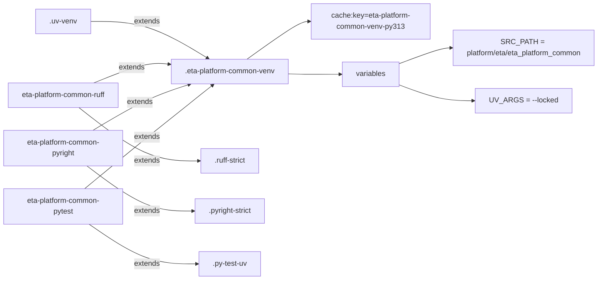

# Diagram: eta/eta_platform_common/.gitlab-ci.yml

> Auto-generated by Obscura crawlers

## Mermaid

### SVG

<svg id="container" width="1329.421875" xmlns="http://www.w3.org/2000/svg" class="flowchart" height="620" viewBox="0 0 1329.421875 620" role="graphics-document document" aria-roledescription="flowchart-v2"><g><marker id="container_flowchart-v2-pointEnd" class="marker flowchart-v2" viewBox="0 0 10 10" refX="5" refY="5" markerUnits="userSpaceOnUse" markerWidth="8" markerHeight="8" orient="auto"><path d="M 0 0 L 10 5 L 0 10 z" class="arrowMarkerPath" style="stroke-width: 1; stroke-dasharray: 1, 0;"></path></marker><marker id="container_flowchart-v2-pointStart" class="marker flowchart-v2" viewBox="0 0 10 10" refX="4.5" refY="5" markerUnits="userSpaceOnUse" markerWidth="8" markerHeight="8" orient="auto"><path d="M 0 5 L 10 10 L 10 0 z" class="arrowMarkerPath" style="stroke-width: 1; stroke-dasharray: 1, 0;"></path></marker><marker id="container_flowchart-v2-circleEnd" class="marker flowchart-v2" viewBox="0 0 10 10" refX="11" refY="5" markerUnits="userSpaceOnUse" markerWidth="11" markerHeight="11" orient="auto"><circle cx="5" cy="5" r="5" class="arrowMarkerPath" style="stroke-width: 1; stroke-dasharray: 1, 0;"></circle></marker><marker id="container_flowchart-v2-circleStart" class="marker flowchart-v2" viewBox="0 0 10 10" refX="-1" refY="5" markerUnits="userSpaceOnUse" markerWidth="11" markerHeight="11" orient="auto"><circle cx="5" cy="5" r="5" class="arrowMarkerPath" style="stroke-width: 1; stroke-dasharray: 1, 0;"></circle></marker><marker id="container_flowchart-v2-crossEnd" class="marker cross flowchart-v2" viewBox="0 0 11 11" refX="12" refY="5.2" markerUnits="userSpaceOnUse" markerWidth="11" markerHeight="11" orient="auto"><path d="M 1,1 l 9,9 M 10,1 l -9,9" class="arrowMarkerPath" style="stroke-width: 2; stroke-dasharray: 1, 0;"></path></marker><marker id="container_flowchart-v2-crossStart" class="marker cross flowchart-v2" viewBox="0 0 11 11" refX="-1" refY="5.2" markerUnits="userSpaceOnUse" markerWidth="11" markerHeight="11" orient="auto"><path d="M 1,1 l 9,9 M 10,1 l -9,9" class="arrowMarkerPath" style="stroke-width: 2; stroke-dasharray: 1, 0;"></path></marker><g class="root"><g class="clusters"></g><g class="edgePaths"><path d="M198.328,47L218.858,47C239.388,47,280.448,47,320.147,58.491C359.846,69.981,398.185,92.962,417.354,104.453L436.523,115.943" id="L_uv_venv_0" class="edge-thickness-normal edge-pattern-solid edge-thickness-normal edge-pattern-solid flowchart-link" style=";" data-edge="true" data-et="edge" data-id="L_uv_venv_0" data-points="W3sieCI6MTk4LjMyODEyNSwieSI6NDd9LHsieCI6MzIxLjUwNzgxMjUsInkiOjQ3fSx7IngiOjQzOS45NTM3NjQyMDQ1NDU0NSwieSI6MTE4fV0=" marker-end="url(#container_flowchart-v2-pointEnd)"></path><path d="M559.97,118L576.644,106.167C593.319,94.333,626.667,70.667,646.841,58.833C667.016,47,674.016,47,677.516,47L681.016,47" id="L_venv_cache_0" class="edge-thickness-normal edge-pattern-solid edge-thickness-normal edge-pattern-solid flowchart-link" style=";" data-edge="true" data-et="edge" data-id="L_venv_cache_0" data-points="W3sieCI6NTU5Ljk3MDE3MDQ1NDU0NTUsInkiOjExOH0seyJ4Ijo2NjAuMDE1NjI1LCJ5Ijo0N30seyJ4Ijo2ODUuMDE1NjI1LCJ5Ijo0N31d" marker-end="url(#container_flowchart-v2-pointEnd)"></path><path d="M635.016,162.032L639.182,162.194C643.349,162.355,651.682,162.677,670.513,162.839C689.344,163,718.672,163,733.336,163L748,163" id="L_venv_vars_0" class="edge-thickness-normal edge-pattern-solid edge-thickness-normal edge-pattern-solid flowchart-link" style=";" data-edge="true" data-et="edge" data-id="L_venv_vars_0" data-points="W3sieCI6NjM1LjAxNTYyNSwieSI6MTYyLjAzMjI1ODA2NDUxNjEzfSx7IngiOjY2MC4wMTU2MjUsInkiOjE2M30seyJ4Ijo3NTIsInkiOjE2M31d" marker-end="url(#container_flowchart-v2-pointEnd)"></path><path d="M878.031,139.42L893.362,133.683C908.693,127.947,939.354,116.473,958.185,110.737C977.016,105,984.016,105,987.516,105L991.016,105" id="L_vars_src_0" class="edge-thickness-normal edge-pattern-solid edge-thickness-normal edge-pattern-solid flowchart-link" style=";" data-edge="true" data-et="edge" data-id="L_vars_src_0" data-points="W3sieCI6ODc4LjAzMTI1LCJ5IjoxMzkuNDE5OTU5Njc3NDE5MzR9LHsieCI6OTcwLjAxNTYyNSwieSI6MTA1fSx7IngiOjk5NS4wMTU2MjUsInkiOjEwNX1d" marker-end="url(#container_flowchart-v2-pointEnd)"></path><path d="M878.031,186.58L893.362,192.317C908.693,198.053,939.354,209.527,968.565,215.263C997.776,221,1025.536,221,1039.417,221L1053.297,221" id="L_vars_uvargs_0" class="edge-thickness-normal edge-pattern-solid edge-thickness-normal edge-pattern-solid flowchart-link" style=";" data-edge="true" data-et="edge" data-id="L_vars_uvargs_0" data-points="W3sieCI6ODc4LjAzMTI1LCJ5IjoxODYuNTgwMDQwMzIyNTgwNjZ9LHsieCI6OTcwLjAxNTYyNSwieSI6MjIxfSx7IngiOjEwNTcuMjk2ODc1LCJ5IjoyMjF9XQ==" marker-end="url(#container_flowchart-v2-pointEnd)"></path><path d="M199.934,188L220.196,179.167C240.459,170.333,280.983,152.667,309.502,144.823C338.02,136.98,354.532,138.959,362.788,139.949L371.044,140.939" id="L_ruff_job_venv_0" class="edge-thickness-normal edge-pattern-solid edge-thickness-normal edge-pattern-solid flowchart-link" style=";" data-edge="true" data-et="edge" data-id="L_ruff_job_venv_0" data-points="W3sieCI6MTk5LjkzMzg4NjcxODc1LCJ5IjoxODh9LHsieCI6MzIxLjUwNzgxMjUsInkiOjEzNX0seyJ4IjozNzUuMDE1NjI1LCJ5IjoxNDEuNDE0ODMyNDc0Nzc1NDR9XQ==" marker-end="url(#container_flowchart-v2-pointEnd)"></path><path d="M172.408,242L197.258,261.5C222.108,281,271.808,320,315.447,339.5C359.086,359,396.664,359,415.453,359L434.242,359" id="L_ruff_job_ruff_strict_0" class="edge-thickness-normal edge-pattern-solid edge-thickness-normal edge-pattern-solid flowchart-link" style=";" data-edge="true" data-et="edge" data-id="L_ruff_job_ruff_strict_0" data-points="W3sieCI6MTcyLjQwNzcxNDg0Mzc1LCJ5IjoyNDJ9LHsieCI6MzIxLjUwNzgxMjUsInkiOjM1OX0seyJ4Ijo0MzguMjQyMTg3NSwieSI6MzU5fV0=" marker-end="url(#container_flowchart-v2-pointEnd)"></path><path d="M199.697,292L219.998,279.167C240.3,266.333,280.904,240.667,310.589,224.868C340.275,209.068,359.042,203.137,368.425,200.171L377.808,197.205" id="L_pyright_job_venv_0" class="edge-thickness-normal edge-pattern-solid edge-thickness-normal edge-pattern-solid flowchart-link" style=";" data-edge="true" data-et="edge" data-id="L_pyright_job_venv_0" data-points="W3sieCI6MTk5LjY5NjU5MjEzMzYyMDcsInkiOjI5Mn0seyJ4IjozMjEuNTA3ODEyNSwieSI6MjE1fSx7IngiOjM4MS42MjI0NDA3MzI3NTg2LCJ5IjoxOTZ9XQ==" marker-end="url(#container_flowchart-v2-pointEnd)"></path><path d="M189.861,370L211.802,386.5C233.743,403,277.626,436,316.278,452.5C354.93,469,388.352,469,405.063,469L421.773,469" id="L_pyright_job_pyright_strict_0" class="edge-thickness-normal edge-pattern-solid edge-thickness-normal edge-pattern-solid flowchart-link" style=";" data-edge="true" data-et="edge" data-id="L_pyright_job_pyright_strict_0" data-points="W3sieCI6MTg5Ljg2MDkwMzUzMjYwODcsInkiOjM3MH0seyJ4IjozMjEuNTA3ODEyNSwieSI6NDY5fSx7IngiOjQyNS43NzM0Mzc1LCJ5Ijo0Njl9XQ==" marker-end="url(#container_flowchart-v2-pointEnd)"></path><path d="M183.296,420L206.331,400.167C229.367,380.333,275.437,340.667,320.249,303.745C365.061,266.823,408.615,232.646,430.392,215.558L452.169,198.469" id="L_pytest_job_venv_0" class="edge-thickness-normal edge-pattern-solid edge-thickness-normal edge-pattern-solid flowchart-link" style=";" data-edge="true" data-et="edge" data-id="L_pytest_job_venv_0" data-points="W3sieCI6MTgzLjI5NjIzMjE5OTM2NzEsInkiOjQyMH0seyJ4IjozMjEuNTA3ODEyNSwieSI6MzAxfSx7IngiOjQ1NS4zMTU1OTI0NDc5MTY3LCJ5IjoxOTZ9XQ==" marker-end="url(#container_flowchart-v2-pointEnd)"></path><path d="M194.8,498L215.918,512.5C237.036,527,279.272,556,318.82,570.5C358.367,585,395.227,585,413.656,585L432.086,585" id="L_pytest_job_py_test_uv_0" class="edge-thickness-normal edge-pattern-solid edge-thickness-normal edge-pattern-solid flowchart-link" style=";" data-edge="true" data-et="edge" data-id="L_pytest_job_py_test_uv_0" data-points="W3sieCI6MTk0LjgwMDAzNzIwMjM4MDk2LCJ5Ijo0OTh9LHsieCI6MzIxLjUwNzgxMjUsInkiOjU4NX0seyJ4Ijo0MzYuMDg1OTM3NSwieSI6NTg1fV0=" marker-end="url(#container_flowchart-v2-pointEnd)"></path></g><g class="edgeLabels"><g class="edgeLabel" transform="translate(321.5078125, 47)"><g class="label" data-id="L_uv_venv_0" transform="translate(-28.5078125, -12)"><foreignObject width="57.015625" height="24">

extends

</foreignObject></g></g><g class="edgeLabel"><g class="label" data-id="L_venv_cache_0" transform="translate(0, 0)"><foreignObject width="0" height="0">

</foreignObject></g></g><g class="edgeLabel"><g class="label" data-id="L_venv_vars_0" transform="translate(0, 0)"><foreignObject width="0" height="0">

</foreignObject></g></g><g class="edgeLabel"><g class="label" data-id="L_vars_src_0" transform="translate(0, 0)"><foreignObject width="0" height="0">

</foreignObject></g></g><g class="edgeLabel"><g class="label" data-id="L_vars_uvargs_0" transform="translate(0, 0)"><foreignObject width="0" height="0">

</foreignObject></g></g><g class="edgeLabel" transform="translate(285.4212, 150.73191)"><g class="label" data-id="L_ruff_job_venv_0" transform="translate(-28.5078125, -12)"><foreignObject width="57.015625" height="24">

extends

</foreignObject></g></g><g class="edgeLabel" transform="translate(321.5078125, 359)"><g class="label" data-id="L_ruff_job_ruff_strict_0" transform="translate(-28.5078125, -12)"><foreignObject width="57.015625" height="24">

extends

</foreignObject></g></g><g class="edgeLabel" transform="translate(287.24787, 236.65659)"><g class="label" data-id="L_pyright_job_venv_0" transform="translate(-28.5078125, -12)"><foreignObject width="57.015625" height="24">

extends

</foreignObject></g></g><g class="edgeLabel" transform="translate(321.5078125, 469)"><g class="label" data-id="L_pyright_job_pyright_strict_0" transform="translate(-28.5078125, -12)"><foreignObject width="57.015625" height="24">

extends

</foreignObject></g></g><g class="edgeLabel" transform="translate(316.84884, 305.01137)"><g class="label" data-id="L_pytest_job_venv_0" transform="translate(-28.5078125, -12)"><foreignObject width="57.015625" height="24">

extends

</foreignObject></g></g><g class="edgeLabel" transform="translate(321.5078125, 585)"><g class="label" data-id="L_pytest_job_py_test_uv_0" transform="translate(-28.5078125, -12)"><foreignObject width="57.015625" height="24">

extends

</foreignObject></g></g></g><g class="nodes"><g class="node default" id="flowchart-uv-0" transform="translate(138, 47)"><rect class="basic label-container" style="" x="-60.328125" y="-27" width="120.65625" height="54"></rect><g class="label" style="" transform="translate(-30.328125, -12)"><rect></rect><foreignObject width="60.65625" height="24">

.uv-venv

</foreignObject></g></g><g class="node default" id="flowchart-venv-1" transform="translate(505.015625, 157)"><rect class="basic label-container" style="" x="-130" y="-39" width="260" height="78"></rect><g class="label" style="" transform="translate(-100, -24)"><rect></rect><foreignObject width="200" height="48">

.eta-platform-common-venv

</foreignObject></g></g><g class="node default" id="flowchart-cache-4" transform="translate(815.015625, 47)"><rect class="basic label-container" style="" x="-130" y="-39" width="260" height="78"></rect><g class="label" style="" transform="translate(-100, -24)"><rect></rect><foreignObject width="200" height="48">

cache:key=eta-platform-common-venv-py313

</foreignObject></g></g><g class="node default" id="flowchart-vars-7" transform="translate(815.015625, 163)"><rect class="basic label-container" style="" x="-63.015625" y="-27" width="126.03125" height="54"></rect><g class="label" style="" transform="translate(-33.015625, -12)"><rect></rect><foreignObject width="66.03125" height="24">

variables

</foreignObject></g></g><g class="node default" id="flowchart-src-10" transform="translate(1158.21875, 105)"><rect class="basic label-container" style="" x="-163.203125" y="-39" width="326.40625" height="78"></rect><g class="label" style="" transform="translate(-133.203125, -24)"><rect></rect><foreignObject width="266.40625" height="48">

SRC_PATH = platform/eta/eta_platform_common

</foreignObject></g></g><g class="node default" id="flowchart-uvargs-11" transform="translate(1158.21875, 221)"><rect class="basic label-container" style="" x="-100.921875" y="-27" width="201.84375" height="54"></rect><g class="label" style="" transform="translate(-70.921875, -12)"><rect></rect><foreignObject width="141.84375" height="24">

UV_ARGS = --locked

</foreignObject></g></g><g class="node default" id="flowchart-ruff_strict-16" transform="translate(505.015625, 359)"><rect class="basic label-container" style="" x="-66.7734375" y="-27" width="133.546875" height="54"></rect><g class="label" style="" transform="translate(-36.7734375, -12)"><rect></rect><foreignObject width="73.546875" height="24">

.ruff-strict

</foreignObject></g></g><g class="node default" id="flowchart-pyright_strict-17" transform="translate(505.015625, 469)"><rect class="basic label-container" style="" x="-79.2421875" y="-27" width="158.484375" height="54"></rect><g class="label" style="" transform="translate(-49.2421875, -12)"><rect></rect><foreignObject width="98.484375" height="24">

.pyright-strict

</foreignObject></g></g><g class="node default" id="flowchart-py_test_uv-18" transform="translate(505.015625, 585)"><rect class="basic label-container" style="" x="-68.9296875" y="-27" width="137.859375" height="54"></rect><g class="label" style="" transform="translate(-38.9296875, -12)"><rect></rect><foreignObject width="77.859375" height="24">

.py-test-uv

</foreignObject></g></g><g class="node default" id="flowchart-ruff_job-19" transform="translate(138, 215)"><rect class="basic label-container" style="" x="-127.1640625" y="-27" width="254.328125" height="54"></rect><g class="label" style="" transform="translate(-97.1640625, -12)"><rect></rect><foreignObject width="194.328125" height="24">

eta-platform-common-ruff

</foreignObject></g></g><g class="node default" id="flowchart-pyright_job-20" transform="translate(138, 331)"><rect class="basic label-container" style="" x="-130" y="-39" width="260" height="78"></rect><g class="label" style="" transform="translate(-100, -24)"><rect></rect><foreignObject width="200" height="48">

eta-platform-common-pyright

</foreignObject></g></g><g class="node default" id="flowchart-pytest_job-21" transform="translate(138, 459)"><rect class="basic label-container" style="" x="-130" y="-39" width="260" height="78"></rect><g class="label" style="" transform="translate(-100, -24)"><rect></rect><foreignObject width="200" height="48">

eta-platform-common-pytest

</foreignObject></g></g></g></g></g></svg>
