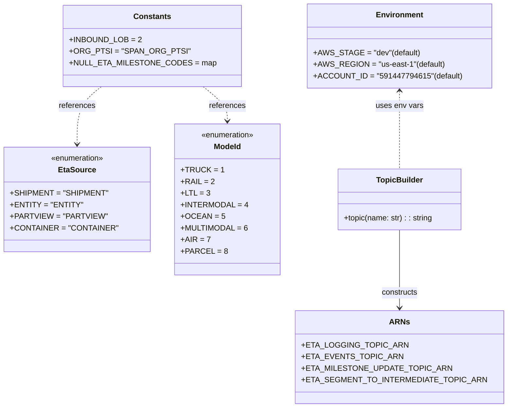

# Diagram: eta/eta_platform_common/eta_platform_common/constants.py

> Auto-generated by Obscura crawlers

## Mermaid

```mermaid
classDiagram
class EtaSource <<enumeration>> {
  +SHIPMENT = "SHIPMENT"
  +ENTITY = "ENTITY"
  +PARTVIEW = "PARTVIEW"
  +CONTAINER = "CONTAINER"
}
class ModeId <<enumeration>> {
  +TRUCK = 1
  +RAIL = 2
  +LTL = 3
  +INTERMODAL = 4
  +OCEAN = 5
  +MULTIMODAL = 6
  +AIR = 7
  +PARCEL = 8
}
class Environment {
  +AWS_STAGE = "dev" (default)
  +AWS_REGION = "us-east-1" (default)
  +ACCOUNT_ID = "591447794615" (default)
}
class TopicBuilder {
  +topic(name: str) : string
}
class ARNs {
  +ETA_LOGGING_TOPIC_ARN
  +ETA_EVENTS_TOPIC_ARN
  +ETA_MILESTONE_UPDATE_TOPIC_ARN
  +ETA_SEGMENT_TO_INTERMEDIATE_TOPIC_ARN
}
class Constants {
  +INBOUND_LOB = 2
  +ORG_PTSI = "SPAN_ORG_PTSI"
  +NULL_ETA_MILESTONE_CODES = map
}
Environment <.. TopicBuilder : uses env vars
TopicBuilder --> ARNs : constructs
Constants ..> EtaSource : references
Constants ..> ModeId : references
```

> SVG rendering failed for this diagram.
