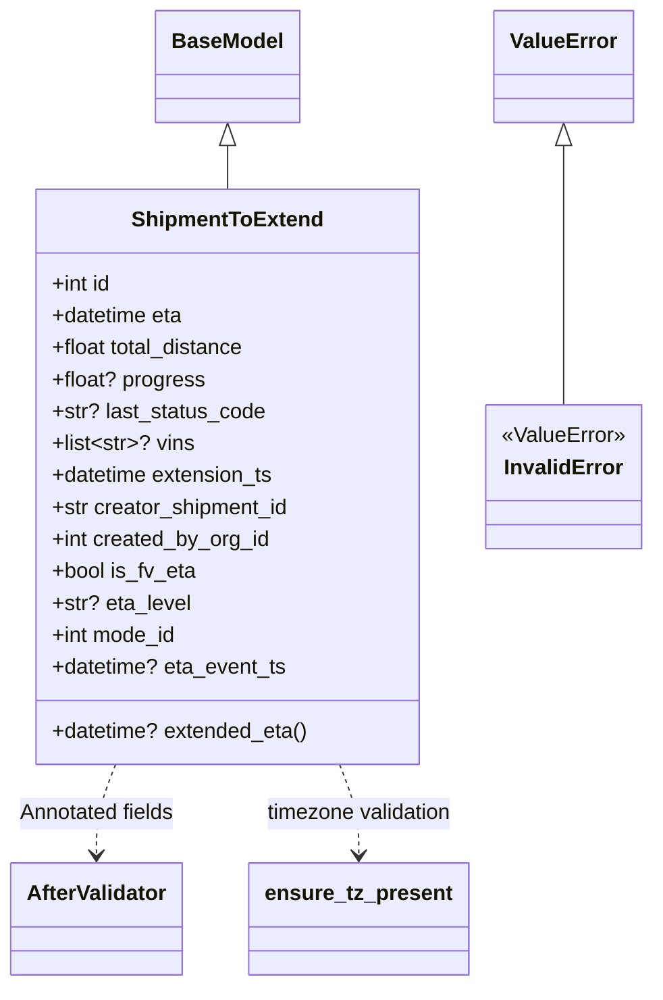

# Diagram: eta/eta_platform_common/eta_platform_common/models/eta_extensions/payload.py


> Auto-generated by Obscura crawlers

## Diagram 1



### SVG

<svg id="container" width="486.390625" xmlns="http://www.w3.org/2000/svg" class="classDiagram" height="740" viewBox="0 0 486.390625 740" role="graphics-document document" aria-roledescription="class"><style>#container{font-family:"trebuchet ms",verdana,arial,sans-serif;font-size:16px;fill:#333;}@keyframes edge-animation-frame{from{stroke-dashoffset:0;}}@keyframes dash{to{stroke-dashoffset:0;}}#container .edge-animation-slow{stroke-dasharray:9,5!important;stroke-dashoffset:900;animation:dash 50s linear infinite;stroke-linecap:round;}#container .edge-animation-fast{stroke-dasharray:9,5!important;stroke-dashoffset:900;animation:dash 20s linear infinite;stroke-linecap:round;}#container .error-icon{fill:#552222;}#container .error-text{fill:#552222;stroke:#552222;}#container .edge-thickness-normal{stroke-width:1px;}#container .edge-thickness-thick{stroke-width:3.5px;}#container .edge-pattern-solid{stroke-dasharray:0;}#container .edge-thickness-invisible{stroke-width:0;fill:none;}#container .edge-pattern-dashed{stroke-dasharray:3;}#container .edge-pattern-dotted{stroke-dasharray:2;}#container .marker{fill:#333333;stroke:#333333;}#container .marker.cross{stroke:#333333;}#container svg{font-family:"trebuchet ms",verdana,arial,sans-serif;font-size:16px;}#container p{margin:0;}#container g.classGroup text{fill:#9370DB;stroke:none;font-family:"trebuchet ms",verdana,arial,sans-serif;font-size:10px;}#container g.classGroup text .title{font-weight:bolder;}#container .nodeLabel,#container .edgeLabel{color:#131300;}#container .edgeLabel .label rect{fill:#ECECFF;}#container .label text{fill:#131300;}#container .labelBkg{background:#ECECFF;}#container .edgeLabel .label span{background:#ECECFF;}#container .classTitle{font-weight:bolder;}#container .node rect,#container .node circle,#container .node ellipse,#container .node polygon,#container .node path{fill:#ECECFF;stroke:#9370DB;stroke-width:1px;}#container .divider{stroke:#9370DB;stroke-width:1;}#container g.clickable{cursor:pointer;}#container g.classGroup rect{fill:#ECECFF;stroke:#9370DB;}#container g.classGroup line{stroke:#9370DB;stroke-width:1;}#container .classLabel .box{stroke:none;stroke-width:0;fill:#ECECFF;opacity:0.5;}#container .classLabel .label{fill:#9370DB;font-size:10px;}#container .relation{stroke:#333333;stroke-width:1;fill:none;}#container .dashed-line{stroke-dasharray:3;}#container .dotted-line{stroke-dasharray:1 2;}#container #compositionStart,#container .composition{fill:#333333!important;stroke:#333333!important;stroke-width:1;}#container #compositionEnd,#container .composition{fill:#333333!important;stroke:#333333!important;stroke-width:1;}#container #dependencyStart,#container .dependency{fill:#333333!important;stroke:#333333!important;stroke-width:1;}#container #dependencyStart,#container .dependency{fill:#333333!important;stroke:#333333!important;stroke-width:1;}#container #extensionStart,#container .extension{fill:transparent!important;stroke:#333333!important;stroke-width:1;}#container #extensionEnd,#container .extension{fill:transparent!important;stroke:#333333!important;stroke-width:1;}#container #aggregationStart,#container .aggregation{fill:transparent!important;stroke:#333333!important;stroke-width:1;}#container #aggregationEnd,#container .aggregation{fill:transparent!important;stroke:#333333!important;stroke-width:1;}#container #lollipopStart,#container .lollipop{fill:#ECECFF!important;stroke:#333333!important;stroke-width:1;}#container #lollipopEnd,#container .lollipop{fill:#ECECFF!important;stroke:#333333!important;stroke-width:1;}#container .edgeTerminals{font-size:11px;line-height:initial;}#container .classTitleText{text-anchor:middle;font-size:18px;fill:#333;}#container .label-icon{display:inline-block;height:1em;overflow:visible;vertical-align:-0.125em;}#container .node .label-icon path{fill:currentColor;stroke:revert;stroke-width:revert;}#container :root{--mermaid-font-family:"trebuchet ms",verdana,arial,sans-serif;}</style><g><defs><marker id="container_class-aggregationStart" class="marker aggregation class" refX="18" refY="7" markerWidth="190" markerHeight="240" orient="auto"><path d="M 18,7 L9,13 L1,7 L9,1 Z"></path></marker></defs><defs><marker id="container_class-aggregationEnd" class="marker aggregation class" refX="1" refY="7" markerWidth="20" markerHeight="28" orient="auto"><path d="M 18,7 L9,13 L1,7 L9,1 Z"></path></marker></defs><defs><marker id="container_class-extensionStart" class="marker extension class" refX="18" refY="7" markerWidth="190" markerHeight="240" orient="auto"><path d="M 1,7 L18,13 V 1 Z"></path></marker></defs><defs><marker id="container_class-extensionEnd" class="marker extension class" refX="1" refY="7" markerWidth="20" markerHeight="28" orient="auto"><path d="M 1,1 V 13 L18,7 Z"></path></marker></defs><defs><marker id="container_class-compositionStart" class="marker composition class" refX="18" refY="7" markerWidth="190" markerHeight="240" orient="auto"><path d="M 18,7 L9,13 L1,7 L9,1 Z"></path></marker></defs><defs><marker id="container_class-compositionEnd" class="marker composition class" refX="1" refY="7" markerWidth="20" markerHeight="28" orient="auto"><path d="M 18,7 L9,13 L1,7 L9,1 Z"></path></marker></defs><defs><marker id="container_class-dependencyStart" class="marker dependency class" refX="6" refY="7" markerWidth="190" markerHeight="240" orient="auto"><path d="M 5,7 L9,13 L1,7 L9,1 Z"></path></marker></defs><defs><marker id="container_class-dependencyEnd" class="marker dependency class" refX="13" refY="7" markerWidth="20" markerHeight="28" orient="auto"><path d="M 18,7 L9,13 L14,7 L9,1 Z"></path></marker></defs><defs><marker id="container_class-lollipopStart" class="marker lollipop class" refX="13" refY="7" markerWidth="190" markerHeight="240" orient="auto"><circle stroke="black" fill="transparent" cx="7" cy="7" r="6"></circle></marker></defs><defs><marker id="container_class-lollipopEnd" class="marker lollipop class" refX="1" refY="7" markerWidth="190" markerHeight="240" orient="auto"><circle stroke="black" fill="transparent" cx="7" cy="7" r="6"></circle></marker></defs><g class="root"><g class="clusters"></g><g class="edgePaths"><path d="M167.863,109.25L167.863,110.542C167.863,111.833,167.863,114.417,167.863,119.875C167.863,125.333,167.863,133.667,167.863,137.833L167.863,142" id="id_BaseModel_ShipmentToExtend_1" class="edge-thickness-normal edge-pattern-solid relation" style=";;;" data-edge="true" data-et="edge" data-id="id_BaseModel_ShipmentToExtend_1" data-points="W3sieCI6MTY3Ljg2MzI4MTI1LCJ5Ijo5Mn0seyJ4IjoxNjcuODYzMjgxMjUsInkiOjExN30seyJ4IjoxNjcuODYzMjgxMjUsInkiOjE0Mn1d" marker-start="url(#container_class-extensionStart)"></path><path d="M419.68,109.25L419.68,110.542C419.68,111.833,419.68,114.417,419.68,146.875C419.68,179.333,419.68,241.667,419.68,272.833L419.68,304" id="id_ValueError_InvalidError_2" class="edge-thickness-normal edge-pattern-solid relation" style=";;;" data-edge="true" data-et="edge" data-id="id_ValueError_InvalidError_2" data-points="W3sieCI6NDE5LjY3OTY4NzUsInkiOjkyfSx7IngiOjQxOS42Nzk2ODc1LCJ5IjoxMTd9LHsieCI6NDE5LjY3OTY4NzUsInkiOjMwNH1d" marker-start="url(#container_class-extensionStart)"></path><path d="M85.439,574L83.086,580.167C80.733,586.333,76.027,598.667,73.673,610C71.32,621.333,71.32,631.667,71.32,636.833L71.32,642" id="id_ShipmentToExtend_AfterValidator_3" class="edge-thickness-normal edge-pattern-dashed relation" style=";;;" data-edge="true" data-et="edge" data-id="id_ShipmentToExtend_AfterValidator_3" data-points="W3sieCI6ODUuNDM5MjQ0Njg4NzM1MTcsInkiOjU3NH0seyJ4Ijo3MS4zMjAzMTI1LCJ5Ijo2MTF9LHsieCI6NzEuMzIwMzEyNSwieSI6NjQ4fV0=" marker-end="url(#container_class-dependencyEnd)"></path><path d="M250.287,574L252.64,580.167C254.994,586.333,259.7,598.667,262.053,610C264.406,621.333,264.406,631.667,264.406,636.833L264.406,642" id="id_ShipmentToExtend_ensure_tz_present_4" class="edge-thickness-normal edge-pattern-dashed relation" style=";;;" data-edge="true" data-et="edge" data-id="id_ShipmentToExtend_ensure_tz_present_4" data-points="W3sieCI6MjUwLjI4NzMxNzgxMTI2NDgsInkiOjU3NH0seyJ4IjoyNjQuNDA2MjUsInkiOjYxMX0seyJ4IjoyNjQuNDA2MjUsInkiOjY0OH1d" marker-end="url(#container_class-dependencyEnd)"></path></g><g class="edgeLabels"><g class="edgeLabel"><g class="label" data-id="id_BaseModel_ShipmentToExtend_1" transform="translate(0, 0)"><foreignObject width="0" height="0"><div xmlns="http://www.w3.org/1999/xhtml" class="labelBkg" style="display: table-cell; white-space: nowrap; line-height: 1.5; max-width: 200px; text-align: center;"><span class="edgeLabel"></span></div></foreignObject></g></g><g class="edgeLabel"><g class="label" data-id="id_ValueError_InvalidError_2" transform="translate(0, 0)"><foreignObject width="0" height="0"><div xmlns="http://www.w3.org/1999/xhtml" class="labelBkg" style="display: table-cell; white-space: nowrap; line-height: 1.5; max-width: 200px; text-align: center;"><span class="edgeLabel"></span></div></foreignObject></g></g><g class="edgeLabel" transform="translate(71.3203125, 611)"><g class="label" data-id="id_ShipmentToExtend_AfterValidator_3" transform="translate(-59.6328125, -12)"><foreignObject width="119.265625" height="24"><div xmlns="http://www.w3.org/1999/xhtml" class="labelBkg" style="display: table-cell; white-space: nowrap; line-height: 1.5; max-width: 200px; text-align: center;"><span class="edgeLabel"><p>Annotated fields</p></span></div></foreignObject></g></g><g class="edgeLabel" transform="translate(264.40625, 611)"><g class="label" data-id="id_ShipmentToExtend_ensure_tz_present_4" transform="translate(-71.90625, -12)"><foreignObject width="143.8125" height="24"><div xmlns="http://www.w3.org/1999/xhtml" class="labelBkg" style="display: table-cell; white-space: nowrap; line-height: 1.5; max-width: 200px; text-align: center;"><span class="edgeLabel"><p>timezone validation</p></span></div></foreignObject></g></g></g><g class="nodes"><g class="node default" id="classId-ShipmentToExtend-0" transform="translate(167.86328125, 358)"><g class="basic label-container"><path d="M-143.10546875 -216 L143.10546875 -216 L143.10546875 216 L-143.10546875 216" stroke="none" stroke-width="0" fill="#ECECFF" style=""></path><path d="M-143.10546875 -216 C-80.75448672854944 -216, -18.403504707098875 -216, 143.10546875 -216 M-143.10546875 -216 C-66.63454720465589 -216, 9.836374340688224 -216, 143.10546875 -216 M143.10546875 -216 C143.10546875 -115.15666139399643, 143.10546875 -14.31332278799286, 143.10546875 216 M143.10546875 -216 C143.10546875 -115.84353563288332, 143.10546875 -15.687071265766633, 143.10546875 216 M143.10546875 216 C32.36395986750058 216, -78.37754901499883 216, -143.10546875 216 M143.10546875 216 C60.89428649839276 216, -21.31689575321448 216, -143.10546875 216 M-143.10546875 216 C-143.10546875 123.88692724678434, -143.10546875 31.773854493568678, -143.10546875 -216 M-143.10546875 216 C-143.10546875 48.86507124986545, -143.10546875 -118.2698575002691, -143.10546875 -216" stroke="#9370DB" stroke-width="1.3" fill="none" stroke-dasharray="0 0" style=""></path></g><g class="annotation-group text" transform="translate(0, -192)"></g><g class="label-group text" transform="translate(-68.7421875, -192)"><g class="label" style="font-weight: bolder" transform="translate(0,-12)"><foreignObject width="137.484375" height="24"><div xmlns="http://www.w3.org/1999/xhtml" style="display: table-cell; white-space: nowrap; line-height: 1.5; max-width: 186px; text-align: center;"><span class="nodeLabel markdown-node-label" style=""><p>ShipmentToExtend</p></span></div></foreignObject></g></g><g class="members-group text" transform="translate(-131.10546875, -144)"><g class="label" style="" transform="translate(0,-12)"><foreignObject width="45.96875" height="24"><div xmlns="http://www.w3.org/1999/xhtml" style="display: table-cell; white-space: nowrap; line-height: 1.5; max-width: 103px; text-align: center;"><span class="nodeLabel markdown-node-label" style=""><p>+int id</p></span></div></foreignObject></g><g class="label" style="" transform="translate(0,12)"><foreignObject width="100.5625" height="24"><div xmlns="http://www.w3.org/1999/xhtml" style="display: table-cell; white-space: nowrap; line-height: 1.5; max-width: 158px; text-align: center;"><span class="nodeLabel markdown-node-label" style=""><p>+datetime eta</p></span></div></foreignObject></g><g class="label" style="" transform="translate(0,36)"><foreignObject width="148.171875" height="24"><div xmlns="http://www.w3.org/1999/xhtml" style="display: table-cell; white-space: nowrap; line-height: 1.5; max-width: 206px; text-align: center;"><span class="nodeLabel markdown-node-label" style=""><p>+float total_distance</p></span></div></foreignObject></g><g class="label" style="" transform="translate(0,60)"><foreignObject width="113.96875" height="24"><div xmlns="http://www.w3.org/1999/xhtml" style="display: table-cell; white-space: nowrap; line-height: 1.5; max-width: 171px; text-align: center;"><span class="nodeLabel markdown-node-label" style=""><p>+float? progress</p></span></div></foreignObject></g><g class="label" style="" transform="translate(0,84)"><foreignObject width="160.28125" height="24"><div xmlns="http://www.w3.org/1999/xhtml" style="display: table-cell; white-space: nowrap; line-height: 1.5; max-width: 218px; text-align: center;"><span class="nodeLabel markdown-node-label" style=""><p>+str? last_status_code</p></span></div></foreignObject></g><g class="label" style="" transform="translate(0,108)"><foreignObject width="106.046875" height="24"><div xmlns="http://www.w3.org/1999/xhtml" style="display: table-cell; white-space: nowrap; line-height: 1.5; max-width: 203px; text-align: center;"><span class="nodeLabel markdown-node-label" style=""><p>+list&lt;str&gt;? vins</p></span></div></foreignObject></g><g class="label" style="" transform="translate(0,132)"><foreignObject width="169.40625" height="24"><div xmlns="http://www.w3.org/1999/xhtml" style="display: table-cell; white-space: nowrap; line-height: 1.5; max-width: 227px; text-align: center;"><span class="nodeLabel markdown-node-label" style=""><p>+datetime extension_ts</p></span></div></foreignObject></g><g class="label" style="" transform="translate(0,156)"><foreignObject width="181.203125" height="24"><div xmlns="http://www.w3.org/1999/xhtml" style="display: table-cell; white-space: nowrap; line-height: 1.5; max-width: 239px; text-align: center;"><span class="nodeLabel markdown-node-label" style=""><p>+str creator_shipment_id</p></span></div></foreignObject></g><g class="label" style="" transform="translate(0,180)"><foreignObject width="165.546875" height="24"><div xmlns="http://www.w3.org/1999/xhtml" style="display: table-cell; white-space: nowrap; line-height: 1.5; max-width: 223px; text-align: center;"><span class="nodeLabel markdown-node-label" style=""><p>+int created_by_org_id</p></span></div></foreignObject></g><g class="label" style="" transform="translate(0,204)"><foreignObject width="108.609375" height="24"><div xmlns="http://www.w3.org/1999/xhtml" style="display: table-cell; white-space: nowrap; line-height: 1.5; max-width: 166px; text-align: center;"><span class="nodeLabel markdown-node-label" style=""><p>+bool is_fv_eta</p></span></div></foreignObject></g><g class="label" style="" transform="translate(0,228)"><foreignObject width="104.25" height="24"><div xmlns="http://www.w3.org/1999/xhtml" style="display: table-cell; white-space: nowrap; line-height: 1.5; max-width: 162px; text-align: center;"><span class="nodeLabel markdown-node-label" style=""><p>+str? eta_level</p></span></div></foreignObject></g><g class="label" style="" transform="translate(0,252)"><foreignObject width="95.3125" height="24"><div xmlns="http://www.w3.org/1999/xhtml" style="display: table-cell; white-space: nowrap; line-height: 1.5; max-width: 153px; text-align: center;"><span class="nodeLabel markdown-node-label" style=""><p>+int mode_id</p></span></div></foreignObject></g><g class="label" style="" transform="translate(0,276)"><foreignObject width="176.859375" height="24"><div xmlns="http://www.w3.org/1999/xhtml" style="display: table-cell; white-space: nowrap; line-height: 1.5; max-width: 234px; text-align: center;"><span class="nodeLabel markdown-node-label" style=""><p>+datetime? eta_event_ts</p></span></div></foreignObject></g></g><g class="methods-group text" transform="translate(-131.10546875, 192)"><g class="label" style="" transform="translate(0,-12)"><foreignObject width="193.46875" height="24"><div xmlns="http://www.w3.org/1999/xhtml" style="display: table-cell; white-space: nowrap; line-height: 1.5; max-width: 251px; text-align: center;"><span class="nodeLabel markdown-node-label" style=""><p>+datetime? extended_eta()</p></span></div></foreignObject></g></g><g class="divider" style=""><path d="M-143.10546875 -168 C-52.44037931193968 -168, 38.22471012612064 -168, 143.10546875 -168 M-143.10546875 -168 C-30.23761064747103 -168, 82.63024745505794 -168, 143.10546875 -168" stroke="#9370DB" stroke-width="1.3" fill="none" stroke-dasharray="0 0" style=""></path></g><g class="divider" style=""><path d="M-143.10546875 168 C-58.51564775318384 168, 26.074173243632316 168, 143.10546875 168 M-143.10546875 168 C-62.121027531856384 168, 18.86341368628723 168, 143.10546875 168" stroke="#9370DB" stroke-width="1.3" fill="none" stroke-dasharray="0 0" style=""></path></g></g><g class="node default" id="classId-InvalidError-1" transform="translate(419.6796875, 358)"><g class="basic label-container"><path d="M-58.7109375 -54 L58.7109375 -54 L58.7109375 54 L-58.7109375 54" stroke="none" stroke-width="0" fill="#ECECFF" style=""></path><path d="M-58.7109375 -54 C-14.649216276650797 -54, 29.412504946698405 -54, 58.7109375 -54 M-58.7109375 -54 C-28.86932122739487 -54, 0.9722950452102594 -54, 58.7109375 -54 M58.7109375 -54 C58.7109375 -22.25794058551551, 58.7109375 9.484118828968981, 58.7109375 54 M58.7109375 -54 C58.7109375 -30.445481599089046, 58.7109375 -6.890963198178092, 58.7109375 54 M58.7109375 54 C33.375829505870996 54, 8.040721511741992 54, -58.7109375 54 M58.7109375 54 C32.72343009508025 54, 6.735922690160507 54, -58.7109375 54 M-58.7109375 54 C-58.7109375 11.476096258263858, -58.7109375 -31.047807483472283, -58.7109375 -54 M-58.7109375 54 C-58.7109375 18.138635472185527, -58.7109375 -17.722729055628946, -58.7109375 -54" stroke="#9370DB" stroke-width="1.3" fill="none" stroke-dasharray="0 0" style=""></path></g><g class="annotation-group text" transform="translate(-46.7109375, -30)"><g class="label" style="" transform="translate(0,-12)"><foreignObject width="93.421875" height="24"><div xmlns="http://www.w3.org/1999/xhtml" style="display: table-cell; white-space: nowrap; line-height: 1.5; max-width: 143px; text-align: center;"><span class="nodeLabel markdown-node-label" style=""><p>«ValueError»</p></span></div></foreignObject></g></g><g class="label-group text" transform="translate(-42.765625, -6)"><g class="label" style="font-weight: bolder" transform="translate(0,-12)"><foreignObject width="85.53125" height="24"><div xmlns="http://www.w3.org/1999/xhtml" style="display: table-cell; white-space: nowrap; line-height: 1.5; max-width: 136px; text-align: center;"><span class="nodeLabel markdown-node-label" style=""><p>InvalidError</p></span></div></foreignObject></g></g><g class="members-group text" transform="translate(-46.7109375, 42)"></g><g class="methods-group text" transform="translate(-46.7109375, 72)"></g><g class="divider" style=""><path d="M-58.7109375 18 C-23.067916027758052 18, 12.575105444483896 18, 58.7109375 18 M-58.7109375 18 C-14.59712867168416 18, 29.51668015663168 18, 58.7109375 18" stroke="#9370DB" stroke-width="1.3" fill="none" stroke-dasharray="0 0" style=""></path></g><g class="divider" style=""><path d="M-58.7109375 36 C-26.920689470505202 36, 4.8695585589895956 36, 58.7109375 36 M-58.7109375 36 C-12.598680930163283 36, 33.513575639673434 36, 58.7109375 36" stroke="#9370DB" stroke-width="1.3" fill="none" stroke-dasharray="0 0" style=""></path></g></g><g class="node default" id="classId-BaseModel-2" transform="translate(167.86328125, 50)"><g class="basic label-container"><path d="M-52.078125 -42 L52.078125 -42 L52.078125 42 L-52.078125 42" stroke="none" stroke-width="0" fill="#ECECFF" style=""></path><path d="M-52.078125 -42 C-17.586695431858317 -42, 16.904734136283366 -42, 52.078125 -42 M-52.078125 -42 C-30.429019606520086 -42, -8.779914213040172 -42, 52.078125 -42 M52.078125 -42 C52.078125 -23.778429675768898, 52.078125 -5.5568593515377955, 52.078125 42 M52.078125 -42 C52.078125 -11.642650808185387, 52.078125 18.714698383629226, 52.078125 42 M52.078125 42 C21.241337981117155 42, -9.59544903776569 42, -52.078125 42 M52.078125 42 C28.359285624843473 42, 4.640446249686946 42, -52.078125 42 M-52.078125 42 C-52.078125 22.48982791249275, -52.078125 2.9796558249854996, -52.078125 -42 M-52.078125 42 C-52.078125 24.27351798886716, -52.078125 6.547035977734318, -52.078125 -42" stroke="#9370DB" stroke-width="1.3" fill="none" stroke-dasharray="0 0" style=""></path></g><g class="annotation-group text" transform="translate(0, -18)"></g><g class="label-group text" transform="translate(-40.078125, -18)"><g class="label" style="font-weight: bolder" transform="translate(0,-12)"><foreignObject width="80.15625" height="24"><div xmlns="http://www.w3.org/1999/xhtml" style="display: table-cell; white-space: nowrap; line-height: 1.5; max-width: 130px; text-align: center;"><span class="nodeLabel markdown-node-label" style=""><p>BaseModel</p></span></div></foreignObject></g></g><g class="members-group text" transform="translate(-40.078125, 30)"></g><g class="methods-group text" transform="translate(-40.078125, 60)"></g><g class="divider" style=""><path d="M-52.078125 6 C-12.057259556030559 6, 27.963605887938883 6, 52.078125 6 M-52.078125 6 C-26.327695528616893 6, -0.5772660572337855 6, 52.078125 6" stroke="#9370DB" stroke-width="1.3" fill="none" stroke-dasharray="0 0" style=""></path></g><g class="divider" style=""><path d="M-52.078125 24 C-29.162922183761275 24, -6.247719367522549 24, 52.078125 24 M-52.078125 24 C-26.555272399520497 24, -1.0324197990409942 24, 52.078125 24" stroke="#9370DB" stroke-width="1.3" fill="none" stroke-dasharray="0 0" style=""></path></g></g><g class="node default" id="classId-ValueError-3" transform="translate(419.6796875, 50)"><g class="basic label-container"><path d="M-50.1015625 -42 L50.1015625 -42 L50.1015625 42 L-50.1015625 42" stroke="none" stroke-width="0" fill="#ECECFF" style=""></path><path d="M-50.1015625 -42 C-28.258179661528953 -42, -6.414796823057905 -42, 50.1015625 -42 M-50.1015625 -42 C-25.122051417324375 -42, -0.14254033464874993 -42, 50.1015625 -42 M50.1015625 -42 C50.1015625 -23.96064530751674, 50.1015625 -5.921290615033477, 50.1015625 42 M50.1015625 -42 C50.1015625 -10.716688394857513, 50.1015625 20.566623210284973, 50.1015625 42 M50.1015625 42 C20.51051077369824 42, -9.08054095260352 42, -50.1015625 42 M50.1015625 42 C29.547398028937483 42, 8.993233557874966 42, -50.1015625 42 M-50.1015625 42 C-50.1015625 19.23865810505833, -50.1015625 -3.522683789883338, -50.1015625 -42 M-50.1015625 42 C-50.1015625 18.11441830519292, -50.1015625 -5.771163389614159, -50.1015625 -42" stroke="#9370DB" stroke-width="1.3" fill="none" stroke-dasharray="0 0" style=""></path></g><g class="annotation-group text" transform="translate(0, -18)"></g><g class="label-group text" transform="translate(-38.1015625, -18)"><g class="label" style="font-weight: bolder" transform="translate(0,-12)"><foreignObject width="76.203125" height="24"><div xmlns="http://www.w3.org/1999/xhtml" style="display: table-cell; white-space: nowrap; line-height: 1.5; max-width: 126px; text-align: center;"><span class="nodeLabel markdown-node-label" style=""><p>ValueError</p></span></div></foreignObject></g></g><g class="members-group text" transform="translate(-38.1015625, 30)"></g><g class="methods-group text" transform="translate(-38.1015625, 60)"></g><g class="divider" style=""><path d="M-50.1015625 6 C-21.50631463309452 6, 7.0889332338109625 6, 50.1015625 6 M-50.1015625 6 C-11.483077779782732 6, 27.135406940434535 6, 50.1015625 6" stroke="#9370DB" stroke-width="1.3" fill="none" stroke-dasharray="0 0" style=""></path></g><g class="divider" style=""><path d="M-50.1015625 24 C-20.777283119609372 24, 8.546996260781256 24, 50.1015625 24 M-50.1015625 24 C-28.554942763997115 24, -7.00832302799423 24, 50.1015625 24" stroke="#9370DB" stroke-width="1.3" fill="none" stroke-dasharray="0 0" style=""></path></g></g><g class="node default" id="classId-AfterValidator-4" transform="translate(71.3203125, 690)"><g class="basic label-container"><path d="M-63.3203125 -42 L63.3203125 -42 L63.3203125 42 L-63.3203125 42" stroke="none" stroke-width="0" fill="#ECECFF" style=""></path><path d="M-63.3203125 -42 C-27.609929819317856 -42, 8.100452861364289 -42, 63.3203125 -42 M-63.3203125 -42 C-18.948234498854 -42, 25.423843502292 -42, 63.3203125 -42 M63.3203125 -42 C63.3203125 -23.27645547476787, 63.3203125 -4.552910949535743, 63.3203125 42 M63.3203125 -42 C63.3203125 -18.502996263418545, 63.3203125 4.99400747316291, 63.3203125 42 M63.3203125 42 C24.277307327295787 42, -14.765697845408425 42, -63.3203125 42 M63.3203125 42 C18.524046353841293 42, -26.272219792317415 42, -63.3203125 42 M-63.3203125 42 C-63.3203125 21.898639473117214, -63.3203125 1.797278946234428, -63.3203125 -42 M-63.3203125 42 C-63.3203125 20.31586516348925, -63.3203125 -1.3682696730215014, -63.3203125 -42" stroke="#9370DB" stroke-width="1.3" fill="none" stroke-dasharray="0 0" style=""></path></g><g class="annotation-group text" transform="translate(0, -18)"></g><g class="label-group text" transform="translate(-51.3203125, -18)"><g class="label" style="font-weight: bolder" transform="translate(0,-12)"><foreignObject width="102.640625" height="24"><div xmlns="http://www.w3.org/1999/xhtml" style="display: table-cell; white-space: nowrap; line-height: 1.5; max-width: 151px; text-align: center;"><span class="nodeLabel markdown-node-label" style=""><p>AfterValidator</p></span></div></foreignObject></g></g><g class="members-group text" transform="translate(-51.3203125, 30)"></g><g class="methods-group text" transform="translate(-51.3203125, 60)"></g><g class="divider" style=""><path d="M-63.3203125 6 C-21.0456632249172 6, 21.228986050165602 6, 63.3203125 6 M-63.3203125 6 C-37.562709916917264 6, -11.805107333834528 6, 63.3203125 6" stroke="#9370DB" stroke-width="1.3" fill="none" stroke-dasharray="0 0" style=""></path></g><g class="divider" style=""><path d="M-63.3203125 24 C-24.90229192873973 24, 13.515728642520543 24, 63.3203125 24 M-63.3203125 24 C-37.5397444510801 24, -11.7591764021602 24, 63.3203125 24" stroke="#9370DB" stroke-width="1.3" fill="none" stroke-dasharray="0 0" style=""></path></g></g><g class="node default" id="classId-ensure_tz_present-5" transform="translate(264.40625, 690)"><g class="basic label-container"><path d="M-79.765625 -42 L79.765625 -42 L79.765625 42 L-79.765625 42" stroke="none" stroke-width="0" fill="#ECECFF" style=""></path><path d="M-79.765625 -42 C-21.678817302050525 -42, 36.40799039589895 -42, 79.765625 -42 M-79.765625 -42 C-38.265151113520155 -42, 3.235322772959691 -42, 79.765625 -42 M79.765625 -42 C79.765625 -15.303399478467902, 79.765625 11.393201043064195, 79.765625 42 M79.765625 -42 C79.765625 -24.942677846125274, 79.765625 -7.885355692250549, 79.765625 42 M79.765625 42 C42.237708378584095 42, 4.70979175716819 42, -79.765625 42 M79.765625 42 C40.39630807784126 42, 1.0269911556825235 42, -79.765625 42 M-79.765625 42 C-79.765625 19.751180330736148, -79.765625 -2.497639338527705, -79.765625 -42 M-79.765625 42 C-79.765625 24.567592680026486, -79.765625 7.135185360052972, -79.765625 -42" stroke="#9370DB" stroke-width="1.3" fill="none" stroke-dasharray="0 0" style=""></path></g><g class="annotation-group text" transform="translate(0, -18)"></g><g class="label-group text" transform="translate(-67.765625, -18)"><g class="label" style="font-weight: bolder" transform="translate(0,-12)"><foreignObject width="135.53125" height="24"><div xmlns="http://www.w3.org/1999/xhtml" style="display: table-cell; white-space: nowrap; line-height: 1.5; max-width: 184px; text-align: center;"><span class="nodeLabel markdown-node-label" style=""><p>ensure_tz_present</p></span></div></foreignObject></g></g><g class="members-group text" transform="translate(-67.765625, 30)"></g><g class="methods-group text" transform="translate(-67.765625, 60)"></g><g class="divider" style=""><path d="M-79.765625 6 C-43.81102659598141 6, -7.85642819196282 6, 79.765625 6 M-79.765625 6 C-23.981679735190212 6, 31.802265529619575 6, 79.765625 6" stroke="#9370DB" stroke-width="1.3" fill="none" stroke-dasharray="0 0" style=""></path></g><g class="divider" style=""><path d="M-79.765625 24 C-42.148288773782895 24, -4.530952547565789 24, 79.765625 24 M-79.765625 24 C-43.56101242314807 24, -7.356399846296142 24, 79.765625 24" stroke="#9370DB" stroke-width="1.3" fill="none" stroke-dasharray="0 0" style=""></path></g></g></g></g></g></svg>

## Diagram 2

```mermaid
flowchart TD
Start[Start: compute extended_eta] --> CheckProgress{progress is not None?}
CheckProgress -- yes --> CalcThreshold[threshold = (total_distance * (1 - (progress * 0.01))) / 25]
CalcThreshold --> CompareETA1{eta < extension_ts + threshold hours?}
CompareETA1 -- yes --> SetExtended1[extended_eta = extension_ts + (threshold + 24) hours]
CompareETA1 -- no --> RaiseInvalid1[raise InvalidError("Invalid case")]
CheckProgress -- no --> StaleLOCheck{eta < extension_ts + 24h AND last_status_code == "LO"?}
StaleLOCheck -- yes --> SetExtended2[extended_eta = max(eta, extension_ts) + 48 hours]
StaleLOCheck -- no --> NonLOCheck{eta < extension_ts + 24h AND last_status_code != "LO"?}
NonLOCheck -- yes --> SetExtended3[extended_eta = extension_ts + (total_distance / 25) hours]
NonLOCheck -- no --> RaiseInvalid2[raise InvalidError("Invalid case")]
SetExtended1 --> End1[Return extended_eta]
SetExtended2 --> End2[Return extended_eta]
SetExtended3 --> End3[Return extended_eta]
RaiseInvalid1 --> EndErr[Exception]
RaiseInvalid2 --> EndErr
```

> SVG rendering failed for this diagram.
