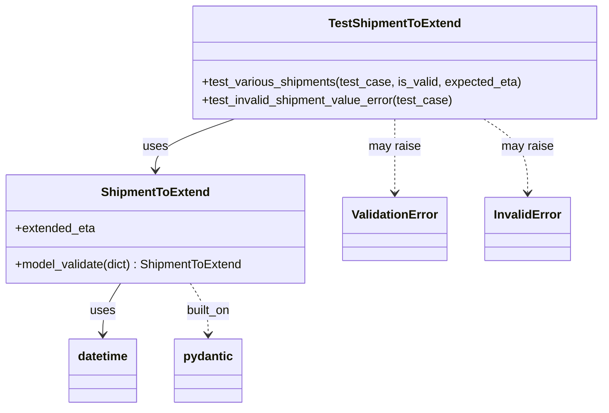

# Diagram: eta/eta_platform_common/eta_platform_common/models/eta_extensions/tests/test_eta_extension_payload.py


> Auto-generated by Obscura crawlers

## Diagram 1



> SVG rendering failed for this diagram.

## Diagram 2

```mermaid
flowchart TD
Start([Start])
CheckEta{Has ETA?}
NoEta([Raise ValidationError])
HasProgress{Progress present?}
ComputeWithProgress([extended_eta = now + (((total_distance * (1 - progress)) / 25) + 24) hours])
CheckLO{last_status_code == "LO"?}
CheckEtaPast{eta is past relative to now?}
NowPlus48([extended_eta = now + 48 hours])
EtaPlus48([extended_eta = eta + 48 hours])
EstimateDistance([extended_eta = now + (total_distance / 25) hours])
End([Return extended_eta])

Start --> CheckEta
CheckEta -- No --> NoEta
CheckEta -- Yes --> HasProgress
HasProgress -- Yes --> ComputeWithProgress --> End
HasProgress -- No --> CheckLO
CheckLO -- Yes --> CheckEtaPast
CheckEtaPast -- Past --> NowPlus48 --> End
CheckEtaPast -- Future --> EtaPlus48 --> End
CheckLO -- No --> EstimateDistance --> End
```

> SVG rendering failed for this diagram.
