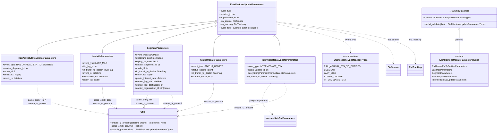

# Diagram: eta/eta_platform_common/eta_platform_common/models/eta_milestone_update/requests.py

> Auto-generated by Obscura crawlers

## Mermaid

```mermaid
classDiagram
class EtaMilestoneUpdateEventTypes <<enumeration>> {
  RAIL_ARRIVAL_ETA_TO_ENTITIES
  SEGMENT
  LAST_MILE
  STATUS_UPDATE
  INTERMEDIATE_ETA
}
class EtaMilestoneUpdateParameters {
  +event_type
  +solution_id: str
  +organization_id: int
  +eta_source: EtaSource
  +eta_tracking: EtaTracking
  +event_time_override: datetime | None
}
class RailArrivalEtaToEntitiesParameters {
  +event_type: RAIL_ARRIVAL_ETA_TO_ENTITIES
  +creator_shipment_id: str
  +mode_id: 2
  +entity_list: list[str]
  +event_ts: datetime
}
class LastMileParameters {
  +event_type: LAST_MILE
  +trip_leg_id: str
  +in_transit_to_dealer: TrueFlag
  +event_ts: datetime
  +destination_eta: datetime
  +entity_list: list[str]
}
class SegmentParameters {
  +event_type: SEGMENT
  +departure: datetime | None
  +replay_segment: bool
  +creator_shipment_id: str
  +mode_id: int
  +in_transit_to_dealer: TrueFlag
  +entity_list: list[str]
  +points_interest_date: datetime
  +current_leg_eta: datetime
  +current_leg_destination: int
  +carrier_organization_id: str | None
}
class StatusUpdateParameters {
  +event_type: STATUS_UPDATE
  +status_update_id: int
  +in_transit_to_dealer: TrueFlag
  +external_entity_id: str
}
class IntermediateEtaUpdateParameters {
  +event_type: INTERMEDIATE_ETA
  +status_update_id: int
  +queryStringParams: IntermediateEtaParameters
  +in_transit_to_dealer: TrueFlag
}
class EtaMilestoneUpdateParametersTypes {
  <<union>>
  RailArrivalEtaToEntitiesParameters
  LastMileParameters
  SegmentParameters
  StatusUpdateParameters
  IntermediateEtaUpdateParameters
}
class _ParamsClassifier {
  +params: EtaMilestoneUpdateParametersTypes
  +model_validate(dict): EtaMilestoneUpdateParametersTypes
}
class Utils {
  +ensure_tz_present(datetime | None): datetime | None
  +parse_entity_list(Any): list[str]
  +classify_params(dict): EtaMilestoneUpdateParametersTypes
}
%% Inheritance
EtaMilestoneUpdateParameters <|-- RailArrivalEtaToEntitiesParameters
EtaMilestoneUpdateParameters <|-- LastMileParameters
EtaMilestoneUpdateParameters <|-- SegmentParameters
EtaMilestoneUpdateParameters <|-- StatusUpdateParameters
EtaMilestoneUpdateParameters <|-- IntermediateEtaUpdateParameters
%% Associations / dependencies
_ParamsClassifier o-- EtaMilestoneUpdateParametersTypes : params
EtaMilestoneUpdateParameters ..> EtaMilestoneUpdateEventTypes : event_type
EtaMilestoneUpdateParameters ..> EtaSource : eta_source
EtaMilestoneUpdateParameters ..> EtaTracking : eta_tracking
IntermediateEtaUpdateParameters ..> IntermediateEtaParameters : queryStringParams
RailArrivalEtaToEntitiesParameters ..> Utils : parse_entity_list / ensure_tz_present
LastMileParameters ..> Utils : parse_entity_list / ensure_tz_present
SegmentParameters ..> Utils : parse_entity_list / ensure_tz_present
SegmentParameters ..> Utils : ensure_tz_present
StatusUpdateParameters ..> Utils : ensure_tz_present
IntermediateEtaUpdateParameters ..> Utils : ensure_tz_present
```

> SVG rendering failed for this diagram.
