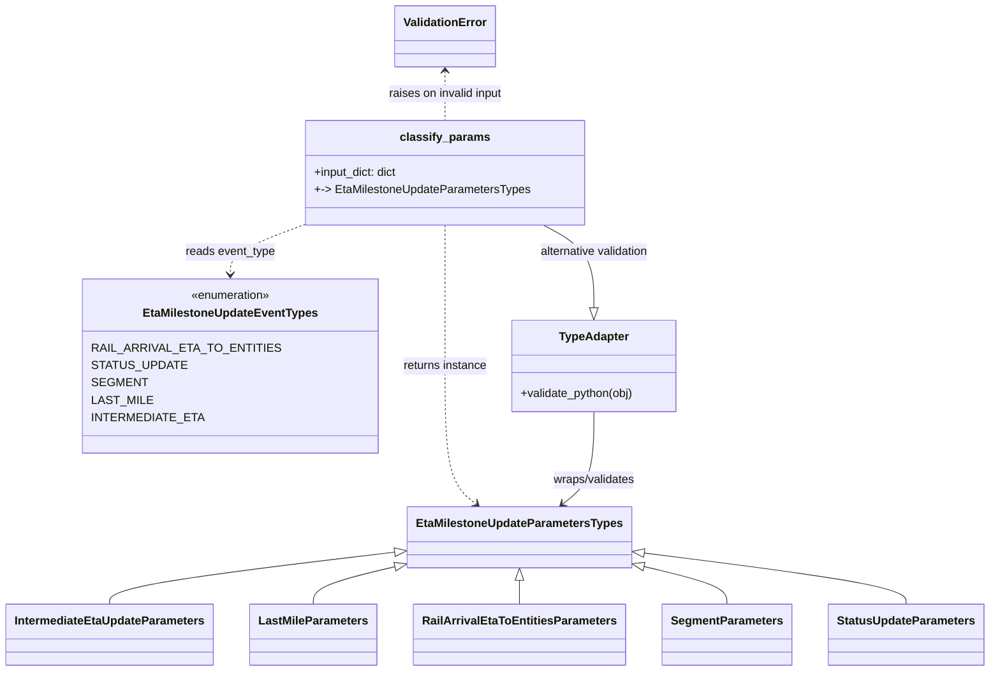
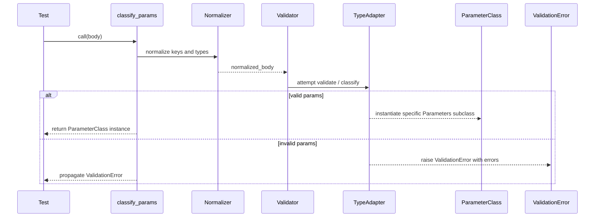

# Diagram: eta/eta_platform_common/eta_platform_common/models/eta_milestone_update/tests/test_requests_eta_milestone_update.py

> Auto-generated by Obscura crawlers

## Diagram 1

### SVG

<svg id="container" width="1319.78125" xmlns="http://www.w3.org/2000/svg" class="classDiagram" height="924" viewBox="0 0 1319.78125 924" role="graphics-document document" aria-roledescription="class"><g><defs><marker id="container_class-aggregationStart" class="marker aggregation class" refX="18" refY="7" markerWidth="190" markerHeight="240" orient="auto"><path d="M 18,7 L9,13 L1,7 L9,1 Z"></path></marker></defs><defs><marker id="container_class-aggregationEnd" class="marker aggregation class" refX="1" refY="7" markerWidth="20" markerHeight="28" orient="auto"><path d="M 18,7 L9,13 L1,7 L9,1 Z"></path></marker></defs><defs><marker id="container_class-extensionStart" class="marker extension class" refX="18" refY="7" markerWidth="190" markerHeight="240" orient="auto"><path d="M 1,7 L18,13 V 1 Z"></path></marker></defs><defs><marker id="container_class-extensionEnd" class="marker extension class" refX="1" refY="7" markerWidth="20" markerHeight="28" orient="auto"><path d="M 1,1 V 13 L18,7 Z"></path></marker></defs><defs><marker id="container_class-compositionStart" class="marker composition class" refX="18" refY="7" markerWidth="190" markerHeight="240" orient="auto"><path d="M 18,7 L9,13 L1,7 L9,1 Z"></path></marker></defs><defs><marker id="container_class-compositionEnd" class="marker composition class" refX="1" refY="7" markerWidth="20" markerHeight="28" orient="auto"><path d="M 18,7 L9,13 L1,7 L9,1 Z"></path></marker></defs><defs><marker id="container_class-dependencyStart" class="marker dependency class" refX="6" refY="7" markerWidth="190" markerHeight="240" orient="auto"><path d="M 5,7 L9,13 L1,7 L9,1 Z"></path></marker></defs><defs><marker id="container_class-dependencyEnd" class="marker dependency class" refX="13" refY="7" markerWidth="20" markerHeight="28" orient="auto"><path d="M 18,7 L9,13 L14,7 L9,1 Z"></path></marker></defs><defs><marker id="container_class-lollipopStart" class="marker lollipop class" refX="13" refY="7" markerWidth="190" markerHeight="240" orient="auto"><circle stroke="black" fill="transparent" cx="7" cy="7" r="6"></circle></marker></defs><defs><marker id="container_class-lollipopEnd" class="marker lollipop class" refX="1" refY="7" markerWidth="190" markerHeight="240" orient="auto"><circle stroke="black" fill="transparent" cx="7" cy="7" r="6"></circle></marker></defs><g class="root"><g class="clusters"></g><g class="edgePaths"><path d="M527.964,760.31L464.482,768.092C400.999,775.874,274.035,791.437,210.553,803.385C147.07,815.333,147.07,823.667,147.07,827.833L147.07,832" id="id_EtaMilestoneUpdateParametersTypes_IntermediateEtaUpdateParameters_1" class="edge-thickness-normal edge-pattern-solid relation" style=";;;" data-edge="true" data-et="edge" data-id="id_EtaMilestoneUpdateParametersTypes_IntermediateEtaUpdateParameters_1" data-points="W3sieCI6NTQ1LjA4NTkzNzUsInkiOjc1OC4yMTE2MTE4NTE5Nzg5fSx7IngiOjE0Ny4wNzAzMTI1LCJ5Ijo4MDd9LHsieCI6MTQ3LjA3MDMxMjUsInkiOjgzMn1d" marker-start="url(#container_class-extensionStart)"></path><path d="M528.332,780.523L510.329,784.936C492.325,789.349,456.319,798.174,438.316,806.754C420.313,815.333,420.313,823.667,420.313,827.833L420.313,832" id="id_EtaMilestoneUpdateParametersTypes_LastMileParameters_2" class="edge-thickness-normal edge-pattern-solid relation" style=";;;" data-edge="true" data-et="edge" data-id="id_EtaMilestoneUpdateParametersTypes_LastMileParameters_2" data-points="W3sieCI6NTQ1LjA4NTkzNzUsInkiOjc3Ni40MTY0NTcwNzA5OTU4fSx7IngiOjQyMC4zMTI1LCJ5Ijo4MDd9LHsieCI6NDIwLjMxMjUsInkiOjgzMn1d" marker-start="url(#container_class-extensionStart)"></path><path d="M693.656,799.25L693.656,800.542C693.656,801.833,693.656,804.417,693.656,809.875C693.656,815.333,693.656,823.667,693.656,827.833L693.656,832" id="id_EtaMilestoneUpdateParametersTypes_RailArrivalEtaToEntitiesParameters_3" class="edge-thickness-normal edge-pattern-solid relation" style=";;;" data-edge="true" data-et="edge" data-id="id_EtaMilestoneUpdateParametersTypes_RailArrivalEtaToEntitiesParameters_3" data-points="W3sieCI6NjkzLjY1NjI1LCJ5Ijo3ODJ9LHsieCI6NjkzLjY1NjI1LCJ5Ijo4MDd9LHsieCI6NjkzLjY1NjI1LCJ5Ijo4MzJ9XQ==" marker-start="url(#container_class-extensionStart)"></path><path d="M858.986,780.274L877.273,784.728C895.559,789.182,932.131,798.091,950.417,806.712C968.703,815.333,968.703,823.667,968.703,827.833L968.703,832" id="id_EtaMilestoneUpdateParametersTypes_SegmentParameters_4" class="edge-thickness-normal edge-pattern-solid relation" style=";;;" data-edge="true" data-et="edge" data-id="id_EtaMilestoneUpdateParametersTypes_SegmentParameters_4" data-points="W3sieCI6ODQyLjIyNjU2MjUsInkiOjc3Ni4xOTA5NjE3Njc4ODA1fSx7IngiOjk2OC43MDMxMjUsInkiOjgwN30seyJ4Ijo5NjguNzAzMTI1LCJ5Ijo4MzJ9XQ==" marker-start="url(#container_class-extensionStart)"></path><path d="M859.332,761.574L917.473,769.145C975.615,776.716,1091.897,791.858,1150.038,803.596C1208.18,815.333,1208.18,823.667,1208.18,827.833L1208.18,832" id="id_EtaMilestoneUpdateParametersTypes_StatusUpdateParameters_5" class="edge-thickness-normal edge-pattern-solid relation" style=";;;" data-edge="true" data-et="edge" data-id="id_EtaMilestoneUpdateParametersTypes_StatusUpdateParameters_5" data-points="W3sieCI6ODQyLjIyNjU2MjUsInkiOjc1OS4zNDY0Njc0NTMxOTU1fSx7IngiOjEyMDguMTc5Njg3NSwieSI6ODA3fSx7IngiOjEyMDguMTc5Njg3NSwieSI6ODMyfV0=" marker-start="url(#container_class-extensionStart)"></path><path d="M405.707,310L389.975,316.167C374.244,322.333,342.781,334.667,327.05,346C311.318,357.333,311.318,367.667,311.318,372.833L311.318,378" id="id_classify_params_EtaMilestoneUpdateEventTypes_6" class="edge-thickness-normal edge-pattern-dashed relation" style=";;;" data-edge="true" data-et="edge" data-id="id_classify_params_EtaMilestoneUpdateEventTypes_6" data-points="W3sieCI6NDA1LjcwNjU0NzQ0ODM5NDUzLCJ5IjozMTB9LHsieCI6MzExLjMxODM1OTM3NSwieSI6MzQ3fSx7IngiOjMxMS4zMTgzNTkzNzUsInkiOjM4NH1d" marker-end="url(#container_class-dependencyEnd)"></path><path d="M589.381,310L589.381,316.167C589.381,322.333,589.381,334.667,589.381,367C589.381,399.333,589.381,451.667,589.381,504C589.381,556.333,589.381,608.667,596.723,640.396C604.066,672.126,618.751,683.251,626.094,688.814L633.436,694.377" id="id_classify_params_EtaMilestoneUpdateParametersTypes_7" class="edge-thickness-normal edge-pattern-dashed relation" style=";;;" data-edge="true" data-et="edge" data-id="id_classify_params_EtaMilestoneUpdateParametersTypes_7" data-points="W3sieCI6NTg5LjM4MDg1OTM3NSwieSI6MzEwfSx7IngiOjU4OS4zODA4NTkzNzUsInkiOjM0N30seyJ4Ijo1ODkuMzgwODU5Mzc1LCJ5Ijo1MDR9LHsieCI6NTg5LjM4MDg1OTM3NSwieSI6NjYxfSx7IngiOjYzOC4yMTg3MDA1NTM3OTc1LCJ5Ijo2OTh9XQ==" marker-end="url(#container_class-dependencyEnd)"></path><path d="M797.932,567L797.932,582.667C797.932,598.333,797.932,629.667,790.589,650.896C783.247,672.126,768.561,683.251,761.219,688.814L753.876,694.377" id="id_TypeAdapter_EtaMilestoneUpdateParametersTypes_8" class="edge-thickness-normal edge-pattern-solid relation" style=";;;" data-edge="true" data-et="edge" data-id="id_TypeAdapter_EtaMilestoneUpdateParametersTypes_8" data-points="W3sieCI6Nzk3LjkzMTY0MDYyNSwieSI6NTY3fSx7IngiOjc5Ny45MzE2NDA2MjUsInkiOjY2MX0seyJ4Ijo3NDkuMDkzNzk5NDQ2MjAyNSwieSI6Njk4fV0=" marker-end="url(#container_class-dependencyEnd)"></path><path d="M727.139,310L738.938,316.167C750.737,322.333,774.334,334.667,786.133,353.625C797.932,372.583,797.932,398.167,797.932,410.958L797.932,423.75" id="id_classify_params_TypeAdapter_9" class="edge-thickness-normal edge-pattern-solid relation" style=";;;" data-edge="true" data-et="edge" data-id="id_classify_params_TypeAdapter_9" data-points="W3sieCI6NzI3LjEzOTE3MzU5NTE4MzUsInkiOjMxMH0seyJ4Ijo3OTcuOTMxNjQwNjI1LCJ5IjozNDd9LHsieCI6Nzk3LjkzMTY0MDYyNSwieSI6NDQxfV0=" marker-end="url(#container_class-extensionEnd)"></path><path d="M589.381,98L589.381,103.167C589.381,108.333,589.381,118.667,589.381,130C589.381,141.333,589.381,153.667,589.381,159.833L589.381,166" id="id_ValidationError_classify_params_10" class="edge-thickness-normal edge-pattern-dashed relation" style=";;;" data-edge="true" data-et="edge" data-id="id_ValidationError_classify_params_10" data-points="W3sieCI6NTg5LjM4MDg1OTM3NSwieSI6OTJ9LHsieCI6NTg5LjM4MDg1OTM3NSwieSI6MTI5fSx7IngiOjU4OS4zODA4NTkzNzUsInkiOjE2Nn1d" marker-start="url(#container_class-dependencyStart)"></path></g><g class="edgeLabels"><g class="edgeLabel"><g class="label" data-id="id_EtaMilestoneUpdateParametersTypes_IntermediateEtaUpdateParameters_1" transform="translate(0, 0)"><foreignObject width="0" height="0">

</foreignObject></g></g><g class="edgeLabel"><g class="label" data-id="id_EtaMilestoneUpdateParametersTypes_LastMileParameters_2" transform="translate(0, 0)"><foreignObject width="0" height="0">

</foreignObject></g></g><g class="edgeLabel"><g class="label" data-id="id_EtaMilestoneUpdateParametersTypes_RailArrivalEtaToEntitiesParameters_3" transform="translate(0, 0)"><foreignObject width="0" height="0">

</foreignObject></g></g><g class="edgeLabel"><g class="label" data-id="id_EtaMilestoneUpdateParametersTypes_SegmentParameters_4" transform="translate(0, 0)"><foreignObject width="0" height="0">

</foreignObject></g></g><g class="edgeLabel"><g class="label" data-id="id_EtaMilestoneUpdateParametersTypes_StatusUpdateParameters_5" transform="translate(0, 0)"><foreignObject width="0" height="0">

</foreignObject></g></g><g class="edgeLabel" transform="translate(311.318359375, 347)"><g class="label" data-id="id_classify_params_EtaMilestoneUpdateEventTypes_6" transform="translate(-62.1875, -12)"><foreignObject width="124.375" height="24">

reads event_type

</foreignObject></g></g><g class="edgeLabel" transform="translate(589.380859375, 504)"><g class="label" data-id="id_classify_params_EtaMilestoneUpdateParametersTypes_7" transform="translate(-58.9609375, -12)"><foreignObject width="117.921875" height="24">

returns instance

</foreignObject></g></g><g class="edgeLabel" transform="translate(797.931640625, 661)"><g class="label" data-id="id_TypeAdapter_EtaMilestoneUpdateParametersTypes_8" transform="translate(-58.0703125, -12)"><foreignObject width="116.140625" height="24">

wraps/validates

</foreignObject></g></g><g class="edgeLabel" transform="translate(797.931640625, 347)"><g class="label" data-id="id_classify_params_TypeAdapter_9" transform="translate(-77.7265625, -12)"><foreignObject width="155.453125" height="24">

alternative validation

</foreignObject></g></g><g class="edgeLabel" transform="translate(589.380859375, 129)"><g class="label" data-id="id_ValidationError_classify_params_10" transform="translate(-80.5625, -12)"><foreignObject width="161.125" height="24">

raises on invalid input

</foreignObject></g></g></g><g class="nodes"><g class="node default" id="classId-EtaMilestoneUpdateEventTypes-0" transform="translate(311.318359375, 504)"><g class="basic label-container"><path d="M-184.1015625 -120 L184.1015625 -120 L184.1015625 120 L-184.1015625 120" stroke="none" stroke-width="0" fill="#ECECFF" style=""></path><path d="M-184.1015625 -120 C-106.87737557146671 -120, -29.65318864293343 -120, 184.1015625 -120 M-184.1015625 -120 C-78.61621182926984 -120, 26.869138841460313 -120, 184.1015625 -120 M184.1015625 -120 C184.1015625 -45.755041396528256, 184.1015625 28.48991720694349, 184.1015625 120 M184.1015625 -120 C184.1015625 -70.33824246806103, 184.1015625 -20.67648493612205, 184.1015625 120 M184.1015625 120 C48.46565081245288 120, -87.17026087509424 120, -184.1015625 120 M184.1015625 120 C37.65177510830574 120, -108.79801228338852 120, -184.1015625 120 M-184.1015625 120 C-184.1015625 39.20923074040623, -184.1015625 -41.581538519187546, -184.1015625 -120 M-184.1015625 120 C-184.1015625 27.330973585624733, -184.1015625 -65.33805282875053, -184.1015625 -120" stroke="#9370DB" stroke-width="1.3" fill="none" stroke-dasharray="0 0" style=""></path></g><g class="annotation-group text" transform="translate(-55.5546875, -96)"><g class="label" style="" transform="translate(0,-12)"><foreignObject width="111.109375" height="24">

«enumeration»

</foreignObject></g></g><g class="label-group text" transform="translate(-115.1875, -72)"><g class="label" style="font-weight: bolder" transform="translate(0,-12)"><foreignObject width="230.375" height="24">

EtaMilestoneUpdateEventTypes

</foreignObject></g></g><g class="members-group text" transform="translate(-172.1015625, -24)"><g class="label" style="" transform="translate(0,-12)"><foreignObject width="229.015625" height="24">

RAIL_ARRIVAL_ETA_TO_ENTITIES

</foreignObject></g><g class="label" style="" transform="translate(0,12)"><foreignObject width="114.28125" height="24">

STATUS_UPDATE

</foreignObject></g><g class="label" style="" transform="translate(0,36)"><foreignObject width="67.40625" height="24">

SEGMENT

</foreignObject></g><g class="label" style="" transform="translate(0,60)"><foreignObject width="75" height="24">

LAST_MILE

</foreignObject></g><g class="label" style="" transform="translate(0,84)"><foreignObject width="136.921875" height="24">

INTERMEDIATE_ETA

</foreignObject></g></g><g class="methods-group text" transform="translate(-172.1015625, 120)"></g><g class="divider" style=""><path d="M-184.1015625 -48 C-44.29462632795395 -48, 95.5123098440921 -48, 184.1015625 -48 M-184.1015625 -48 C-107.70779446000415 -48, -31.314026420008304 -48, 184.1015625 -48" stroke="#9370DB" stroke-width="1.3" fill="none" stroke-dasharray="0 0" style=""></path></g><g class="divider" style=""><path d="M-184.1015625 96 C-39.10947154204678 96, 105.88261941590645 96, 184.1015625 96 M-184.1015625 96 C-96.1506640680935 96, -8.19976563618701 96, 184.1015625 96" stroke="#9370DB" stroke-width="1.3" fill="none" stroke-dasharray="0 0" style=""></path></g></g><g class="node default" id="classId-EtaMilestoneUpdateParametersTypes-1" transform="translate(693.65625, 740)"><g class="basic label-container"><path d="M-148.5703125 -42 L148.5703125 -42 L148.5703125 42 L-148.5703125 42" stroke="none" stroke-width="0" fill="#ECECFF" style=""></path><path d="M-148.5703125 -42 C-45.45198561862216 -42, 57.66634126275568 -42, 148.5703125 -42 M-148.5703125 -42 C-36.70054828335135 -42, 75.1692159332973 -42, 148.5703125 -42 M148.5703125 -42 C148.5703125 -9.507863533692039, 148.5703125 22.984272932615923, 148.5703125 42 M148.5703125 -42 C148.5703125 -21.748856698780415, 148.5703125 -1.4977133975608297, 148.5703125 42 M148.5703125 42 C64.09686819104134 42, -20.376576117917324 42, -148.5703125 42 M148.5703125 42 C40.64660251642465 42, -67.2771074671507 42, -148.5703125 42 M-148.5703125 42 C-148.5703125 19.339826153141097, -148.5703125 -3.3203476937178067, -148.5703125 -42 M-148.5703125 42 C-148.5703125 11.448444505114207, -148.5703125 -19.103110989771587, -148.5703125 -42" stroke="#9370DB" stroke-width="1.3" fill="none" stroke-dasharray="0 0" style=""></path></g><g class="annotation-group text" transform="translate(0, -18)"></g><g class="label-group text" transform="translate(-136.5703125, -18)"><g class="label" style="font-weight: bolder" transform="translate(0,-12)"><foreignObject width="273.140625" height="24">

EtaMilestoneUpdateParametersTypes

</foreignObject></g></g><g class="members-group text" transform="translate(-136.5703125, 30)"></g><g class="methods-group text" transform="translate(-136.5703125, 60)"></g><g class="divider" style=""><path d="M-148.5703125 6 C-64.22163214034563 6, 20.127048219308733 6, 148.5703125 6 M-148.5703125 6 C-52.590682362957594 6, 43.38894777408481 6, 148.5703125 6" stroke="#9370DB" stroke-width="1.3" fill="none" stroke-dasharray="0 0" style=""></path></g><g class="divider" style=""><path d="M-148.5703125 24 C-62.86437272265478 24, 22.841567054690444 24, 148.5703125 24 M-148.5703125 24 C-38.084844701693825 24, 72.40062309661235 24, 148.5703125 24" stroke="#9370DB" stroke-width="1.3" fill="none" stroke-dasharray="0 0" style=""></path></g></g><g class="node default" id="classId-IntermediateEtaUpdateParameters-2" transform="translate(147.0703125, 874)"><g class="basic label-container"><path d="M-139.0703125 -42 L139.0703125 -42 L139.0703125 42 L-139.0703125 42" stroke="none" stroke-width="0" fill="#ECECFF" style=""></path><path d="M-139.0703125 -42 C-31.153283203459765 -42, 76.76374609308047 -42, 139.0703125 -42 M-139.0703125 -42 C-29.329627960399748 -42, 80.4110565792005 -42, 139.0703125 -42 M139.0703125 -42 C139.0703125 -13.112922582551366, 139.0703125 15.774154834897267, 139.0703125 42 M139.0703125 -42 C139.0703125 -19.520344952351792, 139.0703125 2.9593100952964164, 139.0703125 42 M139.0703125 42 C59.33625899782939 42, -20.39779450434122 42, -139.0703125 42 M139.0703125 42 C69.74067794111413 42, 0.4110433822282573 42, -139.0703125 42 M-139.0703125 42 C-139.0703125 13.997056634447475, -139.0703125 -14.00588673110505, -139.0703125 -42 M-139.0703125 42 C-139.0703125 15.560371983383831, -139.0703125 -10.879256033232338, -139.0703125 -42" stroke="#9370DB" stroke-width="1.3" fill="none" stroke-dasharray="0 0" style=""></path></g><g class="annotation-group text" transform="translate(0, -18)"></g><g class="label-group text" transform="translate(-127.0703125, -18)"><g class="label" style="font-weight: bolder" transform="translate(0,-12)"><foreignObject width="254.140625" height="24">

IntermediateEtaUpdateParameters

</foreignObject></g></g><g class="members-group text" transform="translate(-127.0703125, 30)"></g><g class="methods-group text" transform="translate(-127.0703125, 60)"></g><g class="divider" style=""><path d="M-139.0703125 6 C-77.63108475067642 6, -16.191857001352858 6, 139.0703125 6 M-139.0703125 6 C-63.69420286216945 6, 11.681906775661105 6, 139.0703125 6" stroke="#9370DB" stroke-width="1.3" fill="none" stroke-dasharray="0 0" style=""></path></g><g class="divider" style=""><path d="M-139.0703125 24 C-69.63959628122042 24, -0.20888006244084067 24, 139.0703125 24 M-139.0703125 24 C-61.855627772148836 24, 15.359056955702329 24, 139.0703125 24" stroke="#9370DB" stroke-width="1.3" fill="none" stroke-dasharray="0 0" style=""></path></g></g><g class="node default" id="classId-LastMileParameters-3" transform="translate(420.3125, 874)"><g class="basic label-container"><path d="M-84.171875 -42 L84.171875 -42 L84.171875 42 L-84.171875 42" stroke="none" stroke-width="0" fill="#ECECFF" style=""></path><path d="M-84.171875 -42 C-41.18915423303651 -42, 1.7935665339269775 -42, 84.171875 -42 M-84.171875 -42 C-22.58435402671425 -42, 39.0031669465715 -42, 84.171875 -42 M84.171875 -42 C84.171875 -18.328531931831318, 84.171875 5.342936136337364, 84.171875 42 M84.171875 -42 C84.171875 -23.75665159168859, 84.171875 -5.513303183377182, 84.171875 42 M84.171875 42 C18.320744878248945 42, -47.53038524350211 42, -84.171875 42 M84.171875 42 C50.32182338872643 42, 16.471771777452858 42, -84.171875 42 M-84.171875 42 C-84.171875 11.526302675961883, -84.171875 -18.947394648076234, -84.171875 -42 M-84.171875 42 C-84.171875 17.226636835258446, -84.171875 -7.546726329483107, -84.171875 -42" stroke="#9370DB" stroke-width="1.3" fill="none" stroke-dasharray="0 0" style=""></path></g><g class="annotation-group text" transform="translate(0, -18)"></g><g class="label-group text" transform="translate(-72.171875, -18)"><g class="label" style="font-weight: bolder" transform="translate(0,-12)"><foreignObject width="144.34375" height="24">

LastMileParameters

</foreignObject></g></g><g class="members-group text" transform="translate(-72.171875, 30)"></g><g class="methods-group text" transform="translate(-72.171875, 60)"></g><g class="divider" style=""><path d="M-84.171875 6 C-49.357700448453556 6, -14.543525896907113 6, 84.171875 6 M-84.171875 6 C-35.944329736315595 6, 12.28321552736881 6, 84.171875 6" stroke="#9370DB" stroke-width="1.3" fill="none" stroke-dasharray="0 0" style=""></path></g><g class="divider" style=""><path d="M-84.171875 24 C-48.84111910723839 24, -13.510363214476783 24, 84.171875 24 M-84.171875 24 C-19.340726252865053 24, 45.49042249426989 24, 84.171875 24" stroke="#9370DB" stroke-width="1.3" fill="none" stroke-dasharray="0 0" style=""></path></g></g><g class="node default" id="classId-RailArrivalEtaToEntitiesParameters-4" transform="translate(693.65625, 874)"><g class="basic label-container"><path d="M-139.171875 -42 L139.171875 -42 L139.171875 42 L-139.171875 42" stroke="none" stroke-width="0" fill="#ECECFF" style=""></path><path d="M-139.171875 -42 C-63.156203814635816 -42, 12.859467370728368 -42, 139.171875 -42 M-139.171875 -42 C-64.05665963378318 -42, 11.058555732433632 -42, 139.171875 -42 M139.171875 -42 C139.171875 -19.79577497813922, 139.171875 2.408450043721558, 139.171875 42 M139.171875 -42 C139.171875 -20.74330244077509, 139.171875 0.5133951184498216, 139.171875 42 M139.171875 42 C54.52129411364966 42, -30.12928677270068 42, -139.171875 42 M139.171875 42 C62.88290032467337 42, -13.406074350653256 42, -139.171875 42 M-139.171875 42 C-139.171875 15.52166932174675, -139.171875 -10.956661356506501, -139.171875 -42 M-139.171875 42 C-139.171875 17.365886870030224, -139.171875 -7.268226259939553, -139.171875 -42" stroke="#9370DB" stroke-width="1.3" fill="none" stroke-dasharray="0 0" style=""></path></g><g class="annotation-group text" transform="translate(0, -18)"></g><g class="label-group text" transform="translate(-127.171875, -18)"><g class="label" style="font-weight: bolder" transform="translate(0,-12)"><foreignObject width="254.34375" height="24">

RailArrivalEtaToEntitiesParameters

</foreignObject></g></g><g class="members-group text" transform="translate(-127.171875, 30)"></g><g class="methods-group text" transform="translate(-127.171875, 60)"></g><g class="divider" style=""><path d="M-139.171875 6 C-80.97017937613732 6, -22.768483752274648 6, 139.171875 6 M-139.171875 6 C-65.95498031934403 6, 7.261914361311938 6, 139.171875 6" stroke="#9370DB" stroke-width="1.3" fill="none" stroke-dasharray="0 0" style=""></path></g><g class="divider" style=""><path d="M-139.171875 24 C-78.43235133079932 24, -17.692827661598642 24, 139.171875 24 M-139.171875 24 C-41.90082589769918 24, 55.37022320460164 24, 139.171875 24" stroke="#9370DB" stroke-width="1.3" fill="none" stroke-dasharray="0 0" style=""></path></g></g><g class="node default" id="classId-SegmentParameters-5" transform="translate(968.703125, 874)"><g class="basic label-container"><path d="M-85.875 -42 L85.875 -42 L85.875 42 L-85.875 42" stroke="none" stroke-width="0" fill="#ECECFF" style=""></path><path d="M-85.875 -42 C-33.43370957711696 -42, 19.007580845766086 -42, 85.875 -42 M-85.875 -42 C-29.321875393943493 -42, 27.231249212113013 -42, 85.875 -42 M85.875 -42 C85.875 -22.839345838785725, 85.875 -3.67869167757145, 85.875 42 M85.875 -42 C85.875 -19.197812974390402, 85.875 3.604374051219196, 85.875 42 M85.875 42 C30.478656850192692 42, -24.917686299614616 42, -85.875 42 M85.875 42 C28.743507462901796 42, -28.387985074196408 42, -85.875 42 M-85.875 42 C-85.875 13.929898974094044, -85.875 -14.140202051811912, -85.875 -42 M-85.875 42 C-85.875 23.971696959640692, -85.875 5.943393919281384, -85.875 -42" stroke="#9370DB" stroke-width="1.3" fill="none" stroke-dasharray="0 0" style=""></path></g><g class="annotation-group text" transform="translate(0, -18)"></g><g class="label-group text" transform="translate(-73.875, -18)"><g class="label" style="font-weight: bolder" transform="translate(0,-12)"><foreignObject width="147.75" height="24">

SegmentParameters

</foreignObject></g></g><g class="members-group text" transform="translate(-73.875, 30)"></g><g class="methods-group text" transform="translate(-73.875, 60)"></g><g class="divider" style=""><path d="M-85.875 6 C-30.88688401329744 6, 24.10123197340512 6, 85.875 6 M-85.875 6 C-22.288062500214593 6, 41.29887499957081 6, 85.875 6" stroke="#9370DB" stroke-width="1.3" fill="none" stroke-dasharray="0 0" style=""></path></g><g class="divider" style=""><path d="M-85.875 24 C-34.45336711370883 24, 16.968265772582342 24, 85.875 24 M-85.875 24 C-36.534599257066596 24, 12.805801485866809 24, 85.875 24" stroke="#9370DB" stroke-width="1.3" fill="none" stroke-dasharray="0 0" style=""></path></g></g><g class="node default" id="classId-StatusUpdateParameters-6" transform="translate(1208.1796875, 874)"><g class="basic label-container"><path d="M-103.6015625 -42 L103.6015625 -42 L103.6015625 42 L-103.6015625 42" stroke="none" stroke-width="0" fill="#ECECFF" style=""></path><path d="M-103.6015625 -42 C-36.00586115391907 -42, 31.58984019216186 -42, 103.6015625 -42 M-103.6015625 -42 C-55.47109754906368 -42, -7.340632598127357 -42, 103.6015625 -42 M103.6015625 -42 C103.6015625 -12.166436355240403, 103.6015625 17.667127289519193, 103.6015625 42 M103.6015625 -42 C103.6015625 -11.943662984060587, 103.6015625 18.112674031878825, 103.6015625 42 M103.6015625 42 C60.37205271991753 42, 17.142542939835053 42, -103.6015625 42 M103.6015625 42 C38.562549675275335 42, -26.47646314944933 42, -103.6015625 42 M-103.6015625 42 C-103.6015625 15.065009473271061, -103.6015625 -11.869981053457877, -103.6015625 -42 M-103.6015625 42 C-103.6015625 14.65141365403786, -103.6015625 -12.69717269192428, -103.6015625 -42" stroke="#9370DB" stroke-width="1.3" fill="none" stroke-dasharray="0 0" style=""></path></g><g class="annotation-group text" transform="translate(0, -18)"></g><g class="label-group text" transform="translate(-91.6015625, -18)"><g class="label" style="font-weight: bolder" transform="translate(0,-12)"><foreignObject width="183.203125" height="24">

StatusUpdateParameters

</foreignObject></g></g><g class="members-group text" transform="translate(-91.6015625, 30)"></g><g class="methods-group text" transform="translate(-91.6015625, 60)"></g><g class="divider" style=""><path d="M-103.6015625 6 C-49.49632768562204 6, 4.6089071287559165 6, 103.6015625 6 M-103.6015625 6 C-49.187829413874404 6, 5.225903672251192 6, 103.6015625 6" stroke="#9370DB" stroke-width="1.3" fill="none" stroke-dasharray="0 0" style=""></path></g><g class="divider" style=""><path d="M-103.6015625 24 C-45.24706197599612 24, 13.107438548007764 24, 103.6015625 24 M-103.6015625 24 C-53.260140807284074 24, -2.918719114568148 24, 103.6015625 24" stroke="#9370DB" stroke-width="1.3" fill="none" stroke-dasharray="0 0" style=""></path></g></g><g class="node default" id="classId-classify_params-7" transform="translate(589.380859375, 238)"><g class="basic label-container"><path d="M-188.90625 -72 L188.90625 -72 L188.90625 72 L-188.90625 72" stroke="none" stroke-width="0" fill="#ECECFF" style=""></path><path d="M-188.90625 -72 C-60.3960578525446 -72, 68.1141342949108 -72, 188.90625 -72 M-188.90625 -72 C-95.24715030845964 -72, -1.5880506169192756 -72, 188.90625 -72 M188.90625 -72 C188.90625 -17.382865905659656, 188.90625 37.23426818868069, 188.90625 72 M188.90625 -72 C188.90625 -39.33662947844264, 188.90625 -6.673258956885277, 188.90625 72 M188.90625 72 C48.44755712969632 72, -92.01113574060736 72, -188.90625 72 M188.90625 72 C100.2699254630167 72, 11.63360092603341 72, -188.90625 72 M-188.90625 72 C-188.90625 40.148633350702646, -188.90625 8.297266701405292, -188.90625 -72 M-188.90625 72 C-188.90625 22.051139563089357, -188.90625 -27.897720873821285, -188.90625 -72" stroke="#9370DB" stroke-width="1.3" fill="none" stroke-dasharray="0 0" style=""></path></g><g class="annotation-group text" transform="translate(0, -48)"></g><g class="label-group text" transform="translate(-58.328125, -48)"><g class="label" style="font-weight: bolder" transform="translate(0,-12)"><foreignObject width="116.65625" height="24">

classify_params

</foreignObject></g></g><g class="members-group text" transform="translate(-176.90625, 0)"><g class="label" style="" transform="translate(0,-12)"><foreignObject width="117.625" height="24">

+input_dict: dict

</foreignObject></g><g class="label" style="" transform="translate(0,12)"><foreignObject width="295.484375" height="24">

+-&gt; EtaMilestoneUpdateParametersTypes

</foreignObject></g></g><g class="methods-group text" transform="translate(-176.90625, 72)"></g><g class="divider" style=""><path d="M-188.90625 -24 C-58.64822219334994 -24, 71.60980561330013 -24, 188.90625 -24 M-188.90625 -24 C-71.44938534806298 -24, 46.00747930387405 -24, 188.90625 -24" stroke="#9370DB" stroke-width="1.3" fill="none" stroke-dasharray="0 0" style=""></path></g><g class="divider" style=""><path d="M-188.90625 48 C-95.08080299350509 48, -1.2553559870101765 48, 188.90625 48 M-188.90625 48 C-97.0293915489779 48, -5.152533097955796 48, 188.90625 48" stroke="#9370DB" stroke-width="1.3" fill="none" stroke-dasharray="0 0" style=""></path></g></g><g class="node default" id="classId-TypeAdapter-8" transform="translate(797.931640625, 504)"><g class="basic label-container"><path d="M-114.58984375 -63 L114.58984375 -63 L114.58984375 63 L-114.58984375 63" stroke="none" stroke-width="0" fill="#ECECFF" style=""></path><path d="M-114.58984375 -63 C-58.175652927411214 -63, -1.761462104822428 -63, 114.58984375 -63 M-114.58984375 -63 C-50.04744881568578 -63, 14.494946118628434 -63, 114.58984375 -63 M114.58984375 -63 C114.58984375 -24.369927649980276, 114.58984375 14.260144700039447, 114.58984375 63 M114.58984375 -63 C114.58984375 -30.52395669987269, 114.58984375 1.952086600254617, 114.58984375 63 M114.58984375 63 C56.304427864737455 63, -1.9809880205250892 63, -114.58984375 63 M114.58984375 63 C57.46868243993704 63, 0.3475211298740817 63, -114.58984375 63 M-114.58984375 63 C-114.58984375 21.105039044136355, -114.58984375 -20.78992191172729, -114.58984375 -63 M-114.58984375 63 C-114.58984375 16.05025213179053, -114.58984375 -30.89949573641894, -114.58984375 -63" stroke="#9370DB" stroke-width="1.3" fill="none" stroke-dasharray="0 0" style=""></path></g><g class="annotation-group text" transform="translate(0, -39)"></g><g class="label-group text" transform="translate(-46.5859375, -39)"><g class="label" style="font-weight: bolder" transform="translate(0,-12)"><foreignObject width="93.171875" height="24">

TypeAdapter

</foreignObject></g></g><g class="members-group text" transform="translate(-102.58984375, 9)"></g><g class="methods-group text" transform="translate(-102.58984375, 39)"><g class="label" style="" transform="translate(0,-12)"><foreignObject width="158.59375" height="24">

+validate_python(obj)

</foreignObject></g></g><g class="divider" style=""><path d="M-114.58984375 -15 C-41.90511345934381 -15, 30.77961683131238 -15, 114.58984375 -15 M-114.58984375 -15 C-28.520114778549427 -15, 57.549614192901146 -15, 114.58984375 -15" stroke="#9370DB" stroke-width="1.3" fill="none" stroke-dasharray="0 0" style=""></path></g><g class="divider" style=""><path d="M-114.58984375 9 C-45.562719525729364 9, 23.464404698541273 9, 114.58984375 9 M-114.58984375 9 C-33.903032010949175 9, 46.78377972810165 9, 114.58984375 9" stroke="#9370DB" stroke-width="1.3" fill="none" stroke-dasharray="0 0" style=""></path></g></g><g class="node default" id="classId-ValidationError-9" transform="translate(589.380859375, 50)"><g class="basic label-container"><path d="M-67.1796875 -42 L67.1796875 -42 L67.1796875 42 L-67.1796875 42" stroke="none" stroke-width="0" fill="#ECECFF" style=""></path><path d="M-67.1796875 -42 C-34.3763995775514 -42, -1.5731116551028066 -42, 67.1796875 -42 M-67.1796875 -42 C-31.190079231701155 -42, 4.79952903659769 -42, 67.1796875 -42 M67.1796875 -42 C67.1796875 -15.392352491748198, 67.1796875 11.215295016503603, 67.1796875 42 M67.1796875 -42 C67.1796875 -22.285247039376085, 67.1796875 -2.5704940787521693, 67.1796875 42 M67.1796875 42 C17.40962047377913 42, -32.36044655244174 42, -67.1796875 42 M67.1796875 42 C29.767731092000048 42, -7.644225315999904 42, -67.1796875 42 M-67.1796875 42 C-67.1796875 10.59793108808407, -67.1796875 -20.80413782383186, -67.1796875 -42 M-67.1796875 42 C-67.1796875 11.795591227578111, -67.1796875 -18.408817544843778, -67.1796875 -42" stroke="#9370DB" stroke-width="1.3" fill="none" stroke-dasharray="0 0" style=""></path></g><g class="annotation-group text" transform="translate(0, -18)"></g><g class="label-group text" transform="translate(-55.1796875, -18)"><g class="label" style="font-weight: bolder" transform="translate(0,-12)"><foreignObject width="110.359375" height="24">

ValidationError

</foreignObject></g></g><g class="members-group text" transform="translate(-55.1796875, 30)"></g><g class="methods-group text" transform="translate(-55.1796875, 60)"></g><g class="divider" style=""><path d="M-67.1796875 6 C-33.58729795179659 6, 0.005091596406813892 6, 67.1796875 6 M-67.1796875 6 C-40.1683729388601 6, -13.157058377720212 6, 67.1796875 6" stroke="#9370DB" stroke-width="1.3" fill="none" stroke-dasharray="0 0" style=""></path></g><g class="divider" style=""><path d="M-67.1796875 24 C-32.2211502480941 24, 2.737387003811804 24, 67.1796875 24 M-67.1796875 24 C-32.80895461948861 24, 1.5617782610227806 24, 67.1796875 24" stroke="#9370DB" stroke-width="1.3" fill="none" stroke-dasharray="0 0" style=""></path></g></g></g></g></g></svg>

## Diagram 2

### SVG

<svg id="container" width="1819" xmlns="http://www.w3.org/2000/svg" height="655" viewBox="-50 -10 1819 655" role="graphics-document document" aria-roledescription="sequence"><g><rect x="1569" y="569" fill="#eaeaea" stroke="#666" width="150" height="65" name="ValidationError" rx="3" ry="3" class="actor actor-bottom"></rect><text x="1644" y="601.5" dominant-baseline="central" alignment-baseline="central" class="actor actor-box" style="text-anchor: middle; font-size: 16px; font-weight: 400;"><tspan x="1644" dy="0">ValidationError</tspan></text></g><g><rect x="1369" y="569" fill="#eaeaea" stroke="#666" width="150" height="65" name="ParameterClass" rx="3" ry="3" class="actor actor-bottom"></rect><text x="1444" y="601.5" dominant-baseline="central" alignment-baseline="central" class="actor actor-box" style="text-anchor: middle; font-size: 16px; font-weight: 400;"><tspan x="1444" dy="0">ParameterClass</tspan></text></g><g><rect x="1010" y="569" fill="#eaeaea" stroke="#666" width="150" height="65" name="TypeAdapter" rx="3" ry="3" class="actor actor-bottom"></rect><text x="1085" y="601.5" dominant-baseline="central" alignment-baseline="central" class="actor actor-box" style="text-anchor: middle; font-size: 16px; font-weight: 400;"><tspan x="1085" dy="0">TypeAdapter</tspan></text></g><g><rect x="750" y="569" fill="#eaeaea" stroke="#666" width="150" height="65" name="Validator" rx="3" ry="3" class="actor actor-bottom"></rect><text x="825" y="601.5" dominant-baseline="central" alignment-baseline="central" class="actor actor-box" style="text-anchor: middle; font-size: 16px; font-weight: 400;"><tspan x="825" dy="0">Validator</tspan></text></g><g><rect x="550" y="569" fill="#eaeaea" stroke="#666" width="150" height="65" name="Normalizer" rx="3" ry="3" class="actor actor-bottom"></rect><text x="625" y="601.5" dominant-baseline="central" alignment-baseline="central" class="actor actor-box" style="text-anchor: middle; font-size: 16px; font-weight: 400;"><tspan x="625" dy="0">Normalizer</tspan></text></g><g><rect x="296" y="569" fill="#eaeaea" stroke="#666" width="150" height="65" name="classify_params" rx="3" ry="3" class="actor actor-bottom"></rect><text x="371" y="601.5" dominant-baseline="central" alignment-baseline="central" class="actor actor-box" style="text-anchor: middle; font-size: 16px; font-weight: 400;"><tspan x="371" dy="0">classify_params</tspan></text></g><g><rect x="0" y="569" fill="#eaeaea" stroke="#666" width="150" height="65" name="Test" rx="3" ry="3" class="actor actor-bottom"></rect><text x="75" y="601.5" dominant-baseline="central" alignment-baseline="central" class="actor actor-box" style="text-anchor: middle; font-size: 16px; font-weight: 400;"><tspan x="75" dy="0">Test</tspan></text></g><g><line id="actor6" x1="1644" y1="65" x2="1644" y2="569" class="actor-line 200" stroke-width="0.5px" stroke="#999" name="ValidationError"></line><g id="root-6"><rect x="1569" y="0" fill="#eaeaea" stroke="#666" width="150" height="65" name="ValidationError" rx="3" ry="3" class="actor actor-top"></rect><text x="1644" y="32.5" dominant-baseline="central" alignment-baseline="central" class="actor actor-box" style="text-anchor: middle; font-size: 16px; font-weight: 400;"><tspan x="1644" dy="0">ValidationError</tspan></text></g></g><g><line id="actor5" x1="1444" y1="65" x2="1444" y2="569" class="actor-line 200" stroke-width="0.5px" stroke="#999" name="ParameterClass"></line><g id="root-5"><rect x="1369" y="0" fill="#eaeaea" stroke="#666" width="150" height="65" name="ParameterClass" rx="3" ry="3" class="actor actor-top"></rect><text x="1444" y="32.5" dominant-baseline="central" alignment-baseline="central" class="actor actor-box" style="text-anchor: middle; font-size: 16px; font-weight: 400;"><tspan x="1444" dy="0">ParameterClass</tspan></text></g></g><g><line id="actor4" x1="1085" y1="65" x2="1085" y2="569" class="actor-line 200" stroke-width="0.5px" stroke="#999" name="TypeAdapter"></line><g id="root-4"><rect x="1010" y="0" fill="#eaeaea" stroke="#666" width="150" height="65" name="TypeAdapter" rx="3" ry="3" class="actor actor-top"></rect><text x="1085" y="32.5" dominant-baseline="central" alignment-baseline="central" class="actor actor-box" style="text-anchor: middle; font-size: 16px; font-weight: 400;"><tspan x="1085" dy="0">TypeAdapter</tspan></text></g></g><g><line id="actor3" x1="825" y1="65" x2="825" y2="569" class="actor-line 200" stroke-width="0.5px" stroke="#999" name="Validator"></line><g id="root-3"><rect x="750" y="0" fill="#eaeaea" stroke="#666" width="150" height="65" name="Validator" rx="3" ry="3" class="actor actor-top"></rect><text x="825" y="32.5" dominant-baseline="central" alignment-baseline="central" class="actor actor-box" style="text-anchor: middle; font-size: 16px; font-weight: 400;"><tspan x="825" dy="0">Validator</tspan></text></g></g><g><line id="actor2" x1="625" y1="65" x2="625" y2="569" class="actor-line 200" stroke-width="0.5px" stroke="#999" name="Normalizer"></line><g id="root-2"><rect x="550" y="0" fill="#eaeaea" stroke="#666" width="150" height="65" name="Normalizer" rx="3" ry="3" class="actor actor-top"></rect><text x="625" y="32.5" dominant-baseline="central" alignment-baseline="central" class="actor actor-box" style="text-anchor: middle; font-size: 16px; font-weight: 400;"><tspan x="625" dy="0">Normalizer</tspan></text></g></g><g><line id="actor1" x1="371" y1="65" x2="371" y2="569" class="actor-line 200" stroke-width="0.5px" stroke="#999" name="classify_params"></line><g id="root-1"><rect x="296" y="0" fill="#eaeaea" stroke="#666" width="150" height="65" name="classify_params" rx="3" ry="3" class="actor actor-top"></rect><text x="371" y="32.5" dominant-baseline="central" alignment-baseline="central" class="actor actor-box" style="text-anchor: middle; font-size: 16px; font-weight: 400;"><tspan x="371" dy="0">classify_params</tspan></text></g></g><g><line id="actor0" x1="75" y1="65" x2="75" y2="569" class="actor-line 200" stroke-width="0.5px" stroke="#999" name="Test"></line><g id="root-0"><rect x="0" y="0" fill="#eaeaea" stroke="#666" width="150" height="65" name="Test" rx="3" ry="3" class="actor actor-top"></rect><text x="75" y="32.5" dominant-baseline="central" alignment-baseline="central" class="actor actor-box" style="text-anchor: middle; font-size: 16px; font-weight: 400;"><tspan x="75" dy="0">Test</tspan></text></g></g><g></g><defs><symbol id="computer" width="24" height="24"><path transform="scale(.5)" d="M2 2v13h20v-13h-20zm18 11h-16v-9h16v9zm-10.228 6l.466-1h3.524l.467 1h-4.457zm14.228 3h-24l2-6h2.104l-1.33 4h18.45l-1.297-4h2.073l2 6zm-5-10h-14v-7h14v7z"></path></symbol></defs><defs><symbol id="database" fill-rule="evenodd" clip-rule="evenodd"><path transform="scale(.5)" d="M12.258.001l.256.004.255.005.253.008.251.01.249.012.247.015.246.016.242.019.241.02.239.023.236.024.233.027.231.028.229.031.225.032.223.034.22.036.217.038.214.04.211.041.208.043.205.045.201.046.198.048.194.05.191.051.187.053.183.054.18.056.175.057.172.059.168.06.163.061.16.063.155.064.15.066.074.033.073.033.071.034.07.034.069.035.068.035.067.035.066.035.064.036.064.036.062.036.06.036.06.037.058.037.058.037.055.038.055.038.053.038.052.038.051.039.05.039.048.039.047.039.045.04.044.04.043.04.041.04.04.041.039.041.037.041.036.041.034.041.033.042.032.042.03.042.029.042.027.042.026.043.024.043.023.043.021.043.02.043.018.044.017.043.015.044.013.044.012.044.011.045.009.044.007.045.006.045.004.045.002.045.001.045v17l-.001.045-.002.045-.004.045-.006.045-.007.045-.009.044-.011.045-.012.044-.013.044-.015.044-.017.043-.018.044-.02.043-.021.043-.023.043-.024.043-.026.043-.027.042-.029.042-.03.042-.032.042-.033.042-.034.041-.036.041-.037.041-.039.041-.04.041-.041.04-.043.04-.044.04-.045.04-.047.039-.048.039-.05.039-.051.039-.052.038-.053.038-.055.038-.055.038-.058.037-.058.037-.06.037-.06.036-.062.036-.064.036-.064.036-.066.035-.067.035-.068.035-.069.035-.07.034-.071.034-.073.033-.074.033-.15.066-.155.064-.16.063-.163.061-.168.06-.172.059-.175.057-.18.056-.183.054-.187.053-.191.051-.194.05-.198.048-.201.046-.205.045-.208.043-.211.041-.214.04-.217.038-.22.036-.223.034-.225.032-.229.031-.231.028-.233.027-.236.024-.239.023-.241.02-.242.019-.246.016-.247.015-.249.012-.251.01-.253.008-.255.005-.256.004-.258.001-.258-.001-.256-.004-.255-.005-.253-.008-.251-.01-.249-.012-.247-.015-.245-.016-.243-.019-.241-.02-.238-.023-.236-.024-.234-.027-.231-.028-.228-.031-.226-.032-.223-.034-.22-.036-.217-.038-.214-.04-.211-.041-.208-.043-.204-.045-.201-.046-.198-.048-.195-.05-.19-.051-.187-.053-.184-.054-.179-.056-.176-.057-.172-.059-.167-.06-.164-.061-.159-.063-.155-.064-.151-.066-.074-.033-.072-.033-.072-.034-.07-.034-.069-.035-.068-.035-.067-.035-.066-.035-.064-.036-.063-.036-.062-.036-.061-.036-.06-.037-.058-.037-.057-.037-.056-.038-.055-.038-.053-.038-.052-.038-.051-.039-.049-.039-.049-.039-.046-.039-.046-.04-.044-.04-.043-.04-.041-.04-.04-.041-.039-.041-.037-.041-.036-.041-.034-.041-.033-.042-.032-.042-.03-.042-.029-.042-.027-.042-.026-.043-.024-.043-.023-.043-.021-.043-.02-.043-.018-.044-.017-.043-.015-.044-.013-.044-.012-.044-.011-.045-.009-.044-.007-.045-.006-.045-.004-.045-.002-.045-.001-.045v-17l.001-.045.002-.045.004-.045.006-.045.007-.045.009-.044.011-.045.012-.044.013-.044.015-.044.017-.043.018-.044.02-.043.021-.043.023-.043.024-.043.026-.043.027-.042.029-.042.03-.042.032-.042.033-.042.034-.041.036-.041.037-.041.039-.041.04-.041.041-.04.043-.04.044-.04.046-.04.046-.039.049-.039.049-.039.051-.039.052-.038.053-.038.055-.038.056-.038.057-.037.058-.037.06-.037.061-.036.062-.036.063-.036.064-.036.066-.035.067-.035.068-.035.069-.035.07-.034.072-.034.072-.033.074-.033.151-.066.155-.064.159-.063.164-.061.167-.06.172-.059.176-.057.179-.056.184-.054.187-.053.19-.051.195-.05.198-.048.201-.046.204-.045.208-.043.211-.041.214-.04.217-.038.22-.036.223-.034.226-.032.228-.031.231-.028.234-.027.236-.024.238-.023.241-.02.243-.019.245-.016.247-.015.249-.012.251-.01.253-.008.255-.005.256-.004.258-.001.258.001zm-9.258 20.499v.01l.001.021.003.021.004.022.005.021.006.022.007.022.009.023.01.022.011.023.012.023.013.023.015.023.016.024.017.023.018.024.019.024.021.024.022.025.023.024.024.025.052.049.056.05.061.051.066.051.07.051.075.051.079.052.084.052.088.052.092.052.097.052.102.051.105.052.11.052.114.051.119.051.123.051.127.05.131.05.135.05.139.048.144.049.147.047.152.047.155.047.16.045.163.045.167.043.171.043.176.041.178.041.183.039.187.039.19.037.194.035.197.035.202.033.204.031.209.03.212.029.216.027.219.025.222.024.226.021.23.02.233.018.236.016.24.015.243.012.246.01.249.008.253.005.256.004.259.001.26-.001.257-.004.254-.005.25-.008.247-.011.244-.012.241-.014.237-.016.233-.018.231-.021.226-.021.224-.024.22-.026.216-.027.212-.028.21-.031.205-.031.202-.034.198-.034.194-.036.191-.037.187-.039.183-.04.179-.04.175-.042.172-.043.168-.044.163-.045.16-.046.155-.046.152-.047.148-.048.143-.049.139-.049.136-.05.131-.05.126-.05.123-.051.118-.052.114-.051.11-.052.106-.052.101-.052.096-.052.092-.052.088-.053.083-.051.079-.052.074-.052.07-.051.065-.051.06-.051.056-.05.051-.05.023-.024.023-.025.021-.024.02-.024.019-.024.018-.024.017-.024.015-.023.014-.024.013-.023.012-.023.01-.023.01-.022.008-.022.006-.022.006-.022.004-.022.004-.021.001-.021.001-.021v-4.127l-.077.055-.08.053-.083.054-.085.053-.087.052-.09.052-.093.051-.095.05-.097.05-.1.049-.102.049-.105.048-.106.047-.109.047-.111.046-.114.045-.115.045-.118.044-.12.043-.122.042-.124.042-.126.041-.128.04-.13.04-.132.038-.134.038-.135.037-.138.037-.139.035-.142.035-.143.034-.144.033-.147.032-.148.031-.15.03-.151.03-.153.029-.154.027-.156.027-.158.026-.159.025-.161.024-.162.023-.163.022-.165.021-.166.02-.167.019-.169.018-.169.017-.171.016-.173.015-.173.014-.175.013-.175.012-.177.011-.178.01-.179.008-.179.008-.181.006-.182.005-.182.004-.184.003-.184.002h-.37l-.184-.002-.184-.003-.182-.004-.182-.005-.181-.006-.179-.008-.179-.008-.178-.01-.176-.011-.176-.012-.175-.013-.173-.014-.172-.015-.171-.016-.17-.017-.169-.018-.167-.019-.166-.02-.165-.021-.163-.022-.162-.023-.161-.024-.159-.025-.157-.026-.156-.027-.155-.027-.153-.029-.151-.03-.15-.03-.148-.031-.146-.032-.145-.033-.143-.034-.141-.035-.14-.035-.137-.037-.136-.037-.134-.038-.132-.038-.13-.04-.128-.04-.126-.041-.124-.042-.122-.042-.12-.044-.117-.043-.116-.045-.113-.045-.112-.046-.109-.047-.106-.047-.105-.048-.102-.049-.1-.049-.097-.05-.095-.05-.093-.052-.09-.051-.087-.052-.085-.053-.083-.054-.08-.054-.077-.054v4.127zm0-5.654v.011l.001.021.003.021.004.021.005.022.006.022.007.022.009.022.01.022.011.023.012.023.013.023.015.024.016.023.017.024.018.024.019.024.021.024.022.024.023.025.024.024.052.05.056.05.061.05.066.051.07.051.075.052.079.051.084.052.088.052.092.052.097.052.102.052.105.052.11.051.114.051.119.052.123.05.127.051.131.05.135.049.139.049.144.048.147.048.152.047.155.046.16.045.163.045.167.044.171.042.176.042.178.04.183.04.187.038.19.037.194.036.197.034.202.033.204.032.209.03.212.028.216.027.219.025.222.024.226.022.23.02.233.018.236.016.24.014.243.012.246.01.249.008.253.006.256.003.259.001.26-.001.257-.003.254-.006.25-.008.247-.01.244-.012.241-.015.237-.016.233-.018.231-.02.226-.022.224-.024.22-.025.216-.027.212-.029.21-.03.205-.032.202-.033.198-.035.194-.036.191-.037.187-.039.183-.039.179-.041.175-.042.172-.043.168-.044.163-.045.16-.045.155-.047.152-.047.148-.048.143-.048.139-.05.136-.049.131-.05.126-.051.123-.051.118-.051.114-.052.11-.052.106-.052.101-.052.096-.052.092-.052.088-.052.083-.052.079-.052.074-.051.07-.052.065-.051.06-.05.056-.051.051-.049.023-.025.023-.024.021-.025.02-.024.019-.024.018-.024.017-.024.015-.023.014-.023.013-.024.012-.022.01-.023.01-.023.008-.022.006-.022.006-.022.004-.021.004-.022.001-.021.001-.021v-4.139l-.077.054-.08.054-.083.054-.085.052-.087.053-.09.051-.093.051-.095.051-.097.05-.1.049-.102.049-.105.048-.106.047-.109.047-.111.046-.114.045-.115.044-.118.044-.12.044-.122.042-.124.042-.126.041-.128.04-.13.039-.132.039-.134.038-.135.037-.138.036-.139.036-.142.035-.143.033-.144.033-.147.033-.148.031-.15.03-.151.03-.153.028-.154.028-.156.027-.158.026-.159.025-.161.024-.162.023-.163.022-.165.021-.166.02-.167.019-.169.018-.169.017-.171.016-.173.015-.173.014-.175.013-.175.012-.177.011-.178.009-.179.009-.179.007-.181.007-.182.005-.182.004-.184.003-.184.002h-.37l-.184-.002-.184-.003-.182-.004-.182-.005-.181-.007-.179-.007-.179-.009-.178-.009-.176-.011-.176-.012-.175-.013-.173-.014-.172-.015-.171-.016-.17-.017-.169-.018-.167-.019-.166-.02-.165-.021-.163-.022-.162-.023-.161-.024-.159-.025-.157-.026-.156-.027-.155-.028-.153-.028-.151-.03-.15-.03-.148-.031-.146-.033-.145-.033-.143-.033-.141-.035-.14-.036-.137-.036-.136-.037-.134-.038-.132-.039-.13-.039-.128-.04-.126-.041-.124-.042-.122-.043-.12-.043-.117-.044-.116-.044-.113-.046-.112-.046-.109-.046-.106-.047-.105-.048-.102-.049-.1-.049-.097-.05-.095-.051-.093-.051-.09-.051-.087-.053-.085-.052-.083-.054-.08-.054-.077-.054v4.139zm0-5.666v.011l.001.02.003.022.004.021.005.022.006.021.007.022.009.023.01.022.011.023.012.023.013.023.015.023.016.024.017.024.018.023.019.024.021.025.022.024.023.024.024.025.052.05.056.05.061.05.066.051.07.051.075.052.079.051.084.052.088.052.092.052.097.052.102.052.105.051.11.052.114.051.119.051.123.051.127.05.131.05.135.05.139.049.144.048.147.048.152.047.155.046.16.045.163.045.167.043.171.043.176.042.178.04.183.04.187.038.19.037.194.036.197.034.202.033.204.032.209.03.212.028.216.027.219.025.222.024.226.021.23.02.233.018.236.017.24.014.243.012.246.01.249.008.253.006.256.003.259.001.26-.001.257-.003.254-.006.25-.008.247-.01.244-.013.241-.014.237-.016.233-.018.231-.02.226-.022.224-.024.22-.025.216-.027.212-.029.21-.03.205-.032.202-.033.198-.035.194-.036.191-.037.187-.039.183-.039.179-.041.175-.042.172-.043.168-.044.163-.045.16-.045.155-.047.152-.047.148-.048.143-.049.139-.049.136-.049.131-.051.126-.05.123-.051.118-.052.114-.051.11-.052.106-.052.101-.052.096-.052.092-.052.088-.052.083-.052.079-.052.074-.052.07-.051.065-.051.06-.051.056-.05.051-.049.023-.025.023-.025.021-.024.02-.024.019-.024.018-.024.017-.024.015-.023.014-.024.013-.023.012-.023.01-.022.01-.023.008-.022.006-.022.006-.022.004-.022.004-.021.001-.021.001-.021v-4.153l-.077.054-.08.054-.083.053-.085.053-.087.053-.09.051-.093.051-.095.051-.097.05-.1.049-.102.048-.105.048-.106.048-.109.046-.111.046-.114.046-.115.044-.118.044-.12.043-.122.043-.124.042-.126.041-.128.04-.13.039-.132.039-.134.038-.135.037-.138.036-.139.036-.142.034-.143.034-.144.033-.147.032-.148.032-.15.03-.151.03-.153.028-.154.028-.156.027-.158.026-.159.024-.161.024-.162.023-.163.023-.165.021-.166.02-.167.019-.169.018-.169.017-.171.016-.173.015-.173.014-.175.013-.175.012-.177.01-.178.01-.179.009-.179.007-.181.006-.182.006-.182.004-.184.003-.184.001-.185.001-.185-.001-.184-.001-.184-.003-.182-.004-.182-.006-.181-.006-.179-.007-.179-.009-.178-.01-.176-.01-.176-.012-.175-.013-.173-.014-.172-.015-.171-.016-.17-.017-.169-.018-.167-.019-.166-.02-.165-.021-.163-.023-.162-.023-.161-.024-.159-.024-.157-.026-.156-.027-.155-.028-.153-.028-.151-.03-.15-.03-.148-.032-.146-.032-.145-.033-.143-.034-.141-.034-.14-.036-.137-.036-.136-.037-.134-.038-.132-.039-.13-.039-.128-.041-.126-.041-.124-.041-.122-.043-.12-.043-.117-.044-.116-.044-.113-.046-.112-.046-.109-.046-.106-.048-.105-.048-.102-.048-.1-.05-.097-.049-.095-.051-.093-.051-.09-.052-.087-.052-.085-.053-.083-.053-.08-.054-.077-.054v4.153zm8.74-8.179l-.257.004-.254.005-.25.008-.247.011-.244.012-.241.014-.237.016-.233.018-.231.021-.226.022-.224.023-.22.026-.216.027-.212.028-.21.031-.205.032-.202.033-.198.034-.194.036-.191.038-.187.038-.183.04-.179.041-.175.042-.172.043-.168.043-.163.045-.16.046-.155.046-.152.048-.148.048-.143.048-.139.049-.136.05-.131.05-.126.051-.123.051-.118.051-.114.052-.11.052-.106.052-.101.052-.096.052-.092.052-.088.052-.083.052-.079.052-.074.051-.07.052-.065.051-.06.05-.056.05-.051.05-.023.025-.023.024-.021.024-.02.025-.019.024-.018.024-.017.023-.015.024-.014.023-.013.023-.012.023-.01.023-.01.022-.008.022-.006.023-.006.021-.004.022-.004.021-.001.021-.001.021.001.021.001.021.004.021.004.022.006.021.006.023.008.022.01.022.01.023.012.023.013.023.014.023.015.024.017.023.018.024.019.024.02.025.021.024.023.024.023.025.051.05.056.05.06.05.065.051.07.052.074.051.079.052.083.052.088.052.092.052.096.052.101.052.106.052.11.052.114.052.118.051.123.051.126.051.131.05.136.05.139.049.143.048.148.048.152.048.155.046.16.046.163.045.168.043.172.043.175.042.179.041.183.04.187.038.191.038.194.036.198.034.202.033.205.032.21.031.212.028.216.027.22.026.224.023.226.022.231.021.233.018.237.016.241.014.244.012.247.011.25.008.254.005.257.004.26.001.26-.001.257-.004.254-.005.25-.008.247-.011.244-.012.241-.014.237-.016.233-.018.231-.021.226-.022.224-.023.22-.026.216-.027.212-.028.21-.031.205-.032.202-.033.198-.034.194-.036.191-.038.187-.038.183-.04.179-.041.175-.042.172-.043.168-.043.163-.045.16-.046.155-.046.152-.048.148-.048.143-.048.139-.049.136-.05.131-.05.126-.051.123-.051.118-.051.114-.052.11-.052.106-.052.101-.052.096-.052.092-.052.088-.052.083-.052.079-.052.074-.051.07-.052.065-.051.06-.05.056-.05.051-.05.023-.025.023-.024.021-.024.02-.025.019-.024.018-.024.017-.023.015-.024.014-.023.013-.023.012-.023.01-.023.01-.022.008-.022.006-.023.006-.021.004-.022.004-.021.001-.021.001-.021-.001-.021-.001-.021-.004-.021-.004-.022-.006-.021-.006-.023-.008-.022-.01-.022-.01-.023-.012-.023-.013-.023-.014-.023-.015-.024-.017-.023-.018-.024-.019-.024-.02-.025-.021-.024-.023-.024-.023-.025-.051-.05-.056-.05-.06-.05-.065-.051-.07-.052-.074-.051-.079-.052-.083-.052-.088-.052-.092-.052-.096-.052-.101-.052-.106-.052-.11-.052-.114-.052-.118-.051-.123-.051-.126-.051-.131-.05-.136-.05-.139-.049-.143-.048-.148-.048-.152-.048-.155-.046-.16-.046-.163-.045-.168-.043-.172-.043-.175-.042-.179-.041-.183-.04-.187-.038-.191-.038-.194-.036-.198-.034-.202-.033-.205-.032-.21-.031-.212-.028-.216-.027-.22-.026-.224-.023-.226-.022-.231-.021-.233-.018-.237-.016-.241-.014-.244-.012-.247-.011-.25-.008-.254-.005-.257-.004-.26-.001-.26.001z"></path></symbol></defs><defs><symbol id="clock" width="24" height="24"><path transform="scale(.5)" d="M12 2c5.514 0 10 4.486 10 10s-4.486 10-10 10-10-4.486-10-10 4.486-10 10-10zm0-2c-6.627 0-12 5.373-12 12s5.373 12 12 12 12-5.373 12-12-5.373-12-12-12zm5.848 12.459c.202.038.202.333.001.372-1.907.361-6.045 1.111-6.547 1.111-.719 0-1.301-.582-1.301-1.301 0-.512.77-5.447 1.125-7.445.034-.192.312-.181.343.014l.985 6.238 5.394 1.011z"></path></symbol></defs><defs><marker id="arrowhead" refX="7.9" refY="5" markerUnits="userSpaceOnUse" markerWidth="12" markerHeight="12" orient="auto-start-reverse"><path d="M -1 0 L 10 5 L 0 10 z"></path></marker></defs><defs><marker id="crosshead" markerWidth="15" markerHeight="8" orient="auto" refX="4" refY="4.5"><path fill="none" stroke="#000000" stroke-width="1pt" d="M 1,2 L 6,7 M 6,2 L 1,7" style="stroke-dasharray: 0, 0;"></path></marker></defs><defs><marker id="filled-head" refX="15.5" refY="7" markerWidth="20" markerHeight="28" orient="auto"><path d="M 18,7 L9,13 L14,7 L9,1 Z"></path></marker></defs><defs><marker id="sequencenumber" refX="15" refY="15" markerWidth="60" markerHeight="40" orient="auto"><circle cx="15" cy="15" r="6"></circle></marker></defs><g><line x1="64" y1="267" x2="1655" y2="267" class="loopLine"></line><line x1="1655" y1="267" x2="1655" y2="549" class="loopLine"></line><line x1="64" y1="549" x2="1655" y2="549" class="loopLine"></line><line x1="64" y1="267" x2="64" y2="549" class="loopLine"></line><line x1="64" y1="413" x2="1655" y2="413" class="loopLine" style="stroke-dasharray: 3, 3;"></line><polygon points="64,267 114,267 114,280 105.6,287 64,287" class="labelBox"></polygon><text x="89" y="280" text-anchor="middle" dominant-baseline="middle" alignment-baseline="middle" class="labelText" style="font-size: 16px; font-weight: 400;">alt</text><text x="884.5" y="285" text-anchor="middle" class="loopText" style="font-size: 16px; font-weight: 400;"><tspan x="884.5">[valid params]</tspan></text><text x="859.5" y="431" text-anchor="middle" class="loopText" style="font-size: 16px; font-weight: 400;">[invalid params]</text></g><text x="222" y="80" text-anchor="middle" dominant-baseline="middle" alignment-baseline="middle" class="messageText" dy="1em" style="font-size: 16px; font-weight: 400;">call(body)</text><line x1="76" y1="113" x2="367" y2="113" class="messageLine0" stroke-width="2" stroke="none" marker-end="url(#arrowhead)" style="fill: none;"></line><text x="497" y="128" text-anchor="middle" dominant-baseline="middle" alignment-baseline="middle" class="messageText" dy="1em" style="font-size: 16px; font-weight: 400;">normalize keys and types</text><line x1="372" y1="161" x2="621" y2="161" class="messageLine0" stroke-width="2" stroke="none" marker-end="url(#arrowhead)" style="fill: none;"></line><text x="724" y="176" text-anchor="middle" dominant-baseline="middle" alignment-baseline="middle" class="messageText" dy="1em" style="font-size: 16px; font-weight: 400;">normalized_body</text><line x1="626" y1="209" x2="821" y2="209" class="messageLine1" stroke-width="2" stroke="none" marker-end="url(#arrowhead)" style="stroke-dasharray: 3, 3; fill: none;"></line><text x="954" y="224" text-anchor="middle" dominant-baseline="middle" alignment-baseline="middle" class="messageText" dy="1em" style="font-size: 16px; font-weight: 400;">attempt validate / classify</text><line x1="826" y1="257" x2="1081" y2="257" class="messageLine0" stroke-width="2" stroke="none" marker-end="url(#arrowhead)" style="fill: none;"></line><text x="1263" y="317" text-anchor="middle" dominant-baseline="middle" alignment-baseline="middle" class="messageText" dy="1em" style="font-size: 16px; font-weight: 400;">instantiate specific Parameters subclass</text><line x1="1086" y1="350" x2="1440" y2="350" class="messageLine1" stroke-width="2" stroke="none" marker-end="url(#arrowhead)" style="stroke-dasharray: 3, 3; fill: none;"></line><text x="225" y="365" text-anchor="middle" dominant-baseline="middle" alignment-baseline="middle" class="messageText" dy="1em" style="font-size: 16px; font-weight: 400;">return ParameterClass instance</text><line x1="370" y1="398" x2="79" y2="398" class="messageLine1" stroke-width="2" stroke="none" marker-end="url(#arrowhead)" style="stroke-dasharray: 3, 3; fill: none;"></line><text x="1363" y="458" text-anchor="middle" dominant-baseline="middle" alignment-baseline="middle" class="messageText" dy="1em" style="font-size: 16px; font-weight: 400;">raise ValidationError with errors</text><line x1="1086" y1="491" x2="1640" y2="491" class="messageLine1" stroke-width="2" stroke="none" marker-end="url(#arrowhead)" style="stroke-dasharray: 3, 3; fill: none;"></line><text x="225" y="506" text-anchor="middle" dominant-baseline="middle" alignment-baseline="middle" class="messageText" dy="1em" style="font-size: 16px; font-weight: 400;">propagate ValidationError</text><line x1="370" y1="539" x2="79" y2="539" class="messageLine1" stroke-width="2" stroke="none" marker-end="url(#arrowhead)" style="stroke-dasharray: 3, 3; fill: none;"></line></svg>
