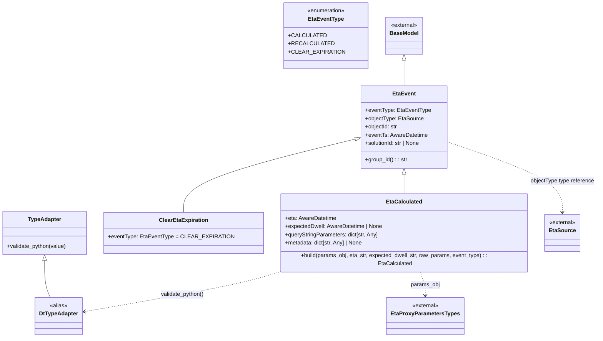

# Diagram: eta/eta_platform_common/eta_platform_common/models/eta_proxy/payloads.py

> Auto-generated by Obscura crawlers

## Mermaid

### SVG

<svg id="container" width="1708.734375" xmlns="http://www.w3.org/2000/svg" class="classDiagram" height="970" viewBox="0 0 1708.734375 970" role="graphics-document document" aria-roledescription="class"><g><defs><marker id="container_class-aggregationStart" class="marker aggregation class" refX="18" refY="7" markerWidth="190" markerHeight="240" orient="auto"><path d="M 18,7 L9,13 L1,7 L9,1 Z"></path></marker></defs><defs><marker id="container_class-aggregationEnd" class="marker aggregation class" refX="1" refY="7" markerWidth="20" markerHeight="28" orient="auto"><path d="M 18,7 L9,13 L1,7 L9,1 Z"></path></marker></defs><defs><marker id="container_class-extensionStart" class="marker extension class" refX="18" refY="7" markerWidth="190" markerHeight="240" orient="auto"><path d="M 1,7 L18,13 V 1 Z"></path></marker></defs><defs><marker id="container_class-extensionEnd" class="marker extension class" refX="1" refY="7" markerWidth="20" markerHeight="28" orient="auto"><path d="M 1,1 V 13 L18,7 Z"></path></marker></defs><defs><marker id="container_class-compositionStart" class="marker composition class" refX="18" refY="7" markerWidth="190" markerHeight="240" orient="auto"><path d="M 18,7 L9,13 L1,7 L9,1 Z"></path></marker></defs><defs><marker id="container_class-compositionEnd" class="marker composition class" refX="1" refY="7" markerWidth="20" markerHeight="28" orient="auto"><path d="M 18,7 L9,13 L1,7 L9,1 Z"></path></marker></defs><defs><marker id="container_class-dependencyStart" class="marker dependency class" refX="6" refY="7" markerWidth="190" markerHeight="240" orient="auto"><path d="M 5,7 L9,13 L1,7 L9,1 Z"></path></marker></defs><defs><marker id="container_class-dependencyEnd" class="marker dependency class" refX="13" refY="7" markerWidth="20" markerHeight="28" orient="auto"><path d="M 18,7 L9,13 L14,7 L9,1 Z"></path></marker></defs><defs><marker id="container_class-lollipopStart" class="marker lollipop class" refX="13" refY="7" markerWidth="190" markerHeight="240" orient="auto"><circle stroke="black" fill="transparent" cx="7" cy="7" r="6"></circle></marker></defs><defs><marker id="container_class-lollipopEnd" class="marker lollipop class" refX="1" refY="7" markerWidth="190" markerHeight="240" orient="auto"><circle stroke="black" fill="transparent" cx="7" cy="7" r="6"></circle></marker></defs><g class="root"><g class="clusters"></g><g class="edgePaths"><path d="M1145.188,175.25L1145.188,183.542C1145.188,191.833,1145.188,208.417,1145.188,220.875C1145.188,233.333,1145.188,241.667,1145.188,245.833L1145.188,250" id="id_BaseModel_EtaEvent_1" class="edge-thickness-normal edge-pattern-solid relation" style=";;;" data-edge="true" data-et="edge" data-id="id_BaseModel_EtaEvent_1" data-points="W3sieCI6MTE0NS4xODc1LCJ5IjoxNTh9LHsieCI6MTE0NS4xODc1LCJ5IjoyMjV9LHsieCI6MTE0NS4xODc1LCJ5IjoyNTB9XQ==" marker-start="url(#container_class-extensionStart)"></path><path d="M1145.188,507.25L1145.188,510.542C1145.188,513.833,1145.188,520.417,1145.188,529.875C1145.188,539.333,1145.188,551.667,1145.188,557.833L1145.188,564" id="id_EtaEvent_EtaCalculated_2" class="edge-thickness-normal edge-pattern-solid relation" style=";;;" data-edge="true" data-et="edge" data-id="id_EtaEvent_EtaCalculated_2" data-points="W3sieCI6MTE0NS4xODc1LCJ5Ijo0OTB9LHsieCI6MTE0NS4xODc1LCJ5Ijo1Mjd9LHsieCI6MTE0NS4xODc1LCJ5Ijo1NjR9XQ==" marker-start="url(#container_class-extensionStart)"></path><path d="M1007.388,404.518L925.896,424.932C844.403,445.346,681.418,486.173,599.926,520.753C518.434,555.333,518.434,583.667,518.434,597.833L518.434,612" id="id_EtaEvent_ClearEtaExpiration_3" class="edge-thickness-normal edge-pattern-solid relation" style=";;;" data-edge="true" data-et="edge" data-id="id_EtaEvent_ClearEtaExpiration_3" data-points="W3sieCI6MTAyNC4xMjEwOTM3NSwieSI6NDAwLjMyNjc3NjczMjc5MzZ9LHsieCI6NTE4LjQzMzU5Mzc1LCJ5Ijo1Mjd9LHsieCI6NTE4LjQzMzU5Mzc1LCJ5Ijo2MTJ9XQ==" marker-start="url(#container_class-extensionStart)"></path><path d="M130.371,752.25L130.371,763.042C130.371,773.833,130.371,795.417,133.208,812.375C136.045,829.333,141.719,841.667,144.556,847.833L147.392,854" id="id_TypeAdapter_DtTypeAdapter_4" class="edge-thickness-normal edge-pattern-solid relation" style=";;;" data-edge="true" data-et="edge" data-id="id_TypeAdapter_DtTypeAdapter_4" data-points="W3sieCI6MTMwLjM3MTA5Mzc1LCJ5Ijo3MzV9LHsieCI6MTMwLjM3MTA5Mzc1LCJ5Ijo4MTd9LHsieCI6MTQ3LjM5MjQyNzg4NDYxNTQsInkiOjg1NH1d" marker-start="url(#container_class-extensionStart)"></path><path d="M798.437,780L778.638,786.167C758.839,792.333,719.241,804.667,627.005,823.824C534.769,842.982,389.896,868.964,317.46,881.955L245.023,894.946" id="id_EtaCalculated_DtTypeAdapter_5" class="edge-thickness-normal edge-pattern-dashed relation" style=";;;" data-edge="true" data-et="edge" data-id="id_EtaCalculated_DtTypeAdapter_5" data-points="W3sieCI6Nzk4LjQzNjc5OTU2ODk2NTUsInkiOjc4MH0seyJ4Ijo2NzkuNjQyNTc4MTI1LCJ5Ijo4MTd9LHsieCI6MjM5LjExNzE4NzUsInkiOjg5Ni4wMDUwNTAxNzQ1NjJ9XQ==" marker-end="url(#container_class-dependencyEnd)"></path><path d="M1192.115,780L1194.794,786.167C1197.474,792.333,1202.832,804.667,1205.512,816C1208.191,827.333,1208.191,837.667,1208.191,842.833L1208.191,848" id="id_EtaCalculated_EtaProxyParametersTypes_6" class="edge-thickness-normal edge-pattern-dashed relation" style=";;;" data-edge="true" data-et="edge" data-id="id_EtaCalculated_EtaProxyParametersTypes_6" data-points="W3sieCI6MTE5Mi4xMTQ1NDc0MTM3OTMyLCJ5Ijo3ODB9LHsieCI6MTIwOC4xOTE0MDYyNSwieSI6ODE3fSx7IngiOjEyMDguMTkxNDA2MjUsInkiOjg1NH1d" marker-end="url(#container_class-dependencyEnd)"></path><path d="M1266.254,411.167L1323.029,430.472C1379.805,449.778,1493.355,488.389,1550.131,521.861C1606.906,555.333,1606.906,583.667,1606.906,597.833L1606.906,612" id="id_EtaEvent_EtaSource_7" class="edge-thickness-normal edge-pattern-dashed relation" style=";;;" data-edge="true" data-et="edge" data-id="id_EtaEvent_EtaSource_7" data-points="W3sieCI6MTI2Ni4yNTM5MDYyNSwieSI6NDExLjE2NjY3NTEyNjkwMzU2fSx7IngiOjE2MDYuOTA2MjUsInkiOjUyN30seyJ4IjoxNjA2LjkwNjI1LCJ5Ijo2MTh9XQ==" marker-end="url(#container_class-dependencyEnd)"></path></g><g class="edgeLabels"><g class="edgeLabel"><g class="label" data-id="id_BaseModel_EtaEvent_1" transform="translate(0, 0)"><foreignObject width="0" height="0">

</foreignObject></g></g><g class="edgeLabel"><g class="label" data-id="id_EtaEvent_EtaCalculated_2" transform="translate(0, 0)"><foreignObject width="0" height="0">

</foreignObject></g></g><g class="edgeLabel"><g class="label" data-id="id_EtaEvent_ClearEtaExpiration_3" transform="translate(0, 0)"><foreignObject width="0" height="0">

</foreignObject></g></g><g class="edgeLabel"><g class="label" data-id="id_TypeAdapter_DtTypeAdapter_4" transform="translate(0, 0)"><foreignObject width="0" height="0">

</foreignObject></g></g><g class="edgeLabel" transform="translate(520.61438, 845.52056)"><g class="label" data-id="id_EtaCalculated_DtTypeAdapter_5" transform="translate(-63.7265625, -12)"><foreignObject width="127.453125" height="24">

validate_python()

</foreignObject></g></g><g class="edgeLabel" transform="translate(1208.19140625, 817)"><g class="label" data-id="id_EtaCalculated_EtaProxyParametersTypes_6" transform="translate(-42.28125, -12)"><foreignObject width="84.5625" height="24">

params_obj

</foreignObject></g></g><g class="edgeLabel" transform="translate(1606.90625, 527)"><g class="label" data-id="id_EtaEvent_EtaSource_7" transform="translate(-93.828125, -12)"><foreignObject width="187.65625" height="24">

objectType type reference

</foreignObject></g></g></g><g class="nodes"><g class="node default" id="classId-EtaEventType-0" transform="translate(930.87890625, 104)"><g class="basic label-container"><path d="M-112.23046875 -96 L112.23046875 -96 L112.23046875 96 L-112.23046875 96" stroke="none" stroke-width="0" fill="#ECECFF" style=""></path><path d="M-112.23046875 -96 C-52.422631768692135 -96, 7.38520521261573 -96, 112.23046875 -96 M-112.23046875 -96 C-50.47477483881318 -96, 11.280919072373635 -96, 112.23046875 -96 M112.23046875 -96 C112.23046875 -39.845198271221605, 112.23046875 16.30960345755679, 112.23046875 96 M112.23046875 -96 C112.23046875 -36.70930976198164, 112.23046875 22.581380476036713, 112.23046875 96 M112.23046875 96 C24.51759705862584 96, -63.19527463274832 96, -112.23046875 96 M112.23046875 96 C36.797511927767005 96, -38.63544489446599 96, -112.23046875 96 M-112.23046875 96 C-112.23046875 40.94952410012576, -112.23046875 -14.100951799748486, -112.23046875 -96 M-112.23046875 96 C-112.23046875 30.726456160529494, -112.23046875 -34.54708767894101, -112.23046875 -96" stroke="#9370DB" stroke-width="1.3" fill="none" stroke-dasharray="0 0" style=""></path></g><g class="annotation-group text" transform="translate(-55.5546875, -72)"><g class="label" style="" transform="translate(0,-12)"><foreignObject width="111.109375" height="24">

«enumeration»

</foreignObject></g></g><g class="label-group text" transform="translate(-48.984375, -48)"><g class="label" style="font-weight: bolder" transform="translate(0,-12)"><foreignObject width="97.96875" height="24">

EtaEventType

</foreignObject></g></g><g class="members-group text" transform="translate(-100.23046875, 0)"><g class="label" style="" transform="translate(0,-12)"><foreignObject width="96.234375" height="24">

+CALCULATED

</foreignObject></g><g class="label" style="" transform="translate(0,12)"><foreignObject width="114.28125" height="24">

+RECALCULATED

</foreignObject></g><g class="label" style="" transform="translate(0,36)"><foreignObject width="144.90625" height="24">

+CLEAR_EXPIRATION

</foreignObject></g></g><g class="methods-group text" transform="translate(-100.23046875, 96)"></g><g class="divider" style=""><path d="M-112.23046875 -24 C-24.828334792038717 -24, 62.573799165922566 -24, 112.23046875 -24 M-112.23046875 -24 C-37.283244984916664 -24, 37.66397878016667 -24, 112.23046875 -24" stroke="#9370DB" stroke-width="1.3" fill="none" stroke-dasharray="0 0" style=""></path></g><g class="divider" style=""><path d="M-112.23046875 72 C-54.56741835399814 72, 3.0956320420037144 72, 112.23046875 72 M-112.23046875 72 C-29.594138289819796 72, 53.04219217036041 72, 112.23046875 72" stroke="#9370DB" stroke-width="1.3" fill="none" stroke-dasharray="0 0" style=""></path></g></g><g class="node default" id="classId-BaseModel-1" transform="translate(1145.1875, 104)"><g class="basic label-container"><path d="M-52.078125 -54 L52.078125 -54 L52.078125 54 L-52.078125 54" stroke="none" stroke-width="0" fill="#ECECFF" style=""></path><path d="M-52.078125 -54 C-30.01605457381777 -54, -7.953984147635538 -54, 52.078125 -54 M-52.078125 -54 C-31.033229066159763 -54, -9.988333132319525 -54, 52.078125 -54 M52.078125 -54 C52.078125 -18.19406941652028, 52.078125 17.611861166959443, 52.078125 54 M52.078125 -54 C52.078125 -28.73963884171141, 52.078125 -3.479277683422822, 52.078125 54 M52.078125 54 C13.26388781308377 54, -25.55034937383246 54, -52.078125 54 M52.078125 54 C13.803935181565052 54, -24.470254636869896 54, -52.078125 54 M-52.078125 54 C-52.078125 18.86475184888087, -52.078125 -16.270496302238257, -52.078125 -54 M-52.078125 54 C-52.078125 17.567995939649684, -52.078125 -18.864008120700632, -52.078125 -54" stroke="#9370DB" stroke-width="1.3" fill="none" stroke-dasharray="0 0" style=""></path></g><g class="annotation-group text" transform="translate(-38.65625, -30)"><g class="label" style="" transform="translate(0,-12)"><foreignObject width="77.3125" height="24">

«external»

</foreignObject></g></g><g class="label-group text" transform="translate(-40.078125, -6)"><g class="label" style="font-weight: bolder" transform="translate(0,-12)"><foreignObject width="80.15625" height="24">

BaseModel

</foreignObject></g></g><g class="members-group text" transform="translate(-40.078125, 42)"></g><g class="methods-group text" transform="translate(-40.078125, 72)"></g><g class="divider" style=""><path d="M-52.078125 18 C-11.755471376313771 18, 28.567182247372457 18, 52.078125 18 M-52.078125 18 C-23.68199856300782 18, 4.71412787398436 18, 52.078125 18" stroke="#9370DB" stroke-width="1.3" fill="none" stroke-dasharray="0 0" style=""></path></g><g class="divider" style=""><path d="M-52.078125 36 C-19.725971920421138 36, 12.626181159157724 36, 52.078125 36 M-52.078125 36 C-26.56967512966326 36, -1.0612252593265197 36, 52.078125 36" stroke="#9370DB" stroke-width="1.3" fill="none" stroke-dasharray="0 0" style=""></path></g></g><g class="node default" id="classId-EtaEvent-2" transform="translate(1145.1875, 370)"><g class="basic label-container"><path d="M-121.06640625 -120 L121.06640625 -120 L121.06640625 120 L-121.06640625 120" stroke="none" stroke-width="0" fill="#ECECFF" style=""></path><path d="M-121.06640625 -120 C-36.25122875988198 -120, 48.563948730236035 -120, 121.06640625 -120 M-121.06640625 -120 C-25.242071650047194 -120, 70.58226294990561 -120, 121.06640625 -120 M121.06640625 -120 C121.06640625 -33.87816871344506, 121.06640625 52.24366257310987, 121.06640625 120 M121.06640625 -120 C121.06640625 -66.30522782529954, 121.06640625 -12.610455650599064, 121.06640625 120 M121.06640625 120 C37.36603218996443 120, -46.33434187007114 120, -121.06640625 120 M121.06640625 120 C38.24720970430312 120, -44.571986841393766 120, -121.06640625 120 M-121.06640625 120 C-121.06640625 35.41039770431122, -121.06640625 -49.179204591377555, -121.06640625 -120 M-121.06640625 120 C-121.06640625 31.374932099504747, -121.06640625 -57.250135800990506, -121.06640625 -120" stroke="#9370DB" stroke-width="1.3" fill="none" stroke-dasharray="0 0" style=""></path></g><g class="annotation-group text" transform="translate(0, -96)"></g><g class="label-group text" transform="translate(-31.6484375, -96)"><g class="label" style="font-weight: bolder" transform="translate(0,-12)"><foreignObject width="63.296875" height="24">

EtaEvent

</foreignObject></g></g><g class="members-group text" transform="translate(-109.06640625, -48)"><g class="label" style="" transform="translate(0,-12)"><foreignObject width="186.484375" height="24">

+eventType: EtaEventType

</foreignObject></g><g class="label" style="" transform="translate(0,12)"><foreignObject width="167.09375" height="24">

+objectType: EtaSource

</foreignObject></g><g class="label" style="" transform="translate(0,36)"><foreignObject width="95.25" height="24">

+objectId: str

</foreignObject></g><g class="label" style="" transform="translate(0,60)"><foreignObject width="180.75" height="24">

+eventTs: AwareDatetime

</foreignObject></g><g class="label" style="" transform="translate(0,84)"><foreignObject width="162.90625" height="24">

+solutionId: str | None

</foreignObject></g></g><g class="methods-group text" transform="translate(-109.06640625, 96)"><g class="label" style="" transform="translate(0,-12)"><foreignObject width="122.4375" height="24">

+group_id() : : str

</foreignObject></g></g><g class="divider" style=""><path d="M-121.06640625 -72 C-69.19271407261391 -72, -17.319021895227834 -72, 121.06640625 -72 M-121.06640625 -72 C-42.60776975612836 -72, 35.850866737743274 -72, 121.06640625 -72" stroke="#9370DB" stroke-width="1.3" fill="none" stroke-dasharray="0 0" style=""></path></g><g class="divider" style=""><path d="M-121.06640625 72 C-56.66205342053611 72, 7.742299408927778 72, 121.06640625 72 M-121.06640625 72 C-26.038732017165373 72, 68.98894221566925 72, 121.06640625 72" stroke="#9370DB" stroke-width="1.3" fill="none" stroke-dasharray="0 0" style=""></path></g></g><g class="node default" id="classId-EtaCalculated-3" transform="translate(1145.1875, 672)"><g class="basic label-container"><path d="M-361.0625 -108 L361.0625 -108 L361.0625 108 L-361.0625 108" stroke="none" stroke-width="0" fill="#ECECFF" style=""></path><path d="M-361.0625 -108 C-192.35736074359852 -108, -23.65222148719704 -108, 361.0625 -108 M-361.0625 -108 C-103.32145105528394 -108, 154.4195978894321 -108, 361.0625 -108 M361.0625 -108 C361.0625 -47.3655139356069, 361.0625 13.268972128786203, 361.0625 108 M361.0625 -108 C361.0625 -60.484747414736056, 361.0625 -12.969494829472112, 361.0625 108 M361.0625 108 C147.7423420413178 108, -65.57781591736438 108, -361.0625 108 M361.0625 108 C96.42593149501255 108, -168.2106370099749 108, -361.0625 108 M-361.0625 108 C-361.0625 50.98347060459927, -361.0625 -6.033058790801462, -361.0625 -108 M-361.0625 108 C-361.0625 28.97983713892438, -361.0625 -50.04032572215124, -361.0625 -108" stroke="#9370DB" stroke-width="1.3" fill="none" stroke-dasharray="0 0" style=""></path></g><g class="annotation-group text" transform="translate(0, -84)"></g><g class="label-group text" transform="translate(-49.8125, -84)"><g class="label" style="font-weight: bolder" transform="translate(0,-12)"><foreignObject width="99.625" height="24">

EtaCalculated

</foreignObject></g></g><g class="members-group text" transform="translate(-349.0625, -36)"><g class="label" style="" transform="translate(0,-12)"><foreignObject width="148.546875" height="24">

+eta: AwareDatetime

</foreignObject></g><g class="label" style="" transform="translate(0,12)"><foreignObject width="284.828125" height="24">

+expectedDwell: AwareDatetime | None

</foreignObject></g><g class="label" style="" transform="translate(0,36)"><foreignObject width="272.46875" height="24">

+queryStringParameters: dict[str, Any]

</foreignObject></g><g class="label" style="" transform="translate(0,60)"><foreignObject width="229.140625" height="24">

+metadata: dict[str, Any] | None

</foreignObject></g></g><g class="methods-group text" transform="translate(-349.0625, 84)"><g class="label" style="" transform="translate(0,-12)"><foreignObject width="648.3125" height="24">

+build(params_obj, eta_str, expected_dwell_str, raw_params, event_type) : : EtaCalculated

</foreignObject></g></g><g class="divider" style=""><path d="M-361.0625 -60 C-208.57033700020824 -60, -56.07817400041648 -60, 361.0625 -60 M-361.0625 -60 C-214.33444811872084 -60, -67.60639623744169 -60, 361.0625 -60" stroke="#9370DB" stroke-width="1.3" fill="none" stroke-dasharray="0 0" style=""></path></g><g class="divider" style=""><path d="M-361.0625 60 C-117.20749124375084 60, 126.64751751249833 60, 361.0625 60 M-361.0625 60 C-150.6080627934483 60, 59.846374413103376 60, 361.0625 60" stroke="#9370DB" stroke-width="1.3" fill="none" stroke-dasharray="0 0" style=""></path></g></g><g class="node default" id="classId-ClearEtaExpiration-4" transform="translate(518.43359375, 672)"><g class="basic label-container"><path d="M-215.69140625 -60 L215.69140625 -60 L215.69140625 60 L-215.69140625 60" stroke="none" stroke-width="0" fill="#ECECFF" style=""></path><path d="M-215.69140625 -60 C-58.25358664740466 -60, 99.18423295519068 -60, 215.69140625 -60 M-215.69140625 -60 C-127.81676521129829 -60, -39.94212417259658 -60, 215.69140625 -60 M215.69140625 -60 C215.69140625 -34.60648256917486, 215.69140625 -9.212965138349723, 215.69140625 60 M215.69140625 -60 C215.69140625 -31.073812330605833, 215.69140625 -2.1476246612116654, 215.69140625 60 M215.69140625 60 C58.48547475625824 60, -98.72045673748352 60, -215.69140625 60 M215.69140625 60 C99.50551655964236 60, -16.68037313071528 60, -215.69140625 60 M-215.69140625 60 C-215.69140625 19.081888646529976, -215.69140625 -21.83622270694005, -215.69140625 -60 M-215.69140625 60 C-215.69140625 16.347664868597832, -215.69140625 -27.304670262804336, -215.69140625 -60" stroke="#9370DB" stroke-width="1.3" fill="none" stroke-dasharray="0 0" style=""></path></g><g class="annotation-group text" transform="translate(0, -36)"></g><g class="label-group text" transform="translate(-67.5078125, -36)"><g class="label" style="font-weight: bolder" transform="translate(0,-12)"><foreignObject width="135.015625" height="24">

ClearEtaExpiration

</foreignObject></g></g><g class="members-group text" transform="translate(-203.69140625, 12)"><g class="label" style="" transform="translate(0,-12)"><foreignObject width="339.875" height="24">

+eventType: EtaEventType = CLEAR_EXPIRATION

</foreignObject></g></g><g class="methods-group text" transform="translate(-203.69140625, 60)"></g><g class="divider" style=""><path d="M-215.69140625 -12 C-108.87588921575224 -12, -2.0603721815044764 -12, 215.69140625 -12 M-215.69140625 -12 C-63.9493994711936 -12, 87.7926073076128 -12, 215.69140625 -12" stroke="#9370DB" stroke-width="1.3" fill="none" stroke-dasharray="0 0" style=""></path></g><g class="divider" style=""><path d="M-215.69140625 36 C-101.06214648038608 36, 13.567113289227848 36, 215.69140625 36 M-215.69140625 36 C-124.1100732545594 36, -32.52874025911879 36, 215.69140625 36" stroke="#9370DB" stroke-width="1.3" fill="none" stroke-dasharray="0 0" style=""></path></g></g><g class="node default" id="classId-TypeAdapter-5" transform="translate(130.37109375, 672)"><g class="basic label-container"><path d="M-122.37109375 -63 L122.37109375 -63 L122.37109375 63 L-122.37109375 63" stroke="none" stroke-width="0" fill="#ECECFF" style=""></path><path d="M-122.37109375 -63 C-36.45576965950748 -63, 49.45955443098504 -63, 122.37109375 -63 M-122.37109375 -63 C-60.099610284239496 -63, 2.1718731815210077 -63, 122.37109375 -63 M122.37109375 -63 C122.37109375 -27.037919059641418, 122.37109375 8.924161880717165, 122.37109375 63 M122.37109375 -63 C122.37109375 -15.205629847973597, 122.37109375 32.588740304052806, 122.37109375 63 M122.37109375 63 C69.43360287285545 63, 16.49611199571089 63, -122.37109375 63 M122.37109375 63 C38.956242314030504 63, -44.45860912193899 63, -122.37109375 63 M-122.37109375 63 C-122.37109375 35.838111502500006, -122.37109375 8.676223005000011, -122.37109375 -63 M-122.37109375 63 C-122.37109375 33.63672343534904, -122.37109375 4.2734468706980735, -122.37109375 -63" stroke="#9370DB" stroke-width="1.3" fill="none" stroke-dasharray="0 0" style=""></path></g><g class="annotation-group text" transform="translate(0, -39)"></g><g class="label-group text" transform="translate(-46.5859375, -39)"><g class="label" style="font-weight: bolder" transform="translate(0,-12)"><foreignObject width="93.171875" height="24">

TypeAdapter

</foreignObject></g></g><g class="members-group text" transform="translate(-110.37109375, 9)"></g><g class="methods-group text" transform="translate(-110.37109375, 39)"><g class="label" style="" transform="translate(0,-12)"><foreignObject width="174.15625" height="24">

+validate_python(value)

</foreignObject></g></g><g class="divider" style=""><path d="M-122.37109375 -15 C-60.10364880283394 -15, 2.1637961443321245 -15, 122.37109375 -15 M-122.37109375 -15 C-34.54987395837722 -15, 53.27134583324556 -15, 122.37109375 -15" stroke="#9370DB" stroke-width="1.3" fill="none" stroke-dasharray="0 0" style=""></path></g><g class="divider" style=""><path d="M-122.37109375 9 C-59.975665949036966 9, 2.4197618519260686 9, 122.37109375 9 M-122.37109375 9 C-34.766370167906345 9, 52.83835341418731 9, 122.37109375 9" stroke="#9370DB" stroke-width="1.3" fill="none" stroke-dasharray="0 0" style=""></path></g></g><g class="node default" id="classId-DtTypeAdapter-6" transform="translate(172.234375, 908)"><g class="basic label-container"><path d="M-66.8828125 -54 L66.8828125 -54 L66.8828125 54 L-66.8828125 54" stroke="none" stroke-width="0" fill="#ECECFF" style=""></path><path d="M-66.8828125 -54 C-39.71259573737689 -54, -12.542378974753767 -54, 66.8828125 -54 M-66.8828125 -54 C-28.302329887918162 -54, 10.278152724163675 -54, 66.8828125 -54 M66.8828125 -54 C66.8828125 -29.854359286511954, 66.8828125 -5.7087185730239085, 66.8828125 54 M66.8828125 -54 C66.8828125 -23.203368857940838, 66.8828125 7.593262284118325, 66.8828125 54 M66.8828125 54 C33.34004706451844 54, -0.20271837096312595 54, -66.8828125 54 M66.8828125 54 C30.167665338188925 54, -6.5474818236221495 54, -66.8828125 54 M-66.8828125 54 C-66.8828125 27.131096116720798, -66.8828125 0.2621922334415956, -66.8828125 -54 M-66.8828125 54 C-66.8828125 30.773937088109644, -66.8828125 7.547874176219288, -66.8828125 -54" stroke="#9370DB" stroke-width="1.3" fill="none" stroke-dasharray="0 0" style=""></path></g><g class="annotation-group text" transform="translate(-25.890625, -30)"><g class="label" style="" transform="translate(0,-12)"><foreignObject width="51.78125" height="24">

«alias»

</foreignObject></g></g><g class="label-group text" transform="translate(-54.8828125, -6)"><g class="label" style="font-weight: bolder" transform="translate(0,-12)"><foreignObject width="109.765625" height="24">

DtTypeAdapter

</foreignObject></g></g><g class="members-group text" transform="translate(-54.8828125, 42)"></g><g class="methods-group text" transform="translate(-54.8828125, 72)"></g><g class="divider" style=""><path d="M-66.8828125 18 C-20.67989356786751 18, 25.52302536426498 18, 66.8828125 18 M-66.8828125 18 C-27.17498374148125 18, 12.532845017037502 18, 66.8828125 18" stroke="#9370DB" stroke-width="1.3" fill="none" stroke-dasharray="0 0" style=""></path></g><g class="divider" style=""><path d="M-66.8828125 36 C-18.33413973367371 36, 30.214533032652582 36, 66.8828125 36 M-66.8828125 36 C-19.85426315657672 36, 27.174286186846558 36, 66.8828125 36" stroke="#9370DB" stroke-width="1.3" fill="none" stroke-dasharray="0 0" style=""></path></g></g><g class="node default" id="classId-EtaSource-7" transform="translate(1606.90625, 672)"><g class="basic label-container"><path d="M-50.65625 -54 L50.65625 -54 L50.65625 54 L-50.65625 54" stroke="none" stroke-width="0" fill="#ECECFF" style=""></path><path d="M-50.65625 -54 C-24.926391749863715 -54, 0.8034665002725703 -54, 50.65625 -54 M-50.65625 -54 C-17.344386359042716 -54, 15.967477281914569 -54, 50.65625 -54 M50.65625 -54 C50.65625 -20.735483598440744, 50.65625 12.529032803118511, 50.65625 54 M50.65625 -54 C50.65625 -17.706071304778924, 50.65625 18.587857390442153, 50.65625 54 M50.65625 54 C18.20108890734751 54, -14.254072185304977 54, -50.65625 54 M50.65625 54 C28.346452729369297 54, 6.036655458738593 54, -50.65625 54 M-50.65625 54 C-50.65625 16.871609775984297, -50.65625 -20.256780448031407, -50.65625 -54 M-50.65625 54 C-50.65625 16.17652114945391, -50.65625 -21.646957701092177, -50.65625 -54" stroke="#9370DB" stroke-width="1.3" fill="none" stroke-dasharray="0 0" style=""></path></g><g class="annotation-group text" transform="translate(-38.65625, -30)"><g class="label" style="" transform="translate(0,-12)"><foreignObject width="77.3125" height="24">

«external»

</foreignObject></g></g><g class="label-group text" transform="translate(-36.3203125, -6)"><g class="label" style="font-weight: bolder" transform="translate(0,-12)"><foreignObject width="72.640625" height="24">

EtaSource

</foreignObject></g></g><g class="members-group text" transform="translate(-38.65625, 42)"></g><g class="methods-group text" transform="translate(-38.65625, 72)"></g><g class="divider" style=""><path d="M-50.65625 18 C-14.054310874403122 18, 22.547628251193757 18, 50.65625 18 M-50.65625 18 C-15.147067497688987 18, 20.362115004622027 18, 50.65625 18" stroke="#9370DB" stroke-width="1.3" fill="none" stroke-dasharray="0 0" style=""></path></g><g class="divider" style=""><path d="M-50.65625 36 C-17.435208604608462 36, 15.785832790783076 36, 50.65625 36 M-50.65625 36 C-25.925934728634388 36, -1.1956194572687764 36, 50.65625 36" stroke="#9370DB" stroke-width="1.3" fill="none" stroke-dasharray="0 0" style=""></path></g></g><g class="node default" id="classId-EtaProxyParametersTypes-8" transform="translate(1208.19140625, 908)"><g class="basic label-container"><path d="M-106.6484375 -54 L106.6484375 -54 L106.6484375 54 L-106.6484375 54" stroke="none" stroke-width="0" fill="#ECECFF" style=""></path><path d="M-106.6484375 -54 C-62.55468439029218 -54, -18.46093128058436 -54, 106.6484375 -54 M-106.6484375 -54 C-28.357120013063266 -54, 49.93419747387347 -54, 106.6484375 -54 M106.6484375 -54 C106.6484375 -29.34748150608342, 106.6484375 -4.694963012166838, 106.6484375 54 M106.6484375 -54 C106.6484375 -31.82563121532483, 106.6484375 -9.651262430649659, 106.6484375 54 M106.6484375 54 C34.87648561985418 54, -36.89546626029164 54, -106.6484375 54 M106.6484375 54 C61.17733867162584 54, 15.70623984325168 54, -106.6484375 54 M-106.6484375 54 C-106.6484375 24.41096200208872, -106.6484375 -5.17807599582256, -106.6484375 -54 M-106.6484375 54 C-106.6484375 24.54815787670131, -106.6484375 -4.903684246597379, -106.6484375 -54" stroke="#9370DB" stroke-width="1.3" fill="none" stroke-dasharray="0 0" style=""></path></g><g class="annotation-group text" transform="translate(-38.65625, -30)"><g class="label" style="" transform="translate(0,-12)"><foreignObject width="77.3125" height="24">

«external»

</foreignObject></g></g><g class="label-group text" transform="translate(-94.6484375, -6)"><g class="label" style="font-weight: bolder" transform="translate(0,-12)"><foreignObject width="189.296875" height="24">

EtaProxyParametersTypes

</foreignObject></g></g><g class="members-group text" transform="translate(-94.6484375, 42)"></g><g class="methods-group text" transform="translate(-94.6484375, 72)"></g><g class="divider" style=""><path d="M-106.6484375 18 C-24.47936435155607 18, 57.68970879688786 18, 106.6484375 18 M-106.6484375 18 C-56.4084217033314 18, -6.168405906662798 18, 106.6484375 18" stroke="#9370DB" stroke-width="1.3" fill="none" stroke-dasharray="0 0" style=""></path></g><g class="divider" style=""><path d="M-106.6484375 36 C-48.55578900102911 36, 9.536859497941776 36, 106.6484375 36 M-106.6484375 36 C-24.495777558952582 36, 57.656882382094835 36, 106.6484375 36" stroke="#9370DB" stroke-width="1.3" fill="none" stroke-dasharray="0 0" style=""></path></g></g></g></g></g></svg>
