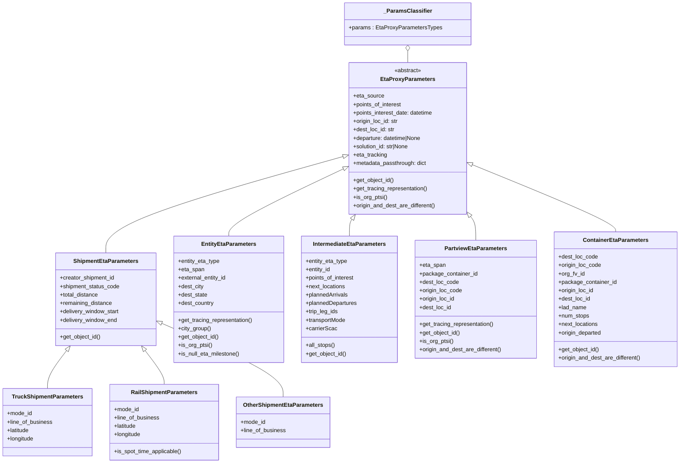

# Diagram: eta/eta_platform_common/eta_platform_common/models/eta_proxy/requests.py


> Auto-generated by Obscura crawlers

## Diagram 1



### SVG

<svg id="container" width="1929.759765625" xmlns="http://www.w3.org/2000/svg" class="classDiagram" height="1318" viewBox="0 0 1929.759765625 1318" role="graphics-document document" aria-roledescription="class"><style>#container{font-family:"trebuchet ms",verdana,arial,sans-serif;font-size:16px;fill:#333;}@keyframes edge-animation-frame{from{stroke-dashoffset:0;}}@keyframes dash{to{stroke-dashoffset:0;}}#container .edge-animation-slow{stroke-dasharray:9,5!important;stroke-dashoffset:900;animation:dash 50s linear infinite;stroke-linecap:round;}#container .edge-animation-fast{stroke-dasharray:9,5!important;stroke-dashoffset:900;animation:dash 20s linear infinite;stroke-linecap:round;}#container .error-icon{fill:#552222;}#container .error-text{fill:#552222;stroke:#552222;}#container .edge-thickness-normal{stroke-width:1px;}#container .edge-thickness-thick{stroke-width:3.5px;}#container .edge-pattern-solid{stroke-dasharray:0;}#container .edge-thickness-invisible{stroke-width:0;fill:none;}#container .edge-pattern-dashed{stroke-dasharray:3;}#container .edge-pattern-dotted{stroke-dasharray:2;}#container .marker{fill:#333333;stroke:#333333;}#container .marker.cross{stroke:#333333;}#container svg{font-family:"trebuchet ms",verdana,arial,sans-serif;font-size:16px;}#container p{margin:0;}#container g.classGroup text{fill:#9370DB;stroke:none;font-family:"trebuchet ms",verdana,arial,sans-serif;font-size:10px;}#container g.classGroup text .title{font-weight:bolder;}#container .nodeLabel,#container .edgeLabel{color:#131300;}#container .edgeLabel .label rect{fill:#ECECFF;}#container .label text{fill:#131300;}#container .labelBkg{background:#ECECFF;}#container .edgeLabel .label span{background:#ECECFF;}#container .classTitle{font-weight:bolder;}#container .node rect,#container .node circle,#container .node ellipse,#container .node polygon,#container .node path{fill:#ECECFF;stroke:#9370DB;stroke-width:1px;}#container .divider{stroke:#9370DB;stroke-width:1;}#container g.clickable{cursor:pointer;}#container g.classGroup rect{fill:#ECECFF;stroke:#9370DB;}#container g.classGroup line{stroke:#9370DB;stroke-width:1;}#container .classLabel .box{stroke:none;stroke-width:0;fill:#ECECFF;opacity:0.5;}#container .classLabel .label{fill:#9370DB;font-size:10px;}#container .relation{stroke:#333333;stroke-width:1;fill:none;}#container .dashed-line{stroke-dasharray:3;}#container .dotted-line{stroke-dasharray:1 2;}#container #compositionStart,#container .composition{fill:#333333!important;stroke:#333333!important;stroke-width:1;}#container #compositionEnd,#container .composition{fill:#333333!important;stroke:#333333!important;stroke-width:1;}#container #dependencyStart,#container .dependency{fill:#333333!important;stroke:#333333!important;stroke-width:1;}#container #dependencyStart,#container .dependency{fill:#333333!important;stroke:#333333!important;stroke-width:1;}#container #extensionStart,#container .extension{fill:transparent!important;stroke:#333333!important;stroke-width:1;}#container #extensionEnd,#container .extension{fill:transparent!important;stroke:#333333!important;stroke-width:1;}#container #aggregationStart,#container .aggregation{fill:transparent!important;stroke:#333333!important;stroke-width:1;}#container #aggregationEnd,#container .aggregation{fill:transparent!important;stroke:#333333!important;stroke-width:1;}#container #lollipopStart,#container .lollipop{fill:#ECECFF!important;stroke:#333333!important;stroke-width:1;}#container #lollipopEnd,#container .lollipop{fill:#ECECFF!important;stroke:#333333!important;stroke-width:1;}#container .edgeTerminals{font-size:11px;line-height:initial;}#container .classTitleText{text-anchor:middle;font-size:18px;fill:#333;}#container .label-icon{display:inline-block;height:1em;overflow:visible;vertical-align:-0.125em;}#container .node .label-icon path{fill:currentColor;stroke:revert;stroke-width:revert;}#container :root{--mermaid-font-family:"trebuchet ms",verdana,arial,sans-serif;}</style><g><defs><marker id="container_class-aggregationStart" class="marker aggregation class" refX="18" refY="7" markerWidth="190" markerHeight="240" orient="auto"><path d="M 18,7 L9,13 L1,7 L9,1 Z"></path></marker></defs><defs><marker id="container_class-aggregationEnd" class="marker aggregation class" refX="1" refY="7" markerWidth="20" markerHeight="28" orient="auto"><path d="M 18,7 L9,13 L1,7 L9,1 Z"></path></marker></defs><defs><marker id="container_class-extensionStart" class="marker extension class" refX="18" refY="7" markerWidth="190" markerHeight="240" orient="auto"><path d="M 1,7 L18,13 V 1 Z"></path></marker></defs><defs><marker id="container_class-extensionEnd" class="marker extension class" refX="1" refY="7" markerWidth="20" markerHeight="28" orient="auto"><path d="M 1,1 V 13 L18,7 Z"></path></marker></defs><defs><marker id="container_class-compositionStart" class="marker composition class" refX="18" refY="7" markerWidth="190" markerHeight="240" orient="auto"><path d="M 18,7 L9,13 L1,7 L9,1 Z"></path></marker></defs><defs><marker id="container_class-compositionEnd" class="marker composition class" refX="1" refY="7" markerWidth="20" markerHeight="28" orient="auto"><path d="M 18,7 L9,13 L1,7 L9,1 Z"></path></marker></defs><defs><marker id="container_class-dependencyStart" class="marker dependency class" refX="6" refY="7" markerWidth="190" markerHeight="240" orient="auto"><path d="M 5,7 L9,13 L1,7 L9,1 Z"></path></marker></defs><defs><marker id="container_class-dependencyEnd" class="marker dependency class" refX="13" refY="7" markerWidth="20" markerHeight="28" orient="auto"><path d="M 18,7 L9,13 L14,7 L9,1 Z"></path></marker></defs><defs><marker id="container_class-lollipopStart" class="marker lollipop class" refX="13" refY="7" markerWidth="190" markerHeight="240" orient="auto"><circle stroke="black" fill="transparent" cx="7" cy="7" r="6"></circle></marker></defs><defs><marker id="container_class-lollipopEnd" class="marker lollipop class" refX="1" refY="7" markerWidth="190" markerHeight="240" orient="auto"><circle stroke="black" fill="transparent" cx="7" cy="7" r="6"></circle></marker></defs><g class="root"><g class="clusters"></g><g class="edgePaths"><path d="M969.708,445.831L857.73,477.359C745.751,508.887,521.795,571.944,409.816,617.639C297.838,663.333,297.838,691.667,297.838,705.833L297.838,720" id="id_EtaProxyParameters_ShipmentEtaParameters_1" class="edge-thickness-normal edge-pattern-solid relation" style=";;;" data-edge="true" data-et="edge" data-id="id_EtaProxyParameters_ShipmentEtaParameters_1" data-points="W3sieCI6OTg2LjMxMjUsInkiOjQ0MS4xNTYxNTQ4MDYyNjR9LHsieCI6Mjk3LjgzNzg5MDYyNSwieSI6NjM1fSx7IngiOjI5Ny44Mzc4OTA2MjUsInkiOjcyMH1d" marker-start="url(#container_class-extensionStart)"></path><path d="M970.73,480.923L916.646,506.602C862.563,532.282,754.396,583.641,700.312,615.487C646.229,647.333,646.229,659.667,646.229,665.833L646.229,672" id="id_EtaProxyParameters_EntityEtaParameters_2" class="edge-thickness-normal edge-pattern-solid relation" style=";;;" data-edge="true" data-et="edge" data-id="id_EtaProxyParameters_EntityEtaParameters_2" data-points="W3sieCI6OTg2LjMxMjUsInkiOjQ3My41MjM3NDAyNTk3NDAzfSx7IngiOjY0Ni4yMjg1MTU2MjUsInkiOjYzNX0seyJ4Ijo2NDYuMjI4NTE1NjI1LCJ5Ijo2NzJ9XQ==" marker-start="url(#container_class-extensionStart)"></path><path d="M996.32,624.238L995.093,626.032C993.866,627.825,991.413,631.413,990.186,639.373C988.959,647.333,988.959,659.667,988.959,665.833L988.959,672" id="id_EtaProxyParameters_IntermediateEtaParameters_3" class="edge-thickness-normal edge-pattern-solid relation" style=";;;" data-edge="true" data-et="edge" data-id="id_EtaProxyParameters_IntermediateEtaParameters_3" data-points="W3sieCI6MTAwNi4wNTgzNTA2MjI0MDY2LCJ5Ijo2MTB9LHsieCI6OTg4Ljk1ODk4NDM3NSwieSI6NjM1fSx7IngiOjk4OC45NTg5ODQzNzUsInkiOjY3Mn1d" marker-start="url(#container_class-extensionStart)"></path><path d="M1332.12,614.793L1334.84,618.161C1337.56,621.529,1343,628.264,1345.719,639.799C1348.439,651.333,1348.439,667.667,1348.439,675.833L1348.439,684" id="id_EtaProxyParameters_PartviewEtaParameters_4" class="edge-thickness-normal edge-pattern-solid relation" style=";;;" data-edge="true" data-et="edge" data-id="id_EtaProxyParameters_PartviewEtaParameters_4" data-points="W3sieCI6MTMyMS4yODEyNSwieSI6NjAxLjM3MzYxMTQ4NzQwMTh9LHsieCI6MTM0OC40Mzk0NTMxMjUsInkiOjYzNX0seyJ4IjoxMzQ4LjQzOTQ1MzEyNSwieSI6Njg0fV0=" marker-start="url(#container_class-extensionStart)"></path><path d="M1337.261,468.576L1405.499,496.313C1473.736,524.05,1610.211,579.525,1678.448,611.429C1746.686,643.333,1746.686,651.667,1746.686,655.833L1746.686,660" id="id_EtaProxyParameters_ContainerEtaParameters_5" class="edge-thickness-normal edge-pattern-solid relation" style=";;;" data-edge="true" data-et="edge" data-id="id_EtaProxyParameters_ContainerEtaParameters_5" data-points="W3sieCI6MTMyMS4yODEyNSwieSI6NDYyLjA3OTc4Njc5NTk3NzA0fSx7IngiOjE3NDYuNjg1NTQ2ODc1LCJ5Ijo2MzV9LHsieCI6MTc0Ni42ODU1NDY4NzUsInkiOjY2MH1d" marker-start="url(#container_class-extensionStart)"></path><path d="M187.133,997.736L178.111,1009.614C169.089,1021.491,151.044,1045.245,142.022,1063.289C133,1081.333,133,1093.667,133,1099.833L133,1106" id="id_ShipmentEtaParameters_TruckShipmentParameters_6" class="edge-thickness-normal edge-pattern-solid relation" style=";;;" data-edge="true" data-et="edge" data-id="id_ShipmentEtaParameters_TruckShipmentParameters_6" data-points="W3sieCI6MTk3LjU2NzgzNzM0MTU4OTg2LCJ5Ijo5ODR9LHsieCI6MTMzLCJ5IjoxMDY5fSx7IngiOjEzMywieSI6MTEwNn1d" marker-start="url(#container_class-extensionStart)"></path><path d="M408.542,997.736L417.565,1009.614C426.587,1021.491,444.631,1045.245,453.654,1061.289C462.676,1077.333,462.676,1085.667,462.676,1089.833L462.676,1094" id="id_ShipmentEtaParameters_RailShipmentParameters_7" class="edge-thickness-normal edge-pattern-solid relation" style=";;;" data-edge="true" data-et="edge" data-id="id_ShipmentEtaParameters_RailShipmentParameters_7" data-points="W3sieCI6Mzk4LjEwNzk0MzkwODQxMDEsInkiOjk4NH0seyJ4Ijo0NjIuNjc1NzgxMjUsInkiOjEwNjl9LHsieCI6NDYyLjY3NTc4MTI1LCJ5IjoxMDk0fV0=" marker-start="url(#container_class-extensionStart)"></path><path d="M455.634,920.4L512.769,945.167C569.904,969.934,684.175,1019.467,741.31,1054.4C798.445,1089.333,798.445,1109.667,798.445,1119.833L798.445,1130" id="id_ShipmentEtaParameters_OtherShipmentEtaParameters_8" class="edge-thickness-normal edge-pattern-solid relation" style=";;;" data-edge="true" data-et="edge" data-id="id_ShipmentEtaParameters_OtherShipmentEtaParameters_8" data-points="W3sieCI6NDM5LjgwNjY0MDYyNSwieSI6OTEzLjUzOTY3NjQwODczNzh9LHsieCI6Nzk4LjQ0NTMxMjUsInkiOjEwNjl9LHsieCI6Nzk4LjQ0NTMxMjUsInkiOjExMzB9XQ==" marker-start="url(#container_class-extensionStart)"></path><path d="M1153.797,145.25L1153.797,146.542C1153.797,147.833,1153.797,150.417,1153.797,155.875C1153.797,161.333,1153.797,169.667,1153.797,173.833L1153.797,178" id="id__ParamsClassifier_EtaProxyParameters_9" class="edge-thickness-normal edge-pattern-solid relation" style=";;;" data-edge="true" data-et="edge" data-id="id__ParamsClassifier_EtaProxyParameters_9" data-points="W3sieCI6MTE1My43OTY4NzUsInkiOjEyOH0seyJ4IjoxMTUzLjc5Njg3NSwieSI6MTUzfSx7IngiOjExNTMuNzk2ODc1LCJ5IjoxNzh9XQ==" marker-start="url(#container_class-aggregationStart)"></path></g><g class="edgeLabels"><g class="edgeLabel"><g class="label" data-id="id_EtaProxyParameters_ShipmentEtaParameters_1" transform="translate(0, 0)"><foreignObject width="0" height="0"><div xmlns="http://www.w3.org/1999/xhtml" class="labelBkg" style="display: table-cell; white-space: nowrap; line-height: 1.5; max-width: 200px; text-align: center;"><span class="edgeLabel"></span></div></foreignObject></g></g><g class="edgeLabel"><g class="label" data-id="id_EtaProxyParameters_EntityEtaParameters_2" transform="translate(0, 0)"><foreignObject width="0" height="0"><div xmlns="http://www.w3.org/1999/xhtml" class="labelBkg" style="display: table-cell; white-space: nowrap; line-height: 1.5; max-width: 200px; text-align: center;"><span class="edgeLabel"></span></div></foreignObject></g></g><g class="edgeLabel"><g class="label" data-id="id_EtaProxyParameters_IntermediateEtaParameters_3" transform="translate(0, 0)"><foreignObject width="0" height="0"><div xmlns="http://www.w3.org/1999/xhtml" class="labelBkg" style="display: table-cell; white-space: nowrap; line-height: 1.5; max-width: 200px; text-align: center;"><span class="edgeLabel"></span></div></foreignObject></g></g><g class="edgeLabel"><g class="label" data-id="id_EtaProxyParameters_PartviewEtaParameters_4" transform="translate(0, 0)"><foreignObject width="0" height="0"><div xmlns="http://www.w3.org/1999/xhtml" class="labelBkg" style="display: table-cell; white-space: nowrap; line-height: 1.5; max-width: 200px; text-align: center;"><span class="edgeLabel"></span></div></foreignObject></g></g><g class="edgeLabel"><g class="label" data-id="id_EtaProxyParameters_ContainerEtaParameters_5" transform="translate(0, 0)"><foreignObject width="0" height="0"><div xmlns="http://www.w3.org/1999/xhtml" class="labelBkg" style="display: table-cell; white-space: nowrap; line-height: 1.5; max-width: 200px; text-align: center;"><span class="edgeLabel"></span></div></foreignObject></g></g><g class="edgeLabel"><g class="label" data-id="id_ShipmentEtaParameters_TruckShipmentParameters_6" transform="translate(0, 0)"><foreignObject width="0" height="0"><div xmlns="http://www.w3.org/1999/xhtml" class="labelBkg" style="display: table-cell; white-space: nowrap; line-height: 1.5; max-width: 200px; text-align: center;"><span class="edgeLabel"></span></div></foreignObject></g></g><g class="edgeLabel"><g class="label" data-id="id_ShipmentEtaParameters_RailShipmentParameters_7" transform="translate(0, 0)"><foreignObject width="0" height="0"><div xmlns="http://www.w3.org/1999/xhtml" class="labelBkg" style="display: table-cell; white-space: nowrap; line-height: 1.5; max-width: 200px; text-align: center;"><span class="edgeLabel"></span></div></foreignObject></g></g><g class="edgeLabel"><g class="label" data-id="id_ShipmentEtaParameters_OtherShipmentEtaParameters_8" transform="translate(0, 0)"><foreignObject width="0" height="0"><div xmlns="http://www.w3.org/1999/xhtml" class="labelBkg" style="display: table-cell; white-space: nowrap; line-height: 1.5; max-width: 200px; text-align: center;"><span class="edgeLabel"></span></div></foreignObject></g></g><g class="edgeLabel"><g class="label" data-id="id__ParamsClassifier_EtaProxyParameters_9" transform="translate(0, 0)"><foreignObject width="0" height="0"><div xmlns="http://www.w3.org/1999/xhtml" class="labelBkg" style="display: table-cell; white-space: nowrap; line-height: 1.5; max-width: 200px; text-align: center;"><span class="edgeLabel"></span></div></foreignObject></g></g></g><g class="nodes"><g class="node default" id="classId-EtaProxyParameters-0" transform="translate(1153.796875, 394)"><g class="basic label-container"><path d="M-167.484375 -216 L167.484375 -216 L167.484375 216 L-167.484375 216" stroke="none" stroke-width="0" fill="#ECECFF" style=""></path><path d="M-167.484375 -216 C-57.304595779979806 -216, 52.87518344004039 -216, 167.484375 -216 M-167.484375 -216 C-61.694908977838836 -216, 44.09455704432233 -216, 167.484375 -216 M167.484375 -216 C167.484375 -74.38279740271952, 167.484375 67.23440519456096, 167.484375 216 M167.484375 -216 C167.484375 -117.75814718391975, 167.484375 -19.516294367839492, 167.484375 216 M167.484375 216 C95.60030168581724 216, 23.716228371634486 216, -167.484375 216 M167.484375 216 C96.98759788341309 216, 26.490820766826175 216, -167.484375 216 M-167.484375 216 C-167.484375 111.35090252856637, -167.484375 6.701805057132731, -167.484375 -216 M-167.484375 216 C-167.484375 74.43405931366755, -167.484375 -67.1318813726649, -167.484375 -216" stroke="#9370DB" stroke-width="1.3" fill="none" stroke-dasharray="0 0" style=""></path></g><g class="annotation-group text" transform="translate(-38.609375, -192)"><g class="label" style="" transform="translate(0,-12)"><foreignObject width="77.21875" height="24"><div xmlns="http://www.w3.org/1999/xhtml" style="display: table-cell; white-space: nowrap; line-height: 1.5; max-width: 127px; text-align: center;"><span class="nodeLabel markdown-node-label" style=""><p>«abstract»</p></span></div></foreignObject></g></g><g class="label-group text" transform="translate(-73.453125, -168)"><g class="label" style="font-weight: bolder" transform="translate(0,-12)"><foreignObject width="146.90625" height="24"><div xmlns="http://www.w3.org/1999/xhtml" style="display: table-cell; white-space: nowrap; line-height: 1.5; max-width: 194px; text-align: center;"><span class="nodeLabel markdown-node-label" style=""><p>EtaProxyParameters</p></span></div></foreignObject></g></g><g class="members-group text" transform="translate(-155.484375, -120)"><g class="label" style="" transform="translate(0,-12)"><foreignObject width="87.265625" height="24"><div xmlns="http://www.w3.org/1999/xhtml" style="display: table-cell; white-space: nowrap; line-height: 1.5; max-width: 145px; text-align: center;"><span class="nodeLabel markdown-node-label" style=""><p>+eta_source</p></span></div></foreignObject></g><g class="label" style="" transform="translate(0,12)"><foreignObject width="140.015625" height="24"><div xmlns="http://www.w3.org/1999/xhtml" style="display: table-cell; white-space: nowrap; line-height: 1.5; max-width: 198px; text-align: center;"><span class="nodeLabel markdown-node-label" style=""><p>+points_of_interest</p></span></div></foreignObject></g><g class="label" style="" transform="translate(0,36)"><foreignObject width="231.640625" height="24"><div xmlns="http://www.w3.org/1999/xhtml" style="display: table-cell; white-space: nowrap; line-height: 1.5; max-width: 289px; text-align: center;"><span class="nodeLabel markdown-node-label" style=""><p>+points_interest_date: datetime</p></span></div></foreignObject></g><g class="label" style="" transform="translate(0,60)"><foreignObject width="129.890625" height="24"><div xmlns="http://www.w3.org/1999/xhtml" style="display: table-cell; white-space: nowrap; line-height: 1.5; max-width: 188px; text-align: center;"><span class="nodeLabel markdown-node-label" style=""><p>+origin_loc_id: str</p></span></div></foreignObject></g><g class="label" style="" transform="translate(0,84)"><foreignObject width="119.1875" height="24"><div xmlns="http://www.w3.org/1999/xhtml" style="display: table-cell; white-space: nowrap; line-height: 1.5; max-width: 177px; text-align: center;"><span class="nodeLabel markdown-node-label" style=""><p>+dest_loc_id: str</p></span></div></foreignObject></g><g class="label" style="" transform="translate(0,108)"><foreignObject width="198.15625" height="24"><div xmlns="http://www.w3.org/1999/xhtml" style="display: table-cell; white-space: nowrap; line-height: 1.5; max-width: 256px; text-align: center;"><span class="nodeLabel markdown-node-label" style=""><p>+departure: datetime|None</p></span></div></foreignObject></g><g class="label" style="" transform="translate(0,132)"><foreignObject width="162.53125" height="24"><div xmlns="http://www.w3.org/1999/xhtml" style="display: table-cell; white-space: nowrap; line-height: 1.5; max-width: 220px; text-align: center;"><span class="nodeLabel markdown-node-label" style=""><p>+solution_id: str|None</p></span></div></foreignObject></g><g class="label" style="" transform="translate(0,156)"><foreignObject width="97.21875" height="24"><div xmlns="http://www.w3.org/1999/xhtml" style="display: table-cell; white-space: nowrap; line-height: 1.5; max-width: 155px; text-align: center;"><span class="nodeLabel markdown-node-label" style=""><p>+eta_tracking</p></span></div></foreignObject></g><g class="label" style="" transform="translate(0,180)"><foreignObject width="211.203125" height="24"><div xmlns="http://www.w3.org/1999/xhtml" style="display: table-cell; white-space: nowrap; line-height: 1.5; max-width: 269px; text-align: center;"><span class="nodeLabel markdown-node-label" style=""><p>+metadata_passthrough: dict</p></span></div></foreignObject></g></g><g class="methods-group text" transform="translate(-155.484375, 120)"><g class="label" style="" transform="translate(0,-12)"><foreignObject width="116.796875" height="24"><div xmlns="http://www.w3.org/1999/xhtml" style="display: table-cell; white-space: nowrap; line-height: 1.5; max-width: 174px; text-align: center;"><span class="nodeLabel markdown-node-label" style=""><p>+get_object_id()</p></span></div></foreignObject></g><g class="label" style="" transform="translate(0,12)"><foreignObject width="214.53125" height="24"><div xmlns="http://www.w3.org/1999/xhtml" style="display: table-cell; white-space: nowrap; line-height: 1.5; max-width: 272px; text-align: center;"><span class="nodeLabel markdown-node-label" style=""><p>+get_tracing_representation()</p></span></div></foreignObject></g><g class="label" style="" transform="translate(0,36)"><foreignObject width="97.265625" height="24"><div xmlns="http://www.w3.org/1999/xhtml" style="display: table-cell; white-space: nowrap; line-height: 1.5; max-width: 155px; text-align: center;"><span class="nodeLabel markdown-node-label" style=""><p>+is_org_ptsi()</p></span></div></foreignObject></g><g class="label" style="" transform="translate(0,60)"><foreignObject width="237.515625" height="24"><div xmlns="http://www.w3.org/1999/xhtml" style="display: table-cell; white-space: nowrap; line-height: 1.5; max-width: 295px; text-align: center;"><span class="nodeLabel markdown-node-label" style=""><p>+origin_and_dest_are_different()</p></span></div></foreignObject></g></g><g class="divider" style=""><path d="M-167.484375 -144 C-88.8772938468338 -144, -10.270212693667588 -144, 167.484375 -144 M-167.484375 -144 C-77.15532562066316 -144, 13.173723758673674 -144, 167.484375 -144" stroke="#9370DB" stroke-width="1.3" fill="none" stroke-dasharray="0 0" style=""></path></g><g class="divider" style=""><path d="M-167.484375 96 C-58.23948420397987 96, 51.00540659204026 96, 167.484375 96 M-167.484375 96 C-53.863538420858234 96, 59.75729815828353 96, 167.484375 96" stroke="#9370DB" stroke-width="1.3" fill="none" stroke-dasharray="0 0" style=""></path></g></g><g class="node default" id="classId-ShipmentEtaParameters-1" transform="translate(297.837890625, 852)"><g class="basic label-container"><path d="M-141.96875 -132 L141.96875 -132 L141.96875 132 L-141.96875 132" stroke="none" stroke-width="0" fill="#ECECFF" style=""></path><path d="M-141.96875 -132 C-68.52891983540327 -132, 4.910910329193456 -132, 141.96875 -132 M-141.96875 -132 C-54.09586950774404 -132, 33.77701098451192 -132, 141.96875 -132 M141.96875 -132 C141.96875 -64.9213109163397, 141.96875 2.157378167320587, 141.96875 132 M141.96875 -132 C141.96875 -71.39787136143198, 141.96875 -10.795742722863949, 141.96875 132 M141.96875 132 C68.87731495868519 132, -4.21412008262962 132, -141.96875 132 M141.96875 132 C29.95176598277702 132, -82.06521803444596 132, -141.96875 132 M-141.96875 132 C-141.96875 32.6604122842696, -141.96875 -66.6791754314608, -141.96875 -132 M-141.96875 132 C-141.96875 35.43431065439765, -141.96875 -61.1313786912047, -141.96875 -132" stroke="#9370DB" stroke-width="1.3" fill="none" stroke-dasharray="0 0" style=""></path></g><g class="annotation-group text" transform="translate(0, -108)"></g><g class="label-group text" transform="translate(-88.140625, -108)"><g class="label" style="font-weight: bolder" transform="translate(0,-12)"><foreignObject width="176.28125" height="24"><div xmlns="http://www.w3.org/1999/xhtml" style="display: table-cell; white-space: nowrap; line-height: 1.5; max-width: 224px; text-align: center;"><span class="nodeLabel markdown-node-label" style=""><p>ShipmentEtaParameters</p></span></div></foreignObject></g></g><g class="members-group text" transform="translate(-129.96875, -60)"><g class="label" style="" transform="translate(0,-12)"><foreignObject width="157.546875" height="24"><div xmlns="http://www.w3.org/1999/xhtml" style="display: table-cell; white-space: nowrap; line-height: 1.5; max-width: 215px; text-align: center;"><span class="nodeLabel markdown-node-label" style=""><p>+creator_shipment_id</p></span></div></foreignObject></g><g class="label" style="" transform="translate(0,12)"><foreignObject width="171.796875" height="24"><div xmlns="http://www.w3.org/1999/xhtml" style="display: table-cell; white-space: nowrap; line-height: 1.5; max-width: 229px; text-align: center;"><span class="nodeLabel markdown-node-label" style=""><p>+shipment_status_code</p></span></div></foreignObject></g><g class="label" style="" transform="translate(0,36)"><foreignObject width="111.03125" height="24"><div xmlns="http://www.w3.org/1999/xhtml" style="display: table-cell; white-space: nowrap; line-height: 1.5; max-width: 168px; text-align: center;"><span class="nodeLabel markdown-node-label" style=""><p>+total_distance</p></span></div></foreignObject></g><g class="label" style="" transform="translate(0,60)"><foreignObject width="150.328125" height="24"><div xmlns="http://www.w3.org/1999/xhtml" style="display: table-cell; white-space: nowrap; line-height: 1.5; max-width: 208px; text-align: center;"><span class="nodeLabel markdown-node-label" style=""><p>+remaining_distance</p></span></div></foreignObject></g><g class="label" style="" transform="translate(0,84)"><foreignObject width="171.109375" height="24"><div xmlns="http://www.w3.org/1999/xhtml" style="display: table-cell; white-space: nowrap; line-height: 1.5; max-width: 229px; text-align: center;"><span class="nodeLabel markdown-node-label" style=""><p>+delivery_window_start</p></span></div></foreignObject></g><g class="label" style="" transform="translate(0,108)"><foreignObject width="164.671875" height="24"><div xmlns="http://www.w3.org/1999/xhtml" style="display: table-cell; white-space: nowrap; line-height: 1.5; max-width: 222px; text-align: center;"><span class="nodeLabel markdown-node-label" style=""><p>+delivery_window_end</p></span></div></foreignObject></g></g><g class="methods-group text" transform="translate(-129.96875, 108)"><g class="label" style="" transform="translate(0,-12)"><foreignObject width="116.796875" height="24"><div xmlns="http://www.w3.org/1999/xhtml" style="display: table-cell; white-space: nowrap; line-height: 1.5; max-width: 174px; text-align: center;"><span class="nodeLabel markdown-node-label" style=""><p>+get_object_id()</p></span></div></foreignObject></g></g><g class="divider" style=""><path d="M-141.96875 -84 C-63.16823162840812 -84, 15.632286743183755 -84, 141.96875 -84 M-141.96875 -84 C-76.15999916466612 -84, -10.351248329332236 -84, 141.96875 -84" stroke="#9370DB" stroke-width="1.3" fill="none" stroke-dasharray="0 0" style=""></path></g><g class="divider" style=""><path d="M-141.96875 84 C-52.783864336296375 84, 36.40102132740725 84, 141.96875 84 M-141.96875 84 C-40.1048114483136 84, 61.759127103372805 84, 141.96875 84" stroke="#9370DB" stroke-width="1.3" fill="none" stroke-dasharray="0 0" style=""></path></g></g><g class="node default" id="classId-EntityEtaParameters-2" transform="translate(646.228515625, 852)"><g class="basic label-container"><path d="M-156.421875 -180 L156.421875 -180 L156.421875 180 L-156.421875 180" stroke="none" stroke-width="0" fill="#ECECFF" style=""></path><path d="M-156.421875 -180 C-56.4674083922574 -180, 43.487058215485206 -180, 156.421875 -180 M-156.421875 -180 C-40.69009103404457 -180, 75.04169293191086 -180, 156.421875 -180 M156.421875 -180 C156.421875 -70.07042115655956, 156.421875 39.85915768688088, 156.421875 180 M156.421875 -180 C156.421875 -101.5423958531421, 156.421875 -23.084791706284193, 156.421875 180 M156.421875 180 C37.298500545159555 180, -81.82487390968089 180, -156.421875 180 M156.421875 180 C43.604695499749326 180, -69.21248400050135 180, -156.421875 180 M-156.421875 180 C-156.421875 46.60173570950556, -156.421875 -86.79652858098888, -156.421875 -180 M-156.421875 180 C-156.421875 51.46905979075112, -156.421875 -77.06188041849776, -156.421875 -180" stroke="#9370DB" stroke-width="1.3" fill="none" stroke-dasharray="0 0" style=""></path></g><g class="annotation-group text" transform="translate(0, -156)"></g><g class="label-group text" transform="translate(-74.3125, -156)"><g class="label" style="font-weight: bolder" transform="translate(0,-12)"><foreignObject width="148.625" height="24"><div xmlns="http://www.w3.org/1999/xhtml" style="display: table-cell; white-space: nowrap; line-height: 1.5; max-width: 196px; text-align: center;"><span class="nodeLabel markdown-node-label" style=""><p>EntityEtaParameters</p></span></div></foreignObject></g></g><g class="members-group text" transform="translate(-144.421875, -108)"><g class="label" style="" transform="translate(0,-12)"><foreignObject width="120.34375" height="24"><div xmlns="http://www.w3.org/1999/xhtml" style="display: table-cell; white-space: nowrap; line-height: 1.5; max-width: 178px; text-align: center;"><span class="nodeLabel markdown-node-label" style=""><p>+entity_eta_type</p></span></div></foreignObject></g><g class="label" style="" transform="translate(0,12)"><foreignObject width="74.296875" height="24"><div xmlns="http://www.w3.org/1999/xhtml" style="display: table-cell; white-space: nowrap; line-height: 1.5; max-width: 132px; text-align: center;"><span class="nodeLabel markdown-node-label" style=""><p>+eta_span</p></span></div></foreignObject></g><g class="label" style="" transform="translate(0,36)"><foreignObject width="139.234375" height="24"><div xmlns="http://www.w3.org/1999/xhtml" style="display: table-cell; white-space: nowrap; line-height: 1.5; max-width: 197px; text-align: center;"><span class="nodeLabel markdown-node-label" style=""><p>+external_entity_id</p></span></div></foreignObject></g><g class="label" style="" transform="translate(0,60)"><foreignObject width="73.25" height="24"><div xmlns="http://www.w3.org/1999/xhtml" style="display: table-cell; white-space: nowrap; line-height: 1.5; max-width: 131px; text-align: center;"><span class="nodeLabel markdown-node-label" style=""><p>+dest_city</p></span></div></foreignObject></g><g class="label" style="" transform="translate(0,84)"><foreignObject width="83.9375" height="24"><div xmlns="http://www.w3.org/1999/xhtml" style="display: table-cell; white-space: nowrap; line-height: 1.5; max-width: 141px; text-align: center;"><span class="nodeLabel markdown-node-label" style=""><p>+dest_state</p></span></div></foreignObject></g><g class="label" style="" transform="translate(0,108)"><foreignObject width="102.71875" height="24"><div xmlns="http://www.w3.org/1999/xhtml" style="display: table-cell; white-space: nowrap; line-height: 1.5; max-width: 160px; text-align: center;"><span class="nodeLabel markdown-node-label" style=""><p>+dest_country</p></span></div></foreignObject></g></g><g class="methods-group text" transform="translate(-144.421875, 60)"><g class="label" style="" transform="translate(0,-12)"><foreignObject width="214.53125" height="24"><div xmlns="http://www.w3.org/1999/xhtml" style="display: table-cell; white-space: nowrap; line-height: 1.5; max-width: 272px; text-align: center;"><span class="nodeLabel markdown-node-label" style=""><p>+get_tracing_representation()</p></span></div></foreignObject></g><g class="label" style="" transform="translate(0,12)"><foreignObject width="94.25" height="24"><div xmlns="http://www.w3.org/1999/xhtml" style="display: table-cell; white-space: nowrap; line-height: 1.5; max-width: 152px; text-align: center;"><span class="nodeLabel markdown-node-label" style=""><p>+city_group()</p></span></div></foreignObject></g><g class="label" style="" transform="translate(0,36)"><foreignObject width="116.796875" height="24"><div xmlns="http://www.w3.org/1999/xhtml" style="display: table-cell; white-space: nowrap; line-height: 1.5; max-width: 174px; text-align: center;"><span class="nodeLabel markdown-node-label" style=""><p>+get_object_id()</p></span></div></foreignObject></g><g class="label" style="" transform="translate(0,60)"><foreignObject width="97.265625" height="24"><div xmlns="http://www.w3.org/1999/xhtml" style="display: table-cell; white-space: nowrap; line-height: 1.5; max-width: 155px; text-align: center;"><span class="nodeLabel markdown-node-label" style=""><p>+is_org_ptsi()</p></span></div></foreignObject></g><g class="label" style="" transform="translate(0,84)"><foreignObject width="177.8125" height="24"><div xmlns="http://www.w3.org/1999/xhtml" style="display: table-cell; white-space: nowrap; line-height: 1.5; max-width: 235px; text-align: center;"><span class="nodeLabel markdown-node-label" style=""><p>+is_null_eta_milestone()</p></span></div></foreignObject></g></g><g class="divider" style=""><path d="M-156.421875 -132 C-89.51586790374668 -132, -22.609860807493362 -132, 156.421875 -132 M-156.421875 -132 C-73.53896249719102 -132, 9.343950005617955 -132, 156.421875 -132" stroke="#9370DB" stroke-width="1.3" fill="none" stroke-dasharray="0 0" style=""></path></g><g class="divider" style=""><path d="M-156.421875 36 C-86.42089708181365 36, -16.4199191636273 36, 156.421875 36 M-156.421875 36 C-68.43737115246282 36, 19.547132695074367 36, 156.421875 36" stroke="#9370DB" stroke-width="1.3" fill="none" stroke-dasharray="0 0" style=""></path></g></g><g class="node default" id="classId-IntermediateEtaParameters-3" transform="translate(988.958984375, 852)"><g class="basic label-container"><path d="M-136.30859375 -180 L136.30859375 -180 L136.30859375 180 L-136.30859375 180" stroke="none" stroke-width="0" fill="#ECECFF" style=""></path><path d="M-136.30859375 -180 C-64.08221151609644 -180, 8.144170717807128 -180, 136.30859375 -180 M-136.30859375 -180 C-81.71124721844207 -180, -27.113900686884136 -180, 136.30859375 -180 M136.30859375 -180 C136.30859375 -63.4071361088631, 136.30859375 53.1857277822738, 136.30859375 180 M136.30859375 -180 C136.30859375 -42.25123938205792, 136.30859375 95.49752123588416, 136.30859375 180 M136.30859375 180 C50.61775415878559 180, -35.073085432428826 180, -136.30859375 180 M136.30859375 180 C60.45506442591257 180, -15.398464898174865 180, -136.30859375 180 M-136.30859375 180 C-136.30859375 70.23532779421961, -136.30859375 -39.52934441156077, -136.30859375 -180 M-136.30859375 180 C-136.30859375 100.48427563211027, -136.30859375 20.968551264220537, -136.30859375 -180" stroke="#9370DB" stroke-width="1.3" fill="none" stroke-dasharray="0 0" style=""></path></g><g class="annotation-group text" transform="translate(0, -156)"></g><g class="label-group text" transform="translate(-100.5390625, -156)"><g class="label" style="font-weight: bolder" transform="translate(0,-12)"><foreignObject width="201.078125" height="24"><div xmlns="http://www.w3.org/1999/xhtml" style="display: table-cell; white-space: nowrap; line-height: 1.5; max-width: 248px; text-align: center;"><span class="nodeLabel markdown-node-label" style=""><p>IntermediateEtaParameters</p></span></div></foreignObject></g></g><g class="members-group text" transform="translate(-124.30859375, -108)"><g class="label" style="" transform="translate(0,-12)"><foreignObject width="120.34375" height="24"><div xmlns="http://www.w3.org/1999/xhtml" style="display: table-cell; white-space: nowrap; line-height: 1.5; max-width: 178px; text-align: center;"><span class="nodeLabel markdown-node-label" style=""><p>+entity_eta_type</p></span></div></foreignObject></g><g class="label" style="" transform="translate(0,12)"><foreignObject width="71.859375" height="24"><div xmlns="http://www.w3.org/1999/xhtml" style="display: table-cell; white-space: nowrap; line-height: 1.5; max-width: 129px; text-align: center;"><span class="nodeLabel markdown-node-label" style=""><p>+entity_id</p></span></div></foreignObject></g><g class="label" style="" transform="translate(0,36)"><foreignObject width="140.015625" height="24"><div xmlns="http://www.w3.org/1999/xhtml" style="display: table-cell; white-space: nowrap; line-height: 1.5; max-width: 198px; text-align: center;"><span class="nodeLabel markdown-node-label" style=""><p>+points_of_interest</p></span></div></foreignObject></g><g class="label" style="" transform="translate(0,60)"><foreignObject width="114.265625" height="24"><div xmlns="http://www.w3.org/1999/xhtml" style="display: table-cell; white-space: nowrap; line-height: 1.5; max-width: 172px; text-align: center;"><span class="nodeLabel markdown-node-label" style=""><p>+next_locations</p></span></div></foreignObject></g><g class="label" style="" transform="translate(0,84)"><foreignObject width="122.203125" height="24"><div xmlns="http://www.w3.org/1999/xhtml" style="display: table-cell; white-space: nowrap; line-height: 1.5; max-width: 180px; text-align: center;"><span class="nodeLabel markdown-node-label" style=""><p>+plannedArrivals</p></span></div></foreignObject></g><g class="label" style="" transform="translate(0,108)"><foreignObject width="148.078125" height="24"><div xmlns="http://www.w3.org/1999/xhtml" style="display: table-cell; white-space: nowrap; line-height: 1.5; max-width: 205px; text-align: center;"><span class="nodeLabel markdown-node-label" style=""><p>+plannedDepartures</p></span></div></foreignObject></g><g class="label" style="" transform="translate(0,132)"><foreignObject width="93.296875" height="24"><div xmlns="http://www.w3.org/1999/xhtml" style="display: table-cell; white-space: nowrap; line-height: 1.5; max-width: 151px; text-align: center;"><span class="nodeLabel markdown-node-label" style=""><p>+trip_leg_ids</p></span></div></foreignObject></g><g class="label" style="" transform="translate(0,156)"><foreignObject width="115.734375" height="24"><div xmlns="http://www.w3.org/1999/xhtml" style="display: table-cell; white-space: nowrap; line-height: 1.5; max-width: 173px; text-align: center;"><span class="nodeLabel markdown-node-label" style=""><p>+transportMode</p></span></div></foreignObject></g><g class="label" style="" transform="translate(0,180)"><foreignObject width="88.5" height="24"><div xmlns="http://www.w3.org/1999/xhtml" style="display: table-cell; white-space: nowrap; line-height: 1.5; max-width: 146px; text-align: center;"><span class="nodeLabel markdown-node-label" style=""><p>+carrierScac</p></span></div></foreignObject></g></g><g class="methods-group text" transform="translate(-124.30859375, 132)"><g class="label" style="" transform="translate(0,-12)"><foreignObject width="83.6875" height="24"><div xmlns="http://www.w3.org/1999/xhtml" style="display: table-cell; white-space: nowrap; line-height: 1.5; max-width: 141px; text-align: center;"><span class="nodeLabel markdown-node-label" style=""><p>+all_stops()</p></span></div></foreignObject></g><g class="label" style="" transform="translate(0,12)"><foreignObject width="116.796875" height="24"><div xmlns="http://www.w3.org/1999/xhtml" style="display: table-cell; white-space: nowrap; line-height: 1.5; max-width: 174px; text-align: center;"><span class="nodeLabel markdown-node-label" style=""><p>+get_object_id()</p></span></div></foreignObject></g></g><g class="divider" style=""><path d="M-136.30859375 -132 C-42.32876426892392 -132, 51.65106521215216 -132, 136.30859375 -132 M-136.30859375 -132 C-28.809293521144397 -132, 78.6900067077112 -132, 136.30859375 -132" stroke="#9370DB" stroke-width="1.3" fill="none" stroke-dasharray="0 0" style=""></path></g><g class="divider" style=""><path d="M-136.30859375 108 C-37.22903504253213 108, 61.850523664935736 108, 136.30859375 108 M-136.30859375 108 C-49.129601933686246 108, 38.04938988262751 108, 136.30859375 108" stroke="#9370DB" stroke-width="1.3" fill="none" stroke-dasharray="0 0" style=""></path></g></g><g class="node default" id="classId-PartviewEtaParameters-4" transform="translate(1348.439453125, 852)"><g class="basic label-container"><path d="M-173.171875 -168 L173.171875 -168 L173.171875 168 L-173.171875 168" stroke="none" stroke-width="0" fill="#ECECFF" style=""></path><path d="M-173.171875 -168 C-43.166397158918215 -168, 86.83908068216357 -168, 173.171875 -168 M-173.171875 -168 C-64.90071837165907 -168, 43.370438256681865 -168, 173.171875 -168 M173.171875 -168 C173.171875 -99.34151972381045, 173.171875 -30.6830394476209, 173.171875 168 M173.171875 -168 C173.171875 -94.34744626550024, 173.171875 -20.694892531000477, 173.171875 168 M173.171875 168 C66.54548555863339 168, -40.080903882733224 168, -173.171875 168 M173.171875 168 C55.28392793517875 168, -62.604019129642495 168, -173.171875 168 M-173.171875 168 C-173.171875 37.031143999871574, -173.171875 -93.93771200025685, -173.171875 -168 M-173.171875 168 C-173.171875 62.880415983983426, -173.171875 -42.23916803203315, -173.171875 -168" stroke="#9370DB" stroke-width="1.3" fill="none" stroke-dasharray="0 0" style=""></path></g><g class="annotation-group text" transform="translate(0, -144)"></g><g class="label-group text" transform="translate(-84.828125, -144)"><g class="label" style="font-weight: bolder" transform="translate(0,-12)"><foreignObject width="169.65625" height="24"><div xmlns="http://www.w3.org/1999/xhtml" style="display: table-cell; white-space: nowrap; line-height: 1.5; max-width: 216px; text-align: center;"><span class="nodeLabel markdown-node-label" style=""><p>PartviewEtaParameters</p></span></div></foreignObject></g></g><g class="members-group text" transform="translate(-161.171875, -96)"><g class="label" style="" transform="translate(0,-12)"><foreignObject width="74.296875" height="24"><div xmlns="http://www.w3.org/1999/xhtml" style="display: table-cell; white-space: nowrap; line-height: 1.5; max-width: 132px; text-align: center;"><span class="nodeLabel markdown-node-label" style=""><p>+eta_span</p></span></div></foreignObject></g><g class="label" style="" transform="translate(0,12)"><foreignObject width="164.96875" height="24"><div xmlns="http://www.w3.org/1999/xhtml" style="display: table-cell; white-space: nowrap; line-height: 1.5; max-width: 222px; text-align: center;"><span class="nodeLabel markdown-node-label" style=""><p>+package_container_id</p></span></div></foreignObject></g><g class="label" style="" transform="translate(0,36)"><foreignObject width="112.25" height="24"><div xmlns="http://www.w3.org/1999/xhtml" style="display: table-cell; white-space: nowrap; line-height: 1.5; max-width: 170px; text-align: center;"><span class="nodeLabel markdown-node-label" style=""><p>+dest_loc_code</p></span></div></foreignObject></g><g class="label" style="" transform="translate(0,60)"><foreignObject width="122.953125" height="24"><div xmlns="http://www.w3.org/1999/xhtml" style="display: table-cell; white-space: nowrap; line-height: 1.5; max-width: 180px; text-align: center;"><span class="nodeLabel markdown-node-label" style=""><p>+origin_loc_code</p></span></div></foreignObject></g><g class="label" style="" transform="translate(0,84)"><foreignObject width="102.390625" height="24"><div xmlns="http://www.w3.org/1999/xhtml" style="display: table-cell; white-space: nowrap; line-height: 1.5; max-width: 160px; text-align: center;"><span class="nodeLabel markdown-node-label" style=""><p>+origin_loc_id</p></span></div></foreignObject></g><g class="label" style="" transform="translate(0,108)"><foreignObject width="91.6875" height="24"><div xmlns="http://www.w3.org/1999/xhtml" style="display: table-cell; white-space: nowrap; line-height: 1.5; max-width: 149px; text-align: center;"><span class="nodeLabel markdown-node-label" style=""><p>+dest_loc_id</p></span></div></foreignObject></g></g><g class="methods-group text" transform="translate(-161.171875, 72)"><g class="label" style="" transform="translate(0,-12)"><foreignObject width="214.53125" height="24"><div xmlns="http://www.w3.org/1999/xhtml" style="display: table-cell; white-space: nowrap; line-height: 1.5; max-width: 272px; text-align: center;"><span class="nodeLabel markdown-node-label" style=""><p>+get_tracing_representation()</p></span></div></foreignObject></g><g class="label" style="" transform="translate(0,12)"><foreignObject width="116.796875" height="24"><div xmlns="http://www.w3.org/1999/xhtml" style="display: table-cell; white-space: nowrap; line-height: 1.5; max-width: 174px; text-align: center;"><span class="nodeLabel markdown-node-label" style=""><p>+get_object_id()</p></span></div></foreignObject></g><g class="label" style="" transform="translate(0,36)"><foreignObject width="97.265625" height="24"><div xmlns="http://www.w3.org/1999/xhtml" style="display: table-cell; white-space: nowrap; line-height: 1.5; max-width: 155px; text-align: center;"><span class="nodeLabel markdown-node-label" style=""><p>+is_org_ptsi()</p></span></div></foreignObject></g><g class="label" style="" transform="translate(0,60)"><foreignObject width="237.515625" height="24"><div xmlns="http://www.w3.org/1999/xhtml" style="display: table-cell; white-space: nowrap; line-height: 1.5; max-width: 295px; text-align: center;"><span class="nodeLabel markdown-node-label" style=""><p>+origin_and_dest_are_different()</p></span></div></foreignObject></g></g><g class="divider" style=""><path d="M-173.171875 -120 C-61.925183642518036 -120, 49.32150771496393 -120, 173.171875 -120 M-173.171875 -120 C-40.036229555031014 -120, 93.09941588993797 -120, 173.171875 -120" stroke="#9370DB" stroke-width="1.3" fill="none" stroke-dasharray="0 0" style=""></path></g><g class="divider" style=""><path d="M-173.171875 48 C-45.903695602692835 48, 81.36448379461433 48, 173.171875 48 M-173.171875 48 C-101.46647146153869 48, -29.761067923077377 48, 173.171875 48" stroke="#9370DB" stroke-width="1.3" fill="none" stroke-dasharray="0 0" style=""></path></g></g><g class="node default" id="classId-ContainerEtaParameters-5" transform="translate(1746.685546875, 852)"><g class="basic label-container"><path d="M-175.07421875 -192 L175.07421875 -192 L175.07421875 192 L-175.07421875 192" stroke="none" stroke-width="0" fill="#ECECFF" style=""></path><path d="M-175.07421875 -192 C-80.77446019105648 -192, 13.525298367887046 -192, 175.07421875 -192 M-175.07421875 -192 C-85.5472190543794 -192, 3.979780641241206 -192, 175.07421875 -192 M175.07421875 -192 C175.07421875 -66.25536596715907, 175.07421875 59.48926806568187, 175.07421875 192 M175.07421875 -192 C175.07421875 -109.04951802323666, 175.07421875 -26.099036046473316, 175.07421875 192 M175.07421875 192 C100.51822052530234 192, 25.96222230060468 192, -175.07421875 192 M175.07421875 192 C69.37715296422147 192, -36.31991282155707 192, -175.07421875 192 M-175.07421875 192 C-175.07421875 38.55449639140261, -175.07421875 -114.89100721719478, -175.07421875 -192 M-175.07421875 192 C-175.07421875 110.75291592723872, -175.07421875 29.505831854477435, -175.07421875 -192" stroke="#9370DB" stroke-width="1.3" fill="none" stroke-dasharray="0 0" style=""></path></g><g class="annotation-group text" transform="translate(0, -168)"></g><g class="label-group text" transform="translate(-88.6328125, -168)"><g class="label" style="font-weight: bolder" transform="translate(0,-12)"><foreignObject width="177.265625" height="24"><div xmlns="http://www.w3.org/1999/xhtml" style="display: table-cell; white-space: nowrap; line-height: 1.5; max-width: 225px; text-align: center;"><span class="nodeLabel markdown-node-label" style=""><p>ContainerEtaParameters</p></span></div></foreignObject></g></g><g class="members-group text" transform="translate(-163.07421875, -120)"><g class="label" style="" transform="translate(0,-12)"><foreignObject width="112.25" height="24"><div xmlns="http://www.w3.org/1999/xhtml" style="display: table-cell; white-space: nowrap; line-height: 1.5; max-width: 170px; text-align: center;"><span class="nodeLabel markdown-node-label" style=""><p>+dest_loc_code</p></span></div></foreignObject></g><g class="label" style="" transform="translate(0,12)"><foreignObject width="122.953125" height="24"><div xmlns="http://www.w3.org/1999/xhtml" style="display: table-cell; white-space: nowrap; line-height: 1.5; max-width: 180px; text-align: center;"><span class="nodeLabel markdown-node-label" style=""><p>+origin_loc_code</p></span></div></foreignObject></g><g class="label" style="" transform="translate(0,36)"><foreignObject width="74.8125" height="24"><div xmlns="http://www.w3.org/1999/xhtml" style="display: table-cell; white-space: nowrap; line-height: 1.5; max-width: 132px; text-align: center;"><span class="nodeLabel markdown-node-label" style=""><p>+org_fv_id</p></span></div></foreignObject></g><g class="label" style="" transform="translate(0,60)"><foreignObject width="164.96875" height="24"><div xmlns="http://www.w3.org/1999/xhtml" style="display: table-cell; white-space: nowrap; line-height: 1.5; max-width: 222px; text-align: center;"><span class="nodeLabel markdown-node-label" style=""><p>+package_container_id</p></span></div></foreignObject></g><g class="label" style="" transform="translate(0,84)"><foreignObject width="102.390625" height="24"><div xmlns="http://www.w3.org/1999/xhtml" style="display: table-cell; white-space: nowrap; line-height: 1.5; max-width: 160px; text-align: center;"><span class="nodeLabel markdown-node-label" style=""><p>+origin_loc_id</p></span></div></foreignObject></g><g class="label" style="" transform="translate(0,108)"><foreignObject width="91.6875" height="24"><div xmlns="http://www.w3.org/1999/xhtml" style="display: table-cell; white-space: nowrap; line-height: 1.5; max-width: 149px; text-align: center;"><span class="nodeLabel markdown-node-label" style=""><p>+dest_loc_id</p></span></div></foreignObject></g><g class="label" style="" transform="translate(0,132)"><foreignObject width="79.703125" height="24"><div xmlns="http://www.w3.org/1999/xhtml" style="display: table-cell; white-space: nowrap; line-height: 1.5; max-width: 137px; text-align: center;"><span class="nodeLabel markdown-node-label" style=""><p>+lad_name</p></span></div></foreignObject></g><g class="label" style="" transform="translate(0,156)"><foreignObject width="88.046875" height="24"><div xmlns="http://www.w3.org/1999/xhtml" style="display: table-cell; white-space: nowrap; line-height: 1.5; max-width: 145px; text-align: center;"><span class="nodeLabel markdown-node-label" style=""><p>+num_stops</p></span></div></foreignObject></g><g class="label" style="" transform="translate(0,180)"><foreignObject width="114.265625" height="24"><div xmlns="http://www.w3.org/1999/xhtml" style="display: table-cell; white-space: nowrap; line-height: 1.5; max-width: 172px; text-align: center;"><span class="nodeLabel markdown-node-label" style=""><p>+next_locations</p></span></div></foreignObject></g><g class="label" style="" transform="translate(0,204)"><foreignObject width="124.5625" height="24"><div xmlns="http://www.w3.org/1999/xhtml" style="display: table-cell; white-space: nowrap; line-height: 1.5; max-width: 182px; text-align: center;"><span class="nodeLabel markdown-node-label" style=""><p>+origin_departed</p></span></div></foreignObject></g></g><g class="methods-group text" transform="translate(-163.07421875, 144)"><g class="label" style="" transform="translate(0,-12)"><foreignObject width="116.796875" height="24"><div xmlns="http://www.w3.org/1999/xhtml" style="display: table-cell; white-space: nowrap; line-height: 1.5; max-width: 174px; text-align: center;"><span class="nodeLabel markdown-node-label" style=""><p>+get_object_id()</p></span></div></foreignObject></g><g class="label" style="" transform="translate(0,12)"><foreignObject width="237.515625" height="24"><div xmlns="http://www.w3.org/1999/xhtml" style="display: table-cell; white-space: nowrap; line-height: 1.5; max-width: 295px; text-align: center;"><span class="nodeLabel markdown-node-label" style=""><p>+origin_and_dest_are_different()</p></span></div></foreignObject></g></g><g class="divider" style=""><path d="M-175.07421875 -144 C-84.40271939917167 -144, 6.268779951656654 -144, 175.07421875 -144 M-175.07421875 -144 C-54.544152983607006 -144, 65.98591278278599 -144, 175.07421875 -144" stroke="#9370DB" stroke-width="1.3" fill="none" stroke-dasharray="0 0" style=""></path></g><g class="divider" style=""><path d="M-175.07421875 120 C-84.5475595270412 120, 5.979099695917597 120, 175.07421875 120 M-175.07421875 120 C-82.28050264578197 120, 10.51321345843607 120, 175.07421875 120" stroke="#9370DB" stroke-width="1.3" fill="none" stroke-dasharray="0 0" style=""></path></g></g><g class="node default" id="classId-TruckShipmentParameters-6" transform="translate(133, 1202)"><g class="basic label-container"><path d="M-125 -96 L125 -96 L125 96 L-125 96" stroke="none" stroke-width="0" fill="#ECECFF" style=""></path><path d="M-125 -96 C-50.2341921201496 -96, 24.5316157597008 -96, 125 -96 M-125 -96 C-36.82535985138581 -96, 51.349280297228376 -96, 125 -96 M125 -96 C125 -45.14231116993403, 125 5.715377660131935, 125 96 M125 -96 C125 -22.900179643250056, 125 50.19964071349989, 125 96 M125 96 C27.102246950711503 96, -70.795506098577 96, -125 96 M125 96 C30.666960998388234 96, -63.66607800322353 96, -125 96 M-125 96 C-125 48.047816606973825, -125 0.09563321394765012, -125 -96 M-125 96 C-125 30.50079297062473, -125 -34.99841405875054, -125 -96" stroke="#9370DB" stroke-width="1.3" fill="none" stroke-dasharray="0 0" style=""></path></g><g class="annotation-group text" transform="translate(0, -72)"></g><g class="label-group text" transform="translate(-96.8125, -72)"><g class="label" style="font-weight: bolder" transform="translate(0,-12)"><foreignObject width="193.625" height="24"><div xmlns="http://www.w3.org/1999/xhtml" style="display: table-cell; white-space: nowrap; line-height: 1.5; max-width: 240px; text-align: center;"><span class="nodeLabel markdown-node-label" style=""><p>TruckShipmentParameters</p></span></div></foreignObject></g></g><g class="members-group text" transform="translate(-113, -24)"><g class="label" style="" transform="translate(0,-12)"><foreignObject width="71.421875" height="24"><div xmlns="http://www.w3.org/1999/xhtml" style="display: table-cell; white-space: nowrap; line-height: 1.5; max-width: 129px; text-align: center;"><span class="nodeLabel markdown-node-label" style=""><p>+mode_id</p></span></div></foreignObject></g><g class="label" style="" transform="translate(0,12)"><foreignObject width="129.1875" height="24"><div xmlns="http://www.w3.org/1999/xhtml" style="display: table-cell; white-space: nowrap; line-height: 1.5; max-width: 187px; text-align: center;"><span class="nodeLabel markdown-node-label" style=""><p>+line_of_business</p></span></div></foreignObject></g><g class="label" style="" transform="translate(0,36)"><foreignObject width="64.96875" height="24"><div xmlns="http://www.w3.org/1999/xhtml" style="display: table-cell; white-space: nowrap; line-height: 1.5; max-width: 122px; text-align: center;"><span class="nodeLabel markdown-node-label" style=""><p>+latitude</p></span></div></foreignObject></g><g class="label" style="" transform="translate(0,60)"><foreignObject width="77.53125" height="24"><div xmlns="http://www.w3.org/1999/xhtml" style="display: table-cell; white-space: nowrap; line-height: 1.5; max-width: 135px; text-align: center;"><span class="nodeLabel markdown-node-label" style=""><p>+longitude</p></span></div></foreignObject></g></g><g class="methods-group text" transform="translate(-113, 96)"></g><g class="divider" style=""><path d="M-125 -48 C-64.9600938196763 -48, -4.920187639352605 -48, 125 -48 M-125 -48 C-37.08605216483366 -48, 50.82789567033268 -48, 125 -48" stroke="#9370DB" stroke-width="1.3" fill="none" stroke-dasharray="0 0" style=""></path></g><g class="divider" style=""><path d="M-125 72 C-44.88262127759211 72, 35.234757444815784 72, 125 72 M-125 72 C-69.35026218537053 72, -13.70052437074105 72, 125 72" stroke="#9370DB" stroke-width="1.3" fill="none" stroke-dasharray="0 0" style=""></path></g></g><g class="node default" id="classId-RailShipmentParameters-7" transform="translate(462.67578125, 1202)"><g class="basic label-container"><path d="M-154.67578125 -108 L154.67578125 -108 L154.67578125 108 L-154.67578125 108" stroke="none" stroke-width="0" fill="#ECECFF" style=""></path><path d="M-154.67578125 -108 C-71.23845212002983 -108, 12.198877009940333 -108, 154.67578125 -108 M-154.67578125 -108 C-61.94612018980877 -108, 30.783540870382467 -108, 154.67578125 -108 M154.67578125 -108 C154.67578125 -47.384332843963755, 154.67578125 13.231334312072491, 154.67578125 108 M154.67578125 -108 C154.67578125 -47.21475773839868, 154.67578125 13.570484523202637, 154.67578125 108 M154.67578125 108 C87.43486117354293 108, 20.193941097085855 108, -154.67578125 108 M154.67578125 108 C69.7191038149594 108, -15.237573620081207 108, -154.67578125 108 M-154.67578125 108 C-154.67578125 22.457638034628886, -154.67578125 -63.08472393074223, -154.67578125 -108 M-154.67578125 108 C-154.67578125 28.0175962237972, -154.67578125 -51.9648075524056, -154.67578125 -108" stroke="#9370DB" stroke-width="1.3" fill="none" stroke-dasharray="0 0" style=""></path></g><g class="annotation-group text" transform="translate(0, -84)"></g><g class="label-group text" transform="translate(-90.5703125, -84)"><g class="label" style="font-weight: bolder" transform="translate(0,-12)"><foreignObject width="181.140625" height="24"><div xmlns="http://www.w3.org/1999/xhtml" style="display: table-cell; white-space: nowrap; line-height: 1.5; max-width: 229px; text-align: center;"><span class="nodeLabel markdown-node-label" style=""><p>RailShipmentParameters</p></span></div></foreignObject></g></g><g class="members-group text" transform="translate(-142.67578125, -36)"><g class="label" style="" transform="translate(0,-12)"><foreignObject width="71.421875" height="24"><div xmlns="http://www.w3.org/1999/xhtml" style="display: table-cell; white-space: nowrap; line-height: 1.5; max-width: 129px; text-align: center;"><span class="nodeLabel markdown-node-label" style=""><p>+mode_id</p></span></div></foreignObject></g><g class="label" style="" transform="translate(0,12)"><foreignObject width="129.1875" height="24"><div xmlns="http://www.w3.org/1999/xhtml" style="display: table-cell; white-space: nowrap; line-height: 1.5; max-width: 187px; text-align: center;"><span class="nodeLabel markdown-node-label" style=""><p>+line_of_business</p></span></div></foreignObject></g><g class="label" style="" transform="translate(0,36)"><foreignObject width="64.96875" height="24"><div xmlns="http://www.w3.org/1999/xhtml" style="display: table-cell; white-space: nowrap; line-height: 1.5; max-width: 122px; text-align: center;"><span class="nodeLabel markdown-node-label" style=""><p>+latitude</p></span></div></foreignObject></g><g class="label" style="" transform="translate(0,60)"><foreignObject width="77.53125" height="24"><div xmlns="http://www.w3.org/1999/xhtml" style="display: table-cell; white-space: nowrap; line-height: 1.5; max-width: 135px; text-align: center;"><span class="nodeLabel markdown-node-label" style=""><p>+longitude</p></span></div></foreignObject></g></g><g class="methods-group text" transform="translate(-142.67578125, 84)"><g class="label" style="" transform="translate(0,-12)"><foreignObject width="194.78125" height="24"><div xmlns="http://www.w3.org/1999/xhtml" style="display: table-cell; white-space: nowrap; line-height: 1.5; max-width: 252px; text-align: center;"><span class="nodeLabel markdown-node-label" style=""><p>+is_spot_time_applicable()</p></span></div></foreignObject></g></g><g class="divider" style=""><path d="M-154.67578125 -60 C-66.26443276967618 -60, 22.146915710647647 -60, 154.67578125 -60 M-154.67578125 -60 C-81.87214301768545 -60, -9.06850478537089 -60, 154.67578125 -60" stroke="#9370DB" stroke-width="1.3" fill="none" stroke-dasharray="0 0" style=""></path></g><g class="divider" style=""><path d="M-154.67578125 60 C-59.98418633314817 60, 34.70740858370365 60, 154.67578125 60 M-154.67578125 60 C-71.27399986730804 60, 12.12778151538393 60, 154.67578125 60" stroke="#9370DB" stroke-width="1.3" fill="none" stroke-dasharray="0 0" style=""></path></g></g><g class="node default" id="classId-OtherShipmentEtaParameters-8" transform="translate(798.4453125, 1202)"><g class="basic label-container"><path d="M-131.09375 -72 L131.09375 -72 L131.09375 72 L-131.09375 72" stroke="none" stroke-width="0" fill="#ECECFF" style=""></path><path d="M-131.09375 -72 C-36.59066985687453 -72, 57.912410286250946 -72, 131.09375 -72 M-131.09375 -72 C-35.92857481259311 -72, 59.236600374813776 -72, 131.09375 -72 M131.09375 -72 C131.09375 -21.62229826632411, 131.09375 28.755403467351783, 131.09375 72 M131.09375 -72 C131.09375 -15.99678930007827, 131.09375 40.00642139984346, 131.09375 72 M131.09375 72 C62.81051168630529 72, -5.47272662738942 72, -131.09375 72 M131.09375 72 C35.425803831538985 72, -60.24214233692203 72, -131.09375 72 M-131.09375 72 C-131.09375 22.52670171044661, -131.09375 -26.94659657910678, -131.09375 -72 M-131.09375 72 C-131.09375 34.73818305456236, -131.09375 -2.5236338908752742, -131.09375 -72" stroke="#9370DB" stroke-width="1.3" fill="none" stroke-dasharray="0 0" style=""></path></g><g class="annotation-group text" transform="translate(0, -48)"></g><g class="label-group text" transform="translate(-109, -48)"><g class="label" style="font-weight: bolder" transform="translate(0,-12)"><foreignObject width="218" height="24"><div xmlns="http://www.w3.org/1999/xhtml" style="display: table-cell; white-space: nowrap; line-height: 1.5; max-width: 265px; text-align: center;"><span class="nodeLabel markdown-node-label" style=""><p>OtherShipmentEtaParameters</p></span></div></foreignObject></g></g><g class="members-group text" transform="translate(-119.09375, 0)"><g class="label" style="" transform="translate(0,-12)"><foreignObject width="71.421875" height="24"><div xmlns="http://www.w3.org/1999/xhtml" style="display: table-cell; white-space: nowrap; line-height: 1.5; max-width: 129px; text-align: center;"><span class="nodeLabel markdown-node-label" style=""><p>+mode_id</p></span></div></foreignObject></g><g class="label" style="" transform="translate(0,12)"><foreignObject width="129.1875" height="24"><div xmlns="http://www.w3.org/1999/xhtml" style="display: table-cell; white-space: nowrap; line-height: 1.5; max-width: 187px; text-align: center;"><span class="nodeLabel markdown-node-label" style=""><p>+line_of_business</p></span></div></foreignObject></g></g><g class="methods-group text" transform="translate(-119.09375, 72)"></g><g class="divider" style=""><path d="M-131.09375 -24 C-26.918559197585537 -24, 77.25663160482893 -24, 131.09375 -24 M-131.09375 -24 C-38.365699789986536 -24, 54.36235042002693 -24, 131.09375 -24" stroke="#9370DB" stroke-width="1.3" fill="none" stroke-dasharray="0 0" style=""></path></g><g class="divider" style=""><path d="M-131.09375 48 C-77.39406628273349 48, -23.694382565466995 48, 131.09375 48 M-131.09375 48 C-31.62650089482713 48, 67.84074821034574 48, 131.09375 48" stroke="#9370DB" stroke-width="1.3" fill="none" stroke-dasharray="0 0" style=""></path></g></g><g class="node default" id="classId-_ParamsClassifier-9" transform="translate(1153.796875, 68)"><g class="basic label-container"><path d="M-173.59375 -60 L173.59375 -60 L173.59375 60 L-173.59375 60" stroke="none" stroke-width="0" fill="#ECECFF" style=""></path><path d="M-173.59375 -60 C-78.97719529102592 -60, 15.639359417948157 -60, 173.59375 -60 M-173.59375 -60 C-36.946154465853624 -60, 99.70144106829275 -60, 173.59375 -60 M173.59375 -60 C173.59375 -19.360865408654163, 173.59375 21.278269182691673, 173.59375 60 M173.59375 -60 C173.59375 -19.655907111179054, 173.59375 20.68818577764189, 173.59375 60 M173.59375 60 C58.48452667954902 60, -56.62469664090196 60, -173.59375 60 M173.59375 60 C82.99025354768344 60, -7.613242904633125 60, -173.59375 60 M-173.59375 60 C-173.59375 12.881490753237244, -173.59375 -34.23701849352551, -173.59375 -60 M-173.59375 60 C-173.59375 27.344997528962267, -173.59375 -5.310004942075466, -173.59375 -60" stroke="#9370DB" stroke-width="1.3" fill="none" stroke-dasharray="0 0" style=""></path></g><g class="annotation-group text" transform="translate(0, -36)"></g><g class="label-group text" transform="translate(-64.375, -36)"><g class="label" style="font-weight: bolder" transform="translate(0,-12)"><foreignObject width="128.75" height="24"><div xmlns="http://www.w3.org/1999/xhtml" style="display: table-cell; white-space: nowrap; line-height: 1.5; max-width: 177px; text-align: center;"><span class="nodeLabel markdown-node-label" style=""><p>_ParamsClassifier</p></span></div></foreignObject></g></g><g class="members-group text" transform="translate(-161.59375, 12)"><g class="label" style="" transform="translate(0,-12)"><foreignObject width="258.8125" height="24"><div xmlns="http://www.w3.org/1999/xhtml" style="display: table-cell; white-space: nowrap; line-height: 1.5; max-width: 316px; text-align: center;"><span class="nodeLabel markdown-node-label" style=""><p>+params : EtaProxyParametersTypes</p></span></div></foreignObject></g></g><g class="methods-group text" transform="translate(-161.59375, 60)"></g><g class="divider" style=""><path d="M-173.59375 -12 C-72.23738571339615 -12, 29.1189785732077 -12, 173.59375 -12 M-173.59375 -12 C-82.57505398333392 -12, 8.443642033332168 -12, 173.59375 -12" stroke="#9370DB" stroke-width="1.3" fill="none" stroke-dasharray="0 0" style=""></path></g><g class="divider" style=""><path d="M-173.59375 36 C-94.48867849599297 36, -15.383606991985943 36, 173.59375 36 M-173.59375 36 C-55.086536680615936 36, 63.42067663876813 36, 173.59375 36" stroke="#9370DB" stroke-width="1.3" fill="none" stroke-dasharray="0 0" style=""></path></g></g></g></g></g></svg>

## Diagram 2

```mermaid
flowchart TD
    Start([start]) --> CheckEntity{input_dict["eta-source"] == EtaSource.ENTITY?}
    CheckEntity -- yes --> CheckNext{ "nextLocations" in input_dict?}
    CheckNext -- yes --> SetIntermediate[Set entity_eta_type = "IntermediateETA"]
    CheckNext -- no --> SetEntity[Set entity_eta_type = "EntityETA"]
    SetIntermediate --> Validate[_ParamsClassifier.model_validate({"params": input_dict})]
    SetEntity --> Validate
    CheckEntity -- no --> Validate2[_ParamsClassifier.model_validate({"params": input_dict})]
    Validate --> ReturnParams([return params])
    Validate2 --> ReturnParams
```

> SVG rendering failed for this diagram.
