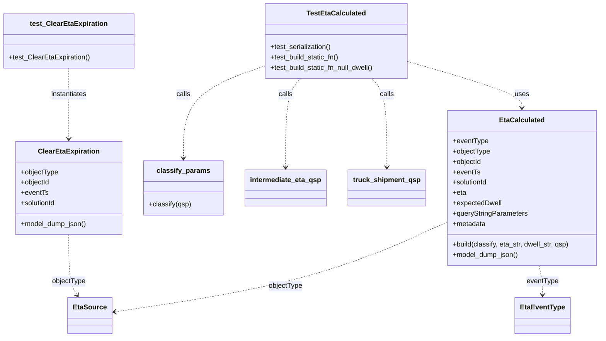
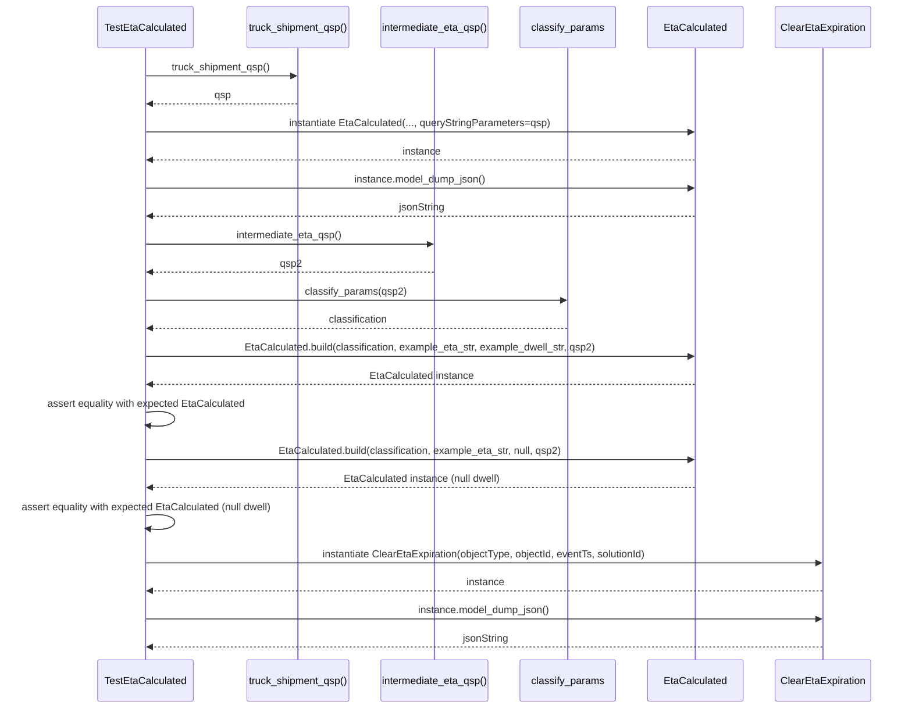

# Diagram: eta/eta_platform_common/eta_platform_common/models/eta_proxy/tests/test_payloads.py

> Auto-generated by Obscura crawlers

## Diagram 1

### SVG

<svg id="container" width="1374.87109375" xmlns="http://www.w3.org/2000/svg" class="classDiagram" height="782" viewBox="0 0 1374.87109375 782" role="graphics-document document" aria-roledescription="class"><g><defs><marker id="container_class-aggregationStart" class="marker aggregation class" refX="18" refY="7" markerWidth="190" markerHeight="240" orient="auto"><path d="M 18,7 L9,13 L1,7 L9,1 Z"></path></marker></defs><defs><marker id="container_class-aggregationEnd" class="marker aggregation class" refX="1" refY="7" markerWidth="20" markerHeight="28" orient="auto"><path d="M 18,7 L9,13 L1,7 L9,1 Z"></path></marker></defs><defs><marker id="container_class-extensionStart" class="marker extension class" refX="18" refY="7" markerWidth="190" markerHeight="240" orient="auto"><path d="M 1,7 L18,13 V 1 Z"></path></marker></defs><defs><marker id="container_class-extensionEnd" class="marker extension class" refX="1" refY="7" markerWidth="20" markerHeight="28" orient="auto"><path d="M 1,1 V 13 L18,7 Z"></path></marker></defs><defs><marker id="container_class-compositionStart" class="marker composition class" refX="18" refY="7" markerWidth="190" markerHeight="240" orient="auto"><path d="M 18,7 L9,13 L1,7 L9,1 Z"></path></marker></defs><defs><marker id="container_class-compositionEnd" class="marker composition class" refX="1" refY="7" markerWidth="20" markerHeight="28" orient="auto"><path d="M 18,7 L9,13 L1,7 L9,1 Z"></path></marker></defs><defs><marker id="container_class-dependencyStart" class="marker dependency class" refX="6" refY="7" markerWidth="190" markerHeight="240" orient="auto"><path d="M 5,7 L9,13 L1,7 L9,1 Z"></path></marker></defs><defs><marker id="container_class-dependencyEnd" class="marker dependency class" refX="13" refY="7" markerWidth="20" markerHeight="28" orient="auto"><path d="M 18,7 L9,13 L14,7 L9,1 Z"></path></marker></defs><defs><marker id="container_class-lollipopStart" class="marker lollipop class" refX="13" refY="7" markerWidth="190" markerHeight="240" orient="auto"><circle stroke="black" fill="transparent" cx="7" cy="7" r="6"></circle></marker></defs><defs><marker id="container_class-lollipopEnd" class="marker lollipop class" refX="1" refY="7" markerWidth="190" markerHeight="240" orient="auto"><circle stroke="black" fill="transparent" cx="7" cy="7" r="6"></circle></marker></defs><g class="root"><g class="clusters"></g><g class="edgePaths"><path d="M934.16,143.75L977.254,156.292C1020.348,168.833,1106.535,193.917,1149.629,211.625C1192.723,229.333,1192.723,239.667,1192.723,244.833L1192.723,250" id="id_TestEtaCalculated_EtaCalculated_1" class="edge-thickness-normal edge-pattern-dashed relation" style=";;;" data-edge="true" data-et="edge" data-id="id_TestEtaCalculated_EtaCalculated_1" data-points="W3sieCI6OTM0LjE2MDE1NjI1LCJ5IjoxNDMuNzUwMDk2MjY0OTIxMDd9LHsieCI6MTE5Mi43MjI2NTYyNSwieSI6MjE5fSx7IngiOjExOTIuNzIyNjU2MjUsInkiOjI1Nn1d" marker-end="url(#container_class-dependencyEnd)"></path><path d="M847.201,182L852.91,188.167C858.62,194.333,870.038,206.667,875.748,241C881.457,275.333,881.457,331.667,881.457,359.833L881.457,388" id="id_TestEtaCalculated_truck_shipment_qsp_2" class="edge-thickness-normal edge-pattern-dashed relation" style=";;;" data-edge="true" data-et="edge" data-id="id_TestEtaCalculated_truck_shipment_qsp_2" data-points="W3sieCI6ODQ3LjIwMDc5Mzg1MDgwNjUsInkiOjE4Mn0seyJ4Ijo4ODEuNDU3MDMxMjUsInkiOjIxOX0seyJ4Ijo4ODEuNDU3MDMxMjUsInkiOjM5NH1d" marker-end="url(#container_class-dependencyEnd)"></path><path d="M686.104,182L680.395,188.167C674.685,194.333,663.266,206.667,657.557,241C651.848,275.333,651.848,331.667,651.848,359.833L651.848,388" id="id_TestEtaCalculated_intermediate_eta_qsp_3" class="edge-thickness-normal edge-pattern-dashed relation" style=";;;" data-edge="true" data-et="edge" data-id="id_TestEtaCalculated_intermediate_eta_qsp_3" data-points="W3sieCI6Njg2LjEwMzg5MzY0OTE5MzUsInkiOjE4Mn0seyJ4Ijo2NTEuODQ3NjU2MjUsInkiOjIxOX0seyJ4Ijo2NTEuODQ3NjU2MjUsInkiOjM5NH1d" marker-end="url(#container_class-dependencyEnd)"></path><path d="M599.145,154.759L569.133,165.466C539.121,176.173,479.098,197.586,449.086,232.96C419.074,268.333,419.074,317.667,419.074,342.333L419.074,367" id="id_TestEtaCalculated_classify_params_4" class="edge-thickness-normal edge-pattern-dashed relation" style=";;;" data-edge="true" data-et="edge" data-id="id_TestEtaCalculated_classify_params_4" data-points="W3sieCI6NTk5LjE0NDUzMTI1LCJ5IjoxNTQuNzU5MTM2ODg0NjkzMn0seyJ4Ijo0MTkuMDc0MjE4NzUsInkiOjIxOX0seyJ4Ijo0MTkuMDc0MjE4NzUsInkiOjM3M31d" marker-end="url(#container_class-dependencyEnd)"></path><path d="M1232.804,616L1234.177,622.167C1235.55,628.333,1238.297,640.667,1239.67,652C1241.043,663.333,1241.043,673.667,1241.043,678.833L1241.043,684" id="id_EtaCalculated_EtaEventType_5" class="edge-thickness-normal edge-pattern-dashed relation" style=";;;" data-edge="true" data-et="edge" data-id="id_EtaCalculated_EtaEventType_5" data-points="W3sieCI6MTIzMi44MDQwMjE0NTczNzMyLCJ5Ijo2MTZ9LHsieCI6MTI0MS4wNDI5Njg3NSwieSI6NjUzfSx7IngiOjEyNDEuMDQyOTY4NzUsInkiOjY5MH1d" marker-end="url(#container_class-dependencyEnd)"></path><path d="M1018.574,516.632L969.487,539.36C920.399,562.088,822.224,607.544,695.799,642.06C569.374,676.577,414.7,700.154,337.363,711.942L260.025,723.73" id="id_EtaCalculated_EtaSource_6" class="edge-thickness-normal edge-pattern-dashed relation" style=";;;" data-edge="true" data-et="edge" data-id="id_EtaCalculated_EtaSource_6" data-points="W3sieCI6MTAxOC41NzQyMTg3NSwieSI6NTE2LjYzMjIxOTQwMjMxOTZ9LHsieCI6NzI0LjA0ODgyODEyNSwieSI6NjUzfSx7IngiOjI1NC4wOTM3NSwieSI6NzI0LjYzNDYwMTY4NzUzOH1d" marker-end="url(#container_class-dependencyEnd)"></path><path d="M156.172,544L156.172,562.167C156.172,580.333,156.172,616.667,159.512,640.153C162.852,663.64,169.532,674.279,172.872,679.599L176.213,684.919" id="id_ClearEtaExpiration_EtaSource_7" class="edge-thickness-normal edge-pattern-dashed relation" style=";;;" data-edge="true" data-et="edge" data-id="id_ClearEtaExpiration_EtaSource_7" data-points="W3sieCI6MTU2LjE3MTg3NSwieSI6NTQ0fSx7IngiOjE1Ni4xNzE4NzUsInkiOjY1M30seyJ4IjoxNzkuNDAyOTg2NTUwNjMyOSwieSI6NjkwfV0=" marker-end="url(#container_class-dependencyEnd)"></path><path d="M156.172,158L156.172,168.167C156.172,178.333,156.172,198.667,156.172,226C156.172,253.333,156.172,287.667,156.172,304.833L156.172,322" id="id_test_ClearEtaExpiration_ClearEtaExpiration_8" class="edge-thickness-normal edge-pattern-dashed relation" style=";;;" data-edge="true" data-et="edge" data-id="id_test_ClearEtaExpiration_ClearEtaExpiration_8" data-points="W3sieCI6MTU2LjE3MTg3NSwieSI6MTU4fSx7IngiOjE1Ni4xNzE4NzUsInkiOjIxOX0seyJ4IjoxNTYuMTcxODc1LCJ5IjozMjh9XQ==" marker-end="url(#container_class-dependencyEnd)"></path></g><g class="edgeLabels"><g class="edgeLabel" transform="translate(1192.72265625, 219)"><g class="label" data-id="id_TestEtaCalculated_EtaCalculated_1" transform="translate(-16.4921875, -12)"><foreignObject width="32.984375" height="24">

uses

</foreignObject></g></g><g class="edgeLabel" transform="translate(881.45703125, 219)"><g class="label" data-id="id_TestEtaCalculated_truck_shipment_qsp_2" transform="translate(-16.4453125, -12)"><foreignObject width="32.890625" height="24">

calls

</foreignObject></g></g><g class="edgeLabel" transform="translate(651.84765625, 219)"><g class="label" data-id="id_TestEtaCalculated_intermediate_eta_qsp_3" transform="translate(-16.4453125, -12)"><foreignObject width="32.890625" height="24">

calls

</foreignObject></g></g><g class="edgeLabel" transform="translate(419.07421875, 219)"><g class="label" data-id="id_TestEtaCalculated_classify_params_4" transform="translate(-16.4453125, -12)"><foreignObject width="32.890625" height="24">

calls

</foreignObject></g></g><g class="edgeLabel" transform="translate(1241.04296875, 653)"><g class="label" data-id="id_EtaCalculated_EtaEventType_5" transform="translate(-37.0390625, -12)"><foreignObject width="74.078125" height="24">

eventType

</foreignObject></g></g><g class="edgeLabel" transform="translate(724.048828125, 653)"><g class="label" data-id="id_EtaCalculated_EtaSource_6" transform="translate(-39.6015625, -12)"><foreignObject width="79.203125" height="24">

objectType

</foreignObject></g></g><g class="edgeLabel" transform="translate(156.171875, 653)"><g class="label" data-id="id_ClearEtaExpiration_EtaSource_7" transform="translate(-39.6015625, -12)"><foreignObject width="79.203125" height="24">

objectType

</foreignObject></g></g><g class="edgeLabel" transform="translate(156.171875, 219)"><g class="label" data-id="id_test_ClearEtaExpiration_ClearEtaExpiration_8" transform="translate(-42.9140625, -12)"><foreignObject width="85.828125" height="24">

instantiates

</foreignObject></g></g></g><g class="nodes"><g class="node default" id="classId-TestEtaCalculated-0" transform="translate(766.65234375, 95)"><g class="basic label-container"><path d="M-167.5078125 -87 L167.5078125 -87 L167.5078125 87 L-167.5078125 87" stroke="none" stroke-width="0" fill="#ECECFF" style=""></path><path d="M-167.5078125 -87 C-44.75424902732621 -87, 77.99931444534758 -87, 167.5078125 -87 M-167.5078125 -87 C-66.36684610188354 -87, 34.77412029623292 -87, 167.5078125 -87 M167.5078125 -87 C167.5078125 -35.15465598818439, 167.5078125 16.690688023631225, 167.5078125 87 M167.5078125 -87 C167.5078125 -27.88591651475518, 167.5078125 31.22816697048964, 167.5078125 87 M167.5078125 87 C82.1977656387879 87, -3.112281222424201 87, -167.5078125 87 M167.5078125 87 C39.20594070935189 87, -89.09593108129621 87, -167.5078125 87 M-167.5078125 87 C-167.5078125 38.625302529660146, -167.5078125 -9.749394940679707, -167.5078125 -87 M-167.5078125 87 C-167.5078125 22.93694048181547, -167.5078125 -41.12611903636906, -167.5078125 -87" stroke="#9370DB" stroke-width="1.3" fill="none" stroke-dasharray="0 0" style=""></path></g><g class="annotation-group text" transform="translate(0, -63)"></g><g class="label-group text" transform="translate(-65.0625, -63)"><g class="label" style="font-weight: bolder" transform="translate(0,-12)"><foreignObject width="130.125" height="24">

TestEtaCalculated

</foreignObject></g></g><g class="members-group text" transform="translate(-155.5078125, -15)"></g><g class="methods-group text" transform="translate(-155.5078125, 15)"><g class="label" style="" transform="translate(0,-12)"><foreignObject width="143.1875" height="24">

+test_serialization()

</foreignObject></g><g class="label" style="" transform="translate(0,12)"><foreignObject width="162.4375" height="24">

+test_build_static_fn()

</foreignObject></g><g class="label" style="" transform="translate(0,36)"><foreignObject width="245.953125" height="24">

+test_build_static_fn_null_dwell()

</foreignObject></g></g><g class="divider" style=""><path d="M-167.5078125 -39 C-35.38288187711254 -39, 96.74204874577492 -39, 167.5078125 -39 M-167.5078125 -39 C-92.2594286799677 -39, -17.011044859935396 -39, 167.5078125 -39" stroke="#9370DB" stroke-width="1.3" fill="none" stroke-dasharray="0 0" style=""></path></g><g class="divider" style=""><path d="M-167.5078125 -15 C-70.65639019509733 -15, 26.19503210980534 -15, 167.5078125 -15 M-167.5078125 -15 C-64.68087299310163 -15, 38.14606651379674 -15, 167.5078125 -15" stroke="#9370DB" stroke-width="1.3" fill="none" stroke-dasharray="0 0" style=""></path></g></g><g class="node default" id="classId-EtaCalculated-1" transform="translate(1192.72265625, 436)"><g class="basic label-container"><path d="M-174.1484375 -180 L174.1484375 -180 L174.1484375 180 L-174.1484375 180" stroke="none" stroke-width="0" fill="#ECECFF" style=""></path><path d="M-174.1484375 -180 C-70.53756493275756 -180, 33.07330763448488 -180, 174.1484375 -180 M-174.1484375 -180 C-83.604802183687 -180, 6.9388331326260015 -180, 174.1484375 -180 M174.1484375 -180 C174.1484375 -82.18818478686661, 174.1484375 15.623630426266772, 174.1484375 180 M174.1484375 -180 C174.1484375 -57.2853961236392, 174.1484375 65.4292077527216, 174.1484375 180 M174.1484375 180 C41.26202986942894 180, -91.62437776114211 180, -174.1484375 180 M174.1484375 180 C87.94166904685743 180, 1.7349005937148547 180, -174.1484375 180 M-174.1484375 180 C-174.1484375 58.26385432915323, -174.1484375 -63.472291341693534, -174.1484375 -180 M-174.1484375 180 C-174.1484375 40.75018337692404, -174.1484375 -98.49963324615192, -174.1484375 -180" stroke="#9370DB" stroke-width="1.3" fill="none" stroke-dasharray="0 0" style=""></path></g><g class="annotation-group text" transform="translate(0, -156)"></g><g class="label-group text" transform="translate(-49.8125, -156)"><g class="label" style="font-weight: bolder" transform="translate(0,-12)"><foreignObject width="99.625" height="24">

EtaCalculated

</foreignObject></g></g><g class="members-group text" transform="translate(-162.1484375, -108)"><g class="label" style="" transform="translate(0,-12)"><foreignObject width="82.0625" height="24">

+eventType

</foreignObject></g><g class="label" style="" transform="translate(0,12)"><foreignObject width="87.1875" height="24">

+objectType

</foreignObject></g><g class="label" style="" transform="translate(0,36)"><foreignObject width="67.75" height="24">

+objectId

</foreignObject></g><g class="label" style="" transform="translate(0,60)"><foreignObject width="63.265625" height="24">

+eventTs

</foreignObject></g><g class="label" style="" transform="translate(0,84)"><foreignObject width="82.109375" height="24">

+solutionId

</foreignObject></g><g class="label" style="" transform="translate(0,108)"><foreignObject width="31.078125" height="24">

+eta

</foreignObject></g><g class="label" style="" transform="translate(0,132)"><foreignObject width="113.890625" height="24">

+expectedDwell

</foreignObject></g><g class="label" style="" transform="translate(0,156)"><foreignObject width="174.0625" height="24">

+queryStringParameters

</foreignObject></g><g class="label" style="" transform="translate(0,180)"><foreignObject width="77.4375" height="24">

+metadata

</foreignObject></g></g><g class="methods-group text" transform="translate(-162.1484375, 132)"><g class="label" style="" transform="translate(0,-12)"><foreignObject width="274.484375" height="24">

+build(classify, eta_str, dwell_str, qsp)

</foreignObject></g><g class="label" style="" transform="translate(0,12)"><foreignObject width="153.734375" height="24">

+model_dump_json()

</foreignObject></g></g><g class="divider" style=""><path d="M-174.1484375 -132 C-101.2587759067196 -132, -28.369114313439212 -132, 174.1484375 -132 M-174.1484375 -132 C-47.23446625959082 -132, 79.67950498081836 -132, 174.1484375 -132" stroke="#9370DB" stroke-width="1.3" fill="none" stroke-dasharray="0 0" style=""></path></g><g class="divider" style=""><path d="M-174.1484375 108 C-98.67985606469317 108, -23.211274629386338 108, 174.1484375 108 M-174.1484375 108 C-74.55200599831792 108, 25.044425503364153 108, 174.1484375 108" stroke="#9370DB" stroke-width="1.3" fill="none" stroke-dasharray="0 0" style=""></path></g></g><g class="node default" id="classId-ClearEtaExpiration-2" transform="translate(156.171875, 436)"><g class="basic label-container"><path d="M-122.62109375 -108 L122.62109375 -108 L122.62109375 108 L-122.62109375 108" stroke="none" stroke-width="0" fill="#ECECFF" style=""></path><path d="M-122.62109375 -108 C-33.37442495492772 -108, 55.87224384014456 -108, 122.62109375 -108 M-122.62109375 -108 C-55.55002445544156 -108, 11.521044839116882 -108, 122.62109375 -108 M122.62109375 -108 C122.62109375 -29.302849409220045, 122.62109375 49.39430118155991, 122.62109375 108 M122.62109375 -108 C122.62109375 -29.398792104792378, 122.62109375 49.202415790415245, 122.62109375 108 M122.62109375 108 C54.52141195469332 108, -13.578269840613359 108, -122.62109375 108 M122.62109375 108 C34.55361457500635 108, -53.5138645999873 108, -122.62109375 108 M-122.62109375 108 C-122.62109375 27.310655989830124, -122.62109375 -53.37868802033975, -122.62109375 -108 M-122.62109375 108 C-122.62109375 49.196616714013935, -122.62109375 -9.60676657197213, -122.62109375 -108" stroke="#9370DB" stroke-width="1.3" fill="none" stroke-dasharray="0 0" style=""></path></g><g class="annotation-group text" transform="translate(0, -84)"></g><g class="label-group text" transform="translate(-67.5078125, -84)"><g class="label" style="font-weight: bolder" transform="translate(0,-12)"><foreignObject width="135.015625" height="24">

ClearEtaExpiration

</foreignObject></g></g><g class="members-group text" transform="translate(-110.62109375, -36)"><g class="label" style="" transform="translate(0,-12)"><foreignObject width="87.1875" height="24">

+objectType

</foreignObject></g><g class="label" style="" transform="translate(0,12)"><foreignObject width="67.75" height="24">

+objectId

</foreignObject></g><g class="label" style="" transform="translate(0,36)"><foreignObject width="63.265625" height="24">

+eventTs

</foreignObject></g><g class="label" style="" transform="translate(0,60)"><foreignObject width="82.109375" height="24">

+solutionId

</foreignObject></g></g><g class="methods-group text" transform="translate(-110.62109375, 84)"><g class="label" style="" transform="translate(0,-12)"><foreignObject width="153.734375" height="24">

+model_dump_json()

</foreignObject></g></g><g class="divider" style=""><path d="M-122.62109375 -60 C-31.32293709275092 -60, 59.97521956449816 -60, 122.62109375 -60 M-122.62109375 -60 C-26.977763422804742 -60, 68.66556690439052 -60, 122.62109375 -60" stroke="#9370DB" stroke-width="1.3" fill="none" stroke-dasharray="0 0" style=""></path></g><g class="divider" style=""><path d="M-122.62109375 60 C-70.81787382832277 60, -19.01465390664555 60, 122.62109375 60 M-122.62109375 60 C-30.073050069492425 60, 62.47499361101515 60, 122.62109375 60" stroke="#9370DB" stroke-width="1.3" fill="none" stroke-dasharray="0 0" style=""></path></g></g><g class="node default" id="classId-EtaEventType-3" transform="translate(1241.04296875, 732)"><g class="basic label-container"><path d="M-60.984375 -42 L60.984375 -42 L60.984375 42 L-60.984375 42" stroke="none" stroke-width="0" fill="#ECECFF" style=""></path><path d="M-60.984375 -42 C-15.582798809028958 -42, 29.818777381942084 -42, 60.984375 -42 M-60.984375 -42 C-20.434300373334757 -42, 20.115774253330486 -42, 60.984375 -42 M60.984375 -42 C60.984375 -24.82852470776334, 60.984375 -7.657049415526679, 60.984375 42 M60.984375 -42 C60.984375 -17.021315219301975, 60.984375 7.95736956139605, 60.984375 42 M60.984375 42 C15.114303399136105 42, -30.75576820172779 42, -60.984375 42 M60.984375 42 C31.189561570879274 42, 1.3947481417585479 42, -60.984375 42 M-60.984375 42 C-60.984375 12.450977320908606, -60.984375 -17.098045358182787, -60.984375 -42 M-60.984375 42 C-60.984375 13.747670299636585, -60.984375 -14.50465940072683, -60.984375 -42" stroke="#9370DB" stroke-width="1.3" fill="none" stroke-dasharray="0 0" style=""></path></g><g class="annotation-group text" transform="translate(0, -18)"></g><g class="label-group text" transform="translate(-48.984375, -18)"><g class="label" style="font-weight: bolder" transform="translate(0,-12)"><foreignObject width="97.96875" height="24">

EtaEventType

</foreignObject></g></g><g class="members-group text" transform="translate(-48.984375, 30)"></g><g class="methods-group text" transform="translate(-48.984375, 60)"></g><g class="divider" style=""><path d="M-60.984375 6 C-15.549060381479393 6, 29.886254237041214 6, 60.984375 6 M-60.984375 6 C-34.45012393496555 6, -7.915872869931107 6, 60.984375 6" stroke="#9370DB" stroke-width="1.3" fill="none" stroke-dasharray="0 0" style=""></path></g><g class="divider" style=""><path d="M-60.984375 24 C-22.068876903673114 24, 16.84662119265377 24, 60.984375 24 M-60.984375 24 C-16.242461714425637 24, 28.499451571148725 24, 60.984375 24" stroke="#9370DB" stroke-width="1.3" fill="none" stroke-dasharray="0 0" style=""></path></g></g><g class="node default" id="classId-EtaSource-4" transform="translate(205.7734375, 732)"><g class="basic label-container"><path d="M-48.3203125 -42 L48.3203125 -42 L48.3203125 42 L-48.3203125 42" stroke="none" stroke-width="0" fill="#ECECFF" style=""></path><path d="M-48.3203125 -42 C-15.869367334558866 -42, 16.581577830882267 -42, 48.3203125 -42 M-48.3203125 -42 C-17.702198120328333 -42, 12.915916259343334 -42, 48.3203125 -42 M48.3203125 -42 C48.3203125 -16.294708233892653, 48.3203125 9.410583532214694, 48.3203125 42 M48.3203125 -42 C48.3203125 -17.672702452022698, 48.3203125 6.654595095954605, 48.3203125 42 M48.3203125 42 C12.891096613279608 42, -22.538119273440785 42, -48.3203125 42 M48.3203125 42 C27.115582098410634 42, 5.910851696821268 42, -48.3203125 42 M-48.3203125 42 C-48.3203125 12.331228968143279, -48.3203125 -17.337542063713443, -48.3203125 -42 M-48.3203125 42 C-48.3203125 21.948744730878264, -48.3203125 1.8974894617565283, -48.3203125 -42" stroke="#9370DB" stroke-width="1.3" fill="none" stroke-dasharray="0 0" style=""></path></g><g class="annotation-group text" transform="translate(0, -18)"></g><g class="label-group text" transform="translate(-36.3203125, -18)"><g class="label" style="font-weight: bolder" transform="translate(0,-12)"><foreignObject width="72.640625" height="24">

EtaSource

</foreignObject></g></g><g class="members-group text" transform="translate(-36.3203125, 30)"></g><g class="methods-group text" transform="translate(-36.3203125, 60)"></g><g class="divider" style=""><path d="M-48.3203125 6 C-13.83766412728604 6, 20.64498424542792 6, 48.3203125 6 M-48.3203125 6 C-27.28549860857444 6, -6.250684717148879 6, 48.3203125 6" stroke="#9370DB" stroke-width="1.3" fill="none" stroke-dasharray="0 0" style=""></path></g><g class="divider" style=""><path d="M-48.3203125 24 C-21.885427558425025 24, 4.549457383149949 24, 48.3203125 24 M-48.3203125 24 C-24.547423315058534 24, -0.7745341301170683 24, 48.3203125 24" stroke="#9370DB" stroke-width="1.3" fill="none" stroke-dasharray="0 0" style=""></path></g></g><g class="node default" id="classId-classify_params-5" transform="translate(419.07421875, 436)"><g class="basic label-container"><path d="M-90.28125 -63 L90.28125 -63 L90.28125 63 L-90.28125 63" stroke="none" stroke-width="0" fill="#ECECFF" style=""></path><path d="M-90.28125 -63 C-24.310421667383537 -63, 41.66040666523293 -63, 90.28125 -63 M-90.28125 -63 C-22.489485699532622 -63, 45.302278600934756 -63, 90.28125 -63 M90.28125 -63 C90.28125 -25.436257426313716, 90.28125 12.127485147372568, 90.28125 63 M90.28125 -63 C90.28125 -27.61994322551425, 90.28125 7.760113548971503, 90.28125 63 M90.28125 63 C38.61333779586892 63, -13.054574408262155 63, -90.28125 63 M90.28125 63 C24.349532527482225 63, -41.58218494503555 63, -90.28125 63 M-90.28125 63 C-90.28125 19.793261064198518, -90.28125 -23.413477871602964, -90.28125 -63 M-90.28125 63 C-90.28125 28.93856743494341, -90.28125 -5.122865130113183, -90.28125 -63" stroke="#9370DB" stroke-width="1.3" fill="none" stroke-dasharray="0 0" style=""></path></g><g class="annotation-group text" transform="translate(0, -39)"></g><g class="label-group text" transform="translate(-58.328125, -39)"><g class="label" style="font-weight: bolder" transform="translate(0,-12)"><foreignObject width="116.65625" height="24">

classify_params

</foreignObject></g></g><g class="members-group text" transform="translate(-78.28125, 9)"></g><g class="methods-group text" transform="translate(-78.28125, 39)"><g class="label" style="" transform="translate(0,-12)"><foreignObject width="98.234375" height="24">

+classify(qsp)

</foreignObject></g></g><g class="divider" style=""><path d="M-90.28125 -15 C-31.057641296743157 -15, 28.165967406513687 -15, 90.28125 -15 M-90.28125 -15 C-31.778968742844206 -15, 26.723312514311587 -15, 90.28125 -15" stroke="#9370DB" stroke-width="1.3" fill="none" stroke-dasharray="0 0" style=""></path></g><g class="divider" style=""><path d="M-90.28125 9 C-43.40795731374233 9, 3.465335372515341 9, 90.28125 9 M-90.28125 9 C-34.81039760938597 9, 20.660454781228054 9, 90.28125 9" stroke="#9370DB" stroke-width="1.3" fill="none" stroke-dasharray="0 0" style=""></path></g></g><g class="node default" id="classId-intermediate_eta_qsp-6" transform="translate(651.84765625, 436)"><g class="basic label-container"><path d="M-92.4921875 -42 L92.4921875 -42 L92.4921875 42 L-92.4921875 42" stroke="none" stroke-width="0" fill="#ECECFF" style=""></path><path d="M-92.4921875 -42 C-23.71979555685151 -42, 45.05259638629698 -42, 92.4921875 -42 M-92.4921875 -42 C-37.03094838859915 -42, 18.4302907228017 -42, 92.4921875 -42 M92.4921875 -42 C92.4921875 -10.511363472943486, 92.4921875 20.977273054113027, 92.4921875 42 M92.4921875 -42 C92.4921875 -16.173766909102362, 92.4921875 9.652466181795276, 92.4921875 42 M92.4921875 42 C52.52284021918043 42, 12.553492938360861 42, -92.4921875 42 M92.4921875 42 C38.82607206519534 42, -14.840043369609319 42, -92.4921875 42 M-92.4921875 42 C-92.4921875 15.387879845898588, -92.4921875 -11.224240308202823, -92.4921875 -42 M-92.4921875 42 C-92.4921875 9.346665157035709, -92.4921875 -23.306669685928583, -92.4921875 -42" stroke="#9370DB" stroke-width="1.3" fill="none" stroke-dasharray="0 0" style=""></path></g><g class="annotation-group text" transform="translate(0, -18)"></g><g class="label-group text" transform="translate(-80.4921875, -18)"><g class="label" style="font-weight: bolder" transform="translate(0,-12)"><foreignObject width="160.984375" height="24">

intermediate_eta_qsp

</foreignObject></g></g><g class="members-group text" transform="translate(-80.4921875, 30)"></g><g class="methods-group text" transform="translate(-80.4921875, 60)"></g><g class="divider" style=""><path d="M-92.4921875 6 C-30.265650471993183 6, 31.960886556013634 6, 92.4921875 6 M-92.4921875 6 C-51.87881371709568 6, -11.265439934191363 6, 92.4921875 6" stroke="#9370DB" stroke-width="1.3" fill="none" stroke-dasharray="0 0" style=""></path></g><g class="divider" style=""><path d="M-92.4921875 24 C-48.67238978064252 24, -4.852592061285037 24, 92.4921875 24 M-92.4921875 24 C-37.946057153840876 24, 16.60007319231825 24, 92.4921875 24" stroke="#9370DB" stroke-width="1.3" fill="none" stroke-dasharray="0 0" style=""></path></g></g><g class="node default" id="classId-truck_shipment_qsp-7" transform="translate(881.45703125, 436)"><g class="basic label-container"><path d="M-87.1171875 -42 L87.1171875 -42 L87.1171875 42 L-87.1171875 42" stroke="none" stroke-width="0" fill="#ECECFF" style=""></path><path d="M-87.1171875 -42 C-47.812202772623934 -42, -8.507218045247868 -42, 87.1171875 -42 M-87.1171875 -42 C-34.766290878020236 -42, 17.58460574395953 -42, 87.1171875 -42 M87.1171875 -42 C87.1171875 -23.63021668286475, 87.1171875 -5.260433365729497, 87.1171875 42 M87.1171875 -42 C87.1171875 -17.416365736994308, 87.1171875 7.167268526011384, 87.1171875 42 M87.1171875 42 C22.54044899288735 42, -42.0362895142253 42, -87.1171875 42 M87.1171875 42 C25.039837081074978 42, -37.037513337850044 42, -87.1171875 42 M-87.1171875 42 C-87.1171875 11.607638180786477, -87.1171875 -18.784723638427046, -87.1171875 -42 M-87.1171875 42 C-87.1171875 8.431581235377706, -87.1171875 -25.136837529244588, -87.1171875 -42" stroke="#9370DB" stroke-width="1.3" fill="none" stroke-dasharray="0 0" style=""></path></g><g class="annotation-group text" transform="translate(0, -18)"></g><g class="label-group text" transform="translate(-75.1171875, -18)"><g class="label" style="font-weight: bolder" transform="translate(0,-12)"><foreignObject width="150.234375" height="24">

truck_shipment_qsp

</foreignObject></g></g><g class="members-group text" transform="translate(-75.1171875, 30)"></g><g class="methods-group text" transform="translate(-75.1171875, 60)"></g><g class="divider" style=""><path d="M-87.1171875 6 C-51.23776174402843 6, -15.358335988056865 6, 87.1171875 6 M-87.1171875 6 C-34.35721237379379 6, 18.402762752412414 6, 87.1171875 6" stroke="#9370DB" stroke-width="1.3" fill="none" stroke-dasharray="0 0" style=""></path></g><g class="divider" style=""><path d="M-87.1171875 24 C-28.53587665113851 24, 30.045434197722983 24, 87.1171875 24 M-87.1171875 24 C-47.31958873195818 24, -7.521989963916354 24, 87.1171875 24" stroke="#9370DB" stroke-width="1.3" fill="none" stroke-dasharray="0 0" style=""></path></g></g><g class="node default" id="classId-test_ClearEtaExpiration-8" transform="translate(156.171875, 95)"><g class="basic label-container"><path d="M-148.171875 -63 L148.171875 -63 L148.171875 63 L-148.171875 63" stroke="none" stroke-width="0" fill="#ECECFF" style=""></path><path d="M-148.171875 -63 C-83.2224418124325 -63, -18.273008624865014 -63, 148.171875 -63 M-148.171875 -63 C-87.87466611643984 -63, -27.577457232879695 -63, 148.171875 -63 M148.171875 -63 C148.171875 -16.99045163909311, 148.171875 29.01909672181378, 148.171875 63 M148.171875 -63 C148.171875 -31.324573880373237, 148.171875 0.35085223925352693, 148.171875 63 M148.171875 63 C30.425999542897372 63, -87.31987591420526 63, -148.171875 63 M148.171875 63 C30.966708685100386 63, -86.23845762979923 63, -148.171875 63 M-148.171875 63 C-148.171875 23.37645069384891, -148.171875 -16.24709861230218, -148.171875 -63 M-148.171875 63 C-148.171875 24.013811866732965, -148.171875 -14.97237626653407, -148.171875 -63" stroke="#9370DB" stroke-width="1.3" fill="none" stroke-dasharray="0 0" style=""></path></g><g class="annotation-group text" transform="translate(0, -39)"></g><g class="label-group text" transform="translate(-85.65625, -39)"><g class="label" style="font-weight: bolder" transform="translate(0,-12)"><foreignObject width="171.3125" height="24">

test_ClearEtaExpiration

</foreignObject></g></g><g class="members-group text" transform="translate(-136.171875, 9)"></g><g class="methods-group text" transform="translate(-136.171875, 39)"><g class="label" style="" transform="translate(0,-12)"><foreignObject width="186.6875" height="24">

+test_ClearEtaExpiration()

</foreignObject></g></g><g class="divider" style=""><path d="M-148.171875 -15 C-37.63916788595115 -15, 72.8935392280977 -15, 148.171875 -15 M-148.171875 -15 C-31.558015887390198 -15, 85.0558432252196 -15, 148.171875 -15" stroke="#9370DB" stroke-width="1.3" fill="none" stroke-dasharray="0 0" style=""></path></g><g class="divider" style=""><path d="M-148.171875 9 C-80.85802050657541 9, -13.544166013150829 9, 148.171875 9 M-148.171875 9 C-82.35902794701671 9, -16.546180894033427 9, 148.171875 9" stroke="#9370DB" stroke-width="1.3" fill="none" stroke-dasharray="0 0" style=""></path></g></g></g></g></g></svg>

## Diagram 2

> SVG rendering failed for this diagram.
