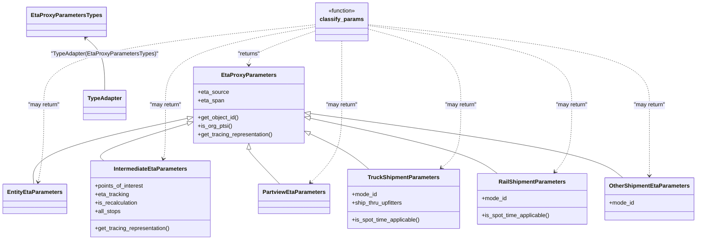

# Diagram: eta/eta_platform_common/eta_platform_common/models/eta_proxy/tests/test_requests.py


> Auto-generated by Obscura crawlers

## Diagram 1



> SVG rendering failed for this diagram.

## Diagram 2

```mermaid
flowchart TD
    QSP[Query Parameters (qsp)]
    classify[classify_params(qsp)]
    QSP --> classify
    classify --> |"eta-source == 'SHIPMENT' and mode-id == 1"| Truck[TruckShipmentParameters]
    classify --> |"eta-source == 'SHIPMENT' and mode-id == 2"| Rail[RailShipmentParameters]
    classify --> |"eta-source == 'SHIPMENT' and mode-id ∉ {1,2}"| Other[OtherShipmentEtaParameters]
    classify --> |"eta-source == 'ENTITY' and entity_eta_type == 'IntermediateETA'"| Intermediate[IntermediateEtaParameters]
    classify --> |"eta-source == 'ENTITY' and entity_eta_type != 'IntermediateETA'"| Entity[EntityEtaParameters]
    classify --> |"eta-source == 'PARTVIEW'"| Partview[PartviewEtaParameters]
    Truck --> TruckProps[/"eta_source='SHIPMENT'\nmode_id=1\nget_object_id()\nis_org_ptsi()"/]
    Rail --> RailProps[/"eta_source='SHIPMENT'\nmode_id=2\nget_object_id()"/]
    Other --> OtherProps[/"eta_source='SHIPMENT'\nmode_id=other\nget_object_id()"/]
    Intermediate --> IntProps[/"eta_source='ENTITY'\npoints_of_interest\neta_tracking\nall_stops\nget_tracing_representation()"/]
    Entity --> EntityProps[/"eta_source='ENTITY'\nis_org_ptsi()"/]
    Partview --> PartviewProps[/"eta_source='PARTVIEW'\neta_span='SPAN_PTSI_DEST' or 'SPAN_ORG_PTSI'"/]
    classify --> ErrorCheck{"validation rules"}
    ErrorCheck --> |"loc ids match / loc codes match\ninvalid eta-source\nnextLocations > 50"| ValidationError[/"raises ValidationError"/]
    classify --> TypeAdapterNode[/"TypeAdapter(EtaProxyParametersTypes)\n.validate_python(qsp)"/]
    TypeAdapterNode --> classify
```

> SVG rendering failed for this diagram.
