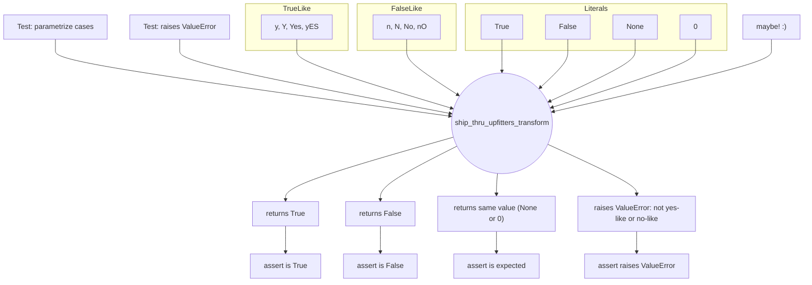

# Diagram: eta/eta_platform_common/eta_platform_common/models/eta_proxy/tests/test_transformations.py

> Auto-generated by Obscura crawlers

## Mermaid

```mermaid
flowchart TD
  A[Test: parametrize cases] --> S((ship_thru_upfitters_transform))
  B[Test: raises ValueError] --> S
  subgraph TrueLike
    T1["y, Y, Yes, yES"]
  end
  subgraph FalseLike
    F1["n, N, No, nO"]
  end
  subgraph Literals
    L1[True]
    L2[False]
    L3[None]
    L4[0]
  end
  T1 --> S
  F1 --> S
  L1 --> S
  L2 --> S
  L3 --> S
  L4 --> S
  S --> RTrue["returns True"] --> AssertTrue[assert is True]
  S --> RFalse["returns False"] --> AssertFalse[assert is False]
  S --> ROther["returns same value (None or 0)"] --> AssertOther[assert is expected]
  Bad["maybe! :)"] --> S
  S --> EX["raises ValueError: not yes-like or no-like"] --> AssertEx[assert raises ValueError]
```

> SVG rendering failed for this diagram.
